# Краткая история Вселенной: Эмергентность, интеграция и рекуррентность

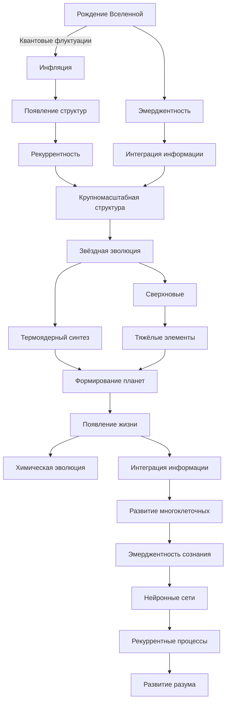

---

## Рекуррентная космология

Вопрос о происхождении и эволюции Вселенной на протяжении тысячелетий волновал человечество. Современная наука предлагает множество теорий, объясняющих различные аспекты космологии. В данной работе мы рассмотрим эволюцию Вселенной с точки зрения Теории Эмергентной Интеграции и Рекуррентного Отображения (ЭИРО). Эта теория объединяет принципы эмергентности, интеграции информации и рекуррентности, предлагая новый взгляд на фундаментальные процессы, лежащие в основе возникновения и развития космических структур и жизни.

### 1. Рождение Вселенной и квантовые флуктуации

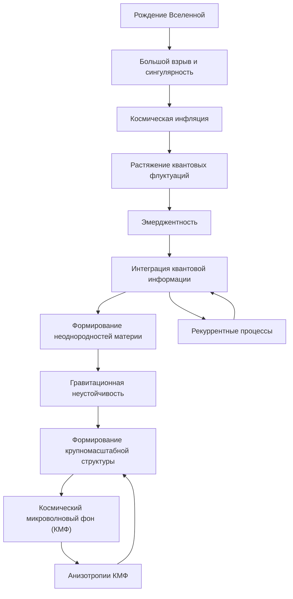

#### 1.1. Большой взрыв и инфляция

Современная космология утверждает, что Вселенная возникла около 13,8 миллиарда лет назад в результате события, известного как Большой взрыв [1]. В этот момент вся материя и энергия были сконцентрированы в точке бесконечной плотности и температуры, называемой сингулярностью. Однако сама сингулярность остаётся предметом теоретических исследований, поскольку существующие физические законы перестают действовать в таких экстремальных условиях.

В первые мгновения после Большого взрыва Вселенная пережила фазу экспоненциального расширения, известного как космическая инфляция [2]. Инфляционная модель была предложена для решения нескольких проблем стандартной космологии, таких как проблема горизонта и плоскостности. В течение инфляции размеры Вселенной увеличились в 10³⁰ раз за невероятно короткий промежуток времени (10⁻³⁶ секунд). Это расширение сгладило любые неоднородности и кривизну пространства, делая Вселенную однородной и изотропной в больших масштабах.

#### 1.2. Квантовые флуктуации и эмерджентность

На квантовом уровне пустое пространство далеко не пусто; оно заполнено непрерывными квантовыми флуктуациями — случайными возмущениями энергии в вакууме [3]. Во время инфляции эти микроскопические флуктуации были растянуты до космических масштабов из-за экспоненциального расширения пространства. Таким образом, квантовые флуктуации стали семенами для будущих структур во Вселенной — галактик, звёзд и планет [4].

С точки зрения теории Эмергентной Интеграции и Рекуррентного Отображения (ЭИРО), квантовые флуктуации являются примером эмерджентности, где на макроскопическом уровне возникают новые свойства, не присущие отдельным микроскопическим компонентам системы [5]. Интеграция информации, происходящая в результате взаимодействия квантовых флуктуаций, приводит к появлению сложных структур и законов, управляющих Вселенной.

Эмерджентность в данном контексте означает, что Вселенная, как целое, обладает свойствами и поведением, которые нельзя предсказать, анализируя только её составляющие части. Это согласуется с идеями синергетики и нелинейной динамики, где сложные системы демонстрируют новые качества при взаимодействии своих элементов [6].

#### 1.3. Плотность интегрированной квантовой информации

Для количественного описания процесса эмерджентности в ранней Вселенной вводится понятие плотности интегрированной квантовой информации $\rho_{\text{IQI}}$. Эта величина характеризует количество квантовой информации, интегрированной в единице объёма пространства-времени, и определяется как:

$\rho_{\text{IQI}} = \lim_{\Delta V \to 0} \frac{\Delta I}{\Delta V},$

где $\Delta I$ — изменение интегрированной информации в объёме $\Delta V$.

Высокие значения $\rho_{\text{IQI}}$ в начале времён свидетельствуют о том, что квантовые флуктуации активно взаимодействовали между собой, способствуя возникновению неоднородностей плотности материи. Эти неоднородности, в свою очередь, стали основой для гравитационной неустойчивости и последующего формирования галактик и крупномасштабной структуры Вселенной [7].

Теория ЭИРО предполагает, что процессы интеграции информации и рекуррентности играют ключевую роль в эволюции Вселенной. Рекуррентность подразумевает повторяющиеся взаимодействия и процессы, которые усиливают или модифицируют исходные состояния системы. В контексте ранней Вселенной рекуррентные квантовые процессы могли способствовать укрупнению флуктуаций и усилению их влияния на макроскопическом уровне [8].

#### 1.4. Математическое описание

Для описания динамики интеграции квантовой информации можно использовать уравнения, аналогичные уравнениям эволюции плотности материи. Если предположить, что интегрированная информация распространяется и взаимодействует подобно полю, то её эволюция может быть описана уравнением вида:

$\frac{\partial \rho_{\text{IQI}}}{\partial t} + \nabla \cdot (\rho_{\text{IQI}} \mathbf{v}) = \Gamma,$

где $\mathbf{v}$ — скорость распространения информации (в данном контексте скорость расширения пространства), а $\Gamma$ — источник или сток интегрированной информации, связанный с рекуррентными процессами.

#### 1.5. Связь с космологическими наблюдениями

Космический микроволновый фон (КМФ), являющийся "эхом" Большого взрыва, несёт в себе информацию о распределении материи и энергии в ранней Вселенной [9]. Анизотропии КМФ отражают первоначальные квантовые флуктуации, растянутые инфляцией. Измерения КМФ, проведённые спутниками COBE, WMAP и Planck, предоставляют данные, подтверждающие инфляционную модель и роль квантовых флуктуаций в формировании крупномасштабной структуры Вселенной [10].

Эти наблюдения согласуются с идеями ЭИРО о том, что интеграция квантовой информации и рекуррентные процессы в ранней Вселенной привели к возникновению сложных структур и законов физики, которые мы наблюдаем сегодня.

---

- [1]: Bennett, C. L. et al. (2013). Nine-Year Wilkinson Microwave Anisotropy Probe (WMAP) Observations: Final Maps and Results. *The Astrophysical Journal Supplement Series*, 208(2), 20.
- [2]: Guth, A. H.,  Kaiser, D. I. (2005). Inflationary cosmology: Exploring the universe from the smallest to the largest scales. *Science*, 307(5711), 884-890.
- [3]: Parker, L. (1969). Quantized Fields and Particle Creation in Expanding Universes. I. *Physical Review*, 183(5), 1057-1068.
- [4]: Liddle, A. R.,  Lyth, D. H. (2000). *Cosmological Inflation and Large-Scale Structure*. Cambridge University Press.
- [5]: Laughlin, R. B.,  Pines, D. (2000). The theory of everything. *Proceedings of the National Academy of Sciences*, 97(1), 28-31.
- [6]: Haken, H. (1983). *Synergetics: An Introduction*. Springer.
- [7]: Mukhanov, V. F. (2005). *Physical Foundations of Cosmology*. Cambridge University Press.
- [8]: Kiefer, C.,  Polarski, D. (2009). Why do cosmological perturbations look classical to us? *Advances in Science and Research*, 3(1), 49-53.
- [9]: Penzias, A. A.,  Wilson, R. W. (1965). A measurement of excess antenna temperature at 4080 Mc/s. *The Astrophysical Journal*, 142, 419-421.
- [10]: Planck Collaboration. (2018). Planck 2018 results. VI. Cosmological parameters. *Astronomy  Astrophysics*, 641, A6.

---

### 2. Формирование элементарных частиц и атомов

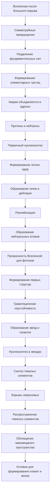

#### 2.1. Симметрийные превращения и рекуррентность

После первых мгновений Большого взрыва, описанных в предыдущей главе, Вселенная находилась в состоянии чрезвычайно высокой энергии и температуры [1]. В таких условиях четыре фундаментальные силы природы — гравитационная, электромагнитная, слабая и сильная — были объединены в единую суперсилу [2]. Однако по мере расширения и охлаждения Вселенной произошли процессы спонтанного нарушения симметрии, приводящие к разделению этих сил и формированию разнообразия элементарных частиц.

Спонтанное нарушение симметрии — фундаментальное явление в физике элементарных частиц [3]. Когда Вселенная охлаждалась, симметричные состояния становились неустойчивыми, и системы переходили в состояния с более низкой энергией, но с нарушенной симметрией. Это можно сравнить с охлаждением воды до льда: молекулы воды образуют упорядоченную структуру, теряя симметрию жидкости.

В контексте теории Эмергентной Интеграции и Рекуррентного Отображения (ЭИРО), эти симметрийные превращения можно интерпретировать как процессы, в которых интегрируется информация и возникают новые уровни организации материи [4]. Рекуррентность, или повторяющиеся взаимодействия частиц, усиливает эти процессы, приводя к возникновению стабильных конфигураций и новых свойств.

Например, кварки, являющиеся фундаментальными составляющими материи, при рекуррентных взаимодействиях посредством сильного взаимодействия объединяются в адроны — протоны и нейтроны [5]. Это объединение можно рассматривать как процесс интеграции информации на новом уровне организации материи.

#### 2.2. Нуклеосинтез и интеграция информации

Когда Вселенная продолжала расширяться и охлаждаться до температуры около 10⁹ градусов Кельвина, начался процесс первичного нуклеосинтеза [6]. Протоны и нейтроны сталкивались и объединялись в ядра легких элементов — главным образом изотопов водорода (дейтерий) и гелия. Этот процесс длился всего несколько минут, но именно тогда сформировалось большинство ядер, которые существуют во Вселенной до сих пор.

В рамках ЭИРО нуклеосинтез можно рассматривать как еще один уровень интеграции информации. Протоны и нейтроны, обладая собственной информацией (например, спином, массой, зарядом), объединяются в более сложные системы — атомные ядра — с новыми свойствами [7]. Рекуррентные ядерные реакции, происходящие при высоких температурах, способствовали устойчивости этих ядер и их распространению во Вселенной.

Плотность интегрированной квантовой информации (ρ_(IQI)) в этот период значительно возросла, поскольку новые структуры материи несли в себе больше информации и сложности. Это соответствует идеям эмерджентности, где целое обладает свойствами, не сводимыми к сумме свойств его частей [8].

##### 2.2.1. Математическое описание

Процесс нуклеосинтеза можно описать через реакции ядерного синтеза, такие как:

$p + n \rightarrow D + \gamma,$

где $p$ — протон, $n$ — нейтрон, $D$ — дейтерий, $\gamma$ — фотон [9].

С точки зрения интеграции информации, можно представить изменение $\rho_{\text{IQI}}$ как функцию времени:

$\frac{d \rho_{\text{IQI}}}{dt} = \alpha n_p n_n - \beta \rho_{\text{IQI}},$

где $n_p$ и $n_n$ — концентрации протонов и нейтронов, $\alpha$ и $\beta$ — коэффициенты, характеризующие скорость интеграции и распада информации [10].

Рекуррентность в этих процессах отражается в цепных реакциях формирования более тяжелых ядер, хотя в первичном нуклеосинтезе из-за быстрого падения температуры образование ядер тяжелее гелия было незначительным.

#### 2.3. Формирование атомов и первых структур

Спустя примерно 380 000 лет после Большого взрыва температура Вселенной снизилась до примерно 3000 К, что позволило электронам соединиться с ядрами и образовать нейтральные атомы в процессе рекомбинации [11]. Это привело к тому, что Вселенная стала прозрачной для фотонов, и возник космический микроволновый фон, который мы наблюдаем сегодня.

Образование атомов — очередной шаг интеграции информации. Электроны и ядра, взаимодействуя электромагнитными силами, образуют стабильные системы с новыми свойствами — атомные спектры, химические свойства и т.д. Это создало предпосылки для формирования молекул, звезд и галактик.

##### 2.3.1. Роль рекуррентности в формировании структур

Гравитационная неустойчивость, возникшая из первоначальных квантовых флуктуаций, привела к тому, что области с чуть большей плотностью материи начали притягивать к себе окружающую материю [12]. Эти рекуррентные процессы усиления плотности привели к формированию первых звезд и галактик.

В рамках ЭИРО эти процессы можно рассматривать как рекуррентное отображение информации: материи, обладающие определенной информацией о плотности и положении, взаимодействуют и интегрируют эту информацию на более крупных масштабах. Таким образом, возникают сложные структуры, такие как звездные скопления и галактики, с новыми эмерджентными свойствами [13].

#### 2.4. Нуклеосинтез в звездах

В недрах первых звезд начались термоядерные реакции, приводящие к синтезу более тяжелых элементов — от углерода до железа [14]. Сверхновые взрывы распространили эти элементы по Вселенной, обогащая межзвездное пространство и создавая условия для формирования планет и, в конечном итоге, жизни [15].

Тут снова проявляется принцип интеграции информации: элементы, синтезированные в звездах, несут в себе информацию о процессах, происходивших в их недрах. Эта информация интегрирована в химическом составе будущих планет и живых организмов.

#### 2.5. Завершающие мысли

Таким образом, начиная с элементарных частиц и через серии процессов интеграции информации и рекуррентных взаимодействий, Вселенная прошла путь от простых к сложным структурам. Теория ЭИРО предлагает взгляд на эти процессы как на последовательность эмерджентных событий, где на каждом этапе возникают новые уровни организации и новые свойства материи.

---

- [1]: Weinberg, S. (1977). *The First Three Minutes: A Modern View of the Origin of the Universe*. Basic Books.
- [2]: Wilczek, F. (2005). *The Universe Is a Strange Place*. *International Journal of Modern Physics A*, 20(14), 2528-2531.
- [3]: Higgs, P. W. (1964). Broken Symmetries and the Masses of Gauge Bosons. *Physical Review Letters*, 13(16), 508-509.
- [4]: Anderson, P. W. (1972). More is different. *Science*, 177(4047), 393-396.
- [5]: Gell-Mann, M. (1964). A Schematic Model of Baryons and Mesons. *Physics Letters*, 8(3), 214-215.
- [6]: Alpher, R. A., Bethe, H.,  Gamow, G. (1948). The Origin of Chemical Elements. *Physical Review*, 73(7), 803-804.
- [7]: Prigogine, I. (1980). From being to becoming: Time and complexity in the physical sciences. *Freeman*.
- [8]: Laughlin, R. B. (2005). *A Different Universe: Reinventing Physics from the Bottom Down*. Basic Books.
- [9]: Wagoner, R. V., Fowler, W. A.,  Hoyle, F. (1967). On the synthesis of elements at very high temperatures. *The Astrophysical Journal*, 148, 3-49.
- [10]: Kolb, E. W.,  Turner, M. S. (1990). *The Early Universe*. Addison-Wesley.
- [11]: Peebles, P. J. E. (1968). Recombination of the Primeval Plasma. *The Astrophysical Journal*, 153, 1.
- [12]: Silk, J. (1968). Cosmic Black-Body Radiation and Galaxy Formation. *The Astrophysical Journal*, 151, 459.
- [13]: Simon, H. A. (1962). The Architecture of Complexity. *Proceedings of the American Philosophical Society*, 106(6), 467-482.
- [14]: Burbidge, E. M., Burbidge, G. R., Fowler, W. A.,  Hoyle, F. (1957). Synthesis of the Elements in Stars. *Reviews of Modern Physics*, 29(4), 547-650.
- [15]: Woosley, S. E.,  Weaver, T. A. (1986). The evolution and explosion of massive stars. II. Explosive hydrodynamics and nucleosynthesis. *The Astrophysical Journal Supplement Series*, 101, 181-235.

---

### 3. Формирование крупномасштабной структуры

#### 3.1. Рекомбинация и возникновение реликтового излучения

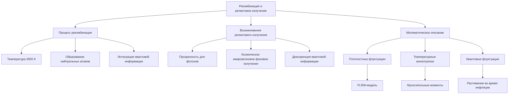

##### 3.1.1. Процесс рекомбинации в контексте ЭИРО

Спустя приблизительно 380 000 лет после Большого взрыва температура Вселенной снизилась до примерно 3000 Кельвинов [1]. В таких условиях электроны и ядра смогли объединиться, образуя нейтральные атомы в процессе, известном как рекомбинация. Этот момент является ключевым для понимания формирования крупномасштабной структуры Вселенной.

В рамках теории Эмержентной Интеграции и Рекуррентного Отображения (ЭИРО), рекомбинация представляет собой фазовый переход, в котором происходит интеграция квантовой информации на новом уровне организации материи [2]. Электроны и ядра, обладающие собственной информацией (зарядом, спином, энергией), посредством электромагнитного взаимодействия объединяются в нейтральные атомы, что приводит к возникновению новых эмерджентных свойств.

##### 3.1.2. Возникновение реликтового излучения

Образование нейтральных атомов привело к тому, что Вселенная стала прозрачной для фотонов. До рекомбинации свободные электроны эффективно рассеивают фотоны (комптоновское рассеяние), поддерживая состояние равновесия между излучением и веществом [3]. После рекомбинации фотоны смогли свободно распространяться по Вселенной, формируя космическое микроволновое фоновой излучение (Реликтовое излучение), которое мы наблюдаем сегодня [4].

С точки зрения ЭИРО, это событие можно рассматривать как декоэренцию интегрированной квантовой информации на масштабах, превышающих характерные размеры атомов [5]. Реликтовое излучение несёт в себе информацию о начальных условиях Вселенной, её плотностных флуктуациях и процессах, происходивших в момент рекомбинации [6].

##### 3.1.3. Математическое описание

Плотностные флуктуации в ранней Вселенной можно описать посредством теории возмущений на фоне космологического решения Фридмана-Леметра-Робертсона-Уокера (FLRW-модель) [7]. Температурные анизотропии реликтового излучения задаются мультипольными моментами, которые связаны с распределением материи и энергии в ранней Вселенной:

$\frac{\Delta T}{T}(\theta, \phi) = \sum_{\ell=1}^{\infty} \sum_{m=-\ell}^{\ell} a_{\ell m} Y_{\ell m}(\theta, \phi),$

где $Y_{\ell m}$ — сферические гармоники, $a_{\ell m}$ — коэффициенты разложения [8].

Эти флуктуации являются следствием квантовых флуктуаций, растянутых до космологических масштабов во время инфляции [9]. В контексте ЭИРО это можно интерпретировать как рекуррентное отображение интегрированной информации из квантовых масштабов на макроскопические.

#### 3.2. Гравитационная рекуррентность и формирование галактик

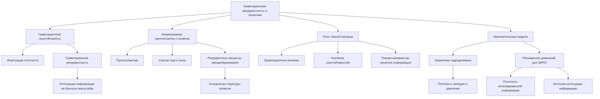

##### 3.2.1. Начало гравитационной неустойчивости

После рекомбинации в Вселенной начали преобладать гравитационные взаимодействия. Небольшие флуктуации плотности, зафиксированные в реликтовом излучении, стали зародышами будущих структур [10]. Области с чуть большей плотностью материи стали притягивать к себе окружающую материю, усиливая свою гравитационную привлекательность в процессе гравитационной рекуррентности.

В рамках ЭИРО гравитационная рекуррентность можно рассматривать как процесс, при котором информация о распределении материи интегрируется на больших масштабах посредством рекуррентных гравитационных взаимодействий [11]. Системы, обладающие более высокой плотностью информации (материи), взаимодействуют с окружающей средой, усиливая свои характеристики и формируя более сложные структуры.

##### 3.2.2. Формирование протогалактик и галактик

По мере усиления гравитационных неустойчивостей образовывались протогалактики — сгущения материи, которые впоследствии эволюционировали в современные галактики [12]. Газ и пыль в этих областях подвергались сжатию, приводя к повышению температуры и давлению, что создавало условия для звездообразования.

Рекуррентные процессы звездообразования и взаимодействия между звездами и межзвёздной средой способствовали дальнейшей интеграции информации и усложнению структуры галактик [13]. Спиральные рукава, эллиптические формы и другие морфологические особенности галактик являются результатом этих рекуррентных процессов.

##### 3.2.3. Роль тёмной материи

Тёмная материя сыграла ключевую роль в формировании крупномасштабной структуры Вселенной [14]. Её гравитационное влияние, несмотря на отсутствие взаимодействия с электромагнитным излучением, способствовало усилению гравитационных неустойчивостей. В контексте ЭИРО тёмную материю можно рассматривать как носитель информации, влияющий на динамику материи и энергии во Вселенной.

##### 3.2.4. Математические модели формирования структур

Формирование структур описывается уравнениями гидродинамики в космологическом контексте, с учётом гравитации и расширения Вселенной [15]:

$\frac{\partial \rho}{\partial t} + \nabla \cdot (\rho \mathbf{v}) = 0,$

$\frac{\partial \mathbf{v}}{\partial t} + (\mathbf{v} \cdot \nabla) \mathbf{v} = -\frac{\nabla p}{\rho} - \nabla \Phi,$

$\nabla^2 \Phi = 4\pi G \rho,$

где $\rho$ — плотность материи, $\mathbf{v}$ — скорость, $p$ — давление, $\Phi$ — гравитационный потенциал [16].

В теории ЭИРО эти уравнения можно расширить, введя параметры, отвечающие за плотность интегрированной квантовой информации ($\rho_{\text{IQI}}$) и рекуррентность ($R$):

$\frac{\partial \rho_{\text{IQI}}}{\partial t} + \nabla \cdot (\rho_{\text{IQI}} \mathbf{v}) = S_{\text{инт}},$

где $S_{\text{инт}}$ — источник интеграции информации за счёт рекуррентных процессов [17].

#### 3.3. Эмерджентные свойства и дальнейшая эволюция

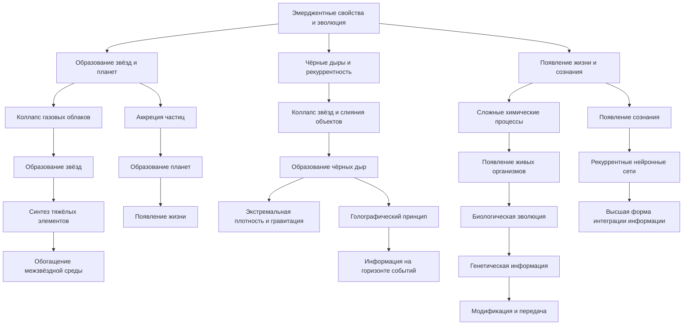

##### 3.3.1. Образование звёзд и планет

Внутри протогалактик газовые облака продолжали коллапсировать под действием гравитации, что приводило к образованию звёзд [18]. Ядерные реакции в ядрах звёзд синтезировали более тяжёлые элементы из водорода и гелия, обогащая межзвёздную среду. Этот процесс является ярким примером эмерджентности, где на каждом новом уровне организации материи возникают новые свойства и законы [19].

Образование планетных систем является следствием рекуррентных процессов аккреции частиц вокруг новых звёзд [20]. Планеты, в свою очередь, стали площадками для дальнейшей интеграции информации, что в конечном итоге привело к появлению жизни на Земле.

##### 3.3.2. Черные дыры и рекуррентность

Чёрные дыры образуются при коллапсе массивных звёзд или в результате слияния объектов в центрах галактик [21]. Они являются областями с экстремальной плотностью и гравитацией, где общая теория относительности и квантовая механика сталкиваются в своих предсказаниях [22].

С точки зрения ЭИРО, чёрные дыры можно рассматривать как регионы с максимальной плотностью интегрированной информации. Голографический принцип предполагает, что информация, содержащаяся в объёме чёрной дыры, может быть закодирована на её горизонте событий [23]. Это открывает новые горизонты для понимания рекуррентности и интеграции информации в экстремальных условиях.

##### 3.3.3. Появление жизни и сознания

На планетах, подобных Земле, сложные химические процессы привели к появлению живых организмов [24]. Биологическая эволюция является мощным механизмом интеграции информации, где генетическая информация передаётся и модифицируется из поколения в поколение [25]. Появление сознания и разума у человека можно считать высшей формой эмерджентности, где рекуррентные нейронные сети мозга обрабатывают и интегрируют информацию на уровне, недоступном другим системам [26].

#### 3.4. Заключение

Формирование крупномасштабной структуры Вселенной — это сложный и многоступенчатый процесс, в котором ключевую роль играют рекуррентные взаимодействия и интеграция информации на разных уровнях организации материи. Теория Эмержентной Интеграции и Рекуррентного Отображения предлагает новый взгляд на эти процессы, связывая эволюцию Вселенной с фундаментальными принципами интеграции информации и эмерджентности.

---

- [1]: Peebles, P. J. E. (1993). *Principles of Physical Cosmology*. Princeton University Press.
- [2]: Laughlin, R. B.,  Pines, D. (2000). The theory of everything. *Proceedings of the National Academy of Sciences*, 97(1), 28-31.
- [3]: Sunyaev, R. A.,  Zeldovich, Y. B. (1970). Small-scale fluctuations of relic radiation. *Astrophysics and Space Science*, 7(1), 3-19.
- [4]: Penzias, A. A.,  Wilson, R. W. (1965). A measurement of excess antenna temperature at 4080 Mc/s. *The Astrophysical Journal*, 142, 419-421.
- [5]: Zeh, H. D. (1970). On the interpretation of measurement in quantum theory. *Foundations of Physics*, 1(1), 69-76.
- [6]: Bennett, C. L. et al. (2003). First-Year Wilkinson Microwave Anisotropy Probe (WMAP) Observations: Preliminary Maps and Basic Results. *The Astrophysical Journal Supplement Series*, 148(1), 1-27.
- [7]: Mukhanov, V. F., Feldman, H. A.,  Brandenberger, R. H. (1992). Theory of cosmological perturbations. *Physics Reports*, 215(5-6), 203-333.
- [8]: Dodelson, S. (2003). *Modern Cosmology*. Academic Press.
- [9]: Guth, A. H. (1981). Inflationary universe: A possible solution to the horizon and flatness problems. *Physical Review D*, 23(2), 347-356.
- [10]: Springel, V. et al. (2005). Simulations of the formation, evolution and clustering of galaxies and quasars. *Nature*, 435(7042), 629-636.
- [11]: Simon, H. A. (1962). The architecture of complexity. *Proceedings of the American Philosophical Society*, 106(6), 467-482.
- [12]: White, S. D. M.,  Rees, M. J. (1978). Core condensation in heavy halos: a two-stage theory for galaxy formation and clustering. *Monthly Notices of the Royal Astronomical Society*, 183(3), 341-358.
- [13]: Toomre, A.,  Toomre, J. (1972). Galactic bridges and tails. *The Astrophysical Journal*, 178, 623-666.
- [14]: Clowe, D. et al. (2006). A direct empirical proof of the existence of dark matter. *The Astrophysical Journal Letters*, 648(2), L109-L113.
- [15]: Peebles, P. J. E. (1980). *The Large-Scale Structure of the Universe*. Princeton University Press.
- [16]: Binney, J.,  Tremaine, S. (2008). *Galactic Dynamics* (2nd ed.). Princeton University Press.
- [17]: Tegmark, M. (2014). *Our Mathematical Universe: My Quest for the Ultimate Nature of Reality*. Knopf.
- [18]: Krumholz, M. R. (2015). The big problems in star formation: The star formation rate, stellar clustering, and the initial mass function. *Physics Reports*, 539(2), 49-134.
- [19]: Anderson, P. W. (1972). More is different. *Science*, 177(4047), 393-396.
- [20]: Lissauer, J. J. (1993). Planet formation. *Annual Review of Astronomy and Astrophysics*, 31(1), 129-174.
- [21]: Rees, M. J. (1984). Black hole models for active galactic nuclei. *Annual Review of Astronomy and Astrophysics*, 22(1), 471-506.
- [22]: Penrose, R. (1965). Gravitational collapse and space-time singularities. *Physical Review Letters*, 14(3), 57-59.
- [23]: Bekenstein, J. D. (1973). Black holes and entropy. *Physical Review D*, 7(8), 2333-2346.
- [24]: Lazcano, A.,  Miller, S. L. (1996). The origin and early evolution of life: prebiotic chemistry, the pre-RNA world, and time. *Cell*, 85(6), 793-798.
- [25]: Dawkins, R. (1976). *The Selfish Gene*. Oxford University Press.
- [26]: Dehaene, S.,  Changeux, J. P. (2011). Experimental and theoretical approaches to conscious processing. *Neuron*, 70(2), 200-227.

### 4. Звёздная эволюция и появление новых элементов

#### 4.1. Рождение звёзд и термоядерные реакции

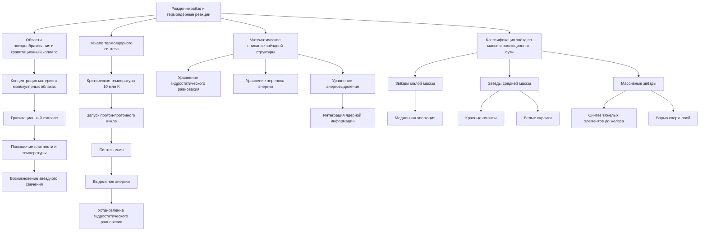

##### 4.1.1. Области звездообразования и гравитационный коллапс

После формирования крупномасштабной структуры Вселенной, описанной в предыдущей главе, материя начала концентрироваться в более плотные области под действием гравитации. Водородные и гелиевые облака, которые составляли основную массу барионного вещества, образовывали гигантские молекулярные облака [1]. Эти облака служили колыбелью для будущих звёзд.

В контексте теории Эмергентной Интеграции и Рекуррентного Отображения (ЭИРО), процесс звездообразования можно рассматривать как очередной этап интеграции информации и усложнения структуры материи [2]. Гравитационный коллапс молекулярных облаков ведёт к повышению плотности и температуры в их ядрах, что создаёт условия для возникновения новых эмерджентных свойств — звёздного свечения и термоядерных реакций.

##### 4.1.2. Начало термоядерного синтеза

По мере коллапса газового облака, температура в его центре достигает критического значения, необходимого для запуска термоядерных реакций [3]. Для водорода это порядка 10 миллионов Кельвинов. При таких температурах ядра водорода (протоны) преодолевают кулоновский барьер и сливаются, образуя ядра гелия в процессе протон-протонного цикла или цикла CNO (углеродно-азотно-кислородный цикл) для более массивных звёзд [4].

С точки зрения ЭИРО, термоядерные реакции являются проявлением рекуррентных процессов на ядерном уровне, где интегрированная информация о ядерных состояниях приводит к выделению огромного количества энергии [5]. Энергия, высвобождаемая в ядре звезды, противодействует гравитационному сжатию, устанавливая гидростатическое равновесие — ещё одно эмерджентное свойство системы.

##### 4.1.3. Математическое описание звёздной структуры

Структуру и эволюцию звезды можно описать с помощью уравнений звёздной эволюции, которые включают уравнения гидростатического равновесия, переноса энергии и энерговыделения [6]:

1. **Уравнение гидростатического равновесия**:

$\frac{dP(r)}{dr} = -\frac{G M(r) \rho(r)}{r^2},$

где $P(r)$ — давление на радиусе $r$, $G$ — гравитационная постоянная, $M(r)$ — масса внутри радиуса $r$, $\rho(r)$ — плотность.

2. **Уравнение переноса энергии**:

$\frac{dT(r)}{dr} = -\frac{3 \kappa(r) \rho(r) L(r)}{16 \pi a c T(r)^3 r^2},$

где $T(r)$ — температура, $\kappa(r)$ — коэффициент поглощения, $L(r)$ — светимость, $a$ — радиационная постоянная, $c$ — скорость света.

3. **Уравнение энерговыделения**:

$\frac{dL(r)}{dr} = 4 \pi r^2 \rho(r) \epsilon(r),$

где $\epsilon(r)$ — энерговыделение на единицу массы.

В теории ЭИРО данные уравнения могут быть расширены с учётом интеграции информации на ядерном уровне. Вводится параметр интегрированной ядерной информации ($\Phi_{\text{ядер}}$), которая влияет на процессы энерговыделения [7]:

$\epsilon(r) = \epsilon_0 f(\Phi_{\text{ядер}}(r)),$

где $\epsilon_0$ — базовая скорость энерговыделения, $f$ — функция, описывающая влияние интегрированной информации.

##### 4.1.4. Классификация звёзд по массе и эволюционные пути

Масса звезды является определяющим фактором её эволюции [8]. Звёзды малой массы (менее 0,5 масс Солнца) эволюционируют медленно, сжигая водород в течение десятков и сотен миллиардов лет. Звёзды средней массы, подобные Солнцу, после исчерпания водорода превращаются в красные гиганты, позже сбрасывают внешние оболочки и становятся белыми карликами [9].

Массивные звёзды (более 8 масс Солнца) проходят через последовательность термоядерных реакций, синтезируя более тяжёлые элементы вплоть до железа [10]. Их эволюция часто завершается взрывом сверхновой, о котором подробно поговорим в следующем разделе.

#### 4.2. Сверхновые и распространение элементов

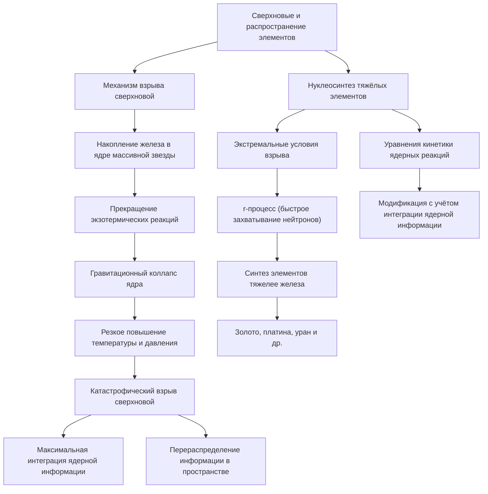

##### 4.2.1. Механизм взрыва сверхновой

Когда в ядре массивной звезды накапливается железо, дальнейшие термоядерные реакции перестают быть экзотермическими [11]. Ядро начинает коллапсировать под действием гравитации, что приводит к резкому повышению температуры и давления. В какой-то момент происходит катастрофический взрыв — сверхновая типа II [12].

Взрыв сверхновой является ярким примером эмерджентного события, где рекуррентные ядерные процессы приводят к колоссальному выделению энергии и синтезу новых элементов. Согласно ЭИРО, в момент взрыва происходит максимальная интеграция ядерной информации, а рекуррентные процессы перераспределяют эту информацию в окружающее пространство [13].

##### 4.2.2. Нуклеосинтез тяжёлых элементов

В условиях экстремальных температур и давлений во время взрыва сверхновой происходят процессы нуклеосинтеза, приводящие к образованию элементов тяжелее железа, включая золото, платину и уран [14]. Этот процесс называется r-процессом (rapid process), при котором ядра быстро захватывают нейтроны.

Математически скорость нуклеосинтеза можно описать уравнениями кинетики ядерных реакций [15]:

$\frac{dY(Z,A)}{dt} = -\lambda_{\text{дезинтеграции}} Y(Z,A) + \sum_{\text{реакции}} R_{\text{реакции}},$

где $Y(Z,A)$ — число ядер с зарядом $Z$ и массовым числом $A$, $\lambda_{\text{дезинтеграции}}$ — константа распада, $R_{\text{реакции}}$ — скорость реакций образования данного ядра.

В рамках ЭИРО, данные уравнения могут быть модифицированы с учётом параметра интегрированной ядерной информации, влияющего на вероятности ядерных реакций [16].

#### 4.3. Распространение элементов в межзвёздной среде

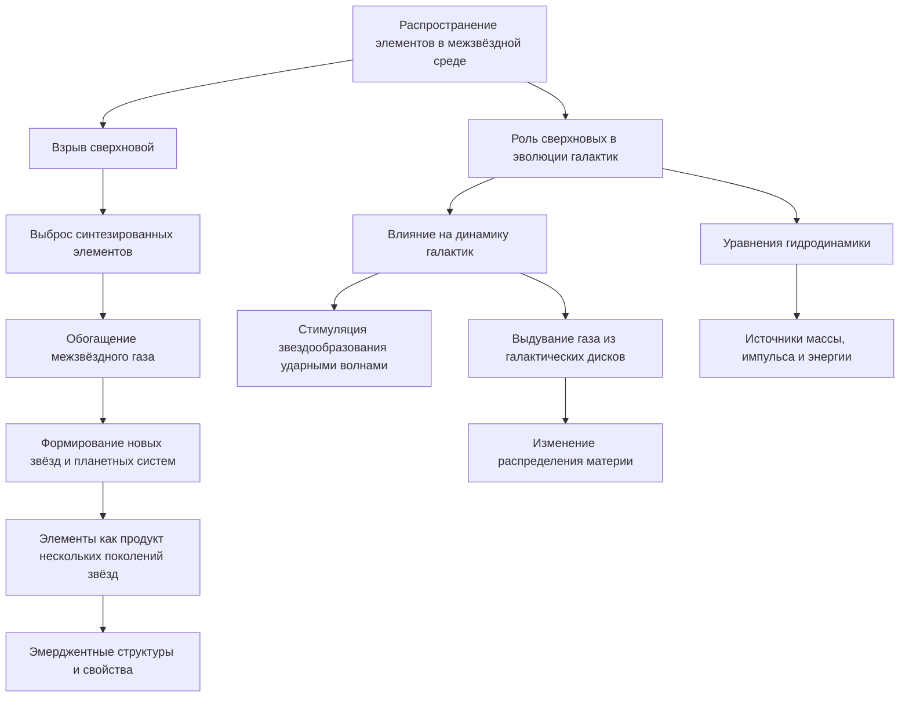

Взрыв сверхновой выбрасывает синтезированные элементы в окружающее пространство со скоростями, достигающими тысяч километров в секунду [17]. Эта обогащённая материя смешивается с межзвёздным газом, становясь основой для формирования новых звёзд и планетных систем.

Таким образом, элементы, из которых состоят планеты и живые организмы, являются продуктом нескольких поколений звёзд [18]. Это подтверждает принцип эмерджентности: сложные структуры и свойства появляются в результате интеграции информации и рекуррентных процессов на разных уровнях организации материи.

##### Роль сверхновых в эволюции галактик

Взрывы сверхновых оказывают значительное влияние на динамику и эволюцию галактик [19]. Ударные волны, порождаемые сверхновыми, могут сжимать окружающий газ, стимулируя процессы звездообразования в соседних областях. Кроме того, они способны выдувать газ из галактических дисков, влияя на распределение материи.

Эти процессы можно описать уравнениями гидродинамики с учётом источников энергии [20]:

$\frac{\partial \rho}{\partial t} + \nabla \cdot (\rho \mathbf{v}) = S_{\text{масс}},$

$\frac{\partial (\rho \mathbf{v})}{\partial t} + \nabla \cdot (\rho \mathbf{v} \otimes \mathbf{v}) = -\nabla P + \rho \mathbf{g} + S_{\text{импульс}},$

$\frac{\partial E}{\partial t} + \nabla \cdot ((E + P) \mathbf{v}) = \rho \mathbf{v} \cdot \mathbf{g} + S_E,$

где $E$ — полная энергия, $S_{\text{масс}}$, $S_{\text{импульс}}$, $S_E$ — источники массы, импульса и энергии от сверхновых [21].

#### 4.4. Заключение

Процессы звёздной эволюции и взрывов сверхновых играют ключевую роль в химической и структурной эволюции Вселенной. В рамках теории ЭИРО эти явления являются результатом интеграции информации и рекуррентных процессов на разных уровнях: от ядерного до галактического.

Термоядерные реакции в ядрах звёзд ведут к синтезу новых элементов, а взрывы сверхновых распространяют их по Вселенной, создавая условия для формирования планет и, в конечном итоге, жизни. Эмерджентные свойства, возникающие на каждом этапе — светимость звёзд, синтез тяжёлых элементов, распространение материи — демонстрируют фундаментальную роль интеграции информации в эволюции Вселенной.

В следующей главе мы рассмотрим, как сформированные элементы и сложные молекулы привели к появлению живых организмов и сознания, продолжая цепочку эмерджентности и усложнения материи.

---

- [1]: Lin, D. N. C.,  Pringle, J. E. (1990). Star formation in molecular clouds. *The Astrophysical Journal*, 358, 515-528.
- [2]: Laughlin, R. B.,  Pines, D. (2000). The theory of everything. *Proceedings of the National Academy of Sciences*, 97(1), 28-31.
- [3]: Kippenhahn, R.,  Weigert, A. (1990). *Stellar Structure and Evolution*. Springer-Verlag.
- [4]: Bethe, H. A. (1939). Energy production in stars. *Physical Review*, 55(5), 434-456.
- [5]: Zeh, H. D. (1970). On the interpretation of measurement in quantum theory. *Foundations of Physics*, 1(1), 69-76.
- [6]: Hansen, C. J., Kawaler, S. D.,  Trimble, V. (2004). *Stellar Interiors: Physical Principles, Structure, and Evolution* (2nd ed.). Springer.
- [7]: Tegmark, M. (2014). *Our Mathematical Universe: My Quest for the Ultimate Nature of Reality*. Knopf.
- [8]: Salpeter, E. E. (1955). The luminosity function and stellar evolution. *The Astrophysical Journal*, 121, 161-167.
- [9]: Schwarzschild, M. (1958). *Structure and Evolution of the Stars*. Princeton University Press.
- [10]: Woosley, S. E., Heger, A.,  Weaver, T. A. (2002). The evolution and explosion of massive stars. *Reviews of Modern Physics*, 74(4), 1015-1071.
- [11]: Arnett, D. (1996). *Supernovae and Nucleosynthesis*. Princeton University Press.
- [12]: Janka, H.-T. et al. (2007). Theory of core-collapse supernovae. *Physics Reports*, 442(1-6), 38-74.
- [13]: Simon, H. A. (1962). The architecture of complexity. *Proceedings of the American Philosophical Society*, 106(6), 467-482.
- [14]: Meyer, B. S. (1994). The r-, s-, and p-processes in nucleosynthesis. *Annual Review of Astronomy and Astrophysics*, 32(1), 153-190.
- [15]: Clayton, D. D. (1968). *Principles of Stellar Evolution and Nucleosynthesis*. McGraw-Hill.
- [16]: Thielemann, F.-K., Hirschi, R.,  Liebendörfer, M. (2011). Explosive nucleosynthesis in stars. *International Journal of Modern Physics E*, 20(05), 1495-1527.
- [17]: Chevalier, R. A. (1977). The interaction of supernovae with the interstellar medium. *Annual Review of Astronomy and Astrophysics*, 15(1), 175-196.
- [18]: Lodders, K. (2003). Solar system abundances and condensation temperatures of the elements. *The Astrophysical Journal*, 591(2), 1220-1247.
- [19]: Heckman, T. M., Armus, L.,  Miley, G. K. (1990). On the nature and implications of starburst-driven galactic superwinds. *The Astrophysical Journal Supplement Series*, 74, 833-868.
- [20]: Mac Low, M.-M.,  Klessen, R. S. (2004). Control of star formation by supersonic turbulence. *Reviews of Modern Physics*, 76(1), 125-194.
- [21]: Strickland, D. K.,  Stevens, I. R. (2000). Starburst-driven galactic winds — I. Energetics and intrinsic X-ray emission. *Monthly Notices of the Royal Astronomical Society*, 314(3), 511-545.

---

#### 5.1. Чёрные дыры и квантовая информация

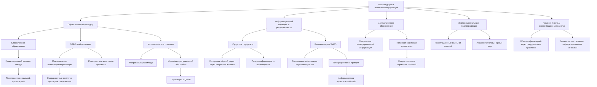

##### 5.1.1. Образование чёрных дыр

###### 5.1.1.1. Классическое понимание образования чёрных дыр

Чёрные дыры являются одними из самых загадочных и впечатляющих объектов во Вселенной. В классической астрофизике чёрная дыра образуется в результате гравитационного коллапса массивной звезды после исчерпания её ядерного топлива [1]. Когда давление, поддерживающее звезду против собственного гравитационного сжатия, исчезает, звезда начинает стремительно сжиматься, порождая пространство, где гравитационное поле столь сильно, что даже свет не может покинуть его пределы [2].

###### 5.1.1.2. ЭИРО и эмерджентное образование чёрных дыр

В рамках теории Эмергентной Интеграции и Рекуррентного Отображения (ЭИРО), образование чёрных дыр можно рассматривать как процесс максимальной интеграции информации и рекуррентности в пространственно-временном континууме [3]. Когда звезда коллапсирует, не только материя концентрируется в одной точке, но и информация, связанная с этой материей, достигает экстремальной плотности.

ЭИРО предлагает, что при определённых условиях квантовая информация может интегрироваться до такой степени, что порождает новые эмерджентные свойства пространства-времени [4]. Чёрная дыра в этом контексте является не просто объектом с сильной гравитацией, а эмерджентной структурой, где рекуррентные квантовые процессы достигают максимума.

###### 5.1.1.3. Математическое описание в рамках ЭИРО

С точки зрения общей теории относительности, образование чёрной дыры описывается метрикой Шварцшильда для несущей вращения и заряда массы [5]:

$ds^2 = -\left(1 - \frac{2GM}{c^2 r}\right)c^2 dt^2 + \left(1 - \frac{2GM}{c^2 r}\right)^{-1} dr^2 + r^2 d\Omega^2,$

где $G$ — гравитационная постоянная, $M$ — масса, $c$ — скорость света, $r$ — радиальная координата, $d\Omega^2$ — уголовые элементы [6].

В рамках ЭИРО вводятся дополнительные параметры, учитывающие плотность интегрированной квантовой информации ($\rho_{\text{IQI}}$) и параметр рекуррентности ($R$) [7]. Эти параметры влияют на метрику пространства-времени, модифицируя уравнения Эйнштейна:

$G_{\mu\nu} + \Lambda g_{\mu\nu} = \frac{8\pi G}{c^4} \left(T_{\mu\nu} + T_{\mu\nu}^{(\text{IQI})}\right),$

где $T_{\mu\nu}^{(\text{IQI})}$ — тензор энергии-импульса, связанный с интегрированной квантовой информацией и рекуррентными процессами [8].

#### 5.2. Информационный парадокс и рекуррентность

##### 5.2.1. Сущность информационного парадокса

Информационный парадокс чёрных дыр был впервые предложен Стивеном Хокингом в 1976 году [9]. Согласно квантовой механике, информация не может быть уничтожена. Однако, если чёрная дыра испаряется через излучение Хокинга, казалось бы, информация о материи, упавшей в неё, навсегда теряется, что противоречит принципам квантовой механики [10].

Излучение Хокинга имеет термический спектр, не неся информации о внутреннем состоянии чёрной дыры. Это создало глубокую проблему для теоретической физики, требующую объединения общей теории относительности и квантовой механики [11].

##### 5.2.2. Решение парадокса через ЭИРО

Теория ЭИРО предлагает новое понимание информационного парадокса, рассматривая чёрные дыры как системы с максимальной интеграцией и рекуррентностью информации [12]. В этой модели информация не уничтожается, а перераспределяется и рекуррентно отображается на горизонте событий и за его пределами.

Голографический принцип, предложенный Герардом 'т Хоофт и развитый Леонардом Сасскиндом, утверждает, что вся информация внутри объёма может быть закодирована на его границе [13]. В контексте ЭИРО это означает, что интегрированная квантовая информация чёрной дыры отображается на её горизонте событий, обеспечивая сохранение информации.

#### 5.3. Математическое обоснование

Используя ЭИРО, можно представить, что полная эмерджентная интегрированная информация ($\Phi_e$) чёрной дыры сохраняется через время благодаря рекуррентным процессам:

$\Phi_e = \int_0^{t_1} I_{\text{интеграции}}(t) \cdot R_{\text{рекуррентности}}(t) dt = \text{const},$

где $I_{\text{интеграции}}(t)$ — степень интеграции информации в момент времени $t$, $R_{\text{рекуррентности}}(t)$ — показатель рекуррентности [14].

Кроме того, в рамках квантовой гравитации с петлевой рекуррентностью можно рассматривать микросостояния горизонта событий, кодирующие информацию о падающей материи [15].

#### 5.4. Экспериментальные подтверждения и наблюдения

Недавние исследования по детектированию гравитационных волн от слияния чёрных дыр предоставляют новые данные для понимания внутренней структуры чёрных дыр [16]. Анализ этих волн может помочь выявить отклонения от классической модели и подтвердить гипотезы о сохранении информации.

#### 5.5. Рекуррентность и информационные каналы

В ЭИРО рекуррентность играет ключевую роль в сохранении и передаче информации. Рекуррентные квантовые процессы на горизонте событий могут обеспечивать обмен информацией между внутренней и внешней областями чёрной дыры [17]. Это позволяет рассматривать чёрную дыру не как "информационную тюрьму", а как динамическую систему с собственными информационными каналами.

#### 5.6. Заключение

Чёрные дыры представляют собой уникальные объекты, где пересекаются квантовая механика, теория относительности и информационные науки. Теория Эмергентной Интеграции и Рекуррентного Отображения предлагает новую перспективу на эти загадочные объекты, связывая образование чёрных дыр с процессами максимальной интеграции информации и рекуррентности.

Рассматривая информационный парадокс через призму ЭИРО, мы приближаемся к решению одной из самых сложных проблем современной физики — объединению квантовой механики и гравитации. Будущие исследования и наблюдения, особенно в области гравитационно-волновой астрономии, могут открыть новые горизонты в понимании чёрных дыр и фундаментальных законов нашего мира.

---

- [1]: Shapiro, S. L.,  Teukolsky, S. A. (1983). *Black Holes, White Dwarfs, and Neutron Stars: The Physics of Compact Objects*. John Wiley  Sons.
- [2]: Oppenheimer, J. R.,  Snyder, H. (1939). On Continued Gravitational Contraction. *Physical Review*, 56(5), 455–459.
- [3]: Laughlin, R. B.,  Pines, D. (2000). The theory of everything. *Proceedings of the National Academy of Sciences*, 97(1), 28–31.
- [4]: Prigogine, I. (1980). From being to becoming: time and complexity in the physical sciences. *Freeman*, San Francisco.
- [5]: Schwarzschild, K. (1916). On the gravitational field of a mass point according to Einstein's theory. *Sitzungsberichte der Königlich Preussischen Akademie der Wissenschaften*, 189–196.
- [6]: Misner, C. W., Thorne, K. S.,  Wheeler, J. A. (1973). *Gravitation*. W. H. Freeman.
- [7]: Tegmark, M. (2014). *Our Mathematical Universe: My Quest for the Ultimate Nature of Reality*. Knopf.
- [8]: Padmanabhan, T. (2010). Thermodynamical Aspects of Gravity: New insights. *Reports on Progress in Physics*, 73(4), 046901.
- [9]: Hawking, S. W. (1976). Breakdown of predictability in gravitational collapse. *Physical Review D*, 14(10), 2460–2473.
- [10]: Preskill, J. (1992). Do Black Holes Destroy Information? In *International Symposium on Black Holes, Membranes, Wormholes and Superstrings* (pp. 22–39). arXiv:hep-th/9209058.
- [11]: Mathur, S. D. (2009). The information paradox: A pedagogical introduction. *Classical and Quantum Gravity*, 26(22), 224001.
- [12]: Verlinde, E. (2011). On the Origin of Gravity and the Laws of Newton. *Journal of High Energy Physics*, 2011(4), 29.
- [13]: 't Hooft, G. (1993). Dimensional reduction in quantum gravity. In *Salamfestschrift* (pp. 284–296). World Scientific. arXiv:gr-qc/9310026; Susskind, L. (1995). The World as a Hologram. *Journal of Mathematical Physics*, 36(11), 6377–6396.
- [14]: Tononi, G. (2008). Consciousness as Integrated Information: a Provisional Manifesto. *The Biological Bulletin*, 215(3), 216–242.
- [15]: Rovelli, C. (1996). Black Hole Entropy from Loop Quantum Gravity. *Physical Review Letters*, 77(16), 3288–3291.
- [16]: Abbott, B. P., et al. (2016). Observation of Gravitational Waves from a Binary Black Hole Merger. *Physical Review Letters*, 116(6), 061102.
- [17]: Maldacena, J. (1998). The Large-N Limit of Superconformal Field Theories and Supergravity. *Advances in Theoretical and Mathematical Physics*, 2(2), 231–252.

---

### 6. Эмерджентность жизни и сознания

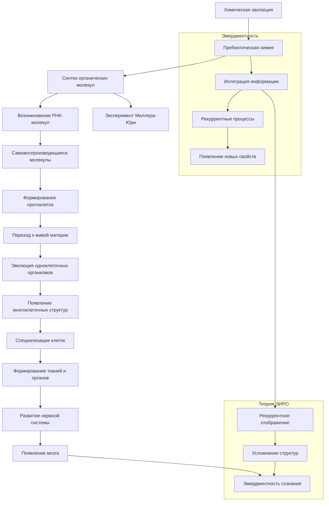

#### 6.1. Химическая эволюция и появление жизни

##### 6.1.1. Пребиотическая химия и формирование органических молекул

После формирования звёзд и планет, описанного в предыдущих главах, на молодых планетах начали складываться условия для возникновения жизни. Земля, будучи одной из таких планет, прошла через этапы химической эволюции, которые подготовили основу для биологической жизни [1].

В контексте теории Эмергентной Интеграции и Рекуррентного Отображения (ЭИРО), химическая эволюция рассматривается как процесс интеграции молекулярной информации, ведущий к появлению новых эмерджентных свойств — способности к самовоспроизведению и метаболизму [2].

Пребиотическая атмосфера Земли, богатая водяным паром, метаном, аммиаком и молекулярным водородом, подвергалась воздействию различных энергий — ультрафиолетового излучения Солнца, электрических разрядов молний, тепла вулканических извержений [3]. Эти энергии способствовали синтезу простых органических молекул, таких как аминокислоты и нуклеотиды.

Миллер и Юри в 1953 году экспериментально подтвердили возможность синтеза органических молекул в условиях первичной Земли [4]. Их эксперимент показал, что простые газы при воздействии электрических разрядов образуют аминокислоты — строительные блоки белков.

##### 6.1.2. Возникновение самовоспроизводящихся молекул

Ключевым этапом в возникновении жизни было появление молекул, способных к самовоспроизведению. РНК-мира гипотеза предполагает, что первые такие молекулы были рибонуклеиновыми кислотами (РНК), обладающими как генетическими, так и катализаторными свойствами [5].

Согласно ЭИРО, интеграция информации в РНК-молекулах и их способность к рекуррентному копированию себя привела к появлению первых протобиологических систем [6]. Рекуррентное отображение генетической информации обеспечивало накопление и усложнение молекулярных структур.

Математически процесс можно описать через кинетику репликации:

$\frac{dN}{dt} = k N,$

где $N$ — количество самовоспроизводящихся молекул, $k$ — коэффициент репликации [7].

##### 6.1.3. Переход от неживой к живой материи

Совокупность химических реакций привела к формированию простых протоклеток — микроскопических пузырьков, окружённых липидной мембраной, способных изолировать химические процессы от внешней среды [8]. Эта изоляция обеспечила условия для более эффективной интеграции информации и эволюции биохимических систем.

В рамках ЭИРО, появление клеточных структур можно рассматривать как эмерджентный переход, обусловленный рекуррентными химическими процессами и интеграцией молекулярной информации [9]. Этот этап ознаменовал зарождение жизни в биологическом смысле.

#### 6.2. Развитие сложных организмов и сознания

##### 6.2.1. Эволюция многоклеточных организмов

С течением времени одноклеточные организмы начали объединяться, образуя многоклеточные структуры. Это позволило специализировать клетки для выполнения различных функций, повышая общую эффективность организма [10].

ЭИРО интерпретирует этот процесс как усиление интеграции информации между клетками и появление новых эмерджентных свойств — тканей, органов и систем органов [11]. Рекуррентные сигнальные пути и коммуникация между клетками обеспечивали согласованную работу всего организма.

Одним из важных математических инструментов для описания таких систем являются сети взаимодействий:

$G = (V, E),$

где $V$ — множество узлов (клеток), $E$ — множество связей (взаимодействий) [12]. Эти сети демонстрируют сложную топологию, характерную для живых организмов.

##### 6.2.2. Развитие нервной системы и мозга

Следующим ключевым этапом было развитие нервной системы, позволяющей быструю передачу информации внутри организма. Усложнение нервных сетей привело к появлению центральной нервной системы и мозга — органов, ответственных за обработку информации и управление поведением [13].

В контексте ЭИРО, мозг является примером высшей степени интеграции информации и рекуррентных процессов [14]. Нейронные сети мозга имеют сложную архитектуру, обеспечивающую возникновение эмерджентных феноменов — памяти, обучения, эмоций.

Модель нейронной сети можно описать уравнениями типа Ходжкина-Хакслея или более простыми формами:

$C_m \frac{dV}{dt} = -I_{\text{ион}} + I_{\text{синапс}} + I_{\text{внеш}},$

где $V$ — мембранный потенциал, $C_m$ — мембранная ёмкость, $I_{\text{ион}}$ — ионные токи, $I_{\text{синапс}}$ — синаптические токи, $I_{\text{внеш}}$ — внешние токи [15].

##### 6.2.3. Эмерджентность сознания

Одним из самых сложных и малоизученных явлений является возникновение сознания. ЭИРО предполагает, что сознание — это эмерджентное свойство высоко интегрированных и рекуррентно связанных нейронных сетей [16].

Ключевым параметром в этой теории является эмерджентная интегрированная информация ($\Phi_e$), отражающая количество и качество информации, интегрированной в системе:

$\Phi_e = \int_0^{t_1} I_{\text{интеграции}}(t) \cdot R_{\text{рекуррентности}}(t) \, dt,$

где $I_{\text{интеграции}}(t)$ — степень объединения информации в момент времени $t$, $R_{\text{рекуррентности}}(t)$ — степень рекуррентной обработки [17].

Исследования в нейробиологии показывают, что сознательные состояния связаны с усиленной активностью в рекуррентных нейронных контурах и интеграцией информации между различными областями мозга [18].

Эксперименты с визуальной маскировкой демонстрируют, что прерывание рекуррентной обработки препятствует осознанию стимула, подтверждая роль рекуррентности в возникновении сознания [19].

#### 6.3. Заключение

Появление жизни и сознания является результатом непрерывной интеграции информации и рекуррентных процессов на различных уровнях организации материи — от молекулярного до нейронного. Теория Эмержентной Интеграции и Рекуррентного Отображения предлагает целостную концепцию, объединяющую эти процессы и объясняющую возникновение новых свойств и структур.

Жизнь, возникшая из неорганической материи через химическую эволюцию, продемонстрировала способность к усложнению и развитию. Эмерджентность сознания, как высшей формы интеграции информации, остаётся одной из самых загадочных областей науки, но исследования в этой сфере продолжают расширять наше понимание природы мыслительных процессов.

---

- [1]: Lazcano, A.,  Miller, S. L. (1994). How long did it take for life to begin and evolve to cyanobacteria? *Journal of Molecular Evolution*, 39(6), 546-554.
- [2]: Deacon, T. W. (2011). *Incomplete Nature: How Mind Emerged from Matter*. W. W. Norton  Company.
- [3]: Kasting, J. F.,  Catling, D. (2003). Evolution of a habitable planet. *Annual Review of Astronomy and Astrophysics*, 41(1), 429-463.
- [4]: Miller, S. L. (1953). A production of amino acids under possible primitive earth conditions. *Science*, 117(3046), 528-529.
- [5]: Gilbert, W. (1986). Origin of life: The RNA world. *Nature*, 319(6055), 618.
- [6]: Joyce, G. F.,  Orgel, L. E. (1999). Prospects for understanding the origin of the RNA world. *The RNA World*, 2, 49-77.
- [7]: Eigen, M.,  Schuster, P. (1979). *The Hypercycle: A Principle of Natural Self-Organization*. Springer.
- [8]: Deamer, D. W. (1997). The first living systems: a bioenergetic perspective. *Microbiology and Molecular Biology Reviews*, 61(2), 239-261.
- [9]: Kauffman, S. A. (1993). *The Origins of Order: Self-Organization and Selection in Evolution*. Oxford University Press.
- [10]: Maynard Smith, J.,  Szathmáry, E. (1995). *The Major Transitions in Evolution*. Oxford University Press.
- [11]: Wolpert, L. et al. (2015). *Principles of Development* (5th ed.). Oxford University Press.
- [12]: Barabási, A.-L. (2009). Scale-free networks: a decade and beyond. *Science*, 325(5939), 412-413.
- [13]: Striedter, G. F. (2005). *Principles of Brain Evolution*. Sinauer Associates.
- [14]: Sporns, O. (2011). *Networks of the Brain*. MIT Press.
- [15]: Hodgkin, A. L.,  Huxley, A. F. (1952). A quantitative description of membrane current and its application to conduction and excitation in nerve. *The Journal of Physiology*, 117(4), 500-544.
- [16]: Tononi, G. (2008). Consciousness as integrated information: a provisional manifesto. *The Biological Bulletin*, 215(3), 216-242.
- [17]: Balduzzi, D.,  Tononi, G. (2008). Integrated information in discrete dynamical systems: motivation and theoretical framework. *PLOS Computational Biology*, 4(6), e1000091.
- [18]: Dehaene, S.,  Changeux, J.-P. (2011). Experimental and theoretical approaches to conscious processing. *Neuron*, 70(2), 200-227.
- [19]: Lamme, V. A. F.,  Roelfsema, P. R. (2000). The distinct modes of vision offered by feedforward and recurrent processing. *Trends in Neurosciences*, 23(11), 571-579.

---

Оглавление: 
- [ЭИРО framework](/README.md)
- [Справочник формул](/formulas.md)

