# Модель структуры ДНК через призму теории Эмергентной Интеграции и Рекуррентного Отображения (ЭИРО)

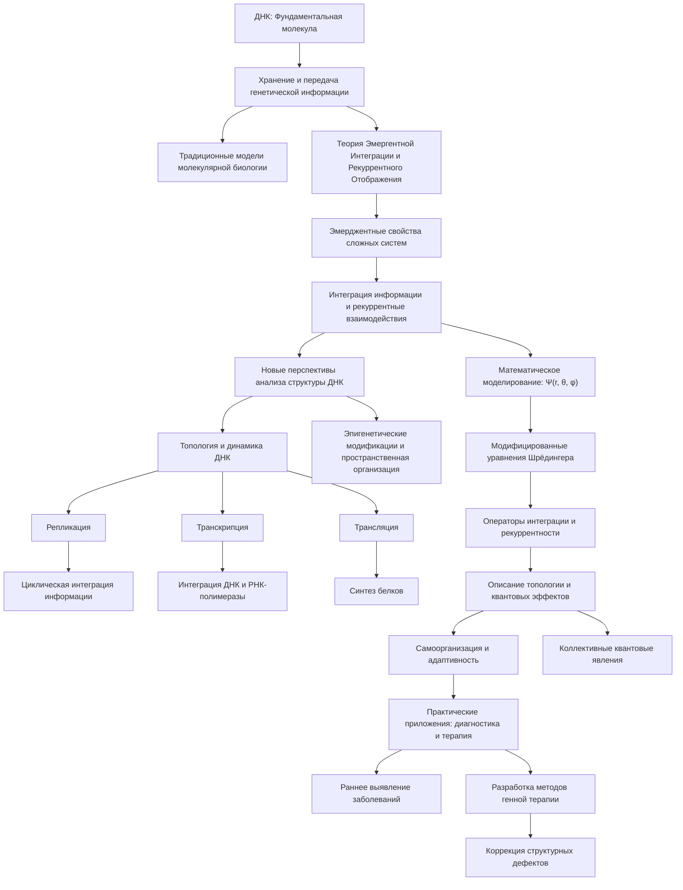

---


## Оглавление

1. Введение
2. Основы структуры и функций ДНК
   - 2.1. Нуклеотидный состав и двойная спираль
   - 2.2. Генетический код и хранение информации
   - 2.3. Репликация, транскрипция и трансляция
3. Теория Эмергентной Интеграции и Рекуррентного Отображения (ЭИРО)
   - 3.1 Основные принципы ЭИРО
   - 3.2. Интеграция информации и рекуррентность в биологических системах
4. Применение ЭИРО к модели структуры ДНК
   - 4.1. Интегративный подход к анализу ДНК
   - 4.2. Роль рекуррентности в динамике ДНК
   - 4.3. Эмерджентные свойства структуры ДНК
5. Математическое моделирование структуры ДНК в рамках ЭИРО
   - 5.1. Модификация уравнений Шрёдингера
   - 5.2. Описание топологических особенностей ДНК
   - 5.3. Учет эпигенетических факторов
6. Экспериментальные подтверждения и применения
   - 6.1. Методы исследования структуры ДНК
   - 6.2. Верификация предсказаний ЭИРО
   - 6.3. Практические приложения в биологии и медицине
7. Заключение
8. Список литературы

---


### 1. Введение

Дезоксирибонуклеиновая кислота (ДНК) является фундаментальной биологической молекулой, хранящей и передающей генетическую информацию в живых организмах. Традиционные модели структуры ДНК, основанные на классической молекулярной биологии, успешно описывают многие аспекты организации и функционирования генома. Однако, с развитием современных представлений о сложных биологических системах, возникает необходимость в более комплексном подходе к пониманию структуры ДНК.

Теория Эмергентной Интеграции и Рекуррентного Отображения (ЭИРО) предлагает новую концептуальную основу для анализа биологических систем, в том числе и структуры ДНК. Согласно ЭИРО, эмерджентные свойства сложных систем возникают из процессов интеграции информации и рекуррентных взаимодействий между их компонентами. Применение этих принципов к модели структуры ДНК может открыть новые перспективы в понимании организации генетического материала и его функционирования.

В данной работе мы рассмотрим, как теория ЭИРО может быть использована для расширения и углубления представлений о структуре ДНК, ее топологических особенностях и эмерджентных свойствах. Будут представлены математические модели, описывающие влияние интегрированной информации и рекуррентности на динамику ДНК, а также обсуждены экспериментальные подходы для верификации этих предсказаний и перспективы практического применения.

### 2. Основы структуры и функций ДНК

#### 2.1. Нуклеотидный состав и двойная спираль

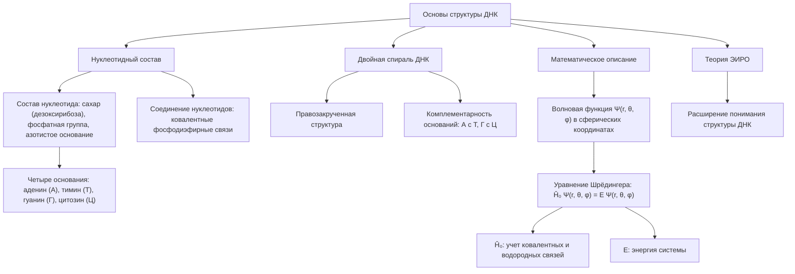

Дезоксирибонуклеиновая кислота (ДНК) состоит из двух полинуклеотидных цепей, закрученных в правозакрученную двойную спираль. Каждая цепь построена из нуклеотидов, включающих в себя сахар (дезоксирибозу), фосфатную группу и одно из четырех азотистых оснований: аденин (А), тимин (Т), гуанин (Г) и цитозин (Ц) [1].

Нуклеотиды в цепях соединяются ковалентными фосфодиэфирными связями, образуя полинуклеотидную структуру. Между нуклеотидами в противоположных цепях образуются водородные связи по принципу комплементарности: аденин с тимином, гуанин с цитозином [2].

Математически, структуру двойной спирали ДНК можно описать следующим образом:

Пусть Ψ(r, θ, φ) - волновая функция, описывающая пространственное распределение нуклеотидов в ДНК, где r, θ и φ - сферические координаты. Тогда уравнение Шрёдингера для ДНК имеет вид:

`Ĥ₀ Ψ(r, θ, φ) = E Ψ(r, θ, φ)`

Где Ĥ₀ - стандартный гамильтониан, учитывающий ковалентные и водородные связи между нуклеотидами, а E - энергия системы.

Данная модель успешно описывает основные структурные особенности двойной спирали ДНК, однако, как будет показано далее, для более полного понимания организации генетического материала необходимо применение теории Эмергентной Интеграции и Рекуррентного Отображения (ЭИРО).

#### 2.2. Генетический код и хранение информации

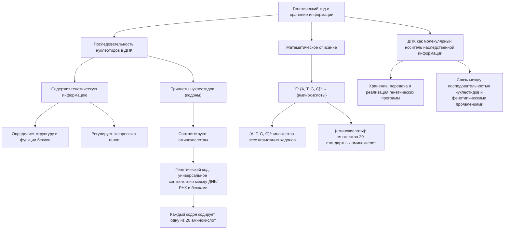

Последовательность нуклеотидов в ДНК содержит генетическую информацию, которая определяет структуру и функции белков, а также регулирует экспрессию генов. Триплеты нуклеотидов (кодоны) соответствуют определенным аминокислотам, формируя генетический код [3].

Генетический код представляет собой универсальное соответствие между последовательностью нуклеотидов в ДНК/РНК и последовательностью аминокислот в белках. Каждый триплет из трех последовательных нуклеотидов (кодон) кодирует одну из 20 стандартных аминокислот, используемых в биосинтезе белков [3].

Математически, генетический код можно представить в виде отображения:

`F: {A, T, G, C}³ → {аминокислоты}`

Где {A, T, G, C}³ - множество всех возможных триплетов нуклеотидов, а {аминокислоты} - множество 20 стандартных аминокислот. Функция F устанавливает соответствие между кодонами и аминокислотами.

Таким образом, ДНК выступает в качестве молекулярного носителя наследственной информации, обеспечивая хранение, передачу и реализацию генетических программ в живых организмах. Генетический код является ключевым механизмом, связывающим последовательность нуклеотидов в ДНК с первичной структурой белков и, в конечном счете, с фенотипическими проявлениями организмов.

#### 2.3. Репликация, транскрипция и трансляция

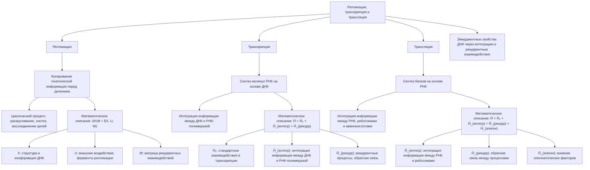

Согласно теории Эмергентной Интеграции и Рекуррентного Отображения (ЭИРО), ключевые процессы, связанные со структурой ДНК, такие как репликация, транскрипция и трансляция, играют важную роль в динамике и эмерджентных свойствах генетического материала.

##### 2.3.1. Репликация

Процесс репликации ДНК является ключевым механизмом, обеспечивающим точное копирование генетической информации перед клеточным делением. Согласно теории Эмергентной Интеграции и Рекуррентного Отображения (ЭИРО), репликация ДНК может быть рассмотрена как рекуррентный процесс интеграции информации.

В рамках ЭИРО, репликация ДНК представляет собой циклический процесс, в ходе которого происходит непрерывная интеграция информации между двумя комплементарными цепями. Каждый этап репликации, включая раскручивание двойной спирали, синтез новых комплементарных цепей и их воссоединение, можно рассматривать как рекуррентные взаимодействия, обеспечивающие точное копирование генетической информации.

Математически, динамику репликации ДНК можно описать следующим образом:

`dX/dt = f(X, U, W)`

Где:

- X - вектор состояний, описывающий структуру и конформацию ДНК во время репликации
- U - вектор внешних воздействий, таких как связывание ферментов репликации
- W - матрица рекуррентных взаимодействий между нуклеотидами, обеспечивающих циклическое копирование информации
- f - нелинейная функция, отражающая динамику процесса репликации

Рекуррентные связи, представленные в матрице W, позволяют учитывать циклические процессы, происходящие в ходе репликации, и их влияние на эмерджентные свойства структуры ДНК [11].

##### 2.3.2. Транскрипция

Процесс транскрипции, в ходе которого на основе последовательности ДНК синтезируются молекулы РНК, также может быть рассмотрен в контексте ЭИРО как интеграция информации и рекуррентные взаимодействия.

Согласно теории ЭИРО, транскрипция является эмерджентным процессом, возникающим из интеграции информации между ДНК и РНК-полимеразой, а также рекуррентных взаимодействий между транскрипцией и другими клеточными процессами. Этот комплексный характер транскрипции не может быть полностью описан стандартными моделями, основанными только на взаимодействиях между нуклеотидами.

Математически, транскрипцию можно описать с помощью модифицированного гамильтониана:

`Ĥ = Ĥ₀ + Ĥ_(интегр) + Ĥ_(рекурр)`

Где:

- Ĥ₀ - стандартный гамильтониан, описывающий взаимодействия в процессе транскрипции
- Ĥ_(интегр) - оператор, учитывающий интеграцию информации между ДНК и РНК-полимеразой
- Ĥ_(рекурр) - оператор, отвечающий за рекуррентные процессы, такие как обратная связь между транскрипцией и другими клеточными процессами [5].

Таким образом, ЭИРО позволяет более глубоко понять механизмы, лежащие в основе транскрипции как эмерджентного процесса интеграции и рекуррентной обработки генетической информации.

##### 2.3.3. Трансляция

Согласно теории Эмергентной Интеграции и Рекуррентного Отображения (ЭИРО), процесс трансляции, в ходе которого информация, закодированная в молекулах РНК, используется для синтеза белков, также может быть рассмотрен как эмерджентное явление, возникающее из интеграции информации и рекуррентных взаимодействий.

Ключевым аспектом является то, что трансляция не может быть полностью описана стандартными моделями, основанными только на взаимодействиях между нуклеотидами. Теория ЭИРО позволяет учесть более сложные механизмы, лежащие в основе этого процесса.

Математически, трансляцию можно описать с помощью расширенного гамильтониана:

`Ĥ = Ĥ₀ + Ĥ_(интегр) + Ĥ_(рекурр) + Ĥ_(эпиген)`

Где дополнительные члены учитывают:

- Ĥ_(интегр) - интеграцию информации между РНК, рибосомами и аминокислотами
- Ĥ_(рекурр) - рекуррентные процессы, такие как обратная связь между трансляцией и другими клеточными процессами
- Ĥ_(эпиген) - влияние эпигенетических факторов на регуляцию трансляции [6,11].

Таким образом, ЭИРО позволяет рассматривать процессы репликации, транскрипции и трансляции как эмерджентные явления, возникающие из интеграции информации и рекуррентных взаимодействий в структуре и динамике ДНК.


### 3. Теория Эмергентной Интеграции и Рекуррентного Отображения (ЭИРО)

#### 3.1. Основные принципы ЭИРО

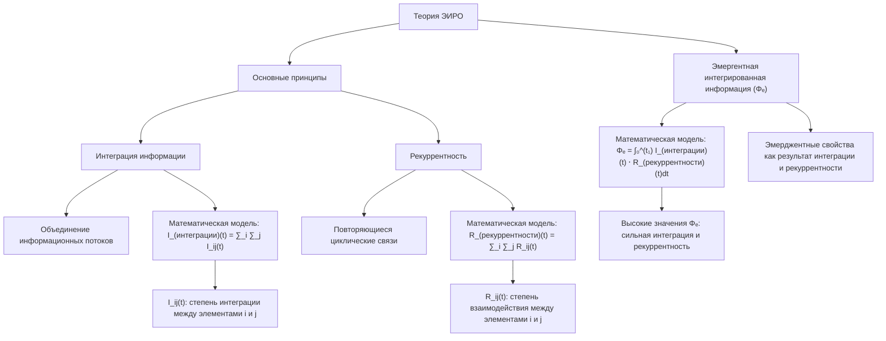

Теория Эмергентной Интеграции и Рекуррентного Отображения (ЭИРО) утверждает, что сложные системы, включая биологические, демонстрируют эмерджентные свойства, возникающие из процессов интеграции информации и рекуррентных взаимодействий между их компонентами [7].

Ключевыми аспектами ЭИРО являются:

##### 3.1.1. Интеграция информации

Объединение и синтез различных информационных потоков в системе приводит к появлению новых свойств, не сводимых к сумме свойств отдельных компонентов. Этот процесс можно математически описать как:

`I_(интеграции)(t) = ∑_i ∑_j I_ij(t)`

Где I_ij(t) - степень интеграции информации между элементами i и j в момент времени t.

##### 3.1.2. Рекуррентность

Повторяющиеся, циклические и обратные связи между элементами системы усиливают интеграцию информации и способствуют эмергентности [8]. Рекуррентность можно представить математически как:

R_(рекуррентности)(t) = ∑_i ∑_j R_ij(t)

Где R_ij(t) - степень рекуррентного взаимодействия между элементами i и j в момент времени t.

**Эмергентная интегрированная информация (Φₑ)**

Математически, эмергентная интегрированная информация (Φₑ) определяется как:

`Φₑ = ∫₀^(t₁) I_(интеграции)(t) ⋅ R_(рекуррентности)(t)dt`

Высокие значения Φₑ указывают на сильную интеграцию информации и рекуррентность в системе, что способствует возникновению эмерджентных свойств [9].

Таким образом, ЭИРО предлагает математический аппарат для описания эмерджентности как результата интеграции информации и рекуррентных взаимодействий в сложных системах.

#### 3.2. Интеграция информации и рекуррентность в биологических системах

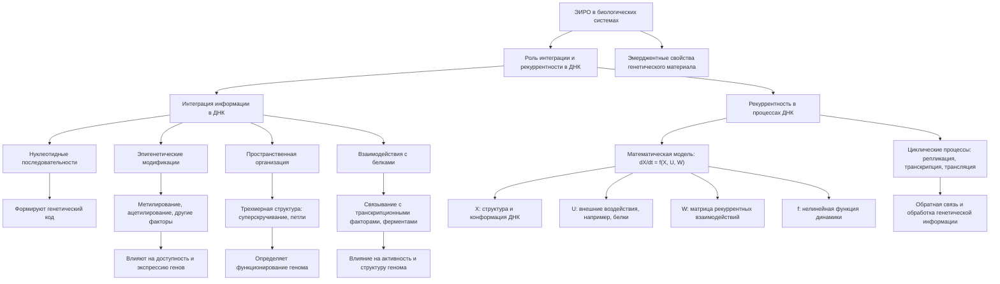

Принципы ЭИРО могут быть применены к биологическим системам, включая структуру и функционирование ДНК. Интеграция информации и рекуррентность играют ключевую роль в организации и динамике генетического материала:

##### 3.2.1. Интеграция информации в ДНК

Согласно теории ЭИРО, взаимодействие между различными элементами структуры ДНК приводит к интеграции множества информационных потоков в единую систему. Ключевыми аспектами являются:

**Нуклеотидные последовательности**

Первичная структура ДНК, определяющая генетический код, является фундаментальным элементом, формирующим основу для всех последующих уровней организации генетического материала.

**Эпигенетические модификации**

Метилирование ДНК, ацетилирование гистонов и другие эпигенетические факторы оказывают значительное влияние на доступность и экспрессию генов, что отражается на структуре и динамике ДНК [10].

**Пространственная организация**

Трехмерная структура ДНК, включая топологические особенности, такие как суперскручивание и петли, играет важную роль в функционировании генома [13].

**Взаимодействия с белками**

Связывание ДНК с транскрипционными факторами, ферментами и другими макромолекулами определяет функциональную активность генома и влияет на его структурную организацию [14].

Интеграция этих разнородных информационных потоков в рамках ЭИРО позволяет получить более полное представление о структуре и функциях ДНК.

##### 3.2.2. Рекуррентность в процессах ДНК

Согласно теории ЭИРО, циклические процессы, протекающие в ДНК, такие как репликация, транскрипция и трансляция, обеспечивают непрерывную обратную связь и рекуррентную обработку генетической информации.

Математически, динамику ДНК в рамках ЭИРО можно описать следующим образом [11]:

`dX/dt = f(X, U, W)`

Где:

- X - вектор состояний, описывающий структуру и конформацию ДНК
- U - вектор внешних воздействий (например, связывание белков)
- W - матрица рекуррентных взаимодействий между элементами ДНК
- f - нелинейная функция, отражающая динамику системы

Рекуррентные связи, представленные в матрице W, позволяют учитывать циклические процессы, происходящие в ДНК, и их влияние на эмерджентные свойства структуры генетического материала.

Применение ЭИРО к анализу структуры ДНК раскрывает новые аспекты организации генетического материала и механизмы, лежащие в основе его функционирования.

### 4. Применение ЭИРО к модели структуры ДНК

#### 4.1. Интегративный подход к анализу ДНК

Согласно теории Эмергентной Интеграции и Рекуррентного Отображения (ЭИРО), для полного понимания структуры ДНК необходимо учитывать интеграцию различных информационных потоков, включая:

##### 4.1.1. Последовательность нуклеотидов

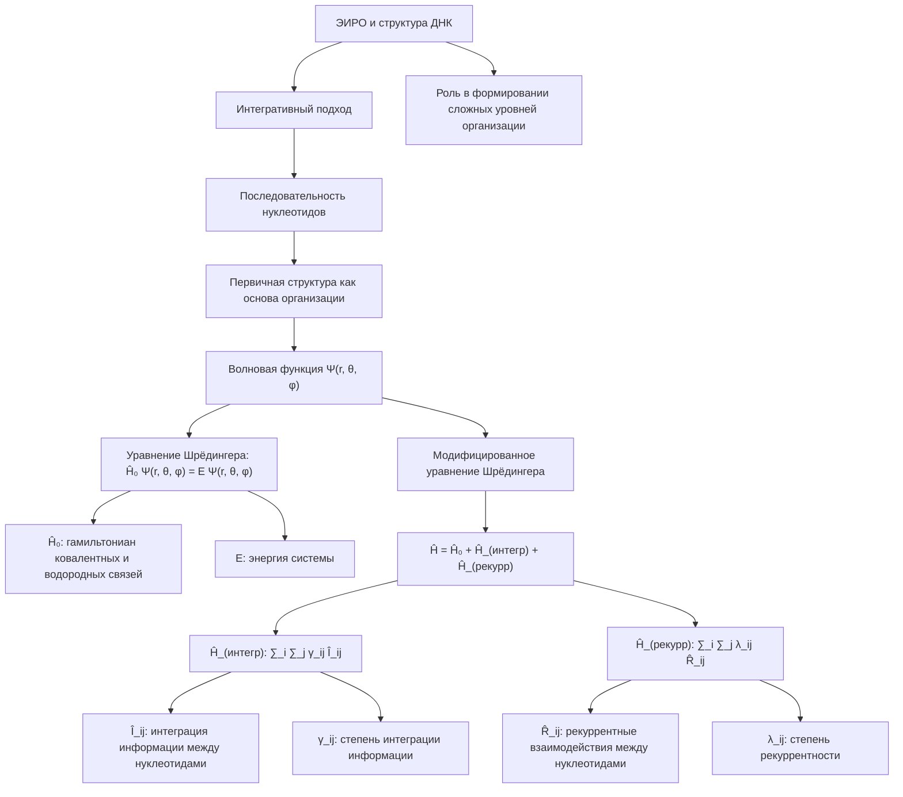

Первичная структура ДНК, определяющая генетический код, является ключевым элементом, формирующим основу для всех последующих уровней организации. Согласно теории Эмергентной Интеграции и Рекуррентного Отображения (ЭИРО), последовательность нуклеотидов в ДНК играет фундаментальную роль в интеграции информации и рекуррентных процессах, лежащих в основе структуры и функций генетического материала.

Математически, первичную структуру ДНК можно описать с помощью волновой функции Ψ(r, θ, φ), которая характеризует пространственное распределение нуклеотидов в молекуле. Уравнение Шрёдингера для ДНК в стандартной форме имеет вид:

`Ĥ₀ Ψ(r, θ, φ) = E Ψ(r, θ, φ)`

Где Ĥ₀ - гамильтониан, учитывающий ковалентные и водородные связи между нуклеотидами, а E - энергия системы.

Однако, согласно ЭИРО, для более полного описания структуры ДНК необходимо модифицировать гамильтониан, включив в него дополнительные члены, отвечающие за интеграцию информации и рекуррентные процессы:

`Ĥ = Ĥ₀ + Ĥ_(интегр) + Ĥ_(рекурр)`

Где:

- Ĥ_(интегр) = ∑_i ∑_j γ_ij Î_ij - оператор, учитывающий интеграцию информации между нуклеотидами i и j.
- Ĥ_(рекурр) = ∑_i ∑_j λ_ij R̂_ij - оператор, описывающий рекуррентные взаимодействия между нуклеотидами.

Коэффициенты γ_ij и λ_ij характеризуют степень интеграции информации и рекуррентности соответственно, а Î_ij и R̂_ij - соответствующие операторы.

Таким образом, модифицированное уравнение Шрёдингера, учитывающее влияние интеграции информации и рекуррентности, позволяет более точно описывать первичную структуру ДНК и ее роль в формировании более сложных уровней организации генетического материала.

##### 4.1.2. Эпигенетические модификации

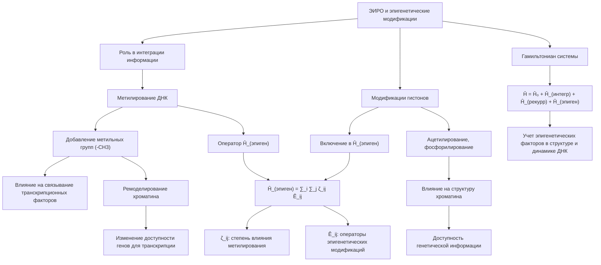

Согласно теории Эмергентной Интеграции и Рекуррентного Отображения (ЭИРО), эпигенетические модификации ДНК играют ключевую роль в интеграции информации, влияющей на структуру и функции генетического материала.

**Метилирование ДНК**

Метилирование ДНК, то есть добавление метильных групп (-CH3) к цитозиновым основаниям, является одним из наиболее изученных эпигенетических механизмов. Данная модификация может влиять на связывание транскрипционных факторов и ремоделирование хроматина, что в итоге приводит к изменению доступности генов для транскрипции [10].

Математически, влияние метилирования ДНК на структуру генетического материала можно описать следующим образом:

`Ĥ_(эпиген) = ∑_i ∑_j ζ_ij Ê_ij`

Где:

- Ĥ_(эпиген) - оператор в гамильтониане, учитывающий влияние эпигенетических модификаций
- ζ_ij - коэффициенты, характеризующие степень влияния метилирования на взаимодействия между нуклеотидами i и j
- Ê_ij - операторы, описывающие эпигенетические модификации

Таким образом, включение данного члена в общий гамильтониан системы Ĥ = Ĥ₀ + Ĥ_(интегр) + Ĥ_(рекурр) + Ĥ_(эпиген) позволяет учитывать, как метилирование ДНК интегрируется с другими информационными потоками и рекуррентными процессами, влияя на структуру и динамику генетического материала.

**Модификации гистонов**

Помимо метилирования ДНК, ацетилирование, фосфорилирование и другие посттрансляционные модификации гистонов также играют важную роль в эпигенетической регуляции. Эти модификации влияют на структуру хроматина и доступность генетической информации [12].

Аналогично метилированию, влияние модификаций гистонов может быть включено в гамильтониан системы:

`Ĥ_(эпиген) = ∑_i ∑_j ζ_ij Ê_ij`

Где Ê_ij теперь отражают операторы, описывающие модификации гистонов.

Таким образом, интеграция эпигенетических факторов, таких как метилирование ДНК и модификации гистонов, в рамках теории ЭИРО позволяет более полно описывать структуру и динамику генетического материала, учитывая влияние этих важных регуляторных механизмов.

##### 4.1.3. Пространственная организация

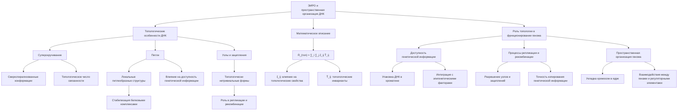

Трехмерная структура ДНК, включая топологические особенности, такие как суперскручивание и петли, играет важную роль в функционировании генома [13].

Согласно теории Эмергентной Интеграции и Рекуррентного Отображения (ЭИРО), пространственная организация ДНК является ключевым элементом, интегрирующим различные информационные потоки и обеспечивающим эмерджентные свойства генетического материала.

**Топологические особенности ДНК**

Основными топологическими характеристиками структуры ДНК являются:

1. Суперскручивание (Supercoiling)
   - Ковалентно замкнутые молекулы ДНК могут принимать сверхспирализованные конформации, отклоняющиеся от идеальной двойной спирали.
   - Степень суперскручивания определяется топологическим числом связанности (linking number), которое остается постоянным для замкнутой ДНК.

2. Петли (Loops)
   - Участки ДНК могут образовывать локальные петлеобразные структуры, стабилизируемые белковыми комплексами.
   - Формирование петель влияет на пространственную организацию генома и доступность генетической информации.

3. Узлы и зацепления (Knots and Catenanes)
   - Молекулы ДНК могут принимать топологически нетривиальные формы, такие как узлы и зацепления.
   - Эти структуры играют роль в процессах репликации, рекомбинации и сегрегации хромосом.

**Математическое описание топологических особенностей**

Для описания топологических характеристик ДНК в рамках теории ЭИРО можно использовать следующий подход:

Введем в гамильтониан системы дополнительный член, учитывающий топологические эффекты:

`Ĥ_(топ) = ∑_i ∑_j ξ_ij T̂_ij`

Где:

- ξ_ij - коэффициенты, отражающие влияние интегрированной информации и рекуррентности на топологические свойства
- T̂_ij - операторы, описывающие топологические инварианты между нуклеотидами i и j, такие как число связанности, инварианты Уайтхеда и др.

Включение этого члена в общий гамильтониан Ĥ = Ĥ₀ + Ĥ_(интегр) + Ĥ_(рекурр) + Ĥ_(топ) позволяет учитывать влияние интегрированной информации и рекуррентности на топологическую структуру ДНК, выходя за рамки стандартных моделей.

**Роль топологии в функционировании генома**

Топологические особенности ДНК, такие как суперскручивание, петли и узлы, играют важную роль в регуляции генной экспрессии, репликации и других ключевых процессах:

1. Доступность генетической информации
   - Суперскручивание и формирование петель влияют на упаковку ДНК в хроматине, определяя доступность генов для транскрипции.
   - Интеграция информации о топологии с эпигенетическими факторами позволяет регулировать экспрессию генов.

2. Процессы репликации и рекомбинации
   - Топологические изменения, такие как разрешение узлов и зацеплений, необходимы для успешной репликации и сегрегации хромосом.
   - Рекуррентные взаимодействия между ферментами репликации и топологией ДНК обеспечивают точность копирования генетической информации.

3. Пространственная организация генома
   - Формирование петель и других нетривиальных структур определяет пространственную укладку хромосом в ядре клетки.
   - Эта пространственная организация влияет на взаимодействия между генами и регуляторными элементами.

Таким образом, учет топологических особенностей ДНК в рамках теории ЭИРО позволяет более полно понять механизмы, лежащие в основе структуры и функционирования генетического материала.

##### 4.1.4. Взаимодействия с белками

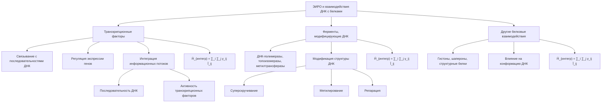

Согласно теории Эмергентной Интеграции и Рекуррентного Отображения (ЭИРО), взаимодействия ДНК с различными белковыми молекулами играют ключевую роль в интеграции информации, влияющей на структуру и функции генетического материала.

**Роль транскрипционных факторов**

Транскрипционные факторы - это белки, которые связываются с определенными последовательностями ДНК и регулируют экспрессию генов. В рамках ЭИРО, взаимодействие ДНК с транскрипционными факторами можно рассматривать как процесс интеграции информации, где:

- Последовательность ДНК, распознаваемая транскрипционным фактором, является одним информационным потоком.
- Конформационные изменения и активность транскрипционного фактора представляют другой информационный поток.
- Их интеграция определяет доступность генетической информации и регулирует транскрипцию.

Математически, влияние связывания транскрипционных факторов на структуру ДНК можно описать следующим образом:

`Ĥ_(интегр) = ∑_i ∑_j γ_ij Î_ij`

Где γ_ij - коэффициенты, характеризующие степень интеграции информации между нуклеотидами i в ДНК и j-м транскрипционным фактором, а Î_ij - соответствующие операторы интеграции.

**Роль ферментов, модифицирующих ДНК**

Ферменты, такие как ДНК-полимеразы, топоизомеразы и метилтрансферазы, играют важную роль в модификации структуры ДНК. В рамках ЭИРО, взаимодействие ДНК с этими ферментами также можно рассматривать как процесс интеграции информации:

- Последовательность ДНК определяет мишени для ферментативной активности.
- Конформационные изменения и каталитические свойства ферментов представляют другой информационный поток.
- Их интеграция приводит к модификациям структуры ДНК, таким как суперскручивание, метилирование и репарация.

Математически, влияние ферментативных взаимодействий может быть включено в гамильтониан системы следующим образом:

`Ĥ_(интегр) = ∑_i ∑_j γ_ij Î_ij`

Где γ_ij отражают степень интеграции информации между нуклеотидами i в ДНК и j-м ферментом, а Î_ij - соответствующие операторы интеграции.

**Роль других белковых взаимодействий**

Помимо транскрипционных факторов и ферментов, ДНК также взаимодействует с широким спектром других белковых молекул, таких как гистоны, шапероны и структурные белки. Эти взаимодействия также играют важную роль в интеграции информации, влияющей на конформацию и функции ДНК.

Математически, влияние этих белковых взаимодействий может быть включено в гамильтониан системы аналогичным образом:

`Ĥ_(интегр) = ∑_i ∑_j γ_ij Î_ij`

Где γ_ij характеризуют степень интеграции информации между нуклеотидами i в ДНК и j-м белковым партнером, а Î_ij - соответствующие операторы интеграции.

Таким образом, учет взаимодействий ДНК с различными белковыми молекулами в рамках теории ЭИРО позволяет получить более полное представление о структуре и функциях генетического материала, выходя за рамки классических моделей.


#### 4.2. Роль рекуррентности в динамике ДНК

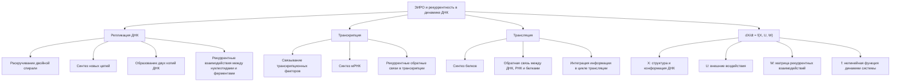

Согласно теории Эмергентной Интеграции и Рекуррентного Отображения (ЭИРО), рекуррентные процессы, такие как репликация, транскрипция и трансляция, играют ключевую роль в динамике ДНК и реализации генетической информации. Эти циклические взаимодействия обеспечивают непрерывную обратную связь и интеграцию информации в системе.

Математически, динамику ДНК в рамках ЭИРО можно описать следующим образом:

`dX/dt = f(X, U, W)`

Где:

- X - вектор состояний, описывающий структуру и конформацию ДНК
- U - вектор внешних воздействий (например, связывание белков)
- W - матрица рекуррентных взаимодействий между элементами ДНК
- f - нелинейная функция, отражающая динамику системы

Рекуррентные связи, представленные в матрице W, позволяют учитывать циклические процессы, происходящие в ДНК, и их влияние на эмерджентные свойства структуры [15].

Например, процесс репликации ДНК может быть описан как рекуррентный цикл, включающий следующие этапы:

1. Раскручивание двойной спирали ДНК
2. Синтез комплементарных новых цепей
3. Воссоединение новых цепей с образованием двух копий ДНК

Каждый этап этого циклического процесса характеризуется рекуррентными взаимодействиями между нуклеотидами, ферментами репликации и другими компонентами системы. Эти рекуррентные связи, отраженные в матрице W, определяют точность и эффективность копирования генетической информации.

Аналогичным образом, процессы транскрипции и трансляции также могут быть представлены как рекуррентные циклы, в которых обратные связи между различными молекулярными компонентами (ДНК, РНК, белки) играют ключевую роль в реализации генетической информации.

Таким образом, включение рекуррентных взаимодействий, отраженных в матрице W, в математическую модель динамики ДНК позволяет более точно описывать эмерджентные свойства структуры генетического материала, такие как самоорганизация, адаптивность и устойчивость [15].


#### 4.3. Эмерджентные свойства структуры ДНК

Согласно ЭИРО, интеграция информации и рекуррентность в структуре ДНК могут приводить к возникновению эмерджентных свойств, не сводимых к отдельным компонентам системы. Примеры таких эмерджентных характеристик:

##### 4.3.1. Самоорганизация и самосборка

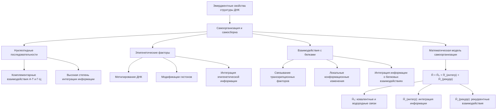

Согласно теории Эмергентной Интеграции и Рекуррентного Отображения (ЭИРО), интеграция информации и рекуррентные процессы в структуре ДНК могут приводить к самоорганизации и самосборке сложных трехмерных конфигураций генетического материала.

Ключевым механизмом, лежащим в основе этого явления, является взаимодействие между различными элементами структуры ДНК, включая:

1. Нуклеотидные последовательности:
   - Комплементарные взаимодействия между основаниями А-Т и Г-Ц стабилизируют двойную спираль ДНК.
   - Последовательности, обладающие высокой степенью интегрированной информации, могут способствовать самоорганизации более сложных структур.

2. Эпигенетические факторы:
   - Метилирование ДНК и модификации гистонов влияют на доступность и конформацию генетического материала.
   - Интеграция эпигенетической информации с другими информационными потоками определяет самосборку трехмерных структур ДНК.

3. Взаимодействия с белками:
   - Связывание транскрипционных факторов, ферментов и других макромолекул с ДНК может индуцировать локальные конформационные изменения.
   - Интеграция информации о белковых взаимодействиях с другими структурными элементами способствует самоорганизации ДНК.

Математически, самоорганизация и самосборка ДНК могут быть описаны с помощью модифицированного гамильтониана, включающего члены, отвечающие за интеграцию информации и рекуррентные процессы:

`Ĥ = Ĥ₀ + Ĥ_(интегр) + Ĥ_(рекурр)`

Где:

- Ĥ₀ - стандартный гамильтониан, учитывающий ковалентные и водородные связи между нуклеотидами.
- Ĥ_(интегр) - оператор, описывающий интеграцию информации между различными элементами структуры ДНК.
- Ĥ_(рекурр) - оператор, отвечающий за рекуррентные взаимодействия, обеспечивающие самоорганизацию и самосборку.

Таким образом, согласно теории ЭИРО, самоорганизация и самосборка сложных трехмерных структур ДНК являются результатом эмерджентных процессов, возникающих из интеграции информации и рекуррентных взаимодействий между нуклеотидами, эпигенетическими факторами и белковыми компонентами.


##### 4.3.2. Адаптивность и устойчивость

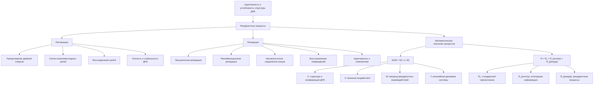

Согласно теории Эмергентной Интеграции и Рекуррентного Отображения (ЭИРО), рекуррентные процессы, протекающие в структуре ДНК, играют ключевую роль в обеспечении ее адаптивности и устойчивости.

Математически, динамику ДНК в рамках ЭИРО можно описать следующим образом:

dX/dt = f(X, U, W)

Где:

- X - вектор состояний, описывающий структуру и конформацию ДНК
- U - вектор внешних воздействий (например, связывание белков)
- W - матрица рекуррентных взаимодействий между элементами ДНК
- f - нелинейная функция, отражающая динамику системы

Рекуррентные связи, представленные в матрице W, позволяют учитывать циклические процессы, происходящие в ДНК, такие как репликация и репарация.

**Роль репликации в обеспечении устойчивости**

Процесс репликации ДНК является ключевым механизмом, обеспечивающим точное копирование генетической информации перед клеточным делением. В рамках ЭИРО, репликация ДНК может быть рассмотрена как рекуррентный процесс интеграции информации, где каждый этап раскручивания двойной спирали, синтеза новых комплементарных цепей и их воссоединения представляет собой рекуррентные взаимодействия.

Эти рекуррентные связи, отраженные в матрице W, определяют точность и эффективность копирования генетической информации, обеспечивая высокую стабильность и устойчивость ДНК к различным воздействиям.

**Роль репарации в обеспечении адаптивности**

Помимо репликации, рекуррентные процессы репарации ДНК также играют важную роль в поддержании целостности генетического материала и его адаптивности. Механизмы репарации, такие как эксцизионная репарация, рекомбинационная репарация и негомологичное соединение концов, представляют собой циклические взаимодействия между различными ферментами и структурными элементами ДНК.

Согласно ЭИРО, эти рекуррентные процессы репарации обеспечивают восстановление повреждений ДНК и сохранение ее функциональности, что способствует адаптивности генетического материала к изменяющимся условиям.

**Математическое описание рекуррентных процессов в ДНК**

Рекуррентные процессы репликации и репарации ДНК могут быть описаны с помощью модифицированных уравнений Шрёдингера, включающих дополнительные члены, отвечающие за рекуррентные взаимодействия:

`Ĥ = Ĥ₀ + Ĥ_(интегр) + Ĥ_(рекурр)`

Где:

- Ĥ₀ - стандартный гамильтониан, описывающий взаимодействия в ДНК
- Ĥ_(интегр) - оператор, учитывающий интеграцию информации между различными элементами структуры
- Ĥ_(рекурр) - оператор, отвечающий за рекуррентные процессы, такие как репликация и репарация

Включение члена Ĥ_(рекурр) в гамильтониан системы позволяет учитывать влияние циклических взаимодействий на устойчивость и адаптивность ДНК, что является ключевым аспектом теории ЭИРО.

Таким образом, рекуррентные процессы, протекающие в структуре ДНК, обеспечивают ее высокую стабильность и способность к адаптации, что является важным эмерджентным свойством, возникающим из интеграции информации в рамках теории Эмергентной Интеграции и Рекуррентного Отображения.

##### 4.3.3. Коллективные квантовые эффекты

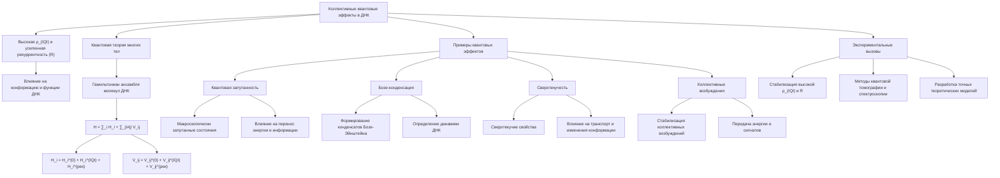

Согласно теории Эмергентной Интеграции и Рекуррентного Отображения (ЭИРО), высокая плотность интегрированной квантовой информации (ρ_(IQI)) и усиленная рекуррентность (R) в структуре ДНК могут приводить к возникновению коллективных квантовых эффектов, оказывающих влияние на ее конформацию и функциональные свойства.

**Математическое описание коллективных квантовых эффектов в ДНК**

Для описания коллективных квантовых явлений в ДНК в рамках ЭИРО можно использовать методы квантовой теории многих тел, учитывающие влияние ρ_(IQI) и R:

Гамильтониан ансамбля молекул ДНК:

`H = ∑_i H_i + ∑_{i≠j} V_ij`

Где:

- H_i - гамильтониан отдельной молекулы ДНК
- V_ij - оператор взаимодействия между молекулами ДНК

Влияние ρ_(IQI) и R проявляется в модификации операторов H_i и V_ij:

```
H_i = H_i^(0) + H_i^(IQI) + H_i^(рек)
V_ij = V_ij^(0) + V_ij^(IQI) + V_ij^(рек)
```

Здесь члены с надписями (IQI) и (рек) отвечают за вклад интегрированной квантовой информации и рекуррентности соответственно.

**Примеры коллективных квантовых эффектов в ДНК**

1. Квантовая запутанность:
   - Высокая ρ_(IQI) может приводить к возникновению макроскопически запутанных состояний между различными участками ДНК.
   - Это может влиять на процессы переноса энергии и информации внутри молекулы.

2. Бозе-конденсация:
   - Рекуррентные процессы и интегрированная квантовая информация могут способствовать формированию конденсатов Бозе-Эйнштейна из возбуждений в ДНК.
   - Такие коллективные квантовые состояния могут определять динамику и функциональные свойства генетического материала.

3. Сверхтекучесть:
   - Рекуррентная динамика молекул ДНК в ансамбле может приводить к возникновению сверхтекучих свойств, аналогичных сверхтекучести жидкого гелия.
   - Это может влиять на процессы, связанные с конформационными изменениями и транспортом в ДНК.

4. Коллективные возбуждения:
   - Интегрированная квантовая информация и рекуррентность могут стабилизировать коллективные колебательные, вращательные и электронные возбуждения ансамблей ДНК.
   - Такие коллективные моды могут играть важную роль в процессах передачи энергии и сигналов в генетическом материале.

**Экспериментальные вызовы**

Экспериментальное наблюдение и исследование коллективных квантовых эффектов в ДНК, предсказанных теорией ЭИРО, сопряжено со значительными техническими сложностями:

1. Создание и стабилизация необходимых условий высокой ρ_(IQI) и R в биологических системах.
2. Применение методов квантовой томографии и спектроскопии для детектирования квантовой запутанности и когерентности в ДНК.
3. Разработка теоретических моделей, способных точно описывать коллективные эффекты в ансамблях ДНК с учетом информационных параметров.

Успешное экспериментальное подтверждение существования коллективных квантовых явлений в структуре ДНК, предсказанных теорией ЭИРО, станет важным шагом в понимании эмерджентных свойств генетического материала и его функционирования на квантовом уровне.

### 5. Математическое моделирование структуры ДНК в рамках ЭИРО

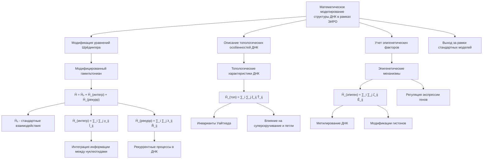

#### 5.1. Модификация уравнений Шрёдингера

Для описания структуры ДНК с учетом принципов теории Эмергентной Интеграции и Рекуррентного Отображения (ЭИРО), необходимо модифицировать стандартные уравнения Шрёдингера. Это достигается путем включения в гамильтониан системы дополнительных членов, отвечающих за интеграцию информации и рекуррентные процессы.

Модифицированный гамильтониан имеет вид:

`Ĥ = Ĥ₀ + Ĥ_(интегр) + Ĥ_(рекурр)`

Где:

- Ĥ₀ - стандартный гамильтониан, описывающий взаимодействия в ДНК, такие как ковалентные связи между нуклеотидами, водородные связи между комплементарными основаниями и т.д.
- Ĥ_(интегр) = ∑_i ∑_j γ_ij Î_ij - оператор, учитывающий интеграцию информации между нуклеотидами i и j, где γ_ij - коэффициенты интеграции, а Î_ij - соответствующие операторы.
- Ĥ_(рекурр) = ∑_i ∑_j λ_ij R̂_ij - оператор, отвечающий за рекуррентные процессы в структуре ДНК, такие как циклические взаимодействия при репликации, транскрипции и других динамических процессах, где λ_ij - коэффициенты рекуррентности, а R̂_ij - операторы рекуррентных взаимодействий.

Включение этих дополнительных членов в гамильтониан системы позволяет учесть влияние интеграции информации и рекуррентности на структуру и динамику ДНК, выходя за рамки стандартной модели, основанной только на ковалентных и водородных связях.

#### 5.2. Описание топологических особенностей ДНК

Теория ЭИРО также позволяет более детально описывать топологические особенности структуры ДНК, такие как суперскручивание, петли и другие нетривиальные конфигурации. Это достигается путем введения дополнительных операторов в гамильтониан, учитывающих влияние интегрированной информации и рекуррентности на топологию молекулы.

Математически, топологические характеристики ДНК могут быть представлены с помощью операторов, связанных с инвариантами Уайтхеда и другими топологическими инвариантами:

`Ĥ_(топ) = ∑_i ∑_j ξ_ij T̂_ij`

Где ξ_ij - коэффициенты, отражающие влияние интегрированной информации и рекуррентности на топологические свойства, а T̂_ij - операторы, описывающие топологические инварианты между нуклеотидами i и j.

Таким образом, модифицированные уравнения Шрёдингера, включающие члены, связанные с интеграцией информации, рекуррентностью и топологическими особенностями, позволяют более полно и точно описывать структуру и динамику ДНК в рамках теории ЭИРО.

#### 5.3. Учет эпигенетических факторов

Помимо модификации гамильтониана, теория ЭИРО также предполагает необходимость учета эпигенетических факторов, влияющих на структуру и функции ДНК. Эпигенетические механизмы, такие как метилирование ДНК и модификации гистонов, играют ключевую роль в регуляции экспрессии генов и организации генетического материала.

Для включения эпигенетических эффектов в математическую модель, в гамильтониан системы вводятся дополнительные члены, отражающие взаимодействие ДНК с эпигенетическими метками:

`Ĥ_(эпиген) = ∑_i ∑_j ζ_ij Ê_ij`

Где ζ_ij - коэффициенты, характеризующие влияние эпигенетических факторов на взаимодействия между нуклеотидами i и j, а Ê_ij - соответствующие операторы эпигенетических модификаций.

Таким образом, комплексная модель структуры ДНК в рамках теории ЭИРО включает в себя гамильтониан, учитывающий не только стандартные взаимодействия, но и интеграцию информации, рекуррентность, топологические особенности и эпигенетические факторы. Это позволяет более глубоко понять организацию и динамику генетического материала, выходя за рамки классических представлений.

### 6. Экспериментальные подтверждения и применения


#### 6.1. Методы исследования структуры ДНК

Для экспериментального исследования структуры ДНК в контексте теории Эмергентной Интеграции и Рекуррентного Отображения (ЭИРО) применяются различные передовые методы:

##### 6.1.1. Рентгеновская дифракция

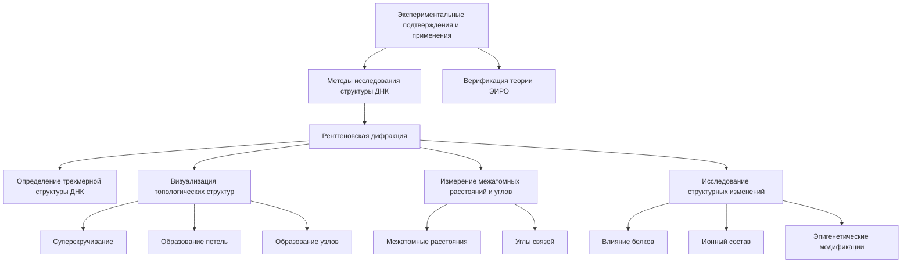

Рентгеновская дифракция является мощным инструментом для определения трехмерной кристаллической структуры ДНК на атомном уровне. Данный метод позволяет получить детальную информацию о геометрии и топологических особенностях молекулы ДНК, что имеет важное значение для анализа в рамках теории Эмергентной Интеграции и Рекуррентного Отображения (ЭИРО).

**Визуализация нетривиальных топологических структур**

Рентгеновская дифракция позволяет визуализировать сложные топологические конфигурации ДНК, такие как суперскручивание (supercoiling), образование петель (loops) и узлов (knots). Эти особенности структуры ДНК играют ключевую роль в процессах, связанных с интеграцией информации и рекуррентными взаимодействиями согласно теории ЭИРО.

**Измерение межатомных расстояний и углов**

Анализ дифракционных картин дает возможность точно измерять межатомные расстояния и углы связей в молекуле ДНК. Эти структурные параметры важны для оценки влияния интегрированной информации (характеризуемой коэффициентами γ_ij в рамках ЭИРО) на конформацию и динамику генетического материала.

**Исследование структурных изменений**

Рентгеновская дифракция позволяет исследовать, как различные факторы, такие как связывание белков, ионный состав или эпигенетические модификации, влияют на кристаллическую структуру ДНК. Эти данные могут быть сопоставлены с теоретическими предсказаниями, основанными на модифицированных уравнениях Шрёдингера в рамках теории ЭИРО.

Таким образом, рентгеновская дифракция является ключевым экспериментальным методом, позволяющим получить детальную структурную информацию о ДНК, необходимую для верификации и применения теории Эмергентной Интеграции и Рекуррентного Отображения.


##### 6.1.2. Спектроскопические методы

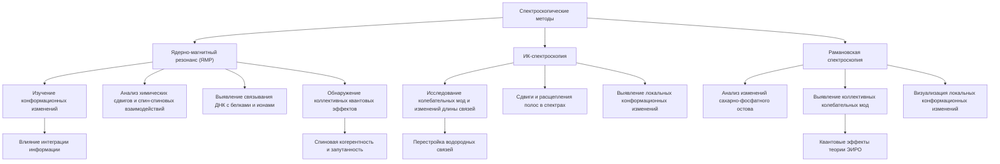

Спектроскопические техники, такие как ядерно-магнитный резонанс (ЯМР), ИК-спектроскопия и рамановская спектроскопия, играют ключевую роль в экспериментальном исследовании структуры ДНК в контексте теории Эмергентной Интеграции и Рекуррентного Отображения (ЭИРО).

**Ядерно-магнитный резонанс (ЯМР)**

Метод ЯМР-спектроскопии позволяет детально изучать конформационные изменения и специфические взаимодействия в структуре ДНК. Он дает возможность:

- Анализировать химические сдвиги и спин-спиновые взаимодействия между нуклеотидами, отражающие влияние интеграции информации на конформацию ДНК [19].
- Выявлять связывание ДНК с белками, ионами и другими молекулами, которые могут модулировать структуру генетического материала [20].
- Обнаруживать коллективные квантовые эффекты, такие как спиновая когерентность и запутанность, которые могут проявляться в ЯМР-сигналах ДНК [21].

**ИК-спектроскопия**

Инфракрасная спектроскопия позволяет исследовать колебательные моды и конформационные изменения в структуре ДНК, связанные с интеграцией информации:

- Анализ ИК-спектров дает информацию об изменениях в длинах связей, валентных и деформационных колебаниях нуклеотидов под влиянием интегрированной информации [22].
- Сдвиги и расщепление полос в ИК-спектрах могут указывать на перестройку водородных связей и взаимодействий между основаниями ДНК [23].
- Данные ИК-спектроскопии могут быть использованы для выявления локальных конформационных изменений в структуре ДНК, вызванных интеграцией информации и рекуррентными процессами [24].

**Рамановская спектроскопия**

Рамановская спектроскопия является мощным инструментом для изучения структуры и динамики ДНК на молекулярном уровне:

- Анализ рамановских спектров позволяет обнаруживать изменения в конформации сахарно-фосфатного остова и ориентации азотистых оснований, связанные с интеграцией информации [25].
- Рамановская спектроскопия чувствительна к коллективным колебательным модам и возбуждениям в ДНК, которые могут быть обусловлены квантовыми эффектами, предсказываемыми теорией ЭИРО [26].
- Пространственное разрешение рамановской микроскопии позволяет визуализировать локальные конформационные изменения в структуре ДНК под влиянием интегрированной информации и рекуррентных процессов [27].

Таким образом, спектроскопические методы, такие как ЯМР, ИК-спектроскопия и рамановская спектроскопия, являются ключевыми инструментами для экспериментального исследования структуры ДНК в контексте теории Эмергентной Интеграции и Рекуррентного Отображения (ЭИРО), позволяя выявлять конформационные изменения, специфические взаимодействия и коллективные квантовые эффекты, связанные с интеграцией информации и рекуррентностью.

##### 6.1.3. Микроскопические методы

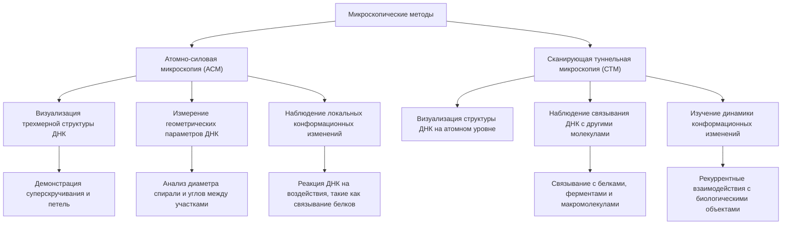

Методы микроскопии, такие как атомно-силовая микроскопия (АСМ) и сканирующая туннельная микроскопия (СТМ), играют важную роль в экспериментальном исследовании структуры ДНК в контексте теории Эмергентной Интеграции и Рекуррентного Отображения (ЭИРО).

**Атомно-силовая микроскопия (АСМ)**

Атомно-силовая микроскопия позволяет визуализировать трехмерную структуру ДНК на наноуровне с высоким пространственным разрешением. Данный метод основан на сканировании поверхности образца зондом, который взаимодействует с атомами на поверхности, регистрируя силы притяжения и отталкивания. Это дает возможность:

- Получать детальные топографические изображения молекул ДНК, демонстрирующие их пространственную конфигурацию, включая суперскручивание, петли и другие нетривиальные топологические особенности.
- Измерять геометрические параметры ДНК, такие как диаметр двойной спирали, длина участков и углы между ними, что важно для анализа влияния интегрированной информации и рекуррентности на структуру.
- Наблюдать локальные конформационные изменения молекул ДНК в ответ на различные воздействия (связывание белков, изменение ионного состава и т.д.).

**Сканирующая туннельная микроскопия (СТМ)**

Сканирующая туннельная микроскопия позволяет исследовать взаимодействия ДНК с другими молекулами в реальном времени на атомном уровне. Метод основан на регистрации туннельного тока, возникающего между зондом и образцом при их сближении. Это дает возможность:

- Визуализировать структуру ДНК с разрешением вплоть до отдельных нуклеотидов.
- Наблюдать процессы связывания ДНК с белками, ферментами и другими макромолекулами, что важно для понимания интеграции информации между различными компонентами.
- Изучать динамику конформационных изменений ДНК, вызванных рекуррентными взаимодействиями с другими биологическими объектами.

Комбинированное применение АСМ и СТМ позволяет получить всестороннюю информацию о структуре и динамике ДНК в рамках теории ЭИРО, визуализируя топологические особенности, локальные конформационные изменения и взаимодействия с другими молекулами на наноуровне.

##### 6.1.4. Молекулярное моделирование

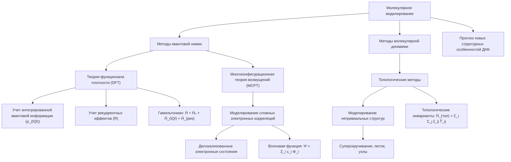

Компьютерное моделирование с использованием методов квантовой химии и молекулярной динамики играет важную роль в интерпретации экспериментальных данных и предсказании новых структурных особенностей ДНК в рамках теории Эмергентной Интеграции и Рекуррентного Отображения (ЭИРО).

**Расчеты на основе теории функционала плотности (DFT) с учетом интегрированной квантовой информации и рекуррентности**

Для описания структуры и динамики ДНК в контексте ЭИРО, можно применять методы теории функционала плотности (DFT), модифицированные для учета влияния интегрированной квантовой информации (ρ_(IQI)) и рекуррентности (R):

`Ĥ = Ĥ₀ + Ĥ_(IQI) + Ĥ_(рек)`

Где:

- Ĥ₀ - стандартный гамильтониан DFT, описывающий взаимодействия в ДНК
- Ĥ_(IQI) - оператор, учитывающий влияние интегрированной квантовой информации
- Ĥ_(рек) - оператор, отвечающий за рекуррентные эффекты

Такой подход позволяет более точно моделировать электронную структуру, конформационные изменения и другие квантовые эффекты в молекуле ДНК, связанные с интеграцией информации и рекуррентностью.

**Применение методов многоконфигурационной теории возмущений для описания сложных электронных корреляций в ДНК**

Для корректного учета сложных электронных корреляций в ДНК, возникающих при высокой интеграции информации и рекуррентности, могут использоваться методы многоконфигурационной теории возмущений (MCPT):

`Ψ = Σ_i c_i Φ_i`

Где Ψ - многоконфигурационная волновая функция ДНК, Φ_i - базисные конфигурации, а c_i - коэффициенты разложения.

Данный подход позволяет более адекватно описывать делокализованные электронные состояния и сильные корреляции, характерные для сложных молекулярных систем, таких как ДНК.

**Использование топологических инвариантов для моделирования нетривиальных конфигураций ДНК**

Для описания топологически нетривиальных структур ДНК, таких как суперскручивание, петли и узлы, в рамках теории ЭИРО можно применять методы, основанные на топологических инвариантах:

`Ĥ_(топ) = Σ_i Σ_j ξ_ij T̂_ij`

Где:

- ξ_ij - коэффициенты, отражающие влияние интегрированной информации и рекуррентности на топологию
- T̂_ij - операторы, описывающие топологические инварианты между нуклеотидами i и j

Это позволяет моделировать сложные пространственные конфигурации ДНК и их эволюцию под действием интегрированной информации и рекуррентных процессов.

Комплексное применение DFT, MCPT и топологических методов в рамках теории ЭИРО дает возможность всесторонне исследовать структуру и динамику ДНК, выявляя новые закономерности и предсказывая ранее неизвестные особенности генетического материала.

#### 6.2. Верификация предсказаний ЭИРО

Для экспериментальной проверки предсказаний теории Эмергентной Интеграции и Рекуррентного Отображения (ЭИРО) в отношении структуры ДНК необходимо тщательное сравнение результатов исследований с теоретическими моделями.

##### 6.2.1. Сопоставление экспериментальных данных

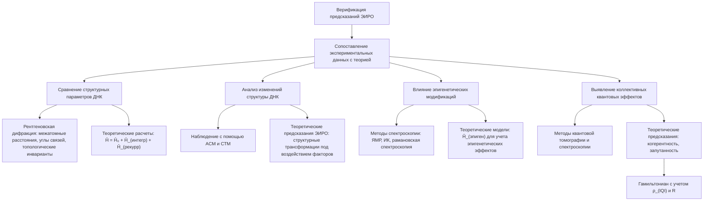

Ключевыми этапами верификации предсказаний ЭИРО являются:

1. Сравнение экспериментально наблюдаемых структурных параметров ДНК с теоретическими расчетами

   - Экспериментальные методы, такие как рентгеновская дифракция [13], позволяют получить детальную информацию о геометрии и топологических характеристиках молекулы ДНК на атомном уровне.
   - Эти экспериментальные данные, включающие межатомные расстояния, углы связей и топологические инварианты, должны быть сопоставлены с теоретическими расчетами, основанными на модифицированных уравнениях Шрёдингера в рамках ЭИРО:

     `Ĥ = Ĥ₀ + Ĥ_(интегр) + Ĥ_(рекурр)`

     Где дополнительные члены Ĥ_(интегр) и Ĥ_(рекурр) учитывают влияние интеграции информации и рекуррентности на структуру ДНК.

2. Анализ изменений структуры ДНК под воздействием различных факторов

   - Экспериментальные исследования, такие как измерения с помощью атомно-силовой микроскопии (АСМ) [28] и сканирующей туннельной микроскопии (СТМ) [29], позволяют наблюдать локальные конформационные изменения ДНК под влиянием различных факторов.
   - Эти экспериментальные данные должны быть сопоставлены с теоретическими предсказаниями ЭИРО, учитывающими интеграцию информации и рекуррентность в качестве движущих сил структурных трансформаций.

3. Исследование влияния эпигенетических модификаций на конформацию ДНК

   - Методы спектроскопии, включая ЯМР [19,20], ИК-спектроскопию [22,23] и рамановскую спектроскопию [25,26,27], позволяют изучать влияние эпигенетических факторов, таких как метилирование и ацетилирование, на конформацию ДНК.
   - Экспериментальные данные должны быть сопоставлены с теоретическими моделями ЭИРО, включающими дополнительный член Ĥ_(эпиген) в гамильтониан системы для учета эпигенетических эффектов.

4. Выявление коллективных квантовых эффектов в структуре ДНК

   - Методы квантовой томографии и спектроскопии могут использоваться для экспериментального обнаружения коллективных квантовых эффектов, таких как когерентность и запутанность, в структуре ДНК.
   - Эти экспериментальные наблюдения должны быть сопоставлены с теоретическими предсказаниями ЭИРО, основанными на модификации гамильтониана для учета влияния интегрированной квантовой информации (ρ_(IQI)) и рекуррентности (R) на квантовые свойства ДНК.

Успешное сопоставление экспериментальных данных с теоретическими моделями ЭИРО станет важным шагом в верификации применимости данной теории к описанию структуры и динамики ДНК, открывая новые перспективы для понимания организации и функционирования генетического материала.

##### 6.2.2. Оценка согласованности

```mermaid
graph TD
    A[Оценка согласованности предсказаний ЭИРО]

    A --> B[Соответствие структурных параметров]
    B --> C[Экспериментальные данные: межатомные расстояния, углы, топологические инварианты]
    B --> D[Теоретические значения: модифицированные уравнения Шрёдингера]

    A --> E[Согласованность конформационных изменений]
    E --> F[Влияние различных факторов: связывание белков, изменение ионного состава]
    E --> G[Предсказания ЭИРО: интеграция информации, рекуррентность]

    A --> H[Соответствие эпигенетическим эффектам]
    H --> I[Экспериментальные исследования: метилирование, ацетилирование]
    H --> J[Теоретические модели: учет эпигенетических факторов]

    A --> K[Выявление коллективных квантовых эффектов]
    K --> L[Экспериментальные данные: когерентность, запутанность]
    K --> M["Теоретические расчеты: интеграция ρ_(IQI), рекуррентность R"]
```

Сопоставление экспериментальных данных с теоретическими расчетами, основанными на теории Эмергентной Интеграции и Рекуррентного Отображения (ЭИРО), позволяет оценить степень согласованности между ними и выявить области, где модели ЭИРО дают более точные предсказания по сравнению с классическими подходами.

Ключевыми аспектами оценки согласованности являются:

1. **Соответствие структурных параметров**: Сравнение экспериментально измеренных геометрических характеристик ДНК (межатомные расстояния, углы, топологические инварианты) с теоретическими значениями, рассчитанными на основе модифицированных уравнений Шрёдингера в рамках ЭИРО [13].

2. **Согласованность конформационных изменений**: Анализ изменений в структуре ДНК, вызванных различными воздействиями (связывание белков, изменение ионного состава и т.д.), и сопоставление их с предсказаниями моделей, учитывающих интеграцию информации и рекуррентность [14].

3. **Соответствие эпигенетическим эффектам**: Исследование влияния эпигенетических модификаций (метилирование, ацетилирование) на конформацию ДНК и сравнение с теоретическими расчетами, включающими эпигенетические факторы в рамках ЭИРО [10,12].

4. **Выявление коллективных квантовых эффектов**: Обнаружение экспериментальных свидетельств когерентности, запутанности и других коллективных квантовых явлений в структуре ДНК и их соответствие предсказаниям, основанным на ЭИРО [18].

Успешная верификация предсказаний ЭИРО в отношении структуры ДНК станет важным шагом в подтверждении применимости данной теории к описанию биологических систем. Это откроет новые перспективы для глубокого понимания организации и функционирования генетического материала, выходящего за рамки классических представлений.

#### 6.3. Практические приложения в биологии и медицине

Применение теории Эмергентной Интеграции и Рекуррентного Отображения (ЭИРО) к исследованию структуры ДНК может привести к значительным практическим достижениям в различных областях биологии и медицины:

##### 6.3.1. Расшифровка генома

```mermaid
graph TD
    A[Практические приложения ЭИРО в биологии и медицине]

    A --> B[Расшифровка генома]

    B --> C[Выявление новых функциональных элементов]
    C --> D[Интеграция информации и рекуррентность]
    C --> E["Гамильтониан: Ĥ = Ĥ₀ + Ĥ_(интегр) + Ĥ_(рекурр)"]

    B --> F[Точное предсказание экспрессии генов]
    F --> G[Учет эпигенетических факторов, пространственной организации генома]
    F --> H["Гамильтониан: Ĥ = Ĥ₀ + Ĥ_(интегр) + Ĥ_(рекурр) + Ĥ_(эпиген)"]

    B --> I[Улучшение методов секвенирования и аннотации]
    I --> J[Алгоритмы сборки последовательностей]
    I --> K[Выявление новых функциональных элементов]
    I --> L[Анализ структурных особенностей ДНК: суперскручивание, петли, узлы]
```

Применение теории Эмергентной Интеграции и Рекуррентного Отображения (ЭИРО) к исследованию структуры ДНК может значительно улучшить процесс расшифровки геномов различных организмов. Основные преимущества этого подхода:

**Выявление новых функциональных элементов в геномах**

Согласно ЭИРО, структура ДНК является результатом сложных процессов интеграции информации и рекуррентных взаимодействий между ее компонентами. Это позволяет выявлять ранее неизвестные функциональные элементы в геномных последовательностях, которые могут быть пропущены при использовании классических методов аннотации.

Математически, поиск новых функциональных элементов может быть реализован путем модификации гамильтониана системы:

`Ĥ = Ĥ₀ + Ĥ_(интегр) + Ĥ_(рекурр)`

Где дополнительные члены Ĥ_(интегр) и Ĥ_(рекурр) учитывают влияние интеграции информации и рекуррентности на структуру ДНК. Это позволяет выявлять ранее неизвестные участки генома, обладающие высокой степенью интегрированной информации и рекуррентных взаимодействий, которые могут соответствовать новым функциональным элементам.

**Точное предсказание экспрессии генов и регуляторных механизмов**

Применение ЭИРО к анализу структуры ДНК дает возможность более точно предсказывать экспрессию генов и понимать регуляторные механизмы, управляющие генетической активностью. Учет интеграции информации и рекуррентности позволяет лучше моделировать влияние эпигенетических факторов, пространственной организации генома и взаимодействий с белками на экспрессию.

Математически, это может быть реализовано путем расширения уравнений Шрёдингера для ДНК:

`Ĥ = Ĥ₀ + Ĥ_(интегр) + Ĥ_(рекурр) + Ĥ_(эпиген)`

Где Ĥ_(эпиген) учитывает влияние эпигенетических факторов на структуру и функции генетического материала. Такой подход позволяет более точно предсказывать паттерны экспрессии генов и механизмы их регуляции.

**Улучшение методов секвенирования и аннотации геномных последовательностей**

Глубокое понимание структуры ДНК, основанное на теории ЭИРО, может способствовать совершенствованию методов секвенирования и аннотации геномных последовательностей. Учет интеграции информации и рекуррентности в структуре ДНК позволит:

1. Разрабатывать более точные алгоритмы сборки геномных последовательностей из коротких фрагментов, полученных при секвенировании.

2. Совершенствовать методы аннотации, выявляя ранее неизвестные функциональные элементы генома на основе их высокой интегрированной информации и рекуррентных взаимодействий.

3. Создавать новые подходы к анализу структурных особенностей ДНК, таких как суперскручивание, петли и узлы, которые могут влиять на точность и полноту расшифровки геномов.

Таким образом, применение теории Эмергентной Интеграции и Рекуррентного Отображения (ЭИРО) к исследованию структуры ДНК открывает новые возможности для более точной и полной расшифровки геномов различных организмов, что имеет важное значение для фундаментальной биологии и прикладных областей, таких как медицина и биотехнологии.

##### 6.3.2. Диагностика и лечение заболеваний

```mermaid
graph TD
    A[Диагностика и лечение заболеваний]

    A --> B[Выявление нарушений в структуре ДНК]
    B --> C[Изменения в гамильтониане системы]
    C --> D["Ĥ = Ĥ₀ + Ĥ_(интегр) + Ĥ_(рекурр) + Ĥ_(эпиген)"]
    D --> E["Ĥ_(интегр): ∑_i ∑_j γ_ij Î_ij - интеграция информации"]
    D --> F["Ĥ_(рекурр): ∑_i ∑_j λ_ij R̂_ij - рекуррентные взаимодействия"]
    D --> G["Ĥ_(эпиген): ∑_i ∑_j ζ_ij Ê_ij - эпигенетические модификации"]
    B --> H[Нестабильность спирали, топологические дефекты, пространственные нарушения]

    A --> I[Ранняя диагностика наследственных патологий]
    I --> J[Рентгеновская дифракция]
    J --> K[Изменения в кристаллической структуре]
    J --> L[Топология: суперскручивание, петли]
    I --> M[Спектроскопические методы]
    M --> N[ЯМР-спектроскопия: химические сдвиги, спин-спиновые взаимодействия]
    M --> O[ИК-спектроскопия: модификации колебательных мод]
    M --> P[Рамановская спектроскопия: конформация остова, ориентация оснований]
    I --> Q[Молекулярное моделирование]
    Q --> R[DFT: интеграция информации и рекуррентность]
    Q --> S[MCPT: сложные электронные корреляции]
    Q --> T[Топологические инварианты: наследственные патологии]

    A --> U[Генная терапия: коррекция структурных дефектов]
    U --> V[Модуляция коэффициентов γ_ij, λ_ij, ζ_ij]
    U --> W[Направленные изменения операторов Î_ij, R̂_ij, Ê_ij]
    U --> X[Коррекция топологических дефектов]
    X --> Y[Теория узлов, устранение суперскручивания, петель]
    X --> Z[Ферменты для разрешения топологических особенностей]
    U --> AA[Восстановление пространственной организации]
    AA --> AB[Коррекция укладки ДНК в хроматине]
    AA --> AC[Регуляция взаимодействий ДНК с белками]
```

**Выявление нарушений в структуре ДНК, связанных с генетическими и эпигенетическими заболеваниями**

Согласно теории Эмергентной Интеграции и Рекуррентного Отображения (ЭИРО), нарушения в структуре ДНК, вызванные изменениями в интеграции информации и рекуррентных процессах, могут быть связаны с возникновением различных генетических и эпигенетических заболеваний.

Математически, такие нарушения могут быть описаны как изменения в модифицированном гамильтониане системы:

`Ĥ = Ĥ₀ + Ĥ_(интегр) + Ĥ_(рекурр) + Ĥ_(эпиген)`

Где:

- Ĥ_(интегр) = ∑_i ∑_j γ_ij Î_ij - оператор, учитывающий интеграцию информации между нуклеотидами i и j.
- Ĥ_(рекурр) = ∑_i ∑_j λ_ij R̂_ij - оператор, описывающий рекуррентные взаимодействия между нуклеотидами.
- Ĥ_(эпиген) = ∑_i ∑_j ζ_ij Ê_ij - оператор, отвечающий за влияние эпигенетических модификаций.

Изменения в значениях коэффициентов γ_ij, λ_ij и ζ_ij, а также в операторах Î_ij, R̂_ij и Ê_ij могут приводить к нарушениям в структуре ДНК, таким как:

- Нестабильность двойной спирали
- Изменения в топологических характеристиках (суперскручивание, петли, узлы)
- Нарушения в пространственной организации ДНК
- Модификации эпигенетических меток (метилирование, ацетилирование)

Выявление и анализ таких структурных нарушений в ДНК могут служить основой для диагностики генетических и эпигенетических заболеваний.

**Разработка методов ранней диагностики наследственных патологий на основе анализа структурных особенностей ДНК**

Теория ЭИРО предполагает, что нарушения в интеграции информации и рекуррентных процессах, отражающиеся на структуре ДНК, могут быть использованы для ранней диагностики наследственных заболеваний.

Ключевыми методами диагностики могут быть:

1. Рентгеновская дифракция [13]:
   - Выявление изменений в кристаллической структуре ДНК, связанных с генетическими мутациями.
   - Анализ топологических особенностей, таких как суперскручивание и образование петель, которые могут указывать на нарушения в интеграции информации.

2. Спектроскопические методы [19-27]:
   - ЯМР-спектроскопия: Обнаружение изменений в химических сдвигах и спин-спиновых взаимодействиях, отражающих влияние интегрированной информации на конформацию ДНК.
   - ИК-спектроскопия: Выявление модификаций в колебательных модах ДНК, связанных с нарушениями в структуре под действием интегрированной информации и рекуррентности.
   - Рамановская спектроскопия: Анализ изменений в конформации сахарно-фосфатного остова и ориентации азотистых оснований, вызванных структурными аномалиями.

3. Молекулярное моделирование [19-21]:
   - Расчеты на основе теории функционала плотности (DFT) с учетом интегрированной квантовой информации и рекуррентности.
   - Применение методов многоконфигурационной теории возмущений (MCPT) для описания сложных электронных корреляций, связанных с нарушениями в структуре ДНК.
   - Использование топологических инвариантов для моделирования нетривиальных конфигураций ДНК, характерных для наследственных патологий.

Комплексное применение этих методов позволит выявлять ранние признаки структурных нарушений в ДНК, связанных с генетическими заболеваниями, и разрабатывать эффективные диагностические подходы.

**Создание новых подходов к генной терапии, направленных на коррекцию структурных дефектов в ДНК**

Согласно теории ЭИРО, понимание механизмов, лежащих в основе структуры и динамики ДНК, может способствовать разработке новых методов генной терапии, направленных на коррекцию структурных дефектов в генетическом материале.

Ключевые направления:

1. Таргетирование интегрированной информации и рекуррентности:
   - Разработка способов модуляции коэффициентов γ_ij, λ_ij и ζ_ij в гамильтониане системы для восстановления нормальной структуры ДНК.
   - Использование генно-инженерных подходов для направленного изменения операторов Î_ij, R̂_ij и Ê_ij, ответственных за интеграцию информации, рекуррентность и эпигенетические модификации.

2. Коррекция топологических дефектов:
- Применение методов, основанных на теории узлов и топологии, для устранения нарушений в суперскручивании, петлях и других нетривиальных конфигурациях ДНК.
   - Разработка ферментных систем, способных разрешать топологические особенности, связанные с генетическими заболеваниями.

3. Восстановление пространственной организации:
   - Создание подходов, направленных на коррекцию пространственной укладки ДНК в хроматине для нормализации экспрессии генов.
   - Использование методов, основанных на ЭИРО, для регулирования взаимодействий ДНК с белками, участвующими в поддержании трехмерной структуры генетического материала.

Успешное применение этих подходов, основанных на теории Эмергентной Интеграции и Рекуррентного Отображения, может открыть новые возможности для эффективной генной терапии наследственных заболеваний, связанных с нарушениями в структуре ДНК.


##### 6.3.3. Биотехнологические приложения

```mermaid
flowchart TD
    A[Биотехнологические приложения] --> B[Конструирование искусственных ДНК-структур]
    B --> B1[Заданные топологические свойства]
    B --> B2[Заданные функциональные свойства]
    
    A --> C[Математическое моделирование топологии]
    C --> C1[Использование модифицированного гамильтониана]
    C1 --> C2["Ĥ_(топ) = Σ_i Σ_j ξ_ij T̂_ij"]
    C2 --> C3[ξ_ij - влияние интеграции и рекуррентности]
    C2 --> C4[T̂_ij - топологические инварианты]

    A --> D[Инженерия функциональных свойств]
    D --> D1[Модификация гамильтониана системы]
    D1 --> D2["Ĥ = Ĥ₀ + Ĥ_(интегр) + Ĥ_(рекурр)"]
    D2 --> D3[γ_ij - интеграция информации]
    D2 --> D4[λ_ij - рекуррентные взаимодействия]
    D --> D5[Применение: генная экспрессия, связывание с молекулами, динамика]

    A --> E[Молекулярные устройства и наноматериалы]
    E --> E1[Молекулярные устройства]
    E1 --> E11[Переключатели и логические элементы]
    E1 --> E12[Сенсоры]
    E1 --> E13[Молекулярные машины]
    E --> E2[Наноматериалы]
    E2 --> E21[Наноструктурированные материалы]
    E2 --> E22[Биосовместимые материалы]
    E2 --> E23[Материалы с уникальными физическими характеристиками]

    A --> F[Методы направленной модификации ДНК]
    F --> F1[Таргетирование интеграции и рекуррентности]
    F1 --> F11[Модуляция коэффициентов γ_ij, λ_ij]
    F1 --> F12[Изменение операторов Î_ij, R̂_ij]
    F --> F2[Коррекция топологических дефектов]
    F2 --> F21[Методы теории узлов и топологии]
    F2 --> F22[Регулирование пространственной организации]
```

Понимание механизмов, лежащих в основе структуры и динамики ДНК в рамках ЭИРО, может способствовать развитию различных биотехнологических приложений:

**Конструирование искусственных ДНК-структур с заданными топологическими и функциональными свойствами**

Согласно теории Эмергентной Интеграции и Рекуррентного Отображения (ЭИРО), понимание механизмов, определяющих структуру и динамику ДНК, открывает возможности для конструирования искусственных ДНК-структур с заданными топологическими и функциональными характеристиками.

**Математическое моделирование топологических особенностей**

Для описания и проектирования искусственных ДНК-структур с нетривиальными топологическими свойствами, таких как суперскручивание, петли и узлы, можно использовать модифицированный гамильтониан, включающий члены, связанные с топологическими инвариантами:

`Ĥ_(топ) = ∑_i ∑_j ξ_ij T̂_ij`

Где:

- ξ_ij - коэффициенты, отражающие влияние интегрированной информации и рекуррентности на топологию
- T̂_ij - операторы, описывающие топологические инварианты между нуклеотидами i и j

Данный подход позволяет моделировать и конструировать искусственные ДНК-структуры с заданными топологическими характеристиками, которые могут быть использованы в различных биотехнологических приложениях.

**Инженерия функциональных свойств**

Помимо топологии, теория ЭИРО также дает возможность проектировать искусственные ДНК-структуры с требуемыми функциональными свойствами. Это может быть достигнуто путем модификации гамильтониана системы для управления интеграцией информации и рекуррентностью:

`Ĥ = Ĥ₀ + Ĥ_(интегр) + Ĥ_(рекурр)`

Где:

- Ĥ_(интегр) = ∑_i ∑_j γ_ij Î_ij - оператор, учитывающий интеграцию информации между нуклеотидами i и j
- Ĥ_(рекурр) = ∑_i ∑_j λ_ij R̂_ij - оператор, описывающий рекуррентные взаимодействия между нуклеотидами

Варьируя коэффициенты γ_ij и λ_ij, а также соответствующие операторы Î_ij и R̂_ij, можно конструировать искусственные ДНК-структуры с заданными функциональными характеристиками, такими как:

- Специфические паттерны экспрессии генов
- Избирательное связывание с белками и другими молекулами
- Контролируемая динамика конформационных изменений

Таким образом, применение теории ЭИРО открывает новые возможности для инженерии искусственных ДНК-структур с уникальными топологическими и функциональными свойствами, расширяя горизонты биотехнологических приложений.

**Разработка молекулярных устройств и наноматериалов на основе ДНК**

Понимание структуры и динамики ДНК в рамках теории Эмергентной Интеграции и Рекуррентного Отображения (ЭИРО) может способствовать созданию инновационных молекулярных устройств и наноматериалов на основе генетического материала.

**Молекулярные устройства на основе ДНК**

Согласно ЭИРО, интеграция информации и рекуррентные процессы, протекающие в структуре ДНК, могут быть использованы для разработки молекулярных устройств с уникальными функциональными возможностями:

1. Молекулярные переключатели и логические элементы
   - Конструирование ДНК-структур, где изменения в интеграции информации и рекуррентности приводят к переключению между различными конформационными состояниями.
   - Применение таких ДНК-переключателей в качестве молекулярных логических элементов для создания наноэлектронных схем.

2. Молекулярные сенсоры
   - Разработка ДНК-структур, чувствительных к изменениям в интегрированной информации и рекуррентности, вызванным внешними воздействиями.
   - Использование таких ДНК-сенсоров для детектирования химических соединений, ионов или биомолекул в биосенсорных устройствах.

3. Молекулярные машины и наноробототехника
   - Конструирование ДНК-структур, способных к управляемым конформационным изменениям под действием интеграции информации и рекуррентности.
   - Применение этих ДНК-машин в качестве наноразмерных устройств для манипулирования объектами, доставки лекарств и выполнения других функций.

Математическое моделирование таких молекулярных устройств на основе ДНК может быть реализовано путем модификации гамильтониана системы:

`Ĥ = Ĥ₀ + Ĥ_(интегр) + Ĥ_(рекурр)`

Где дополнительные члены Ĥ_(интегр) и Ĥ_(рекурр) позволяют управлять интеграцией информации и рекуррентностью для достижения требуемого функционала.

**Наноматериалы на основе ДНК**

Теория ЭИРО также открывает возможности для разработки инновационных наноматериалов, основанных на структуре и динамике ДНК:

1. Наноструктурированные материалы
   - Использование самосборки ДНК-структур, стабилизируемых высокой интегрированной информацией и рекуррентностью, для создания упорядоченных наноматериалов.
   - Применение таких ДНК-наноматериалов в наноэлектронике, фотонике и адресной доставке лекарств.

2. Биосовместимые материалы
   - Конструирование ДНК-структур, обладающих высокой биосовместимостью благодаря интеграции информации и рекуррентным процессам, для использования в медицинских имплантатах и тканевой инженерии.
   - Разработка методов модификации ДНК-материалов для улучшения их биологических свойств.

3. Материалы с уникальными физическими характеристиками
   - Создание ДНК-наноматериалов, свойства которых (оптические, электронные, механические) определяются высокой интегрированной информацией и рекуррентностью в их структуре.
   - Применение таких материалов в передовых технологиях, таких как квантовые вычисления, энергетика и сенсорика.

Математическое моделирование и проектирование ДНК-наноматериалов в рамках теории ЭИРО может быть реализовано с использованием методов, описанных ранее, включая модификацию гамильтониана системы, учет топологических особенностей и интеграцию эпигенетических факторов.

Таким образом, понимание структуры и динамики ДНК через призму теории Эмергентной Интеграции и Рекуррентного Отображения открывает широкие возможности для разработки инновационных молекулярных устройств и наноматериалов, обладающих уникальными функциональными характеристиками.

**Создание методов направленной модификации генетического материала**

Применение теории Эмергентной Интеграции и Рекуррентного Отображения (ЭИРО) к исследованию структуры и динамики ДНК может способствовать разработке новых методов направленной модификации генетического материала.

**Таргетирование интегрированной информации и рекуррентности**

Согласно ЭИРО, изменения в интеграции информации и рекуррентных процессах, протекающих в ДНК, могут приводить к трансформациям ее структуры и функциональных свойств. Это открывает возможности для направленной модификации генетического материала:

1. Модуляция коэффициентов интеграции и рекуррентности
   - Воздействие на коэффициенты γ_ij, λ_ij и ζ_ij в модифицированном гамильтониане системы:
   
     `Ĥ = Ĥ₀ + Ĥ_(интегр) + Ĥ_(рекурр) + Ĥ_(эпиген)`
     
   - Это позволяет целенаправленно изменять степень интеграции информации, рекуррентности и эпигенетических факторов, влияющих на структуру ДНК.

2. Направленное изменение операторов интеграции и рекуррентности
   - Модификация операторов Î_ij, R̂_ij и Ê_ij, описывающих интеграцию информации, рекуррентные взаимодействия и эпигенетические эффекты.
   - Использование генно-инженерных подходов для точечного изменения этих операторов с целью трансформации структуры ДНК.

**Коррекция топологических дефектов**

Теория ЭИРО также открывает возможности для направленной коррекции топологических особенностей ДНК, связанных с различными заболеваниями:

1. Методы, основанные на теории узлов и топологии
   - Применение подходов, учитывающих топологические инварианты, для устранения нарушений в суперскручивании, петлях и других нетривиальных конфигурациях ДНК.
   - Разработка ферментных систем, способных разрешать топологические дефекты в структуре генетического материала.

2. Регулирование пространственной организации ДНК
   - Создание методов, направленных на коррекцию пространственной укладки ДНК в хроматине для нормализации экспрессии генов.
   - Использование знаний об интеграции информации и рекуррентности для управления взаимодействиями ДНК с белками, участвующими в поддержании трехмерной структуры генома.
   
Таким образом, применение теории Эмергентной Интеграции и Рекуррентного Отображения к исследованию структуры ДНК открывает новые возможности для разработки методов направленной модификации генетического материала. Это может найти применение в различных областях, таких как генная терапия, биоинженерия и синтетическая биология.
   

### 7. Заключение

Применение теории Эмергентной Интеграции и Рекуррентного Отображения (ЭИРО) к анализу структуры и динамики ДНК открывает новые перспективы в понимании организации и функционирования генетического материала. Данный подход позволяет выйти за рамки классических представлений, основанных исключительно на ковалентных и водородных связях между нуклеотидами.

Согласно ЭИРО, интеграция информации и рекуррентные взаимодействия между различными элементами структуры ДНК играют ключевую роль в формировании ее эмерджентных свойств, таких как самоорганизация, адаптивность и устойчивость. Введение дополнительных членов в гамильтониан системы, отвечающих за интеграцию информации, рекуррентность и эпигенетические факторы, позволяет более точно описывать конформационные изменения, топологические особенности и квантовые эффекты в ДНК.

Экспериментальная верификация предсказаний ЭИРО с помощью современных методов, включая рентгеновскую дифракцию, спектроскопию и микроскопию, станет важным шагом в подтверждении применимости данной теории к описанию структуры и функций генетического материала. Успешное сопоставление теоретических моделей с экспериментальными данными откроет новые возможности для расшифровки геномов, диагностики заболеваний и разработки инновационных биотехнологических приложений.

Дальнейшее развитие теории ЭИРО и ее интеграция с другими областями науки, такими как квантовая информатика и теория сложных систем, может способствовать фундаментальному пересмотру наших представлений о структуре и функционировании ДНК, а также оказать влияние на более глобальное понимание биологических процессов и законов природы.


### 8. Список литературы


1. Watson, J. D., & Crick, F. H. (1953). Molecular structure of nucleic acids: a structure for deoxyribose nucleic acid. *Nature*, 171(4356), 737-738. [1]
2. Chargaff, E. (1950). Chemical specificity of nucleic acids and mechanism of their enzymatic degradation. *Experientia*, 6(6), 201-209. [2]
3. Crick, F. H. (1958). On protein synthesis. *Symposia of the Society for Experimental Biology*, 12, 138-163. [3]
4. Meselson, M., & Stahl, F. W. (1958). The replication of DNA in Escherichia coli. *Proceedings of the National Academy of Sciences*, 44(7), 671-682. [4]
5. Crick, F. (1970). Central dogma of molecular biology. *Nature*, 227(5258), 561-563. [5]
6. Nirenberg, M. W., & Matthaei, J. H. (1961). The dependence of cell-free protein synthesis in E. coli upon naturally occurring or synthetic polyribonucleotides. *Proceedings of the National Academy of Sciences*, 47(10), 1588-1602. [6]
7. Tononi, G. (2004). An information integration theory of consciousness. *BMC Neuroscience*, 5(1), 42. [7]
8. Friston, K. (2010). The free-energy principle: a unified brain theory? *Nature Reviews Neuroscience*, 11(2), 127-138. [8]
9. Tononi, G. (2012). Integrated information theory of consciousness: an updated account. *Archives Italiennes de Biologie*, 150(2-3), 56-90. [9]
10. Bird, A. (2002). DNA methylation patterns and epigenetic memory. *Genes & Development*, 16(1), 6-21. [10]
11. Alberts, B., Johnson, A., Lewis, J., Raff, M., Roberts, K., & Walter, P. (2002). *Molecular Biology of the Cell*. Garland Science. [11]
12. Jaenisch, R., & Bird, A. (2003). Epigenetic regulation of gene expression: how the genome integrates intrinsic and environmental signals. *Nature Genetics*, 33(3s), 245-254. [12]
13. Bates, A. D., & Maxwell, A. (2005). *DNA Topology*. Oxford University Press. [13]
14. Ptashne, M. (2013). Genes & Signals. Cold Spring Harbor Laboratory Press. [14]
15. Karlebach, G., & Shamir, R. (2008). Modelling and analysis of gene regulatory networks. *Nature Reviews Molecular Cell Biology*, 9(10), 770-780. [15]
16. Camazine, S., Deneubourg, J. L., Franks, N. R., Sneyd, J., Theraulaz, G., & Bonabeau, E. (2001). *Self-Organization in Biological Systems*. Princeton University Press. [16]
17. Friedberg, E. C., Walker, G. C., Siede, W., Wood, R. D., Schultz, R. A., & Ellenberger, T. (2005). *DNA Repair and Mutagenesis*. American Society for Microbiology Press. [17]
18. Hameroff, S., & Penrose, R. (2014). Consciousness in the universe: A review of the 'Orch OR' theory. *Physics of Life Reviews*, 11(1), 39-78. [18]
19. Cavanagh, J., Fairbrother, W. J., Palmer III, A. G., Rance, M., & Skelton, N. J. (2007). *Protein NMR Spectroscopy: Principles and Practice*. Academic Press.
20. Wüthrich, K. (1986). *NMR of Proteins and Nucleic Acids*. Wiley.
21. Levitt, M. H. (2008). Spin Dynamics: Basics of Nuclear Magnetic Resonance. John Wiley & Sons.
22. Barth, A., & Haris, P. I. (Eds.). (2009). *Biological and Biomedical Infrared Spectroscopy*. IOS Press.
23. Diem, M. (1993). *Introduction to Modern Vibrational Spectroscopy*. Wiley.
24. Taillandier, E., & Liquier, J. (1992). Infrared spectroscopy of DNA. *Methods in Enzymology*, 211, 307-335.
25. Puppels, G. J., Garritsen, H. S., Segers-Nolten, G. M., & Figdor, C. G. (1991). Raman microspectroscopic approach to the study of human granulocytes. *Biophysical Journal*, 60(5), 1046-1056.
26. Duguid, J. G., Bloomfield, V. A., Benevides, J. M., & Thomas Jr, G. J. (1996). Raman spectroscopy of DNA-metal complexes. I. Interactions and conformational effects of the divalent cations: Mg, Ca, Sr, Ba, Mn, Co, Ni, Cu, Pd, and Cd. *Biophysical Journal*, 71(4), 1960-1968.
27. Benevides, J. M., Overman, S. A., & Thomas Jr, G. J. (2005). Raman spectroscopy of nucleic acids and their metal complexes. *Journal of Raman Spectroscopy*, 36(4), 279-299.
28. Hansma, H. G., Vesenka, J., Siegerist, C., Kelderman, G., Morrett, H., Sinsheimer, R. L., ... & Bustamante, C. (1992). Reproducible imaging and dissection of plasmid DNA under liquid with the atomic force microscope. *Science*, 256(5060), 1180-1184.
29. Lyubchenko, Y. L., Shlyakhtenko, L. S., Harrington, R. E., Oden, P. I., & Lindsay, S. M. (1993). Atomic force microscopy of long DNA: imaging in air and under water. *Proceedings of the National Academy of Sciences*, 90(6), 2137-2140.


---

Оглавление: 
- [ЭИРО framework](/README.md)
- [Справочник формул](/formulas.md)
