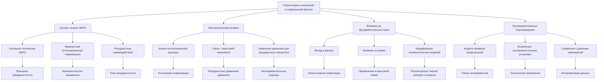

# Новая модель вселенной в современной физике

---

## Введение

Современная наука достигла значительных успехов в понимании фундаментальных законов природы, описывая мир через математические модели и теории, такие как общая теория относительности, квантовая механика и стандартная модель физики элементарных частиц. Однако существует ряд нерешённых вопросов и парадоксов, которые требуют нового подхода и переосмысления существующих концепций. Теория Эмергентной Интеграции и Рекуррентного Отображения (ЭИРО) предлагает новую модель вселенной, которая может дать ответы на некоторые из этих вопросов.

Данная диссертация посвящена анализу того, как новая модель вселенной, основанная на принципах ЭИРО, влияет на современные представления в физике, химии, квантовой химии и математике. Мы рассмотрим ключевые научные вопросы через призму ЭИРО, выявляя новые грани и аспекты, которые открываются при переходе к этой модели. Особое внимание уделяется формализму, математическому аппарату и возможным экспериментальным подтверждениям.

---

### 1. Теория Эмергентной Интеграции и Рекуррентного Отображения (ЭИРО)

#### 1.1. Основные положения ЭИРО

ЭИРО утверждает, что фундаментальные свойства сознания и материи возникают из процессов, объединяющих информацию через рекуррентные взаимодействия. Ключевым параметром является эмергентная интегрированная информация  Φₑ , учитывающая количество и качество интегрированной информации в контексте рекуррентной обработки:

`Φₑ = ∫₀^(t₁) I_(интеграции)(t) ⋅ R_(рекуррентности)(t)dt,`

где  I(интеграции)(t)  — степень объединения информации в момент времени  t , а  R(рекуррентности)(t)  — степень рекуррентной обработки.

#### 1.2. Математическое описание рекуррентных систем

Динамика систем описывается уравнениями состояния:

`d𝐱 / dt = 𝐟(𝐱(t), 𝐮(t), W),`

где  𝐱(t)  — состояние системы,  𝐮(t)  — внешние воздействия,  W  — матрица весов, включающая рекуррентные связи.

Предсказательные модели обновляются посредством байесовского обновления:

`P(θ | D) = P(D | θ) ⋅ P(θ) / P(D),`

где  θ  — параметры модели,  D  — данные.

#### 1.3. Эмпирические подтверждения

ЭИРО подкрепляется данными нейровизуализации, показывающими усиление активности в рекуррентных контурах при сознательных состояниях и снижение этой активности при нарушениях сознания. В экспериментах с визуальной маскировкой прерывание рекуррентной обработки препятствует осознанию стимула.

---

### 2. Новая модель вселенной и её влияние на физику

#### 2.1. Интеграция квантовой информации в космологии

Для описания степени интеграции квантовой информации и рекуррентности в пространстве-времени вводятся новые физические величины.

##### 2.1.1. Плотность интегрированной квантовой информации

Плотность интегрированной квантовой информации  ρ_(IQI)  характеризует количество квантовой информации, интегрированной в единице объёма пространства-времени:

`ρ_(IQI) = lim(Δ V → 0) Δ I / Δ V,`

где  Δ I  — изменение интегрированной информации в объёме  Δ V .

##### 2.1.2. Параметр рекуррентности

Параметр рекуррентности  R  характеризует степень рекуррентных взаимодействий квантовых состояний в пространстве-времени. Его можно связать с вероятностью повторных квантовых взаимодействий или с топологическими свойствами рекуррентных структур в квантовом вакууме.

#### 2.2. Модификация уравнений общей теории относительности

##### 2.2.1. Эффективное уравнение состояния тёмной энергии

Введение новых параметров позволяет определить эффективное уравнение состояния для тёмной энергии, зависящее от  ρ_(IQI)  и  R :

`w_(eff) = w₀ + w₁ f(ρ_(IQI), R),`

где  w₀  и  w₁  — константы, а  f  — функция, описывающая влияние интегрированной информации и рекуррентности на космологическую динамику.

##### 2.2.2. Модифицированные уравнения Эйнштейна

Новые параметры включаются в модифицированные уравнения Эйнштейна:

`G_(μν) + Λ g_(μν) = 8π G (T_(μν) + T_(μν)^(IQI)),`

  где  T_(μν)^(IQI)  — тензор энергии-импульса, связанный с интегрированной квантовой информацией и рекуррентными эффектами.

#### 2.3. Решение проблем тёмной материи и тёмной энергии

##### 2.3.1. Тёмная материя как эффект рекуррентных взаимодействий

Рекуррентные квантовые взаимодействия могут создавать эффекты, наблюдаемые как тёмная материя. Дополнительная интеграция квантовой информации приводит к изменению метрики пространства-времени, влияя на движение галактик.

##### 2.3.2. Тёмная энергия и ускоренное расширение вселенной

Интегрированная квантовая информация и рекуррентность могут объяснить ускоренное расширение вселенной без введения дополнительной тёмной энергии. Модификации метрики приводят к естественному ускорению.

##### 2.3.3. Квантовая гравитация и объединение теорий

ЭИРО предоставляет новый подход к квантовой гравитации, объединяя общую теорию относительности и квантовую механику через интеграцию информации и рекуррентные процессы.

---

### 3. Влияние на квантовую механику и квантовую химию

#### 3.1. Квантовая информация и энтропия

##### 3.1.1. Переосмысление принципа неопределённости

[Переосмысление принципа неопределённости в рамках теории ЭИРО](/Rethinking-the-uncertainty-principle-within-the-framework-of-the-theory.md)

**Традиционное представление**:

Принцип неопределённости Гейзенберга является фундаментальным положением квантовой механики, утверждающим, что невозможно одновременно точно измерить некоторые пары физически сопряжённых величин, таких как положение и импульс частицы. Математически это выражается через соотношения:

   `Δ x ⋅ Δ p ≥ ℏ / 2,`

   где  Δ x  и  Δ p  — неопределённости в положении и импульсе соответственно, а  ℏ  — приведённая постоянная Планка.

**Влияние ЭИРО**:

В рамках теории ЭИРО, интеграция информации и рекуррентность процессов влияют на фундаментальные ограничения измеримости. Интегрированная квантовая информация  ρ_(IQI)  и параметр рекуррентности  R  вносят дополнительные эффекты:

1. Динамическая неопределённость: Неопределённости могут зависеть от степени интеграции информации в системе. Это приводит к модифицированным соотношениям неопределённости:

   `Δ x ⋅ Δ p ≥ ℏ₍eff) / 2,`

   где  ℏ(eff) = ℏ f(ρ(IQI), R) , а  f  — функция коррекции, зависящая от интегрированной информации и рекуррентности.

2. Эффекты на малых масштабах: На планковских масштабах, где влияние рекуррентных процессов становится значительным, могут наблюдаться отклонения от стандартных соотношений неопределённости.

**Последствия**:

- Измеримости: Возможность более точного измерения некоторых параметров при определённых условиях интеграции информации.

- Квантовая гравитация: Новые соотношения неопределённости могут способствовать развитию теорий квантовой гравитации.

##### 3.1.2. Энтропия и когерентность

[Энтропия и когерентность](/Entropy-and-coherence.md)

**Энтропия в квантовой механике**:

Энтропия фон Неймана используется для описания неопределённости в квантовых состояниях:

   `S = -Tr(ρ ln ρ),`

   где  ρ  — матрица плотности системы.

**Роль рекуррентности**:

1. Сохранение когерентности: Рекуррентные процессы могут стабилизировать квантовые состояния, уменьшая энтропию системы и препятствуя декогеренции.

2. Энтропийные потоки: Введение понятия энтропийных потоков, зависящих от интеграции информации:

   `dS / dt = -γ I_(интеграции)(t),`

   где  γ  — коэффициент пропорциональности.

**Последствия для квантовых систем**:

- Декогеренция: Понимание механизмов декогеренции через призму ЭИРО позволяет разрабатывать методы защиты квантовых состояний.

- Квантовые вычисления: Увеличение времени жизни когерентных состояний способствует развитию квантовых компьютеров и квантовой криптографии.

#### 3.2. Химические связи и молекулярная динамика

##### 3.2.1. Рекуррентность в химических реакциях

[Рекуррентность в химических реакциях](/Recurrence-in-chemical-reactions.md)

**Традиционный взгляд**:

Химические реакции описываются переходами между энергетическими уровнями, взаимодействием электронных облаков и движением атомных ядер.

**Влияние ЭИРО**:

1. Рекуррентные взаимодействия: Введение рекуррентных процессов на уровне электронных взаимодействий способствует формированию устойчивых структур.

2. Каталитические эффекты: Рекуррентность может объяснить высокую эффективность ферментативных реакций и других каталитических процессов, где микроскопические рекуррентные взаимодействия ускоряют переходы между состояниями.

**Математическое описание**:

- Модифицированные потенциальные поверхности: Включение рекуррентных членов в уравнения движения:

   `V_(эфф) = V₀ + V_(рекуррент),`

   где  V_(рекуррент)  учитывает влияние рекуррентности.

**Практические последствия**:

- Управление реакциями: Возможность целенаправленного воздействия на рекуррентные процессы для управления химическими реакциями.

- Разработка новых катализаторов: Создание материалов с заданными рекуррентными свойствами для повышения эффективности процессов.

##### 3.2.2. Молекулярные орбитали и энергетические уровни

[Молекулярные орбитали и энергетические уровни](/Molecular-orbitals-and-energy-levels.md)

**Стандартная модель**:

Молекулярные орбитали образуются при взаимодействии атомных орбиталей и описываются уравнениями квантовой химии, такими как уравнения Хартри-Фока.

**Вклад ЭИРО**:

1. Интеграция информации в орбитали: Учёт интеграции информации между электронами приводит к корректировке орбиталей.

2. Новые энергетические уровни: Рекуррентные эффекты могут приводить к появлению дополнительных разрешённых или запрещённых энергетических состояний.

**Математическое моделирование**:

- Корректировка гамильтониана:

   `^H_(эфф) = ^H₀ + ^H_(интегр) + ^H_(рекуррент),`

   где  ^H(интегр)  и  ^H(рекуррент)  учитывают интеграцию информации и рекуррентность.

**Применения**:

- Точные расчёты: Улучшение точности квантово-химических расчётов для сложных молекул.

- Материалы с заданными свойствами: Разработка новых материалов, где энергетические уровни управляются через интеграцию информации.

---

### 4. Математические аспекты новой модели

#### 4.1. Топология рекуррентных структур

##### 4.1.1. Фрактальные и бесконечно-дробные структуры

[Фрактальные и бесконечно-дробные структуры](/Fractal-and-infinitesimal-structures.md)

**Фракталы в физике**:

Фрактальные структуры характеризуются самоподобием и дробной размерностью, часто встречаются в природных системах.

**Рекуррентные процессы и фракталы**:

1. Самоподобие рекуррентности: Рекуррентные взаимодействия на разных масштабах приводят к образованию фрактальных структур в пространстве состояний.

2. Дробная размерность системы: Использование методов фрактальной геометрии для описания таких систем, вводя дробные дифференциальные операторы.

**Математическое описание**:

- Фрактальные производные:

   `Dᵅ f(x) = 1 / Γ(n - α) dⁿ / dxⁿ ∫₀ˣ f(t) / (x - t)ᵅ ⁻ ⁿ ⁺} dt,`

   где  Dᵅ  — производная дробного порядка  α .

**Применения**:

- Моделирование сложных систем: Более точное описание динамики систем с фрактальными свойствами.

- Переходы между масштабами: Понимание, как рекуррентные процессы на микроскопическом уровне влияют на макроскопическое поведение.

##### 4.1.2. Топологическая квантовая теория поля

[Топологическая квантовая теория поля](/Topological-quantum-field-theory.md)

**Основы теории**:

Топологические квантовые теории поля (ТКТП) изучают топологические инварианты в квантовых теориях.

**Связь с ЭИРО**:

1. Топологические инварианты рекуррентности: Рекуррентные структуры могут быть описаны через топологические свойства, такие как числа Черна или инварианты Джонса.

2. Интеграция информации и топология: Процессы интеграции информации связаны с изменением топологических характеристик системы.

**Математические инструменты**:

- Калибровочные группы и пучки: Использование теории пучков и связностей для описания рекуррентных взаимодействий.

**Последствия для физики**:

- Новые состояния материи: Открытие топологических фаз, обусловленных рекуррентностью.

- Квантовый эффект Холла: Понимание существующих и новых топологических эффектов через призму ЭИРО.

#### 4.2. Новые математические методы

##### 4.2.1. Теория категорий и функторы

[Теория категорий и функторы](/Category-theory-and-functors.md)

**Основы теории категорий**:

Теория категорий предоставляет абстрактный язык для описания математических структур и их отношений через объекты и морфизмы.

**Применение в ЭИРО**:

1. Категории информационных структур: Определение объектов как информационных состояний, а морфизмов как процессов интеграции и рекуррентности.

2. Функторы и естественные преобразования: Описание переходов между различными информационными системами и их свойств.

**Математическая формализация**:

- Объекты  𝓞 : Состояния систем с определённой информацией.

- Морфизмы  𝓜 : Процессы перехода или интеграции информации.

- Функторы  F: 𝓒 → 𝓓 : Соответствия между категориями различных уровней сложност

**Преимущества**:

- Абстракция и универсальность: Возможность описания сложных систем независимо от конкретной реализации.

- Связь различных областей: Объединение квантовой механики, теории информации и топологии.

##### 4.2.2. Информационно-теоретические меры

[Информационно-теоретические меры](/Information-and-theoretical-measures.md)

**Необходимость новых мер**:

Традиционные меры энтропии могут быть недостаточны для описания сложных процессов интеграции информации и рекуррентности.

**Разработка новых мер**:

1. Энтропия Реньи и Цаллиса: Обобщения энтропии Шеннона для учета разнообразия информационных процессов:

   `S_q = 1 / 1 - q (( 1 - ∑ᵢ pᵢ^q )),`

   где  q  — параметр порядка энтропии.

2. Меры интегрированной информации: Введение функционалов, оценивающих степень интеграции и влияние рекуррентности:

   `Φ(ρ) = S(ρ_(разд)) - S(ρ),`

   где  ρ_(разд)  — состояние системы без интеграции информации.

**Применение**:

- Квантовые системы: Оценка запутанности и корреляции в квантовых состояниях.

- Комплексные сети: Анализ информационных потоков в нейронных и социальных сетях.

---

### 5. Экспериментальные проверки и предсказания

#### 5.1. Космологические наблюдения

##### 5.1.1. Измерение аномалий в движении галактик

[Измерение аномалий в движении галактик](/Measurement-of-anomalies-in-the-motion-of-galaxies.md)

**Традиционные наблюдения**:

Наблюдаемые кривые вращения галактик не соответствуют предсказаниям Ньютона и Эйнштейна без введения тёмной материи.

**Предсказания ЭИРО**:

1. Влияние интегрированной информации: Интеграция квантовой информации в масштабах галактик может изменять метрику пространства-времени, влияя на гравитационное поле.

2. Изменение законов гравитации: Рекуррентные эффекты приводят к модификации гравитационного взаимодействия без необходимости тёмной материи.

**Экспериментальные тесты**:

- Измерение кривых вращения: Сравнение наблюдаемых данных с предсказаниями модели ЭИРО.

- Гравитационное линзирование: Анализ отклонения света вокруг галактик и скоплений.

##### 5.1.2. Космический микроволновый фон

[Космический микроволновый фон](/Cosmic-microwave-background.md)

**Значение КМФ**:

Космический микроволновый фон (КМФ) содержит информацию о ранней вселенной и её эволюции.

**Влияние ЭИРО**:

1. Флуктуации температуры: Рекуррентные процессы в ранней вселенной могут оставлять характерные следы в флуктуациях КМФ.

2. Поляризация и аномалии: Возможность объяснения наблюдаемых аномалий и неопределенностей в данных КМФ через интеграцию информации.

**Методы проверки**:

- Спутниковые миссии: Анализ данных от PLANCK, WMAP и будущих миссий.

- Статистический анализ: Поиск специфических корреляций и паттернов, предсказанных моделью.

#### 5.2. Квантовые эксперименты

##### 5.2.1. Тесты на декогеренцию

[Тесты на декогеренцию](/Decoherence-tests.md)

**Проблема декогеренции**:

Декогеренция является основной преградой для реализации квантовых компьютеров и передачи информации.

**Предсказания ЭИРО**:

1. Замедление декогеренции: Рекуррентные процессы могут поддерживать когерентность, увеличивая время жизни квантовых состояний.

2. Управление когерентностью: Возможность контроля рекуррентности для стабилизации квантовых систем.

**Экспериментальные подходы**:

- Ионные ловушки и квантовые точки: Изучение квантовых систем с высокой степенью контроля.

- Интерферометрические эксперименты: Измерение времени декогеренции при различных условиях.

##### 5.2.2. Измерение отклонений от стандартной квантовой механики

[Измерение отклонений от стандартной квантовой механики](/Measuring-deviations-from-standard-quantum-mechanics.md)

**Необходимость тестирования**:

Проверка фундаментальных принципов квантовой механики на наличие отклонений, предсказанных новой моделью.

**Возможные отклонения**:

1. Модификация вероятностей: Изменения в правилах сложения амплитуд вследствие интеграции информации.

2. Новые квантовые эффекты: Появление явлений, не описываемых стандартной квантовой механикой, таких как нелокальные корреляции особого типа.

**Экспериментальные установки**:

- Высокоточные спектроскопические измерения: Поиск тонких эффектов в энергетических уровнях.

- Квантовая оптика: Эксперименты с запутанными фотонами и многочастичными состояниями.

**Заключение по экспериментам**:

Проведение данных экспериментов позволит подтвердить или опровергнуть предсказания теории ЭИРО, что имеет решающее значение для её дальнейшего развития и признания в научном сообществе.

---

### 6. Заключение

Новая модель вселенной, основанная на теории Эмергентной Интеграции и Рекуррентного Отображения, предлагает революционный подход к решению ключевых проблем современной физики, химии, квантовой химии и математики. Интеграция информации и рекуррентные процессы оказываются фундаментальными элементами, влияющими на структуру и динамику вселенной на всех уровнях организации материи.

Переосмысление таких понятий, как тёмная материя, тёмная энергия, квантовая гравитация и химические взаимодействия, открывает новые перспективы для теоретических и экспериментальных исследований. Модификация уравнений Эйнштейна, введение новых физических величин и использование передовых математических методов позволяет создать более полную и согласованную картину мира.

Переход на новую модель затрагивает многие грани науки, объединяя разрозненные области знаний и предоставляя единый концептуальный фундамент для дальнейшего прогресса. Будущие исследования и эксперименты будут направлены на подтверждение предсказаний модели и её дальнейшее развитие.

---

### 7. Список литературы

1. Tegmark, M. (2014). *Our Mathematical Universe: My Quest for the Ultimate Nature of Reality*. Knopf.

2. Penrose, R. (1989). *The Emperor's New Mind*. Oxford University Press.

3. Tononi, G. (2008). "Consciousness as Integrated Information: A Provisional Manifesto". *Biological Bulletin*, 215(3), 216-242.

4. Thorne, K. S., Misner, C. W.,  Wheeler, J. A. (1973). *Gravitation*. W. H. Freeman.

5. Nielsen, M. A.,  Chuang, I. L. (2000). *Quantum Computation and Quantum Information*. Cambridge University Press.

---

Оглавление: [ЭИРО framework](/README.md)

