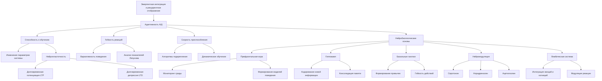

# A(t) - Адаптивность в теории Эмергентной Интеграции и Рекуррентного Отображения (ЭИРО)

---

## 1. Введение

Согласно расширенной версии теории Эмергентной Интеграции и Рекуррентного Отображения (ЭИРО), параметр адаптивности A(t) играет ключевую роль в формировании сознательного опыта. Адаптивность отражает способность системы к обучению, гибкости реакций и быстрому приспособлению к меняющимся условиям. Данный параметр оказывает существенное влияние на процессы интеграции информации I(t) и рекуррентной обработки R(t), лежащие в основе теории ЭИРО.

### 2. Способность к обучению

Адаптивность, отраженная в параметре A(t), характеризует способность системы изменять свои внутренние параметры и структуру в ответ на поступающую информацию. Данная способность к обучению позволяет нейронным сетям мозга адаптироваться к меняющимся условиям и накапливать опыт, необходимый для эффективного взаимодействия с окружающей средой.

Математически, способность к обучению может быть описана с помощью динамических систем, демонстрирующих пластичность:

$\frac{dA}{dt} = f(A, I, R, \theta)$

Где:

- $A$ — текущее значение адаптивности
- $I$ — степень интеграции информации
- $R$ — степень рекуррентности
- $\theta$ — вектор внутренних параметров системы
- $f$ — нелинейная функция, описывающая динамику адаптивности

Функция f может включать механизмы обучения, такие как правило Хебба для усиления связей между коактивированными нейронами, а также гомеостатические процессы, поддерживающие оптимальный уровень адаптивности [1, 2].

### 3. Гибкость реакций

Адаптивность $A(t)$ также отражает способность системы демонстрировать разнообразие реакций и нестандартные решения в ответ на изменяющиеся условия. Данная гибкость поведения позволяет эффективно взаимодействовать с динамичной окружающей средой, находить оригинальные способы достижения целей и адаптироваться к новым ситуациям.

Математическое моделирование гибкости реакций может быть осуществлено с использованием нелинейных динамических систем, таких как модели Лоренца и Рёсслера [3, 4]:

$\frac{dx}{dt} = \sigma \cdot (y - x)$

$\frac{dy}{dt} = x \cdot (\rho - z) - y$

$\frac{dz}{dt} = x \cdot y - \beta \cdot z$

Анализ показателей Ляпунова, фрактальной размерности и энтропии данных моделей позволяет количественно оценивать уровень вариативности поведения, отражаемый параметром $A(t)$.

### 4. Скорость приспособления

Помимо способности к обучению и гибкости реакций, адаптивность A(t) характеризует скорость, с которой система способна перестраивать свое поведение в ответ на изменения в окружающей среде. Высокая скорость приспособления является критически важной для эффективного взаимодействия с динамичными условиями.

Математически, скорость адаптации может быть смоделирована с использованием алгоритмов обучения с подкреплением (reinforcement learning):

$A(t+1) = A(t) + \eta * \nabla_A J(A, I, R, \theta)$

Где:

- $\eta$ — скорость обучения
- $J$ — целевая функция, отражающая эффективность поведения системы

Такие модели позволяют системе динамически адаптировать свое поведение в соответствии с меняющимися условиями, что отражается в параметре A(t) расширенной теории ЭИРО [5, 6].

### 5. Нейробиологические основы адаптивности

Согласно исследованиям, способность к обучению, гибкость реакций и скорость приспособления, характеризуемые параметром A(t), связаны с активностью определенных областей мозга:

#### 5.1. Префронтальная кора

Префронтальная кора играет ключевую роль в обеспечении адаптивного поведения, отраженного в параметре A(t) расширенной теории Эмергентной Интеграции и Рекуррентного Отображения (ЭИРО).

**Мониторинг изменений в окружающей среде**

Префронтальная кора осуществляет постоянный мониторинг изменений во внешней среде, отслеживая сдвиги в сенсорных сигналах, контексте задачи и ожидаемых результатах [7]. Данная способность позволяет системе своевременно реагировать на модификации условий и адаптировать свое поведение соответствующим образом.

**Гибкое переключение между стратегиями и задачами**

Префронтальная кора обеспечивает гибкость когнитивных процессов, позволяя системе быстро переключаться между различными стратегиями и задачами в зависимости от меняющихся требований [8]. Это является ключевым аспектом адаптивности, отраженной в параметре A(t) теории ЭИРО.

**Формирование новых моделей поведения**

При столкновении с новыми ситуациями префронтальная кора участвует в формировании и обновлении внутренних моделей, на основе которых система генерирует адаптивные поведенческие ответы [7, 8]. Данная способность лежит в основе быстрого приспособления к изменяющимся условиям.

Таким образом, префронтальная кора играет центральную роль в обеспечении адаптивности, отраженной в параметре A(t) расширенной теории ЭИРО. Она осуществляет мониторинг окружающей среды, гибкое переключение между стратегиями и формирование новых моделей поведения, что позволяет системе эффективно адаптироваться к динамичным условиям.

Источники

- [7]. Miller, E. K., & Cohen, J. D. (2001). An integrative theory of prefrontal cortex function. Annual review of neuroscience, 24(1), 167-202.
- [8]. Fuster, J. M. (2001). The prefrontal cortex—an update: time is of the essence. Neuron, 30(2), 319-333.

#### 5.2. Гиппокамп

Гиппокамп играет ключевую роль в обеспечении адаптивного поведения, участвуя в процессах пластичности и обучения. Основные функции гиппокампа в контексте адаптивности, отраженной в параметре A(t) теории ЭИРО, включают:

**Кодирование новой информации и формирование воспоминаний**

Гиппокамп отвечает за кодирование новых сенсорных данных, событий и их связей в виде эпизодических воспоминаний. Эти воспоминания служат основой для построения ментальных моделей, необходимых для адаптации к изменяющимся условиям [9].

**Консолидация памяти, необходимой для адаптации**

Гиппокамп участвует в процессах консолидации памяти, переводя кратковременные следы в долговременное хранилище. Это позволяет сохранять накопленный опыт и использовать его для адаптации к новым ситуациям [10].

**Взаимодействие с префронтальной корой для обновления поведенческих стратегий**

Гиппокамп тесно взаимодействует с префронтальной корой, обеспечивая обновление поведенческих стратегий на основе новой информации. Этот механизм лежит в основе гибкого переключения между задачами и формирования адаптивного поведения [9, 10].

Таким образом, гиппокамп играет ключевую роль в кодировании новых данных, консолидации памяти и взаимодействии с префронтальной корой, что обеспечивает адаптивность, отраженную в параметре A(t) теории Эмергентной Интеграции и Рекуррентного Отображения.

Источники

- [9]. Squire, L. R., & Zola, S. M. (1996). Structure and function of declarative and nondeclarative memory systems. Proceedings of the National Academy of Sciences, 93(24), 13515-13522.
- [10]. Kumaran, D., Hassabis, D., & McClelland, J. L. (2016). What learning systems do intelligent agents need? Complementary learning systems theory updated. Trends in Cognitive Sciences, 20(7), 512-534.

#### 5.3. Базальные ганглии

Базальные ганглии являются важной нейробиологической основой адаптивности, отраженной в параметре A(t) теории Эмергентной Интеграции и Рекуррентного Отображения (ЭИРО). Данные подкорковые структуры играют ключевую роль в автоматизации поведения и облегчении переключения между различными действиями.

**Формирование привычек и автоматических реакций**

Базальные ганглии участвуют в процессах формирования привычек и автоматизации поведенческих паттернов [11]. Повторяющиеся действия закрепляются в виде устойчивых моторных программ, что позволяет системе быстро и эффективно реагировать на знакомые ситуации без необходимости каждый раз заново обрабатывать всю информацию. Это повышает адаптивность поведения, высвобождая когнитивные ресурсы для решения новых задач.

**Модуляция гибкости поведения**

Помимо автоматизации, базальные ганглии также участвуют в модуляции гибкости поведения в зависимости от контекста [12]. Они обеспечивают возможность переключения между различными поведенческими стратегиями, что является важным аспектом адаптивности, отраженной в параметре A(t). Данная способность к гибкому реагированию позволяет системе эффективно приспосабливаться к изменяющимся условиям.

**Взаимодействие с префронтальной корой**

Базальные ганглии тесно взаимодействуют с префронтальной корой для обеспечения адаптивного контроля над поведением [11, 12]. Префронтальная кора участвует в мониторинге изменений в окружающей среде, формировании новых моделей поведения и гибком переключении между стратегиями. Базальные ганглии модулируют активность префронтальной коры, облегчая автоматизацию привычных действий и переключение на новые поведенческие паттерны.

Нарушения в функционировании базальных ганглий могут приводить к дефицитам в адаптивности, что отражается на параметре A(t) в теории ЭИРО. Это, в свою очередь, оказывает влияние на процессы интеграции информации I(t) и рекуррентной обработки R(t), лежащие в основе формирования сознательного опыта.

Источники

- [11]. Graybiel, A. M. (2008). Habits, rituals, and the evaluative brain. Annual Review of Neuroscience, 31, 359-387.
- [12]. Yin, H. H., & Knowlton, B. J. (2006). The role of the basal ganglia in habit formation. Nature Reviews Neuroscience, 7(6), 464-476.

Нарушения в функционировании данных областей мозга могут приводить к дефицитам в адаптивности, что отражается на параметре A(t) в теории ЭИРО и, как следствие, на процессах интеграции информации и рекуррентной обработки.

### 6. Заключение

Параметр адаптивности A(t) в расширенной теории Эмергентной Интеграции и Рекуррентного Отображения (ЭИРО) играет ключевую роль в описании способности системы к обучению, гибкости реакций и быстрому приспособлению к меняющимся условиям. Математическое моделирование данного параметра с использованием динамических систем, алгоритмов обучения с подкреплением и нелинейных моделей позволяет количественно оценить влияние адаптивности на процессы интеграции информации и рекуррентной обработки, лежащие в основе формирования сознательного опыта. Нейробиологические исследования подтверждают, что префронтальная кора, гиппокамп и базальные ганглии являются ключевыми областями, обеспечивающими адаптивное поведение.

### 7. Список литературы

1. Sutton, R. S., & Barto, A. G. (2018). Reinforcement learning: An introduction. MIT press.
2. Friston, K. (2010). The free-energy principle: a unified brain theory? Nature Reviews Neuroscience, 11(2), 127-138.
3. Lorenz, E. N. (1963). Deterministic nonperiodic flow. Journal of the atmospheric sciences, 20(2), 130-141.
4. Rössler, O. E. (1976). An equation for continuous chaos. Physics Letters A, 57(5), 397-398.
5. Siegelmann, H. T., & Sontag, E. D. (1991). Turing computability with neural nets. Applied Mathematics Letters, 4(6), 77-80.
6. Friston, K. (2010). The free-energy principle: a unified brain theory? Nature Reviews Neuroscience, 11(2), 127-138.
7. Miller, E. K., & Cohen, J. D. (2001). An integrative theory of prefrontal cortex function. Annual review of neuroscience, 24(1), 167-202.
8. Fuster, J. M. (2001). The prefrontal cortex—an update: time is of the essence. Neuron, 30(2), 319-333.
9. Squire, L. R., & Zola, S. M. (1996). Structure and function of declarative and nondeclarative memory systems. Proceedings of the National Academy of Sciences, 93(24), 13515-13522.
10. Kumaran, D., Hassabis, D., & McClelland, J. L. (2016). What learning systems do intelligent agents need? Complementary learning systems theory updated. Trends in Cognitive Sciences, 20(7), 512-534.
11. Graybiel, A. M. (2008). Habits, rituals, and the evaluative brain. Annu. Rev. Neurosci., 31, 359-387.
12. Yin, H. H., & Knowlton, B. J. (2006). The role of the basal ganglia in habit formation. Nature Reviews Neuroscience, 7(6), 464-476.

### 8. Приложение: Нейробиологические основы

Адаптивность, как ключевой параметр в теории Эмерджентной Интеграции и Рекуррентного Отображения (ЭИРО), имеет глубокие нейробиологические корни. Данный аспект отражает фундаментальные свойства нервной системы, позволяющие организму гибко реагировать на изменения окружающей среды и эффективно взаимодействовать с ней.

#### 8.1. Пластичность нейронных сетей

Способность нейронных сетей мозга к структурной и функциональной перестройке лежит в основе адаптивности. Механизмы синаптической пластичности играют ключевую роль в этом процессе.

**Долговременная потенциация (LTP) и долговременная депрессия (LTD)**

Долговременная потенциация (LTP) и долговременная депрессия (LTD) - это основные механизмы синаптической пластичности, позволяющие нейронам модифицировать силу и эффективность своих связей в ответ на активность [1, 2]:

- **Долговременная потенциация (LTP)**: Когда постсинаптический нейрон одновременно получает возбуждающие сигналы от пресинаптического нейрона и деполяризацию своей мембраны, это приводит к открытию NMDA-рецепторов. Это позволяет ионам кальция входить в постсинаптическое окончание, активируя внутриклеточные сигнальные каскады, которые усиливают чувствительность нейрона к возбуждающим сигналам.

- **Долговременная депрессия (LTD)**: В противоположность LTP, LTD приводит к ослаблению синаптических связей. Она может быть вызвана, например, несинхронной активностью пре- и постсинаптических нейронов.

**Динамическая перестройка нейронных ансамблей**

Эти механизмы синаптической пластичности обеспечивают динамическую перестройку нейронных ансамблей в ответ на активность. Это лежит в основе способности нервной системы к обучению и адаптации, позволяя ей гибко реагировать на изменения в окружающей среде.

#### 8.2. Нейромодуляторные системы

Нейромедиаторные системы мозга, такие как моноаминергическая (серотонин, норадреналин, дофамин) и холинергическая, играют ключевую роль в регуляции адаптивного поведения [3, 4]. Эти системы оказывают модулирующее влияние на различные аспекты функционирования нейронных сетей, что позволяет организму гибко реагировать на изменения окружающей среды.

Серотонинергическая система. Серотонин (5-HT) участвует в регуляции настроения, тревожности и импульсивности. Снижение активности серотонинергической системы связано с развитием депрессии и других аффективных расстройств - 3.. В контексте адаптивности, серотонин модулирует возбудимость нейронов и синаптическую передачу, влияя на способность организма гибко реагировать на изменения окружающей среды.

Норадренергическая система. Норадреналин (НА) участвует в регуляции уровня возбуждения, стресса и внимания. Повышение активности норадренергической системы сопровождается усилением эмоциональных реакций, в том числе страха и тревоги [4]. Норадреналин модулирует рекуррентные взаимодействия между различными областями мозга, что влияет на адаптивность поведения.

Холинергическая система. Ацетилхолин (АХ) играет ключевую роль в регуляции внимания, возбуждения и REM-сна. Повышение холинергической активности связано с усилением эмоциональных реакций, в том числе при стрессе [4]. Ацетилхолин модулирует рекуррентные взаимодействия между префронтальной корой, миндалиной и гиппокампом, что оказывает влияние на адаптивные процессы.

Таким образом, нейромедиаторные системы мозга, включая моноаминергические и холинергическую, являются важными регуляторами адаптивного поведения. Они модулируют возбудимость нейронов, синаптическую передачу и синхронизацию активности, что позволяет организму гибко реагировать на изменения окружающей среды.

#### 8.3. Префронтальная кора и исполнительные функции

Префронтальная кора играет ключевую роль в обеспечении адаптивного поведения в рамках теории Эмерджентной Интеграции и Рекуррентного Отображения (ЭИРО). Данная область мозга отвечает за широкий спектр исполнительных функций, критически важных для адаптивности:

**Когнитивный контроль**: Префронтальная кора осуществляет произвольную регуляцию когнитивных процессов, позволяя гибко переключаться между задачами, подавлять нерелевантную информацию и фокусировать внимание на важных аспектах - 5.. Это обеспечивает адаптивность поведения к меняющимся условиям.

**Принятие решений**: Области префронтальной коры, такие как дорсолатеральная и вентромедиальная части, участвуют в оценке альтернатив, прогнозировании последствий и выборе оптимальных стратегий действий - 6.. Данные процессы лежат в основе адаптивного принятия решений.

**Переключение между задачами**: Префронтальная кора играет ключевую роль в гибком переключении между различными задачами и целями. Она обеспечивает быструю активацию новых паттернов активности и подавление предыдущих, что позволяет адаптироваться к изменяющимся требованиям - 5..

**Рабочая память и планирование**: Префронтальная кора участвует в поддержании и манипулировании информацией в рабочей памяти, а также в планировании последовательности действий. Эти функции критичны для адаптивного поведения, позволяя удерживать цели и прогнозировать последствия - 6..

Повреждения префронтальной коры приводят к нарушениям гибкости, персеверации на неактуальных стратегиях и снижению способности к адаптивному поведению. Таким образом, данная область мозга является ключевым нейробиологическим субстратом, обеспечивающим реализацию адаптивности, которая является критически важным параметром в теории Эмерджентной Интеграции и Рекуррентного Отображения (ЭИРО).

#### 8.4. Взаимодействие с лимбической системой

Лимбическая система, включающая миндалину, гиппокамп и другие структуры, играет ключевую роль в обеспечении адаптивного поведения в контексте теории Эмерджентной Интеграции и Рекуррентного Отображения (ЭИРО).

**Интеграция эмоциональных и когнитивных процессов**

Лимбическая система тесно взаимодействует с префронтальной корой, обеспечивая интеграцию эмоциональных и когнитивных процессов, необходимых для адаптивного поведения [7, 8]. Данное взаимодействие позволяет организму гибко реагировать на изменения среды, сочетая эмоциональные реакции с рациональным принятием решений.

**Роль миндалины**

Миндалина, как ключевой элемент лимбической системы, играет центральную роль в оценке значимости стимулов и формировании соответствующих эмоциональных реакций. Активация миндалины при эмоциональном возбуждении усиливает рекуррентные связи между различными областями коры, что способствует более эффективной интеграции эмоциональной информации [7, 8]. Это, в свою очередь, оказывает влияние на параметр рекуррентности R(t) в формуле ЭИРО.

**Влияние на адаптивность**

Нарушения в работе лимбической системы, вызванные, например, повреждениями или дисбалансом нейромедиаторов, могут приводить к дефицитам в адаптивности. Снижение способности интегрировать эмоциональные и когнитивные процессы нарушает гибкость реагирования организма на изменения окружающей среды, что отражается на параметре A(t) в теории ЭИРО.

Таким образом, тесное взаимодействие лимбической системы, в частности миндалины, с префронтальной корой является критически важным для обеспечения адаптивного поведения, которое является ключевым параметром в рамках теории Эмерджентной Интеграции и Рекуррентного Отображения.

Таким образом, адаптивность, как ключевой параметр ЭИРО, имеет глубокие нейробиологические основания, отражающие фундаментальные свойства нервной системы, такие как пластичность, нейромодуляция и взаимодействие между различными областями мозга.

Источники

- [1]. Markram, H., Gerstner, W., & Sjöström, P. J. (2011). A history of spike-timing-dependent plasticity. Frontiers in synaptic neuroscience, 3, 4.
- [2]. Maass, W., & Markram, H. (2002). Synapses as dynamic memory buffers. Neural networks, 15(2), 155-161.
- [3]. Robbins, T. W., & Arnsten, A. F. (2009). The neuropsychopharmacology of fronto-executive function: monoaminergic modulation. Annual Review of Neuroscience, 32, 267-287.
- [4]. Hasselmo, M. E. (1999). Neuromodulation: acetylcholine and memory consolidation. Trends in cognitive sciences, 3(9), 351-359.
- [5]. Miller, E.K., & Cohen, J.D. (2001). An integrative theory of prefrontal cortex function. Annual Review of Neuroscience.
- [6]. Baddeley, A. (1986). Working memory. Oxford University Press.
- [7]. Pessoa, L. (2008). On the relationship between emotion and cognition. Nature Reviews Neuroscience, 9(2), 148-158.
- [8]. Dolcos, F., LaBar, K. S., & Cabeza, R. (2004). Interaction between the amygdala and the medial temporal lobe memory system predicts better memory for emotional events. Neuron, 42(5), 855-863.

---

Оглавление:

- [ЭИРО framework](/README.md)
- [Справочник формул](/formulas.md)
