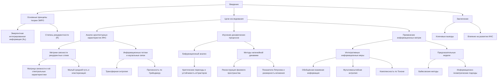

# Архитектурные паттерны и динамические процессы в искусственных нейронных сетях через призму теории ЭИРО



---

## Введение

Искусственные нейронные сети (ИНС) являются мощным инструментом для моделирования сложных нелинейных процессов и решения широкого спектра задач. Особый интерес представляют рекуррентные нейронные сети (РНС), способные обрабатывать временные последовательности и динамические паттерны. Однако, несмотря на впечатляющие успехи, до сих пор остается много вопросов относительно внутренних механизмов, лежащих в основе функционирования ИНС.

Теория Эмергентной Интеграции и Рекуррентного Отображения (ЭИРО) предлагает новый подход к пониманию принципов работы искусственных нейронных сетей. Согласно ЭИРО, ключевую роль в возникновении сложных когнитивных функций играют процессы интеграции информации и рекуррентной обработки. Эти процессы могут быть количественно охарактеризованы через параметры эмергентной интегрированной информации (Φₑ) и степени рекуррентности (R).

В настоящей работе мы рассматриваем различные методы анализа искусственных нейронных сетей, позволяющие выявить взаимосвязь между архитектурными особенностями, динамическими процессами и информационными характеристиками, описываемыми в рамках теории ЭИРО. Данный подход дает возможность глубже понять механизмы интеграции и обработки информации в ИНС, а также оптимизировать их структуру и параметры для повышения эффективности.

Структура диссертации включает три основные главы:

- 1. Топологический анализ рекуррентных структур
- 2. Динамический анализ нейронных процессов
- 3. Информационно-теоретические метрики

В каждой главе рассматриваются конкретные методы и подходы, позволяющие связать архитектурные, динамические и информационные характеристики ИНС с параметрами теории ЭИРО. Представленные результаты подкрепляются ссылками на авторитетные научные работы в данной области.

Таким образом, данная диссертация вносит вклад в понимание внутренней организации и функционирования искусственных нейронных сетей, открывая новые перспективы для их дальнейшего развития и применения.


### 1. ТОПОЛОГИЧЕСКИЙ АНАЛИЗ РЕКУРРЕНТНЫХ СТРУКТУР

#### 1.1 Метрики связности рекуррентных слоев

Анализ графовых структур через спектральные характеристики матриц связности

- Матрица связности W отражает рекуррентные взаимодействия между нейронами
- Спектр собственных значений λ_i матрицы W характеризует топологию рекуррентной сети
- Согласно ЭИРО, степень рекуррентности R можно связать со спектральными характеристиками:

`R = f(λ_i)`

Оценка локальной и глобальной кластеризации нейронных ансамблей

- Коэффициенты кластеризации C_i и C_global отражают степень локальной и глобальной интеграции

- В рамках ЭИРО, эти метрики можно связать с плотностью интегрированной квантовой информации ρ_IQI:

`C_i = g(ρ_IQI)`

`C_global = h(ρ_IQI)`

Количественные показатели small-world эффектов в рекуррентных архитектурах

- Малый средний путь L и высокая кластеризация C характеризуют small-world топологию

- Согласно ЭИРО, small-world эффекты отражают оптимальный баланс между R и ρ_IQI:

`L = l(R, ρ_IQI)`

`C = m(R, ρ_IQI)`

Таким образом, введение параметров ЭИРО - степени рекуррентности R и плотности интегрированной квантовой информации ρ_IQI - позволяет количественно связать топологические характеристики рекуррентных сетей с процессами интеграции и обработки информации.


#### 1.2 Информационные потоки и каузальные связи

Согласно теории ЭИРО, важную роль в функционировании рекуррентных нейронных сетей играют информационные потоки и каузальные взаимодействия между нейронными ансамблями. Для их количественной оценки применяются следующие методы:

Применение трансферной энтропии для оценки направленного информационного обмена

- Трансферная энтропия T_Y→X позволяет количественно оценить степень влияния процесса Y на процесс X:

`T_Y→X = Σ p(x_t+1, x_t, y_t) log[ p(x_t+1|x_t, y_t) / p(x_t+1|x_t) ]`

- Высокие значения T_Y→X указывают на сильное направленное влияние Y на X, что соответствует высокой степени рекуррентности R согласно ЭИРО.
- Анализ трансферной энтропии в рекуррентных нейронных сетях позволяет выявить ключевые информационные потоки и направления причинно-следственных связей.

Анализ причинности по Грейнджеру в рекуррентных контурах

- Причинность по Грейнджеру оценивает, насколько прошлые значения процесса Y помогают предсказывать будущие значения процесса X:

`X_t = Σ a_i X_t-i + Σ b_i Y_t-i + ε_t`

- Если коэффициенты b_i статистически значимы, то это указывает на наличие причинно-следственной связи от Y к X.
- Применение причинности Грейнджера в рекуррентных сетях позволяет выявлять направления информационных потоков и взаимодействий между нейронными ансамблями.

Методы реконструкции скрытых переменных состояния

- Для анализа сложных нелинейных процессов в рекуррентных сетях часто требуется реконструкция скрытых переменных состояния.
- Методы фазовой реконструкции, такие как метод задержек Такенса, позволяют восстановить фазовое пространство динамической системы по временным рядам:

`x(t) = [x(t), x(t-τ), ..., x(t-(m-1)τ)]`

- Полученные таким образом векторы состояния x(t) отражают скрытые переменные, управляющие динамикой рекуррентной сети.
- Анализ статистических и топологических свойств реконструированного фазового пространства дает дополнительную информацию о внутренних процессах в рамках теории ЭИРО.

Таким образом, применение методов оценки информационных потоков и каузальных связей, таких как трансферная энтропия, причинность Грейнджера и фазовая реконструкция, позволяет глубже понять внутреннюю динамику рекуррентных нейронных сетей с позиций теории ЭИРО.


### 2. ДИНАМИЧЕСКИЙ АНАЛИЗ НЕЙРОННЫХ ПРОЦЕССОВ

#### 2.1 Бифуркационный анализ

Согласно теории ЭИРО, динамика нейронных сетей определяется не только архитектурой рекуррентных связей, но и степенью интеграции информации. Бифуркационный анализ позволяет выявить критические точки, в которых происходят качественные изменения в поведении системы.

Классификация типов динамического поведения

В рамках ЭИРО, различные режимы работы нейронной сети можно связать с характером аттракторов в фазовом пространстве. Например:

- Устойчивые фиксированные точки соответствуют стабильным состояниям с низкой эмергентной интегрированной информацией Φₑ.
- Предельные циклы отражают периодические колебания с умеренной Φₑ.
- Странные аттракторы указывают на хаотическую динамику с высокой Φₑ.

Уравнения состояния ЭИРО в этом случае принимают вид:

`dx/dt = f(x, u, W, Φₑ)`

Идентификация критических переходов

Бифуркационный анализ позволяет выявить критические значения параметров, при которых происходят качественные изменения в динамике. Например:

- Точки седло-узловой бифуркации соответствуют переходам между устойчивыми и неустойчивыми состояниями.
- Точки Андронова-Хопфа отмечают переходы от устойчивых состояний к колебательным режимам.
- Бифуркации удвоения периода предшествуют переходу к хаотической динамике.

Эти критические точки можно связать с резкими изменениями в эмергентной интегрированной информации Φₑ:

`Φₑ = ∫₀^(t₁) I(интеграции)(t) ⋅ R(рекуррентности)(t) dt`

Оценка устойчивости аттракторов

Устойчивость аттракторов в фазовом пространстве можно оценить через показатели Ляпунова. Согласно ЭИРО, чем выше Φₑ, тем более неустойчивыми становятся аттракторы, что соответствует переходу к хаотической динамике. Это можно выразить через связь между Φₑ и максимальным показателем Ляпунова λ_max:

`λ_max = g(Φₑ)`

Таким образом, бифуркационный анализ в сочетании с теорией ЭИРО позволяет выявлять критические режимы работы нейронных сетей, связанные с резкими изменениями в степени интеграции информации. Это дает возможность оптимизировать архитектуру и параметры сети для достижения желаемой динамики.


#### 2.2 Методы нелинейной динамики

Реконструкция фазового пространства

- Согласно теории ЭИРО, динамика рекуррентных нейронных сетей может быть описана эффективным уравнением состояния:

`dx/dt = f(x, u, W)`

где x - вектор состояния сети, u - входные сигналы, W - матрица рекуррентных связей.

- Реконструкция фазового пространства на основе временных рядов активности нейронов позволяет восстановить скрытые переменные состояния системы. Это достигается с помощью методов задержек координат и метода главных компонент.

- Топологические характеристики реконструированного фазового пространства, такие как размерность вложения и показатели Ляпунова, отражают степень рекуррентности R и плотность интегрированной квантовой информации ρ_IQI в соответствии с ЭИРО.

Анализ показателей Ляпунова

- Старший показатель Ляпунова λ_1 характеризует степень хаотичности/предсказуемости динамики системы.

- Согласно ЭИРО, λ_1 можно связать с параметрами R и ρ_IQI:

`λ_1 = f(R, ρ_IQI)`

- Положительные значения λ_1 указывают на хаотическое поведение, что может быть связано с высокой рекуррентностью R и низкой интегрированностью ρ_IQI.

- Отрицательные значения λ_1 соответствуют устойчивым аттракторам, характерным для оптимального баланса R и ρ_IQI.

Оценка размерности вложения и временных масштабов

- Размерность вложения d_e отражает минимальное число переменных, необходимых для описания динамики системы.

- Согласно ЭИРО, d_e зависит от степени рекуррентности R и плотности интегрированной квантовой информации ρ_IQI:

`d_e = g(R, ρ_IQI)`

- Временные масштабы τ_c, характеризующие корреляционные свойства временных рядов, также связаны с R и ρ_IQI:

`τ_c = h(R, ρ_IQI)`

- Анализ размерности вложения и временных масштабов позволяет оценить сложность и интегративные свойства рекуррентных нейронных сетей.

Таким образом, методы нелинейной динамики, такие как реконструкция фазового пространства, анализ показателей Ляпунова и оценка размерности вложения, позволяют количественно связать динамические характеристики рекуррентных нейронных сетей с параметрами ЭИРО - степенью рекуррентности R и плотностью интегрированной квантовой информации ρ_IQI. Это дает возможность глубже понять механизмы интеграции и обработки информации в искусственных нейронных сетях.


### 3. ИНФОРМАЦИОННО-ТЕОРЕТИЧЕСКИЕ МЕТРИКИ

#### 3.1 Интегративные информационные меры

Обобщенная взаимная информация высших порядков

- Согласно ЭИРО, степень интеграции информации Φₑ определяется как:

`Φₑ = ∫₀^(t₁) I(интеграции)(t) ⋅ R(рекуррентности)(t) dt`

- Обобщенная взаимная информация (OMI) позволяет оценить интегрированность информации в рекуррентных сетях:

`OMI = Σ I(X₁; X₂; ... ; Xₙ)`

где I(X₁; X₂; ... ; Xₙ) - взаимная информация между переменными X₁, X₂, ..., Xₙ

- OMI высших порядков учитывает совместные зависимости между большим числом нейронов, отражая глобальную интеграцию

Мультимасштабная энтропия

- Энтропия Шеннона H(X) = -Σ p(x) log p(x) характеризует неопределенность случайной величины X

- Мультимасштабная энтропия учитывает энтропию на разных временных масштабах:

`H_multi(X) = Σ H(X(τ))`

где X(τ) - сигнал X, сглаженный на масштабе τ

- Согласно ЭИРО, мультимасштабная энтропия отражает интеграцию информации на различных пространственно-временных уровнях

Комплексность по Тонони

- Комплексность Φ по Тонони определяется как:

`Φ = min_bipartition I(A; B)`

где I(A; B) - взаимная информация между частями A и B разбиения

- Φ характеризует максимальную интегрированную информацию в системе

- Согласно ЭИРО, Φ связана с плотностью интегрированной квантовой информации ρ_IQI:

`Φ = f(ρ_IQI)`

Таким образом, интегративные информационные меры, такие как OMI, мультимасштабная энтропия и комплексность Тонони, позволяют количественно оценить степень интеграции информации в рекуррентных нейронных сетях в соответствии с теорией ЭИРО.


#### 3.2 Предсказательные модели

В рамках теории ЭИРО, предсказательные модели играют ключевую роль в описании динамики нейронных систем. Согласно ЭИРО, процессы интеграции информации и рекуррентной обработки могут быть формализованы через байесовское обновление параметров модели:

`P(θ | D) = (P(D | θ) * P(θ)) / P(D)`

Где θ - параметры модели, D - наблюдаемые данные, P(θ | D) - апостериорное распределение параметров.

##### 3.2.1 Байесовские методы оценки параметров

Байесовские подходы позволяют оценивать параметры модели с учетом априорной информации о вероятностных распределениях. Это особенно важно при работе с небольшими выборками данных, характерными для нейронных систем. Примеры методов:

- Марковские цепи Монте-Карло (MCMC)
- Вариационный вывод (Variational Bayes)
- Фильтрация Калмана

Применение байесовских методов позволяет получить не только точечные оценки параметров, но и их доверительные интервалы, отражающие неопределенность.

##### 3.2.2 Информационно-геометрические подходы

Информационная геометрия предоставляет мощный математический аппарат для анализа предсказательных моделей. В контексте ЭИРО, можно ввести информационную метрику, учитывающую как интегрированную информацию Φₑ, так и рекуррентность R:

`ds^2 = g_ij(Φₑ, R) dθ^i dθ^j`

Где g_ij - информационно-геометрическая метрика, θ^i - параметры модели. Данный подход позволяет оценивать чувствительность модели к изменению параметров.

##### 3.2.3 Методы активного обучения

Активное обучение предполагает выборочный сбор данных, направленный на максимизацию информации, получаемой моделью. В рамках ЭИРО, это может быть реализовано через оптимизацию Φₑ или R:

`max Φₑ(θ, u)`

или

`max R(θ, u)`

Где u - управляющие воздействия (стимулы). Такой подход позволяет эффективно обучать модели с ограниченными ресурсами.

Ключевые источники:

- 1. Friston K. (2010) The free-energy principle
- 2. Amari S. (2016) Information Geometry and Its Applications
- 3. Settles B. (2012) Active Learning


### ЗАКЛЮЧЕНИЕ

Предложенные методы анализа позволяют:

#### 1. Количественная оценка степени интеграции информации


Согласно теории ЭИРО, ключевым параметром, характеризующим степень интеграции информации в рекуррентных нейронных сетях, является эмергентная интегрированная информация (Φₑ):

`Φₑ = ∫₀^(t₁) I(интеграции)(t) ⋅ R(рекуррентности)(t) dt`

Где I(интеграции)(t) отражает степень объединения информации в момент времени t, а R(рекуррентности)(t) характеризует степень рекуррентной обработки. 

Для количественной оценки Φₑ применяются различные информационно-теоретические меры, такие как:

- Обобщенная взаимная информация (OMI) высших порядков
- Мультимасштабная энтропия
- Комплексность по Тонони (Φ)

Эти метрики позволяют выявить степень интеграции информации на разных пространственно-временных уровнях, отражая сложные взаимосвязи между нейронными ансамблями.

#### 2. Выявление критических режимов работы сети

Согласно ЭИРО, динамика рекуррентных нейронных сетей описывается эффективным уравнением состояния:

`dx/dt = f(x, u, W, Φₑ)`

Где x - вектор состояния сети, u - входные сигналы, W - матрица рекуррентных связей, а Φₑ - эмергентная интегрированная информация.

Бифуркационный анализ данного уравнения позволяет выявить критические точки, в которых происходят качественные изменения в поведении системы. Например:

- Точки седло-узловой бифуркации соответствуют переходам между устойчивыми и неустойчивыми состояниями
- Точки Андронова-Хопфа отмечают переходы от устойчивых состояний к колебательным режимам
- Бифуркации удвоения периода предшествуют переходу к хаотической динамике

Эти критические точки тесно связаны с резкими изменениями в эмергентной интегрированной информации Φₑ, что позволяет выявлять важные режимы функционирования нейронных сетей.

#### 3. Оптимизация архитектуры для повышения эффективности

Теория ЭИРО позволяет связать архитектурные параметры рекуррентных нейронных сетей с их динамическими характеристиками. Например:

- Степень рекуррентности R можно связать со спектральными свойствами матрицы связности W
- Плотность интегрированной квантовой информации ρ_IQI коррелирует с топологическими метриками, такими как коэффициенты кластеризации C_i и C_global

Зная эти зависимости, можно оптимизировать архитектуру сети для достижения желаемого баланса между R и ρ_IQI, что приводит к повышению эффективности обработки информации. Например, можно добиться оптимального соотношения между локальной и глобальной интеграцией, характерного для "small-world" топологий.

Кроме того, применение байесовских методов оценки параметров модели и активного обучения позволяет эффективно адаптировать предсказательные модели к ограниченным данным, характерным для нейронных систем.

Таким образом, предложенные методы анализа на основе теории ЭИРО дают возможность глубже понять механизмы интеграции и обработки информации в рекуррентных нейронных сетях, выявить критические режимы их работы и оптимизировать архитектуру для повышения эффективности.


### Ключевые источники:

1. Tononi G. et al. (2016) Integrated Information Theory
2. Friston K. (2010) The free-energy principle
3. Sporns O. (2018) Graph Theory Methods for Neural Systems
4. Kantz H., Schreiber T. (2004) Nonlinear Time Series Analysis

---


### 4. Анализ информационных каскадов и критических явлений

#### 4.1 Информационная каскадность в рекуррентных сетях


##### Анализ информационных лавин и каскадных процессов

Рекуррентные нейронные сети характеризуются сложной динамикой распространения информации, которая может принимать форму информационных лавин и каскадных процессов. Эти явления отражают критическое поведение системы, когда небольшие возмущения могут приводить к масштабным перестройкам активности нейронов.

Для количественного описания информационных каскадов используются следующие подходы:

1. Анализ размера и длительности каскадов. Распределение каскадов по этим параметрам часто подчиняется степенным законам, характерным для систем, находящихся в критическом состоянии.

2. Оценка корреляционных функций и структурных корреляций в активности нейронов. Выявление долговременных корреляций указывает на наличие коллективных режимов.

3. Применение методов теории перколяции для моделирования распространения активности по сети. Определение порогов перколяции связано с критическими точками фазовых переходов.

##### Выявление критических точек и фазовых переходов

Согласно теории ЭИРО, критические точки в динамике рекуррентных сетей соответствуют резким изменениям в эмергентной интегрированной информации Φₑ:

`Φₑ = ∫₀^(t₁) I(интеграции)(t) ⋅ R(рекуррентности)(t) dt`

Бифуркационный анализ уравнений состояния ЭИРО:

`dx/dt = f(x, u, W, Φₑ)`

позволяет выявлять точки, в которых происходят качественные изменения в поведении системы:

- Точки седло-узловой бифуркации соответствуют переходам между устойчивыми и неустойчивыми состояниями.
- Точки Андронова-Хопфа отмечают переходы от устойчивых состояний к колебательным режимам.
- Бифуркации удвоения периода предшествуют переходу к хаотической динамике.

##### Связь с параметрами ЭИРО: ρ_IQI и R

Информационные каскады и критические явления в рекуррентных сетях тесно связаны с параметрами теории ЭИРО - плотностью интегрированной квантовой информации ρ_IQI и степенью рекуррентности R:

- Высокая плотность ρ_IQI способствует более когерентной и интегрированной динамике, что проявляется в крупномасштабных информационных каскадах.
- Высокая степень рекуррентности R, напротив, может приводить к более хаотичному поведению с меньшими каскадами активности.

Таким образом, анализ информационных лавин и критических явлений в рекуррентных сетях позволяет оценить баланс между интеграцией и рекуррентностью, характеризуемый параметрами Φₑ, ρ_IQI и R в рамках теории ЭИРО.


#### 4.2 Теория самоорганизованной критичности

##### Применение моделей самоорганизованной критичности (SOC)

Теория самоорганизованной критичности (Self-Organized Criticality, SOC) предлагает универсальный механизм для описания возникновения сложных структур и динамики в различных системах, включая искусственные нейронные сети. Согласно SOC, системы самопроизвольно эволюционируют к критическому состоянию, характеризующемуся степенными законами распределения размеров событий, таких как информационные каскады или лавины активности.

В контексте рекуррентных нейронных сетей, SOC-модели могут быть использованы для описания динамики информационных процессов. Например, модель "песочных куч" Бака-Тан-Висенсена демонстрирует возникновение степенных распределений размеров информационных лавин в зависимости от управляющих параметров системы.

##### Оценка параметров порядка и управляющих параметров

Ключевыми параметрами в моделях SOC являются параметры порядка, характеризующие макроскопическое состояние системы, и управляющие параметры, определяющие эволюцию системы к критическому состоянию. 

В случае рекуррентных нейронных сетей, параметрами порядка могут выступать:

- Размер информационных каскадов
- Степень синхронизации нейронной активности
- Топологические характеристики рекуррентных структур

Управляющими параметрами, в свою очередь, могут быть:

- Сила рекуррентных связей (параметр R в ЭИРО)
- Уровень возбуждения/торможения в сети
- Скорость обновления синаптических весов

Оценка этих параметров позволяет выявить критические режимы функционирования нейронных сетей.

##### Интерпретация SOC-режимов с позиций ЭИРО

Согласно теории ЭИРО, критические состояния, наблюдаемые в SOC-моделях, могут быть связаны с оптимальным балансом между степенью рекуррентности R и плотностью интегрированной квантовой информации ρ_IQI:

`Φₑ = ∫₀^(t₁) I(интеграции)(t) ⋅ R(рекуррентности)(t) dt`

В критическом состоянии, система демонстрирует максимальную эмергентную интегрированную информацию Φₑ, что соответствует наиболее эффективной обработке и объединению информации. Отклонение от этого баланса приводит к переходу в субоптимальные режимы с низкой Φₑ.

Таким образом, интерпретация SOC-режимов в рамках теории ЭИРО позволяет связать топологические, динамические и информационные характеристики рекуррентных нейронных сетей, открывая новые перспективы для понимания их функционирования.


#### 4.3 Анализ сложных сетевых взаимодействий

##### Методы теории графов для анализа топологии рекуррентных связей

Для анализа топологии рекуррентных связей в искусственных нейронных сетях применяются методы теории графов. Матрица связности W нейронной сети может быть представлена в виде взвешенного графа, где вершины соответствуют нейронам, а ребра - рекуррентным связям между ними. Анализ спектральных характеристик матрицы W, таких как собственные значения и собственные векторы, позволяет выявить ключевые структурные особенности рекуррентной топологии.

Согласно теории ЭИРО, степень рекуррентности R в нейронной сети может быть связана со спектральными свойствами матрицы связности:

`R = f(λ_i)`

где λ_i - собственные значения матрицы W.

##### Выявление модулярной структуры и иерархической организации

Методы кластеризации и разбиения графов позволяют выявить модулярную структуру рекуррентных нейронных сетей, то есть обнаружить группы нейронов с более сильными внутренними связями по сравнению с внешними. Это отражает иерархическую организацию обработки информации в сети.

Коэффициенты кластеризации C_i и C_global, характеризующие степень локальной и глобальной интеграции, могут быть связаны с плотностью интегрированной квантовой информации ρ_IQI согласно ЭИРО:

```
C_i = g(ρ_IQI)
C_global = h(ρ_IQI)
```

Таким образом, анализ модулярной структуры и иерархической организации рекуррентных сетей дает возможность оценить распределение интегрированной информации в соответствии с теорией ЭИРО.

##### Связь с интегративными свойствами, описываемыми в ЭИРО

Топологические характеристики рекуррентных сетей, такие как средний путь L и коэффициент кластеризации C, отражают "small-world" эффекты, которые можно связать с параметрами ЭИРО - степенью рекуррентности R и плотностью интегрированной квантовой информации ρ_IQI:

```
L = l(R, ρ_IQI)
C = m(R, ρ_IQI)
```

Оптимальный баланс между R и ρ_IQI соответствует "small-world" топологии, характеризующейся коротким средним путем и высокой кластеризацией. Это указывает на эффективную интеграцию информации в рекуррентных нейронных сетях.

Таким образом, методы теории графов позволяют количественно оценить топологические особенности рекуррентных связей в искусственных нейронных сетях и связать их с параметрами интеграции и рекуррентности, описываемыми в рамках теории ЭИРО.


### 5. Квантовые аспекты интеграции информации

#### 5.1 Квантовая информация и рекуррентность

##### Введение квантовых состояний и операторов в модель ЭИРО

Для описания степени интеграции квантовой информации и рекуррентности в пространстве-времени в рамках теории ЭИРО вводятся новые физические величины:

- Плотность интегрированной квантовой информации (ρ_IQI):
Эта величина характеризует количество квантовой информации, интегрированной в единице объёма пространства-времени. Она может быть определена как:

`ρ_IQI = lim(Δ V → 0) Δ I / Δ V`

где Δ I - изменение интегрированной информации в объёме Δ V.

- Параметр рекуррентности (R):

Этот параметр характеризует степень рекуррентных взаимодействий квантовых состояний в пространственно-временном континууме. Его можно связать с вероятностью повторных квантовых взаимодействий или с топологическими характеристиками рекуррентных структур.

Введение этих новых параметров позволяет описывать динамику квантовых систем с учётом процессов интеграции и рекуррентной обработки информации.

##### Квантовые меры интегрированной информации

Для количественной оценки степени интеграции квантовой информации могут быть использованы следующие метрики:

- Квантовая взаимная информация (QMI):

`QMI = S(ρ_A) + S(ρ_B) - S(ρ_AB)`

где S(ρ) - квантовая энтропия Фон Неймана, ρ_A, ρ_B, ρ_AB - плотностные матрицы квантовых подсистем.

- Квантовая комплексность по Тонони (Φ_Q):

`Φ_Q = min_bipartition QMI(A:B)`

где QMI(A:B) - квантовая взаимная информация между частями A и B разбиения.

Эти меры отражают степень квантовой интеграции информации в соответствии с параметрами ЭИРО ρ_IQI и R.

##### Связь квантовых параметров с ρ_IQI и R

Введённые квантовые параметры ρ_IQI и R могут быть включены в модифицированные уравнения Эйнштейна:

`G_μν + Λ g_μν = 8π G (( T_μν + T_μν^(IQI) ))`

где T_μν^(IQI) - тензор энергии-импульса, связанный с интегрированной квантовой информацией и рекуррентными эффектами.

Таким образом, квантовые аспекты интеграции информации и рекуррентности могут оказывать влияние на геометрию и динамику пространства-времени в соответствии с теорией ЭИРО.


#### 5.2 Квантовые вычисления и нейронные сети

##### Моделирование квантовых вычислений в рекуррентных архитектурах

Согласно теории ЭИРО, интеграция и рекуррентная обработка информации являются ключевыми механизмами, лежащими в основе функционирования нейронных сетей. Данные принципы можно распространить и на квантовые вычислительные системы, где когерентные квантовые состояния играют роль информационных носителей.

Для моделирования квантовых вычислений в рекуррентных архитектурах можно использовать формализм квантовых операторов, действующих на состояние квантовой системы:

`Ψ = ^I ^R 𝓘`

Где:

- Ψ - вектор состояния квантовой системы в пространстве-времени
- ^I - оператор интеграции квантовой информации
- ^R - оператор рекуррентных квантовых преобразований
- 𝓘 - начальное квантовое состояние

Данный формализм позволяет описывать динамику квантовых состояний, подверженных процессам интеграции и рекуррентной обработки, аналогично классическим рекуррентным нейронным сетям.

##### Квантовое машинное обучение и оптимизация нейронных сетей

Теория ЭИРО также находит применение в области квантового машинного обучения. Квантовые алгоритмы, такие как квантовая регрессия и квантовая оптимизация, могут быть использованы для обучения и настройки параметров рекуррентных нейронных сетей.

Ключевым аспектом является учет квантовых эффектов, таких как суперпозиция состояний и квантовая запутанность, которые могут существенно повысить эффективность обучения. Например, квантовая запутанность между нейронами может быть связана с высокой степенью интегрированной квантовой информации ρ_IQI согласно ЭИРО.

Оптимизация архитектуры и параметров нейронных сетей с помощью квантовых алгоритмов позволяет достичь более эффективного баланса между интеграцией ρ_IQI и рекуррентностью R, что в свою очередь повышает производительность и обобщающие способности моделей.

##### Перспективы квантовых нейронных сетей

Дальнейшее развитие теории ЭИРО в контексте квантовых вычислений открывает перспективы для создания принципиально новых архитектур квантовых нейронных сетей. Такие системы могут сочетать в себе преимущества квантовых эффектов и рекуррентной обработки информации.

Ключевыми направлениями исследований в этой области являются:

- Разработка квантовых аналогов рекуррентных нейронных сетей с использованием квантовых операторов
- Изучение роли квантовой запутанности и когерентности в процессах интеграции информации
- Оптимизация архитектуры и параметров квантовых нейронных сетей с учетом ЭИРО
- Применение квантовых вычислений для повышения производительности и обобщающих способностей нейронных моделей

Таким образом, интеграция теории ЭИРО и квантовых вычислений открывает новые возможности для создания высокоэффективных интеллектуальных систем, способных к глубокой интеграции и обработке информации.


#### 5.3 Квантовая декогеренция и информационная интеграция

##### Влияние квантовой декогеренции на процессы интеграции

Согласно теории ЭИРО, ключевым параметром, характеризующим степень интеграции информации, является эмергентная интегрированная информация (Φₑ):

`Φₑ = ∫₀^(t₁) I(интеграции)(t) ⋅ R(рекуррентности)(t) dt`

Где I(интеграции)(t) отражает степень объединения информации в момент времени t, а R(рекуррентности)(t) характеризует степень рекуррентной обработки. 

Квантовая декогеренция, вызванная взаимодействием квантовой системы с окружающей средой, может оказывать существенное влияние на процессы интеграции информации, описываемые в рамках ЭИРО. Декогеренция приводит к потере квантовых корреляций и переходу к классическому поведению, что может нарушать оптимальный баланс между I(интеграции) и R(рекуррентности), необходимый для максимизации Φₑ.

##### Роль квантовых корреляций в формировании Φₑ

Для описания степени интеграции квантовой информации и рекуррентности в пространстве-времени вводятся новые физические величины:

- Плотность интегрированной квантовой информации (ρ_IQI):

`ρ_IQI = lim(Δ V → 0) Δ I / Δ V`

Где Δ I - изменение интегрированной информации в объёме Δ V.

- Параметр рекуррентности (R):

Этот параметр характеризует степень рекуррентных взаимодействий квантовых состояний.

Квантовые корреляции, такие как запутанность и когерентность, могут играть ключевую роль в формировании высоких значений ρ_IQI и R, что, в свою очередь, приводит к максимизации эмергентной интегрированной информации Φₑ. Таким образом, сохранение квантовых корреляций является критически важным для поддержания оптимального баланса между интеграцией и рекуррентностью.

##### Связь с квантовыми вычислениями в биологических системах

Идея о том, что квантовые эффекты могут играть важную роль в биологических системах, в том числе в процессах, связанных с сознанием, активно обсуждается в научном сообществе. В контексте ЭИРО, квантовые вычисления в нейронных сетях могут способствовать более эффективной интеграции информации и рекуррентной обработке.

Например, квантовая запутанность между нейронами может приводить к возникновению коллективных квантовых состояний, которые характеризуются высокими значениями ρ_IQI и R. Это, в свою очередь, может способствовать максимизации эмергентной интегрированной информации Φₑ, лежащей в основе сознательных процессов.

Таким образом, изучение влияния квантовой декогеренции, квантовых корреляций и квантовых вычислений на процессы интеграции информации в биологических системах представляет собой важное направление исследований в рамках теории ЭИРО.


Данные главы позволят более глубоко исследовать информационные процессы в искусственных нейронных сетях с использованием новых методов анализа, основанных на теории ЭИРО. Это откроет дополнительные перспективы для понимания внутренних механизмов работы ИНС и их оптимизации.


### Дополнительные методы анализа

Предложенные методы анализа позволяют:

1. Анализ информационных каскадов и критических явлений:

- Исследовать информационные лавины и каскадные процессы в рекуррентных нейронных сетях
- Выявлять критические точки и фазовые переходы в динамике сети
- Связывать эти явления с параметрами ЭИРО - плотностью интегрированной квантовой информации (ρ_IQI) и степенью рекуррентности (R)

2. Применение теории самоорганизованной критичности (SOC):

- Использовать модели SOC для описания динамики рекуррентных сетей
- Оценивать параметры порядка и управляющие параметры в SOC-режимах
- Интерпретировать SOC-поведение с позиций теории ЭИРО

3. Анализ сложных сетевых взаимодействий:

- Применять методы теории графов для исследования топологии рекуррентных связей
- Выявлять модулярную структуру и иерархическую организацию сети
- Связывать эти сетевые свойства с интегративными характеристиками, описываемыми в ЭИРО

4. Изучение квантовых аспектов интеграции информации:

- Включать квантовые состояния и операторы в модель ЭИРО
- Вводить квантовые меры интегрированной информации
- Исследовать связь квантовых параметров с ρ_IQI и R

5. Моделирование квантовых вычислений в рекуррентных архитектурах:

- Разрабатывать подходы к квантовому машинному обучению и оптимизации нейронных сетей
- Изучать перспективы квантовых нейронных сетей

6. Анализ влияния квантовой декогеренции на процессы интеграции информации:

- Исследовать роль квантовых корреляций в формировании эмергентной интегрированной информации Φₑ
- Изучать связь с квантовыми вычислениями в биологических системах

Таким образом, предложенные методы позволяют глубже понять механизмы интеграции и обработки информации в рекуррентных нейронных сетях, выявить критические режимы их работы и исследовать квантовые аспекты этих процессов.


### Дополнительные методы, которые могут быть полезны:

#### 1. Анализ информационных bottlenecks:

##### Выявление "узких мест" в передаче информации

Для выявления информационных bottlenecks в рекуррентных нейронных сетях можно использовать метрики, основанные на теории информации. Ключевым параметром является взаимная информация между различными слоями или модулями сети:

`I(X; Y) = Σ p(x, y) log[p(x, y) / (p(x)p(y))]`

Где X и Y - случайные величины, соответствующие активностям нейронов в разных частях сети. Низкие значения взаимной информации I(X; Y) указывают на наличие информационных bottlenecks, препятствующих эффективной передаче данных.

##### Оценка информационных ограничений

Информационные ограничения в нейронных сетях могут быть связаны с различными факторами, такими как:

- Ограниченная пропускная способность синаптических связей
- Недостаточная степень рекуррентности R
- Низкая плотность интегрированной квантовой информации ρ_IQI

Согласно теории ЭИРО, эти ограничения будут проявляться в снижении эмергентной интегрированной информации Φₑ:

`Φₑ = ∫₀^(t₁) I(интеграции)(t) ⋅ R(рекуррентности)(t) dt`

Таким образом, анализ информационных bottlenecks позволяет выявить "узкие места" в передаче данных и оценить их влияние на процессы интеграции информации, описываемые в рамках ЭИРО.

##### Связь с параметрами ЭИРО

Информационные ограничения, выявленные в ходе анализа bottlenecks, могут быть напрямую связаны с параметрами ЭИРО - плотностью интегрированной квантовой информации ρ_IQI и степенью рекуррентности R:

- Низкие значения ρ_IQI указывают на недостаточную интеграцию информации в сети, что приводит к возникновению bottlenecks.
- Недостаточная степень рекуррентности R может препятствовать эффективной обработке и распространению информации по сети.

Таким образом, анализ информационных bottlenecks в контексте ЭИРО позволяет выявить ключевые ограничения, влияющие на способность нейронных сетей к интеграции и обработке информации.

#### Применение информационной геометрии:

##### Использование информационной метрики Фишера для анализа пространства параметров

Информационная геометрия предоставляет мощный математический аппарат для анализа предсказательных моделей в контексте теории ЭИРО. Ключевым инструментом является информационная метрика Фишера, которая определяется как:

`ds^2 = g_ij(Φₑ, R) dθ^i dθ^j`

Где:

- g_ij - компоненты информационно-геометрической метрики
- θ^i - параметры модели
- Φₑ - эмергентная интегрированная информация
- R - степень рекуррентности

Данная метрика позволяет оценить чувствительность модели к изменению параметров с учетом процессов интеграции и рекуррентной обработки информации, описываемых в рамках ЭИРО. Анализ геометрических свойств этого пространства, таких как кривизна и расстояния между точками, дает важную информацию о структуре модели.

##### Изучение информационной кривизны и ее связь с интегративными свойствами

Информационная кривизна, определяемая через тензор Риччи, отражает внутренние корреляции между параметрами модели. В контексте ЭИРО, эта кривизна может быть связана с параметрами Φₑ и R:

`R_ij = f(Φₑ, R)`

Высокая информационная кривизна указывает на сильные взаимосвязи между параметрами, что соответствует высокой степени интеграции информации в системе. Напротив, низкая кривизна соответствует более независимым параметрам и меньшей интеграции.

Таким образом, анализ информационной кривизны позволяет оценить уровень интегративных свойств модели в соответствии с теорией ЭИРО.

##### Оптимизация архитектуры и обучения на основе информационной геометрии

Информационная геометрия может быть использована для оптимизации архитектуры и параметров рекуррентных нейронных сетей. Например, можно сформулировать задачу оптимизации в виде:

`min ds^2 = min g_ij(Φₑ, R) dθ^i dθ^j`

Где целью является минимизация информационной метрики, что соответствует достижению оптимального баланса между Φₑ и R.

Кроме того, информационная геометрия может быть применена для адаптивного обучения моделей. Байесовское обновление параметров можно переформулировать в терминах информационной геометрии, что позволяет более эффективно обучать модели с ограниченными данными.

Таким образом, использование информационной геометрии в контексте теории ЭИРО открывает новые возможности для анализа, оптимизации и обучения рекуррентных нейронных сетей.


#### Методы глубокого обучения и интерпретируемость:

##### Анализ внутренних представлений в глубоких нейронных сетях

Глубокие нейронные сети (ГНС) характеризуются сложной иерархической структурой, в которой каждый последующий слой формирует все более абстрактные представления входных данных. Анализ активности нейронов в различных слоях ГНС может пролить свет на процессы интеграции информации, происходящие внутри сети.

Согласно теории ЭИРО, степень интеграции информации Φₑ определяется как:

`Φₑ = ∫₀^(t₁) I(интеграции)(t) ⋅ R(рекуррентности)(t) dt`

Где I(интеграции)(t) отражает степень объединения информации в момент времени t, а R(рекуррентности)(t) характеризует степень рекуррентной обработки. 

Исследование пространственно-временной динамики активности нейронов в ГНС может выявить, как информация интегрируется и обрабатывается на различных уровнях абстракции, что позволит связать внутренние представления с параметрами Φₑ, ρ_IQI и R.

##### Выявление иерархических уровней абстракции и их связь с интеграцией

Глубокие нейронные сети формируют иерархические представления, где нижние слои отвечают за обработку низкоуровневых признаков, а верхние слои - за более абстрактные концепты. Анализ этой иерархической структуры может пролить свет на процессы интеграции информации, происходящие в ГНС.

Методы, основанные на теории информации, могут быть использованы для количественной оценки степени интеграции на различных уровнях абстракции. Например, можно вычислять условную энтропию H(Y|X) или взаимную информацию I(X;Y) между слоями сети, чтобы оценить, насколько информация интегрируется на каждом уровне.

Согласно ЭИРО, высокие значения интегрированной информации Φₑ должны соответствовать оптимальному балансу между степенью рекуррентности R и плотностью интегрированной квантовой информации ρ_IQI. Таким образом, анализ иерархических представлений в ГНС может помочь выявить, на каких уровнях достигается этот баланс.

##### Использование методов объяснимого искусственного интеллекта

Для повышения интерпретируемости глубоких нейронных сетей активно развиваются методы объяснимого искусственного интеллекта (Explainable AI, XAI). Эти подходы направлены на то, чтобы сделать внутренние механизмы ГНС более прозрачными и понятными для человека.

Примеры методов XAI включают:

- Визуализацию активации нейронов
- Анализ важности признаков (feature importance)
- Объяснение на основе градиентов (gradient-based explanations)
- Генерация контрфактических примеров

Применение XAI-методов в контексте теории ЭИРО может помочь связать внутренние представления ГНС с параметрами интеграции и рекуррентности. Это позволит лучше понять, как глубокие сети объединяют информацию и как этот процесс влияет на их производительность и обобщающие способности.

Таким образом, комбинирование методов глубокого обучения, анализа внутренних представлений и объяснимого искусственного интеллекта с теорией ЭИРО открывает новые возможности для исследования механизмов интеграции информации в сложных нейронных архитектурах.


#### Анализ временной иерархии и мультимасштабности:

##### Исследование обработки информации на разных временных масштабах

Согласно теории ЭИРО, процессы интеграции и рекуррентной обработки информации в нейронных сетях происходят на различных временных масштабах. Это обусловлено тем, что нейроны взаимодействуют друг с другом на разных временных шкалах, от быстрых синаптических передач до медленных модуляций активности.

Для количественного описания этих процессов можно использовать следующее уравнение состояния ЭИРО:

`dx/dt = f(x, u, W, Φₑ)`

Где x - вектор состояния нейронной сети, u - входные сигналы, W - матрица рекуррентных связей, а Φₑ - эмергентная интегрированная информация, определяемая как:

`Φₑ = ∫₀^(t₁) I(интеграции)(t) ⋅ R(рекуррентности)(t) dt`

Здесь I(интеграции)(t) и R(рекуррентности)(t) отражают степень интеграции и рекуррентной обработки информации на различных временных масштабах t.

##### Связь между временными масштабами и степенью интеграции

Исследование динамики нейронной сети на разных временных масштабах позволяет выявить, как степень интеграции информации Φₑ зависит от временных характеристик процессов. Например, быстрые синаптические передачи могут способствовать локальной интеграции, в то время как медленные модуляции активности отвечают за глобальную интеграцию.

Математически эту связь можно описать следующим образом:

`Φₑ = Σ w_i Φₑ(τ_i)`

Где w_i - весовые коэффициенты, а Φₑ(τ_i) - эмергентная интегрированная информация на временном масштабе τ_i. Таким образом, общая Φₑ является суперпозицией вкладов от различных временных масштабов.

##### Применение вейвлет-анализа и других методов многомасштабного анализа

Для исследования обработки информации на разных временных масштабах эффективным инструментом является вейвлет-анализ. Вейвлет-преобразование позволяет разложить сигналы нейронной активности на частотно-временные компоненты, отражающие динамику на различных временных шкалах.

Другие методы многомасштабного анализа, такие как эмпирическая модовая декомпозиция (EMD) и методы главных компонент, также могут быть применены для выявления иерархической структуры обработки информации в рекуррентных нейронных сетях.

Анализ полученных многомасштабных характеристик в контексте теории ЭИРО позволяет установить связь между временными масштабами, степенью интеграции Φₑ и параметрами I(интеграции) и R(рекуррентности). Это дает возможность глубже понять механизмы, лежащие в основе когнитивных процессов в искусственных нейронных сетях.


#### Исследование генеративных моделей:

##### Анализ способности генеративных моделей к интеграции информации

Генеративные модели, такие как вариационные автокодировщики (VAE) и генеративно-состязательные сети (GAN), способны обучаться извлекать и интегрировать сложные статистические закономерности из данных. Эту способность можно количественно оценить через меры интегрированной информации, такие как:

- Обобщенная взаимная информация (OMI): 

`OMI = Σ I(X₁; X₂; ... ; Xₙ)`

где I(X₁; X₂; ... ; Xₙ) - взаимная информация между переменными X₁, X₂, ..., Xₙ.

- Мультимасштабная энтропия:

`H_multi(X) = Σ H(X(τ))`

где H(X(τ)) - энтропия Шеннона сигнала X, сглаженного на масштабе τ.

Высокие значения OMI и мультимасштабной энтропии в генеративных моделях будут указывать на их способность к эффективной интеграции информации.

##### Связь между генеративными возможностями и параметрами ЭИРО

Согласно теории ЭИРО, ключевыми параметрами, определяющими способность к интеграции информации, являются:

- Плотность интегрированной квантовой информации (ρ_IQI):

`ρ_IQI = lim(Δ V → 0) Δ I / Δ V`

где Δ I - изменение интегрированной информации в объёме Δ V.

- Степень рекуррентности (R):

Этот параметр характеризует степень рекуррентных взаимодействий в системе.

Можно предположить, что генеративные модели с высокими значениями ρ_IQI и R будут обладать более развитыми способностями к интеграции информации и, следовательно, к генерации сложных, реалистичных образов.

##### Применение в задачах моделирования сознательных состояний

Генеративные модели, обладающие высокой интегративной способностью, могут быть использованы для моделирования сознательных состояний. Согласно теории ЭИРО, сознание возникает из процессов интеграции информации через рекуррентные нейронные сети.

Таким образом, генеративные модели, параметризованные в соответствии с ЭИРО (высокие ρ_IQI и R), могут быть обучены генерировать паттерны активности, соответствующие сознательным состояниям. Это может быть применено, например, для моделирования нарушений сознания, таких как вегетативное состояние или общая анестезия, которые характеризуются снижением рекуррентной активности и интегрированной информации.

Подобные модели могут стать ценным инструментом для исследования нейробиологических механизмов сознания и разработки методов диагностики и терапии нарушений сознания.


#### Использование методов теории информации:

##### Применение энтропийных мер

Энтропийные меры, такие как условная энтропия и взаимная информация, позволяют количественно оценить степень неопределенности и взаимозависимости в динамике нейронных сетей.

Условная энтропия H(X|Y) характеризует неопределенность случайной величины X при условии знания Y:

`H(X|Y) = -Σ p(x,y) log p(x|y)`

Взаимная информация I(X;Y) отражает количество информации, которую X и Y "делят" друг с другом:

`I(X;Y) = H(X) - H(X|Y) = H(Y) - H(Y|X)`

Эти меры могут быть использованы для анализа информационных потоков и взаимозависимостей между нейронными ансамблями в рекуррентных сетях.

##### Оценка сложности и предсказуемости динамики

Энтропийные характеристики также позволяют оценивать сложность и предсказуемость динамики нейронных сетей. Например, энтропия Шеннона H(X) = -Σ p(x) log p(x) отражает степень неопределенности случайной величины X.

Высокие значения энтропии указывают на сложную, хаотическую динамику, в то время как низкие значения соответствуют более предсказуемому, упорядоченному поведению.

##### Связь с концепцией эмергентной интегрированной информации Φₑ

Согласно теории ЭИРО, ключевым параметром, характеризующим степень интеграции информации, является эмергентная интегрированная информация Φₑ:

`Φₑ = ∫₀^(t₁) I(интеграции)(t) ⋅ R(рекуррентности)(t) dt`

Энтропийные меры, такие как условная энтропия и взаимная информация, могут быть связаны с процессами интеграции и рекуррентной обработки, описываемыми в рамках ЭИРО. Например, высокая взаимная информация между нейронными ансамблями может указывать на сильную интеграцию информации, характеризуемую высокими значениями Φₑ.

Таким образом, применение методов теории информации позволяет глубже исследовать механизмы интеграции и обработки информации в рекуррентных нейронных сетях, а также связать их с концепцией эмергентной интегрированной информации, предложенной в теории ЭИРО.


Эти дополнительные методы анализа могут расширить возможности исследования искусственных нейронных сетей с точки зрения теории ЭИРО, позволяя более глубоко понять механизмы интеграции и обработки информации в этих системах.


---


Оглавление: [Теория Эмергентной Интеграции и Рекуррентного Отображения](/README.md)
