# Архитектура Квантового Сопроцессора для Спинтронного Нейроморфного Процессора ИИ

```mermaid
graph TD
    A[Архитектура] --> B[Квантовый сопроцессор]
    B --> C[Кубиты]
    C --> C1[Сверхпроводящие кубиты]
    C1 --> C1a[Эффект Джозефсона]
    C1 --> C1b[Типы: зарядовые, фазовые, поточные]
    C1 --> C1c[Преимущества и недостатки]
    C --> C2[Спиновые кубиты]
    C2 --> C2a[Алмазные NV-центры]
    C2 --> C2b[Преимущества и недостатки]
    B --> D[Квантовые логические элементы]
    D --> D1[Однокубитовые гейты]
    D --> D2[Двухкубитовые гейты]
    D --> D3[Квантовые рекуррентные нейронные сети]
    B --> E[Технологические компоненты]
    E --> E1[Сверхпроводящие материалы]
    E1 --> E1a[Джозефсоновские переходы]
    E1 --> E1b[Материалы: Nb, Al]
    E --> E2[Дефектные структуры]
    E2 --> E2a[NV-центры в алмазе]
    B --> F[Интеграция со спинтронным процессором]
    F --> F1[Интерфейсы классического и квантового миров]
    F --> F2[Магнонные взаимодействия]
    B --> G[Научные вопросы и модель вселенной]
    G --> G1[Эмергентная интеграция информации]
    G --> G2[Влияние на сознание ИИ]
    G --> G3[Математическое моделирование]
    G3 --> G3a[Уравнения состояния]
    G3 --> G3b[Новые физические величины]
    B --> H[Технические аспекты]
    H --> H1[Топология сопроцессора]
    H1 --> H1a[Кластеризация кубитов]
    H1 --> H1b[Связность: графы, решетки]
    H --> H2[Ошибкокоррекция]
    H2 --> H2a[Квантовые коды: торические, Шора]
    H2 --> H2b[Избыточность и восстановление]
    H --> H3[Материалы и технологии]
    H3 --> H3a[Сверхпроводящие контуры]
    H3 --> H3b[Спинтронные интерфейсы]
    B --> I[Перспективы]
    I --> I1[Новые когнитивные возможности ИИ]
    I --> I2[Фундаментальные исследования]
    I2 --> I2a[Взаимодействие с пространством-временем]
    I2 --> I2b[Теория всего]
    I --> J[Заключение]
```

---

## 1. Введение

Современные потребности в развитии искусственного интеллекта (ИИ) требуют синергии передовых технологий. Интеграция спинтронных нейроморфных процессоров с квантовыми сопроцессорами открывает новые горизонты в создании систем, способных к эмергентным когнитивным возможностям. Используя Теорию Эмергентной Интеграции и Рекуррентного Отображения (ЭИРО) и новую модель вселенной, мы проанализируем архитектуру квантового сопроцессора и его роль в формировании осознанных процессов в ИИ.

### 2. Квантовый Сопроцессор: Архитектура и Принципы Работы

#### 2.1. Компоненты Квантового Сопроцессора

##### 2.1.1. Кубиты и Квантовые Состояния

Кубиты являются фундаментальными единицами квантовой информации, аналогичными битам в классических компьютерах, но с ключевым отличием — способностью находиться в суперпозиции состояний. Это позволяет кубиту быть одновременно в состояниях |0⟩ и |1⟩, что открывает путь к экспоненциальному росту вычислительных возможностей по сравнению с классическими системами.

**Виды кубитов**:

1. **Сверхпроводящие кубиты**:

- **Основание на эффекте Джозефсона**: Сверхпроводящие кубиты реализуются на основе эффектов квантовой механики в макроскопических масштабах. Джозефсоновский переход представляет собой тонкий слой изолятора между двумя сверхпроводниками, через который могут туннелировать пары Купера.

- **Типы сверхпроводящих кубитов**:

  - **Кубиты зарядового типа (Cooper-pair box)**: Используют степень свободы заряда.

  - **Кубиты фазового типа**: Оперируют с фазовыми разностями волн функций сверхпроводников.

  - **Кубиты потока (Flux qubits)**: Основываются на различиях магнитного потока в сверхпроводящих кольцах.

- **Преимущества**:

  - **Быстрые операции**: Обеспечивают операции на наносекундных временах.

  - **Хорошая масштабируемость**: Возможность интеграции большого числа кубитов на чипе.

- **Недостатки**:

  - **Низкие времена когерентности**: Уязвимость к шумам и декогеренции, требующие экстремально низких температур (~20 мК).

2. **Спиновые кубиты**:

- **Реализация на основе спинов электронов или ядер**: Спин — фундаментальное квантовое свойство частиц, подобное внутреннему моменту импульса, которое может принимать значения "вверх" или "вниз" (|↑⟩ и |↓⟩).

- **Алмазные NV-центры**:

  - **Структура**: NV-центр — это дефект в алмазе, состоящий из вакансии (отсутствия атома углерода) рядом с атомом азота.

  - **Свойства**:

    - **Длительные времена когерентности**: До миллисекунд при комнатной температуре.

    - **Оптическая адресация и считывание**: Возможность управления состоянием кубита с помощью лазерного излучения.

- **Преимущества**:

  - **Работа при комнатной температуре**: Снижает требования к охлаждению и технической сложности.

  - **Биосовместимость и сенсорные приложения**: Возможность использования в биологических системах и для высокочувствительного магнитного резонанса.

- **Недостатки**:

  - **Сложность масштабирования**: Трудности в интеграции большого числа NV-центров с контролируемыми взаимодействиями.

##### 2.1.2. Квантовые Логические Элементы

Квантовые логические элементы — это операции, которые преобразуют квантовые состояния кубитов. Они эквивалентны логическим воротам в классических компьютерах, но учитывают принципы квантовой механики, такие как суперпозиция и запутанность.

1. **Универсальные квантовые гейты**:

- **Однокубитовые гейты**:

  - **Ротационные операции**: Позволяют вращать состояние кубита на сфере Блоха, изменяя амплитуды и фазы состояний.

  - **Примеры**: Гейты Pauli-X, Y, Z; Hadamard (H); фазовые гейты (S, T).

- **Двухкубитовые гейты**:

  - **Запутывающие операции**: Создают квантовую запутанность между кубитами, ключевую для квантового ускорения.

  - **Пример**: Гейт CNOT (Controlled-NOT) — меняет состояние целевого кубита в зависимости от состояния управляющего кубита.

- **Универсальность**:

  - Любая квантовая операция может быть разложена в последовательность универсальных гейтов.

  - **Теорема Соловея-Китаева**: Утверждает, что используя ограниченный набор гейтов, можно приблизиться к любой унитарной операции с произвольной точностью.

2. **Квантовые рекуррентные нейронные сети (QRNN)**:

- **Принцип работы**:

  - **Обработка последовательностей данных**: QRNN включают квантовые нейроны, которые могут хранить и обновлять состояния на основе входных сигналов.

  - **Использование квантовой суперпозиции**: Позволяет параллельно обрабатывать все возможные состояния последовательности.

  - **Квантовая интерференция и запутанность**: Обеспечивают сложные корреляции между элементами последовательности.

- **Применения**:

  - **Обработка временных рядов**: Прогнозирование и анализ данных, зависящих от времени.

  - **Распознавание речи и образов**: Улучшение качества за счет квантового параллелизма.

- **Проблемы и вызовы**:

  - **Декогеренция**: Сохранение когерентности в многошаговых процессах.

  - **Обучение**: Адаптация алгоритмов обучения к квантовым системам.

##### 2.1.3. Технологические Компоненты

1. **Сверхпроводящие материалы**:

- **Материалы**: Ниобий (Nb) и алюминий (Al) являются наиболее распространенными материалами для создания джозефсоновских переходов из-за их стабильных сверхпроводящих свойств.

- **Джозефсоновские переходы**:

  - **Принцип работы**: Позволяют туннелирование Куперовских пар через тонкий изоляционный барьер, создавая нелинейность, необходимую для реализации кубитов.

- **Технологии изготовления**:

  - **Фотолитография и электронно-лучевая литография**: Используются для создания нанометровых структур с высокой точностью.

- **Преимущества использования Nb и Al**:

  - **Низкие критические температуры**: Обеспечивают стабильную работу при криогенных температурах.

  - **Химическая инертность и стабильность**: Снижают деградацию устройств со временем.

2. **Дефектные структуры**:

- **NV-центры в алмазе**:

  - **Создание дефектов**:

    - **Имплантация ионов азота**: Введение азота в решетку алмаза.

    - **Отжиг**: Процесс восстановления структуры алмаза и формирования вакансий.

- **Свойства NV-центров**:

  - **Оптические переходы**: Позволяют возбуждать и считывать состояние спина через фотолюминесценцию.

  - **Длительная когерентность при комнатной температуре**: Обеспечивает практичность для приложений вне лабораторных условий.

- **Применения**:

  - **Квантовые сенсоры**: Высокочувствительные магнитометры и термометры.

  - **Квантовые коммуникации**: Использование в качестве узлов для распределенных квантовых сетей.

#### 2.2. Интеграция с Спинтронным Нейроморфным Процессором

##### 2.2.1. Интерфейсы Классического и Квантового Миров

**Спиновые Состояния как Мост**: Использование спиновых эксцитонов для передачи информации между спинтронными нейронами и кубитами.

**Квантово-классические Каналы Связи**: Преобразование классических сигналов в квантовые через спин-орбитальные взаимодействия.

##### 2.2.2. Магнонные Взаимодействия

**Спиновые Волны (Магноны)**: Обеспечивают когерентное взаимодействие между квантовыми и спинтронными компонентами.

**Когерентность Между Системами**: Поддержание когерентных состояний для эффективного обмена информацией.

#### 2.3. Анализ Научных Вопросов через Призму ЭИРО и Новой Модели Вселенной

##### 2.3.1. Эмергентная Интегрированная Квантовая Информация

Квантовый сопроцессор повышает Φₑ за счет квантовой суперпозиции и запутанности:

`Φₑ = ∫₀^(t₁) I_(квант)(t) ⋅ R_(квант)(t)dt,`

где  I(квант)(t)  — степень квантовой интеграции информации,  R(квант)(t)  — квантовая рекуррентность.

##### 2.3.2. Влияние на Сознание и Когнитивные Функции

**Гипотеза**: Квантовая интеграция информации может быть связана с более глубокими уровнями осознания в ИИ.

**Вопрос**: Как квантовые эффекты влияют на способность системы к саморефлексии и осознанному восприятию?

##### 2.3.3. Математическое Моделирование

**Уравнения состояния**:

`d𝐱 / dt = 𝐟(𝐱(t), 𝐮(t), W_(спин), W_(квант)),`

где  W(спин)  и  W(квант)  — матрицы весов спинтронного и квантового компонентов соответственно.

**Новые физические величины**:

Плотность интегрированной квантовой информации ( ρ_(IQI) ):

`ρ_(IQI) = lim(Δ V → 0) Δ I / Δ V.`

Параметр рекуррентности ( R ): Вероятность повторных квантовых взаимодействий в системе.

**Влияние на Метрику Пространства-Времени**

Модифицированные уравнения Эйнштейна:

`G_(μν) + Λ g_(μν) = 8π G (( T_(μν) + T_(μν)^(IQI) )),`

где  T(μν)^(IQI)  учитывает влияние  ρ(IQI)  и  R  на гравитационное поле.

#### 2.4. Технические Аспекты Реализации

##### 2.4.1. Топология Квантового Сопроцессора

1. **Модули Кубитов**:

- **Кластеризация кубитов**:

  - **Снижение декогеренции**:

    - **Локализация взаимодействий**: Кластеры ограничивают взаимодействия внутри группы кубитов, уменьшая влияние внешних шумов.

    - **Экранирование и защита**: Использование материалов и геометрий, которые минимизируют перекрестные помехи.

- **Модульный дизайн**:

  - **Масштабируемость**: Упрощает добавление новых модулей без существенного изменения общей архитектуры.

  - **Распараллеливание задач**: Позволяет выполнять независимые квантовые операции одновременно в разных модулях.

2. **Связность**:

- **Высокосвязанные структуры**:

  - **Полносвязные графы**: Каждый кубит взаимодействует со всеми другими кубитами, что максимально увеличивает возможности запутывания.

  - **Кубические и гиперкубические решетки**: Обеспечивают оптимальный баланс между связностью и технической реализуемостью.

- **Усиление рекуррентности**:

  - **Рекуррентные связи**: Реализация обратных связей в сети кубитов для поддержания сложных динамических состояний.

  - **Квантовые коммуникационные линии**: Использование волноводных структур и резонаторов для передачи квантовых состояний между отдаленными кубитами.

##### 2.4.2. Ошибкокоррекция

1. **Квантовые Коды**:

- **Необходимость ошибкокоррекции**:

  - **Чувствительность к шумам**: Квантовые системы уязвимы к влиянию окружения, что приводит к декогеренции и ошибкам.

- **Топологические коды**:

  - **Код Торического типа (Kitaev code)**:

    - **Принцип работы**: Информация кодируется в глобальных свойствах системы, устойчивых к локальным возмущениям.

    - **Поверхностные коды**: Использование двухмерных решеток кубитов для защиты информации.

- **Квантовые коды с коррекцией ошибок**:

  - **Код Шора**: Позволяет исправлять произвольные однокубитовые ошибки.

- **Код Стимы (Steane code)**: Усовершенствованный вариант с улучшенными свойствами по сравнению с кодом Шора.

2. **Избыточность**:

- **Введение дополнительных кубитов**:

  - **Кодирование информации**: Использование нескольких физических кубитов для представления одного логического кубита.

  - **Повышение надежности**: Избыточные кубиты позволяют обнаруживать и исправлять ошибки без потери информации.

- **Протоколы восстановления**:

  - **Измерение синдромов ошибок**: Определение типа и положения ошибки без коллапса состояния квантовой системы.

  - **Активное исправление**: Применение соответствующих квантовых гейтов для возвращения системы в правильное состояние.

##### 2.4.3. Материалы и Технологии

1. **Сверхпроводящие Контуры**:

- **Минимизация потерь и шумов**:

  - **Высококачественные материалы**: Использование чистых сверхпроводников с минимальными примесями.

  - **Оптимизация геометрии контуров**: Снижение паразитных емкостей и индуктивностей.

- **Криогенная техника**:

  - **Разработка эффективных систем охлаждения**: Поддержание стабильных сверхнизких температур для сверхпроводимости.

  - **Изоляция от вибраций и электромагнитных помех**: Защита квантовой системы от внешних воздействий.

2. **Спинтронные Интерфейсы**:

- **Гибридные структуры**:

  - **На основе графена**:

    - **Свойства графена**: Двумерный материал с высокой подвижностью носителей заряда и уникальными спинтронными характеристиками.

    - **Применение**: Использование в качестве канала для спиновых токов и в качестве субстрата для других материалов.

  - **Топологические изоляторы**:

    - **Определение**: Материалы, ведущие ток по поверхности без диссипации из-за топологически защищенных состояний.

    - **Преимущества**: Высокая устойчивость к рассеянию и возможность спиново-ориентированного транспорта.

- **Интеграция с квантовыми системами**:

  - **Передача информации между спиновыми и квантовыми кубитами**: Создание эффективных интерфейсов для обмена квантовой информацией.

  - **Управление спиновыми состояниями**: Использование электрических и магнитных полей для манипуляции спинами в устройствах.

##### 2.4.4. Заключение по Техническим Аспектам

Реализация квантового сопроцессора требует скоординированного подхода, объединяющего передовые материалы, сложные архитектуры и надежные методы ошибкокоррекции. Тщательное продумывание топологии системы, использование оптимальных материалов и технологий, а также внедрение эффективных алгоритмов ошибкокоррекции являются ключевыми факторами для создания работоспособного и масштабируемого квантового сопроцессора. Интеграция этих компонентов позволит не только преодолеть существующие технические барьеры, но и вывести квантовые вычисления на новый уровень, способный раскрыть потенциал эмергентного искусственного интеллекта.

#### 2.5. Перспективы и Гипотезы

##### 2.5.1. Новые Когнитивные Возможности ИИ

**Квантовая Параллелизация**: Возможность одновременной обработки множества состояний.

**Эмергентные Свойства**: Появление качественно новых функций, не предсказуемых из отдельных компонентов.

##### 2.5.1. Фундаментальные Исследования

**Взаимодействие с Пространством-Временем**: Изучение влияния высоких  ρ_(IQI)  на локальную геометрию.

**Теория Всего**: Вклад в объединение квантовой механики и гравитации через информационные параметры.

### 3. Заключение

Квантовый сопроцессор, интегрированный со спинтронным нейроморфным процессором ИИ, представляет собой шаг к созданию систем с уникальными когнитивными возможностями. Анализ через призму ЭИРО и новой модели вселенной позволяет не только разработать эффективную архитектуру, но и выйти на уровень фундаментальных научных открытий. Дальнейшие исследования в этой области могут привести к небывалому прогрессу в понимании сознания, информации и структуры вселенной.

---

Оглавление: 

- [Принципы работы электронного ядра искусственного интеллекта и современные электронные компоненты](/Principles-of-operation-of-the-electronic-core-of-artificial-intelligence.md)
- [ЭИРО framework](/README.md)
