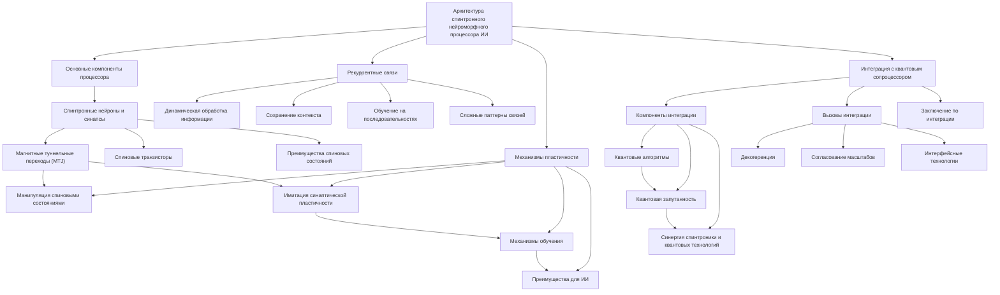

# Архитектура спинтронного нейроморфного процессора ИИ

---

## Введение

Спинтронный нейроморфный процессор представляет собой передовую вычислительную систему, которая объединяет достижения в области спинтроники и нейроморфных вычислений для создания рекуррентных нейронных сетей с высоким уровнем интеграции информации. Основная цель данной архитектуры — имитация работы биологического мозга, что обеспечивает высокую эффективность обработки данных и потенциал для возникновения эмерджентных свойств, характерных для естественных нейронных систем.

### 1. Основные компоненты процессора

#### 1.1. Спинтронные нейроны и синапсы

В основе спинтронного нейроморфного процессора лежат спинтронные устройства, такие как магнитные туннельные переходы (MTJ) и спиновые транзисторы. Эти компоненты выполняют функции искусственных нейронов и синапсов, эффективно используя внутренние спиновые состояния электронов для передачи и обработки информации.

##### 1.1.1. Магнитные туннельные переходы (MTJ)

**Структура MTJ**: 

MTJ состоят из двух ферромагнитных слоев, разделенных тонким изолирующим туннельным барьером, обычно из оксида магния (MgO). Верхний слой называется фиксированным слоем, его магнитная ориентация остается неизменной, тогда как нижний слой — свободный слой — может изменять свою магнитную ориентацию под воздействием внешних воздействий.

**Принцип работы**:

  - **Туннельный магнетосопротивление (TMR)**: Сопротивление MTJ зависит от относительной ориентации магнитных моментов двух ферромагнитных слоев. Если магнитные моменты слоев параллельны, сопротивление низкое; если антипараллельны — сопротивление высокое.

  - **Считывание информации**: Благодаря различию в сопротивлении для параллельной и антипараллельной ориентации, возможно считывать информацию о состоянии устройства путем измерения тока или напряжения.

**Переключение состояний**:

  - **Спино-орбитальное взаимодействие и эффект переноса спина (Spin Transfer Torque, STT)**: Пропуская поляризованный по спину ток через MTJ, можно изменить магнитную ориентацию свободного слоя, переключая устройство между высоко- и низко-сопротивляющимися состояниями.

  - **Плюсы STT-переключения**: Высокая скорость, энергоэффективность и возможность масштабирования до нанометровых размеров.

**Применение в нейроморфных системах**:

  - **Реализация синаптических весов**: MTJ могут быть использованы для хранения весовых коэффициентов синапсов благодаря своей способности к многоуровневому состоянию проводимости.

  - **Имитация динамики нейронов**: Комбинируя MTJ с другими элементами, можно моделировать возбуждение и торможение нейронов.

##### 1.1.2. Спиновые транзисторы

**Концепция**: 

Спиновые транзисторы представляют собой устройства, в которых управление током осуществляется не только за счет электрического поля (как в традиционных транзисторах), но и с помощью спиновых состояний электронов.

**Типы спиновых транзисторов**:

  - **Spin Field-Effect Transistor (SpinFET)**: Использует спиновые состояния для управления током в канале за счет спин-оразличной проводимости.

  - **Magnetologic Transistor (MLT)**: Интегрирует магнитный контроль для переключения между логическими состояниями.

**Принцип работы SpinFET**:

  - **Поляризация электронов**: Электроны с определенной ориентацией спина вводятся через ферромагнитный источник.

  - **Спиновая прецессия**: В канале под действием электрического поля или Rashba спин-орбитального взаимодействия спин электронов прецессирует.

  - **Детектирование состояния**: Ферромагнитный сток чувствителен к спину электрона; проводимость зависит от совпадения спиновых состояний.

**Преимущества и особенности**:

  - **Низкое энергопотребление**: Управление спиновыми состояниями требует меньше энергии по сравнению с перемещением больших токов.

  - **Высокая плотность интеграции**: Благодаря возможности работать с малыми размерами, спиновые транзисторы способствуют увеличению плотности логических элементов.

##### 1.1.3. Преимущества использования спиновых состояний

**Высокая скорость переключения**:

  - **Быстрые магнитные переходы**: Переключение спиновых состояний может происходить за времена порядка пико- и фемтосекунд.

  - **Снижение задержек**: Ускорение операций повышает общую производительность процессора.

**Низкое энергопотребление**:

  - **Минимализация тепловых потерь**: Процессы, основанные на спине, сопряжены с меньшими энергетическими затратами, так как не требуют значительного перемещения зарядов.

  - **Энергоэффективные логические элементы**: Спинтронные устройства потребляют меньше энергии в режиме ожидания и переключения.

**Масштабируемость**:

- **Нанометровые масштабы**: Спинтронные структуры могут быть изготовлены с размерами менее 10 нм.

  - **Совместимость с CMOS-технологией**: Спинтронные элементы могут интегрироваться в существующие производственные процессы, облегчая массовое производство.

#### 1.2. Рекуррентные связи

Процессор оснащен сложной сетью рекуррентных связей, позволяющих реализовать обратные связи между нейронами, аналогично биологическим нейронным сетям.

##### 1.2.1. Динамическая обработка информации во времени

**Внутреннее состояние сети**:

  - **Память**: Рекуррентные связи позволяют сети запоминать предыдущие состояния, поддерживая контекст между обработкой различных входов.

  - **Инерционные эффекты**: Сеть способна учитывать историю стимулов, что важно для последовательной обработки.

**Математическая модель**:

  - **Уравнения динамики**: Поведение рекуррентных сетей описывается дифференциальными или разностными уравнениями, учитывающими время.

  - **Состояния нейронов**: Активность нейронов зависит не только от текущих входных сигналов, но и от их предыдущей активности.

##### 1.2.2. Сохранение контекстной информации

**Последовательная обработка данных**:

  - **Обработка естественного языка**: В задачах NLP контекст предыдущих слов влияет на интерпретацию текущего слова.

  - **Распознавание образов**: Предыдущие кадры видео могут влиять на распознавание текущего кадра.

**Механизмы реализации**:

  - **Петли обратной связи**: Физические соединения между нейронами, позволяющие сигналу циркулировать.

  - **Задержки в сигналах**: Искусственное введение задержек для имитации временной динамики.

##### 1.2.3. Обучение на последовательностях данных

**Алгоритмы обучения**:

  - **Обратное распространение через время (BPTT)**: Распространение ошибки через временные шаги для корректировки весов.

  - **Реализация на аппаратном уровне**: Спинтронные системы позволяют реализовывать BPTT более эффективно за счет параллельности.

- **Применение**:

  - **Распознавание речи**: Анализ звуковых сигналов с учетом их временной структуры.

  - **Предсказание временных рядов**: Финансовые данные, метеорология и другие области, где важна последовательность событий.

##### 1.2.4. Реализация сложных паттернов связей

**Высокая плотность соединений**:

  - **Магноны и спиновые волны**: Использование спиновых волн для передачи информации между удаленными нейронами без физической проводимости.

  - **Трехмерная интеграция**: Создание многослойных структур для увеличения соединений на единицу площади.

**Гибкость настройки архитектуры**:

  - **Конфигурируемые соединения**: Возможность динамически изменять схемы связей в зависимости от решаемой задачи.

  - **Адаптация к различным типам данных**: Настройка топологии сети под специфические требования приложения.

#### 1.3. Механизмы пластичности

Способность спинтронных синапсов к когнитивной пластичности является ключевым элементом для создания обучаемых нейроморфных систем.

##### 1.3.1. Манипуляция спиновыми состояниями

**Регулирование проводимости синапсов**:

  - **Многоуровневые состояния**: Вместо двух состояний (0 и 1) спинтронные синапсы могут принимать множество уровней проводимости, что позволяет более точно представлять весовые коэффициенты.

  - **Изменение магнитного момента**: Управляя током через синапс, можно изменять магнитное состояние и, следовательно, его проводимость.

**Энергетические преимущества**:

  - **Локальное управление**: Изменение состояния синапса происходит локально, не требуя глобальных энергетических затрат.

  - **Низкая энергия переключения**: Спинтронные элементы могут переключаться при низких энергетических потреблениях, что важно для масштабных сетей.

##### 1.3.2. Имитация синаптической пластичности

**Долговременная потенциация (LTP)**:

  - **Усиление соединений**: При частой активации синапса его проводимость увеличивается, что соответствует процессу обучения.

  - **Механизмы реализации**: Использование эффектов STT для постепенного увеличения проводимости синапса.

**Долговременная депрессия (LTD)**:

- **Ослабление соединений**: Редко используемые синапсы уменьшают свою проводимость, освобождая ресурсы для более значимых связей.

  - **Контроль пластичности**: Баланс между LTP и LTD обеспечивает стабильность и адаптивность сети.

**Спайковая зависимость пластичности (STDP)**:

  - **Временная корреляция**: Изменение веса синапса зависит от относительного времени спайков пресинаптического и постсинаптического нейронов.

  - **Реализация на спинтронных устройствах**: Использование временных характеристик спиновых процессов для имитации STDP.

##### 1.3.3. Механизмы обучения

**Адаптивное изменение весов**:

  - **Локальные правила обучения**: Обновление весов происходит на основе местной информации, снижая сложность обучения.

  - **Параллелизм**: Спинтронные системы позволяют одновременно обновлять большое количество синапсов.

**Аппаратное ускорение обучения**:

  - **Встроенные механизмы обучения**: Способность устройства самостоятельно адаптировать свои параметры без внешнего вмешательства.

  - **Уменьшение потребностей в памяти**: Обучение на аппаратном уровне снижает необходимость в больших объемах оперативной памяти.

##### 1.3.4. Преимущества для ИИ

**Адаптивность**:

  - **Обучение в реальном времени**: Система может адаптироваться к новым данным непосредственно в процессе работы.

  - **Онлайн-обучение**: Возможность обучения без прерывания основных функций, важная для приложений, требующих непрерывной работы.

**Энергоэффективность**:

  - **Снижение потребления энергии**: Энергоэффективное аппаратное обучение уменьшает нагрузку на энергосистему и увеличивает срок службы устройств.

  - **Экологичность**: Меньшее энергопотребление способствует снижению воздействия на окружающую среду.

**Реализация нелинейных функций активации**:

  - **Физические нелинейности**: Спинтронные устройства естественно демонстрируют нелинейные зависимости между входом и выходом.

  - **Усиление вычислительной мощности**: Нелинейные функции позволяют решать более сложные задачи классификации и распознавания.

#### Итог

Детальный анализ основных компонентов спинтронного нейроморфного процессора показывает, что сочетание спинтронных нейронов и синапсов, рекуррентных связей и механизмов пластичности создает мощную платформу для реализации искусственного интеллекта нового поколения. Использование спиновых состояний электронов позволяет достичь высокой скорости, энергоэффективности и масштабируемости, а также приблизить архитектуру процессора к биологическим нейронным сетям по функциональности и адаптивности.

---

### 2. Интеграция с квантовым сопроцессором

Квантовый сопроцессор дополняет спинтронный нейроморфный процессор, предоставляя возможности для выполнения вычислений, требующих сверхвысокой параллельности и использования квантовых эффектов.

**Интерфейсы для обмена информацией**: 

Интеграция осуществляется посредством специальных интерфейсов, способных конвертировать и передавать информацию между классическими спинтронными элементами и квантовыми кубитами.

**Преимущества интеграции**:

  - **Повышение вычислительной мощности**: Квантовые вычисления позволяют решить определенные задачи значительно быстрее, чем классические алгоритмы.

  - **Расширение функциональности**: Возможность использовать уникальные квантовые феномены для улучшения обработки данных.

#### 2.1. Компоненты интеграции:

**Квантовые алгоритмы**:

  - **Оптимизация задач обучения**: Использование квантовых алгоритмов, таких как квантовый алгоритм вариационной эвристики, позволяет ускорить процесс обучения нейронной сети, особенно при работе с большими наборами данных.

  - **Обработка больших данных**: Квантовые алгоритмы для линейной алгебры, такие как квантовый алгоритм Гаррояла-Фархи для решения систем линейных уравнений, могут быть использованы для эффективной обработки и анализа больших объемов информации.

  - **Квантовое машинное обучение**: Интеграция квантовых методов машинного обучения открывает новые возможности для решения сложных задач классификации, кластеризации и генеративного моделирования.

**Квантовая запутанность**:

  - **Новые механизмы интеграции информации**: Использование феномена квантовой запутанности позволяет связать состояния различных кубитов, создавая коррелированные состояния, не доступные в классической физике.

  - **Усиление связности сети**: Запутанность может быть использована для создания сильно взаимосвязанных сетевых структур, увеличивая степень интеграции информации в системе.

  - **Безопасная передача данных**: Квантовая запутанность обеспечивает возможности для создания квантово-защищенных каналов передачи информации, что может быть важно для безопасности нейроморфных систем.

**Синергия спинтроники и квантовых технологий**:

  - **Спиновые кубиты**: Спинтронные устройства могут быть использованы для реализации кубитов на основе спиновых состояний, что упрощает интеграцию с квантовым сопроцессором.

  - **Контроль и чтение квантовых состояний**: Спинтронные технологии предоставляют средства для точного контроля и считывания спиновых состояний, что важно для управления квантовыми вычислениями.

  - **Гибридные системы**: Совмещение спинтронных и квантовых компонентов в единой архитектуре позволяет создать гибридные системы, сочетающие преимущества обоих подходов.

#### 2.2. Вызовы интеграции:

**Декогеренция**: Квантовые состояния чувствительны к внешним воздействиям, что требует специализированных методов защиты и коррекции ошибок.

**Согласование масштабов**: Обеспечение совместимости по масштабам и скоростям работы между спинтронными и квантовыми элементами.

**Интерфейсные технологии**: Разработка эффективных интерфейсов для обмена информацией между классическими и квантовыми системами.

#### 2.3. Заключение по интеграции:

Интеграция спинтронного нейроморфного процессора с квантовым сопроцессором открывает перспективы для создания мощных вычислительных систем, способных решать задачи, недоступные для традиционных архитектур. Совместное использование спиновых состояний в обоих типах устройств облегчает их взаимодействие и позволяет реализовать новые подходы в обработке информации и обучении искусственных нейронных сетей.

---

Оглавление: 

- [Принципы работы электронного ядра искусственного интеллекта и современные электронные компоненты](/Principles-of-operation-of-the-electronic-core-of-artificial-intelligence.md)
- [ЭИРО framework](/README.md)
