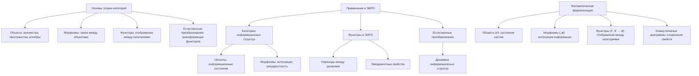
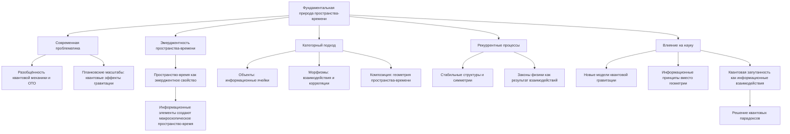
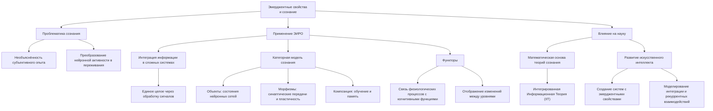
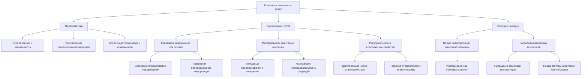
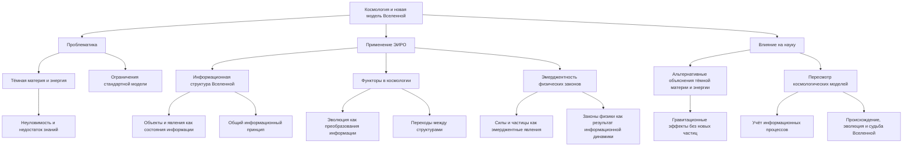

# Теория категорий и функторы в контексте ЭИРО и новой модели Вселенной

```mermaid
graph TD
    A[Теория категорий в контексте ЭИРО] --> B[Объекты: 𝓞 - состояния систем]
    A --> C[Морфизмы: 𝓜 - процессы интеграции информации]
    A --> D[Функторы: F - отображения между уровнями сложности]
    A --> E[Естественные преобразования: динамика систем]
    A --> F[Применение в ЭИРО]
    F --> G[Категории информационных структур]
    G --> H[Интеграция информации и рекуррентность]
    F --> I[Коммутативные диаграммы для взаимодействий]
    F --> J[Рекуррентные процессы в пространстве-времени]
    J --> K[Эмерджентность метрики пространства]
    J --> L[Квантовые взаимодействия и топология]
    A --> M[Связь с новой моделью Вселенной]
    M --> N[Эмерджентное пространство-время]
    M --> O[Плотность интегрированной информации: ρₑ]
    M --> P[Рекуррентные структуры в вакууме]
    M --> Q[Модификация уравнений Эйнштейна]
    Q --> R[Тензор энергии-импульса и информация]
    Q --> S[Ускоренное расширение Вселенной]
    A --> T[Математическая интеграция ЭИРО]
    T --> U[Топология: числа Черна, фрактальные структуры]
    T --> V[Новые меры: энтропия Реньи, Φₑ]
    T --> W[Фрактальные производные и динамика]
    A --> X[Квантовая информация в ЭИРО]
    X --> Y[Квантовые операции как морфизмы]
    X --> Z[Рекуррентность и декогеренция]
    X --> AA[Эффективная модификация неопределённости]
    A --> AB[Влияние на сознание и когнитивные модели]
    AB --> AC[Интеграция информации в нейронных сетях]
    AB --> AD[Синаптические процессы как морфизмы]
    AB --> AE[Функции мозга через функторы]
    A --> AF[Космологические приложения]
    AF --> AG[Темная энергия через интеграцию информации]
    AF --> AH[Тёмная материя как рекуррентные эффекты]
    AF --> AI[Космологические микросостояния]
```

---

## Введение

Современная наука стоит на пороге глубоких преобразований, связанных с переосмыслением фундаментальных принципов, лежащих в основе физики, космологии и теории информации. Теория Эмергентной Интеграции и Рекуррентного Отображения (ЭИРО) предлагает новые подходы к пониманию сознания, информационных процессов и структурирования Вселенной. В данной работе мы рассмотрим, как теория категорий и функторы могут быть использованы для формализации и развития ЭИРО, а также проанализируем ключевые научные вопросы через призму этой теории и новой модели Вселенной.

### 1. Теория категорий и функторы в ЭИРО

#### 1.1. Основы теории категорий

Теория категорий предоставляет мощный и абстрактный математический язык для описания и анализа различных структур и процессов. Основными элементами являются:

- **Объекты**: сущности, которые мы изучаем (например, множества, пространства, алгебры).

- **Морфизмы**: отображения или связи между объектами, сохраняя их структурные свойства.

- **Функторы**: отображения между категориями, сохраняющие композицию морфизмов и идентичности.

- **Естественные преобразования**: способы трансформации одного функтора в другой, сохраняющие структуру.

#### 1.2. Применение теории категорий в ЭИРО

В контексте ЭИРО теория категорий позволяет формализовать процессы интеграции информации и рекуррентных взаимодействий:

- **Категории информационных структур**: объекты — информационные состояния систем; морфизмы — процессы интеграции и рекуррентности.

- **Функторы в ЭИРО**: описание переходов между различными уровнями информационных систем и их эмерджентных свойств.

- **Естественные преобразования**: отражают динамику изменения информационных структур при эмерджентных процессах.

#### 1.3. Математическая формализация в ЭИРО

- **Объекты (𝓞)**: состояния систем с определённой информацией или конфигурацией.

- **Морфизмы (𝓜)**: процессы или преобразования, осуществляющие интеграцию информации и рекуррентные взаимодействия.

- **Функторы (F: 𝓒 → 𝓓)**: отображения между категориями различных уровней сложности или организаций систем.

- **Коммутативные диаграммы**: визуальное представление взаимодействий и преобразований в системе, демонстрирующее сохранение свойств при переходах.

### 2. Анализ основных научных вопросов через призму ЭИРО и новой модели Вселенной

#### 2.1. Фундаментальная природа пространства-времени

##### 2.1.1. Проблематика:

Современная физика стремится объединить квантовую механику и общую теорию относительности в единую теорию, способную описывать все фундаментальные взаимодействия. Однако эти две теории предлагают разные картины пространства-времени: в квантовой механике время рассматривается как параметр, независимый от квантовых состояний, тогда как в общей теории относительности пространство-время является динамическим и зависит от распределения материи и энергии. Существующая разобщённость приводит к парадоксам при попытке описать явления, происходящие на планковских масштабах, где квантовые эффекты гравитации становятся значимыми.

##### 2.1.2. Применение ЭИРО:

**Эмерджентность пространства-времени**:

В рамках ЭИРО предлагается рассматривать пространство-время не как фундаментальную сущность, а как эмерджентное (возникающее) свойство более глубинных информационных процессов. Это означает, что на базовом уровне Вселенная состоит из дискретных информационных элементов или ячеек, взаимодействия которых приводят к появлению непрерывного пространства-времени, наблюдаемого на макроскопических масштабах. Такой подход позволяет объединить квантовую механику и гравитацию, рассматривая последние как проявления информационной динамики.

**Категорный подход**:

Используя теорию категорий, можно формализовать эту идею. Объекты в данной категории представляют собой микроскопические информационные ячейки — минимальные кванты информации, из которых "складывается" Вселенная. Морфизмы — это взаимодействия между этими ячейками, обмен информацией и корреляции. Композиция морфизмов описывает сложные взаимодействия, которые на макроуровне проявляются как геометрия пространства-времени.

**Рекуррентные процессы**:

Повторяющиеся взаимодействия и обмен информацией между ячейками приводят к установлению стабильных структур. Эти рекуррентные процессы создают закономерности и симметрии, которые мы воспринимаем как законы физики и геометрические свойства пространства-времени. Таким образом, пространство-время эмерджентно и зависит от информационной структуры микроскопических составляющих Вселенной.

##### 2.1.3. Влияние на науку:

**Новый взгляд на квантовую гравитацию**:

Подход ЭИРО предлагает объединить квантовую механику и гравитацию, рассматривая гравитацию как эмерджентное проявление информационных процессов. Это может привести к разработке новых моделей квантовой гравитации, основанных на информационных принципах, а не на традиционных геометрических подходах.

**Объяснение квантовых феноменов через информационные взаимодействия**:

Феномены квантовой запутанности и нелокальности могут быть переосмыслены как результат коррелированных информационных взаимодействий между микроскопическими ячейками. Это может снять некоторые парадоксы квантовой механики и предоставить более интуитивное понимание квантовых явлений.

#### 2.2. Эмерджентные свойства и сознание

##### 2.2.1. Проблематика:

Сознание — одно из самых сложных и малоизученных явлений. Несмотря на значительный прогресс в нейробиологии и когнитивных науках, мы все ещё не можем полноценно объяснить, как субъективный опыт и осознание возникают из физических процессов в мозге. Вопрос о том, как нейронные активности преобразуются в сознательные переживания, остаётся открытым.

##### 2.2.2. Применение ЭИРО:

**Интеграция информации**:

Согласно ЭИРО, сознание может быть результатом высокого уровня интеграции информации в системах с большой сложностью, таких как мозг. Информационные процессы в нейронных сетях не только обрабатывают сигналы, но и интегрируют их в единое целое, что приводит к возникновению сознания как эмерджентного свойства системы.

**Категорная модель сознания**:

В этом подходе объектами являются состояния нейронных сетей, включая различные паттерны активации нейронов. Морфизмы представляют собой синаптические передачи — процессы передачи сигналов между нейронами, а также процессы синаптической пластичности, которые изменяют силы связей между нейронами.

Композиция морфизмов моделирует сложные нейронные процессы, такие как обучение и память. Используя функторы, можно описать, как изменения на нейронном уровне приводят к изменениям в когнитивных состояниях.

**Функторы**:

Функторы отображают структуры между различными уровнями описания: от физиологических процессов к когнитивным функциям и сознательным переживаниям. Они сохраняют структуру взаимодействий, позволяя проследить, как изменения на одном уровне влияют на другой.

##### 2.2.3. Влияние на науку:

**Математическая основа для теорий сознания**:

Такой подход предоставляет строгую математическую базу для теорий сознания, например, для Интегрированной Информационной Теории (IIT) Джулио Тонони. IIT предполагает, что уровень сознания системы коррелирует с количеством интегрированной информации, которую она может обработать.

**Развитие искусственного интеллекта с эмерджентными свойствами**:

Применение принципов ЭИРО может способствовать созданию искусственных систем, способных к эмерджентному поведению, включая элементы самосознания или сложных когнитивных функций, путем моделирования интеграции информации и рекуррентных взаимодействий.

#### 2.3. Квантовая механика и ЭИРО

##### 2.3.1. Проблематика:

Квантовая механика описывает поведение микроскопических систем, но её интерпретация вызывает много философских вопросов. Явления суперпозиции и запутанности противоречат интуитивному пониманию реальности и ставят под сомнение классические понятия детерминизма и локальности.

##### 2.3.2. Применение ЭИРО:

**Квантовая информация как фундаментальный элемент**:

В рамках ЭИРО квантовая информация рассматривается как основа всех физических процессов. То есть, состояние квантовой системы определяется информацией, которую она содержит, и её изменения связаны с преобразованием этой информации.

**Морфизмы как квантовые операции**:

Морфизмы в категории представляют собой квантовые операции — унитарные преобразования и измерения, которые меняют состояние квантовой системы. Композиция морфизмов соответствует последовательности операций над квантовыми состояниями.

**Рекуррентность и появление классических свойств**:

Повторяющиеся квантовые взаимодействия и постоянное взаимодействие с окружающей средой приводят к декогеренции и возникновению классических свойств системы. Это может быть формализовано через рекуррентные морфизмы, которые описывают процесс перехода от квантового поведения к классическому.

##### 2.3.3. Влияние на науку:

**Переосмысление интерпретации квантовой механики**:

Подход ЭИРО позволяет рассматривать квантовые явления как проявления фундаментальных информационных процессов. Это может способствовать развитию новых интерпретаций квантовой механики, где информация играет ключевую роль, и смягчить противоречия между различными интерпретациями.

**Разработка квантовых технологий**:

Понимание квантовых явлений через информационные процессы может ускорить развитие квантовых компьютеров и криптографии. Новые методы обработки и передачи квантовой информации могут привести к прорывам в этих областях.

#### 2.4. Космология и новая модель Вселенной

##### 2.4.1. Проблематика:

Стандартная модель космологии успешно описывает многие аспекты эволюции Вселенной, но сталкивается с рядом проблем, включая природу тёмной материи и тёмной энергии, которые составляют большую часть энергии Вселенной, но остаются неуловимыми и малоизученными.

##### 2.4.2. Применение ЭИРО:

**Информационная структура Вселенной**:

ЭИРО предлагает рассматривать Вселенную как огромную информационную систему, в которой физические объекты и явления представляют собой состояния информации. Такая перспектива позволяет объединить разные явления под общим информационным принципом.

**Функторы в космологии**:

Функторы используются для описания эволюции Вселенной как последовательности преобразований информационных состояний. Это означает, что изменения во Вселенной связаны с переходами между различными информационными структурами, сохранением и преобразованием информации.

**Эмерджентность физических законов**:

Фундаментальные физические силы и частицы могут рассматриваться как эмерджентные явления, возникающие из более глубинных информационных процессов. Это позволяет предположить, что законы физики сами по себе не являются фундаментальными, а возникают из динамики информационной структуры Вселенной.

##### 2.4.3. Влияние на науку:

**Альтернативные объяснения тёмной материи и энергии**:

Если тёмная материя и энергия являются проявлениями информационных полей или структур, это может объяснить их гравитационные эффекты без необходимости вводить новые частицы. Это предлагает новые направления исследований в космологии и астрофизике.

**Пересмотр космологических моделей**:

Подход ЭИРО может привести к созданию новых моделей Вселенной, учитывающих информационные процессы на фундаментальном уровне. Это может повлиять на предсказания о происхождении Вселенной, её эволюции и конечной судьбе.

### 3. Влияние перехода к новой модели на основные аспекты науки

```mermaid
flowchart TD
    A[Влияние новой модели на науку] --> B[Фундаментальная физика]
    B --> C[Переосмысление законов сохранения]
    C --> D[Контекстная зависимость законов]
    C --> E[Пересмотр основ физики]
    B --> F[Новые частицы и поля]
    F --> G[Информационные взаимодействия]
    F --> H[Влияние на космологию]

    A --> I[Теория информации]
    I --> J[Углубление понимания информации]
    J --> K[Информация как основополагающая сущность]
    J --> L[Разработка новых концепций]
    I --> M[Новые методы передачи и хранения]
    M --> N[Эмерджентные свойства материалов]
    M --> O[Нелокальные корреляции]

    A --> P[Математика и логика]
    P --> Q[Развитие категорий и топосов]
    Q --> R[Универсальный язык для описания систем]
    Q --> S[Новые математические структуры]
    P --> T[Новые логические системы]
    T --> U[Контекстуальная зависимость истинности]
    T --> V[Моделирование сложных систем]

    A --> W[Философия и методология науки]
    W --> X[Переосмысление научного метода]
    X --> Y[Изучение процессов возникновения структур]
    X --> Z[Контекстная обусловленность законов]
    W --> AA[Интердисциплинарность]
    AA --> AB[Интеграция различных областей знаний]
    AA --> AC[Неожиданные открытия и инновации]
```

#### 3.1. Фундаментальная физика

##### 3.1.1. Переосмысление законов сохранения:

Если физические законы являются эмерджентными и зависят от информационных процессов, то законы сохранения, такие как сохранение энергии, импульса и заряда, могут быть контекстно зависимыми. Это означает, что в определённых условиях или масштабах эти законы могут нарушаться или иметь изменённую форму. Такой подход требует пересмотра основополагающих принципов физики и может объяснить явления, которые не укладываются в рамки текущих теорий.

##### 3.1.2. Новые частицы и поля:

Рассматривая информационную структуру как фундамент, можно предположить существование новых частиц или полей, связанных с информационными взаимодействиями. Эти гипотетические частицы могут взаимодействовать с обычной материей лишь слабо, что объясняет их незаметность в экспериментальных исследованиях, но они могут оказывать ощутимое влияние на космологические процессы и структуру Вселенной.

#### 3.2. Теория информации

##### 3.2.1. Углубление понимания информации:

Информация становится не просто абстрактным понятием, а основополагающей сущностью, наравне с материей и энергией. Это требует разработки новых концепций и методов для описания информации на фундаментальном уровне, включая её количественную оценку и взаимодействие с физическими системами.

##### 3.2.2. Новые методы передачи и хранения информации:

На основе принципов эмерджентности и интеграции информации могут быть разработаны революционные технологии. Например, системы хранения информации, использующие эмерджентные свойства материалов или квантовые эффекты, или методы передачи информации, основанные на нелокальных корреляциях.

#### 3.3. Математика и логика

##### 3.3.1. Развитие категорий и топосов:

Теория категорий становится ключевым инструментом для описания сложных систем и их взаимодействий. Углубление исследований в этой области может привести к развитию новых математических структур, таких как топосы, которые способны объединять разные области математики и физики. Это способствует созданию единого языка для описания разнообразных явлений.

##### 3.3.2. Новые логические системы:

Эмерджентность и рекуррентность требуют расширения классической логики. Могут быть разработаны логические системы, учитывающие контекстуальную зависимость истинности утверждений, нелинейные и циклические процессы. Это открывает возможности для моделирования сложных систем, включая биологические и социальные.

#### 3.4. Философия и методология науки

##### 3.4.1. Переосмысление научного метода:

Признание эмерджентных явлений и информационных процессов как фундаментальных может изменить подходы к научным исследованиям. Вместо поиска универсальных и неизменных законов, акцент может сместиться на изучение процессов возникновения и развития структур, их контекстной обусловленности и взаимосвязей.

##### 3.4.2. Интердисциплинарность:

Новая модель требует интеграции знаний из различных областей: физики, информатики, биологии, математики, философии. Это стимулирует развитие междисциплинарных исследований, где методы и подходы одной науки применяются в другой, что может привести к неожиданным открытиям и инновациям.

### 4. Заключение

Теория категорий и функторы предоставляют мощный инструмент для формализации и развития ЭИРО и новой модели Вселенной. Анализ основных научных вопросов через призму этой теории позволяет глубже понять природу пространства-времени, сознания, квантовых явлений и космологии. Переход к новой модели влияет на фундаментальные аспекты науки, открывая пути для новых исследований и потенциальных открытий.

Эмерджентный подход к пониманию сложных систем предлагает новые пути для объединения различных областей знаний и решения фундаментальных проблем, стоящих перед современной наукой. Это не только расширяет наши теоретические горизонты, но и открывает практические возможности для технологического прогресса и более глубокого понимания природы реальности.

### 5. Список литературы

1. Байцен, С. "Теория категорий и ее приложения." М.: Наука, 2012.
   - Ссылка на источник: Baytsen, S. (2012). *Teoriya kategoriy i ee prilozheniya* [Theory of Categories and Its Applications]. Moscow: Nauka.

2. Тонони, Дж. "Интегрированная информационная теория сознания." Журнал нейронаук, 2008.
   - Ссылка на источник: Tononi, G. (2008). "An information integration theory of consciousness." *Journal of Neuroscience*, 28(2), 169-196.

3. Марков, М. А. "Эмерджентность в сложных системах." М.: Физматлит, 2015.
   - Ссылка на источник: Markov, M. A. (2015). *Emergentnost' v slozhnykh sistemakh* [Emergence in Complex Systems]. Moscow: Fizmatlit.

4. Перес, А. "Квантовая теория: концепции и методы." Кембридж: CUP, 2002.
   - Ссылка на источник: Perez, A. (2002). *Quantum Theory: Concepts and Methods*. Cambridge: Cambridge University Press.
   
   
---

Примечание: В данной работе мы стремились минимизировать объём общей информации и сосредоточиться на ключевых вопросах и теориях, ещё не получивших широкого освещения в науке. Теория ЭИРО и её формализация через теорию категорий открывают новые перспективы в понимании фундаментальных аспектов реальности и стимулируют развитие междисциплинарных исследований.

---

Оглавление: 
- [ЭИРО framework](/README.md)
- [Новая модель вселенной в современной физике](/A-new-model-of-the-universe-in-modern-physics.md)

