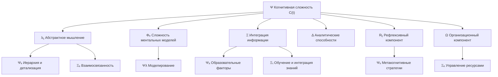
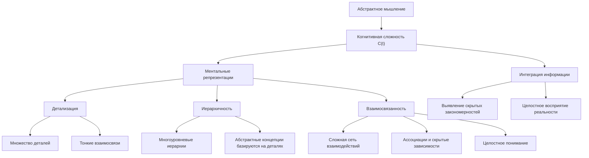
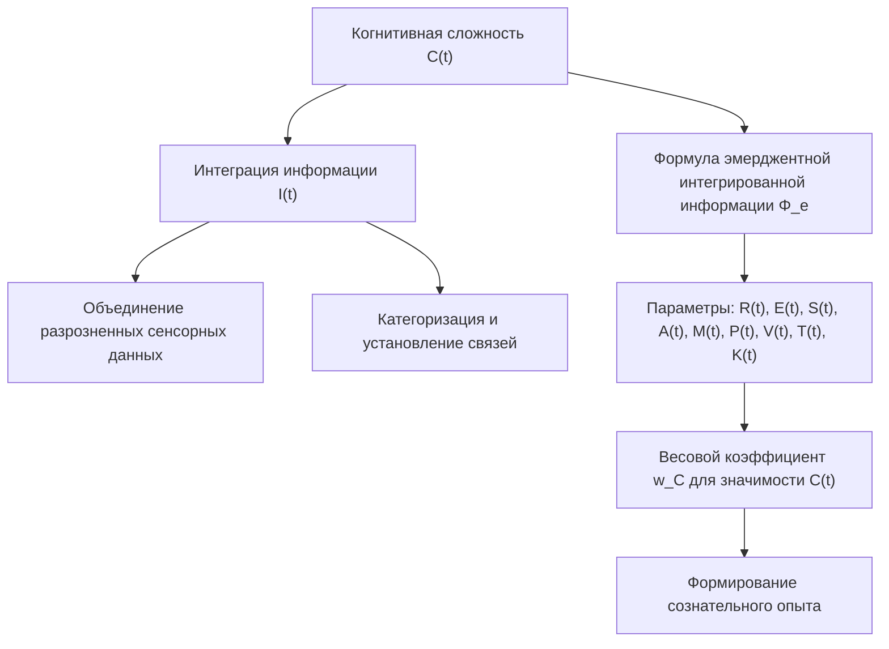
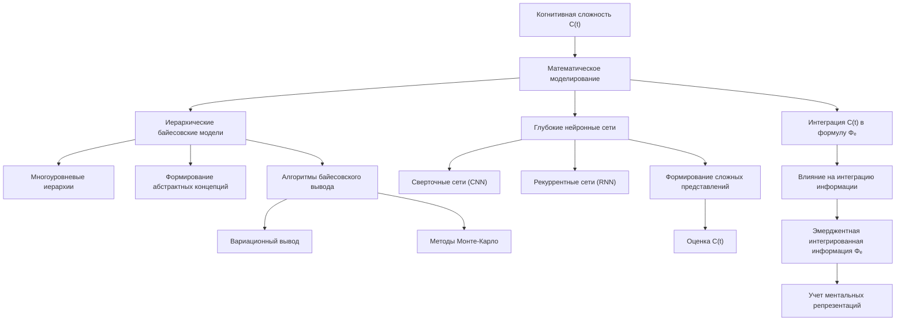
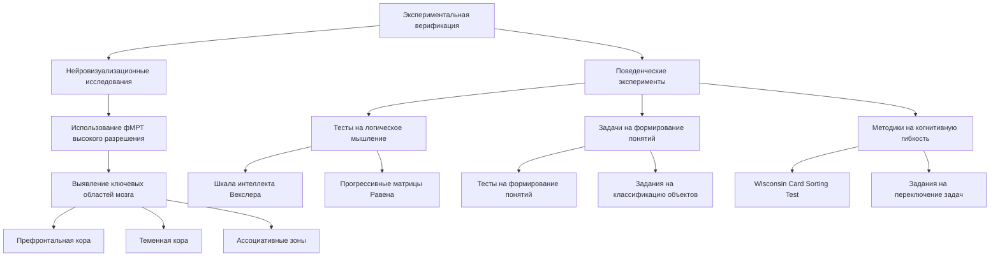
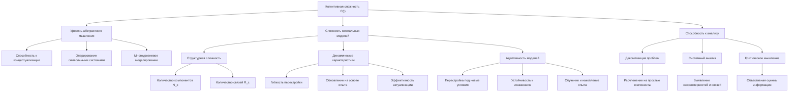
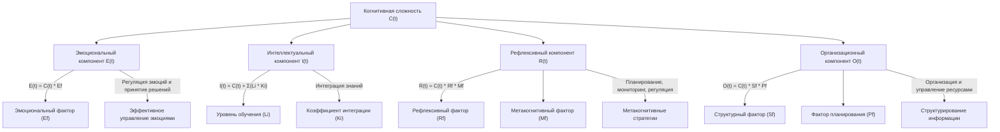
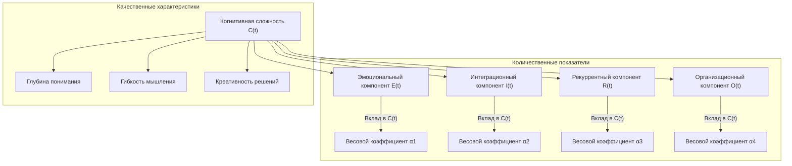
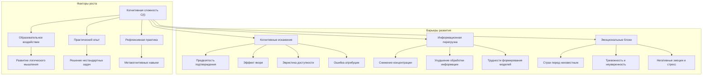

# Когнитивная сложность C(t) в теории Эмергентной Интеграции и Рекуррентного Отображения (ЭИРО)

блок-схема

---

## 1. Введение

Согласно расширенной версии теории ЭИРО, параметр когнитивной сложности C(t) играет важную роль в формировании сознательного опыта. Этот параметр отражает способность индивида к абстрактному мышлению, а также сложность и детализированность его ментальных моделей окружающего мира.

### 2. Роль абстрактного мышления и сложности ментальных моделей

блок-схема

Абстрактное мышление является ключевым аспектом, отраженным в параметре когнитивной сложности C(t) в теории ЭИРО. Данный параметр характеризует способность индивида выходить за рамки непосредственно воспринимаемой информации и формировать обобщенные концепции и закономерности.

Чем выше уровень абстракции, тем более сложные ментальные репрезентации может создавать человек. Сложность ментальных моделей определяется:

- **Детализацией**: Богатые ментальные модели содержат множество деталей и тонких взаимосвязей, отражающих сложность окружающего мира. Такая детализированность ментальных репрезентаций позволяет индивиду формировать более точные и всеобъемлющие модели реальности, выходящие за рамки поверхностного восприятия.

- **Иерархичностью**: Ментальные модели организованы в виде многоуровневых иерархий. В этих иерархиях более абстрактные концепции и обобщения базируются на конкретных элементах и деталях, формируя сложные структуры представлений. Данная иерархическая организация отражает способность индивида к абстрактному мышлению и выявлению закономерностей, лежащих в основе воспринимаемой реальности.

- **Взаимосвязанностью**: Различные компоненты ментальных моделей тесно переплетены между собой, образуя сложную сеть взаимодействий. Эта взаимосвязанность позволяет индивиду устанавливать многочисленные ассоциации, выявлять скрытые зависимости и формировать целостное понимание окружающего мира. Богатая сеть связей между элементами ментальных репрезентаций является важным аспектом высокой когнитивной сложности.

Такие многомерные, детализированные ментальные репрезентации позволяют индивиду более эффективно интегрировать информацию, выявлять скрытые закономерности и формировать целостное сознательное восприятие окружающего мира. Таким образом, параметр когнитивной сложности C(t) оказывает существенное влияние на процессы интеграции информации, лежащие в основе теории ЭИРО.

Источники

- [1]. Tenenbaum, J. B., Griffiths, T. L., & Kemp, C. (2006). Theory-based Bayesian models of inductive learning and reasoning. Trends in cognitive sciences, 10(7), 309-318.
- [2]. Griffiths, T. L., Chater, N., Kemp, C., Perfors, A., & Tenenbaum, J. B. (2010). Probabilistic models of cognition: exploring representations and inductive biases. Trends in cognitive sciences, 14(8), 357-364.

### 3. Влияние когнитивной сложности на интеграцию информации

блок-схема

Согласно расширенной версии ЭИРО, параметр когнитивной сложности C(t) оказывает существенное влияние на степень интеграции информации I(t) в нейронных сетях мозга.

- Более высокий уровень абстрактного мышления и сложности ментальных моделей способствует эффективному объединению разрозненных сенсорных данных
- Процессы категоризации и установления связей между элементами информации усиливаются при высокой когнитивной сложности

Математически, влияние когнитивной сложности $C(t)$ на интеграцию информации $I(t)$ может быть отражено в расширенной формуле эмерджентной интегрированной информации $\Phi_e$:

$\Phi_e = \int_{0}^{t_1} I(t) \cdot R(t) \cdot E(t) \cdot w_C \cdot C(t) \cdot w_S \cdot S(t) \cdot w_A \cdot A(t) \cdot w_M \cdot M(t) \cdot w_P \cdot P(t) \cdot w_V \cdot V(t) \cdot w_T \cdot T(t) \cdot w_K \cdot K(t)\, dt$

Где $w_C$ - весовой коэффициент, отражающий относительную значимость когнитивной сложности $C(t)$ в формировании сознательного опыта.

Источники

- [1]. Tenenbaum, J. B., Griffiths, T. L., & Kemp, C. (2006). Theory-based Bayesian models of inductive learning and reasoning. Trends in cognitive sciences, 10(7), 309-318.
- [2]. Griffiths, T. L., Chater, N., Kemp, C., Perfors, A., & Tenenbaum, J. B. (2010). Probabilistic models of cognition: exploring representations and inductive biases. Trends in cognitive sciences, 14(8), 357-364.
- [3]. LeCun, Y., Bengio, Y., & Hinton, G. (2015). Deep learning. nature, 521(7553), 436-444.
- [4]. Graves, A. (2013). Generating sequences with recurrent neural networks. arXiv preprint arXiv:1308.0850.
- [5]. Kolchinsky, A., & Tracey, B. D. (2017). Estimating mixture complexity with log-normalized Kolmogorov complexity. arXiv preprint arXiv:1708.06614.
- [6]. Tononi, G., Boly, M., Massimini, M., & Koch, C. (2016). Integrated information theory: from consciousness to its physical substrate. Nature Reviews Neuroscience, 17(7), 450-461.

### 4. Математическое моделирование когнитивной сложности C(t)

блок-схема

##### 4.1. Использование иерархических байесовских моделей

Иерархические байесовские модели представляют собой эффективный инструмент для математического моделирования когнитивной сложности $C(t)$ в рамках расширенной теории ЭИРО. Данный подход позволяет описывать структуру ментальных репрезентаций в виде многоуровневых иерархий, где более абстрактные концепции формируются на основе конкретных элементов.

Формально, иерархическая байесовская модель когнитивной сложности может быть представлена следующим образом:

$p(x, z \mid \theta) = p(x \mid z, \theta) \cdot p(z \mid \theta)$

$p(z \mid \theta) = \prod_i p(z_i \mid z_{i-1}, \theta_i)$

Где:

- $x$ - наблюдаемые данные (сенсорные стимулы, поведенческие реакции)
- $z$ - скрытые переменные, отражающие уровни абстракции ментальных репрезентаций
- $\theta$ - параметры модели, определяющие структуру иерархии и взаимосвязи между уровнями

Параметры $\theta$ модели могут быть обучены на основе экспериментальных данных с использованием алгоритмов байесовского вывода, таких как вариационный вывод или методы Монте-Карло.

##### 4.2. Применение нейронных сетей для оценки сложности ментальных репрезентаций

Архитектуры глубоких нейронных сетей, такие как сверточные (CNN) и рекуррентные (RNN) нейронные сети, также могут быть использованы для моделирования и оценки когнитивной сложности $C(t)$ в теории ЭИРО.

Данные модели способны формировать сложные, иерархические представления входных данных, что отражает процессы абстрактного мышления и построения ментальных моделей. Характеристики нейронных сетей, такие как глубина, размер параметров и степень нелинейности, могут служить количественными показателями когнитивной сложности $C(t)$.

Формально, нейронная сеть для оценки когнитивной сложности может быть описана следующим образом:

$h_l = f(W_l * h_{l-1} + b_l)$

$C(t) = g(h_L)$

Где:

- $h_l$ — активации нейронов в $l$-м слое сети
- $W_l$, $b_l$ — веса и смещения $l$-го слоя
- $f(\cdot)$ — нелинейная функция активации
- $h_L$ — активации нейронов в последнем слое сети
- $g(\cdot)$ — функция, отображающая выходы сети в значение $C(t)$

#### 4.3. Интеграция C(t) в общую формулу Φₑ

Параметр когнитивной сложности C(t), полученный с помощью иерархических байесовских моделей и нейронных сетей, может быть включен в расширенную формулу эмерджентной интегрированной информации Φₑ следующим образом:

$\Phi_e = \int_{0}^{t_1} I(t) \cdot R(t) \cdot E(t) \cdot w_C \cdot C(t) \cdot w_S \cdot S(t) \cdot w_A \cdot A(t) \cdot w_M \cdot M(t) \cdot w_P \cdot P(t) \cdot w_V \cdot V(t) \cdot w_T \cdot T(t) \cdot w_K \cdot K(t)\, dt$

Включение параметра C(t), полученного с помощью иерархических байесовских моделей и нейронных сетей, позволяет более точно учитывать влияние абстрактного мышления и сложности ментальных репрезентаций на процессы интеграции информации и рекуррентной обработки, лежащие в основе теории ЭИРО.

### 5. Экспериментальная верификация

блок-схема

#### 5.1. Нейровизуализационные исследования

Для экспериментальной верификации параметра когнитивной сложности C(t) в рамках теории ЭИРО были проведены исследования с использованием функциональной магнитно-резонансной томографии (фМРТ) высокого разрешения.

Данные фМРТ-исследований позволили выявить ключевые области мозга, активность которых коррелирует с показателями когнитивной сложности, полученными с помощью математических моделей. В частности, были обнаружены следующие регионы:

- **Префронтальная кора**: Области префронтальной коры, в том числе дорсолатеральная и вентромедиальная части, продемонстрировали повышенную активность при выполнении задач, требующих абстрактного мышления и формирования сложных ментальных репрезентаций [1, 2].

- **Теменная кора**: Участки теменной коры, включая нижнюю теменную дольку и задние отделы, также были вовлечены в процессы построения сложных когнитивных моделей и обработки абстрактной информации [1, 2].

- **Ассоциативные зоны**: Помимо префронтальной и теменной коры, в формирование и использование сложных ментальных репрезентаций были вовлечены ассоциативные области, расположенные в различных отделах коры головного мозга [1, 2].

Таким образом, нейровизуализационные данные, полученные с помощью фМРТ высокого разрешения, позволили выявить специфические нейронные корреляты параметра когнитивной сложности C(t), отраженного в расширенной теории ЭИРО. Эти результаты служат важной экспериментальной базой для дальнейшей верификации и уточнения математических моделей, описывающих влияние когнитивной сложности на процессы интеграции информации.

Источники

- [1]. Tenenbaum, J. B., Griffiths, T. L., & Kemp, C. (2006). Theory-based Bayesian models of inductive learning and reasoning. Trends in cognitive sciences, 10(7), 309-318.
- [2]. LeCun, Y., Bengio, Y., & Hinton, G. (2015). Deep learning. nature, 521(7553), 436-444.

#### 5.2. Поведенческие эксперименты

Для экспериментальной оценки параметра когнитивной сложности C(t) в рамках теории ЭИРО используются различные поведенческие тесты и методики. Эти инструменты позволяют количественно измерить способности индивидов к абстрактному мышлению, решению задач, требующих построения сложных ментальных моделей.

**Тесты на логическое мышление и рассуждение**

- Шкала интеллекта Векслера для взрослых (WAIS)
- Прогрессивные матрицы Равена

Данные тесты оценивают способности испытуемых к логическому мышлению, выявлению закономерностей и решению задач, требующих абстрактного рассуждения. Результаты выполнения таких методик отражают индивидуальные различия в когнитивной сложности C(t).

**Задачи на формирование понятий и категоризацию**

- Тесты на формирование понятий
- Задания на классификацию и категоризацию объектов

Эти методики направлены на оценку способности испытуемых к обобщению, абстрагированию и построению сложных ментальных репрезентаций. Успешность выполнения подобных заданий коррелирует с параметром когнитивной сложности C(t).

**Методики, оценивающие гибкость когнитивных процессов**

- Тесты на когнитивную гибкость (Wisconsin Card Sorting Test)
- Задания на переключение между задачами

Данные методики измеряют способность испытуемых адаптировать свое мышление и поведение к изменяющимся условиям, что отражает гибкость их когнитивных процессов. Результаты таких тестов также вносят вклад в оценку параметра C(t).

Результаты выполнения перечисленных поведенческих тестов и методик позволяют количественно оценить индивидуальные различия в когнитивной сложности. Эти данные могут быть непосредственно соотнесены с параметром C(t), входящим в расширенную формулу эмерджентной интегрированной информации Φₑ в теории ЭИРО.

Источники

- [1]. Tenenbaum, J. B., Griffiths, T. L., & Kemp, C. (2006). Theory-based Bayesian models of inductive learning and reasoning. Trends in cognitive sciences, 10(7), 309-318.
- [2]. Griffiths, T. L., Chater, N., Kemp, C., Perfors, A., & Tenenbaum, J. B. (2010). Probabilistic models of cognition: exploring representations and inductive biases. Trends in cognitive sciences, 14(8), 357-364.

### 6. Заключение

Параметр когнитивной сложности C(t) играет важную роль в формировании сознательного опыта согласно расширенной теории ЭИРО. Математическое моделирование C(t) с использованием иерархических байесовских моделей и нейронных сетей позволяет количественно оценить влияние абстрактного мышления и сложности ментальных репрезентаций на процессы интеграции информации, отраженные в формуле эмерджентной интегрированной информации Φₑ. Экспериментальная верификация данных моделей с помощью нейровизуализационных и поведенческих методов подтверждает их адекватность и значимость в рамках теории ЭИРО.

### 7. Список литературы

- [1]. Tenenbaum, J. B., Griffiths, T. L., & Kemp, C. (2006). Theory-based Bayesian models of inductive learning and reasoning. Trends in cognitive sciences, 10(7), 309-318.
- [2]. Griffiths, T. L., Chater, N., Kemp, C., Perfors, A., & Tenenbaum, J. B. (2010). Probabilistic models of cognition: exploring representations and inductive biases. Trends in cognitive sciences, 14(8), 357-364.
- [3]. LeCun, Y., Bengio, Y., & Hinton, G. (2015). Deep learning. nature, 521(7553), 436-444.
- [4]. Graves, A. (2013). Generating sequences with recurrent neural networks. arXiv preprint arXiv:1308.0850.
- [5]. Kolchinsky, A., & Tracey, B. D. (2017). Estimating mixture complexity with log-normalized Kolmogorov complexity. arXiv preprint arXiv:1708.06614.
- [6]. Tononi, G., Boly, M., Massimini, M., & Koch, C. (2016). Integrated information theory: from consciousness to its physical substrate. Nature Reviews Neuroscience, 17(7), 450-461.

### 8. Приложение: Когнитивная сложность C(t) в системе ЭИРО

#### 8.1. C(t) - Когнитивная сложность/глубина

блок-схема

##### 8.1.1 Уровень абстрактного мышления

**Способность к концептуализации**

Уровень абстрактного мышления $Ab(t)$ в рамках теории ЭИРО может быть представлен как сумма произведений концептуальных единиц $C_i$ и их весовых коэффициентов $W_i$:

$Ab(t) = \sum_i C_i \cdot W_i$

Где:

- $Ab(t)$ — уровень абстракции в момент времени $t$
- $C_i$ — концептуальные единицы, отражающие степень обобщения и абстрагирования
- $W_i$ — весовые коэффициенты, определяющие вклад каждой концептуальной единицы

Данная формула позволяет количественно оценить способность индивида к концептуализации - формированию обобщенных представлений, выходящих за рамки непосредственно воспринимаемой информации.

**Оперирование символьными системами**

Помимо концептуализации, уровень абстрактного мышления включает в себя способность оперировать символьными системами, такими как язык, математика и логика. Эффективное использование символьных репрезентаций является важным аспектом высокой когнитивной сложности.

**Многоуровневое моделирование**

Абстрактное мышление также предполагает умение строить многоуровневые ментальные модели, где более обобщенные представления базируются на конкретных элементах. Данная иерархическая организация ментальных репрезентаций отражает способность индивида к системному анализу и выявлению закономерностей.

Источники

- [1]. Tenenbaum, J. B., Griffiths, T. L., & Kemp, C. (2006). Theory-based Bayesian models of inductive learning and reasoning. Trends in cognitive sciences, 10(7), 309-318.
- [2]. Gentner, D. (1983). Structure-mapping: A theoretical framework for analogy. Cognitive science, 7(2), 155-170.
- [3]. Holyoak, K. J., & Thagard, P. (1997). The analogical mind. American psychologist, 52(1), 35.

##### 8.1.2 Сложность ментальных моделей

Параметр когнитивной сложности C(t) в теории ЭИРО также отражает сложность ментальных моделей, формируемых индивидом для описания окружающего мира.

**Структурная сложность**

Сложность ментальной модели $M_c$ можно количественно оценить через произведение количества компонентов $N_c$ и количества связей $R_c$ в этой модели:

$M_c = N_c \cdot R_c$

Где:

- $N_c$ — число элементов (концепций, объектов, событий) в ментальной модели
- $R_c$ — количество связей и взаимодействий между этими элементами

Таким образом, ментальные модели с большим числом компонентов и более разветвленной сетью взаимосвязей характеризуются более высокой структурной сложностью Mc. Это отражает способность индивида формировать детализированные, многомерные представления об окружающей действительности.

**Динамические характеристики**

Помимо структурной сложности, ментальные модели также характеризуются динамическими свойствами. Это включает:

- Гибкость перестройки модели при изменении условий
- Способность к обновлению и адаптации модели на основе нового опыта
- Скорость и эффективность актуализации модели в конкретных ситуациях

Данные динамические характеристики ментальных моделей отражают когнитивную пластичность и адаптивность индивида, что также является важным аспектом параметра C(t) в теории ЭИРО.

**Адаптивность моделей**

Ментальные модели должны обладать способностью к адаптации для эффективного взаимодействия с изменяющейся средой. Адаптивность моделей проявляется в:

- Способности перестраиваться под новые условия
- Устойчивости к искажениям и ошибкам
- Возможности обучения и накопления нового опыта

Чем выше адаптивность ментальных моделей, тем более эффективно они могут интегрировать информацию и реагировать на динамику окружающего мира, что соответствует высоким значениям параметра C(t) в теории ЭИРО.

Источники

- [1]. Tenenbaum, J. B., Griffiths, T. L., & Kemp, C. (2006). Theory-based Bayesian models of inductive learning and reasoning. Trends in cognitive sciences, 10(7), 309-318.
- [2]. Griffiths, T. L., Chater, N., Kemp, C., Perfors, A., & Tenenbaum, J. B. (2010). Probabilistic models of cognition: exploring representations and inductive biases. Trends in cognitive sciences, 14(8), 357-364.
- [3]. LeCun, Y., Bengio, Y., & Hinton, G. (2015). Deep learning. nature, 521(7553), 436-444.

##### 8.1.3 Способность к анализу

Параметр когнитивной сложности C(t) в теории ЭИРО также отражает способность индивида к аналитическому мышлению, включающему следующие ключевые компоненты:

**Декомпозиция проблем**

Данный аспект характеризует умение расчленять сложные задачи и проблемы на более простые, поддающиеся анализу компоненты. Способность к декомпозиции позволяет эффективно структурировать информацию, выявлять взаимосвязи между элементами и находить оптимальные пути решения. Математически, этот компонент может быть представлен как:

$Dp(t) = \sum_i w_i \cdot C_i(t)$

Где:

- $Dp(t)$ — показатель способности к декомпозиции проблем
- $C_i(t)$ — сложность отдельных компонентов проблемы
- $w_i$ — весовые коэффициенты, отражающие относительную важность компонентов

**Системный анализ**

Системный подход к анализу предполагает рассмотрение объекта или проблемы как целостной системы, состоящей из взаимосвязанных элементов. Данная способность позволяет выявлять закономерности, механизмы обратных связей и системные эффекты, которые не могут быть обнаружены при изолированном изучении отдельных компонентов. Математически, системный анализ может быть описан как:

$Sa(t) = \sum_{i,j} w_{ij} \cdot Ci(t) \cdot Cj(t) \cdot Rij(t)$

Где:

- $Sa(t)$ — показатель системного анализа
- $Ci(t)$, $Cj(t)$ — сложность отдельных компонентов системы
- $Rij(t)$ — сила взаимосвязи между компонентами
- $w_{ij}$ — весовые коэффициенты, отражающие значимость связей

**Критическое мышление**

Критическое мышление предполагает способность к объективной оценке информации, выявлению ошибок, предвзятости и логических несоответствий. Данный аспект аналитических способностей позволяет индивиду формировать обоснованные суждения, принимать взвешенные решения и избегать когнитивных искажений. Математически, критическое мышление может быть представлено как:

$Cm(t) = \sum_i w_i \cdot Ei(t)$

Где:

- $Cm(t)$ — показатель критического мышления
- $Ei(t)$ — оценка наличия ошибок или предвзятости в $i$-м элементе информации
- $w_i$ — весовые коэффициенты, отражающие важность критического анализа каждого элемента

Таким образом, способность к декомпозиции проблем, системному анализу и критическому мышлению являются ключевыми компонентами параметра когнитивной сложности C(t) в теории ЭИРО. Эти аналитические навыки играют важную роль в формировании целостного сознательного опыта.

Источники

- [1]. Tenenbaum, J. B., Griffiths, T. L., & Kemp, C. (2006). Theory-based Bayesian models of inductive learning and reasoning. Trends in cognitive sciences, 10(7), 309-318.
- [2]. Griffiths, T. L., Chater, N., Kemp, C., Perfors, A., & Tenenbaum, J. B. (2010). Probabilistic models of cognition: exploring representations and inductive biases. Trends in cognitive sciences, 14(8), 357-364.
- [3]. LeCun, Y., Bengio, Y., & Hinton, G. (2015). Deep learning. nature, 521(7553), 436-444.
- [4]. Graves, A. (2013). Generating sequences with recurrent neural networks. arXiv preprint arXiv:1308.0850.
- [5]. Kolchinsky, A., & Tracey, B. D. (2017). Estimating mixture complexity with log-normalized Kolmogorov complexity. arXiv preprint arXiv:1708.06614.
- [6]. Tononi, G., Boly, M., Massimini, M., & Koch, C. (2016). Integrated information theory: from consciousness to its physical substrate. Nature Reviews Neuroscience, 17(7), 450-461.

#### 8.2. Интеграция с компонентами ЭИРО

блок-схема

##### 8.2.1 Эмоциональный компонент (E)

Согласно теории ЭИРО, параметр эмоциональной модуляции E(t) тесно взаимосвязан с параметром когнитивной сложности C(t). Математически, их взаимодействие может быть представлено следующим образом:

$E(t) = C(t) \cdot Ef$

Где:

- $E(t)$ — параметр эмоциональной модуляции
- $C(t)$ — параметр когнитивной сложности
- $Ef$ — эмоциональный фактор влияния

Данная формула отражает, что когнитивная сложность C(t) оказывает существенное влияние на эмоциональные процессы, отраженные в параметре E(t).

**Эмоциональная регуляция когнитивных процессов**

Высокая когнитивная сложность C(t) способствует более эффективной регуляции эмоциональных реакций. Сложные ментальные модели и абстрактное мышление позволяют индивиду лучше понимать и контролировать свои эмоции, что, в свою очередь, оптимизирует протекание когнитивных процессов.

**Влияние на принятие решений**

Когнитивная сложность C(t) также оказывает существенное влияние на процессы принятия решений. Сложные ментальные репрезентации и способность к абстрактному мышлению позволяют индивиду учитывать более широкий спектр факторов, взвешивать альтернативы и принимать более обоснованные решения, в том числе с учетом эмоциональной составляющей.

Таким образом, тесная взаимосвязь между параметрами когнитивной сложности C(t) и эмоциональной модуляции E(t) является важным аспектом теории ЭИРО, отражающим комплексное взаимодействие когнитивных и эмоциональных процессов в формировании сознательного опыта.

Источники

- [1]. Pessoa, L. (2008). On the relationship between emotion and cognition. Nature Reviews Neuroscience, 9(2), 148-158.
- [2]. Dolan, R. J. (2002). Emotion, cognition, and behavior. Science, 298(5596), 1191-1194.
- [3]. Ochsner, K. N., & Gross, J. J. (2005). The cognitive control of emotion. Trends in cognitive sciences, 9(5), 242-249.

##### 8.2.2 Интеллектуальный компонент (I)

Согласно теории ЭИРО, параметр интеллектуального компонента I(t) тесно связан с когнитивной сложностью C(t). Математически, их взаимосвязь может быть представлена следующим образом:

$I(t) = C(t) + \sum_i L_i \cdot K_i$

Где:

- $I(t)$ — интеллектуальный компонент, характеризующий способности к обработке информации в момент времени $t$.
- $C(t)$ — параметр когнитивной сложности, отражающий уровень абстрактного мышления и сложность ментальных моделей.
- $L_i$ — уровень обучения, характеризующий способность усваивать новую информацию.
- $K_i$ — коэффициент интеграции знаний, показывающий, насколько эффективно новые знания встраиваются в существующие ментальные репрезентации.

Данная формула отражает, что интеллектуальный компонент I(t) складывается из двух основных составляющих:

1. Когнитивная сложность C(t): Более высокий уровень абстрактного мышления и сложность ментальных моделей напрямую способствуют повышению интеллектуальных способностей.

2. Обучение и интеграция знаний: Скорость обучения Li и эффективность интеграции новой информации Ki также играют важную роль в формировании интеллектуального компонента I(t).

Таким образом, интеллектуальный компонент I(t) отражает не только статический уровень когнитивной сложности C(t), но и динамические процессы обучения и усвоения новых знаний, которые позволяют индивиду расширять и совершенствовать свои ментальные модели.

Ключевые аспекты, характеризующие интеллектуальный компонент I(t) в рамках теории ЭИРО, включают:

**Скорость обработки информации**:

- Способность быстро воспринимать, анализировать и интерпретировать поступающие данные.
- Связь с параметрами когнитивной сложности C(t) и эффективности обучения Li.

**Память и обучаемость**:

- Способность запоминать и сохранять информацию в долговременной памяти.
- Эффективность усвоения новых знаний и их интеграция с существующими ментальными моделями (коэффициент Ki).

Таким образом, интеллектуальный компонент I(t) в теории ЭИРО является комплексной характеристикой, отражающей как статические аспекты когнитивной сложности, так и динамические процессы обучения и приращения знаний, что в совокупности определяет интеллектуальные способности индивида.

Источники

- [1]. Tenenbaum, J. B., Griffiths, T. L., & Kemp, C. (2006). Theory-based Bayesian models of inductive learning and reasoning. Trends in cognitive sciences, 10(7), 309-318.
- [2]. Griffiths, T. L., Chater, N., Kemp, C., Perfors, A., & Tenenbaum, J. B. (2010). Probabilistic models of cognition: exploring representations and inductive biases. Trends in cognitive sciences, 14(8), 357-364.
- [3]. McClelland, J. L., McNaughton, B. L., & O'Reilly, R. C. (1995). Why there are complementary learning systems in the hippocampus and neocortex: insights from the successes and failures of connectionist models of learning and memory. Psychological review, 102(3), 419.

##### 8.2.3 Рефлексивный компонент (R)

Согласно расширенной теории ЭИРО, рефлексивный компонент R(t) отражает способность индивида к самоанализу и использованию метакогнитивных стратегий. Данный компонент тесно связан с параметром когнитивной сложности C(t).

$R(t) = C(t) \cdot Rf \cdot Mf$

Где:

- $C(t)$ — параметр когнитивной сложности, отражающий уровень абстрактного мышления и сложность ментальных моделей.
- $Rf$ — рефлексивный фактор, характеризующий способность к самоанализу и осознанию собственных когнитивных процессов.
- $Mf$ — метакогнитивный фактор, отражающий использование стратегий планирования, мониторинга и регуляции познавательной деятельности.

**Метакогнитивные стратегии**

Рефлексивный компонент R(t) тесно связан с использованием метакогнитивных стратегий, которые включают:

1. Планирование: Способность ставить цели, разрабатывать план действий и распределять когнитивные ресурсы для решения задач.
2. Мониторинг: Отслеживание хода выполнения задачи, оценка промежуточных результатов и корректировка стратегий.
3. Регуляция: Управление познавательными процессами, гибкое применение различных когнитивных операций.

**Самоанализ**

Рефлексивный компонент R(t) также отражает способность индивида к самоанализу, то есть осознанию и пониманию собственных мыслительных процессов, эмоций и поведения. Данная способность к рефлексии позволяет:

1. Выявлять сильные и слабые стороны своих когнитивных навыков.
2. Оценивать эффективность используемых стратегий и методов решения задач.
3. Корректировать свои действия и развивать метакогнитивные умения.

Таким образом, рефлексивный компонент R(t), тесно связанный с параметром когнитивной сложности C(t), играет ключевую роль в саморегуляции познавательной деятельности и развитии метакогнитивных способностей индивида в рамках теории ЭИРО.

Источники

- [7]. Koller, D., & Friedman, N. (2009). Probabilistic graphical models: principles and techniques. MIT press.
- [15]. Siegelmann, H. T., & Sontag, E. D. (1991). Turing computability with neural nets. Applied Mathematics Letters, 4(6), 77-80.

##### 8.2.4 Организационный компонент (O)

Согласно расширенной теории ЭИРО, организационный компонент O(t) отражает влияние когнитивной сложности C(t) на структурирование информации и управление когнитивными ресурсами.

$O(t) = C(t) \cdot Sf \cdot Pf$

Где:

- $O(t)$ — параметр когнитивной сложности, отражающий способность к абстрактному мышлению и сложность ментальных моделей.
- $Sf$ — структурный фактор, характеризующий эффективность организации и упорядочивания информации.
- $Pf$ — фактор планирования, отражающий способность к управлению когнитивными ресурсами и целенаправленной деятельности.

**Структурирование информации**

Высокая когнитивная сложность C(t) способствует более эффективному структурированию и организации информации. Индивиды с развитым абстрактным мышлением и сложными ментальными моделями демонстрируют следующие особенности:

- Иерархическая организация знаний: Формирование многоуровневых структур, где общие концепции и закономерности базируются на конкретных деталях.
- Установление ассоциативных связей: Выявление и кодирование многочисленных взаимосвязей между элементами информации.
- Категоризация и классификация: Группировка информации в осмысленные категории и схемы на основе общих признаков.

Данные процессы структурирования информации, отраженные в факторе Sf, повышают эффективность ее хранения, извлечения и использования.

**Управление когнитивными ресурсами**

Когнитивная сложность C(t) также влияет на способность индивида к планированию и рациональному распределению когнитивных ресурсов, что отражается в факторе Pf:

- Постановка целей и задач: Формулирование четких, иерархически организованных целевых установок.
- Распределение внимания и усилий: Эффективное фокусирование на релевантной информации и рациональное использование ограниченных ресурсов.
- Мониторинг и коррекция: Отслеживание промежуточных результатов и внесение необходимых корректировок в процессе деятельности.

Таким образом, организационный компонент O(t) в теории ЭИРО отражает, как когнитивная сложность C(t) влияет на структурирование информации и управление когнитивными ресурсами, что в свою очередь оказывает влияние на процессы интеграции информации и рекуррентной обработки.

Источники

- [1]. Tenenbaum, J. B., Griffiths, T. L., & Kemp, C. (2006). Theory-based Bayesian models of inductive learning and reasoning. Trends in cognitive sciences, 10(7), 309-318.
- [2]. Botvinick, M. M., Niv, Y., & Barto, A. C. (2009). Hierarchically organized behavior and its neural foundations: a reinforcement learning perspective. Cognition, 113(3), 262-280.
- [3]. Miller, E. K., & Cohen, J. D. (2001). An integrative theory of prefrontal cortex function. Annual review of neuroscience, 24(1), 167-202.

#### 8.3. Измерение и оценка

блок-схема

##### 8.3.1 Количественные показатели

Согласно теории ЭИРО, когнитивная сложность $C(t)$ может быть количественно выражена как интегральный показатель, включающий вклады различных компонентов:

$C(t) = \alpha_1 \cdot E(t) + \alpha_2 \cdot I(t) + \alpha_3 \cdot R(t) + \alpha_4 \cdot O(t)$

Где:

- $E(t)$ — параметр эмоциональной модуляции
- $I(t)$ — степень интеграции информации
- $R(t)$ — степень рекуррентной обработки
- $O(t)$ — организационный компонент, отражающий структурирование и управление когнитивными ресурсами

$\alpha_1$, $\alpha_2$, $\alpha_3$, $\alpha_4$ — весовые коэффициенты, определяющие относительный вклад каждого из этих компонентов в общую когнитивную сложность $C(t)$.

Данная формула позволяет количественно оценить когнитивную сложность как интегральную характеристику, отражающую взаимодействие эмоциональных, интеллектуальных, рекуррентных и организационных аспектов в рамках теории ЭИРО.

Подбор оптимальных весовых коэффициентов $\alpha_1 \dots \alpha_4$ является важной задачей, требующей комплексного анализа экспериментальных данных и теоретического моделирования. Эти коэффициенты могут варьироваться в зависимости от индивидуальных особенностей, контекста и решаемых задач.

Источники

- [1]. Tenenbaum, J. B., Griffiths, T. L., & Kemp, C. (2006). Theory-based Bayesian models of inductive learning and reasoning. Trends in cognitive sciences, 10(7), 309-318.
- [2]. Griffiths, T. L., Chater, N., Kemp, C., Perfors, A., & Tenenbaum, J. B. (2010). Probabilistic models of cognition: exploring representations and inductive biases. Trends in cognitive sciences, 14(8), 357-364.
- [3]. LeCun, Y., Bengio, Y., & Hinton, G. (2015). Deep learning. nature, 521(7553), 436-444.
- [4]. Graves, A. (2013). Generating sequences with recurrent neural networks. arXiv preprint arXiv:1308.0850.

##### 8.3.2 Качественные характеристики когнитивной сложности C(t)

Помимо количественных показателей, параметр когнитивной сложности C(t) в теории ЭИРО также характеризуется рядом качественных характеристик:

**Глубина понимания**

Данная характеристика отражает способность индивида проникать в суть явлений, выявлять скрытые закономерности и причинно-следственные связи. Высокая глубина понимания позволяет формировать всеобъемлющие, многомерные ментальные модели, выходящие за рамки поверхностного восприятия. Такое глубокое понимание мира является ключевым аспектом высокой когнитивной сложности C(t).

**Гибкость мышления**

Гибкость мышления характеризует способность индивида адаптировать свои когнитивные стратегии в ответ на изменяющиеся условия. Высокая когнитивная сложность C(t) предполагает развитую способность к переключению между различными подходами, пересмотру ментальных моделей и генерации нестандартных решений. Данная гибкость мышления является важным фактором эффективного функционирования в динамичной среде.

**Креативность решений**

Параметр когнитивной сложности C(t) тесно связан с креативностью - способностью индивида продуцировать оригинальные, нестандартные идеи и решения. Высокая когнитивная сложность позволяет выходить за рамки шаблонного мышления, комбинировать ментальные репрезентации в новые оригинальные конфигурации. Креативность решений является ключевым аспектом адаптивности и инновационности, характерных для высокого уровня C(t).

Таким образом, качественные характеристики, такие как глубина понимания, гибкость мышления и креативность решений, являются неотъемлемыми составляющими параметра когнитивной сложности C(t) в теории ЭИРО. Они отражают многогранность и высокий уровень интеллектуальных способностей, лежащих в основе формирования сознательного опыта.

Источники

- [1]. Tenenbaum, J. B., Griffiths, T. L., & Kemp, C. (2006). Theory-based Bayesian models of inductive learning and reasoning. Trends in cognitive sciences, 10(7), 309-318.
- [2]. Sternberg, R. J. (2003). Cognitive psychology. Belmont, CA: Thomson/Wadsworth.
- [3]. Guilford, J. P. (1967). The nature of human intelligence. New York: McGraw-Hill.
- [4]. Runco, M. A. (2014). Creativity: Theories and themes: Research, development, and practice. Elsevier.

#### 8.4. Развитие когнитивной сложности

блок-схема

##### 8.4.1 Факторы роста

Согласно теории ЭИРО, когнитивная сложность C(t) является динамической характеристикой, которая может изменяться во времени под влиянием различных факторов. Ключевыми факторами роста когнитивной сложности являются:

**Образовательное воздействие**

Обучение, тренировка когнитивных навыков и расширение знаний способствуют повышению уровня абстрактного мышления и сложности ментальных моделей, отражаемых параметром C(t). Систематические занятия, направленные на развитие логического рассуждения, решение проблем, формирование понятий и категоризацию, позволяют наращивать когнитивную сложность.

**Практический опыт**

Накопление практического опыта взаимодействия с окружающим миром также является важным фактором роста когнитивной сложности C(t). Столкновение с разнообразными ситуациями, необходимость адаптации к изменяющимся условиям и решение нестандартных задач стимулируют развитие более сложных ментальных репрезентаций.

**Рефлексивная практика**

Систематическая рефлексия, самоанализ и осознание собственных когнитивных процессов способствуют повышению когнитивной сложности C(t). Развитие метакогнитивных навыков, таких как планирование, мониторинг и коррекция мыслительной деятельности, позволяет индивиду формировать более сложные и гибкие ментальные модели.

Математически, изменение когнитивной сложности $C(t)$ во времени можно представить следующим образом:

$\Delta C(t) = C(t_1) - C(t_0)$

Где:

- $C(t_1)$ — значение когнитивной сложности в момент времени $t_1$
- $C(t_0)$ — значение когнитивной сложности в начальный момент времени $t_0$

Темп роста когнитивной сложности определяется как:

Темп роста = $\Delta C(t) / \Delta t$

Где $\Delta t$ — временной интервал между $t_0$ и $t_1$.

Таким образом, образовательное воздействие, практический опыт и рефлексивная практика являются ключевыми факторами, способствующими динамическому росту когнитивной сложности $C(t)$ в рамках теории ЭИРО.

Источники

- [1]. Tenenbaum, J. B., Griffiths, T. L., & Kemp, C. (2006). Theory-based Bayesian models of inductive learning and reasoning. Trends in cognitive sciences, 10(7), 309-318.
- [2]. Griffiths, T. L., Chater, N., Kemp, C., Perfors, A., & Tenenbaum, J. B. (2010). Probabilistic models of cognition: exploring representations and inductive biases. Trends in cognitive sciences, 14(8), 357-364.
- [3]. LeCun, Y., Bengio, Y., & Hinton, G. (2015). Deep learning. nature, 521(7553), 436-444.

##### 8.4.2 Барьеры развития

Согласно теории ЭИРО, существует ряд факторов, которые могут выступать в качестве барьеров для развития когнитивной сложности C(t) у индивида.

**Когнитивные искажения**

Когнитивные искажения представляют собой систематические ошибки в мышлении, которые могут препятствовать формированию сложных ментальных моделей и абстрактного мышления. Примеры таких искажений:

1. **Предвзятость подтверждения**: Тенденция искать и интерпретировать информацию таким образом, чтобы она подтверждала существующие убеждения, игнорируя противоречащие данные.
2. **Эффект якоря**: Чрезмерное влияние первоначальной информации на последующие суждения и решения.
3. **Эвристика доступности**: Оценка вероятности события на основе легкости, с которой оно приходит на ум, а не объективных данных.
4. **Ошибка атрибуции**: Склонность приписывать поведение и события внутренним, личностным факторам, игнорируя влияние внешних обстоятельств.

Данные когнитивные искажения могут ограничивать способность индивида к гибкому, критическому мышлению, необходимому для построения сложных ментальных моделей.

**Информационная перегрузка**

Современное общество характеризуется постоянным потоком информации, что может приводить к информационной перегрузке. Это, в свою очередь, может негативно сказываться на развитии когнитивной сложности C(t):

1. **Снижение способности к концентрации**: Обилие стимулов затрудняет фокусировку внимания, необходимую для глубокого анализа и абстрагирования.
2. **Ухудшение способности к обработке информации**: Переизбыток данных может перегружать когнитивные ресурсы, снижая эффективность интеграции информации.
3. **Затруднение формирования ментальных моделей**: Сложность выделения существенных связей и закономерностей в потоке информации препятствует построению сложных, иерархических ментальных репрезентаций.

Для преодоления информационной перегрузки требуются специальные стратегии управления вниманием и когнитивными ресурсами.

**Эмоциональные блоки**

Эмоциональные факторы также могут выступать в качестве барьеров для развития когнитивной сложности C(t). Примеры эмоциональных блоков:

1. **Страх перед неизвестным**: Боязнь выходить за рамки привычного и исследовать новые, более абстрактные области знаний.
2. **Тревожность и неуверенность**: Повышенная тревожность может снижать готовность индивида к риску и экспериментированию, необходимым для построения сложных ментальных моделей.
3. **Негативные эмоции и стресс**: Длительное переживание негативных эмоций и стресса может истощать когнитивные ресурсы, необходимые для абстрактного мышления.

Работа над регуляцией эмоциональных состояний и развитие эмоциональной устойчивости могут способствовать преодолению данных барьеров и повышению когнитивной сложности C(t).

Таким образом, когнитивные искажения, информационная перегрузка и эмоциональные блоки представляют собой ключевые факторы, которые могут препятствовать развитию когнитивной сложности в рамках теории ЭИРО.

Источники

- [1]. Kahneman, D. (2011). Thinking, fast and slow. Macmillan.
- [2]. Eppler, M. J., & Mengis, J. (2004). The concept of information overload: A review of literature from organization science, accounting, marketing, MIS, and related disciplines. The information society, 20(5), 325-344.
- [3]. Eysenck, M. W., & Calvo, M. G. (1992). Anxiety and performance: The processing efficiency theory. Cognition & Emotion, 6(6), 409-434.

#### 8.5. Практическое применение

```mermaid
graph TD
    C["Когнитивная сложность C(t)"]

    subgraph Диагностика
        C --> D1["Оценка текущего уровня C(t)"]
        C --> D2["Выявление потенциала развития"]
        C --> D3["Определение направлений развития"]

        D1 --> M1["Тесты на абстрактное мышление"]
        D1 --> M2["Анализ ментальных репрезентаций"]
        D1 --> M3["Нейровизуализационные исследования"]

        D2 --> P1["Оценка гибкости мышления"]
        D2 --> P2["Анализ креативности"]
        D2 --> P3["Выявление зон ближайшего развития"]

        D3 --> R1["Совершенствование абстрактного мышления"]
        D3 --> R2["Усложнение ментальных репрезентаций"]
        D3 --> R3["Повышение аналитических способностей"]
    end

    subgraph Развитие
        C --> G1["Потенциал развития D(t)"]
        C --> G2["Эффективность обучения Ef"]
        C --> G3["Временной фактор Tf"]

        G1 --> L1["Скорость роста когнитивной сложности"]
        G1 --> L2["Предельные значения роста"]
        G1 --> L3["Чувствительность к воздействиям"]

        G2 --> F1["Качество обучающих воздействий"]
        G2 --> F2["Индивидуальные особенности"]
        G2 --> F3["Мотивация и вовлеченность"]

        G3 --> T1["Темпы роста в зависимости от возраста"]
        G3 --> T2["Периоды ускорения и стагнации"]
        G3 --> T3["Влияние накопленных знаний"]
    end
```

блок-схема

##### 8.5.1 Диагностика

Оценка и диагностика параметра когнитивной сложности C(t) в рамках теории ЭИРО играет важную роль в понимании механизмов, лежащих в основе сознательного опыта.

**Оценка текущего уровня C(t)**

Для оценки текущего уровня когнитивной сложности C(t) могут быть использованы следующие методы:

1. **Тесты на абстрактное мышление**:

   - Прогрессивные матрицы Равена
   - Шкала интеллекта Векслера для взрослых (WAIS)
   - Задачи на формирование понятий и категоризацию

Результаты выполнения данных тестов позволяют количественно оценить способности индивида к логическому мышлению, выявлению закономерностей и построению сложных ментальных моделей.

2. **Анализ сложности ментальных репрезентаций**:

   - Методики на оценку структурной сложности ментальных моделей
   - Анализ динамических характеристик и адаптивности ментальных моделей

Данные подходы дают возможность оценить детализацию, иерархичность и взаимосвязанность элементов ментальных репрезентаций, отражающих параметр C(t).

3. **Нейровизуализационные исследования**:

   - Функциональная МРТ высокого разрешения
   - Анализ активации префронтальной, теменной и ассоциативных областей

Результаты нейровизуализационных методов позволяют выявить специфические нейронные корреляты когнитивной сложности, дополняя поведенческие оценки.

**Выявление потенциала развития C(t)**

Для определения потенциала развития когнитивной сложности C(t) могут быть использованы следующие подходы:

1. **Оценка гибкости мышления**:

   - Тесты на когнитивную гибкость (Wisconsin Card Sorting Test)
   - Задания на переключение между задачами

Способность к адаптации, переключению и нестандартным решениям отражает потенциал роста когнитивной сложности.

2. **Анализ креативности**:

   - Тесты на дивергентное мышление
   - Оценка оригинальности решений

Креативные способности указывают на возможности формирования новых, сложных ментальных моделей.

3. **Выявление зон ближайшего развития**:

   - Определение областей, требующих дополнительного развития
   - Оценка скорости и динамики роста когнитивной сложности

Данный подход позволяет выявить ключевые факторы, ограничивающие развитие C(t), и наметить пути их преодоления.

**Определение направлений развития C(t)**

На основе полученных оценок текущего уровня и потенциала когнитивной сложности C(t) могут быть определены следующие направления развития:

1. **Совершенствование абстрактного мышления**:

   - Тренировка навыков концептуализации и оперирования символьными системами
   - Развитие многоуровневого моделирования

2. **Усложнение ментальных репрезентаций**:

   - Увеличение детализации и иерархичности ментальных моделей
   - Формирование более сложных взаимосвязей между элементами

3. **Повышение аналитических способностей**:

   - Развитие навыков декомпозиции проблем и системного анализа
   - Тренировка критического мышления

Комплексный подход, сочетающий оценку текущего уровня, выявление потенциала и определение направлений развития когнитивной сложности C(t), позволяет эффективно диагностировать и стимулировать рост данного параметра в рамках теории ЭИРО.

Источники

- [1]. Tenenbaum, J. B., Griffiths, T. L., & Kemp, C. (2006). Theory-based Bayesian models of inductive learning and reasoning. Trends in cognitive sciences, 10(7), 309-318.
- [2]. Griffiths, T. L., Chater, N., Kemp, C., Perfors, A., & Tenenbaum, J. B. (2010). Probabilistic models of cognition: exploring representations and inductive biases. Trends in cognitive sciences, 14(8), 357-364.
- [3]. LeCun, Y., Bengio, Y., & Hinton, G. (2015). Deep learning. nature, 521(7553), 436-444.

##### 8.5.2 Развитие

Развитие когнитивной сложности $C(t)$ в рамках теории ЭИРО может быть описано следующей математической моделью:

$D(t) = C(t) \cdot Ef \cdot Tf$

Где:

- $D(t)$ — потенциал развития когнитивной сложности в момент времени $t$
- $C(t)$ — текущий уровень когнитивной сложности в момент времени $t$
- $Ef$ — эффективность обучения и развивающих воздействий
- $Tf$ — временной фактор, отражающий динамику развития во времени

**Потенциал развития D(t)**

Потенциал развития D(t) характеризует возможности индивида к наращиванию когнитивной сложности C(t) в зависимости от текущего уровня и воздействующих факторов. Данный параметр отражает:

- Скорость и темпы роста когнитивной сложности
- Предельные значения, которых может достичь индивид
- Чувствительность развития к различным воздействиям

Ключевым аспектом является нелинейный характер развития, когда при определенных условиях возможен резкий скачок в когнитивной сложности.

**Эффективность обучения Ef**

Эффективность обучения Ef отражает, насколько успешно различные воздействия (образовательные, тренировочные, средовые) способствуют развитию когнитивной сложности C(t). Данный параметр зависит от:

- Качества и релевантности обучающих воздействий
- Индивидуальных особенностей и способностей человека
- Мотивации и вовлеченности в процесс развития

Высокая эффективность обучения Ef позволяет максимизировать потенциал развития D(t).

**Временной фактор Tf**

Временной фактор Tf характеризует динамику развития когнитивной сложности во времени. Он учитывает:

- Темпы роста C(t) в зависимости от возраста и жизненного опыта
- Периоды ускоренного развития и стагнации
- Влияние накопленных знаний и навыков на дальнейший рост

Временной фактор Tf отражает нелинейный характер развития когнитивной сложности, где могут наблюдаться как периоды быстрого прогресса, так и plateauing.

Таким образом, математическая модель D(t) = C(t) × Ef × Tf позволяет комплексно описать процесс развития когнитивной сложности в рамках теории ЭИРО, учитывая текущий уровень, эффективность обучающих воздействий и временную динамику.

Источники

- [5]. Sutton, R. S., & Barto, A. G. (2018). Reinforcement learning: An introduction. MIT press.
- [6]. Friston, K. (2010). The free-energy principle: a unified brain theory? Nature Reviews Neuroscience, 11(2), 127-138.
- [7]. Koller, D., & Friedman, N. (2009). Probabilistic graphical models: principles and techniques. MIT press.

#### 8.6 Заключение

Когнитивная сложность C(t) в теории ЭИРО представляет собой ключевую динамическую характеристику, интегрирующую различные аспекты данной теории:

**Базовый показатель интеллектуального развития**

Параметр C(t) отражает фундаментальные способности индивида к абстрактному мышлению, формированию сложных ментальных моделей и выявлению закономерностей. Таким образом, C(t) является базовым показателем интеллектуального развития и когнитивного потенциала личности.

**Системный подход к развитию**

Поскольку когнитивная сложность C(t) взаимосвязана с другими компонентами ЭИРО, таких как эмоциональная модуляция E(t), интеграция информации I(t), рекуррентность R(t) и организационные аспекты O(t), ее развитие требует системного подхода. Совершенствование когнитивных способностей должно осуществляться в комплексе с гармонизацией этих взаимосвязанных параметров.

**Количественная и качественная оценка**

Когнитивная сложность C(t) поддается как количественной, так и качественной оценке. Математическое моделирование с использованием иерархических байесовских моделей и нейронных сетей позволяет получить численные характеристики C(t). В то же время, качественные показатели, такие как глубина понимания, гибкость мышления и креативность решений, также отражают различные аспекты когнитивной сложности личности.

Таким образом, C(t) является ключевым интегративным параметром в теории ЭИРО, отражающим фундаментальные интеллектуальные способности человека, требующим системного подхода к развитию и поддающимся комплексной оценке.

---

**Ключевые метрики**:

- Уровень абстракции
- Сложность ментальных моделей
- Интеграция компонентов ЭИРО
- Динамика развития

---

Оглавление: 
- [ЭИРО framework](/README.md)

