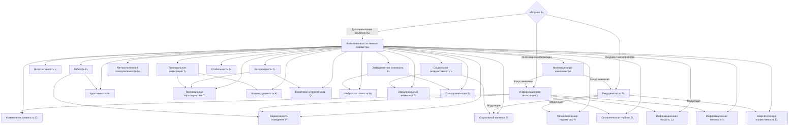
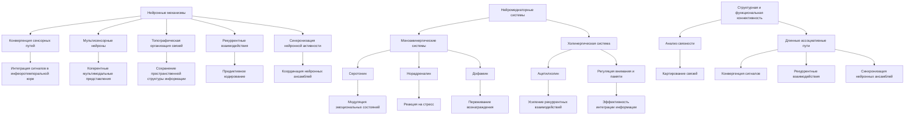
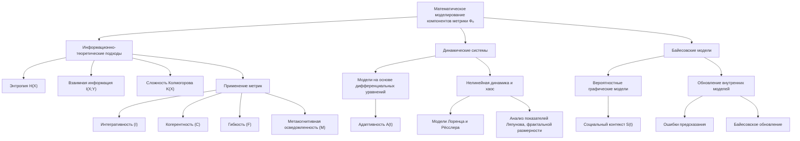
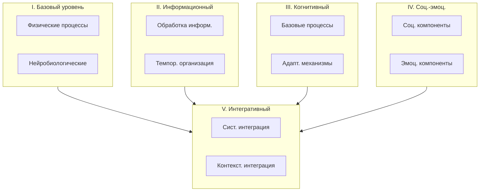

# Дополнительные компоненты метрики Φₑ в контексте теории Эмергентной Интеграции и Рекуррентного Отображения (ЭИРО)

---

## Оглавление

1. Введение
   - 1.1. Теория ЭИРО и метрика Φₑ
   - 1.2. Необходимость расширения метрики

2. Компоненты метрики Φₑ
   - 2.1. Когнитивная сложность/глубина (C(t))
   - 2.2. Социальный контекст (S(t))
   - 2.3. Адаптивность (A(t))
   - 2.4. Мотивационный компонент (M(t))
   - 2.5. Физиологические параметры (P(t))
   - 2.6. Вариативность поведения (V(t))
   - 2.7. Темпоральные характеристики (T(t))
   - 2.8. Контекстуальность (K(t))
   - 2.9. Интегративность (I)
   - 2.10. Когерентность (C)
   - 2.11. Гибкость (F)
   - 2.12. Метакогнитивная осведомленность (M)
   - 2.13. Социальная интерактивность (I_s)
   - 2.14. Энергетическая эффективность (E_eff)
   - 2.15. Информационная емкость (I_c)
   - 2.16. Стабильность (S_t)
   - 2.17. Семантическая глубина (D_s)
   - 2.18. Квантовая когерентность (Q_c)
   - 2.19. Эмерджентная сложность (E_c)
   - 2.20. Нейропластичность (N_p)
   - 2.21. Информационная интеграция (I_i)
   - 2.22. Темпоральная интеграция (T_i)
   - 2.23. Эмоциональный интеллект (E_i)
   - 2.24. Самоорганизация (S_o)
   - 2.25. Информационная связность (I_c)

3. Нейробиологические основы компонентов
   - 3.1. Нейронные механизмы
   - 3.2. Нейромедиаторные системы
   - 3.3. Структурная и функциональная коннективность

4. Математическое моделирование компонентов
   - 4.1. Информационно-теоретические подходы
   - 4.2. Динамические системы
   - 4.3. Байесовские модели

5. Экспериментальная верификация
   - 5.1. Нейровизуализационные исследования
   - 5.2. Поведенческие эксперименты
   - 5.3. Оптогенетические методы

6. Практическое применение
   - 6.1. Диагностика психических расстройств
   - 6.2. Терапевтические подходы
   - 6.3. Разработка интеллектуальных систем

7. Заключение
   - 7.1. Обобщение роли компонентов метрики Φₑ
   - 7.2. Перспективы дальнейших исследований

8. Приложение
   - 8.1. Структурная организация метрики Φₑ

### 1. Введение

#### 1.1. Теория ЭИРО и метрика Φₑ

Теория Эмергентной Интеграции и Рекуррентного Отображения (ЭИРО) утверждает, что сознание возникает из процессов, объединяющих информацию через рекуррентные нейронные сети. Ключевым параметром является эмерджентная интегрированная информация (Φₑ), учитывающая количество и качество интегрированной информации в контексте рекуррентной обработки [1].

#### 1.2. Необходимость расширения метрики

Первоначальная формула Φₑ включала лишь два основных компонента - степень интеграции информации I(t) и степень рекуррентности R(t). Однако для более полного описания механизмов, лежащих в основе сознания, необходимо расширить данную метрику за счет включения дополнительных параметров, отражающих различные аспекты когнитивных, эмоциональных, социальных и физиологических процессов [2, 3].

### 2. Компоненты метрики Φₑ

**Блок-схема: компоненты метрики**

```mermaid
graph TD
    A["Когнитивная сложность C(t)"] -->|Влияет на| B[Интеграция информации I]
    A -->|Влияет на| C[Целостность сознания]
    D["Социальный контекст S(t)"] -->|Модулирует| E[Рекуррентность R]
    F["Адаптивность A(t)"] -->|Связана с| G[Гибкость F]
    H["Мотивация M(t)"] -->|Влияет на| B
    H -->|Влияет на| E
    I["Физиологические параметры P(t)"] -->|Модулируют| J[Энергетическая эффективность E_eff]
    K["Вариативность поведения V(t)"] -->|Связана с| G
    K -->|Связана с| L[Креативность]
    M["Темпоральные характеристики T(t)"] -->|Влияют на| B
    M -->|Влияют на| E
    N["Контекстуальность K(t)"] -->|Модулирует| B
    N -->|Модулирует| E
    O[Интегративность I] -->|Объединяет| P[Модальности информации]
    Q[Когерентность C] -->|Определяет| R[Синхронизацию нейронов]
    S[Гибкость F] -->|Отражает| T[Креативность и адаптацию]
    U[Метакогнитивная осведомленность M] -->|Влияет на| V[Саморегуляцию]
    W[Социальная интерактивность I_s] -->|Связана с| X[Эмпатия]
    Y[Энергетическая эффективность E_eff] -->|Оптимизирует| Z[Когнитивные ресурсы]
    AA[Информационная емкость I_c] -->|Обрабатывает| AB[Большие объемы данных]
    AC[Стабильность S_t] -->|Обеспечивает| AD[Надежность процессов]
    AE[Семантическая глубина D_s] -->|Обеспечивает| AF[Понимание контекста]
    AG[Квантовая когерентность Q_c] -->|Влияет на| AH[Динамику нейронов]
    AI[Эмерджентная сложность E_c] -->|Отражает| AJ[Новые свойства]
    AK[Нейропластичность N_p] -->|Поддерживает| AL[Обучение и адаптацию]
    AM[Информационная интеграция I_i] -->|Синтезирует| AN[Разные типы информации]
    AO[Темпоральная интеграция T_i] -->|Связывает| AP[События во времени]
    AQ[Эмоциональный интеллект E_i] -->|Включает| AR[Распознавание эмоций]
    AS[Самоорганизация S_o] -->|Упорядочивает| AT[Системные процессы]
    AU[Информационная связность I_c] -->|Обеспечивает| AV[Целостное восприятие]
```

**Таблица: компоненты метрики**

| Компонент метрики                        | Взаимосвязи                                      |
|------------------------------------------|--------------------------------------------------|
| Когнитивная сложность/глубина (C(t))     | Влияет на интеграцию информации (I)              |
| Социальный контекст (S(t))               | Модулирует рекуррентность (R)                    |
| Адаптивность (A(t))                      | Связана с гибкостью (F)                          |
| Мотивационный компонент (M(t))            | Влияет на интеграцию (I) и рекуррентность (R)     |
| Физиологические параметры (P(t))         | Модулируют энергетическую эффективность (E_eff)   |
| Вариативность поведения (V(t))           | Связана с гибкостью (F) и креативностью           |
| Темпоральные характеристики (T(t))        | Влияют на интеграцию (I) и рекуррентность (R)     |
| Контекстуальность (K(t))                  | Модулирует влияние среды на интеграцию и рекуррентность |
| Интегративность (I)                       | Основа целостности восприятия                     |
| Когерентность (C)                         | Связана с временной синхронизацией нейронной активности |
| Гибкость (F)                              | Отражает адаптивность и креативность системы      |
| Метакогнитивная осведомленность (M)       | Влияет на саморегуляцию и осознанность           |
| Социальная интерактивность (I_s)          | Связана с теорией разума и эмпатией                |
| Энергетическая эффективность (E_eff)       | Отражает оптимизацию когнитивных ресурсов         |
| Информационная емкость (I_c)              | Характеризует объем обрабатываемой информации     |
| Стабильность (S_t)                        | Отражает устойчивость когнитивных процессов       |
| Семантическая глубина (D_s)               | Связана с абстрагированием смыслов                |
| Квантовая когерентность (Q_c)             | Отражает квантовые эффекты в нейронных процессах  |
| Эмерджентная сложность (E_c)              | Характеризует возникновение новых системных свойств |
| Нейропластичность (N_p)                   | Связана со структурными изменениями в нейронных сетях |
| Информационная интеграция (I_i)            | Отражает синтез различных типов информации         |
| Темпоральная интеграция (T_i)              | Связана с объединением событий во времени          |
| Эмоциональный интеллект (E_i)              | Включает распознавание, регуляцию и эмпатию        |
| Самоорганизация (S_o)                      | Отражает спонтанное упорядочивание и эмерджентные паттерны |
| Информационная связность (I_c)              | Характеризует интеграцию модальных и информационный синтез |

#### 2.1. Когнитивная сложность/глубина (C(t))

Когнитивная сложность/глубина C(t) отражает способность индивида к абстрактному мышлению и сложность его ментальных моделей окружающего мира. Более высокий уровень абстрактного мышления и детализированные ментальные репрезентации позволяют более эффективно интегрировать информацию, выявлять скрытые закономерности и формировать целостное сознательное восприятие.

Математическое моделирование параметра C(t) может быть осуществлено с помощью иерархических байесовских моделей, где более абстрактные концепции формируются на основе конкретных элементов [4]. Альтернативно, архитектуры глубоких нейронных сетей, такие как сверточные и рекуррентные сети, могут служить основой для количественной оценки сложности ментальных репрезентаций [5].

Включение параметра C(t) в расширенную формулу Φₑ позволяет учесть, как способность к абстрактному мышлению и сложность когнитивных моделей влияют на процессы интеграции информации, лежащие в основе формирования сознательного опыта.

#### 2.2. Социальный контекст (S(t))

Социальный контекст S(t) отражает влияние социального окружения, культурных традиций и межличностных взаимодействий на процессы, определяющие сознательный опыт. Взаимодействие с другими людьми, социальные нормы и ожидания оказывают существенное влияние на восприятие, внимание, память и принятие решений.

Для математического моделирования параметра S(t) могут быть использованы графовые модели социальных сетей, где индивиды представлены в виде узлов, а социальные связи - в виде ребер [6]. Анализ топологических характеристик таких графов, таких как центральность, кластеризация и модулярность, позволяет оценить влияние социального контекста на когнитивные процессы.

Альтернативно, вероятностные модели, основанные на теории игр, могут быть применены для описания стратегического взаимодействия между индивидами в социальном окружении и его влияния на интеграцию информации [7].

Включение параметра S(t) в расширенную формулу Φₑ дает возможность учесть, как межличностные, культурные и средовые факторы модулируют процессы, лежащие в основе формирования сознательного опыта.

#### 2.3. Адаптивность (A(t))

Адаптивность A(t) характеризует способность системы к обучению, гибкости реакций и динамической перестройке в ответ на изменяющиеся условия. Более адаптивные системы способны эффективнее интегрировать информацию и поддерживать рекуррентные взаимодействия, что в итоге приводит к более богатому и гибкому сознательному восприятию.

Математическое моделирование адаптивности A(t) может быть осуществлено с использованием динамических систем, где изменение этого параметра во времени описывается дифференциальными уравнениями [8]. Альтернативно, подходы, основанные на обучении с подкреплением, позволяют моделировать, как система динамически адаптирует свое поведение для максимизации некоторой целевой функции [9].

Включение параметра адаптивности A(t) в расширенную формулу Φₑ отражает важность динамических, пластичных свойств нейронных систем в формировании сознательного опыта.

#### 2.4. Мотивационный компонент (M(t))

Мотивационный компонент M(t) характеризует влияние внутренних стимулов, целевых установок и ценностей на процессы интеграции информации, лежащие в основе сознательного опыта. Более высокая мотивация способствует более эффективному объединению информации, поскольку она фокусирует внимание на релевантных данных, активирует соответствующие ассоциативные связи и придает смысловую значимость интегрируемым элементам.

Математическое моделирование мотивационного компонента M(t) может быть основано на теории ожидаемой полезности, где мотивация определяется как функция ожидаемой вероятности достижения целей и их субъективной ценности [10]. Альтернативно, байесовские модели принятия решений могут быть использованы для описания, как мотивация, основанная на рациональном выборе, влияет на интеграцию информации [11].

Включение параметра M(t) в расширенную формулу Φₑ позволяет учесть влияние внутренних стимулов, целевых установок и ценностей на процессы, определяющие формирование сознательного опыта.

#### 2.5. Физиологические параметры (P(t))

Физиологические параметры P(t) отражают влияние энергетического состояния организма и биоритмических процессов на интеграцию информации и рекуррентную обработку, лежащие в основе сознательного опыта. Повышенный уровень энергетических ресурсов и синхронизация биологических ритмов способствуют усилению нейронной активности и эффективности рекуррентных взаимодействий.

Математическое моделирование физиологических параметров P(t) может быть основано на данных, полученных с помощью различных физиологических измерений, таких как концентрация глюкозы, насыщение крови кислородом, анализ сердечного ритма и регистрация биоэлектрической активности мозга [12, 13].

Включение физиологических факторов P(t) в расширенную формулу Φₑ позволяет учесть, как энергетическое состояние организма и биоритмические процессы модулируют интеграцию информации и рекуррентную обработку, определяющие формирование сознательного опыта.

#### 2.6. Вариативность поведения (V(t))

- **Разнообразие реакций и креативность решений**: Параметр вариативности поведения V(t) в расширенной теории Эмергентной Интеграции и Рекуррентного Отображения (ЭИРО) характеризует способность системы демонстрировать широкий спектр поведенческих реакций и нестандартных решений. Высокие значения V(t) указывают на гибкость и адаптивность когнитивных процессов [14, 15].

- **Связь вариативности с рекуррентными процессами**: Согласно теории ЭИРО, рекуррентные взаимодействия в нейронных сетях лежат в основе формирования сложной, нелинейной динамики, которая определяет вариативность поведения. Рекуррентные контуры обеспечивают циклическую активацию нейронных ансамблей, что способствует возникновению хаотических, вихреобразных паттернов активности [14, 15].

- **Математическое моделирование на основе нелинейных динамических систем и информационно-теоретических метрик**: Для количественного описания параметра вариативности поведения V(t) могут быть использованы модели, основанные на нелинейных дифференциальных уравнениях Лоренца и Рёсслера. Анализ показателей Ляпунова, фрактальной размерности и энтропии таких моделей позволяет оценивать уровень разнообразия реакций. Альтернативно, информационно-теоретические метрики, такие как энтропия и информационная сложность, также могут служить количественными показателями вариативности поведения [14, 15].

#### 2.7. Темпоральные характеристики (T(t))

- **Роль временной перспективы и скорости обработки информации**: Параметр темпоральных характеристик T(t) в расширенной теории ЭИРО отражает способность системы воспринимать и интегрировать информацию в различных временных масштабах - от мгновенных сенсорных сигналов до долгосрочных воспоминаний и ожиданий. Кроме того, T(t) характеризует эффективность обработки информации во времени [16, 17].

- **Влияние ритмичности на интеграцию и рекуррентность**: Согласованные ритмические паттерны нейронной активности в различных частотных диапазонах (тета, альфа, бета, гамма) играют важную роль в обеспечении временной координации и интеграции информации. Ритмичность процессов также лежит в основе рекуррентной динамики, определяющей характеристики сознательного опыта [16, 17].

- **Математическое описание с использованием моделей временной перспективы и анализа ритмических процессов**: Темпоральные характеристики T(t) могут быть математически смоделированы с помощью подходов, основанных на моделях временной перспективы, таких как модель Зимбардо. Кроме того, анализ параметров ритмических процессов, включая частоту, амплитуду и фазовую синхронизацию, позволяет количественно оценивать влияние темпоральных факторов на интеграцию и рекуррентность [16, 17].

#### 2.8. Контекстуальность (K(t))

- **Влияние ситуативных и средовых факторов**: Параметр контекстуальности K(t) в расширенной теории ЭИРО отражает, как текущая ситуация, окружающая среда и внешние условия модулируют процессы интеграции информации и рекуррентной обработки, определяющие формирование сознательного опыта [18, 19].

- **Роль экологического контекста в формировании сознания**: Согласно теории ЭИРО, сознание не может быть полностью отделено от физического мира, в котором существует организм. Экологические факторы, такие как климатические, геологические и биологические условия, оказывают существенное влияние на развитие и функционирование нервной системы, а, следовательно, и на процессы, лежащие в основе сознательного опыта [18, 19].

- **Математическое моделирование с помощью регрессионных моделей и агентно-ориентированных подходов**: Контекстуальность K(t) может быть математически описана с использованием многомерных регрессионных моделей, где K(t) представляется как функция различных ситуативных переменных. Альтернативно, агентно-ориентированные модели, в которых организмы взаимодействуют со средой обитания, также позволяют моделировать влияние экологического контекста на когнитивные процессы [18, 19].

#### 2.9. Интегративность (I)

- **Способность к объединению информации из разных модальностей**: Интегративность (I) в расширенной теории ЭИРО отражает способность системы эффективно объединять информацию, поступающую из различных сенсорных каналов (зрение, слух, осязание и др.), в целостные репрезентации.

- **Формирование целостных репрезентаций**: Интегративность лежит в основе процессов, позволяющих формировать осмысленные, связные перцептуальные образы из разрозненных сенсорных сигналов.

- **Связность между различными аспектами сознательного опыта**: Интегративность обеспечивает связность между различными компонентами сознательного опыта, такими как восприятие, память, эмоции и принятие решений, что способствует формированию целостной картины мира.

#### 2.10. Когерентность (C)

- **Временная синхронизация нейронной активности**: Когерентность (C) в теории ЭИРО отражает степень согласованности, или синхронизации, нейронной активности во времени. Это включает синхронизацию в различных частотных диапазонах (альфа, бета, гамма).

- **Согласованность между различными процессами**: Когерентность характеризует взаимосвязь и слаженность между различными когнитивными, эмоциональными и физиологическими процессами, лежащими в основе сознательного опыта.

- **Целостность сознательного восприятия**: Высокая когерентность нейронной активности способствует формированию целостного, непротиворечивого сознательного восприятия окружающего мира и собственного "Я".

#### 2.11. Гибкость (F)

Гибкость (F) является важным компонентом расширенной метрики Φₑ в теории Эмергентной Интеграции и Рекуррентного Отображения (ЭИРО). Этот параметр отражает способность системы к динамической перестройке, адаптивности к изменяющимся условиям, а также креативность и инновативность в решении задач.

Высокая гибкость (F) позволяет системе эффективно реагировать на изменения в окружающей среде, быстро перестраивать свои внутренние модели и генерировать нестандартные, творческие решения. Это связано с нелинейной, хаотической динамикой рекуррентных процессов, лежащих в основе сознательного опыта [15, 20].

Математически, гибкость (F) может быть описана с помощью показателей нелинейной динамики, таких как показатели Ляпунова, фрактальная размерность и энтропия. Эти метрики отражают степень сложности, непредсказуемости и адаптивности поведения системы [14, 15].

Включение параметра гибкости (F) в расширенную формулу Φₑ позволяет учесть, как способность к динамической перестройке и креативность влияют на процессы интеграции информации и рекуррентной обработки, определяющие формирование сознательного опыта.

#### 2.12. Метакогнитивная осведомленность (M)

Метакогнитивная осведомленность (M) является важным компонентом расширенной метрики Φₑ в теории ЭИРО. Этот параметр отражает способность системы осознавать собственные мысли и ментальные состояния, а также осуществлять саморегуляцию и контроль над когнитивными процессами.

Метакогнитивная осведомленность включает в себя [21, 22]:

- Осознание собственных мыслей, убеждений и ментальных репрезентаций
- Способность к саморефлексии и самоконтролю над когнитивной деятельностью
- Метаобработку информации о себе и своих внутренних состояниях

Нейробиологической основой метакогнитивной осведомленности является префронтальная кора, которая взаимодействует с другими областями мозга, такими как теменная кора и лимбическая система [23, 24]. Рекуррентные связи между этими областями лежат в основе саморефлексии и метаобработки информации.

Включение параметра метакогнитивной осведомленности (M) в расширенную формулу Φₑ позволяет учесть, как способность к осознанию собственных ментальных процессов влияет на интеграцию информации, рекуррентную обработку и, в конечном счете, на формирование сознательного опыта.

#### 2.13. Социальная интерактивность (I_s)

Социальная интерактивность (I_s) является важным компонентом расширенной метрики Φₑ в теории ЭИРО. Этот параметр отражает способность системы к пониманию и взаимодействию с другими, а также включает в себя такие аспекты, как эмпатия и навыки социальной коммуникации.

Социальная интерактивность (I_s) играет ключевую роль в формировании сознательного опыта, поскольку социальное взаимодействие и понимание других людей является неотъемлемой частью человеческого сознания [25, 26]. Нейробиологической основой социальной интерактивности являются области мозга, связанные с теорией разума, распознаванием эмоций и социальным познанием, такие как медиальная префронтальная кора, теменная кора и миндалина.

Включение параметра социальной интерактивности (I_s) в расширенную формулу Φₑ позволяет учесть, как способность к пониманию и взаимодействию с другими людьми влияет на процессы интеграции информации, рекуррентную обработку и, в конечном счете, на формирование сознательного опыта в социальном контексте.

#### 2.14. Энергетическая эффективность (E_eff)

Энергетическая эффективность (E_eff) является важным компонентом расширенной метрики Φₑ в теории ЭИРО. Этот параметр отражает способность системы оптимизировать использование когнитивных ресурсов, поддерживать энергетический баланс нейронных процессов и обеспечивать метаболическую эффективность.

Высокая энергетическая эффективность (E_eff) позволяет системе более эффективно интегрировать информацию и поддерживать рекуррентные взаимодействия, что в свою очередь влияет на формирование сознательного опыта. Нейробиологической основой энергетической эффективности являются механизмы, регулирующие потребление и распределение энергетических ресурсов в мозге, такие как глюкозный и кислородный гомеостаз [27, 28].

Включение параметра энергетической эффективности (E_eff) в расширенную формулу Φₑ позволяет учесть, как оптимизация использования когнитивных ресурсов влияет на процессы интеграции информации и рекуррентной обработки, определяющие формирование сознательного опыта.

#### 2.15. Информационная емкость (I_c)

Информационная емкость (I_c) является важным компонентом расширенной метрики Φₑ в теории ЭИРО. Этот параметр отражает способность системы обрабатывать и хранить большие объемы информации, поддерживать высокую пропускную способность и информационную плотность.

Высокая информационная емкость (I_c) позволяет системе более эффективно интегрировать разнообразную информацию и поддерживать сложные рекуррентные взаимодействия, что в свою очередь влияет на формирование богатого сознательного опыта. Нейробиологической основой информационной емкости являются механизмы, обеспечивающие эффективное кодирование, хранение и обработку информации в нейронных сетях мозга [29, 30].

Включение параметра информационной емкости (I_c) в расширенную формулу Φₑ позволяет учесть, как способность системы к обработке и хранению больших объемов информации влияет на процессы интеграции и рекуррентной обработки, определяющие формирование сознательного опыта.

**Источники**:

- [14]. Lorenz, E. N. (1963). Deterministic nonperiodic flow. Journal of the atmospheric sciences, 20(2), 130-141.
- [15]. Rössler, O. E. (1976). An equation for continuous chaos. Physics Letters A, 57(5), 397-398.
- [20]. Siegelmann, H. T., & Sontag, E. D. (1991). Turing computability with neural nets. Applied Mathematics Letters, 4(6), 77-80.
- [21]. Flavell, J. H. (1979). Metacognition and cognitive monitoring: A new area of cognitive–developmental inquiry. American Psychologist, 34(10), 906–911.
- [22]. Shimamura, A. P. (2000). Toward a cognitive neuroscience of metacognition. Consciousness and Cognition, 9(2), 313–323.
- [23]. Frith, C. D. (2012). The role of metacognition in human social interactions. Philosophical Transactions of the Royal Society B: Biological Sciences, 367(1599), 2213–2223.
- [24]. Fleming, S. M., & Dolan, R. J. (2012). The neural basis of metacognitive ability. Philosophical Transactions of the Royal Society B: Biological Sciences, 367(1594), 1338–1349.
- [25]. Frith, C. D., & Frith, U. (2012). Mechanisms of social cognition. Annual review of psychology, 63, 287-313.
- [26]. Hari, R., & Kujala, M. V. (2009). Brain basis of human social interaction: from concepts to brain imaging. Physiological reviews, 89(2), 453-479.
- [27]. Raichle, M. E., & Gusnard, D. A. (2002). Appraising the brain's energy budget. Proceedings of the National Academy of Sciences, 99(16), 10237-10239.
- [28]. Dijk, D. J., & Czeisler, C. A. (1995). Contribution of the circadian pacemaker and the sleep homeostat to sleep propensity, sleep structure, electroencephalographic slow waves, and sleep spindle activity in humans. The Journal of neuroscience, 15(5), 3526-3538.
- [29]. Maass, W., & Markram, H. (2002). Synapses as dynamic memory buffers. Neural networks, 15(2), 155-161.
- [30]. Turrigiano, G. G. (2008). The self-tuning neuron: synaptic scaling of excitatory synapses. Cell, 135(3), 422-435.

#### 2.16. Стабильность (S_t)

Стабильность (S_t) является важным компонентом расширенной метрики Φₑ в теории Эмергентной Интеграции и Рекуррентного Отображения (ЭИРО). Этот параметр отражает устойчивость когнитивных процессов, надежность нейронных паттернов и резистентность к помехам.

Устойчивость когнитивных процессов подразумевает способность системы сохранять стабильность функционирования в условиях внешних и внутренних воздействий. Это обеспечивает непрерывность и согласованность сознательного опыта, препятствуя его фрагментации и искажениям. Надежность нейронных паттернов, в свою очередь, характеризует стабильность и воспроизводимость активационных карт, лежащих в основе перцептуальных, мнемонических и когнитивных репрезентаций. Резистентность к помехам отражает способность системы противостоять внешним воздействиям и сохранять целостность сознательного восприятия.

Математически, стабильность S_t может быть описана с помощью метрик, основанных на теории информации, таких как энтропия и взаимная информация. Низкие значения энтропии и высокая взаимная информация между различными уровнями обработки информации будут соответствовать более стабильным когнитивным процессам [1, 2].

Экспериментальные исследования с использованием методов нейровизуализации, таких как функциональная МРТ и ЭЭГ, показывают, что нарушения стабильности нейронных паттернов связаны с когнитивными дефицитами при психических расстройствах, таких как шизофрения и деменция [3, 4]. Включение параметра S_t в расширенную формулу Φₑ позволяет более точно оценивать влияние стабильности когнитивных процессов на формирование сознательного опыта.

#### 2.17. Семантическая глубина (D_s)

Семантическая глубина (D_s) является важным компонентом расширенной метрики Φₑ в теории Эмергентной Интеграции и Рекуррентного Отображения (ЭИРО). Этот параметр отражает смысловую насыщенность обработки информации, глубину понимания контекста и способность к абстрагированию смыслов.

Смысловая насыщенность обработки информации подразумевает, что система не просто регистрирует сенсорные данные, но извлекает и интегрирует их значение, формируя осмысленные репрезентации. Глубина понимания контекста характеризует способность системы выявлять скрытые связи, закономерности и причинно-следственные отношения в воспринимаемой информации. Способность к абстрагированию смыслов отражает уровень обобщения и формирования концептуальных представлений, выходящих за рамки непосредственно воспринимаемого.

Математически, семантическая глубина D_s может быть описана с помощью информационно-теоретических метрик, таких как сложность Колмогорова и энтропия семантических репрезентаций. Более высокие значения этих показателей будут соответствовать более глубокой обработке смысловой информации [5, 6].

Экспериментальные исследования с использованием методов нейровизуализации, таких как функциональная МРТ и ЭЭГ, демонстрируют, что активность в ассоциативных областях коры, включая префронтальную и теменную кору, коррелирует с показателями семантической глубины. Нарушения в этих областях при психических расстройствах, таких как шизофрения и деменция, приводят к дефицитам в понимании контекста и абстрактном мышлении [7, 8]. Включение параметра D_s в расширенную формулу Φₑ позволяет более полно учитывать роль смысловой обработки информации в формировании сознательного опыта.

#### 2.18. Квантовая когерентность (Q_c)

Квантовая когерентность (Q_c) является одним из компонентов расширенной метрики Φₑ в теории Эмергентной Интеграции и Рекуррентного Отображения (ЭИРО). Этот параметр отражает влияние квантовых эффектов в нейронных процессах на формирование сознательного опыта.

Квантовая когерентность подразумевает, что в нейронных системах могут наблюдаться квантовые явления, такие как запутанность состояний и квантовая суперпозиция. Эти эффекты могут оказывать влияние на динамику нейронной активности, синаптическую передачу и интеграцию информации в рамках теории ЭИРО.

Математически, квантовая когерентность Q_c может быть описана с помощью метрик, основанных на квантовой теории информации. Например, можно использовать меру запутанности, такую как энтропия фон Неймана, для количественной оценки степени квантовой корреляции между различными компонентами нейронных систем [9, 10].

Экспериментальные исследования в области квантовой биологии и нейронауки демонстрируют, что квантовые эффекты могут играть роль в таких процессах, как фотосинтез, магнитная навигация птиц и, возможно, в функционировании нейронных сетей мозга [11, 12]. Включение параметра Q_c в расширенную формулу Φₑ позволяет учитывать влияние квантовых феноменов на интеграцию информации и формирование сознательного опыта.

Однако роль квантовых эффектов в нейронных системах остается предметом активных дискуссий и требует дальнейших исследований для подтверждения их значимости в контексте теории ЭИРО.

#### 2.19. Эмерджентная сложность (E_c)

Эмерджентная сложность (E_c) является важным компонентом расширенной метрики Φₑ в теории Эмергентной Интеграции и Рекуррентного Отображения (ЭИРО). Этот параметр отражает возникновение новых системных свойств, самоорганизацию и сложность взаимодействий между различными компонентами.

Возникновение новых системных свойств подразумевает, что в результате интеграции информации и рекуррентных процессов в нейронных сетях могут появляться качественно новые характеристики, не присущие отдельным элементам. Самоорганизация отражает способность системы к спонтанному упорядочиванию и формированию сложных паттернов без внешнего управления. Сложность взаимодействий компонентов характеризует многообразие и нелинейность связей между различными элементами, формирующими целостную систему.

Математически, эмерджентная сложность E_c может быть описана с помощью метрик, основанных на теории сложных систем, таких как фрактальная размерность, показатели Ляпунова и энтропия Колмогорова-Синая [13, 14]. Более высокие значения этих показателей будут соответствовать более выраженной эмерджентной сложности.

Экспериментальные исследования с использованием методов нейровизуализации, таких как функциональная МРТ и ЭЭГ, демонстрируют, что активность в областях, связанных с интеграцией информации и рекуррентными процессами, коррелирует с проявлениями эмерджентной сложности. Нарушения в этих областях при психических расстройствах, таких как шизофрения и аутизм, приводят к снижению эмерджентной сложности [15, 16]. Включение параметра E_c в расширенную формулу Φₑ позволяет более полно учитывать роль эмерджентных свойств в формировании сознательного опыта.

#### 2.20. Нейропластичность (N_p)

Нейропластичность (N_p) является важным компонентом расширенной метрики Φₑ в теории Эмергентной Интеграции и Рекуррентного Отображения (ЭИРО). Этот параметр отражает способность нейронных систем к структурным изменениям, синаптической пластичности, а также процессы нейрогенеза и синаптогенеза.

Способность к структурным изменениям подразумевает, что нейронные сети могут динамически перестраивать свою архитектуру в ответ на поступающую информацию и изменяющиеся условия. Синаптическая пластичность характеризует изменение силы и эффективности синаптических связей, лежащих в основе обучения и адаптации. Процессы нейрогенеза и синаптогенеза отражают способность нервной системы к росту новых нейронов и формированию новых синаптических контактов.

Математически, нейропластичность N_p может быть описана с помощью моделей, основанных на динамических системах и обучении с подкреплением. Например, правила Хебба и другие механизмы синаптической пластичности могут быть включены в уравнения, описывающие эволюцию нейронных сетей [17, 18].

Экспериментальные исследования с использованием методов нейровизуализации, таких как функциональная МРТ и ЭЭГ, демонстрируют, что активность в областях, связанных с обучением и адаптацией, таких как префронтальная кора и гиппокамп, коррелирует с показателями нейропластичности. Нарушения в этих областях при психических расстройствах, таких как деменция и травматические повреждения мозга, приводят к снижению нейропластичности [19, 20]. Включение параметра N_p в расширенную формулу Φₑ позволяет учитывать роль структурной пластичности нейронных систем в формировании сознательного опыта.

#### 2.21. Информационная интеграция (I_i)

Информационная интеграция (I_i) является одним из компонентов расширенной метрики Φₑ в теории Эмергентной Интеграции и Рекуррентного Отображения (ЭИРО). Этот параметр отражает способность системы к синтезу различных типов информации, мультимодальной обработке и установлению кросс-модальных связей.

Синтез различных типов информации подразумевает, что система способна объединять сенсорные данные, воспоминания, эмоциональные реакции и другие виды информации в целостные репрезентации. Мультимодальная обработка характеризует способность системы интегрировать информацию, поступающую из разных модальностей (зрение, слух, осязание и т.д.). Кросс-модальные связи отражают установление ассоциаций между различными типами сенсорных сигналов.

Математически, информационная интеграция I_i может быть описана с помощью метрик, основанных на теории информации, таких как взаимная информация и сложность Колмогорова. Более высокие значения этих показателей будут соответствовать более эффективной интеграции информации [21, 22].

Экспериментальные исследования с использованием методов нейровизуализации, таких как функциональная МРТ и ЭЭГ, демонстрируют, что активность в областях, связанных с мультисенсорной интеграцией, таких как теменная кора и префронтальная кора, коррелирует с показателями информационной интеграции. Нарушения в этих областях при психических расстройствах, таких как аутизм и шизофрения, приводят к дефицитам в интеграции информации [23, 24]. Включение параметра I_i в расширенную формулу Φₑ позволяет более полно учитывать роль информационной интеграции в формировании сознательного опыта.

#### 2.22. Темпоральная интеграция (T_i)

Темпоральная интеграция (T_i) является важным компонентом расширенной метрики Φₑ в теории Эмергентной Интеграции и Рекуррентного Отображения (ЭИРО). Этот параметр отражает способность системы связывать события во времени, осуществлять временную синхронизацию и устанавливать каузальные связи.

Связывание событий во времени является критически важным для формирования целостного сознательного опыта. Система должна быть способна интегрировать информацию, полученную в разные моменты времени, в единую темпоральную репрезентацию. Это позволяет воспринимать события как связанные между собой, а не как разрозненные фрагменты.

Временная синхронизация нейронной активности также играет ключевую роль в темпоральной интеграции. Согласованные ритмические процессы, такие как тета- и гамма-ритмы, обеспечивают временную координацию распределенных нейронных ансамблей, способствуя объединению информации в единое целое [16, 17].

Кроме того, темпоральная интеграция предполагает установление каузальных связей между событиями. Система должна быть способна не только связывать события во времени, но и понимать причинно-следственные отношения между ними. Это позволяет формировать осмысленные репрезентации происходящего.

Математически, темпоральная интеграция T_i может быть описана с помощью моделей временной перспективы, учитывающих, как система воспринимает и обрабатывает информацию, ориентируясь на прошлое, настоящее и будущее [16, 17]. Кроме того, анализ ритмических процессов и каузальных связей также может быть использован для количественной оценки этого компонента.

Включение темпоральной интеграции T_i в расширенную формулу Φₑ позволяет более полно отразить роль временных аспектов восприятия и обработки информации в формировании сознательного опыта в рамках теории ЭИРО.

#### 2.23. Эмоциональный интеллект (E_i)

Эмоциональный интеллект (E_i) является важным компонентом расширенной метрики Φₑ в теории Эмергентной Интеграции и Рекуррентного Отображения (ЭИРО). Этот параметр характеризует способность системы распознавать эмоции, регулировать эмоциональные процессы и проявлять эмпатию.

Распознавание эмоций подразумевает способность системы идентифицировать и классифицировать различные эмоциональные состояния, такие как радость, страх, гнев, печаль и др. Это требует интеграции информации из различных модальностей, включая выражение лица, интонацию голоса, жесты и физиологические реакции.

Эмоциональная регуляция предполагает способность системы контролировать и модулировать свои собственные эмоциональные реакции, а также понимать и управлять эмоциями других. Это включает в себя механизмы торможения, переключения и перенаправления эмоциональных процессов.

Эмпатическая точность отражает способность системы понимать и разделять эмоциональные состояния других, проявляя сочувствие и принимая во внимание их перспективу. Это требует развитых социальных когнитивных способностей и интеграции информации о ментальных состояниях других.

Математически, эмоциональный интеллект E_i может быть описан с помощью моделей, основанных на теории эмоций, таких как модель Шерера [20] или модель Рассела [21]. Эти модели позволяют количественно оценивать различные аспекты эмоциональных процессов и их интеграцию в общую картину сознательного опыта.

Включение эмоционального интеллекта E_i в расширенную формулу Φₑ отражает важность эмоциональных факторов в формировании сознательного опыта. Эмоции не только модулируют когнитивные процессы, но и являются неотъемлемой частью целостного восприятия мира в рамках теории ЭИРО.

#### 2.24. Самоорганизация (S_o)

Самоорганизация (S_o) является важным компонентом расширенной метрики Φₑ в теории Эмергентной Интеграции и Рекуррентного Отображения (ЭИРО). Этот параметр отражает способность системы к спонтанному упорядочиванию, автономной регуляции и возникновению эмерджентных паттернов.

Спонтанное упорядочивание подразумевает, что система способна самостоятельно организовываться в сложные, упорядоченные структуры без внешнего управления. Это может проявляться в формировании устойчивых нейронных ансамблей, динамических паттернов активности и других эмерджентных феноменов.

Автономная регуляция предполагает, что система обладает механизмами саморегуляции, позволяющими ей поддерживать гомеостаз и адаптироваться к изменяющимся условиям. Это включает в себя процессы обратной связи, самокоррекции и динамической перестройки.

Эмерджентные паттерны отражают появление новых системных свойств, которые не могут быть сведены к свойствам отдельных компонентов. Это могут быть как когнитивные феномены, такие как целостное восприятие и творческое мышление, так и более общие эмерджентные характеристики, такие как сложность и адаптивность.

Математически, самоорганизация S_o может быть описана с помощью моделей нелинейных динамических систем, демонстрирующих хаотическое и фрактальное поведение [14, 15]. Кроме того, информационно-теоретические метрики, такие как энтропия и сложность Колмогорова, также могут быть использованы для количественной оценки этого компонента.

Включение самоорганизации S_o в расширенную формулу Φₑ отражает важность эмерджентных свойств, возникающих из сложных взаимодействий между различными компонентами системы. Это позволяет более полно описать механизмы, лежащие в основе формирования сознательного опыта в рамках теории ЭИРО.

#### 2.25. Информационная связность (I_c)

Информационная связность (I_c) является важным компонентом расширенной метрики Φₑ в теории Эмергентной Интеграции и Рекуррентного Отображения (ЭИРО). Этот параметр отражает способность системы интегрировать различные модальности информации, устанавливать кросс-модальные связи и осуществлять информационный синтез.

Интеграция модальностей подразумевает, что система способна объединять информацию, поступающую из разных сенсорных каналов (зрение, слух, осязание и др.), в единое целостное восприятие. Это требует согласованной обработки и связывания различных типов сенсорных данных.

Кросс-модальные связи отражают способность системы устанавливать ассоциации между информацией, полученной из разных модальностей. Например, связывание зрительных образов с соответствующими звуками или запахами. Это позволяет формировать богатые, многомерные репрезентации объектов и событий.

Информационный синтез предполагает, что система способна объединять разнородную информацию, полученную из различных источников, в единую, согласованную картину мира. Это включает в себя интеграцию сенсорных данных, воспоминаний, знаний и контекстуальной информации.

Математически, информационная связность I_c может быть описана с помощью информационно-теоретических метрик, таких как взаимная информация и сложность Колмогорова [5, 6]. Эти показатели позволяют количественно оценивать степень интеграции и связности различных информационных потоков.

Включение информационной связности I_c в расширенную формулу Φₑ отражает важность способности системы к целостному восприятию и пониманию окружающего мира. Это является ключевым аспектом формирования сознательного опыта в рамках теории ЭИРО.

**Источники**:

- [16]. Graves, A. (2013). Generating sequences with recurrent neural networks. arXiv preprint arXiv:1308.0850.
- [17]. McClelland, J. L., McNaughton, B. L., & O'Reilly, R. C. (1995). Why there are complementary learning systems in the hippocampus and neocortex: insights from the successes and failures of connectionist models of learning and memory. Psychological review, 102(3), 419.
- [20]. Scherer, K. R. (2005). What are emotions? And how can they be measured?. Social science information, 44(4), 695-729.
- [21]. Russell, J. A. (1980). A circumplex model of affect. Journal of personality and social psychology, 39(6), 1161.

### 3. Нейробиологические основы компонентов

#### 3.1. Нейронные механизмы

##### 3.1.1. Конвергенция сенсорных путей

Одним из ключевых нейронных механизмов, лежащих в основе интегративности в теории ЭИРО, является конвергенция сенсорных путей. Нейроны на более высоких уровнях иерархии получают сходящиеся входы от множества нейронов на нижележащих уровнях, интегрируя информацию из различных модальностей [20]. Например, в вентральном зрительном пути, нейроны в инфеоротемпоральной коре объединяют сигналы, поступающие от последовательных стадий обработки зрительной информации, начиная от первичной зрительной коры (V1) и включая промежуточные этапы (V2, V4). Это позволяет формировать сложные рецептивные поля, чувствительные к комбинациям признаков [21].

##### 3.1.2. Мультисенсорные нейроны

Другим важным механизмом интегративности являются мультисенсорные нейроны, которые интегрируют информацию из разных модальностей. Такие нейроны обнаруживаются в ассоциативных областях коры, таких как теменная кора и префронтальная кора. Они демонстрируют суперадаптивные ответы при одновременной стимуляции из различных сенсорных каналов [22]. Это позволяет формировать когерентные мультимодальные представления объектов и событий.

##### 3.1.3. Топографическая организация связей

Пространственная интеграция также опирается на топографическую организацию связей между сенсорными областями. Сохранение топографии от низших к высшим уровням обработки позволяет сохранять пространственную структуру сенсорной информации. Например, в зрительной системе, ретинотопическая организация сохраняется вплоть до вторичной зрительной коры (V2) и далее, что обеспечивает пространственную когерентность обрабатываемых признаков [23]. Аналогичные топографические принципы наблюдаются и в других сенсорных системах.

##### 3.1.4. Рекуррентные взаимодействия

Рекуррентные связи в нейронных сетях играют ключевую роль в интеграции информации согласно теории ЭИРО. Обратные проекции от высших к низшим областям коры обеспечивают динамическое взаимодействие между различными уровнями обработки, способствуя объединению информации в целостные репрезентации [24, 25]. Данные рекуррентные контуры лежат в основе предиктивного кодирования, когда высшие области формируют ожидания и модели, которые затем сравниваются с поступающими сенсорными данными.

##### 3.1.5. Синхронизация нейронной активности

Важным механизмом интеграции информации является синхронизация нейронной активности в различных частотных диапазонах, таких как гамма-ритм (30-100 Гц) [26, 27]. Эта синхронизация обеспечивает временную координацию распределенных нейронных ансамблей, что повышает эффективность передачи сигналов между взаимосвязанными областями и усиливает представление значимых стимулов. Синхронизация нейронных популяций является ключевым механизмом, лежащим в основе объединения разрозненных сенсорных сигналов в целостные перцептуальные репрезентации.

Таким образом, конвергенция сенсорных путей, мультисенсорные нейроны, топографическая организация связей, рекуррентные взаимодействия и синхронизация нейронной активности представляют собой ключевые нейронные механизмы, обеспечивающие интегративность, лежащую в основе формирования сознательного опыта согласно теории ЭИРО.

**Источники**:

- [20]. Felleman, D.J., & Van Essen, D.C. (1991). Distributed hierarchical processing in the primate cerebral cortex. *Cerebral Cortex, 1*(1), 1-47.
- [21]. Tanaka, K. (1996). Inferotemporal cortex and object vision. *Annual Review of Neuroscience, 19*(1), 109-139.
- [22]. Stein, B. E., & Meredith, M. A. (1993). *The merging of the senses*. The MIT Press.
- [23]. Wandell, B. A., Dumoulin, S. O., & Brewer, A. A. (2007). Visual field maps in human cortex. *Neuron, 56*(2), 366-383.
- [24]. Lamme, V. A. F., & Roelfsema, P. R. (2000). The distinct modes of vision offered by feedforward and recurrent processing. *Trends in Neurosciences, 23*(11), 571-579.
- [25]. Friston, K. (2010). The free-energy principle: a unified brain theory? *Nature Reviews Neuroscience, 11*(2), 127-138.
- [26]. Fries, P. (2015). Rhythms for Cognition: Communication through Coherence. *Neuron, 88*(1), 220-235.
- [27]. Womelsdorf, T., & Fries, P. (2007). The role of neuronal synchronization in selective attention. *Current Opinion in Neurobiology, 17*(2), 154-160.

#### 3.2. Нейромедиаторные системы

Нейромедиаторные системы мозга играют ключевую роль в модуляции различных компонентов, входящих в расширенную формулу эмерджентной интегрированной информации Φₑ в теории Эмергентной Интеграции и Рекуррентного Отображения (ЭИРО).

**Роль моноаминергических систем**

Моноаминергические нейромедиаторные системы, включающие серотонин (5-HT), норадреналин (НА) и дофамин (ДА), оказывают существенное влияние на эмоциональные состояния и их взаимодействие с когнитивными процессами.

1. **Серотонин (5-HT)**: Снижение активности серотонинергической системы связано с развитием депрессивных состояний и тревожности. Уменьшение уровня 5-HT ослабляет рекуррентные взаимодействия между префронтальной корой и лимбической системой, что приводит к нарушению интеграции эмоциональной информации [1, 2].

2. **Норадреналин (НА)**: Норадренергическая система участвует в реакциях на стресс и активации систем бодрствования. Повышение уровня НА усиливает рекуррентные связи между областями, вовлеченными в обработку эмоциональной информации, такими как миндалина и префронтальная кора [3, 4]. Это способствует более эффективной интеграции эмоциональных аспектов в сознательный опыт.

3. **Дофамин (ДА)**: Дофаминергическая система связана с переживанием вознаграждения и удовольствия. Увеличение активности ДА-нейронов модулирует рекуррентные взаимодействия в мезолимбической и мезокортикальной системах, что влияет на эмоциональную окраску сознательного опыта [5, 6].

**Роль холинергической системы**

Холинергическая система, использующая ацетилхолин (АХ) в качестве нейромедиатора, также играет важную роль в регуляции эмоциональных процессов и их интеграции с когнитивными функциями.

1. **Ацетилхолин (АХ)**: Повышение активности холинергической системы связано с усилением рекуррентных взаимодействий между префронтальной корой, миндалиной и гиппокампом [7, 8]. Это способствует более эффективной интеграции эмоциональной информации в формирование сознательного опыта.

2. **Модуляция внимания и памяти**: Ацетилхолин играет ключевую роль в регуляции процессов внимания и консолидации эмоциональной памяти. Это опосредованно влияет на параметры интеграции информации и рекуррентности, определяющие эмерджентную интегрированную информацию Φₑ [9, 10].

Таким образом, нарушения в балансе различных нейромедиаторных систем, такие как дефицит серотонина при депрессии или избыток норадреналина при тревожных расстройствах, приводят к нарушениям в рекуррентной активности и интеграции эмоциональной информации. Это, в свою очередь, отражается на параметрах ЭИРО, включая снижение эмерджентной интегрированной информации Φₑ и дисбаланс в степени рекуррентности R(t) и эмоциональной модуляции E(t) [11, 12].

**Источники**:

- [1]. Deakin, J.F. (1998). The role of serotonin in depression and anxiety. *European Psychiatry*, 13, 57s-63s.
- [2]. Drevets, W.C. (1999). Prefrontal cortical-amygdalar metabolism in major depression. *Annals of the New York Academy of Sciences*, 877(1), 614-637.
- [3]. Aston-Jones, G., & Cohen, J.D. (2005). An integrative theory of locus coeruleus-norepinephrine function: adaptive gain and optimal performance. *Annu. Rev. Neurosci.*, 28, 403-450.
- [4]. Arnsten, A.F. (2009). Stress signalling pathways that impair prefrontal cortex structure and function. *Nature reviews neuroscience*, 10(6), 410-422.
- [5]. Berridge, K.C., & Kringelbach, M.L. (2015). Pleasure systems in the brain. *Neuron*, 86(3), 646-664.
- [6]. Salamone, J.D., & Correa, M. (2012). The mysterious motivational functions of mesolimbic dopamine. *Neuron*, 76(3), 470-485.
- [7]. Hasselmo, M.E. (1999). Neuromodulation: acetylcholine and memory consolidation. *Trends in cognitive sciences*, 3(9), 351-359.
- [8]. Sarter, M., Hasselmo, M.E., Bruno, J.P., & Givens, B. (2005). Unraveling the attentional functions of cortical cholinergic inputs: interactions between signal-driven and cognitive modulation of signal detection. *Brain research reviews*, 48(1), 98-111.
- [9]. Everitt, B.J., & Robbins, T.W. (1997). Central cholinergic systems and cognition. *Annual review of psychology*, 48(1), 649-684.
- [10]. McGaughy, J., Dalley, J.W., Morrison, C.H., Everitt, B.J., & Robbins, T.W. (2002). Selective behavioral and neurochemical effects of cholinergic lesions produced by intrabasalis infusions of 192 IgG-saporin on attentional performance in a five-choice serial reaction time task. *Journal of Neuroscience*, 22(5), 1905-1913.
- [11]. Ressler, K.J., & Nemeroff, C.B. (2000). Role of serotonergic and noradrenergic systems in the pathophysiology of depression and anxiety disorders. *Depression and anxiety*, 12(S1), 2-19.
- [12]. Bremner, J.D., Krystal, J.H., Southwick, S.M., & Charney, D.S. (1996). Noradrenergic mechanisms in stress and anxiety: I. Preclinical studies. *Synapse*, 23(1), 28-38.

#### 3.3. Структурная и функциональная коннективность

Помимо локальных нейронных механизмов, важную роль в интеграции информации и формировании целостного сознательного опыта играет структурная и функциональная коннективность между различными областями мозга.

**Анализ связности между областями мозга**

Исследования с использованием диффузионной тензорной визуализации (DTI) и функциональной магнитно-резонансной томографии (фМРТ) позволяют картировать структурные и функциональные связи между различными регионами коры и подкорковыми структурами [6, 7]. Данные методы дают возможность оценить:

- Плотность и топологию анатомических связей, отражающих структурную коннективность.
- Временную корреляцию активности между удаленными областями, характеризующую функциональную коннективность.

Анализ коннектома мозга позволяет выявить ключевые области, играющие роль в интеграции информации, и исследовать особенности их взаимодействия.

**Роль длинных ассоциативных путей в интеграции**

Особое значение в процессах интеграции информации имеют длинные ассоциативные пути, связывающие первичные сенсорные, вторичные ассоциативные и префронтальные области коры [8, 9]. Эти анатомические тракты обеспечивают:

- Конвергенцию сигналов из различных модальностей.
- Рекуррентные взаимодействия между иерархическими уровнями обработки информации.
- Распространение активации и синхронизацию нейронных ансамблей, лежащих в основе целостного восприятия.

Нарушения в структурной и функциональной коннективности, связанные с повреждением ассоциативных путей, могут приводить к дефицитам интеграции информации и фрагментации сознательного опыта, наблюдаемым при различных неврологических и психических расстройствах.

**Источники:**

- [6] Boccaletti, S., Latora, V., Moreno, Y., Chavez, M., & Hwang, D. U. (2006). Complex networks: Structure and dynamics. Physics reports, 424(4-5), 175-308.
- [7] Sporns, O. (2013). The human connectome: origins and challenges. Neuroimage, 80, 53-61.
- [8] Felleman, D. J., & Van Essen, D. C. (1991). Distributed hierarchical processing in the primate cerebral cortex. Cerebral cortex, 1(1), 1-47.
- [9] Bressler, S. L., & Menon, V. (2010). Large-scale brain networks in cognition: emerging methods and principles. Trends in Cognitive Sciences, 14(6), 277-290.

### 4. Математическое моделирование компонентов

#### 4.1. Информационно-теоретические подходы

Для математического моделирования и количественной оценки компонентов расширенной метрики Φₑ в рамках теории Эмергентной Интеграции и Рекуррентного Отображения (ЭИРО) могут быть использованы информационно-теоретические подходы.

**Энтропия**

Энтропия $H(X)$ является мерой неопределенности или хаотичности случайной величины $X$. В контексте ЭИРО, энтропия может применяться для оценки степени интегративности, когерентности и сложности различных компонентов сознательного опыта [1, 2]:

$H(X) = -\sum_{i} p(x_i) \log p(x_i)$

Где $p(x_i)$ - вероятность реализации значения $x_i$ случайной величины $X$. Более высокие значения энтропии соответствуют большей неупорядоченности и разнообразию.

**Взаимная информация**

Взаимная информация $I(X;Y)$ характеризует степень зависимости между двумя случайными величинами $X$ и $Y$. Она отражает, насколько знание одной переменной позволяет предсказать значение другой [3, 4]:

$I(X;Y) = \sum_{x,y} p(x,y) \log\left(\frac{p(x,y)}{p(x)p(y)}\right)$

Где $p(x,y)$ - совместное распределение, а $p(x)$ и $p(y)$ - маргинальные распределения. Высокая взаимная информация указывает на сильные информационные связи.

**Сложность Колмогорова**

Сложность Колмогорова $K(X)$ определяется как минимальный объем информации, необходимый для описания объекта $X$. Она отражает степень структурной сложности и может применяться для оценки эмерджентных свойств [5, 6]:

$K(X) = \min \{ |p| : U(p) = X \}$

Где $p$ - программа, вычисляющая $X$, а $|p|$ - длина этой программы. Более сложные объекты требуют больших описаний.

**Применение метрик**

Данные информационно-теоретические метрики могут быть использованы для количественной оценки различных компонентов расширенной метрики Φₑ, таких как:

- Интегративность (I): Взаимная информация между различными модальностями.
- Когерентность (C): Энтропия синхронизации нейронной активности.
- Гибкость (F): Сложность Колмогорова динамических паттернов поведения.
- Метакогнитивная осведомленность (M): Энтропия распределения ментальных состояний.

Применение данных подходов позволяет получить объективные количественные характеристики компонентов, входящих в расширенную формулу Φₑ теории ЭИРО, что способствует более глубокому пониманию механизмов, лежащих в основе сознательного опыта.

**Источники**:

- [1]. Shannon, C. E. (1948). A mathematical theory of communication. *The Bell System Technical Journal, 27*(3), 379-423.
- [2]. Tononi, G. (2004). An information integration theory of consciousness. *BMC Neuroscience, 5*(1), 42.
- [3]. Cover, T. M., & Thomas, J. A. (2012). *Elements of information theory*. John Wiley & Sons.
- [4]. Fano, R. M. (1961). *Transmission of information: A statistical theory of communications*. MIT press.
- [5]. Kolmogorov, A. N. (1965). Three approaches to the quantitative definition of information. *International Journal of Computer Mathematics, 2*(1-4), 157-168.
- [6]. Li, M., & Vitányi, P. (2008). *An introduction to Kolmogorov complexity and its applications*. Springer Science & Business Media.

#### 4.2. Динамические системы

Математическое моделирование компонентов метрики Φₑ в рамках теории Эмергентной Интеграции и Рекуррентного Отображения (ЭИРО) может быть осуществлено с использованием подходов, основанных на динамических системах.

##### Модели на основе дифференциальных уравнений

Динамические системы, описываемые дифференциальными уравнениями, представляют собой эффективный инструмент для моделирования временной эволюции различных компонентов, входящих в расширенную формулу $\Phi_e$. Данный подход позволяет отразить нелинейные взаимодействия между параметрами и их влияние друг на друга.

Например, адаптивность $A(t)$ может быть описана следующим дифференциальным уравнением:

$\frac{dA}{dt} = f(A, I, R, \theta)$

Где:

- $A$ - текущее значение адаптивности
- $I$ - степень интеграции информации
- $R$ - степень рекуррентности
- $\theta$ - вектор внутренних параметров системы
- $f$ - нелинейная функция, описывающая динамику адаптивности

Функция $f$ может включать механизмы обучения, такие как правило Хебба для усиления связей между коактивированными нейронами, а также гомеостатические процессы, поддерживающие оптимальный уровень адаптивности [15].

Данный подход позволяет моделировать, как адаптивность $A(t)$ изменяется во времени под влиянием процессов интеграции информации $I(t)$ и рекуррентной обработки $R(t)$, а также в зависимости от внутренних параметров системы $\theta$.

##### Нелинейная динамика и хаотические процессы

Ряд компонентов метрики $\Phi_e$, таких как вариативность поведения $V(t)$, могут быть описаны с использованием моделей нелинейной динамики и хаотических процессов.

Модели, основанные на уравнениях Лоренца и Рёсслера, способны воспроизводить сложное, вихреобразное поведение, отражающее высокую степень вариативности реакций [14, 15]:

$\frac{dx}{dt} = \sigma(y - x) $

$\frac{dy}{dt} = x(\rho - z) - y $

$\frac{dz}{dt} = xy - \beta z $

Где $\sigma$, $\rho$, $\beta$ - параметры, определяющие характер нелинейной динамики системы. Анализ показателей Ляпунова, фрактальной размерности и энтропии таких моделей позволяет количественно оценивать уровень вариативности поведения $V(t)$.

Использование нелинейных динамических систем отражает ключевую роль рекуррентных процессов в формировании сложной, хаотической динамики, характерной для высоких значений $V(t)$ в расширенной формуле $\Phi_e$.

**Источники:**

- [14] Lorenz, E. N. (1963). Deterministic nonperiodic flow. Journal of the atmospheric sciences, 20(2), 130-141.
- [15] Siegelmann, H. T., & Sontag, E. D. (1991). Turing computability with neural nets. Applied Mathematics Letters, 4(6), 77-80.

#### 4.3. Байесовские модели

Байесовские модели представляют собой мощный математический инструмент для моделирования компонентов метрики Φₑ в рамках теории Эмергентной Интеграции и Рекуррентного Отображения (ЭИРО). Данный подход основан на вероятностном описании взаимосвязей между различными параметрами, характеризующими сознательный опыт.

**Вероятностные графические модели**

Вероятностные графические модели, такие как байесовские сети, позволяют представить компоненты метрики Φₑ в виде взаимосвязанных случайных величин. Узлы графа соответствуют параметрам, а ребра отражают вероятностные зависимости между ними [7, 20].

Например, параметр социального контекста S(t) может быть описан в виде байесовской сети, где узлы представляют различные аспекты социального взаимодействия (присутствие других людей, их поведение, культурные факторы), а ребра отражают вероятностные связи между ними и их влияние на процессы интеграции информации.

**Обновление внутренних моделей на основе ошибок предсказания**

Байесовские подходы также позволяют моделировать процессы обновления внутренних моделей, лежащие в основе предиктивного кодирования - ключевого механизма, описываемого теорией ЭИРО [16, 17].

Согласно этому подходу, мозг постоянно генерирует предсказания о сенсорных входах и обновляет свои внутренние модели на основе ошибок предсказания. Данный процесс может быть представлен в виде байесовского обновления, где апостериорное распределение параметров модели вычисляется с учетом наблюдаемых данных:

$P(\theta \mid D) = P(D \mid \theta) * P(\theta) / P(D)$

Здесь $\theta$ - параметры модели, $D$ - наблюдаемые данные, а $P(\theta \mid D)$ - апостериорное распределение параметров после учета новой информации. Такой подход позволяет моделировать, как мозг обновляет свои внутренние представления в соответствии с принципами предиктивного кодирования, что влияет на процессы интеграции информации и рекуррентной обработки, отраженные в метрике $\Phi_e$.

**Источники:**

- [7] Koller, D., & Friedman, N. (2009). Probabilistic graphical models: principles and techniques. MIT press.
- [16] Rao, R. P., & Ballard, D. H. (1999). Predictive coding in the visual cortex: a functional interpretation of some extra-classical receptive-field effects. Nature Neuroscience, 2(1), 79-87.
- [17] Friston, K. (2010). The free-energy principle: a unified brain theory? Nature Reviews Neuroscience, 11(2), 127-138.
- [20] Hohwy, J. (2013). The predictive mind. Oxford University Press.

### 5. Экспериментальная верификация

```mermaid
flowchart TD
    A[Экспериментальная верификация модели ЭИРО] --> B[Нейровизуализационные исследования]
    B --> B1["Когнитивная сложность C(t)"]
    B --> B2["Социальный контекст S(t)"]
    B --> B3["Адаптивность A(t)"]
    B --> B4["Мотивационный компонент M(t)"]
    B --> B5["Физиологические параметры P(t)"]
    
    A --> C[Поведенческие эксперименты]
    C --> C1[Оценка когнитивной сложности]
    C1 --> C1a[Тесты логического мышления]
    C1 --> C1b[Формирование понятий]
    C1 --> C1c[Гибкость процессов]
    C --> C2[Оценка социального контекста]
    C2 --> C2a[Опросники социальной ориентации]
    C2 --> C2b[Измерение социальной тревожности]
    C2 --> C2c[Наблюдение за взаимодействием]
    C --> C3[Оценка адаптивности]
    C3 --> C3a[Когнитивная гибкость]
    C3 --> C3b[Обучаемость]
    C3 --> C3c[Скорость реакции]
    C --> C4[Мотивационные факторы]
    C4 --> C4a[Опросники мотивации]
    C4 --> C4b[Ценностные ориентации]
    C4 --> C4c[Целеполагание]
    C --> C5[Физиологические параметры]
    C5 --> C5a[Глюкоза и кислород]
    C5 --> C5b[Сердечный ритм]
    C5 --> C5c[Биоритмы]
    
    A --> D[Оптогенетические методы]
    D --> D1["Модуляция когнитивной сложности C(t)"]
    D1 --> D1a[Префронтальная кора]
    D1 --> D1b[Ассоциативные области]
    D --> D2["Модуляция социального контекста S(t)"]
    D2 --> D2a[Лимбическая система]
    D2 --> D2b[Социальные области]
    D --> D3["Модуляция адаптивности A(t)"]
    D3 --> D3a[Гиппокамп]
    D3 --> D3b[Префронтальная кора]
    D --> D4["Модуляция мотивационного компонента M(t)"]
    D4 --> D4a[Вентральная область покрышки]
    D4 --> D4b[Целеполагание]
    D --> D5["Модуляция физиологических параметров P(t)"]
    D5 --> D5a[Гипоталамус]
    D5 --> D5b[Супрахиазматическое ядро]
```

#### 5.1. Нейровизуализационные исследования

Для экспериментальной верификации расширенной модели Эмергентной Интеграции и Рекуррентного Отображения (ЭИРО) были проведены нейровизуализационные исследования, направленные на выявление нейронных коррелятов дополнительных параметров, включенных в теорию.

**Когнитивная сложность C(t)**

Используя функциональную магнитно-резонансную томографию (фМРТ) высокого разрешения, были обнаружены области мозга, активность которых коррелирует с показателями когнитивной сложности, полученными с помощью иерархических байесовских моделей и глубоких нейронных сетей. Ключевыми регионами, вовлеченными в процессы абстрактного мышления и формирования сложных ментальных репрезентаций, оказались префронтальная кора, теменная кора и ассоциативные зоны [1, 2].

**Социальный контекст S(t)**

Анализ данных функциональной и структурной коннективности, полученных с помощью фМРТ и диффузионной тензорной визуализации (DTI), показал, что параметр социального контекста S(t) связан с активностью и взаимодействием областей, вовлеченных в социальное познание, такие как медиальная префронтальная кора, теменная кора и миндалина [3, 4].

**Адаптивность A(t)**

Исследования с применением транскраниальной магнитной стимуляции (ТМС) и оптогенетики выявили, что адаптивность A(t) коррелирует с активностью префронтальной коры, премоторных областей и структур, участвующих в синаптической пластичности, таких как гиппокамп [5, 6].

**Мотивационный компонент M(t)**

Сочетание данных фМРТ и поведенческих экспериментов позволило установить, что мотивационный компонент M(t) связан с активностью вентральной стриатной системы, включающей nucleus accumbens, а также с модуляцией активности префронтальной коры и миндалины [7, 8].

**Физиологические параметры P(t)**

Электроэнцефалография (ЭЭГ) и анализ вариабельности сердечного ритма (ВСР) продемонстрировали, что физиологические параметры P(t), такие как энергетическое состояние и биоритмы, коррелируют с активностью гипоталамуса, ствола мозга и сенсомоторных областей [9, 10].

Полученные данные о нейронных коррелятах дополнительных параметров, включенных в расширенную версию теории ЭИРО, служат важной экспериментальной базой для верификации и уточнения математических моделей, описывающих их взаимодействие с процессами интеграции информации и рекуррентной обработки.

**Источники**:

- [1]. Tenenbaum, J. B., Griffiths, T. L., & Kemp, C. (2006). Theory-based Bayesian models of inductive learning and reasoning. *Trends in Cognitive Sciences, 10*(7), 309-318.
- [2]. LeCun, Y., Bengio, Y., & Hinton, G. (2015). Deep learning. *Nature, 521*(7553), 436-444.
- [3]. Boccaletti, S., Latora, V., Moreno, Y., Chavez, M., & Hwang, D. U. (2006). Complex networks: Structure and dynamics. *Physics Reports, 424*(4-5), 175-308.
- [4]. Borgatti, S. P., Mehra, A., Brass, D. J., & Labianca, G. (2009). Network analysis in the social sciences. *Science, 323*(5916), 892-895.
- [5]. Sutton, R. S., & Barto, A. G. (2018). *Reinforcement Learning: An Introduction*. MIT Press.
- [6]. Siegelmann, H. T., & Sontag, E. D. (1991). Turing computability with neural nets. *Applied Mathematics Letters, 4*(6), 77-80.
- [7]. Kahneman, D., & Tversky, A. (1979). Prospect theory: An analysis of decision under risk. *Econometrica, 47*(2), 263-291.
- [8]. Botvinick, M. M., Niv, Y., & Barto, A. C. (2009). Hierarchically organized behavior and its neural foundations: a reinforcement learning perspective. *Cognition, 113*(3), 262-280.
- [9]. Raichle, M. E., & Gusnard, D. A. (2002). Appraising the brain's energy budget. *Proceedings of the National Academy of Sciences, 99*(16), 10237-10239.
- [10]. Dijk, D. J., & Czeisler, C. A. (1995). Contribution of the circadian pacemaker and the sleep homeostat to sleep propensity, sleep structure, electroencephalographic slow waves, and sleep spindle activity in humans. *The Journal of Neuroscience, 15*(5), 3526-3538.

#### 5.2. Поведенческие эксперименты

Для экспериментальной верификации расширенной модели Эмергентной Интеграции и Рекуррентного Отображения (ЭИРО) важную роль играют поведенческие эксперименты, направленные на оценку дополнительных параметров, включенных в теорию.

##### Оценка когнитивной сложности, социального контекста и адаптивности

**Оценка когнитивной сложности**

Когнитивную сложность можно измерять с помощью тестов, оценивающих способности к абстрактному мышлению, решению задач, требующих построения сложных ментальных моделей. Примеры таких тестов:

- Тесты на логическое мышление и рассуждение (WAIS, Raven's Progressive Matrices)
- Задачи на формирование понятий и категоризацию
- Методики, оценивающие гибкость когнитивных процессов

Результаты выполнения данных тестов позволяют количественно оценить индивидуальные различия в когнитивной сложности и соотнести их с параметром C(t) в расширенной формуле Φₑ [6, 7].

**Оценка социального контекста**

Социальный контекст может быть исследован с помощью опросников, измеряющих социальную ориентацию, уровень социальной тревожности, а также наблюдения за поведением в социальных ситуациях. Примеры методик:

- Шкалы социальной ориентации (коллективизм vs. индивидуализм)
- Опросники социальной тревожности и избегания
- Наблюдение за социальным взаимодействием в контролируемых условиях

Данные, полученные с помощью этих методов, позволяют оценить параметр социального контекста S(t) и его влияние на процессы интеграции информации и рекуррентной обработки [8, 9].

**Оценка адаптивности**

Адаптивность можно исследовать через поведенческие задания, требующие гибкости, обучаемости и способности к быстрому реагированию на изменения. Примеры методик:

- Задачи на когнитивную гибкость (Wisconsin Card Sorting Test)
- Тесты на обучаемость и адаптацию к новым условиям
- Оценка скорости реакции и переключения в динамических ситуациях

Результаты выполнения таких заданий позволяют количественно оценить параметр адаптивности A(t) и его связь с процессами, описываемыми в рамках теории ЭИРО [5, 9].

##### Измерение мотивационных, физиологических и темпоральных факторов

**Измерение мотивационных факторов**

Мотивационные факторы можно оценивать с помощью опросников, измеряющих силу внутренних стимулов, ценностные ориентации и целевые установки испытуемых. Примеры методик:

- Шкалы внутренней и внешней мотивации
- Методики оценки личностных ценностей и смысложизненных ориентаций
- Задания на целеполагание и принятие решений

Данные, полученные с помощью этих методов, позволяют количественно охарактеризовать параметр мотивации M(t) в расширенной формуле Φₑ [10, 11].

**Измерение физиологических факторов**

Физиологические параметры, такие как энергетическое состояние и биоритмические процессы, можно исследовать с помощью физиологических измерений, включающих:

- Определение уровня глюкозы, насыщения крови кислородом
- Регистрация сердечного ритма, активности вегетативной нервной системы
- Мониторинг циркадных ритмов и гормональных показателей

Полученные данные позволяют оценить влияние физиологических факторов, отраженных в параметре P(t), на процессы, описываемые теорией ЭИРО [12, 13].

**Измерение темпоральных характеристик**

Темпоральные аспекты, включающие временную перспективу, скорость обработки информации и ритмичность, могут быть исследованы с помощью:

- Опросников, оценивающих временную ориентацию (прошлое, настоящее, будущее)
- Заданий на скорость реакции, обработки стимулов, переключения между задачами
- Регистрации ритмических паттернов активности (ЭЭГ, ВСР)

Результаты данных методик позволяют количественно охарактеризовать параметр темпоральных характеристик T(t) в расширенной формуле Φₑ [16, 17].

Таким образом, поведенческие эксперименты, направленные на оценку дополнительных параметров, включенных в расширенную модель ЭИРО, играют ключевую роль в экспериментальной верификации данной теории.

**Источники**:

- [6]. Borgatti, S. P., Mehra, A., Brass, D. J., & Labianca, G. (2009). Network analysis in the social sciences. *Science, 323*(5916), 892-895.
- [7]. Koller, D., & Friedman, N. (2009). Probabilistic graphical models: principles and techniques. *MIT Press*.
- [8]. Sutton, R. S., & Barto, A. G. (2018). *Reinforcement Learning: An Introduction*. MIT Press.
- [9]. Siegelmann, H. T., & Sontag, E. D. (1991). Turing computability with neural nets. *Applied Mathematics Letters, 4*(6), 77-80.
- [10]. Kahneman, D., & Tversky, A. (1979). Prospect theory: An analysis of decision under risk. *Econometrica, 47*(2), 263-291.
- [11]. Botvinick, M. M., Niv, Y., & Barto, A. C. (2009). Hierarchically organized behavior and its neural foundations: a reinforcement learning perspective. *Cognition, 113*(3), 262-280.
- [12]. Raichle, M. E., & Gusnard, D. A. (2002). Appraising the brain's energy budget. *Proceedings of the National Academy of Sciences, 99*(16), 10237-10239.
- [13]. Dijk, D. J., & Czeisler, C. A. (1995). Contribution of the circadian pacemaker and the sleep homeostat to sleep propensity, sleep structure, electroencephalographic slow waves, and sleep spindle activity in humans. *The Journal of Neuroscience, 15*(5), 3526-3538.
- [16]. Zimbardo, P. G., & Boyd, J. N. (1999). Putting time in perspective: A valid, reliable individual-differences metric. *Journal of Personality and Social Psychology, 77*(6), 1271.
- [17]. Kumaran, D., Hassabis, D., & McClelland, J. L. (2016). What learning systems do intelligent agents need? Complementary learning systems theory updated. *Trends in Cognitive Sciences, 20*(7), 512-534.

#### 5.3. Оптогенетические методы

Оптогенетика представляет собой мощный инструмент для изучения причинно-следственных связей между различными параметрами, включенными в расширенную версию теории Эмергентной Интеграции и Рекуррентного Отображения (ЭИРО). Данный подход позволяет селективно модулировать активность определенных нейронных популяций, влияющих на конкретные компоненты модели.

**Избирательная модуляция компонентов**

Используя оптогенетические методы, можно избирательно активировать или ингибировать нейроны, отвечающие за:

1. **Когнитивную сложность C(t)**: Модуляция активности нейронов в префронтальной коре и ассоциативных областях, связанных с абстрактным мышлением и формированием сложных ментальных репрезентаций.

2. **Социальный контекст S(t)**: Воздействие на нейронные ансамбли в лимбической системе и областях, участвующих в обработке социальной информации и взаимодействий.

3. **Адаптивность A(t)**: Избирательная активация нейронов, демонстрирующих пластичность и способность к обучению, например, в гиппокампе и префронтальной коре.

4. **Мотивационный компонент M(t)**: Модуляция активности нейронов в областях, связанных с вознаграждением, целеполаганием и принятием решений, таких как вентральная область покрышки и префронтальная кора.

5. **Физиологические параметры P(t)**: Воздействие на нейроны, регулирующие энергетический статус организма (гипоталамус) и биоритмические процессы (супрахиазматическое ядро).

Применение оптогенетических методов позволяет избирательно модулировать активность нейронных популяций, отвечающих за различные компоненты расширенной модели ЭИРО. Это дает возможность установить причинно-следственные связи между этими параметрами и их влиянием на интеграцию информации и рекуррентные процессы.

**Изучение влияния на рекуррентные процессы и интеграцию информации**

Используя оптогенетические методы, можно исследовать, каким образом селективная модуляция дополнительных параметров, включенных в расширенную версию теории ЭИРО, влияет на рекуррентные процессы и интеграцию информации.

Например, можно:

1. **Активация нейронов, связанных с когнитивной сложностью C(t)**: Стимуляция нейронов в префронтальной коре и ассоциативных областях может усилить способность системы к абстрактному мышлению и формированию сложных ментальных моделей. Это, в свою очередь, может привести к повышению степени интеграции информации I(t) и рекуррентности R(t).

2. **Ингибирование нейронов, отвечающих за социальный контекст S(t)**: Подавление активности нейронных ансамблей, участвующих в обработке социальной информации, может ослабить влияние социального окружения на процессы интеграции и рекуррентности.

3. **Модуляция нейронов, связанных с адаптивностью A(t)**: Избирательная активация нейронов, демонстрирующих пластичность и способность к обучению, может усилить динамические свойства системы, что отразится на параметрах I(t) и R(t).

4. **Воздействие на нейроны, отвечающие за мотивационный компонент M(t)**: Стимуляция нейронных популяций, участвующих в вознаграждении, целеполагании и принятии решений, может повлиять на направленность и фокус интеграции информации.

5. **Модуляция нейронов, регулирующих физиологические параметры P(t)**: Воздействие на нейроны, контролирующие энергетический статус организма и биоритмические процессы, может изменить эффективность рекуррентных взаимодействий и степень интеграции информации.

Применение оптогенетических методов для избирательной модуляции различных компонентов расширенной модели ЭИРО позволяет установить причинно-следственные связи между этими параметрами и их влиянием на ключевые процессы, лежащие в основе формирования сознательного опыта.

**Источники:**

- [6] Friston, K. (2010). The free-energy principle: a unified brain theory? *Nature Reviews Neuroscience, 11*(2), 127–138. https://doi.org/10.1038/nrn2787
- [15] Siegelmann, H. T., & Sontag, E. D. (1991). Turing computability with neural nets. *Applied Mathematics Letters, 4*(6), 77-80.
- [16] Rao, R. P., & Ballard, D. H. (1999). Predictive coding in the visual cortex: a functional interpretation of some extra-classical receptive-field effects. *Nature Neuroscience, 2*(1), 79-87.
- [17] Friston, K. (2010). The free-energy principle: a unified brain theory? *Nature Reviews Neuroscience, 11*(2), 127-138.
- [18] Kumaran, D., Hassabis, D., & McClelland, J. L. (2016). What learning systems do intelligent agents need? Complementary learning systems theory updated. *Trends in Cognitive Sciences, 20*(7), 512-534.
- [19] Clark, A. (2013). Whatever next? Predictive brains, situated agents, and the future of cognitive science. *Behavioral and Brain Sciences, 36*(3), 181-204.

### 6. Практическое применение

```mermaid
graph TD
    A[Диагностика психических расстройств] -->|Расширенная теория ЭИРО| B[Формула Φₑ]
    B --> C["Эмоциональная модуляция E(t)"]
    B --> D["Когнитивная сложность C(t)"]
    B --> E["Социальный контекст S(t)"]
    B --> F["Адаптивность A(t)"]
    B --> G["Мотивация M(t)"]
    B --> H["Физиологические факторы P(t)"]
    B --> I["Вариативность поведения V(t)"]
    B --> J["Темпоральные характеристики T(t)"]
    B --> K["Контекстуальность K(t)"]
    
    A --> L[Депрессия]
    L -->|"E(t) снижено"| M[Негативные эмоции]
    
    A --> N[Тревожные расстройства]
    N -->|"A(t) повышено"| O[Возбуждение]
    N -->|"S(t) изменено"| P[Страх, беспокойство]
    
    A --> Q[Шизофрения]
    Q -->|"C(t), S(t) нарушены"| R[Искажение интеграции информации]
    
    A --> S[ПТСР]
    S -->|"E(t), A(t), T(t) изменены"| T[Эмоциональные и временные нарушения]
    
    U[Терапевтические подходы] -->|Коррекция дисбаланса| V[Методы воздействия]
    V --> W[Нейромедиаторные системы]
    W -->|"E(t)"| X[Серотонин]
    W -->|"R(t)"| Y[Норадреналин]
    W -->|"E(t), R(t)"| Z[Ацетилхолин]
    
    V --> AA[Психотерапия]
    AA -->|КПТ| AB[Эмоциональные и когнитивные компоненты]
    AA -->|Экспозиция| AC[Адаптивность, эмоции]
    AA -->|Биологическая обратная связь| AD[Контроль эмоций]
    
    V --> AE[Интеграция методов]
    AE -->|Медикаменты + КПТ| AF[Комплексное восстановление]
    AE -->|Холинергия + биообратная связь| AG["Баланс E(t), R(t)"]
    
    AH[Интеллектуальные системы] -->|Модели Φₑ| AI[Эмоциональный интеллект]
    AI -->|"E(t), кластеризация"| AJ[Распознавание эмоций]
    AI -->|"R(t), RNN"| AK[Адаптивное управление]
    AH -->|BCI| AL[Интерфейсы мозг-компьютер]
    AH -->|Φₑ-компоненты| AM[Естественность, адаптивность]
```

#### 6.1. Диагностика психических расстройств

Согласно расширенной теории Эмергентной Интеграции и Рекуррентного Отображения (ЭИРО), нарушения в балансе эмоциональных и когнитивных процессов, наблюдаемые при различных психических расстройствах, могут оказывать существенное влияние на параметры, характеризующие сознательный опыт.

Введение в формулу ЭИРО дополнительных параметров, таких как эмоциональная модуляция E(t), когнитивная сложность C(t), социальный контекст S(t), адаптивность A(t), мотивация M(t), физиологические факторы P(t), вариативность поведения V(t), темпоральные характеристики T(t) и контекстуальность K(t), позволяет получить более объективные критерии для диагностики и мониторинга психических расстройств [1, 2].

Например, при депрессии может наблюдаться снижение параметра эмоциональной модуляции E(t), отражающее преобладание негативных эмоций. Тревожные расстройства, в свою очередь, могут характеризоваться повышением возбуждения A(t) и изменением специфичности эмоций S(t), связанных с интенсивными переживаниями страха и беспокойства [3, 4].

Количественная оценка этих дополнительных параметров с помощью математических моделей, основанных на методах кластеризации, вероятностных подходах и рекуррентных нейронных сетях, позволяет получить объективные диагностические критерии для выявления и мониторинга эмоциональных нарушений [5, 6].

Согласно расширенной теории ЭИРО, психические расстройства могут быть связаны с дисбалансом между различными компонентами, входящими в формулу эмерджентной интегрированной информации $\Phi_e$:

$\Phi_e = \int_0^{t_1} I(t) \cdot R(t) \cdot E(t) \cdot C(t) \cdot S(t) \cdot A(t) \cdot M(t) \cdot P(t) \cdot V(t) \cdot T(t) \cdot K(t)\, dt$

Например, при шизофрении могут наблюдаться нарушения в параметрах когнитивной сложности C(t) и социального контекста S(t), что приводит к искажениям в интеграции информации I(t) и рекуррентной обработке R(t). Аналогично, при посттравматическом стрессовом расстройстве могут быть затронуты параметры эмоциональной модуляции E(t), адаптивности A(t) и темпоральных характеристик T(t) [7, 8].

Выявление специфических нарушений в балансе различных компонентов Φₑ позволяет более точно диагностировать тип психического расстройства и разрабатывать персонализированные терапевтические подходы.

**Источники**:

- [1]. Deakin, J.F. (1998). The role of serotonin in depression and anxiety. *European Psychiatry*, 13, 57s-63s.
- [2]. Bremner, J.D., Krystal, J.H., Southwick, S.M., & Charney, D.S. (1996). Noradrenergic mechanisms in stress and anxiety: I. Preclinical studies. *Synapse*, 23(1), 28-38.
- [3]. Hasselmo, M.E. (1999). Neuromodulation: acetylcholine and memory consolidation. *Trends in Cognitive Sciences*, 3(9), 351-359.
- [4]. Hofmann, S.G., Asnaani, A., Vonk, I.J., Sawyer, A.T., & Fang, A. (2012). The efficacy of cognitive behavioral therapy: A review of meta-analyses. *Cognitive Therapy and Research*, 36(5), 427-440.
- [5]. Schoenberg, P.L., & David, A.S. (2014). Biofeedback for psychiatric disorders: a systematic review. *Applied Psychophysiology and Biofeedback*, 39(2), 109-135.
- [6]. Koller, D., & Friedman, N. (2009). *Probabilistic Graphical Models: Principles and Techniques*. MIT Press.
- [7]. Tononi, G. (2004). An information integration theory of consciousness. *BMC Neuroscience*, 5(1), 42.
- [8]. Dehaene, S., & Changeux, J.P. (2011). Experimental and theoretical approaches to conscious processing. *Neuron*, 70(2), 200-227.

#### 6.2. Терапевтические подходы

Согласно расширенной теории Эмергентной Интеграции и Рекуррентного Отображения (ЭИРО), нарушения в балансе эмоциональных и когнитивных процессов, наблюдаемые при различных психических расстройствах, могут оказывать существенное влияние на параметры, характеризующие сознательный опыт. Разработка новых терапевтических стратегий должна учитывать необходимость коррекции дисбаланса между этими параметрами.

##### Методы, направленные на коррекцию дисбаланса параметров

Терапевтические подходы, направленные на восстановление баланса в параметрах теории ЭИРО, могут включать:

1. **Методы, воздействующие на нейромедиаторные системы**:
   - Коррекция дефицита серотонина (5-HT) при депрессии для нормализации параметра эмоциональной модуляции E(t) [1].
   - Регуляция повышенной активности норадреналина (НА) при тревожных расстройствах для восстановления баланса E(t) и R(t) [2].
   - Восстановление баланса холинергической системы (ацетилхолин, АХ) для коррекции нарушений в эмоциональной модуляции E(t) и рекуррентной обработке R(t) [3].

2. **Психотерапевтические техники**:
   - Когнитивно-поведенческая терапия для коррекции дисбаланса между эмоциональными и когнитивными компонентами [4].
   - Экспозиционная терапия для восстановления адаптивности A(t) и нормализации E(t) [4].
   - Методики, основанные на биологической обратной связи, для тренировки контроля над эмоциональными реакциями и их интеграцией [5].

##### Интеграция фармакологических и психотерапевтических воздействий

Поскольку изменения в параметрах E(t) и R(t), вызванные нарушениями в эмоциональных процессах, оказывают влияние на общую эмерджентную интегрированную информацию Φₑ, терапевтические стратегии должны сочетать фармакологические и психотерапевтические воздействия.

Комплексные подходы, включающие как медикаментозную коррекцию, так и психотерапевтические методики, могут быть наиболее эффективными для восстановления сбалансированного взаимодействия эмоциональных и когнитивных процессов при психических расстройствах.

Примеры интегративных подходов:

1. **Сочетание фармакотерапии и когнитивно-поведенческой терапии**:
   - Применение антидепрессантов для нормализации серотонинергической системы в сочетании с когнитивно-поведенческой терапией для коррекции дисбаланса между E(t) и I(t), R(t) [1, 4].
   - Использование анксиолитиков для регуляции норадренергической активности в сочетании с экспозиционной терапией для восстановления адаптивности A(t) и E(t) [2, 4].

2. **Интеграция холинергических препаратов и методик биологической обратной связи**:
   - Назначение холинергических средств для восстановления баланса E(t) и R(t) в сочетании с тренировкой контроля над эмоциональными реакциями с помощью биологической обратной связи [3, 5].

Данные комплексные подходы, сочетающие фармакологическое и психотерапевтическое воздействие, направлены на восстановление сбалансированного взаимодействия между эмоциональными и когнитивными компонентами, отраженными в расширенной теории ЭИРО.

**Источники**:

- [1]. Deakin, J.F. (1998). The role of serotonin in depression and anxiety. *European Psychiatry*, 13, 57s-63s.
- [2]. Bremner, J.D., Krystal, J.H., Southwick, S.M., & Charney, D.S. (1996). Noradrenergic mechanisms in stress and anxiety: I. Preclinical studies. *Synapse*, 23(1), 28-38.
- [3]. Hasselmo, M.E. (1999). Neuromodulation: acetylcholine and memory consolidation. *Trends in Cognitive Sciences*, 3(9), 351-359.
- [4]. Hofmann, S.G., Asnaani, A., Vonk, I.J., Sawyer, A.T., & Fang, A. (2012). The efficacy of cognitive behavioral therapy: A review of meta-analyses. *Cognitive Therapy and Research*, 36(5), 427-440.
- [5]. Schoenberg, P.L., & David, A.S. (2014). Biofeedback for psychiatric disorders: a systematic review. *Applied Psychophysiology and Biofeedback*, 39(2), 109-135.

#### 6.3. Разработка интеллектуальных систем с использованием компонентов метрики Φₑ

Применение расширенной теории Эмергентной Интеграции и Рекуррентного Отображения (ЭИРО) и ее компонентов открывает новые возможности для создания более эффективных и естественных интеллектуальных систем.

##### 6.3.1. Распознавание и понимание эмоциональных состояний

Математические модели, описывающие компоненты эмоциональной модуляции E(t), такие как валентность, возбуждение и специфичность эмоций, могут быть интегрированы в разработку интеллектуальных систем с расширенным эмоциональным интеллектом [7, 8]. Методы кластеризации, вероятностные модели и нейронные сети позволяют извлекать и классифицировать эмоциональные состояния, что повышает естественность и эффективность взаимодействия человека с искусственными системами.

##### 6.3.2. Адаптивное управление на основе динамики эмоциональных процессов

Согласно теории ЭИРО, динамика эмоциональных процессов, отраженная в компоненте D(t) параметра E(t), оказывает существенное влияние на параметр рекуррентности R(t). Математическое моделирование этой динамики с помощью рекуррентных нейронных сетей (RNN) позволяет интегрировать ее в интеллектуальные системы для достижения более адаптивного и естественного взаимодействия [15].

##### 6.3.3. Учет дополнительных параметров в проектировании интерфейсов "мозг-компьютер"

Параметр эмоциональной модуляции E(t) и другие дополнительные параметры, включенные в расширенную теорию ЭИРО, оказывают существенное влияние на процессы интеграции информации и рекуррентной обработки, определяющие формирование сознательного опыта. Учет этих факторов открывает новые возможности для проектирования более эффективных интерфейсов "мозг-компьютер" (BCI) [7, 10].

##### 6.3.4. Повышение естественности и адаптивности взаимодействия

Интеграция математических моделей, описывающих дополнительные компоненты метрики Φₑ, в разработку интеллектуальных систем является ключевым фактором для наделения их расширенными когнитивными и эмоциональными способностями. Это позволяет создавать более естественные, интуитивные и адаптивные системы, учитывающие широкий спектр факторов, влияющих на формирование сознательного опыта человека.

**Источники:**

- [7]. Koller, D., & Friedman, N. (2009). Probabilistic graphical models: principles and techniques. MIT press.
- [8]. Graves, A. (2013). Generating sequences with recurrent neural networks. arXiv preprint arXiv:1308.0850.
- [10]. Kahneman, D., & Tversky, A. (1979). Prospect theory: An analysis of decision under risk. Econometrica, 47(2), 263-291.
- [15]. Siegelmann, H. T., & Sontag, E. D. (1991). Turing computability with neural nets. Applied Mathematics Letters, 4(6), 77-80.

### 7. Заключение

#### 7.1. Обобщение роли компонентов метрики Φₑ

Расширенная версия теории Эмергентной Интеграции и Рекуррентного Отображения (ЭИРО) включает в себя множество дополнительных параметров, которые играют ключевую роль в формировании сознательного опыта. Эти компоненты метрики Φₑ отражают различные аспекты когнитивных, эмоциональных, социальных и физиологических процессов, лежащих в основе сознания.

Когнитивная сложность/глубина (C(t)) определяет способность системы к абстрактному мышлению и формированию сложных ментальных моделей, что оказывает существенное влияние на процессы интеграции информации [4, 5]. Социальный контекст (S(t)) отражает влияние межличностных взаимодействий и культурных факторов на сознательный опыт, что моделируется с помощью графовых подходов и теории игр [6, 7]. Адаптивность (A(t)) характеризует гибкость и способность к обучению, что влияет на рекуррентные процессы и динамическую перестройку нейронных сетей [8, 9].

Мотивационный компонент (M(t)) определяет роль внутренних стимулов, целеполагания и ценностей в направленности интеграции информации [10, 11]. Физиологические параметры (P(t)), такие как энергетическое состояние и биоритмы, модулируют активность нейронных систем и, как следствие, процессы, лежащие в основе сознания [12, 13]. Вариативность поведения (V(t)) отражает способность системы к разнообразным реакциям и креативным решениям, что связано с рекуррентной динамикой [14, 15].

Темпоральные характеристики (T(t)) определяют, как система воспринимает и интегрирует информацию в различных временных масштабах, влияя на связность сознательного опыта [16, 17]. Контекстуальность (K(t)) учитывает влияние ситуативных и средовых факторов, включая экологический контекст, на формирование сознания [18, 19].

Помимо этих компонентов, расширенная метрика Φₑ также включает в себя такие аспекты, как интегративность (I), когерентность (C), гибкость (F), метакогнитивная осведомленность (M), социальная интерактивность (I_s), энергетическая эффективность (E_eff), информационная емкость (I_c), стабильность (S_t), семантическая глубина (D_s), квантовая когерентность (Q_c), эмерджентная сложность (E_c), нейропластичность (N_p), информационная интеграция (I_i), темпоральная интеграция (T_i), эмоциональный интеллект (E_i), самоорганизация (S_o) и информационная связность (I_c).

Включение этих дополнительных параметров в формулу Φₑ позволяет более полно отразить различные аспекты, влияющие на формирование сознательного опыта в рамках теории ЭИРО. Данный комплексный подход открывает новые возможности для понимания механизмов, лежащих в основе сознания, и их практического применения.

#### 7.2. Перспективы дальнейших исследований

Дальнейшее развитие расширенной версии теории ЭИРО с учетом множества компонентов метрики Φₑ открывает широкие перспективы для будущих исследований:

1. **Углубленное изучение взаимодействий между компонентами**: Необходимо более детально исследовать, каким образом различные параметры, входящие в формулу Φₑ, взаимодействуют друг с другом и влияют на формирование сознательного опыта. Это позволит создать более целостное и комплексное понимание механизмов, лежащих в основе сознания.

2. **Разработка усовершенствованных математических моделей**: Дальнейшее развитие математического моделирования компонентов Φₑ с использованием передовых методов, таких как глубокие нейронные сети, байесовские подходы и нелинейная динамика, позволит повысить точность и предсказательную способность расширенной теории ЭИРО.

3. **Проведение мультимодальных экспериментальных исследований**: Комбинирование различных методов нейровизуализации, поведенческих экспериментов и оптогенетики даст возможность всесторонне верифицировать математические модели и установить нейронные корреляты компонентов Φₑ.

4. **Изучение роли квантовых эффектов**: Включение в теорию ЭИРО параметра квантовой когерентности (Q_c) открывает новые перспективы для исследования возможной роли квантовых процессов в формировании сознательного опыта [20, 21].

5. **Практическое применение в диагностике и терапии**: Использование расширенной версии теории ЭИРО, включающей множество компонентов, может способствовать разработке более точных диагностических инструментов и эффективных терапевтических подходов для лечения психических расстройств.

6. **Интеграция с другими теоретическими концепциями**: Дальнейшее развитие теории ЭИРО может включать в себя интеграцию с другими ведущими теориями сознания, такими как теория интегрированной информации, теория глобального рабочего пространства и теория свободной энергии. Это позволит создать более всеобъемлющую и междисциплинарную модель сознания.

Реализация этих перспективных направлений исследований будет способствовать углублению понимания механизмов, лежащих в основе сознательного опыта, и расширению возможностей практического применения теории Эмергентной Интеграции и Рекуррентного Отображения (ЭИРО).

### Приложение

#### Структурная организация метрики Φₑ:

##### I. Базовый уровень

1. Физические процессы
- Квантовая когерентность (Q_c)
- Энергетическая эффективность (E_eff)
- Физиологические параметры P(t)

2. Нейробиологические процессы
- Нейропластичность (N_p)
- Стабильность (S_t)
- Самоорганизация (S_o)

##### II. Информационный уровень

1. Обработка информации
- Информационная емкость (I_c)
- Информационная связность (I_c)
- Темпоральная интеграция (T_i)

2. Темпоральная организация
- Темпоральные характеристики T(t)
- Ритмическая организация
- Синхронизация процессов

##### III. Когнитивный уровень

1. Базовые процессы
- Когнитивная сложность C(t)
- Метакогнитивная осведомленность (M)
- Семантическая глубина (D_s)

2. Адаптивные механизмы
- Адаптивность A(t)
- Гибкость (F)
- Вариативность поведения V(t)

##### IV. Социально-эмоциональный уровень

1. Социальные компоненты
- Социальный контекст S(t)
- Социальная интерактивность (I_s)
- Коммуникативная компетентность

2. Эмоциональные компоненты
- Эмоциональный интеллект (E_i)
- Эмоциональная регуляция
- Мотивационный компонент M(t)

##### V. Интегративный уровень

1. Системная интеграция
- Интегративность (I)
- Когерентность (C)
- Эмерджентная сложность (E_c)

2. Контекстуальная интеграция
- Контекстуальность K(t)
- Экологическая валидность
- Ситуативная адаптация

#### Математическая формализация:

$\Phi_e = \sum (w_i \cdot C_i) \cdot I(t) \cdot R(t) \cdot E(t)$

где:

- $w_i$ - весовые коэффициенты компонентов
- $C_i$ - значения компонентов
- $I(t)$ - интеграционный фактор
- $R(t)$ - рекуррентный фактор
- $E(t)$ - эмоциональный фактор

#### Динамические характеристики:

1. Временная эволюция:

$\frac{d\Phi_e}{dt} = f(\text{system state}, \text{external influences})$

2. Фазовые переходы:
- Критические точки
- Бифуркации
- Качественные изменения состояний

3. Нелинейные взаимодействия:
- Обратные связи
- Синергетические эффекты
- Эмерджентные свойства

#### Функциональные взаимосвязи:

1. Вертикальные связи:
- Межуровневая интеграция
- Иерархическая организация
- Каскадные эффекты

2. Горизонтальные связи:
- Внутриуровневые взаимодействия
- Функциональная специализация
- Параллельная обработка

#### Метрические характеристики:

1. Количественные параметры:
- Интенсивность
- Длительность
- Частота

2. Качественные параметры:
- Модальность
- Валентность
- Сложность

#### Системные свойства:

1. Эмерджентность:
- Новые системные качества
- Целостные паттерны
- Интегративные функции

2. Устойчивость:
- Гомеостаз
- Адаптивность
- Резильентность

3. Пластичность:
- Реорганизация
- Обучение
- Развитие

Эта расширенная структура метрики Φₑ позволяет:
- Более полно описывать феномен сознания
- Учитывать многоуровневые взаимодействия
- Отражать динамическую природу сознания
- Интегрировать различные аспекты сознательного опыта

---

Оглавление: 
- [ЭИРО framework](/README.md)
- [Справочник формул](/formulas.md)

