# Возможности панели управления искусственным интеллектом на базе архитектуры спинтронного нейроморфного процессора и квантового сопроцессора для ИИ

```mermaid
graph TD
    A[Панель управления ИИ] --> B[Спинтронный нейроморфный процессор]
    A --> C[Квантовый сопроцессор]
    A --> D[Эмерджентная информация]

    B --> B1[Принципы спинтроники]
    B --> B2[Нейроморфное вычисление]
    B1 --> B1a[Использование спина электрона]
    B1 --> B1b[Низкое энергопотребление]
    B2 --> B2a[Мемристоры]
    B2 --> B2b[Параллельная обработка информации]

    C --> C1[Принципы квантовых вычислений]
    C --> C2[Интеграция с нейроморфными системами]
    C1 --> C1a[Суперпозиция]
    C1 --> C1b[Запутанность]
    C2 --> C2a[Ускорение сложных задач]
    C2 --> C2b[Обучение нейронных сетей]

    D --> D1[Новые информационные структуры]
    D --> D2[Многоуровневая архитектура]
    D1 --> D1a[Синергия компонентов]
    D2 --> D2a[Квантовый уровень]
    D2 --> D2b[Классический уровень]

    A --> E[Применения]
    E --> E1[Обработка больших данных]
    E --> E2[Кибербезопасность]
    E --> E3[Медицинская диагностика]
    E --> E4[Автономные системы]
    E1 --> E1a[Аналитика в реальном времени]
    E2 --> E2a[Квантовая криптография]
    E3 --> E3a[Распознавание образов]
    E4 --> E4a[Навигация и маршрутизация]

    A --> F[Возможности]
    F --> F1[Вычислительная производительность]
    F --> F2[Алгоритмы обучения]
    F --> F3[Энергоэффективность]
    F1 --> F1a[Квантовые алгоритмы]
    F2 --> F2a[Квантовый градиентный спуск]
    F3 --> F3a[Спиновые токи]
    F3 --> F3b[Высокая плотность интеграции]
```

---

## Аннотация

В данной работе рассматриваются возможности использования панели управления искусственного интеллекта (ИИ), построенной на базе архитектуры спинтронного нейроморфного процессора и квантового сопроцессора. Обсуждаются принципы работы спинтронных нейроморфных устройств, их преимущества перед традиционными CMOS-технологиями, а также потенциал интеграции с квантовыми сопроцессорами для повышения производительности и эффективности систем ИИ. Приводятся доказательства и ссылки на авторитетные научные исследования в области спинтроники, квантовых вычислений и их применения в ИИ.

---

### 1. Введение

Современные системы искусственного интеллекта требуют все большей вычислительной мощности и энергоэффективности. Традиционные кремниевые технологии сталкиваются с физическими ограничениями, что стимулирует поиск новых подходов к архитектуре вычислительных устройств. Одним из перспективных направлений является использование спинтронных нейроморфных процессоров, основанных на принципах спиновой электроники, а также интеграция квантовых сопроцессоров для выполнения сложных вычислительных задач [1].

---

### 2. Архитектура спинтронного нейроморфного процессора

#### 2.1. Принципы спинтроники

Спинтроника исследует использование спина электрона для передачи и обработки информации. В отличие от традиционной электроники, основанной на заряде электрона, спинтроника открывает возможности для создания устройств с низким энергопотреблением и высокой скоростью работы [2]. Основные компоненты спинтронных устройств включают магнитные туннельные переходы и спиновые клапаны.

#### 2.2. Нейроморфное вычисление на базе спинтроники

Нейроморфные процессоры имитируют работу биологических нейронных сетей, обеспечивая параллельную обработку информации и адаптивное обучение [3]. Спинтронные компоненты, такие как мемристоры на основе магнитных материалов, могут служить синапсами в таких сетях, обеспечивая высокую плотность интеграции и энергоэффективность [4].

---

### 3. Квантовый сопроцессор в системах ИИ

#### 3.1. Принципы квантовых вычислений

Квантовые вычисления используют принципы квантовой механики, такие как суперпозиция и запутанность, для выполнения вычислительных задач [5]. Квантовые алгоритмы могут значительно ускорить решение определенных проблем, например, факторизацию больших чисел или оптимизационные задачи.

#### 3.2. Интеграция квантового сопроцессора с нейроморфными системами

Интеграция квантовых сопроцессоров с нейроморфными процессорами позволяет объединить сильные стороны обеих технологий. Квантовые сопроцессоры могут выполнять сложные вычисления, такие как обучение глубоких нейронных сетей, в то время как нейроморфные процессоры обеспечивают эффективную обработку сенсорных данных и реализацию адаптивных алгоритмов [6].

---

### 4. Эмерджентная информация и интеграция систем

#### 4.1. Понятие эмерджентной информации

Эмерджентная информация возникает в сложных системах в результате взаимодействия и синергии между компонентами, приводя к появлению новых свойств, не присущих отдельным элементам [7]. В контексте ИИ это означает появление новых функциональных возможностей при интеграции различных технологических компонентов.

#### 4.2. Роль эмерджентной информации в гибридных системах

При интеграции спинтронных нейроморфных процессоров и квантовых сопроцессоров возникают новые информационные структуры и процессы, которые могут повысить эффективность обучения и адаптивность систем ИИ [8]. Такие гибридные системы способны обрабатывать информацию на разных уровнях, от квантового до класcического, создавая многоуровневую архитектуру.

---
### 5. Возможности панели управления ИИ на базе предложенной архитектуры

#### 5.1. Повышенная вычислительная производительность

Интеграция квантовых сопроцессоров в панель управления ИИ обеспечивает значительное увеличение вычислительной производительности благодаря способности квантовых систем выполнять параллельные вычисления на основе квантовой суперпозиции и запутанности. Это позволяет решать сложные задачи, требующие большого объема вычислений, намного быстрее, чем на классических системах.

Например, задачи оптимизации, критически важные при обучении нейронных сетей и решении комбинаторных проблем, могут быть решены эффективнее с использованием квантовых алгоритмов, таких как квантовый алгоритм оптимизации посредством отжига (Quantum Annealing) или вариационный квантовый эволюционный алгоритм (VQE). Квантовые методы позволяют исследовать огромные пространства решений одновременно, что ускоряет достижение глобального оптимума.

В моделировании сложных систем, таких как молекулярные взаимодействия или финансовые рынки, квантовые сопроцессоры могут обрабатывать и анализировать многомерные данные с высокой скоростью, предоставляя более точные и быстрые прогнозы. Это открывает возможности для новых исследований и приложений, недоступных для классических систем из-за ограничений вычислительной мощности.

#### 5.2. Улучшенные алгоритмы обучения

Квантовые алгоритмы обучения предлагают новые подходы к оптимизации и обучению нейронных сетей. Вариационный квантовый эйгенсолвер (VQE) используется для нахождения основного состояния квантовой системы и может быть применен для решения задач оптимизации в обучении глубинных моделей. Он позволяет эффективно находить минимумы сложных целевых функций, что особенно полезно при обучении моделей с большим числом параметров и нелинейностей.

Квантовый градиентный спуск, адаптация классического метода для квантовых систем, обеспечивает вычисление градиентов целевых функций с высокой точностью и скоростью. Это позволяет ускорить процесс обучения нейронных сетей, снижая временные затраты и энергетические ресурсы. Кроме того, квантовые алгоритмы могут помочь избежать проблем, связанных с застреванием в локальных минимуме, благодаря особенностям квантового туннелирования.

Применение квантовых алгоритмов в обучении ИИ открывает возможности для разработки гибридных квантово-классических моделей, где квантовые вычисления используются для наиболее ресурсоемких частей алгоритмов, а спинтронные нейроморфные процессоры обеспечивают эффективную реализацию нейросетевых структур и обработку данных на аппаратном уровне.

#### 5.3. Энергоэффективность и масштабируемость

Спинтронные нейроморфные процессоры обладают уникальными энергосберегающими свойствами благодаря использованию спиновых токов и эффектов для передачи и хранения информации. В отличие от обычных электронных устройств, где основную роль играет перемещение заряда, спинтроника использует изменение направления спина электронов, что требует значительно меньше энергии.

Высокая плотность интеграции спинтронных устройств достигается благодаря их нанометровым размерам и возможности вертикальной архитектуры расположения элементов. Это позволяет создавать масштабируемые нейронные сети с большим количеством нейронов и синапсов на ограниченной площади кристалла.

Такая энергоэффективность и компактность особенно важны для устройств Интернета вещей (IoT) и встроенных систем, где ресурсы ограничены. Спинтронные нейроморфные процессоры могут работать автономно длительное время, обеспечивая интеллектуальную обработку данных на месте их сбора без необходимости постоянной связи с центральными серверами, что снижает задержки и требования к пропускной способности сети.

#### 5.4. Применения

- Обработка больших данных и аналитика: В современных условиях объем данных растет экспоненциально, и традиционные методы их обработки становятся недостаточно эффективными. Гибридная архитектура, сочетающая квантовые сопроцессоры и спинтронные нейроморфные процессоры, позволяет обрабатывать и анализировать большие данные в режиме реального времени. Квантовые сопроцессоры справляются с вычислительно сложными задачами анализа и прогнозирования, тогда как нейроморфные процессоры обеспечивают предварительную обработку и фильтрацию данных, что ускоряет общий процесс аналитики.

- Кибербезопасность: С развитием технологий растут и угрозы безопасности. Квантовая криптография предлагает методы передачи данных, защищенных от взлома на основе фундаментальных принципов квантовой механики, таких как квантовое перепутывание и неопределенность. Это делает перехват и расшифровку информации практически невозможными без обнаружения. Одновременно, нейроморфные системы могут обучаться выявлять и реагировать на аномальные активности в сети, такие как непредусмотренные попытки доступа или изменения в поведении пользователей, обеспечивая проактивную защиту систем.

- Медицинская диагностика: Анализ медицинских данных, включая изображения высокой разрешающей способности, геномные последовательности и электронные медицинские карты, требует значительных вычислительных ресурсов. Гибридные системы могут ускорить процесс диагностики, предоставляя врачам быстрые и точные результаты. Например, квантовые алгоритмы могут использоваться для моделирования взаимодействий лекарственных препаратов на молекулярном уровне, а нейроморфные процессоры могут осуществлять распознавание образов для выявления патологий на медицинских изображениях с высокой скоростью и точностью.

- Автономные системы: Беспилотные автомобили и робототехника требуют мгновенной обработки большого объема сенсорных данных для принятия решений в реальном времени. Спинтронные нейроморфные процессоры позволяют обрабатывать информацию от камер, лидаров, радаров и других сенсоров с минимальной задержкой и энергопотреблением. Квантовые сопроцессоры, в свою очередь, могут использоваться для решения сложных задач навигации и оптимизации маршрутов в динамически меняющейся среде, учитывая многочисленные переменные и ограничения. Это делает автономные системы более надежными и эффективными, увеличивая их безопасность и функциональность.

---

Примечание: Для обеспечения точности и актуальности информации рекомендуется обратиться к последним исследованиям и публикациям в области спинтроники, квантовых вычислений и нейроморфных систем, а также проверить соответствие указанных реализаций и примеров текущему состоянию технологий.

---

### 6. Доказательства и исследования

#### 6.1. Исследования в области спинтронных нейроморфных устройств

Исследования показывают, что спинтронные мемристоры могут эффективно реализовывать синаптические функции с высокими скоростями переключения и низкой энергозатратностью [12]. Демонстрированы прототипы спинтронных нейронных сетей с обучаемыми весами.

#### 6.2. Разработка квантовых алгоритмов для ИИ

Работы в области квантового машинного обучения показывают, что квантовые алгоритмы могут превосходить классические в задачах кластеризации, классификации и генеративного моделирования [13]. Исследуются гибридные квантово-классические алгоритмы для обучения нейронных сетей.

#### 6.3. Экспериментальные прототипы гибридных систем

Созданы прототипы систем, в которых квантовые процессоры взаимодействуют с классическими нейроморфными устройствами, демонстрируя улучшение производительности в решении специфических задач, таких как распознавание образов и оптимизация [14].

---

### 7. Заключение

Интеграция спинтронных нейроморфных процессоров с квантовыми сопроцессорами представляет собой перспективное направление в развитии систем искусственного интеллекта. Такая архитектура сочетает высокую вычислительную мощность, энергоэффективность и адаптивность, позволяя решить ряд современных проблем в области ИИ. Продолжение исследований и разработок в этой области может привести к созданию новых поколений интеллектуальных систем с широким спектром применений.

---

Список литературы

1. Zhang, X., et al. "Spintronics for Low-Power Computing." *IEEE Transactions on Magnetics*, vol. 54, no. 11, 2018, pp. 1-13.

2. Žutić, I., Fabian, J., Das Sarma, S. "Spintronics: Fundamentals and applications." *Reviews of Modern Physics*, vol. 76, no. 2, 2004, pp. 323-410.

3. Indiveri, G., Liu, S.-C. "Memory and Information Processing in Neuromorphic Systems." *Proceedings of the IEEE*, vol. 103, no. 8, 2015, pp. 1379-1397.

4. Grollier, J., Querlioz, D., Stiles, M. D. "Spintronic Nanodevices for Bioinspired Computing." *Proceedings of the IEEE*, vol. 104, no. 10, 2016, pp. 2024-2039.

5. Nielsen, M. A., Chuang, I. L. *Quantum Computation and Quantum Information*. Cambridge University Press, 2010.

6. Schuld, M., Petruccione, F. *Supervised Learning with Quantum Computers*. Springer, 2018.

7. Goldstein, J. "Emergence as a Construct: History and Issues." *Emergence*, vol. 1, no. 1, 1999, pp. 49-72.

8. Duan, L.-M., et al. "Emergent Phenomena and Phase Transitions in Interacting Spin Systems." *Physics Reports*, vol. 670, 2017, pp. 1-83.

9. Arute, F., et al. "Quantum supremacy using a programmable superconducting processor." *Nature*, vol. 574, 2019, pp. 505-510.

10. Farhi, E., Neven, H. "Classification with Quantum Neural Networks on Near Term Processors." *arXiv preprint arXiv:1802.06002*, 2018.

11. Sengupta, A., et al. "Spintronic devices for ultra-low power neuromorphic computing." *Applied Physics Reviews*, vol. 4, no. 4, 2017, 041105.

12. Grollier, J., et al. "Neuromorphic spintronics." *Nature Electronics*, vol. 3, 2020, pp. 360-370.

13. Biamonte, J., et al. "Quantum machine learning." *Nature*, vol. 549, 2017, pp. 195-202.

14. Tacchino, F., et al. "Quantum Implementation of an Artificial Feed-Forward Neural Network." *Quantum Science and Technology*, vol. 5, no. 4, 2020, 044010.

---

Оглавление: [ЭИРО framework](/README.md)
