# Новые материалы для изготовления тела робота: анализ через призму ЭИРО и новой модели Вселенной

```mermaid
graph TD
  A[Новые материалы и архитектуры для роботов] --> B[Квантовые метаматериалы]
  A --> C[Спинтронные материалы]
  A --> D[Каркас с эмерджентными свойствами]
  A --> E[Интеграция сенсорных систем]

  B --> B1[Эмерджентные свойства]
  B --> B2[Адаптивность]
  B --> B3[Многофункциональность]
  B --> B4[Информационная интеграция]

  C --> C1[Высокая плотность информации]
  C --> C2[Энергоэффективность]
  C --> C3[Быстродействие]
  C --> C4[Стабильность и надежность]
  C --> C5[Интеграция с электроникой]

  D --> D1[Модули с рекуррентными связями]
  D --> D2[Интегрированные датчики деформации]
  D --> D3[Активные материалы]
  D1 --> D1a[Самоорганизация]
  D1 --> D1b[Масштабируемость]

  E --> E1[Квантовые датчики расстояния]
  E --> E2[Спинтронные датчики температуры и давления]
  E --> E3[Биомиметические датчики химических веществ]
  E --> E4[Мультимодальные сенсоры]
  E --> E5[Коллективная обработка данных]

  D --> F[Архитектура спинтронного нейроморфного процессора]
  F --> F1[Спиновые нейроны]
  F --> F2[Рекуррентные связи]
  F --> F3[Интегрированная память]

  D --> G[Архитектура квантового сопроцессора]
  G --> G1[Кубиты на основе топологических изоляторов]
  G --> G2[Квантовые коммуникационные каналы]
  G --> G3[Интерфейс с нейроморфным процессором]

  E --> H[Когнитивные сенсорные сети]
  E --> I[Биоинспирированные сенсоры]
  H --> H1[Предварительная обработка сигналов]
  H --> H2[Адаптивное реагирование]
  I --> I1[Оптические сенсоры]
  I --> I2[Химические сенсоры]

  A --> J[Эмерджентное поведение]
  J --> J1[Интеграция информации]
  J --> J2[Рекуррентные процессы]

  A --> K[Взаимодействие материи и информации]
  K --> K1[Информационное управление материалами]
  K --> K2[Эффекты на уровне пространства-времени]
```

---

## Аннотация

В данной работе рассматриваются перспективные материалы и архитектуры для создания робототехнических систем нового поколения. Используя принципы теории Эмергентной Интеграции и Рекуррентного Отображения (ЭИРО) и опираясь на новую модель Вселенной, предлагаются инновационные подходы к разработке каркаса и компонентов робота. Основное внимание уделяется интеграции сенсорных систем и компонентов управления в единое целое, способное к эмерджентному поведению и адаптации к окружающей среде.

### Введение

Современная робототехника стремительно развивается, однако остается множество нерешенных вопросов, связанных с материалами и архитектурой роботов. Традиционные подходы ограничены в возможности создания действительно адаптивных и интеллектуальных систем. Применение теории ЭИРО и новой модели Вселенной открывает новые горизонты в понимании взаимодействия компонентов робота на микро- и макроуровнях, позволяя создавать более интегрированные и эффективные системы.

### 1. Новые материалы в контексте ЭИРО

#### 1.1. Квантовые метаматериалы

**Описание**:

Квантовые метаматериалы являются инновационными искусственно созданными структурами, свойства которых определяются не только их химическим составом, но и особенностями макроструктурной организации на наноуровне. Они состоят из периодически повторяющихся элементов, размер которых сопоставим с длинами волн квантовых частиц, таких как электроны и фотоны. Благодаря этому они способны взаимодействовать с квантовыми состояниями частиц, управляя их поведением.

В контексте теории Эмерджентной Интеграции и Рекуррентного Отображения (ЭИРО), квантовые метаматериалы позволяют создавать среды, где информационные и энергетические процессы тесно связаны на квантовом уровне. Это означает, что внутри материала могут возникать новые коллективные состояния и эффекты, обусловленные взаимодействием отдельных квантовых элементов, что ведет к эмерджентным свойствам.

**Преимущества**:

- Эмерджентные свойства:

  Благодаря высокому уровню интеграции информации и энергии на квантовом уровне, в метаматериалах могут проявляться новые физические явления, не наблюдаемые в естественных материалах. Например, можно создавать материалы с отрицательным коэффициентом преломления, сверхпроводимостью при более высоких температурах или уникальными магнитными свойствами.

- Адаптивность:

  Квантовые метаматериалы могут изменять свои физические свойства в ответ на внешние воздействия, такие как изменение температуры, давления или электрического поля. Это обеспечивает возможность создания адаптивных систем, которые могут подстраиваться под условия окружающей среды или требования выполняемой задачи. Например, материал может изменять свою проводимость или механическую жесткость в ответ на нагрузку.

- Многофункциональность:

  Объединение различных функциональных компонентов на уровне материала позволяет создавать структуры, выполняющие одновременно несколько ролей, таких как сенсорика, обработка информации и механическая поддержка.

- Информационная интеграция:

  Возможность кодирования и передачи информации через квантовые состояния внутри материала открывает путь к созданию новых вычислительных архитектур, где материал одновременно является носителем информации и вычислительным средством.

#### 1.2. Спинтронные материалы

**Описание**:

Спинтронные материалы основаны на использовании спина электрона — его внутреннего углового момента — в дополнение к электрическому заряду для переноса и хранения информации. В таких материалах информация кодируется не в перемещении электронов, а в направлении их спина (спин вверх или спин вниз).

В рамках ЭИРО спинтронные материалы позволяют непосредственно интегрировать информационные процессы на материальном уровне, то есть сам материал становится активным участником вычислительных операций. Это открывает возможности для создания устройств, где логические операции выполняются с использованием спиновых состояний, что значительно повышает производительность и энергоэффективность по сравнению с традиционной электроникой.

**Преимущества**:

- Высокая плотность информации:

  Спиновые состояния позволяют хранить информацию на очень малых масштабах, что увеличивает плотность записи данных. Кроме того, использование многозначных спиновых состояний (более двух) может еще больше повысить емкость хранения и обработки информации.

- Энергоэффективность:

  Манипуляция спиновыми состояниями требует меньше энергии, чем перемещение электронов по проводникам. Это снижает тепловыделение и энергопотребление устройств, что особенно важно для портативных и автономных систем, таких как роботы.

- Быстродействие:

  Спинтронные устройства могут переключаться между состояниями на очень высоких скоростях, достигающих терагерцового диапазона, что повышает скорость обработки информации.

- Стабильность и надежность:

  Спиновые состояния могут сохраняться без постоянного энергоподпитки, обеспечивая долговременное хранение информации. Это повышает надежность систем и снижает энергопотребление в режиме ожидания.

- Интеграция с традиционной электроникой:

  Спинтронные материалы совместимы с существующими производственными технологиями, что облегчает интеграцию спинтронных компонентов в современные электронные и робототехнические системы.

### 2. Архитектура тела робота

#### 2.1. Каркас с эмерджентными свойствами

**Концепция**:

Каркас робота, обладающий эмерджентными свойствами, представляет собой динамическую структуру, способную изменять свои характеристики и форму в ответ на внешние и внутренние воздействия. Это достигается за счет использования модульных элементов и интеллектуальных материалов, которые могут адаптироваться к различным условиям.

В соответствии с принципами ЭИРО, каркас построен таким образом, что внутри него налажены рекуррентные связи, позволяющие информации и энергии циркулировать по системе. Это создает возможность для самоорганизации и коллективного поведения элементов, что ведет к появлению новых функциональных возможностей без прямого программирования каждого из них.

**Компоненты**:

- Модули с рекуррентными связями:

  Эти модули являются строительными блоками каркаса и могут иметь различные формы и функции. Каждый модуль оснащен механизмами для связи с соседними модулями, обеспечивая передачу информации и энергии. Рекуррентные связи создают сеть, по которой информация о состоянии каждого модуля распространяется по всей системе, позволяя ей реагировать на изменения в реальном времени.

  Особенности:

  - Самоорганизация:
    
    Модули могут изменять свое состояние на основе получаемой информации, приводя к изменению формы или свойств каркаса без внешнего вмешательства.

  
  - Масштабируемость:

    Каркас может быть расширен или изменен путем добавления или удаления модулей без нарушения общей структуры.

- Интегрированные датчики деформации:

  Датчики деформации встроены в материалы модулей или на их поверхности. Они измеряют механические напряжения, вибрации, изменения геометрии и другие механические параметры.

  Функции:

  - Мониторинг состояния:

    Постоянный сбор данных о механическом состоянии каркаса позволяет обнаруживать и реагировать на нагрузки, повреждения или усталость материала.

  - Адаптивный контроль:

    Информация от датчиков используется для управления активными элементами каркаса, такими как пьезоэлектрические актуаторы или материалы с памятью формы, для изменения жесткости, демпфирования или конфигурации каркаса.

- Активные материалы: 

  Использование материалов, способных менять свои свойства под воздействием электрического или магнитного полей, температуры или других факторов. Примером могут служить материалы с эффектом памяти формы, электрореологические или магнитореологические жидкости.

  Применение:

  - Изменение жесткости:

    Каркас может стать более жестким или гибким в зависимости от требуемых условий, например, для поддержания груза или для прохождения через ограниченное пространство.

  - Самовосстановление:

    Некоторые материалы способны к самовосстановлению при повреждениях, что увеличивает срок службы каркаса и надежность робота.

#### 2.2. Интеграция сенсорных систем

**Описание**:

Интеграция сенсорных систем непосредственно в материалы тела робота создает распределенную сеть чувствительных элементов, способных собирать и обрабатывать информацию об окружающей среде и собственном состоянии робота. Такая сеть функционирует как коллектив, обменивающийся данными и принимающий локальные решения, что повышает скорость реакции и снижает нагрузку на центральные вычислительные системы.

**Типы сенсоров**:

- Квантовые датчики расстояния:

Используя феномен квантовой запутанности, эти датчики обеспечивают измерение расстояния до объектов с чрезвычайно высокой точностью. Квантовые интерферометрические методы позволяют обнаруживать микроскопические изменения дистанции. Это особенно полезно в задачах навигации, манипуляции объектами и предотвращения столкновений.

  Преимущества:

  - Высокая точность и разрешение.

  - Устойчивая работа в условиях помех.

  - Возможность измерения на наноуровне.

- Спинтронные датчики температуры и давления:

  Эти сенсоры основаны на изменении спинового состояния электронов под воздействием температуры или механического напряжения. Спинтронные датчики обладают высокой чувствительностью и скоростью отклика, а также компактными размерами.

  Преимущества:

  - Низкое энергопотребление.

  - Широкий диапазон измерений.

  - Высокая стабильность и долговечность.

- Биомиметические датчики химических веществ:

  Имитируя природные сенсорные системы (например, обоняние), эти датчики способны обнаруживать и анализировать присутствие различных химических веществ в окружающей среде. Они используют функционализированные материалы, такие как полимеры или наноматериалы, чувствительные к определенным молекулам.

  Преимущества:

  - Высокая избирательность и чувствительность.

  - Возможность обнаружения токсичных или взрывоопасных веществ.

  - Применение в медицинской диагностике и экологическом мониторинге.

- Мультимодальные сенсоры:

  Комбинированные сенсоры, объединяющие несколько типов чувствительности (например, температуру, давление, вибрации), что позволяет получать более полную информацию о состоянии объектов и окружающей среды.

**Интеграция и обработка данных**:

- Коллективная обработка:

  Сенсоры связаны в сеть, где информация обрабатывается распределенно. Это позволяет осуществлять локальный анализ данных и принимать решения на месте, что ускоряет реакцию системы и снижает нагрузку на центральный процессор.

- Самообучение:

  Система сенсоров может использовать алгоритмы машинного обучения для адаптации к изменяющимся условиям. Например, сенсоры могут калибровать себя в реальном времени или обнаруживать новые паттерны в данных, указывающие на изменение ситуации.

- Фильтрация и предобработка:

  Предварительная обработка данных на уровне сенсоров позволяет устранять шумы и помехи, обеспечивая более качественную информацию для последующего использования.

**Преимущества интегрированной сенсорной системы**:

- Повышенная точность:

  Объединение данных от множества сенсоров позволяет компенсировать ошибки отдельных элементов и получить более точные измерения.

- Устойчивость к отказам:

  Сеть сенсоров продолжает функционировать даже при выходе из строя некоторых элементов, обеспечивая надежность системы.

- Адаптивность:

  Система может динамически изменять свою конфигурацию и режимы работы в зависимости от условий, повышая эффективность и функциональность робота.

- Снижение задержек:

  Локальная обработка и принятие решений на уровне сенсоров уменьшают время реакции системы на внешние воздействия.

**Применения**:

- Навигация и ориентирование:

  Высокоточные датчики расстояния и движения позволяют роботу передвигаться в сложной среде, избегать препятствий и достигать целей.

- Манипуляция объектами:

  Тактильные и силовые сенсоры обеспечивают обратную связь при взаимодействии с объектами, что необходимо для точного захвата и перемещения предметов.

- Мониторинг окружающей среды:

  Химические и физические сенсоры позволяют оценивать состояние окружающей среды, выявлять опасности и принимать соответствующие меры.

- Взаимодействие с человеком:

  Сенсорная система обеспечивает безопасное и интуитивное взаимодействие с людьми, распознавая жесты, прикосновения и другие сигналы.

> Интеграция квантовых и спинтронных материалов, а также инновационных сенсорных систем, открывает путь к созданию роботов с повышенной адаптивностью, функциональностью и эффективностью, способных к эмерджентному поведению и самостоятельному развитию.

### 3. Основные научные вопросы

#### 3.1. Эмерджентное поведение в робототехнических системах

*Вопрос*:

Как создать робота, способного к эмерджентному поведению, характеризующемуся появлением новых функций, не заложенных напрямую в его компонентах?

*Анализ*:

- Интеграция информации: Использование материалов и архитектур, обеспечивающих высокую степень интеграции информации между компонентами.

- Рекуррентные процессы: Внедрение рекуррентных контуров связи для поддержания постоянного обмена информацией и энергии.

#### 3.2. Взаимодействие на уровне материи и информации

*Вопрос*:

Какие новые физические эффекты могут возникнуть при тесной интеграции информационных процессов и материальных компонентов в роботе?

*Анализ*:

- Информационное управление материалами: Возможность управления свойствами материалов через информационные сигналы на квантовом уровне.

- Эффекты на уровне пространства-времени: Исследование потенциальных влияний на метрику пространства-времени при высоких плотностях интегрированной информации и рекуррентности.

### 4. Архитектура спинтронного нейроморфного процессора ИИ

**Описание**:

Процессор построен на основе спинтронных элементов, имитирующих работу биологических нейронов. Он обеспечивает высокую скорость и энергоэффективность при обработке информации.

**Компоненты**:

- Спиновые нейроны: Элементы, использующие спиновые состояния для представления и обработки сигналов.

- Рекуррентные связи: Сети обратной связи, позволяющие процессору обучаться и адаптироваться в реальном времени.

- Интегрированная память: Хранение информации осуществляется в тех же элементах, что и ее обработка, что ускоряет вычисления.

### 5. Архитектура квантового сопроцессора

**Описание**:

Квантовый сопроцессор дополняет спинтронный нейроморфный процессор ИИ, предоставляя возможности для квантовых вычислений и реализации алгоритмов, недоступных классическим системам.

**Компоненты**:

- Кубиты на основе топологических изоляторов: Обеспечивают устойчивость к декогеренции и стабильность квантовых состояний.

- Квантовые коммуникационные каналы: Связывают различные части процессора и позволяют осуществлять мгновенный обмен информацией.

- Интерфейс с нейроморфным процессором: Обеспечивает взаимодействие между квантовым и классическим вычислительными элементами для эффективной работы системы в целом.

### 6. Сенсорные системы и их интеграция

#### 6.1. Когнитивные сенсорные сети

**Описание**:

Сенсорные системы организованы в когнитивные сети, способные к самостоятельному анализу данных и принятию решений на низком уровне.

**Функции**:

- Предварительная обработка сигналов: Фильтрация и анализ данных до их передачи в центральный процессор.

- Адаптивное реагирование: Быстрый ответ на изменения в окружающей среде без необходимости центрального контроля.

#### 6.2. Биоинспирированные сенсоры

**Описание**:

Сенсоры, основанные на принципах работы биологических организмов, обеспечивают высокую чувствительность и избирательность.

**Примеры**:

- Оптические сенсоры на основе глаза насекомых: Обеспечивают широкоугольное зрение и быстрое реагирование на движение.

- Химические сенсоры с использованием нанопористых структур: Позволяют обнаруживать малые концентрации веществ.

### 7. Выводы

Использование новых материалов и архитектур, основанных на принципах ЭИРО и новой модели Вселенной, открывает широкие перспективы в разработке робототехнических систем. Интеграция компонентов на уровне материи и информации позволяет создавать роботов с эмерджентным поведением и высокой адаптивностью. Решение основных научных вопросов в этой области приведет к появлению инновационных технологий, способных кардинально изменить подход к созданию искусственных систем.

---

Оглавление: [ЭИРО framework](/README.md)

