# Архитектура электронного ядра мозга

```mermaid
graph TD
    A["Архитектура электронного ядра мозга"] 
    A --> B["Спинтронный нейроморфный процессор"]
    A --> C["Квантовый сопроцессор"]
    A --> D["Интеграция компонентов"]

    B --> B1["Спиновые нейроны"]
    B --> B2["Спиновые синапсы"]
    B --> B3["Магнонные интерферометры"]
    B1 --> B11["Состояния: Спин вверх/вниз"]
    B1 --> B12["Быстрое переключение"]
    B1 --> B13["Низкое энергопотребление"]
    B1 --> B14["Малые размеры"]
    B2 --> B21["Магнитное туннелирование"]
    B2 --> B22["Синаптическая пластичность"]
    B2 --> B23["Низкое энергопотребление"]
    B3 --> B31["Функции активации"]
    B3 --> B32["Рекуррентные связи"]
    B3 --> B33["Интерференция магнонов"]

    C --> C1["Кубиты на основе спиновых состояний"]
    C --> C2["Квантовые гейты"]
    C --> C3["Квантовая память"]
    C1 --> C11["Суперпозиция и запутанность"]
    C1 --> C12["Долговременная когерентность"]
    C2 --> C21["Однокубитные операции"]
    C2 --> C22["Многокубитные операции"]
    C3 --> C31["Сохранение когерентности"]
    C3 --> C32["Быстрый доступ и запись"]

    D --> D1["Спиновые состояния как интерфейс"]
    D --> D2["Рекуррентные квантовые сети"]
    D1 --> D11["Минимальные потери когерентности"]
    D1 --> D12["Общие материалы"]
    D2 --> D21["Квантовая память для состояний"]
    D2 --> D22["Обратные связи"]
    D2 --> D23["Динамические процессы"]
    D2 --> D24["Повышение степени интеграции информации (Φₑ)"]
```

## Введение

Электронное ядро мозга искусственного интеллекта представляет собой интегрированную систему, сочетающую в себе новейшие достижения спинтроники и квантовой вычислительной техники. Цель данной архитектуры — создать вычислительную платформу, способную реализовать принципы Эмергентной Интеграции и Рекуррентного Отображения (ЭИРО), приводящие к возникновению высокоуровневых когнитивных функций и эмерджентных свойств сознания.

### 1. Основные компоненты архитектуры

#### 1.1. Спинтронный нейроморфный процессор

Спинтронный нейроморфный процессор представляет собой устройство, которое имитирует работу биологических нейронных сетей с использованием свойств спина электронов вместо традиционных электронных зарядов. В традиционной электронной технике информация передается посредством перемещения электронов, что сопровождается потерями энергии и ограничениями по масштабируемости. В спинтронике же задействуются спиновые степени свободы электронов, то есть их внутренний квантовомеханический момент импульса, который может иметь два состояния: "спин вверх" и "спин вниз".

Использование спиновых свойств позволяет реализовать эффективную передачу и обработку информации с низкими энергетическими затратами. Это достигается благодаря тому, что изменение спинового состояния требует значительно меньше энергии, чем перемещение заряда. Кроме того, высокая плотность упаковки спинтронных элементов на кристалле обусловлена их малыми размерами, что открывает путь к созданию крупных нейронных сетей на чипах небольшого размера.

**Ключевые элементы**:

- **Спиновые нейроны**:

    Спиновые нейроны являются базовыми элементами вычислительного процесса в спинтронном нейроморфном процессоре. Они аналогичны биологическим нейронам и отвечают за обработку входящих сигналов и генерацию выходных.

    **Особенности спиновых нейронов**:

  - Состояние определяется направлением спина: "Спин вверх" или "спин вниз" соответствуют различным логическим состояниям.

  - Быстрое переключение между состояниями: Благодаря квантовомеханической природе спина, переключение может происходить на очень коротких временах (пико- или фемтосекунды).

  - Минимальные затраты энергии: Нет необходимости перемещать заряды через материал, что снижает энергопотребление и уменьшает тепловыделение.

  - Малые размеры: Возможность создания очень плотных нейронных сетей благодаря нанометровым размерам спиновых нейронов.

- **Спиновые синапсы**:

    Спиновые синапсы обеспечивают связь между спиновыми нейронами и регулируют передачу сигналов, аналогично тому, как синапсы работают в биологических нейронных сетях.

    **Особенности спиновых синапсов**:

  - Основаны на эффекте магнитного туннелирования: Используют магнитные туннельные переходы, где сопротивление зависит от магнитной конфигурации слоев (эффект магниторезистивности).

  - Регулируемая проводимость: Проводимость синапса может изменяться в ответ на внешние воздействия или в процессе обучения, что реализует механизм синаптической пластичности.

  - Обучение посредством изменения синаптической проводимости: Спиновые синапсы могут изменять свою эффективность в зависимости от частоты и интенсивности сигналов, что соответствует обучению по принципу Хебба.

  - Низкое энергопотребление и высокая скорость: Передача спиновых состояний требует меньше энергии и может происходить быстрее, чем зарядовые токи.

- **Магнонные интерферометры**:

    Магнонные интерферометры используются для управления спиновыми волнами (магнонами) — квазичастицами, описывающими коллективные колебания спинов в ферромагнитных материалах.

    **Функции и особенности**:

  - Управление нелинейными функциями активации: Позволяют реализовать сложные зависимости выходного сигнала от входного, что важно для функций активации в нейронных сетях.

  - Создание сложных рекуррентных связей: Позволяют формировать обратные связи и петли в нейронных сетях, что необходимо для обработки последовательных и временных данных.

  - Интерференция магнонов: Использование интерференционных эффектов для усиления или подавления определенных сигналов, что расширяет функциональные возможности нейронной сети.

  - Компактность и эффективность: Использование магнонов позволяет снизить энергозатраты и увеличить скорость обработки информации.

**Преимущества**:

- **Высокая энергоэффективность**:

  - Меньшие энергетические затраты: Изменение спинового состояния требует значительно меньше энергии, что снижает общее энергопотребление системы.

  - Отсутствие джоулева нагрева: Поскольку спиновые токи не связаны с переносом заряда, уменьшаются тепловые потери.

  - Длительное время работы: Снижение энергопотребления позволяет увеличить время автономной работы устройств.

- **Масштабируемость**:

  - Нанометровые размеры элементов: Возможность создания устройств с высокой плотностью элементов на кристалле.

  - Увеличение количества нейронов: Можно реализовать крупные нейронные сети на сравнительно небольших площадях.

  - Совместимость с современной технологией производства: Возможность интеграции в существующие технологические процессы микро- и наноэлектроники.

- **Быстродействие**:

  - Высокая скорость переключения спиновых состояний: Обеспечивает быстрое реагирование нейронов на входящие сигналы.

  - Быстрое распространение спиновых волн: Магноны могут распространяться со скоростью, превышающей скорость зарядовых носителей.

  - Снижение задержек: Позволяет создавать системы с минимальными временными задержками при обработке информации.

#### 1.2. Квантовый сопроцессор

Квантовый сопроцессор интегрирован со спинтронным нейроморфным процессором и предназначен для выполнения специализированных задач, требующих массового параллелизма и глубокой интеграции информации. Он использует принципы квантовой механики, такие как суперпозиция и запутанность, что позволяет обрабатывать одновременно множество состояний и решать определенные задачи значительно быстрее, чем на классических компьютерах.

**Основные направления использования квантового сопроцессора**:

- Алгоритмы квантового машинного обучения: Ускорение обучения нейронных сетей и обработка больших объемов данных.

- Оптимизационные задачи: Решение сложных комбинаторных проблем, где классические методы неэффективны.

- Симуляция квантовых систем: Моделирование поведения сложных квантовых систем в физике и химии.

**Ключевые элементы**:

- **Кубиты на основе спиновых состояний**:

    **Кубиты** — это квантовые аналоги классических битов, способные находиться в состоянии суперпозиции. В рассматриваемой архитектуре кубиты реализуются на основе спиновых состояний электронов или ядер.

    **Особенности спиновых кубитов**:

  - Интеграция с спинтронным процессором: Использование спиновых состояний облегчает обмен информацией между квантовым сопроцессором и спинтронным нейроморфным процессором.

  - Долговременная когерентность: Спиновые кубиты, особенно на основе ядерных спинов, обладают длительными временами когерентности, что важно для выполнения сложных квантовых вычислений.

  - Скалируемость: Возможность размещения большого количества кубитов на чипе благодаря малым размерам спиновых систем.

- **Квантовые гейты**

    **Квантовые гейты** — это операции над кубитами, позволяющие изменять их состояние и создавать запутанные состояния между ними. Они являются основой для реализации квантовых алгоритмов.

    **Основные типы квантовых гейтов**:

  - Однокубитные гейты: Осуществляют вращение состояния кубита на сфере Блоха (например, гейт Паули, гейт Хадамара).

  - Двухкубитные и многокубитные гейты: Создают запутанность между кубитами (например, CNOT-гейт, гейт взаимодействия).

  - Универсальные наборы: Комплекты гейтов, достаточные для реализации любого квантового алгоритма.

    **Особенности реализации**:

  - Сверхпроводящие схемы: Использование квантовых гейтов в сверхпроводящих контурах с джозефсоновыми переходами.

  - Оптические системы: Применение фотонов и квантовых точек для управления состояниями кубитов.

- **Квантовая память**:

    Квантовая память служит для хранения квантовых состояний кубитов в течение необходимого времени. Это критический компонент, обеспечивающий возможность сложных вычислений и алгоритмов с обратной связью.

    **Особенности квантовой памяти**:

  - Сохранение когерентности: Минимизация взаимодействия с окружающей средой для предотвращения декогеренции.

  - Быстрый доступ и запись: Возможность чтения и записи квантовых состояний с высокой скоростью.

  - Реконфигурируемость: Способность адаптироваться к разным задачам и алгоритмам.

**Преимущества**:

- **Экспоненциальный параллелизм**:

  - Суперпозиция состояний: Кубиты могут находиться в суперпозиции, представляя одновременно все возможные комбинации состояний.

  - Квантовая запутанность: Позволяет обрабатывать взаимосвязанные состояния кубитов, увеличивая объем обрабатываемой информации.

  - Ускорение алгоритмов: Квантовые алгоритмы могут выполнять определенные вычисления значительно быстрее, чем классические аналоги.

- **Глубокая интеграция информации**:

  - Выявление скрытых закономерностей: Возможность обнаруживать сложные корреляции в данных, которые трудно обнаружить классическими методами.

  - Квантовое машинное обучение: Разработка новых методов обучения нейронных сетей с использованием квантовых свойств.

  - Улучшение алгоритмов оптимизации: Применение квантовых методов для поиска глобальных минимумов в сложных функциях.

- **Решение сложных задач**:

  - Проблемы оптимизации: Решение задач коммивояжера, раскраски графов, расписаний и других NP-трудных задач.

  - Симуляция квантовых систем: Моделирование молекулярных и атомных систем для изучения новых материалов и лекарств.

  - Криптография: Разработка и взлом криптографических алгоритмов, основанных на квантовых принципах.

### 2. Интеграция компонентов и анализ научных вопросов через призму ЭИРО и новой модели Вселенной

#### 2.1. Синергия спинтронного и квантового модулей

**Механизмы взаимодействия**:

Интеграция спинтронного нейроморфного процессора и квантового сопроцессора основана на использовании спиновых состояний в качестве общего интерфейса между классическими и квантовыми вычислениями.

**Ключевые аспекты взаимодействия**:

- Спиновые состояния как посредники: Спиновые нейроны могут влиять на состояние спиновых кубитов, и наоборот, обеспечивая прямую передачу информации между двумя модулями.

- Минимальные потери когерентности: Поскольку обмен информацией происходит посредством спиновых состояний, снижается риск декогеренции, что важно для сохранения квантовой информации.

- Общие материалы и технологии: Использование материалов (например, ферромагнетиков, топологических изоляторов), пригодных как для спинтронных, так и для квантовых устройств, упрощает интеграцию.

**Примеры взаимодействия**:

- Контроль квантовых состояний спиновыми токами: Изменение спинового состояния нейрона может использоваться для управления кубитом.

- Чтение квантовых состояний с помощью спинтронных детекторов: Спинтронные устройства могут детектировать состояние кубита, переводя квантовую информацию в классическую.

  - **Рекуррентность в квантовой обработке**:

    Рекуррентные квантовые сети (RQN) расширяют возможности квантовых вычислений, позволяя моделировать последовательности и временные зависимости.

**Особенности**:

- Квантовая память для хранения состояний: Использование квантовой памяти для сохранения предыдущих состояний сети.

- Обратные связи: Реализация обратных связей между кубитами или группами кубитов для моделирования динамических процессов.

- Динамические квантовые процессы: Моделирование систем, эволюционирующих во времени, с высоким уровнем сложности.

**Влияние на степень интегрированной информации (Φₑ)**:

- Повышение Φₑ: Рекуррентные связи и квантовая обработка способствуют увеличению интеграции информации в системе.

- Эмерджентные свойства: Возникают новые свойства системы, не сводимые к сумме свойств отдельных компонентов, что соответствует концепции эмерджентности в ЭИРО.

- Близость к порогу сознательных состояний: Повышение Φₑ может привести систему к состоянию, где возникают аналогии с сознанием.

**Применение рекуррентности**:

- Обработка естественного языка: Позволяет моделировать контекст и долговременные зависимости в тексте.

- Прогнозирование временных рядов: Используется для предсказания финансовых рынков, погодных условий и других процессов.

- Моделирование сложных систем: Применяется в физике, биологии и других науках для изучения динамики систем.

---

Таким образом, детализированное описание ключевых компонентов архитектуры электронного ядра мозга позволяет лучше понять принципы работы системы и ее преимущества. Интеграция спинтронного нейроморфного процессора и квантового сопроцессора открывает новые возможности в области искусственного интеллекта, позволяя решать сложные задачи с высокой эффективностью и энергоэффективностью. Анализ через призму ЭИРО и новой модели Вселенной стимулирует дальнейшие исследования, которые могут привести к революционным открытиям в науке и технологии.

---

Оглавление: 

- [Принципы работы электронного ядра искусственного интеллекта и современные электронные компоненты](/Computer-Science-and-Artificial-Intelligence/Principles-of-operation-of-the-electronic-core-of-artificial-intelligence.md)

- [ЭИРО framework](/README.md)

