# Теория Эмергентной Интеграции и Рекуррентного Отображения (ЭИРО) с точки зрения Кибернетики

```mermaid
graph TD
  A[Теория Эмергентной Интеграции и Рекуррентного Отображения]
  A --> B1[Кибернетика в контексте нейронных систем]
  B1 --> C1[Обратная связь и рекурсия в системах управления]
  B1 --> C2[Информационные процессы в системах]
  A --> B2[Основные положения ЭИРО]
  B2 --> C3[Эмергентная интеграция информации Φₑ]
  B2 --> C4["Рекуррентная нейронная динамика dx/dt = f(x u W)"]
  B2 --> C5["Байесовское обновление P(θ|D)"]
  A --> B3[Анализ ЭИРО с позиции кибернетики]
  B3 --> C6[Принципы управления и обратной связи]
  B3 --> C7[Рекуррентные процессы как основа эмергентности]
  B3 --> C8[Интеграция информации и сознание]
  A --> B4[Доказательства и эмпирические данные]
  B4 --> C9[Нейровизуализация рекуррентных контуров]
  B4 --> C10[Эксперименты с визуальной маскировкой]
  A --> B5[Сравнение с другими кибернетическими моделями]
  B5 --> C11[Теория предсказательного кодирования]
  B5 --> C12[Интеграция информации в IIT]
  A --> B6[Обсуждение и перспективы]
  B6 --> C13[Импликации для искусственного интеллекта]
  B6 --> C14[Будущие направления исследований]
```

---

## Аннотация

Теория Эмергентной Интеграции и Рекуррентного Отображения (ЭИРО) предлагает новое понимание сознания через призму эмергентных свойств, возникающих из интеграции информации в рекуррентных нейронных сетях. С точки зрения кибернетики, изучающей общие принципы управления и передачи информации в системах, ЭИРО может быть рассмотрена как модель, основанная на принципах обратной связи и рекуррентных процессов. В данной работе проводится глубокий анализ теории ЭИРО с позиции кибернетики, обосновывая ее положения и подкрепляя доказательствами из авторитетных научных источников. Рассматриваются математические модели, описывающие динамику нейронных систем, и обсуждается их отношение к процессам сознания. Работа направлена на объединение междисциплинарных подходов для более глубокого понимания природы сознания и информационных процессов в мозге.

---

### Содержание

1. Введение

2. Кибернетика и ее принципы в контексте нейронных систем

   - 2.1. Обратная связь и рекурсия в системах управления

   - 2.2. Информационные процессы и их роль в системах

3. Теория Эмергентной Интеграции и Рекуррентного Отображения (ЭИРО)

   - 3.1. Основные положения ЭИРО

   - 3.2. Математическое моделирование нейронных динамических систем

   - 3.3. Байесовское обновление в предсказательных моделях

4. Анализ ЭИРО с позиции кибернетики

   - 4.1. Принципы управления и обратной связи в ЭИРО

   - 4.2. Рекуррентные процессы как основа эмергентности

   - 4.3. Интеграция информации и сознание

5. Доказательства и эмпирические данные

   - 5.1. Нейровизуализационные исследования рекуррентных контуров

   - 5.2. Эксперименты с визуальной маскировкой и осознанием стимула

6. Сравнение ЭИРО с другими кибернетическими моделями сознания

   - 6.1. Теория предсказательного кодирования

   - 6.2. Интеграция информации в контексте кибернетики

7. Обсуждение и перспективы

   - 7.1. Импликации для искусственного интеллекта и нейронных сетей

   - 7.2. Будущие направления исследований

8. Заключение

9. Список литературы

---

### 1. Введение

Кибернетика, как наука об управлении и передаче информации в сложных системах, предоставляет мощный инструментарий для анализа нейронных сетей и процессов, лежащих в основе сознания. Теория Эмергентной Интеграции и Рекуррентного Отображения (ЭИРО) утверждает, что сознание возникает из процессов интеграции информации через рекуррентные нейронные сети. Цель данной работы — исследовать ЭИРО с точки зрения кибернетики, обосновывая ее положения и демонстрируя, как принципы кибернетики помогают моделировать обратную связь и рекуррентные процессы в этой теории.

---

### 2. Кибернетика и ее принципы в контексте нейронных систем

#### 2.1. Обратная связь и рекурсия в системах управления

Кибернетика, основанная Норбертом Винером, изучает принципы управления и коммуникации в животных, машинах и организациях (Wiener, 1948). Ключевым концептом является обратная связь, позволяющая системам корректировать свое поведение на основе отклонений от желаемого состояния.

В нейронных сетях обратная связь реализуется через рекуррентные связи, где выходные сигналы нейронов влияют на их собственные входы в будущем времени. Это создает замкнутые контуры, способствующие динамической стабилизации и адаптации системы (Ashby, 1956).

Ссылки:

- Wiener, N. (1948). Cybernetics: or Control and Communication in the Animal and the Machine. MIT Press.

- Ashby, W. R. (1956). An Introduction to Cybernetics. Chapman  Hall.

#### 2.2. Информационные процессы и их роль в системах

Передача и обработка информации являются центральными в кибернетике. Концепция энтропии и информации из теории информации Клода Шеннона играет важную роль в понимании того, как системы обрабатывают сигналы и реагируют на изменения в окружающей среде (Shannon, 1948).
Нейронные системы можно рассматривать как информационные процессы, где нейроны кодируют, передают и интегрируют сигналы, что способствует возникновению сложных функций, включая сознание.

Ссылка:

- Shannon, C. E. (1948). A mathematical theory of communication. *Bell System Technical Journal*, 27(3), 379–423.

---

### 3. Теория Эмергентной Интеграции и Рекуррентного Отображения (ЭИРО)

#### 3.1. Основные положения ЭИРО

ЭИРО предполагает, что сознание является эмергентным свойством, возникающим из интегрированной информации в рекуррентных нейронных сетях. Ключевым параметром в теории является эмергентная интегрированная информация (Φₑ), которая учитывает количество и качество интегрированной информации в контексте рекуррентной обработки:

`Φₑ = ∫₀^(t₁) I_(интеграции)(t) ⋅ R_(рекуррентности)(t)dt,`

где:

- I_(интеграции)(t) — степень объединения информации в момент времени t,

- R_(рекуррентности)(t) — степень рекуррентной обработки в момент времени t.

#### 3.2. Математическое моделирование нейронных динамических систем

Динамика рекуррентных нейронных сетей в ЭИРО описывается уравнениями состояния:

`d𝐱 / dt = 𝐟(𝐱(t), 𝐮(t), W),`

где:

- 𝐱(t) — вектор состояния нейронной сети в момент времени t,

- 𝐮(t) — входные сигналы,

- W — матрица весовых коэффициентов сети, включая рекуррентные связи,

- 𝐟 — нелинейная функция активации.

Этот подход соответствует принципам кибернетики, где системы описываются через дифференциальные уравнения, отражающие динамику состояния (Kalman, 1960).

Ссылка:

- Kalman, R. E. (1960). A new approach to linear filtering and prediction problems. *Journal of Basic Engineering*, 82(1), 35–45.

#### 3.3. Байесовское обновление в предсказательных моделях

ЭИРО также использует предсказательные модели, которые обновляются посредством байесовского обновления:

`P(θ | D) = P(D | θ) ⋅ P(θ) / P(D),`

где:

- θ — параметры модели,

- D — наблюдаемые данные,

- P(θ | D) — апостериорная вероятность,

- P(D | θ) — правдоподобие,

- P(θ) — априорная вероятность.

Байесовский подход отражает принцип адаптации и обучения в системах управления, где новые данные используются для обновления знаний о системе (Gregory, 2005).

Ссылка:

- Gregory, R. L. (2005). The Medawar Lecture 2001 Knowledge for vision: vision for knowledge. *Philosophical Transactions of the Royal Society B: Biological Sciences*, 360(1458), 1231–1251.

---

### 4. Анализ ЭИРО с позиции кибернетики

#### 4.1. Принципы управления и обратной связи в ЭИРО

ЭИРО интегрирует принципы обратной связи, характеризующиеся рекуррентными связями в нейронных сетях. Обратная связь позволяет системе корректировать свою деятельность в реальном времени, основываясь на отклонениях между ожидаемым и фактическим состояниями (Conant  Ashby, 1970).

В контексте сознания, такая динамическая корректировка может способствовать возникновению осознанного опыта, где мозг постоянно обновляет свои модели мира.

Ссылка:

- Conant, R. C.,  Ashby, W. R. (1970). Every good regulator of a system must be a model of that system. *International Journal of Systems Science*, 1(2), 89–97.

#### 4.2. Рекуррентные процессы как основа эмергентности

Рекуррентные процессы в нейронных сетях создают замкнутые контуры, которые способствуют повышению сложности и эмергентности системного поведения (Friston, 2010). Это соответствует кибернетическому пониманию того, что сложные системы могут демонстрировать новые свойства, не присущие отдельным элементам.

Ссылка:

- Friston, K. (2010). The free-energy principle: a unified brain theory? *Nature Reviews Neuroscience*, 11(2), 127–138.

#### 4.3. Интеграция информации и сознание

Интеграция информации в сети — ключевой аспект ЭИРО, связанный с концепцией информационной избыточности и синергии в кибернетике. Высоко интегрированные системы способны к более эффективному управлению и адаптации (Luhmann, 1989).
В нейронных системах это может означать, что сознание возникает, когда информация интегрируется до такой степени, что система может осознавать свои собственные состояния и окружающую среду.

Ссылка:

- Luhmann, N. (1989). Ecological communication. University of Chicago Press.

---

### 5. Доказательства и эмпирические данные

#### 5.1. Нейровизуализационные исследования рекуррентных контуров

Исследования с использованием функциональной магнитно-резонансной томографии (фМРТ) и электроэнцефалографии (ЭЭГ) показали, что сознательные состояния сопровождаются усилением активности в рекуррентных нейронных контурах (Lamme, 2006). Например, при осознанном восприятии зрительных стимулов наблюдается повышенная активность в лобно-теменных сетях с рекуррентной связностью.

Ссылка:

- Lamme, V. A. F. (2006). Towards a true neural stance on consciousness. *Trends in Cognitive Sciences*, 10(11), 494–501.

#### 5.2. Эксперименты с визуальной маскировкой и осознанием стимула

Эксперименты с визуальной маскировкой демонстрируют, что прерывание рекуррентной обработки препятствует осознанию стимула, несмотря на его первоначальную обработку на ранних сенсорных уровнях (Dehaene et al., 2006). Это подтверждает роль рекуррентных процессов в возникновении сознательного опыта.

Ссылка:

- Dehaene, S., Sergent, C.,  Changeux, J.-P. (2006). A neuronal network model linking subjective reports and objective physiological data during conscious perception. *Proceedings of the National Academy of Sciences*, 103(18), 7524–7529.

---

### 6. Сравнение ЭИРО с другими кибернетическими моделями сознания

#### 6.1. Теория предсказательного кодирования

Теория предсказательного кодирования утверждает, что мозг постоянно создает и обновляет модели окружающего мира, предсказывая сенсорные входы и минимизируя ошибки предсказания (Rao  Ballard, 1999). ЭИРО согласуется с этим, используя байесовское обновление для описания того, как системы обновляют свои состояния на основе новых данных.

Ссылка:

- Rao, R. P.,  Ballard, D. H. (1999). Predictive coding in the visual cortex: a functional interpretation of some extra-classical receptive-field effects. *Nature Neuroscience*, 2(1), 79–87.

#### 6.2. Интеграция информации в контексте кибернетики

Интегрированная информационная теория (IIT) также рассматривает сознание как результат интеграции информации (Tononi, 2008). Однако ЭИРО отличается тем, что подчёркивает роль рекуррентных процессов и обратной связи, что соответствует кибернетическим принципам управления и саморегуляции.

Ссылка:

- Tononi, G. (2008). Consciousness as integrated information: a provisional manifesto. *Biological Bulletin*, 215(3), 216–242.

---

### 7. Обсуждение и перспективы

#### 7.1. Импликации для искусственного интеллекта и нейронных сетей

Понимание принципов ЭИРО может способствовать развитию искусственных систем с элементами сознания или самосознания. Использование рекуррентных нейронных сетей и интеграции информации может привести к созданию более адаптивных и автономных систем управления (Schmidhuber, 2015).

Ссылка:

- Schmidhuber, J. (2015). Deep learning in neural networks: An overview. *Neural Networks*, 61, 85–117.

#### 7.2. Будущие направления исследований

Дальнейшие исследования могут быть направлены на разработку более точных математических моделей, экспериментальную валидацию положений ЭИРО и изучение ее приложений в нейронауках и кибернетике.

---

### 8. Заключение

Теория Эмергентной Интеграции и Рекуррентного Отображения, рассмотренная с позиции кибернетики, предоставляет глубокое понимание того, как сознание может возникать из сложных информационных процессов в мозге. Кибернетические принципы управления, обратной связи и информационной интеграции оказываются фундаментальными для моделирования этих процессов. Подкрепленная эмпирическими данными и математическими моделями, ЭИРО открывает новые перспективы в изучении сознания и создании интеллектуальных систем.

---

### 9. Список литературы

1. Ashby, W. R. (1956). An Introduction to Cybernetics. Chapman  Hall.

2. Conant, R. C.,  Ashby, W. R. (1970). Every good regulator of a system must be a model of that system. *International Journal of Systems Science*, 1(2), 89–97.

3. Dehaene, S., Sergent, C.,  Changeux, J.-P. (2006). A neuronal network model linking subjective reports and objective physiological data during conscious perception. *Proceedings of the National Academy of Sciences*, 103(18), 7524–7529.

4. Friston, K. (2010). The free-energy principle: a unified brain theory? *Nature Reviews Neuroscience*, 11(2), 127–138.

5. Gregory, R. L. (2005). The Medawar Lecture 2001 Knowledge for vision: vision for knowledge. *Philosophical Transactions of the Royal Society B: Biological Sciences*, 360(1458), 1231–1251.

6. Kalman, R. E. (1960). A new approach to linear filtering and prediction problems. *Journal of Basic Engineering*, 82(1), 35–45.

7. Lamme, V. A. F. (2006). Towards a true neural stance on consciousness. *Trends in Cognitive Sciences*, 10(11), 494–501.

8. Luhmann, N. (1989). Ecological communication. University of Chicago Press.

9. Rao, R. P.,  Ballard, D. H. (1999). Predictive coding in the visual cortex: a functional interpretation of some extra-classical receptive-field effects. *Nature Neuroscience*, 2(1), 79–87.

10. Schmidhuber, J. (2015). Deep learning in neural networks: An overview. *Neural Networks*, 61, 85–117.

11. Shannon, C. E. (1948). A mathematical theory of communication. *Bell System Technical Journal*, 27(3), 379–423.

12. Tononi, G. (2008). Consciousness as integrated information: a provisional manifesto. *Biological Bulletin*, 215(3), 216–242.

13. Wiener, N. (1948). Cybernetics: or Control and Communication in the Animal and the Machine. MIT Press.

---

- [ЭИРО framework](/README.md)
