# K(t) - Контекстуальность в теории Эмергентной Интеграции и Рекуррентного Отображения (ЭИРО)

```mermaid
graph TD
    A["Эмергентная Интеграция и Рекуррентное Отображение"] --> B["Контекстуальность K(t)"]
    B --> C["Ситуативные факторы Ψ"]
    B --> D["Средовые влияния λ"]
    B --> E["Экологический контекст Φₑ"]
    B --> F["Нейробиологические основы"]

    C --> C1["Физические условия"]
    C --> C2["Социальное окружение"]
    C --> C3["Временные рамки"]
    C --> C4["Эмоциональный фон"]

    D --> D1["Культурные традиции"]
    D --> D2["Географические факторы"]
    D --> D3["Технологическая инфраструктура"]
    D --> D4["Экономические условия"]

    E --> E1["Климатические параметры"]
    E --> E2["Геологические условия"]
    E --> E3["Биологические ресурсы"]
    E --> E4["Модели на основе дифференциальных уравнений"]
    E --> E5["Агентно-ориентированные модели"]

    F --> F1["Префронтальная кора"]
    F --> F2["Теменная кора"]
    F --> F3["Лимбическая система"]
    F1 --> F1a["Анализ Ψ"]
    F1 --> F1b["Интеграция λ"]
    F1 --> F1c["Формирование стратегий"]
    F2 --> F2a["Кодирование пространства"]
    F2 --> F2b["Обработка визуальной информации"]
    F2 --> F2c["Интеграция данных"]
    F3 --> F3a["Миндалина"]
    F3 --> F3b["Гиппокамп"]
```

---

## 1. Введение

Согласно расширенной версии теории Эмергентной Интеграции и Рекуррентного Отображения (ЭИРО), параметр контекстуальности K(t) отражает влияние ситуативных, средовых и экологических факторов на формирование сознательного опыта. Этот параметр учитывает, как текущая ситуация, окружающая среда и внешние условия модулируют процессы интеграции информации и рекуррентной обработки, определяющие характеристики эмерджентной интегрированной информации Φₑ.

### 2. Ситуативные факторы

Ситуативные факторы включают различные аспекты непосредственного окружения человека, которые оказывают влияние на его восприятие, поведение и когнитивные процессы. К ним относятся:

#### 2.1. Физические условия

Физические условия, такие как освещение, температура и уровень шума, могут существенно влиять на когнитивные функции и процессы восприятия. Например, недостаточное освещение или высокий уровень шума могут снижать концентрацию внимания и ухудшать способность к интеграции информации [1, 2].

#### 2.2. Социальное окружение

Присутствие других людей и их поведение также являются важными ситуативными факторами. Социальное взаимодействие и обратная связь от окружающих могут оказывать значительное влияние на эмоциональные реакции, мотивацию и когнитивные процессы индивида [3, 4].

#### 2.3. Временные рамки

Временные ограничения, такие как дефицит времени или срочность выполняемой задачи, могут модулировать процессы интеграции информации и рекуррентной обработки. Нехватка времени может приводить к снижению когнитивной гибкости и ухудшению способности к формированию целостных репрезентаций [5, 6].

#### 2.4. Эмоциональный фон

Эмоциональное состояние, вызванное стрессом, тревогой или возбуждением, также является важным ситуативным фактором. Эмоциональный фон способен существенно модулировать процессы восприятия, внимания и интеграции информации [7, 8].

Математически, влияние ситуативных факторов на параметр контекстуальности K(t) в рамках теории ЭИРО может быть описано с помощью многомерных регрессионных моделей:

`K(t) = f(x₁(t), x₂(t), ..., xₙ(t))`

Где x₁(t), x₂(t), ..., xₙ(t) - переменные, отражающие различные ситуативные условия в момент времени t [1, 2].

Данный подход позволяет количественно оценить, как изменения в физических, социальных, временных и эмоциональных аспектах окружения влияют на параметр контекстуальности K(t), а, следовательно, и на процессы интеграции информации и рекуррентной обработки, лежащие в основе формирования сознательного опыта.

Источники:

1. Boccaletti, S., Latora, V., Moreno, Y., Chavez, M., & Hwang, D. U. (2006). Complex networks: Structure and dynamics. Physics reports, 424(4-5), 175-308.
2. Borgatti, S. P., Mehra, A., Brass, D. J., & Labianca, G. (2009). Network analysis in the social sciences. science, 323(5916), 892-895.
3. Frith, C. D., & Frith, U. (2012). Mechanisms of social cognition. Annual review of psychology, 63, 287-313.
4. Hari, R., & Kujala, M. V. (2009). Brain basis of human social interaction: from concepts to brain imaging. Physiological reviews, 89(2), 453-479.
5. Monsell, S. (2003). Task switching. Trends in Cognitive Sciences, 7(3), 134-140.
6. Kiesel, A., Steinhauser, M., Wendt, M., Falkenstein, M., Jost, K., Philipp, A. M., & Koch, I. (2010). Control and interference in task switching—A review. Psychological bulletin, 136(5), 849.
7. Pessoa, L. (2008). On the relationship between emotion and cognition. Nature Reviews Neuroscience, 9(2), 148-158.
8. Dolan, R. J. (2002). Emotion, cognition, and behavior. Science, 298(5596), 1191-1194.

### 3. Средовые влияния

Помимо ситуативных факторов, параметр контекстуальности K(t) в расширенной версии ЭИРО учитывает более широкие средовые влияния, такие как:

#### 3.1. Культурные традиции и ценности

Культурные особенности, включающие традиции, нормы и ценности, оказывают существенное влияние на когнитивные процессы, формирование личности и социальное поведение человека [3, 4]. Например, представители коллективистских культур могут демонстрировать более выраженную социальную ориентацию, в то время как для индивидуалистических культур характерен больший фокус на личном опыте.

#### 3.2. Географическое положение и климат

Географические факторы, такие как климат, рельеф местности и доступность природных ресурсов, также модулируют когнитивные и поведенческие особенности людей, проживающих в различных регионах [3, 4]. Эти средовые условия могут влиять на стратегии адаптации, предпочтения и даже базовые психологические процессы.

#### 3.3. Технологическая инфраструктура

Уровень развития технологий, доступность средств коммуникации и информационных ресурсов в конкретной среде оказывают влияние на когнитивные стили, способы обработки информации и социальные взаимодействия [3, 4]. Технологическая инфраструктура может как расширять, так и ограничивать возможности человека в познании окружающего мира.

#### 3.4. Экономические и политические условия

Экономическая ситуация, уровень благосостояния, а также политическая обстановка в регионе формируют социальный контекст, в котором развивается личность [3, 4]. Эти факторы определяют доступность ресурсов, возможности образования и самореализации, что, в свою очередь, влияет на когнитивные и поведенческие паттерны.

Математическое моделирование средовых влияний на параметр контекстуальности K(t) может быть реализовано с использованием вероятностных графических моделей, таких как байесовские сети:

`P(K(t) | x₁(t), x₂(t), ..., xₙ(t)) = f(x₁(t), x₂(t), ..., xₙ(t))`

Где x₁(t), x₂(t), ..., xₙ(t) - переменные, отражающие различные средовые факторы [2, 5].

Данный подход позволяет моделировать вероятностные зависимости между средовыми условиями и параметром контекстуальности K(t), который, в свою очередь, оказывает влияние на процессы интеграции информации и рекуррентной обработки, лежащие в основе формирования сознательного опыта согласно теории ЭИРО.

Источники:

- [2] Borgatti, S. P., Mehra, A., Brass, D. J., & Labianca, G. (2009). Network analysis in the social sciences. science, 323(5916), 892-895.
- [3] Nisbett, R. E., & Masuda, T. (2003). Culture and point of view. Proceedings of the National Academy of Sciences, 100(19), 11163-11170.
- [4] Markus, H. R., & Kitayama, S. (1991). Culture and the self: Implications for cognition, emotion, and motivation. Psychological review, 98(2), 224.
- [5] Koller, D., & Friedman, N. (2009). Probabilistic graphical models: principles and techniques. MIT press.

### 4. Экологический контекст

Согласно расширенной теории ЭИРО, сознание не может быть полностью отделено от физического мира, в котором существует организм. Экологический контекст, включающий климатические, геологические, биологические и другие природные факторы, оказывает существенное влияние на развитие и функционирование нервной системы, а, следовательно, и на процессы, лежащие в основе сознательного опыта.

Математическое моделирование экологического контекста в рамках параметра K(t) может быть реализовано с помощью:

#### 4.1. Моделей на основе дифференциальных уравнений:

Для математического описания влияния экологического контекста на параметр контекстуальности K(t) в рамках расширенной теории Эмергентной Интеграции и Рекуррентного Отображения (ЭИРО) могут быть использованы модели на основе дифференциальных уравнений.

Данный подход позволяет представить динамику параметра K(t) как функцию различных экологических факторов:

`dK/dt = f(K, E, C, ...)`

Где:

- K - параметр контекстуальности
- E - переменные, отражающие климатические факторы (температура, влажность, осадки и т.д.)
- C - переменные, характеризующие геологические условия (рельеф, почва, полезные ископаемые и т.д.)
- ... - другие экологические параметры, такие как биологические ресурсы, загрязнение окружающей среды и т.п.

Функция f(K, E, C, ...) описывает нелинейную динамику параметра контекстуальности K(t) под влиянием комплекса экологических факторов. Данная модель позволяет исследовать, каким образом изменения в окружающей среде (климат, ландшафт, биота и т.д.) модулируют процессы интеграции информации и рекуррентной обработки, отраженные в теории ЭИРО.

Применение дифференциальных уравнений для моделирования экологического контекста дает возможность:

1. Учесть временную динамику изменений в окружающей среде и их влияние на параметр K(t).
2. Исследовать нелинейные взаимосвязи между различными экологическими факторами и их комплексное воздействие на когнитивные процессы.
3. Проводить имитационное моделирование для прогнозирования влияния экологических изменений на формирование сознательного опыта.

Подобные дифференциальные модели экологического контекста были успешно применены в исследованиях, посвященных взаимодействию организмов со средой обитания и их адаптации [6, 7]. Интеграция данного подхода в расширенную теорию ЭИРО позволяет более полно отразить роль природных факторов в формировании сознательного опыта.

Источники:

- [6] Lorenz, E. N. (1963). Deterministic nonperiodic flow. Journal of the atmospheric sciences, 20(2), 130-141.
- [7] Mandelbrot, B. B. (1982). The fractal geometry of nature (Vol. 1). New York: WH freeman.

#### 4.2. Агентно-ориентированных моделей:

Агентно-ориентированные модели представляют собой эффективный подход к математическому моделированию влияния экологического контекста на параметр контекстуальности K(t) в расширенной теории Эмергентной Интеграции и Рекуррентного Отображения (ЭИРО).

В рамках агентно-ориентированного подхода, организмы (например, человек) рассматриваются как автономные агенты, взаимодействующие с окружающей средой. Данные модели позволяют исследовать, как адаптация агентов к экологическим условиям оказывает влияние на параметр K(t) и, как следствие, на процессы интеграции информации и рекуррентной обработки, лежащие в основе формирования сознательного опыта.

Математически, агентно-ориентированные модели могут быть представлены следующим образом:

`dx_i/dt = f(x_i, e_i, θ)`

Где:

- x_i - состояние i-го агента (например, человека)
- e_i - характеристики окружающей среды, воздействующие на i-го агента
- θ - параметры модели, определяющие правила взаимодействия агентов и их адаптации к экологическим условиям

Функция f(.) описывает динамику изменения состояния агента x_i под влиянием экологических факторов e_i и в соответствии с параметрами модели θ.

Применение агентно-ориентированных моделей позволяет исследовать, как различные экологические условия, такие как климат, ландшафт, доступность ресурсов и т.д., влияют на поведение и когнитивные процессы агентов. Это, в свою очередь, отражается на параметре контекстуальности K(t) в расширенной теории ЭИРО.

Например, модель может демонстрировать, как адаптация агентов к суровым климатическим условиям или ограниченным ресурсам приводит к изменениям в их восприятии, принятии решений и, как следствие, в параметре K(t), определяющем влияние экологического контекста на сознательный опыт.

Использование агентно-ориентированных подходов в рамках теории ЭИРО позволяет более полно учесть роль экологического контекста в формировании сознания, что является важным аспектом расширенной версии данной теории.

Источники:

- [8] Wooldridge, M. (2009). An introduction to multiagent systems. John Wiley & Sons.
- [9] Shoham, Y., & Leyton-Brown, K. (2008). Multiagent systems: Algorithmic, game-theoretic, and logical foundations. Cambridge University Press.

### 5. Нейробиологические основы

Согласно расширенной теории ЭИРО, параметр контекстуальности K(t) связан с активностью распределенных нейронных сетей, обеспечивающих обработку информации об окружающей среде и ее интеграцию с когнитивными процессами.

#### 5.1. Префронтальная кора

Префронтальная кора играет ключевую роль в оценке контекста и принятии решений с учетом внешних условий [10, 11]. Данная область мозга участвует в:

##### Анализ ситуативных факторов

Префронтальная кора осуществляет анализ различных ситуативных факторов, таких как:

- Физические условия (освещение, температура, уровень шума)
- Социальное окружение (присутствие других людей, их поведение) 
- Временные рамки (дефицит времени, срочность задачи)
- Эмоциональный фон (стресс, тревога, возбуждение)

##### Интеграция контекстуальной информации

Префронтальная кора интегрирует полученную контекстуальную информацию с когнитивными процессами, такими как:

- Внимание
- Рабочая память
- Исполнительные функции

##### Формирование адаптивных стратегий

На основе анализа ситуативных факторов и их интеграции с когнитивными процессами, префронтальная кора участвует в формировании адаптивных стратегий поведения, соответствующих текущим условиям.

Таким образом, префронтальная кора играет ключевую роль в оценке контекста и принятии решений с учетом внешних условий, что имеет важное значение в рамках теории Эмергентной Интеграции и Рекуррентного Отображения (ЭИРО).

Источники:

- [10] Miller, E. K., & Cohen, J. D. (2001). An integrative theory of prefrontal cortex function. Annual review of neuroscience, 24(1), 167-202.
- [11] Fuster, J. M. (2001). The prefrontal cortex—an update: time is of the essence. Neuron, 30(2), 319-333.

#### 5.2. Теменная кора

Теменная кора играет ключевую роль в обработке пространственной информации и формировании ориентации человека в окружающей среде в контексте теории Эмергентной Интеграции и Рекуррентного Отображения (ЭИРО) [12, 13].

Основные функции теменной коры в рамках параметра контекстуальности K(t) включают:

##### Кодирование пространственных характеристик ситуации

- Теменная кора отвечает за восприятие и представление пространственных аспектов текущей ситуации, в которой находится человек.
- Она формирует пространственные карты и репрезентации, отражающие расположение объектов, их размеры, взаимное расположение и т.д.
- Эти пространственные характеристики контекста являются важными компонентами, влияющими на параметр K(t) в теории ЭИРО.

##### Обработка визуально-пространственных аспектов контекста

- Теменная кора осуществляет детальный анализ визуальной информации, связанной с пространственным окружением.
- Она обрабатывает такие аспекты, как форма, размер, ориентация и взаимное расположение объектов в визуальном поле.
- Эта визуально-пространственная информация о контексте интегрируется в параметр K(t) в рамках теории ЭИРО.

##### Связывание пространственных репрезентаций с другими когнитивными процессами

- Теменная кора не только кодирует пространственные характеристики, но и связывает их с другими аспектами когнитивной обработки.
- Она интегрирует пространственные данные с процессами восприятия, внимания, памяти и принятия решений.
- Эта интеграция пространственных репрезентаций с другими когнитивными функциями является важным компонентом параметра контекстуальности K(t) в теории ЭИРО.

Таким образом, теменная кора играет ключевую роль в обеспечении ориентации человека в окружающей среде и формировании пространственных аспектов контекста, что оказывает существенное влияние на параметр K(t) в рамках расширенной теории Эмергентной Интеграции и Рекуррентного Отображения.

**Источники:**

- [12] Corbetta, M., Kincade, J. M., Ollinger, J. M., McAvoy, M. P., & Shulman, G. L. (2000). Voluntary orienting is dissociated from target detection in human posterior parietal cortex. Nature neuroscience, 3(3), 292-297.
- [13] Gottlieb, J. (2007). From thought to action: the parietal cortex as a bridge between perception, action, and cognition. Neuron, 53(1), 9-16.

#### 5.3. Лимбическая система

Лимбическая система, включающая миндалину и гиппокамп, играет ключевую роль в связывании эмоциональных реакций с контекстуальными факторами в рамках теории Эмергентной Интеграции и Рекуррентного Отображения (ЭИРО) [14, 15].

**Роль миндалины**:

- Миндалина осуществляет оценку эмоциональной значимости ситуативных и средовых стимулов. Она быстро определяет валентность и уровень возбуждения, связанные с текущим контекстом.
- Активация миндалины усиливает обработку эмоционально значимой контекстуальной информации в сенсорных и ассоциативных областях коры. Это способствует фокусировке внимания на релевантных аспектах окружения.
- Миндалина тесно взаимодействует с гиппокампом, участвуя в формировании эмоционально-окрашенных воспоминаний, связанных с контекстом.

**Роль гиппокампа**:

- Гиппокамп объединяет эмоциональные реакции, кодируемые миндалиной, с пространственно-временными контекстами. Это обеспечивает "эмоциональную окраску" эпизодических воспоминаний.
- Рекуррентные связи между гиппокампом и миндалиной позволяют осуществлять двунаправленный обмен информацией, интегрируя эмоциональные и контекстуальные аспекты.
- Таким образом, гиппокамп играет ключевую роль в связывании эмоциональных реакций с контекстуальными репрезентациями, формируя целостные воспоминания.

**Влияние на параметр контекстуальности K(t)**:

Активность лимбической системы, модулируемая ситуативными и средовыми факторами, оказывает существенное влияние на параметр контекстуальности K(t) в расширенной теории ЭИРО. Эмоциональная оценка контекста и формирование эмоционально-окрашенных воспоминаний определяют, как контекстуальная информация интегрируется в сознательный опыт.

Нарушения в функционировании миндалины и гиппокампа могут приводить к искажениям в восприятии контекста, что отражается на параметре K(t) и, как следствие, на процессах интеграции информации и рекуррентной обработки, лежащих в основе формирования сознательного опыта.

Источники:

- [14] Dolcos, F., LaBar, K. S., & Cabeza, R. (2004). Interaction between the amygdala and the medial temporal lobe memory system predicts better memory for emotional events. Neuron, 42(5), 855-863.
- [15] Phelps, E. A. (2004). Human emotion and memory: interactions of the amygdala and hippocampal complex. Current opinion in neurobiology, 14(2), 198-202.

Нарушения в функционировании данных нейронных сетей, ответственных за обработку контекстуальной информации, могут приводить к искажениям в восприятии контекста. Это, в свою очередь, отражается на интеграции информации и рекуррентной обработке, что проявляется в изменениях параметра K(t) в теории ЭИРО.

**Источники:**

- [10] Miller, E. K., & Cohen, J. D. (2001). An integrative theory of prefrontal cortex function. Annual review of neuroscience, 24(1), 167-202.
- [11] Fuster, J. M. (2001). The prefrontal cortex—an update: time is of the essence. Neuron, 30(2), 319-333.
- [12] Corbetta, M., Kincade, J. M., Ollinger, J. M., McAvoy, M. P., & Shulman, G. L. (2000). Voluntary orienting is dissociated from target detection in human posterior parietal cortex. Nature neuroscience, 3(3), 292-297.
- [13] Gottlieb, J. (2007). From thought to action: the parietal cortex as a bridge between perception, action, and cognition. Neuron, 53(1), 9-16.
- [14] Dolcos, F., LaBar, K. S., & Cabeza, R. (2004). Interaction between the amygdala and the medial temporal lobe memory system predicts better memory for emotional events. Neuron, 42(5), 855-863.
- [15] Phelps, E. A. (2004). Human emotion and memory: interactions of the amygdala and hippocampal complex. Current opinion in neurobiology, 14(2), 198-202.

### 6. Заключение

Параметр контекстуальности K(t) в расширенной версии теории Эмергентной Интеграции и Рекуррентного Отображения (ЭИРО) играет важную роль в описании влияния ситуативных, средовых и экологических факторов на процессы формирования сознательного опыта. Математическое моделирование данного параметра с использованием регрессионных, вероятностных и дифференциальных уравнений позволяет более полно учитывать роль контекста в интеграции информации и рекуррентной обработке. Нейробиологические исследования подтверждают, что распределенные нейронные сети, ответственные за обработку контекстуальной информации, являются ключевыми в реализации данного аспекта теории ЭИРО.

### 7. Список литературы

1. Boccaletti, S., Latora, V., Moreno, Y., Chavez, M., & Hwang, D. U. (2006). Complex networks: Structure and dynamics. Physics reports, 424(4-5), 175-308.
2. Borgatti, S. P., Mehra, A., Brass, D. J., & Labianca, G. (2009). Network analysis in the social sciences. science, 323(5916), 892-895.
3. Nisbett, R. E., & Masuda, T. (2003). Culture and point of view. Proceedings of the National Academy of Sciences, 100(19), 11163-11170.
4. Markus, H. R., & Kitayama, S. (1991). Culture and the self: Implications for cognition, emotion, and motivation. Psychological review, 98(2), 224.
5. Koller, D., & Friedman, N. (2009). Probabilistic graphical models: principles and techniques. MIT press.
6. Lorenz, E. N. (1963). Deterministic nonperiodic flow. Journal of the atmospheric sciences, 20(2), 130-141.
7. Mandelbrot, B. B. (1982). The fractal geometry of nature (Vol. 1). New York: WH freeman.
8. Wooldridge, M. (2009). An introduction to multiagent systems. John Wiley & Sons.
9. Shoham, Y., & Leyton-Brown, K. (2008). Multiagent systems: Algorithmic, game-theoretic, and logical foundations. Cambridge University Press.
10. Miller, E. K., & Cohen, J. D. (2001). An integrative theory of prefrontal cortex function. Annual review of neuroscience, 24(1), 167-202.
11. Fuster, J. M. (2001). The prefrontal cortex—an update: time is of the essence. Neuron, 30(2), 319-333.
12. Corbetta, M., Kincade, J. M., Ollinger, J. M., McAvoy, M. P., & Shulman, G. L. (2000). Voluntary orienting is dissociated from target detection in human posterior parietal cortex. Nature neuroscience, 3(3), 292-297.
13. Gottlieb, J. (2007). From thought to action: the parietal cortex as a bridge between perception, action, and cognition. Neuron, 53(1), 9-16.
14. Dolcos, F., LaBar, K. S., & Cabeza, R. (2004). Interaction between the amygdala and the medial temporal lobe memory system predicts better memory for emotional events. Neuron, 42(5), 855-863.
15. Phelps, E. A. (2004). Human emotion and memory: interactions of the amygdala and hippocampal complex. Current opinion in neurobiology, 14(2), 198-202.

### 8. Приложения

#### 8.1. Математическое моделирование параметра контекстуальности K(t)

Согласно расширенной теории Эмергентной Интеграции и Рекуррентного Отображения (ЭИРО), параметр контекстуальности K(t) играет важную роль в формировании сознательного опыта. Для математического моделирования данного параметра могут быть использованы следующие подходы:

##### 8.1.1. Модели на основе ситуативных факторов

Параметр контекстуальности K(t) может быть представлен как функция различных ситуативных переменных, отражающих текущие условия, в которых находится система:

`K(t) = f(x₁(t), x₂(t), ..., xₙ(t))`

Где x₁(t), x₂(t), ..., xₙ(t) - ситуативные факторы, такие как:

- Физические условия (освещение, температура, шум и т.д.)
- Социальное окружение (присутствие других людей, их поведение)
- Временные рамки (дефицит времени, срочность задачи)
- Эмоциональный фон (стресс, тревога, возбуждение)

Математически, такие модели могут быть реализованы с помощью:

1. Многомерных регрессионных моделей:

   `K(t) = β₀ + β₁x₁(t) + β₂x₂(t) + ... + βₙxₙ(t)`
   
   Где β₀, β₁, ..., βₙ - коэффициенты регрессии [1, 2].
   
2. Байесовских сетей:
   
   Представление зависимостей между ситуативными факторами и параметром K(t) в виде вероятностной графической модели [5].

##### 8.1.2. Включение экологических аспектов

Помимо ситуативных факторов, параметр контекстуальности K(t) в расширенной версии теории ЭИРО должен учитывать роль экологического контекста в формировании сознательного опыта. Математическое моделирование экологических аспектов может быть реализовано с использованием:

1. Моделей на основе дифференциальных уравнений:
   
   `dK/dt = f(K, E, C, ...)`
   
   Где E, C, ... - переменные, отражающие различные экологические факторы, такие как климатические, геологические и биологические условия [6, 7].

2. Агентно-ориентированных моделей:

   Представление организмов как автономных агентов, взаимодействующих с окружающей средой, и моделирование их адаптации к экологическим условиям [8, 9].

Включение экологических аспектов в параметр K(t) отражает, что сознание не может быть полностью отделено от физического мира, в котором существует организм.

##### 8.1.3. Интеграция K(t) в расширенную формулу Φₑ

Параметр контекстуальности K(t), учитывающий влияние ситуативных и экологических факторов, должен быть включен в расширенную формулу эмерджентной интегрированной информации Φₑ теории ЭИРО:

`Φₑ = ∫₀^(t₁) I(t) ⋅ R(t) ⋅ E(t) ⋅ C(t) ⋅ S(t) ⋅ A(t) ⋅ M(t) ⋅ P(t) ⋅ V(t) ⋅ T(t) ⋅ K(t) dt`

Включение K(t) в данную формулу позволяет более полно учесть влияние ситуативных и средовых факторов на процессы интеграции информации и рекуррентной обработки, лежащие в основе формирования сознательного опыта.

Ключевые источники:

- [1] Boccaletti, S., Latora, V., Moreno, Y., Chavez, M., & Hwang, D. U. (2006). Complex networks: Structure and dynamics. Physics reports, 424(4-5), 175-308.
- [2] Borgatti, S. P., Mehra, A., Brass, D. J., & Labianca, G. (2009). Network analysis in the social sciences. science, 323(5916), 892-895.
- [5] Koller, D., & Friedman, N. (2009). Probabilistic graphical models: principles and techniques. MIT press.
- [6] Lorenz, E. N. (1963). Deterministic nonperiodic flow. Journal of the atmospheric sciences, 20(2), 130-141.
- [7] Mandelbrot, B. B. (1982). The fractal geometry of nature (Vol. 1). New York: WH freeman.
- [8] Wooldridge, M. (2009). An introduction to multiagent systems. John Wiley & Sons.
- [9] Shoham, Y., & Leyton-Brown, K. (2008). Multiagent systems: Algorithmic, game-theoretic, and logical foundations. Cambridge University Press.

---

Оглавление: [Теория Эмергентной Интеграции и Рекуррентного Отображения](/README.md)
