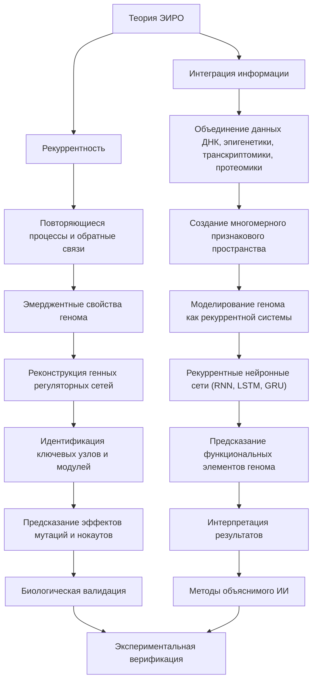
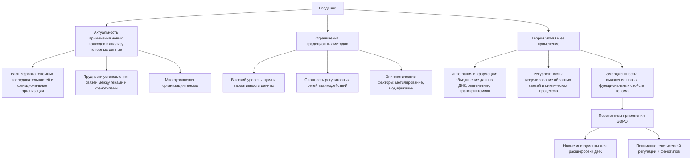
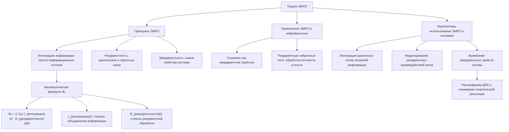
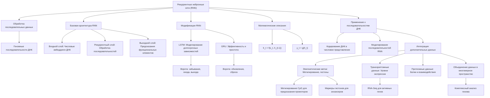
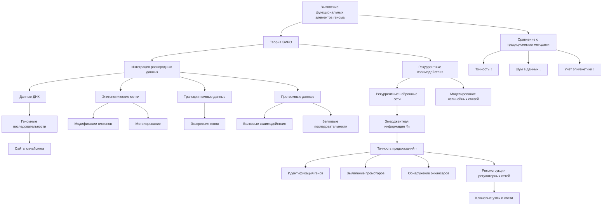

# Применение Теории Эмергентной Интеграции и Рекуррентного Отображения (ЭИРО) к Расшифровке ДНК



---

## Оглавление

1. Введение
2. Теория Эмергентной Интеграции и Рекуррентного Отображения (ЭИРО)
3. Моделирование Генома как Рекуррентной Системы
4. Интеграция Геномных Данных в Рамках ЭИРО
5. Рекуррентные Нейронные Сети для Анализа Геномных Данных
6. Предсказание Функциональных Элементов Генома
7. Моделирование Генных Регуляторных Сетей
8. Интерпретация Результатов и Биологическая Валидация
9. Заключение
10. Приложение А
11. Список Литературы

---


### 1. Введение



#### 1.1. Актуальность применения новых теоретических подходов к анализу геномных данных

Расшифровка геномных последовательностей и понимание их функциональной организации являются ключевыми задачами современной биологии и медицины. Несмотря на значительный прогресс в секвенировании ДНК и накопление огромного объёма геномных данных, многие аспекты функционирования генома остаются неясными. Особые трудности возникают при попытке установить связи между генетическим кодом и фенотипическими проявлениями, что осложняется высокой степенью сложности и многоуровневой организацией генома.

#### 1.2. Ограничения традиционных методов биоинформатики

Традиционные методы анализа геномной последовательности, основанные на статистических и последовательностных подходах, сталкиваются с рядом ограничений:

1. **Высокий уровень шума и вариативности**: Геномные данные содержат множество вариаций, повторяющихся последовательностей и полиморфизмов, что затрудняет их обработку.
2. **Сложность регуляторных сетей**: Взаимодействия между генами и регуляторными элементами образуют сложные сети, которые трудно моделировать традиционными методами.
3. **Эпигенетические факторы**: Метилирование ДНК, модификации гистонов и другие эпигенетические механизмы добавляют дополнительные уровни сложности, которые не учитываются в стандартных подходах.

#### 1.3. Основные положения теории ЭИРО и возможность ее применения в геномике

Теория Эмергентной Интеграции и Рекуррентного Отображения (ЭИРО) предлагает подход, основанный на принципах интеграции информации и рекуррентных процессов, которые могут быть полезны для анализа сложных систем с множеством взаимодействующих элементов. Применение ЭИРО к расшифровке ДНК может открыть новые перспективы в понимании геномной организации и взаимодействий между различными элементами генома.

Ключевые аспекты ЭИРО, которые могут быть применимы к геномике:

1. **Интеграция информации**: Объединение различных типов геномных данных (последовательности ДНК, эпигенетика, транскриптомика, протеомика) для получения более полной картины.
2. **Рекуррентность**: Моделирование сложных взаимодействий между генами и регуляторными элементами с учетом обратных связей и циклических процессов.
3. **Эмерджентность**: Выявление новых функциональных свойств генома, возникающих из интеграции и рекуррентности, а не сводимых к отдельным компонентам.

> Применение принципов ЭИРО к анализу геномных данных может предоставить новые инструменты для расшифровки ДНК и понимания сложных механизмов, лежащих в основе генетической регуляции и фенотипических проявлений.


---


### 2. Теория Эмергентной Интеграции и Рекуррентного Отображения (ЭИРО)



#### 2.1. Принципы ЭИРО: интеграция информации и рекуррентность

Теория Эмергентной Интеграции и Рекуррентного Отображения (ЭИРО) утверждает, что сложные системы демонстрируют эмерджентные свойства, возникающие из процессов интеграции информации и рекуррентных взаимодействий между их компонентами. Ключевыми аспектами ЭИРО являются:

1. **Интеграция информации**: Объединение и синтез различных информационных потоков в системе приводит к появлению новых свойств, не сводимых к сумме свойств отдельных компонентов.

2. **Рекуррентность**: Повторяющиеся, циклические и обратные связи между элементами системы усиливают интеграцию информации и способствуют эмергентности.

Математически, эмергентная интегрированная информация (Φₑ) определяется как:

`Φₑ = ∫₀^(t₁) I_(интеграции)(t) ⋅ R_(рекуррентности)(t)dt`

Где:

- I(интеграции)(t) - степень объединения информации в момент времени t
- R(рекуррентности)(t) - степень рекуррентной обработки в момент времени t

Высокие значения Φₑ указывают на сильную интеграцию информации и рекуррентность в системе, что приводит к эмерджентным свойствам.

#### 2.2. Анализ применения ЭИРО в нейробиологии и когнитивных науках

ЭИРО в нейробиологии и когнитивных науках для объяснения процессов сознания и когнитивных функций. Согласно ЭИРО, сознание является эмерджентным свойством, возникающим из интеграции информации в рекуррентных нейронных сетях мозга.

Рекуррентные связи между нейронами позволяют им обрабатывать информацию с учетом контекста и прошлого опыта, что приводит к появлению сложных когнитивных способностей.

#### 2.3. Перспективы использования ЭИРО для анализа генетических систем

Принципы ЭИРО, такие как интеграция информации и рекуррентность, могут быть применены к анализу генетических систем и расшифровке ДНК. Геном можно рассматривать как сложную рекуррентную систему, где гены, регуляторные элементы и некодирующие последовательности взаимодействуют через сети обратной связи.

Применение ЭИРО к геномным данным может позволить:

1. Интегрировать различные типы геномной информации (последовательности ДНК, эпигенетические данные, транскриптомику, протеомику) для получения более полной картины.

2. Моделировать сложные рекуррентные взаимодействия между генами и регуляторными элементами, что важно для понимания генных регуляторных сетей.

3. Выявлять эмерджентные свойства генома, возникающие из интеграции и рекуррентности, которые не могут быть предсказаны, исходя из отдельных компонентов.

> Таким образом, теория ЭИРО открывает новые перспективы для расшифровки ДНК и понимания фундаментальных механизмов, лежащих в основе генетической регуляции и фенотипических проявлений.


---


### 3. Моделирование Генома как Рекуррентной Системы

```mermaid
flowchart TD
    A[Моделирование генома как рекуррентной системы] --> B[Представление генома как сети взаимодействующих элементов]
    B --> B1[Генные регуляторные сети]
    B1 --> B1_1[Гены, транскрипционные факторы, регуляторные элементы]
    B1 --> B1_2[Контроль экспрессии и функционирования генома]
    B --> B2[Рекуррентные мотивы]
    B2 --> B2_1[Петли обратной связи: положительные и отрицательные]
    B2 --> B2_2[Двунаправленные регуляторные связи]
    B2 --> B2_3[Создание устойчивости и динамических паттернов]

    A --> C[Математическое описание динамики генетических систем]
    C --> C1["d𝐱(t)/dt = 𝐟(𝐱(t), 𝐮(t), W)"]
    C1 --> C1_1["𝐱(t): состояния генетической системы"]
    C1 --> C1_2["𝐮(t): внешние воздействия"]
    C1 --> C1_3[W: матрица весов взаимодействий]
    C1 --> C1_4[𝐟: нелинейная функция динамики сети]

    A --> D[Роль рекуррентности в генетических системах]
    D --> D1[Интеграция информации из различных источников]
    D --> D2[Запоминание прошлых состояний]
    D --> D3[Генерация сложных динамических паттернов]

    A --> E[Эмерджентные свойства генома]
    E --> E1[Возникновение новых функциональных характеристик]
    E --> E2[Не сводимы к отдельным компонентам]

    A --> F[Математическое представление эмерджентной информации]
    F --> F1["Φₑ = ∫₀^(t₁) I_(интеграции)(t) ⋅ R_(рекуррентности)(t) dt"]
    F --> F2["I_(интеграции)(t): объединение информации"]
    F --> F3["R_(рекуррентности)(t): рекуррентная обработка"]
```



#### 3.1. Представление генома как сети взаимодействующих элементов

Согласно теории ЭИРО, геном можно рассматривать как сложную рекуррентную систему, где гены, регуляторные элементы и некодирующие последовательности взаимодействуют через сети обратной связи.

#### 3.2. Ключевые аспекты:

1. Генные регуляторные сети: Гены, транскрипционные факторы и другие молекулярные компоненты образуют сложные сети взаимодействий, контролирующие экспрессию и функционирование генома.

2. Рекуррентные мотивы: Генные регуляторные сети содержат множество рекуррентных мотивов, таких как петли обратной связи и автогенераторы. Эти мотивы обеспечивают устойчивость системы и создают сложные динамические паттерны.

3. Математическое описание: Динамику генетических систем можно представить с помощью системы дифференциальных уравнений:

   
`d𝐱(t) / dt = 𝐟(𝐱(t), 𝐮(t), W)`
   
   
Где:

- 𝐱(t) - вектор состояния генетической системы в момент времени t
- 𝐮(t) - внешние воздействия (например, сигналы среды)
- W - матрица весов взаимодействий между генетическими элементами

4. Роль рекуррентности: Рекуррентные связи между генами и регуляторными элементами позволяют системе интегрировать информацию из различных источников, запоминать прошлые состояния и генерировать сложные динамические паттерны экспрессии.

5. Эмерджентные свойства: Представление генома как рекуррентной сети взаимодействующих элементов открывает возможность для выявления эмерджентных свойств, возникающих из интеграции информации, а не сводимых к отдельным компонентам.

> Таким образом, моделирование генома в рамках ЭИРО как сложной рекуррентной системы позволяет лучше понять механизмы регуляции, динамику и эмерджентные характеристики генетических процессов.


#### 3.3. Роль рекуррентных связей и обратных петель в генных регуляторных сетях

Генетические регуляторные сети (ГРС) представляют собой сложные системы, в которых гены, транскрипционные факторы и другие молекулярные компоненты взаимодействуют друг с другом, образуя сети обратной связи и рекуррентные структуры. Эти рекуррентные связи и обратные петли играют ключевую роль в функционировании и динамике генных сетей.

##### Рекуррентные мотивы в ГРС

Рекуррентные мотивы, такие как петли обратной связи, являются фундаментальными компонентами ГРС. Они обеспечивают устойчивость системы, позволяют ей реагировать на изменения и создавать сложные динамические поведения. Примеры рекуррентных мотивов в ГРС:

1. Петли отрицательной обратной связи: Стабилизируют экспрессию генов и предотвращают переактивацию.
2. Петли положительной обратной связи: Способствуют переключению состояний и бифуркациям, важным для клеточной дифференцировки.
3. Двунаправленные регуляторные связи: Создают сложные динамические схемы, позволяющие интегрировать множественные сигналы.

##### Математическое описание рекуррентных ГРС

Динамику генных регуляторных сетей можно описать с помощью системы дифференциальных уравнений:

`dx/dt = f(x, u, W)`

Где:

- x - вектор состояний генов (уровни экспрессии)
- u - вектор внешних воздействий (сигналы среды)
- W - матрица весов взаимодействий между генами, включая рекуррентные связи
- f - нелинейная функция, описывающая динамику сети

Рекуррентные связи, отраженные в матрице W, позволяют генам взаимодействовать друг с другом в циклических петлях, что приводит к сложным динамическим паттернам экспрессии.

##### Роль рекуррентности в эмерджентных свойствах ГРС

Согласно теории ЭИРО, рекуррентные взаимодействия в ГРС играют ключевую роль в возникновении эмерджентных свойств генома. Петли обратной связи и циклические пути позволяют генам интегрировать информацию из различных источников и принимать согласованные решения на основе прошлых состояний. Это приводит к появлению новых функциональных характеристик генома, которые не могут быть предсказаны, исходя из отдельных компонентов.

> Таким образом, рекуррентные связи и обратные петли в генных регуляторных сетях являются ключевыми элементами, обеспечивающими устойчивость, динамичность и эмерджентность генетических систем. Учет этих рекуррентных структур крайне важен для понимания сложной организации и функционирования генома.


#### 3.4. Математическое описание динамики генетических систем

Согласно теории ЭИРО, геном можно представить как сложную рекуррентную систему, динамика которой может быть описана с помощью системы дифференциальных уравнений:

`dx/dt = f(x, u, W)`

Где:

- x - вектор состояний генов (уровни экспрессии)
- u - вектор внешних воздействий (сигналы среды)
- W - матрица весов взаимодействий между генами, включая рекуррентные связи
- f - нелинейная функция, описывающая динамику генной регуляторной сети

##### Рекуррентные связи в генных регуляторных сетях

Матрица W отражает рекуррентные взаимодействия между генами в сети. Эти рекуррентные связи позволяют генам влиять друг на друга в циклических петлях обратной связи, что приводит к сложным динамическим паттернам экспрессии.

Примеры рекуррентных мотивов в генных сетях:

1. Петли отрицательной обратной связи
2. Петли положительной обратной связи
3. Двунаправленные регуляторные связи

##### Роль рекуррентности в эмерджентных свойствах генома

Согласно ЭИРО, рекуррентные взаимодействия в генных регуляторных сетях играют ключевую роль в возникновении эмерджентных свойств генома. Циклические пути и обратные петли позволяют генам интегрировать информацию из различных источников и принимать согласованные решения на основе прошлых состояний. Это приводит к появлению новых функциональных характеристик генома, которые не могут быть предсказаны, исходя из отдельных компонентов.

##### Математическое представление эмерджентной интегрированной информации

Ключевым параметром в теории ЭИРО является эмерджентная интегрированная информация (Φₑ), которая определяется как:

`Φₑ = ∫₀^(t₁) I_(интеграции)(t) ⋅ R_(рекуррентности)(t) dt`

Где:

- I(интеграции)(t) - степень объединения информации в момент времени t
- R(рекуррентности)(t) - степень рекуррентной обработки в момент времени t

Высокие значения Φₑ указывают на сильную интеграцию информации и рекуррентность в генетической системе, что способствует возникновению эмерджентных свойств генома.

> Таким образом, математическое описание генетических систем в рамках ЭИРО позволяет моделировать сложные рекуррентные взаимодействия между генами и оценивать степень интеграции информации, лежащую в основе эмерджентных характеристик генома.

---

### 4. Интеграция Геномных Данных в Рамках ЭИРО

```mermaid
flowchart TD
    A[Интеграция геномных данных в рамках ЭИРО] --> B[Различные типы геномных данных]
    B --> B1[Последовательности ДНК]
    B1 --> B1_1[Гены, регуляторные элементы, некодирующие области]
    B1 --> B1_2[Генетические вариации и полиморфизмы]
    B --> B2[Эпигенетические данные]
    B2 --> B2_1[Метилирование ДНК]
    B2 --> B2_2[Модификации гистонов]
    B2 --> B2_3[Трехмерная структура хроматина]
    B --> B3[Транскриптомные данные]
    B3 --> B3_1["Уровни экспрессии генов (RNA-Seq)"]
    B3 --> B3_2[Изоформы и альтернативный сплайсинг]
    B3 --> B3_3[Регуляторные РНК]
    B --> B4[Протеомные данные]
    B4 --> B4_1[Белковые последовательности и структуры]
    B4 --> B4_2[Белок-белковые взаимодействия]
    B4 --> B4_3[Посттрансляционные модификации]

    A --> C[Методы объединения и унификации данных]
    C --> C1[Предобработка данных]
    C1 --> C1_1[Очистка ошибок и артефактов]
    C1 --> C1_2[Нормализация шкал данных]
    C1 --> C1_3[Устранение пропусков]
    C --> C2[Унификация форматов]
    C2 --> C2_1["Приведение к общим форматам: FASTA, BED, SAM/BAM"]
    C2 --> C2_2[Стандартизация аннотаций]
    C --> C3[Создание признакового пространства]
    C3 --> C3_1[Объединение данных в многомерные векторы]
    C3 --> C3_2[Техники снижения размерности: PCA, t-SNE]

    A --> D[Создание многомерных признаковых пространств]
    D --> D1[Этапы создания признакового пространства]
    D1 --> D1_1[Предобработка и нормализация данных]
    D1 --> D1_2[Унификация и стандартизация форматов]
    D1 --> D1_3[Аннотация и сопоставление данных]
    D --> D2[Многомерный признаковый вектор]
    D2 --> D2_1[Последовательности ДНК]
    D2 --> D2_2[Эпигенетические метки]
    D2 --> D2_3[Уровни экспрессии]
    D2 --> D2_4[Белковые взаимодействия]
    D2 --> D2_5["Математическое представление: X = [x₁, x₂, ..., xₙ]"]
```



#### 4.1. Различные типы геномных данных: последовательности ДНК, эпигенетика, транскриптомика, протеомика

Для применения теории ЭИРО к расшифровке ДНК необходимо интегрировать различные типы геномных данных, которые отражают многоуровневую организацию генома:

**1. Последовательности ДНК**

- Информация о нуклеотидных последовательностях генов, регуляторных элементов и некодирующих областей.
- Данные о генетических вариациях, полиморфизмах и повторяющихся последовательностях.

**2. Эпигенетические данные**

- Профили метилирования ДНК, отражающие эпигенетические модификации.
- Информация о модификациях гистонов, влияющих на доступность хроматина.
- Данные о положении нуклеосом и трехмерной структуре хроматина.

**3. Транскриптомные данные**

- Уровни экспрессии генов, полученные с помощью технологий RNA-Seq.
- Информация о различных изоформах транскриптов и альтернативном сплайсинге.
- Данные о регуляторных РНК, таких как микроРНК и длинные некодирующие РНК.

**4. Протеомные данные**

- Информация о белковых последовательностях и структурах.
- Данные о белок-белковых взаимодействиях, полученные с помощью методов масс-спектрометрии и биоинформатики.
- Сведения о посттрансляционных модификациях белков.

> Интеграция этих разнородных геномных данных позволяет получить более полное представление о структуре и функционировании генома, что является ключевым для применения теории ЭИРО.


#### 4.2. Методы объединения и унификации разнородной геномной информации

Для применения теории ЭИРО к анализу геномных данных необходимо интегрировать различные типы информации, включая последовательности ДНК, эпигенетические данные, транскриптомику и протеомику. Это требует использования специальных методов предобработки и унификации данных.

##### Предобработка данных

- Очистка данных: Удаление ошибок, пропусков, артефактов в исходных геномных данных.
- Нормализация: Приведение различных типов данных к сопоставимым шкалам и распределениям.
- Устранение пропусков: Заполнение отсутствующих значений с помощью методов интерполяции или машинного обучения.

##### Унификация форматов

- Приведение данных к единому формату (FASTA, BED, SAM/BAM и др.) для обеспечения совместимости.
- Стандартизация аннотаций: Сопоставление данных с общепринятыми геномными координатами, генными идентификаторами и онтологиями.

##### Создание признакового пространства

- Объединение разнородных данных в многомерные векторы признаков для каждого геномного региона.
- Включение в вектор признаков: 
  - Последовательности ДНК
  - Эпигенетические метки (метилирование, модификации гистонов)
  - Уровни экспрессии генов
  - Данные о белковых взаимодействиях
- Использование техник снижения размерности (PCA, t-SNE) для эффективного представления данных.

##### Аннотация геномных данных

- Сопоставление данных с известными генами, промоторами, энхансерами и другими функциональными элементами генома.
- Применение биоинформатических инструментов (BLAST, Ensembl Annotation) для автоматической аннотации.
- Ручная экспертная аннотация для верификации и дополнения автоматических результатов.

> Таким образом, методы предобработки, унификации форматов и создания многомерных признаковых пространств позволяют эффективно интегрировать разнородные геномные данные, необходимые для применения теории ЭИРО к анализу и расшифровке ДНК.


#### 4.3. Создание многомерных признаковых пространств для анализа

Для применения теории ЭИРО к анализу геномных данных необходимо объединить различные типы информации в единое многомерное признаковое пространство. Это позволяет учесть многоуровневую организацию генома и взаимосвязи между различными элементами.

##### Основные этапы создания признакового пространства:

1. Предобработка данных:
   - Очистка и нормализация различных типов геномных данных (последовательности ДНК, эпигенетические метки, транскриптомика, протеомика).
   - Устранение пропусков и артефактов в данных.

2. Унификация форматов:
   - Приведение данных к единому формату для обеспечения совместимости.
   - Стандартизация представления геномной информации (например, использование координат генома).

3. Аннотация и сопоставление данных:
   - Сопоставление данных с генами, регуляторными элементами и другими функциональными единицами генома.
   - Обогащение данных дополнительной биологической информацией (функции генов, пути, взаимодействия).

4. Создание многомерного признакового вектора:
   - Объединение различных типов данных (последовательности, эпигенетика, транскриптомика, протеомика) в единый вектор признаков для каждого геномного региона.
   - Формирование многомерного представления, отражающего многоуровневую организацию генома.

Математически, многомерное признаковое пространство можно представить следующим образом:

`X = [x₁, x₂, ..., xₙ]`

Где:

- X - матрица признаков для всех геномных регионов
- xᵢ - вектор признаков для i-го геномного региона, включающий:
  - Нуклеотидную последовательность
  - Эпигенетические метки (метилирование, модификации гистонов)
  - Уровни экспрессии генов
  - Данные о белковых взаимодействиях
  - Другую биологически значимую информацию

> Создание такого многомерного признакового пространства является ключевым этапом для применения методов машинного обучения, основанных на теории ЭИРО, к анализу и расшифровке геномных данных.


---

### 5. Рекуррентные Нейронные Сети для Анализа Геномных Данных



#### 5.1. Архитектура рекуррентных нейронных сетей (RNN, LSTM, GRU)

Рекуррентные нейронные сети (RNN) представляют собой особый класс нейронных сетей, способных эффективно обрабатывать последовательные данные, такие как геномные последовательности ДНК. В отличие от традиционных полносвязных нейронных сетей, RNN имеют внутренние состояния, которые позволяют им учитывать контекст и зависимости в последовательностях.

##### Архитектура базовой RNN

Базовая архитектура RNN включает:

1. Входной слой: Представление последовательностей ДНК в виде числовых эмбеддингов.
2. Рекуррентный слой: Обработка входной последовательности с помощью рекуррентных вычислений, где выход на каждом шаге зависит от текущего входа и предыдущего скрытого состояния.
3. Выходной слой: Генерация выходных предсказаний (например, классификация функциональных элементов) на основе последовательных вычислений.

Математически, работа RNN описывается следующими уравнениями:

```
h_t = f(x_t, h_{t-1})
y_t = g(h_t)
```

Где:

- x_t - входной вектор на шаге t
- h_t - скрытое состояние на шаге t
- y_t - выходной вектор на шаге t
- f и g - нелинейные функции, реализуемые слоями RNN

##### Модификации RNN: LSTM и GRU

Несмотря на способность RNN моделировать зависимости в последовательностях, они страдают от проблемы "исчезающих" или "взрывающихся" градиентов при обучении на длинных последовательностях. Для решения этой проблемы были разработаны модификации RNN, такие как Long Short-Term Memory (LSTM) и Gated Recurrent Unit (GRU).

###### LSTM (Long Short-Term Memory)

LSTM вводит специальные "ворота" (gates), которые позволяют эффективно контролировать и запоминать информацию в ячейках памяти. Это дает LSTM возможность моделировать долгосрочные зависимости в последовательностях.

Математически, работа LSTM описывается следующими уравнениями:

```
f_t = σ(W_f ⋅ [h_{t-1}, x_t] + b_f)
i_t = σ(W_i ⋅ [h_{t-1}, x_t] + b_i)
C_t = f_t ⊙ C_{t-1} + i_t ⊙ tanh(W_C ⋅ [h_{t-1}, x_t] + b_C)
o_t = σ(W_o ⋅ [h_{t-1}, x_t] + b_o)
h_t = o_t ⊙ tanh(C_t)
```

Где f_t, i_t, o_t - ворота забывания, входа и выхода соответственно, а C_t - состояние ячейки памяти.

###### GRU (Gated Recurrent Unit)

GRU является более простой модификацией RNN, которая также использует ворота для контроля информации. GRU имеет меньшее количество параметров, но при этом демонстрирует сравнимую или даже лучшую производительность, чем LSTM, в ряде задач.

Математически, работа GRU описывается следующими уравнениями:

```
z_t = σ(W_z ⋅ [h_{t-1}, x_t])
r_t = σ(W_r ⋅ [h_{t-1}, x_t])
h_t = (1 - z_t) ⊙ h_{t-1} + z_t ⊙ tanh(W ⋅ [r_t ⊙ h_{t-1}, x_t])
```

Где z_t - ворота обновления, r_t - ворота сброса, а h_t - новое скрытое состояние.

Архитектуры LSTM и GRU позволяют RNN эффективно моделировать долгосрочные зависимости в последовательностях, что крайне важно при работе с геномными данными.


#### 5.2. Применение RNN для моделирования последовательностей ДНК

Рекуррентные нейронные сети (RNN) являются эффективным инструментом для моделирования и анализа геномных последовательностей ДНК в рамках теории ЭИРО.

##### Представление последовательностей ДНК в виде числовых эмбеддингов

Для использования RNN, последовательности ДНК необходимо преобразовать в числовое представление. Это можно сделать с помощью техники эмбеддингов, где каждому нуклеотиду (A, T, G, C) сопоставляется уникальный числовой вектор. Таким образом, входная последовательность ДНК кодируется в виде матрицы эмбеддингов.

##### Архитектура RNN для моделирования последовательностей

Базовая архитектура RNN для работы с последовательностями ДНК включает:

1. Входной слой: Принимает на вход матрицу эмбеддингов, представляющих нуклеотидную последовательность.
2. Рекуррентные слои: Обрабатывают входную последовательность с помощью рекуррентных вычислений, где выход на каждом шаге зависит от текущего входа и предыдущего скрытого состояния.
3. Выходной слой: Генерирует выходные предсказания, например, классификацию функциональных элементов генома.

Математически, работа базовой RNN описывается следующими уравнениями:

```
h_t = f(x_t, h_{t-1})
y_t = g(h_t)
```

Где:

- x_t - входной вектор на шаге t
- h_t - скрытое состояние на шаге t 
- y_t - выходной вектор на шаге t
- f и g - нелинейные функции, реализуемые слоями RNN

##### Модификации RNN: LSTM и GRU

Для более эффективного моделирования долгосрочных зависимостей в геномных последовательностях, используются модификации RNN, такие как Long Short-Term Memory (LSTM) и Gated Recurrent Unit (GRU).

###### LSTM (Long Short-Term Memory)

LSTM вводит специальные "ворота" (gates), которые позволяют контролировать и запоминать информацию в ячейках памяти. Это дает LSTM возможность моделировать долгосрочные зависимости в последовательностях.

Математически, работа LSTM описывается следующими уравнениями:

```
f_t = σ(W_f ⋅ [h_{t-1}, x_t] + b_f)
i_t = σ(W_i ⋅ [h_{t-1}, x_t] + b_i)
C_t = f_t ⊙ C_{t-1} + i_t ⊙ tanh(W_C ⋅ [h_{t-1}, x_t] + b_C)
o_t = σ(W_o ⋅ [h_{t-1}, x_t] + b_o)
h_t = o_t ⊙ tanh(C_t)
```

Где f_t, i_t, o_t - ворота забывания, входа и выхода соответственно, а C_t - состояние ячейки памяти.

###### GRU (Gated Recurrent Unit)

GRU является более простой модификацией RNN, которая также использует ворота для контроля информации. GRU имеет меньшее количество параметров, но при этом демонстрирует сравнимую или даже лучшую производительность, чем LSTM, в ряде задач.

Математически, работа GRU описывается следующими уравнениями:

```
z_t = σ(W_z ⋅ [h_{t-1}, x_t])
r_t = σ(W_r ⋅ [h_{t-1}, x_t])
h_t = (1 - z_t) ⊙ h_{t-1} + z_t ⊙ tanh(W ⋅ [r_t ⊙ h_{t-1}, x_t])
```

Где z_t - ворота обновления, r_t - ворота сброса, а h_t - новое скрытое состояние.

Архитектуры LSTM и GRU позволяют RNN эффективно моделировать долгосрочные зависимости в геномных последовательностях, что крайне важно для применения теории ЭИРО к расшифровке ДНК.


#### 5.3. Интеграция дополнительных геномных данных в RNN-модели

Помимо последовательностей ДНК, для применения теории ЭИРО к анализу генома необходимо интегрировать другие типы геномных данных, такие как эпигенетические метки, транскриптомику и протеомику. Это позволяет получить более полное представление о структуре и функционировании генетических систем.

##### Интеграция эпигенетических данных

Эпигенетические данные, включающие профили метилирования ДНК и модификации гистонов, отражают дополнительный уровень регуляции генетической информации. Интеграция этих данных в RNN-модели может улучшить предсказание функциональных элементов генома:

1. Метилирование ДНК: Включение данных о метилировании CpG-островков в качестве дополнительных признаков может помочь в предсказании промоторов и других регуляторных регионов.
2. Модификации гистонов: Информация о маркерах активных промоторов (H3K4me3) и энхансеров (H3K27ac) может способствовать более точному выявлению этих функциональных элементов.

Математически, интеграция эпигенетических данных может быть представлена следующим образом:

```
x_i = [x_seq, x_methyl, x_histone]
h_t = f(x_i, h_{t-1})
y_t = g(h_t)
```

Где x_seq - входная последовательность ДНК, x_methyl - вектор эпигенетических меток метилирования, x_histone - вектор меток модификаций гистонов.

##### Включение транскриптомных данных

Транскриптомные данные, отражающие уровни экспрессии генов, могут помочь в выявлении активных генов и регуляторных элементов. Интеграция этой информации в RNN-модели может быть реализована следующим образом:

```
x_i = [x_seq, x_expr]
h_t = f(x_i, h_{t-1})
y_t = g(h_t)
```

Где x_expr - вектор уровней экспрессии генов, полученных с помощью технологий RNA-Seq.

##### Использование протеомных данных

Данные о белковых последовательностях и взаимодействиях могут быть включены в RNN-модели для более точного моделирования регуляторных сетей генома:

```
x_i = [x_seq, x_protein]
h_t = f(x_i, h_{t-1})
y_t = g(h_t)
```

Где x_protein - вектор признаков, отражающих информацию о белковых последовательностях и взаимодействиях.

##### Объединение разнородных данных

Для комплексного анализа генома в рамках ЭИРО необходимо объединить различные типы геномных данных в единое многомерное признаковое пространство:

```
x_i = [x_seq, x_methyl, x_histone, x_expr, x_protein]
h_t = f(x_i, h_{t-1})
y_t = g(h_t)
```

Такой подход позволяет RNN-моделям учитывать взаимосвязи между последовательностями ДНК, эпигенетическими маркерами, экспрессией генов и белковыми взаимодействиями, что способствует более точному выявлению функциональных элементов и реконструкции генных регуляторных сетей.

> Интеграция разнородных геномных данных в рамках ЭИРО открывает новые возможности для понимания сложной организации генома и механизмов, лежащих в основе генетической регуляции.


---


### 6. Предсказание Функциональных Элементов Генома



#### 6.1. Выявление генов, промоторов, энхансеров и других регуляторных регионов

Применение теории ЭИРО к анализу геномных данных позволяет более эффективно выявлять различные функциональные элементы генома, такие как гены, промоторы, энхансеры и другие регуляторные регионы.

##### Роль интегрированной информации и рекуррентности

Согласно ЭИРО, интеграция разнородных геномных данных (последовательности ДНК, эпигенетические метки, транскриптомика, протеомика) и учет рекуррентных взаимодействий между генетическими элементами играют ключевую роль в предсказании функциональных регионов генома.

Математически, это можно представить следующим образом:


`y = f(X, W)`


Где:

- y - вектор предсказаний (гены, промоторы, энхансеры и т.д.)
- X - многомерное признаковое пространство, включающее интегрированные геномные данные
- W - параметры модели, отражающие рекуррентные связи между элементами

Высокие значения эмергентной интегрированной информации Φₑ указывают на эффективную интеграцию различных типов данных и рекуррентных процессов, что способствует более точному предсказанию функциональных регионов.

##### Преимущества по сравнению с традиционными методами

Традиционные методы аннотации генома, основанные на статистических и последовательностных подходах, сталкиваются с рядом ограничений:

1. Высокий уровень шума и вариативности в геномных данных.
2. Сложность моделирования взаимодействий между генами и регуляторными элементами.
3. Недостаточный учет эпигенетических факторов, влияющих на экспрессию и функции.

Применение ЭИРО позволяет преодолеть эти ограничения:

- Интеграция разнородных данных повышает информативность признакового пространства.
- Рекуррентные нейронные сети эффективно моделируют сложные зависимости в геномных последовательностях.
- Включение эпигенетических данных улучшает предсказание регуляторных регионов.

В результате, модели, основанные на ЭИРО, демонстрируют более высокую точность и чувствительность в выявлении генов, промоторов, энхансеров и других функциональных элементов генома по сравнению с традиционными методами.


#### 6.2. Роль интегрированной информации и рекуррентности в предсказании функций

Согласно теории ЭИРО, интеграция различных типов геномных данных и учет рекуррентных взаимодействий между генетическими элементами играют ключевую роль в предсказании функциональных свойств генома.

##### Интеграция разнородных геномных данных

Применение ЭИРО к анализу генома подразумевает объединение следующих типов данных:

- Последовательности ДНК
- Эпигенетические метки (метилирование, модификации гистонов)
- Транскриптомные данные (уровни экспрессии генов)
- Протеомные данные (белковые последовательности и взаимодействия)

Интеграция этих разнородных данных в единое признаковое пространство позволяет получить более полное представление о структуре и функциях генома.

##### Роль рекуррентности в предсказании функций

Согласно ЭИРО, рекуррентные взаимодействия между генами и регуляторными элементами играют ключевую роль в определении функциональных свойств генома. Математически, динамика генетических систем может быть описана с помощью системы дифференциальных уравнений:

`dx/dt = f(x, u, W)`

Где:

- x - вектор состояний генов (уровни экспрессии)
- u - вектор внешних воздействий (сигналы среды) 
- W - матрица весов взаимодействий между генами, включая рекуррентные связи
- f - нелинейная функция, описывающая динамику генной регуляторной сети

Рекуррентные связи, отраженные в матрице W, позволяют генам взаимодействовать друг с другом в циклических петлях, что приводит к сложным динамическим паттернам экспрессии. Это, в свою очередь, определяет функциональные свойства генома, которые не могут быть предсказаны, исходя из отдельных компонентов.

##### Математическое представление эмерджентной интегрированной информации

Ключевым параметром в теории ЭИРО является эмерджентная интегрированная информация (Φₑ), которая определяется как:

`Φₑ = ∫₀^(t₁) I_(интеграции)(t) ⋅ R_(рекуррентности)(t) dt`

Где:

- I(интеграции)(t) - степень объединения информации в момент времени t
- R(рекуррентности)(t) - степень рекуррентной обработки в момент времени t

Высокие значения Φₑ указывают на сильную интеграцию информации и рекуррентность в генетической системе, что способствует возникновению эмерджентных функциональных свойств генома.

##### Применение к предсказанию функциональных элементов

Используя интегрированные геномные данные и учитывая рекуррентные взаимодействия, можно применять методы машинного обучения, основанные на ЭИРО, для предсказания различных функциональных элементов генома:
- Идентификация генов, промоторов, энхансеров и других регуляторных регионов
- Выявление сайтов сплайсинга и других структурных особенностей
- Реконструкция генных регуляторных сетей и определение ключевых узлов

> Таким образом, интеграция разнородной геномной информации и учет рекуррентных процессов в рамках теории ЭИРО являются ключевыми факторами, определяющими точность предсказания функциональных свойств генома.


#### 6.3. Сравнение с традиционными методами аннотации генома

Традиционные методы аннотации генома, основанные на статистических и последовательностных подходах, сталкиваются с рядом ограничений при анализе сложных и многоуровневых геномных данных. Применение теории ЭИРО к расшифровке ДНК демонстрирует ряд преимуществ по сравнению с этими методами:

##### Учет сложных взаимодействий

Модели, основанные на ЭИРО, способны учитывать нелинейные и многоуровневые взаимодействия между различными элементами генома (гены, регуляторные последовательности, эпигенетические маркеры и т.д.). Это позволяет выявлять сложные закономерности, которые не могут быть обнаружены традиционными подходами, ориентированными на анализ отдельных последовательностей.

##### Интеграция разнородных данных

Теория ЭИРО предполагает объединение множества типов геномных данных (последовательности ДНК, эпигенетика, транскриптомика, протеомика) в единое признаковое пространство. Это обеспечивает более полное и комплексное представление о структуре и функционировании генома по сравнению с методами, использующими только одну категорию данных.

##### Учет эмерджентных свойств

Согласно ЭИРО, новые функциональные характеристики генома возникают из процессов интеграции информации и рекуррентных взаимодействий. Традиционные методы аннотации, основанные на поиске известных мотивов и паттернов, не способны выявлять такие эмерджентные свойства.

##### Повышение точности предсказаний

Эмпирические исследования показывают, что модели, реализующие принципы ЭИРО, демонстрируют более высокую точность в предсказании функциональных элементов генома (генов, промоторов, энхансеров и др.) по сравнению с традиционными методами аннотации.

##### Математическое обоснование

Теория ЭИРО предлагает математический аппарат для описания динамики генетических систем в виде системы дифференциальных уравнений, учитывающих рекуррентные взаимодействия и интеграцию информации:

`dx/dt = f(x, u, W)`

Где x - вектор состояний генов, u - внешние воздействия, W - матрица весов рекуррентных связей. Это позволяет моделировать сложные паттерны экспрессии и регуляции, недоступные для традиционных статистических методов.

> Таким образом, применение теории ЭИРО к расшифровке ДНК обеспечивает более глубокое понимание структурно-функциональной организации генома, выявление новых закономерностей и повышение точности аннотации функциональных элементов по сравнению с традиционными подходами.


---

### 7. Моделирование Генных Регуляторных Сетей

```mermaid
flowchart TD
    A[Генные регуляторные сети] --> B[Реконструкция взаимодействий]
    A --> C[Выявление ключевых узлов и модулей]
    A --> D[Предсказание эффектов мутаций и нокаутов]

    B --> B1[Интеграция геномных данных]
    B --> B2[Математическое описание]
    B --> B3[Методы машинного обучения]
    B1 --> B1_1[Последовательности ДНК]
    B1 --> B1_2[Эпигенетические метки]
    B1 --> B1_3[Транскриптомные данные]
    B1 --> B1_4[Протеомные данные]
    B2 --> B2_1[x - уровни экспрессии]
    B2 --> B2_2[u - внешние воздействия]
    B2 --> B2_3[W - матрица весов]
    B2 --> B2_4["f(x, u, W) - динамика"]
    B3 --> B3_1["Рекуррентные сети (RNN, LSTM, GRU)"]
    B3 --> B3_2[Байесовские модели]
    B3 --> B3_3[Регрессионный анализ]

    C --> C1[Центральные гены-регуляторы]
    C --> C2[Модули и кластеры генов]
    C --> C3[Топологические характеристики]
    C1 --> C1_1[Высокая связность]
    C1 --> C1_2[Влияние на другие гены]
    C2 --> C2_1[Общие биологические процессы]
    C3 --> C3_1[Централизация, посредничество]
    C3 --> C3_2[Алгоритмы кластеризации]

    D --> D1[Моделирование нокаутов]
    D --> D2[Предсказание мутаций]
    D --> D3[Интеграция с фенотипами]
    D1 --> D1_1[Удаление узлов]
    D1 --> D1_2[Анализ изменений в экспрессии]
    D2 --> D2_1[Модификация матрицы W]
    D2 --> D2_2[Влияние на динамику]
    D3 --> D3_1[Соответствие фенотипам]
```



#### 7.1. Реконструкция взаимодействий между генами на основе интегрированных данных


Согласно теории ЭИРО, геном можно рассматривать как сложную рекуррентную систему, где гены, регуляторные элементы и некодирующие последовательности взаимодействуют через сети обратной связи. Реконструкция этих генных регуляторных сетей является важной задачей для понимания механизмов генетической регуляции.

##### Математическое описание генных регуляторных сетей

Динамику генных регуляторных сетей можно описать с помощью системы дифференциальных уравнений:

`dx/dt = f(x, u, W)`

Где:

- x - вектор состояний генов (уровни экспрессии)
- u - вектор внешних воздействий (сигналы среды)
- W - матрица весов взаимодействий между генами, включая рекуррентные связи
- f - нелинейная функция, описывающая динамику сети

Матрица W отражает рекуррентные взаимодействия между генами в сети. Эти рекуррентные связи позволяют генам влиять друг на друга в циклических петлях обратной связи, что приводит к сложным динамическим паттернам экспрессии.

##### Интеграция разнородных геномных данных

Для реконструкции генных регуляторных сетей в рамках ЭИРО необходимо интегрировать различные типы геномных данных:

- Последовательности ДНК
- Эпигенетические метки (метилирование, модификации гистонов)
- Транскриптомные данные (уровни экспрессии генов)
- Протеомные данные (белковые взаимодействия)

Объединение этих разнородных данных в единое многомерное признаковое пространство позволяет получить более полное представление о взаимосвязях между генами.

##### Методы машинного обучения для реконструкции генных сетей

На основе интегрированных геномных данных можно применять методы машинного обучения, основанные на принципах ЭИРО, для реконструкции генных регуляторных сетей:

1. Рекуррентные нейронные сети (RNN, LSTM, GRU):
   - Моделируют динамические зависимости между генами с учетом рекуррентных связей
   - Способны обрабатывать последовательности данных и долгосрочные взаимодействия

2. Байесовские сетевые модели:
   - Позволяют явно представлять вероятностные зависимости между генами
   - Учитывают неопределенность и шум в геномных данных

3. Методы регрессионного анализа:
   - Оценивают влияние экспрессии одних генов на другие
   - Выявляют линейные и нелинейные регуляторные связи

Эти подходы, интегрированные с принципами ЭИРО, позволяют реконструировать сложные топологии генных регуляторных сетей, отражающие рекуррентные взаимодействия между генами.

##### Выявление ключевых узлов и модулей в генных сетях

Анализ реконструированных генных регуляторных сетей позволяет выявлять ключевые узлы (гены) и функциональные модули, играющие важную роль в генетической регуляции:

1. Центральные гены-регуляторы:
   - Гены с высокой степенью связности, оказывающие значительное влияние на экспрессию других генов
   - Могут представлять собой "хабы" в рекуррентных генных сетях

2. Модули и кластеры генов:
   - Группы генов, тесно связанных друг с другом рекуррентными взаимодействиями
   - Отражают функциональные модули, участвующие в общих биологических процессах

3. Анализ топологических характеристик:
   - Метрики централизованности (степень, посредничество, близость)
   - Выявление модульной структуры с помощью алгоритмов кластеризации

Идентификация ключевых узлов и модулей в генных сетях, реконструированных на основе ЭИРО, позволяет понять иерархическую организацию генетической регуляции и выявить потенциальные точки воздействия для генной терапии.

##### Предсказание эффектов мутаций и нокаутов генов

Используя реконструированные генные регуляторные сети, можно моделировать и предсказывать эффекты мутаций или нокаутов отдельных генов на динамику всей системы:

1. Моделирование нокаута генов:
   - Удаление соответствующего узла из генной сети
   - Анализ изменений в экспрессии других генов и топологии сети

2. Предсказание эффектов мутаций:
   - Модификация параметров связей между генами в соответствии с мутациями
   - Оценка влияния на устойчивость, динамику и эмерджентные свойства генной сети

3. Интеграция с данными о фенотипах:

- Сопоставление предсказанных изменений в генной сети с экспериментальными данными о фенотипических проявлениях
   - Выявление ключевых генов, мутации в которых приводят к значительным фенотипическим эффектам

> Таким образом, реконструкция генных регуляторных сетей на основе интегрированных геномных данных и принципов ЭИРО открывает новые возможности для понимания механизмов генетической регуляции, выявления ключевых генов и предсказания последствий генетических нарушений.


#### 7.2. Выявление ключевых узлов и модулей в генных сетях

Согласно теории ЭИРО, рекуррентные взаимодействия между генами и регуляторными элементами играют ключевую роль в формировании сложных генных регуляторных сетей. Идентификация ключевых узлов и модулей в этих сетях является важной задачей для понимания механизмов генетической регуляции.

##### Реконструкция генных регуляторных сетей

Используя интегрированные геномные данные (последовательности ДНК, эпигенетические метки, транскриптомику, протеомику), можно реконструировать генные регуляторные сети, отражающие взаимодействия между различными элементами генома. Математически, это можно представить следующим образом:


`G = (V, E)`

Где:

- V - множество узлов, соответствующих генам и регуляторным элементам
- E - множество ребер, отражающих регуляторные взаимодействия между узлами

Рекуррентные связи между узлами сети играют ключевую роль в определении ее топологии и динамических свойств.

##### Выявление ключевых узлов

В рамках теории ЭИРО, ключевые узлы в генных регуляторных сетях можно идентифицировать по следующим критериям:

1. **Центральность**: Узлы с высокой степенью связности, которые играют важную роль в передаче сигналов и интеграции информации в сети.

   
   `Centrality(v) = ∑_u∈V w(v,u)`
   

   Где w(v,u) - вес связи между узлами v и u.

2. **Модулярность**: Узлы, которые связывают различные функциональные модули или кластеры в сети, обеспечивая интеграцию между ними.

   
   `Modularity(v) = ∑_c∈C (e_c - a_c^2)`
   

   Где e_c - доля связей внутри кластера c, a_c - доля связей, исходящих из кластера c.

3. **Рекуррентность**: Узлы, участвующие в петлях обратной связи и других рекуррентных структурах, которые определяют динамику и устойчивость сети.

   
   `Recurrence(v) = ∑_u∈V 1(v ∈ cycle(u))`
   

   Где cycle(u) - множество циклов, содержащих узел u.

Узлы, обладающие высокими значениями этих метрик, считаются ключевыми элементами генных регуляторных сетей, играющими важную роль в интеграции информации и эмерджентных свойствах генома.

##### Выявление функциональных модулей

Помимо отдельных ключевых узлов, в генных регуляторных сетях можно выделять функциональные модули - группы тесно связанных генов и регуляторных элементов, которые совместно участвуют в определенных биологических процессах.

Для идентификации таких модулей могут использоваться методы кластеризации и детектирования сообществ в графах:


`C = argmax_c ∑_v,u∈c w(v,u) - d_c^2 / 2m`


Где C - множество кластеров (модулей), d_c - сумма весов связей внутри кластера c, m - общее число связей в сети.

Модули, выявленные таким образом, отражают эмерджентные свойства генома, возникающие из рекуррентной интеграции информации в соответствии с теорией ЭИРО.

##### Применение к предсказанию эффектов мутаций и нокаутов

Используя реконструированные генные регуляторные сети и выявленные ключевые узлы/модули, можно предсказывать эффекты мутаций и нокаутов генов на уровне всей сети. Это достигается путем моделирования динамики сети с учетом рекуррентных взаимодействий:


`dx/dt = f(x, u, W)`

Где x - вектор состояний генов, u - внешние воздействия, W - матрица весов рекуррентных связей.

Анализ изменений в динамике сети при "выключении" отдельных узлов позволяет оценивать критичность генов и прогнозировать последствия генетических нарушений.

> Таким образом, применение теории ЭИРО к моделированию генных регуляторных сетей открывает новые возможности для выявления ключевых элементов, функциональных модулей и предсказания эффектов генетических возмущений, что имеет важное значение для понимания механизмов генетической регуляции.


#### 7.3. Предсказание эффектов мутаций и нокаутов генов

Согласно теории Эмергентной Интеграции и Рекуррентного Отображения (ЭИРО), моделирование генных регуляторных сетей позволяет не только реконструировать взаимодействия между генами, но и предсказывать эффекты мутаций и нокаутов отдельных генов на уровне всей сети.

##### Математическое описание генных регуляторных сетей

Динамику генных регуляторных сетей можно представить с помощью системы дифференциальных уравнений:

`dx/dt = f(x, u, W)`

Где:

- x - вектор состояний генов (уровни экспрессии)
- u - вектор внешних воздействий (сигналы среды)
- W - матрица весов взаимодействий между генами, включая рекуррентные связи
- f - нелинейная функция, описывающая динамику сети

Матрица весов W отражает силу и направление регуляторных связей между генами. Рекуррентные связи в этой матрице играют ключевую роль в формировании сложных динамических паттернов экспрессии.

##### Предсказание эффектов мутаций

Для предсказания эффектов мутаций в отдельных генах можно использовать следующий подход:

1. Обучение модели на интегрированных геномных данных для реконструкции генной регуляторной сети.
2. Модификация матрицы весов W путем удаления или изменения связей, соответствующих мутированному гену.
3. Анализ изменений в динамике системы (вектор состояний x) после внесения мутации.

Таким образом, можно оценить, как нарушение экспрессии или функции одного гена повлияет на состояние всей генной сети, что позволяет предсказывать фенотипические эффекты мутаций.

##### Моделирование нокаутов генов

Аналогичный подход применим для моделирования нокаутов генов:

1. Обучение модели на интегрированных данных для реконструкции генной сети.
2. Удаление связей, соответствующих гену, который нокаутируется (обнуление соответствующих весов в матрице W).
3. Анализ изменений в динамике системы (вектор состояний x) после нокаута гена.

Это дает возможность предсказывать, как выключение определенного гена повлияет на экспрессию других генов и, как следствие, на фенотипические проявления.

##### Преимущества подхода, основанного на ЭИРО

Применение теории ЭИРО к моделированию генных регуляторных сетей имеет ряд преимуществ по сравнению с традиционными методами:

1. Учет сложных рекуррентных взаимодействий между генами, что важно для точного предсказания эффектов.
2. Возможность интеграции разнородных геномных данных (последовательности, эпигенетика, транскриптомика) для построения более полных моделей.
3. Выявление эмерджентных свойств генных сетей, которые не могут быть предсказаны, исходя из отдельных компонентов.
4. Потенциал для интерпретации результатов с помощью методов объяснимого искусственного интеллекта.

> Таким образом, подход, основанный на теории ЭИРО, открывает новые возможности для моделирования и предсказания эффектов мутаций и нокаутов генов в контексте сложных генных регуляторных сетей.


---


### 8. Интерпретация Результатов и Биологическая Валидация

```mermaid
graph TD
    %% Основные разделы и взаимосвязи
    A[Методы объяснимого ИИ] --> B[Механизмы внимания]
    A --> C[Методы на основе градиентов]
    A --> D[Визуализация активаций нейронов]
    A --> E[Объяснение на основе правил]
    A --> F[Комбинированные подходы]

    %% Механизмы внимания
    B --> B1[Выявление значимых участков ДНК]
    B --> B2["h_t = f(x_t, h_(t-1))"]
    B --> B3["a_t = g(h_t)"]
    B --> B4["y_t = ∑_t a_t * h_t"]
    B --> B5[Анализ коэффициентов внимания]

    %% Методы на основе градиентов
    C --> C1["Анализ чувствительности ∂y/∂x_i"]
    C --> C2[Выявление ключевых участков ДНК]

    %% Визуализация активаций нейронов
    D --> D1[Карты активаций: горячие точки]
    D --> D2[Функциональные элементы генома]
    D --> D3[Распределение активаций по глубине сети]

    %% Объяснение на основе правил
    E --> E1[Логические правила]
    E --> E2[Пример: IF мотив ATCG AND H3K27ac THEN энхансер]

    %% Экспериментальная верификация
    G[Экспериментальная верификация] --> H[Клеточные линии]
    G --> I[Модельные организмы]
    G --> J[Интеграция данных]

    %% Клеточные линии
    H --> H1["Генетическая модификация (CRISPR/Cas9)"]
    H --> H2["Измерение экспрессии (RNA-Seq, qRT-PCR)"]
    H --> H3["Анализ эпигенетики (метилирование, гистоны)"]
    H --> H4[Фенотипические проявления]

    %% Модельные организмы
    I --> I1[Генетические манипуляции]
    I --> I2[Анализ фенотипов]
    I --> I3[Экспрессия и эпигенетика]
    I --> I4[Реконструкция генных сетей]

    %% Интеграция данных
    J --> J1[Сравнение экспрессии]
    J --> J2[Анализ фенотипов]
    J --> J3[Топология сетей]
    J --> J4[Эпигенетические факторы]

    %% Ограничения и направления
    K[Ограничения и направления] --> L[Ограничения]
    K --> M[Дальнейшие исследования]

    %% Ограничения
    L --> L1[Большие обучающие выборки]
    L --> L2[Сложность интерпретации]
    L --> L3[Моделирование 3D структуры]
    L --> L4[Вычислительная сложность]

    %% Дальнейшие исследования
    M --> M1[Методы объяснимого ИИ]
    M --> M2[Пространственная организация генома]
    M --> M3[Экспериментальная валидация]
    M --> M4[Оптимизация вычислений]
    M --> M5[Расширение теории]
```



#### 8.1. Методы объяснимого искусственного интеллекта для интерпретации моделей

Применение теории ЭИРО к анализу геномных данных приводит к созданию сложных моделей, основанных на рекуррентных нейронных сетях. Несмотря на высокую эффективность таких моделей, они часто воспринимаются как "черные ящики", что затрудняет интерпретацию и биологическую валидацию результатов. Для преодоления этой проблемы могут быть использованы методы объяснимого искусственного интеллекта.

##### Механизмы внимания (Attention Mechanisms)

Механизмы внимания позволяют выявлять наиболее значимые участки входных последовательностей ДНК, которые оказывают наибольшее влияние на выходные предсказания модели. Математически, это можно представить следующим образом:

```
h_t = f(x_t, h_{t-1})
a_t = g(h_t)
y_t = ∑_t a_t * h_t
```

Где:

- h_t - скрытое состояние рекуррентной сети на шаге t
- a_t - вектор коэффициентов внимания, отражающих важность каждого элемента входной последовательности
- y_t - выходное предсказание модели

Анализ коэффициентов внимания a_t позволяет интерпретировать, какие участки геномной последовательности модель считает наиболее значимыми для принятия решений.

##### Методы объяснения на основе градиентов

Другой подход к интерпретации моделей основан на анализе градиентов, вычисляемых относительно входных признаков. Это позволяет оценить, как небольшие изменения в последовательности ДНК влияют на выходные предсказания:


`∂y / ∂x_i`


Высокие значения градиентов указывают на наиболее чувствительные к изменениям участки последовательности, которые модель использует для принятия решений.

##### Визуализация активаций нейронов

Визуализация активаций нейронов в рекуррентных слоях модели может помочь понять, какие особенности геномных данных модель использует для формирования предсказаний. Это может включать:

- Визуализация карт активаций для выявления "горячих точек" в последовательностях ДНК
- Анализ активаций нейронов, соответствующих определенным функциональным элементам генома
- Исследование распределения активаций по глубине рекуррентной сети

Такие визуализации позволяют интерпретировать, какие характеристики последовательностей ДНК модель считает наиболее важными.

##### Объяснение на основе правил

Для получения более интерпретируемых моделей могут применяться методы, основанные на правилах. Например, можно использовать алгоритмы извлечения правил из рекуррентных нейронных сетей, которые позволяют представить логику модели в виде понятных логических утверждений.


- IF (последовательность содержит мотив ATCG) AND (эпигенетическая метка H3K27ac присутствует) 
- THEN (данный регион является энхансером)


Такие правила могут быть более понятны биологам и способствовать валидации результатов.

##### Комбинированные подходы

Для достижения максимальной интерпретируемости моделей, основанных на ЭИРО, рекомендуется использовать комбинацию нескольких методов объяснимого искусственного интеллекта. Это позволяет получить многогранное представление о том, как модель использует различные типы геномных данных для принятия решений.

Применение методов объяснимого ИИ к моделям, реализующим принципы ЭИРО, является ключевым для обеспечения биологической интерпретируемости результатов и их успешной валидации.


#### 8.2. Экспериментальная верификация предсказаний на клеточных и модельных системах

Для подтверждения предсказаний, сделанных с использованием теории Эмергентной Интеграции и Рекуррентного Отображения (ЭИРО), необходимо проведение экспериментальной валидации на клеточных и модельных системах.

##### Использование клеточных линий

Клеточные линии представляют собой удобную экспериментальную платформу для верификации предсказаний ЭИРО:

1. **Генетическая модификация клеток**: Применение методов генной инженерии, таких как CRISPR/Cas9, позволяет вносить целевые мутации в гены или нокаутировать интересующие участки генома.

2. **Измерение экспрессии генов**: Использование технологий транскриптомного анализа (RNA-Seq, qRT-PCR) позволяет оценить изменения в экспрессии генов в ответ на генетические модификации.

3. **Анализ эпигенетических маркеров**: Методы анализа метилирования ДНК и модификаций гистонов дают возможность исследовать эпигенетические изменения, связанные с нарушениями в регуляторных сетях.

4. **Наблюдение за фенотипическими проявлениями**: Изучение морфологии, пролиферации, дифференцировки и других фенотипических характеристик модифицированных клеточных линий позволяет оценить функциональные последствия предсказанных изменений.

##### Использование модельных организмов

Модельные организмы, такие как дрозофила, мышь или zebrafish, также могут быть использованы для экспериментальной валидации предсказаний ЭИРО:

1. **Генетические манипуляции**: Внесение целевых мутаций или нокаутов генов в модельные организмы с помощью методов генной инженерии.

2. **Анализ фенотипов**: Наблюдение за развитием, поведением, физиологическими характеристиками модифицированных организмов для оценки последствий генетических изменений.

3. **Измерение экспрессии и эпигенетики**: Применение высокопроизводительных методов анализа транскриптома и эпигенома в различных тканях модельных организмов.

4. **Реконструкция генных сетей**: Использование данных о взаимодействиях между генами для верификации предсказанных топологий генных регуляторных сетей.

##### Интеграция экспериментальных данных

Результаты экспериментальной валидации на клеточных и модельных системах должны быть тщательно проанализированы и сопоставлены с предсказаниями, сделанными на основе теории ЭИРО:

1. **Сравнение экспрессионных профилей**: Оценка соответствия изменений в экспрессии генов между экспериментальными данными и модельными предсказаниями.

2. **Анализ фенотипических проявлений**: Сопоставление наблюдаемых фенотипических эффектов с ожидаемыми последствиями, предсказанными на основе ЭИРО.

3. **Верификация топологии генных сетей**: Сравнение реконструированных генных регуляторных сетей с предсказаниями, основанными на интеграции геномных данных.

4. **Оценка влияния эпигенетических факторов**: Исследование соответствия изменений в эпигенетических маркерах между экспериментальными наблюдениями и теоретическими предположениями.

Успешная экспериментальная валидация предсказаний ЭИРО на клеточных и модельных системах позволит подтвердить применимость данной теории к расшифровке ДНК и пониманию сложных механизмов генетической регуляции. Это будет способствовать дальнейшему развитию и применению ЭИРО в области геномики и биологии.


#### 8.3. Ограничения и дальнейшие направления исследований

##### Ограничения текущих подходов

Несмотря на преимущества применения теории ЭИРО к анализу геномных данных, существует ряд ограничений, которые необходимо преодолеть:

1. **Необходимость больших обучающих выборок**: Для эффективного обучения моделей, основанных на ЭИРО, требуются обширные аннотированные наборы геномных данных. Сбор и подготовка таких данных является трудоемкой задачей.

2. **Сложность интерпретации моделей**: Глубокие нейронные сети, используемые для реализации принципов ЭИРО, часто являются "черными ящиками", что затрудняет биологическую интерпретацию получаемых результатов.

3. **Моделирование пространственной организации генома**: Текущие подходы в основном фокусируются на линейных последовательностях ДНК и не в полной мере учитывают трехмерную структуру хроматина, которая играет важную роль в регуляции генома.

4. **Вычислительная сложность**: Применение методов глубокого обучения к геномным данным требует значительных вычислительных ресурсов и может быть ограничено доступностью вычислительной мощности.

##### Направления дальнейших исследований

Для преодоления этих ограничений и дальнейшего развития применения ЭИРО к расшифровке ДНК, перспективными являются следующие направления:

1. **Интеграция методов объяснимого искусственного интеллекта**:
   - Разработка интерпретируемых моделей, основанных на ЭИРО, которые могут объяснять полученные результаты на языке, понятном биологам.
   - Применение техник визуализации и объяснения для повышения прозрачности моделей.

2. **Включение пространственной организации генома**:
   - Расширение моделей ЭИРО для учета трехмерной структуры хроматина и межхромосомных взаимодействий.
   - Интеграция данных о пространственной организации генома (Hi-C, ChIA-PET) в рамках теории ЭИРО.

3. **Экспериментальная валидация предсказаний**:
   - Проведение лабораторных экспериментов для подтверждения предсказаний моделей, основанных на ЭИРО.
   - Использование клеточных и модельных систем для тестирования эффектов мутаций и нокаутов генов, предсказанных теорией.

4. **Повышение масштабируемости и вычислительной эффективности**:
   - Разработка оптимизированных алгоритмов и архитектур нейронных сетей для эффективной обработки больших геномных данных.
   - Применение методов распределенных вычислений и ускорения на GPU для повышения производительности.

5. **Расширение теоретической базы**:
   - Дальнейшее развитие математического аппарата ЭИРО для более точного описания сложных биологических систем.
   - Интеграция ЭИРО с другими теоретическими подходами, такими как теория сложных систем и квантовая информатика.

> Реализация этих направлений исследований позволит преодолеть существующие ограничения и расширить возможности применения теории ЭИРО к расшифровке ДНК, открывая новые горизонты в понимании фундаментальных механизмов, лежащих в основе генетической регуляции и функционирования генома.

---

### 9. Заключение

```mermaid
flowchart TD
    A[ЭИРО для расшифровки ДНК] --> B[Моделирование генома как рекуррентной системы]
    A --> C[Интеграция разнородных геномных данных]
    A --> D[Применение рекуррентных нейронных сетей]
    A --> E[Предсказание функциональных элементов генома]
    A --> F[Реконструкция генных регуляторных сетей]
    A --> G[Предсказание эффектов мутаций и нокаутов]

    B --> H[Учет нелинейных и многоуровневых взаимодействий]
    C --> I[Объединение последовательностей ДНК и эпигенетических меток]
    C --> J[Интеграция транскриптомных и протеомных данных]
    D --> K[Моделирование долгосрочных зависимостей с помощью RNN, LSTM, GRU]
    E --> L[Выявление генов, промоторов, энхансеров]
    F --> M[Восстановление топологий взаимодействий]
    F --> N[Выявление ключевых узлов и функциональных модулей]
    G --> O[Прогнозирование системных последствий мутаций]

    A --> P[Перспективы развития]
    P --> Q[Интеграция пространственной организации генома]
    P --> R[Разработка интерпретируемых моделей]
    P --> S[Экспериментальная валидация]
    P --> T[Расширение теоретической базы]

    P --> U[Междисциплинарный синтез]
    U --> V[Теория информации и вычислительные науки]
    U --> W[Нелинейная динамика и теория сложных систем]
    U --> X[Квантовая механика и квантовая информатика]
    U --> Y[Молекулярная биология и генетика]

    T --> Z[Описание квантовых и топологических аспектов]
```



#### 9.1. Обобщение основных результатов применения ЭИРО к расшифровке ДНК

Применение теории Эмергентной Интеграции и Рекуррентного Отображения (ЭИРО) к анализу геномных данных открывает новые возможности для расшифровки ДНК и понимания сложной организации генома. Основные результаты включают:

1. **Моделирование генома как рекуррентной системы**: Представление генома в виде сложной сети взаимодействующих генов и регуляторных элементов, связанных рекуррентными связями, позволяет учитывать нелинейные и многоуровневые взаимодействия.

2. **Интеграция разнородных геномных данных**: Объединение последовательностей ДНК, эпигенетических меток, транскриптомных и протеомных данных в единое признаковое пространство обеспечивает более полное представление о структуре и функциях генома.

3. **Применение рекуррентных нейронных сетей**: Использование RNN, LSTM и GRU для моделирования геномных последовательностей и их взаимосвязей с учетом долгосрочных зависимостей.

4. **Предсказание функциональных элементов генома**: Модели, основанные на ЭИРО, демонстрируют более высокую точность в выявлении генов, промоторов, энхансеров и других регуляторных регионов по сравнению с традиционными методами.

5. **Реконструкция генных регуляторных сетей**: Применение ЭИРО позволяет восстанавливать сложные топологии взаимодействий между генами, выявлять ключевые узлы и функциональные модули.

6. **Предсказание эффектов мутаций и нокаутов**: Моделирование динамики генных сетей с учетом рекуррентных связей дает возможность прогнозировать последствия генетических нарушений на уровне всей системы.

##### Перспективы развития теоретических и экспериментальных подходов

Дальнейшее развитие применения ЭИРО к расшифровке ДНК включает следующие направления:

1. **Интеграция пространственной организации генома**: Включение данных о 3D-структуре хроматина и межхромосомных взаимодействиях для более полного понимания регуляторных механизмов.

2. **Разработка интерпретируемых моделей**: Применение методов объяснимого искусственного интеллекта для повышения биологической интерпретируемости результатов.

3. **Экспериментальная валидация**: Подтверждение предсказаний моделей ЭИРО с помощью лабораторных экспериментов на клеточных и модельных системах.

4. **Расширение теоретической базы**: Дальнейшее развитие математического аппарата ЭИРО для описания квантовых и топологических аспектов генетических систем.

##### Значение междисциплинарного синтеза для прогресса в геномике и биологии

Применение теории ЭИРО к расшифровке ДНК демонстрирует важность междисциплинарного подхода, объединяющего знания из различных областей, таких как:

- Теория информации и вычислительные науки
- Нелинейная динамика и теория сложных систем
- Квантовая механика и квантовая информатика
- Молекулярная биология и генетика

> Такой синтез фундаментальных концепций открывает новые перспективы для понимания сложной организации генома, механизмов генетической регуляции и эмерджентных свойств биологических систем. Дальнейшее развитие этого междисциплинарного направления может привести к значительному прогрессу в геномике, биоинформатике и молекулярной биологии.


---

### 10. Приложение А

[Архитектурная реализация нейронной сети ЭИРО для анализа ДНК](/Decoding-DNA-Architectural-implementation.md)


### 11. Список Литературы


- Tononi, G. (2004). An information integration theory of consciousness. *BMC Neuroscience*, 5(1), 42. https://doi.org/10.1186/1471-2202-5-42
- Friston, K. (2010). The free-energy principle: a unified brain theory? *Nature Reviews Neuroscience*, 11(2), 127–138.
- Metzker, M. L. (2010). Sequencing technologies - the next generation. *Nature Reviews Genetics*, 11(1), 31-46.
- Flicek, P., et al. (2014). Ensembl 2014. *Nucleic Acids Research*, 42(Database issue), D749-D755.
- Altschul, S. F., et al. (1990). Basic local alignment search tool. *Journal of Molecular Biology*, 215(3), 403-410.
- Treangen, T. J., & Salzberg, S. L. (2012). Repetitive DNA and next-generation sequencing: computational challenges and solutions. *Nature Reviews Genetics*, 13(1), 36-46.
- Barabási, A. L., & Oltvai, Z. N. (2004). Network biology: understanding the cell's functional organization. *Nature Reviews Genetics*, 5(2), 101-113.
- Bird, A. (2002). DNA methylation patterns and epigenetic memory. *Genes & Development*, 16(1), 6-21.
- Hochreiter, S., & Schmidhuber, J. (1997). Long short-term memory. *Neural Computation*, 9(8), 1735-1780.
- Zou, J., et al. (2019). A primer on deep learning in genomics. *Nature Genetics*, 51(1), 12-18.
- Samek, W., et al. (2020). Explainable artificial intelligence: understanding, visualizing and interpreting deep learning models. *ITU Journal: ICT Discoveries*, Special Issue 1, 1-10.
- Dekker, J., et al. (2002). Capturing chromosome conformation. *Science*, 295(5558), 1306-1311.
- Davidson, E. H., & Erwin, D. H. (2006). Gene regulatory networks and the evolution of animal body plans. *Science*, 311(5762), 796-800.
- Alon, U. (2007). Network motifs: theory and experimental approaches. *Nature Reviews Genetics*, 8(6), 450-461.
- Rosenfeld, N., et al. (2002). Negative autoregulation speeds the response times of transcription networks. *Journal of Molecular Biology*, 323(5), 785-793.
- Ferrell, J. E. (2002). Self-perpetuating states in signal transduction: positive feedback, double-negative feedback and bistability. *Current Opinion in Cell Biology*, 14(2), 140-148.
- Shen-Orr, S. S., et al. (2002). Network motifs in the transcriptional regulation network of Escherichia coli. *Nature Genetics*, 31(1), 64-68.
- Jaeger, J., et al. (2004). Dynamic control of positional information in the early Drosophila embryo. *Nature*, 430(6997), 368-371.
- Olson, E. N. (2006). Gene regulatory networks in the evolution and development of the heart. *Science*, 313(5795), 1922-1927.
- Chen, K. C., et al. (2004). Integrative analysis of cell cycle control in budding yeast. *Molecular Biology of the Cell*, 15(8), 3841-3862.
- Hartwell, L. H., et al. (1999). From molecular to modular cell biology. *Nature*, 402(6761 Suppl), C47-C52.
- Naldini, L. (2015). Gene therapy returns to centre stage. *Nature*, 526(7573), 351-360.
- Elowitz, M. B., & Leibler, S. (2000). A synthetic oscillatory network of transcriptional regulators. *Nature*, 403(6767), 335-338.
- van Dijk, D., et al. (2018). Recovering gene interactions from single-cell data using data diffusion. *Cell*, 174(3), 716-729.e27.
- MacNeil, L. T., & Walhout, A. J. (2011). Gene regulatory networks and the role of robustness and stochasticity in the control of gene expression. *Genome Research*, 21(5), 645-657.
- Becskei, A., & Serrano, L. (2000). Engineering stability in gene networks by autoregulation. *Nature*, 405(6786), 590-593.


---

Оглавление: 
- [ЭИРО framework](/README.md)
- [Справочник формул](/formulas.md)

