# Концептуальная модель структуры ДНК через призму теории Эмергентной Интеграции и Рекуррентного Отображения (ЭИРО)

Данная концептуальная модель демонстрирует интеграцию классической структуры ДНК с теоретическим framework'ом ЭИРО, что позволяет рассматривать молекулярно-генетические процессы через призму системного анализа и эмерджентных свойств биологических систем.

## Ключевые элементы модели:

1. Двойная спираль ДНК:
- Визуализирует классическую структуру ДНК, где каждый виток представляет собой полный цикл ЭИРО-взаимодействий.
- Комплементарные связи между нуклеотидами отражают энергетическую стабильность, информационную избыточность, ресурсную взаимозависимость и организационную упорядоченность.

2. Компоненты ЭИРО:
- Энергетический компонент (Э): Отражает энергетические процессы, обеспечивающие стабильность и динамику ДНК.
- Информационный компонент (И): Представляет генетическую информацию, закодированную в последовательности нуклеотидов.
- Ресурсный компонент (Р): Описывает материальную базу для синтеза и репарации ДНК.
- Организационный компонент (О): Характеризует структурную организацию двойной спирали и пространственную конфигурацию ДНК.

3. Дополнительные элементы:
- Эпигенетические модификации (Э): Отражают влияние эпигенетических факторов, таких как метилирование ДНК и модификации гистонов.
- Квантовые эффекты (К): Характеризуют проявление квантовых явлений в структуре и динамике ДНК.

### Интеграция этих компонентов в модели позволяет:
- Анализировать динамические процессы в структуре ДНК с учетом всех аспектов ЭИРО.
- Прогнозировать системные эффекты при изменении отдельных параметров.
- Оптимизировать исследовательские подходы в молекулярной биологии.
- Разрабатывать новые методы генетической инженерии.

Таким образом, данная концептуальная модель представляет собой значительный шаг в развитии системного подхода к пониманию молекулярно-генетических процессов и открывает новые перспективы для теоретических и практических исследований в области молекулярной биологии и генетики.

---

### Аналитика:

#### Генетика и молекулярная биология (speculative experimental branch)

```mermaid
graph TD
    A[ЭИРО framework] --> B[Генетические механизмы]
    A --> C[Молекулярные механизмы]
    A --> D[Эпигенетика]
    A --> E[Эмерджентные свойства]
    A --> F[Приложения и перспективы]

    B --> B1[Нейрогенез и синапсогенез]
    B --> B2[Рекуррентные связи]
    B --> B3[Генетические регуляторные сети]
    B1 --> B1a[Гены: Neurogenin, Notch, Wnt]
    B2 --> B2a[Механизмы: Ephrin, Netrin]
    B3 --> B3a[Регуляция: CNTNAP2, ионные каналы]

    C --> C1[Синаптическая пластичность]
    C --> C2[Регуляторы: BDNF, кальций]
    C --> C3[Некодирующие РНК]
    C1 --> C1a[LTP, LTD, NMDA-рецепторы]
    C3 --> C3a[МикроРНК, длинные РНК]

    D --> D1[Хроматиновые модификации]
    D --> D2[Окружающая среда]
    D1 --> D1a[Метилирование, ацетилирование]
    D2 --> D2a[Факторы среды]

    E --> E1[Самоорганизация]
    E --> E2[Фенотипическая пластичность]
    E --> E3[Интеграция данных]
    E --> E4[Рекуррентные процессы]
    E3 --> E3a[Ψ как мера интеграции]
    E4 --> E4a[Циклические пути, обратная связь]

    F --> F1[Биотехнология и медицина]
    F --> F2[Моделирование нейросетей]
    F --> F3[Методы CRISPR/Cas9]
    F --> F4[Диагностика и терапия]
    F1 --> F1a[Генная терапия]
    F2 --> F2a[Прогнозирование функциональных элементов]
    F4 --> F4a[Раннее выявление заболеваний]
```

#### Генетика и молекулярная биология

- [Генетические и молекулярные основы теории ЭИРО](/genetics-and-molecular-biology.md) Oct 19, 2024
  
- [Эмерджентные свойства организмов через рекуррентную генетическую интеграцию](/recurrent-integration-in-genetic-networks.md) Oct 20, 2024
  
- [Интегративно-рекуррентный анализ генома](/integrative-recurrent-genome-analysis.md) Oct 21, 2024

- [Применение Теории ЭИРО к Расшифровке ДНК](/Decoding-DNA.md) Nov 14, 2024

  - [Архитектурная реализация нейронной сети ЭИРО для анализа ДНК](/Decoding-DNA-Architectural-implementation.md) Nov 14, 2024

- [Модель структуры ДНК через призму теории ЭИРО](/A-model-of-the-DNA-structure.md) Nov 19, 2024

- [Концептуальная модель структуры ДНК через призму теории ЭИРО](/Decoding-DNA/README.md) Nov 22, 2024

- [Вирусы через призму теории ЭИРО](/Decoding-DNA/Viruses.md) Nov 22, 2024

- [Модель генома через призму теории ЭИРО](/Decoding-DNA/Genome-model.md) Nov 22, 2024

- [Критический анализ: генетика и молекулярная биология](/Critical-Analysis-of-Genetics-and-Molecular-Biology.md) Apr 30, 2025

