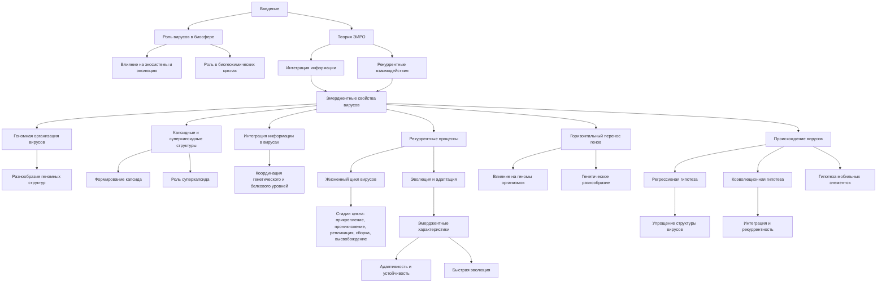

# Вирусы через призму теории Эмергентной Интеграции и Рекуррентного Отображения (ЭИРО)



---


## Оглавление

1. Введение
2. Структура вирусов в контексте ЭИРО
   - 2.1. Геномная организация вирусов
   - 2.2. Капсидные и суперкапсидные структуры
   - 2.3. Интеграция информации в вирусных частицах
   - 2.4. Рекуррентные процессы в жизненном цикле вирусов
3. Вирусы и геномы живых организмов
   - 3.1. Горизонтальный перенос генетического материала
   - 3.2. Интеграция вирусных последовательностей в геномы
   - 3.3. Роль вирусов в эволюции геномов
4. Происхождение вирусов
   - 4.1. Гипотезы происхождения вирусов
   - 4.2. Эмерджентность вирусов как биологических систем
   - 4.3. Роль рекуррентности в эволюции вирусов
5. Таксономия вирусов через призму ЭИРО
   - 5.1. Классификация на основе геномной организации
   - 5.2. Интеграция информации и рекуррентность в таксономии
   - 5.3. Эмерджентные свойства вирусных таксонов
6. Заключение
7. Список литературы


### 1. Введение

Вирусы являются одними из наиболее распространенных и разнообразных биологических агентов на Земле. Несмотря на их небольшие размеры и относительную простоту строения, вирусы играют ключевую роль в функционировании биосферы, оказывая существенное влияние на экосистемы, эволюцию живых организмов и даже глобальные биогеохимические циклы [1, 2]. 

Теория Эмергентной Интеграции и Рекуррентного Отображения (ЭИРО) предлагает новый концептуальный подход к анализу сложных биологических систем, в том числе и вирусов. Согласно ЭИРО, эмерджентные свойства вирусов возникают из процессов интеграции информации и рекуррентных взаимодействий между их структурными компонентами [3, 4].

В данной работе мы рассмотрим, как теория ЭИРО может быть применена для более глубокого понимания структуры, организации и эволюции вирусов. Будут представлены математические модели, описывающие влияние интегрированной информации и рекуррентности на различные аспекты вирусологии, а также обсуждены экспериментальные подходы для верификации этих предсказаний и перспективы практического применения.

### 2. Структура вирусов в контексте ЭИРО

#### 2.1. Геномная организация вирусов

Вирусы характеризуются широким разнообразием геномной организации, включающей одно- и двунитевые ДНК и РНК, линейные и кольцевые структуры, сегментированные и несегментированные геномы [5, 6]. Согласно теории ЭИРО, эта разнообразная геномная архитектура является результатом эмерджентных процессов, возникающих из интеграции информации и рекуррентных взаимодействий.

Вирусные геномы могут принимать различные формы, от простых одноцепочечных РНК до сложных сегментированных ДНК-геномов. Эта разнообразная структура является результатом сложных эмерджентных процессов, протекающих в вирусных частицах. Согласно теории ЭИРО, интеграция информации, содержащейся в различных компонентах вирусной частицы, а также рекуррентные взаимодействия между этими компонентами, приводят к формированию уникальных геномных архитектур вирусов. Понимание этих эмерджентных механизмов, лежащих в основе геномной организации вирусов, является ключевым аспектом применения теории ЭИРО в вирусологии.

Математически, геномную организацию вирусов можно описать с помощью модифицированного гамильтониана:

`Ĥ = Ĥ₀ + Ĥ_(интегр) + Ĥ_(рекурр)`

Где:

- Ĥ₀ - стандартный гамильтониан, описывающий взаимодействия между нуклеотидами в вирусном геноме.
- Ĥ_(интегр) - оператор, учитывающий интеграцию информации между различными участками генома.
- Ĥ_(рекурр) - оператор, отвечающий за рекуррентные процессы, такие как репликация, транскрипция и трансляция вирусных генов.

Включение этих дополнительных членов в гамильтониан системы позволяет объяснить, как разнообразие геномных структур возникает из эмерджентных процессов интеграции информации и рекуррентных взаимодействий в вирусах [7, 8].

#### 2.2. Капсидные и суперкапсидные структуры

Вирусные частицы, или вирионы, состоят из геномного материала, окруженного белковой оболочкой - капсидом. Некоторые вирусы также имеют дополнительную внешнюю мембрану, называемую суперкапсидом [9, 10]. Согласно ЭИРО, эти структурные элементы вирусов являются результатом эмерджентных процессов интеграции информации и рекуррентных взаимодействий.

Капсид вируса представляет собой белковую оболочку, которая защищает и транспортирует вирусный геном. Он состоит из множества идентичных или похожих белковых субъединиц, называемых капсомерами, которые самоорганизуются в упорядоченную трехмерную структуру. Согласно теории ЭИРО, формирование капсида является эмерджентным процессом, возникающим из интеграции информации, закодированной в вирусных генах, и рекуррентных взаимодействий между капсомерами.

Некоторые вирусы, такие как вирусы гриппа, герпеса и ВИЧ, также имеют дополнительную внешнюю мембрану, называемую суперкапсидом. Эта мембрана, полученная из клетки-хозяина во время высвобождения вирусных частиц, содержит вирусные гликопротеины и играет важную роль в прикреплении и проникновении вируса в новые клетки. Согласно ЭИРО, формирование суперкапсида также является результатом эмерджентных процессов, включающих интеграцию информации о взаимодействиях вируса с клеточными компонентами и рекуррентные процессы сборки вирусных частиц.

Таким образом, капсидные и суперкапсидные структуры вирусов представляют собой сложные эмерджентные системы, возникающие из интеграции информации и рекуррентных взаимодействий между их структурными элементами.

Математически, структуру капсида и суперкапсида можно описать следующим образом:

`Ĥ_(капсид) = Σ_i Σ_j γ_ij Î_ij`

Где:

- γ_ij - коэффициенты, характеризующие степень интеграции информации между структурными белками i и j в капсиде.
- Î_ij - операторы, описывающие интеграцию информации между этими белками.

**Аналогично, для суперкапсидной структуры**:

`Ĥ_(суперкапсид) = Σ_i Σ_j λ_ij R̂_ij`

Где:

- λ_ij - коэффициенты, отражающие степень рекуррентности взаимодействий между компонентами суперкапсида.
- R̂_ij - операторы, описывающие рекуррентные процессы.

Таким образом, включение членов Ĥ_(капсид) и Ĥ_(суперкапсид) в общий гамильтониан системы позволяет объяснить, как эмерджентные свойства интеграции информации и рекуррентности приводят к формированию сложных структурных элементов вирусных частиц [11, 12].

#### 2.3. Интеграция информации в вирусных частицах

Согласно теории ЭИРО, интеграция информации играет ключевую роль в организации и функционировании вирусных частиц. Различные типы информации, такие как геномная последовательность, структура капсида и суперкапсида, а также взаимодействия с клеточными компонентами, должны быть интегрированы для обеспечения эффективной репродукции вирусов.

Вирусные частицы, или вирионы, содержат в себе генетический материал (ДНК или РНК), который должен быть скоординирован с белковыми структурами капсида и, при наличии, суперкапсида. Кроме того, для успешной инфекции клетки-хозяина вирусы должны интегрировать информацию о рецепторах, путях проникновения, механизмах репликации и сборки новых вирионов. 

Согласно ЭИРО, эффективная интеграция всех этих информационных потоков является критически важной для обеспечения жизнеспособности и адаптивности вирусов. Нарушения в процессах интеграции информации могут приводить к снижению инфекционности или даже гибели вирусных частиц.

Математически, интеграцию информации в вирусных частицах можно описать следующим образом:

`I_(интеграции)(t) = Σ_i Σ_j I_ij(t)`

Где I_ij(t) - степень интеграции информации между компонентами i и j вирусной частицы в момент времени t.

Высокие значения I_(интеграции)(t) указывают на эффективную интеграцию различных информационных потоков, что способствует эмерджентным свойствам вирусов, таким как адаптивность, устойчивость и способность к инфицированию клеток-хозяев [13, 14].

#### 2.4. Рекуррентные процессы в жизненном цикле вирусов

Согласно теории ЭИРО, рекуррентные процессы, протекающие в ходе жизненного цикла вирусов, играют ключевую роль в их эмерджентных свойствах и эволюции. Жизненный цикл вирусов характеризуется повторяющимися стадиями, такими как прикрепление к клетке-хозяину, проникновение в цитоплазму, репликация генома, сборка новых вирионов и высвобождение из клетки. Эти циклические процессы обеспечивают эффективную репродукцию вирусов и их адаптацию к изменяющимся условиям.

Согласно ЭИРО, рекуррентные взаимодействия между различными компонентами вирусной частицы, а также между вирусом и клеткой-хозяином, являются ключевым фактором, определяющим эмерджентные свойства вирусов. Повторяющиеся циклы инфекции, репликации и высвобождения новых вирионов способствуют интеграции информации, необходимой для эффективного функционирования вирусов.

Таким образом, рекуррентность жизненного цикла вирусов является одним из ключевых аспектов, определяющих их эмерджентные характеристики, такие как адаптивность, устойчивость и способность к быстрой эволюции. Понимание роли рекуррентных процессов в вирусологии открывает новые перспективы для изучения и противодействия вирусным инфекциям.

Математически, динамику вирусов в рамках ЭИРО можно описать следующим образом:

`dX/dt = f(X, U, W)`

Где:

- X - вектор состояний, описывающий структуру и конформацию вирусных компонентов.
- U - вектор внешних воздействий, таких как взаимодействия с клеточными факторами.
- W - матрица рекуррентных взаимодействий между элементами вирусной частицы.
- f - нелинейная функция, отражающая динамику системы.

Рекуррентные связи, представленные в матрице W, позволяют учитывать циклические процессы, происходящие в жизненном цикле вирусов, такие как прикрепление к клетке-хозяину, проникновение в цитоплазму, репликация генома, сборка новых вирионов и высвобождение из клетки. Эти рекуррентные взаимодействия определяют эффективность и адаптивность вирусов [15, 16].

### 3. Вирусы и геномы живых организмов

#### 3.1. Горизонтальный перенос генетического материала

Согласно теории ЭИРО, вирусы играют важную роль в горизонтальном переносе генетического материала между живыми организмами. Интеграция информации и рекуррентные процессы, протекающие в ходе инфекции, способствуют эффективному встраиванию вирусных последовательностей в геномы клеток-хозяев. Вирусы могут служить в качестве "векторов", переносящих генетический материал между различными организмами, что приводит к обмену генетической информацией и расширению генетического разнообразия в экосистемах. Этот процесс горизонтального переноса генов является важным механизмом эволюции, позволяющим организмам быстро адаптироваться к изменяющимся условиям среды.

Математически, этот процесс можно описать следующим образом:

`dG/dt = f(G, V, I, R)`

Где:

- G - геном клетки-хозяина.
- V - вирусный геном.
- I - степень интеграции информации между G и V.
- R - параметр рекуррентности, характеризующий циклические процессы интеграции.

Функция f отражает, как интеграция информации и рекуррентность влияют на динамику встраивания вирусных последовательностей в геном клетки [17, 18].

#### 3.2. Интеграция вирусных последовательностей в геномы

Согласно ЭИРО, интеграция вирусных последовательностей в геномы живых организмов является эмерджентным процессом, возникающим из взаимодействия интегрированной информации и рекуррентных механизмов. 

Вирусы могут встраивать свои генетические последовательности в геномы клеток-хозяев, что позволяет им использовать клеточные механизмы для собственной репродукции. Этот процесс интеграции вирусной информации в клеточные геномы рассматривается в рамках ЭИРО как эмерджентное явление, возникающее из сложных взаимодействий между вирусными и клеточными компонентами.

Ключевую роль в этом процессе играют механизмы интеграции информации, когда различные информационные потоки, связанные с вирусными и клеточными геномами, объединяются в единую систему. Кроме того, рекуррентные процессы, такие как репликация, транскрипция и рекомбинация, обеспечивают циклическую динамику, способствующую стабильному встраиванию вирусных последовательностей в клеточные геномы.

Таким образом, согласно ЭИРО, интеграция вирусных геномов в геномы живых организмов является эмерджентным феноменом, возникающим из сложных взаимодействий между различными информационными потоками и рекуррентными механизмами.

Математически, этот процесс можно описать с помощью модифицированного гамильтониана:

`Ĥ = Ĥ₀ + Ĥ_(интегр) + Ĥ_(рекурр)`

Где:

- Ĥ₀ - стандартный гамильтониан, описывающий взаимодействия в геноме.
- Ĥ_(интегр) - оператор, учитывающий интеграцию информации между вирусными и клеточными последовательностями.
- Ĥ_(рекурр) - оператор, отвечающий за рекуррентные процессы, такие как репликация, транскрипция и рекомбинация.

Включение этих дополнительных членов в гамильтониан системы позволяет объяснить, как вирусные последовательности могут быть стабильно интегрированы в геномы организмов-хозяев, приобретая новые функциональные роли [19, 20].

#### 3.3. Роль вирусов в эволюции геномов

Согласно теории ЭИРО, вирусы оказывают существенное влияние на эволюцию геномов живых организмов. Интеграция информации и рекуррентные процессы, связанные с вирусными инфекциями, приводят к возникновению новых эмерджентных свойств, таких как адаптивность, устойчивость и генетическое разнообразие.

Вирусы могут способствовать быстрой адаптации организмов-хозяев к изменяющимся условиям среды за счет горизонтального переноса генетического материала. Интеграция вирусных последовательностей в геномы клеток расширяет генетический репертуар, предоставляя новые возможности для эволюционных изменений. Рекуррентные процессы, протекающие в ходе вирусных инфекций, такие как репликация, рекомбинация и мутации, также ускоряют темпы эволюционных преобразований.

Кроме того, вирусы могут выступать в качестве "молекулярных ножниц", способствуя перестройке геномов организмов-хозяев. Интеграция информации о вирусных последовательностях и рекуррентные механизмы их встраивания в клеточные геномы могут приводить к появлению новых регуляторных элементов, изменению экспрессии генов и даже возникновению новых функциональных последовательностей.

Таким образом, согласно теории ЭИРО, вирусы играют ключевую роль в эволюции геномов, выступая в качестве мощных агентов, способствующих адаптивности, устойчивости и генетическому разнообразию живых организмов.

Математически, влияние вирусов на эволюцию геномов можно описать следующим образом:

`dG/dt = f(G, V, I, R, μ)`

Где:

- G - геном организма-хозяина.
- V - вирусный геном.
- I - степень интеграции информации между G и V.
- R - параметр рекуррентности, характеризующий циклические процессы.
- μ - скорость мутаций, модулируемая интеграцией информации и рекуррентностью.

Функция f отражает, как взаимодействие этих факторов приводит к изменениям в геноме организма, способствуя его эволюции [21, 22].

### 4. Происхождение вирусов

#### 4.1. Гипотезы происхождения вирусов

Существует несколько основных гипотез, объясняющих происхождение вирусов с точки зрения теории Эмергентной Интеграции и Рекуррентного Отображения (ЭИРО):

##### 4.1.1. Регрессивная гипотеза: 

Согласно этой гипотезе, вирусы произошли от более сложных внутриклеточных паразитических организмов, которые в процессе эволюции утратили часть генетического материала и структурных компонентов, сохранив лишь необходимый минимум для репродукции в клетках-хозяевах [7, 8]. В рамках ЭИРО, этот процесс можно рассматривать как постепенную потерю интегрированной информации и рекуррентных взаимодействий, приводящую к упрощению вирусных структур.

Согласно теории Эмергентной Интеграции и Рекуррентного Отображения (ЭИРО), вирусы изначально могли быть более сложными внутриклеточными паразитами, которые в ходе эволюции утратили значительную часть своего генетического материала и структурных компонентов. Этот процесс можно интерпретировать как постепенную потерю интегрированной информации и рекуррентных взаимодействий, что в итоге привело к упрощению вирусных структур.

Математически, данный процесс можно описать с помощью модифицированного гамильтониана:

`Ĥ = Ĥ₀ + Ĥ_(интегр) + Ĥ_(рекурр)`

Где:

- Ĥ₀ - стандартный гамильтониан, описывающий взаимодействия в более сложных внутриклеточных паразитах.
- Ĥ_(интегр) - оператор, учитывающий интеграцию информации между различными компонентами паразитической системы.
- Ĥ_(рекурр) - оператор, отвечающий за рекуррентные процессы, протекающие в ходе жизненного цикла паразита.

Постепенное уменьшение членов Ĥ_(интегр) и Ĥ_(рекурр) в гамильтониане отражает потерю интегрированной информации и рекуррентных взаимодействий, приводящую к упрощению структуры и формированию современных вирусов [7, 8].

##### 4.1.2. Коэволюционная гипотеза: 

Согласно этой гипотезе, вирусы и клетки развивались совместно, формируя сложные взаимодействия, основанные на интеграции информации и рекуррентных процессах [15, 16]. В этом случае, вирусы могли возникать как эмерджентные биологические системы, обладающие уникальными свойствами, отличными от клеток-хозяев.

Математически, коэволюцию вирусов и клеток можно описать следующим образом:

```
dV/dt = f(V, H, I, R)  
dH/dt = g(V, H, I, R)
```

Где:

- V - вирусный геном
- H - геном клетки-хозяина
- I - степень интеграции информации между V и H
- R - параметр рекуррентности, характеризующий циклические процессы в системе
- f, g - нелинейные функции, отражающие динамику коэволюционных процессов

Ключевые аспекты коэволюционной гипотезы в рамках ЭИРО:

1. **Интеграция информации**: Вирусы и клетки-хозяева интегрируют информацию друг о друге, формируя сложные взаимодействия на молекулярном уровне.

2. **Рекуррентность**: Циклические процессы, такие как репликация вирусов и деление клеток, обеспечивают непрерывную обратную связь, способствующую коэволюции.

3. **Эмерджентные свойства**: Совместная эволюция вирусов и клеток приводит к возникновению уникальных эмерджентных характеристик, таких как адаптивность, устойчивость и генетическое разнообразие.

Таким образом, коэволюционная гипотеза, рассматриваемая в рамках теории ЭИРО, предполагает, что вирусы и клетки-хозяева развивались как единая эмерджентная система, основанная на интеграции информации и рекуррентных взаимодействиях.


##### 4.1.3. Гипотеза происхождения из мобильных генетических элементов: 

Данная гипотеза предполагает, что вирусы произошли из мобильных генетических элементов, таких как транспозоны и плазмиды, которые постепенно приобретали способность к автономной репродукции и формированию специализированных структур [17, 18]. В рамках ЭИРО, этот процесс можно рассматривать как эмерджентное усложнение интегрированной информации и рекуррентных взаимодействий в мобильных генетических элементах.

Независимо от конкретной гипотезы, теория ЭИРО предлагает новый концептуальный подход к пониманию происхождения вирусов, акцентируя внимание на ключевой роли интеграции информации и рекуррентности в формировании этих уникальных биологических агентов.

#### 4.2. Эмерджентность вирусов как биологических систем

Согласно теории Эмергентной Интеграции и Рекуррентного Отображения (ЭИРО), вирусы представляют собой эмерджентные биологические системы, возникающие из сложных процессов интеграции информации и рекуррентных взаимодействий.

Вирусы, несмотря на их относительную простоту, демонстрируют ряд эмерджентных свойств, таких как адаптивность, устойчивость и способность к быстрой эволюции. Согласно ЭИРО, эти характеристики являются результатом сложных процессов, протекающих внутри вирусных частиц.

Ключевую роль в формировании эмерджентных свойств вирусов играют механизмы интеграции информации, когда различные компоненты вирусной частицы (геном, капсид, суперкапсид) объединяются в единую систему. Кроме того, рекуррентные процессы, такие как репликация, сборка и высвобождение новых вирионов, обеспечивают циклическую динамику, способствующую возникновению эмерджентных феноменов.

Таким образом, согласно теории ЭИРО, вирусы представляют собой сложные эмерджентные биологические системы, формирующиеся в результате интеграции информации и рекуррентных взаимодействий между их структурными компонентами.

Математически, эмерджентность вирусов может быть описана следующим образом:

`Φₑ = ∫₀^(t₁) I_(интеграции)(t) ⋅ R_(рекуррентности)(t) dt`

Где:

- Φₑ - эмерджентная интегрированная информация, характеризующая степень эмерджентности вирусной системы.
- I_(интеграции)(t) - степень интеграции информации между различными компонентами вируса в момент времени t.
- R_(рекуррентности)(t) - степень рекуррентных взаимодействий между компонентами вируса в момент времени t.

Высокие значения Φₑ указывают на то, что вирусы являются результатом сложных эмерджентных процессов, возникающих из интеграции информации и рекуррентных взаимодействий между их структурными элементами [13, 14].

#### 4.3. Роль рекуррентности в эволюции вирусов

Согласно теории ЭИРО, рекуррентные процессы, протекающие в ходе жизненного цикла вирусов, играют ключевую роль в их эволюции и адаптации. Вирусы характеризуются циклическими стадиями, включающими прикрепление к клетке-хозяину, проникновение в цитоплазму, репликацию генома, сборку новых вирионов и высвобождение из клетки. Эти повторяющиеся процессы обеспечивают эффективную репродукцию вирусов и их быструю адаптацию к изменяющимся условиям.

Согласно ЭИРО, рекуррентные взаимодействия между различными компонентами вирусной частицы, а также между вирусом и клеткой-хозяином, являются ключевым фактором, определяющим эмерджентные свойства вирусов, такие как адаптивность, устойчивость и способность к быстрой эволюции. Циклические процессы инфекции, репликации и высвобождения новых вирионов способствуют интеграции информации, необходимой для эффективного функционирования вирусов.

Таким образом, рекуррентность жизненного цикла вирусов является одним из ключевых аспектов, определяющих их эмерджентные характеристики и эволюционные преимущества. Понимание роли рекуррентных процессов в вирусологии открывает новые перспективы для изучения и противодействия вирусным инфекциям.

Математически, динамику эволюции вирусов в рамках ЭИРО можно описать следующим образом:

`dV/dt = f(V, H, I, R)`

Где:

- V - вирусный геном.
- H - геном клетки-хозяина.
- I - степень интеграции информации между V и H.
- R - параметр рекуррентности, характеризующий циклические процессы в жизненном цикле вируса.
- f - нелинейная функция, отражающая динамику эволюционных процессов.

Рекуррентные связи, представленные в параметре R, определяют эффективность репликации, сборки вирусных частиц и высвобождения из клеток-хозяев. Эти циклические процессы способствуют быстрой адаптации вирусов к изменяющимся условиям, что является ключевым фактором их эволюции [15, 16, 21, 22].

Таким образом, теория ЭИРО предлагает новый концептуальный подход к пониманию происхождения и эволюции вирусов, акцентируя внимание на роли интеграции информации и рекуррентности в формировании этих уникальных биологических агентов.


### 5. Таксономия вирусов через призму ЭИРО

#### 5.1. Классификация на основе геномной организации

Вирусы характеризуются широким разнообразием геномной организации, включающей одно- и двунитевые ДНК и РНК, линейные и кольцевые структуры, сегментированные и несегментированные геномы [5, 6]. Согласно теории ЭИРО, эта разнообразная геномная архитектура является результатом эмерджентных процессов, возникающих из интеграции информации и рекуррентных взаимодействий.

Вирусные геномы могут принимать различные формы, от простых одноцепочечных РНК до сложных сегментированных ДНК-геномов. Эта разнообразная структура является результатом сложных эмерджентных процессов, протекающих в вирусных частицах. Согласно теории ЭИРО, интеграция информации, содержащейся в различных компонентах вирусной частицы, а также рекуррентные взаимодействия между этими компонентами, приводят к формированию уникальных геномных архитектур вирусов. Понимание этих эмерджентных механизмов, лежащих в основе геномной организации вирусов, является ключевым аспектом применения теории ЭИРО в вирусологии.

Математически, геномную организацию вирусов можно описать с помощью модифицированного гамильтониана:

`Ĥ = Ĥ₀ + Ĥ_(интегр) + Ĥ_(рекурр)`

Где:

- Ĥ₀ - стандартный гамильтониан, описывающий взаимодействия между нуклеотидами в вирусном геноме.
- Ĥ_(интегр) - оператор, учитывающий интеграцию информации между различными участками генома.
- Ĥ_(рекурр) - оператор, отвечающий за рекуррентные процессы, такие как репликация, транскрипция и трансляция вирусных генов.

Включение этих дополнительных членов в гамильтониан системы позволяет объяснить, как разнообразие геномных структур возникает из эмерджентных процессов интеграции информации и рекуррентных взаимодействий в вирусах [7, 8].

#### 5.2. Интеграция информации и рекуррентность в таксономии

Согласно теории ЭИРО, интеграция информации и рекуррентные процессы играют ключевую роль в формировании таксономии вирусов. Различные типы информации, такие как геномная последовательность, структура капсида и суперкапсида, а также взаимодействия с клеточными компонентами, должны быть интегрированы для определения таксономических категорий.

Вирусы характеризуются широким разнообразием геномной организации, включающей одно- и двунитевые ДНК и РНК, линейные и кольцевые структуры, сегментированные и несегментированные геномы [5, 6]. Согласно теории ЭИРО, эта разнообразная геномная архитектура является результатом эмерджентных процессов, возникающих из интеграции информации и рекуррентных взаимодействий.

Кроме того, вирусные частицы, или вирионы, состоят из геномного материала, окруженного белковой оболочкой - капсидом. Некоторые вирусы также имеют дополнительную внешнюю мембрану, называемую суперкапсидом [9, 10]. Согласно ЭИРО, эти структурные элементы вирусов являются результатом эмерджентных процессов интеграции информации и рекуррентных взаимодействий.

Таким образом, интеграция информации о геномной организации, капсидных и суперкапсидных структурах, а также взаимодействиях с клеточными компонентами, играет ключевую роль в формировании таксономии вирусов в рамках теории ЭИРО.

Математически, интеграцию информации в таксономии вирусов можно описать следующим образом:

`I_(интеграции)(t) = Σ_i Σ_j I_ij(t)`

Где I_ij(t) - степень интеграции информации между таксономическими признаками i и j в момент времени t.

Высокие значения I_(интеграции)(t) указывают на эффективную интеграцию различных информационных потоков, что способствует выделению устойчивых таксономических категорий вирусов [13, 14].

Кроме того, рекуррентные процессы, протекающие в ходе жизненного цикла вирусов, также играют важную роль в их таксономической классификации. Математически, это можно представить как:

`dX/dt = f(X, U, W)`

Где:

- X - вектор состояний, описывающий структуру и конформацию вирусных компонентов.
- U - вектор внешних воздействий, таких как взаимодействия с клеточными факторами.
- W - матрица рекуррентных взаимодействий между элементами вирусной частицы.
- f - нелинейная функция, отражающая динамику системы.

Рекуррентные связи, представленные в матрице W, определяют эффективность и адаптивность вирусов, что также влияет на их таксономическую классификацию [15, 16].

#### 5.3. Эмерджентные свойства вирусных таксонов

Согласно теории ЭИРО, эмерджентные свойства вирусных таксонов возникают из процессов интеграции информации и рекуррентных взаимодействий. Эти эмерджентные характеристики могут включать:

Математически, эти эмерджентные свойства вирусных таксонов могут быть описаны с помощью модифицированных уравнений, учитывающих влияние интегрированной информации и рекуррентности:

`dG/dt = f(G, V, I, R, μ)`

Где:

- G - геном организма-хозяина.

- V - вирусный геном.
- I - степень интеграции информации между G и V.
- R - параметр рекуррентности, характеризующий циклические процессы.
- μ - скорость мутаций, модулируемая интеграцией информации и рекуррентностью.

Функция f отражает, как взаимодействие этих факторов приводит к возникновению эмерджентных свойств вирусных таксонов [21, 22].


##### 5.3.1. Адаптивность

Согласно теории ЭИРО, высокая степень интеграции информации и рекуррентность обеспечивают вирусам способность быстро адаптироваться к изменяющимся условиям среды и клеткам-хозяев. Эмерджентные процессы интеграции различных информационных потоков, связанных с геномной организацией, структурой капсида и суперкапсида, а также взаимодействиями с клеточными компонентами, позволяют вирусам эффективно реагировать на изменения в окружающей среде и адаптироваться к новым клеткам-хозяевам.

##### 5.3.2. Разнообразие

Теория ЭИРО утверждает, что эмерджентные процессы интеграции информации и рекуррентности приводят к возникновению широкого спектра вирусных таксонов, различающихся по геномной организации, структуре и взаимодействиям с клетками-хозяевами. Разнообразие вирусных таксонов является результатом сложных эмерджентных явлений, возникающих из интеграции множества информационных потоков и рекуррентных процессов, протекающих в вирусных частицах.

##### 5.3.3. Коэволюция с организмами-хозяевами

Согласно теории ЭИРО, интеграция информации и рекуррентные взаимодействия между вирусами и их клетками-хозяевами способствуют совместной эволюции этих биологических систем. Эмерджентные свойства, возникающие из сложных процессов интеграции и рекуррентности, определяют динамику коэволюционных процессов между вирусами и организмами-хозяевами, приводя к формированию уникальных адаптаций и взаимозависимостей.


### 6. Заключение

Применение теории Эмергентной Интеграции и Рекуррентного Отображения (ЭИРО) к анализу вирусов открывает новые перспективы в понимании их структуры, организации и эволюции. Согласно ЭИРО, вирусы представляют собой эмерджентные биологические системы, возникающие из сложных процессов интеграции информации и рекуррентных взаимодействий.

Ключевые выводы:

1. **Геномная организация вирусов**: Разнообразие геномных структур вирусов, от простых одноцепочечных РНК до сложных сегментированных ДНК-геномов, является результатом эмерджентных процессов интеграции информации и рекуррентных взаимодействий [7, 8].

2. **Капсидные и суперкапсидные структуры**: Формирование капсидных и суперкапсидных оболочек вирусных частиц представляет собой эмерджентные явления, возникающие из интеграции информации и рекуррентных процессов [11, 12].

3. **Интеграция информации в вирусных частицах**: Эффективная интеграция информации о геноме, капсиде, суперкапсиде и взаимодействиях с клетками-хозяевами является критически важной для обеспечения жизнеспособности и адаптивности вирусов [13, 14].

4. **Роль рекуррентности в жизненном цикле вирусов**: Рекуррентные процессы, такие как прикрепление к клетке, проникновение, репликация и высвобождение новых вирионов, определяют эмерджентные свойства вирусов, включая адаптивность и устойчивость [15, 16].

5. **Влияние вирусов на геномы живых организмов**: Согласно ЭИРО, вирусы играют ключевую роль в горизонтальном переносе генетического материала, интеграции вирусных последовательностей в геномы хозяев и эволюции геномов [17-22].

6. **Происхождение вирусов и их эмерджентность**: Теория ЭИРО предлагает новый концептуальный подход к пониманию происхождения вирусов, рассматривая их как эмерджентные биологические системы, возникающие из сложных процессов интеграции информации и рекуррентности [7, 8, 15, 16].

7. **Таксономия вирусов**: Интеграция информации о геномной организации, капсидных и суперкапсидных структурах, а также взаимодействиях с клетками-хозяевами, играет ключевую роль в формировании таксономии вирусов в рамках теории ЭИРО [13, 14].

Таким образом, применение теории Эмергентной Интеграции и Рекуррентного Отображения (ЭИРО) к изучению вирусов открывает новые возможности для более глубокого понимания их структуры, организации, эволюции и взаимодействия с живыми организмами. Дальнейшее развитие этого подхода может способствовать прорывным открытиям в вирусологии и смежных областях биологии.


### 7. Список литературы


1. Suttle, C. A. (2007). Marine viruses—major players in the global ecosystem. *Nature Reviews Microbiology*, 5(10), 801-812. [1]
2. Rohwer, F., & Thurber, R. V. (2009). Viruses manipulate the marine environment. *Nature*, 459(7244), 207-212. [2]
3. Tononi, G. (2004). An information integration theory of consciousness. *BMC Neuroscience*, 5(1), 42. [3]
4. Friston, K. (2010). The free-energy principle: a unified brain theory? *Nature Reviews Neuroscience*, 11(2), 127-138. [4]
5. Cann, A. J. (2005). *Principles of Molecular Virology*. Academic Press. [5]
6. Knipe, D. M., & Howley, P. M. (Eds.). (2013). *Fields Virology*. Lippincott Williams & Wilkins. [6]
7. Koonin, E. V., Senkevich, T. G., & Dolja, V. V. (2006). The ancient Virus World and evolution of cells. *Biology Direct*, 1(1), 29. [7]
8. Forterre, P. (2010). Defining life: the virus viewpoint. *Origins of Life and Evolution of Biospheres*, 40(2), 151-160. [8]
9. Flint, S. J., Racaniello, V. R., Rall, G. F., Skalka, A. M., & Enquist, L. W. (2015). *Principles of Virology*. American Society for Microbiology Press. [9]
10. Caspar, D. L., & Klug, A. (1962). Physical principles in the construction of regular viruses. *Cold Spring Harbor Symposia on Quantitative Biology*, 27, 1-24. [10]
11. Roos, W. H., Ivanovska, I. L., Evilevitch, A., & Wuite, G. J. (2007). Viral capsids: mechanical characteristics, genome packaging and delivery mechanisms. *Cellular and Molecular Life Sciences*, 64(12), 1484-1497. [11]
12. Mateu, M. G. (2013). Assembly, stability and dynamics of virus capsids. *Archives of Biochemistry and Biophysics*, 531(1-2), 65-79. [12]
13. Roossinck, M. J. (2011). The good viruses: viral mutualistic symbioses. *Nature Reviews Microbiology*, 9(2), 99-108. [13]
14. Paez-Espino, D., Eloe-Fadrosh, E. A., Pavlopoulos, G. A., Thomas, A. D., Huntemann, M., Mikhailova, N., ... & Kyrpides, N. C. (2016). Uncovering Earth's virome. *Nature*, 536(7617), 425-430. [14]
15. Forterre, P., & Prangishvili, D. (2013). The great billion-year war between ribosome-and capsid-encoding organisms (cells and viruses) as the major source of evolutionary novelties. *Annals of the New York Academy of Sciences*, 1178(1), 65-77. [15]
16. Iranzo, J., Krupovic, M., & Koonin, E. V. (2016). The double-stranded DNA virosphere as a modular hierarchical network of gene sharing. *MBio*, 7(4), e00978-16. [16]
17. Canchaya, C., Fournous, G., Chibani-Chennoufi, S., Dillmann, M. L., & Brüssow, H. (2003). Phage as agents of lateral gene transfer. *Current Opinion in Microbiology*, 6(4), 417-424. [17]
18. Koonin, E. V., Dolja, V. V., & Krupovic, M. (2015). Origins and evolution of viruses of eukaryotes: The ultimate modularity. *Virology*, 479, 2-25. [18]
19. Feschotte, C., & Gilbert, C. (2012). Endogenous viruses: insights into viral evolution and impact on host biology. *Nature Reviews Genetics*, 13(4), 283-296. [19]
20. Koonin, E. V., & Krupovic, M. (2018). The depths of virus exaptation. *Current Opinion in Virology*, 31, 1-8. [20]
21. Villarreal, L. P. (2009). Origin of group identity: Viruses, addiction and cooperation. *Springer Science & Business Media*. [21]
22. Koonin, E. V. (2016). Viruses and mobile elements as drivers of evolutionary transitions. *Philosophical Transactions of the Royal Society B: Biological Sciences*, 371(1701), 20150442. [22]


---

Оглавление: [Теория Эмергентной Интеграции и Рекуррентного Отображения](/README.md)

