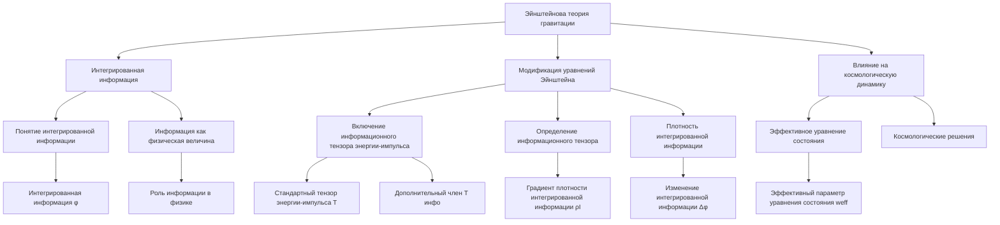

# Эйнштейнова теория гравитации через призму теории интегрированной информации и рекуррентной Вселенной

---

## Аннотация

В данной работе исследуется возможное взаимодействие между общей теорией относительности Эйнштейна и теорией интегрированной информации, рассматривая сознание и информацию как фундаментальные компоненты физической реальности. Предложены модификации уравнений Эйнштейна с учётом информационных аспектов, и обсуждается влияние этих изменений на космологическую динамику и модель Вселенной.

### 1. Интегрированная информация

Общая теория относительности (ОТО) Альберта Эйнштейна является одной из наиболее успешных физических теорий, описывающих гравитацию как искривление пространства-времени из-за наличия материи и энергии. Однако современные исследования в области квантовой гравитации и фундаментальной природы информации поднимают вопросы о необходимости включения информационных аспектов в фундаментальные физические теории.

Теория интегрированной информации (Integrated Information Theory, IIT), предложенная Джулио Тонони, рассматривает сознание как явление, возникающее из высокой степени интеграции информации в системе [1]. Эта теория приобретает всё большее значение в нейронауках и философии сознания. В данной работе мы исследуем возможность включения принципов IIT в ОТО для получения новой модели Вселенной.

### 2. Теория интегрированной информации и физика

#### 2.1. Понятие интегрированной информации

Интегрированная информация (φ) характеризует степень, с которой система как целое содержит больше информации, чем сумма её частей [1]. Математически это выражается через разницу между информационной энтропией системы и суммой энтропий её подсистем:

`φ = H_(система) - ∑ᵢ H_(подсистемаᵢ),`

где  H  — энтропия.

#### 2.2. Информация как физическая величина

Роль информации в физике была подчёркнута в работах Рольфа Ландауэра, который сформулировал принцип, что "информация — это физическая сущность" [2]. Это означает, что информация неотделима от физических процессов и должна учитываться в фундаментальных теориях.

### 3. Модификация уравнений Эйнштейна

#### 3.1. Включение информационного тензора энергии-импульса

Предлагается добавить к стандартному тензору энергии-импульса  T_(μν)  дополнительный член, связанный с информацией:

`G_(μν) + Λ g_(μν) = 8π G (( T_(μν) + T_(μν)⁽ⁱⁿᶠᵒ⁾ )),`

где  T_(μν)⁽ⁱⁿᶠᵒ⁾  — тензор энергии-импульса, связанный с информацией в системе.

#### 3.2. Определение информационного тензора

Информационный тензор может быть определён через градиент плотности интегрированной информации  ρ_I:

`T_(μν)⁽ⁱⁿᶠᵒ⁾ = κ (( ∇_\mu ρ_I ∇_\nu ρ_I - 1 / 2 g_(μν) ∇^\lambda ρ_I ∇_\lambda ρ_I )),`

где  κ  — константа пропорциональности.

#### 3.3. Плотность интегрированной информации

Плотность интегрированной информации определяется как:

`ρ_I = lim(Δ V → 0) Δ φ / Δ V,`

где  Δ φ  — изменение интегрированной информации в объёме  Δ V .

### 4. Влияние на космологическую динамику

#### 4.1. Эффективное уравнение состояния

Информационный вклад может изменить уравнение состояния тёмной энергии. Эффективный параметр уравнения состояния может быть записан как:

`w_(eff) = w₀ + w₁ f(ρ_I),`

где  w₀  и  w₁  — константы,  f(ρ_I)  — функция влияния плотности интегрированной информации.

#### 4.2. Космологические решения

Включение информационного тензора в уравнения Эйнштейна может приводить к новым космологическим решениям, которые объясняют ускоренное расширение Вселенной без введения тёмной энергии или модификации гравитации на больших расстояниях.

### 5. Обсуждение

#### 5.1. Связь с квантовой гравитацией

Информационный подход может сблизить ОТО с квантовой механикой, поскольку информация играет ключевую роль в квантовой теории. Это может способствовать развитию единой теории квантовой гравитации.

#### 5.2. Экспериментальные проверки

Возможность экспериментальной проверки предложенной модели связана с наблюдениями крупномасштабной структуры Вселенной и реликтового излучения. Аномалии, объясняемые информационным вкладом, могли бы подтвердить или опровергнуть данную теорию.

### 6. Заключение

Включение информационных аспектов в общую теорию относительности открывает новые возможности для понимания фундаментальных законов природы. Предложенная модификация уравнений Эйнштейна с учётом интегрированной информации может предоставить альтернативное объяснение некоторых космологических наблюдений и приблизить нас к объединению гравитации с квантовой механикой.

### 7. Ссылки

1. Tononi, G. (2008). Consciousness as integrated information: a provisional manifesto. *Biological Bulletin*, 215(3), 216-242.

2. Landauer, R. (1991). Information is physical. *Physics Today*, 44(5), 23-29.

3. Verlinde, E. (2011). On the origin of gravity and the laws of Newton. *Journal of High Energy Physics*, 2011(4), 29.

4. Jacobson, T. (1995). Thermodynamics of spacetime: the Einstein equation of state. *Physical Review Letters*, 75(7), 1260.

---

Оглавление: [ЭИРО framework](/README.md)

