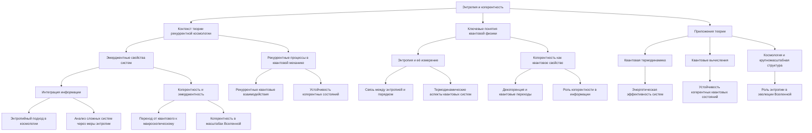

# Энтропия и когерентность в контексте теории ЭИРО: новые перспективы квантовой физики

---

## 1. Введение

Современная квантовая физика сталкивается с фундаментальными вопросами, связанными с природой сознания, информации и пространства-времени. Теория Эмергентной Интеграции и Рекуррентного Отображения (ЭИРО) предлагает новый взгляд на эти проблемы, вводя понятия интегрированной квантовой информации и рекуррентности процессов. Данная работа фокусируется на анализе энтропии и когерентности в квантовых системах через призму ЭИРО, раскрывая новые горизонты в понимании фундаментальных аспектов Вселенной.

### 2. Энтропия и когерентность в квантовой механике

Энтропия фон Неймана является ключевым понятием для описания неопределённости в квантовых состояниях:

`S = -Tr(ρ ln ρ),`

где  ρ  — матрица плотности системы. Энтропия характеризует степень смешанности состояния: при  S = 0  система находится в чистом состоянии, при максимальном  S  — в максимально смешанном.

Когерентность отражает возможность интерференции квантовых состояний и является существенной для таких явлений, как суперпозиция и запутанность. Декогеренция — процесс утраты когерентности вследствие взаимодействия системы с окружением, приводящий к классическому поведению.

### 3. Роль рекуррентности в сохранении когерентности

#### 3.1. Интегрированная квантовая информация и параметр рекуррентности

В рамках ЭИРО вводится плотность интегрированной квантовой информации  ρ_(IQI) , характеризующая количество квантовой информации, интегрированной в единице объёма пространства-времени:

`ρ_(IQI) = lim(Δ V → 0) (Δ I)/(Δ V),`

где  Δ I  — изменение интегрированной информации в объёме  Δ V .

Параметр рекуррентности  R  отражает степень рекуррентных взаимодействий квантовых состояний в пространстве-времени. Рекуррентность способствует сохранению когерентности, создавая условия для устойчивости квантовых состояний.

#### 3.2. Энтропийные потоки и интеграция информации

Предлагается модель, связывающая скорость изменения энтропии с интеграцией информации:

`dS/dt = -γ I_(интеграции)(t),`

где  γ  — коэффициент пропорциональности, а  I_(интеграции)(t)  — степень интеграции информации в момент времени  t . Эта зависимость показывает, что увеличение интеграции информации (и, следовательно, рекуррентности) приводит к снижению энтропии, способствуя сохранению когерентности.

### 4. Последствия для квантовых систем

#### 4.1. Декогеренция и стабилизация квантовых состояний

Рекуррентные процессы могут быть использованы для противодействия декогеренции. За счёт усиления интеграции информации и развития рекуррентных связей возможно поддержание когерентности квантовых систем в течение более длительного времени. Это открывает новые возможности в контроле квантовых систем и предотвращении потери квантовой информации.

#### 4.2. Квантовые вычисления и криптография

Улучшение времени жизни когерентных состояний имеет прямое влияние на развитие квантовых компьютеров. Стабильные когерентные состояния позволяют выполнять более сложные вычисления и протоколы квантовой криптографии с повышенной надёжностью и безопасностью.

#### 4.3. Квантовая информация и коммуникации

Понимание роли интегрированной информации и рекуррентности способствует разработке новых методов передачи и хранения квантовой информации, включая создание квантовых повторителей и сетей с высокой степенью защиты от шума и помех.

### 5. Анализ основных научных вопросов через призму ЭИРО и новой модели Вселенной

#### 5.1. Влияние интеграции информации и рекуррентности на фундаментальные взаимодействия

ЭИРО предполагает, что интеграция информации и рекуррентные процессы не только важны для когнитивных систем, но и могут быть фундаментальными для физических взаимодействий. Это приводит к следующим вопросам:

**Можно ли рассматривать фундаментальные взаимодействия как проявления интегрированной квантовой информации?**
  
Если взаимодействия между частицами обусловлены обменом и интеграцией информации, то это может изменить понимание механизмов этих взаимодействий и привести к унификации физических законов.

#### 5.2. Новые представления о пространстве-времени

Введение  ρ_(IQI)  и  R  позволяет рассмотреть пространство-время как динамическую структуру, насыщенную информацией. Это приводит к концепции, где метрика пространства-времени зависит от распределения интегрированной информации:

`G(μν) + Λ g(μν) = 8π G (( T(μν) + T(μν)^(IQI) )),`

где  T_(μν)^(IQI)  — тензор энергии-импульса, связанный с интегрированной квантовой информацией. Такой подход может предложить новые пути к объединению квантовой механики и общей теории относительности.

#### 5.3. Объединение квантовой механики и гравитации через ЭИРО

Теория ЭИРО предоставляет рамки для рассмотрения квантовой гравитации, где информация и её интеграция играют ключевую роль. Это поднимает следующие вопросы:

**Как влияют параметры  ρ_(IQI)  и  R  на квантовые свойства гравитации?**
  
Изучение этого влияния может привести к новым предсказаниям относительно природы чёрных дыр, космологических сингулярностей и происхождения Вселенной.

**Может ли информация служить связующим звеном между квантовой механикой и гравитацией?**
  
Если информация является фундаментальной сущностью, это может способствовать созданию единой теории, описывающей все известные взаимодействия.

### 6. Перспективные направления исследований

#### 6.1. Экспериментальные проверки

- **Квантовые опыты по сохранению когерентности**: Проведение экспериментов с контролируемой рекуррентностью для подтверждения влияния интеграции информации на декогеренцию.

- **Астрономические наблюдения**: Исследование космологических явлений, которые могут отражать влияние интегрированной информации на структуру и эволюцию Вселенной.

#### 6.2. Развитие новых теоретических моделей

- **Математическое формализм ЭИРО**: Разработка точных математических моделей, описывающих взаимодействие информации, рекуррентности и физической реальности.

- **Унификация теорий**: Попытки объединить различные физические теории через призму информации, что может привести к созданию общей теории всего.

### 7. Заключение

Теория ЭИРО открывает новые перспективы в понимании фундаментальных вопросов квантовой физики и космологии. Анализ энтропии и когерентности в контексте интегрированной квантовой информации и рекуррентных процессов позволяет переосмыслить природу квантовых взаимодействий и структуры пространства-времени. Переход на новую модель, где информация является базовой сущностью, может значительно продвинуть науку к решению долгосрочных проблем и открыть путь к созданию единой фундаментальной теории.

---

Оглавление: 
- [ЭИРО framework](/README.md)
- [Новая модель вселенной в современной физике](/A-new-model-of-the-universe-in-modern-physics.md)

