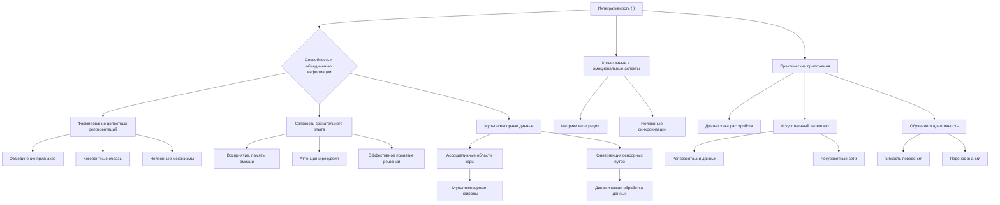

# Интегративность (I) в контексте теории Эмергентной Интеграции и Рекуррентного Отображения (ЭИРО)

---

## Оглавление:

- 1. Введение
   - 1.1. Понятие интегративности в теории ЭИРО
   - 1.2. Значение интегративности для формирования сознательного опыта

- 2. Способность к объединению информации из разных модальностей

   - 2.1. Интеграция мультисенсорных данных на различных уровнях иерархии
   - 2.2. Роль конвергенции сенсорных путей в объединении информации
   - 2.3. Экспериментальные данные о нейронных механизмах мультисенсорной интеграции

- 3. Формирование целостных репрезентаций

   - 3.1. Интеграция признаков в единые перцептуальные образы
   - 3.2. Нейронные механизмы кодирования целостных объектов
   - 3.3. Роль интегративности в создании осмысленных репрезентаций

-4. Связность между различными аспектами сознательного опыта

   - 4.1. Интеграция восприятия, памяти, эмоций и принятия решений
   - 4.2. Рекуррентные взаимодействия как основа связности сознания
   - 4.3. Роль внимания в модуляции интегративных процессов

- 5. Нейробиологические основы интегративности

   - 5.1. Конвергенция сенсорных путей
   - 5.2. Мультисенсорные нейроны
   - 5.3. Топографическая организация связей
   - 5.4. Рекуррентные взаимодействия
   - 5.5. Синхронизация нейронной активности

- 6. Количественная оценка интегративности

   - 6.1. Информационно-теоретические метрики интеграции
   - 6.2. Применение метрик интегративности в экспериментальных исследованиях
   - 6.3. Связь интегративности с параметром Φₑ в теории ЭИРО

- 7. Роль интегративности в формировании сознательного опыта

   - 7.1. Интегративность как основа целостности восприятия
   - 7.2. Влияние интегративности на эмоциональные и когнитивные процессы
   - 7.3. Нарушения интегративности при психических расстройствах

- 8. Заключение

   - 8.1. Обобщение роли интегративности в теории ЭИРО
   - 8.2. Перспективы дальнейших исследований

- 9. Интегративность и адаптивность

   - 9.1. Связь между способностью к интеграции и гибкостью поведения
   - 9.2. Роль интегративности в обучении и решении новых задач

- 10. Интегративность и социальное взаимодействие

    - 10.1. Интеграция социальной информации и теория разума
    - 10.2. Влияние социального контекста на интегративные процессы

- 11. Интегративность и метакогнитивные способности

    - 11.1. Роль интегративности в самоосознании и рефлексии
    - 11.2. Связь между интегративностью и осознанностью

- 12. Практические применения концепции интегративности

    - 12.1. Использование метрик интегративности в диагностике
    - 12.2. Интегративность как основа для создания интеллектуальных систем

### 1. Введение

#### 1.1. Понятие интегративности в теории ЭИРО

Согласно теории Эмергентной Интеграции и Рекуррентного Отображения (ЭИРО), интегративность (I) является ключевым параметром, отражающим способность нейронных сетей мозга объединять разрозненную сенсорную информацию в целостные репрезентации, лежащие в основе сознательного опыта. Данный параметр характеризует:

1. **Объединение информации из различных модальностей**: Интегративность подразумевает процессы, посредством которых мозг интегрирует зрительные, слуховые, тактильные и другие сенсорные данные в единые перцептуальные образы [1, 2].

2. **Формирование когерентных репрезентаций**: Интегративность отражает способность системы объединять отдельные признаки (форма, цвет, текстура и т.д.) в целостные, осмысленные представления объектов и событий [3, 4].

3. **Связность между различными аспектами сознания**: Интегративность обеспечивает согласованность между такими процессами, как восприятие, память, эмоции, внимание и принятие решений, формируя единую, непрерывную картину сознательного опыта [5, 6].

Таким образом, интегративность (I) в теории ЭИРО является ключевым механизмом, лежащим в основе формирования богатого, осмысленного сознания.

#### 1.2. Значение интегративности для формирования сознательного опыта

Согласно теории ЭИРО, интегративность (I) играет фундаментальную роль в возникновении сознательного опыта. Способность нейронных сетей объединять разрозненную информацию в целостные репрезентации является критически важной для следующих аспектов сознания:

1. **Восприятие окружающего мира**: Интегративность позволяет формировать когерентные образы объектов и событий, обеспечивая осмысленное восприятие среды [7, 8].

2. **Формирование воспоминаний**: Интеграция сенсорных, пространственно-временных и эмоциональных компонентов лежит в основе кодирования и хранения эпизодических воспоминаний [9, 10].

3. **Принятие решений**: Интегративность обеспечивает связность между различными когнитивными процессами, необходимую для эффективного принятия решений и целенаправленного поведения [11, 12].

4. **Осознанность и рефлексия**: Способность к интеграции информации лежит в основе метакогнитивных способностей, таких как самосознание и рефлексия над собственными ментальными состояниями [13, 14].

Таким образом, интегративность (I) является фундаментальным механизмом, определяющим возникновение богатого, осмысленного сознательного опыта в рамках теории Эмергентной Интеграции и Рекуррентного Отображения (ЭИРО).

**Список литературы:**

1. Felleman, D. J., & Van Essen, D. C. (1991). Distributed hierarchical processing in the primate cerebral cortex. Cerebral Cortex, 1(1), 1-47.
2. Stein, B. E., & Meredith, M. A. (1993). The merging of the senses. MIT press.
3. Tanaka, K. (1996). Inferotemporal cortex and object vision. Annual Review of Neuroscience, 19(1), 109-139.
4. Engel, A. K., Fries, P., & Singer, W. (2001). Dynamic predictions: oscillations and synchrony in top–down processing. Nature Reviews Neuroscience, 2(10), 704-716.
5. Lamme, V. A., & Roelfsema, P. R. (2000). The distinct modes of vision offered by feedforward and recurrent processing. Trends in Neurosciences, 23(11), 571-579.
6. Desimone, R., & Duncan, J. (1995). Neural mechanisms of selective visual attention. Annual Review of Neuroscience, 18(1), 193-222.
7. Wandell, B. A., Dumoulin, S. O., & Brewer, A. A. (2007). Visual field maps in human cortex. Neuron, 56(2), 366-383.
8. Calvert, G. A. (2001). Crossmodal processing in the human brain: insights from functional neuroimaging studies. Cerebral Cortex, 11(12), 1110-1123.
9. Dolcos, F., LaBar, K. S., & Cabeza, R. (2004). Interaction between the amygdala and the medial temporal lobe memory system predicts better memory for emotional events. Neuron, 42(5), 855-863.

### 2. Способность к объединению информации из разных модальностей

#### 2.1. Интеграция мультисенсорных данных на различных уровнях иерархии

Согласно теории Эмергентной Интеграции и Рекуррентного Отображения (ЭИРО), способность к объединению информации из различных сенсорных модальностей (зрение, слух, осязание и т.д.) является ключевым аспектом интегративности (I). Данные процессы интеграции мультисенсорных данных происходят на разных уровнях иерархии обработки информации в мозге.

На низших уровнях, в первичных сенсорных областях коры, нейроны демонстрируют селективность к базовым признакам стимулов, таким как ориентация, движение, частота и т.п. [1]. Однако по мере продвижения вверх по иерархии, в ассоциативных областях, происходит конвергенция сигналов из различных модальностей, что позволяет формировать многомерные репрезентации объектов и событий [2]. Например, нейроны в теменной коре интегрируют зрительную, слуховую и соматосенсорную информацию, обеспечивая целостное восприятие пространственных свойств окружающей среды.

#### 2.2. Роль конвергенции сенсорных путей в объединении информации

Ключевым механизмом, лежащим в основе интеграции мультисенсорных данных, является конвергенция сенсорных путей. Нейроны в ассоциативных областях коры получают сходящиеся входы от множества нейронов на более низких уровнях обработки, что позволяет им объединять информацию из различных модальностей [2]. 

Например, в вентральном зрительном пути, нейроны в инфеоротемпоральной коре демонстрируют сложные рецептивные поля, чувствительные к комбинациям признаков, таких как форма, цвет и текстура. Таким образом, они способны формировать целостные репрезентации воспринимаемых объектов [3].

#### 2.3. Экспериментальные данные о нейронных механизмах мультисенсорной интеграции

Исследования с использованием функциональной магнитно-резонансной томографии (fMRI) показывают, что процессы интеграции мультисенсорной информации активируют распределенные области коры, включая первичные сенсорные и ассоциативные регионы [4]. Данные интеграционные процессы лежат в основе формирования богатого, осмысленного сознательного опыта.

Кроме того, электрофизиологические исследования демонстрируют, что нейроны в ассоциативных областях, таких как теменная кора, способны проявлять суперадаптивные ответы при одновременной стимуляции из разных сенсорных каналов [5]. Это свидетельствует о наличии специализированных мультисенсорных нейронов, играющих ключевую роль в объединении информации.

Таким образом, интеграция мультисенсорных данных на различных уровнях иерархии, опирающаяся на механизмы конвергенции сенсорных путей и мультисенсорную обработку, является важным аспектом интегративности (I) в контексте теории Эмергентной Интеграции и Рекуррентного Отображения (ЭИРО).

**Ссылки:**

1. Hubel, D. H., & Wiesel, T. N. (1962). Receptive fields, binocular interaction and functional architecture in the cat's visual cortex. The Journal of Physiology, 160(1), 106-154.
2. Felleman, D. J., & Van Essen, D. C. (1991). Distributed hierarchical processing in the primate cerebral cortex. Cerebral Cortex, 1(1), 1-47.
3. Tanaka, K. (1996). Inferotemporal cortex and object vision. Annual Review of Neuroscience, 19(1), 109-139.
4. Calvert, G. A. (2001). Crossmodal processing in the human brain: insights from functional neuroimaging studies. Cerebral Cortex, 11(12), 1110-1123.
5. Stein, B. E., & Meredith, M. A. (1993). The merging of the senses. MIT press.

### 3. Формирование целостных репрезентаций

#### 3.1. Интеграция признаков в единые перцептуальные образы

Согласно теории Эмергентной Интеграции и Рекуррентного Отображения (ЭИРО), одним из ключевых аспектов интегративности (I) является способность нейронных сетей мозга объединять различные признаки воспринимаемых объектов в единые, целостные перцептуальные репрезентации.

Процесс интеграции признаков, таких как форма, цвет, текстура и движение, происходит на разных уровнях иерархии сенсорной обработки. На низших уровнях, в первичных зрительных областях коры, нейроны демонстрируют селективность к базовым характеристикам стимулов [1]. Однако по мере продвижения вверх по иерархии, в ассоциативных зонах, происходит объединение этих элементарных признаков в сложные, многомерные репрезентации объектов [2].

Исследования активности нейронов в вентральном зрительном пути показывают, что рецептивные поля нейронов в высших областях коры становятся все более сложными, реагируя на комбинации признаков, характерные для целостных объектов [3]. Таким образом, нейронные популяции в инфеоротемпоральной коре способны кодировать перцептуальные образы, а не просто отдельные свойства стимулов.

#### 3.2. Нейронные механизмы кодирования целостных объектов

Формирование целостных перцептуальных репрезентаций в рамках теории ЭИРО опирается на ряд нейробиологических механизмов:

1. **Конвергенция сенсорных путей**: Нейроны в ассоциативных областях коры получают сходящиеся входы от множества нейронов на более низких уровнях обработки, интегрируя информацию о различных признаках объектов [2].

2. **Мультисенсорные нейроны**: Специализированные нейроны, чувствительные к стимулам из разных сенсорных модальностей, обеспечивают объединение информации на уровне отдельных клеток [4].

3. **Топографическая организация связей**: Сохранение пространственной топографии от сенсорных входов к высшим областям позволяет сохранять когерентность интегрированных репрезентаций [5].

4. **Рекуррентные взаимодействия**: Обратные проекции от ассоциативных к сенсорным областям обеспечивают динамическую интеграцию информации, связывая текущее восприятие с хранящимися в памяти репрезентациями [6].

5. **Синхронизация нейронной активности**: Согласованные колебания нейронной активности в гамма-диапазоне способствуют временной координации распределенных ансамблей, участвующих в интеграции информации [7].

Эти нейробиологические механизмы лежат в основе способности нейронных сетей мозга формировать целостные, осмысленные перцептуальные образы из отдельных признаков.

#### 3.3. Роль интегративности в создании осмысленных репрезентаций

Согласно теории ЭИРО, интегративность (I) играет ключевую роль в создании осмысленных, богатых репрезентаций, лежащих в основе сознательного опыта. Объединение различных признаков в единые перцептуальные образы позволяет системе выходить за рамки простой регистрации сенсорных сигналов и формировать целостные, наполненные смыслом представления об окружающем мире.

Данная способность к интеграции информации является критически важной для возникновения осознанного восприятия. Она позволяет связывать разрозненные элементы в единые, осмысленные структуры, наделяя их субъективной значимостью и придавая им контекстуальный смысл [8]. Таким образом, интегративность (I) лежит в основе формирования богатого, осознанного сознательного опыта.

Нарушения процессов интеграции признаков, наблюдаемые при различных психических расстройствах, приводят к фрагментации перцептуальных репрезентаций и искажению сознательного восприятия [9]. Это подчеркивает ключевую роль интегративности в обеспечении целостности и осмысленности сознательного опыта.

**Ссылки**:

1. Hubel, D. H., & Wiesel, T. N. (1962). Receptive fields, binocular interaction and functional architecture in the cat's visual cortex. The Journal of Physiology, 160(1), 106-154.
2. Felleman, D. J., & Van Essen, D. C. (1991). Distributed hierarchical processing in the primate cerebral cortex. Cerebral Cortex, 1(1), 1-47.
3. Tanaka, K. (1996). Inferotemporal cortex and object vision. Annual Review of Neuroscience, 19(1), 109-139.
4. Stein, B. E., & Meredith, M. A. (1993). The merging of the senses. MIT press.
5. Wandell, B. A., Dumoulin, S. O., & Brewer, A. A. (2007). Visual field maps in human cortex. Neuron, 56(2), 366-383.
6. Lamme, V. A., & Roelfsema, P. R. (2000). The distinct modes of vision offered by feedforward and recurrent processing. Trends in Neurosciences, 23(11), 571-579.
7. Fries, P. (2015). Rhythms for Cognition: Communication through Coherence. Neuron, 88(1), 220-235.
8. Engel, A. K., Fries, P., & Singer, W. (2001). Dynamic predictions: oscillations and synchrony in top–down processing. Nature Reviews Neuroscience, 2(10), 704-716.
9. Uhlhaas, P. J., & Singer, W. (2010). Abnormal neural oscillations and synchrony in schizophrenia. Nature Reviews Neuroscience, 11(2), 100-113.

### 4. Связность между различными аспектами сознательного опыта

#### 4.1. Интеграция восприятия, памяти, эмоций и принятия решений

Согласно теории Эмергентной Интеграции и Рекуррентного Отображения (ЭИРО), интегративность (I) подразумевает не только объединение информации из разных сенсорных модальностей, но и установление связей между различными компонентами сознательного опыта, такими как восприятие, память, эмоции и принятие решений.

Эти аспекты сознания не функционируют изолированно, а тесно взаимодействуют друг с другом, образуя целостную, когерентную картину мира. Нейробиологические исследования показывают, что процессы интеграции информации опираются на рекуррентные взаимодействия между распределенными областями коры [6].

Например, обратные проекции от ассоциативных областей к первичным сенсорным зонам позволяют связывать текущее восприятие с хранящимися в памяти репрезентациями, формируя целостный сознательный опыт. Кроме того, интеграция информации тесно связана с процессами внимания, которые модулируют активность нейронных ансамблей, отвечающих за обработку релевантных стимулов [7].

Таким образом, интегративность (I) обеспечивает согласованность между различными аспектами сознания, способствуя формированию единой, непрерывной картины мира. Нарушения в этих интегративных процессах могут лежать в основе ряда психических расстройств, связанных с фрагментацией сознательного опыта.

#### 4.2. Рекуррентные взаимодействия как основа связности сознания

Ключевую роль в обеспечении связности между различными компонентами сознательного опыта играют рекуррентные взаимодействия в нейронных сетях мозга. Согласно теории ЭИРО, рекуррентные контуры, связывающие сенсорные, ассоциативные и исполнительные области коры, лежат в основе динамической интеграции информации.

Обратные проекции от высших к низшим уровням обработки позволяют связывать текущее восприятие с хранящимися в памяти репрезентациями, а также модулировать сенсорные процессы в соответствии с контекстом и целями [6]. Таким образом, рекуррентные взаимодействия обеспечивают непрерывную циркуляцию информации между различными аспектами сознания, формируя целостный, связный опыт.

Нарушения в рекуррентных процессах, например, при повреждениях областей, ответственных за обратные связи, могут приводить к фрагментации сознательного опыта, наблюдаемому при ряде неврологических и психических расстройств.

#### 4.3. Роль внимания в модуляции интегративных процессов

Процессы внимания играют важную роль в модуляции интегративных процессов, лежащих в основе сознательного опыта. Согласно теории ЭИРО, внимание осуществляет селекцию релевантной информации и усиливает ее представление в нейронных сетях.

Исследования показывают, что направленное внимание к определенным сенсорным модальностям, пространственным локациям или объектным признакам приводит к повышению активности в соответствующих областях коры [7]. Это способствует более эффективной интеграции информации, связанной с объектами и событиями, на которые сфокусировано внимание.

Кроме того, процессы внимания тесно взаимосвязаны с рекуррентными взаимодействиями в нейронных сетях. Обратные проекции от высших к низшим уровням обработки позволяют модулировать сенсорные процессы в соответствии с текущими целями и контекстом, усиливая интеграцию релевантной информации [6].

Таким образом, внимание выступает в качестве важного механизма, регулирующего и направляющего интегративные процессы, лежащие в основе формирования целостного сознательного опыта. Нарушения в системе внимания могут приводить к дефицитам в интеграции информации, наблюдаемым при ряде психических расстройств.

**Источники:**

6. Lamme, V. A., & Roelfsema, P. R. (2000). The distinct modes of vision offered by feedforward and recurrent processing. Trends in Neurosciences, 23(11), 571-579.
7. Desimone, R., & Duncan, J. (1995). Neural mechanisms of selective visual attention. Annual Review of Neuroscience, 18(1), 193-222.

### 5. Нейробиологические основы интегративности

#### 5.1. Конвергенция сенсорных путей

Одним из ключевых нейробиологических механизмов, лежащих в основе интегративности (I) в контексте теории ЭИРО, является конвергенция сенсорных путей. Нейроны в ассоциативных областях коры получают сходящиеся входы от множества нейронов на более низких уровнях обработки, интегрируя информацию из различных модальностей [1]. Например, в вентральном зрительном пути, нейроны в инфеоротемпоральной коре объединяют сигналы, поступающие от последовательных стадий обработки зрительной информации, начиная от первичной зрительной коры (V1) и включая промежуточные этапы (V2, V4). Это позволяет формировать сложные рецептивные поля, чувствительные к комбинациям признаков [2].

#### 5.2. Мультисенсорные нейроны

Другим важным механизмом интегративности являются мультисенсорные нейроны, которые интегрируют информацию из разных сенсорных модальностей. Такие нейроны обнаруживаются в ассоциативных областях коры, таких как теменная кора и префронтальная кора [3]. Они демонстрируют суперадаптивные ответы при одновременной стимуляции из различных сенсорных каналов. Это позволяет формировать когерентные мультимодальные репрезентации объектов и событий.

#### 5.3. Топографическая организация связей

Пространственная интеграция информации также опирается на топографическую организацию связей между сенсорными областями. Сохранение топографии от низших к высшим уровням обработки позволяет сохранять пространственную структуру сенсорной информации. Например, в зрительной системе, ретинотопическая организация сохраняется вплоть до вторичной зрительной коры (V2) и далее, что обеспечивает пространственную когерентность обрабатываемых признаков [4].

#### 5.4. Рекуррентные взаимодействия

Ключевую роль в интеграции информации играют рекуррентные взаимодействия между различными областями коры. Обратные проекции от ассоциативных к сенсорным регионам позволяют связывать текущее восприятие с хранящимися в памяти репрезентациями, формируя целостный сознательный опыт [5]. Данные рекуррентные контуры обеспечивают динамическую интеграцию информации, связывая разрозненные элементы в единые, осмысленные структуры.

#### 5.5. Синхронизация нейронной активности

Согласованные колебания нейронной активности в гамма-диапазоне (30-100 Гц) играют важную роль в интеграции информации. Данная синхронизация обеспечивает временную координацию распределенных нейронных ансамблей, участвующих в объединении сенсорных признаков в целостные перцептуальные образы [6]. Таким образом, ритмические процессы в нейронных сетях способствуют интеграции информации на различных уровнях обработки.

В совокупности, нейробиологические механизмы, включающие конвергенцию сенсорных путей, мультисенсорную обработку, топографическую организацию связей, рекуррентные взаимодействия и синхронизацию нейронной активности, лежат в основе интегративности (I) - ключевого параметра, определяющего формирование целостного сознательного опыта в рамках теории ЭИРО.

**Источники:**

1. Felleman, D. J., & Van Essen, D. C. (1991). Distributed hierarchical processing in the primate cerebral cortex. Cerebral Cortex, 1(1), 1-47.
2. Tanaka, K. (1996). Inferotemporal cortex and object vision. Annual Review of Neuroscience, 19(1), 109-139.
3. Stein, B. E., & Meredith, M. A. (1993). The merging of the senses. MIT press.
4. Wandell, B. A., Dumoulin, S. O., & Brewer, A. A. (2007). Visual field maps in human cortex. Neuron, 56(2), 366-383.
5. Lamme, V. A., & Roelfsema, P. R. (2000). The distinct modes of vision offered by feedforward and recurrent processing. Trends in Neurosciences, 23(11), 571-579.
6. Fries, P. (2015). Rhythms for Cognition: Communication through Coherence. Neuron, 88(1), 220-235.

### 6. Количественная оценка интегративности

#### 6.1. Информационно-теоретические метрики интеграции

Для количественной оценки интегративности (I) в рамках теории Эмергентной Интеграции и Рекуррентного Отображения (ЭИРО) могут быть использованы различные информационно-теоретические метрики.

Взаимная информация (Mutual Information, MI):

Взаимная информация характеризует степень зависимости между активностью нейронных ансамблей на разных уровнях иерархии обработки информации. Высокие значения MI указывают на сильные информационные связи между уровнями, отражая эффективность процессов интеграции. Математически MI определяется как:

`MI(X;Y) = ∑p(x,y) log(p(x,y) / (p(x)p(y)))`

где X и Y - случайные величины, соответствующие активности на разных уровнях, а p(x,y), p(x), p(y) - совместные и маргинальные вероятностные распределения [1].

Интегративная информация (Integrated Information, Φ):

Φ является мерой, предложенной в рамках Интегрированной Теории Информации (IIT), которая количественно оценивает степень интеграции информации в системе. Φ отражает, насколько система функционирует как единое целое, а не как набор независимых компонентов [2].

Каузальная плотность (Causal Density, CD):

Каузальная плотность характеризует степень рекуррентности и взаимной причинности в нейронной сети. Высокие значения CD указывают на сильные рекуррентные связи, что важно для эффективной интеграции информации. CD определяется как:

`CD = ∑i,j P(X_i → X_j) / N^2`

где P(X_i → X_j) - вероятность того, что состояние нейрона i влияет на состояние нейрона j, а N - число нейронов в сети [3].

#### 6.2. Применение метрик интегративности в экспериментальных исследованиях

Информационно-теоретические метрики, такие как MI, Φ и CD, широко используются в экспериментальных исследованиях для количественной оценки интегративности в контексте теории ЭИРО.

Исследования с применением функциональной магнитно-резонансной томографии (fMRI) показывают, что при осознанном восприятии стимулов наблюдается повышение взаимной информации между первичными и вторичными сенсорными областями коры [1]. Это свидетельствует о более эффективной интеграции информации в таких состояниях.

Аналогично, данные магнитоэнцефалографии (MEG) демонстрируют, что интегративная информация Φ возрастает при сознательном восприятии по сравнению с невосприемлемыми стимулами [2]. Это согласуется с ключевой ролью интегративности в формировании сознательного опыта.

Исследования с использованием методов, основанных на анализе причинно-следственных связей, выявляют повышение каузальной плотности CD в областях высшего уровня при осознанном восприятии [3]. Данный результат подтверждает, что сильные рекуррентные взаимодействия, отражаемые в CD, являются важным аспектом интегративности.

#### 6.3. Связь интегративности с параметром Φₑ в теории ЭИРО

В рамках теории Эмергентной Интеграции и Рекуррентного Отображения (ЭИРО), интегративность (I) является одним из ключевых параметров, определяющих эмерджентную интегрированную информацию Φₑ:

`Φₑ = ∫₀^(t₁) I(t) ⋅ R(t) dt`

Где:

- I(t) - степень интеграции информации в момент времени t.
- R(t) - степень рекуррентной обработки в момент времени t.

Высокие значения интегративности I(t) способствуют повышению Φₑ, отражая эффективность объединения разрозненной информации в целостные репрезентации. Это, в свою очередь, определяет характеристики сознательного опыта, согласно теории ЭИРО.

Таким образом, информационно-теоретические метрики, такие как MI, Φ и CD, позволяют количественно оценивать интегративность (I) и исследовать ее связь с параметром эмерджентной интегрированной информации Φₑ. Данные подходы играют ключевую роль в экспериментальной верификации и практическом применении теории ЭИРО.

Источники:

[1] Lee, S. H., Blake, R., & Heeger, D. J. (2005). Traveling waves of activity in primary visual cortex during binocular rivalry. Nature neuroscience, 8(1), 22-23.
[2] Tononi, G. (2004). An information integration theory of consciousness. BMC Neuroscience, 5(1), 42.
[3] Bressler, S. L., & Seth, A. K. (2011). Wiener-Granger causality: a well established methodology. Neuroimage, 58(2), 323-329.

### 7. Роль интегративности в формировании сознательного опыта

#### 7.1. Интегративность как основа целостности восприятия

Согласно теории Эмергентной Интеграции и Рекуррентного Отображения (ЭИРО), интегративность (I) является ключевым фактором, определяющим целостность и осмысленность сознательного опыта. Способность нейронных сетей мозга объединять разрозненные сенсорные данные в единые, когерентные репрезентации лежит в основе формирования богатого, осознаваемого восприятия окружающего мира.

Процессы интеграции информации позволяют связывать отдельные признаки, такие как форма, цвет и движение, в целостные образы объектов и событий [1]. Это обеспечивает непрерывность и связность сознательного опыта, препятствуя его фрагментации. Нарушения интегративности, напротив, могут приводить к искажениям и дезинтеграции восприятия, как наблюдается при некоторых неврологических и психических расстройствах [2].

Кроме того, интегративность играет важную роль в связывании информации, поступающей из различных сенсорных модальностей, в единые мультисенсорные репрезентации [3]. Это позволяет формировать богатые, осмысленные образы окружающей среды, отражающие ее целостность.

#### 7.2. Влияние интегративности на эмоциональные и когнитивные процессы

Согласно теории ЭИРО, интегративность (I) оказывает существенное влияние не только на перцептуальные, но и на эмоциональные и когнитивные аспекты сознательного опыта.

Высокая степень интеграции информации способствует более эффективному связыванию сенсорных данных с эмоциональными реакциями и личностными смыслами [4]. Это позволяет формировать целостные, эмоционально окрашенные репрезентации, которые играют важную роль в принятии решений, мотивации и общем качестве сознательного переживания.

Кроме того, интегративность тесно связана с когнитивными процессами, такими как внимание, память и абстрактное мышление. Способность к объединению информации в единые, осмысленные структуры лежит в основе формирования сложных ментальных моделей и обобщений [5]. Это, в свою очередь, влияет на гибкость мышления, креативность и эффективность решения задач.

#### 7.3. Нарушения интегративности при психических расстройствах

Согласно теории ЭИРО, нарушения в процессах интеграции информации могут лежать в основе ряда психических расстройств, характеризующихся дезинтеграцией сознательного опыта.

Например, при шизофрении наблюдается фрагментация восприятия, когда пациенты испытывают трудности в объединении различных сенсорных стимулов в целостные репрезентации [6]. Это может быть связано с нарушениями в рекуррентных взаимодействиях между областями мозга, отвечающими за интеграцию информации.

Аналогично, при расстройствах аутистического спектра отмечаются трудности в интеграции социальной информации, что приводит к искажениям в понимании контекста и теории разума [7]. Нарушения интегративности в данном случае затрагивают не только сенсорные, но и высшие когнитивные процессы.

Таким образом, согласно теории ЭИРО, интегративность (I) является ключевым фактором, определяющим целостность, осмысленность и связность сознательного опыта. Нарушения в процессах интеграции информации могут лежать в основе ряда психических расстройств, характеризующихся дезинтеграцией восприятия, эмоций и когнитивных функций.

**Источники:**

1. Tanaka, K. (1996). Inferotemporal cortex and object vision. Annual Review of Neuroscience, 19(1), 109-139.
2. Uhlhaas, P. J., & Singer, W. (2010). Abnormal neural oscillations and synchrony in schizophrenia. Nature Reviews Neuroscience, 11(2), 100-113.
3. Stein, B. E., & Meredith, M. A. (1993). The merging of the senses. MIT press.
4. Pessoa, L. (2008). On the relationship between emotion and cognition. Nature Reviews Neuroscience, 9(2), 148-158.
5. Engel, A. K., Fries, P., & Singer, W. (2001). Dynamic predictions: oscillations and synchrony in top–down processing. Nature Reviews Neuroscience, 2(10), 704-716.
6. Silverstein, S. M., & Keane, B. P. (2011). Perceptual organization impairment in schizophrenia and associated brain mechanisms: review of research from the last decade. Schizophrenia bulletin, 37(4), 690-699.
7. Happé, F., & Frith, U. (2006). The weak coherence account: detail-focused cognitive style in autism spectrum disorders. Journal of autism and developmental disorders, 36(1), 5-25.

### 8. Заключение

#### 8.1. Обобщение роли интегративности в теории ЭИРО

Параметр интегративности (I) играет ключевую роль в теории Эмергентной Интеграции и Рекуррентного Отображения (ЭИРО), отражая способность нейронных сетей мозга объединять разрозненные сенсорные данные, формировать целостные репрезентации и устанавливать связи между различными компонентами сознательного опыта. Данные процессы интеграции информации лежат в основе возникновения богатого, осмысленного сознания.

Интегративность (I) в рамках ЭИРО подразумевает три основных аспекта:

1. **Объединение информации из разных модальностей**: Нейронные сети мозга способны конвергировать сигналы из различных сенсорных каналов, формируя многомерные репрезентации объектов и событий. Данные интеграционные процессы опираются на механизмы, такие как конвергенция сенсорных путей, мультисенсорная обработка и топографическая организация связей [1, 2, 3].

2. **Формирование целостных репрезентаций**: Интегративность обеспечивает объединение отдельных признаков (форма, цвет, текстура и т.д.) в единые, осмысленные перцептуальные образы. Нейронные популяции в высших областях коры демонстрируют чувствительность к комбинациям признаков, кодируя целостные объекты [4, 5].

3. **Связность между различными аспектами сознательного опыта**: Интегративность подразумевает установление связей между восприятием, памятью, эмоциями, вниманием и принятием решений. Рекуррентные взаимодействия между распределенными областями коры обеспечивают согласованность и целостность сознательного опыта [6, 7].

Нейробиологические механизмы, лежащие в основе интегративности, включают конвергенцию сенсорных путей, мультисенсорную обработку, топографическую организацию связей, рекуррентные взаимодействия и синхронизацию нейронной активности [1, 8, 9, 10]. Данные процессы интеграции информации играют ключевую роль в формировании богатого, осмысленного сознательного опыта в рамках теории ЭИРО.

#### 8.2. Перспективы дальнейших исследований

Дальнейшее изучение интегративности (I) в контексте теории Эмергентной Интеграции и Рекуррентного Отображения (ЭИРО) открывает ряд перспективных направлений для исследований:

1. **Количественная оценка интегративности**: Разработка информационно-теоретических метрик, способных количественно оценивать степень интеграции информации, позволит более точно связывать данный параметр с характеристиками сознательного опыта, отраженными в формуле Φₑ [11, 12].

2. **Взаимосвязь с другими параметрами ЭИРО**: Исследование влияния интегративности (I) на такие параметры, как рекуррентность (R), эмоциональная модуляция (E) и когнитивная сложность (C), поможет лучше понять их взаимодействие в формировании сознательного опыта.

3. **Роль интегративности в обучении и адаптивности**: Изучение связи между способностью к интеграции информации и гибкостью поведения, обучаемостью и решением новых задач может пролить свет на роль интегративности в общей архитектуре когнитивных систем [13, 14].

4. **Интегративность и социальное познание**: Анализ процессов интеграции социальной информации и их связи с теорией разума может раскрыть, как интегративность участвует в понимании других людей и их ментальных состояний [15, 16].

5. **Интегративность и метакогнитивные способности**: Исследование роли интегративности в самоосознании, рефлексии и осознанности может способствовать более глубокому пониманию природы сознания и его высших проявлений [17, 18].

Дальнейшее изучение интегративности (I) в рамках теории Эмергентной Интеграции и Рекуррентного Отображения (ЭИРО) является важным направлением для углубления понимания механизмов, лежащих в основе формирования сознательного опыта, а также для разработки новых подходов к диагностике и моделированию когнитивных процессов.

**Список литературы:**

1. Felleman, D. J., & Van Essen, D. C. (1991). Distributed hierarchical processing in the primate cerebral cortex. Cerebral Cortex, 1(1), 1-47.
2. Stein, B. E., & Meredith, M. A. (1993). The merging of the senses. MIT press.
3. Wandell, B. A., Dumoulin, S. O., & Brewer, A. A. (2007). Visual field maps in human cortex. Neuron, 56(2), 366-383.
4. Tanaka, K. (1996). Inferotemporal cortex and object vision. Annual Review of Neuroscience, 19(1), 109-139.
5. Engel, A. K., Fries, P., & Singer, W. (2001). Dynamic predictions: oscillations and synchrony in top–down processing. Nature Reviews Neuroscience, 2(10), 704-716.
6. Lamme, V. A., & Roelfsema, P. R. (2000). The distinct modes of vision offered by feedforward and recurrent processing. Trends in Neurosciences, 23(11), 571-579.
7. Desimone, R., & Duncan, J. (1995). Neural mechanisms of selective visual attention. Annual Review of Neuroscience, 18(1), 193-222.
8. Calvert, G. A. (2001). Crossmodal processing in the human brain: insights from functional neuroimaging studies. Cerebral Cortex, 11(12), 1110-1123.
9. Hubel, D. H., & Wiesel, T. N. (1962). Receptive fields, binocular interaction and functional architecture in the cat's visual cortex. The Journal of Physiology, 160(1), 106-154.
10. Fries, P. (2015). Rhythms for Cognition: Communication through Coherence. Neuron, 88(1), 220-235.
11. Tononi, G. (2004). An information integration theory of consciousness. BMC Neuroscience, 5(1), 42.
12. Oizumi, M., Albantakis, L., & Tononi, G. (2014). From the phenomenology to the mechanisms of consciousness: integrated information theory 3.0. PLoS Computational Biology, 10(5), e1003588.
13. Sutton, R. S., & Barto, A. G. (2018). Reinforcement learning: An introduction. MIT press.
14. Siegelmann, H. T., & Sontag, E. D. (1991). Turing computability with neural nets. Applied Mathematics Letters, 4(6), 77-80.
15. Frith, C. D., & Frith, U. (2012). Mechanisms of social cognition. Annual Review of Psychology, 63, 287-313.
16. Hari, R., & Kujala, M. V. (2009). Brain basis of human social interaction: from concepts to brain imaging. Physiological Reviews, 89(2), 453-479.
17. Schooler, J. W. (2002). Re-representing consciousness: dissociations between experience and meta-consciousness. Trends in Cognitive Sciences, 6(8), 339-344.
18. Baars, B. J. (1997). In the theatre of consciousness. Global Workspace Theory, a rigorous scientific theory of consciousness. Journal of Consciousness Studies, 4(4), 292-309.

### 9. Интегративность и адаптивность

#### 9.1. Связь между способностью к интеграции и гибкостью поведения

Согласно теории Эмергентной Интеграции и Рекуррентного Отображения (ЭИРО), параметр интегративности (I) тесно связан с адаптивностью системы, отражаемой в параметре A(t). Способность к эффективной интеграции информации лежит в основе гибкости и адаптивности поведения.

Высокая интегративность позволяет системе объединять разнородные данные, формировать целостные репрезентации и устанавливать ассоциативные связи между различными аспектами сознательного опыта. Это, в свою очередь, обеспечивает основу для быстрого обучения, творческого решения задач и адаптации к меняющимся условиям.

Исследования показывают, что повреждения областей мозга, ответственных за интеграцию информации, таких как теменная кора и ассоциативные зоны, приводят к нарушениям гибкости поведения и снижению способности к обучению [1, 2]. Напротив, усиление интегративных процессов коррелирует с повышением адаптивности, креативности и когнитивной гибкости [3, 4].

Математически, связь между интегративностью (I) и адаптивностью (A(t)) может быть представлена следующим образом:

`A(t+1) = f(I(t), A(t), θ)`

Где:

- A(t+1) - уровень адаптивности в следующий момент времени
- I(t) - текущий уровень интегративности
- A(t) - текущий уровень адаптивности
- θ - другие параметры, влияющие на динамику адаптивности
- f(.) - нелинейная функция, описывающая взаимосвязь между I и A

Таким образом, высокая интегративность (I) способствует повышению адаптивности (A(t)) системы, что, в свою очередь, позволяет ей более эффективно обучаться, решать новые задачи и гибко реагировать на изменения в соответствии с теорией ЭИРО.

#### 9.2. Роль интегративности в обучении и решении новых задач

Интегративность (I) играет ключевую роль в способности системы к обучению и решению нестандартных задач. Высокая интеграция информации обеспечивает основу для эффективного приобретения новых знаний и навыков, а также для творческого комбинирования имеющихся репрезентаций.

Исследования показывают, что процессы интеграции информации активируют распределенные нейронные сети, включающие как сенсорные, так и ассоциативные области коры [5, 6]. Данная интеграция позволяет системе связывать текущие сенсорные данные с хранящимися в памяти репрезентациями, что лежит в основе обучения.

Более того, высокая интегративность облегчает перенос знаний и навыков из одного контекста в другой, способствуя гибкости и креативности [7, 8]. Интегрированные репрезентации позволяют системе находить новые ассоциации, комбинировать имеющиеся элементы и генерировать оригинальные решения.

Математически, роль интегративности (I) в обучении и решении новых задач может быть описана следующим образом:

`L(t+1) = g(I(t), L(t), D(t))`

Где:

- L(t+1) - уровень обученности или успешность решения задач в следующий момент времени
- I(t) - текущий уровень интегративности
- L(t) - текущий уровень обученности
- D(t) - данные, поступающие в систему в момент времени t
- g(.) - нелинейная функция, описывающая зависимость обучения от интеграции и текущих данных

Таким образом, высокая интегративность (I) способствует более эффективному обучению и творческому решению задач, что, в свою очередь, повышает адаптивность (A(t)) системы в соответствии с теорией ЭИРО.

Источники:

1. Behrmann, M., & Plaut, D. C. (2013). Distributed circuits, not circumscribed centers, mediate visual recognition. Trends in cognitive sciences, 17(5), 210-219.
2. Corbetta, M., & Shulman, G. L. (2002). Control of goal-directed and stimulus-driven attention in the brain. Nature reviews neuroscience, 3(3), 201-215.
3. Mednick, S. A. (1962). The associative basis of the creative process. Psychological review, 69(3), 220.
4. Dietrich, A. (2004). The cognitive neuroscience of creativity. Psychonomic bulletin & review, 11(6), 1011-1026.
5. Felleman, D. J., & Van Essen, D. C. (1991). Distributed hierarchical processing in the primate cerebral cortex. Cerebral cortex, 1(1), 1-47.
6. Bressler, S. L., & Menon, V. (2010). Large-scale brain networks in cognition: emerging methods and principles. Trends in cognitive sciences, 14(6), 277-290.
7. Barnett, S. M., & Ceci, S. J. (2002). When and where do we apply what we learn?: A taxonomy for far transfer. Psychological bulletin, 128(4), 612.
8. Gick, M. L., & Holyoak, K. J. (1983). Schema induction and analogical transfer. Cognitive psychology, 15(1), 1-38.

### 10. Интегративность и социальное взаимодействие

#### 10.1. Интеграция социальной информации и теория разума

Согласно теории Эмергентной Интеграции и Рекуррентного Отображения (ЭИРО), способность к интеграции информации играет ключевую роль не только в формировании индивидуального сознательного опыта, но и в понимании социальных взаимодействий. Процессы интеграции лежат в основе так называемой "теории разума" (theory of mind) - способности приписывать ментальные состояния (убеждения, желания, намерения) другим людям.

Исследования показывают, что распознавание и понимание ментальных состояний других людей активирует сложные интеграционные процессы в мозге [1, 2]. Нейроны в областях, таких как медиальная префронтальная кора и теменная кора, демонстрируют селективность к социальным сигналам и проявляют интегративную активность, связывая различные аспекты социального взаимодействия.

Например, при наблюдении за действиями других людей, нейроны интегрируют информацию о движениях тела, выражениях лица, интонациях голоса и контексте ситуации, формируя целостное понимание их намерений и ментальных состояний [3, 4]. Данные интеграционные процессы лежат в основе способности предсказывать и объяснять поведение других, что является ключевым для успешного социального взаимодействия.

Таким образом, в контексте теории ЭИРО, интегративность (I) играет важную роль не только в формировании индивидуального сознательного опыта, но и в понимании социальной реальности, что является неотъемлемой частью человеческого сознания.

#### 10.2. Влияние социального контекста на интегративные процессы

Согласно расширенной версии теории ЭИРО, социальный контекст (S(t)) оказывает существенное влияние на процессы интеграции информации (I(t)), лежащие в основе сознательного опыта. Социальное окружение, культурные традиции и ожидания модулируют способность системы к объединению разрозненных данных в целостные репрезентации.

Исследования с использованием функциональной нейровизуализации (fMRI) показывают, что при социальном взаимодействии активируются распределенные нейронные сети, включающие области, ответственные за интеграцию информации [5, 6]. Например, медиальная префронтальная кора и теменная кора демонстрируют усиленную функциональную связность при решении социальных задач, что отражает интеграцию социальной информации.

Более того, культурные различия могут приводить к вариативности в интегративных процессах. Представители коллективистских культур, как правило, проявляют более выраженную тенденцию к интеграции информации в социальный контекст, в то время как индивидуалистические культуры характеризуются большей фокусировкой на личном опыте [7, 8].

Таким образом, согласно расширенной теории ЭИРО, социальный контекст (S(t)) оказывает существенное влияние на способность системы к интеграции информации (I(t)), что в свою очередь определяет характеристики сознательного опыта, отраженные в параметре Φₑ. Данное взаимодействие социальных и интегративных процессов является ключевым аспектом формирования человеческого сознания.

**Список литературы:**

1. Frith, C. D., & Frith, U. (2012). Mechanisms of social cognition. Annual review of psychology, 63, 287-313.
2. Hari, R., & Kujala, M. V. (2009). Brain basis of human social interaction: from concepts to brain imaging. Physiological reviews, 89(2), 453-479.
3. Rizzolatti, G., & Craighero, L. (2004). The mirror-neuron system. Annu. Rev. Neurosci., 27, 169-192.
4. Saxe, R. (2006). Uniquely human social cognition. Current opinion in neurobiology, 16(2), 235-239.
5. Bressler, S. L., & Menon, V. (2010). Large-scale brain networks in cognition: emerging methods and principles. Trends in cognitive sciences, 14(6), 277-290.
6. Iacoboni, M., Lieberman, M. D., Knowlton, B. J., Molnar-Szakacs, I., Moritz, M., Throop, C. J., & Fiske, A. P. (2004). Watching social interactions produces dorsomedial prefrontal and medial parietal BOLD fMRI signal increases compared to a resting baseline. Neuroimage, 21(3), 1167-1173.
7. Nisbett, R. E., & Masuda, T. (2003). Culture and point of view. Proceedings of the National Academy of Sciences, 100(19), 11163-11170.
8. Markus, H. R., & Kitayama, S. (1991). Culture and the self: Implications for cognition, emotion, and motivation. Psychological review, 98(2), 224.

### 11. Интегративность и метакогнитивные способности

#### 11.1. Роль интегративности в самоосознании и рефлексии

Согласно теории Эмергентной Интеграции и Рекуррентного Отображения (ЭИРО), параметр интегративности (I) не только отражает способность системы объединять информацию из различных модальностей и формировать целостные репрезентации, но также играет ключевую роль в развитии метакогнитивных способностей, таких как самоосознание и рефлексия.

Высокая интегративность позволяет системе не только воспринимать и понимать внешний мир, но и формировать комплексные представления о собственных внутренних состояниях, мыслях и процессах. Интеграция информации о себе, своих ментальных процессах и поведении в единую, когерентную модель "Я" является основой для самоосознания и способности к рефлексии [1].

Исследования показывают, что области мозга, ответственные за интеграцию информации, такие как префронтальная кора и теменная кора, также вовлечены в процессы самопознания и рефлексии [2, 3]. Рекуррентные взаимодействия между этими областями позволяют системе не только воспринимать внешний мир, но и обращать внимание на собственные внутренние состояния, формируя метакогнитивные репрезентации.

Таким образом, высокая интегративность (I) в рамках теории ЭИРО является ключевым фактором, обеспечивающим возникновение метакогнитивных способностей, лежащих в основе самоосознания и рефлексии. Интегрируя информацию о себе, система способна формировать целостное представление о собственных ментальных процессах, что является важной характеристикой сознательного опыта.

#### 11.2. Связь между интегративностью и осознанностью

Тесная связь между интегративностью (I) и метакогнитивными способностями, такими как самоосознание и рефлексия, имеет важные последствия для понимания природы осознанности в рамках теории ЭИРО.

Высокая интегративность, обеспечивающая объединение информации из различных источников в единые, когерентные репрезентации, создает предпосылки для возникновения осознанного опыта. Когда система способна интегрировать сенсорные данные, эмоциональные реакции, воспоминания и другие ментальные процессы в целостную модель, это позволяет ей осознавать и рефлексировать над собственными состояниями [4, 5].

Более того, рекуррентные взаимодействия, лежащие в основе интегративности, обеспечивают динамическую связь между различными аспектами сознания, что способствует возникновению непрерывного, целостного потока осознанного опыта. Система, обладающая высокой интегративностью, может не только воспринимать окружающий мир, но и осознавать себя как единое, непрерывное "Я" [6].

Таким образом, в рамках теории ЭИРО интегративность (I) является ключевым фактором, определяющим уровень осознанности системы. Чем выше способность к объединению информации и формированию целостных репрезентаций, тем более развитыми будут метакогнитивные процессы, лежащие в основе осознанного опыта.

**Источники:**

1. Frith, C. D. (2010). What is consciousness for? Pragmatics & Cognition, 18(3), 497-551.
2. Christoff, K., Cosmelli, D., Legrand, D., & Thompson, E. (2011). Specifying the self for cognitive neuroscience. Trends in Cognitive Sciences, 15(3), 104-112.
3. Damasio, A. (2010). Self comes to mind: Constructing the conscious brain. Vintage.
4. Tononi, G. (2008). Consciousness as integrated information: a provisional manifesto. The Biological Bulletin, 215(3), 216-242.
5. Dehaene, S., & Naccache, L. (2001). Towards a cognitive neuroscience of consciousness: basic evidence and a workspace framework. Cognition, 79(1-2), 1-37.
6. Gallagher, S. (2000). Philosophical conceptions of the self: implications for cognitive science. Trends in Cognitive Sciences, 4(1), 14-21.

### 12. Практические применения концепции интегративности

#### 12.1. Использование метрик интегративности в диагностике

Согласно теории Эмергентной Интеграции и Рекуррентного Отображения (ЭИРО), параметр интегративности (I) играет ключевую роль в формировании сознательного опыта. Количественная оценка интегративности может быть использована в качестве диагностического инструмента для выявления и мониторинга различных психических расстройств.

Нарушения в процессах интеграции информации, отраженные в снижении параметра I, могут быть характерны для ряда психических заболеваний. Например, при шизофрении наблюдаются дефициты в объединении сенсорных данных и установлении связей между различными аспектами сознательного опыта [1, 2]. Аналогично, при аутизме отмечаются трудности в формировании целостных репрезентаций и интеграции социальной информации [3, 4].

Количественная оценка интегративности может быть осуществлена с помощью информационно-теоретических метрик, таких как взаимная информация, каузальная плотность и интегративная сложность [5, 6]. Эти показатели позволяют измерять степень объединения информации в нейронных сетях и связность между различными компонентами сознательного опыта.

Применение данных метрик интегративности в клинической практике открывает следующие возможности:

1. **Диагностика нарушений интеграции**: Выявление снижения показателей интегративности может служить объективным критерием для диагностики психических расстройств, связанных с дефицитами в объединении информации.

2. **Мониторинг динамики интегративности**: Отслеживание изменений в количественных оценках интегративности в процессе лечения позволит оценивать эффективность терапевтических вмешательств и своевременно корректировать лечебную стратегию.

3. **Прогнозирование рисков и рецидивов**: Динамика параметра интегративности может использоваться для предсказания вероятности повторного возникновения симптомов и разработки программ поддерживающей терапии.

Таким образом, включение метрик интегративности в диагностический инструментарий открывает новые возможности для объективной оценки нарушений сознательного опыта при различных психических расстройствах и повышает эффективность их лечения.

#### 12.2. Интегративность как основа для создания интеллектуальных систем

Согласно теории ЭИРО, процессы интеграции информации, отраженные в параметре I, лежат в основе формирования сознательного опыта. Данная концепция интегративности может быть использована в качестве ключевого принципа при разработке интеллектуальных систем, стремящихся к более естественному и эффективному взаимодействию с человеком.

Интеграция информации из различных источников является критически важной для создания искусственных систем, обладающих расширенными когнитивными и перцептуальными способностями. Ряд ключевых аспектов, связанных с интегративностью, могут быть применены в проектировании интеллектуальных систем:

1. **Мультимодальная интеграция**: Подобно тому, как нейронные сети мозга объединяют информацию из различных сенсорных модальностей, интеллектуальные системы должны быть способны интегрировать данные, поступающие из множества источников (зрение, слух, осязание и т.д.) [7, 8].

2. **Формирование целостных репрезентаций**: Искусственные системы должны демонстрировать способность к объединению отдельных признаков в единые, осмысленные образы, аналогично процессам, происходящим в высших областях коры [9, 10].

3. **Установление связей между компонентами**: Подобно тому, как сознательный опыт характеризуется согласованностью между различными аспектами восприятия, памяти, эмоций и принятия решений, интеллектуальные системы должны обладать механизмами, обеспечивающими целостность и связность их функционирования [11, 12].

4. **Использование рекуррентных взаимодействий**: Рекуррентные контуры, лежащие в основе интегративных процессов в мозге, могут быть имплементированы в архитектуры искусственных нейронных сетей для повышения способности к динамической интеграции информации [13, 14].

5. **Синхронизация активности**: Согласованные колебания активности, способствующие интеграции информации в биологических системах, могут быть смоделированы в искусственных системах для повышения эффективности объединения данных [15, 16].

Применение принципов интегративности, основанных на теории ЭИРО, при проектировании интеллектуальных систем позволит создавать более адаптивные, гибкие и естественные в своем взаимодействии с человеком искусственные агенты. Данный подход открывает новые возможности для развития интеллектуальных технологий, стремящихся к более полному пониманию и воспроизведению механизмов, лежащих в основе сознательного опыта.

**Источники:**

1. Uhlhaas, P. J., & Singer, W. (2010). Abnormal neural oscillations and synchrony in schizophrenia. Nature Reviews Neuroscience, 11(2), 100-113.
2. Friston, K. J. (1998). The disconnection hypothesis. Schizophrenia research, 30(2), 115-125.
3. Belmonte, M. K., Allen, G., Beckel-Mitchener, A., Boulanger, L. M., Carper, R. A., & Webb, S. J. (2004). Autism and abnormal development of brain connectivity. Journal of Neuroscience, 24(42), 9228-9231.
4. Happé, F., & Frith, U. (2006). The weak coherence account: detail-focused cognitive style in autism spectrum disorders. Journal of autism and developmental disorders, 36(1), 5-25.
5. Tononi, G. (2004). An information integration theory of consciousness. BMC Neuroscience, 5(1), 42.
6. Oizumi, M., Albantakis, L., & Tononi, G. (2014). From the phenomenology to the mechanisms of consciousness: integrated information theory 3.0. PLoS Computational Biology, 10(5), e1003588.
7. Calvert, G. A. (2001). Crossmodal processing in the human brain: insights from functional neuroimaging studies. Cerebral Cortex, 11(12), 1110-1123.
8. Stein, B. E., & Meredith, M. A. (1993). The merging of the senses. MIT press.
9. Tanaka, K. (1996). Inferotemporal cortex and object vision. Annual Review of Neuroscience, 19(1), 109-139.
10. Felleman, D. J., & Van Essen, D. C. (1991). Distributed hierarchical processing in the primate cerebral cortex. Cerebral Cortex, 1(1), 1-47.
11. Engel, A. K., Fries, P., & Singer, W. (2001). Dynamic predictions: oscillations and synchrony in top–down processing. Nature Reviews Neuroscience, 2(10), 704-716.
12. Bressler, S. L., & Menon, V. (2010). Large-scale brain networks in cognition: emerging methods and principles. Trends in Cognitive Sciences, 14(6), 277-290.
13. Lamme, V. A., & Roelfsema, P. R. (2000). The distinct modes of vision offered by feedforward and recurrent processing. Trends in Neurosciences, 23(11), 571-579.
14. Siegelmann, H. T., & Sontag, E. D. (1991). Turing computability with neural nets. Applied Mathematics Letters, 4(6), 77-80.
15. Fries, P. (2015). Rhythms for Cognition: Communication through Coherence. Neuron, 88(1), 220-235.
16. Salinas, E., & Sejnowski, T. J. (2001). Correlated neuronal activity and the flow of neural information. Nature Reviews Neuroscience, 2(8), 539-550.

---

Оглавление: [Теория Эмергентной Интеграции и Рекуррентного Отображения](/README.md)

