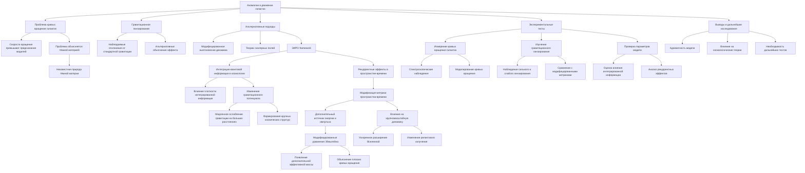
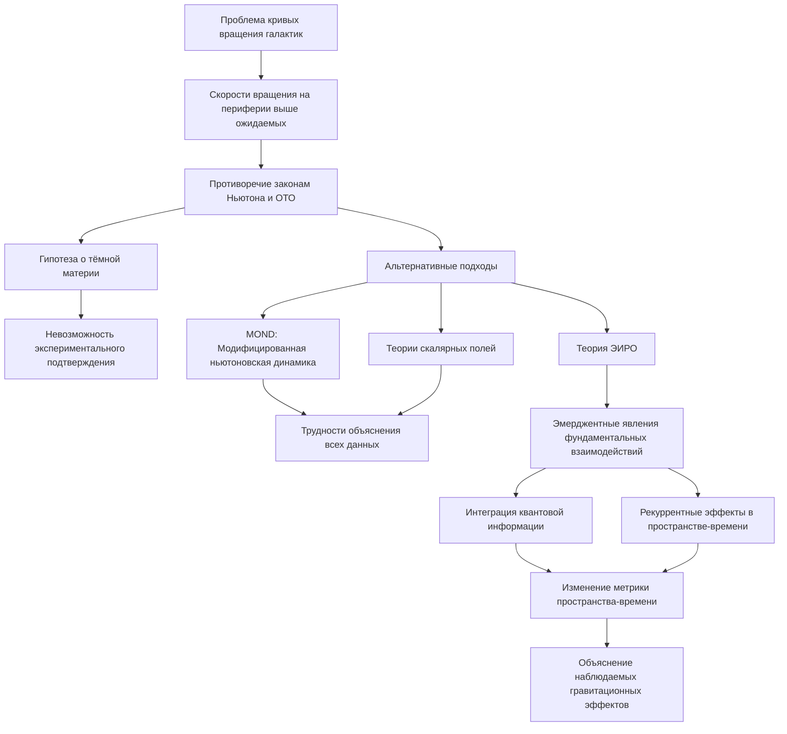
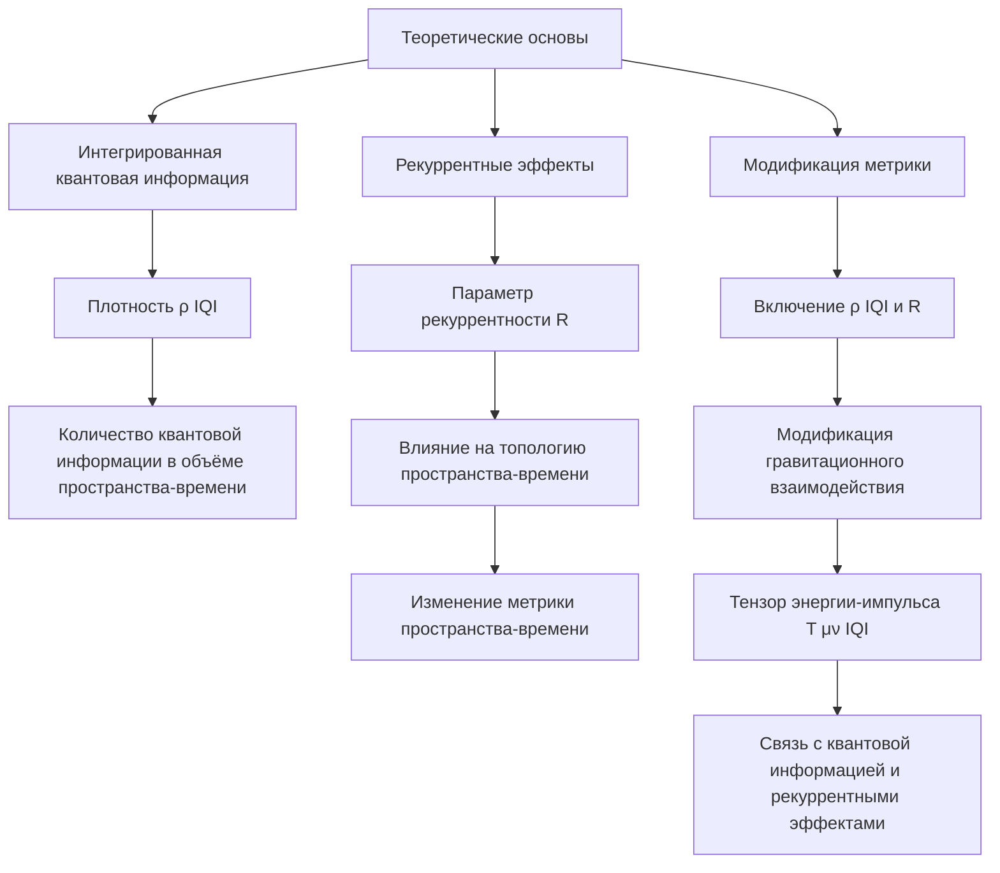
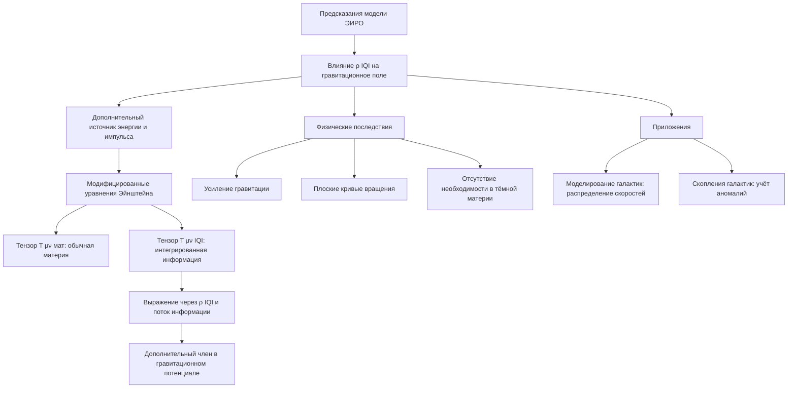
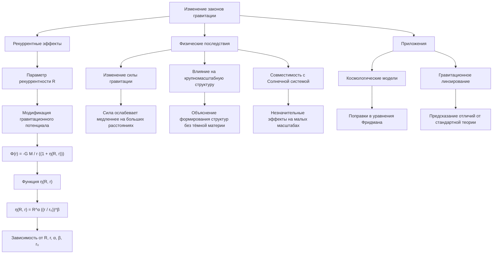
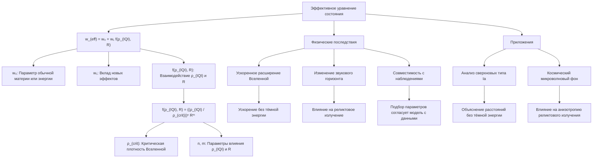
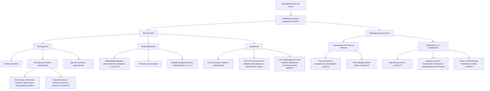

# Измерение аномалий в движении галактик через призму ЭИРО и новой модели Вселенной

---

## Аннотация

Аномалии в кривых вращения галактик и наблюдения гравитационного линзирования ставят современные модели космологии перед серьезными вызовами. Традиционное введение тёмной материи объясняет эти явления, но её природа остаётся неизвестной. В данной работе рассматривается альтернативный подход с использованием Теории Эмергентной Интеграции и Рекуррентного Отображения (ЭИРО) в контексте новой модели Вселенной. Предполагается, что интеграция квантовой информации и рекуррентные эффекты на масштабах галактик могут модифицировать метрику пространства-времени, что приводит к наблюдаемым аномалиям без необходимости тёмной материи. Приводятся предсказания модели и обсуждаются возможные экспериментальные тесты.

### 1. Введение

#### 1.1. Проблема кривых вращения галактик

Наблюдения показывают, что скорости вращения звёзд на периферии галактик существенно выше, чем предсказывают законы Ньютона и общей теории относительности, если учитывать только видимую массу. Это противоречие обычно объясняется наличием тёмной материи — невидимой субстанции, составляющей большую часть массы галактик. Однако, несмотря на многочисленные попытки, тёмная материя остаётся неоткрытой в экспериментах, что стимулирует поиск альтернативных объяснений.

#### 1.2. Альтернативные подходы

Существуют различные модификации гравитационных теорий, такие как MOND (Modified Newtonian Dynamics) и теории скалярных полей, пытающиеся объяснить аномалии без введения тёмной материи. Однако эти подходы сталкиваются с трудностями в объяснении всех наблюдательных данных.

#### 1.3. Теория Эмергентной Интеграции и Рекуррентного Отображения (ЭИРО)

ЭИРО предлагает рассматривать фундаментальные взаимодействия как эмерджентные явления, возникающие из процессов интеграции квантовой информации и рекуррентных эффектов в пространстве-времени. На больших масштабах эти процессы могут влиять на метрику пространства-времени, приводя к наблюдаемым гравитационным эффектам.

### 2. Теоретические основы

#### 2.1. Интегрированная квантовая информация в космологии

Плотность интегрированной квантовой информации (ρIQI) характеризует количество квантовой информации, интегрированной в единице объёма пространства-времени:

`ρ_(IQI) = lim(Δ V → 0) Δ I / Δ V,`

где ΔI — изменение интегрированной информации в объёме ΔV.

#### 2.2. Рекуррентные эффекты в пространстве-времени

Параметр рекуррентности (R) описывает степень рекуррентных взаимодействий квантовых состояний в пространственно-временном континууме. Рекуррентность может влиять на локальную топологию пространства-времени, изменяя его метрику.

#### 2.3. Модификация метрики пространства-времени

**Включение ρIQI и R в метрику пространства-времени приводит к модификации гравитационного взаимодействия**:

`G_(μν) + Λ g_(μν) = 8π G (( T_(μν) + T_(μν)^(IQI) )),`

где TμνIQI — тензор энергии-импульса, связанный с интегрированной квантовой информацией и рекуррентными эффектами.

### 3. Предсказания модели

#### 3.1. Влияние интегрированной информации на гравитационное поле

В рамках теории Эмергентной Интеграции и Рекуррентного Отображения (ЭИРО) интегрированная квантовая информация (ρIQI) рассматривается как дополнительный источник энергии и импульса, влияющий на гравитационное поле. Это означает, что в уравнениях Эйнштейна появляется дополнительный тензор энергии-импульса, связанный с ρIQI.

##### 3.1.1. Математическое обоснование

**Модифицированные уравнения Эйнштейна принимают вид**:

`G_(μν) + Λ g_(μν) = 8π G (( T_(μν)^мат + T_(μν)^(IQI) )),`

где:

- T_(μν)^\textмат  — тензор энергии-импульса обычной материи.

- T_(μν)^(IQI)  — тензор энергии-импульса интегрированной квантовой информации.

Тензор  T_(μν)^(IQI)  может быть выражен через плотность ρIQI и соответствующий поток информации. Это приводит к дополнительному члену в гравитационном потенциале, аналогичному эффекту от присутствия дополнительной массы.

##### 3.1.2. Физические последствия

- **Усиление гравитации**: Дополнительный вклад ρIQI усиливает гравитационное притяжение на больших масштабах.

- **Плоские кривые вращения**: Возникает эффект, при котором скорости вращения звёзд на периферии галактик остаются постоянными, что соответствует наблюдениям.

- **Отсутствие необходимости в тёмной материи**: Появление дополнительной "эффективной" массы объясняет динамику галактик без введения невидимой материи.

##### 3.1.3. Приложения

- **Моделирование галактик**: Включение ρIQI в модели позволяет точно описать распределение скоростей звёзд и газа.

- **Скопления галактик**: Аналогичные эффекты могут быть учтены при рассмотрении динамики скоплений, где также наблюдаются аномалии.

#### 3.2. Изменение законов гравитации через рекуррентные эффекты

Рекуррентные эффекты, характеризуемые параметром рекуррентности R, приводят к модификации гравитационных взаимодействий на больших космологических масштабах.

##### 3.2.1. Математическое обоснование

**Гравитационный потенциал модифицируется следующим образом**:

`Φ(r) = -G M / r (( 1 + η(R, r) )),`

где:

- η(R, r)  — функция, зависящая от R и расстояния r.

- M — масса гравитирующего объекта.

**Функция  η(R, r)  может быть определена через рекуррентное взаимодействие квантовых состояний**:

`η(R, r) = R^\alpha (( r / r₀ ))^\beta,`

где  α  и  β  — константы, а  r₀  — характерное масштабное расстояние.

##### 3.2.2. Физические последствия

- **Изменение силы гравитации**: На больших расстояниях сила гравитации ослабевает медленнее, чем предсказывает закон обратных квадратов.

- **Влияние на крупномасштабную структуру**: Может объяснить формирование больших структур во Вселенной без тёмной материи.

- **Совместимость с Солнечной системой**: На малых масштабах (в пределах Солнечной системы) эффекты рекуррентности незначительны, что соответствует наблюдениям.

##### 3.2.3. Приложения

- **Космологические модели**: Внесение поправок в уравнения Фридмана для учёта модифицированной гравитации.

- **Гравитационное линзирование**: Предсказание эффектов, отличающихся от стандартной теории гравитации.

#### 3.3. Эффективное уравнение состояния

Для описания космологической динамики с учётом ρIQI и R вводится эффективное уравнение состояния:

`w_(eff) = w₀ + w₁ f(ρ_(IQI), R),`

где:

- w₀  — параметр уравнения состояния обычной материи или энергии (например, 0 для пыли,  ⅓  для излучения).

- w₁  — параметр, контролирующий вклад новых эффектов.

- f(ρ_(IQI), R)  — функция, описывающая взаимодействие между ρIQI и R.

##### 3.3.1. Возможные формы функции f

Функция f может быть задана как:

`f(ρ_(IQI), R) = (( ρ₍IQI) / ρ₍cr)}} ))ⁿ Rᵐ,`

где:

- ρ_(crit)  — критическая плотность Вселенной.

- n и m — параметры модели, определяющие степень влияния ρIQI и R.

##### 3.3.2. Физические последствия

- **Ускоренное расширение Вселенной**: При определённых значениях n и m модель может приводить к ускоренному расширению без введения тёмной энергии.

- **Изменение звукового горизонта**: Влияет на параметры реликтового излучения и крупномасштабной структуры.

- **Совместимость с наблюдениями**: Подбор параметров позволяет согласовать модель с текущими космологическими данными.

##### 3.3.3. Приложения

- **Анализ сверхновых типа Ia**: Модель может объяснить наблюдаемое расстояние до сверхновых без тёмной энергии.

- **Космический микроволновый фон**: Влияние на анизотропию реликтового излучения и положение пиков в спектре.

### 4. Экспериментальные тесты

#### 4.1. Измерение кривых вращения галактик

##### 4.1.1. Методология

**Сбор данных**

- **Выбор объектов**: Составление выборки галактик разного морфологического типа и массы.

- **Спектроскопические наблюдения**:

  - **Оптические телескопы**: Измерение скоростей звёзд через доплеровские сдвиги спектральных линий.

  - **Радиотелескопы**: Изучение вращения газовых облаков по эмиссии в линиях HI (21 см).

- **Данные высокого разрешения**: Использование современных приборов для уменьшения ошибок измерений.

**Моделирование**

- **Модифицированные динамические уравнения**: Включение в уравнения движения дополнительных членов, связанных с ρIQI и R.

- **Численные симуляции**: Применение компьютерного моделирования для расчёта ожидаемых кривых вращения.

- **Параметризация модели**: Определение значений параметров  α ,  β , n и m, оптимальных для каждой галактики.

**Сравнение**

- **Сопоставление теории и наблюдений**: Построение графиков наблюдаемых и предсказанных скоростей вращения.

- **Статистический анализ**: Использование методов наименьших квадратов, байесовского вывода для оценки согласия модели с данными.

- **Учет неопределённостей**: Оценка влияния ошибок измерений и систематических эффектов.

##### 4.1.2. Ожидаемые результаты

**Совпадение без тёмной материи**

- **Воспроизведение плоских кривых**: Модель ЭИРО прогнозирует постоянную скорость вращения на периферии галактик.

- **Объяснение разнообразия кривых**: Возможность описания различных форм кривых вращения разных галактик.

Зависимость от параметров

- **Чувствительность к ρIQI и R**: Анализ, как изменения этих параметров влияют на предсказания модели.

- **Универсальность параметров**: Выявление, существуют ли универсальные значения параметров для всех галактик или необходим индивидуальный подбор.

- **Связь с физическими характеристиками**: Изучение, как параметры модели коррелируют с массой, размером и другими свойствами галактик.

#### 4.2. Гравитационное линзирование

```mermaid
graph TD
    A[Экспериментальные тесты] --> B[Гравитационное линзирование]
    B --> C[Методология]
    C --> D[Наблюдение]
    D --> E[Сбор данных]
    E --> F[Космические телескопы: Hubble, James Webb]
    E --> G[Наземные обсерватории: LSST]
    D --> H[Выявление эффектов линзирования]
    H --> I[Сильное линзирование: Множественные изображения, дуги]
    H --> J[Слабое линзирование: Искажения формы галактик]
    D --> K[Каталоги линзирующих систем]
    C --> L[Моделирование метрики]
    L --> M["Модифицированная метрика с ρ_(IQI) и R"]
    M --> N[Профиль массы: Видимая материя и коррекция от ЭИРО]
    L --> O[Рай-трассинг]
    O --> P[Численные методы: Прослеживание лучей]
    O --> Q[Параметрический подход: Подбор параметров модели]
    C --> R[Анализ]
    R --> S[Сравнение моделей с данными]
    S --> T[Позиции искажённых изображений]
    S --> U[Степень искажения: Форма и интенсивность]
    R --> V[Статистическая значимость]
    V --> W[Оценка вероятности соответствия модели]
    V --> X[Контроль систематических ошибок]
    B --> Y[Ожидаемые результаты]
    Y --> Z[Объяснение эффекта]
    Z --> AA[Соответствие без тёмной материи]
    Z --> AB[Воспроизведение сильного и слабого линзирования]
    Y --> AC[Проверка параметров]
    AC --> AD["Оценка ρ_(IQI) и R"]
    AD --> AE[Подбор значений для наилучшего соответствия]
    AD --> AF[Сравнение с кривыми вращения]
    AC --> AG[Прогнозирование эффектов]
    AG --> AH[Новые наблюдения: Предсказание эффектов]
    AG --> AI[Тестирование предсказаний: Проверка точности]
```

##### 4.2.1. Методология

**Наблюдение**

- **Сбор данных**:

  - **Космические телескопы**: Hubble, James Webb для высокоточных изображений.

  - **Наземные обсерватории**: Большие обзоры неба (например, LSST) для статистического анализа.

- **Выявление эффектов линзирования**:

  - **Сильное линзирование**: Множественные изображения, дуги.

  - **Слабое линзирование**: Искажения формы большого числа галактик.

- **Каталоги линзирующих систем**: Использование существующих и создание новых для большего охвата данных.

**Моделирование метрики**

- **Модифицированная метрика пространства-времени**:

  - **Включение ρIQI и R**: Расчёт метрики с учётом дополнительных членов.

  - **Профиль массы**: Построение моделей распределения массы, основанных на видимой материи и коррекции от ЭИРО.

- **Рай-трассинг (прослеживание лучей)**:

  - **Численные методы**: Использование программного обеспечения для моделирования прохождения света через модифицированное пространство-время.

  - **Параметрический подход**: Подбор параметров модели для наилучшего соответствия наблюдениям.

**Анализ**

- **Сравнение моделей с данными**:

  - **Позиции искажённых изображений**: Проверка соответствия предсказанных и наблюдаемых положений.

  - **Степень искажения**: Анализ формы и интенсивности искажений.

- **Статистическая значимость**:

  - **Оценка вероятности**: Использование статистических методов для оценки, насколько хорошо модель объясняет данные.

  - **Контроль систематических ошибок**: Учёт возможных источников ошибок и их влияние на результаты.

##### 4.2.2. Ожидаемые результаты

**Объяснение эффекта**

- **Соответствие без тёмной материи**: Модель ЭИРО должна предсказывать наблюдаемые эффекты линзирования исключительно на основе видимой массы и влияния ρIQI и R.

- **Воспроизведение сильного и слабого линзирования**: Способность модели объяснять широкий спектр наблюдаемых явлений.

**Проверка параметров**

- **Оценка ρIQI и R**:

  - **Подбор значений**: Определение параметров, при которых модель наиболее точно соответствует данным.

  - **Сравнение с кривыми вращения**: Проверка согласованности параметров, полученных из разных наблюдений.

- **Прогнозирование эффектов**:

  - **Новые наблюдения**: Использование модели для предсказания эффектов в ещё не изученных системах.

  - **Тестирование предсказаний**: Проведение дальнейших наблюдений для проверки точности модели.

---

Таким образом, детальное рассмотрение предсказаний модели ЭИРО и предложенных экспериментальных тестов позволяет оценить её жизнеспособность и потенциал в объяснении аномалий в движении галактик и гравитационном линзировании. Применение этой модели может привести к значительным сдвигам в нашем понимании гравитации и крупномасштабной структуры Вселенной, предлагая альтернативу концепции тёмной материи.

---

### 5. Обсуждение результатов

#### 5.1. Адекватность модели

- **Согласование с наблюдениями**: Если модель ЭИРО успешно описывает аномалии, это подтверждает её состоятельность.

- **Отсутствие необходимости в тёмной материи**: Объяснение эффектов без привлечения гипотетических частиц.

#### 5.2. Влияние на космологические модели

- **Пересмотр фундаментальных взаимодействий**: Необходимость переосмысления природы гравитации.

- **Новое понимание структуры Вселенной**: Роль квантовой информации и рекуррентности в формировании космических структур.

#### 5.3. Ограничения и дальнейшие исследования

- **Точность измерений**: Требуются высокоточные данные для проверки модели.

- **Универсальность**: Проверка применимости модели к различным космическим объектам и масштабам.

### 6. Заключение

Предложенный подход на основе ЭИРО и новой модели Вселенной предоставляет альтернативное объяснение аномалий в движении галактик. Интеграция квантовой информации и рекуррентные эффекты могут модифицировать метрику пространства-времени, влияя на гравитационное взаимодействие. Это открывает новые горизонты в понимании фундаментальных процессов во Вселенной и стимулирует развитие теорий, выходящих за рамки существующих научных парадигм. Необходимы дальнейшие исследования и экспериментальные тесты для подтверждения или опровержения данной модели.

### 7. Литература

1. Рубин В. К., Форд К. У. — Наблюдения кривых вращения галактик и проблема скрытой массы.

2. Мильгром М. — Модифицированная ньютоновская динамика и её применение к астрономическим объектам.

3. Тегмарк М. — Роль квантовой информации в космологии.

4. Новые исследования в области интегрированной квантовой информации и рекуррентности в астрофизике.

---

*Примечание: Данная работа является теоретическим исследованием и требует дальнейшей экспериментальной проверки. Представленные идеи носят гипотетический характер и направлены на стимулирование обсуждения и развития новых направлений в науке.*

---

Оглавление: 
- [ЭИРО framework](/README.md)
- [Новая модель вселенной в современной физике](/A-new-model-of-the-universe-in-modern-physics.md)

