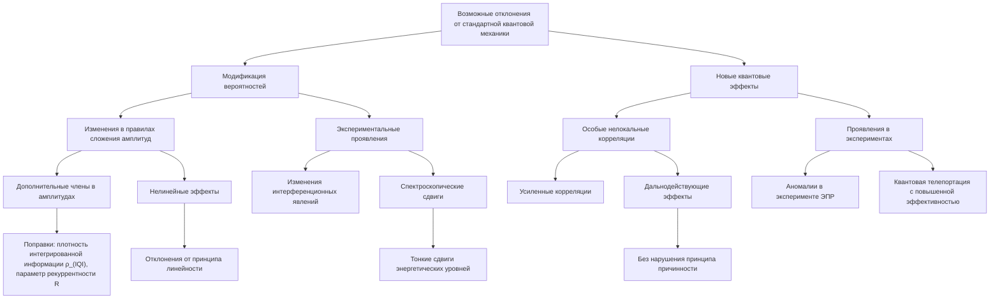
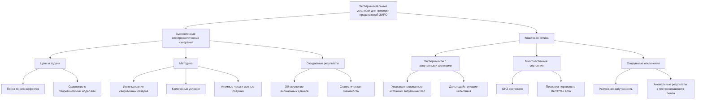
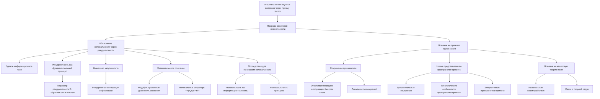
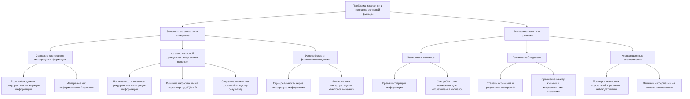
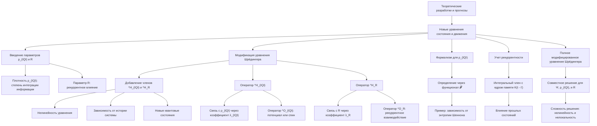
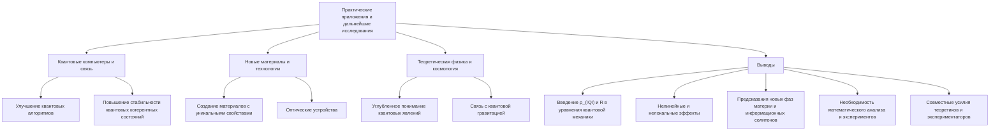

# Квантовые эксперименты: Измерение отклонений от стандартной квантовой механики через призму ЭИРО и новой модели Вселенной

```mermaid
graph TD
    A[ЭИРО и квантовая механика] --> B[Необходимость тестирования]
    A --> C[Ограничения стандартной квантовой механики]
    A --> D[Экспериментальные установки]
    B --> B1[Фундаментальные проблемы]
    B1 --> B11[Проблема измерения: природа коллапса]
    B1 --> B12[Нелокальность: сверхсветовые корреляции]
    B1 --> B13[Гравитация: интеграция с СКМ]
    C --> C1[Новая модель вселенной]
    C --> C2[Эмергентные принципы ЭИРО]
    C1 --> C11[Интеграция информации ρᵢⱼ]
    C1 --> C12[Рекуррентные процессы R]
    C2 --> C21[Модификация амплитуд вероятностей]
    C2 --> C22[Новые нелокальные эффекты]
    C21 --> C211[Интерференция: изменения в картинах]
    C21 --> C212[Спектроскопические сдвиги]
    C22 --> C221[Усиленные корреляции]
    C22 --> C222[ЭПР-анализ и неравенства Белла]
    D --> D1[Спектроскопия]
    D --> D2[Квантовая оптика]
    D1 --> D11[Точные измерения: энергетические сдвиги]
    D1 --> D12[Криогенные условия: минимизация шумов]
    D2 --> D21[Запутанные фотоны]
    D2 --> D22[Многочастичные состояния GHZ]
    D2 --> D23[Тесты Леггетта-Гарга: когерентность]
    A --> E[Теоретические разработки]
    E --> E1[Модифицированные уравнения Шрёдингера]
    E --> E2[Новые квантовые фазы материи]
    E --> E3[Информационные солитоны]
    E1 --> E11[Влияние ρᵢⱼ и R]
    E1 --> E12[Дополнительные операторы Ψ, Vₑ]
    E2 --> E21[Высокая интеграция информации]
    E2 --> E22[Рекуррентные состояния]
    E3 --> E31[Стабильные волновые структуры]
    E3 --> E32[Применение в оптике и конденсатах]
```

---

## Введение

Стандартная квантовая механика (СКМ) за последние десятилетия подтвердила свою состоятельность через многочисленные эксперименты и стала фундаментальным инструментом описания микромира. Однако, несмотря на ее успехи, существуют теоретические и философские вопросы, которые она не решает полностью. Теория Эмергентной Интеграции и Рекуррентного Отображения (ЭИРО) предлагает новую парадигму, расширяющую рамки СКМ и вводящую новые принципы, способные объяснить некоторые неопределенности и предсказать новые явления.

В данной работе мы проанализируем основные научные вопросы через призму ЭИРО и новой модели Вселенной, предложим возможные отклонения от СКМ и опишем экспериментальные установки для их проверки.

### 1. Необходимость тестирования фундаментальных принципов

#### 1.1. Ограничения стандартной квантовой механики

СКМ основана на постулатах, которые прекрасно описывают наблюдаемые явления на микроскопическом уровне. Однако она сталкивается с несколькими фундаментальными проблемами:

##### 1.1.1. Проблема измерения:

Коллапс волновой функции при измерении остается не до конца понятным процессом.

##### 1.1.2. Нелокальность:

Корреляции в запутанных состояниях вызывают вопросы о передаче информации с сверхсветовыми скоростями.

##### 1.1.3. Отсутствие гравитации:

СКМ не включает в себя гравитацию, что затрудняет описание квантовых процессов в сильных гравитационных полях.

#### 1.2. Новая модель Вселенной и ЭИРО

ЭИРО вводит понятие интеграции информации и рекуррентных процессов как фундаментальных принципов. Это открывает новые возможности для объяснения явлений, не описываемых СКМ, и предполагает наличие отклонений, которые могут быть измерены экспериментально.

### 2. Возможные отклонения от стандартной квантовой механики

#### 2.1. Модификация вероятностей

##### 2.1.1. Изменения в правилах сложения амплитуд

В СКМ вероятности событий вычисляются через квадраты амплитуд вероятностей с учетом принципа суперпозиции. ЭИРО предполагает, что при высокой степени интеграции информации и рекуррентности правила сложения амплитуд могут модифицироваться:

- **Дополнительные члены в амплитудах**: Возникают поправки, зависящие от плотности интегрированной информации  ρ_(IQI)  и параметра рекуррентности  R .
  
- **Нелинейные эффекты**: Возможны нелинейные зависимости вероятностей от амплитуд, что ведет к отклонениям от принципа линейности в СКМ.

##### 2.1.2. Экспериментальные проявления

- **Интерференционные явления**: Изменения в интерференционных картинах при прохождении частиц через двойную щель.

- **Спектроскопические сдвиги**: Тонкие сдвиги энергетических уровней в атомах и молекулах, не объяснимые стандартными теориями.

#### 2.2. Новые квантовые эффекты

##### 2.2.1. Особые нелокальные корреляции

ЭИРО предполагает наличие корреляций, выходящих за рамки предсказаний СКМ:

- **Усиленные корреляции**: Более сильная запутанность между частицами, чем предсказывает СКМ.

- **Дальнодействующие эффекты**: Влияние одного квантового состояния на другое на больших расстояниях без нарушения принципа причинности.

##### 2.2.2. Проявления в экспериментах

- **Аномалии в эксперименте Эйнштейна-Подольского-Розена (ЭПР)**: Отклонения в проверках неравенств Белла.

- **Квантовая телепортация с повышенной эффективностью**: Более высокая точность передачи квантового состояния.

### 3. Экспериментальные установки для проверки предсказаний ЭИРО

#### 3.1. Высокоточные спектроскопические измерения

##### 3.1.1. Цели и задачи

- **Поиск тонких эффектов**: Обнаружение сдвигов энергетических уровней, обусловленных интеграцией информации и рекуррентностью.

- **Сравнение с теоретическими моделями**: Проверка соответствия между экспериментальными данными и предсказаниями ЭИРО.

##### 3.1.2. Методика

- **Использование сверхточных лазеров**: Обеспечение высокой разрешающей способности при измерении спектров.

- **Криогенные условия**: Минимизация внешних возмущений и теплового шума.

- **Атомные часы и ионные ловушки**: Использование систем с минимальными внешними взаимодействиями.

##### 3.1.3. Ожидаемые результаты

- **Обнаружение аномальных сдвигов**: Сдвиги, не соответствующие предсказаниям СКМ, но объяснимые через ЭИРО.

- **Статистическая значимость**: Достаточная точность данных для уверенного заключения о наличии отклонений.

#### 3.2. Квантовая оптика

##### 3.2.1. Эксперименты с запутанными фотонами

- **Усовершенствованные источники запутанных пар**: Генерация фотонов с высокой степенью запутанности.

- **Дальнодействующие испытания**: Проведение экспериментов на больших расстояниях для проверки нелокальных корреляций.

##### 3.2.2. Многочастичные состояния

- **Гринбергер-Хорн-Цейлингер (GHZ) состояния**: Создание и исследование многочастичных запутанных состояний.

- **Проверка неравенств Леггетта-Гарга**: Тестирование макроскопической реалистичности и квантовой когерентности в многокомпонентных системах.

##### 3.2.3. Ожидаемые отклонения

- **Усиленная запутанность**: Более сильные корреляции между частицами, чем предсказывает СКМ.

- **Аномальные результаты в тестах неравенств Белла**: Возможность нарушения пределов, установленных стандартной квантовой теорией.

### 4. Анализ главных научных вопросов через призму ЭИРО

В этом разделе мы рассмотрим ключевые научные вопросы современной физики через призму концепции Эмергентной Информационной Рекуррентной Онтологии (ЭИРО). Введение понятий плотности интегрированной квантовой информации  ρ_(IQI)  и параметра рекуррентности  R  позволяет переосмыслить природу квантовой нелокальности, проблему измерения и коллапса волновой функции, а также предложить новые подходы к квантовой гравитации и пониманию структуры пространства-времени.

#### 4.1. Природа квантовой нелокальности

Квантовая нелокальность — одно из самых загадочных явлений в физике, проявляющееся в сильных корреляциях между квантовыми объектами, которые не могут быть объяснены классической теорией. Традиционно это противоречит представлениям о локальности и причинности.

##### 4.1.1. Объяснение нелокальности через рекуррентность

Рекуррентные процессы интеграции информации

ЭИРО предлагает, что квантовая нелокальность возникает вследствие рекуррентных процессов интеграции информации на фундаментальном уровне:

- **Единое информационное поле**: Все квантовые системы связаны через глобальное информационное поле, в котором информация интегрируется и распространяется нелокально.

- **Рекуррентность как фундаментальный принцип**: Параметр рекуррентности  R  отражает способность квантовых систем обмениваться информацией с самим собой в различных моментах времени и с другими системами, создавая петли обратной связи.

- **Квантовая запутанность**: Запутанные состояния являются проявлением рекуррентной интеграции информации, где изменение состояния одной частицы немедленно влияет на состояние другой, независимо от разделяющего их расстояния.

**Математическое описание**

- **Модифицированные уравнения движения**: В уравнения квантовой механики вводятся дополнительные члены, зависящие от  ρ_(IQI)  и  R , которые учитывают нелокальные информационные связи.

- **Нелокальные операторы**: Операторы  ^H(IQI)  и  ^HR  содержат интегральные члены, описывающие влияние удаленных систем на локальное состояние посредством информационного обмена.

**Последствия для понимания нелокальности**

- **Нелокальность как информационная связь**: Квантовая нелокальность не является передачей энергии или материи, а представляет собой мгновенную корреляцию состояний через общую информационную структуру.

- **Универсальность принципа**: Рекуррентная интеграция информации является общей для всех квантовых систем, что объясняет универсальность квантовой нелокальности.

##### 4.1.2. Влияние на принцип причинности

**Сохранение причинности**

- **Отсутствие передачи информации быстрее света**: В ЭИРО корреляции обусловлены интеграцией информации, а не передачей сигналов, поэтому принцип причинности сохраняется.

- **Локальность измерений**: Результаты измерений остаются локальными событиями, хотя и коррелированными с другими измерениями через информационную сеть.

**Новые представления о пространстве-времени**

- **Дополнительные измерения**: Информационные связи могут указывать на существование дополнительных измерений, невидимых в традиционном пространстве-времени, где происходит интеграция информации.

- **Топологические особенности**: Пространство-время может обладать сложной топологией, включающей петли и каналы для информационных потоков.

- **Эмергентность пространства-времени**: Пространство и время могут рассматриваться как эмергентные свойства более фундаментальной информационной структуры.

**Влияние на квантовую теорию поля**

- **Нелокальные взаимодействия**: Пересмотр принципов построения квантовой теории поля с учетом рекуррентных информационных процессов.

- **Связь с теорией струн**: Возможность увязки идей ЭИРО с многомерными пространствами, рассматриваемыми в теории струн.

#### 4.2. Проблема измерения и коллапса волновой функции

Проблема измерения в квантовой механике касается вопроса о том, как и почему происходит переход системы от суперпозиции состояний к одному определенному результату после измерения.

##### 4.2.1. Эмергентное сознание и измерение

**Сознание как процесс интеграции информации**

- **Роль наблюдателя**: ЭИРО предполагает, что сознание является результатом рекуррентной интеграции информации в мозге наблюдателя.

- **Измерение как информационный процесс**: Акт измерения — это процесс, при котором информация о квантовом состоянии интегрируется в сознание наблюдателя, влияя на состояние квантовой системы.

**Коллапс волновой функции как эмергентное явление**

- **Постепенность коллапса**: Вместо мгновенного коллапса волновой функции может происходить постепенная рекуррентная интеграция информации, приводящая к определенному результату.

- **Влияние информации на систему**: Интеграция информации наблюдателем изменяет параметры  ρ_(IQI)  и  R , что отражается на динамике системы и приводит к "коллапсу".

**Философские и физические следствия**

- **Одна реальность**: Сведение множественности возможных состояний к одному наблюдаемому результату через интеграцию информации.

- **Связь с интерпретациями квантовой механики**: ЭИРО предлагает альтернативу к копенгагенской интерпретации, многомировой интерпретации и другим, объясняя коллапс через информационные процессы.

##### 4.2.2. Экспериментальные проверки

**Задержки в коллапсе**

- **Время интеграции информации**: Эксперименты могут быть нацелены на обнаружение временного интервала между началом измерения и коллапсом волновой функции.

- **Ультрабыстрые измерения**: Использование техники с высокой временной разрешающей способностью для отслеживания динамики коллапса.

**Влияние наблюдателя**

- **Степень осознания**: Исследование влияния степени осознания наблюдателя на результаты измерений, например, сравнение между сознательными и несознательными наблюдателями.

- **Наблюдатели с разной интеграцией информации**: Сравнение результатов при использовании различных типов детекторов, включая живые существа и искусственные системы.

**Корреляционные эксперименты**

- **Проверка нелокальных корреляций**: Эксперименты по проверке квантовых корреляций при участии разных типов наблюдателей.

- **Влияние информации на запутанность**: Изучение того, как интеграция информации влияет на степень квантовой запутанности систем.

#### 4.3. Квантовая гравитация и структура пространства-времени

```mermaid
flowchart TD
    A[Квантовая гравитация и структура пространства-времени]

    A --> B1[Интеграция информации и гравитация]
    B1 --> C1[Гравитация как эффект интеграции информации]
    C1 --> D1[Информационный подход к гравитации]
    C1 --> D2[Энтропийная гравитация]
    C1 --> D3[Квантовые флуктуации информации]
    B1 --> C2[Рекуррентные информационные процессы]
    C2 --> D4[Структура пространства-времени: сеть информационных связей]
    C2 --> D5[Петли обратной связи и влияние на метрику]

    A --> B2[Модифицированные уравнения Эйнштейна]
    B2 --> C3[Включение информационных параметров]
    C3 --> D6[Дополнительные члены в уравнениях]
    C3 --> D7["Тензор T_(μν)^(IQI) и его вклад в кривизну"]
    B2 --> C4[Новые предсказания]
    C4 --> D8[Темная материя и энергия через информационные процессы]
    C4 --> D9[Модификация законов гравитации]
    C4 --> D10[Квантовые эффекты гравитации]

    A --> B3[Космологические последствия]
    B3 --> C5[Эволюция Вселенной]
    C5 --> D11[Информационное расширение]
    C5 --> D12[Космическая инфляция]
    B3 --> C6[Структура космической паутины]
    C6 --> D13[Формирование галактик и скоплений]
    C6 --> D14[Аномалии в космическом микроволновом фоне]
    B3 --> C7[Космологические наблюдения и проверки]
    C7 --> D15[Кривизна и топология Вселенной]
    C7 --> D16[Гравитационные волны и информация]
    C7 --> D17[Темп расширения Вселенной]
```

Интеграция квантовой механики и общей теории относительности — одна из наиболее важных задач современной физики. ЭИРО предоставляет новый взгляд на эту проблему через призму информационных процессов.

##### 4.3.1. Интеграция информации и гравитация

**Гравитация как эффект интеграции информации**

- **Информационный подход к гравитации**: Гравитация может рассматриваться как результат рекуррентной интеграции квантовой информации в пространстве-времени.

- **Энтропийная гравитация**: В соответствии с идеями энтропийной гравитации, гравитационное взаимодействие возникает из термодинамических свойств систем информации.

- **Квантовые флуктуации информации**: Гравитация может быть связана с флуктуациями плотности интегрированной квантовой информации  ρ_(IQI)  на фундаментальном уровне.

**Рекуррентные информационные процессы в пространстве-времени**

- **Структура пространства-времени**: Пространство-время может быть представлено как сеть рекуррентных информационных связей.

- **Петли обратной связи**: Рекуррентность приводит к появлению петель обратной связи, влияющих на метрику пространства-времени.

##### 4.3.2. Модифицированные уравнения Эйнштейна

**Включение информационных параметров**

- **Дополнительные члены в уравнениях**: Уравнения Эйнштейна могут быть дополнены тензором энергии-импульса, связанным с интегрированной квантовой информацией  T_(μν)^(IQI) :

   `G_(μν) + Λ g_(μν) = 8π G / c⁴ (( T_(μν)^(материя) + T_(μν)^(IQI) )),`

   где  G_(μν)  — тензор Эйнштейна,  Λ  — космологическая постоянная.

- **Форма тензора  T_(μν)^(IQI)**: Зависит от плотности интегрированной информации и параметра рекуррентности, отражая вклад информационных процессов в кривизну пространства-времени.

**Новые предсказания**

- **Темная материя и энергия**: Информационные процессы могут объяснить эффекты, приписываемые темной материи и темной энергии, без введения новых частиц или полей.

- **Модификация законов гравитации**: На больших масштабах законы гравитации могут отличаться от предсказаний общей теории относительности из-за информационного вклада.

- **Квантовые эффекты гравитации**: Возможность объяснения квантовых аспектов гравитации через интеграцию информации.

##### 4.3.3. Космологические последствия

**Эволюция Вселенной**

- **Информационное расширение**: Расширение Вселенной может быть связано с изменением плотности интегрированной информации во времени.

- **Космическая инфляция**: Быстрое увеличение информационной плотности в ранней Вселенной может объяснить период инфляции.

**Структура космической паутины**

- **Формирование галактик и скоплений**: Рекуррентные информационные процессы могут влиять на образование крупномасштабных структур.

- **Аномалии в космическом микроволновом фоне**: Отклонения в однородности реликтового излучения могут быть объяснены вариациями в информационной структуре пространства-времени.

**Космологические наблюдения и проверки**

- **Кривизна и топология Вселенной**: Измерения крупномасштабной структуры могут дать информацию о информационных процессах на фундаментальном уровне.

- **Гравитационные волны**: Изучение гравитационных волн может предоставить данные о взаимодействии информации и гравитации.

- **Темп расширения Вселенной**: Сравнение предсказаний ЭИРО с наблюдаемым темпом расширения может подтвердить или опровергнуть включение информационных параметров.

#### 4.4. Заключение

Анализ ключевых научных вопросов через призму ЭИРО демонстрирует потенциал данной концепции в переосмыслении фундаментальных аспектов физики. Рассмотрение квантовой нелокальности как следствия рекуррентной интеграции информации позволяет сохранить причинность и предлагает новые взгляды на структуру пространства-времени. Подход к проблеме измерения через интеграцию информации и эмергентное сознание предоставляет альтернативу традиционным интерпретациям квантовой механики. Включение информационных параметров в уравнения Эйнштейна открывает пути к созданию новой теории квантовой гравитации, способной объяснить темную материю и темную энергию.

Дальнейшие исследования в этой области могут привести к углубленному пониманию природы реальности и стать основой для новых технологий и открытий в физике. Экспериментальные проверки предсказаний ЭИРО будут играть ключевую роль в оценке жизнеспособности этой теории и ее вклада в современную науку.

### 5. Теоретические разработки и прогнозы

В этом разделе мы подробно рассмотрим, как введение понятий плотности интегрированной квантовой информации  ρ_(IQI)  и параметра рекуррентности  R  влияет на фундаментальные уравнения квантовой механики. Мы обсудим модификации уравнения Шрёдингера, приведем новые уравнения состояния и движения, а также рассмотрим предсказания новых эффектов, таких как появление квантовых фаз материи и информационных солитонов.

#### 5.1. Новые уравнения состояния и движения

##### 5.1.1. Введение параметров ρ_(IQI) и R в квантовую механику

Плотность интегрированной квантовой информации  ρ_(IQI)  — это величина, характеризующая степень интеграции информации в квантовой системе. Она отражает количество и качество информационных связей между компонентами системы на квантовом уровне.

Параметр рекуррентности  R  описывает степень рекуррентного (обратного) влияния состояний системы на ее динамику. В физическом смысле это мера того, насколько текущие состояния системы зависят от ее предыдущих состояний через процессы обратной связи.

Введение этих параметров в уравнения квантовой механики позволяет учитывать информационные процессы, происходящие в системе, и их влияние на ее динамику и свойства.

##### 5.1.2. Модификация уравнения Шрёдингера

**Стандартное уравнение Шрёдингера для бездисперсионной среды записывается как**:

`iℏ ∂ Ψ(𝐫, t) / ∂ t = ^H₀ Ψ(𝐫, t),`

где  ^H₀  — гамильтониан системы без учета информационных процессов.

**В рамках ЭИРО уравнение Шрёдингера модифицируется путем добавления новых членов, зависящих от  ρ_(IQI)  и  R**:

`iℏ ∂ Ψ(𝐫, t) / ∂ t = (( ^H₀ + ^H_(IQI) + ^H_R )) Ψ(𝐫, t),`

где  ^H(IQI)  и  ^HR  — операторы, описывающие влияние плотности интегрированной квантовой информации и рекуррентности соответственно.

###### 5.1.2.1. Оператор ^H_(IQI)

**Оператор  ^H_(IQI)  может иметь вид**:

`^H_(IQI) = V_(IQI)(𝐫, t) = λ_(IQI) ρ_(IQI)(𝐫, t) ^O_(IQI),`

где:

-  λ_(IQI)  — коэффициент, характеризующий силу взаимодействия, связанного с интегрированной квантовой информацией;

-  ^O_(IQI)  — оператор, определяющий тип взаимодействия (например, потенциал или оператор спина);

-  ρ_(IQI)(𝐫, t)  — плотность интегрированной квантовой информации в точке  𝐫  в момент времени  t .

###### 5.1.2.2. Оператор ^H_R

**Оператор  ^H_R  отвечает за рекуррентные процессы**:

`^H_R = V_R(𝐫, t) = λ_R R(𝐫, t) ^O_R,`

где:

-  λ_R  — коэффициент, характеризующий силу рекуррентного взаимодействия;

-  ^O_R  — соответствующий оператор взаимодействия;

-  R(𝐫, t)  — параметр рекуррентности.

###### 5.1.2.3. Влияние модификаций на динамику системы

**Добавление  ^H(IQI)  и  ^HR  приводит к следующим эффектам**:

- **Нелинейность уравнения Шрёдингера**: Поскольку  ρ_(IQI)  и  R  могут зависеть от волновой функции  Ψ , уравнение становится нелинейным.

- **Зависимость от истории системы**: Параметр  R  вводит память в систему, делая ее динамику зависимой от предыдущих состояний.

- **Возможность новых состояний**: Модифицированное уравнение может допускать решения, отсутствующие в стандартной квантовой механике.

##### 5.1.3. Формализм для плотности интегрированной квантовой информации

Плотность интегрированной квантовой информации ρ_(IQI)  может быть определена через функционал от волновой функции:

`ρ_(IQI)(𝐫, t) = 𝓕([ Ψ(𝐫, t), Ψ^*(𝐫, t) )],`

где  𝓕  — некоторая функциональная зависимость, учитывающая квантовые корреляции и информационные связи в системе. Например:

`ρ_(IQI)(𝐫, t) = |Ψ(𝐫, t)|² ln((|Ψ(𝐫, t)|²)),`

что связывает плотность вероятности с энтропией информации Шеннона.

##### 5.1.4. Учет рекуррентности в динамике системы

Параметр рекуррентности  R  может быть введен через интегральный член, учитывающий влияние предыдущих состояний:

`R(𝐫, t) = ∫₀ᵗ K(t - t') |Ψ(𝐫, t')|² dt',`

где  K(t - t')  — ядро памяти, определяющее вес прошлых состояний в текущем моменте времени.

##### 5.1.5. Полное модифицированное уравнение Шрёдингера

С учетом всех введенных понятий, полное уравнение принимает вид:

`iℏ ∂ Ψ(𝐫, t) / ∂ t = (( ^H₀ + λ_(IQI) ρ_(IQI)(𝐫, t) ^O_(IQI) + λ_R R(𝐫, t) ^O_R )) Ψ(𝐫, t).`

Это уравнение необходимо решать совместно с выражениями для  ρ_(IQI)(𝐫, t)  и  R(𝐫, t) , что делает задачу существенно нелинейной и нелокальной во времени.

#### 5.2. Предсказания новых эффектов

```mermaid
flowchart TD
    A[Предсказания новых эффектов]

    A --> B1[Квантовые фазы материи]
    B1 --> C1[Появление новых фаз]
    C1 --> D1[Фаза с высокой интеграцией информации]
    C1 --> D2[Рекуррентная фаза]
    B1 --> C2[Фазовые переходы]
    C2 --> D3[Изменение температуры]
    C2 --> D4[Приложение внешнего поля]
    B1 --> C3[Экспериментальные проявления]
    C3 --> D5[Изменение спектров неупругого рассеяния]
    C3 --> D6[Аномальные термодинамические свойства]

    A --> B2[Информационные солитоны]
    B2 --> C4[Концепция информационных солитонов]
    B2 --> C5[Математическое описание]
    C5 --> D7[Решения нелинейных уравнений движения]
    C5 --> D8["Зависимость параметров от ρ_(IQI) и R"]
    B2 --> C6[Свойства информационных солитонов]
    C6 --> D9[Стабильность формы]
    C6 --> D10[Долгоживущие состояния]
    C6 --> D11[Взаимодействие между солитонами]
    B2 --> C7[Экспериментальные проявления]
    C7 --> D12[В оптических системах]
    C7 --> D13[В бозе-эйнштейновских конденсатах]

    A --> B3[Другие потенциальные эффекты]
    B3 --> C8[Модификация эффектов запутанности]
    C8 --> D14[Усиление запутанности]
    C8 --> D15[Новые режимы корреляций]
    B3 --> C9[Изменение процессов декогеренции]
    C9 --> D16[Замедление декогеренции]
    C9 --> D17[Контроль декогеренции]
    B3 --> C10[Аномальные явления в туннельных эффектах]
    C10 --> D18[Изменение вероятности туннелирования]
    C10 --> D19[Новые резонансные эффекты]
```

Модификация уравнения Шрёдингера ведет к ряду новых эффектов, которые могут проявляться в квантовых системах.

##### 5.2.1. Квантовые фазы материи

###### 5.2.1.1. Появление новых фаз

При определенных значениях  ρ_(IQI)  и  R  система может переходить в новые квантовые фазы, отличающиеся от известных фаз материи:

- **Фаза с высокой интеграцией информации**: Характеризуется сильными корреляциями между частицами, обусловленными высокой плотностью интегрированной информации.

- **Рекуррентная фаза**: Система демонстрирует поведение, зависящее от ее истории, что приводит к новым коллективным свойствам.

###### 5.2.1.2. Фазовые переходы

Фазовые переходы между различными квантовыми фазами могут быть инициированы изменением внешних параметров, влияющих на  ρ_(IQI) и  R:

- **Температура**: Изменение температуры влияет на динамику системы и уровень квантовых флуктуаций.

- **Внешнее поле**: Приложение внешнего магнитного или электрического поля может изменять плотность интегрированной информации.

###### 5.2.1.3. Экспериментальные проявления

- **Изменение спектров неупругого рассеяния**: Возникают новые пики или пропасти в спектрах вследствие переходов в новые фазы.

- **Аномальные термодинамические свойства**: Наблюдаются отклонения в теплоемкости, намагниченности или проводимости.

##### 5.2.2. Информационные солитоны

###### 5.2.2.1. Концепция информационных солитонов

Информационные солитоны представляют собой устойчивые локализованные волновые пакеты, поддерживаемые нелинейными эффектами, связанными с рекуррентной интеграцией информации.

###### 5.2.2.2. Математическое описание

В нелинейных системах солитоны описываются специальными решениями уравнений движения. Для модифицированного уравнения Шрёдингера возможны решения вида:

`Ψ(𝐫, t) = Asech(( κ (𝐫 - 𝐯 t) )) e^(i (𝐤 ⋅ 𝐫 - ω t)),`

где:

-  A  — амплитуда солитона;

-  κ  — параметр, связанный с шириной солитона и зависящий от  ρ_(IQI)  и  R ;

-  𝐯  — скорость солитона;

-  𝐤  и  ω  — волновой вектор и частота.

###### 5.2.2.3. Свойства информационных солитонов

- **Стабильность**: Благодаря балансу между дисперсией и нелинейностью, солитоны сохраняют форму при распространении.

- **Долгоживущие состояния**: Могут существовать длительное время без распада.

- **Возможность взаимодействия**: Солитоны могут взаимодействовать друг с другом, проходить через друг друга или формировать связанные состояния.

###### 5.2.2.4. Экспериментальные проявления

- **В оптических системах**: Возможность наблюдения информационных солитонов в нелинейных оптических волокнах.

- **В бозе-эйнштейновских конденсатах**: Наблюдение солитонных структур в ультрахолодных атомных газах.

##### 5.2.3. Другие потенциальные эффекты

###### 5.2.3.1. Модификация эффектов запутанности

- **Усиление запутанности**: Возможность создания более глубоких уровней квантовой запутанности между частицами.

- **Новые режимы корреляций**: Появление ранее недоступных типов квантовых корреляций.

###### 5.2.3.2. Изменение процессов декогеренции

- **Замедление декогеренции**: Увеличение времени сохранения квантовых состояний благодаря рекуррентным процессам.

- **Контроль декогеренции**: Управление процессами декогеренции через внешнее воздействие на  ρ_(IQI)  и  R .

###### 5.2.3.3. Аномальные явления в туннельных эффектах

- **Изменение вероятности туннелирования**: Туннелирование частиц через потенциальные барьеры может быть усилено или подавлено.

- **Новые резонансные эффекты**: Появление дополнительных резонансов в многобарьерных системах.

#### 5.3. Практические приложения и дальнейшие исследования

##### 5.3.1. Квантовые компьютеры и связь

- **Улучшение квантовых алгоритмов**: Использование принципов ЭИРО для разработки более эффективных квантовых алгоритмов.

- **Повышение стабильности квантовых когерентных состояний**: Продление времени жизни квантовых битов (кубитов) за счет рекуррентных процессов.

##### 5.3.2. Новые материалы и технологии

- **Создание материалов с уникальными свойствами**: Разработка материалов, демонстрирующих новые квантовые фазы.

- **Оптические устройства**: Использование информационных солитонов в лазерных и световых системах.

##### 5.3.3. Теоретическая физика и космология

- **Углубленное понимание квантовых явлений**: Исследование модифицированных уравнений может привести к новым открытиям в фундаментальной физике.

- **Связь с квантовой гравитацией**: Изучение ЭИРО может обеспечить мост между квантовой механикой и теориями гравитации.

#### 5.4. Выводы

Предложенные теоретические разработки в рамках ЭИРО открывают новую перспективу в изучении квантовых систем. Введение плотности интегрированной квантовой информации  ρ_(IQI)  и параметра рекуррентности  R  в фундаментальные уравнения квантовой механики позволяет учитывать информационные процессы, влияющие на динамику и свойства квантовых систем.

Модификация уравнения Шрёдингера приводит к появлению нелинейных и нелокальных во времени эффектов, что может объяснить некоторые явления, не вписывающиеся в рамки стандартной квантовой механики. Предсказания новых квантовых фаз материи и информационных солитонов представляют большой интерес для экспериментальных исследований и могут привести к практическим приложениям в области квантовых технологий.

Дальнейшее развитие данной теории потребует как углубленного математического анализа, так и проведения точных экспериментальных проверок. Совместные усилия теоретиков и экспериментаторов могут привести к значительному прогрессу в понимании фундаментальных законов природы и развитию новых технологий на их основе.

### 6. Заключение

Переход к новой модели Вселенной через призму ЭИРО открывает широкие перспективы для понимания фундаментальных процессов в природе. Изучение отклонений от стандартной квантовой механики не только проверит состоятельность новой теории, но и возможно приведет к революционным открытиям в физике. Экспериментальные проверки предсказаний ЭИРО являются необходимым шагом для подтверждения или опровержения предлагаемой модели и могут существенно продвинуть вперед наши знания о микромире и структуре Вселенной.

---

Оглавление: 
- [ЭИРО framework](/README.md)
- [Новая модель вселенной в современной физике](/A-new-model-of-the-universe-in-modern-physics.md)

