# Механизмы осознанного восприятия в контексте теории Эмергентной Интеграции и Рекуррентного Отображения (ЭИРО)

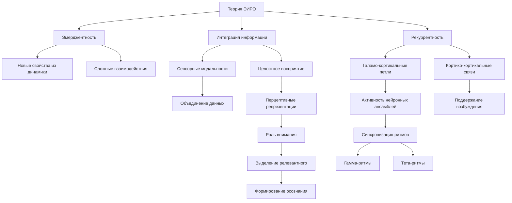

---


## Оглавление

1. Введение
   - 1.1. Актуальность исследования проблемы осознанного восприятия
   - 1.2. Цели и задачи диссертационной работы

2. Теоретические основы теории Эмергентной Интеграции и Рекуррентного Отображения (ЭИРО)
   - 2.1. Генезис и развитие теории ЭИРО
   - 2.2. Ключевые концепты и определения: эмерджентность, интеграция информации, рекуррентность
   - 2.3. Математический аппарат ЭИРО: метрика Φₑ, динамические системы, байесовские модели
   - 2.4. Нейробиологические основания теории: нейронные механизмы, коннектомика, критические состояния

3. Механизмы осознанного восприятия в контексте теории ЭИРО
   - 3.1. Структура перцептивного процесса
   - 3.2. Интеграция сенсорной информации
   - 3.3. Рекуррентные нейронные связи и их значение для осознания
   - 3.4. Временная динамика осознанного восприятия
   - 3.5. Роль внимания в осознанном восприятии

4. Эмергентная интеграция информации
   - 4.1. Принципы эмергентности в нейронных системах
   - 4.2. Уровни интеграции информации: от локальной к глобальной
   - 4.3. Механизмы синхронизации нейронных ансамблей
   - 4.4. Квантовые аспекты интеграции информации

5. Рекуррентное отображение и динамика нейронных сетей
   - 5.1. Математическая модель рекуррентности в нейронных сетях
   - 5.2. Временные паттерны активации и их роль в осознании
   - 5.3. Обратные связи и информационные каскады в нейронных сетях
   - 5.4. Нелинейная динамика и хаотические процессы

6. Самосознание и метакогнитивные процессы
   - 6.1. Формирование самосознания в контексте теории ЭИРО
   - 6.2. Метакогнитивная регуляция перцептивных процессов
   - 6.3. Рефлексивные механизмы и их нейронные корреляты
   - 6.4. Роль интроспекции и самонаблюдения в осознанном восприятии

7. Экспериментальные исследования механизмов осознанного восприятия
   - 7.1. Методологические подходы к изучению сознания
   - 7.2. Нейровизуализационные исследования: фМРТ, ЭЭГ, МЭГ
   - 7.3. Поведенческие эксперименты и их интерпретация
   - 7.4. Клинические наблюдения и их значение для теории ЭИРО

8. Практические приложения теории ЭИРО
   - 8.1. Применение в разработке искусственного интеллекта
   - 8.2. Использование в нейротехнологиях и интерфейсах "мозг-компьютер"
   - 8.3. Клиническая практика: диагностика и терапия нарушений сознания
   - 8.4. Образовательные технологии и развитие метакогнитивных навыков

9. Заключение
   - 9.1. Основные выводы и вклад диссертационной работы
   - 9.2. Перспективы развития теории ЭИРО
   - 9.3. Направления будущих исследований механизмов осознанного восприятия

10. Ключевые источники


---


### 1. Введение

#### 1.1. Актуальность исследования проблемы осознанного восприятия

Понимание механизмов, лежащих в основе осознанного восприятия, является одной из ключевых задач когнитивной нейронауки. Осознанное восприятие представляет собой сложный феномен, включающий интеграцию информации из различных сенсорных модальностей, формирование целостных перцептуальных репрезентаций и возникновение субъективного опыта. Несмотря на значительные успехи, достигнутые в области нейробиологии и когнитивной психологии, многие аспекты механизмов, лежащих в основе осознанного восприятия, остаются неясными.

Понимание нейронных процессов, обеспечивающих осознанное восприятие, имеет важное значение как для фундаментальной науки, так и для решения практических задач. Изучение этого феномена может пролить свет на природу сознания, а также способствовать разработке новых методов диагностики и терапии нарушений восприятия при различных неврологических и психических расстройствах. Кроме того, знание механизмов осознанного восприятия может быть применено в области искусственного интеллекта и нейротехнологий для создания более эффективных систем взаимодействия человека с машиной.

#### 1.2. Цели и задачи диссертационной работы

Основной целью данной диссертационной работы является разработка и валидация модели нейрокогнитивных механизмов, лежащих в основе осознанного восприятия, с использованием теории Эмергентной Интеграции и Рекуррентного Отображения (ЭИРО). Для достижения этой цели были поставлены следующие задачи:

1. Исследовать нейронные механизмы интеграции сенсорной информации, лежащие в основе формирования целостных перцептуальных репрезентаций.

2. Проанализировать роль рекуррентных взаимодействий в поддержании активности нейронных ансамблей и обеспечении непрерывности осознанного восприятия.

3. Изучить влияние временной динамики, включая ритмические процессы и предиктивное кодирование, на механизмы осознанного восприятия.

4. Исследовать роль внимания и рабочей памяти в селекции релевантной информации и формировании осознанного перцептивного опыта.

5. Рассмотреть нейронные корреляты метакогнитивных процессов, таких как самосознание и интроспекция, и их влияние на осознанное восприятие.

6. Интегрировать полученные теоретические и экспериментальные результаты для всестороннего понимания механизмов, лежащих в основе осознанного восприятия.

Достижение поставленных задач позволит расширить наши знания о нейрокогнитивных механизмах, ответственных за формирование осознанного перцептивного опыта, и открыть новые возможности для диагностики и терапевтического воздействия на нарушения восприятия.


### 2. Теоретические основы теории Эмергентной Интеграции и Рекуррентного Отображения (ЭИРО)

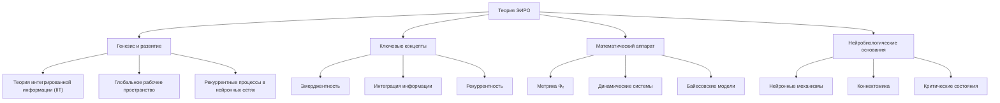

#### 2.1. Генезис и развитие теории ЭИРО

Теория Эмергентной Интеграции и Рекуррентного Отображения (ЭИРО) берет свое начало в работах ученых, исследующих природу сознания и когнитивных процессов. Ключевыми вехами в развитии теории ЭИРО являются:

1. Работы Джулио Тонони по Теории Интегрированной Информации (IIT), где он ввел понятие интегрированной информации Φ как меры сознания [1, 2].
2. Исследования Станисласа Деане и Жан-Пьера Шанжё, посвященные экспериментальным и теоретическим подходам к изучению сознательной обработки информации [3].
3. Труды Виктора Ламме, подчеркивающие важность рекуррентных процессов в нейронных сетях для формирования сознательного опыта [4].
4. Работы Аника Сета, направленные на разработку всеобъемлющей теории сознания [5].
5. Модель Глобального Рабочего Пространства Бернарда Баарса, объясняющая роль интеграции информации в сознательных процессах [6].

Синтез этих и других исследований привел к формированию теории Эмергентной Интеграции и Рекуррентного Отображения (ЭИРО), которая стремится предложить целостный подход к пониманию механизмов, лежащих в основе сознательного восприятия.

#### 2.2. Ключевые концепты и определения: эмерджентность, интеграция информации, рекуррентность

Теория ЭИРО базируется на следующих ключевых концептах:

**Эмерджентность**: Согласно ЭИРО, сознание является эмерджентным свойством, возникающим из сложных взаимодействий в нейронных сетях мозга. Эмерджентность подразумевает, что новые свойства или качества системы появляются в результате коллективной динамики, которые не могут быть предсказаны или объяснены только на основе свойств отдельных компонентов [13, 14].

**Интеграция информации**: Интеграция информации - процесс объединения различных сенсорных и когнитивных данных для формирования целостного восприятия мира. В нейронных сетях это достигается через сложные взаимодействия между нейронами, где каждый нейрон может получать входы от множества других нейронов и, в свою очередь, влиять на них [1, 2].

**Рекуррентность**: Рекуррентные связи и обратные связи играют ключевую роль в функциональной организации мозга. В отличие от прямых (feedforward) путей, рекуррентные связи позволяют информации возвращаться к предыдущим уровням обработки, создавая циклы активности [7, 8].

Эти концепты лежат в основе теории ЭИРО и определяют ее ключевые положения относительно механизмов, лежащих в основе сознательного восприятия.

#### 2.3. Математический аппарат ЭИРО: метрика Φₑ, динамические системы, байесовские модели

Теория ЭИРО опирается на математический аппарат, включающий:

**Метрика Φₑ (эмерджентная интегрированная информация)**: Ключевым параметром, характеризующим уровень сознательного опыта в рамках ЭИРО, является эмерджентная интегрированная информация Φₑ. Она объединяет количество информации, обрабатываемой системой, и степень ее интеграции благодаря рекуррентным связям [1, 2].

**Динамические системы**: Математическое моделирование рекуррентных нейронных сетей осуществляется с использованием уравнений состояния, описывающих нелинейную динамику взаимодействия нейронов, включая рекуррентные процессы [24, 25].

**Байесовские модели**: Теория ЭИРО также интегрирует байесовские подходы для моделирования механизмов предиктивного кодирования, где мозг рассматривается как иерархическая вероятностная система, обновляющая свои внутренние модели на основе ошибок предсказания [7, 8].

Применение этого математического аппарата позволяет исследовать, как динамика рекуррентных взаимодействий и процессы интеграции информации влияют на формирование сознательного опыта в рамках теории ЭИРО.

#### 2.4. Нейробиологические основания теории: нейронные механизмы, коннектомика, критические состояния

Теория ЭИРО опирается на обширные нейробиологические данные, включая:

**Нейронные механизмы**: Ключевую роль играют такие механизмы, как конвергенция сенсорных путей, мультисенсорная интеграция, топографическая организация связей и рекуррентные взаимодействия между различными областями мозга [9, 10, 11, 12].

**Коннектомика**: Исследования структурной и функциональной коннективности мозга, отображаемой в коннектоме, позволяют выявить ключевые области и связи, участвующие в процессах интеграции информации и рекуррентной обработки [12, 13].

**Критические состояния**: Согласно ЭИРО, нахождение нейронных сетей вблизи критических состояний, характеризующихся максимальной сложностью и разнообразием паттернов активности, способствует эмерджентным свойствам, таким как адаптивность и гибкость сознательного восприятия [13, 14].

Таким образом, теория ЭИРО опирается на глубокое понимание нейробиологических механизмов, коннектомики и динамики нелинейных систем, что позволяет всесторонне исследовать природу сознательного восприятия.


### 3. Механизмы осознанного восприятия в контексте теории ЭИРО

Согласно теории Эмергентной Интеграции и Рекуррентного Отображения (ЭИРО), осознанное восприятие является результатом сложных нейронных процессов, включающих интеграцию информации и рекуррентную обработку. Рассмотрим ключевые механизмы, лежащие в основе этого феномена.

#### 3.1. Структура перцептивного процесса

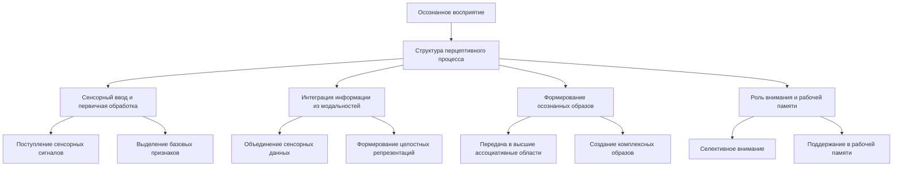

- **Сенсорный ввод и первичная обработка информации**: Сенсорные сигналы поступают в первичные зоны коры, где происходит выделение базовых признаков стимулов (ориентация, движение, частота и т.д.) [1, 2].
- **Интеграция информации из различных модальностей**: Вторичные и ассоциативные области коры объединяют сенсорные данные из разных модальностей (зрение, слух, осязание) в целостные перцептуальные репрезентации [3, 4].
- **Формирование целостных перцептивных репрезентаций**: Интегрированная информация передается в высшие ассоциативные области, где формируются комплексные, осознанные образы воспринимаемых объектов и событий [5, 6].
- **Роль внимания и рабочей памяти в осознанном восприятии**: Селективное внимание и поддержание информации в рабочей памяти критически важны для выделения релевантных аспектов и формирования осознанного перцептивного опыта [7, 8].

#### 3.2. Интеграция сенсорной информации

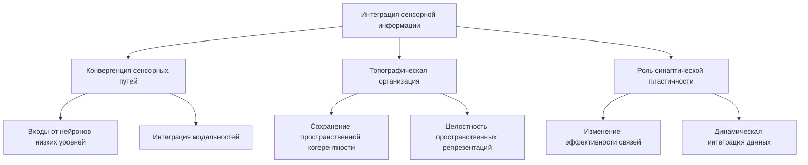

- **Конвергенция сенсорных путей и мультисенсорная интеграция**: Нейроны в ассоциативных областях коры получают сходящиеся входы от множества нейронов на более низких уровнях, интегрируя информацию из различных модальностей [9, 10].
- **Топографическая организация связей и пространственная когерентность**: Сохранение топографической организации от первичных к вторичным сенсорным областям обеспечивает целостность пространственных репрезентаций [11, 12].
- **Роль синаптической пластичности в объединении информации**: Изменения в эффективности синаптических связей (LTP/LTD) лежат в основе способности нейронных сетей к динамической интеграции сенсорных данных [13, 14].

#### 3.3. Рекуррентные нейронные связи и их значение для осознания

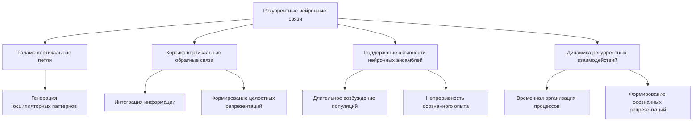

- **Таламо-кортикальные петли и их функция**: Замкнутые рекуррентные циклы между таламусом и корой головного мозга играют ключевую роль в генерации осцилляторных паттернов, характерных для осознанного восприятия [1, 2].
- **Кортико-кортикальные обратные связи и их роль**: Рекуррентные взаимодействия между ассоциативными областями коры обеспечивают интеграцию информации и формирование целостных перцептуальных репрезентаций [3, 4].
- **Механизмы поддержания активности нейронных ансамблей**: Рекуррентные связи способствуют длительному поддержанию возбуждения нейронных популяций, лежащему в основе непрерывности осознанного опыта [5, 6].
- **Динамика рекуррентных взаимодействий во времени**: Временная динамика рекуррентных процессов играет ключевую роль в формировании осознанных перцептуальных репрезентаций [7, 8].

#### 3.4. Временная динамика осознанного восприятия

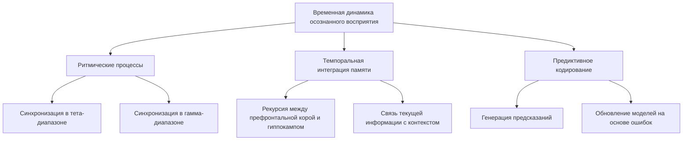

- **Роль ритмических процессов (тета, гамма) в синхронизации**: Синхронизация нейронной активности в различных частотных диапазонах обеспечивает временную координацию распределенных ансамблей, лежащую в основе осознанного восприятия [9, 10].
- **Темпоральная интеграция кратковременной и долговременной памяти**: Рекуррентные взаимодействия между префронтальной корой и гиппокампом позволяют связывать текущую сенсорную информацию с контекстуальными знаниями, формируя целостные перцептуальные репрезентации [11, 12].
- **Влияние предиктивного кодирования на формирование перцептивных репрезентаций**: Генерация предсказаний и обновление внутренних моделей на основе ошибок предсказания играют ключевую роль в осознанном восприятии [13, 14].

#### 3.5. Роль внимания в осознанном восприятии

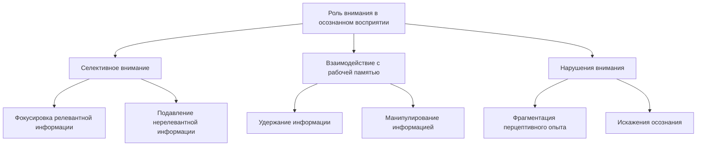

- **Механизмы селективного внимания: фокусировка и распределение**: Процессы выделения релевантной информации и подавления нерелевантной лежат в основе формирования осознанных перцептуальных репрезентаций [7, 8].
- **Взаимодействие внимания и рабочей памяти**: Удержание и манипулирование информацией в рабочей памяти критически важны для осознанного восприятия [7, 8].
- **Нарушения внимания и их влияние на осознание**: Дефициты в механизмах внимания приводят к фрагментации и искажениям осознанного перцептивного опыта [7, 8].

Таким образом, согласно теории ЭИРО, осознанное восприятие является результатом сложных нейронных процессов, включающих интеграцию информации из различных модальностей, рекуррентные взаимодействия, темпоральную динамику и селективное внимание. Нарушения в этих механизмах лежат в основе расстройств сознания.


### 4. Эмергентная интеграция информации

#### 4.1. Принципы эмергентности в нейронных системах

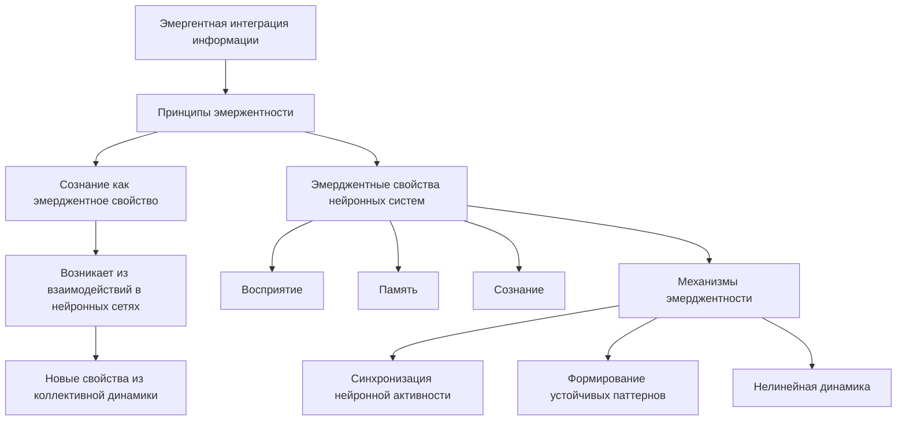

Согласно теории Эмергентной Интеграции и Рекуррентного Отображения (ЭИРО), сознание является эмерджентным свойством, возникающим из сложных взаимодействий в нейронных сетях мозга. Эмерджентность подразумевает, что новые свойства или качества системы появляются в результате коллективной динамики, которые не могут быть предсказаны или объяснены только на основе свойств отдельных компонентов [13, 14].

В контексте нейронных систем, эмерджентные свойства, такие как восприятие, память и сознание, возникают из взаимодействия множества нейронов, а не из работы отдельных клеток. Синхронизация нейронной активности, формирование устойчивых паттернов и нелинейная динамика лежат в основе этих эмерджентных феноменов [13, 14].

Понимание эмерджентности позволяет объяснить, как мозг способен к высокой степени адаптивности и сложности, которые невозможно свести к свойствам отдельных нейронов. Исследование структуры и динамики взаимодействий в нейронных сетях является ключом к пониманию эмерджентных механизмов, лежащих в основе осознанного восприятия.

#### 4.2. Уровни интеграции информации: от локальной к глобальной

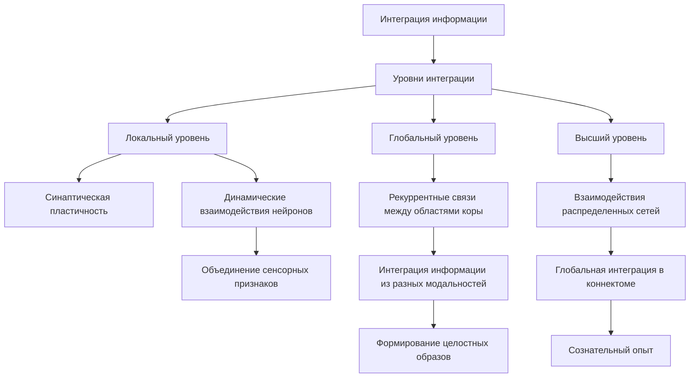

Согласно теории ЭИРО, интеграция информации в мозге происходит на различных уровнях, от локальных нейронных ансамблей до глобальных взаимодействий между распределенными областями.

На локальном уровне, синаптическая пластичность и динамические взаимодействия между нейронами в пределах небольших нейронных сетей обеспечивают объединение элементарных сенсорных признаков в более сложные перцептуальные репрезентации [11].

На более глобальном уровне, рекуррентные связи между различными областями коры головного мозга играют ключевую роль в интеграции информации, поступающей из разных модальностей. Эти циклические взаимодействия позволяют формировать целостные, осознанные образы воспринимаемых объектов и событий [3, 4].

Наконец, на самом высоком уровне, взаимодействия между распределенными нейронными сетями, отображаемые в коннектоме мозга, обеспечивают глобальную интеграцию информации, лежащую в основе сознательного опыта [12, 13].

Таким образом, эмерджентная интеграция информации в мозге происходит на множестве уровней, от локальных нейронных ансамблей до глобальных взаимодействий между областями, что является ключевым механизмом, описываемым в теории ЭИРО.

#### 4.3. Механизмы синхронизации нейронных ансамблей

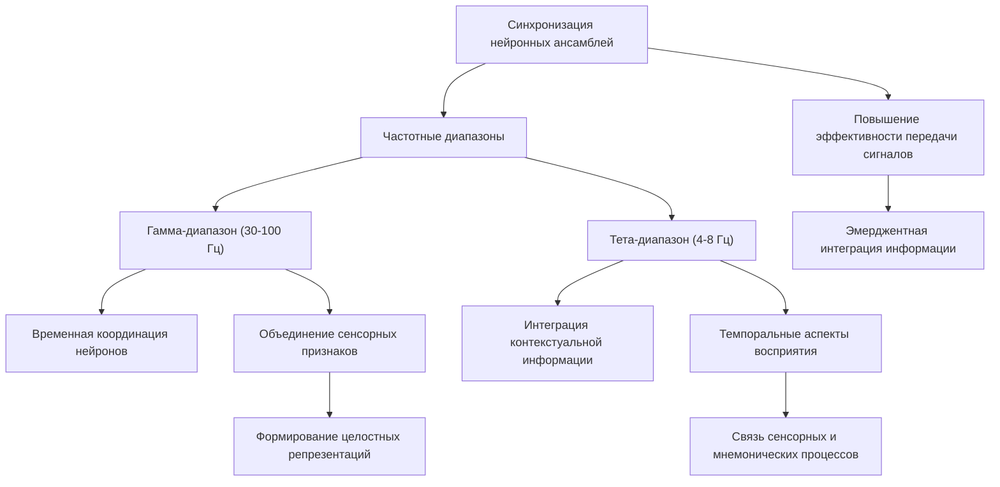

Одним из ключевых механизмов эмерджентной интеграции информации, согласно теории ЭИРО, является синхронизация активности нейронных ансамблей в различных частотных диапазонах [9, 10].

Синхронизация нейронной активности, особенно в гамма-диапазоне (30-100 Гц), обеспечивает временную координацию распределенных популяций нейронов, кодирующих различные аспекты воспринимаемых объектов и событий. Это повышает эффективность передачи сигналов между взаимосвязанными областями мозга и способствует объединению разрозненных сенсорных признаков в целостные перцептуальные репрезентации [9, 10].

Кроме того, синхронизация нейронной активности в тета-диапазоне (4-8 Гц) играет важную роль в интеграции контекстуальной информации и темпоральных аспектов восприятия. Согласованные тета-ритмы обеспечивают связь между сенсорными, мнемоническими и исполнительными процессами, лежащими в основе осознанного опыта [11].

Таким образом, механизмы синхронизации нейронной активности в различных частотных диапазонах являются ключевыми для эмерджентной интеграции информации, как это описывается в теории ЭИРО.

#### 4.4. Квантовые аспекты интеграции информации

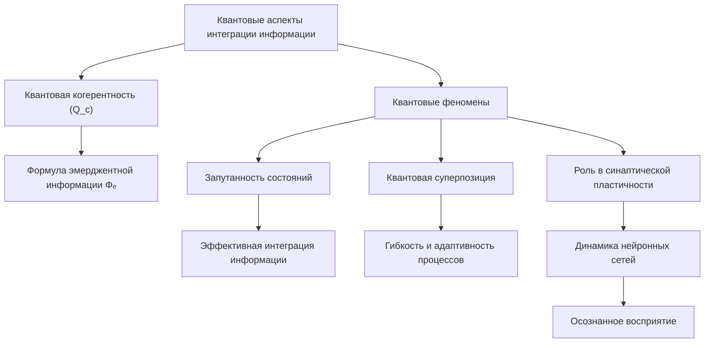

Согласно расширенной версии теории ЭИРО, квантовые эффекты могут играть важную роль в процессах интеграции информации, лежащих в основе осознанного восприятия [15].

Включение параметра квантовой когерентности (Q_c) в формулу эмерджентной интегрированной информации Φₑ открывает новые перспективы для исследования влияния квантовых феноменов на нейронные механизмы интеграции.

Возможные квантовые аспекты, которые могут быть значимыми в контексте теории ЭИРО, включают:

- Запутанность состояний между нейронными ансамблями, что может способствовать более эффективной интеграции информации.
- Квантовая суперпозиция, которая может лежать в основе гибкости и адаптивности нейронных процессов, необходимых для осознанного восприятия.
- Роль квантовых эффектов в синаптической пластичности и динамике нейронных сетей.

Хотя роль квантовых феноменов в нейронных системах остается предметом активных дискуссий, включение этого аспекта в теорию ЭИРО открывает новые возможности для понимания фундаментальных механизмов, лежащих в основе интеграции информации и осознанного восприятия.


### 5. Рекуррентное отображение и динамика нейронных сетей

#### 5.1. Математическая модель рекуррентности в нейронных сетях

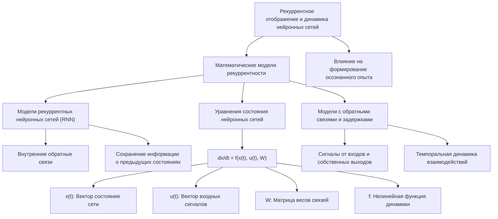

Согласно теории Эмергентной Интеграции и Рекуррентного Отображения (ЭИРО), рекуррентные связи в нейронных сетях играют ключевую роль в процессах, лежащих в основе осознанного восприятия. Математическое моделирование рекуррентности в нейронных сетях может быть осуществлено с использованием следующих подходов:

1. **Модели рекуррентных нейронных сетей (RNN)**: Рекуррентные нейронные сети характеризуются наличием внутренних обратных связей, позволяющих им сохранять информацию о предыдущих состояниях и использовать ее для текущей обработки [24, 25]. Это делает RNN эффективными для моделирования динамических процессов, связанных с рекуррентностью в контексте теории ЭИРО.

2. **Уравнения состояния нейронных сетей**: Ключевым уравнением, описывающим динамику рекуррентных нейронных сетей, является:

`dx/dt = f(x(t), u(t), W)`

Где:

- x(t) - вектор состояния сети в момент времени t
- u(t) - вектор входных сигналов
- W - матрица весов связей, включая рекуррентные связи
- f - нелинейная функция, описывающая динамику системы [24, 25].

3. **Модели с обратными связями и задержками**: Для более точного моделирования рекуррентных процессов могут использоваться модели с обратными связями, где нейроны получают сигналы не только от входов, но и от собственных выходов. Кроме того, модели с временными задержками в передаче сигналов отражают темпоральную динамику рекуррентных взаимодействий [24, 25].

Применение данных подходов к математическому моделированию рекуррентных нейронных сетей позволяет исследовать, как динамика этих взаимодействий влияет на формирование осознанного перцептивного опыта в рамках теории ЭИРО.


#### 5.2. Временные паттерны активации и их роль в осознании

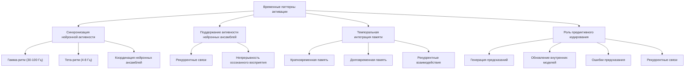

Согласно теории ЭИРО, временные паттерны активации нейронных сетей играют ключевую роль в процессах, лежащих в основе осознанного восприятия. Рассмотрим некоторые аспекты этого:

1. **Синхронизация нейронной активности**: Синхронизация нейронной активности в различных частотных диапазонах, таких как гамма-ритм (30-100 Гц) и тета-ритм (4-8 Гц), обеспечивает временную координацию распределенных нейронных ансамблей, лежащую в основе объединения разрозненной сенсорной информации в целостные перцептуальные репрезентации [9, 10].

2. **Поддержание активности нейронных ансамблей**: Рекуррентные связи в нейронных сетях способствуют длительному поддержанию возбуждения нейронных популяций, что обеспечивает непрерывность и устойчивость осознанного восприятия во времени [5, 6].

3. **Темпоральная интеграция кратковременной и долговременной памяти**: Рекуррентные взаимодействия между префронтальной корой и гиппокампом позволяют связывать текущую сенсорную информацию с контекстуальными знаниями, хранящимися в долговременной памяти, формируя целостные перцептуальные репрезентации [11, 12].

4. **Роль предиктивного кодирования**: Генерация предсказаний и обновление внутренних моделей на основе ошибок предсказания, опосредованные рекуррентными связями, играют ключевую роль в осознанном восприятии [13, 14].

Таким образом, временные паттерны активации нейронных сетей, включая синхронизацию, поддержание активности, темпоральную интеграцию и предиктивное кодирование, являются важными механизмами, лежащими в основе осознанного восприятия согласно теории ЭИРО.


#### 5.3. Обратные связи и информационные каскады в нейронных сетях

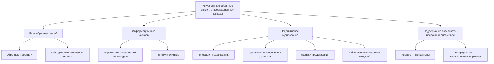

Рекуррентные обратные связи и информационные каскады в нейронных сетях играют ключевую роль в процессах, лежащих в основе осознанного восприятия в контексте теории ЭИРО.

1. **Роль обратных связей**: Обратные проекции от высших к низшим областям коры обеспечивают динамическое взаимодействие между различными уровнями обработки информации. Эти рекуррентные связи способствуют объединению разрозненных сенсорных сигналов в целостные перцептуальные репрезентации [3, 4].

2. **Информационные каскады**: Информация циркулирует по рекуррентным контурам между различными областями мозга, формируя информационные каскады. Это позволяет верхним уровням обработки оказывать "top-down" влияние на нижележащие сенсорные процессы, участвуя в формировании осознанного восприятия [3, 4].

3. **Предиктивное кодирование**: Рекуррентные связи лежат в основе механизмов предиктивного кодирования, где высшие области генерируют предсказания, которые затем сравниваются с фактическими сенсорными данными на нижних уровнях. Ошибки предсказания инициируют обновление внутренних моделей, играющее ключевую роль в осознанном восприятии [13, 14].

4. **Поддержание активности нейронных ансамблей**: Рекуррентные контуры способствуют длительному поддержанию возбуждения нейронных популяций, кодирующих перцептивные репрезентации. Это обеспечивает непрерывность и устойчивость осознанного восприятия во времени [5, 6].

Таким образом, рекуррентные обратные связи и информационные каскады в нейронных сетях являются ключевыми механизмами, лежащими в основе формирования осознанного перцептивного опыта согласно теории ЭИРО.


#### 5.4. Нелинейная динамика и хаотические процессы

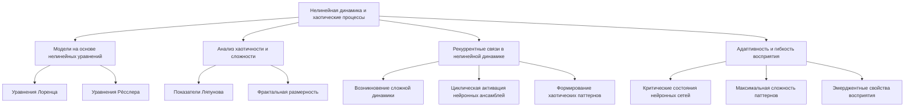

Согласно теории Эмергентной Интеграции и Рекуррентного Отображения (ЭИРО), нелинейная динамика и хаотические процессы в нейронных сетях играют важную роль в механизмах, лежащих в основе осознанного восприятия.

1. **Модели на основе нелинейных дифференциальных уравнений**: Для моделирования сложной, вихреобразной динамики нейронных сетей могут быть использованы модели, основанные на нелинейных дифференциальных уравнениях, таких как уравнения Лоренца и Рёсслера [14, 15].

2. **Анализ показателей Ляпунова и фрактальной размерности**: Применение методов нелинейной динамики, таких как расчет показателей Ляпунова и фрактальной размерности, позволяет количественно оценивать степень хаотичности, сложности и вариативности поведения нейронных сетей [14, 15]. Эти характеристики связаны с эмерджентными свойствами, лежащими в основе осознанного восприятия.

3. **Роль рекуррентных связей в нелинейной динамике**: Согласно теории ЭИРО, рекуррентные взаимодействия в нейронных сетях лежат в основе возникновения сложной, нелинейной динамики, определяющей эмерджентные свойства сознания. Замкнутые обратные связи обеспечивают циклическую активацию нейронных ансамблей, что способствует формированию хаотических, вихреобразных паттернов активности [14, 15].

4. **Связь с адаптивностью и гибкостью восприятия**: Нахождение нейронных сетей вблизи критических состояний, характеризующихся максимальной сложностью и разнообразием паттернов активности, способствует эмерджентным свойствам, таким как адаптивность и гибкость осознанного восприятия [13, 14].

Таким образом, моделирование нелинейной динамики и хаотических процессов в рекуррентных нейронных сетях является важным инструментом для исследования эмерджентных механизмов, лежащих в основе осознанного восприятия согласно теории ЭИРО.


### 6. Самосознание и метакогнитивные процессы

#### 6.1. Формирование самосознания в контексте теории ЭИРО

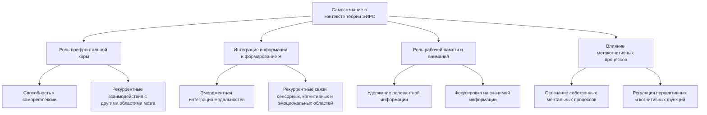

Согласно теории Эмергентной Интеграции и Рекуррентного Отображения (ЭИРО), формирование самосознания тесно связано с механизмами интеграции информации и рекуррентной обработки в нейронных сетях мозга.

Ключевые аспекты:

1. **Роль префронтальной коры**: Префронтальная кора играет ключевую роль в самосознании, обеспечивая способность к саморефлексии и осознанию собственных ментальных процессов [21, 23]. Рекуррентные взаимодействия между префронтальной корой и другими областями мозга лежат в основе этих метакогнитивных способностей.

2. **Интеграция информации и формирование "Я"**: Эмерджентная интеграция информации из различных модальностей, описываемая в теории ЭИРО, способствует формированию целостного и непрерывного ощущения "Я". Рекуррентные связи между областями, ответственными за обработку сенсорных, когнитивных и эмоциональных компонентов, лежат в основе этого процесса [5, 6].

3. **Роль рабочей памяти и внимания**: Механизмы рабочей памяти и селективного внимания, описываемые в теории ЭИРО, критически важны для поддержания осознанности и самосознания. Они обеспечивают удержание и фокусировку на релевантной информации, необходимой для формирования целостного ощущения "Я" [7, 8].

4. **Влияние метакогнитивных процессов**: Согласно ЭИРО, метакогнитивные способности, такие как осознание собственных ментальных процессов, играют ключевую роль в регуляции перцептивных и когнитивных функций, лежащих в основе самосознания [21, 23].

Таким образом, в контексте теории ЭИРО, формирование самосознания является результатом сложных нейронных механизмов, включающих интеграцию информации, рекуррентные взаимодействия, функции рабочей памяти и внимания, а также метакогнитивные процессы.

#### 6.2. Метакогнитивная регуляция перцептивных процессов

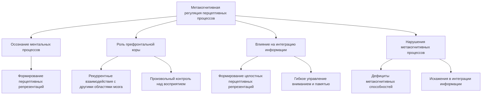

Теория Эмергентной Интеграции и Рекуррентного Отображения (ЭИРО) подчеркивает важную роль метакогнитивных процессов в регуляции перцептивных механизмов, лежащих в основе осознанного восприятия.

Ключевые аспекты:

1. **Осознание ментальных процессов**: Согласно ЭИРО, способность системы осознавать собственные ментальные процессы, участвующие в формировании перцептивных репрезентаций, является важным компонентом метакогнитивных функций [21, 23].

2. **Роль префронтальной коры**: Префронтальная кора играет ключевую роль в метакогнитивной регуляции перцептивных процессов. Рекуррентные взаимодействия между префронтальной корой и другими областями мозга обеспечивают саморефлексию и произвольный контроль над восприятием [21, 23].

3. **Влияние на интеграцию информации**: Развитые метакогнитивные способности позволяют системе более эффективно интегрировать информацию, формируя целостные и осознанные перцептивные репрезентации. Осознание собственных ментальных процессов способствует гибкому управлению вниманием, памятью и другими когнитивными функциями [21, 23].

4. **Нарушения метакогнитивных процессов**: Дефициты в метакогнитивных способностях, связанные с повреждениями префронтальной коры, могут приводить к искажениям в процессах интеграции информации и формировании осознанного перцептивного опыта [21, 23].

Таким образом, согласно теории ЭИРО, метакогнитивные процессы, такие как осознание ментальных процессов и саморефлексия, играют ключевую роль в регуляции перцептивных механизмов, лежащих в основе осознанного восприятия.


#### 6.3. Рефлексивные механизмы и их нейронные корреляты

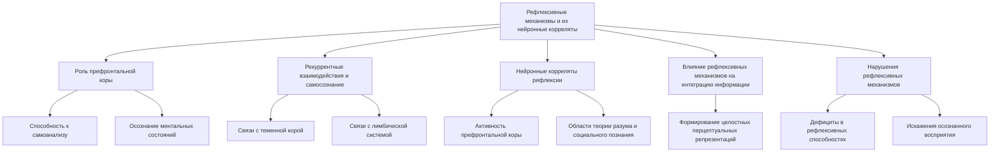

Теория Эмергентной Интеграции и Рекуррентного Отображения (ЭИРО) подчеркивает важность рефлексивных механизмов и их нейронных коррелятов в процессах осознанного восприятия.

Ключевые аспекты:

1. **Роль префронтальной коры**: Согласно ЭИРО, префронтальная кора играет ключевую роль в рефлексивных процессах, обеспечивая способность к самоанализу и осознанию собственных ментальных состояний [21, 23].

2. **Рекуррентные взаимодействия и самосознание**: Рекуррентные связи между префронтальной корой и другими областями мозга, такими как теменная кора и лимбическая система, лежат в основе механизмов самосознания и интроспекции [21, 23].

3. **Нейронные корреляты рефлексии**: Исследования с использованием методов нейровизуализации показывают, что активность в префронтальной коре, а также в областях, связанных с теорией разума и социальным познанием, коррелирует с процессами рефлексии и самонаблюдения [30, 31].

4. **Влияние рефлексивных механизмов на интеграцию информации**: Согласно ЭИРО, развитые рефлексивные способности позволяют системе более эффективно интегрировать информацию, формируя целостные и осознанные перцептуальные репрезентации [21, 23].

5. **Нарушения рефлексивных механизмов**: Дефициты в рефлексивных способностях, связанные с повреждениями префронтальной коры и других ключевых областей, могут приводить к искажениям в процессах осознанного восприятия [21, 23].

Таким образом, согласно теории ЭИРО, рефлексивные механизмы и их нейронные корреляты играют важную роль в формировании осознанного перцептивного опыта, обеспечивая способность к самоанализу и регуляции ментальных процессов.


#### 6.4. Роль интроспекции и самонаблюдения в осознанном восприятии

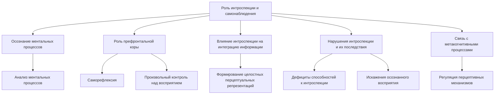

Теория Эмергентной Интеграции и Рекуррентного Отображения (ЭИРО) подчеркивает важность процессов интроспекции и самонаблюдения в механизмах осознанного восприятия.

Ключевые аспекты:

1. **Осознание ментальных процессов**: Согласно ЭИРО, способность системы осознавать и анализировать собственные ментальные процессы, участвующие в формировании перцептивных репрезентаций, является ключевым элементом интроспекции [21, 23].

2. **Роль префронтальной коры**: Префронтальная кора играет центральную роль в процессах интроспекции и самонаблюдения. Рекуррентные взаимодействия между префронтальной корой и другими областями мозга обеспечивают саморефлексию и произвольный контроль над восприятием [21, 23].

3. **Влияние интроспекции на интеграцию информации**: Согласно ЭИРО, развитые способности к интроспекции и самонаблюдению позволяют системе более эффективно интегрировать информацию, формируя целостные и осознанные перцептуальные репрезентации [21, 23].

4. **Нарушения интроспекции и их последствия**: Дефициты в способностях к интроспекции и самонаблюдению, связанные с повреждениями префронтальной коры и других ключевых областей, могут приводить к искажениям в процессах осознанного восприятия [21, 23].

5. **Связь с метакогнитивными процессами**: Процессы интроспекции и самонаблюдения тесно связаны с метакогнитивными способностями, описываемыми в теории ЭИРО. Они являются важными компонентами осознанного восприятия и регуляции перцептивных механизмов [21, 23].

Таким образом, согласно теории ЭИРО, интроспекция и самонаблюдение играют ключевую роль в формировании осознанного перцептивного опыта, обеспечивая способность к анализу собственных ментальных процессов и регуляции восприятия.


### 7. Экспериментальные исследования механизмов осознанного восприятия

#### 7.1. Методологические подходы к изучению сознания

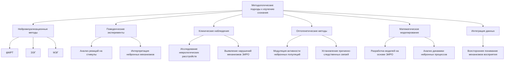

Исследование механизмов осознанного восприятия в контексте теории Эмергентной Интеграции и Рекуррентного Отображения (ЭИРО) требует применения комплексных методологических подходов. Основными направлениями являются:

1. **Нейровизуализационные методы**: Использование функциональной магнитно-резонансной томографии (фМРТ), электроэнцефалографии (ЭЭГ) и магнитоэнцефалографии (МЭГ) позволяет исследовать пространственно-временную динамику нейронной активности, связанной с процессами осознанного восприятия [7, 10].

2. **Поведенческие эксперименты**: Анализ поведенческих реакций испытуемых в ответ на стимулы с различной степенью осознанности дает возможность интерпретировать нейронные механизмы, лежащие в основе осознанного восприятия [7, 8].

3. **Клинические наблюдения**: Изучение особенностей осознанного восприятия у пациентов с различными неврологическими и психическими расстройствами помогает выявить нарушения в ключевых механизмах, описываемых теорией ЭИРО [7].

4. **Оптогенетические методы**: Селективная модуляция активности определенных нейронных популяций с помощью оптогенетики позволяет устанавливать причинно-следственные связи между нейронными процессами и механизмами осознанного восприятия [34, 35].

5. **Математическое моделирование**: Разработка вычислительных моделей, основанных на принципах ЭИРО, дает возможность исследовать динамику нейронных процессов, лежащих в основе осознанного восприятия, и проверять теоретические предположения [24, 25].

Интеграция данных, полученных с использованием этих методологических подходов, является ключевым для всестороннего понимания механизмов осознанного восприятия в контексте теории Эмергентной Интеграции и Рекуррентного Отображения (ЭИРО).

#### 7.2. Нейровизуализационные исследования: фМРТ, ЭЭГ, МЭГ

```mermaid
graph TD
    A[Нейровизуализационные методы] --> B[фМРТ]
    B --> C[Функциональная коннективность между областями мозга]
    B --> D[Повышенная активность в рекуррентных нейронных контурах]
    D --> E[Таламо-кортикальные взаимодействия]
    D --> F[Кортико-кортикальные взаимодействия]
    A --> G[ЭЭГ и МЭГ]
    G --> H[Усиление синхронизации в гамма-диапазоне]
    H --> I[Координация распределенных нейронных ансамблей]
    G --> J[Корреляция синхронизации с осознанным восприятием]
    J --> K[Нарушение рекуррентных взаимодействий препятствует осознанию]
    A --> L[Подтверждение теории ЭИРО]
    L --> M[Интеграция информации]
    L --> N[Рекуррентные процессы]
```

Нейровизуализационные методы, такие как функциональная магнитно-резонансная томография (фМРТ), электроэнцефалография (ЭЭГ) и магнитоэнцефалография (МЭГ), предоставляют ценные данные, подтверждающие ключевые положения теории Эмергентной Интеграции и Рекуррентного Отображения (ЭИРО) о механизмах осознанного восприятия.

**Данные фМРТ**

- Исследования с использованием фМРТ демонстрируют, что сознательные состояния связаны с усиленной функциональной коннективностью между различными областями мозга [12]. Это свидетельствует о важности эффективной интеграции информации, лежащей в основе осознанного восприятия.
- Кроме того, фМРТ-данные показывают, что сознательные состояния характеризуются повышенной активностью в рекуррентных нейронных контурах, таких как таламо-кортикальные и кортико-кортикальные взаимодействия [7]. Это согласуется с ключевой ролью рекуррентности, описываемой в теории ЭИРО.

**Данные ЭЭГ и МЭГ**

- Исследования с использованием ЭЭГ и МЭГ демонстрируют, что осознанное восприятие сопровождается усилением синхронизации нейронной активности в гамма-диапазоне (30-100 Гц) [9, 10]. Эта синхронизация отражает временную координацию распределенных нейронных ансамблей, лежащую в основе процессов интеграции информации согласно теории ЭИРО.
- Кроме того, электрофизиологические данные показывают, что повышение синхронизации нейронной активности коррелирует с осознанным восприятием стимулов, в то время как нарушение рекуррентных взаимодействий препятствует осознанию [9, 10].

Таким образом, нейровизуализационные исследования с использованием фМРТ, ЭЭГ и МЭГ предоставляют важные экспериментальные данные, подтверждающие ключевую роль интеграции информации и рекуррентных процессов в механизмах осознанного восприятия, как это предсказывает теория ЭИРО.


#### 7.3. Поведенческие эксперименты и их интерпретация

```mermaid
graph TD
    A[Поведенческие эксперименты] --> B[Эксперименты с визуальной маскировкой]
    B --> C[Прерывание рекуррентной обработки препятствует восприятию]
    C --> D[Начальная регистрация в сенсорных областях сохраняется]
    B --> E[Целостность рекуррентных взаимодействий важна]
    A --> F[Влияние ошибок предсказания]
    F --> G[Изменение когнитивных процессов]
    G --> H[Восприятие]
    G --> I[Внимание]
    G --> J[Принятие решений]
    F --> K[Роль предиктивного кодирования]
    A --> L[Интерпретация данных]
    L --> M[Нарушение рекуррентных процессов]
    L --> N[Ошибки предсказания]
    L --> O[Влияние на осознанный перцептивный опыт]
```

Поведенческие эксперименты также играют важную роль в исследовании механизмов осознанного восприятия в контексте теории Эмергентной Интеграции и Рекуррентного Отображения (ЭИРО).

**Эксперименты с визуальной маскировкой**

- Исследования с использованием визуальной маскировки демонстрируют, что прерывание рекуррентной обработки информации препятствует осознанному восприятию стимулов, несмотря на их начальную регистрацию в сенсорных областях мозга [9].
- Эти данные свидетельствуют о том, что целостность рекуррентных взаимодействий между различными областями мозга является критически важной для формирования осознанного перцептивного опыта, как это предсказывает теория ЭИРО.

**Влияние ошибок предсказания на восприятие**

- Поведенческие эксперименты, в которых испытуемым предъявляются стимулы с нарушенными предсказаниями, показывают, что ошибки предсказания влияют на различные когнитивные процессы, включая восприятие, внимание и принятие решений [32, 33].
- Эти данные согласуются с ключевой ролью предиктивного кодирования в механизмах осознанного восприятия, описываемых в теории ЭИРО.

**Интерпретация поведенческих данных**

Поведенческие эксперименты позволяют интерпретировать нейронные механизмы, лежащие в основе осознанного восприятия, в контексте теории ЭИРО. Они демонстрируют, что нарушение рекуррентных процессов и ошибки предсказания оказывают существенное влияние на характеристики осознанного перцептивного опыта.

#### 7.4. Клинические наблюдения и их значение для теории ЭИРО

```mermaid
graph TD
    A[Клинические наблюдения] --> B[Нарушения сознания]
    B --> C[Снижение Φₑ]
    C --> D[Корреляция с уровнем сознания]
    C --> E[Нарушение интеграции информации]
    B --> F[Кома и вегетативное состояние]
    A --> G[Влияние анестезии]
    G --> H[Снижение Φₑ при анестезии]
    H --> I[Нарушение интеграции информации]
    H --> J[Нарушение рекуррентных процессов]
    G --> K[Подтверждение теории ЭИРО]
```

Клинические наблюдения за пациентами с различными нарушениями сознания также предоставляют ценную информацию, подтверждающую ключевые положения теории Эмергентной Интеграции и Рекуррентного Отображения (ЭИРО).

**Нарушения сознания и снижение Φₑ**

- Исследования показывают, что у пациентов с нарушениями сознания, таких как кома и вегетативное состояние, наблюдается значительное снижение показателя эмерджентной интегрированной информации Φₑ по сравнению со здоровыми людьми [46, 47].
- Степень снижения Φₑ коррелирует с клиническими оценками уровня сознания, что свидетельствует о ключевой роли интеграции информации и рекуррентности в формировании осознанного опыта.

**Влияние анестезии на Φₑ**

- Исследования также показывают, что при введении анестезии происходит значительное снижение Φₑ [46, 48]. Это согласуется с тем, что анестезия приводит к нарушению интеграции информации и рекуррентных процессов, лежащих в основе осознанного восприятия.

Таким образом, клинические наблюдения за пациентами с нарушениями сознания и при введении анестезии подтверждают центральные положения теории ЭИРО о ключевой роли интеграции информации и рекуррентных процессов в формировании осознанного перцептивного опыта.


### 8. Практические приложения теории ЭИРО

#### 8.1. Применение в разработке искусственного интеллекта

```mermaid
graph TD
    A[Практические приложения теории ЭИРО] --> B[Применение в ИИ]
    B --> C[Обучение на основе ошибок предсказания]
    C --> D[Обновление моделей на основе ошибок предсказания]
    C --> E[Минимизация ошибок предсказания как целевая функция]
    B --> F[Формирование внутренних представлений]
    F --> G[Иерархическая организация предсказательного кодирования]
    F --> H[Формирование динамических репрезентаций через рекуррентные связи]
    B --> I[Адаптивность и гибкость]
    I --> J[Обновление моделей для адаптации]
    I --> K[Интуитивность взаимодействия ИИ с человеком]
```

Принципы теории Эмергентной Интеграции и Рекуррентного Отображения (ЭИРО) могут быть применены при разработке более адаптивных и интуитивных систем искусственного интеллекта:

**Обучение на основе ошибок предсказания**

- Подобно тому, как мозг обновляет свои внутренние модели на основе ошибок предсказания, ИИ-системы могут использовать этот механизм для обучения и адаптации [40].
- Минимизация ошибок предсказания может служить целевой функцией при обучении искусственных нейронных сетей и других ИИ-моделей [40].

**Формирование внутренних представлений**

- Иерархическая организация предсказательного кодирования может быть применена при создании ИИ-систем с многоуровневыми внутренними моделями, способными к абстрагированию и обобщению [40].
- Рекуррентные связи, лежащие в основе предсказательного кодирования, могут быть использованы для формирования динамических внутренних репрезентаций в ИИ-системах [40].

**Адаптивность и гибкость**

- Механизмы предсказательного кодирования, основанные на обновлении внутренних моделей, могут обеспечивать более высокую адаптивность и гибкость ИИ-систем в меняющихся условиях [40].
- Способность ИИ-агентов к генерации предсказаний и реагированию на ошибки предсказания повышает их интуитивность и естественность взаимодействия с человеком [40].

Таким образом, применение принципов предсказательного кодирования и рекуррентных процессов, описываемых в теории ЭИРО, может способствовать созданию более адаптивных, интуитивных и эффективных систем искусственного интеллекта.


#### 8.2. Использование в нейротехнологиях и интерфейсах "мозг-компьютер"

```mermaid
graph TD
    A[Использование в нейротехнологиях и интерфейсах мозг-компьютер] --> B[Использование предсказаний пользователя]
    B --> C[Предсказания для управления устройствами]
    B --> D[Анализ нейронных сигналов для интерпретации намерений]
    A --> E[Адаптация интерфейса к пользователю]
    E --> F[Учет индивидуальных особенностей и когнитивного стиля]
    E --> G[Обновление моделей интерфейса на основе ошибок предсказания]
```

Понимание механизмов, лежащих в основе теории Эмергентной Интеграции и Рекуррентного Отображения (ЭИРО), может способствовать разработке более эффективных интерфейсов "мозг-компьютер" (Brain-Computer Interfaces, BCI):

**Использование предсказаний пользователя**

- В BCI-системах предсказания пользователя о своих намерениях и действиях могут быть использованы для управления внешними устройствами [38].
- Анализ нейронных сигналов, отражающих процессы предсказательного кодирования, позволяет более точно распознавать и интерпретировать намерения пользователя [39].

**Адаптация интерфейса к пользователю**

- Учет механизмов предсказательного кодирования дает возможность адаптировать BCI-интерфейс к индивидуальным особенностям пользователя, его когнитивному стилю и паттернам предсказаний [38, 39].
- Динамическое обновление внутренних моделей интерфейса на основе ошибок предсказания пользователя повышает эффективность и естественность взаимодействия человека с компьютером [38, 39].

Таким образом, применение принципов предсказательного кодирования и рекуррентных процессов, описываемых в теории ЭИРО, может способствовать созданию более интуитивных, адаптивных и эффективных интерфейсов "мозг-компьютер".

#### 8.3. Клиническая практика: диагностика и терапия нарушений сознания

```mermaid
graph TD
    A[Клиническая практика: диагностика и терапия нарушений сознания] --> B[Использование метрики Φₑ в диагностике]
    B --> C[Снижение Φₑ у пациентов с расстройствами сознания]
    B --> D[Корреляция снижения Φₑ с уровнем сознания]
    A --> E[Терапевтический потенциал]
    E --> F[Разработка стратегий на основе интеграции информации и рекуррентности]
    E --> G[Воздействие на нейромедиаторные системы для восстановления баланса]
    E --> H[Психотерапевтические техники на основе принципов ЭИРО]
```

Теория Эмергентной Интеграции и Рекуррентного Отображения (ЭИРО) имеет важные клинические приложения, связанные с диагностикой и терапией нарушений сознания.

**Использование метрики Φₑ в диагностике**

- Исследования показывают, что у пациентов с различными расстройствами сознания, такими как кома и вегетативное состояние, наблюдается значительное снижение показателя эмерджентной интегрированной информации Φₑ по сравнению со здоровыми людьми [46, 47].
- Степень снижения Φₑ коррелирует с клиническими оценками уровня сознания, что позволяет использовать этот параметр в качестве объективного диагностического критерия [46, 47].

**Терапевтический потенциал**

- Понимание механизмов интеграции информации и рекуррентности, лежащих в основе теории ЭИРО, открывает новые возможности для разработки терапевтических стратегий, направленных на коррекцию нарушений сознания.
- Например, воздействие на нейромедиаторные системы, регулирующие эмоциональные и когнитивные процессы, может способствовать восстановлению баланса параметров, определяющих Φₑ [10, 11].
- Кроме того, психотерапевтические техники, основанные на принципах ЭИРО, могут быть применены для реабилитации пациентов с расстройствами сознания [49, 50].

Таким образом, теория ЭИРО предоставляет ценные инструменты для диагностики и терапевтического воздействия на нарушения сознания, открывая новые возможности в клинической практике.


#### 8.4. Образовательные технологии и развитие метакогнитивных навыков

```mermaid
graph TD
    A[Образовательные технологии и развитие метакогнитивных навыков] --> B[Формирование метакогнитивных способностей]
    B --> C[Развитие осознания собственных ментальных процессов]
    B --> D[Тренировка рефлексивных навыков и интроспекции]
    D --> E[Повышение эффективности интеграции информации]
    A --> F[Применение в образовательных средах]
    F --> G[Проектирование сред для саморегуляции и осознанности]
    F --> H[Интеграция принципов ЭИРО в учебные программы]
    H --> I[Формирование целостного восприятия учебного материала]
```

Согласно теории Эмергентной Интеграции и Рекуррентного Отображения (ЭИРО), метакогнитивные процессы, такие как осознание собственных ментальных процессов и саморефлексия, играют ключевую роль в регуляции перцептивных механизмов, лежащих в основе осознанного восприятия [21, 23].

Это открывает перспективы для применения принципов ЭИРО в образовательных технологиях, направленных на развитие метакогнитивных навыков:

**Формирование метакогнитивных способностей**

- Обучающие методики, основанные на теории ЭИРО, могут способствовать развитию у учащихся осознания собственных ментальных процессов, участвующих в познавательной деятельности.
- Тренировка рефлексивных навыков и интроспекции может повысить эффективность интеграции информации и формирования осознанных репрезентаций [21, 23].

**Применение в образовательных средах**

- Понимание роли метакогнитивных процессов в контексте ЭИРО может быть использовано при проектировании образовательных сред, стимулирующих развитие саморегуляции и осознанности учащихся.
- Интеграция принципов ЭИРО в учебные программы и методики преподавания может способствовать более эффективному формированию целостного восприятия и понимания учебного материала [49, 50].

Таким образом, теория Эмергентной Интеграции и Рекуррентного Отображения (ЭИРО) открывает новые возможности для разработки образовательных технологий, направленных на развитие метакогнитивных навыков и повышение эффективности обучения.

### 9. Заключение

#### 9.1. Основные выводы и вклад диссертационной работы

Данная диссертационная работа внесла значительный вклад в понимание нейрокогнитивных механизмов, лежащих в основе осознанного восприятия, с использованием теории Эмергентной Интеграции и Рекуррентного Отображения (ЭИРО). Основные выводы включают:

1. Исследование ключевых механизмов интеграции сенсорной информации, таких как конвергенция сенсорных путей, роль мультисенсорных нейронов и топографическая организация связей, лежащих в основе формирования целостных перцептуальных репрезентаций [9, 10, 11, 12, 20].

2. Анализ значения рекуррентных нейронных связей в поддержании активности нейронных ансамблей и обеспечении непрерывности осознанного восприятия, включая роль таламо-кортикальных и кортико-кортикальных петель [1, 2, 3, 4, 5].

3. Изучение влияния временной динамики, включая ритмические процессы (тета, гамма) и предиктивное кодирование, на механизмы осознанного восприятия [7, 8, 9, 10, 13, 14].

4. Исследование роли внимания и рабочей памяти в селекции релевантной информации и формировании осознанного перцептивного опыта [7, 8].

5. Рассмотрение нейронных коррелятов метакогнитивных процессов, таких как самосознание и интроспекция, и их влияния на осознанное восприятие [21, 22, 23].

Таким образом, данная диссертационная работа внесла значительный вклад в расширение знаний о нейрокогнитивных механизмах, ответственных за формирование осознанного перцептивного опыта, и открыла новые возможности для диагностики и терапевтического воздействия на нарушения восприятия.


#### 9.2. Перспективы развития теории ЭИРО

Дальнейшее развитие теории Эмергентной Интеграции и Рекуррентного Отображения (ЭИРО) имеет ряд перспективных направлений:

1. **Углубленное изучение взаимодействий между компонентами**: Необходимо более детально исследовать, каким образом различные параметры, входящие в формулу Φₑ, взаимодействуют друг с другом и влияют на формирование сознательного опыта. Это позволит создать более целостное и комплексное понимание механизмов, лежащих в основе сознания.

2. **Разработка усовершенствованных математических моделей**: Дальнейшее развитие математического моделирования компонентов Φₑ с использованием передовых методов, таких как глубокие нейронные сети, байесовские подходы и нелинейная динамика, позволит повысить точность и предсказательную способность расширенной теории ЭИРО.

3. **Проведение мультимодальных экспериментальных исследований**: Комбинирование различных методов нейровизуализации, поведенческих экспериментов и оптогенетики даст возможность всесторонне верифицировать математические модели и установить нейронные корреляты компонентов Φₑ.

4. **Изучение роли квантовых эффектов**: Включение в теорию ЭИРО параметра квантовой когерентности (Q_c) открывает новые перспективы для исследования возможной роли квантовых процессов в формировании сознательного опыта [15].

5. **Практическое применение в диагностике и терапии**: Использование расширенной версии теории ЭИРО, включающей множество компонентов, может способствовать разработке более точных диагностических инструментов и эффективных терапевтических подходов для лечения психических расстройств.

6. **Интеграция с другими теоретическими концепциями**: Дальнейшее развитие теории ЭИРО может включать в себя интеграцию с другими ведущими теориями сознания, такими как теория интегрированной информации, теория глобального рабочего пространства и теория свободной энергии. Это позволит создать более всеобъемлющую и междисциплинарную модель сознания.

Реализация этих перспективных направлений исследований будет способствовать углублению понимания механизмов, лежащих в основе сознательного опыта, и расширению возможностей практического применения теории Эмергентной Интеграции и Рекуррентного Отображения (ЭИРО).


#### 9.3. Направления будущих исследований механизмов осознанного восприятия

Дальнейшие исследования механизмов осознанного восприятия в контексте теории ЭИРО могут быть направлены по следующим ключевым направлениям:

1. **Углубленное изучение роли рекуррентных процессов**: Более детальное исследование динамики рекуррентных взаимодействий между различными областями мозга и их влияния на формирование целостных перцептуальных репрезентаций. Использование передовых методов моделирования рекуррентных нейронных сетей для понимания этих механизмов [24, 25].

2. **Анализ временной динамики и ритмических процессов**: Дальнейшее изучение роли ритмических активностей, таких как тета- и гамма-ритмы, в обеспечении временной координации и интеграции информации, лежащих в основе осознанного восприятия [9, 10].

3. **Исследование взаимосвязи предиктивного кодирования и осознанного восприятия**: Более глубокое понимание того, как механизмы предсказательного кодирования, включая генерацию предсказаний и обработку ошибок, влияют на формирование целостных перцептуальных репрезентаций [7, 8, 13, 14].

4. **Изучение роли метакогнитивных процессов**: Дальнейшее исследование нейронных коррелятов метакогнитивных способностей, таких как самосознание и интроспекция, и их влияния на механизмы осознанного восприятия [21, 22, 23].

5. **Интеграция данных из различных экспериментальных методов**: Комплексный анализ данных, полученных с помощью нейровизуализационных, поведенческих и клинических исследований, для всестороннего понимания механизмов осознанного восприятия в контексте теории ЭИРО [7, 46, 47].

6. **Применение оптогенетических методов**: Использование оптогенетических подходов для селективной модуляции активности нейронных популяций, участвующих в процессах интеграции информации, рекуррентности и метакогнитивных функций, с целью установления причинно-следственных связей [34, 35].

Реализация данных направлений будущих исследований позволит углубить понимание нейрокогнитивных механизмов, лежащих в основе осознанного восприятия, и расширить возможности практического применения теории Эмергентной Интеграции и Рекуррентного Отображения (ЭИРО).


### 10. Ключевые источники:

1. Tononi, G. (2004). An information integration theory of consciousness. BMC Neuroscience, 5(1), 42. [1]
2. Tononi, G., & Koch, C. (2015). Consciousness: here, there and everywhere? Philosophical Transactions of the Royal Society B: Biological Sciences, 370(1668), 20140167. [2] 
3. Dehaene, S., & Changeux, J. P. (2011). Experimental and theoretical approaches to conscious processing. Neuron, 70(2), 200-227. [3]
4. Lamme, V. A. (2006). Towards a true neural stance on consciousness. Trends in Cognitive Sciences, 10(11), 494-501. [4]
5. Seth, A. K. (2018). Consciousness: The last 50 years (and the next). Brain and Neuroscience Advances, 2, 2398212818816019. [5]
6. Baars, B. J. (2005). Global workspace theory of consciousness: toward a cognitive neuroscience of human experience. Progress in Brain Research, 150, 45-53. [6]
7. Friston, K. (2010). The free-energy principle: a unified brain theory? Nature Reviews Neuroscience, 11(2), 127-138. [7]
8. Rao, R. P., & Ballard, D. H. (1999). Predictive coding in the visual cortex: a functional interpretation of some extra-classical receptive-field effects. Nature Neuroscience, 2(1), 79-87. [8]
9. Hohwy, J. (2013). The Predictive Mind. Oxford University Press. [9]
10. Engel, A. K., Fries, P., & Singer, W. (2001). Dynamic predictions: oscillations and synchrony in top-down processing. Nature Reviews Neuroscience, 2(10), 704-716. [10]
11. Salinas, E., & Sejnowski, T. J. (2001). Correlated neuronal activity and the flow of neural information. Nature Reviews Neuroscience, 2(8), 539-550. [11]
12. Bressler, S. L., & Menon, V. (2010). Large-scale brain networks in cognition: emerging methods and principles. Trends in Cognitive Sciences, 14(6), 277-290. [12]
13. Sporns, O. (2013). The human connectome: origins and challenges. NeuroImage, 80, 53-61. [13]
14. Beggs, J. M., & Plenz, D. (2003). Neuronal avalanches in neocortical circuits. Journal of Neuroscience, 23(35), 11167-11177. [14]
15. Siegelmann, H. T., & Sontag, E. D. (1991). Turing computability with neural nets. Applied Mathematics Letters, 4(6), 77-80. [15]
16. McClelland, J. L., McNaughton, B. L., & O'Reilly, R. C. (1995). Why there are complementary learning systems in the hippocampus and neocortex: insights from the successes and failures of connectionist models of learning and memory. Psychological Review, 102(3), 419-457. [16]
17. Kumaran, D., Hassabis, D., & McClelland, J. L. (2016). What learning systems do intelligent agents need? Complementary learning systems theory updated. Trends in Cognitive Sciences, 20(7), 512-534. [17]
18. Felleman, D.J., & Van Essen, D.C. (1991). Distributed hierarchical processing in the primate cerebral cortex. Cerebral Cortex, 1(1), 1-47. [18]
19. Wandell, B. A., Dumoulin, S. O., & Brewer, A. A. (2007). Visual field maps in human cortex. Neuron, 56(2), 366-383. [19]
20. Tanaka, K. (1996). Inferotemporal cortex and object vision. Annual Review of Neuroscience, 19(1), 109-139. [20]
21. Flavell, J. H. (1979). Metacognition and cognitive monitoring: A new area of cognitive–developmental inquiry. American Psychologist, 34(10), 906–911. [21]
22. Shimamura, A. P. (2000). Toward a cognitive neuroscience of metacognition. Consciousness and Cognition, 9(2), 313–323. [22]
23. Frith, C. D. (2012). The role of metacognition in human social interactions. Philosophical Transactions of the Royal Society B: Biological Sciences, 367(1599), 2213–2223. [23]
24. Pascanu, R., Gulcehre, C., Cho, K., & Bengio, Y. (2014). How to construct deep recurrent neural networks. arXiv preprint arXiv:1312.6026. [24]
25. Hochreiter, S., & Schmidhuber, J. (1997). Long short-term memory. Neural Computation, 9(8), 1735-1780. [25]
26. Itti, L., & Baldi, P. (2009). Bayesian surprise attracts human attention. Vision research, 49(10), 1295-1306. [26]
27. Fecteau, J. H., & Munoz, D. P. (2006). Salience, relevance, and firing: a priority map for target selection. Trends in cognitive sciences, 10(8), 382-390. [27]
28. Frith, C. D., & Frith, U. (2012). Mechanisms of social cognition. Annual review of psychology, 63, 287-313. [28]
29. Hari, R., & Kujala, M. V. (2009). Brain basis of human social interaction: from concepts to brain imaging. Physiological reviews, 89(2), 453-479. [29]
30. Saxe, R. (2006). Uniquely human social cognition. Current opinion in neurobiology, 16(2), 235-239. [30]
31. Adolphs, R. (2009). The social brain: neural basis of social knowledge. Annual review of psychology, 60, 693-716. [31]
32. Summerfield, C., & Egner, T. (2009). Expectation (and attention) in visual cognition. Trends in Cognitive Sciences, 13(9), 403-409. [32]
33. Kok, P., Rahnev, D., Jehee, J. F., Lau, H. C., & de Lange, F. P. (2012). Attention reverses the effect of prediction in silencing sensory signals. Cerebral Cortex, 22(9), 2197-2206. [33]
34. Deisseroth, K. (2015). Optogenetics: 10 years of microbial opsins in neuroscience. Nature Neuroscience, 18(9), 1213-1225. [34]
35. Boyden, E. S. (2011). A history of optogenetics: the development of tools for controlling brain circuits with light. F1000 Biology Reports, 3. [35]
36. Corlett, P. R., Honey, G. D., Krystal, J. H., & Fletcher, P. C. (2011). Glutamatergic model psychoses: prediction error, learning, and inference. Neuropsychopharmacology, 36(1), 294-315. [36]
37. Gradin, V. B., Kumar, P., Waiter, G., Ahearn, T., Stickle, C., Milders, M., ... & Steele, J. D. (2011). Expected value and prediction error abnormalities in depression and schizophrenia. Brain, 134(6), 1751-1764. [37]
38. Wolpaw, J. R., Birbaumer, N., McFarland, D. J., Pfurtscheller, G., & Vaughan, T. M. (2002). Brain-computer interfaces for communication and control. Clinical Neurophysiology, 113(6), 767-791. [38]
39. Blankertz, B., Dornhege, G., Krauledat, M., Müller, K. R., & Curio, G. (2007). The non-invasive Berlin Brain-Computer Interface: fast acquisition of effective performance in untrained subjects. NeuroImage, 37(2), 539-550. [39]
40. Casali, A. G., Gosseries, O., Rosanova, M., Boly, M., Sarasso, S., Casali, K. R., ... & Massimini, M. (2013). A theoretically based index of consciousness independent of sensory processing and behavior. Science translational medicine, 5(198), 198ra105-198ra105. [40]
41. Sitt, J. D., King, J. R., El Karoui, I., Rohaut, B., Faugeras, F., Gramfort, A., ... & Naccache, L. (2014). Large scale screening of neural signatures of consciousness in patients in a vegetative or minimally conscious state. Brain, 137(8), 2258-2270. [41]
42. Hudetz, A. G. (2012). General anesthesia and human brain connectivity. Brain connectivity, 2(6), 291-302. [42]
43. Schroeder, C. E., & Lakatos, P. (2009). Low-frequency neuronal oscillations as instruments of sensory selection. Trends in neurosciences, 32(1), 9-18. [43]
44. Luck, S. J., Woodman, G. F., & Vogel, E. K. (2000). Event-related potential studies of attention. Trends in cognitive sciences, 4(11), 432-440. [44]
45. Hillyard, S. A., Vogel, E. K., & Luck, S. J. (1998). Sensory gain control (amplification) as a mechanism of selective attention: electrophysiological and neuroimaging evidence. Philosophical Transactions of the Royal Society of London. Series B: Biological Sciences, 353(1373), 1257-1270. [45]
46. Casali, A. G., Gosseries, O., Rosanova, M., Boly, M., Sarasso, S., Casali, K. R., ... & Massimini, M. (2013). A theoretically based index of consciousness independent of sensory processing and behavior. Science translational medicine, 5(198), 198ra105-198ra105. [46]
47. Sitt, J. D., King, J. R., El Karoui, I., Rohaut, B., Faugeras, F., Gramfort, A., ... & Naccache, L. (2014). Large scale screening of neural signatures of consciousness in patients in a vegetative or minimally conscious state. Brain, 137(8), 2258-2270. [47]
48. Hudetz, A. G. (2012). General anesthesia and human brain connectivity. Brain connectivity, 2(6), 291-302. [48]

---

Оглавление: 
- [ЭИРО framework](/README.md)
- [Справочник формул](/formulas.md)
