# Механизмы передачи информации в биохимических системах

```mermaid
graph TD
    A[Передача информации в биохимических системах] --> B[Сигнальные пути]
    B --> B1[Рецепторные системы]
    B --> B2[Каскады передачи сигнала]
    B --> B3[Регуляция генной экспрессии]

    A --> C[Генетическая экспрессия]
    C --> C1[Транскрипционные регуляторы]
    C --> C2[Эпигенетические модификации]
    C --> C3[РНК-интерференция]

    A --> D[Ферментативные реакции]
    D --> D1[Аллостерическая регуляция]
    D --> D2[Кооперативность]
    D --> D3[Обратимые модификации]

    A --> E[Интеграция квантовой информации]
    E --> E1[Электронные состояния]
    E1 --> E1a[Когерентность электронов]
    E --> E2[Конформационные изменения]
    E2 --> E2a[Квантовые переходы между состояниями]
    E --> E3[Колебательные режимы]
    E3 --> E3a[Фононы и вибрации]

    A --> F[Рекуррентность в системах]
    F --> F1[Ферментативные циклы]
    F --> F2[Обратимые связывания]
    F --> F3[Генетические регуляторные петли]

    A --> G[Эмерджентные свойства]
    G --> G1[Повышение чувствительности]
    G --> G2[Точность сигнала]
    G --> G3[Регуляция и адаптация]

    A --> H[Применение в медицине и биотехнологии]
    H --> H1[Разработка лекарств]
    H --> H2[Биосенсоры]
    H --> H3[Синтетическая биология]
    H --> H4[Генная терапия]
```

---

## 1. Введение

Биохимические системы — это сложные сети, обеспечивающие жизнедеятельность клеток и организмов в целом. Передача информации в таких системах обеспечивает координацию множества процессов, от метаболизма до реакции на внешние стимулы. Ключевыми механизмами передачи информации являются:

#### 1.1. Сигнальные пути (Signal transduction pathways):

**Рецепторные системы**: На поверхности клеток расположены рецепторы, которые распознают специфические молекулы-сигналы (лигандов), такие как гормоны, нейротрансмиттеры или цитокины.
  
  *Пример:* Стероидные гормоны проникают через клеточную мембрану и связываются с внутриклеточными рецепторами, влияя на экспрессию генов.

**Каскады передачи сигнала**: После активации рецептора информация передаётся внутрь клетки через серию биохимических реакций, часто включающих перенос фосфатных групп (фосфорилирование) или вторичные мессенджеры (например, цАМФ, ионы кальция).

  *Пример:* Адреналин связывается с β-адренорецепторами, активируя аденилатциклазу и повышая уровень цАМФ, что ведёт к мобилизации ресурсов энергии.

**Регуляция генной экспрессии**: Конечные точки сигнальных путей могут влиять на транскрипционные факторы, изменяя синтез белков и адаптируя клеточные функции.

#### 1.2. Генетическая экспрессия:

**Транскрипционные регуляторы**: Белки, которые связываются с ДНК и контролируют транскрипцию генов в ответ на сигналы.

  *Пример:* Фактор транскрипции p53 активируется в ответ на повреждение ДНК и может индуцировать апоптоз или клеточный цикл.

**Эпигенетические модификации**: Метилирование ДНК и модификации гистонов изменяют доступность генов для транскрипции без изменения последовательности ДНК.

**РНК-интерференция**: Малые РНК (миРНК) могут подавлять экспрессию генов, связываясь с мРНК и предотвращая её трансляцию.

#### 1.3. Ферментативные реакции:

**Аллостерическая регуляция**: Ферменты могут изменять свою активность при связывании с аллостерическими эффекторами, что позволяет тонко настраивать метаболические пути.

  *Пример:* АТФ выступает как негативный аллостерический регулятор ферментов гликолиза, уменьшая производство энергии при её избытке.

**Кооперативность**: Связывание субстрата с одним активным центром фермента облегчает или затрудняет связывание в других центрах.

  *Пример:* Гемоглобин, где связывание кислорода с одной субъединицей усиливает связывание с другими.

**Обратимые ковалентные модификации**: Фосфорилирование, ацетилирование и другие модификации могут быстро изменять активность ферментов.

### 2. Интегрированная квантовая информация в биомолекулах

Биомолекулы не только участвуют в химических реакциях, но и обладают квантовыми свойствами, которые могут влиять на их функциональность. Плотность интегрированной квантовой информации (  ρ_(IQI)  ) в биомолекулах характеризует их способность хранить и передавать информацию на квантовом уровне.

#### 2.1. Электронные состояния:

**Когерентность электронов**: Электроны в молекулах могут находиться в когерентных суперпозициях состояний, что важно для процессов, таких как фотосинтез.

  *Пример:* В фотосинтетических комплексах возбуждённые электроны переносятся с высокой эффективностью за счёт квантовой когерентности.

#### 2.2. Конформационные изменения:

**Квантовые переходы между состояниями**: Белки и нуклеиновые кислоты могут принимать различные конформации, переход между которыми может быть описан квантовыми механиками.

  *Пример:* Изменение структуры фермента при связывании с субстратом (индуцированное соответствие).

#### 2.3. Колебательные режимы:

**Фононы и вибрации**: Колебательные движения атомов в молекуле могут влиять на её реакционную способность и взаимодействие с другими молекулами.

  *Пример:* Туннелирование протонов в ферментативных реакциях, что ускоряет их протекание.

Формула плотности интегрированной квантовой информации:

`ρ_(IQI) = -∑ᵢ pᵢ log pᵢ`

где:

-  pᵢ  — вероятность нахождения системы в квантовом состоянии  i .

**Интерпретация**:

- Высокое  ρ_(IQI) : Указывает на множество доступных состояний, что повышает способность молекулы реагировать на различные сигналы.

- Энтропия системы:  ρ_(IQI)  связан с энтропией и отражает уровень неопределённости в системе.

**Применение к белкам и нуклеиновым кислотам**:

- Белки: Разнообразие конформационных состояний позволяет белкам взаимодействовать с разными партнёрами, что важно для сигнальных и регуляторных функций.

- ДНК и РНК: Структурная гибкость нуклеиновых кислот влияет на регуляцию генов и процесс альтернативного сплайсинга.

### 3. Рекуррентность в сигнальных путях

Рекуррентность (повторяемость) процессов играет ключевую роль в обеспечении устойчивости и точности биохимических систем.

#### 3.1. Ферментативные циклы:

**Циклы фосфорилирования**: Белки киназы и фосфатазы работают совместно, обеспечивая обратимое фосфорилирование белков.

  *Пример:* MAP-киназный путь, где серия фосфорилирований передаёт сигналы роста и дифференцировки.

#### 3.2. Обратимые связывания:

**Лиганд-рецепторные взаимодействия**: Молекула сигнала может связываться с рецептором, инициируя ответ, и затем отсоединяться, прекращая сигнал.

  *Пример:* Нейротрансмиттеры в синапсах, где быстрота связывания и диссоциации обеспечивает точную передачу нервных импульсов.

#### 3.3. Генетические регуляторные петли:

**Отрицательная обратная связь**: Продукт гена подавляет его собственную экспрессию, стабилизируя уровень белка.

  *Пример:* Лак-оперон в бактериях, где наличие лактозы влияет на экспрессию генов метаболизма.

**Параметр рекуррентности ( R )**:

R = Частота обратных процессов / Общая частота реакци}

**Значение параметра  R**:

- **Высокий  R**: Система обладает высокой степенью обратимости, что повышает точность и устойчивость.

- **Низкий  R**: Процессы преимущественно необратимы, что может быть необходимо для окончательных решений клетки (например, апоптоз).

### 4. Эмерджентные свойства передачи информации

Эмерджентные свойства — это характеристики системы, которые не очевидны из свойств отдельных компонентов, но возникают в результате их взаимодействия.

#### 4.1. Повышение чувствительности:

**Множество состояний**: Высокое  ρ_(IQI)  обеспечивает наличие множества доступных состояний, позволяя молекулам отвечать на минимальные изменения внешних факторов.

  *Пример:* Фоторецепторы глаза реагируют на единичные фотоны благодаря квантовым эффектам.

#### 4.2. Точность сигнала:

**Рекуррентные процессы**: Высокий  R  обеспечивает возможность многократной проверки и коррекции сигнала.

  *Пример:* В системе свёртывания крови каскад обратимых реакций обеспечивает быстрый и точный ответ на повреждение сосудов.

#### 4.3. Регуляция и адаптация:

**Динамическая настройка**: Изменяя  ρ_(IQI)  и  R , клетки могут адаптировать свои реакции к длительным изменениям окружающей среды.

  *Пример:* Развитие лекарственной устойчивости у бактерий через регулирование генетических сетей.

### 5. Применение в медицине и биотехнологии

Глубокое понимание биохимических процессов открывает новые возможности в различных областях.

#### 5.1. Разработка лекарственных препаратов:

**Таргетирование по  ρ_(IQI)**: Лекарства могут быть разработаны для взаимодействия с молекулами, имеющими специфические квантовые свойства, повышая эффективность и снижая побочные эффекты.

  *Пример:* Использование специфических ингибиторов киназ в терапии рака.

**Модуляция R**: Регулируя рекуррентность сигнальных путей, можно управлять клеточными ответами.

  *Пример:* Иммуномодуляторы, которые влияют на обратную связь в иммунной системе.

#### 5.2. Биосенсоры:

**Высокочувствительные устройства**: Использование молекул с высоким  ρ_(IQI)  позволяет создавать сенсоры, способные обнаруживать мельчайшие концентрации веществ.

  *Пример:* ДНК-биочипы для детекции генетических мутаций.

**Квантовые сенсоры**: Интеграция квантовых технологий в биосенсоры повышает их чувствительность и скорость отклика.

#### 5.3. Синтетическая биология:

**Дизайн ферментов**: Изменяя  ρ_(IQI) , можно создавать ферменты с новой специфичностью или повышенной активностью.

  *Пример:* Ферменты для биосинтеза сложных лекарственных молекул.

**Регуляция генетических сетей**: Модуляция  R  в генетических контурах позволяет конструировать организмы с предсказуемым поведением.

  *Пример:* Создание бактерий для биоремедиации, способных адаптироваться к различным загрязнителям.

#### 5.4. Терапевтические подходы:

**Генная терапия**: Использование знаний о рекуррентности генетических сетей для коррекции генетических нарушений.

  *Пример:* Редактирование генома с помощью CRISPR/Cas9 для лечения наследственных заболеваний.

**Персонализированная медицина**: Анализ  ρ_(IQI)  у индивидуального пациента может помочь в выборе наиболее эффективного лечения.

  *Пример:* Определение чувствительности опухоли к определённым препаратам на основе её молекулярного профиля.

### 6. Заключение

Механизмы передачи информации в биохимических системах — это результат сложного взаимодействия на различных уровнях организации материи, от квантовых эффектов до клеточных процессов. Интеграция понятий интегрированной квантовой информации ( ρ_(IQI) ) и рекуррентности ( R ) позволяет глубже понять, как возникают и регулируются жизненно важные функции.

Эмерджентные свойства, возникающие из этих взаимодействий, обеспечивают организму гибкость, адаптацию и устойчивость. Применение этих знаний в науке и технологии открывает новые горизонты в медицине, биотехнологии и синтетической биологии, способствуя развитию инновационных решений для сложных проблем.

---

Оглавление: 

- [Поиск новых теорий в химии](/new-theories-in-chemistry.md)
- [ЭИРО framework](/README.md)

