# Метакогнитивная осведомленность (M) в контексте теории Эмергентной Интеграции и Рекуррентного Отображения (ЭИРО)

```mermaid
graph TD
    A[Метакогнитивная Осведомленность] --> B1[Осознание Ментальных Состояний]
    A --> B2[Саморегуляция и Контроль]
    A --> B3[Метаобработка Информации]
    B1 --> C1{Осознание Мыслей и Эмоций}
    B1 --> C2{Понимание Убеждений}
    B1 --> C3{Рефлексия Стратегий}
    B2 --> C4{Мониторинг и Оценка}
    B2 --> C5{Планирование Действий}
    B2 --> C6{Коррекция Поведения}
    B3 --> C7{Формирование Репрезентаций}
    B3 --> C8{Оценка Надежности}
    B3 --> C9{Создание Моделей}
    A --> D[Нейробиология МО]
    D --> E1[Роль Префронтальной Коры]
    D --> E2[Взаимодействие Областей]
    D --> E3[Нейрохимическая Модуляция]
    A --> F[Рекуррентные Процессы]
    F --> G1{Саморефлексия}
    F --> G2{Метаобработка}
    F --> G3{Роль Внимания}
    A --> H[Количественная Оценка]
    H --> I1{"Энтропия H(M)"}
    H --> I2{"Взаимная Информация MI(M;C)"}
    H --> I3{"Сложность K(M)"}
    A --> J[Формирование Сознательного Опыта]
    J --> K1{Интеграция Информации}
    J --> K2{Эмоциональные Аспекты}
    J --> K3{Нарушения при Расстройствах}
    A --> L[Адаптивность и Гибкость]
    L --> M1{Обучение и Развитие}
    L --> M2{Решение Новых Задач}
    L --> M3{Динамическая Перестройка}
    A --> N[Социальное Взаимодействие]
    N --> O1{Теория Разума}
    N --> O2{Социальный Контекст}
    A --> P[Практическое Применение]
    P --> Q1{Диагностика Расстройств}
    P --> Q2{Интеллектуальные Системы}
```

---

## Оглавление

1. **Введение**
   - 1.1. Понятие метакогнитивной осведомленности
   - 1.2. Роль метакогнитивных процессов в формировании сознательного опыта
   - 1.3. Связь с теорией Эмергентной Интеграции и Рекуррентного Отображения (ЭИРО)

2. **Компоненты метакогнитивной осведомленности**
   - 2.1. Осознание собственных мыслей и ментальных состояний
   - 2.2. Способность к саморегуляции и контролю
   - 2.3. Метаобработка информации о себе

3. **Нейробиологические основы метакогнитивной осведомленности**
   - 3.1. Роль префронтальной коры в метакогнитивных процессах
   - 3.2. Взаимодействие с другими областями мозга
   - 3.3. Нейрохимические механизмы модуляции метакогнитивных способностей

4. **Метакогнитивная осведомленность и рекуррентные процессы**
   - 4.1. Рекуррентные взаимодействия как основа саморефлексии
   - 4.2. Влияние рекуррентности на метаобработку информации
   - 4.3. Роль внимания в модуляции метакогнитивных процессов

5. **Количественная оценка метакогнитивной осведомленности**
   - 5.1. Информационно-теоретические подходы
   - 5.2. Применение метрик в экспериментальных исследованиях
   - 5.3. Связь с параметром Φₑ в теории ЭИРО

6. **Метакогнитивная осведомленность и формирование сознательного опыта**
   - 6.1. Роль метакогнитивных процессов в интеграции информации
   - 6.2. Влияние на эмоциональные и когнитивные аспекты сознания
   - 6.3. Нарушения метакогнитивной осведомленности при психических расстройствах

7. **Метакогнитивная осведомленность, адаптивность и гибкость поведения**
   - 7.1. Связь между метакогнитивными способностями и обучением
   - 7.2. Роль метакогнитивной осведомленности в решении новых задач
   - 7.3. Влияние на динамическую перестройку когнитивных процессов

8. **Метакогнитивная осведомленность и социальное взаимодействие**
   - 8.1. Метакогнитивные основы теории разума
   - 8.2. Влияние социального контекста на метакогнитивные процессы

9. **Практические применения концепции метакогнитивной осведомленности**
   - 9.1. Использование метрик в диагностике психических расстройств
   - 9.2. Интеграция метакогнитивных способностей в интеллектуальные системы

10. **Заключение**
    - 10.1. Обобщение роли метакогнитивной осведомленности в теории ЭИРО
    - 10.2. Перспективы дальнейших исследований

**Источники:**

1. Flavell, J. H. (1979). Metacognition and cognitive monitoring: A new area of cognitive–developmental inquiry. *American Psychologist, 34*(10), 906–911. https://doi.org/10.1037/0003-066X.34.10.906
2. Shimamura, A. P. (2000). Toward a cognitive neuroscience of metacognition. *Consciousness and Cognition, 9*(2), 313–323. https://doi.org/10.1006/ccog.2000.0450
3. Frith, C. D. (2012). The role of metacognition in human social interactions. *Philosophical Transactions of the Royal Society B: Biological Sciences, 367*(1599), 2213–2223. https://doi.org/10.1098/rstb.2012.0123
4. Fleming, S. M., & Dolan, R. J. (2012). The neural basis of metacognitive ability. *Philosophical Transactions of the Royal Society B: Biological Sciences, 367*(1594), 1338–1349. https://doi.org/10.1098/rstb.2011.0417
5. Tononi, G. (2004). An information integration theory of consciousness. *BMC Neuroscience, 5*(1), 42. https://doi.org/10.1186/1471-2202-5-42
6. Dehaene, S., & Changeux, J. P. (2011). Experimental and theoretical approaches to conscious processing. *Neuron, 70*(2), 200–227. https://doi.org/10.1016/j.neuron.2011.03.018
7. Friston, K. (2010). The free-energy principle: a unified brain theory? *Nature Reviews Neuroscience, 11*(2), 127–138. https://doi.org/10.1038/nrn2787

---

### 1. Введение

#### 1.1. Понятие метакогнитивной осведомленности

Метакогнитивная осведомленность представляет собой способность индивида осознавать и контролировать собственные когнитивные процессы [1]. Это включает в себя знания человека о своих мыслях, восприятии, памяти, внимании и других ментальных состояниях, а также умение регулировать и управлять ими [2].

#### 1.2. Роль метакогнитивных процессов в формировании сознательного опыта

Метакогнитивные способности играют ключевую роль в формировании сознательного опыта. Осознание собственных ментальных состояний и процессов позволяет индивиду интегрировать различные аспекты своего сознания, обеспечивая целостность и связность сознательного восприятия [3]. Кроме того, метакогнитивная осведомленность дает возможность произвольно управлять вниманием, памятью и принятием решений, что влияет на характеристики сознательного опыта [4].

#### 1.3. Связь с теорией Эмергентной Интеграции и Рекуррентного Отображения (ЭИРО)

Согласно теории Эмергентной Интеграции и Рекуррентного Отображения (ЭИРО), сознание возникает из процессов интеграции информации в рекуррентных нейронных сетях. Метакогнитивная осведомленность, как способность осознавать и контролировать собственные ментальные процессы, может рассматриваться как важный компонент, влияющий на характеристики сознательного опыта, отраженные в параметре Φₑ [5, 6]. Включение метакогнитивной осведомленности в расширенную версию теории ЭИРО позволит более полно описать механизмы, лежащие в основе формирования сознания [7].

### 2. Компоненты метакогнитивной осведомленности

#### 2.1. Осознание собственных мыслей и ментальных состояний

Метакогнитивная осведомленность предполагает способность индивида осознавать и отслеживать собственные когнитивные процессы, такие как восприятие, память, мышление и принятие решений. Этот компонент включает в себя:

- Осознание текущих мыслей, ощущений и эмоций
- Понимание собственных убеждений, установок и предпочтений
- Рефлексия над своими когнитивными стратегиями и способами обработки информации

Согласно Флавеллу [1], метакогнитивная осведомленность предполагает "знание о собственном знании", что позволяет индивиду контролировать и регулировать свою познавательную деятельность. Данная способность играет ключевую роль в формировании целостного сознательного опыта.

#### 2.2. Способность к саморегуляции и контролю

Метакогнитивная осведомленность тесно связана с навыками саморегуляции и самоконтроля. Она позволяет индивиду:

- Отслеживать и оценивать собственные когнитивные процессы
- Ставить цели и планировать свои действия
- Контролировать и корректировать свое поведение в соответствии с поставленными задачами

Данные метакогнитивные способности обеспечивают гибкость и адаптивность когнитивной деятельности, что является важным аспектом формирования сознательного опыта [2, 3].

#### 2.3. Метаобработка информации о себе

Метакогнитивная осведомленность предполагает способность к метаобработке информации, связанной с собственными ментальными состояниями. Это включает в себя:

- Формирование репрезентаций о собственных мыслях, намерениях и эмоциях
- Оценку достоверности и надежности своих внутренних состояний
- Построение моделей, описывающих механизмы собственного функционирования

Данная метаобработка информации о себе позволяет индивиду глубже понимать и контролировать свои когнитивные и эмоциональные процессы, что является ключевым для осознанного сознательного опыта [4, 5].

Таким образом, компоненты метакогнитивной осведомленности, включающие осознание собственных ментальных состояний, способность к саморегуляции и метаобработку информации о себе, играют важную роль в формировании целостного сознательного опыта в рамках теории Эмергентной Интеграции и Рекуррентного Отображения (ЭИРО).

**Источники:**

1. Flavell, J. H. (1979). Metacognition and cognitive monitoring: A new area of cognitive–developmental inquiry. *American Psychologist, 34*(10), 906–911. https://doi.org/10.1037/0003-066X.34.10.906
2. Shimamura, A. P. (2000). Toward a cognitive neuroscience of metacognition. *Consciousness and Cognition, 9*(2), 313–323. https://doi.org/10.1006/ccog.2000.0450
3. Frith, C. D. (2012). The role of metacognition in human social interactions. *Philosophical Transactions of the Royal Society B: Biological Sciences, 367*(1599), 2213–2223. https://doi.org/10.1098/rstb.2012.0123
4. Fleming, S. M., & Dolan, R. J. (2012). The neural basis of metacognitive ability. *Philosophical Transactions of the Royal Society B: Biological Sciences, 367*(1594), 1338–1349. https://doi.org/10.1098/rstb.2011.0417
5. Tononi, G. (2004). An information integration theory of consciousness. *BMC Neuroscience, 5*(1), 42. https://doi.org/10.1186/1471-2202-5-42

### 3. Нейробиологические основы метакогнитивной осведомленности

#### 3.1. Роль префронтальной коры в метакогнитивных процессах

Согласно современным исследованиям, ключевую роль в метакогнитивных процессах играет префронтальная кора головного мозга. Данная область отвечает за высшие когнитивные функции, такие как планирование, принятие решений и произвольный контроль [8, 9].

Более конкретно, дорсолатеральная префронтальная кора (ДЛПФК) участвует в осознании и мониторинге собственных ментальных состояний. Нейроны в ДЛПФК демонстрируют активность, коррелирующую с метакогнитивными суждениями человека о своей уверенности, точности и эффективности когнитивных процессов [10, 11].

Вентромедиальная префронтальная кора (ВМПФК) также вовлечена в метакогнитивные способности, отвечая за оценку личностной значимости информации и ее интеграцию с эмоциональными состояниями [12, 13]. Это позволяет индивиду осознавать и регулировать связь между своими мыслями, чувствами и поведением.

Таким образом, префронтальная кора, особенно ее дорсолатеральные и вентромедиальные отделы, играют ключевую роль в формировании метакогнитивной осведомленности, обеспечивая осознание собственных ментальных процессов и способность к их произвольному контролю.

#### 3.2. Взаимодействие с другими областями мозга

Метакогнитивные процессы не ограничиваются только префронтальной корой, но также тесно взаимодействуют с другими областями мозга:

- **Теменная кора**: Участвует в пространственной ориентации внимания, что важно для осознания собственных ментальных состояний [14, 15].
- **Задняя поясная кора**: Вовлечена в мониторинг и разрешение когнитивных конфликтов, способствуя саморегуляции [16, 17].
- **Медиальная височная доля**: Взаимодействует с префронтальной корой в процессах формирования и извлечения эпизодических воспоминаний, лежащих в основе самосознания [18, 19].
- **Лимбическая система**: Обеспечивает эмоциональную окраску метакогнитивных процессов, связывая их с личностными смыслами и мотивацией [20, 21].

Таким образом, метакогнитивная осведомленность является результатом сложных взаимодействий между префронтальной корой и другими распределенными областями мозга, участвующими в когнитивном контроле, внимании, памяти и эмоциональной регуляции.

#### 3.3. Нейрохимические механизмы модуляции метакогнитивных способностей

Помимо структурно-функциональных особенностей мозга, метакогнитивные процессы также модулируются различными нейромедиаторными системами:

- **Дофаминергическая система**: Дофамин играет важную роль в регуляции внимания, мотивации и принятия решений, влияя на метакогнитивные способности [22, 23].
- **Серотонинергическая система**: Серотонин модулирует самоконтроль, импульсивность и когнитивную гибкость, что отражается на метакогнитивной осведомленности [24, 25].
- **Холинергическая система**: Ацетилхолин участвует в процессах обучения, памяти и произвольного контроля, обеспечивая основу для метакогнитивных функций [26, 27].

Нарушения в балансе этих нейромедиаторных систем, наблюдаемые при различных психических расстройствах, могут приводить к дефицитам в метакогнитивной осведомленности, что отражается на характеристиках сознательного опыта в рамках теории ЭИРО.

В целом, нейробиологические исследования указывают на ключевую роль префронтальной коры, ее взаимодействий с другими областями мозга, а также нейрохимических механизмов в формировании метакогнитивной осведомленности - важного компонента, влияющего на процессы интеграции информации и рекуррентной обработки, лежащие в основе сознательного опыта.

**Источники:**

8. Shimamura, A. P. (2000). Toward a cognitive neuroscience of metacognition. *Consciousness and Cognition, 9*(2), 313–323. https://doi.org/10.1006/ccog.2000.0450
9. Frith, C. D. (2012). The role of metacognition in human social interactions. *Philosophical Transactions of the Royal Society B: Biological Sciences, 367*(1599), 2213–2223. https://doi.org/10.1098/rstb.2012.0123
10. Fleming, S. M., & Dolan, R. J. (2012). The neural basis of metacognitive ability. *Philosophical Transactions of the Royal Society B: Biological Sciences, 367*(1594), 1338–1349. https://doi.org/10.1098/rstb.2011.0417
11. Rounis, E., Maniscalco, B., Rothwell, J. C., Passingham, R. E., & Lau, H. (2010). Theta-burst transcranial magnetic stimulation to the prefrontal cortex impairs metacognitive visual awareness. *Cognitive Neuroscience, 1*(3), 165–175. https://doi.org/10.1080/17588921003632529
12. Schmitz, T. W., & Johnson, S. C. (2007). Relevance to self: A brief review and framework of neural systems underlying appraisal and episodic memory. *Neuroscience & Biobehavioral Reviews, 31*(4), 585–596. https://doi.org/10.1016/j.neubiorev.2006.12.003
13. Euston, D. R., Gruber, A. J., & McNaughton, B. L. (2012). The role of medial prefrontal cortex in memory and decision making. *Neuron, 76*(6), 1057–1070. https://doi.org/10.1016/j.neuron.2012.12.002
14. Corbetta, M., Patel, G., & Shulman, G. L. (2008). The reorienting system of the human brain: from environment to theory of mind. *Neuron, 58*(3), 306–324. https://doi.org/10.1016/j.neuron.2008.04.017
15. Chiu, Y. C., Esterman, M., Han, Y., Rosen, H., & Yantis, S. (2011). Decoding task-based attentional modulation during face categorization. *Journal of Cognitive Neuroscience, 23*(5), 1198–1204. https://doi.org/10.1162/jocn.2010.21503
16. Botvinick, M. M., Cohen, J. D., & Carter, C. S. (2004). Conflict monitoring and anterior cingulate cortex: an update. *Trends in Cognitive Sciences, 8*(12), 539–546. https://doi.org/10.1016/j.tics.2004.10.003
17. Shenhav, A., Botvinick, M. M., & Cohen, J. D. (2013). The expected value of control: an integrative theory of anterior cingulate cortex function. *Neuron, 79*(2), 217–240. https://doi.org/10.1016/j.neuron.2013.07.007
18. Moscovitch, M. (1992). Memory and working-with-memory: A component process model based on modules and central systems. *Journal of Cognitive Neuroscience, 4*(3), 257–267. https://doi.org/10.1162/jocn.1992.4.3.257
19. Gilboa, A. (2004). Autobiographical and episodic memory—one and the same? Evidence from prefrontal activation in neuroimaging studies. *Neuropsychologia, 42*(10), 1336–1349. https://doi.org/10.1016/j.neuropsychologia.2004.02.014
20. Pessoa, L. (2008). On the relationship between emotion and cognition. *Nature Reviews Neuroscience, 9*(2), 148–158. https://doi.org/10.1038/nrn2317
21. Etkin, A., Egner, T., & Kalisch, R. (2011). Emotional processing in anterior cingulate and medial prefrontal cortex. *Trends in Cognitive Sciences, 15*(2), 85–93. https://doi.org/10.1016/j.tics.2010.11.004
22. Cools, R. (2011). Dopaminergic control of the striatum for high-level cognition. *Current Opinion in Neurobiology, 21*(3), 402–407. https://doi.org/10.1016/j.conb.2011.04.002
23. Rowe, J. B., Toni, I., Josephs, O., Frackowiak, R. S., & Passingham, R. E. (2000). The prefrontal cortex: response selection or maintenance within working memory? *Science, 288*(5471), 1656–1660. https://doi.org/10.1126/science.288.5471.1656
24. Robbins, T. W., & Arnsten, A. F. (2009). The neuropsychopharmacology of fronto-executive function: monoaminergic modulation. *Annual Review of Neuroscience, 32*, 267–287. https://doi.org/10.1146/annurev.neuro.051508.135535
25. Riedel, W. J., Eikmans, K., Heldens, A., & Schmitt, J. A. (2005). Specific serotonergic reuptake inhibition impairs vigilant attention in healthy subjects. *Neuropsychopharmacology, 30*(7), 1351–1363. https://doi.org/10.1038/sj.npp.1300691
26. Hasselmo, M. E. (1999). Neuromodulation: acetylcholine and memory consolidation. *Trends in Cognitive Sciences, 3*(9), 351–359. https://doi.org/10.1016/S1364-6613(99)01365-0

### 4. Метакогнитивная осведомленность и рекуррентные процессы

#### 4.1. Рекуррентные взаимодействия как основа саморефлексии

Согласно теории Эмергентной Интеграции и Рекуррентного Отображения (ЭИРО), рекуррентные связи в нейронных сетях играют ключевую роль в формировании сознательного опыта. Аналогичным образом, рекуррентные процессы лежат в основе метакогнитивной осведомленности, обеспечивая способность индивида осознавать и контролировать собственные ментальные состояния.

Рекуррентные взаимодействия между различными областями мозга, такими как префронтальная кора, теменная кора и лимбическая система, позволяют формировать устойчивые репрезентации собственных мыслей, эмоций и намерений [6, 7]. Эти циклические процессы обработки информации обеспечивают основу для саморефлексии и метаобработки.

Например, рекуррентные связи между префронтальной корой, ответственной за когнитивный контроль, и лимбической системой, участвующей в обработке эмоциональной информации, позволяют индивиду осознавать и регулировать свои эмоциональные состояния [8, 9]. Таким образом, рекуррентность является фундаментальным механизмом, лежащим в основе метакогнитивной осведомленности.

#### 4.2. Влияние рекуррентности на метаобработку информации

Рекуррентные взаимодействия в нейронных сетях не только обеспечивают основу для саморефлексии, но и оказывают непосредственное влияние на процессы метаобработки информации, связанные с собственными ментальными состояниями.

Циклическая активация нейронных ансамблей, характерная для рекуррентных контуров, позволяет формировать устойчивые репрезентации о собственных мыслях, намерениях и убеждениях [10, 11]. Эти внутренние модели, отражающие механизмы функционирования когнитивных процессов, являются основой для метакогнитивной осведомленности.

Кроме того, рекуррентные взаимодействия обеспечивают возможность непрерывного обновления и перестройки этих метарепрезентаций, что позволяет индивиду гибко адаптировать свое поведение и принимать решения в соответствии с текущими ментальными состояниями [12, 13].

#### 4.3. Роль внимания в модуляции метакогнитивных процессов

Процессы метакогнитивной осведомленности тесно связаны с функциями внимания. Произвольное управление вниманием играет ключевую роль в осознании собственных ментальных состояний и регуляции когнитивной деятельности.

Механизмы селективного внимания, опирающиеся на рекуррентные взаимодействия между префронтальной корой и другими областями мозга, позволяют индивиду фокусироваться на релевантной информации, связанной с собственными мыслями и намерениями [14, 15]. Это способствует более эффективному отслеживанию и контролю над когнитивными процессами.

Кроме того, модуляция внимания может влиять на метаобработку информации о себе. Направленное внимание к собственным ментальным состояниям усиливает активацию соответствующих нейронных репрезентаций, что повышает метакогнитивную осведомленность [16, 17].

Таким образом, рекуррентные процессы, лежащие в основе сознательного опыта согласно теории ЭИРО, играют ключевую роль в формировании метакогнитивной осведомленности. Рекуррентные взаимодействия обеспечивают основу для саморефлексии и метаобработки информации, а внимание модулирует эти процессы, влияя на характеристики сознательного опыта.

**Источники:**

6. Dehaene, S., & Changeux, J. P. (2011). Experimental and theoretical approaches to conscious processing. *Neuron, 70*(2), 200–227. https://doi.org/10.1016/j.neuron.2011.03.018
7. Friston, K. (2010). The free-energy principle: a unified brain theory? *Nature Reviews Neuroscience, 11*(2), 127–138. https://doi.org/10.1038/nrn2787
8. Ochsner, K. N., & Gross, J. J. (2005). The cognitive control of emotion. *Trends in Cognitive Sciences, 9*(5), 242–249. https://doi.org/10.1016/j.tics.2005.03.010
9. Etkin, A., Egner, T., & Kalisch, R. (2011). Emotional processing in anterior cingulate and medial prefrontal cortex. *Trends in Cognitive Sciences, 15*(2), 85–93. https://doi.org/10.1016/j.tics.2010.11.004
10. Shimamura, A. P. (2000). Toward a cognitive neuroscience of metacognition. *Consciousness and Cognition, 9*(2), 313–323. https://doi.org/10.1006/ccog.2000.0450
11. Frith, C. D. (2012). The role of metacognition in human social interactions. *Philosophical Transactions of the Royal Society B: Biological Sciences, 367*(1599), 2213–2223. https://doi.org/10.1098/rstb.2012.0123
12. Botvinick, M. M., Braver, T. S., Barch, D. M., Carter, C. S., & Cohen, J. D. (2001). Conflict monitoring and cognitive control. *Psychological Review, 108*(3), 624–652. https://doi.org/10.1037/0033-295X.108.3.624
13. Ridderinkhof, K. R., Ullsperger, M., Crone, E. A., & Nieuwenhuis, S. (2004). The role of the medial frontal cortex in cognitive control. *Science, 306*(5695), 443–447. https://doi.org/10.1126/science.1100301
14. Corbetta, M., & Shulman, G. L. (2002). Control of goal-directed and stimulus-driven attention in the brain. *Nature Reviews Neuroscience, 3*(3), 201–215. https://doi.org/10.1038/nrn755
15. Buschman, T. J., & Miller, E. K. (2007). Top-down versus bottom-up control of attention in the prefrontal and posterior parietal cortices. *Science, 315*(5820), 1860–1862. https://doi.org/10.1126/science.1138071
16. Fleming, S. M., & Dolan, R. J. (2012). The neural basis of metacognitive ability. *Philosophical Transactions of the Royal Society B: Biological Sciences, 367*(1594), 1338–1349. https://doi.org/10.1098/rstb.2011.0417
17. Lau, H. C., & Passingham, R. E. (2006). Relative blindsight in normal observers and the neural correlate of visual consciousness. *Proceedings of the National Academy of Sciences, 103*(49), 18763–18768. https://doi.org/10.1073/pnas.0607716103

### 5. Количественная оценка метакогнитивной осведомленности

#### 5.1. Информационно-теоретические подходы

Для количественной оценки метакогнитивной осведомленности могут быть использованы информационно-теоретические метрики, основанные на концепциях теории информации.

**Энтропия метакогнитивных состояний:**

Энтропия H(M) может служить мерой неопределенности и разнообразия метакогнитивных состояний индивида:

`H(M) = -∑_i p(m_i) log p(m_i)`

Где p(m_i) - вероятность нахождения в i-ом метакогнитивном состоянии m_i. Более высокие значения энтропии H(M) соответствуют большей осведомленности и гибкости метакогнитивных процессов [4].

**Взаимная информация между метакогнитивными и когнитивными процессами:**

Взаимная информация MI(M;C) характеризует степень зависимости между метакогнитивными (M) и когнитивными (C) процессами:

`MI(M;C) = ∑_m ∑_c p(m,c) log(p(m,c) / (p(m)p(c)))`

Высокие значения MI(M;C) указывают на тесную взаимосвязь между осознанием собственных ментальных состояний и когнитивной обработкой информации [5].

**Сложность описания метакогнитивных репрезентаций:**

Мера Колмогорова-Чаитина K(M) может отражать сложность описания и моделирования метакогнитивных репрезентаций индивида. Более высокие значения K(M) соответствуют более развитым метакогнитивным способностям [6].

#### 5.2. Применение метрик в экспериментальных исследованиях

Информационно-теоретические метрики метакогнитивной осведомленности могут быть использованы в экспериментальных исследованиях для:

- Оценки индивидуальных различий в метакогнитивных способностях
- Изучения динамики метакогнитивных процессов в различных когнитивных задачах
- Выявления нарушений метакогнитивной осведомленности при психических расстройствах

Применение данных метрик в сочетании с методами нейровизуализации, электрофизиологии и поведенческих экспериментов позволяет установить нейронные корреляты метакогнитивных процессов и их роль в формировании сознательного опыта.

#### 5.3. Связь с параметром Φₑ в теории ЭИРО

Согласно теории Эмергентной Интеграции и Рекуррентного Отображения (ЭИРО), метакогнитивная осведомленность может быть включена в качестве дополнительного параметра M(t) в формулу эмерджентной интегрированной информации Φₑ:

`Φₑ = ∫₀^(t₁) I(t) ⋅ R(t) ⋅ E(t) ⋅ C(t) ⋅ S(t) ⋅ A(t) ⋅ M(t) ⋅ P(t) ⋅ V(t) ⋅ T(t) ⋅ K(t) dt`

Более высокие значения метакогнитивной осведомленности M(t), отражаемые информационно-теоретическими метриками, могут способствовать повышению эмерджентной интегрированной информации Φₑ. Это связано с тем, что метакогнитивные способности играют ключевую роль в интеграции различных аспектов сознательного опыта и обеспечивают произвольный контроль над когнитивными процессами [3, 4].

Таким образом, включение количественных оценок метакогнитивной осведомленности в расширенную версию теории ЭИРО позволяет более полно отразить влияние этого важного компонента на формирование сознательного опыта.

**Источники:**

4. Fleming, S. M., & Dolan, R. J. (2012). The neural basis of metacognitive ability. *Philosophical Transactions of the Royal Society B: Biological Sciences, 367*(1594), 1338–1349. https://doi.org/10.1098/rstb.2011.0417
5. Tononi, G. (2004). An information integration theory of consciousness. *BMC Neuroscience, 5*(1), 42. https://doi.org/10.1186/1471-2202-5-42
6. Kolchinsky, A., & Tracey, B. D. (2017). Estimating mixture complexity with log-normalized Kolmogorov complexity. *arXiv preprint arXiv:1708.06614*.

### 6. Метакогнитивная осведомленность (M) и ее роль в формировании сознательного опыта

#### 6.1. Роль метакогнитивных процессов в интеграции информации

Согласно теории Эмергентной Интеграции и Рекуррентного Отображения (ЭИРО), сознание возникает из процессов интеграции информации в рекуррентных нейронных сетях. Метакогнитивная осведомленность, как способность осознавать и контролировать собственные ментальные процессы, играет ключевую роль в этих интеграционных механизмах.

Осознание собственных мыслей, восприятия и памяти позволяет индивиду связывать различные аспекты своего сознания в целостные репрезентации. Метакогнитивные процессы обеспечивают "связность" сознательного опыта, интегрируя информацию из разных модальностей и когнитивных подсистем [5, 6].

Кроме того, способность к саморегуляции и контролю, присущая метакогнитивной осведомленности, позволяет индивиду произвольно управлять вниманием, памятью и принятием решений. Это способствует более эффективной интеграции информации, поступающей из различных источников, в целостные репрезентации сознательного опыта [3, 4].

#### 6.2. Влияние на эмоциональные и когнитивные аспекты сознания

Метакогнитивная осведомленность оказывает существенное влияние на эмоциональные и когнитивные компоненты сознательного опыта. Осознание собственных ментальных состояний позволяет индивиду регулировать и интегрировать эмоциональные реакции с когнитивными процессами.

Рефлексия над своими мыслями, чувствами и намерениями способствует более глубокому пониманию и принятию эмоциональных аспектов сознания. Это, в свою очередь, обеспечивает их более эффективную интеграцию с когнитивными компонентами, формируя целостный сознательный опыт [2, 7].

Кроме того, метакогнитивные способности, такие как планирование, мониторинг и коррекция когнитивных стратегий, позволяют индивиду более гибко и адаптивно взаимодействовать с окружающей средой. Это влияет на характеристики сознательного опыта, отраженные в параметре Φₑ теории ЭИРО.

#### 6.3. Нарушения метакогнитивной осведомленности при психических расстройствах

Нарушения в метакогнитивной осведомленности наблюдаются при различных психических расстройствах и могут оказывать существенное влияние на формирование сознательного опыта.

Например, при шизофрении пациенты демонстрируют дефициты в осознании собственных мыслей и ментальных состояний, что приводит к искажениям в интеграции информации и связности сознательного восприятия [1, 6]. Аналогично, при депрессии снижение метакогнитивных способностей к саморегуляции и контролю может нарушать баланс между эмоциональными и когнитивными аспектами сознания.

Таким образом, метакогнитивная осведомленность является важным компонентом, влияющим на процессы интеграции информации и формирование целостного сознательного опыта в рамках теории Эмергентной Интеграции и Рекуррентного Отображения (ЭИРО). Нарушения в этой сфере могут лежать в основе различных психических расстройств.

**Источники:**

1. Flavell, J. H. (1979). Metacognition and cognitive monitoring: A new area of cognitive–developmental inquiry. *American Psychologist, 34*(10), 906–911. https://doi.org/10.1037/0003-066X.34.10.906
2. Frith, C. D. (2012). The role of metacognition in human social interactions. *Philosophical Transactions of the Royal Society B: Biological Sciences, 367*(1599), 2213–2223. https://doi.org/10.1098/rstb.2012.0123
3. Fleming, S. M., & Dolan, R. J. (2012). The neural basis of metacognitive ability. *Philosophical Transactions of the Royal Society B: Biological Sciences, 367*(1594), 1338–1349. https://doi.org/10.1098/rstb.2011.0417
4. Tononi, G. (2004). An information integration theory of consciousness. *BMC Neuroscience, 5*(1), 42. https://doi.org/10.1186/1471-2202-5-42
5. Dehaene, S., & Changeux, J. P. (2011). Experimental and theoretical approaches to conscious processing. *Neuron, 70*(2), 200–227. https://doi.org/10.1016/j.neuron.2011.03.018
6. Friston, K. (2010). The free-energy principle: a unified brain theory? *Nature Reviews Neuroscience, 11*(2), 127–138. https://doi.org/10.1038/nrn2787
7. Shimamura, A. P. (2000). Toward a cognitive neuroscience of metacognition. *Consciousness and Cognition, 9*(2), 313–323. https://doi.org/10.1006/ccog.2000.0450

### 7. Метакогнитивная осведомленность, адаптивность и гибкость поведения

#### 7.1. Связь между метакогнитивными способностями и обучением

Согласно теории Эмергентной Интеграции и Рекуррентного Отображения (ЭИРО), метакогнитивная осведомленность играет ключевую роль в способности системы к обучению и адаптации. Осознание собственных ментальных процессов и умение их контролировать позволяет индивиду более эффективно усваивать новую информацию и модифицировать свое поведение.

Исследования показывают, что высокий уровень метакогнитивной осведомленности коррелирует с лучшими показателями обучаемости и академической успеваемости [1, 2]. Это объясняется тем, что метакогнитивные навыки, такие как планирование, мониторинг и коррекция собственной познавательной деятельности, способствуют более эффективному кодированию, хранению и извлечению информации.

Кроме того, метакогнитивная осведомленность позволяет индивиду адаптивно применять различные стратегии обучения в зависимости от характера задачи и собственных когнитивных ресурсов [3]. Это повышает гибкость и эффективность процессов обучения, что согласуется с ключевыми принципами теории ЭИРО.

#### 7.2. Роль метакогнитивной осведомленности в решении новых задач

Согласно теории ЭИРО, метакогнитивная осведомленность является важным фактором, определяющим способность системы к решению новых, нестандартных задач. Осознание собственных ментальных процессов и возможность их произвольной регуляции позволяет индивиду:

1. Адекватно оценивать свои когнитивные возможности и ограничения при решении незнакомых проблем.
2. Гибко перестраивать стратегии и подходы в ответ на меняющиеся условия задачи.
3. Эффективно распределять внимание и ресурсы для достижения поставленных целей.

Исследования демонстрируют, что высокий уровень метакогнитивной осведомленности коррелирует с лучшими показателями решения новых, творческих задач [4, 5]. Это согласуется с ключевой ролью рекуррентных процессов в теории ЭИРО, которые обеспечивают динамическую перестройку когнитивных репрезентаций.

#### 7.3. Влияние на динамическую перестройку когнитивных процессов

Согласно теории ЭИРО, метакогнитивная осведомленность оказывает существенное влияние на способность системы к динамической перестройке когнитивных процессов. Осознание собственных ментальных состояний и возможность их произвольной регуляции позволяет индивиду:

1. Гибко переключаться между различными когнитивными стратегиями и репрезентациями.
2. Оперативно корректировать свои действия и поведение в ответ на изменяющиеся условия.
3. Генерировать новые, нестандартные решения за счет рекомбинации ранее усвоенных знаний.

Исследования показывают, что высокий уровень метакогнитивной осведомленности коррелирует с более выраженной когнитивной гибкостью и адаптивностью [6, 7]. Это согласуется с ключевой ролью рекуррентных процессов в теории ЭИРО, обеспечивающих динамическую перестройку нейронных репрезентаций.

Таким образом, метакогнитивная осведомленность, отражающая способность индивида осознавать и контролировать собственные ментальные процессы, играет важную роль в обучении, решении новых задач и динамической перестройке когнитивных функций. Включение данного компонента в расширенную версию теории ЭИРО позволит более полно описать механизмы, лежащие в основе формирования адаптивного и гибкого сознательного опыта.

**Источники:**

1. Veenman, M. V., Van Hout-Wolters, B. H., & Afflerbach, P. (2006). Metacognition and learning: Conceptual and methodological considerations. Metacognition and learning, 1(1), 3-14.
2. Schraw, G., & Dennison, R. S. (1994). Assessing metacognitive awareness. Contemporary educational psychology, 19(4), 460-475.
3. Flavell, J. H. (1979). Metacognition and cognitive monitoring: A new area of cognitive–developmental inquiry. American Psychologist, 34(10), 906-911.
4. Roebers, C. M. (2017). Executive function and metacognition: Towards a unifying framework of cognitive self-regulation. Developmental Review, 45, 31-51.
5. Beran, M. J., Brandl, J. L., Perner, J., & Proust, J. (Eds.). (2012). Foundations of metacognition. Oxford University Press.
6. Coutinho, S. A. (2007). The relationship between goals, metacognition, and academic success. Educate , 7(1), 39-47.
7. Efklides, A. (2008). Metacognition: Defining its facets and levels of functioning in relation to self-regulation and co-regulation. European Psychologist, 13(4), 277-287.

### 8. Метакогнитивная осведомленность и социальное взаимодействие

#### 8.1. Метакогнитивные основы теории разума

Метакогнитивная осведомленность играет ключевую роль в способности индивида понимать и предсказывать ментальные состояния других людей - так называемой "теории разума" [3]. Осознание собственных мыслей, намерений и эмоций позволяет экстраполировать подобные процессы на окружающих, формируя представления об их внутренних состояниях.

Исследования показывают, что нарушения метакогнитивных способностей, наблюдаемые при некоторых психических расстройствах, связаны с дефицитами в социальном познании и понимании других [8]. Напротив, развитая метакогнитивная осведомленность способствует более эффективному распознаванию и интерпретации ментальных состояний других людей, что улучшает социальное взаимодействие.

Таким образом, метакогнитивные процессы, отражающие способность индивида осознавать собственные ментальные состояния, лежат в основе теории разума и социального познания. Включение этого компонента в теорию ЭИРО может объяснить, как самоосознание влияет на понимание других и, в конечном счете, на формирование целостного сознательного опыта в социальном контексте.

#### 8.2. Влияние социального контекста на метакогнитивные процессы

Социальное окружение и культурные факторы оказывают существенное влияние на развитие и проявление метакогнитивной осведомленности. Исследования показывают, что способность к самонаблюдению и саморегуляции во многом зависит от социальных норм, ценностей и практик, принятых в конкретной культуре [9].

Например, в коллективистских культурах, где ценится взаимозависимость и гармония в группе, метакогнитивные процессы могут быть более ориентированы на понимание ментальных состояний других людей. В то время как в индивидуалистических культурах большее внимание уделяется осознанию собственных мыслей и чувств [10].

Таким образом, социальный контекст, отраженный в параметре S(t) расширенной теории ЭИРО, может оказывать модулирующее влияние на развитие и проявление метакогнитивной осведомленности M(t). Это, в свою очередь, будет определять, как индивид интегрирует информацию о себе и других в формирование целостного сознательного опыта.

**Источники:**

3. Frith, C. D. (2012). The role of metacognition in human social interactions. *Philosophical Transactions of the Royal Society B: Biological Sciences, 367*(1599), 2213–2223. https://doi.org/10.1098/rstb.2012.0123
8. Dimaggio, G., Lysaker, P. H., Carcione, A., Nicolo, G., & Semerari, A. (2008). Know yourself and you shall know the other... to a certain extent: Multiple paths of influence of self-reflection on mindreading. *Consciousness and Cognition, 17*(3), 778–789. https://doi.org/10.1016/j.concog.2008.02.005
9. Markus, H. R., & Kitayama, S. (1991). Culture and the self: Implications for cognition, emotion, and motivation. *Psychological Review, 98*(2), 224–253. https://doi.org/10.1037/0033-295X.98.2.224
10. Triandis, H. C. (1995). *Individualism & collectivism*. Westview press.

### 9. Практические применения концепции метакогнитивной осведомленности

#### 9.1. Использование метрик в диагностике психических расстройств

Согласно теории Эмергентной Интеграции и Рекуррентного Отображения (ЭИРО), метакогнитивная осведомленность (M) является важным компонентом, влияющим на формирование сознательного опыта. Нарушения в метакогнитивных способностях могут быть связаны с различными психическими расстройствами, что открывает возможности для их объективной диагностики.

Количественная оценка метакогнитивной осведомленности может осуществляться с помощью информационно-теоретических метрик, таких как:

1. Энтропия метакогнитивных репрезентаций:

   `H(M) = -∑_i p(m_i) log p(m_i)`
   
   Где p(m_i) - вероятность репрезентации m_i, отражающей осознание собственных ментальных состояний. Более высокие значения энтропии H(M) указывают на снижение метакогнитивной осведомленности.

2. Взаимная информация между метакогнитивными и когнитивными процессами:

   `MI(M; C) = ∑_m ∑_c p(m, c) log(p(m, c) / (p(m)p(c)))`
   
   Где C - параметры, отражающие когнитивные процессы, а p(m, c) - совместное распределение метакогнитивных и когнитивных переменных. Снижение MI(M; C) может свидетельствовать о нарушении связи между метакогнитивной осведомленностью и другими аспектами сознательного опыта.

3. Сложность описания метакогнитивных репрезентаций:

   `K(M) = min{l(p) | p генерирует M}`
   
   Где l(p) - длина кратчайшей программы p, способной воспроизвести метакогнитивные репрезентации M. Более высокие значения K(M) указывают на снижение метакогнитивной осведомленности.

Применение данных метрик в клинических исследованиях позволяет выявлять нарушения метакогнитивной осведомленности при различных психических расстройствах, таких как шизофрения, депрессия и тревожные расстройства [8, 9]. Это открывает возможности для более точной диагностики и разработки персонализированных терапевтических подходов, направленных на восстановление метакогнитивных способностей.

#### 9.2. Интеграция метакогнитивных способностей в интеллектуальные системы

Согласно теории ЭИРО, метакогнитивная осведомленность (M) является важным компонентом, влияющим на формирование сознательного опыта. Включение метакогнитивных способностей в разработку интеллектуальных систем может способствовать повышению их эффективности и естественности взаимодействия с человеком.

Ключевые аспекты интеграции метакогнитивных способностей в интеллектуальные системы:

1. Самоосознание и рефлексия:

   Наделение интеллектуальных систем способностью осознавать собственные ментальные состояния, такие как восприятие, память и принятие решений, позволит им более эффективно контролировать и регулировать свое поведение.

2. Саморегуляция и адаптивность:

   Интеграция метакогнитивных навыков, таких как постановка целей, мониторинг и коррекция действий, повысит гибкость и адаптивность интеллектуальных систем в решении различных задач.

3. Моделирование ментальных состояний других:

   Способность интеллектуальных систем формировать репрезентации о ментальных состояниях пользователей (теория разума) улучшит их взаимодействие и коммуникацию с человеком.

4. Обучение и самосовершенствование:

   Метакогнитивные механизмы, позволяющие системам анализировать и оценивать собственные познавательные процессы, могут способствовать более эффективному обучению и самостоятельному совершенствованию.

Математическое моделирование метакогнитивных способностей с использованием информационно-теоретических подходов, рекуррентных нейронных сетей и байесовских моделей принятия решений может быть интегрировано в архитектуру интеллектуальных систем [10, 11]. Это позволит наделить их более развитыми когнитивными способностями, приближающими их к человеческому уровню сознательного опыта.

**Источники:**

8. Fleming, S. M., & Dolan, R. J. (2012). The neural basis of metacognitive ability. *Philosophical Transactions of the Royal Society B: Biological Sciences, 367*(1594), 1338–1349. https://doi.org/10.1098/rstb.2011.0417
9. Frith, C. D. (2012). The role of metacognition in human social interactions. *Philosophical Transactions of the Royal Society B: Biological Sciences, 367*(1599), 2213–2223. https://doi.org/10.1098/rstb.2012.0123
10. Koller, D., & Friedman, N. (2009). Probabilistic graphical models: principles and techniques. MIT press.
11. Graves, A. (2013). Generating sequences with recurrent neural networks. arXiv preprint arXiv:1308.0850.

### 10. Заключение

#### 10.1. Обобщение роли метакогнитивной осведомленности в теории ЭИРО

Согласно расширенной версии теории Эмергентной Интеграции и Рекуррентного Отображения (ЭИРО), метакогнитивная осведомленность (M) играет ключевую роль в формировании сознательного опыта. Данный параметр отражает способность индивида осознавать и контролировать собственные когнитивные процессы, что оказывает существенное влияние на интеграцию информации и рекуррентную обработку в нейронных сетях мозга.

Метакогнитивная осведомленность включает в себя три основных компонента:

1. Осознание собственных мыслей, ощущений и ментальных состояний. Данная способность к рефлексии над своими внутренними процессами позволяет индивиду формировать целостное представление о своем сознательном опыте.

2. Навыки саморегуляции и самоконтроля. Метакогнитивные способности обеспечивают гибкость и адаптивность когнитивной деятельности, что влияет на характеристики сознания, отраженные в параметре Φₑ.

3. Метаобработка информации, связанной с собственными ментальными состояниями. Построение репрезентаций и моделей, описывающих механизмы функционирования, способствует более глубокому пониманию и контролю над своими когнитивными и эмоциональными процессами.

Включение параметра метакогнитивной осведомленности M в расширенную формулу Φₑ теории ЭИРО позволяет более полно отразить роль рефлексивных способностей в формировании сознательного опыта:

`Φₑ = ∫₀^(t₁) I(t) ⋅ R(t) ⋅ E(t) ⋅ C(t) ⋅ S(t) ⋅ A(t) ⋅ M(t) ⋅ P(t) ⋅ V(t) ⋅ T(t) ⋅ K(t) dt`

Таким образом, метакогнитивная осведомленность является важным компонентом, влияющим на процессы интеграции информации и рекуррентной обработки, лежащие в основе формирования сознательного опыта в рамках теории ЭИРО.

#### 10.2. Перспективы дальнейших исследований

Дальнейшее развитие концепции метакогнитивной осведомленности в контексте теории ЭИРО открывает ряд перспективных направлений для исследований:

1. Более детальное изучение нейробиологических механизмов, лежащих в основе метакогнитивных процессов. Исследование роли префронтальной коры, ее взаимодействия с другими областями мозга и нейрохимических факторов, модулирующих метакогнитивные способности.

2. Разработка математических моделей, количественно описывающих взаимосвязь между метакогнитивной осведомленностью и параметрами интеграции информации, рекуррентности, а также эмерджентной интегрированной информации Φₑ.

3. Проведение экспериментальных исследований с использованием методов нейровизуализации, электрофизиологии и поведенческих оценок для верификации роли метакогнитивных процессов в формировании сознательного опыта.

4. Изучение влияния метакогнитивной осведомленности на адаптивность, гибкость поведения и социальное взаимодействие в контексте расширенной теории ЭИРО.

5. Практическое применение концепции метакогнитивной осведомленности в диагностике психических расстройств, а также в разработке интеллектуальных систем с расширенными когнитивными способностями.

Дальнейшее развитие данного направления исследований позволит более глубоко понять роль рефлексивных способностей в формировании сознательного опыта и расширить возможности практического применения теории Эмергентной Интеграции и Рекуррентного Отображения (ЭИРО).

**Источники:**

5. Tononi, G. (2004). An information integration theory of consciousness. *BMC Neuroscience, 5*(1), 42. https://doi.org/10.1186/1471-2202-5-42
6. Dehaene, S., & Changeux, J. P. (2011). Experimental and theoretical approaches to conscious processing. *Neuron, 70*(2), 200–227. https://doi.org/10.1016/j.neuron.2011.03.018
7. Friston, K. (2010). The free-energy principle: a unified brain theory? *Nature Reviews Neuroscience, 11*(2), 127–138. https://doi.org/10.1038/nrn2787

---

Оглавление: [Теория Эмергентной Интеграции и Рекуррентного Отображения](/README.md)
