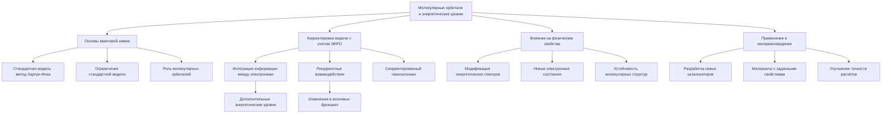
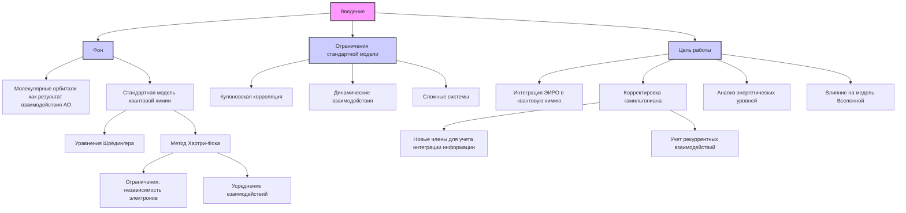
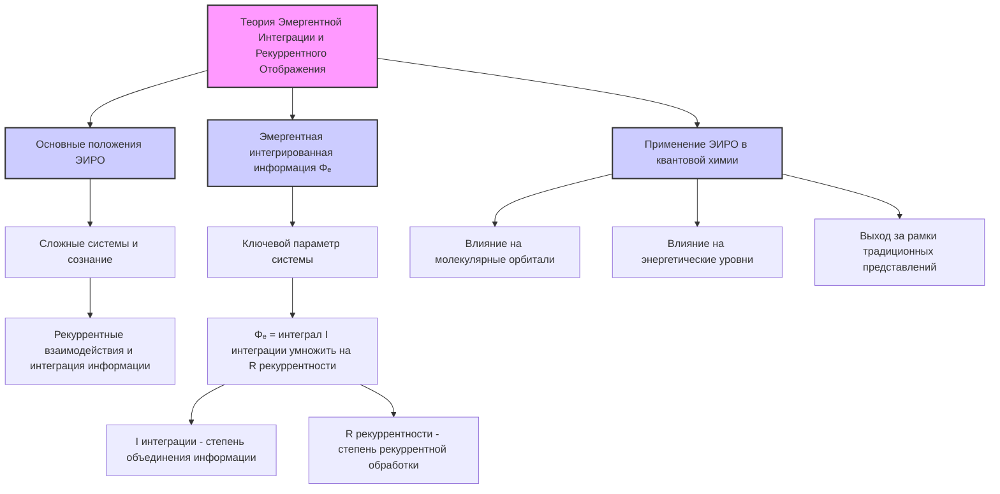
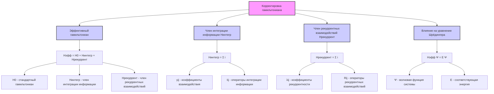
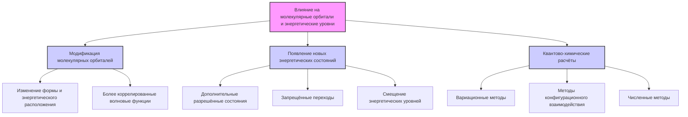
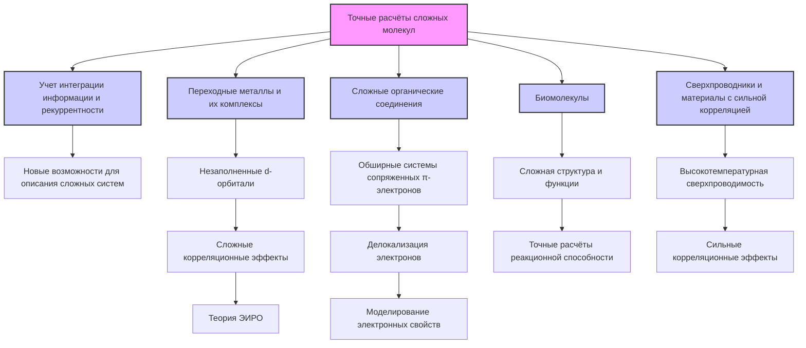
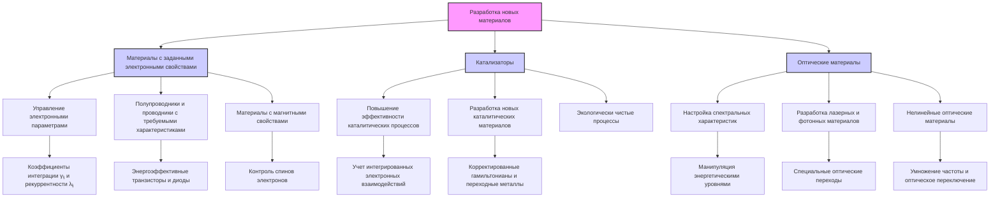
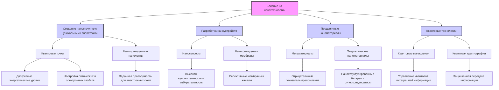

# Молекулярные орбитали и энергетические уровни: анализ через призму теории ЭИРО и ее влияние на современную модель Вселенной

---

## Аннотация

Молекулярные орбитали и энергетические уровни являются фундаментальными понятиями в квантовой химии, описывающими поведение электронов в молекулах. Стандартные методы, такие как метод Хартри-Фока, успешно применяются для описания простых систем, но имеют ограничения при рассмотрении более сложных молекулярных структур. В данной работе рассматривается применение теории Эмергентной Интеграции и Рекуррентного Отображения (ЭИРО) для расширения традиционной модели молекулярных орбиталей. Вводятся корректировки в гамильтониан системы, учитывающие интеграцию информации и рекуррентные взаимодействия между электронами. Анализируются последствия этих изменений для энергетических уровней молекул, свойств материалов и фундаментальных представлений о физических законах, управляющих нашей Вселенной.

---

### 1. Введение

#### 1.1. Фон

Молекулярные орбитали (МО) являются результатом взаимодействия атомных орбиталей (АО) при образовании молекул. Стандартная модель квантовой химии опирается на уравнения Шрёдингера и приближения, такие как метод Хартри-Фока, для описания электронных структур молекул. Однако эти методы основаны на ряде упрощений, включая независимость электронов и усреднение их взаимодействий, что ограничивает точность при рассмотрении сложных систем.

#### 1.2. Ограничения стандартной модели

- **Кулоновская корреляция**: Метод Хартри-Фока не учитывает корреляцию между электронами сверх среднего поля, что приводит к неточным описаниям энергетических уровней.

- **Динамические взаимодействия**: Отсутствие учета динамического обмена информацией между электронами ограничивает понимание электронных процессов в молекулах.

- **Сложные системы**: При описании молекул с делокализованными электронами или сильными электрон-электронными взаимодействиями точность стандартных методов снижается.

#### 1.3. Цель работы

- **Интеграция ЭИРО в квантовую химию**: Применить принципы теории Эмергентной Интеграции и Рекуррентного Отображения для улучшения модели молекулярных орбиталей.

- **Корректировка гамильтониана**: Ввести новые члены в гамильтониан, учитывающие интеграцию информации и рекуррентные взаимодействия между электронами.

- **Анализ энергетических уровней**: Исследовать, как эти изменения влияют на энергетические уровни молекул и прогнозирование их свойств.

- **Влияние на модель Вселенной**: Рассмотреть, как новый подход соотносится с современной моделью Вселенной и фундаментальными физическими теориями.

---

### 2. Теория Эмергентной Интеграции и Рекуррентного Отображения (ЭИРО)

#### 2.1. Основные положения ЭИРО

Теория ЭИРО утверждает, что сложные системы, включая сознание, возникают из процессов, объединяющих информацию через рекуррентные взаимодействия. В контексте квантовой химии это означает, что электроны могут не только взаимодействовать через обмен и корреляцию, но и интегрировать информацию, влияя на состояние друг друга более комплексным образом.

#### 2.2. Эмергентная интегрированная информация (Φₑ)

Ключевым параметром в ЭИРО является эмергентная интегрированная информация Φₑ, которая количественно характеризует степень интеграции информации в системе:

`Φₑ = ∫₀^(t₁) I_(интеграции)(t) ⋅ R_(рекуррентности)(t)dt,`

где  I(интеграции)(t)  — степень объединения информации в момент времени  t , а  R(рекуррентности)(t)  — степень рекуррентной обработки.

#### 2.3. Применение ЭИРО в квантовой химии

Применение ЭИРО в квантовой химии предполагает, что интеграция информации и рекуррентные взаимодействия между электронами могут влиять на молекулярные орбитали и энергетические уровни, выходя за рамки традиционных представлений о электрон-электронных взаимодействиях.

---

### 3. Корректировка гамильтониана

#### 3.1. Эффективный гамильтониан

Для учета эффектов ЭИРО вводится скорректированный гамильтониан:

`^H_(эфф) = ^H₀ + ^H_(интегр) + ^H_(рекуррент),`

где:

-  ^H₀  — стандартный гамильтониан молекулярной системы.

-  ^H_(интегр)  — член, учитывающий интеграцию информации между электронами.

-  ^H_(рекуррент)  — член, описывающий рекуррентные взаимодействия.

#### 3.2. Член интеграции информации ( ^H_(интегр) )

`^H_(интегр) = ∑_(i<j) γᵢⱼ ^Iᵢⱼ,`

где  γᵢⱼ  — коэффициенты взаимодействия, а  ^Iᵢⱼ  — операторы, описывающие степень интеграции информации между электронами  i  и  j .

#### 3.3. Член рекуррентных взаимодействий ( ^H_(рекуррент) )

`^H_(рекуррент) = ∑_(i<j) λᵢⱼ ^Rᵢⱼ,`

где  λᵢⱼ  — коэффициенты рекуррентности, а  ^Rᵢⱼ  — операторы рекуррентных взаимодействий между электронами.

#### 3.4. Влияние на уравнение Шрёдингера

Скорректированное уравнение Шрёдингера принимает вид:

`^H_(эфф) Ψ = E Ψ,`

где  Ψ  — волновая функция системы, учитывающая новые взаимодействия, а  E  — соответствующая энергия.

---

### 4. Влияние на молекулярные орбитали и энергетические уровни

#### 4.1. Модификация молекулярных орбиталей

Интеграция информации между электронами приводит к изменению формы и энергетического расположения молекулярных орбиталей. Волновые функции становятся более коррелированными, отражая сложные взаимодействия в системе.

#### 4.2. Появление новых энергетических состояний

**Рекуррентные эффекты могут приводить к**:

##### 4.2.1. Дополнительным разрешённым состояниям: 

Появление новых энергетических уровней, обусловленных рекуррентными взаимодействиями.

##### 4.2.2. Запрещённым переходам: 

Определённые переходы могут стать энергетически запрещёнными из-за нарушения баланса интеграции информации и рекуррентности.

##### 4.2.3. Смещение энергетических уровней: 

Изменение энергии существующих уровней, приводящее к сдвигу спектральных линий.

#### 4.3. Квантово-химические расчёты

Введение новых членов в гамильтониан требует применения продвинутых методов расчёта:

##### 4.3.1. Вариационные методы: 

Оптимизация волновой функции с учётом новых взаимодействий.

##### 4.3.2. Методы конфигурационного взаимодействия: 

Учет электронных корреляций на более глубоком уровне.

##### 4.3.3. Численные методы: 

Использование высокопроизводительных вычислений для решения скорректированных уравнений.

---

### 5. Применения и перспективы

#### 5.1. Точные расчёты сложных молекул

Учет интеграции информации и рекуррентности в квантово-химических моделях открывает новые возможности для точного описания сложных молекулярных систем, где стандартные методы сталкиваются с ограничениями. Это особенно актуально для молекул с сильной электронной корреляцией, таких как:

##### 5.1.1. Переходные металлы и их комплексы: 

Атомы переходных металлов обладают незаполненными d-орбиталями, которые участвуют в формировании химических связей и электронных взаимодействий. Стандартные методы, основанные на приближении независимых электронов, часто не способны адекватно описать такие системы из-за сложных корреляционных эффектов. Введение теории ЭИРО позволяет учитывать интегрированное взаимодействие между d-электронами, приводя к более точным прогнозам структурных, магнитных и каталитических свойств этих соединений.

##### 5.1.2. Сложные органические соединения: 

Большие молекулы с обширными системами сопряженных π-электронов, такие как графен, фуллерены или органические полупроводники, требуют учета делокализации электронов и их взаимной корреляции. Применение ЭИРО позволяет моделировать электронные свойства этих материалов с высокой точностью, что важно для разработки новых электронных устройств, органических солнечных элементов и светодиодов.

##### 5.1.3. Биомолекулы: 

Белки, ДНК и другие биологические макромолекулы обладают сложной структурой и функциями, зависящими от тонких электронных взаимодействий. Точные расчёты электронных свойств и реакционной способности этих молекул с учетом интеграции информации могут способствовать пониманию механизмов биохимических процессов и разработке новых лекарственных средств.

##### 5.1.4. Сверхпроводники и материалы с сильной корреляцией: 

Материалы, проявляющие высокотемпературную сверхпроводимость или другие экзотические состояния материи, требуют учета сильных корреляционных эффектов между электронами. Теория ЭИРО может предоставить инструменты для моделирования этих систем и предсказания новых материалов с уникальными свойствами.

#### 5.2. Разработка новых материалов

##### 5.2.1. Материалы с заданными электронными свойствами

- **Управление электронными параметрами**: Путём точной настройки коэффициентов интеграции информации ( γᵢⱼ ) и рекуррентности ( λᵢⱼ ) в модели, можно предсказывать и оптимизировать электронные свойства материалов. Это позволяет создавать материалы с заранее определёнными параметрами проводимости, подвижности носителей заряда и шириной запрещенной зоны.

- **Полупроводники и проводники с требуемыми характеристиками**: Возможность прогнозировать и контролировать электронные свойства материалов важна для микроэлектроники и оптоэлектроники. Новые материалы могут быть разработаны для создания более быстрых и энергоэффективных транзисторов, диодов и других электронных компонентов.

- **Материалы с магнитными свойствами**: Контроль интеграции информации между спинами электронов позволяет создавать материалы с заданными магнитными характеристиками, что актуально для спинтроники и хранения данных.

##### 5.2.2. Катализаторы

- **Повышение эффективности каталитических процессов**: Учет интегрированных электронных взаимодействий в катализаторах может привести к увеличению их активности и селективности. Это особенно важно для промышленного катализа, включая гидрогенизацию, окисление и синтез важных химических соединений.

- **Разработка новых каталитических материалов**: Введение корректированных гамильтонианов позволяет предсказывать и создавать новые катализаторы на основе переходных металлов, редкоземельных элементов и их сочетаний с органическими лигандными системами.

- **Экологически чистые процессы**: Улучшенные катализаторы могут способствовать развитию "зеленой химии", снижая энергозатраты и образование побочных продуктов в химических реакциях.

##### 5.2.3. Оптические материалы

- **Настройка спектральных характеристик**: Манипулируя энергетическими уровнями и переходами между ними, можно создавать материалы с определёнными спектральными свойствами, такими как поглощение, излучение и преломление света в заданных диапазонах.
- **Разработка лазерных и фотонных материалов**: Создание материалов с особыми оптическими переходами для использования в лазерных устройствах, оптических фильтрах и других фотонных приложениях.
- **Нелинейные оптические материалы**: Материалы с высокими нелинейными оптическими характеристиками важны для умножения частоты, оптического переключения и других приложений в оптико-электронных устройствах.

#### 5.3. Влияние на нанотехнологии

##### 5.3.1. Создание наноструктур с уникальными свойствами

- **Квантовые точки**: Квантовые точки характеризуются дискретными энергетическими уровнями благодаря квантовому ограничению. Управление интеграцией информации между электронами в таких системах позволяет точно настраивать их оптические и электронные свойства для применения в квантовых компьютерах, светодиодах и биомаркерах.

- **Нанопроводники и наноленты**: Контроль над электронными взаимодействиями в одномерных наноструктурах открывает возможность создания материалов с заданной проводимостью, которые могут быть использованы в электронных схемах на наномасштабе.

##### 5.3.2. Разработка наноустройств

- **Наносенсоры**: Устройства, способные обнаруживать отдельные молекулы или ионы, требуют материалов с высокой чувствительностью и избирательностью. Теория ЭИРО позволяет разрабатывать материалы, где интеграция информации между электронами усиливает отклик на внешние воздействия.

- **Нанофлюидика и мембраны**: Контроль над электронными свойствами материалов на наномасштабе важен для создания селективных мембран и каналов в нанофлюидных устройствах, применяемых в медицине и биотехнологии.

##### 5.3.3. Продвинутые наноматериалы

- **Метаматериалы**: Управление структурой на наномасштабе позволяет создавать материалы с отрицательным показателем преломления и другими необычными свойствами, которые не встречаются в природе. Это открывает перспективы в области оптики, включая создание "плащей-невидимок".

- **Энергетические наноматериалы**: Разработка эффективных наноматериалов для хранения и преобразования энергии, таких как наноструктурированные батареи, суперконденсаторы и материалы для водородной энергетики.

##### 5.3.4. Квантовые технологии

- **Квантовые вычисления**: Понимание и управление квантовой интеграцией информации между частицами являются ключевыми для разработки кубитов и реализации устойчивых квантовых операций в квантовых компьютерах.

- **Квантовая криптография**: Материалы и устройства, обеспечивающие защищенную передачу информации на основе квантовых эффектов, требуют точного контроля над рекуррентными взаимодействиями между квантовыми состояниями.

---

Таким образом, применение теории ЭИРО в различных областях науки и техники имеет потенциал значительно продвинуть развитие новых материалов и технологий, обеспечивая более глубокое понимание и контроль над электронными взаимодействиями в сложных системах. Это может привести к прорывным инновациям в электронике, энергетике, медицине и других сферах, оказывая существенное влияние на технологический прогресс и качество жизни.

---

### 6. Анализ основных научных вопросов через призму ЭИРО и новой модели Вселенной

```mermaid
graph TD
    A[Анализ основных научных вопросов через призму ЭИРО] --> B[Влияние интеграции информации на молекулярные орбитали]
    B --> C[Изменение волновых функций]
    B --> D[Энергетические состояния]
    B --> E[Аномальные спектральные линии]
    B --> F[Сверхпроводимость при высоких температурах]

    A --> G[Эффекты рекуррентности на молекулярные свойства]
    G --> H[Циклические пути обмена информацией]
    G --> I[Стабилизация состояний]
    G --> J[Переход в новые состояния]
    G --> K[Самосборка молекул]
    G --> L[Сложные биологические структуры]

    A --> M[Прогнозирование и разработка материалов]
    M --> N[Управление интеграцией информации]
    N --> O[Целенаправленное изменение электронных свойств]
    M --> P[Создание материалов с заданными характеристиками]
    P --> Q[Применение в электронике]
    P --> R[Применение в энергетике]
    P --> S[Применение в медицине]

    A --> T[Влияние на фундаментальные физические теории]
    T --> U[Новая интерпретация квантовой механики]
    T --> V[Связь с космологией]
    V --> W[Понимание тёмной материи]
    V --> X[Понимание тёмной энергии]
    T --> Y[Единая теория]
    Y --> Z[Объединение квантовой механики и теории информации]

    style A fill:#f9f,stroke:#333,stroke-width:2px;
    style B fill:#ccf,stroke:#333,stroke-width:2px;
    style G fill:#ccf,stroke:#333,stroke-width:2px;
    style M fill:#ccf,stroke:#333,stroke-width:2px;
    style T fill:#ccf,stroke:#333,stroke-width:2px;
```

#### 6.1. Влияние интеграции информации между электронами на молекулярные орбитали и энергетические уровни

Интеграция информации приводит к более глубокому уровню корреляции между электронами, что отражается в изменении волновых функций и энергетических состояний. Это может объяснить наблюдаемые эффекты, которые не описываются стандартной моделью, такие как аномальные спектральные линии или сверхпроводимость при высоких температурах.

#### 6.2. Эффекты рекуррентности на молекулярные свойства

Рекуррентные взаимодействия создают циклические пути обмена информацией между электронами, приводя к стабилизации определённых состояний или, наоборот, к возможности перехода в новые состояния. Это может объяснить механизмы самосборки молекул и возникновение сложных биологических структур.

#### 6.3. Прогнозирование и разработка материалов через управление интеграцией информации и рекуррентностью

Манипулируя параметрами интеграции информации ( γᵢⱼ ) и рекуррентности ( λᵢⱼ ), становится возможным целенаправленное изменение электронных свойств материалов. Это открывает путь к созданию материалов с заранее заданными характеристиками, необходимыми для электроники, энергетики и медицины.

#### 6.4. Влияние на фундаментальные физические теории и модель Вселенной

Применение ЭИРО в квантовой химии может иметь более глубокие последствия для понимания физического мира:

##### 6.4.1. Новая интерпретация квантовой механики: 

Включение информации как физической сущности может привести к пересмотру основ квантовой теории.

##### 6.4.2. Связь с космологией: 

Если интеграция информации и рекуррентность являются фундаментальными свойствами материи, это может отразиться на понимании таких явлений, как тёмная материя и тёмная энергия.

##### 6.4.3. Единая теория: 

Объединение квантовой механики с теорией информации может способствовать созданию единой теории, связывающей микроскопические и макроскопические явления.

---

### 7. Заключение

Внедрение теории Эмергентной Интеграции и Рекуррентного Отображения в квантовую химию открывает новые горизонты в понимании электронных взаимодействий и поведения молекул. Корректировка гамильтониана с учётом интеграции информации и рекуррентности позволяет более точно описывать энергетические уровни и прогнозировать свойства материалов. Данный подход не только улучшает существующие методы расчёта, но и предлагает новый взгляд на фундаментальные физические принципы, потенциально влияя на наши представления о Вселенной.

---

### 8. Будущие исследования

- **Экспериментальная проверка**: Проведение спектроскопических экспериментов для подтверждения предсказанных энергетических уровней и переходов.

- **Разработка вычислительных методов**: Создание новых алгоритмов и программного обеспечения для расчёта скорректированных гамильтонианов.

- **Интердисциплинарные исследования**: Исследование влияния ЭИРО на другие области, такие как биофизика, нейронаука и космология.

- **Философские аспекты**: Обсуждение влияния информации как физической сущности на философию науки и нашего понимания реальности.

---

### 9. Список литературы

1. Квантовая химия: Основы и приложения стандартных методов квантовой химии.

2. Теория ЭИРО: Глубокое знакомство с принципами интеграции информации и рекуррентности.

3. Современные исследования: Статьи и работы, посвященные интеграции информации в физике и ее влиянию на различные области науки.

4. Квантовая информатика: Связь между квантовой механикой и теорией информации, приложения в квантовых вычислениях.

---

### 10. Приложения

#### Математические выкладки

- Детальный вывод скорректированного гамильтониана и его компонентов.

- Примеры расчёта энергетических уровней для простых молекул с учётом новых членов гамильтониана.

#### Экспериментальные данные

- Таблицы и графики, сравнивающие предсказанные и экспериментально измеренные энергетические уровни.

- Обсуждение расхождений и их причин.

---

Оглавление: 
- [ЭИРО framework](/README.md)
- [Новая модель вселенной в современной физике](/A-new-model-of-the-universe-in-modern-physics.md)

