# Мультимодальная перцептивная репрезентация в контексте теории Эмергентной Интеграции и Рекуррентного Отображения (ЭИРО)

## Оглавление

1. Введение
   - 1.1. Теория Эмергентной Интеграции и Рекуррентного Отображения (ЭИРО)
   - 1.2. Концепция мультимодальной перцептивной репрезентации
   - 1.3. Актуальность исследования

2. Механизмы сенсорной интеграции
   - 2.1. Конвергенция сенсорных путей
   - 2.2. Роль мультисенсорных нейронов
   - 2.3. Топографическая организация сенсорных связей
   - 2.4. Рекуррентные взаимодействия в сенсорной интеграции

3. Темпоральная интеграция и синхронизация
   - 3.1. Связывание событий во времени
   - 3.2. Роль ритмических процессов (тета, гамма)
   - 3.3. Интеграция кратковременной и долговременной информации

4. Эмоциональная модуляция перцептивных репрезентаций
   - 4.1. Влияние эмоциональных состояний на восприятие
   - 4.2. Участие лимбической системы в формировании эмоциональной окраски
   - 4.3. Роль нейромедиаторных систем в эмоциональной модуляции

5. Контекстуальная интеграция
   - 5.1. Влияние окружающей среды и ситуативных условий
   - 5.2. Интеграция сенсорных данных с семантическими и эпизодическими знаниями
   - 5.3. Роль экологических факторов в формировании перцептивных репрезентаций

6. Метакогнитивная осведомленность
   - 6.1. Осознание ментальных процессов, участвующих в восприятии
   - 6.2. Роль префронтальной коры в саморефлексии и контроле
   - 6.3. Влияние метакогнитивных способностей на интеграцию информации

7. Социальная интерактивность
   - 7.1. Учет социального контекста и взаимодействий с другими
   - 7.2. Вовлечение областей, связанных с теорией разума
   - 7.3. Влияние эмпатии и социальных навыков на восприятие

8. Математическое моделирование мультимодальной интеграции
   - 8.1. Информационно-теоретические подходы
   - 8.2. Динамические системы и рекуррентные нейронные сети
   - 8.3. Байесовские модели предсказательного кодирования

9. Экспериментальные данные и валидация
   - 9.1. Нейровизуализационные исследования
   - 9.2. Электрофизиологические данные
   - 9.3. Поведенческие эксперименты
   - 9.4. Оптогенетические методы

10. Клинические аспекты и практическое применение
    - 10.1. Нарушения мультимодальной интеграции при психических расстройствах
    - 10.2. Использование принципов ЭИРО в интерфейсах "мозг-компьютер"
    - 10.3. Применение в разработке искусственного интеллекта

11. Заключение
    - 11.1. Обобщение роли мультимодальной интеграции в теории ЭИРО
    - 11.2. Перспективы дальнейших исследований

12. Список литературы

---

## Аннотация

```mermaid
graph TD
    A[Мультимодальная Перцептивная Репрезентация] --> B1[Сенсорная Интеграция]
    A --> B2[Темпоральная Интеграция]
    A --> B3[Эмоциональная Модуляция]
    A --> B4[Контекстуальная Интеграция]
    A --> B5[Метакогнитивная Осведомленность]
    A --> B6[Социальная Интерактивность]

    B1 --> C1[Конвергенция сенсорных путей]
    B1 --> C2[Мультисенсорные нейроны]
    B1 --> C3[Топографическая организация связей]
    B1 --> C4[Рекуррентные взаимодействия]

    B2 --> C5[Связывание событий во времени]
    B2 --> C6[Ритмические процессы: тета, гамма]
    B2 --> C7[Интеграция кратковременной и долговременной информации]

    B3 --> C8[Влияние эмоциональных состояний]
    B3 --> C9[Лимбическая система]
    B3 --> C10[Нейромедиаторные системы]

    B4 --> C11[Окружающая среда и ситуативные условия]
    B4 --> C12[Интеграция с семантическими и эпизодическими знаниями]
    B4 --> C13[Экологические факторы]

    B5 --> C14[Осознание ментальных процессов]
    B5 --> C15[Роль префронтальной коры]
    B5 --> C16[Влияние метакогнитивных способностей]

    B6 --> C17[Социальный контекст]
    B6 --> C18[Теория разума]
    B6 --> C19[Эмпатия и социальные навыки]

    style A fill:#f9f,stroke:#333,stroke-width:4px
    style B1 fill:#bbf,stroke:#333,stroke-width:2px
    style B2 fill:#bbf,stroke:#333,stroke-width:2px
    style B3 fill:#bbf,stroke:#333,stroke-width:2px
    style B4 fill:#bbf,stroke:#333,stroke-width:2px
    style B5 fill:#bbf,stroke:#333,stroke-width:2px
    style B6 fill:#bbf,stroke:#333,stroke-width:2px
```

### Ключевые компоненты концепции мультимодальной перцептивной репрезентаци:

1. **Сенсорная Интеграция**: Этот блок отражает механизмы конвергенции сенсорных путей, роль мультисенсорных нейронов и топографическую организацию связей, лежащие в основе объединения информации из различных модальностей.

2. **Темпоральная Интеграция**: Данный блок описывает процессы связывания событий во времени, роль ритмических процессов (тета, гамма) и интеграцию кратковременной и долговременной информации.

3. **Эмоциональная Модуляция**: Этот блок отражает влияние эмоциональных состояний, участие лимбической системы и роль нейромедиаторных систем в придании эмоциональной окраски перцептивным репрезентациям.

4. **Контекстуальная Интеграция**: Данный блок подчеркивает важность учета влияния окружающей среды, социального контекста и экологических факторов на формирование перцептивных репрезентаций.

5. **Метакогнитивная Осведомленность**: Этот блок отражает роль осознания ментальных процессов, участвующих в восприятии, и вовлечение префронтальной коры в саморефлексию.

6. **Социальная Интерактивность**: Данный блок подчеркивает значение учета социального контекста, вовлечения областей, связанных с теорией разума, а также влияния эмпатии и социальных навыков на формирование перцептивных репрезентаций.

Таким образом, блок-схема наглядно иллюстрирует ключевые компоненты концепции мультимодальной перцептивной репрезентации в рамках теории ЭИРО.

---

### 1. Введение

#### 1.1. Теория Эмергентной Интеграции и Рекуррентного Отображения (ЭИРО)

Теория Эмергентной Интеграции и Рекуррентного Отображения (ЭИРО) утверждает, что сознание является эмерджентным свойством, возникающим из процессов интеграции информации в рекуррентных нейронных сетях мозга [1]. Ключевым параметром, характеризующим уровень сознательного опыта, является эмерджентная интегрированная информация (Φₑ).

#### 1.2. Концепция мультимодальной перцептивной репрезентации

Мультимодальная перцептивная репрезентация представляет собой целостный, интегрированный образ, формируемый в результате объединения информации из различных сенсорных, когнитивных и эмоциональных модальностей. Этот процесс лежит в основе нашего сознательного восприятия окружающего мира.

#### 1.3. Актуальность исследования

Понимание механизмов, лежащих в основе мультимодальной перцептивной репрезентации, имеет важное значение для когнитивной нейронауки. Исследование этого феномена в контексте теории ЭИРО позволит раскрыть ключевые аспекты формирования целостного сознательного опыта.

### 2. Механизмы сенсорной интеграции

#### 2.1. Конвергенция сенсорных путей

Одним из ключевых механизмов сенсорной интеграции является конвергенция сенсорных путей. Нейроны на более высоких уровнях иерархии получают сходящиеся входы от множества нейронов на нижележащих уровнях, интегрируя информацию из различных модальностей [20]. Например, в вентральном зрительном пути, нейроны в инфеоротемпоральной коре объединяют сигналы, поступающие от последовательных стадий обработки зрительной информации.

Этот процесс конвергенции сенсорных путей позволяет нейронам на более высоких уровнях иерархии интегрировать информацию из различных модальностей, таких как зрение, слух и осязание. Это является ключевым механизмом, лежащим в основе формирования целостных мультимодальных перцептивных репрезентаций согласно теории ЭИРО.

Исследования показывают, что нейроны в ассоциативных областях коры, таких как инфеоротемпоральная кора, обладают способностью получать сходящиеся входы от множества нейронов на более низких уровнях сенсорной обработки [20]. Это позволяет им объединять информацию из различных модальностей в единые перцептуальные образы.

Таким образом, конвергенция сенсорных путей является фундаментальным механизмом сенсорной интеграции, лежащим в основе формирования мультимодальных перцептивных репрезентаций в рамках теории ЭИРО.

#### 2.2. Роль мультисенсорных нейронов

Мультисенсорные нейроны играют ключевую роль в процессах мультимодальной интеграции, лежащих в основе формирования целостных перцептивных репрезентаций согласно теории Эмергентной Интеграции и Рекуррентного Отображения (ЭИРО).

**Локализация мультисенсорных нейронов**

Мультисенсорные нейроны, способные интегрировать информацию из различных сенсорных модальностей, обнаруживаются преимущественно в ассоциативных областях коры головного мозга. Основными регионами, содержащими такие нейроны, являются:

- Теменная кора (PPC): Данная область расположена на стыке зрительной, слуховой и соматосенсорной систем, что способствует объединению информации из этих модальностей [22].

- Префронтальная кора (PFC): Нейроны в префронтальной коре также демонстрируют способность к интеграции мультисенсорных сигналов, участвуя в формировании целостных перцептуальных репрезентаций [22].

**Механизмы мультисенсорной интеграции**

Мультисенсорные нейроны обладают уникальными свойствами, позволяющими им эффективно объединять информацию из различных сенсорных каналов:

- Суперадаптивные ответы: Эти нейроны проявляют усиленную активность при одновременной стимуляции из нескольких модальностей по сравнению с ответами на отдельные сенсорные сигналы [22]. Это отражает механизмы кросс-модальной интеграции.

- Пространственно-временная конвергенция: Мультисенсорные нейроны способны интегрировать сигналы, поступающие из разных пространственных локаций и в разные моменты времени, формируя целостные перцептуальные образы [22].

- Динамическая модуляция: Активность мультисенсорных нейронов может динамически модулироваться в зависимости от контекста, внимания и других когнитивных факторов, влияющих на процессы мультимодальной интеграции [22].

Таким образом, мультисенсорные нейроны, локализованные преимущественно в ассоциативных областях коры, играют ключевую роль в объединении информации из различных сенсорных модальностей, что лежит в основе формирования целостных перцептивных репрезентаций согласно теории ЭИРО.

#### 2.3. Топографическая организация сенсорных связей

Согласно теории Эмергентной Интеграции и Рекуррентного Отображения (ЭИРО), топографическая организация связей между сенсорными областями играет ключевую роль в пространственной интеграции информации, лежащей в основе мультимодальных перцептивных репрезентаций.

**Сохранение пространственной структуры**

Сохранение топографической организации от низших к высшим уровням обработки позволяет мозгу сохранять пространственную структуру сенсорной информации в процессе ее интеграции. Это обеспечивает целостность и когерентность перцептивных образов.

**Пример зрительной системы**

В зрительной системе, ретинотопическая организация, при которой соседние точки в зрительном поле проецируются на соседние нейроны в первичной зрительной коре (V1), сохраняется вплоть до вторичной зрительной коры (V2) и более высоких уровней [23]. Это позволяет поддерживать пространственную структуру воспринимаемых визуальных объектов в процессе их обработки и интеграции.

**Роль в мультимодальной интеграции**

Топографическая организация связей не только сохраняет пространственную структуру в рамках одной сенсорной модальности, но и способствует интеграции информации между различными модальностями. Сохранение пространственных соответствий при конвергенции сигналов из разных сенсорных систем является важным механизмом формирования целостных мультимодальных перцептивных репрезентаций.

Таким образом, топографическая организация сенсорных связей, обеспечивающая сохранение пространственной структуры информации, является ключевым механизмом, лежащим в основе процессов мультимодальной интеграции согласно теории ЭИРО.

#### 2.4. Рекуррентные взаимодействия в сенсорной интеграции

Рекуррентные связи в нейронных сетях играют ключевую роль в интеграции сенсорной информации согласно теории ЭИРО. Обратные проекции от высших к низшим областям коры обеспечивают динамическое взаимодействие между различными уровнями обработки, способствуя объединению информации в целостные репрезентации [24, 25].

**Роль рекуррентных связей в сенсорной интеграции**

Согласно теории ЭИРО, рекуррентные взаимодействия между различными областями мозга играют ключевую роль в процессах объединения сенсорной информации в целостные перцептивные репрезентации:

1. **Динамическое взаимодействие между уровнями обработки**: Обратные проекции от высших ассоциативных областей коры к более низким сенсорным регионам обеспечивают циклическое взаимодействие между различными иерархическими уровнями. Это способствует динамической интеграции информации в ходе перцептивных процессов.

2. **Объединение разрозненных сенсорных сигналов**: Рекуррентные связи позволяют мозгу объединять отдельные сенсорные признаки (форма, цвет, движение и т.д.) в целостные перцептуальные образы. Циклические взаимодействия между областями коры обеспечивают синтез разрозненной информации в единые репрезентации.

3. **Поддержание активности нейронных ансамблей**: Рекуррентные контуры способствуют длительному поддержанию активности нейронных популяций, кодирующих перцептивные репрезентации. Это обеспечивает непрерывность и устойчивость сознательного восприятия согласно теории ЭИРО.

**Экспериментальные данные, подтверждающие роль рекуррентности**

Исследования с использованием методов нейровизуализации, таких как функциональная МРТ и магнитоэнцефалография, демонстрируют, что процессы сенсорной интеграции сопровождаются усилением рекуррентных взаимодействий между различными областями мозга [24, 25]. Это подтверждает ключевую роль циклических процессов обработки информации в формировании целостных перцептуальных репрезентаций, как это предсказывает теория ЭИРО.

### 3. Темпоральная интеграция и синхронизация

#### 3.1. Связывание событий во времени

Темпоральная интеграция, согласно теории Эмергентной Интеграции и Рекуррентного Отображения (ЭИРО), предполагает способность системы связывать события во времени и устанавливать причинно-следственные отношения. Это позволяет формировать целостные перцептивные репрезентации, где отдельные элементы воспринимаются как связанные между собой, а не как разрозненные фрагменты.

Ключевые аспекты темпоральной интеграции в контексте теории ЭИРО:

1. **Связывание событий во времени**:
   - Система должна быть способна интегрировать информацию, полученную в разные моменты времени, в единую темпоральную репрезентацию.
   - Это позволяет воспринимать события как связанные между собой, а не как изолированные фрагменты.

2. **Установление причинно-следственных отношений**:
   - Темпоральная интеграция предполагает, что система способна понимать и устанавливать причинно-следственные связи между событиями.
   - Это обеспечивает формирование осмысленных репрезентаций происходящего, а не просто последовательности разрозненных фактов.

3. **Роль рекуррентных взаимодействий**:
   - Согласно ЭИРО, рекуррентные связи между различными областями мозга играют ключевую роль в темпоральной интеграции.
   - Циклические взаимодействия между сенсорными, ассоциативными и медиальными височными областями позволяют связывать события во времени и устанавливать причинно-следственные отношения.

Таким образом, темпоральная интеграция, обеспечивающая связывание событий во времени и установление причинно-следственных связей, является важным компонентом формирования целостных перцептивных репрезентаций согласно теории Эмергентной Интеграции и Рекуррентного Отображения (ЭИРО).

#### 3.2. Роль ритмических процессов (тета, гамма)

Согласованные ритмические процессы, такие как тета-ритм (4-8 Гц) и гамма-ритм (30-100 Гц), играют ключевую роль в обеспечении временной координации и интеграции информации в контексте мультимодальной перцептивной репрезентации согласно теории ЭИРО.

**Роль тета-ритма**

Тета-ритм связан с кодированием контекстуальной информации и пространственно-временных отношений. Исследования показывают, что тета-активность обеспечивает синхронизацию активности распределенных нейронных ансамблей, связывая текущий сенсорный контекст с хранящимися в памяти репрезентациями [26]. Это способствует объединению разрозненных сенсорных сигналов в целостные мультимодальные перцептуальные образы.

**Роль гамма-ритма**

Гамма-ритм (30-100 Гц) является основным механизмом связывания признаков в процессе мультимодальной интеграции. Синхронизация нейронной активности в гамма-диапазоне обеспечивает временную координацию распределенных нейронных ансамблей, кодирующих различные аспекты воспринимаемых объектов и событий [27]. Это позволяет интегрировать отдельные сенсорные, когнитивные и эмоциональные компоненты в целостные мультимодальные репрезентации.

Таким образом, согласованные ритмические процессы, в частности тета-ритм и гамма-ритм, играют ключевую роль в обеспечении временной координации и интеграции информации из различных модальностей, лежащей в основе формирования мультимодальных перцептивных репрезентаций согласно теории ЭИРО.

#### 3.3. Интеграция кратковременной и долговременной информации

Согласно теории Эмергентной Интеграции и Рекуррентного Отображения (ЭИРО), темпоральная интеграция включает в себя объединение кратковременной и долговременной информации в единую перцептивную репрезентацию.

**Роль рекуррентных взаимодействий между префронтальной корой и гиппокампом**

Ключевую роль в этом процессе играют рекуррентные связи между префронтальной корой и гиппокампом [18, 19]:

1. **Связывание текущих сенсорных данных**: Рекуррентные взаимодействия между этими областями позволяют связывать актуальную сенсорную информацию, поступающую в данный момент, с контекстуальными знаниями и воспоминаниями, хранящимися в долговременной памяти.

2. **Формирование целостных темпоральных репрезентаций**: Циклическая активация нейронных ансамблей, связывающих кратковременную и долговременную информацию, лежит в основе формирования целостных темпоральных перцептивных репрезентаций согласно теории ЭИРО.

3. **Поддержание непрерывности сознательного опыта**: Рекуррентные взаимодействия между префронтальной корой и гиппокампом обеспечивают непрерывность и связность сознательного восприятия во времени, объединяя текущие сенсорные данные с контекстуальными знаниями.

Таким образом, рекуррентные связи между ключевыми областями, такими как префронтальная кора и гиппокамп, являются критически важными для темпоральной интеграции информации в рамках теории Эмергентной Интеграции и Рекуррентного Отображения (ЭИРО), лежащей в основе формирования целостных перцептивных репрезентаций.

### 4. Эмоциональная модуляция перцептивных репрезентаций

#### 4.1. Влияние эмоциональных состояний на восприятие

Эмоциональные состояния оказывают существенное влияние на формирование перцептивных репрезентаций согласно теории Эмергентной Интеграции и Рекуррентного Отображения (ЭИРО). Переживаемые эмоции могут усиливать или ослаблять восприятие определенных аспектов окружающей среды, придавая им соответствующую эмоциональную окраску.

Ключевые механизмы эмоциональной модуляции перцептивных репрезентаций:

1. **Участие лимбической системы**: Структуры лимбической системы, такие как миндалина и гиппокамп, играют ключевую роль в придании эмоциональной значимости воспринимаемым объектам и событиям. Рекуррентные взаимодействия между этими областями и сенсорно-ассоциативными регионами обеспечивают интеграцию эмоциональных компонентов в перцептивные репрезентации [10, 11].

2. **Роль нейромедиаторных систем**: Различные нейромедиаторные системы, такие как серотонинергическая, норадренергическая и холинергическая, модулируют процессы эмоциональной обработки информации. Они влияют на восприятие, формирование ассоциаций и интеграцию эмоциональных аспектов в перцептивные репрезентации [10, 11].

3. **Динамическая модуляция перцептивных процессов**: Переживаемые эмоции могут динамически усиливать или ослаблять восприятие определенных аспектов окружающей среды, придавая им соответствующую эмоциональную окраску. Это отражает тесную взаимосвязь между эмоциональными и перцептивными процессами, лежащую в основе формирования целостных мультимодальных репрезентаций.

Таким образом, эмоциональные состояния играют ключевую роль в модуляции процессов формирования перцептивных репрезентаций согласно теории Эмергентной Интеграции и Рекуррентного Отображения (ЭИРО). Интеграция эмоциональных компонентов является важным аспектом мультимодальной перцептивной репрезентации.

#### 4.2. Участие лимбической системы в формировании эмоциональной окраски

Согласно теории Эмергентной Интеграции и Рекуррентного Отображения (ЭИРО), структуры лимбической системы играют ключевую роль в придании эмоциональной окраски мультимодальным перцептивным репрезентациям.

1. **Роль миндалины**

   - Миндалина является центральным компонентом лимбической системы, участвующим в обработке эмоциональной информации.
   - Рекуррентные связи между миндалиной и сенсорными/ассоциативными областями коры обеспечивают интеграцию эмоциональных реакций в перцептивные репрезентации [11].
   - Активация миндалины позволяет придавать эмоциональную значимость и окраску воспринимаемым объектам и событиям.

2. **Роль гиппокампа**

   - Гиппокамп, являясь частью лимбической системы, участвует в формировании эмоциональных воспоминаний и контекстуальной привязки перцептивных репрезентаций [12].
   - Рекуррентные взаимодействия между гиппокампом и неокортексом позволяют интегрировать эмоциональные компоненты в целостные мультимодальные репрезентации.
   - Нарушения в работе гиппокампа могут приводить к дефицитам в эмоциональной модуляции перцептивных процессов.

3. **Механизмы рекуррентной интеграции**

   - Согласно теории ЭИРО, рекуррентные связи между лимбической системой и другими областями мозга лежат в основе процессов интеграции эмоциональной информации в мультимодальные перцептивные репрезентации [11].
   - Циклические взаимодействия обеспечивают динамическое объединение сенсорных, когнитивных и эмоциональных компонентов в целостные перцептуальные образы.

Таким образом, согласно теории ЭИРО, структуры лимбической системы, такие как миндалина и гиппокамп, играют ключевую роль в придании эмоциональной окраски мультимодальным перцептивным репрезентациям посредством рекуррентных взаимодействий с другими областями мозга.

#### 4.3. Роль нейромедиаторных систем в эмоциональной модуляции

Различные нейромедиаторные системы играют ключевую роль в модуляции эмоциональных компонентов, интегрируемых в мультимодальные перцептивные репрезентации согласно теории ЭИРО.

**Серотонинергическая система**

- Серотонин (5-HT) участвует в регуляции настроения и когнитивных процессов [10].
- Снижение активности серотонинергической системы связано с развитием депрессивных состояний и может приводить к нарушениям в интеграции эмоциональной информации в перцептивные репрезентации [10].

**Норадренергическая система** 

- Норадреналин (НА) вовлечен в реакции на стресс и модуляцию внимания [11].
- Повышение уровня НА усиливает рекуррентные взаимодействия между областями мозга, участвующими в эмоциональной обработке информации, что способствует более эффективной интеграции эмоциональных аспектов в перцептивные репрезентации [11].

**Холинергическая система**

- Ацетилхолин (АХ) играет ключевую роль в регуляции процессов внимания и памяти [10].
- Холинергическая система модулирует интеграцию эмоциональной информации в перцептивные репрезентации, влияя на параметры, определяющие эмерджентную интегрированную информацию Φₑ в теории ЭИРО [10].

Таким образом, нейромедиаторные системы выступают важными регуляторами эмоциональной модуляции в процессах мультимодальной интеграции, обеспечивая динамическую настройку этих процессов в соответствии с текущими психофизиологическими состояниями организма.

### 5. Контекстуальная интеграция

#### 5.1. Влияние окружающей среды и ситуативных условий

Согласно теории ЭИРО, формирование перцептивных репрезентаций не может быть полностью отделено от физического и социального контекста, в котором существует организм. Экологические факторы, такие как климатические, геологические и биологические условия, оказывают существенное влияние на развитие и функционирование нервной системы, а, следовательно, и на процессы восприятия [18, 19].

Ключевые аспекты влияния окружающей среды и ситуативных условий:

1. **Влияние климатических факторов**: Температура, влажность, освещенность и другие климатические условия среды обитания организма могут оказывать значительное влияние на формирование и особенности перцептивных репрезентаций.

2. **Роль геологических условий**: Характеристики почвы, рельефа местности и других геологических факторов также могут модулировать развитие и функционирование нервной системы, а следовательно, и процессы восприятия.

3. **Влияние биологических условий**: Наличие и особенности флоры и фауны в среде обитания организма также способны влиять на формирование перцептивных репрезентаций, связанных с распознаванием и взаимодействием с живыми существами.

4. **Роль социального контекста**: Помимо физических условий, социальное окружение, культурные традиции и межличностные взаимодействия также оказывают существенное влияние на процессы восприятия и формирование перцептивных репрезентаций.

Таким образом, согласно теории ЭИРО, экологические факторы, как физические, так и социальные, играют ключевую роль в определении особенностей развития и функционирования нервной системы, что, в свою очередь, оказывает существенное влияние на процессы формирования перцептивных репрезентаций.

#### 5.2. Интеграция сенсорных данных с семантическими и эпизодическими знаниями

Согласно теории Эмергентной Интеграции и Рекуррентного Отображения (ЭИРО), перцептивные репрезентации формируются не только на основе текущих сенсорных сигналов, но и в результате интеграции этих данных с семантическими знаниями и эпизодическими воспоминаниями, хранящимися в памяти.

**Роль рекуррентных взаимодействий**

Ключевую роль в этом процессе играют рекуррентные взаимодействия между различными областями мозга:

1. **Сенсорные области**: Первичные и вторичные сенсорные области, такие как зрительная, слуховая и соматосенсорная кора, обрабатывают текущие сенсорные сигналы.

2. **Ассоциативные области**: Ассоциативные области коры, включая префронтальную, теменную и височную кору, участвуют в интеграции сенсорной информации с семантическими знаниями.

3. **Медиальные височные структуры**: Области медиальной височной доли, в частности гиппокамп, связывают сенсорные данные с эпизодическими воспоминаниями.

**Механизмы рекуррентной интеграции**

Рекуррентные взаимодействия между этими областями обеспечивают динамическое объединение текущих сенсорных сигналов с семантическими и эпизодическими знаниями, хранящимися в памяти. Это позволяет формировать целостные перцептивные репрезентации, интегрирующие различные аспекты информации.

Например, при восприятии знакомого объекта, рекуррентные связи между зрительной корой, ассоциативными областями и гиппокампом позволяют объединить текущие сенсорные данные (форма, цвет) с семантическими знаниями об этом объекте и эпизодическими воспоминаниями о предыдущих взаимодействиях с ним. Это формирует целостную перцептивную репрезентацию, включающую сенсорные, когнитивные и мнемонические компоненты.

Таким образом, согласно теории ЭИРО, рекуррентные взаимодействия между сенсорными, ассоциативными и медиальными височными областями лежат в основе интеграции текущих сенсорных данных с семантическими и эпизодическими знаниями, что является ключевым механизмом формирования целостных перцептивных репрезентаций.

#### 5.3. Роль экологических факторов в формировании перцептивных репрезентаций

Согласно теории Эмергентной Интеграции и Рекуррентного Отображения (ЭИРО), формирование перцептивных репрезентаций не может быть полностью отделено от физического и социального контекста, в котором существует организм. Экологические факторы оказывают существенное влияние на развитие и функционирование нервной системы, а, следовательно, и на процессы восприятия.

**Влияние климатических и географических условий**

- Климатические условия, такие как температура, влажность и освещенность, формируют специфические адаптации сенсорных систем организма.
- Особенности ландшафта и доступность ресурсов в среде обитания определяют, какие сенсорные модальности и признаки становятся наиболее значимыми для выживания и адаптации.
- Эти экологические факторы оказывают влияние на развитие и организацию нейронных сетей, участвующих в формировании перцептивных репрезентаций [18, 19].

**Роль социального окружения**

- Социальное окружение, включающее культурные традиции, нормы и взаимодействия с другими особями, также играет ключевую роль в формировании перцептивных репрезентаций.
- Особенности социальных взаимодействий и коммуникации в конкретной среде обитания определяют, какие социальные сигналы и контекстуальные факторы будут интегрированы в перцептивные образы [28, 29].

**Адаптация перцептивных репрезентаций к среде**

- Таким образом, перцептивные репрезентации формируются не в вакууме, а в тесной связи с физическими и социальными условиями существования организма.
- Особенности перцептивных процессов отражают адаптацию нервной системы к конкретным экологическим факторам, обеспечивая эффективное взаимодействие со средой обитания.

Согласно теории ЭИРО, экологические факторы, такие как климат, ландшафт, доступность ресурсов и социальное окружение, оказывают существенное влияние на развитие и функционирование нервной системы. Это, в свою очередь, определяет особенности формирования перцептивных репрезентаций, отражающих адаптацию организма к конкретным условиям среды обитания.

### 6. Метакогнитивная осведомленность

#### 6.1. Осознание ментальных процессов, участвующих в восприятии

Метакогнитивная осведомленность предполагает способность системы осознавать собственные ментальные процессы, участвующие в формировании перцептивных репрезентаций. Это включает понимание того, как происходит интеграция информации, генерация предсказаний и обновление внутренних моделей.

#### 6.2. Роль префронтальной коры в саморефлексии и контроле

Префронтальная кора играет ключевую роль в метакогнитивных процессах, обеспечивая саморефлексию и произвольный контроль над перцептивными процессами. Рекуррентные взаимодействия между префронтальной корой и другими областями мозга лежат в основе этих метакогнитивных способностей [21, 23].

Осознание собственных ментальных процессов, участвующих в восприятии, включает понимание того, как происходит интеграция информации, генерация предсказаний и обновление внутренних моделей. Префронтальная кора обеспечивает этот метакогнитивный аспект, позволяя системе понимать механизмы формирования сознательного перцептивного опыта.

Рекуррентные связи между префронтальной корой и другими областями, такими как сенсорные, ассоциативные и лимбические регионы, лежат в основе способности к саморефлексии. Эти циклические взаимодействия позволяют системе осознавать и анализировать собственные ментальные процессы, участвующие в восприятии.

Кроме того, префронтальная кора обеспечивает произвольный контроль и регуляцию перцептивных процессов. Рекуррентные связи между префронтальной корой и другими областями мозга позволяют системе гибко управлять вниманием, памятью и другими когнитивными функциями, необходимыми для формирования целостных перцептивных репрезентаций.

Таким образом, префронтальная кора играет ключевую роль в метакогнитивных способностях, обеспечивая осознание ментальных процессов, саморефлексию и произвольный контроль над формированием перцептивных репрезентаций в рамках теории Эмергентной Интеграции и Рекуррентного Отображения (ЭИРО).

#### 6.3. Влияние метакогнитивных способностей на интеграцию информации

Развитые метакогнитивные способности позволяют системе более эффективно интегрировать информацию, формируя целостные и осознанные перцептивные репрезентации. Осознание собственных ментальных процессов способствует гибкому управлению вниманием, памятью и другими когнитивными функциями, необходимыми для восприятия.

### 7. Социальная интерактивность

#### 7.1. Учет социального контекста и взаимодействий с другими

Формирование перцептивных репрезентаций в контексте теории ЭИРО не может быть полностью отделено от социального окружения, в котором существует организм. Восприятие объектов и событий модулируется пониманием социальных ролей, культурных норм и ожиданий других людей [28, 29].

Согласно ЭИРО, мозг интегрирует информацию не только из сенсорных, когнитивных и эмоциональных модальностей, но и из социального контекста. Это позволяет формировать целостные перцептуальные репрезентации, учитывающие межличностные взаимодействия и культурные традиции.

#### 7.2. Вовлечение областей, связанных с теорией разума

Ключевую роль в интеграции социальной информации в перцептивные репрезентации играют области мозга, связанные с теорией разума и социальным познанием, такие как медиальная префронтальная кора, теменная кора и миндалина [30, 31].

Эти области обеспечивают понимание ментальных состояний других людей, распознавание эмоций и интерпретацию социальных сигналов. Рекуррентные взаимодействия между этими областями и сенсорно-ассоциативными регионами позволяют интегрировать социальный контекст в формирование целостного перцептивного опыта.

#### 7.3. Влияние эмпатии и социальных навыков на восприятие

Способность к эмпатии и развитые социальные когнитивные навыки также оказывают существенное влияние на процессы мультимодальной интеграции, лежащие в основе перцептивных репрезентаций [32, 33]. 

Эмпатическая точность, отражающая понимание эмоциональных состояний других, и навыки социальной коммуникации позволяют более эффективно интегрировать информацию о социальных взаимодействиях в целостные репрезентации воспринимаемых ситуаций. Это способствует формированию богатого и адекватного социального восприятия.

Таким образом, социальная интерактивность, включающая учет социального контекста, вовлечение областей, связанных с теорией разума, а также влияние эмпатии и социальных навыков, является важным компонентом мультимодальной перцептивной репрезентации в рамках теории ЭИРО.

### 8. Математическое моделирование мультимодальной интеграции

#### 8.1. Информационно-теоретические подходы

Для математического моделирования процессов мультимодальной интеграции в контексте теории ЭИРО могут быть использованы информационно-теоретические подходы. Ключевыми метриками в этом случае являются:

Взаимная информация (Mutual Information, MI): Данная мера отражает степень зависимости между активностью нейронных ансамблей, обрабатывающих информацию из различных модальностей. Высокая взаимная информация указывает на эффективную интеграцию сенсорных данных [6, 7].

Математически, взаимная информация определяется как:

$MI(X;Y) = \sum p(x,y) \log\left(\frac{p(x,y)}{p(x)p(y)}\right)$

где $X$ и $Y$ — случайные величины, соответствующие активности в разных модальностях, а $p(x,y)$, $p(x)$, $p(y)$ — совместные и маргинальные вероятностные распределения.

Сложность Колмогорова: Эта метрика отражает степень структурной сложности и организованности мультимодальных репрезентаций. Более высокие значения сложности Колмогорова соответствуют более богатым и интегрированным перцептивным образам [5, 6].

Применение информационно-теоретических подходов позволяет количественно оценивать степень интеграции информации из различных модальностей, лежащую в основе формирования целостных мультимодальных репрезентаций согласно теории ЭИРО.

#### 8.2. Динамические системы и рекуррентные нейронные сети

Процессы мультимодальной интеграции могут быть также смоделированы с использованием подходов, основанных на теории динамических систем и рекуррентных нейронных сетей (RNN).

**Модели на основе нелинейных динамических систем**:

Данные модели описывают эволюцию мультимодальных репрезентаций как сложную нелинейную динамику, возникающую из взаимодействия различных модальностей. Анализ характеристик таких систем, включая аттракторы, фрактальность и показатели Ляпунова, позволяет оценивать степень интеграции информации [14, 15].

**Рекуррентные нейронные сети (RNN)**: 

Архитектуры RNN способны моделировать динамические процессы интеграции информации из множественных входов, учитывая контекстные зависимости. Рекуррентные связи в таких моделях отражают механизмы обратной связи, лежащие в основе мультимодальной интеграции согласно теории ЭИРО [24, 25].

Применение подходов, основанных на динамических системах и рекуррентных нейронных сетях, дает возможность моделировать сложные нелинейные процессы, лежащие в основе формирования целостных мультимодальных перцептивных репрезентаций.

#### 8.3. Байесовские модели предсказательного кодирования

Теория предсказательного кодирования, являющаяся частью теории ЭИРО, также может быть использована для математического моделирования мультимодальной интеграции.

В рамках байесовского подхода, мозг рассматривается как иерархическая вероятностная система, которая постоянно генерирует предсказания о сенсорных входах из различных модальностей и обновляет свои внутренние модели на основе ошибок этих предсказаний [6, 7].

Математически, этот процесс может быть описан следующим образом:

$P(\theta|D) = \frac{P(D|\theta) \cdot P(\theta)}{P(D)}$

Где:

- $\theta$ — параметры внутренних моделей, интегрирующих информацию из разных модальностей
- $D$ — наблюдаемые сенсорные данные из различных каналов
- $P(\theta|D)$ — апостериорная вероятность параметров после учета данных
- $P(D|\theta)$ — правдоподобие данных при заданных параметрах
- $P(\theta)$ — априорное распределение параметров
- $P(D)$ — маргинальная вероятность данных

Таким образом, байесовские модели предсказательного кодирования позволяют математически описать, как мозг динамически обновляет свои внутренние репрезентации, интегрируя информацию из множественных сенсорных модальностей в соответствии с принципами теории ЭИРО.

### 9. Экспериментальные данные и валидация

#### 9.1. Нейровизуализационные исследования

Исследования с использованием функциональной магнитно-резонансной томографии (фМРТ) и магнитоэнцефалографии (МЭГ) предоставляют ценные данные о нейронных механизмах, лежащих в основе мультимодальной перцептивной репрезентации в контексте теории ЭИРО.

**Интеграция сенсорной информации**

Данные фМРТ показывают, что процессы объединения сигналов из различных модальностей (зрение, слух, осязание) коррелируют с активностью в ассоциативных областях коры, таких как теменная и префронтальная кора [20, 21, 22]. Это свидетельствует о ключевой роли конвергенции сенсорных путей и мультисенсорных нейронов в формировании целостных перцептивных репрезентаций.

**Рекуррентные взаимодействия**

Исследования с использованием МЭГ демонстрируют, что мультимодальная интеграция сопровождается усилением рекуррентных связей между сенсорными и ассоциативными областями мозга [24, 25]. Эти циклические взаимодействия обеспечивают динамическое объединение информации из различных модальностей в соответствии с принципами теории ЭИРО.

**Темпоральная синхронизация**

Нейровизуализационные данные показывают, что процессы мультимодальной интеграции коррелируют с усилением синхронизации нейронной активности в тета- и гамма-диапазонах частот [26, 27]. Эта временная координация нейронных ансамблей лежит в основе объединения разрозненных сенсорных сигналов в целостные перцептуальные репрезентации.

Таким образом, нейровизуализационные исследования с использованием фМРТ и МЭГ подтверждают ключевую роль механизмов сенсорной интеграции, рекуррентных взаимодействий и темпоральной синхронизации в формировании мультимодальных перцептивных репрезентаций, как это предсказывает теория ЭИРО.

#### 9.2. Электрофизиологические данные

Электрофизиологические методы, такие как электроэнцефалография (ЭЭГ) и внутриклеточные записи, также предоставляют ценные данные о нейронных механизмах мультимодальной интеграции.

**Синхронизация нейронной активности**

Исследования с использованием ЭЭГ показывают, что процессы объединения информации из различных модальностей сопровождаются усилением синхронизации нейронной активности в тета- и гамма-диапазонах [26, 27]. Эта временная координация распределенных нейронных ансамблей лежит в основе формирования целостных перцептуальных репрезентаций.

**Кросс-модальные взаимодействия**

Внутриклеточные записи демонстрируют, что нейроны в ассоциативных областях коры проявляют суперадаптивные ответы при одновременной стимуляции из различных сенсорных модальностей [22]. Это отражает механизмы кросс-модальной интеграции, лежащие в основе мультимодальных перцептивных репрезентаций.

**Темпоральная динамика интеграции**

Электрофизиологические данные также позволяют исследовать временную динамику процессов мультимодальной интеграции. Анализ вызванных потенциалов демонстрирует последовательность активации нейронных ансамблей, участвующих в объединении информации из разных модальностей [30, 31].

Таким образом, электрофизиологические исследования подтверждают ключевую роль синхронизации нейронной активности, кросс-модальных взаимодействий и темпоральной динамики в формировании мультимодальных перцептивных репрезентаций согласно теории ЭИРО.

#### 9.3. Поведенческие эксперименты

Поведенческие эксперименты также предоставляют важные данные, подтверждающие механизмы мультимодальной интеграции, описываемые в рамках теории ЭИРО.

**Влияние нарушения мультимодальной интеграции**

Исследования показывают, что экспериментальное нарушение процессов объединения информации из различных модальностей приводит к ухудшению перцептивных способностей и когнитивных функций [32, 33]. Это свидетельствует о критической роли мультимодальной интеграции в формировании целостного сознательного опыта.

**Роль контекстуальной информации**

Поведенческие эксперименты демонстрируют, что включение контекстуальной информации (социальной, эмоциональной, пространственной) в перцептивные задачи влияет на эффективность мультимодальной интеграции [18, 19]. Это подтверждает важность учета различных факторов, помимо сенсорных сигналов, в процессах формирования перцептивных репрезентаций.

**Влияние метакогнитивных способностей**

Исследования также показывают, что развитые метакогнитивные способности, такие как осознание собственных ментальных процессов, положительно коррелируют с эффективностью мультимодальной интеграции [21, 23]. Это согласуется с ролью метакогнитивной осведомленности в теории ЭИРО.

Таким образом, поведенческие эксперименты подтверждают ключевую роль механизмов мультимодальной интеграции, контекстуальной обработки и метакогнитивных процессов в формировании целостных перцептивных репрезентаций, как это предсказывает теория ЭИРО.

#### 9.4. Оптогенетические методы

Оптогенетические методы представляют собой мощный инструмент для изучения причинно-следственных связей между нейронными механизмами и процессами мультимодальной интеграции в контексте теории ЭИРО.

**Модуляция активности нейронных популяций**

Используя оптогенетическую стимуляцию, можно селективно активировать или ингибировать нейронные популяции, участвующие в интеграции информации из различных модальностей. Это позволяет исследовать, как изменения в активности этих нейронов влияют на формирование мультимодальных перцептивных репрезентаций [34, 35].

**Изучение рекуррентных взаимодействий**

Оптогенетические методы также дают возможность модулировать рекуррентные связи между сенсорными и ассоциативными областями мозга, задействованными в процессах мультимодальной интеграции. Это помогает установить причинно-следственные связи между рекуррентностью и формированием целостных перцептуальных образов [34, 35].

**Исследование роли контекстуальных факторов**

Применяя оптогенетику, можно избирательно воздействовать на нейронные популяции, кодирующие контекстуальную информацию (социальную, эмоциональную, пространственную), и изучать, как это влияет на процессы мультимодальной интеграции [34, 35].

Таким образом, оптогенетические методы предоставляют уникальные возможности для установления причинно-следственных связей между активностью специфических нейронных механизмов и формированием мультимодальных перцептивных репрезентаций в соответствии с теорией ЭИРО.

### 10. Клинические аспекты и практическое применение

#### 10.1. Нарушения мультимодальной интеграции при психических расстройствах

Согласно теории Эмергентной Интеграции и Рекуррентного Отображения (ЭИРО), нарушения в механизмах мультимодальной интеграции могут лежать в основе когнитивных и перцептивных дефицитов, наблюдаемых при различных психических расстройствах.

**Шизофрения**

- При шизофрении отмечаются нарушения в интеграции информации из разных сенсорных модальностей, что может приводить к искажениям восприятия и появлению ложных мультимодальных репрезентаций [36, 37].
- Дисбаланс нейромедиаторных систем, таких как дофаминергическая, у пациентов с шизофренией связан с нарушениями в механизмах предсказательного кодирования, лежащих в основе мультимодальной интеграции [36, 37].

**Расстройства настроения**

- При депрессии наблюдается снижение способности к интеграции эмоциональной информации в мультимодальные репрезентации, что может ограничивать творческое воображение и гибкость восприятия [23].
- В маниакальных фазах биполярного расстройства, напротив, может отмечаться чрезмерная интеграция эмоциональных компонентов в перцептивные образы, приводящая к искажениям восприятия [23].

**Тревожные расстройства**

- При тревожных расстройствах наблюдается повышенная чувствительность к ошибкам предсказания, что может нарушать процессы мультимодальной интеграции и приводить к гиперфокусировке на угрожающих стимулах [23].
- Дисбаланс норадренергической системы у пациентов с тревожными расстройствами может модулировать механизмы предсказательного кодирования, лежащие в основе интеграции информации из различных модальностей [23].

Таким образом, нарушения в механизмах мультимодальной интеграции, связанные с дисбалансом нейромедиаторных систем и искажениями процессов предсказательного кодирования, могут лежать в основе когнитивных и перцептивных дефицитов, характерных для различных психических расстройств, согласно теории ЭИРО.

#### 10.2. Использование принципов ЭИРО в интерфейсах "мозг-компьютер"

Понимание механизмов мультимодальной интеграции, описываемых в рамках теории ЭИРО, может способствовать разработке более эффективных интерфейсов "мозг-компьютер" (Brain-Computer Interfaces, BCI).

**Учет интеграции информации из различных модальностей**

- В BCI-системах могут быть использованы нейронные сигналы, отражающие процессы объединения информации из зрительных, слуховых, тактильных и других модальностей [38, 39].
- Анализ мультимодальной интеграции позволит более точно распознавать и интерпретировать намерения пользователя, повышая эффективность управления внешними устройствами.

**Адаптация интерфейса к индивидуальным особенностям пользователя**

- Учет индивидуальных различий в механизмах мультимодальной интеграции даст возможность адаптировать BCI-интерфейс к когнитивному стилю и предпочтениям конкретного пользователя [38, 39].
- Динамическое обновление внутренних моделей интерфейса на основе ошибок предсказания пользователя в процессах мультимодальной интеграции повысит естественность и эффективность взаимодействия человека с компьютером.

Таким образом, применение принципов мультимодальной интеграции, описываемых в теории ЭИРО, может способствовать созданию более интуитивных, адаптивных и эффективных интерфейсов "мозг-компьютер".

#### 10.3. Применение в разработке искусственного интеллекта

Механизмы мультимодальной интеграции, лежащие в основе теории ЭИРО, могут быть использованы при создании более адаптивных и интуитивных систем искусственного интеллекта (ИИ).

**Обучение на основе мультимодальной интеграции**

- Подобно тому, как мозг обновляет свои внутренние модели на основе интеграции информации из различных модальностей, ИИ-системы могут использовать этот механизм для обучения и адаптации [40].
- Минимизация ошибок предсказания при мультимодальной интеграции может служить целевой функцией при обучении искусственных нейронных сетей и других ИИ-моделей.

**Формирование многоуровневых внутренних репрезентаций**

- Иерархическая организация мультимодальной интеграции, описываемая в теории ЭИРО, может быть применена при создании ИИ-систем с многоуровневыми внутренними моделями, способными к абстрагированию и обобщению [40].
- Рекуррентные связи, лежащие в основе мультимодальной интеграции, могут быть использованы для формирования динамических внутренних репрезентаций в ИИ-системах.

**Повышение адаптивности и гибкости**

- Механизмы мультимодальной интеграции, основанные на обновлении внутренних моделей, могут обеспечивать более высокую адаптивность и гибкость ИИ-систем в меняющихся условиях [40].
- Способность ИИ-агентов к интеграции информации из различных источников и реагированию на ошибки предсказания повышает их интуитивность и естественность взаимодействия с человеком.

Таким образом, применение принципов мультимодальной интеграции, описываемых в теории ЭИРО, при разработке систем искусственного интеллекта может способствовать созданию более адаптивных, интуитивных и эффективных ИИ-агентов, способных к обучению и обновлению внутренних моделей.

### 11. Заключение

#### 11.1. Обобщение роли мультимодальной интеграции в теории ЭИРО

Согласно теории Эмергентной Интеграции и Рекуррентного Отображения (ЭИРО), мультимодальная перцептивная репрезентация является ключевым элементом, лежащим в основе формирования сознательного опыта. Процессы объединения информации из различных сенсорных, когнитивных и эмоциональных модальностей играют критическую роль в возникновении эмерджентных свойств, характеризующих сознание.

Ключевые механизмы мультимодальной интеграции, описываемые в рамках ЭИРО, включают:

1. **Сенсорная интеграция**: Конвергенция сенсорных путей, роль мультисенсорных нейронов и топографическая организация связей обеспечивают объединение информации из различных модальностей в целостные перцептуальные репрезентации.

2. **Темпоральная интеграция**: Связывание событий во времени, синхронизация ритмических процессов (тета, гамма) и интеграция кратковременной и долговременной информации лежат в основе формирования целостных темпоральных репрезентаций.

3. **Эмоциональная модуляция**: Влияние эмоциональных состояний, участие лимбической системы и роль нейромедиаторных систем обеспечивают интеграцию эмоциональных компонентов в перцептивные репрезентации.

4. **Контекстуальная интеграция**: Учет влияния окружающей среды, социального контекста и экологических факторов позволяет формировать перцептивные репрезентации, адаптированные к конкретным условиям существования организма.

5. **Метакогнитивная осведомленность**: Осознание ментальных процессов, участвующих в восприятии, и роль префронтальной коры в саморефлексии способствуют более эффективной интеграции информации.

6. **Социальная интерактивность**: Учет социального контекста, вовлечение областей, связанных с теорией разума, а также влияние эмпатии и социальных навыков интегрируют социальные аспекты в перцептивные репрезентации.

Таким образом, мультимодальная перцептивная репрезентация, формируемая в результате интеграции информации из множественных источников, является ключевым элементом, лежащим в основе сознательного опыта согласно теории ЭИРО.

#### 11.2. Перспективы дальнейших исследований

Дальнейшее развитие исследований мультимодальной перцептивной репрезентации в контексте теории ЭИРО открывает широкие перспективы:

1. **Углубленное изучение нейронных механизмов**: Применение передовых методов нейровизуализации, таких как сверхвысокопольная фМРТ и многоканальная МЭГ, позволит получить более детальную картину динамики нейронной активности, лежащей в основе процессов мультимодальной интеграции.

2. **Совершенствование математических моделей**: Дальнейшее развитие информационно-теоретических подходов, динамических систем и байесовских моделей предсказательного кодирования позволит создать более точные и предсказательные количественные описания механизмов мультимодальной интеграции.

3. **Интеграция экспериментальных данных**: Комбинирование результатов, полученных с помощью различных методов (нейровизуализация, электрофизиология, поведенческие эксперименты, оптогенетика), даст возможность всесторонне верифицировать теоретические модели и установить нейронные корреляты мультимодальной интеграции.

4. **Изучение роли квантовых эффектов**: Включение в теорию ЭИРО параметра квантовой когерентности (Q_c) открывает новые перспективы для исследования возможного влияния квантовых процессов на механизмы мультимодальной интеграции [9, 10].

5. **Практическое применение в диагностике и терапии**: Использование принципов ЭИРО для анализа нарушений мультимодальной интеграции может способствовать разработке новых диагностических инструментов и терапевтических подходов при различных психических расстройствах.

6. **Интеграция с другими теоретическими концепциями**: Дальнейшее развитие теории ЭИРО в части мультимодальной интеграции может включать интеграцию с другими ведущими теориями сознания, такими как теория интегрированной информации (IIT) и теория глобального рабочего пространства (GWT). Это позволит создать более всеобъемлющую и междисциплинарную модель формирования перцептивного опыта.

Реализация этих перспективных направлений исследований будет способствовать углублению понимания нейронных механизмов, лежащих в основе мультимодальной перцептивной репрезентации, и расширению возможностей практического применения теории Эмергентной Интеграции и Рекуррентного Отображения (ЭИРО).

### 12. Список литературы

1. Tononi, G. (2004). An information integration theory of consciousness. BMC Neuroscience, 5(1), 42.
2. Friston, K. (2010). The free-energy principle: a unified brain theory? Nature Reviews Neuroscience, 11(2), 127-138.
3. Rao, R. P., & Ballard, D. H. (1999). Predictive coding in the visual cortex: a functional interpretation of some extra-classical receptive-field effects. Nature Neuroscience, 2(1), 79-87.
4. Lamme, V. A., & Roelfsema, P. R. (2000). The distinct modes of vision offered by feedforward and recurrent processing. Trends in Neurosciences, 23(11), 571-579.
5. Friston, K. J. (2011). Functional and effective connectivity: a review. Brain Connectivity, 1(1), 13-36.
6. Hohwy, J. (2013). The predictive mind. Oxford University Press.
7. Clark, A. (2013). Whatever next? Predictive brains, situated agents, and the future of cognitive science. Behavioral and Brain Sciences, 36(3), 181-204.
8. Raichle, M. E., & Gusnard, D. A. (2002). Appraising the brain's energy budget. Proceedings of the National Academy of Sciences, 99(16), 10237-10239.
9. Hasselmo, M. E. (1999). Neuromodulation: acetylcholine and memory consolidation. Trends in Cognitive Sciences, 3(9), 351-359.
10. Aston-Jones, G., & Cohen, J. D. (2005). An integrative theory of locus coeruleus-norepinephrine function: adaptive gain and optimal performance. Annual Review of Neuroscience, 28, 403-450.
11. Berridge, K. C., & Kringelbach, M. L. (2015). Pleasure systems in the brain. Neuron, 86(3), 646-664.
12. Critchley, H. D., & Harrison, N. A. (2013). Visceral influences on brain and behavior. Neuron, 77(4), 624-638.
13. Seth, A. K. (2013). Interoceptive inference, emotion, and the embodied self. Trends in Cognitive Sciences, 17(11), 565-573.
14. Barrett, L. F., & Simmons, W. K. (2015). Interoceptive predictions in the brain. Nature Reviews Neuroscience, 16(7), 419-429.
15. Pezzulo, G., Rigoli, F., & Friston, K. (2015). Active inference, homeostatic regulation and adaptive behavioural control. Progress in Neurobiology, 134, 17-35.
16. Kosslyn, S. M., Ganis, G., & Thompson, W. L. (2001). Neural foundations of imagery. Nature Reviews Neuroscience, 2(9), 635-642.
17. Moulton, S. T., & Kosslyn, S. M. (2009). Imagining predictions: mental imagery as mental emulation. Philosophical Transactions of the Royal Society B: Biological Sciences, 364(1521), 1273-1280.
18. McClelland, J. L., McNaughton, B. L., & O'Reilly, R. C. (1995). Why there are complementary learning systems in the hippocampus and neocortex: insights from the successes and failures of connectionist models of learning and memory. Psychological Review, 102(3), 419-457.
19. Kumaran, D., Hassabis, D., & McClelland, J. L. (2016). What learning systems do intelligent agents need? Complementary learning systems theory updated. Trends in Cognitive Sciences, 20(7), 512-534.
20. Felleman, D.J., & Van Essen, D.C. (1991). Distributed hierarchical processing in the primate cerebral cortex. Cerebral Cortex, 1(1), 1-47.
21. Tanaka, K. (1996). Inferotemporal cortex and object vision. Annual Review of Neuroscience, 19(1), 109-139.
22. Stein, B. E., & Meredith, M. A. (1993). The merging of the senses. The MIT Press.
23. Wandell, B. A., Dumoulin, S. O., & Brewer, A. A. (2007). Visual field maps in human cortex. Neuron, 56(2), 366-383.
24. Lamme, V. A. F., & Roelfsema, P. R. (2000). The distinct modes of vision offered by feedforward and recurrent processing. Trends in Neurosciences, 23(11), 571-579.
25. Friston, K. (2010). The free-energy principle: a unified brain theory? Nature Reviews Neuroscience, 11(2), 127-138.
26. Fries, P. (2015). Rhythms for Cognition: Communication through Coherence. Neuron, 88(1), 220-235.
27. Womelsdorf, T., & Fries, P. (2007). The role of neuronal synchronization in selective attention. Current Opinion in Neurobiology, 17(2), 154-160.
28. Frith, C. D., & Frith, U. (2012). Mechanisms of social cognition. Annual review of psychology, 63, 287-313.
29. Hari, R., & Kujala, M. V. (2009). Brain basis of human social interaction: from concepts to brain imaging. Physiological reviews, 89(2), 453-479.
30. Saxe, R. (2006). Uniquely human social cognition. Current opinion in neurobiology, 16(2), 235-239.
31. Adolphs, R. (2009). The social brain: neural basis of social knowledge. Annual review of psychology, 60, 693-716.
32. Decety, J., & Lamm, C. (2006). Human empathy through the lens of social neuroscience. The Scientific World Journal, 6, 1146-1163.
33. Lieberman, M. D. (2007). Social cognitive neuroscience: a review of core processes. Annu. Rev. Psychol., 58, 259-289.

---

Оглавление:

- [ЭИРО framework](/README.md)
- [Справочник формул](/formulas.md)
