# Нейрокогнитивные механизмы восприятия в контексте эмергентной интеграции: от сенсорных входов к осознанному опыту

```mermaid
flowchart TD
    A[Иерархия сенсорных систем] --> B1[Первичные сенсорные зоны]
    B1 -->|Зрение| C1[Зрительная кора V1<br>Ориентация Контраст Движение]
    B1 -->|Слух| C2[Слуховая кора A1<br>Частота Интенсивность]
    B1 -->|Осязание| C3[Соматосенсорная кора S1<br>Давление Температура]

    A --> B2[Ассоциативные зоны]
    B2 -->|Вентральный поток| D1[Распознавание объектов<br>V2 V4 IT]
    B2 -->|Дорсальный поток| D2[Пространство и движение<br>V3 MT MST]
    B2 -->|Интеграция| D3[Мультимодальные центры<br>Теменная и Префронтальная кора]

    A --> B3[Таламокортикальные петли]
    B3 --> E1[Обратная связь и внимание]
    B3 --> E2[Рекуррентная обработка<br>Динамика сигналов]

    F[Сенсорная интеграция] --> G1[Временная синхронизация]
    G1 -->|Гамма| H1[30-100 Гц<br>Связывание признаков]
    G1 -->|Тета| H2[4-8 Гц<br>Контекст и память]
    G1 -->|Альфа| H3[8-12 Гц<br>Торможение и внимание]

    F --> G2[Пространственная интеграция]
    G2 -->|Конвергенция| H4[Сходящие входы<br>Вентральный путь]
    G2 -->|Мультисенсорные нейроны| H5[Объединение модальностей<br>Теменная кора]
    G2 -->|Топография| H6[Сохранение структуры сигналов]

    I[Предиктивное кодирование] --> J1[Генерация предсказаний]
    I --> J2[Ошибки предсказания]
    I --> J3[Обновление моделей]

    K[Экспериментальные данные] --> L1[fMRI<br>Иерархическая обработка]
    K --> L2[MEG<br>Рекуррентная динамика]
    K --> L3[Коннектом<br>Связи и интеграция]

    M[Математические модели] --> N1["Динамические системы<br>F(X U λᵢⱼ)"]
    M --> N2[Информационные метрики<br>Φₑ CD MI]
```

---

## Введение

Восприятие окружающего мира является фундаментальным процессом, лежащим в основе нашего взаимодействия с реальностью. Оно позволяет нам формировать целостные представления о предметах, событиях и их пространственно-временных отношениях. Однако механизмы, обеспечивающие этот сложный когнитивный процесс, до сих пор остаются предметом активных исследований в нейронауке.

Согласно теории Эмергентной Интеграции и Рекуррентного Отображения (ЭИРО), сознательное восприятие возникает из процессов объединения информации через рекуррентные нейронные сети. Ключевым параметром является эмергентная интегрированная информация (Φₑ), которая учитывает количество и качество интегрированной информации в контексте рекуррентной обработки. Таким образом, ЭИРО предлагает комплексный подход к пониманию нейрокогнитивных механизмов, лежащих в основе восприятия и сознания.

В данной диссертации мы исследуем, каким образом принципы ЭИРО реализуются в архитектуре и динамике нейронных сетей, обеспечивающих процессы восприятия у человека. Мы рассмотрим иерархическую организацию сенсорных систем, механизмы сенсорной интеграции, роль предиктивного кодирования, а также представим экспериментальные данные, подтверждающие ключевые положения теории. Кроме того, мы обсудим математические модели, позволяющие количественно описать динамику и информационные характеристики нейронных процессов, лежащих в основе перцептивного опыта.

Понимание нейрокогнитивных механизмов восприятия имеет важное значение не только для фундаментальной науки, но и для разработки интеллектуальных систем, способных эффективно взаимодействовать с окружающей средой. Исследования в этой области могут также пролить свет на природу сознания и его нарушений при различных патологических состояниях. Таким образом, данная работа вносит вклад в комплексное понимание системы восприятия человека через призму теории ЭИРО.

### 1. АРХИТЕКТУРА СИСТЕМЫ ВОСПРИЯТИЯ

#### 1.1. Иерархическая организация сенсорных систем

##### 1.1.1. Первичные сенсорные зоны (V1, A1, S1):

- Первичная зрительная кора (V1) получает входные сигналы от сетчатки и обрабатывает базовые характеристики зрительных стимулов, такие как ориентация, контраст, движение.
- Первичная слуховая кора (A1) анализирует элементарные акустические признаки, как частота, интенсивность, временная структура звуков.
- Первичная соматосенсорная кора (S1) кодирует базовые тактильные ощущения, такие как давление, вибрация, температура.

##### 1.1.2. Вторичные ассоциативные области:

- Вентральный зрительный поток (V2, V4, IT) специализируется на распознавании объектов и формировании семантических представлений.
- Дорсальный зрительный поток (V3, MT, MST) обрабатывает информацию о пространственном положении, движении и действиях.
- Вторичные слуховые (A2) и соматосенсорные (S2) области интегрируют более сложные признаки модальностей.

##### 1.1.3. Мультимодальные интегративные центры:

- Теменная кора (PPC) объединяет зрительную, слуховую и тактильную информацию для построения пространственных репрезентаций.
- Префронтальная кора (PFC) участвует в управлении вниманием, принятии решений и формировании осознанного опыта.
- Медиальные структуры (гиппокамп, парагиппокампальная кора) связывают сенсорные данные с контекстуальной информацией и эпизодической памятью.

> Согласно исследованиям Фельдман-Барретт (2017), восприятие организовано как предиктивная иерархия, где каждый уровень генерирует прогнозы для нижележащих уровней. Верхние уровни абстрактных представлений оказывают "top-down" влияние на нижележащие сенсорные процессы, формируя наше осознанное восприятие мира.

#### 1.2. Нейронные сети восприятия

Восприятие в мозге человека реализуется через сложную архитектуру взаимосвязанных нейронных сетей. Ключевыми компонентами являются:

##### 1.2.1. Вентральный и дорсальный потоки обработки:

- Вентральный поток ("что") - отвечает за идентификацию и категоризацию воспринимаемых объектов. Включает первичную зрительную кору (V1-V4) и вентральные височные области.

- Дорсальный поток ("где/как") - отвечает за пространственную локализацию объектов и контроль действий. Включает первичную зрительную кору, теменные области и премоторные регионы.

Согласно модели Гудейла и Милнера (1992), эти два потока параллельно обрабатывают различные аспекты воспринимаемой информации.

##### 1.2.2. Фронто-париетальная сеть интеграции:

- Объединяет информацию из вентрального и дорсального потоков.

- Включает префронтальную кору, теменные области и премоторные регионы.

- Играет ключевую роль в формировании осознанного восприятия и контроле внимания.

Нейровизуализационные исследования (Corbetta & Shulman, 2002) показывают активацию этой сети при выполнении задач, требующих интеграции пространственных и объектных признаков.

##### 1.2.3. Таламокортикальные петли обратной связи:

- Связывают первичные сенсорные области с таламусом.

- Обеспечивают рекуррентную обработку сенсорной информации.

- Играют важную роль в процессах внимания, сознательного восприятия и обучения.

Электрофизиологические данные (Sherman & Guillery, 2002) демонстрируют, что таламус не только передает сенсорные сигналы в кору, но и получает обратную связь, формируя динамические петли взаимодействия.

> Таким образом, система восприятия в мозге человека представляет собой сложную сеть взаимосвязанных нейронных контуров, обеспечивающих параллельную обработку, интеграцию и рекуррентную динамику сенсорной информации. Эта архитектура лежит в основе формирования осознанного перцептивного опыта.

---

### 2. МЕХАНИЗМЫ СЕНСОРНОЙ ИНТЕГРАЦИИ

#### 2.1 Временная синхронизация

Одним из ключевых механизмов сенсорной интеграции является временная синхронизация активности нейронных популяций. Исследования показывают, что различные частотные диапазоны осцилляций играют важную роль в объединении информации.

##### 2.1.1. Гамма-осцилляции (30-100 Гц)

Гамма-ритм является основным механизмом связывания признаков в процессе восприятия. Синхронизация нейронной активности в гамма-диапазоне обеспечивает временную координацию распределенных нейронных ансамблей, кодирующих различные аспекты воспринимаемого объекта (Fries, 2009). Это позволяет интегрировать отдельные сенсорные признаки (форма, цвет, движение) в целостное перцептивное представление. Нарушения гамма-синхронизации связаны с дефицитами в процессах восприятия и когнитивных функциях (Uhlhaas & Singer, 2010).

##### 2.1.2. Тета-ритм (4-8 Гц)

Тета-активность играет ключевую роль в кодировании контекстуальной информации и пространственно-временных отношений. Исследования показывают, что тета-ритм обеспечивает связь между сенсорными, мнемоническими и исполнительными процессами (Hasselmo & Stern, 2014). Тета-осцилляции синхронизируют активность распределенных нейронных ансамблей, связывая текущий сенсорный контекст с хранящимися в памяти репрезентациями.

##### 2.1.3. Альфа-активность (8-12 Гц)

Альфа-ритм связан с процессами торможения и подавления irrelevant информации. Исследования Фриза (2015) демонстрируют, что альфа-осцилляции модулируют возбудимость нейронных популяций, обеспечивая селективное внимание и фильтрацию входящих сенсорных сигналов. Таким образом, альфа-ритм играет важную роль в управлении потоками информации и поддержании оптимального баланса между возбуждением и торможением.

#### 2.2 Пространственная интеграция

##### 2.2.1 Конвергенция сенсорных путей

Одним из ключевых механизмов пространственной интеграции является конвергенция сенсорных путей. Нейроны на более высоких уровнях иерархии получают сходящиеся входы от множества нейронов на нижележащих уровнях, интегрируя информацию из различных модальностей. Например, в вентральном зрительном пути, нейроны в инфеоротемпоральной коре получают конвергирующие входы от последовательных стадий обработки зрительной информации, начиная от первичной зрительной коры (V1) и включая промежуточные этапы (V2, V4). Это позволяет формировать сложные рецептивные поля, чувствительные к комбинациям признаков (Felleman & Van Essen, 1991).

##### 2.2.2 Мультисенсорные нейроны

Другим важным механизмом является наличие мультисенсорных нейронов, которые интегрируют информацию из разных модальностей. Такие нейроны обнаруживаются в ассоциативных областях коры, таких как теменная кора и префронтальная кора. Они демонстрируют суперадаптивные ответы при одновременной стимуляции из разных сенсорных каналов (Stein & Meredith, 1993). Это позволяет формировать когерентные мультимодальные представления объектов и событий.

##### 2.2.3 Топографическая организация связей

Пространственная интеграция также опирается на топографическую организацию связей между сенсорными областями. Сохранение топографии от низших к высшим уровням обработки позволяет сохранять пространственную структуру сенсорной информации. Например, в зрительной системе, ретинотопическая организация сохраняется вплоть до вторичной зрительной коры (V2) и далее, что обеспечивает пространственную когерентность обрабатываемых признаков (Wandell et al., 2007). Аналогичные топографические принципы наблюдаются и в других сенсорных системах.

> Таким образом, конвергенция сенсорных путей, наличие мультисенсорных нейронов и топографическая организация связей являются ключевыми механизмами, лежащими в основе пространственной интеграции в системе восприятия. Они позволяют формировать когерентные мультимодальные представления окружающего мира.

##### Библиография:

- Felleman, D. J., & Van Essen, D. C. (1991). Distributed hierarchical processing in the primate cerebral cortex. Cerebral cortex, 1(1), 1-47.
- Stein, B. E., & Meredith, M. A. (1993). The merging of the senses. The MIT Press.
- Wandell, B. A., Dumoulin, S. O., & Brewer, A. A. (2007). Visual field maps in human cortex. Neuron, 56(2), 366-383.

---

### 3. ПРЕДИКТИВНОЕ КОДИРОВАНИЕ

#### 3.1 Байесовские вычисления в мозге

Согласно теории предиктивного кодирования (Friston, 2010), мозг функционирует как иерархическая байесовская машина, постоянно генерирующая предсказания о сенсорных входах и обновляющая свои внутренние модели на основе ошибок предсказания.

##### 3.1.1. Генерация предсказаний:

Верхние уровни иерархии нейронных сетей восприятия генерируют предсказания о состояниях нижележащих уровней. Эти предсказания формируются на основе обобщенных внутренних моделей, накопленных в процессе предыдущего опыта. Например, при восприятии визуальной сцены, высокоуровневые области коры (например, ассоциативная кора) генерируют предсказания о том, какие объекты и их признаки должны быть представлены на более ранних стадиях обработки в первичной зрительной коре.

##### 3.1.2. Вычисление ошибок предсказания:

Сенсорные входы сравниваются с генерируемыми предсказаниями, и возникающие рассогласования (ошибки предсказания) передаются вверх по иерархии. Эти ошибки отражают степень несоответствия между ожидаемым и наблюдаемым. Например, если предсказанный контур объекта не соответствует наблюдаемым краям в первичной зрительной коре, возникает ошибка предсказания, которая распространяется на более высокие уровни.

##### 3.1.3. Обновление внутренних моделей:

На основе ошибок предсказания, поступающих снизу-вверх, высокоуровневые области перестраивают свои внутренние модели, чтобы минимизировать эти ошибки в будущем. Таким образом, происходит непрерывное обновление и адаптация внутренних представлений к текущим сенсорным данным. Например, при восприятии нового объекта, его признаки интегрируются в существующие категориальные модели, позволяя в дальнейшем более точно предсказывать его свойства.

Экспериментальные данные подтверждают, что предиктивное кодирование является ключевым принципом организации нейронных сетей восприятия (Friston, 2010). Исследования с использованием методов нейровизуализации (fMRI, MEG) демонстрируют активацию областей, связанных с генерацией предсказаний и вычислением ошибок, в зависимости от уровня сенсорной неопределенности. Кроме того, электрофизиологические записи выявляют специфические нейронные сигналы, кодирующие ошибки предсказания на разных уровнях иерархии.

#### 3.2 Активное восприятие

Восприятие не является пассивным процессом регистрации сенсорных сигналов, а активным циклом взаимодействия организма со средой. Ключевыми компонентами активного восприятия являются:

##### 3.2.1 Саккадические движения глаз

Быстрые скачкообразные движения глаз играют критическую роль в активном зрительном восприятии. Они позволяют перемещать фовеальное зрение на интересующие объекты, обеспечивая высокую остроту восприятия в центре зрительного поля. Исследования показывают, что саккады синхронизированы с процессами предиктивного кодирования, генерируя ошибки предсказания, которые обновляют внутренние модели (Kowler, 2011). Таким образом, движения глаз активно структурируют зрительный поток в соответствии с текущими гипотезами.

##### 3.2.2 Тактильное исследование

В тактильном восприятии активная роль двигательной системы еще более очевидна. Активные движения рук, пальцев и тела позволяют исследовать объекты, получая богатую сенсорную информацию. Исследования Клатски (1998) демонстрируют, что активные осязательные действия приводят к более точному и детальному восприятию по сравнению с пассивным прикосновением. Таким образом, двигательные компоненты являются неотъемлемой частью тактильного познания.

##### 3.2.3 Моторные компоненты восприятия

Более общо, моторные системы вовлечены в процессы восприятия на многих уровнях. Нейронные популяции в первичных сенсорных областях демонстрируют модуляцию активности в зависимости от движений (Shibata & Gyoba, 2002). Более высокие интегративные области, такие как премоторная кора, содержат мультисенсорные нейроны, кодирующие как сенсорные, так и моторные аспекты воспринимаемых объектов (Rizzolatti & Craighero, 2004). Таким образом, восприятие включает в себя активное взаимодействие сенсорных и моторных процессов.

##### Библиография:

- Kowler, E. (2011). Eye movements: the past 25 years. Vision research, 51(13), 1457-1483.
- Klatzky, R. L. (1998). Allocentric and egocentric spatial representations: Definitions, distinctions, and interconnections. In Spatial cognition (pp. 1-17). Springer, Berlin, Heidelberg.
- Shibata, T., & Gyoba, J. (2002). Interactions between visual perception and action. Japanese Psychological Research, 44(2), 66-75.
- Rizzolatti, G., & Craighero, L. (2004). The mirror-neuron system. Annu. Rev. Neurosci., 27, 169-192.

---

### 4. ЭКСПЕРИМЕНТАЛЬНЫЕ ДАННЫЕ

#### 4.1 Нейровизуализационные исследования

##### 4.1.1 fMRI-данные о иерархической обработке

Исследования с использованием функциональной магнитно-резонансной томографии (fMRI) демонстрируют иерархическую организацию системы восприятия в коре головного мозга. Так, при предъявлении простых сенсорных стимулов активируются первичные сенсорные области (V1, A1, S1), в то время как более сложные объекты и события вызывают последовательную активацию вторичных и ассоциативных областей (Grill-Spector & Malach, 2004). Эти данные согласуются с предсказаниями теории ЭИРО о многоуровневой интеграции информации.

##### 4.1.2 MEG-исследования временной динамики

Магнитоэнцефалография (MEG) позволяет с высоким временным разрешением изучать динамику нейронной активности при восприятии. Исследования показывают, что обработка сенсорной информации характеризуется последовательностью волн активации, распространяющихся по иерархии корковых областей (Cichy et al., 2014). Причем на более поздних этапах наблюдается усиление рекуррентных взаимодействий между областями, что согласуется с ключевой ролью рекуррентности в теории ЭИРО.

##### 4.1.3 Коннектомные исследования структурных связей

Анализ структурного коннектома мозга с помощью диффузионной тензорной визуализации (DTI) и тракторографии выявляет сложную сеть анатомических связей, обеспечивающих интеграцию информации в системе восприятия (Sporns, 2013). Ключевую роль играют длинные ассоциативные пути, связывающие первичные, вторичные и ассоциативные области. Топология этих связей, включая наличие рекуррентных контуров, согласуется с архитектурными принципами, предсказываемыми теорией ЭИРО.

В совокупности, нейровизуализационные данные подтверждают иерархическую организацию, временную динамику и структурную интегрированность системы восприятия, что согласуется с ключевыми положениями теории ЭИРО.

##### Ссылки:

- Grill-Spector, K., & Malach, R. (2004). The human visual cortex. Annu. Rev. Neurosci., 27, 649-677.
- Cichy, R. M., Pantazis, D., & Oliva, A. (2014). Resolving human object recognition in space and time. Nature neuroscience, 17(3), 455-462.
- Sporns, O. (2013). The human connectome: origins and challenges. Neuroimage, 80, 53-61.

#### 4.2 Электрофизиологические записи

##### 4.2.1 Одиночные нейроны

Исследования активности отдельных нейронов в сенсорных и ассоциативных областях коры показывают, что они демонстрируют селективность к специфическим признакам стимулов, таким как ориентация, движение, форма и цвет (Hubel & Wiesel, 1962; Tanaka, 1996). Более того, нейроны в высших областях интегрируют эти признаки, реагируя на сложные комбинации стимулов (Brincat & Connor, 2006). Такая иерархическая организация рецептивных полей отражает процессы сенсорной интеграции.

##### 4.2.2 Локальные полевые потенциалы

Анализ локальных полевых потенциалов (ЛПП) позволяет исследовать синхронизацию нейронной активности на популяционном уровне. Исследования показывают, что ЛПП в различных частотных диапазонах, таких как гамма (30-100 Гц), тета (4-8 Гц) и альфа (8-12 Гц), играют ключевую роль в процессах интеграции информации (Fries, 2015; Jensen & Mazaheri, 2010). Гамма-ритм связывает признаки в рамках объектов, тета-ритм кодирует контекстуальную информацию, а альфа-активность отражает процессы торможения и селекции.

##### 4.2.3 Корковые осцилляции

Исследования корковых осцилляций с помощью электроэнцефалографии (ЭЭГ) и магнитоэнцефалографии (МЭГ) выявили, что паттерны синхронизации и десинхронизации в различных частотных диапазонах коррелируют с когнитивными процессами, такими как восприятие, внимание и рабочая память (Siegel et al., 2012; Buzsáki & Draguhn, 2004). Например, увеличение гамма-активности наблюдается при сознательном восприятии стимулов, в то время как снижение альфа-ритма связано с усилением внимания.

> Таким образом, электрофизиологические исследования на уровне одиночных нейронов, локальных полевых потенциалов и корковых осцилляций предоставляют ценную информацию о механизмах сенсорной интеграции и динамике нейронных процессов, лежащих в основе восприятия.

#####  Библиография:

- Brincat, S. L., & Connor, C. E. (2006). Dynamic shape synthesis in posterior inferotemporal cortex. Neuron, 49(1), 17-24.
- Buzsáki, G., & Draguhn, A. (2004). Neuronal oscillations in cortical networks. Science, 304(5679), 1926-1929.
- Fries, P. (2015). Rhythms for Cognition: Communication through Coherence. Neuron, 88(1), 220-235.
- Hubel, D. H., & Wiesel, T. N. (1962). Receptive fields, binocular interaction and functional architecture in the cat's visual cortex. The Journal of Physiology, 160(1), 106-154.
- Jensen, O., & Mazaheri, A. (2010). Shaping functional architecture by oscillatory alpha activity: gating by inhibition. Frontiers in Human Neuroscience, 4, 186.
- Siegel, M., Donner, T. H., & Engel, A. K. (2012). Spectral fingerprints of large-scale neuronal interactions. Nature Reviews Neuroscience, 13(2), 121-134.
- Tanaka, K. (1996). Inferotemporal cortex and object vision. Annual Review of Neuroscience, 19(1), 109-139.

### 5. МАТЕМАТИЧЕСКОЕ МОДЕЛИРОВАНИЕ

#### 5.1 Динамические системы

Восприятие можно описать как нелинейную динамическую систему, эволюционирующую во времени в соответствии с дифференциальными уравнениями. Ключевыми компонентами являются:

##### 5.1.1. Состояние системы (X):

- Активность нейронов в различных областях мозга
- Синаптические связи и их весовые коэффициенты
- Уровни нейромедиаторов и других биохимических факторов

##### 5.1.2. Входы (U):

- Сенсорные стимулы, поступающие в первичные зоны
- Обратные связи из высших ассоциативных областей
- Внимание и намерения, модулирующие восприятие

##### 5.1.3. Параметры (θ):

- Структурные характеристики нейронных сетей
- Временные константы активации и торможения
- Правила пластичности синаптических связей

##### 5.1.4. Динамическое уравнение:

$\frac{dX}{dt} = F(X, U, \theta)$

описывает изменение состояния системы $X$ во времени под влиянием входов $U$ и в зависимости от параметров $\theta$. Функция $F$ отражает нелинейную динамику взаимодействия нейронов, включая рекуррентные связи, латеральное торможение и другие механизмы.

Такое моделирование позволяет исследовать:

- Устойчивость и бифуркации динамических режимов
- Влияние структурных параметров на восприятие
- Механизмы адаптации и обучения в процессе восприятия

Например, модель Хопфилда демонстрирует, как рекуррентные связи в нейронной сети обеспечивают интеграцию информации и формирование устойчивых паттернов восприятия. А модель Амита-Бруннеля описывает, как баланс возбуждения и торможения влияет на чувствительность и динамику восприятия.

В целом, динамический подход позволяет глубже понять механизмы, лежащие в основе перехода от сенсорных входов к осознанному опыту восприятия.

#### 5.2 Информационно-теоретические метрики

##### 5.2.1 Взаимная информация между уровнями

Взаимная информация (MI) характеризует степень зависимости между состояниями нейронных ансамблей на разных уровнях иерархии восприятия. Она отражает, насколько активность на одном уровне предсказывает активность на другом уровне. Высокая взаимная информация указывает на сильные информационные связи между уровнями, что важно для эффективной интеграции. Математически MI определяется как:

$MI(X;Y) = \sum p(x,y) \log\left(\frac{p(x,y)}{p(x)p(y)}\right)$,

где $X$ и $Y$ — случайные величины, соответствующие активности на разных уровнях, а $p(x,y)$, $p(x)$, $p(y)$ — совместные и маргинальные вероятностные распределения.

Исследования Ли и коллег (2013) показали, что взаимная информация между первичной и вторичной зрительной корой возрастает при осознанном восприятии по сравнению с невосприемлемыми стимулами.

##### 5.2.2 Каузальная плотность

Каузальная плотность (CD) отражает степень рекуррентности и взаимной причинности в нейронной сети. Она количественно оценивает, насколько состояние каждого нейрона зависит от состояний других нейронов в сети. Высокая каузальная плотность указывает на сильные рекуррентные связи, что важно для эмергентной интеграции информации. CD определяется как:

$CD = \frac{\sum_{i,j} P(X_i \rightarrow X_j)}{N^2}$

где $P(X_i \rightarrow X_j)$ — вероятность того, что состояние нейрона $i$ влияет на состояние нейрона $j$, а $N$ — число нейронов в сети.

Экспериментальные данные Бартельса и Цеки (2005) демонстрируют повышение каузальной плотности в областях высшего уровня при осознанном восприятии по сравнению с невосприемлемыми стимулами.

##### 5.2.3 Интегративная сложность

Интегративная сложность (IC) количественно оценивает степень интеграции информации в нейронной сети. Она учитывает как разнообразие информационных источников, так и меру их объединения. IC определяется как:

$IC = \Phi_e = \sum p_i \log\left(\frac{1}{p_i}\right) - \sum q_j \log\left(\frac{1}{q_j}\right)$

где $p_i$ — вероятности независимых информационных источников, а $q_j$ — вероятности интегрированных информационных комплексов.

Исследования Тонони и коллег (2016) показывают, что интегративная сложность коррелирует с уровнем сознательного опыта и снижается при нарушениях сознания.

> Таким образом, информационно-теоретические метрики, такие как взаимная информация, каузальная плотность и интегративная сложность, являются ключевыми для количественного описания механизмов эмергентной интеграции, лежащих в основе восприятия и сознания.

---

### 6. ЗАКЛЮЧЕНИЕ

Система восприятия реализует принципы ЭИРО через иерархическую организацию, рекуррентные связи и динамическую интеграцию информации.

### 7. Библиография:

1. Barrett, L. F. (2017). The theory of constructed emotion: an active inference account of interoception and categorization. Social Cognitive and Affective Neuroscience
2. Friston, K. (2010). The free-energy principle: a unified brain theory? Nature Reviews Neuroscience
3. Fries, P. (2015). Rhythms for Cognition: Communication through Coherence. Neuron
4. Goodale, M. A., & Milner, A. D. (1992). Separate visual pathways for perception and action. Trends in Neurosciences
5. Dehaene, S., & Changeux, J. P. (2011). Experimental and theoretical approaches to conscious processing. Neuron

---

Оглавление: 
- [ЭИРО framework](/README.md)
- [Справочник формул](/formulas.md)
