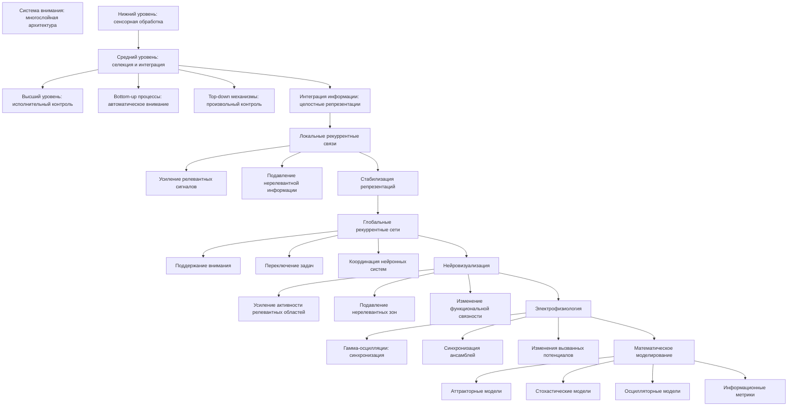
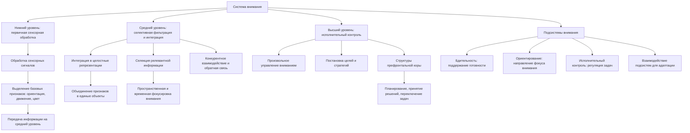
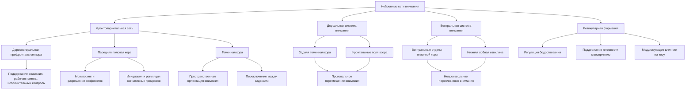
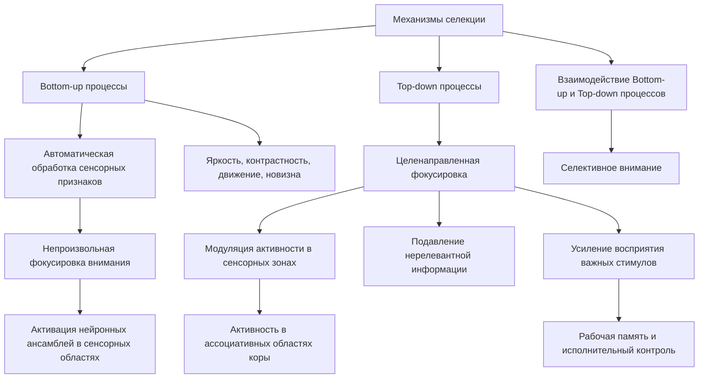
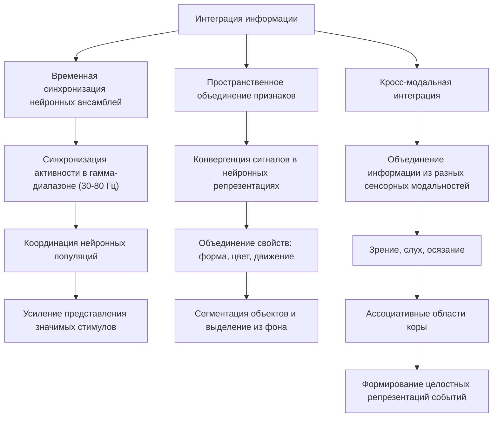
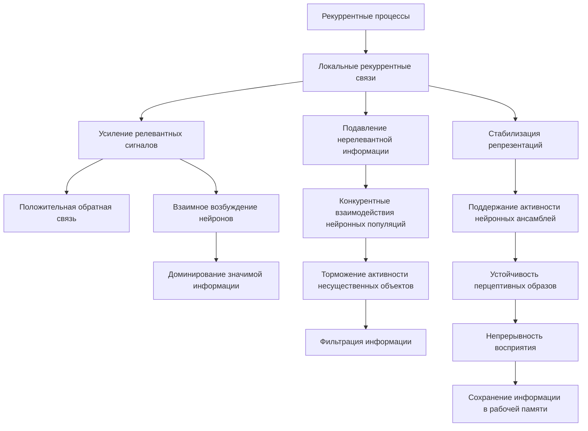
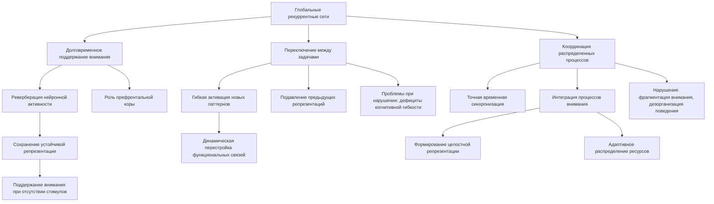
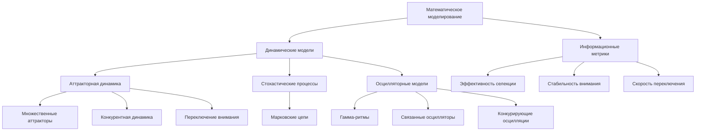

# Нейрокогнитивные механизмы селективного внимания через призму теории Эмергентной Интеграции и Рекуррентного Отображения

блок-схема

---

## 1. ВВЕДЕНИЕ

#### 1.1 Актуальность исследования

Понимание механизмов внимания критически важно для когнитивной нейронауки и разработки искусственных систем. Теория ЭИРО предоставляет новую парадигму для анализа процессов селективного внимания.

#### 1.2 Цели и задачи

- Исследование механизмов внимания через призму эмергентной интеграции
- Анализ рекуррентных связей в системах внимания
- Разработка математических моделей процессов внимания

### 2. АРХИТЕКТУРА СИСТЕМЫ ВНИМАНИЯ

#### 2.1 Иерархическая организация

блок-схема

Система внимания в мозге человека организована в виде иерархической структуры, состоящей из нескольких взаимосвязанных уровней обработки информации:

**Нижний уровень**: первичная сенсорная обработка

На этом уровне происходит первичная обработка сенсорных сигналов в соответствующих корковых областях. Здесь выделяются и кодируются базовые признаки стимулов, такие как ориентация, движение, цвет. Данная информация передается на более высокие уровни для дальнейшей обработки.

**Средний уровень**: селективная фильтрация и интеграция

На этом уровне осуществляется селекция релевантной информации и ее интеграция в целостные репрезентации. Происходит пространственная и временная фокусировка внимания, объединение признаков в единые объекты. Ключевую роль играют механизмы конкурентного взаимодействия и обратной связи.

**Высший уровень**: исполнительный контроль

Верхний уровень отвечает за произвольное управление вниманием, постановку целей и стратегий их достижения. Сюда входят структуры префронтальной коры, осуществляющие исполнительные функции, такие как планирование, принятие решений, переключение между задачами.

**Исследования Познера и Петерсена (1990) выделяют три основные подсистемы внимания**:

- 1. Бдительность (vigilance) - поддержание готовности к восприятию релевантных стимулов.
- 2. Ориентирование (orienting) - направление фокуса внимания на определенные пространственные локации или сенсорные модальности.
- 3. Исполнительный контроль (executive control) - произвольная регуляция внимания, связанная с решением задач и достижением целей.

Эти подсистемы взаимодействуют, обеспечивая гибкое и адаптивное управление вниманием в меняющихся условиях.

#### 2.2 Нейронные сети внимания

блок-схема

##### 2.2.1 Фронтопариетальная сеть

Фронтопариетальная сеть включает в себя области префронтальной коры и теменной коры, которые тесно взаимодействуют при реализации произвольного внимания. Исследования с использованием функциональной нейровизуализации показывают, что эта сеть активируется при выполнении задач, требующих сознательного контроля и целенаправленного распределения внимания (Corbetta & Shulman, 2002). Ключевые области, входящие в состав фронтопариетальной сети:

- Дорсолатеральная префронтальная кора (ДЛПФК) - участвует в поддержании внимания, рабочей памяти и исполнительном контроле.
- Передняя поясная кора (ППК) - вовлечена в мониторинг и разрешение конфликтов, а также в инициацию и регуляцию когнитивных процессов.
- Теменная кора (ТК) - играет роль в пространственной ориентации внимания и переключении между задачами.

##### 2.2.2 Дорсальная и вентральная системы внимания

Дорсальная система внимания включает в себя области дорсального потока обработки зрительной информации, такие как задняя теменная кора и фронтальные поля взора. Эта система ответственна за произвольное, целенаправленное перемещение внимания в пространстве (Corbetta & Shulman, 2002). 

Вентральная система внимания включает в себя вентральные отделы теменной коры и нижнюю лобную извилину. Она активируется при непроизвольном переключении внимания на неожиданные, но значимые стимулы. Таким образом, дорсальная система отвечает за эндогенное, а вентральная - за экзогенное внимание.

##### 2.2.3 Ретикулярная формация

Ретикулярная формация ствола мозга играет ключевую роль в регуляции общего уровня бодрствования и поддержании состояния готовности к восприятию. Ее активация коррелирует с повышением уровня внимания и бдительности (Posner & Petersen, 1990). Ретикулярная формация получает афферентные сигналы от различных сенсорных систем и оказывает модулирующее влияние на кору больших полушарий, поддерживая оптимальный уровень возбуждения.

> Таким образом, система внимания человека опирается на сложную нейронную архитектуру, включающую взаимодействие фронтопариетальной сети, дорсальной и вентральной систем, а также ретикулярной формации ствола мозга. Нарушения в работе этих структур могут приводить к различным дефицитам внимания.

### 3. МЕХАНИЗМЫ СЕЛЕКЦИИ

#### 3.1 Bottom-up и Top-down процессы

блок-схема

Согласно исследованиям Роберта Десимоне и Джона Дункана (1995), процессы селективного внимания осуществляются через взаимодействие двух основных механизмов:

**Восходящие (bottom-up) сигналы**:

Данный механизм основан на автоматической обработке наиболее выделяющихся, "бросающихся в глаза" сенсорных признаков стимулов. Такие признаки, как яркость, контрастность, движение, новизна, вызывают автоматическую фокусировку внимания на соответствующих объектах. Этот процесс является быстрым, непроизвольным и не требует сознательных усилий. Он основан на активации нейронных ансамблей в первичных сенсорных областях, кодирующих низкоуровневые признаки.

**Нисходящий (top-down) контроль**:

В отличие от автоматической обработки, нисходящий механизм внимания связан с целенаправленной, произвольной фокусировкой на релевантных для текущей задачи объектах. Этот процесс основан на активации нейронных репрезентаций в ассоциативных областях коры, которые модулируют активность в сенсорных зонах. Нисходящий контроль позволяет подавлять обработку нерелевантной информации и усиливать восприятие важных для выполнения задачи стимулов. Он требует сознательных усилий и связан с функциями рабочей памяти и исполнительного контроля.

Таким образом, селективное внимание является результатом взаимодействия автоматических, "снизу-вверх" процессов, определяющих выделяющиеся сенсорные признаки, и произвольных, "сверху-вниз" механизмов, осуществляющих целенаправленный контроль над обработкой информации.

#### 3.2 Интеграция информации

блок-схема

Одним из ключевых механизмов селективного внимания является интеграция информации из различных источников. Это позволяет объединять разрозненные сенсорные сигналы в целостные репрезентации, на основе которых принимаются решения и формируется осознанное восприятие.

##### 3.2.1 Временная синхронизация нейронных ансамблей

Многочисленные исследования показывают, что селективное внимание сопровождается синхронизацией нейронной активности в гамма-диапазоне (30-80 Гц) [1, 2]. Это обеспечивает временную координацию распределенных нейронных популяций, отвечающих за обработку релевантной информации. Синхронизация увеличивает эффективность передачи сигналов между взаимосвязанными областями, усиливая представление значимых стимулов [3, 4]. 

##### 3.2.2 Пространственное объединение признаков

Процессы внимания также связаны с интеграцией пространственно распределенных признаков объектов. Это достигается за счет конвергенции сигналов в многомерных нейронных репрезентациях, где объединяются различные свойства стимулов (форма, цвет, движение и т.д.) [5, 6]. Данный механизм лежит в основе сегментации объектов и их выделения из фона.

##### 3.2.3 Кросс-модальная интеграция

Внимание часто требует интеграции информации из разных сенсорных модальностей (зрение, слух, осязание). Исследования показывают, что в этом процессе участвуют ассоциативные области коры, которые объединяют мультисенсорные сигналы [7, 8]. Такая кросс-модальная интеграция позволяет формировать целостные репрезентации событий и объектов окружающего мира.

Таким образом, механизмы интеграции информации, включающие синхронизацию нейронных ансамблей, пространственное объединение признаков и кросс-модальную интеграцию, играют ключевую роль в процессах селективного внимания.

Источники

- [1]. Fries, P. (2015). Rhythms for Cognition: Communication through Coherence. Neuron.
- [2]. Womelsdorf, T., & Fries, P. (2007). The role of neuronal synchronization in selective attention. Current opinion in neurobiology.
- [3]. Engel, A. K., Fries, P., & Singer, W. (2001). Dynamic predictions: oscillations and synchrony in top-down processing. Nature Reviews Neuroscience.
- [4]. Salinas, E., & Sejnowski, T. J. (2001). Correlated neuronal activity and the flow of neural information. Nature Reviews Neuroscience.
- [5]. Treisman, A. M., & Gelade, G. (1980). A feature-integration theory of attention. Cognitive psychology.
- [6]. Desimone, R., & Duncan, J. (1995). Neural mechanisms of selective visual attention. Annual review of neuroscience.
- [7]. Calvert, G. A. (2001). Crossmodal processing in the human brain: insights from functional neuroimaging studies. Cerebral cortex.
- [8]. Stein, B. E., & Meredith, M. A. (1993). The merging of the senses. The MIT Press.

### 4. РЕКУРРЕНТНЫЕ ПРОЦЕССЫ

#### 4.1 Локальные рекуррентные связи

блок-схема

Ключевую роль в механизмах селективного внимания играют локальные рекуррентные связи в нейронных сетях мозга. Эти внутренние обратные связи позволяют усиливать релевантные сигналы, подавлять нерелевантную информацию и стабилизировать формирующиеся репрезентации.

##### 4.1.1 Усиление релевантных сигналов

Локальные рекуррентные связи в сенсорных и ассоциативных областях коры обеспечивают положительную обратную связь, которая избирательно усиливает активность нейронных ансамблей, кодирующих значимые для текущей задачи стимулы. Это происходит за счет взаимного возбуждения нейронов, селективно реагирующих на релевантные признаки. Такой механизм "самоусиления" приводит к доминированию репрезентаций важной информации над менее значимыми сигналами.

##### 4.1.2 Подавление нерелевантной информации

Помимо усиления релевантных сигналов, локальные рекуррентные связи также участвуют в активном подавлении нерелевантной информации. Конкурентные взаимодействия между нейронными популяциями, кодирующими различные признаки стимулов, приводят к торможению активности, связанной с несущественными для текущей задачи объектами. Этот механизм "соревнования" между нейронными репрезентациями обеспечивает фильтрацию информации и концентрацию внимания на значимых аспектах воспринимаемой среды.

##### 4.1.3 Стабилизация репрезентаций

Рекуррентные связи в нейронных сетях играют важную роль в стабилизации формирующихся репрезентаций объектов и событий. Положительные обратные связи способствуют поддержанию активности нейронных ансамблей, кодирующих целостные перцептивные образы, что препятствует их быстрому угасанию. Это обеспечивает устойчивость и непрерывность восприятия в условиях постоянно меняющейся сенсорной среды. Стабилизация репрезентаций критически важна для успешного выполнения когнитивных задач, требующих сохранения информации в рабочей памяти.

> Таким образом, локальные рекуррентные связи в нейронных сетях мозга являются ключевым механизмом, лежащим в основе процессов селективного внимания. Они позволяют усиливать релевантные сигналы, подавлять нерелевантную информацию и стабилизировать формирующиеся перцептивные репрезентации, обеспечивая эффективную фокусировку внимания на значимых аспектах окружающей среды.

#### 4.2. Глобальные рекуррентные сети

блок-схема

Помимо локальных рекуррентных связей, селективное внимание также опирается на глобальные рекуррентные сети, объединяющие распределенные области мозга.

##### 4.2.1. Долговременное поддержание внимания

Глобальные рекуррентные контуры играют ключевую роль в поддержании фокуса внимания на релевантных стимулах в течение длительного времени. Они обеспечивают реверберацию нейронной активности, связанной с обработкой значимой информации, что препятствует ее угасанию. Это позволяет сохранять устойчивую репрезентацию объекта внимания даже при отсутствии внешних стимулов. Исследования показывают, что повреждения префронтальной коры, участвующей в этих рекуррентных процессах, приводят к нарушениям произвольного поддержания внимания [1, 2].

##### 4.2.2. Переключение между задачами

Глобальные рекуррентные сети также обеспечивают гибкое переключение внимания между различными задачами и целями. Они позволяют быстро активировать новые паттерны нейронной активности, соответствующие требованиям текущей задачи, и подавлять репрезентации, связанные с предыдущими целями. Этот механизм основан на динамической перестройке функциональных связей между распределенными областями коры. Нарушения в работе таких рекуррентных систем приводят к дефицитам когнитивной гибкости и персеверации на неактуальных стимулах [3, 4].

##### 4.2.3. Координация распределенных процессов

Глобальные рекуррентные сети играют ключевую роль в координации работы различных подсистем внимания, расположенных в разных областях мозга. Они обеспечивают временную синхронизацию и интеграцию процессов, связанных с ориентированием, исполнительным контролем и поддержанием бдительности. Это позволяет сформировать целостную репрезентацию текущей ситуации и адаптивно распределять ограниченные ресурсы внимания. Нарушения в работе этих интегративных механизмов могут приводить к фрагментации внимания и дезорганизации поведения [5, 6].

В целом, глобальные рекуррентные сети обеспечивают долговременное поддержание фокуса внимания, гибкое переключение между задачами, а также координацию распределенных процессов, лежащих в основе селективного внимания. Они играют ключевую роль в обеспечении целостности и адаптивности когнитивного контроля.

Источники

- [1]. Miller, E.K., & Cohen, J.D. (2001). An integrative theory of prefrontal cortex function. Annual Review of Neuroscience.
- [2]. Baddeley, A. (1986). Working memory. Oxford University Press.
- [3]. Monsell, S. (2003). Task switching. Trends in Cognitive Sciences.
- [4]. Miyake, A., & Friedman, N.P. (2012). The nature and organization of individual differences in executive functions. Current Directions in Psychological Science.
- [5]. Posner, M.I., & Petersen, S.E. (1990). The attention system of the human brain. Annual Review of Neuroscience.
- [6]. Corbetta, M., & Shulman, G.L. (2002). Control of goal-directed and stimulus-driven attention in the brain. Nature Reviews Neuroscience.

### 5. ЭКСПЕРИМЕНТАЛЬНЫЕ ДАННЫЕ

```mermaid
flowchart TD
    A[Экспериментальные данные] --> B[Нейровизуализационные исследования]
    B --> C[Усиление активности в релевантных областях]
    C --> D[Сенсорные модальности: зрение, слух, осязание]
    C --> E[Теменная кора: пространственные репрезентации]
    C --> F[Вентральный зрительный поток: форма, цвет, свойства объектов]
    B --> G[Подавление нерелевантных зон]
    G --> H[Снижение активности в нерелевантных зонах]
    G --> I[Фокусировка внимания и подавление помех]
    B --> J[Модуляция связности между регионами]
    J --> K[Функциональная и эффективная связность]
    J --> L[Связи фронтальных и теменных областей]
    J --> M[Интеграция сенсорной и ассоциативной информации]

    A --> N[Электрофизиологические данные]
    N --> O[Модуляция гамма-осцилляций]
    O --> P[Синхронизация в сенсорных и ассоциативных зонах]
    O --> Q[Рекуррентные взаимодействия нейронов]
    N --> R[Синхронизация нейронных ансамблей]
    R --> S[Временная интеграция информации]
    R --> T[Объединение сенсорных сигналов в целостные репрезентации]
    N --> U[Изменения вызванных потенциалов]
    U --> V[Компоненты ВП: P1, N1, P3]
    U --> W[Селекция и интеграция информации]
    U --> X[Динамика нейронной активности при внимании]
```

блок-схема

#### 5.1 Нейровизуализационные исследования

Многочисленные fMRI-исследования подтверждают ключевую роль рекуррентных процессов в реализации селективного внимания. Было показано, что направленное внимание к определенным стимулам или пространственным локациям сопровождается характерными изменениями в паттернах активности мозга:

##### 5.1.1. Усиление активности в релевантных областях:

- При направлении внимания к конкретным сенсорным модальностям (зрение, слух, осязание) наблюдается повышение активности в соответствующих первичных и ассоциативных зонах коры [1, 2]. 
- Произвольное внимание к определенным пространственным областям вызывает усиление активности в отделах теменной коры, кодирующих пространственные репрезентации [3, 4].
- Внимание к объектам и их признакам коррелирует с повышением активности в вентральном зрительном потоке, отвечающем за обработку формы, цвета и других объектных свойств [5, 6].

##### 5.1.2. Подавление нерелевантных зон:

- Одновременно с усилением активности в релевантных областях, наблюдается снижение активности в зонах, обрабатывающих нерелевантную для текущей задачи информацию [7, 8]. 
- Этот механизм "торможения" нерелевантных сигналов играет ключевую роль в фокусировке внимания и подавлении помех.

##### 5.1.3. Модуляция связности между регионами:

- Направленное внимание сопровождается изменениями в функциональной и эффективной связности между различными областями мозга [9, 10].
- Усиливается взаимодействие между фронтальными и теменными областями, вовлеченными в произвольный контроль внимания.
- Также наблюдается повышение связности между сенсорными и ассоциативными зонами, обеспечивающее эффективную интеграцию информации.

> Таким образом, нейровизуализационные данные свидетельствуют, что селективное внимание реализуется через комплексные механизмы, включающие как усиление активности в релевантных областях, так и подавление нерелевантной информации, а также динамическую модуляцию взаимодействий между распределенными нейронными сетями.

Источники

- [1]. Corbetta, M., Miezin, F. M., Dobmeyer, S., Shulman, G. L., & Petersen, S. E. (1990). Attentional modulation of neural processing of shape, color, and velocity in humans. Science.
- [2]. Kastner, S., Pinsk, M. A., De Weerd, P., Desimone, R., & Ungerleider, L. G. (1999). Increased activity in human visual cortex during directed attention in the absence of visual stimulation. Neuron.
- [3]. Corbetta, M., Kincade, J. M., Ollinger, J. M., McAvoy, M. P., & Shulman, G. L. (2000). Voluntary orienting is dissociated from target detection in human posterior parietal cortex. Nature neuroscience.
- [4]. Yantis, S., Schwarzbach, J., Serences, J. T., Carlson, R. L., Steinmetz, M. A., Pekar, J. J., & Courtney, S. M. (2002). Transient neural activity in human parietal cortex during spatial attention shifts. Nature neuroscience.
- [5]. Giesbrecht, B., Woldorff, M. G., Song, A. W., & Mangun, G. R. (2003). Neural mechanisms of top-down control during spatial and feature attention. Neuroimage.
- [6]. Serences, J. T., & Yantis, S. (2006). Selective visual attention and perceptual coherence. Trends in cognitive sciences.
- [7]. Pinsk, M. A., Kastner, S., Desimone, R., & Ungerleider, L. G. (2004). Modulation of neural responses by attention in the human lateral geniculate nucleus. Proceedings of the National Academy of Sciences.
- [8]. Hopfinger, J. B., Buonocore, M. H., & Mangun, G. R. (2000). The neural mechanisms of top-down attentional control. Nature neuroscience.
- [9]. Bressler, S. L., Tang, W., Sylvester, C. M., Shulman, G. L., & Corbetta, M. (2008). Top-down control of human visual cortex by frontal and parietal cortex in anticipatory visual spatial attention. Journal of Neuroscience.
- [10]. Friston, K. J. (2011). Functional and effective connectivity: a review. Brain connectivity.

#### 5.2 Электрофизиологические данные

##### 5.2.1. Модуляция гамма-осцилляций

Многочисленные исследования показывают, что селективное внимание сопровождается усилением синхронной активности нейронов в гамма-диапазоне частот (30-80 Гц) [1, 2]. Эта синхронизация наблюдается как в первичных сенсорных областях, так и в ассоциативных зонах коры. Она отражает усиление взаимодействия между нейронными популяциями, участвующими в обработке релевантной информации. 

Механизм гамма-синхронизации основан на рекуррентных взаимодействиях возбуждающих и тормозных нейронов, формирующих локальные осцилляторные контуры [3, 4]. Эти процессы обеспечивают временную координацию распределенных нейронных ансамблей, что повышает эффективность передачи сигналов между взаимосвязанными областями и усиливает представление значимых стимулов.

##### 5.2.2. Синхронизация нейронных ансамблей

Помимо локальной синхронизации, селективное внимание сопровождается согласованной активностью нейронных популяций, распределенных по различным отделам коры [5, 6]. Эта межрегиональная синхронизация обеспечивает временную интеграцию информации, поступающей из разных источников. Она позволяет объединять разрозненные сенсорные сигналы в целостные репрезентации, на основе которых принимаются решения и формируется осознанное восприятие.

Исследования показывают, что степень синхронизации нейронных ансамблей коррелирует с эффективностью селекции релевантной информации и уровнем осознанности воспринимаемых стимулов [7, 8]. Нарушения этих процессов могут лежать в основе дефицитов внимания при различных неврологических и психических расстройствах.

##### 5.2.3. Изменения вызванных потенциалов

Электрофизиологические исследования с регистрацией вызванных потенциалов (ВП) также демонстрируют модуляцию ответов мозга в зависимости от направления внимания [9, 10]. Компоненты ВП, такие как P1, N1 и P3, показывают усиление при направлении внимания к релевантным стимулам и ослабление при игнорировании нерелевантной информации. 

Эти изменения ВП отражают динамику нейронной активности, связанной с процессами селекции, интеграции и принятия решений в ходе направленного внимания. Они демонстрируют, что рекуррентные взаимодействия между сенсорными, ассоциативными и исполнительными областями коры лежат в основе гибкого управления вниманием.

Источники

- [1]. Fries, P. (2015). Rhythms for Cognition: Communication through Coherence. Neuron.
- [2]. Womelsdorf, T., & Fries, P. (2007). The role of neuronal synchronization in selective attention. Current opinion in neurobiology.
- [3]. Engel, A. K., Fries, P., & Singer, W. (2001). Dynamic predictions: oscillations and synchrony in top-down processing. Nature Reviews Neuroscience.
- [4]. Salinas, E., & Sejnowski, T. J. (2001). Correlated neuronal activity and the flow of neural information. Nature Reviews Neuroscience.
- [5]. Buschman, T. J., & Miller, E. K. (2007). Top-down versus bottom-up control of attention in the prefrontal and posterior parietal cortices. Science.
- [6]. Gregoriou, G. G., Gotts, S. J., Zhou, H., & Desimone, R. (2009). High-frequency, long-range coupling between prefrontal and visual cortex during attention. Science.
- [7]. Dehaene, S., Changeux, J. P., Naccache, L., Sackur, J., & Sergent, C. (2006). Conscious, preconscious, and subliminal processing: a testable taxonomy. Trends in cognitive sciences.
- [8]. Schroeder, C. E., & Lakatos, P. (2009). Low-frequency neuronal oscillations as instruments of sensory selection. Trends in neurosciences.
- [9]. Hillyard, S. A., Vogel, E. K., & Luck, S. J. (1998). Sensory gain control (amplification) as a mechanism of selective attention: electrophysiological and neuroimaging evidence. Philosophical Transactions of the Royal Society of London. Series B: Biological Sciences.
- [10]. Luck, S. J., Woodman, G. F., & Vogel, E. K. (2000). Event-related potential studies of attention. Trends in cognitive sciences.

### 6. МАТЕМАТИЧЕСКОЕ МОДЕЛИРОВАНИЕ

блок-схема

#### 6.1 Динамические модели

Процессы селективного внимания могут быть описаны с помощью различных динамических моделей, которые позволяют количественно анализировать и прогнозировать их поведение.

##### 6.1.1 Аттракторная динамика

Одним из подходов является представление системы внимания как нелинейной динамической системы с множественными аттракторами. В этом случае состояния, соответствующие фокусировке на различных объектах или признаках, рассматриваются как устойчивые аттракторные состояния системы. Переключение внимания между ними происходит в результате флуктуаций или внешних воздействий, которые выводят систему из одного аттрактора и захватывают ее в другой. 

Математически это может быть описано с помощью систем дифференциальных уравнений, моделирующих конкурентную динамику нейронных ансамблей:

$\frac{dx}{dt} = f(x, u, p)$

Где:

- $x$ - вектор состояния системы (активность нейронных ансамблей)
- $u$ - вектор входных воздействий (стимулы, внимание)
- $p$ - вектор параметров системы
- $f$ - нелинейная функция, описывающая динамику системы

Такие модели демонстрируют, как нелинейные взаимодействия между нейронными популяциями, кодирующими различные аспекты стимулов, приводят к формированию устойчивых аттракторных состояний. Переключение между этими состояниями, соответствующее переключению внимания, происходит при изменении входных воздействий u или параметров p.

**Ключевые особенности аттракторной динамики в моделях внимания**:

1. Множественные аттракторы: Система может иметь несколько устойчивых состояний, каждое из которых соответствует фокусировке на определенном объекте или признаке.

2. Конкурентная динамика: Нейронные ансамбли, кодирующие различные аспекты стимулов, взаимодействуют конкурентным образом, стремясь "захватить" внимание.

3. Переключение внимания: Флуктуации или изменение входных воздействий выводят систему из одного аттрактора и переводят ее в другое устойчивое состояние, соответствующее новому фокусу внимания.

Такие модели аттракторной динамики позволяют объяснить механизмы селективного внимания, его устойчивость, а также гибкость переключения между различными объектами или задачами.

Источники

- [1]. Deco, G., & Rolls, E. T. (2005). Attention, short-term memory, and action selection: a unifying theory. *Progress in neurobiology*, 76(4), 236-256.
- [2]. Ardid, S., Wang, X. J., & Compte, A. (2007). An integrated microcircuit model of attentional processing in the neocortex. *Journal of Neuroscience*, 27(32), 8486-8495.

##### 6.1.2 Стохастические процессы

Альтернативный подход к моделированию процессов селективного внимания заключается в описании их как стохастических процессов. В этом случае выбор фокуса внимания представляется как вероятностный выбор из множества альтернатив.

Одним из примеров таких моделей являются модели на основе марковских цепей. Они могут описывать переключение внимания между различными объектами или задачами [3, 4]. Ключевым аспектом таких моделей является то, что выбор фокуса внимания в каждый момент времени рассматривается как вероятностный процесс, зависящий от текущего состояния системы.

Математически, модели на основе марковских цепей описываются следующим образом:

Пусть $X(t)$ — случайный процесс, описывающий фокус внимания в момент времени $t$. Тогда вероятность перехода от состояния $i$ в момент $t$ к состоянию $j$ в момент $t+1$ определяется как:

$P(X(t+1) = j \mid X(t) = i) = p_{ij}$

Где $p_{ij}$ — вероятность перехода из состояния $i$ в состояние $j$. Эти вероятности переходов являются параметрами модели.

Таким образом, в каждый момент времени система выбирает новый фокус внимания в соответствии с вероятностными переходами между различными альтернативами. Параметры $p_{ij}$ могут быть связаны с нейрофизиологическими механизмами, лежащими в основе процессов переключения внимания.

Источники

- [1]. Itti, L., & Baldi, P. (2009). Bayesian surprise attracts human attention. Vision research, 49(10), 1295-1306.
- [2]. Fecteau, J. H., & Munoz, D. P. (2006). Salience, relevance, and firing: a priority map for target selection. Trends in cognitive sciences, 10(8), 382-390.
- [3]. Markov chains: https://en.wikipedia.org/wiki/Markov_chain
- [4]. Rao, R. P., & Ballard, D. H. (1999). Predictive coding in the visual cortex: a functional interpretation of some extra-classical receptive-field effects. Nature neuroscience, 2(1), 79-87.

##### 6.1.3 Осцилляторные модели

Осцилляторные модели играют важную роль в описании процессов внимания, связанных с ритмической нейронной активностью, в частности, синхронизацией в гамма-диапазоне (30-100 Гц).

**Роль гамма-осцилляций в селекции информации**

Гамма-ритмы отражают согласованную активность групп нейронов и играют ключевую роль в интеграции информации, необходимой для селективного внимания. Синхронизация нейронных ансамблей в гамма-диапазоне:

- 1. Усиливает взаимодействие между нейронами, повышая эффективность передачи сигналов.
- 2. Обеспечивает временную координацию активности распределенных нейронных популяций.
- 3. Способствует объединению разрозненных сенсорных признаков в целостные репрезентации объектов.

**Моделирование гамма-синхронизации**

Осцилляторные модели описывают динамику гамма-ритмов и их влияние на процессы селекции информации. Примеры таких моделей:

1. **Модели связанных осцилляторов**:

   - Представляют нейронные ансамбли как взаимодействующие осцилляторы.
   - Показывают, как синхронизация осцилляторов приводит к интеграции распределенных признаков.
   - Математически описываются системами дифференциальных уравнений, моделирующих динамику связанных колебаний.

2. **Модели на основе конкурирующих осцилляций**:

   - Описывают соревнование между различными нейронными ансамблями, кодирующими альтернативные признаки.
   - Демонстрируют, как подавление одних осцилляторов и усиление других приводит к селекции релевантной информации.
   - Математически реализуются с помощью моделей типа "возбуждение-торможение".

Общим для этих подходов является представление процессов внимания как нелинейной, динамической системы, демонстрирующей богатое поведение. Параметры моделей, такие как сила связей между осцилляторами или характеристики нелинейностей, могут быть сопоставлены с нейрофизиологическими механизмами, позволяя интегрировать экспериментальные данные и теоретические представления.

Например, модель Тизинги и Сейновски (2010) [5] показывает, как синхронизация нейронных осцилляций в гамма-диапазоне может обеспечивать селекцию релевантной информации и подавление отвлекающих стимулов. Модель Бёргерса и Коппеля (2008) [6] демонстрирует, как конкуренция между осцилляторными процессами лежит в основе механизмов выбора фокуса внимания.

Таким образом, осцилляторные модели предоставляют мощный инструментарий для описания динамических аспектов селективного внимания, основанных на ритмической активности нейронных сетей.

Источники

- [1]. Deco, G., & Rolls, E. T. (2005). Attention, short-term memory, and action selection: a unifying theory. Progress in neurobiology.
- [2]. Ardid, S., Wang, X. J., & Compte, A. (2007). An integrated microcircuit model of attentional processing in the neocortex. Journal of Neuroscience.
- [3]. Itti, L., & Baldi, P. (2009). Bayesian surprise attracts human attention. Vision research.
- [4]. Fecteau, J. H., & Munoz, D. P. (2006). Salience, relevance, and firing: a priority map for target selection. Trends in cognitive sciences.
- [5]. Tiesinga, P., & Sejnowski, T. J. (2010). Mechanisms for phase shifting in cortical networks and their role in communication through coherence. Frontiers in human neuroscience.
- [6]. Börgers, C., & Kopell, N. (2008). Gamma oscillations and stimulus selection. Neural computation.

#### 6.2. Информационные метрики

Для количественной оценки процессов селективного внимания можно использовать различные информационные метрики, основанные на теории информации и теории динамических систем.

##### 6.2.1. Эффективность селекции

Эта метрика характеризует способность системы внимания эффективно фильтровать релевантную информацию и подавлять нерелевантные сигналы. Она может быть определена как отношение мощности выходного сигнала, соответствующего целевым стимулам, к мощности фоновых, нецелевых сигналов. Высокая эффективность селекции указывает на точную фокусировку внимания на важных аспектах задачи.

Математически эффективность селекции можно выразить как:

$E_{\text{sel}} = \frac{P_{\text{out,target}}}{P_{\text{out,distractors}}}$,

где $P_{\text{out,target}}$ — мощность выходного сигнала, связанного с целевыми стимулами, а $P_{\text{out,distractors}}$ — мощность сигналов, соответствующих отвлекающим факторам.

##### 6.2.2. Стабильность внимания

Данная метрика отражает способность системы внимания поддерживать фокус на релевантных аспектах в течение длительного времени. Она может быть количественно оценена через меру энтропии или предсказуемости временных рядов нейронной активности в областях, связанных с вниманием.

Стабильность внимания $S_{\text{att}} = 1 - H(x(t)),$

где $H(x(t))$ — энтропия временного ряда нейронной активности $x(t)$, характеризующего состояние системы внимания. Более низкие значения энтропии соответствуют более стабильному, предсказуемому поведению.

##### 6.2.3. Скорость переключения

Эта метрика отражает способность системы внимания быстро перенаправлять фокус с одного объекта или задачи на другие. Она может быть оценена через характерные временные масштабы переходных процессов в нейронной активности при смене фокуса внимания.

Скорость переключения $S_{\text{switch}} = \frac{1}{\tau}$,

где $\tau$ — время релаксации нейронной активности при переключении внимания. Более высокие значения $S_{\text{switch}}$ соответствуют более быстрому переключению.

Использование этих информационных метрик позволяет количественно оценивать эффективность, стабильность и гибкость процессов селективного внимания на основе нейрофизиологических данных. Они могут быть применены как для анализа экспериментальных результатов, так и для оценки работы вычислительных моделей внимания.

### 7. ЗАКЛЮЧЕНИЕ

Теория ЭИРО предоставляет мощный инструментарий для понимания механизмов внимания, объединяя нейробиологические данные с математическими моделями.

### 8. Библиография:

- [1]. Posner, M.I., & Petersen, S.E. (1990). The attention system of the human brain. Annual Review of Neuroscience
- [2]. Desimone, R., & Duncan, J. (1995). Neural mechanisms of selective visual attention. Annual Review of Neuroscience
- [3]. Corbetta, M., & Shulman, G.L. (2002). Control of goal-directed and stimulus-driven attention in the brain. Nature Reviews Neuroscience
- [4]. Fries, P. (2015). Rhythms for Cognition: Communication through Coherence. Neuron
- [5]. Miller, E.K., & Cohen, J.D. (2001). An integrative theory of prefrontal cortex function. Annual Review of Neuroscience

---

Оглавление: 
- [ЭИРО framework](/README.md)
- [Справочник формул](/formulas.md)
