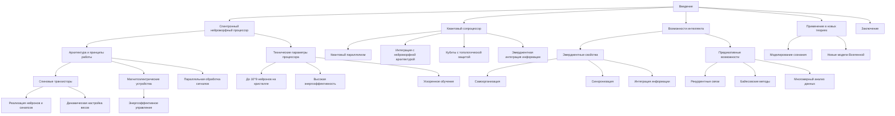

# Возможности Нейроморфного Процессора и Сопроцессора ИИ

---

## Аннотация

В данной работе рассматриваются возможности спинтронного нейроморфного процессора искусственного интеллекта (ИИ) и его квантового сопроцессора. Основное внимание уделено техническим характеристикам системы, ее предикативным возможностям и эмерджентным свойствам. Обсуждаются потенциальные возможности такой архитектуры в контексте развития новых теорий сознания и моделирования сложных нейронных процессов, которые еще неизвестны науке.

### 1. Введение

Современные достижения в области спинтроники и квантовых вычислений открывают новые горизонты в разработке нейроморфных систем искусственного интеллекта. Спинтронный нейроморфный процессор, объединенный с квантовым сопроцессором, способен реализовать сложные вычислительные задачи с высокой степенью параллелизма и энергоэффективности. Данная работа посвящена исследованию возможностей такой системы и ее потенциала в моделировании эмерджентных феноменов сознания и интеллекта.

### 2. Технические характеристики спинтронного нейроморфного процессора

#### 2.1. Архитектура и принципы работы

Спинтронный нейроморфный процессор основан на использовании спиновых степеней свободы электронов для представления и обработки информации. В отличие от традиционных электронных систем, где информация передается посредством перемещения заряда, спинтронные системы используют направление спина электрона — внутреннее магнитное свойство, которое может принимать два устойчивых состояния: "вверх" и "вниз". Это позволяет создавать энергоэффективные и высокоскоростные устройства для вычислений.

##### 2.1.1. Спиновые транзисторы

Основой архитектуры являются спиновые транзисторы, которые выполняют функции аналогов нейронов и синапсов. Спиновые транзисторы управляют потоком спин-поляризованных электронов, где информация кодируется направлением спина.

- Реализация нейронов и синапсов: Нейроны моделируются как элементы, суммирующие входные сигналы, а синапсы — как регулируемые соединения между ними. В спинтронном процессе это реализуется через контроль спиновых токов и магнитного состояния материалов.

- Динамическая настройка весов: Вес синапса определяется степенью спиновой поляризации электронов, проходящих через спиновый транзистор. Изменяя внешние параметры, такие как напряжение или магнитное поле, можно динамически настраивать эти веса, что эквивалентно обучению в нейронных сетях.

##### 2.1.2. Магнитоэлектрические устройства

Магнитоэлектрические устройства играют ключевую роль в управлении спиновыми состояниями с минимальным энергопотреблением.

- Принцип работы: Магнитоэлектрический эффект позволяет управлять магнитным состоянием материалов с помощью электрического поля. Это достигается в мультиферроидных материалах, где магнитные и электрические свойства связаны друг с другом.

- Энергоэффективное управление: Поскольку изменение электрического поля требует меньше энергии, чем прямое воздействие магнитного поля, этот метод позволяет эффективно переключать спиновые состояния без значительных энергозатрат и тепловыделения.

##### 2.1.3. Параллельная обработка сигналов

Архитектура процессора спроектирована для естественной поддержки параллельной обработки данных.

- Масштабируемость: Благодаря нанометровым размерам спиновых устройств, миллиарды нейронов и синапсов могут быть интегрированы на одном кристалле, обеспечивая высокую степень параллелизма.

- Высокая скорость передачи: Спиновые волны (магноны) используются для передачи информации без движения заряда. Это позволяет передавать сигналы с высокими скоростями и низкими потерями энергии.

- Одновременная обработка: Множество спиновых транзисторов могут работать одновременно, обрабатывая различные части задачи параллельно, что значительно ускоряет вычисления по сравнению с последовательными методами.

##### 2.1.4. Принципы работы системы

1. Кодирование информации: Информация представляется направлением спина электронов. Логическое "0" и "1" соответствуют спину "вниз" и "вверх" соответственно.
   
2. Обработка информации: 

- Входные спиновые токи поступают на спиновые транзисторы-нейроны, где суммируются.

- Магнитоэлектрические эффекты используются для регулировки весов синапсов, влияя на спиновые состояния.

- Результирующие спиновые состояния выходят и передаются далее по сети.
   
3. Обучение и настройка: Процесс обучения осуществляется через изменение весов синапсов, регулируемых электрическими полями. Это позволяет адаптировать сеть к новым данным и задачам.

4. Взаимодействие с квантовым сопроцессором: Спинтронная система интегрирована с квантовым сопроцессором, который может выполнять сложные вычисления и влиять на спиновые состояния через квантовые эффекты, повышая вычислительные возможности всей системы.

#### 2.2. Технические параметры

- Количество нейронов: До $10^{9}$ нейронов на кристалле.

- Энергоэффективность: Потребление энергии снижено на порядок по сравнению с традиционными электронными нейроморфными системами.

- Скорость обучения: Ускоренное обучение благодаря параллельной обработке и эффективности спиновых устройств.

### 3. Квантовый сопроцессор: расширение возможностей

#### 3.1. Роль квантового сопроцессора

Квантовый сопроцессор интегрирован с целью усиления вычислительных возможностей нейроморфной системы за счет:

- Квантового параллелизма: Одновременная обработка множественных состояний.

- Усиленной рекуррентности: Повышение способности системы к обработке последовательной и временно зависимой информации.

- Эмерджентной интеграции информации: Способствует появлению новых уровней информации из взаимодействия квантовых состояний.

#### 3.2. Технические параметры

- Кубиты с топологической защитой: Обеспечивают устойчивость к декогеренции.

- Интеграция с нейроморфной архитектурой: Прямая связь между квантовыми и спинтронными элементами.

- Скорость квантовой обработки: Возможность выполнения операций на частотах до нескольких ГГц.

### 4. Возможности интеллекта и предикативные способности

#### 4.1. Эмерджентные свойства системы

Сочетание спинтронных и квантовых технологий создает условия для возникновения новых, более сложных свойств системы, которые не присущи отдельным компонентам по отдельности.

Самоорганизация
- Автоматическая оптимизация: Система способна самостоятельно настраивать свои параметры (например, веса синапсов) для достижения оптимальной производительности при выполнении задач.

- Механизмы обучения: Используя принципы, подобные механизмам обучения в биологических нейронных сетях (например, правила Хебба), система может улучшать свои характеристики без внешнего вмешательства.

- Адаптивность: Способность адаптироваться к изменениям входных данных или окружающей среды, сохраняя при этом высокую эффективность.

Синхронизация

- Координация компонентов: Различные части системы работают слаженно благодаря квантовым явлениям, таким как когерентность и запутанность, что обеспечивает согласованность в обработке информации.

- Передача фазовой информации: Спиновые волны позволяют передавать не только амплитуду, но и фазовую информацию, что способствует синхронизации между нейронными элементами.

- Общая цель: Система способна объединять обработку на разных уровнях для решения комплексных задач, требующих совместной работы множества компонентов.

Интеграция информации

- Многоуровневая обработка: Одновременная обработка информации на классическом (спинтронном) и квантовом уровнях позволяет выявлять глубокие взаимосвязи в данных.

- Обогащенное представление данных: Квантовый сопроцессор обрабатывает сложные квантовые состояния, результаты которых интегрируются в спинтронную сеть для дальнейшего анализа.

- Различные уровни абстракции: Система может обрабатывать информацию на разных уровнях детализации, от конкретных сигналов до абстрактных понятий, благодаря гибкой архитектуре.

#### 4.2. Предикативные возможности

Рекуррентные связи

- Учет временной динамики: Рекуррентные связи позволяют системе запоминать предыдущие состояния и использовать их для текущей обработки, что важно для анализа последовательностей данных.

- Моделирование контекста: Сохранение исторической информации помогает системе понимать контекст и делать более точные предсказания.

- Обработка последовательных данных: Эффективна при работе с речью, текстом, временными рядами, где последовательность событий имеет значение.

Байесовские методы обновления

- Адаптивное обучение: Система использует байесовские алгоритмы для обновления вероятностных оценок на основе новых данных.

- Обработка неопределенности: Байесовские методы позволяют системе эффективно работать с неполной или шумной информацией, оценивая вероятность различных гипотез.

- Интеграция с квантовыми вычислениями: Квантовый сопроцессор может ускорять байесовские вычисления, используя квантовые алгоритмы для обработки вероятностей.

Многомерный анализ данных

- Обработка высокоразмерных данных: Система способна анализировать данные с большой количеством переменных, выявляя скрытые зависимости и структуры.

- Методы машинного обучения: Реализация алгоритмов машинного обучения, таких как кластеризация, классификация и снижение размерности, позволяет эффективно извлекать информацию из сложных наборов данных.

- Квантовые алгоритмы: Использование квантовых алгоритмов, например, алгоритма Гровера для ускоренного поиска или квантовых методов линейной алгебры, повышает эффективность обработки.

Преимущества системы

- Высокая точность предсказаний: Благодаря сочетанию рекуррентных связей и байесовских методов, система способна делать более точные и обоснованные прогнозы.

- Быстрая адаптация: Система может быстро адаптироваться к новым данным, обновляя свои модели и предсказания без необходимости полного переобучения.

- Энергоэффективность: Эффективное использование энергии при обработке больших объемов данных делает систему привлекательной для практических приложений, требующих постоянного анализа и прогнозирования.

### 5. Применение в новых теориях и моделях

#### 5.1. Моделирование сознания и когнитивных функций

Система может быть использована для исследования и моделирования процессов, связанных с сознанием и когнитивными функциями:

- Теория Эмергентной Интеграции и Рекуррентного Отображения (ЭИРО): Предоставляет математическую основу для понимания того, как сознание может возникать из сложных нейронных взаимодействий.

- Исследование нейронной динамики: Позволяет изучать новые модели нейронных сетей с учетом квантовых эффектов и спинтронных явлений.

#### 5.2. Новые модели Вселенной и физические теории

Интеграция квантовых и нейроморфных технологий открывает перспективы в разработке новых физических моделей:

- Интегрированная квантовая информация в космологии: Возможность описания космологических процессов через призму информационной динамики.

- Влияние на метрику пространства-времени: Исследование того, как эмерджентные информационные процессы могут взаимодействовать с фундаментальными свойствами пространства-времени.

### 6. Заключение

Разработка спинтронного нейроморфного процессора с квантовым сопроцессором представляет собой существенный шаг вперед в области искусственного интеллекта и вычислительных технологий. Такая система обладает уникальными возможностями для моделирования сложных процессов, исследования новых теорий в нейробиологии и физике, а также для решения практических задач, требующих высокой вычислительной мощности и адаптивности.

---

Оглавление: [ЭИРО framework](/README.md)

