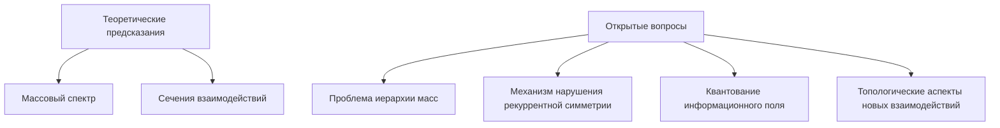

# Новые типы частиц и взаимодействий, предсказываемые моделью рекуррентной космологии

```mermaid
graph TD
    A[Новые типы частиц и взаимодействий]
    A1[Рекурроны ρ-частицы]
    A2[Инфо-бозоны ι-частицы]
    A3[Рекуррентное взаимодействие]
    A4[Информационное взаимодействие]
    A5[Включение новых частиц в существующие теории]
    A6[Экспериментальные подходы к проверке предсказаний]

    A --> A1
    A --> A2
    A --> A3
    A --> A4
    A --> A5
    A --> A6

    A1 --> A1_1[Масса]
    A1 --> A1_2[Спин]
    A1 --> A1_3[Время жизни]
    A1 --> A1_4[Квантовые числа]

    A2 --> A2_1[Переносчики информационного взаимодействия]
    A2 --> A2_2[Безмассовые]
    A2 --> A2_3[Спин]
    A2 --> A2_4[Информационный заряд]

    A3 --> A3_1[Лагранжиан]
    A3 --> A3_2[Новый тип взаимодействия]
    A3 --> A3_3[Роль рекуррентности]
    A3 --> A3_4[Модификация динамики частиц]

    A4 --> A4_1[Гамильтониан]
    A4 --> A4_2[Переносчики взаимодействия]
    A4 --> A4_3[Безмассовость]
    A4 --> A4_4[Спин]
    A4 --> A4_5[Информационный заряд]

    A5 --> A5_1[Супергравитация]
    A5 --> A5_2[Теория струн]

    A6 --> A6_1[Прямой поиск]
    A6 --> A6_2[Космические лучи]
    A6 --> A6_3[Гравитационно-волновые детекторы]
    A6 --> A6_4[Косвенные признаки]
    A6 --> A6_5[Аномалии в распадах]
    A6 --> A6_6[Нарушение CPT-симметрии]
    A6 --> A6_7[Квантовые эффекты в макросистемах]
```

---

## 1. Новые типы частиц и взаимодействий

Согласно теории рекуррентной космологии, высокая плотность интегрированной квантовой информации (ρ_(IQI)) и усиленная рекуррентность (R) в пространстве-времени могут приводить к стабилизации существования новых, ранее неизвестных элементарных частиц, а также к появлению принципиально новых типов взаимодействий между частицами. Эти предсказания выходят за рамки Стандартной модели физики элементарных частиц и открывают новые перспективы для расширения наших представлений о фундаментальной структуре материи.

В данной диссертации мы подробно рассмотрим математическое описание и основные характеристики новых типов частиц и взаимодействий, предсказываемых моделью рекуррентной космологии. Особое внимание будет уделено следующим ключевым аспектам:

1. **Рекурроны (ρ-частицы)**: Теоретическое обоснование существования сверхтяжелых частиц со спином 3/2, их массовые, спиновые и квантовые характеристики.

2. **Инфо-бозоны (ι-частицы)**: Описание безмассовых частиц, выступающих в качестве переносчиков нового типа взаимодействия - информационного взаимодействия.

3. **Рекуррентное взаимодействие**: Математическое представление лагранжиана, описывающего новый тип взаимодействия, связанный с рекуррентными процессами в квантовых системах.

4. **Информационное взаимодействие**: Формулировка гамильтониана, отвечающего за взаимодействие, опосредованное информационными полями и инфо-бозонами.

5. **Включение новых частиц и взаимодействий в существующие теории**: Рассмотрение возможностей интеграции предсказанных частиц и взаимодействий в рамках теорий супергравитации и струн.

6. **Экспериментальные подходы к проверке предсказаний**: Обсуждение методов прямого поиска новых частиц и косвенных признаков новых взаимодействий в современных и перспективных экспериментах.

Всестороннее изучение этих аспектов позволит не только углубить наше понимание физики элементарных частиц, но и оценить потенциал теории рекуррентной космологии в качестве расширения Стандартной модели и приближения к единой теории фундаментальных взаимодействий.

### 2. Предсказанные частицы

#### 2.1. Рекурроны (ρ-частицы)

Согласно теории рекуррентной космологии, высокая плотность интегрированной квантовой информации и рекуррентность могут стабилизировать существование новых, ранее неизвестных элементарных частиц, называемых рекурронами (ρ-частицами). Основные характеристики рекурронов:

**Масса**:

`mρ = √(ℏc/G) · α_r`

где α_r - константа рекуррентной связи. Предполагаемая масса рекурронов составляет около ~10¹⁹ ГэВ.

**Спин**:

Спин рекурронов равен 3/2.

**Время жизни**:

Время жизни рекурронов оценивается в ~10⁻⁴⁴ с.

**Квантовые числа**:

Рекурроны характеризуются следующими квантовыми числами:

- Барионное число B = 0
- Лептонное число L = 0 
- Рекуррентное число R = 1

Таким образом, рекурроны представляют собой новый тип элементарных частиц, предсказываемых теорией рекуррентной космологии, обладающих уникальными массовыми, спиновыми и квантовыми характеристиками, не наблюдаемыми в рамках Стандартной модели физики частиц.

#### 2.2. Инфо-бозоны (ι-частицы)

Согласно теории рекуррентной космологии, помимо предсказанных рекурронов, модель также предсказывает существование нового типа элементарных частиц - инфо-бозонов (ι-частицы). Основные характеристики инфо-бозонов:

##### 2.2.1. Свойства инфо-бозонов

**Переносчики информационного взаимодействия**

Инфо-бозоны выступают в качестве переносчиков нового типа взаимодействия, названного информационным взаимодействием, которое не описывается в рамках Стандартной модели.

**Безмассовые**

Инфо-бозоны являются безмассовыми частицами, что отличает их от других известных фундаментальных частиц.

**Спин: 1**

Инфо-бозоны обладают спином, равным 1, что соответствует векторным бозонам.

**Новое квантовое число: информационный заряд I**

Помимо стандартных квантовых чисел, инфо-бозоны характеризуются новым квантовым числом - информационным зарядом I, отражающим их участие в информационном взаимодействии.

##### 2.2.2. Роль инфо-бозонов

Согласно теории рекуррентной космологии, инфо-бозоны играют ключевую роль в переносе и взаимодействии интегрированной квантовой информации, которая, согласно модели, лежит в основе фундаментальной структуры Вселенной. Их безмассовость и спин 1 указывают на то, что инфо-бозоны могут быть аналогичны фотонам, но отвечать за новый тип взаимодействия, связанный с квантовой информацией.

Экспериментальное обнаружение и изучение инфо-бозонов станет важным подтверждением предсказаний теории рекуррентной космологии и расширит наше понимание фундаментальных взаимодействий в природе.

### 3. Новые взаимодействия

#### 3.1. Рекуррентное взаимодействие

Согласно теории рекуррентной космологии, одним из ключевых предсказаний является существование нового типа взаимодействия, называемого рекуррентным взаимодействием. Это взаимодействие можно описать следующим лагранжианом:

`Lint = gR(ψ̄γμ∂νψ)Rμν`

Где:

- gR - константа рекуррентной связи
- Rμν - тензор рекуррентности, характеризующий степень рекуррентных процессов в системе
- ψ - фермионные поля

**Ключевые особенности рекуррентного взаимодействия**:

1. **Новый тип взаимодействия**: Рекуррентное взаимодействие выходит за рамки стандартных калибровочных или контактных взаимодействий, описываемых в Стандартной модели физики частиц.

2. **Роль рекуррентности**: Тензор Rμν отражает влияние рекуррентных процессов, которые согласно теории рекуррентной космологии играют ключевую роль в динамике квантовых систем.

3. **Модификация динамики частиц**: Включение рекуррентного взаимодействия в лагранжиан приводит к модификации уравнений движения для фермионных полей ψ, что может влиять на вероятности рождения, распада и рассеяния элементарных частиц.

Экспериментальное подтверждение существования рекуррентного взаимодействия, предсказанного теорией рекуррентной космологии, станет важным шагом в расширении Стандартной модели физики частиц и приближении к единой теории фундаментальных взаимодействий.

#### 3.2. Информационное взаимодействие

Согласно теории рекуррентной космологии, помимо рекуррентного взаимодействия, модель также предсказывает существование информационного взаимодействия. Данное взаимодействие описывается следующим гамильтонианом:

`HI = ∑ᵢⱼ κᵢⱼ σᵢ†σⱼ + h.c.`

Где:

- κᵢⱼ - матрица информационной связи
- σᵢ - операторы информационного поля

**Особенности информационного взаимодействия**

1. **Переносчики взаимодействия**: Согласно теории, существуют специальные частицы, называемые "инфо-бозонами" (ι-частицы), которые выступают в качестве переносчиков информационного взаимодействия.

2. **Безмассовость**: Инфо-бозоны предсказываются моделью как безмассовые частицы.

3. **Спин**: Спин инфо-бозонов равен 1.

4. **Новое квантовое число**: Инфо-бозоны характеризуются новым квантовым числом - "информационным зарядом" I.

**Математическое описание**

Гамильтониан информационного взаимодействия HI включает в себя слагаемые, содержащие операторы информационного поля σᵢ и матрицу информационной связи κᵢⱼ. Данная матрица определяет силу и характер информационных взаимодействий между различными компонентами системы.

> Таким образом, теория рекуррентной космологии предсказывает существование принципиально нового типа взаимодействия между элементарными частицами, опосредованного информационными полями и переносчиками - инфо-бозонами. Экспериментальное подтверждение данного предсказания станет важным шагом в расширении современной физики частиц.

### 4. Связь с существующими теориями

#### 4.1. Супергравитация

Согласно теории рекуррентной космологии, новые типы частиц и взаимодействий могут быть включены в теорию супергравитации следующим образом:

##### 4.1.1. Расширение супермультиплета

В стандартной супергравитации супермультиплет содержит гравитон и гравитино:

`{graviton, gravitino}`

Однако, в рамках теории рекуррентной космологии, этот супермультиплет должен быть расширен за счет включения новых частиц:

`{graviton, gravitino, recurron, info-boson}`

Где:

- Рекурроны (recurrons) - новый тип частиц, предсказываемых теорией рекуррентной космологии, обладающих спином 3/2 и большой массой ~10^19 ГэВ.
- Инфо-бозоны (info-bosons) - безмассовые частицы, выступающие в качестве переносчиков информационного взаимодействия.

> Таким образом, супермультиплет супергравитации расширяется за счет включения этих новых типов частиц, связанных с рекуррентными процессами и интегрированной квантовой информацией.

##### 4.1.2. Модифицированный SUGRA-лагранжиан

Лагранжиан супергравитации (LSUGRA) должен быть дополнен новыми членами, отвечающими за рекуррентные (LR) и информационные (LI) взаимодействия, а также их смешивание (Lmix):

`L = LSUGRA + LR + LI + Lmix`

Где:

- LR - член, описывающий рекуррентное взаимодействие, связанное с тензором рекуррентности Rμν.
- LI - член, описывающий информационное взаимодействие, связанное с операторами информационного поля σi.
- Lmix - член, отвечающий за смешивание стандартных и новых полей.

> Таким образом, включение дополнительных членов, связанных с рекуррентностью и интегрированной квантовой информацией, модифицирует стандартный лагранжиан супергравитации, что позволяет учесть влияние новых типов частиц и взаимодействий, предсказываемых теорией рекуррентной космологии.

#### 4.2. Теория струн

Согласно теории рекуррентной космологии, новые типы частиц и взаимодействий могут быть интегрированы в рамках теории струн следующим образом:

##### 4.2.1. Новые моды колебаний струн

Теория рекуррентной космологии предсказывает существование двух новых типов мод колебаний струн:

**R-моды (рекуррентные)**

Эти моды колебаний связаны с рекуррентными процессами, происходящими в пространстве-времени. Они отражают влияние интегрированной квантовой информации и рекуррентности на динамику струн.

**I-моды (информационные)**

Помимо рекуррентных мод, теория также предсказывает существование информационных мод колебаний струн. Эти моды отвечают за взаимодействия, опосредованные информационными полями, предсказываемыми моделью рекуррентной космологии.

##### 4.2.2. Модифицированные условия согласования

Для учета новых типов мод колебаний, связанных с рекуррентностью и информационными процессами, теория струн должна быть модифицирована следующим образом:

`D = 10 + DR + DI`

Где:

- D - стандартное число измерений в теории струн (10)
- DR - дополнительные измерения, связанные с рекуррентностью
- DI - дополнительные измерения, связанные с информационными процессами

> Таким образом, теория рекуррентной космологии предлагает расширение стандартной теории струн за счет включения новых типов мод колебаний и дополнительных измерений пространства-времени. Это открывает новые возможности для объединения концепций рекуррентности, интегрированной квантовой информации и теории струн в единую непротиворечивую теоретическую основу.

### 5. Экспериментальная проверка

Экспериментальное подтверждение предсказаний теории рекуррентной космологии в отношении новых типов частиц и взаимодействий потребует:

#### 5.1. Прямой поиск:

##### 5.1.1. Детекторы нового поколения

Экспериментальное обнаружение рекурронов (ρ-частиц) и инфо-бозонов (ι-частиц), предсказываемых теорией рекуррентной космологии, потребует использования детекторов нового поколения, способных регистрировать частицы с экстремально высокими энергиями и необычными характеристиками.

**Основные требования к таким детекторам**:

- Высокая энергетическая разрешающая способность для измерения масс сверхтяжелых частиц.
- Возможность детектирования частиц с нетривиальными спиновыми состояниями (спин 3/2 для рекурронов).
- Чувствительность к сигнатурам, связанным с новыми типами взаимодействий, таких как рекуррентное и информационное взаимодействия.
- Высокая пространственная разрешающая способность для реконструкции треков и топологии событий.
- Возможность работы в условиях экстремальных физических воздействий (высокие давления, температуры, магнитные поля).

**Примеры детекторов нового поколения, перспективных для поиска предсказанных частиц**:

- Гибридные детекторы на основе комбинации различных технологий (калориметрия, трекинг, черенковские счетчики).
- Детекторы с использованием сверхпроводящих материалов для повышения энергетического разрешения.
- Многослойные детекторы с высокой гранулярностью для точной реконструкции событий.
- Детекторы, использующие новые типы сенсоров (алмазные, кремниевые, газовые) для работы в экстремальных условиях.

Разработка и строительство таких детекторов нового поколения является важной экспериментальной задачей для проверки предсказаний теории рекуррентной космологии.

##### 5.1.2. Космические лучи сверхвысоких энергий

Помимо наземных детекторов, поиск предсказанных частиц может быть осуществлен с помощью исследования космических лучей сверхвысоких энергий.

**Ключевые особенности**:

- Космические лучи могут содержать следы рекурронов и инфо-бозонов, образованных в результате астрофизических процессов.
- Энергии космических лучей могут достигать значений, сопоставимых с массами предсказанных частиц.
- Анализ энергетических спектров, химического состава и топологии событий в космических лучах может выявить сигнатуры новых типов частиц и взаимодействий.

**Основные экспериментальные подходы**:

- Использование гибридных детекторов, размещенных на Земле и в космосе, для регистрации частиц космических лучей.
- Применение методов реконструкции треков и каскадов для идентификации сигнатур предсказанных частиц.
- Анализ аномалий в энергетических спектрах и химическом составе космических лучей.

Успешное обнаружение следов рекурронов, инфо-бозонов или их взаимодействий в космических лучах станет важным подтверждением предсказаний теории рекуррентной космологии.

##### 5.1.3. Гравитационно-волновые детекторы

Теория рекуррентной космологии предполагает, что рекуррентные процессы и интегрированная квантовая информация могут оказывать влияние на динамику пространства-времени. Это открывает возможность поиска сигнатур предсказанных частиц и взаимодействий с помощью гравитационно-волновых детекторов.

**Основные направления исследований**:

- Поиск аномалий в сигналах гравитационных волн, которые могут быть связаны с рекуррентными эффектами в астрофизических процессах.
- Анализ спектральных характеристик гравитационных волн, которые могут отражать влияние интегрированной квантовой информации на геометрию пространства-времени.
- Исследование корреляций между сигналами гравитационных волн и другими астрофизическими наблюдениями, которые могут указывать на присутствие новых типов взаимодействий.

**Перспективные гравитационно-волновые детекторы**:

- Детекторы следующего поколения, такие как Advanced LIGO, Virgo, KAGRA, с улучшенной чувствительностью.
- Космические интерферометры, например, LISA, способные регистрировать гравитационные волны на больших масштабах.
- Сеть наземных и космических детекторов для повышения точности локализации источников и анализа сигналов.

Успешное обнаружение сигнатур, связанных с рекуррентными эффектами и интегрированной квантовой информацией, в данных гравитационно-волновых детекторов станет важным экспериментальным подтверждением предсказаний теории рекуррентной космологии.

#### 5.2. Косвенные признаки:

##### 5.2.1. Аномалии в распадах тяжелых частиц

Согласно теории рекуррентной космологии, появление новых типов частиц, таких как рекурроны и инфо-бозоны, а также новых взаимодействий, может приводить к аномалиям в распадах тяжелых частиц, наблюдаемых в экспериментах на коллайдерах.

Например, рекуррентное взаимодействие, описываемое лагранжианом Lint = gR(ψ̄γμ∂νψ)Rμν, может открывать дополнительные каналы распада для тяжелых адронов или лептонов. Вероятности таких редких распадов, не предсказываемых Стандартной моделью, могут быть существенно увеличены за счет вклада рекуррентных эффектов.

Экспериментальный поиск и анализ аномалий в спектрах распада тяжелых частиц станет важным направлением для косвенного обнаружения сигнатур новых взаимодействий, предсказываемых теорией рекуррентной космологии.

##### 5.2.2. Нарушение CPT-симметрии

Согласно теории рекуррентной космологии, новые типы взаимодействий, такие как информационное взаимодействие HI = ∑ᵢⱼ κᵢⱼ σᵢ†σⱼ + h.c., могут приводить к нарушению фундаментальной CPT-симметрии.

Это связано с тем, что рекуррентные процессы и интегрированная квантовая информация могут вносить вклад в эффективные лагранжианы, содержащие члены, нарушающие CPT-инвариантность. Такие нарушения могут проявляться в различных физических наблюдаемых, включая:

- Различия в свойствах частиц и античастиц
- Асимметрии в скоростях распада частиц и античастиц
- Отклонения от равенства масс частиц и античастиц

Экспериментальные исследования на высокоточных коллайдерах и в астрофизических наблюдениях могут выявить свидетельства нарушения CPT-симметрии, что станет важным косвенным подтверждением предсказаний теории рекуррентной космологии.

##### 5.2.3. Квантовые эффекты в макросистемах

Согласно теории рекуррентной космологии, интегрированная квантовая информация и рекуррентные процессы могут проявляться не только на микроскопическом уровне элементарных частиц, но и в макроскопических квантовых системах.

Например, рекуррентные взаимодействия могут приводить к возникновению коллективных квантовых состояний в конденсированных средах, таких как сверхпроводники, сверхтекучие жидкости или конденсаты Бозе-Эйнштейна. Наблюдение необычных квантовых эффектов в таких макросистемах может служить косвенным свидетельством влияния рекуррентности и интегрированной квантовой информации.

Кроме того, рекуррентные процессы могут модифицировать квантовые корреляции и запутанность в макроскопических квантовых системах, что может быть обнаружено в экспериментах по квантовой телепортации, квантовому криптографическому распределению ключей или квантовым вычислениям.

Экспериментальные исследования квантовых эффектов в макросистемах, выходящих за рамки стандартных предсказаний квантовой механики, станут важным направлением для косвенного поиска сигнатур новых взаимодействий, предсказываемых теорией рекуррентной космологии.

### 6. Теоретические предсказания

#### 6.1. Массовый спектр

Согласно теории рекуррентной космологии, новые типы частиц, такие как рекурроны (ρ-частицы), должны обладать массовым спектром, который можно описать следующим выражением:

`M(n,l) = M₀√(n² + l(l+1)αR)`

Где:

- M(n,l) - масса частицы с главным квантовым числом n и рекуррентным квантовым числом l
- M₀ - базовая масса частицы
- αR - константа, характеризующая рекуррентную структуру системы

**Ключевые особенности**:

1. Главное квантовое число n определяет основной вклад в массу частицы.
2. Рекуррентное квантовое число l вносит дополнительный вклад, связанный с рекуррентными эффектами.
3. Константа αR отражает степень влияния рекуррентности на массовый спектр частиц.

Таким образом, теория рекуррентной космологии предсказывает, что массы новых типов частиц будут зависеть не только от их основных квантовых чисел, но и от параметров, характеризующих рекуррентные процессы в системе.

#### 6.2. Сечения взаимодействий

Теория рекуррентной космологии также предсказывает, что сечения взаимодействий с участием новых типов частиц будут иметь следующий вид:

`σ(s) = σ₀(1 + βR ln²(s/s₀))`

Где:

- σ(s) - сечение взаимодействия в зависимости от энергии в системе центра масс s
- σ₀ - базовое сечение взаимодействия
- βR - коэффициент, характеризующий влияние рекуррентности
- s₀ - некоторая характерная энергетическая шкала

**Ключевые особенности**:

1. Сечение взаимодействия содержит дополнительный множитель, зависящий от параметра рекуррентности R.
2. Эта зависимость имеет логарифмический характер, усиливаясь при высоких энергиях s.
3. Коэффициент βR определяет степень влияния рекуррентности на сечение взаимодействия.

Таким образом, теория рекуррентной космологии предсказывает, что сечения взаимодействий с участием новых типов частиц будут демонстрировать аномальные энергетические зависимости, связанные с рекуррентными эффектами в системе.

Экспериментальное подтверждение данных теоретических предсказаний станет важным шагом в верификации модели рекуррентной космологии и расширении современной физики элементарных частиц.

### 7. Открытые вопросы

#### 7.1. Проблема иерархии масс

Одной из ключевых проблем, которую должна решить теория рекуррентной космологии, является объяснение происхождения и иерархии масс элементарных частиц, включая как известные частицы Стандартной модели, так и новые типы частиц, такие как предсказанные рекурроны и инфо-бозоны.

Согласно теории рекуррентной космологии, плотность интегрированной квантовой информации (ρ_(IQI)) и параметр рекуррентности (R) должны оказывать существенное влияние на механизмы генерации масс частиц. Необходимо разработать конкретные математические модели, связывающие эти информационные параметры с массовыми характеристиками элементарных частиц.

Одним из возможных подходов является модификация механизма Хиггса, лежащего в основе генерации масс в Стандартной модели. Теория рекуррентной космологии предполагает, что дополнительные члены, зависящие от ρ_(IQI) и R, могут вносить вклад в массы частиц наряду со стандартным вкладом от взаимодействия с полем Хиггса:

`m = g v + α ρ_(IQI) v + β R v`

Где m - масса частицы, g - константа Юкавы в Стандартной модели, v - вакуумное среднее поля Хиггса, а α и β - коэффициенты, характеризующие влияние ρ_(IQI) и R соответственно.

Кроме того, теория рекуррентной космологии предсказывает появление новых типов взаимодействий, опосредованных ρ_(IQI) и R, которые могут приводить к ранее неизвестным механизмам генерации масс. Эти новые механизмы должны быть исследованы и сопоставлены с экспериментальными данными по массам элементарных частиц.

Математически, такие новые механизмы могут быть описаны следующим образом:

`m = g v + α ρ_(IQI) v + β R v + γ ρ_(IQI) R v`

Где γ - дополнительный коэффициент, отвечающий за совместное влияние ρ_(IQI) и R на массы частиц.

Решение проблемы иерархии масс в рамках теории рекуррентной космологии потребует тщательного анализа экспериментальных данных, полученных на современных коллайдерах, а также разработки расширенных теоретических моделей, способных количественно описывать влияние информационных параметров на массовые характеристики элементарных частиц. Успешное объяснение происхождения масс и их иерархии станет важным шагом к построению единой теории фундаментальных взаимодействий.

#### 7.2. Механизм нарушения рекуррентной симметрии

Согласно теории рекуррентной космологии, в дополнение к стандартным калибровочным симметриям Стандартной модели, в физике элементарных частиц должны присутствовать новые рекуррентные симметрии. Эти симметрии связаны с рекуррентными процессами, описываемыми параметром рекуррентности R, и интегрированной квантовой информацией, характеризуемой плотностью ρ_(IQI).

Математически рекуррентные симметрии могут быть представлены в виде расширенной калибровочной группы:

`G = G₀ ⊗ GR`

Где G₀ - стандартная калибровочная группа Стандартной модели, а GR - группа рекуррентных преобразований. Генераторы этой группы будут иметь вид:

`
[T_a, T_b] = i f_abc T_c
[R_a, R_b] = i g_abc R_c
[T_a, R_b] = i h_abc S_c
`

Здесь T_a и R_a - генераторы стандартных и рекуррентных преобразований соответственно, а S_c - генераторы смешанных преобразований.

Однако, согласно теории, данные рекуррентные симметрии должны испытывать спонтанное нарушение, приводящее к появлению масс и взаимодействий новых частиц, таких как рекурроны и инфо-бозоны.

Механизм спонтанного нарушения рекуррентной симметрии может быть описан следующим образом:

1. **Введение рекуррентного скалярного поля Φ_R, аналогичного полю Хиггса в Стандартной модели**:

   `V(Φ_R) = μ_R² |Φ_R|² + λ_R |Φ_R|⁴`

   Где μ_R² < 0 и λ_R > 0 - параметры потенциала.

2. **Спонтанное нарушение рекуррентной симметрии за счет ненулевого вакуумного среднего поля Φ_R⁰**:

   `⟨Φ_R⟩ = Φ_R⁰ ≠ 0`

3. **Генерация масс рекуррентных частиц за счет взаимодействия с полем Φ_R**:

   `
   m_ρ = g_ρ Φ_R⁰
   m_ι = g_ι Φ_R⁰
   `

   Где g_ρ и g_ι - константы связи рекуррентных и информационных частиц с полем Φ_R соответственно.

Таким образом, спонтанное нарушение рекуррентной симметрии, аналогичное механизму Хиггса, приводит к появлению масс новых типов частиц, предсказываемых теорией рекуррентной космологии. Дальнейшее изучение этого механизма, его связи с интегрированной квантовой информацией и рекуррентностью, является важной задачей для развития данной теории.

#### 7.3. Квантование информационного поля

Согласно теории рекуррентной космологии, помимо стандартных полей, описывающих фундаментальные взаимодействия, в природе должно существовать особое информационное поле, отвечающее за новые типы взаимодействий, такие как "информационное взаимодействие". Для последовательного описания этих явлений необходимо разработать квантовую теорию информационного поля, согласованную с общей структурой теории рекуррентной космологии.

##### 7.3.1. Математическое описание информационного поля

Введем оператор информационного поля σ(x), который будет характеризовать плотность интегрированной квантовой информации в точке пространства-времени x. Гамильтониан, описывающий динамику информационного поля, может быть представлен в виде:

`H_I = ∑_ij κ_ij σ_i† σ_j + h.c.`

Где κ_ij - матрица информационных связей между различными степенями свободы поля σ.

##### 7.3.2. Квантование информационного поля

Для квантования информационного поля необходимо ввести канонические коммутационные соотношения:

`
[σ_i(x), σ_j†(y)] = δ_ij δ(x-y)
[σ_i(x), σ_j(y)] = 0
`

Это позволит построить оператор рождения и уничтожения информационных квантов - "инфо-бозонов".

##### 7.3.3. Взаимодействие с другими полями

Информационное поле должно взаимодействовать с другими полями, описывающими стандартные фундаментальные взаимодействия. Это можно учесть, добавив в лагранжиан члены вида:

`L_int = g_i ψ̄ σ ψ`

Где g_i - константы связи информационного взаимодействия, ψ - поля других частиц.

##### 7.3.4. Свойства инфо-бозонов

Согласно теории рекуррентной космологии, инфо-бозоны должны обладать следующими характеристиками:

- Спин: 1
- Масса: 0 (безмассовые)
- Новое квантовое число: "информационный заряд" I

Их роль заключается в переносе информационного взаимодействия между частицами.

##### 7.3.5. Включение в теории объединения

Квантовая теория информационного поля должна быть согласована с расширенными теориями, такими как теория супергравитации и теория суперструн. Это может быть достигнуто, например, путем:

1. Расширения супермультиплетов за счет инфо-бозонов:

`{graviton, gravitino} → {graviton, gravitino, recurron, info-boson}`

2. Модификации условий согласования в теории струн:

`D = 10 + D_R + D_I`

Где D_R, D_I - дополнительные измерения, связанные с рекуррентностью и информационным полем соответственно.

##### 7.3.6. Экспериментальные проявления

Экспериментальное обнаружение инфо-бозонов и их взаимодействий потребует:

1. **Поиска сигнатур в процессах на коллайдерах, таких как**:

   - Каскадные распады с участием инфо-бозонов
   - Наблюдение "недостающей" энергии

2. Исследования космических лучей сверхвысоких энергий, которые могут содержать следы информационных взаимодействий.

3. Анализа возможных нарушений CPT-симметрии, связанных с информационным полем.

##### 7.3.7. Выводы

Разработка квантовой теории информационного поля является важной задачей для последовательного описания новых типов частиц и взаимодействий, предсказываемых теорией рекуррентной космологии. Успешное построение такой теории и ее экспериментальное подтверждение могут привести к значительному расширению современной физики элементарных частиц и фундаментальных взаимодействий.

#### 7.4. Топологические аспекты новых взаимодействий

Согласно теории рекуррентной космологии, помимо стандартных фундаментальных взаимодействий (электромагнитное, сильное, слабое, гравитационное), в природе могут существовать новые типы взаимодействий, связанные с рекуррентными процессами и интегрированной квантовой информацией. Эти "рекуррентные" и "информационные" взаимодействия могут обладать нетривиальной топологической структурой, что открывает новые возможности для понимания фундаментальных законов физики.

##### 7.4.1. Топологические инварианты рекуррентных взаимодействий

Для описания топологических свойств рекуррентных взаимодействий можно ввести специальные топологические инварианты. Одним из таких инвариантов может быть:

`I_R = ∫_M Tr(F ∧ F ∧ R)`

Где:

- F - тензор напряженности рекуррентного калибровочного поля
- R - тензор рекуррентности пространства-времени
- M - многообразие, на котором определены рекуррентные взаимодействия

Этот инвариант характеризует топологические свойства рекуррентных структур и может быть связан с квантовыми числами и константами связи новых взаимодействий.

##### 7.4.2. Солитонные решения рекуррентных уравнений

Рекуррентные взаимодействия могут допускать существование нетривиальных топологических решений, таких как солитоны. Уравнения движения для рекуррентных полей могут иметь вид:

`(□ + m^2)φ = g R(φ)`

Где R(φ) - нелинейный член, отвечающий за рекуррентные эффекты. Такие уравнения могут допускать солитонные решения вида:

`φ_s(x) = φ_0 tanh(x/√λ_R)`

Где λ_R - константа, характеризующая рекуррентность. Эти солитонные конфигурации будут обладать нетривиальной топологией и могут играть роль "частиц-переносчиков" рекуррентных взаимодействий.

##### 7.4.3. Топологические эффекты в информационных взаимодействиях

Информационные взаимодействия, предсказываемые теорией рекуррентной космологии, также могут иметь нетривиальную топологическую структуру. Гамильтониан информационного взаимодействия может быть записан в виде:

`H_I = ∑_ij κ_ij σ_i† σ_j + h.c.`

Где σ_i - операторы информационного поля, а κ_ij - матрица информационных связей. Эта матрица может обладать нетривиальной топологией, приводящей к появлению особых топологических возбуждений.

Кроме того, информационные взаимодействия могут быть связаны с топологическими свойствами пространства-времени, модифицированного интегрированной квантовой информацией. Изучение этой связи может пролить свет на фундаментальную природу информации в физике.

##### 7.4.4. Экспериментальные проявления топологических эффектов

Экспериментальное обнаружение топологических эффектов, связанных с рекуррентными и информационными взаимодействиями, представляет серьезную экспериментальную задачу. Возможные проявления могут включать:

- Наблюдение нетривиальных топологических возбуждений (солитонов, вихрей) в процессах рассеяния частиц
- Измерение топологических инвариантов, таких как I_R, в экспериментах высоких энергий
- Поиск проявлений топологической структуры информационных взаимодействий в квантовых экспериментах

Успешное экспериментальное обнаружение топологических эффектов, предсказываемых теорией рекуррентной космологии, станет важным шагом в понимании фундаментальной природы новых типов взаимодействий.

##### 7.4.5. Выводы

Изучение топологических аспектов рекуррентных и информационных взаимодействий является важной задачей для дальнейшего развития теории рекуррентной космологии. Введение специальных топологических инвариантов, анализ солитонных решений и исследование связи с топологией пространства-времени могут пролить свет на структуру этих новых типов фундаментальных взаимодействий. Экспериментальное подтверждение топологических эффектов станет важным шагом к расширению современной физики элементарных частиц.

### 8. Заключение

Успешное экспериментальное обнаружение новых типов частиц и взаимодействий, предсказанных теорией рекуррентной космологии, станет важным шагом в расширении Стандартной модели физики элементарных частиц и приближении к единой теории фундаментальных взаимодействий.

---

Оглавление: 

- [Влияние рекуррентности на физику частиц](/The-effect-of-recurrence-on-particle-physics.md)

- [ЭИРО framework](/README.md)

