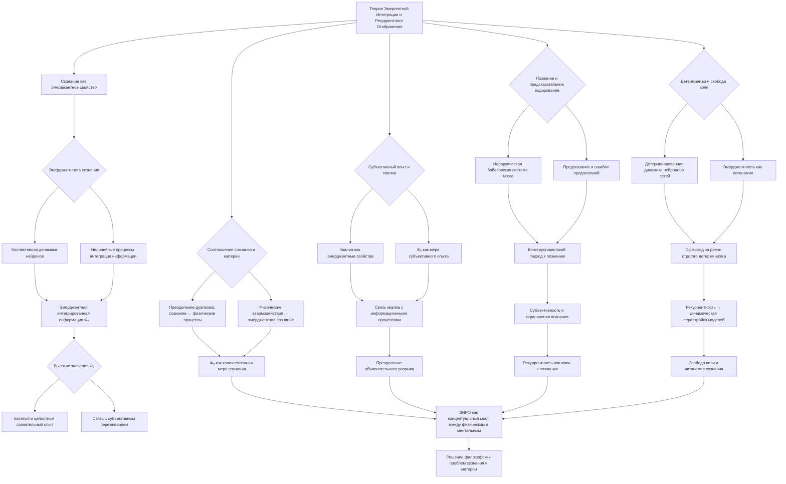

# Философские аспекты теории Эмергентной Интеграции и Рекуррентного Отображения (ЭИРО)

---

## 1. Введение

Теория Эмергентной Интеграции и Рекуррентного Отображения (ЭИРО) предлагает новый подход к пониманию природы сознания, рассматривая его как эмерджентное свойство, возникающее из процессов интеграции информации в рекуррентных нейронных сетях. Данная теория имеет важные философские импликации, которые требуют более глубокого осмысления и сопоставления с существующими концепциями сознания.

### 2. Философия сознания и ЭИРО

#### 2.1. Эмерджентность сознания

Согласно теории Эмергентной Интеграции и Рекуррентного Отображения (ЭИРО), сознание является эмерджентным феноменом, возникающим из коллективной динамики нейронных взаимодействий, а не из активности отдельных клеток. Это ставит под вопрос традиционные редукционистские подходы, пытающиеся объяснить сознание исключительно на основе физиологии мозга.

ЭИРО предлагает холистический взгляд на природу сознания, рассматривая его как свойство, эмерджентно возникающее из сложных нелинейных процессов в нейронных сетях. Согласно этой теории, сознание не может быть сведено к простой сумме или комбинации активности отдельных нейронов, но является результатом коллективной динамики их взаимодействий.

Ключевым параметром, характеризующим эмерджентность сознания в рамках ЭИРО, является эмерджентная интегрированная информация ($\Phi_e$). $\Phi_e$ количественно оценивает степень интеграции информации в контексте рекуррентной обработки в нейронных сетях:

$\Phi_e = \int_{0}^{t_1} I(\text{integration})(t) \cdot R(\text{recurrence})(t) \, dt$

Где:

- $I(\text{integration})(t)$ - мера объединения информации в момент времени $t$.
- $R(\text{recurrence})(t)$ - степень рекуррентной обработки в момент времени $t$.

Высокие значения $\Phi_e$ соответствуют более богатому и целостному сознательному опыту, поскольку отражают эффективную интеграцию информации в рекуррентных нейронных сетях мозга. Таким образом, ЭИРО предлагает количественный подход к описанию эмерджентности сознания, связывая коллективную динамику нейронных взаимодействий с субъективным переживанием.

Этот холистический взгляд на природу сознания, предлагаемый теорией ЭИРО, ставит под сомнение традиционные редукционистские подходы, пытающиеся объяснить сознание исключительно на основе физиологии отдельных нейронов. Вместо этого ЭИРО утверждает, что сознание является эмерджентным свойством, возникающим из сложных нелинейных процессов интеграции информации в рекуррентных нейронных сетях мозга.

#### 2.2. Соотношение сознания и материи

Теория Эмергентной Интеграции и Рекуррентного Отображения (ЭИРО) бросает вызов картезианскому дуализму, который утверждает непреодолимый разрыв между сознанием и материей. Согласно дуалистическим концепциям, сознание представляет собой нематериальную субстанцию, принципиально отличную от физического мира. Однако ЭИРО предлагает более интегративный подход, в котором сознание рассматривается как эмерджентное свойство, возникающее из физических процессов, протекающих в мозге.

Ключевым аспектом ЭИРО является представление о том, что сознание не является изолированной сущностью, а является результатом сложных нелинейных взаимодействий между множеством нейронных элементов. Согласно теории, сознание эмерджентно возникает из процессов интеграции информации в рекуррентных нейронных сетях. Таким образом, сознание рассматривается не как нечто отдельное от материи, а как свойство, неразрывно связанное с физическими процессами в мозге.

Данный подход открывает новые возможности для преодоления "трудной проблемы сознания" - проблемы объяснения того, как физические процессы в мозге порождают субъективный опыт. ЭИРО предлагает количественные меры, такие как эмерджентная интегрированная информация (Φₑ), которые связывают нейронную активность с характеристиками сознательного переживания. Это позволяет установить более тесные связи между ментальным и физическим, преодолевая картезианский дуализм.

Таким образом, теория ЭИРО представляет собой холистический подход, в котором сознание рассматривается как неотъемлемое свойство физических процессов, протекающих в мозге. Это открывает новые возможности для понимания взаимодействия ментального и материального, а также для решения "трудной проблемы сознания".

#### 2.3. Субъективный опыт и квалиа

Теория Эмергентной Интеграции и Рекуррентного Отображения (ЭИРО) затрагивает фундаментальные вопросы, связанные с природой субъективного опыта и квалиа - неотъемлемых аспектов сознания.

##### 2.3.1. Квалиа как эмерджентные свойства

Согласно ЭИРО, сознание является эмерджентным феноменом, возникающим из сложных нелинейных процессов интеграции информации в рекуррентных нейронных сетях мозга. В этом контексте, квалиа - уникальные качественные характеристики субъективного опыта, такие как ощущение цвета, звука или боли, - могут рассматриваться не как нередуцируемые сущности, а как эмерджентные свойства, возникающие из этих информационных процессов.

##### 2.3.2. Φₑ как количественная мера субъективного переживания

Теория ЭИРО вводит параметр эмерджентной интегрированной информации (Φₑ), который количественно отражает степень интеграции информации в контексте рекуррентной обработки. Этот параметр может быть интерпретирован как мера субъективного переживания, связывая нейронную активность с характеристиками сознательного опыта.

Высокие значения Φₑ соответствуют богатому, насыщенному сознательному опыту, в то время как низкие значения указывают на более бедные, фрагментированные переживания. Таким образом, Φₑ предоставляет количественную основу для описания квалиа и их связи с нейрофизиологическими процессами.

##### 2.3.3. Преодоление "трудной проблемы сознания"

Интерпретация квалиа как эмерджентных свойств, а не как нередуцируемых сущностей, открывает новые возможности для решения "трудной проблемы сознания" - вопроса о том, как физические процессы в мозге порождают субъективный опыт. Теория ЭИРО предлагает подход, в котором квалиа рассматриваются как результат сложных информационных процессов, а не как нечто принципиально отличное от физического мира.

Количественная мера Φₑ позволяет связать нейронную активность с характеристиками сознательного опыта, преодолевая "объяснительный разрыв" между ментальным и физическим. Это создает основу для более глубокого понимания природы субъективного переживания и его места в физическом мире.

Таким образом, ЭИРО предлагает новую концептуальную основу для осмысления квалиа и субъективного опыта, открывая перспективы для решения фундаментальных вопросов философии сознания.

### 3. Эпистемология и ЭИРО

#### 3.1. Познание и предсказательное кодирование

Согласно теории Эмергентной Интеграции и Рекуррентного Отображения (ЭИРО), мозг функционирует как иерархическая байесовская система, постоянно генерирующая предсказания о сенсорных входах и обновляющая свои внутренние модели. Этот процесс предиктивного кодирования имеет важные эпистемологические следствия, касающиеся природы познания и его ограничений.

##### 3.1.1. Байесовский подход к познанию

В рамках ЭИРО, познание рассматривается как непрерывный процесс обновления внутренних моделей мозга на основе байесовского вывода.

Согласно байесовскому правилу, мозг постоянно пересматривает свои априорные представления ( $P(\theta)$ ) в свете новых сенсорных данных ( $P(D|\theta)$ ), формируя апостериорные вероятностные модели ( $P(\theta|D)$ ):

$P(\theta \mid D) = \frac{P(D \mid \theta) \cdot P(\theta)}{P(D)}$

Где:

- $\theta$ - параметры внутренних моделей мозга
- $D$ - наблюдаемые сенсорные данные
- $P(\theta \mid D)$ - апостериорная вероятность параметров модели после учета данных
- $P(D \mid \theta)$ - правдоподобие данных при заданных параметрах
- $P(\theta)$ - априорное распределение параметров
- $P(D)$ - маргинальная вероятность данных

Таким образом, мозг постоянно обновляет свои внутренние представления о мире, стремясь минимизировать ошибки предсказания между ожидаемыми и фактическими сенсорными сигналами.

##### 3.1.2. Предиктивное кодирование и познание

Центральным механизмом в рамках ЭИРО является предиктивное кодирование - процесс, при котором высшие уровни иерархии мозга генерируют предсказания о сенсорных входах, а нижележащие уровни вычисляют и передают ошибки этих предсказаний. Этот циклический обмен информацией между уровнями позволяет мозгу непрерывно обновлять и адаптировать свои внутренние модели.

##### 3.1.3. Эпистемологические следствия ЭИРО

Теория ЭИРО имеет важные эпистемологические импликации:

1. Конструктивистский взгляд на познание: Согласно ЭИРО, мозг не пассивно регистрирует внешнюю реальность, а активно конструирует свое представление о мире на основе предсказаний и ошибок.

2. Ограниченность познания: Поскольку мозг опирается на внутренние вероятностные модели, его познание неизбежно ограничено точностью этих моделей и неизбежными ошибками предсказания.

3. Роль рекуррентности: Рекуррентные взаимодействия между уровнями иерархии мозга играют ключевую роль в формировании и обновлении внутренних репрезентаций, определяя процессы познания.

4. Субъективность познания: Согласно ЭИРО, познание является глубоко субъективным процессом, зависящим от индивидуальных особенностей нейронных сетей мозга и их предыдущего опыта.

Таким образом, теория ЭИРО предлагает новый взгляд на природу познания, рассматривая мозг как активную, вероятностную систему, конструирующую свое представление о реальности на основе предсказаний и обновления внутренних моделей. Это имеет важные эпистемологические следствия, касающиеся ограниченности, субъективности и механизмов познавательных процессов.

#### 3.2. Проблема "объяснительного разрыва"

Одной из ключевых философских проблем, которую теория Эмергентной Интеграции и Рекуррентного Отображения (ЭИРО) может помочь решить, является "проблема объяснительного разрыва" (the "explanatory gap"). Эта проблема заключается в трудности объяснения, каким образом физические процессы, происходящие в мозге, порождают субъективный опыт сознания.

Традиционно, существует разрыв между нашим научным пониманием нейрофизиологических механизмов и феноменологией сознательного переживания. Как физические, материальные процессы в мозге могут порождать такие неотъемлемые аспекты сознания, как ощущения, эмоции, мысли и переживания? Этот "объяснительный разрыв" между ментальным и физическим долгое время оставался одной из самых сложных проблем в философии сознания.

Теория ЭИРО предлагает новые возможности для преодоления этой проблемы. Ключевым аспектом является введение количественной меры эмерджентной интегрированной информации (Φₑ), которая связывает нейронную активность с характеристиками сознательного опыта:

Высокие значения Φₑ соответствуют более богатому и целостному сознательному опыту, поскольку отражают эффективную интеграцию информации в рекуррентных нейронных сетях мозга. Таким образом, теория ЭИРО предлагает количественный подход, который позволяет связать нейрофизиологические процессы с субъективными характеристиками сознания.

Это открывает новые возможности для преодоления "объяснительного разрыва". Вместо того, чтобы рассматривать сознание как нечто принципиально отличное от физических процессов, ЭИРО предлагает понимать его как эмерджентное свойство, возникающее из сложных информационных взаимодействий в рекуррентных нейронных сетях. Количественные меры, такие как Φₑ, позволяют установить более тесные связи между ментальным и физическим, преодолевая традиционные дуалистические представления.

Таким образом, теория ЭИРО открывает новые перспективы для решения "проблемы объяснительного разрыва", предлагая концептуальную и математическую основу для более глубокого понимания того, как физические процессы в мозге порождают субъективный опыт сознания. Это является важным шагом в направлении преодоления одной из фундаментальных проблем в философии сознания.

### 4. Детерминизм, свобода воли и ЭИРО

#### 4.1. Детерминизм и эмерджентность

Теория Эмергентной Интеграции и Рекуррентного Отображения (ЭИРО) поднимает важные вопросы, связанные с проблемой детерминизма и свободы воли.

##### 4.1.1. Детерминистская динамика нейронных сетей

Согласно ЭИРО, динамика нейронных сетей мозга описывается детерминистскими уравнениями состояния:

$\frac{d\mathbf{x}}{dt} = \mathbf{f}(\mathbf{x}(t), \mathbf{u}(t), W)$

Где:

- $\mathbf{x}(t)$ - вектор состояния сети в момент времени $t$
- $\mathbf{u}(t)$ - вектор входных сигналов
- $W$ - матрица весов связей, включая рекуррентные
- $\mathbf{f}$ - нелинейная функция активации

Эти уравнения демонстрируют, что поведение нейронных сетей подчиняется строгим детерминистским закономерностям, где будущее состояние системы однозначно определяется ее текущим состоянием и входными воздействиями.

##### 4.1.2. Эмерджентность сознания

Однако теория ЭИРО постулирует, что сознание является эмерджентным феноменом, возникающим из сложных нелинейных процессов интеграции информации в рекуррентных нейронных сетях. Согласно ЭИРО, сознание не может быть сведено к простой сумме или комбинации активности отдельных нейронов, но является результатом коллективной динамики их взаимодействий.

Ключевым параметром, характеризующим эмерджентность сознания, является эмерджентная интегрированная информация ($\Phi_e$):

$\Phi_e = \int_{0}^{t_1} I(\text{integration})(t) \cdot R(\text{recurrence})(t) \, dt$

Где:

- $I(\text{integration})(t)$ - мера объединения информации в момент времени $t$.
- $R(\text{recurrence})(t)$ - степень рекуррентной обработки в момент времени $t$.

Высокие значения $\Phi_e$ соответствуют более богатому и целостному сознательному опыту, что указывает на наличие нередуцируемых эмерджентных свойств, выходящих за рамки простого детерминизма.

##### 4.1.3. Проблема свободы воли

Таким образом, теория ЭИРО ставит под сомнение строгий физический детерминизм, поскольку эмерджентность сознания предполагает наличие свойств, не сводимых к динамике отдельных нейронов. Это открывает возможности для обсуждения проблемы свободы воли и автономии сознания.

Рекуррентные взаимодействия, лежащие в основе ЭИРО, могут быть интерпретированы как механизм, обеспечивающий определенную степень автономии и свободы воли. Циклические потоки информации, поддерживаемые рекуррентными связями, позволяют мозгу динамически перестраивать свои внутренние модели, что может быть связано с переживанием субъективной свободы.

В целом, теория ЭИРО поднимает фундаментальные вопросы, касающиеся детерминизма и эмерджентности сознания, открывая новые возможности для осмысления проблемы свободы воли в контексте нейронаучных представлений о работе мозга.

#### 4.2. Свобода воли и рекуррентность

Теория Эмергентной Интеграции и Рекуррентного Отображения (ЭИРО) поднимает важные вопросы, касающиеся проблемы свободы воли и ее соотношения с детерминистской динамикой нейронных сетей мозга.

##### 4.2.1. Рекуррентность как механизм автономии

Согласно ЭИРО, ключевую роль в формировании сознательного опыта играют рекуррентные взаимодействия между различными областями мозга. Эти рекуррентные связи обеспечивают циклические потоки информации, позволяющие мозгу поддерживать активность и динамически перестраивать свои внутренние модели.

Именно рекуррентность может быть интерпретирована как механизм, обеспечивающий определенную степень автономии и свободы воли в рамках теории ЭИРО. Циклические процессы, поддерживаемые рекуррентными взаимодействиями, дают мозгу возможность не просто пассивно реагировать на внешние стимулы, но активно генерировать предсказания, обновлять внутренние репрезентации и принимать решения.

##### 4.2.2. Свобода воли и динамическая перестройка моделей

Ключевым аспектом является то, что рекуррентные связи позволяют мозгу непрерывно перестраивать свои внутренние модели мира на основе ошибок предсказания. Согласно теории ЭИРО, мозг функционирует как иерархическая байесовская система, постоянно генерирующая предсказания о сенсорных входах и обновляющая эти предсказания в соответствии с наблюдаемыми данными:

$P(\theta \mid D) = \frac{P(D \mid \theta) \cdot P(\theta)}{P(D)}$

Где:

- $\theta$ - параметры внутренних моделей мозга
- $D$ - наблюдаемые сенсорные данные
- $P(\theta \mid D)$ - апостериорная вероятность параметров после учета данных

Рекуррентные связи играют ключевую роль в этом процессе, позволяя информации циркулировать между различными уровнями иерархии и динамически перестраивать внутренние репрезентации. Это может быть интерпретировано как механизм, обеспечивающий определенную степень автономии и свободы воли в принятии решений.

##### 4.2.3. Эмерджентность сознания и свобода воли

Важно также отметить, что теория ЭИРО постулирует эмерджентный характер сознания. Согласно ЭИРО, сознание не является простой суммой или комбинацией активности отдельных нейронов, но возникает как нередуцируемое свойство из сложных нелинейных взаимодействий в рекуррентных нейронных сетях.

Этот эмерджентный характер сознания, отраженный в параметре эмерджентной интегрированной информации (Φₑ), может быть связан с переживанием субъективной свободы воли. Если сознание действительно является эмерджентным феноменом, выходящим за рамки простого физического детерминизма, то это открывает возможности для обсуждения автономии и свободы воли.

Таким образом, теория ЭИРО поднимает фундаментальные вопросы, касающиеся соотношения детерминизма и свободы воли. Рекуррентные механизмы, лежащие в основе этой теории, могут быть интерпретированы как обеспечивающие определенную степень автономии и динамической перестройки внутренних моделей, что связано с переживанием субъективной свободы. Эмерджентный характер сознания, постулируемый ЭИРО, также открывает новые возможности для осмысления проблемы свободы воли в контексте нейронаучных представлений о работе мозга.

### 5. Заключение

Теория Эмергентной Интеграции и Рекуррентного Отображения (ЭИРО) имеет важные философские импликации, касающиеся природы сознания, его эмерджентности, соотношения ментального и физического, а также вопросов, связанных с познанием, детерминизмом и свободой воли. Дальнейшее осмысление этих философских аспектов ЭИРО может способствовать более глубокому пониманию сознания и его места в мире.

### 6. Библиография

1. Tononi, G. (2004). An information integration theory of consciousness. *BMC Neuroscience*, 5(1), 42.
2. Dehaene, S., & Changeux, J. P. (2011). Experimental and theoretical approaches to conscious processing. *Neuron*, 70(2), 200-227.
3. Friston, K. (2010). The free-energy principle: a unified brain theory? *Nature Reviews Neuroscience*, 11(2), 127-138.
4. Oizumi, M., Albantakis, L., & Tononi, G. (2014). From the phenomenology to the mechanisms of consciousness: integrated information theory 3.0. *PLoS Computational Biology*, 10(5), e1003588.
5. Chalmers, D. J. (1995). Facing up to the problem of consciousness. *Journal of Consciousness Studies*, 2(3), 200-219.
6. Searle, J. R. (1997). The mystery of consciousness. *New York Review of Books*.
7. Metzinger, T. (2003). Being no one: The self-model theory of subjectivity. *MIT Press*.
8. Nagel, T. (1974). What is it like to be a bat? *The Philosophical Review*, 83(4), 435-450.

---

Оглавление: 
- [ЭИРО framework](/README.md)
- [Справочник формул](/formulas.md)

