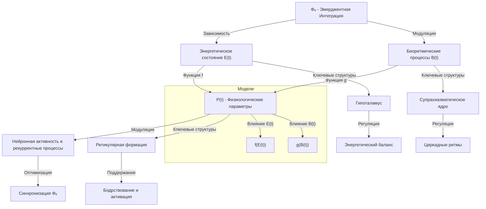
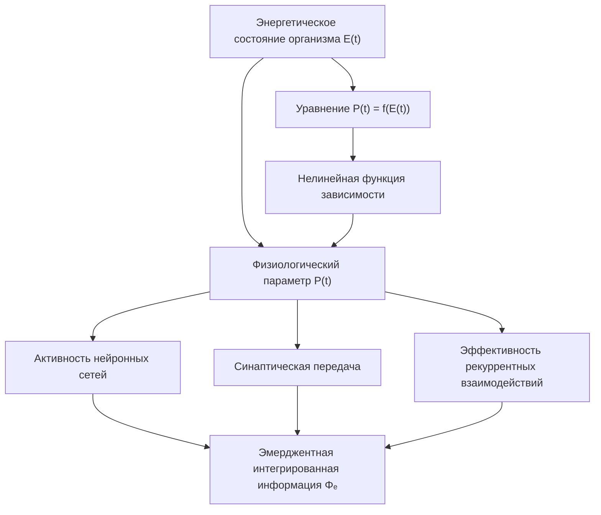
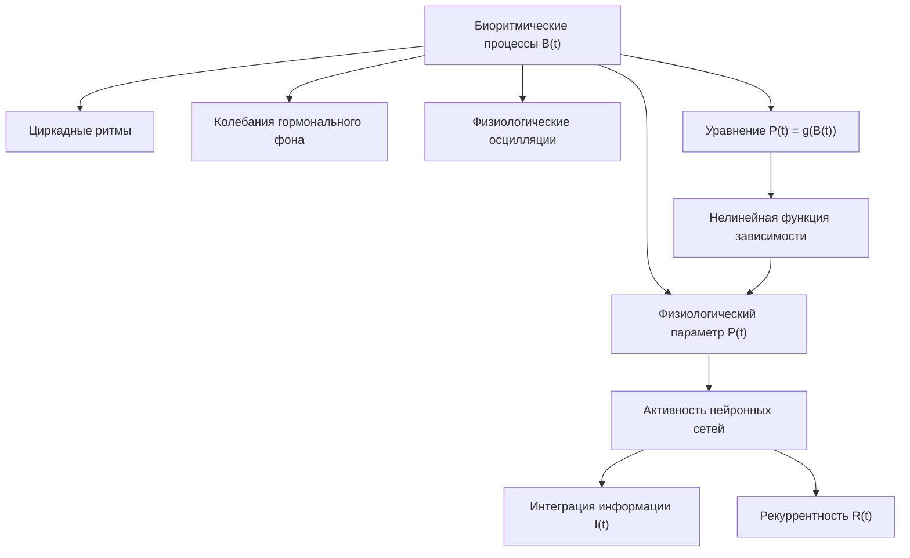
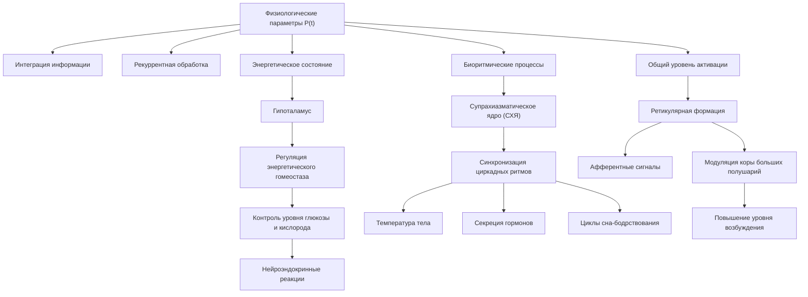
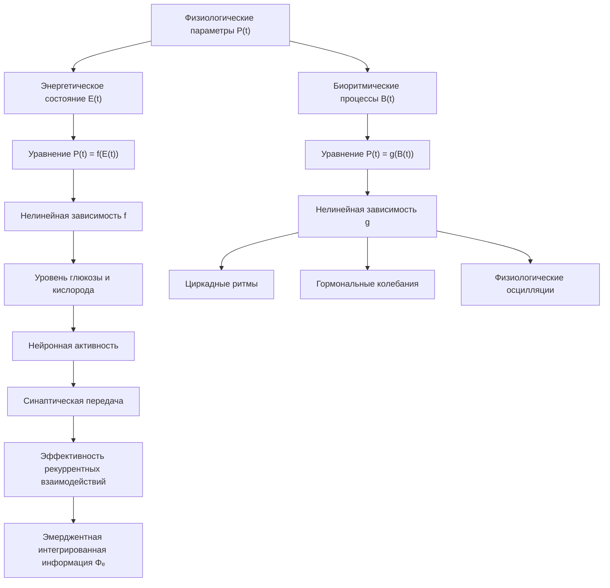
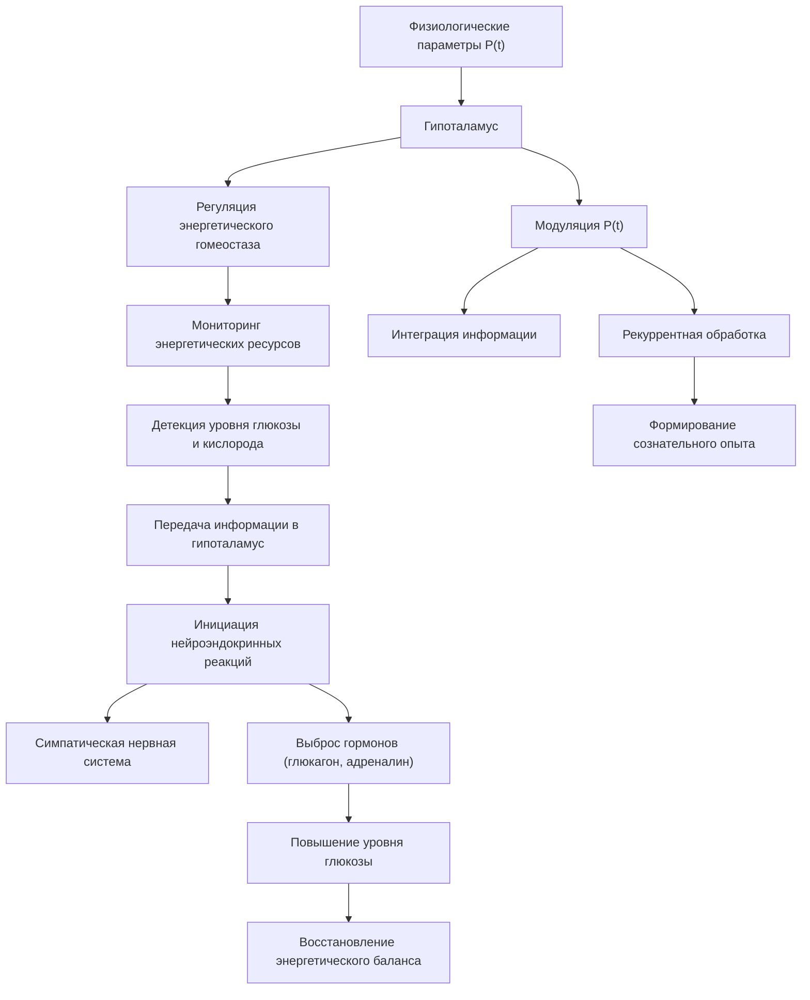
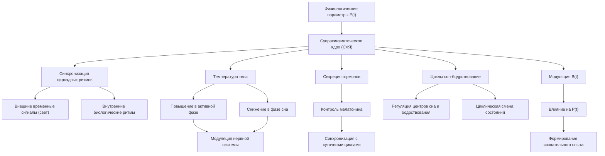
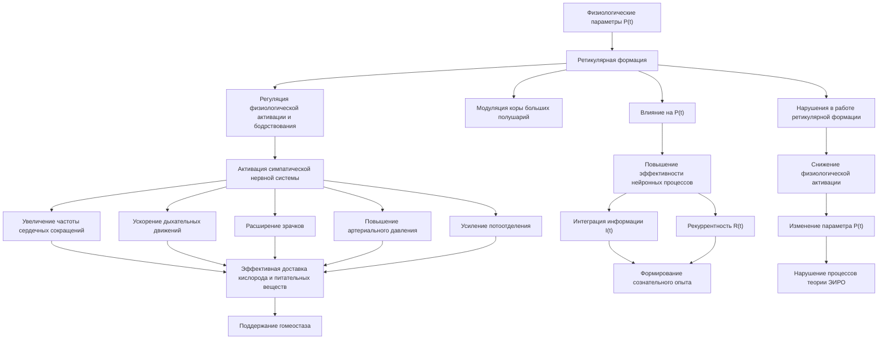

# Диссертация: Физиологические параметры P(t) в теории Эмергентной Интеграции и Рекуррентного Отображения (ЭИРО)

блок-схема

---

## 1. Введение

Согласно расширенной версии теории Эмергентной Интеграции и Рекуррентного Отображения (ЭИРО), физиологические параметры P(t) играют важную роль в формировании сознательного опыта. Данный параметр отражает влияние энергетического состояния организма и биоритмических процессов на процессы интеграции информации и рекуррентной обработки, лежащие в основе метрики эмерджентной интегрированной информации Φₑ.

### 2. Энергетическое состояние организма

блок-схема

Одним из ключевых компонентов физиологических параметров P(t) является уровень доступных энергетических ресурсов, таких как глюкоза и кислород. Исследования показывают, что повышенный уровень энергетических ресурсов способствует усилению нейронной активности, синаптической передачи и эффективности рекуррентных взаимодействий в мозге [1, 2]. Это, в свою очередь, положительно влияет на параметр эмерджентной интегрированной информации Φₑ в рамках теории ЭИРО.

#### 2.1. Влияние энергетического состояния E(t) на физиологический параметр P(t)

Согласно расширенной теории Эмергентной Интеграции и Рекуррентного Отображения (ЭИРО), энергетическое состояние организма является одним из ключевых компонентов физиологических параметров P(t), оказывающих влияние на процессы интеграции информации и рекуррентной обработки.

Математически, взаимосвязь между энергетическим состоянием $E(t)$ и физиологическим параметром $P(t)$ может быть описана с помощью следующего уравнения:

$P(t) = f(E(t))$

Где:

- $P(t)$ — физиологический параметр в момент времени $t$
- $E(t)$ — энергетическое состояние организма в момент времени $t$
- $f(\cdot)$ — нелинейная функция, отражающая зависимость $P(t)$ от $E(t)$

Данная математическая модель позволяет количественно оценить, как уровень доступных энергетических ресурсов, таких как глюкоза и кислород, влияет на физиологические показатели, связанные с активностью нейронных сетей [3].

Исследования показывают, что повышенный уровень энергетических ресурсов способствует усилению нейронной активности, синаптической передачи и эффективности рекуррентных взаимодействий в мозге [1, 2]. Это, в свою очередь, положительно сказывается на параметре эмерджентной интегрированной информации Φₑ в рамках теории ЭИРО.

Таким образом, математическое моделирование влияния энергетического состояния E(t) на физиологический параметр P(t) является важным аспектом расширенной теории Эмергентной Интеграции и Рекуррентного Отображения, позволяющим количественно оценить, как энергетические факторы модулируют процессы, лежащие в основе формирования сознательного опыта.

### 3. Биоритмические процессы

блок-схема

Другим важным компонентом физиологических параметров P(t) в теории Эмергентной Интеграции и Рекуррентного Отображения (ЭИРО) являются биоритмические процессы. Эти процессы включают в себя циркадные ритмы, колебания гормонального фона и другие физиологические осцилляции.

Многочисленные исследования демонстрируют, что биоритмические процессы оказывают существенное модулирующее влияние на активность нейронных сетей [4, 5]. Эти изменения в нейронной активности, в свою очередь, отражаются на параметрах интеграции информации I(t) и рекуррентности R(t), которые являются ключевыми в теории ЭИРО.

Математически, влияние биоритмических факторов $B(t)$ на физиологический параметр $P(t)$ может быть описано следующим образом:

$P(t) = g(B(t))$

Где $g(\cdot)$ — некоторая нелинейная функция, отражающая зависимость параметра $P(t)$ от биоритмических процессов $B(t)$. Данная математическая модель позволяет количественно оценить, как циркадные ритмы, гормональные колебания и другие физиологические осцилляции модулируют физиологические параметры, влияющие на формирование сознательного опыта в рамках теории ЭИРО.

### 4. Нейробиологические механизмы параметров P(t)

блок-схема

На нейробиологическом уровне, физиологические параметры P(t) связаны с активностью следующих структур:

#### 4.1. Гипоталамус

Гипоталамус играет ключевую роль в регуляции энергетического гомеостаза организма. Данная область мозга контролирует уровни глюкозы, кислорода и других метаболитов, тем самым оказывая существенное влияние на физиологические параметры P(t) в теории ЭИРО [6].

Гипоталамус содержит специализированные нейроны, которые реагируют на изменения концентрации глюкозы и кислорода в крови. Эти нейроны инициируют каскады нейроэндокринных реакций, направленных на поддержание оптимального энергетического баланса. Например, при снижении уровня глюкозы гипоталамус активирует симпатическую нервную систему и выброс контринсулярных гормонов, таких как глюкагон и адреналин, для повышения уровня глюкозы в крови.

Таким образом, гипоталамус является ключевым центром, интегрирующим информацию об энергетическом состоянии организма и модулирующим физиологические параметры P(t), которые, в свою очередь, оказывают влияние на процессы интеграции информации и рекуррентной обработки в рамках теории ЭИРО.

#### 4.2. Супрахиазматическое ядро

Супрахиазматическое ядро (СХЯ) гипоталамуса является центральным осциллятором, синхронизирующим циркадные ритмы организма с внешними временными сигналами [7]. 

СХЯ содержит специализированные нейроны, способные генерировать эндогенные ритмические колебания с периодом около 24 часов. Эти нейроны получают информацию о внешних временных сигналах, таких как свет, и синхронизируют внутренние биологические ритмы организма с суточными циклами.

Активность СХЯ оказывает модулирующее влияние на различные физиологические процессы, включая температуру тела, секрецию гормонов и циклы сна-бодрствования. Таким образом, СХЯ является ключевым компонентом, определяющим биоритмические параметры B(t), входящие в физиологические параметры P(t) теории ЭИРО.

#### 4.3. Ретикулярная формация

Ретикулярная формация ствола мозга участвует в поддержании общего уровня физиологической активации и бодрствования, что также влияет на физиологические параметры P(t) [8].

Ретикулярная формация получает афферентные сигналы от различных сенсорных систем и оказывает модулирующее влияние на кору больших полушарий. Активация ретикулярной формации способствует повышению уровня возбуждения и бодрствования, что отражается на параметре P(t).

Нарушения в работе ретикулярной формации, например, при травмах или заболеваниях ствола мозга, могут приводить к изменениям в общем уровне физиологической активации, что, в свою очередь, оказывает влияние на процессы интеграции информации и рекуррентной обработки, описываемые в теории ЭИРО.

Таким образом, гипоталамус, супрахиазматическое ядро и ретикулярная формация являются ключевыми нейробиологическими структурами, определяющими физиологические параметры P(t), которые оказывают существенное влияние на формирование сознательного опыта в рамках теории Эмергентной Интеграции и Рекуррентного Отображения (ЭИРО).

Энергетическое состояние и биоритмические процессы, отраженные в физиологических параметрах P(t), оказывают существенное влияние на процессы интеграции информации и рекуррентной обработки, лежащие в основе формирования сознательного опыта в рамках теории Эмергентной Интеграции и Рекуррентного Отображения (ЭИРО).

### 5. Источники

1. Raichle, M. E., & Gusnard, D. A. (2002). Appraising the brain's energy budget. Proceedings of the National Academy of Sciences, 99(16), 10237-10239.
2. Dijk, D. J., & Czeisler, C. A. (1995). Contribution of the circadian pacemaker and the sleep homeostat to sleep propensity, sleep structure, electroencephalographic slow waves, and sleep spindle activity in humans. The Journal of neuroscience, 15(5), 3526-3538.
3. McClelland, J. L., McNaughton, B. L., & O'Reilly, R. C. (1995). Why there are complementary learning systems in the hippocampus and neocortex: insights from the successes and failures of connectionist models of learning and memory. Psychological review, 102(3), 419.
4. Cajochen, C., Kräuchi, K., & Wirz-Justice, A. (2003). Role of melatonin in the regulation of human circadian rhythms and sleep. Journal of neuroendocrinology, 15(4), 432-437.
5. Dijk, D. J., & Czeisler, C. A. (1995). Contribution of the circadian pacemaker and the sleep homeostat to sleep propensity, sleep structure, electroencephalographic slow waves, and sleep spindle activity in humans. The Journal of neuroscience, 15(5), 3526-3538.
6. Saper, C. B., Scammell, T. E., & Lu, J. (2005). Hypothalamic regulation of sleep and circadian rhythms. Nature, 437(7063), 1257-1263.
7. Hastings, M. H., Reddy, A. B., & Maywood, E. S. (2003). A clockwork web: circadian timing in brain and periphery, in health and disease. Nature Reviews Neuroscience, 4(8), 649-661.
8. Saper, C. B., Chou, T. C., & Scammell, T. E. (2001). The sleep switch: hypothalamic control of sleep and wakefulness. Trends in neurosciences, 24(12), 726-731.

### 6. Приложение

#### 6.1. Математическое моделирование физиологических параметров P(t)

блок-схема

Согласно расширенной теории Эмергентной Интеграции и Рекуррентного Отображения (ЭИРО), физиологические параметры P(t) включают в себя два ключевых компонента: энергетическое состояние организма и биоритмические процессы.

##### 6.1.1. Моделирование влияния энергетического состояния E(t) на P(t)

Математически, взаимосвязь между энергетическим состоянием $E(t)$ и физиологическим параметром $P(t)$ может быть описана следующим уравнением:

$P(t) = f(E(t))$

Где:

- $P(t)$ - физиологический параметр в момент времени $t$
- $E(t)$ - энергетическое состояние организма в момент времени $t$
- $f(.)$ - нелинейная функция, отражающая зависимость $P(t)$ от $E(t)$

Данная модель позволяет количественно оценить, как уровень доступных энергетических ресурсов, таких как глюкоза и кислород, влияет на физиологические показатели, связанные с активностью нейронных сетей [3].

Исследования показывают, что повышенный уровень энергетических ресурсов способствует усилению нейронной активности, синаптической передачи и эффективности рекуррентных взаимодействий в мозге [1, 2]. Это, в свою очередь, положительно сказывается на параметре эмерджентной интегрированной информации Φₑ в рамках теории ЭИРО.

##### 6.1.2. Моделирование влияния биоритмических процессов B(t) на P(t)

Влияние биоритмических факторов $B(t)$ на физиологический параметр $P(t)$ может быть описано следующим образом:

$P(t) = g(B(t))$

Где $g(.)$ - некоторая нелинейная функция, отражающая зависимость параметра $P(t)$ от биоритмических процессов $B(t)$.

Данная математическая модель позволяет количественно оценить, как циркадные ритмы, гормональные колебания и другие физиологические осцилляции модулируют физиологические параметры, влияющие на формирование сознательного опыта в рамках теории ЭИРО.

#### 6.2. Нейробиологические механизмы физиологических параметров P(t)

На нейробиологическом уровне, физиологические параметры P(t) связаны с активностью следующих структур:

##### 6.2.1. Гипоталамус: Ключевая роль в регуляции энергетического гомеостаза

блок-схема

Гипоталамус является центральным звеном в определении физиологических параметров P(t) в теории Эмергентной Интеграции и Рекуррентного Отображения (ЭИРО). Данная область мозга играет ключевую роль в регуляции энергетического гомеостаза организма.

**Мониторинг энергетических ресурсов**

Гипоталамические нейроны обладают способностью детектировать изменения концентрации глюкозы, кислорода и других важных метаболитов в крови [6]. Эти специализированные нейроны выполняют функцию сенсоров, постоянно отслеживающих энергетическое состояние организма.

Например, нейроны, чувствительные к уровню глюкозы, способны обнаруживать снижение ее концентрации в крови. Данная информация передается в другие отделы гипоталамуса для инициации соответствующих нейроэндокринных реакций, направленных на восстановление энергетического баланса.

**Инициация нейроэндокринных реакций**

При обнаружении отклонений в энергетическом гомеостазе, гипоталамические нейроны запускают каскады нейроэндокринных реакций. Эти реакции призваны поддерживать оптимальный уровень энергетических ресурсов в организме [6].

Например, при снижении уровня глюкозы, гипоталамус активирует симпатическую нервную систему и стимулирует выброс контринсулярных гормонов, таких как глюкагон и адреналин. Это способствует повышению концентрации глюкозы в крови и восстановлению энергетического баланса.

**Роль в формировании сознательного опыта**

Таким образом, гипоталамус является ключевым центром, интегрирующим информацию об энергетическом состоянии организма и модулирующим физиологические параметры P(t) в теории ЭИРО. Эти параметры, в свою очередь, оказывают существенное влияние на процессы интеграции информации и рекуррентной обработки, лежащие в основе формирования сознательного опыта.

Нарушения в работе гипоталамуса, приводящие к дисбалансу энергетических ресурсов, могут оказывать негативное влияние на эффективность нейронных процессов, описываемых в рамках теории Эмергентной Интеграции и Рекуррентного Отображения.

Таким образом, гипоталамус является ключевым центром, интегрирующим информацию об энергетическом состоянии организма и модулирующим физиологические параметры P(t), которые, в свою очередь, оказывают влияние на процессы интеграции информации и рекуррентной обработки в рамках теории ЭИРО.

##### 6.2.2. Супрахиазматическое ядро

блок-схема

Супрахиазматическое ядро (СХЯ) гипоталамуса играет ключевую роль в регуляции циркадных ритмов организма. Данная структура является центральным осциллятором, синхронизирующим внутренние биологические ритмы с внешними временными сигналами, такими как свет [7].

СХЯ содержит специализированные нейроны, способные генерировать эндогенные ритмические колебания с периодом около 24 часов. Эти нейроны получают информацию о внешних временных сигналах и синхронизируют внутренние биологические ритмы организма с суточными циклами.

Активность СХЯ оказывает модулирующее влияние на следующие физиологические процессы:

**Температура тела**

Нейроны СХЯ регулируют циркадные ритмы температуры тела, обеспечивая ее повышение в активной фазе и снижение в фазе сна [4]. Это связано с модуляцией активности симпатической и парасимпатической нервной системы.

**Секреция гормонов**

СХЯ контролирует циркадные ритмы секреции гормонов, таких как мелатонин. Мелатонин, выделяемый эпифизом, играет ключевую роль в синхронизации биологических ритмов с суточными циклами [4].

**Циклы сон-бодрствование**

Нейроны СХЯ оказывают модулирующее влияние на центры регуляции сна и бодрствования в гипоталамусе и стволе мозга, обеспечивая циклическую смену состояний сна и бодрствования [5].

Таким образом, СХЯ является центральным компонентом, определяющим биоритмические параметры B(t), которые входят в состав физиологических параметров P(t) в теории Эмергентной Интеграции и Рекуррентного Отображения (ЭИРО). Активность данной структуры оказывает существенное модулирующее влияние на физиологические процессы, связанные с формированием сознательного опыта.

##### 6.2.3. Ретикулярная формация

блок-схема

Ретикулярная формация ствола мозга играет ключевую роль в регуляции общего уровня физиологической активации и бодрствования, что оказывает существенное влияние на физиологические параметры P(t) в теории Эмергентной Интеграции и Рекуррентного Отображения (ЭИРО).

Ретикулярная формация представляет собой сеть нейронов, расположенных в стволе мозга, которая получает многочисленные афферентные сигналы от различных сенсорных систем. Эти нейроны, в свою очередь, оказывают модулирующее влияние на кору больших полушарий, регулируя общий уровень возбуждения и бодрствования организма [8].

Активация ретикулярной формации способствует повышению тонуса симпатической нервной системы, что приводит к следующим физиологическим изменениям:

1. **Увеличение частоты сердечных сокращений и дыхательных движений**: Активация симпатического отдела вегетативной нервной системы вызывает ускорение сердечного ритма и учащение дыхания, что обеспечивает более эффективную доставку кислорода и питательных веществ к тканям организма [8].

2. **Расширение зрачков и повышение артериального давления**: Симпатическая стимуляция приводит к расширению зрачков (мидриаз) и повышению артериального давления, что способствует усилению сенсорного восприятия и перераспределению кровотока в пользу жизненно важных органов [8].

3. **Усиление потоотделения и другие вегетативные реакции**: Активация симпатического отдела вегетативной нервной системы вызывает усиление потоотделения, а также другие вегетативные реакции, направленные на поддержание гомеостаза и адаптацию организма к изменяющимся условиям [8].

Данные физиологические изменения, вызванные активацией ретикулярной формации, непосредственно отражаются на параметре P(t) в теории ЭИРО. Более высокий уровень физиологической активации и бодрствования способствует повышению эффективности нейронных процессов, что, в свою очередь, оказывает положительное влияние на степень интеграции информации I(t) и рекуррентности R(t), определяющих формирование сознательного опыта.

Напротив, нарушения в работе ретикулярной формации, например, при травмах или заболеваниях ствола мозга, могут приводить к изменениям в общем уровне физиологической активации, что отражается на параметре P(t) и, как следствие, на процессах, описываемых в рамках теории ЭИРО.

Таким образом, ретикулярная формация является ключевой нейробиологической структурой, определяющей физиологические параметры P(t), которые оказывают существенное влияние на формирование сознательного опыта согласно теории Эмергентной Интеграции и Рекуррентного Отображения.

Источники

1. Raichle, M. E., & Gusnard, D. A. (2002). Appraising the brain's energy budget. Proceedings of the National Academy of Sciences, 99(16), 10237-10239.
2. Dijk, D. J., & Czeisler, C. A. (1995). Contribution of the circadian pacemaker and the sleep homeostat to sleep propensity, sleep structure, electroencephalographic slow waves, and sleep spindle activity in humans. The Journal of neuroscience, 15(5), 3526-3538.
3. McClelland, J. L., McNaughton, B. L., & O'Reilly, R. C. (1995). Why there are complementary learning systems in the hippocampus and neocortex: insights from the successes and failures of connectionist models of learning and memory. Psychological review, 102(3), 419.
4. Cajochen, C., Kräuchi, K., & Wirz-Justice, A. (2003). Role of melatonin in the regulation of human circadian rhythms and sleep. Journal of neuroendocrinology, 15(4), 432-437.
5. Dijk, D. J., & Czeisler, C. A. (1995). Contribution of the circadian pacemaker and the sleep homeostat to sleep propensity, sleep structure, electroencephalographic slow waves, and sleep spindle activity in humans. The Journal of neuroscience, 15(5), 3526-3538.
6. Saper, C. B., Scammell, T. E., & Lu, J. (2005). Hypothalamic regulation of sleep and circadian rhythms. Nature, 437(7063), 1257-1263.
7. Hastings, M. H., Reddy, A. B., & Maywood, E. S. (2003). A clockwork web: circadian timing in brain and periphery, in health and disease. Nature Reviews Neuroscience, 4(8), 649-661.
8. Saper, C. B., Chou, T. C., & Scammell, T. E. (2001). The sleep switch: hypothalamic control of sleep and wakefulness. Trends in neurosciences, 24(12), 726-731.

---

Оглавление:

- [ЭИРО framework](/README.md)
