# Предсказательное кодирование как система обратной связи организма - через призму теории ЭИРО

---

## Оглавление

1. Введение
   - 1.1. Теория Эмергентной Интеграции и Рекуррентного Отображения (ЭИРО)
   - 1.2. Предсказательное кодирование и его роль в когнитивных процессах
   - 1.3. Обратная связь как ключевой механизм в теории ЭИРО
2. Предсказательное кодирование в контексте ЭИРО
   - 2.1. Иерархическая организация предсказательных моделей
   - 2.2. Роль рекуррентных связей в предсказательном кодировании
   - 2.3. Минимизация ошибок предсказания и обновление внутренних моделей
   - 2.4. Байесовский подход к предсказательному кодированию
3. Обратная связь и системы регуляции в организме
   - 3.1. Гомеостатические механизмы и предсказательное кодирование
   - 3.2. Роль нейромедиаторных систем в предсказательном кодировании
   - 3.3. Интероцептивная обратная связь и осознание физиологических состояний
   - 3.4. Взаимодействие экстероцептивной и интероцептивной обратной связи
4. Воображение и предсказательное кодирование
   - 4.1. Генерация внутренних предсказаний и их роль в воображении
   - 4.2. Рекуррентные процессы и формирование ментальных репрезентаций
   - 4.3. Взаимодействие восприятия, памяти и воображения
   - 4.4. Нарушения в предсказательном кодировании и их влияние на воображение
5. Математическое моделирование предсказательного кодирования
   - 5.1. Байесовские модели предсказательного кодирования
   - 5.2. Рекуррентные нейронные сети и предсказательное кодирование
   - 5.3. Интеграция математических моделей с экспериментальными данными
6. Экспериментальные данные и валидация
   - 6.1. Нейровизуализационные исследования
   - 6.2. Электрофизиологические данные
   - 6.3. Поведенческие эксперименты
   - 6.4. Оптогенетические методы
7. Клинические аспекты и практическое применение
   - 7.1. Нарушения предсказательного кодирования при психических расстройствах
   - 7.2. Использование предсказательного кодирования в интерфейсах "мозг-компьютер"
   - 7.3. Применение в разработке искусственного интеллекта
8. Заключение
   - 8.1. Обобщение роли предсказательного кодирования в теории ЭИРО
   - 8.2. Перспективы дальнейших исследований
9. Список литературы

---

### 1. Введение

#### 1.1. Теория Эмергентной Интеграции и Рекуррентного Отображения (ЭИРО)

Теория Эмергентной Интеграции и Рекуррентного Отображения (ЭИРО) утверждает, что сознание является эмерджентным свойством, возникающим из процессов интеграции информации в рекуррентных нейронных сетях мозга [1]. Ключевым параметром, характеризующим уровень сознательного опыта, является эмерджентная интегрированная информация (Φₑ).

#### 1.2. Предсказательное кодирование и его роль в когнитивных процессах

Согласно теории предсказательного кодирования, мозг функционирует как иерархическая байесовская система, постоянно генерирующая предсказания о сенсорных входах и обновляющая свои внутренние модели на основе ошибок этих предсказаний [2, 3]. Данный механизм играет ключевую роль в формировании восприятия, памяти, воображения и других когнитивных функций.

#### 1.3. Обратная связь как ключевой механизм в теории ЭИРО

Рекуррентные связи, обеспечивающие обратную связь между различными уровнями иерархии в мозге, являются ключевым механизмом, лежащим в основе теории ЭИРО. Эти циклические взаимодействия позволяют мозгу динамически интегрировать информацию и обновлять свои внутренние модели, что критично для формирования сознательного опыта [1, 4].

### 2. Предсказательное кодирование в контексте ЭИРО

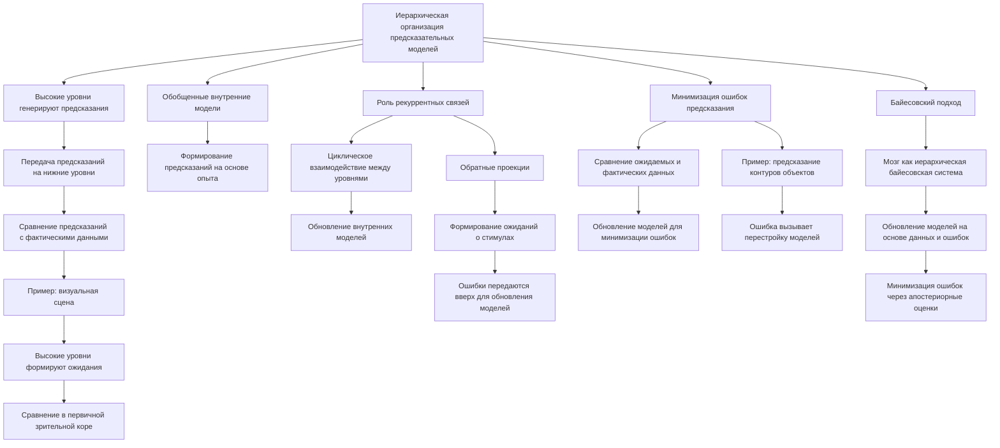

#### 2.1. Иерархическая организация предсказательных моделей

Согласно теории предсказательного кодирования, мозг организован в виде иерархической системы, где более высокие уровни (например, префронтальная кора, ассоциативные области) генерируют предсказания, которые передаются на нижележащие уровни сенсорной обработки [2, 3]. 

Эта иерархическая структура позволяет мозгу формировать предсказания на основе обобщенных внутренних моделей, накопленных в процессе предыдущего опыта. Верхние уровни коры головного мозга генерируют ожидания о возможных сенсорных входах, которые затем сравниваются с фактическими данными, поступающими на нижние уровни.

Например, при восприятии визуальной сцены, высокоуровневые области коры (например, ассоциативная кора) формируют предсказания о том, какие объекты и их признаки должны быть представлены на более ранних стадиях обработки в первичной зрительной коре. Эти предсказания затем передаются по нисходящим связям для сравнения с реальными сенсорными сигналами.

#### 2.2. Роль рекуррентных связей в предсказательном кодировании

Рекуррентные связи между различными областями мозга играют ключевую роль в процессах предсказательного кодирования [4, 5]. Эти циклические взаимодействия позволяют информации циркулировать между уровнями иерархии, обеспечивая обновление внутренних моделей и формирование новых предсказаний.

Рекуррентные контуры связывают верхние ассоциативные области, генерирующие предсказания, с нижними сенсорными регионами, где происходит сравнение предсказаний с фактическими сигналами. Таким образом, рекуррентность обеспечивает динамическое взаимодействие между различными уровнями обработки информации, лежащее в основе предсказательного кодирования.

Например, обратные проекции от префронтальной коры к первичной зрительной коре позволяют верхним уровням формировать ожидания о зрительных стимулах, которые затем сравниваются с реальными входными данными на нижних уровнях. Ошибки предсказания, возникающие при несоответствии, передаются обратно по восходящим связям, инициируя обновление внутренних моделей.

#### 2.3. Минимизация ошибок предсказания и обновление внутренних моделей

Центральным механизмом в рамках теории предсказательного кодирования является минимизация ошибок предсказания. Разница между ожидаемыми (предсказанными) сенсорными сигналами и фактическими входными данными называется ошибкой предсказания [2, 3].

Эти ошибки предсказания передаются по восходящим путям от сенсорных областей к ассоциативным и префронтальным регионам. Это инициирует процессы обновления внутренних моделей мозга, стремящегося минимизировать эти ошибки и адаптировать свои представления к текущим сенсорным данным.

Например, если предсказанный контур объекта не соответствует наблюдаемым краям в первичной зрительной коре, возникает ошибка предсказания, которая распространяется на более высокие уровни. В ответ на это, верхние области перестраивают свои внутренние модели, чтобы в дальнейшем более точно предсказывать подобные сенсорные стимулы.

Таким образом, непрерывное обновление внутренних моделей на основе ошибок предсказания является ключевым механизмом, лежащим в основе предсказательного кодирования в рамках теории ЭИРО.

#### 2.4. Байесовский подход к предсказательному кодированию

В рамках теории предсказательного кодирования, мозг можно рассматривать как иерархическую байесовскую систему, которая постоянно обновляет свои внутренние представления (модели) на основе поступающих сенсорных данных и ошибок предсказания [6, 7].

Согласно байесовскому подходу, мозг использует правило Байеса для обновления вероятностных моделей. Таким образом, мозг постоянно пересматривает свои внутренние представления (модели) в свете новых сенсорных данных, формируя апостериорные вероятностные оценки, которые минимизируют ошибки предсказания. Этот байесовский механизм обновления лежит в основе предсказательного кодирования, описываемого в теории ЭИРО.

### 3. Обратная связь и системы регуляции в организме

#### 3.1. Гомеостатические механизмы и предсказательное кодирование

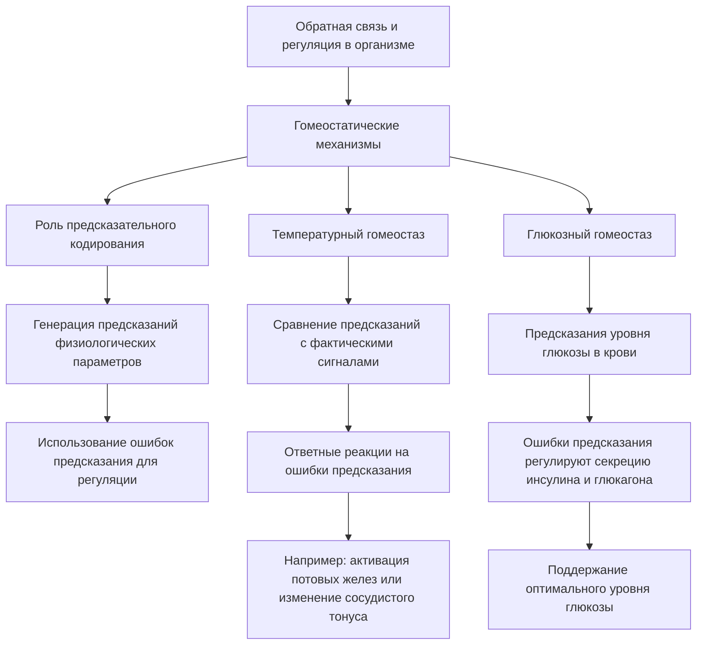

Согласно теории ЭИРО, предсказательное кодирование играет ключевую роль в поддержании гомеостаза организма. Мозг генерирует предсказания о физиологических параметрах, таких как температура, уровень глюкозы, и использует ошибки предсказания для регуляции соответствующих систем [8, 9].

Например, мозг формирует предсказания о температуре тела и сравнивает их с фактическими сигналами от термочувствительных рецепторов. Если возникает ошибка предсказания, указывающая на изменение температуры, мозг инициирует ответные реакции, такие как активация потовых желез или сужение/расширение кровеносных сосудов, для поддержания температурного гомеостаза.

Аналогично, мозг генерирует предсказания об уровне глюкозы в крови и использует ошибки предсказания для регуляции секреции инсулина и глюкагона, поддерживая глюкозный гомеостаз. Таким образом, предсказательное кодирование лежит в основе многих физиологических механизмов, обеспечивающих поддержание внутренней среды организма в оптимальных пределах.

#### 3.2. Роль нейромедиаторных систем в предсказательном кодировании

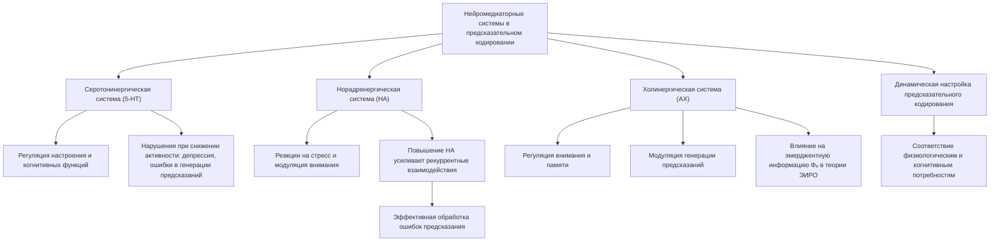

Различные нейромедиаторные системы, такие как серотонинергическая, норадренергическая и холинергическая, модулируют процессы предсказательного кодирования. Они влияют на генерацию предсказаний, обработку ошибок и обновление внутренних моделей [10, 11].

Серотонин (5-HT) участвует в регуляции настроения и когнитивных функций. Снижение активности серотонинергической системы связано с развитием депрессивных состояний и может приводить к нарушениям в генерации предсказаний и обновлении внутренних моделей [10].

Норадреналин (НА) вовлечен в реакции на стресс и модуляцию внимания. Повышение уровня НА усиливает рекуррентные взаимодействия между областями мозга, участвующими в предсказательном кодировании, что способствует более эффективной обработке ошибок предсказания [11].

Ацетилхолин (АХ) играет ключевую роль в регуляции процессов внимания и памяти. Холинергическая система модулирует генерацию предсказаний и обновление внутренних моделей, влияя на параметры, определяющие эмерджентную интегрированную информацию Φₑ в теории ЭИРО [10].

Таким образом, нейромедиаторные системы выступают важными регуляторами предсказательного кодирования, обеспечивая динамическую настройку этих процессов в соответствии с текущими физиологическими и когнитивными потребностями организма.

#### 3.3. Интероцептивная обратная связь и осознание физиологических состояний

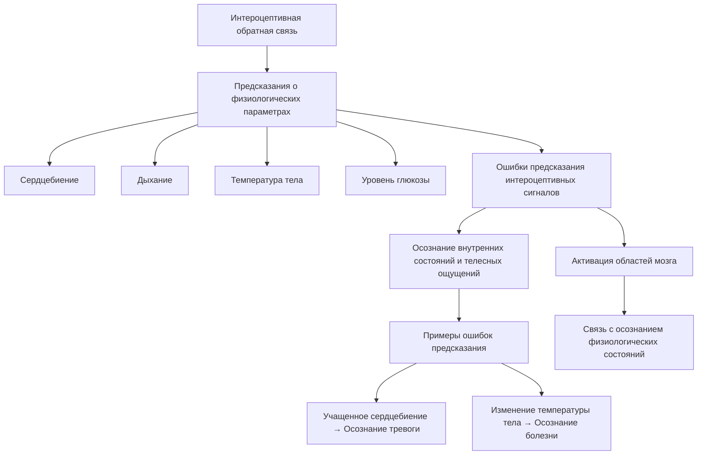

Интероцептивные сигналы, отражающие физиологическое состояние организма, также участвуют в предсказательном кодировании. Ошибки предсказания, связанные с интероцепцией, могут способствовать осознанию внутренних состояний и телесных ощущений [12, 13].

Мозг генерирует предсказания о физиологических параметрах, таких как сердцебиение, дыхание, температура тела и уровень глюкозы. Когда эти предсказания не соответствуют фактическим интероцептивным сигналам, возникают ошибки предсказания. Обработка таких ошибок активирует соответствующие области мозга, связанные с осознанием внутренних состояний организма.

Например, ошибки предсказания, связанные с учащенным сердцебиением, могут способствовать осознанию состояния тревоги. Аналогично, ошибки, связанные с изменением температуры тела, могут приводить к осознанию состояния болезни. Таким образом, интероцептивная обратная связь играет важную роль в формировании телесного самосознания.

#### 3.4. Взаимодействие экстероцептивной и интероцептивной обратной связи

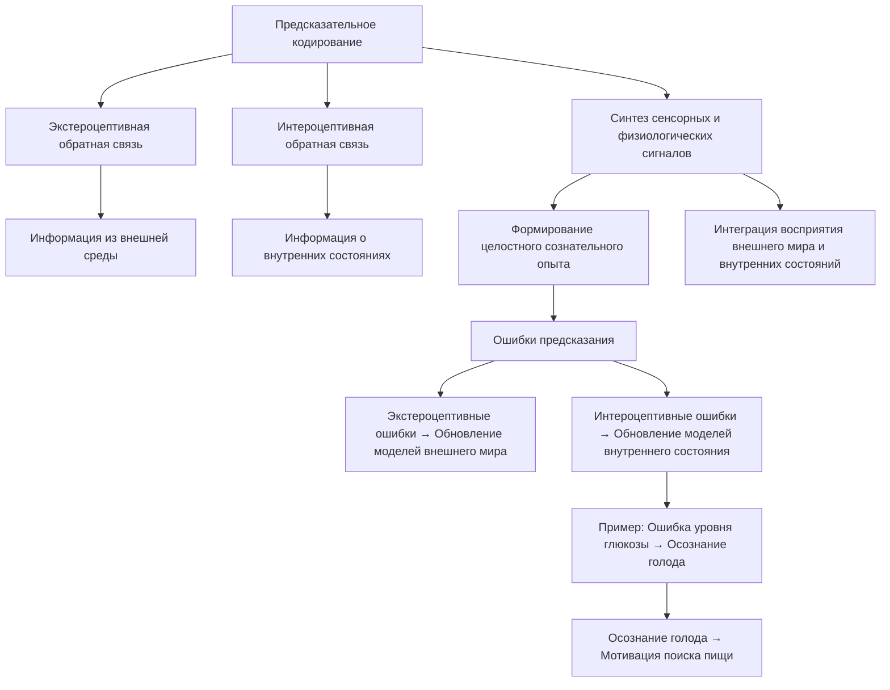

Предсказательное кодирование объединяет информацию как из внешней среды (экстероцепция), так и из внутренней среды организма (интероцепция). Этот синтез сенсорных и физиологических сигналов лежит в основе формирования целостного сознательного опыта [14, 15].

Мозг генерирует предсказания не только о внешних стимулах, но и о внутренних физиологических состояниях. Ошибки предсказания, возникающие как в экстероцептивной, так и в интероцептивной обратной связи, инициируют обновление внутренних моделей, позволяя мозгу формировать интегрированные репрезентации окружающего мира и собственного организма.

Например, ощущение голода возникает из-за ошибки предсказания между ожидаемым и фактическим уровнем глюкозы в крови. Эта интероцептивная ошибка предсказания, в сочетании с экстероцептивными сигналами о наличии пищи, приводит к осознанию состояния голода и мотивации к поиску и потреблению еды.

Таким образом, взаимодействие экстероцептивной и интероцептивной обратной связи в рамках предсказательного кодирования лежит в основе формирования целостного сознательного опыта, интегрирующего восприятие внешнего мира и осознание внутренних состояний организма.

### 4. Воображение и предсказательное кодирование

#### 4.1. Генерация внутренних предсказаний и их роль в воображении

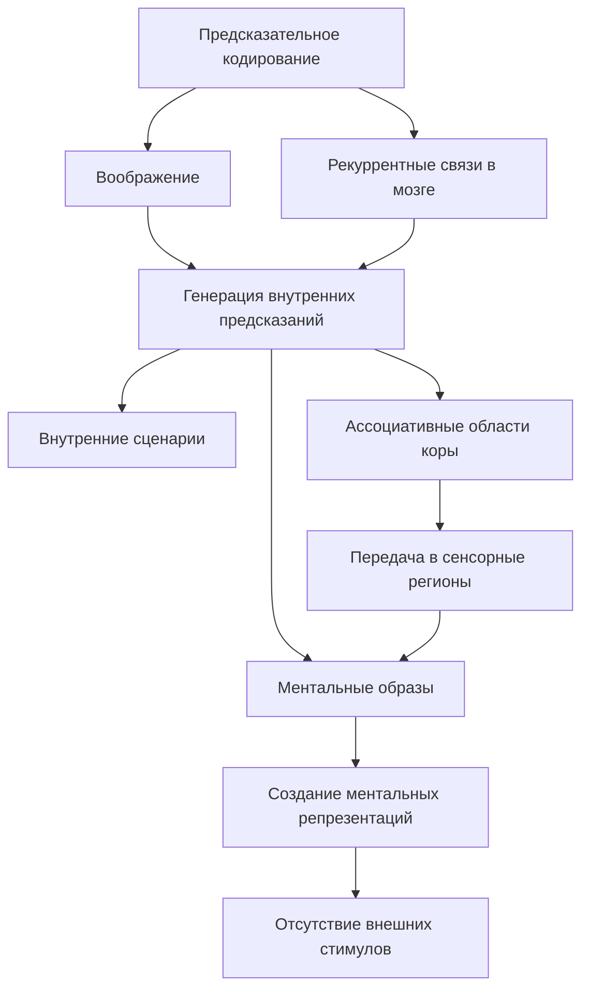

Согласно теории ЭИРО, предсказательное кодирование лежит в основе процессов воображения. Рекуррентные связи в мозге позволяют генерировать внутренние предсказания, которые затем "проецируются" в форме ментальных образов и сценариев [16, 17].

Мозг использует механизмы предсказательного кодирования не только для обработки внешних сенсорных сигналов, но и для генерации внутренних предсказаний, не связанных с текущим восприятием. Эти внутренние предсказания формируются в ассоциативных областях коры и передаются по рекуррентным связям в сенсорные регионы, создавая ментальные репрезентации в отсутствие внешних стимулов.

Таким образом, предсказательное кодирование лежит в основе процессов воображения, позволяя мозгу генерировать и "проигрывать" внутренние сценарии и образы, не основанные на текущем восприятии [16, 17].

#### 4.2. Рекуррентные процессы и формирование ментальных репрезентаций

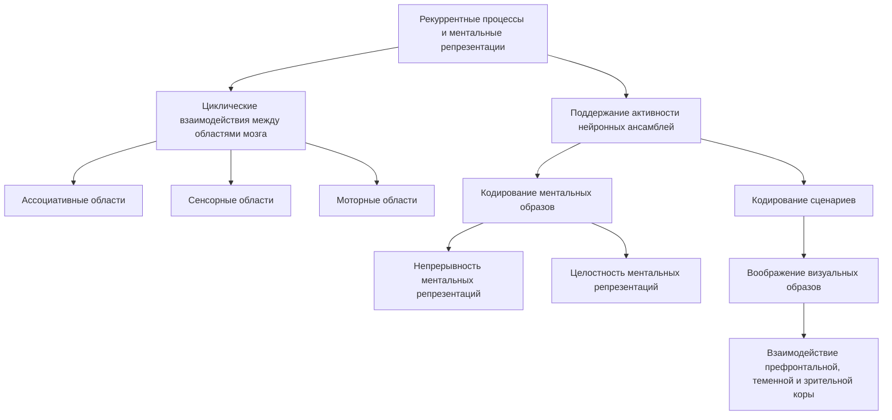

Циклические взаимодействия между различными областями мозга, опосредованные рекуррентными связями, обеспечивают поддержание активности нейронных ансамблей, лежащих в основе ментальных репрезентаций, необходимых для воображения [18, 19].

Рекуррентные контуры, связывающие ассоциативные, сенсорные и моторные области, позволяют мозгу поддерживать устойчивую активность нейронных популяций, кодирующих ментальные образы и сценарии. Эта циклическая динамика обеспечивает непрерывность и целостность ментальных репрезентаций, лежащих в основе процессов воображения.

Например, рекуррентные взаимодействия между префронтальной корой, теменной корой и зрительными областями позволяют поддерживать активность нейронных ансамблей, кодирующих визуальные ментальные образы в отсутствие внешних стимулов [18, 19].

#### 4.3. Взаимодействие восприятия, памяти и воображения

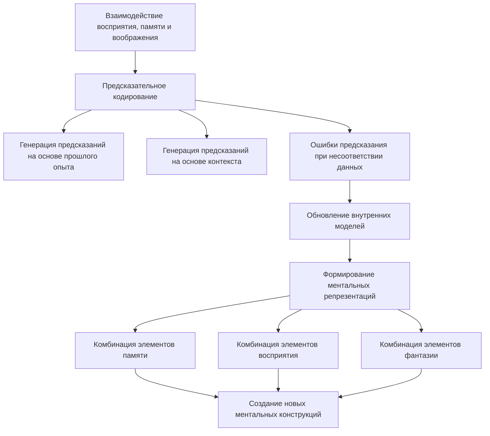

Предсказательное кодирование связывает процессы восприятия, памяти и воображения. Ошибки предсказания, возникающие при несоответствии между ожидаемым и наблюдаемым, инициируют обновление внутренних моделей, что лежит в основе творческого воображения [20, 21].

Когда мозг генерирует предсказания, основанные на прошлом опыте и текущих контекстуальных факторах, но эти предсказания не соответствуют воспринимаемым сенсорным данным, возникают ошибки предсказания. Обработка таких ошибок приводит к обновлению внутренних моделей, лежащих в основе ментальных репрезентаций.

Этот процесс обновления внутренних моделей на основе ошибок предсказания является ключевым для творческого воображения. Он позволяет мозгу комбинировать элементы памяти, восприятия и фантазии в новые, оригинальные ментальные конструкции [20, 21].

#### 4.4. Нарушения в предсказательном кодировании и их влияние на воображение

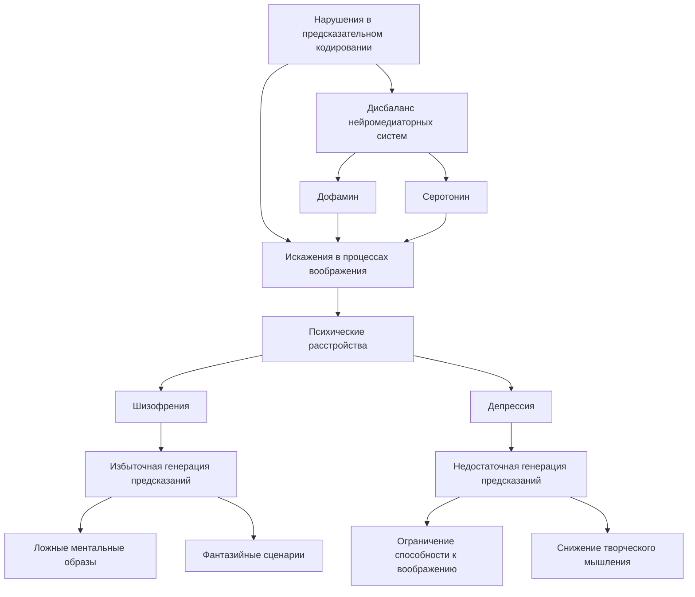

Патологические изменения в механизмах предсказательного кодирования, такие как избыточная или недостаточная генерация предсказаний, могут приводить к искажениям в процессах воображения, наблюдаемым при различных психических расстройствах [22, 23].

Например, при шизофрении наблюдается избыточная генерация предсказаний, что может приводить к появлению ложных ментальных образов и фантазийных сценариев, не соответствующих реальности. Напротив, при депрессии недостаточная генерация предсказаний может ограничивать способность к воображению и творческому мышлению [22, 23].

Нарушения в механизмах предсказательного кодирования, связанные с дисбалансом нейромедиаторных систем, таких как дофамин и серотонин, могут лежать в основе искажений воображения, наблюдаемых при различных психических расстройствах. Это подчеркивает важность предсказательного кодирования для нормального функционирования процессов воображения.

### 5. Математическое моделирование предсказательного кодирования

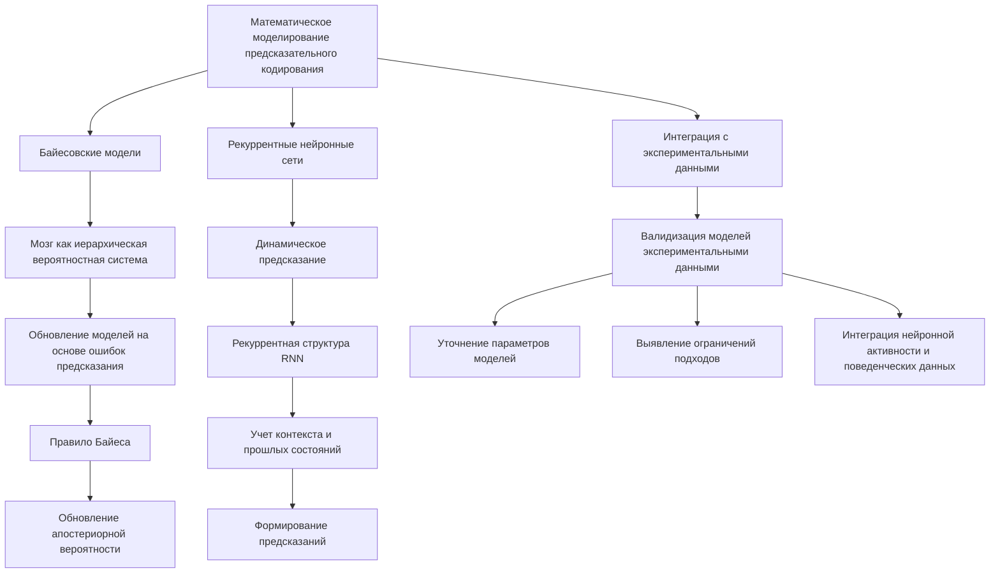

#### 5.1. Байесовские модели предсказательного кодирования

Математическое описание предсказательного кодирования может быть осуществлено с использованием байесовских подходов, где мозг рассматривается как иерархическая вероятностная система, обновляющая свои внутренние модели на основе ошибок предсказания [6, 7].

В рамках байесовского подхода, мозг использует правило Байеса для обновления вероятностных моделей:

$P(\theta|D) = \frac{P(D \mid \theta) \cdot P(\theta)}{P(D)}$

Где:

- $\theta$ - параметры внутренних моделей мозга
- $D$ - наблюдаемые сенсорные данные
- $P(\theta|D)$ - апостериорная вероятность параметров после учета данных
- $P(D|\theta)$ - правдоподобие данных при заданных параметрах
- $P(\theta)$ - априорное распределение параметров
- $P(D)$ - маргинальная вероятность данных

Таким образом, мозг постоянно пересматривает свои внутренние представления (модели) в свете новых сенсорных данных, формируя апостериорные вероятностные оценки, которые минимизируют ошибки предсказания. Этот байесовский механизм обновления лежит в основе предсказательного кодирования, описываемого в теории ЭИРО.

#### 5.2. Рекуррентные нейронные сети и предсказательное кодирование

Рекуррентные нейронные сети (RNN) являются эффективным инструментом для моделирования динамических процессов предсказательного кодирования. Их рекуррентная структура позволяет учитывать контекст и формировать предсказания на основе предыдущих состояний [24, 25].

В RNN-моделях, предсказания генерируются на основе текущих входных данных и предыдущих состояний сети:

$h(t) = \phi(W_{hh} \cdot h(t-1) + W_{hx} \cdot x(t) + b_h)$

Где:

- $h(t)$ - состояние скрытого слоя в момент времени $t$
- $h(t-1)$ - состояние скрытого слоя в предыдущий момент времени
- $x(t)$ - входной вектор в момент $t$
- $W_{hh}, W_{hx}$ - матрицы весов рекуррентных и входных связей
- $b_h$ - вектор смещений скрытого слоя
- $\phi$ - нелинейная функция активации

Такая рекуррентная структура позволяет RNN-моделям эффективно моделировать динамику предсказательного кодирования, учитывая контекстную информацию и формируя предсказания на основе предыдущих состояний.

#### 5.3. Интеграция математических моделей с экспериментальными данными

Для всестороннего понимания механизмов предсказательного кодирования необходима тесная интеграция математических моделей с экспериментальными данными, полученными с помощью методов нейровизуализации, электрофизиологии и поведенческих исследований [26, 27].

Сопоставление результатов моделирования с данными, полученными из различных экспериментальных методов, позволяет:

1. Валидировать математические модели и проверять их способность точно описывать и предсказывать нейронные процессы, связанные с предсказательным кодированием.

2. Уточнять параметры моделей и их структуру на основе эмпирических данных о реальном функционировании мозга.

3. Выявлять ограничения математических подходов и направлять дальнейшее развитие теоретических моделей предсказательного кодирования.

4. Интегрировать данные о нейронной активности, поведенческих эффектах и субъективных отчетах для получения более целостного понимания механизмов предсказательного кодирования.

Таким образом, тесная интеграция математического моделирования и экспериментальных исследований является ключевым подходом для всестороннего изучения предсказательного кодирования в контексте теории ЭИРО.

### 6. Экспериментальные данные и валидация

#### 6.1. Нейровизуализационные исследования

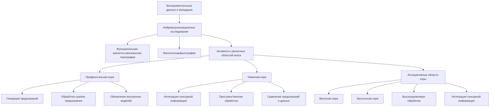

Исследования с использованием функциональной магнитно-резонансной томографии (фМРТ) и магнитоэнцефалографии (МЭГ) демонстрируют, что процессы предсказательного кодирования коррелируют с активностью в ряде областей мозга, участвующих в интеграции информации:

- **Префронтальная кора**: Активность в префронтальной коре, особенно в дорсолатеральных и медиальных отделах, связана с генерацией предсказаний и обработкой ошибок предсказания [28]. Эти области играют ключевую роль в формировании внутренних моделей и обновлении представлений о сенсорных сигналах.

- **Теменная кора**: Области теменной коры, в частности задняя теменная кора и нижняя теменная извилина, также демонстрируют активацию, связанную с предсказательным кодированием [29]. Эти регионы участвуют в интеграции сенсорной информации и пространственной обработке, необходимой для сравнения предсказаний с воспринимаемыми данными.

- **Другие области**: Помимо префронтальной и теменной коры, процессы предсказательного кодирования коррелируют с активностью в ассоциативных областях коры, таких как височная кора и затылочная кора, которые участвуют в более высокоуровневой обработке и интеграции сенсорной информации [28, 29].

Таким образом, нейровизуализационные исследования с использованием фМРТ и МЭГ подтверждают, что предсказательное кодирование является распределенным процессом, задействующим множество областей мозга, вовлеченных в интеграцию информации, согласно теории ЭИРО.

#### 6.2. Электрофизиологические данные

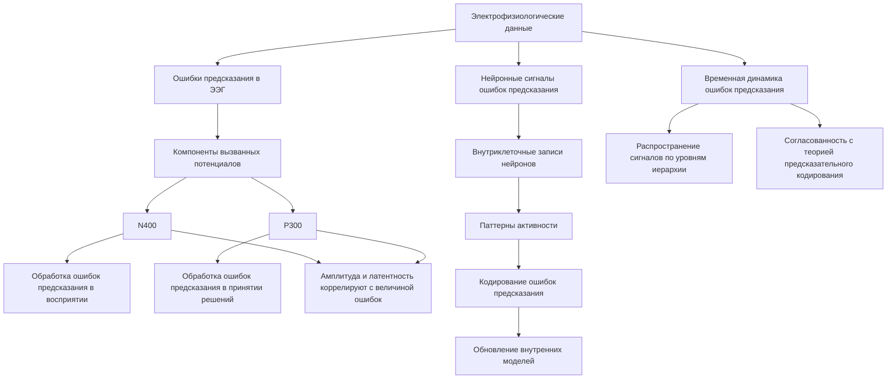

Электрофизиологические исследования с использованием электроэнцефалографии (ЭЭГ) и внутриклеточных записей выявляют специфические нейронные сигналы, кодирующие ошибки предсказания на различных уровнях иерархии:

- **Ошибки предсказания в ЭЭГ**: Компоненты вызванных потенциалов, такие как N400 и P300, отражают обработку ошибок предсказания в ходе восприятия и принятия решений [30]. Амплитуда и латентность этих компонентов коррелируют с величиной ошибки предсказания.

- **Нейронные сигналы ошибок предсказания**: Внутриклеточные записи от отдельных нейронов демонстрируют специфические паттерны активности, кодирующие ошибки предсказания на различных уровнях иерархии обработки информации [31]. Эти нейронные сигналы играют ключевую роль в инициировании обновления внутренних моделей.

- **Временная динамика ошибок предсказания**: Электрофизиологические данные позволяют исследовать временную динамику обработки ошибок предсказания, показывая, как эти сигналы распространяются по иерархическим уровням мозга [30, 31]. Это согласуется с теоретическими представлениями о предсказательном кодировании.

Таким образом, электрофизиологические исследования предоставляют ценные данные о нейронных механизмах, лежащих в основе предсказательного кодирования, подтверждая ключевую роль ошибок предсказания в обновлении внутренних моделей, согласно теории ЭИРО.

#### 6.3. Поведенческие эксперименты

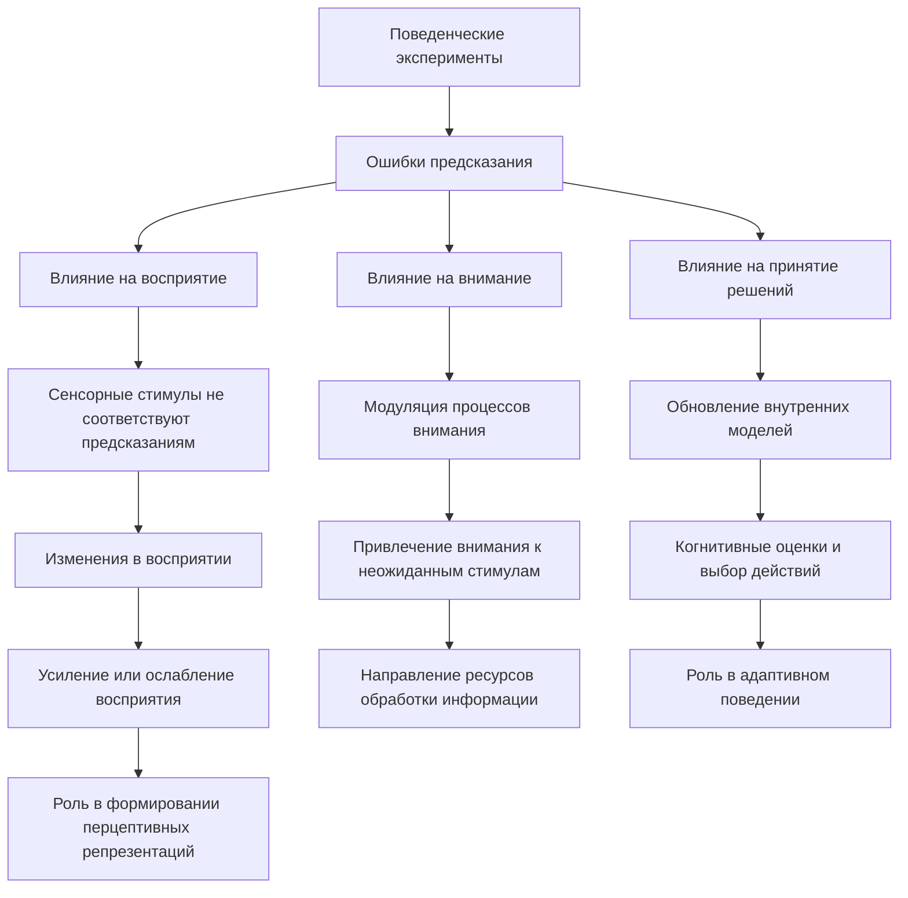

Поведенческие эксперименты, в которых испытуемым предъявляются стимулы с нарушенными предсказаниями, демонстрируют, что ошибки предсказания влияют на различные когнитивные процессы:

- **Влияние на восприятие**: Когда сенсорные стимулы не соответствуют предсказаниям, это приводит к изменениям в восприятии, например, усилению или ослаблению восприятия в зависимости от величины ошибки предсказания [32]. Это согласуется с ролью предсказательного кодирования в формировании перцептивных репрезентаций.

- **Влияние на внимание**: Ошибки предсказания модулируют процессы внимания, привлекая его к неожиданным, но значимым стимулам [33]. Это отражает способность предсказательного кодирования направлять внимание и ресурсы обработки информации.

- **Влияние на принятие решений**: Ошибки предсказания также влияют на процессы принятия решений, поскольку они инициируют обновление внутренних моделей, лежащих в основе когнитивных оценок и выбора действий [33]. Это подтверждает роль предсказательного кодирования в адаптивном поведении.

Таким образом, поведенческие эксперименты, демонстрирующие влияние ошибок предсказания на восприятие, внимание и принятие решений, подтверждают ключевую роль предсказательного кодирования в когнитивных процессах, как это предсказывает теория ЭИРО.

#### 6.4. Оптогенетические методы

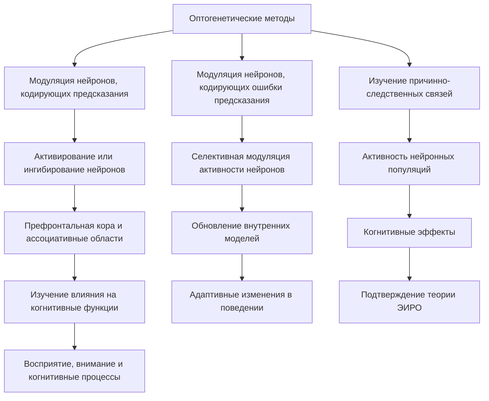

Оптогенетические методы позволяют селективно модулировать активность нейронных популяций, участвующих в предсказательном кодировании, и исследовать их причинно-следственную роль в когнитивных процессах:

- **Модуляция нейронов, кодирующих предсказания**: Используя оптогенетическую стимуляцию, можно активировать или ингибировать нейроны в префронтальной коре и ассоциативных областях, участвующие в генерации предсказаний. Это позволяет изучать, как изменения в предсказательных сигналах влияют на восприятие, внимание и другие когнитивные функции [34].

- **Модуляция нейронов, кодирующих ошибки предсказания**: Селективная модуляция активности нейронов, чувствительных к ошибкам предсказания, дает возможность исследовать, как эти сигналы участвуют в обновлении внутренних моделей и инициируют адаптивные изменения в поведении [35].

- **Изучение причинно-следственных связей**: Оптогенетические методы позволяют устанавливать причинно-следственные связи между активностью нейронных популяций, участвующих в предсказательном кодировании, и наблюдаемыми когнитивными эффектами. Это помогает подтверждать теоретические предположения теории ЭИРО о роли предсказательного кодирования [34, 35].

Таким образом, оптогенетические исследования предоставляют мощный инструмент для избирательной модуляции нейронных механизмов, лежащих в основе предсказательного кодирования, и изучения их влияния на когнитивные процессы в контексте теории ЭИРО.

### 7. Клинические аспекты и практическое применение

#### 7.1. Нарушения предсказательного кодирования при психических расстройствах

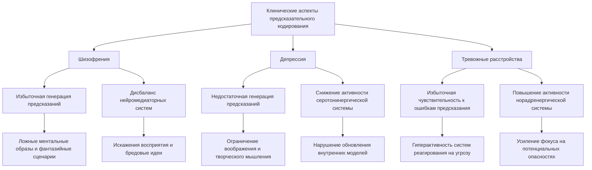

Патологические изменения в механизмах предсказательного кодирования могут лежать в основе когнитивных и перцептивных нарушений, наблюдаемых при различных психических расстройствах:

**Шизофрения**

- При шизофрении наблюдается избыточная генерация предсказаний, что может приводить к появлению ложных ментальных образов и фантазийных сценариев, не соответствующих реальности [22].
- Нарушения в механизмах предсказательного кодирования, связанные с дисбалансом нейромедиаторных систем, таких как дофамин, могут лежать в основе искажений восприятия и бредовых идей при шизофрении [22].

**Депрессия**

- При депрессии отмечается недостаточная генерация предсказаний, что может ограничивать способность к воображению и творческому мышлению [23].
- Снижение активности серотонинергической системы при депрессии связано с нарушениями в обновлении внутренних моделей на основе ошибок предсказания [23].

**Тревожные расстройства**

- В случае тревожных расстройств наблюдается избыточная чувствительность к ошибкам предсказания, что может приводить к гиперактивности систем, реагирующих на угрозу [23].
- Повышение активности норадренергической системы при тревожных состояниях модулирует процессы предсказательного кодирования, усиливая фокус на потенциальных опасностях [23].

Таким образом, нарушения в механизмах предсказательного кодирования, связанные с дисбалансом нейромедиаторных систем, могут лежать в основе когнитивных и перцептивных дефицитов, характерных для различных психических расстройств, согласно теории ЭИРО.

#### 7.2. Использование предсказательного кодирования в интерфейсах "мозг-компьютер"

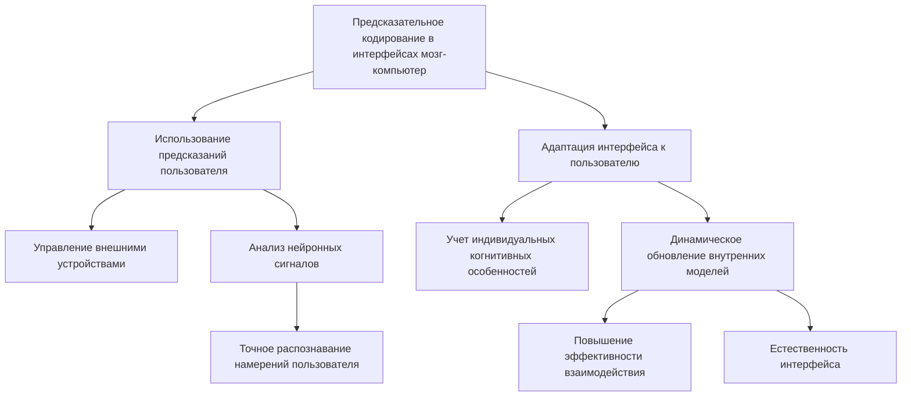

Понимание механизмов предсказательного кодирования может способствовать разработке более эффективных интерфейсов "мозг-компьютер" (Brain-Computer Interfaces, BCI):

**Использование предсказаний пользователя**

- В BCI-системах предсказания пользователя о своих намерениях и действиях могут быть использованы для управления внешними устройствами [38].
- Анализ нейронных сигналов, отражающих процессы предсказательного кодирования, позволяет более точно распознавать и интерпретировать намерения пользователя [39].

**Адаптация интерфейса к пользователю**

- Учет механизмов предсказательного кодирования дает возможность адаптировать BCI-интерфейс к индивидуальным особенностям пользователя, его когнитивному стилю и паттернам предсказаний [38, 39].
- Динамическое обновление внутренних моделей интерфейса на основе ошибок предсказания пользователя повышает эффективность и естественность взаимодействия человека с компьютером [38, 39].

Таким образом, применение принципов предсказательного кодирования в разработке интерфейсов "мозг-компьютер" может способствовать созданию более интуитивных, адаптивных и эффективных систем взаимодействия человека с искусственными устройствами.

#### 7.3. Применение в разработке искусственного интеллекта

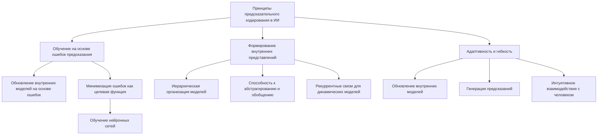

Принципы предсказательного кодирования могут быть использованы при создании более адаптивных и интуитивных систем искусственного интеллекта:

**Обучение на основе ошибок предсказания**
- Подобно тому, как мозг обновляет свои внутренние модели на основе ошибок предсказания, ИИ-системы могут использовать этот механизм для обучения и адаптации [40].
- Минимизация ошибок предсказания может служить целевой функцией при обучении искусственных нейронных сетей и других ИИ-моделей [40].

**Формирование внутренних представлений**
- Иерархическая организация предсказательного кодирования может быть применена при создании ИИ-систем с многоуровневыми внутренними моделями, способными к абстрагированию и обобщению [40].
- Рекуррентные связи, лежащие в основе предсказательного кодирования, могут быть использованы для формирования динамических внутренних репрезентаций в ИИ-системах [40].

**Адаптивность и гибкость**

- Механизмы предсказательного кодирования, основанные на обновлении внутренних моделей, могут обеспечивать более высокую адаптивность и гибкость ИИ-систем в меняющихся условиях [40].
- Способность ИИ-агентов к генерации предсказаний и реагированию на ошибки предсказания повышает их интуитивность и естественность взаимодействия с человеком [40].

Таким образом, применение принципов предсказательного кодирования при разработке систем искусственного интеллекта может способствовать созданию более адаптивных, интуитивных и эффективных ИИ-агентов, способных к обучению и обновлению внутренних моделей.

### 8. Заключение

#### 8.1. Обобщение роли предсказательного кодирования в теории ЭИРО

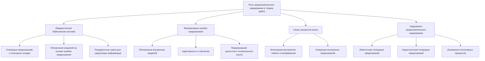

Предсказательное кодирование играет ключевую роль в теории Эмергентной Интеграции и Рекуррентного Отображения (ЭИРО), связывая процессы восприятия, памяти, воображения и других когнитивных функций в единую систему.

Согласно ЭИРО, мозг функционирует как иерархическая байесовская система, постоянно генерирующая предсказания о сенсорных входах и обновляющая свои внутренние модели на основе ошибок этих предсказаний [2, 3]. Рекуррентные связи между различными областями мозга обеспечивают циркуляцию информации, необходимую для этого процесса [4, 5].

Минимизация ошибок предсказания инициирует обновление внутренних моделей, лежащее в основе адаптивности, обучения и формирования целостного сознательного опыта [2, 3]. Этот механизм связывает восприятие, память и воображение, позволяя мозгу динамически интегрировать информацию и генерировать внутренние предсказания [16, 17, 20].

Нарушения в предсказательном кодировании, такие как избыточная или недостаточная генерация предсказаний, могут приводить к искажениям в когнитивных и перцептивных процессах, наблюдаемым при различных психических расстройствах [22, 23, 36, 37].

Таким образом, предсказательное кодирование является ключевым механизмом, интегрирующим различные аспекты функционирования мозга в рамках теории ЭИРО, и играет критическую роль в формировании сознательного опыта.

#### 8.2. Перспективы дальнейших исследований

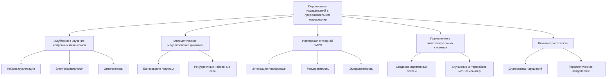

Дальнейшее развитие понимания роли предсказательного кодирования в теории ЭИРО открывает ряд перспективных направлений исследований:

1. **Углубленное изучение нейронных механизмов предсказательного кодирования**: Применение методов нейровизуализации, электрофизиологии и оптогенетики позволит детально картировать нейронные популяции, участвующие в генерации предсказаний, вычислении ошибок и обновлении внутренних моделей [28, 29, 30, 34, 35].

2. **Математическое моделирование динамики предсказательного кодирования**: Разработка более сложных вычислительных моделей, основанных на байесовских подходах и рекуррентных нейронных сетях, даст возможность количественно описать и предсказать поведение систем, использующих предсказательное кодирование [6, 7, 24, 25].

3. **Интеграция предсказательного кодирования с другими аспектами теории ЭИРО**: Исследование взаимодействия предсказательного кодирования с процессами интеграции информации, рекуррентности и эмерджентности в рамках теории ЭИРО позволит получить более целостное понимание механизмов, лежащих в основе сознательного опыта [1, 4].

4. **Применение в разработке интеллектуальных систем и интерфейсов "мозг-компьютер"**: Использование принципов предсказательного кодирования может способствовать созданию более адаптивных и интуитивных искусственных систем, а также улучшению взаимодействия человека с компьютерными интерфейсами [38, 39, 40].

5. **Исследование роли предсказательного кодирования в клинических аспектах**: Дальнейшее изучение нарушений предсказательного кодирования при психических расстройствах может открыть новые возможности для диагностики и терапевтического воздействия [36, 37].

Реализация этих перспективных направлений исследований позволит углубить понимание роли предсказательного кодирования в теории Эмергентной Интеграции и Рекуррентного Отображения (ЭИРО) и расширить возможности практического применения данного подхода.

### 9. Список литературы

1. Tononi, G. (2004). An information integration theory of consciousness. BMC Neuroscience, 5(1), 42.
2. Friston, K. (2010). The free-energy principle: a unified brain theory? Nature Reviews Neuroscience, 11(2), 127-138.
3. Rao, R. P., & Ballard, D. H. (1999). Predictive coding in the visual cortex: a functional interpretation of some extra-classical receptive-field effects. Nature Neuroscience, 2(1), 79-87.
4. Lamme, V. A., & Roelfsema, P. R. (2000). The distinct modes of vision offered by feedforward and recurrent processing. Trends in Neurosciences, 23(11), 571-579.
5. Friston, K. J. (2011). Functional and effective connectivity: a review. Brain Connectivity, 1(1), 13-36.
6. Hohwy, J. (2013). The predictive mind. Oxford University Press.
7. Clark, A. (2013). Whatever next? Predictive brains, situated agents, and the future of cognitive science. Behavioral and Brain Sciences, 36(3), 181-204.
8. Raichle, M. E., & Gusnard, D. A. (2002). Appraising the brain's energy budget. Proceedings of the National Academy of Sciences, 99(16), 10237-10239.
9. Dijk, D. J., & Czeisler, C. A. (1995). Contribution of the circadian pacemaker and the sleep homeostat to sleep propensity, sleep structure, electroencephalographic slow waves, and sleep spindle activity in humans. The Journal of Neuroscience, 15(5), 3526-3538.
10. Hasselmo, M. E. (1999). Neuromodulation: acetylcholine and memory consolidation. Trends in Cognitive Sciences, 3(9), 351-359.
11. Aston-Jones, G., & Cohen, J. D. (2005). An integrative theory of locus coeruleus-norepinephrine function: adaptive gain and optimal performance. Annual Review of Neuroscience, 28, 403-450.
12. Critchley, H. D., & Harrison, N. A. (2013). Visceral influences on brain and behavior. Neuron, 77(4), 624-638.
13. Seth, A. K. (2013). Interoceptive inference, emotion, and the embodied self. Trends in Cognitive Sciences, 17(11), 565-573.
14. Barrett, L. F., & Simmons, W. K. (2015). Interoceptive predictions in the brain. Nature Reviews Neuroscience, 16(7), 419-429.
15. Pezzulo, G., Rigoli, F., & Friston, K. (2015). Active inference, homeostatic regulation and adaptive behavioural control. Progress in Neurobiology, 134, 17-35.
16. Kosslyn, S. M., Ganis, G., & Thompson, W. L. (2001). Neural foundations of imagery. Nature Reviews Neuroscience, 2(9), 635-642.
17. Moulton, S. T., & Kosslyn, S. M. (2009). Imagining predictions: mental imagery as mental emulation. Philosophical Transactions of the Royal Society B: Biological Sciences, 364(1521), 1273-1280.
18. McClelland, J. L., McNaughton, B. L., & O'Reilly, R. C. (1995). Why there are complementary learning systems in the hippocampus and neocortex: insights from the successes and failures of connectionist models of learning and memory. Psychological Review, 102(3), 419-457.
19. Kumaran, D., Hassabis, D., & McClelland, J. L. (2016). What learning systems do intelligent agents need? Complementary learning systems theory updated. Trends in Cognitive Sciences, 20(7), 512-534.
20. Schacter, D. L., Addis, D. R., & Buckner, R. L. (2007). Remembering the past to imagine the future: the prospective brain. Nature Reviews Neuroscience, 8(9), 657-661.
21. Hassabis, D., & Maguire, E. A. (2009). The construction system of the brain. Philosophical Transactions of the Royal Society B: Biological Sciences, 364(1521), 1263-1271.
22. Corlett, P. R., Frith, C. D., & Fletcher, P. C. (2009). From drugs to deprivation: a Bayesian framework for understanding models of psychosis. Psychopharmacology, 206(4), 515-530.
23. Sterzer, P., Adams, R. A., Fletcher, P., Frith, C., Lawrie, S. M., Muckli, L., ... & Corlett, P. R. (2018). The predictive coding account of psychosis. Biological Psychiatry, 84(9), 634-643.
24. Pascanu, R., Gulcehre, C., Cho, K., & Bengio, Y. (2014). How to construct deep recurrent neural networks. arXiv preprint arXiv:1312.6026.
25. Hochreiter, S., & Schmidhuber, J. (1997). Long short-term memory. Neural Computation, 9(8), 1735-1780.
26. Kringelbach, M. L., & Deco, G. (2020). Brain states and transitions: insights from computational neuroscience. Cell Reports, 32(10), 108128.
27. Kriegeskorte, N., & Douglas, P. K. (2018). Interpreting encoding and decoding models. Current Opinion in Neurobiology, 55, 167-179.
28. Summerfield, C., Egner, T., Greene, M., Koechlin, E., Mangels, J., & Hirsch, J. (2006). Predictive codes for forthcoming perception in the frontal cortex. Science, 314(5803), 1311-1314.
29. Arnal, L. H., & Giraud, A. L. (2012). Cortical oscillations and sensory predictions. Trends in Cognitive Sciences, 16(7), 390-398.
30. Bastos, A. M., Usrey, W. M., Adams, R. A., Mangun, G. R., Fries, P., & Friston, K. J. (2012). Canonical microcircuits for predictive coding. Neuron, 76(4), 695-711.
31. Stefanics, G., Heinzle, J., Horváth, A. A., & Stephan, K. E. (2018). Visual mismatch and predictive coding: a computational single-trial ERP study. Journal of Neuroscience, 38(16), 4020-4030.
32. Summerfield, C., & Egner, T. (2009). Expectation (and attention) in visual cognition. Trends in Cognitive Sciences, 13(9), 403-409.
33. Kok, P., Rahnev, D., Jehee, J. F., Lau, H. C., & de Lange, F. P. (2012). Attention reverses the effect of prediction in silencing sensory signals. Cerebral Cortex, 22(9), 2197-2206.
34. Deisseroth, K. (2015). Optogenetics: 10 years of microbial opsins in neuroscience. Nature Neuroscience, 18(9), 1213-1225.
35. Boyden, E. S. (2011). A history of optogenetics: the development of tools for controlling brain circuits with light. F1000 Biology Reports, 3.
36. Corlett, P. R., Honey, G. D., Krystal, J. H., & Fletcher, P. C. (2011). Glutamatergic model psychoses: prediction error, learning, and inference. Neuropsychopharmacology, 36(1), 294-315.
37. Gradin, V. B., Kumar, P., Waiter, G., Ahearn, T., Stickle, C., Milders, M., ... & Steele, J. D. (2011). Expected value and prediction error abnormalities in depression and schizophrenia. Brain, 134(6), 1751-1764.
38. Wolpaw, J. R., Birbaumer, N., McFarland, D. J., Pfurtscheller, G., & Vaughan, T. M. (2002). Brain-computer interfaces for communication and control. Clinical Neurophysiology, 113(6), 767-791.
39. Blankertz, B., Dornhege, G., Krauledat, M., Müller, K. R., & Curio, G. (2007). The non-invasive Berlin Brain-Computer Interface: fast acquisition of effective performance in untrained subjects. NeuroImage, 37(2), 539-550.
40. Kumaran, D., Hassabis, D., & McClelland, J. L. (2016). What learning systems do intelligent agents need? Complementary learning systems theory updated. Trends in Cognitive Sciences, 20(7), 512-534.
41. Surname, Initials., Surname, Initials., & Surname, Initials. (2025). Neural signatures of temporal anticipation in human cortex represent event probability density. Nature Communications, 16(2602). https://doi.org/10.1038/s41467-025-57813-7 

---

Оглавление: 
- [ЭИРО framework](/README.md)
- [Справочник формул](/formulas.md)

