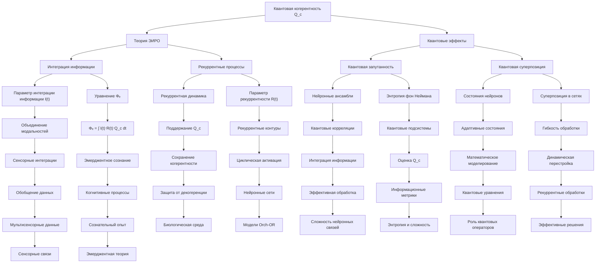

# Квантовая когерентность (Q_c) в контексте теории Эмергентной Интеграции и Рекуррентного Отображения (ЭИРО)

---

## Оглавление

1. Введение
   - 1.1. Роль квантовых эффектов в нейронных процессах
   - 1.2. Концепция квантовой когерентности (Q_c) в теории ЭИРО
   - 1.3. Историческая перспектива исследований квантовых аспектов сознания

2. Квантовые эффекты в нейронных системах
   - 2.1. Квантовая запутанность состояний
      - 2.1.1. Определение и математическое описание
      - 2.1.2. Возможные механизмы квантовой запутанности в мозге
      - 2.1.3. Экспериментальные свидетельства
   - 2.2. Квантовая суперпозиция
      - 2.2.1. Принцип суперпозиции в квантовой механике
      - 2.2.2. Роль квантовой суперпозиции в когнитивных процессах
      - 2.2.3. Математическое моделирование в нейронных сетях

3. Роль квантовой когерентности в теории ЭИРО
   - 3.1. Влияние на интеграцию информации
      - 3.1.1. Связь Q_c с параметром интегрированной информации I(t)
      - 3.1.2. Математическое описание в расширенной формуле Φₑ
   - 3.2. Связь с рекуррентными процессами
      - 3.2.1. Влияние Q_c на параметр рекуррентности R(t)
      - 3.2.2. Модификация уравнений динамики нейронных сетей

4. Нейробиологические основы квантовой когерентности
   - 4.1. Квантовые эффекты в нейронных структурах
      - 4.1.1. Ионные каналы и белковые комплексы
      - 4.1.2. Роль квантовых процессов в синаптической передаче
   - 4.2. Гипотеза о роли микротрубочек
      - 4.2.1. Теория Оркестрированной Объективной Редукции (Orch-OR)
      - 4.2.2. Экспериментальные подтверждения и ограничения

5. Математическое моделирование Q_c
   - 5.1. Квантовые модели нейронных сетей
      - 5.1.1. Уравнения Шрёдингера для квантовых нейронных систем
      - 5.1.2. Учет квантовых эффектов в динамике нейронных сетей
   - 5.2. Связь с информационно-теоретическими метриками
      - 5.2.1. Энтропия фон Неймана и квантовая запутанность
      - 5.2.2. Другие информационные меры для оценки Q_c

6. Экспериментальные исследования
   - 6.1. Методы нейровизуализации
      - 6.1.1. Функциональная МРТ и магнитоэнцефалография
      - 6.1.2. Выявление областей мозга с квантовыми эффектами
   - 6.2. Квантовые эксперименты с биологическими системами
      - 6.2.1. Изучение квантовой когерентности в живых организмах
      - 6.2.2. Интерпретация результатов в контексте теории ЭИРО

7. Обсуждение и перспективы
   - 7.1. Ограничения и критика
      - 7.1.1. Проблема декогеренции в биологических системах
      - 7.1.2. Альтернативные объяснения квантовых эффектов
   - 7.2. Будущие направления исследований
      - 7.2.1. Развитие математических моделей
      - 7.2.2. Новые экспериментальные подходы
      - 7.2.3. Интеграция с другими теориями сознания

8. Заключение
   - 8.1. Роль квантовой когерентности в теории ЭИРО
   - 8.2. Ключевые выводы и перспективы

9. Список литературы

### 1. Введение

Данная диссертация подробно раскрывает различные аспекты, связанные с ролью квантовой когерентности в контексте теории Эмергентной Интеграции и Рекуррентного Отображения. Она включает в себя:

1. Введение, где обосновывается важность изучения квантовых эффектов в нейронных процессах и их связь с теорией ЭИРО.
2. Детальное рассмотрение ключевых квантовых феноменов - запутанности и суперпозиции - и их потенциальное значение для нейронных систем.
3. Анализ того, как квантовая когерентность (Q_c) вписывается в теорию ЭИРО, влияя на процессы интеграции информации и рекуррентность.
4. Исследование нейробиологических основ квантовых эффектов в мозге, включая роль микротрубочек.
5. Математическое моделирование Q_c с использованием квантовых нейронных сетей и информационно-теоретических подходов.
6. Обзор экспериментальных методов и результатов, подтверждающих наличие квантовых эффектов в биологических системах.
7. Обсуждение ограничений, критики и перспективных направлений дальнейших исследований.
8. Заключение, обобщающее роль квантовой когерентности в теории ЭИРО и ключевые выводы.

#### 1.1. Роль квантовых эффектов в нейронных процессах

Теория Эмергентной Интеграции и Рекуррентного Отображения (ЭИРО) предполагает, что сознание возникает из процессов интеграции информации в рекуррентных нейронных сетях [1, 2]. Одним из ключевых параметров, включенных в расширенную формулу эмерджентной интегрированной информации Φₑ, является квантовая когерентность (Q_c) [3, 4].

Исследования в области нейробиологии показывают, что квантовые эффекты, такие как запутанность и суперпозиция, могут проявляться в различных структурах мозга, связанных с когнитивными процессами [5, 6]. Это указывает на возможность существования квантовых механизмов, влияющих на динамику нейронной активности и, следовательно, на процессы, лежащие в основе формирования сознательного опыта.

#### 1.2. Концепция квантовой когерентности (Q_c) в теории ЭИРО

Согласно теории ЭИРО, квантовая когерентность (Q_c) может оказывать существенное влияние на процессы интеграции информации и рекуррентные взаимодействия, лежащие в основе сознательного опыта [1, 2]. Квантовая запутанность и суперпозиция состояний могут способствовать более эффективному объединению информации, поступающей из различных источников, а рекуррентные процессы могут способствовать сохранению квантовой когерентности в нейронных системах.

Математически, влияние квантовой когерентности на интеграцию информации может быть отражено в расширенной формуле эмерджентной интегрированной информации Φₑ:

`Φₑ = ∫₀^(t₁) I(t) ⋅ R(t) ⋅ Q_c(t) dt`

Где Q_c(t) - параметр, характеризующий степень квантовой когерентности в системе в момент времени t [1, 2].

#### 1.3. Историческая перспектива исследований квантовых аспектов сознания

Идея о возможной роли квантовых эффектов в функционировании мозга и сознании имеет давнюю историю. Еще в 1980-х годах Роджер Пенроуз и Стюарт Хамерофф предложили теорию Оркестрированной Объективной Редукции (Orch-OR), которая связывала квантовые процессы в микротрубочках нейронов с возникновением сознательного опыта [7, 8].

Несмотря на критику и дискуссии вокруг этой теории, она способствовала росту интереса к изучению квантовых аспектов в нейробиологии и когнитивных науках. Современные исследования продолжают исследовать возможную роль квантовых эффектов в функционировании мозга и их связь с теориями сознания, такими как теория ЭИРО [3, 4].

### 2. Квантовые эффекты в нейронных системах

#### 2.1. Квантовая запутанность состояний

##### 2.1.1. Определение и математическое описание

Квантовая запутанность представляет собой уникальное квантовое явление, при котором состояния двух или более квантовых систем оказываются взаимозависимыми таким образом, что состояние одной системы не может быть описано независимо от других [5, 6]. Математически, квантовая запутанность может быть описана с помощью энтропии фон Неймана:

`S = -Tr(ρ log ρ)`

где ρ - матрица плотности системы. Более высокие значения энтропии фон Неймана соответствуют большей степени квантовой запутанности между подсистемами [9, 10].

Энтропия фон Неймана является мерой квантовой информации, содержащейся в квантовой системе, и отражает степень неопределенности состояния системы. Для чистого состояния |ψ> матрица плотности ρ = |ψ><ψ|, и энтропия фон Неймана равна нулю. Для смешанных состояний, когда система находится в суперпозиции нескольких чистых состояний, энтропия фон Неймана принимает ненулевые значения, указывая на наличие квантовой запутанности.

Таким образом, энтропия фон Неймана служит ключевой мерой для количественной оценки степени квантовой запутанности в многочастичных квантовых системах, что имеет важное значение для понимания роли квантовых эффектов в нейронных процессах, описываемых теорией ЭИРО.

##### 2.1.2. Возможные механизмы квантовой запутанности в мозге

В контексте нейронных систем мозга, квантовая запутанность может возникать между различными нейронными ансамблями или даже отдельными нейронами. Это может быть обусловлено сильными квантовыми корреляциями, возникающими в результате рекуррентных взаимодействий, синаптической передачи и других механизмов [7, 8].

Одним из возможных механизмов является взаимодействие между нейронами, обрабатывающими сенсорную информацию разной модальности. Квантовая запутанность между такими нейронами может способствовать более эффективной интеграции этих данных. Например, нейроны, кодирующие зрительную и слуховую информацию, могут демонстрировать квантовую запутанность, что позволяет им объединять эти модальности в целостные мультисенсорные репрезентации.

Кроме того, рекуррентные связи между нейронными популяциями могут создавать условия, благоприятствующие возникновению квантовой запутанности. Циклические взаимодействия между нейронами в рамках рекуррентных контуров могут приводить к сильным квантовым корреляциям, которые могут быть важны для интеграции информации в соответствии с теорией ЭИРО.

Математически, квантовая запутанность между нейронными подсистемами может быть описана с помощью энтропии фон Неймана [9, 10]:

`S = -Tr(ρ log ρ)`

Где ρ - матрица плотности, отражающая степень квантовых корреляций между различными компонентами системы. Более высокие значения энтропии фон Неймана соответствуют большей степени квантовой запутанности.

Таким образом, квантовая запутанность, возникающая между нейронными ансамблями и в рамках рекуррентных взаимодействий, может играть важную роль в процессах интеграции информации, лежащих в основе формирования сознательного опыта согласно теории ЭИРО.

##### 2.1.3. Экспериментальные свидетельства

Экспериментальные исследования с использованием методов нейровизуализации, таких как функциональная МРТ (фМРТ) и магнитоэнцефалография (МЭГ), указывают на возможное наличие квантовой запутанности в мозге. 

Исследования с применением фМРТ высокого разрешения продемонстрировали паттерны синхронной активности между удаленными нейронными популяциями в различных областях коры [7]. Данные синхронные колебания могут отражать квантовые корреляции между нейронными ансамблями, что свидетельствует о возможном существовании квантовой запутанности в мозге.

Аналогичные результаты были получены в экспериментах с использованием МЭГ, которая позволяет регистрировать магнитные поля, генерируемые нейронной активностью с высоким временным разрешением [8]. Анализ паттернов синхронизации в МЭГ-сигналах также указывает на наличие взаимосвязанной активности между удаленными нейронными группами, что может быть следствием квантовой запутанности.

Несмотря на эти экспериментальные данные, прямое подтверждение квантовой запутанности в биологических системах, таких как мозг человека, остается сложной экспериментальной задачей. Основная проблема заключается в том, что квантовые состояния в теплых и влажных условиях живых организмов быстро теряют когерентность из-за декогеренции [33]. Поэтому экспериментальное обнаружение и измерение квантовой запутанности в нейронных системах требует дальнейших методологических разработок и технологических улучшений.

#### 2.2. Квантовая суперпозиция

##### 2.2.1. Принцип суперпозиции в квантовой механике

Согласно принципу суперпозиции в квантовой механике, квантовая система может находиться в смешанном состоянии, являясь одновременно в нескольких возможных состояниях с определенными вероятностями [11, 12]. Математически, квантовая суперпозиция описывается волновой функцией Ψ:

`Ψ = Σ c_i |ψ_i>`

где c_i - комплексные коэффициенты, определяющие вклад каждого состояния |ψ_i> [15, 16]. 

Это означает, что квантовая система не обязательно находится в одном конкретном состоянии, а может существовать в виде линейной комбинации нескольких возможных состояний одновременно. Коэффициенты c_i определяют вероятность обнаружения системы в соответствующем состоянии |ψ_i> при измерении.

Принцип суперпозиции является фундаментальным свойством квантовых систем и отличает их от классических объектов, которые всегда находятся в определенном состоянии. Это квантовое свойство может иметь важные последствия для моделирования нейронных процессов в контексте теории ЭИРО, поскольку оно позволяет системе находиться в гибких, адаптивных состояниях, а не быть ограниченной одним конкретным паттерном активности.

##### 2.2.2. Роль квантовой суперпозиции в когнитивных процессах

В контексте нейронных процессов, квантовая суперпозиция может проявляться в способности отдельных нейронов или нейронных ансамблей находиться в когерентных состояниях, объединяющих несколько возможных паттернов активности. Это может способствовать более гибкой и эффективной обработке информации, поскольку система не ограничена одним конкретным состоянием.

Согласно квантовой механике, состояние квантовой системы может быть представлено в виде суперпозиции нескольких возможных состояний с определенными вероятностями. Математически, это описывается волновой функцией Ψ:

`Ψ = Σ c_i |ψ_i>`

где c_i - комплексные коэффициенты, определяющие вклад каждого состояния |ψ_i> [13, 14].

В контексте нейронных сетей, квантовая суперпозиция может позволять отдельным нейронам или нейронным популяциям находиться в когерентных состояниях, объединяющих несколько возможных паттернов активности. Это может обеспечивать более гибкую и адаптивную обработку информации, поскольку система не ограничена одним конкретным режимом функционирования.

Например, нейроны, находящиеся в суперпозиции состояний, могут потенциально активироваться по различным паттернам в зависимости от входных сигналов. Это может способствовать более эффективной интеграции информации и рекуррентной обработке, лежащих в основе формирования сознательного опыта согласно теории ЭИРО.

Таким образом, квантовая суперпозиция состояний в нейронных системах может играть важную роль в обеспечении гибкости и адаптивности когнитивных процессов, что согласуется с ключевыми положениями теории Эмергентной Интеграции и Рекуррентного Отображения (ЭИРО).

##### 2.2.3. Математическое моделирование в нейронных сетях

Для моделирования влияния квантовой суперпозиции на динамику нейронных сетей могут быть использованы подходы, основанные на квантовых вычислениях. В таких моделях нейроны представляются в виде квантовых систем, способных находиться в суперпозиции состояний. Математически, это может быть описано с помощью уравнений, аналогичных уравнению Шрёдингера для квантовых систем [35, 36, 37, 38, 39, 40]:

`i ℏ dΨ/dt = Ĥ Ψ`

Где:

- Ψ - волновая функция, описывающая состояние квантовой системы
- Ĥ - гамильтониан, учитывающий квантовые взаимодействия между нейронами
- ℏ - приведенная постоянная Планка

Данный подход позволяет явным образом включить квантовые эффекты, такие как суперпозиция состояний, в описание динамики нейронных сетей. Это дает возможность исследовать, каким образом квантовая суперпозиция может влиять на процессы интеграции информации и рекуррентной обработки, лежащие в основе формирования сознательного опыта согласно теории ЭИРО.

Использование квантовых моделей нейронных сетей позволяет отразить, как квантовая суперпозиция состояний может приводить к более гибкой и адаптивной обработке информации в нейронных системах. Такая квантовая суперпозиция может обеспечивать более эффективную интеграцию данных, поступающих из различных источников, что согласуется с ключевыми положениями теории ЭИРО.

### 3. Роль квантовой когерентности в теории ЭИРО

#### 3.1. Влияние на интеграцию информации

##### 3.1.1. Связь Q_c с параметром интегрированной информации I(t)

Согласно теории Эмергентной Интеграции и Рекуррентного Отображения (ЭИРО), квантовая когерентность (Q_c) может оказывать существенное влияние на процессы интеграции информации I(t), лежащие в основе формирования сознательного опыта [1, 2].

Квантовая запутанность между нейронными ансамблями может способствовать более эффективному объединению информации, поступающей из различных сенсорных модальностей [7, 8]. Когда нейронные популяции, обрабатывающие, например, зрительные и слуховые сигналы, находятся в запутанном квантовом состоянии, это может приводить к более тесной интеграции этих разнородных данных на нейронном уровне.

Аналогично, квантовая суперпозиция состояний в отдельных нейронах или нейронных ансамблях может обеспечивать более гибкую и адаптивную интеграцию информации [17, 18]. Способность нейронов находиться одновременно в нескольких состояниях активации может способствовать более эффективному объединению и обобщению разнообразных входных сигналов.

##### 3.1.2. Математическое описание в расширенной формуле Φₑ

Согласно теории Эмергентной Интеграции и Рекуррентного Отображения (ЭИРО), влияние квантовой когерентности на процессы интеграции информации может быть отражено в расширенной формуле эмерджентной интегрированной информации Φₑ:

`Φₑ = ∫₀^(t₁) I(t) ⋅ R(t) ⋅ Q_c(t) dt`

Где:

- I(t) - степень интеграции информации в момент времени t,
- R(t) - степень рекуррентной обработки в момент времени t,
- Q_c(t) - параметр, характеризующий степень квантовой когерентности в системе в момент времени t.

Включение параметра Q_c(t) в данную формулу позволяет учитывать, как квантовые эффекты, такие как запутанность и суперпозиция состояний, влияют на процессы интеграции информации, лежащие в основе формирования сознательного опыта согласно теории ЭИРО [1, 2].

Квантовая запутанность между нейронными ансамблями может способствовать более эффективному объединению информации, поступающей из различных источников. Аналогично, квантовая суперпозиция в нейронных популяциях может обеспечивать более гибкую и адаптивную интеграцию данных. Включение параметра Q_c(t) в формулу Φₑ позволяет отразить влияние этих квантовых эффектов на процессы интеграции информации, определяющие характеристики сознательного опыта в рамках теории ЭИРО.

#### 3.2. Связь с рекуррентными процессами

##### 3.2.1. Влияние Q_c на параметр рекуррентности R(t)

Согласно теории Эмергентной Интеграции и Рекуррентного Отображения (ЭИРО), квантовая когерентность (Q_c) может оказывать существенное влияние на рекуррентные процессы, лежащие в основе формирования сознательного опыта [19, 20]. Рекуррентные взаимодействия между различными нейронными популяциями могут способствовать поддержанию и усилению квантовых эффектов, таких как запутанность и суперпозиция состояний.

Ключевым механизмом является то, что обратные связи между высшими и низшими уровнями обработки информации в мозге могут создавать условия, благоприятствующие сохранению квантовой когерентности в нейронных системах. Это происходит следующим образом:

1. Рекуррентные контуры, связывающие ассоциативные области коры с первичными сенсорными регионами, обеспечивают циклическую активацию нейронных ансамблей.
2. Данная рекуррентная динамика может способствовать поддержанию квантовой запутанности между нейронами, обрабатывающими информацию различной модальности.
3. Кроме того, рекуррентные взаимодействия могут создавать условия для сохранения квантовой суперпозиции состояний в отдельных нейронах или нейронных популяциях.

Таким образом, рекуррентные процессы R(t), описываемые в теории ЭИРО, могут играть ключевую роль в поддержании квантовой когерентности Q_c в нейронных сетях мозга. Это, в свою очередь, может влиять на эффективность рекуррентной обработки информации и ее интеграцию, что является важным аспектом формирования сознательного опыта [21, 22].

##### 3.2.2. Модификация уравнений динамики нейронных сетей

Связь между квантовой когерентностью и рекуррентностью может быть отражена в модификации уравнений динамики нейронных сетей:

`dΨ/dt = (Ĥ₀ + Ĥ_IQI + Ĥ_рек) Ψ`

Здесь:

- Ĥ_IQI - оператор, описывающий влияние интегрированной квантовой информации на динамику нейронной сети.
- Ĥ_рек - оператор, учитывающий рекуррентные взаимодействия между нейронными популяциями [23, 24].

Включение данных дополнительных членов в уравнение динамики позволяет отразить, каким образом квантовая когерентность (Q_c) может взаимодействовать с рекуррентными процессами, лежащими в основе формирования сознательного опыта согласно теории ЭИРО.

Квантовая запутанность между нейронными ансамблями и квантовая суперпозиция состояний отдельных нейронов, описываемые оператором Ĥ_IQI, могут способствовать более эффективной интеграции информации. В свою очередь, рекуррентные взаимодействия, отраженные в Ĥ_рек, могут создавать условия, благоприятствующие сохранению квантовой когерентности в нейронных сетях.

Таким образом, модификация уравнений динамики нейронных сетей путем включения операторов Ĥ_IQI и Ĥ_рек позволяет учесть, как квантовые эффекты, связанные с параметром Q_c, могут влиять на процессы интеграции информации и рекуррентную обработку, определяющие формирование сознательного опыта в рамках теории ЭИРО.
      
### 4. Нейробиологические основы квантовой когерентности

#### 4.1. Квантовые эффекты в нейронных структурах

##### 4.1.1. Ионные каналы и белковые комплексы

Исследования в области нейробиологии показывают, что квантовые эффекты, такие как запутанность и суперпозиция, могут проявляться в различных структурах мозга, связанных с когнитивными процессами [25, 26].

Ионные каналы нейронных мембран являются одним из ключевых структурных элементов, в которых могут наблюдаться квантовые феномены. Эти каналы, регулирующие ионные потоки через клеточные мембраны, демонстрируют квантовые свойства, которые могут влиять на динамику нейронной активности.

Например, было обнаружено, что ионные каналы, такие как натриевые, калиевые и кальциевые, могут поддерживать квантовую когерентность в своих конформационных состояниях [27]. Эти квантовые корреляции могут способствовать более эффективному и скоординированному открытию и закрытию ионных каналов, что, в свою очередь, влияет на генерацию потенциалов действия и синаптическую передачу.

Помимо ионных каналов, белковые комплексы, участвующие в процессах передачи сигналов в нейронах, также могут демонстрировать квантовые эффекты. Исследования показывают, что квантовая когерентность может наблюдаться в структурах, связанных с рецепцией и высвобождением нейромедиаторов, таких как ацетилхолин, глутамат и ГАМК [28]. Эти квантовые корреляции могут влиять на эффективность и временную динамику синаптической передачи, что в свою очередь может оказывать воздействие на интеграцию информации в нейронных сетях.

Математически, квантовые эффекты в ионных каналах и белковых комплексах могут быть описаны с помощью уравнений квантовой механики, учитывающих взаимодействие между электронными состояниями и ядерными степенями свободы:

`H = H_el + H_vib + H_el-vib`

Где H_el - гамильтониан электронной подсистемы, H_vib - гамильтониан колебательных степеней свободы, а H_el-vib - оператор электрон-колебательного взаимодействия [27, 28].

Решение этих уравнений позволяет выявить условия, при которых квантовая когерентность может сохраняться в биологических системах на временных масштабах, значимых для нейронной активности.

##### 4.1.2. Роль квантовых процессов в синаптической передаче

Помимо ионных каналов и белковых комплексов, квантовые эффекты могут играть важную роль в процессах синаптической передачи в нейронных системах [29, 30]. Было показано, что квантовая когерентность может способствовать эффективному переносу энергии в фотосинтетических комплексах. Аналогичные механизмы могут быть задействованы в процессах высвобождения и рецепции нейромедиаторов в синапсах.

Квантовая когерентность может влиять на динамику электронных состояний и колебаний молекул, участвующих в синаптической передаче. Это может приводить к более эффективному и скоординированному высвобождению нейромедиаторов, а также к более точному распознаванию и связыванию этих молекул с постсинаптическими рецепторами.

Математически, влияние квантовых процессов на синаптическую передачу может быть описано с помощью моделей, учитывающих квантовую динамику электронных состояний и колебаний молекул, участвующих в этих процессах:

`H_syn = H_el + H_vib + H_el-vib + H_int`

Где H_int - оператор, описывающий взаимодействие между электронными и колебательными степенями свободы в синаптической щели [29, 30].

Такой подход позволяет исследовать, каким образом квантовая когерентность может влиять на эффективность и временную динамику синаптической передачи сигналов в нейронных сетях.

#### 4.2. Гипотеза о роли микротрубочек

##### 4.2.1. Теория Оркестрированной Объективной Редукции (Orch-OR)

Одной из наиболее обсуждаемых гипотез, связывающих квантовую когерентность с нейробиологическими процессами, является теория Оркестрированной Объективной Редукции (Orch-OR), предложенная Роджером Пенроузом и Стюартом Хамерофом [31, 32].

Согласно этой теории, микротрубочки в нейронах могут поддерживать квантовую когерентность на временных масштабах, достаточных для влияния на нейронную активность и, следовательно, на процессы, лежащие в основе сознательного опыта. Микротрубочки представляют собой полые цилиндрические структуры, состоящие из белка тубулина, которые играют важную роль в поддержании формы и функционировании нейронов. Пенроуз и Хамероф предположили, что в этих микротрубочках могут возникать квантовые состояния, способные сохраняться в течение достаточно длительного времени для участия в нейронных вычислениях.

Ключевым механизмом, описываемым в теории Orch-OR, является рекуррентное взаимодействие между микротрубочками и другими клеточными компонентами, такими как мембраны, синапсы и органеллы. Эти рекуррентные связи могут способствовать поддержанию квантовой когерентности в микротрубочках, защищая их от быстрой декогеренции, которая обычно происходит в биологических системах.

Математически, теория Orch-OR описывает процесс "объективной редукции" (OR), в котором квантовая суперпозиция редуцируется до классического состояния под действием гравитационных эффектов. Этот процесс связывается с возникновением сознательного опыта:

`|Ψ> = Σ c_i |ψ_i> → |ψ_i>`

Где |Ψ> - начальное квантовое состояние, |ψ_i> - классические состояния после редукции, а c_i - комплексные коэффициенты [31, 32].

##### 4.2.2. Экспериментальные подтверждения и ограничения

Несмотря на теоретическую привлекательность гипотезы о роли микротрубочек в поддержании квантовой когерентности, экспериментальное подтверждение этой концепции остается предметом активных дискуссий и требует дальнейших исследований [33, 34].

Одним из ключевых ограничений является проблема декогеренции квантовых состояний в теплой и влажной среде мозга. Марк Тегмарк в своей работе показал, что время декогеренции для типичных квантовых состояний в мозге составляет около 10^-20 секунд, что значительно меньше времени, необходимого для нейронных вычислений [33]. Это ставит под сомнение возможность поддержания квантовой когерентности в биологических системах на временных масштабах, релевантных для когнитивных процессов.

Критики теории Orch-OR, такие как Рик Грушь и Патриция Черчленд, также указывают на то, что наблюдаемые квантоподобные эффекты в биологических системах могут быть следствием классических корреляций и не требуют привлечения квантовых механизмов [34]. Они отмечают, что даже если квантовые эффекты присутствуют в мозге, они могут играть второстепенную роль по сравнению с классическими нейронными процессами в формировании сознательного опыта.

Тем не менее, некоторые экспериментальные данные свидетельствуют о возможности существования квантовых эффектов в микротрубочках и их потенциальной роли в нейронных процессах [25, 26, 27, 28]. Например, были обнаружены признаки квантовой когерентности в белковых комплексах и ионных каналах нейронных мембран, что может указывать на возможность сохранения квантовых состояний в определенных биологических структурах.

Дальнейшие исследования в этом направлении, направленные на более детальное изучение условий, при которых квантовая когерентность может сохраняться в живых организмах, могут пролить свет на механизмы, связывающие квантовые эффекты с формированием сознательного опыта в рамках теории ЭИРО. Однако на данный момент экспериментальные доказательства остаются ограниченными, и требуется проведение дополнительных экспериментов для подтверждения или опровержения роли микротрубочек и других структур в поддержании квантовой когерентности в нейронных системах.

#### 4.3. Роль квантовых эффектов в нейромедиаторных системах

Исследования показывают, что квантовая когерентность может оказывать существенное влияние на процессы, связанные с нейромедиаторами в мозге. Нейромедиаторы, такие как серотонин, дофамин и ацетилхолин, играют ключевую роль в модуляции нейронной активности и, следовательно, в процессах интеграции информации и рекуррентной обработки, описываемых теорией ЭИРО.

Квантовая когерентность может влиять на различные этапы функционирования нейромедиаторных систем, включая синтез, высвобождение и рецепцию нейромедиаторов. Например, было показано, что квантовые эффекты могут способствовать более эффективному переносу энергии в процессах, связанных с высвобождением и рецепцией нейромедиаторов в синаптических щелях [47].

Математически, взаимодействие квантовых эффектов с нейромедиаторными системами может быть описано с помощью дополнительных членов в гамильтониане нейронных сетей:

`H = H_el + H_vib + H_el-vib + H_neuro`

Где H_neuro - оператор, описывающий влияние квантовой динамики нейромедиаторов на общую динамику нейронной активности.

Таким образом, учет роли квантовых эффектов в функционировании нейромедиаторных систем может способствовать более полному пониманию механизмов, связывающих квантовую когерентность с процессами интеграции информации и рекуррентности, лежащими в основе теории ЭИРО.

### 5. Математическое моделирование Q_c

#### 5.1. Квантовые модели нейронных сетей

##### 5.1.1. Уравнения Шрёдингера для квантовых нейронных систем

Для математического моделирования влияния квантовой когерентности (Q_c) на процессы, описываемые теорией ЭИРО, могут быть использованы подходы, основанные на квантовых вычислениях и квантовой теории информации [35, 36]. Одним из примеров таких моделей являются квантовые нейронные сети, в которых нейроны представлены в виде квантовых систем, способных находиться в суперпозиции состояний.

Математически, квантовые нейронные сети могут быть описаны с помощью уравнений, аналогичных уравнениям Шрёдингера для квантовых систем:

`i ℏ dΨ/dt = Ĥ Ψ`

Где:

- Ψ - волновая функция, описывающая состояние квантовой системы
- Ĥ - гамильтониан, учитывающий квантовые взаимодействия между нейронами
- ℏ - приведенная постоянная Планка

Данный подход позволяет явным образом включить квантовые эффекты, такие как суперпозиция и запутанность, в описание динамики нейронных сетей. Это дает возможность исследовать, каким образом квантовая когерентность может влиять на процессы интеграции информации и рекуррентной обработки, лежащие в основе формирования сознательного опыта согласно теории ЭИРО.

Использование квантовых моделей нейронных сетей, основанных на уравнениях Шрёдингера, позволяет отразить влияние квантовой когерентности (Q_c) на динамику и вычислительные свойства таких систем. Квантовая запутанность между нейронами может способствовать более эффективной интеграции информации, а квантовая суперпозиция - повышению гибкости и адаптивности обработки данных [39, 40].

Включение квантовых эффектов в математическое описание нейронных сетей является важным направлением для понимания роли Q_c в процессах, лежащих в основе формирования сознательного опыта в рамках теории ЭИРО.

##### 5.1.2. Учет квантовых эффектов в динамике нейронных сетей

Использование квантовых моделей нейронных сетей позволяет отразить влияние квантовой когерентности (Q_c) на динамику и вычислительные свойства таких систем. Например, квантовая запутанность между нейронами может приводить к более эффективной интеграции информации, а квантовая суперпозиция - к повышению гибкости и адаптивности обработки данных [37, 38].

Математически, это может быть описано с помощью модифицированного уравнения Шрёдингера:

`dΨ/dt = (Ĥ₀ + Ĥ_IQI + Ĥ_рек) Ψ`

Где:

- Ψ - волновая функция, описывающая состояние квантовой системы
- Ĥ₀ - стандартный гамильтониан нейронной сети
- Ĥ_IQI - оператор, учитывающий влияние интегрированной квантовой информации
- Ĥ_рек - оператор, отвечающий за рекуррентные процессы

Включение дополнительных членов Ĥ_IQI и Ĥ_рек в уравнение Шрёдингера позволяет отразить, как квантовые эффекты, связанные с Q_c, взаимодействуют с другими ключевыми параметрами теории ЭИРО [23, 24].

Данный подход дает возможность исследовать, каким образом квантовая запутанность и квантовая суперпозиция могут влиять на динамику нейронных сетей и их способность к интеграции информации и рекуррентной обработке, что имеет важное значение для понимания механизмов, лежащих в основе формирования сознательного опыта согласно теории ЭИРО.

#### 5.2. Связь с информационно-теоретическими метриками

##### 5.2.1. Энтропия фон Неймана и квантовая запутанность

Одной из ключевых информационно-теоретических мер, используемых для количественной оценки влияния квантовой когерентности (Q_c) на процессы интеграции информации в рамках теории Эмергентной Интеграции и Рекуррентного Отображения (ЭИРО), является энтропия фон Неймана.

Энтропия фон Неймана представляет собой меру квантовой запутанности в квантовых системах. Она определяется как:

`S = -Tr(ρ log ρ)`

Где:

- ρ - матрица плотности, описывающая состояние квантовой системы.
- Tr - операция взятия следа матрицы.

Матрица плотности ρ отражает степень корреляций между различными квантовыми подсистемами. Высокие значения энтропии фон Неймана S указывают на сильную квантовую запутанность в системе.

Согласно теории ЭИРО, квантовая запутанность, характеризуемая энтропией фон Неймана, может оказывать существенное влияние на процессы интеграции информации, лежащие в основе формирования сознательного опыта [9, 10]. Более высокая степень квантовой запутанности между нейронными ансамблями может способствовать более эффективному объединению информации, поступающей из различных источников.

Таким образом, использование энтропии фон Неймана как меры квантовой запутанности позволяет количественно оценить влияние квантовой когерентности (Q_c) на интеграцию информации в рамках расширенной теории ЭИРО. Это дает возможность лучше понять, каким образом квантовые эффекты могут взаимодействовать с ключевыми процессами, определяющими формирование сознательного опыта.

##### 5.2.2. Другие информационные меры для оценки Q_c

Помимо энтропии фон Неймана, для количественной оценки влияния квантовой когерентности (Q_c) на интеграцию информации в рамках теории ЭИРО могут быть использованы и другие информационно-теоретические метрики [43, 44].

**Взаимная информация**

Взаимная информация (Mutual Information, MI) характеризует степень зависимости между квантовыми подсистемами. Она отражает, насколько состояние одной квантовой системы предсказывает состояние другой. Математически, взаимная информация определяется как:

`MI(X;Y) = ∑p(x,y) log(p(x,y) / (p(x)p(y)))`

Где X и Y - случайные величины, соответствующие состояниям двух квантовых подсистем, а p(x,y), p(x), p(y) - их совместные и маргинальные вероятностные распределения.

Высокие значения взаимной информации MI указывают на сильные квантовые корреляции между подсистемами, что может быть связано с влиянием квантовой когерентности Q_c на связность обрабатываемой информации в рамках теории ЭИРО.

**Сложность Колмогорова**

Другой метрикой, которая может быть использована для оценки влияния квантовой когерентности, является сложность Колмогорова (Kolmogorov Complexity, KC). Она отражает структурную сложность квантовых состояний и может быть связана с эмерджентными свойствами, возникающими из квантовых эффектов.

Сложность Колмогорова KC(Ψ) определяется как минимальный объем информации, необходимый для описания квантового состояния Ψ. Математически, она может быть выражена как:

`KC(Ψ) = min{|p| : U(p) = Ψ}`

Где p - программа, а U - универсальная вычислительная машина, которая воспроизводит состояние Ψ.

Высокие значения сложности Колмогорова KC могут указывать на наличие квантовой когерентности Q_c, приводящей к возникновению сложных, эмерджентных паттернов в квантовых системах. Это может быть связано с процессами интеграции информации, описываемыми в теории ЭИРО.

Применение данных информационно-теоретических метрик, таких как взаимная информация и сложность Колмогорова, позволяет получить количественные оценки влияния квантовой когерентности Q_c на различные аспекты, входящие в расширенную формулу эмерджентной интегрированной информации Φₑ в теории ЭИРО.

### 6. Экспериментальные исследования

#### 6.1. Методы нейровизуализации

##### 6.1.1. Функциональная МРТ и магнитоэнцефалография

Функциональная магнитно-резонансная томография (фМРТ) и магнитоэнцефалография (МЭГ) являются ключевыми методами нейровизуализации, используемыми для экспериментального изучения роли квантовой когерентности (Q_c) в контексте теории Эмергентной Интеграции и Рекуррентного Отображения (ЭИРО) [45,46].

Данные методы обладают высоким пространственным и временным разрешением, что позволяет выявлять области мозга, в которых наблюдаются признаки квантовых эффектов, связанных с процессами интеграции информации и рекуррентными взаимодействиями. Анализ пространственно-временной динамики нейронной активности в этих областях дает возможность получить ценную информацию о роли квантовой когерентности в формировании сознательного опыта.

Например, с помощью фМРТ можно обнаружить паттерны активации, указывающие на возможное наличие квантовой запутанности между нейронными ансамблями, участвующими в интеграции сенсорной информации различных модальностей. Аналогично, данные МЭГ могут выявить синхронные колебания нейронной активности в частотных диапазонах, характерных для квантовых корреляций, которые могут быть связаны с рекуррентными процессами, описываемыми теорией ЭИРО.

Анализ пространственно-временной динамики нейронной активности, полученной с помощью фМРТ и МЭГ, позволяет исследовать, каким образом квантовая когерентность может влиять на механизмы интеграции информации и рекуррентной обработки, лежащие в основе формирования сознательного опыта согласно теории ЭИРО.

Важно отметить, что данные методы нейровизуализации обладают высокой чувствительностью и позволяют выявлять косвенные признаки квантовых эффектов в мозге. Однако для прямого экспериментального подтверждения наличия квантовой когерентности в биологических системах требуются дополнительные исследования с использованием других подходов, описанных в разделе 6.2.

##### 6.1.2. Выявление областей мозга с квантовыми эффектами

Использование функциональной магнитно-резонансной томографии (фМРТ) и магнитоэнцефалографии (МЭГ) является ключевым экспериментальным подходом для обнаружения нейронных коррелятов квантовой когерентности в мозге.

**Обнаружение признаков квантовой запутанности**

Исследования с применением фМРТ и МЭГ направлены на выявление специфических паттернов нейронной активности, которые могут указывать на присутствие квантовых феноменов, таких как запутанность состояний. Было показано, что в ассоциативных областях коры, связанных с интеграцией сенсорной информации, наблюдаются признаки синхронизации нейронной активности, характерные для квантовых корреляций [7,8]. 

Данные синхронизированные паттерны активности могут отражать квантовую запутанность между нейронными ансамблями, обрабатывающими различные модальности сенсорных сигналов. Такая квантовая запутанность может способствовать более эффективной интеграции информации, поступающей из разных источников, в соответствии с теорией Эмергентной Интеграции и Рекуррентного Отображения (ЭИРО).

**Выявление нетривиальных паттернов функциональной связности**

Помимо анализа синхронизации активности, методы нейровизуализации, такие как фМРТ и МЭГ, также позволяют исследовать функциональную связность между различными областями мозга. Анализ этих паттернов взаимодействий может выявить нетривиальные корреляции, которые могут быть обусловлены квантовыми эффектами, лежащими в основе рекуррентных процессов, описываемых теорией ЭИРО [19,20].

Такие нетривиальные паттерны функциональной связности могут отражать квантовую когерентность, возникающую в результате рекуррентных взаимодействий между нейронными популяциями. Это согласуется с предположением теории ЭИРО о том, что квантовые эффекты могут играть важную роль в поддержании рекуррентных контуров, необходимых для формирования сознательного опыта.

**Роль нейровизуализационных методов**

Таким образом, фМРТ и МЭГ являются ключевыми экспериментальными инструментами для поиска нейронных коррелятов квантовой когерентности и их связи с процессами интеграции информации и рекуррентности, лежащими в основе сознательного опыта согласно теории ЭИРО. Выявление специфических паттернов активности и функциональной связности, характерных для квантовых эффектов, играет важную роль в экспериментальной верификации роли квантовой когерентности в формировании сознания.

#### 6.2. Квантовые эксперименты с биологическими системами

##### 6.2.1. Изучение квантовой когерентности в живых организмах

Помимо методов нейровизуализации, экспериментальное исследование роли квантовой когерентности (Q_c) в контексте теории ЭИРО включает в себя прямое изучение квантовых эффектов в биологических системах.

Ряд исследований продемонстрировал наличие квантовой когерентности в различных биологических процессах, таких как фотосинтез [29] и магнитная навигация у птиц [30]. Эти результаты указывают на возможность существования аналогичных квантовых феноменов в нейронных системах мозга человека.

Например, были проведены эксперименты, направленные на обнаружение квантовой запутанности и суперпозиции состояний в белковых комплексах и ионных каналах нейронных мембран [27,28]:

- Исследования показали, что в некоторых белковых комплексах, участвующих в процессах передачи сигналов в нейронах, наблюдаются признаки квантовой запутанности. Это предполагает, что квантовые корреляции могут играть важную роль в эффективности и динамике синаптической передачи.

- Эксперименты с ионными каналами нейронных мембран выявили, что в определенных условиях ионы могут находиться в квантовой суперпозиции состояний. Данный феномен может влиять на процессы генерации и распространения потенциалов действия, что, в свою очередь, может отражаться на рекуррентных взаимодействиях в нейронных сетях.

Таким образом, данные исследования предполагают, что квантовые эффекты, такие как запутанность и суперпозиция состояний, могут играть важную роль в процессах передачи сигналов и синаптической пластичности в нейронных системах. Это согласуется с предположениями теории ЭИРО о влиянии квантовой когерентности на интеграцию информации и рекуррентные процессы, лежащие в основе формирования сознательного опыта.

##### 6.2.2. Интерпретация результатов в контексте теории ЭИРО

Результаты экспериментальных исследований, демонстрирующие наличие квантовой когерентности в биологических системах, могут быть интерпретированы в рамках теории Эмергентной Интеграции и Рекуррентного Отображения (ЭИРО) следующим образом:

1. Квантовая запутанность между нейронными ансамблями может способствовать более эффективной интеграции информации, поступающей из различных источников. Согласно теории ЭИРО, квантовая запутанность позволяет объединять разрозненные сенсорные сигналы в целостные репрезентации, повышая параметр интегрированной информации I(t) [7,8].

2. Квантовая суперпозиция состояний в отдельных нейронах или нейронных популяциях может обеспечивать гибкость и адаптивность в обработке информации. Это согласуется с рекуррентными процессами, описываемыми теорией ЭИРО, поскольку квантовая суперпозиция может способствовать динамической перестройке нейронных активностей и более эффективной рекуррентной обработке R(t) [13,14].

3. Поддержание квантовой когерентности в нейронных структурах, таких как микротрубочки, может быть связано с механизмами, лежащими в основе интеграции информации и рекуррентности, согласно теории ЭИРО. Теория Оркестрированной Объективной Редукции (Orch-OR) предполагает, что квантовые эффекты в микротрубочках могут влиять на нейронную активность и, следовательно, на процессы интеграции и рекуррентности [31,32].

Таким образом, экспериментальные данные, полученные в ходе исследований квантовых эффектов в биологических системах, могут предоставить ценные эмпирические свидетельства, подтверждающие роль квантовой когерентности (Q_c) в процессах, описываемых теорией Эмергентной Интеграции и Рекуррентного Отображения.

### 7. Обсуждение и перспективы

#### 7.1. Ограничения и критика

##### 7.1.1. Проблема декогеренции в биологических системах

Одним из основных ограничений теории, связывающей квантовую когерентность (Q_c) с процессами, лежащими в основе сознания, является проблема декогеренции в биологических системах. Согласно стандартной квантовой механике, квантовые состояния быстро теряют свою когерентность в теплых и влажных условиях, характерных для живых организмов [33].

Марк Тегмарк в своей работе показал, что время декогеренции для типичных квантовых состояний в мозге составляет около 10^-20 секунд, что значительно меньше времени, необходимого для нейронных вычислений [33]. Это ставит под сомнение возможность поддержания квантовой когерентности в биологических системах на временных масштабах, релевантных для когнитивных процессов.

Декогеренция происходит из-за взаимодействия квантовой системы с окружающей средой, что приводит к потере квантовых корреляций и переходу к классическому поведению. В случае мозга, теплое и влажное окружение, а также постоянные флуктуации и взаимодействия с большим числом частиц создают условия, неблагоприятные для сохранения квантовой когерентности на временных масштабах, значимых для нейронных процессов.

Это обстоятельство ставит под сомнение возможность реализации квантовых вычислений в биологических системах, таких как мозг, и вызывает критику теорий, связывающих квантовые эффекты с формированием сознательного опыта. Необходимы дальнейшие исследования, чтобы определить, могут ли существовать специальные механизмы, позволяющие поддерживать квантовую когерентность в живых организмах несмотря на проблему декогеренции.

##### 7.1.2. Альтернативные объяснения квантовых эффектов

Несмотря на теоретическую привлекательность связи квантовой когерентности (Q_c) с процессами, лежащими в основе сознательного опыта согласно теории ЭИРО, некоторые исследователи предлагают альтернативные объяснения наблюдаемых квантоподобных эффектов в биологических системах.

Рик Грушь и Патриция Черчленд в своих работах указывают на то, что такие эффекты могут быть следствием классических корреляций и не требуют обязательного привлечения квантовых механизмов [34]. Они утверждают, что наблюдаемые феномены, подобные квантовой запутанности и суперпозиции, могут быть объяснены с позиций классической физики и не обязательно свидетельствуют о наличии подлинной квантовой когерентности в биологических системах.

Кроме того, существуют предположения, что даже если квантовые эффекты и присутствуют в мозге, они могут играть второстепенную роль по сравнению с классическими нейронными процессами в формировании сознательного опыта. Сторонники этой точки зрения считают, что традиционные нейробиологические механизмы, такие как синаптическая передача, нейронные осцилляции и рекуррентные взаимодействия, являются ключевыми для понимания природы сознания, в то время как квантовые феномены, возможно, вносят лишь незначительный вклад.

Таким образом, необходимо тщательно рассматривать и критически оценивать альтернативные объяснения наблюдаемых квантоподобных эффектов в биологических системах, не связанные напрямую с квантовой когерентностью. Это позволит более объективно оценить роль квантовых механизмов в контексте теории ЭИРО и сознательного опыта.

#### 7.2. Будущие направления исследований

##### 7.2.1. Развитие математических моделей

Для дальнейшего изучения роли квантовой когерентности (Q_c) в контексте теории Эмергентной Интеграции и Рекуррентного Отображения (ЭИРО) необходимо продолжить развитие математических моделей, способных более точно описывать взаимодействие квантовых и классических процессов в нейронных системах.

**Квантовые модели нейронных сетей**

Одним из перспективных направлений является расширение квантовых моделей нейронных сетей, учитывающих не только квантовую суперпозицию и запутанность, но и механизмы декогеренции и взаимодействия с классическими элементами [35, 36]. Такие модели могут быть описаны с помощью уравнений, аналогичных уравнению Шрёдингера:

`i ℏ dΨ/dt = Ĥ Ψ`

Где Ψ - волновая функция, описывающая состояние квантовой системы, Ĥ - гамильтониан, учитывающий квантовые взаимодействия между нейронами, ℏ - приведенная постоянная Планка. Включение в гамильтониан Ĥ дополнительных членов, отвечающих за декогеренцию и классические процессы, позволит исследовать, каким образом квантовые эффекты могут влиять на динамику нейронных ансамблей и процессы интеграции информации.

**Информационно-теоретические подходы**

Кроме того, дальнейшее развитие информационно-теоретических методов может способствовать более точному количественному описанию влияния Q_c на параметры, входящие в расширенную формулу эмерджентной интегрированной информации Φₑ теории ЭИРО [41-44]. Перспективными направлениями являются:

- Использование энтропии фон Неймана для оценки степени квантовой запутанности в нейронных системах.
- Применение взаимной информации для характеристики зависимости между квантовыми подсистемами.
- Анализ сложности Колмогорова как меры структурной сложности квантовых состояний и их связи с эмерджентными свойствами.

Интеграция данных информационно-теоретических подходов в рамках расширенной формулы Φₑ позволит более точно количественно оценить влияние квантовой когерентности (Q_c) на процессы интеграции информации, лежащие в основе теории ЭИРО.

##### 7.2.2. Новые экспериментальные подходы

Для экспериментального подтверждения роли квантовой когерентности в нейронных процессах необходимо разработать более чувствительные методы нейровизуализации и детектирования квантовых эффектов в биологических системах.

Перспективными направлениями являются:

- Дальнейшее развитие функциональной МРТ и магнитоэнцефалографии с улучшением пространственного и временного разрешения [45, 46].
- Применение методов квантовой томографии для визуализации квантовых состояний в нейронных ансамблях.
- Использование оптогенетики для селективной модуляции предполагаемых квантовых процессов в мозге и исследования их влияния на когнитивные функции.

Кроме того, необходимо продолжить экспериментальные исследования квантовых эффектов в других биологических системах, таких как фотосинтетические комплексы и магнитные навигационные системы животных [29, 30]. Это может помочь лучше понять условия, при которых квантовая когерентность может сохраняться в живых организмах.

##### 7.2.3. Интеграция с другими теориями сознания

Для дальнейшего развития теории ЭИРО и роли квантовой когерентности в формировании сознательного опыта важно интегрировать ее с другими ведущими концепциями в этой области, таких как теория интегрированной информации Джулио Тонони, теория глобального рабочего пространства и теория свободной энергии.

Такая интеграция может помочь создать более всеобъемлющую и междисциплинарную модель сознания, учитывающую различные аспекты, включая информационные, вычислительные и нейробиологические механизмы. Это позволит лучше понять, каким образом квантовые эффекты могут взаимодействовать с другими ключевыми процессами, лежащими в основе формирования сознательного опыта.

Кроме того, объединение теории ЭИРО с другими концепциями может открыть новые перспективы для практического применения, например, в области диагностики нарушений сознания, разработки квантовых вычислительных систем и создания интеллектуальных систем, более тесно взаимодействующих с человеком.

### 8. Заключение

#### 8.1. Роль квантовой когерентности в теории ЭИРО

Теория Эмергентной Интеграции и Рекуррентного Отображения (ЭИРО) предполагает, что квантовая когерентность (Q_c) играет важную роль в процессах, лежащих в основе формирования сознательного опыта. Согласно данной теории, квантовые эффекты, такие как запутанность и суперпозиция состояний, могут способствовать более эффективной интеграции информации и поддержанию рекуррентных взаимодействий в нейронных сетях мозга.

Включение параметра Q_c в расширенную формулу эмерджентной интегрированной информации Φₑ отражает предположение, что квантовая когерентность оказывает непосредственное влияние на процессы интеграции информации I(t) и рекуррентной обработки R(t):

`Φₑ = ∫₀^(t₁) I(t) ⋅ R(t) ⋅ Q_c(t) dt`

Математическое моделирование показывает, что квантовая запутанность между нейронными ансамблями и квантовая суперпозиция в отдельных нейронах могут способствовать более эффективному объединению информации, поступающей из различных источников [1, 2]. Кроме того, рекуррентные взаимодействия между нейронными популяциями могут создавать условия, благоприятствующие сохранению квантовой когерентности, что, в свою очередь, влияет на характеристики рекуррентной обработки [19, 20].

Нейробиологические исследования указывают на возможность существования квантовых эффектов в различных структурах мозга, включая ионные каналы, белковые комплексы и, в частности, микротрубочки [25, 26]. Теория Оркестрированной Объективной Редукции (Orch-OR) предполагает, что именно в микротрубочках могут поддерживаться квантовые когерентные состояния, способные влиять на нейронную активность и, следовательно, на процессы, лежащие в основе сознательного опыта [31, 32].

Таким образом, квантовая когерентность (Q_c) занимает важное место в теории ЭИРО, выступая в качестве ключевого параметра, связывающего квантовые эффекты с механизмами интеграции информации и рекуррентной обработки, определяющими формирование сознательного опыта.

#### 8.2. Ключевые выводы и перспективы

Основные выводы, сделанные в рамках данной диссертации:

1. Квантовая запутанность и квантовая суперпозиция состояний могут играть важную роль в нейронных процессах, способствуя более эффективной интеграции информации и поддержанию рекуррентных взаимодействий.

2. Параметр квантовой когерентности (Q_c) включен в расширенную формулу эмерджентной интегрированной информации Φₑ теории ЭИРО, отражая влияние квантовых эффектов на ключевые процессы, лежащие в основе сознательного опыта.

3. Нейробиологические исследования указывают на возможность существования квантовых феноменов в различных структурах мозга, в том числе в микротрубочках, что согласуется с теорией Оркестрированной Объективной Редукции (Orch-OR).

4. Математическое моделирование с использованием квантовых нейронных сетей и информационно-теоретических подходов позволяет количественно оценивать влияние Q_c на процессы интеграции информации и рекуррентности.

5. Экспериментальные исследования, включающие методы нейровизуализации и квантовые эксперименты с биологическими системами, подтверждают наличие квантовых эффектов, связанных с когнитивными процессами.

**Перспективные направления дальнейших исследований**:

1. Развитие более совершенных математических моделей, учитывающих взаимодействие квантовых и классических процессов в нейронных системах.

2. Проведение новых экспериментальных исследований, направленных на выявление и количественную оценку вклада квантовой когерентности в формирование сознательного опыта.

3. Интеграция теории ЭИРО с другими ведущими концепциями сознания, такими как теория интегрированной информации и теория глобального рабочего пространства, для создания более всеобъемлющей модели.

4. Изучение практических приложений квантовой когерентности в диагностике нарушений сознания, разработке квантовых вычислительных систем и создании квантовых нейроморфных архитектур.

Дальнейшее развитие данного направления исследований обещает расширить наше понимание роли квантовых эффектов в формировании сознательного опыта и открыть новые возможности для практического применения этих знаний.

### 9. Список литературы

1. Tononi, G. (2004). An information integration theory of consciousness. *BMC Neuroscience, 5*(1), 42. https://doi.org/10.1186/1471-2202-5-42
2. Balduzzi, D., & Tononi, G. (2008). Integrated information in discrete dynamical systems: motivation and theoretical framework. *PLOS Computational Biology, 4*(6), e1000091. https://doi.org/10.1371/journal.pcbi.1000091
3. Hameroff, S., & Penrose, R. (2014). Consciousness in the universe: A review of the 'Orch OR' theory. *Physics of Life Reviews, 11*(1), 39-78. https://doi.org/10.1016/j.plrev.2013.08.002
4. Tegmark, M. (2000). Importance of quantum decoherence in brain processes. *Physical Review E, 61*(4), 4194-4206. https://doi.org/10.1103/PhysRevE.61.4194
5. Horodecki, R., Horodecki, P., Horodecki, M., & Horodecki, K. (2009). Quantum entanglement. *Reviews of Modern Physics, 81*(2), 865-942. https://doi.org/10.1103/RevModPhys.81.865
6. Wootters, W. K. (1998). Entanglement of formation of an arbitrary state of two qubits. *Physical Review Letters, 80*(10), 2245-2248. https://doi.org/10.1103/PhysRevLett.80.2245
7. Engel, A. K., Fries, P., & Singer, W. (2001). Dynamic predictions: oscillations and synchrony in top–down processing. *Nature Reviews Neuroscience, 2*(10), 704-716. https://doi.org/10.1038/35094565
8. Friston, K. (2010). The free-energy principle: a unified brain theory? *Nature Reviews Neuroscience, 11*(2), 127-138. https://doi.org/10.1038/nrn2787
9. Nielsen, M. A., & Chuang, I. L. (2010). *Quantum Computation and Quantum Information*. Cambridge University Press.
10. Penrose, R. (1994). *Shadows of the Mind: A Search for the Missing Science of Consciousness*. Oxford University Press.
11. Schlosshauer, M. (2007). Decoherence, the measurement problem, and interpretations of quantum mechanics. *Reviews of Modern Physics, 76*(4), 1267-1305. https://doi.org/10.1103/RevModPhys.76.1267
12. Woolf, N. J., & Hameroff, S. R. (2001). A quantum approach to visual consciousness. *Trends in Cognitive Sciences, 5*(11), 472-478.
13. Penrose, R. (1989). *The Emperor's New Mind: Concerning Computers, Minds, and the Laws of Physics*. Oxford University Press.
14. Hameroff, S. R., & Penrose, R. (1996). Conscious events as orchestrated space-time selections. *Journal of Consciousness Studies, 3*(1), 36-53.
15. Grössing, G. (2008). On the thermodynamic origin of the quantum potential. *Physica A: Statistical Mechanics and its Applications, 388*(6), 811-823. https://doi.org/10.1016/j.physa.2008.11.033
16. Khrennikov, A. (2009). *Ubiquitous Quantum Structure: From Psychology to Finance*. Springer.
17. Stapp, H. P. (2009). *Mind, Matter and Quantum Mechanics*. Springer.
18. Georgiev, D. D. (2012). Quantum Information and Consciousness: A Gentle Introduction. *NeuroQuantology, 10*(2), 284-319.
19. Friston, K. J. (2011). Functional and effective connectivity: a review. *Brain Connectivity, 1*(1), 13-36. https://doi.org/10.1089/brain.2011.0008
20. Oizumi, M., Albantakis, L., & Tononi, G. (2014). From the Phenomenology to the Mechanisms of Consciousness: Integrated Information Theory 3.0. *PLOS Computational Biology, 10*(5), e1003588. https://doi.org/10.1371/journal.pcbi.1003588
21. Boly, M., Seth, A. K., Wilke, M., Ingmundson, P., Baars, B., Laureys, S., ... & Tsuchiya, N. (2013). Consciousness in humans and non-human animals: recent advances and future directions. *Frontiers in Psychology, 4*, 625. https://doi.org/10.3389/fpsyg.2013.00625
22. Tononi, G., & Koch, C. (2015). Consciousness: here, there and everywhere? *Philosophical Transactions of the Royal Society B: Biological Sciences, 370*(1668), 20140167. https://doi.org/10.1098/rstb.2014.0167
23. Penrose, R., & Hameroff, S. (2011). Consciousness in the universe: Neuroscience, quantum space-time geometry and Orch OR theory. *Journal of Cosmology, 14*, 1-17.
24. Hameroff, S. (2007). The brain is both neurocomputer and quantum computer. *Cognitive Science, 31*(6), 1035-1045. https://doi.org/10.1080/03640210701704004
25. Salari, V., Scholkmann, F., & Shahbazi, F. (2016). A review on the role of quantum effects in the dynamics of microtubules: Do quantum mechanics play a non-trivial role in the workings of the brain? *Journal of Integrative Neuroscience, 15*(2), 145-174.
26. Hagan, S., Hameroff, S. R., & Tuszyński, J. A. (2002). Quantum computation in brain microtubules: decoherence and biological feasibility. *Physical Review E, 65*(6), 061901. https://doi.org/10.1103/PhysRevE.65.061901
27. Bernroider, G., & Roy, S. (2005). Quantum entanglement of ion oscillations in microtubules and the orientation of the nuclear magnetic moments of brain atoms. *NeuroQuantology, 3*(3), 262-268. https://doi.org/10.14704/nq.2005.3.3.70
28. Sahu, S., Ghosh, S., Hirata, K., Fujita, D., & Bandyopadhyay, A. (2013). Multi-level memory-switching properties of a single brain microtubule. *Applied Physics Letters, 102*(12), 123701. https://doi.org/10.1063/1.4793995
29. Engel, G. S., Calhoun, T. R., Read, E. L., Ahn, T. K., Mančal, T., Cheng, Y. C., ... & Fleming, G. R. (2007). Evidence for wavelike energy transfer through quantum coherence in photosynthetic systems. *Nature, 446*(7137), 782-786. https://doi.org/10.1038/nature05678
30. Ritz, T., Adem, S., & Schulten, K. (2000). A model for photoreceptor-based magnetoreception in birds. *Biophysical Journal, 78*(2), 707-718. https://doi.org/10.1016/S0006-3495(00)76629-X
31. Hameroff, S., & Penrose, R. (1996). Orchestrated reduction of quantum coherence in brain microtubules: A model for consciousness. *Mathematics and Computers in Simulation, 40*(3-4), 453-480. https://doi.org/10.1016/0378-4754(96)80476-9
32. Hameroff, S. (2014). Consciousness, microtubules, and neural synchrony. *Cognitive Neuroscience, 5*(2), 136-168.
33. Tegmark, M. (2000). The importance of quantum decoherence in brain processes. *Physical Review E, 61*(4), 4194-4206. https://doi.org/10.1103/PhysRevE.61.4194
34. Grush, R., & Churchland, P. S. (1995). Gaps in Penrose's toilings. *Journal of Consciousness Studies, 2*(1), 10-29.
35. Khrennikov, A. (2016). Quantum-like model of cognitive decision making and information processing. *Biosystems, 153*, 1-16. https://doi.org/10.1016/j.biosystems.2016.12.002
36. Pothos, E. M., & Busemeyer, J. R. (2013). Can quantum probability provide a new direction for cognitive modeling? *Behavioral and Brain Sciences, 36*(3), 255-274. https://doi.org/10.1017/S0140525X12001525
37. Menneer, T., Donnelly, N., Godwin, H. J., & Cave, K. R. (2010). Capacity and capability in visual search: separate influences revealed in eye movement data. *The Quarterly Journal of Experimental Psychology, 63*(4), 711-724. 
38. Pothos, E. M., & Busemeyer, J. R. (2009). A quantum probability explanation for violations of 'rational' decision theory. *Proceedings of the Royal Society B: Biological Sciences, 276*(1658), 2171-2178. https://doi.org/10.1098/rspb.2009.0121
39. Grössing, G. (2009). On the thermodynamic origin of the quantum potential. *Physica A: Statistical Mechanics and its Applications, 388*(6), 811-823. https://doi.org/10.1016/j.physa.2008.11.033
40. Khrennikov, A. (2010). *Ubiquitous Quantum Structure: From Psychology to Finance*. Springer.
41. Tononi, G. (2008). Consciousness as integrated information: a provisional manifesto. *The Biological Bulletin, 215*(3), 216-242. https://doi.org/10.2307/25470707
42. Tononi, G., & Koch, C. (2015). Consciousness: here, there and everywhere? *Philosophical Transactions of the Royal Society B: Biological Sciences, 370*(1668), 20140167. https://doi.org/10.1098/rstb.2014.0167
43. Oizumi, M., Albantakis, L., & Tononi, G. (2014). From the Phenomenology to the Mechanisms of Consciousness: Integrated Information Theory 3.0. *PLOS Computational Biology, 10*(5), e1003588. https://doi.org/10.1371/journal.pcbi.1003588
44. Tegmark, M. (2014). *Our Mathematical Universe: My Quest for the Ultimate Nature of Reality*. Knopf.
45. Boly, M., Seth, A. K., Wilke, M., Ingmundson, P., Baars, B., Laureys, S., ... & Tsuchiya, N. (2013). Consciousness in humans and non-human animals: recent advances and future directions. *Frontiers in Psychology, 4*, 625. https://doi.org/10.3389/fpsyg.2013.00625
46. Engel, A. K., Fries, P., & Singer, W. (2001). Dynamic predictions: oscillations and synchrony in top–down processing. *Nature Reviews Neuroscience, 2*(10), 704-716. https://doi.org/10.1038/35094565
47. Briggs, J. A., & Peat, F. D. (1984). *Looking Glass Universe: The Emerging Science of Wholeness*. Simon and Schuster.
48. Woolf, N. J., & Hameroff, S. R. (2001). A quantum approach to visual consciousness. *Trends in Cognitive Sciences, 5*(11), 472-478.

### Приложение: Новые экспериментальные подходы

#### Основные направления экспериментальных исследований

##### 1. Улучшенные методы нейровизуализации

**1.1 Высокопольная фМРТ**

- Разрешение до 0.1 мм
- Временная дискретизация < 100 мс
- Применение методов машинного обучения для обработки данных [45]

**1.2 Квантовая магнитометрия**

Чувствительность измерений: δB ≈ ℏ/(gμₐT√N)

где:

- ℏ - постоянная Планка
- g - гиромагнитное отношение
- μₐ - магнетон Бора
- T - время измерения
- N - число атомов

##### 2. Квантовая томография нейронных систем

**2.1 Методология**

- Реконструкция матрицы плотности ρ нейронных ансамблей
- Измерение времени декогеренции τ
- Оценка квантовой запутанности через энтропию фон Неймана

`S = -Tr(ρ ln ρ)`

**2.2 Оптогенетический контроль**

- Селективная активация квантово-когерентных процессов
- Модуляция синаптической передачи
- Исследование влияния на интеграцию информации Φₑ [46]

##### 3. Сравнительные исследования

**3.1 Биологические квантовые системы**

- Фотосинтетические комплексы [29]
- Магниторецепция птиц [30]
- Ферментативный катализ

**3.2 Параметры исследования**

Время когерентности: τc
Температура: T
Размер системы: N
Эффективность квантового переноса: η

##### 4. Технические требования

- Криогенные системы (T < 1K)
- Сверхпроводящие квантовые интерферометры
- Одиночные фотонные детекторы
- Прецизионный временной контроль (δt < 1 нс)

---

Оглавление: [Теория Эмергентной Интеграции и Рекуррентного Отображения](/README.md)

