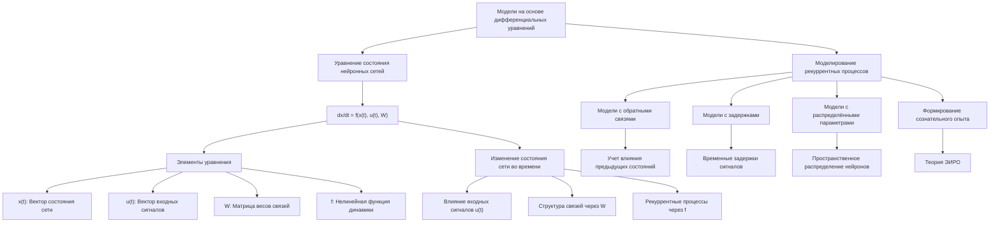
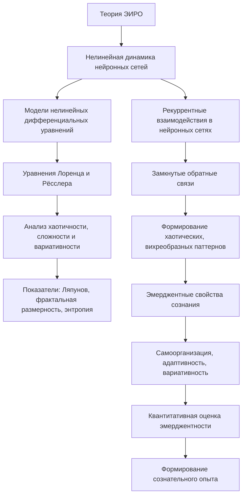

# Теория Эмерджентной Интеграции и Рекуррентного Отображения (ЭИРО)

```mermaid
graph TD
    A[Эмерджентная Интеграция и Рекуррентное Отображение] 
    A --> B[Эмерджентность сознания]
    A --> C[Интеграция информации]
    A --> D[Рекуррентные связи]
    A --> E[Предиктивное кодирование]
    A --> F[Роль внимания и рабочей памяти]
    A --> G[Нейробиологические основания]
    A --> H[Математическое моделирование]
    A --> I[Экспериментальные данные]
    A --> J[Клинические аспекты]
    A --> K[Практические применения]
    
    B --> B1[Сложная динамика нейронных сетей]
    B --> B2[Синхронизация и коллективная активность]
    C --> C1[Объединение сенсорных данных]
    C --> C2[Метрика интеграции ϕ_e]
    D --> D1[Таламо-кортикальные петли]
    D --> D2[Кортикокортикальные связи]
    D --> D3[Реактивация памяти]
    E --> E1[Мозг как предиктивная машина]
    E --> E2[Минимизация ошибок предсказания]
    F --> F1[Выделение релевантной информации]
    F --> F2[Удержание информации]
    G --> G1[Канонические микросхемы коры]
    G --> G2[Таламо-кортикальные и кортикокортикальные связи]
    G --> G3[Моноаминергические системы]
    H --> H1[Дифференциальные уравнения]
    H --> H2[Метрика ϕ_e = ∫ I_integration ⋅ R_recurrence]
    I --> I1[Нейровизуализация]
    I --> I2[ЭЭГ и МЭГ]
    I --> I3[Машинное обучение]
    J --> J1[Нарушения сознания]
    J --> J2[Психические расстройства]
    J --> J3[Диагностика на основе ϕ_e]
    K --> K1[Искусственный интеллект]
    K --> K2[Проектирование интерфейсов BCI]
    K --> K3[Моделирование эмоциональных состояний]
```

блок-схема

---

## Теоретический framework ЭИРО:

### Аналитика:

Критический анализ теории ЭИРО

#### Общие концептуальные основания

Теория ЭИРО утверждает, что сознание **не** является простым суммированием активности нейронов, а «возникает» (эмерджентно) из динамичного взаимодействия многоуровневой интеграции информации и циклической (рекуррентной) переработки данных. В соответствии с этим, авторы описывают сознание как последовательность этапов: сенсорный вход → фильтрация и первичная обработка стимулов → **интеграция информации** → **рекуррентное отображение** (обратные петли с учётом предыдущего опыта) → формирование эмерджентного осознанного восприятия. Особенность теории – «многоуровневые обратные связи», обеспечивающие постоянную адаптацию системы. Иными словами, авторы постулируют, что интеграция (объединение разнотипных сигналов в целостные паттерны) вместе с рекуррентной обратной связью (возвратом информации для учёта прошлого опыта) порождают сознание как качественно новый уровень.

В целом эти идеи созвучны существующим подходам: интеграция информации присутствует в теории интегрированной информации (IIT), а важность обратных связей подчёркивается в работах типа Ламме (2006) о рекуррентной обработке. Теория ЭИРО позиционирует себя как «интегративная», объединяющая элементы GWT, IIT и предсказательного кодирования. Однако при критическом рассмотрении становится видно, что концептуальная основа во многом повторяет уже известное: интеграция сведена к объединению данных без формализации, рекуррентность рассматривается качественно. Понятие **«эмерджентное сознание»** остается неопределённым термином – теория не объясняет, какой именно новый механизм появляется на этом этапе и как он математически вытекает из предыдущих процессов. Таким образом, концепция выглядит логически непротиворечивой (никаких явных конфликтов «интеграции» и «рекуррентности» нет), но её обоснование скорее декларативно. В ней отсутствует строгое объяснение, почему простое сочетание интеграции и обратных связей обязательно порождает субъективный опыт. Новизна ЭИРО сомнительна: заявленное объединение идей схоже с предложенными ранее, а новые элементы (например, упоминание эмоциональной модуляции через нейромедиаторы) введены без ясной формальной связи с основной моделью.

#### Метрики и формулы

Центральной метрикой ЭИРО является *эмерджентная интегрированная информация* 
\$\Phi\_e\$ – аналог показателя из IIT, но вычисляемый иначе. Формально предлагается

$\Phi_e = \int_{t_0}^{t_1} I_{\text{integration}}(t)\cdot R_{\text{recurrence}}(t)\,dt,$

где \$I\_{\text{integration}}(t)\$ – мера интеграции информации в момент \$t\$, а \$R\_{\text{recurrence}}(t)\$ – степень рекуррентной обработки. Иными словами, \$\Phi\_e\$ – это интеграл по времени произведения величины интеграции на величину обратных связей. Авторы обосновывают эту формулу качественно: интегрирование по времени позволяет учесть динамику и накопительный эффект, а произведение \$I\cdot R\$ указывает, что высокий уровень сознания возможен лишь при **сочетании** сильной интеграции и активной рекуррентности. Однако строгой математической мотивации этому выбору не приведено: почему именно произведение, а не, скажем, сумма или более сложная функция, не объясняется.

Компоненты метрики определены так. \$I\_{\text{integration}}(t)\$ предлагается вычислять двумя способами:

* **Энтропийный подход:** сумма взаимной информации по парам компонент системы. Формула:
  $I_{\text{integration}}(t) = \sum_{i,j}\bigl[H(X_i(t))+H(X_j(t))-H(X_i(t),X_j(t))\bigr],$
  где \$H(X\_i)\$ – энтропия отдельной части \$i\$.

* **Графовые метрики:** использование характеристик сетевых графов нейронных связей (кластеризация, центральность, эффективность передачи).

\$R\_{\text{recurrence}}(t)\$ рассчитывается, например, как отношение числа рекуррентных связей к максимально возможному их числу. Можно также учитывать веса связей (эффективность), но в базовой формулировке R(t) просто показывает плотность обратных связей.

Таким образом, \$\Phi\_e\$ сводится к времени-интегралу (методу Симпсона упоминают) от функции, заданной двумя подкритериями. С одной стороны, такое построение интуитивно объединяет два аспекта (количество информации и обратные связи). С другой стороны, оно вызывает вопросы. Во-первых, сумма попарной взаимной информации не является типичной мерой «целостности» системы: парные связи могут перекрываться, формула может двукратно учесть одни и те же зависимости и не учитывает многокомпонентных взаимосвязей (синергии). Во-вторых, \$R(t)\$ как доля связей – слишком грубая оценка качества рекуррентности (не учитывает силу и динамику сигналов). Наконец, интеграл \$\int I\cdot R,dt\$ не нормирован и зависит от длительности процесса: непонятно, как выбрать \$t\_0,t\_1\$.

Сравнение с IIT показывает существенное отличие. В IIT интегрированная информация \$\Phi\$ определяется как **информация, теряемая при разделении системы на части** (минимальная по «ценности» разреза). Там \$\Phi\$ вычисляется через изменение картины причинно-следственных связей при «разрезах» системы, что отражает неприводимость опыта. В ЭИРО же авторы не используют такую процедуру: их \$\Phi\_e\$ – скорее аддитивно-мультипликативная оценка. Фактически, при разделении системы на части (как в IIT) рассматривается не \$\Phi\_e\$. Поэтому **метрика ЭИРО** менее строгая: она не проверяет, насколько целое *информационно более чем сумма частей*, а лишь интегрирует по времени плотность интеракций. При этом термин «качество информации» в \$\Phi\_e\$ связывается с рекуррентностью – но это чисто декларация, без формального смысла.

Внутренняя непротиворечивость метрики сомнительна. Например, если система имеет высокую информационную интеграцию \$I\gg0\$, но почти не содержит обратных петель (\$R\approx0\$), то \$\Phi\_e\approx0\$, по теории – системы без рекуррентности «не осознают». Это похоже на тезис Ламме, но никакая проверка на необходимых и достаточных условиях не описана. Также не ясно, как сравнивать \$\Phi\_e\$ разных систем: например, система с большим числом элементов может иметь существенно большую сумму взаимной информации (и \$\Phi\_e\$), чем более компактная, даже при аналогичной организованности. Сравнение с другими теориями: IIT критикуется за вычислительную неустранимость и псевдонаучность; ЭИРО, напротив, предлагает формулу проще, но без проверки её разумности. К тому же интерпретация параметров \$I(t)\$ и \$R(t)\$ без объективных протоколов измерения накладывает вопросы о воспроизводимости. В целом метрика \$\Phi\_e\$ скорее аналогична концепту «суммарного интегрированного опыта» без чёткого научного обоснования, чем фундаментальной величине.

#### Математические модели

ЭИРО оперирует стандартными математическими моделями нервных сетей. В качестве основы предлагается **дифференциальное уравнение состояния**:
$\frac{dx}{dt} = f(x(t), u(t), W),$
где \$x(t)\$ – вектор состояния сети, \$u(t)\$ – входные сигналы, а \$W\$ – матрица связей (включая рекуррентные). Такая формулировка общепризнанна (система нелинейных ОДУ описывает динамику, например, рекуррентной сети) и сама по себе не противоречива. Для моделирования рекуррентности указаны три подхода:

* **Модели с обратными связями** – нейроны получают сигналы от собственных выходов, что учитывает влияние прошлых состояний.
* **Модели с задержками** – вводятся временные задержки передачи между нейронами.
* **Модели с распределёнными параметрами** – учитывается пространственное распределение нейронов/связей.

Эти описания – достаточно поверхностные. В действительности все они просто констатируют: «мы можем добавить обратные связи и задержки», но не предлагают конкретных динамических уравнений ЭИРО. Кроме того, упоминание уравнений Лоренца и Рёсслера для моделирования «вихреобразного» поведения нейронных сетей выглядит чисто иллюстративно и не обосновано в рамках нейрофизиологии. Классические хаотические системы (Лоренц, Рёсслер) показывают свойства самоподдерживающихся петель, но нет объяснения, почему именно они подходят для мозга.

В части **байесовских моделей предиктивного кодирования** теория ЭИРО следует общепринятой парадигме. Она заявляет, что мозг – вероятностная система, генерирующая предсказания и обновляющая внутренние модели по Байесу. Действительно, даётся простая формула Байесова вывода \$P(\theta|D) = P(D|\theta)P(\theta)/P(D)\$ и упоминается принцип минимизации свободной энергии (по Фристону): свободная энергия измеряет расхождение между моделью и средой, а мозг стремится её минимизировать, тем самым минимизируя ошибку предсказания. Эти положения соответствуют современному пониманию предиктивного кодирования и свободной энергии и не содержат очевидных ошибок.

Однако сама по себе эта часть тоже не вносит новизны – это практически дословное повторение идей Фристона и др. Кроме того, связь этих байесовских процессов с метрикой \$\Phi\_e\$ не раскрыта: неясно, как конкретно обновление апостериорных вероятностей влияет на интеграцию \$I(t)\$ или рекуррентность \$R(t)\$. В модели ЭИРО нет явного **правила взаимодействия** между дифференциальной динамикой и байесовским обучением, то есть отсутствуют конкретные уравнения или алгоритмы, связывающие вероятностную переработку с изменением сети.

В целом формулы ЭИРО корректны как базовые конструкции (общее ОДУ, формула Байеса) и отражают часть современных подходов, но они слишком расплывчаты для прямой научной применимости. Нет чёткого набора уравнений, моделирующих конкретные нейрофизиологические явления. Например, не объяснено, каким именно образом изменение весов \$W\$ подчиняется законам ЭИРО; упоминается упрощённо, что эти модели «позволяют исследовать» эмерджентные свойства. Проаксиоматический или механистический аппарат теории фактически не расширен по сравнению с уже существующими моделями нейронных сетей с обратной связью и обучением по ошибке.

#### Научная верифицируемость

В тексте приводятся отсылки к экспериментальным данным, якобы подтверждающим ЭИРО, но эти примеры опосредованы и не связаны с прямым измерением предложенных концептов. Утверждается, что «у пациентов с нарушениями сознания наблюдается значительное снижение Φₑ»: ссылаются на Casali et al. (2013) и Sitt et al. (2014). Однако проверка показала, что ни в одной из этих работ не вычислялось \$\Phi\_e\$. Так, Casali и соавторы на самом деле вводят **индекс возмущённой сложности (PCI)**, основанный на ответы на TMS, а не на интеграции-обратных связях ЭИРО. Несмотря на это, в тексте ЭИРО утверждается, что Casali обнаружил «значительное снижение Φₑ» при анестезии и в вегетативном состоянии. Аналогично, Sitt et al. (2014) исследовали признаки сознания в различных состояниях, но не вводили метрику Φₑ – они лишь машинно классифицировали данные фМРТ. Тем не менее ЭИРО интерпретирует их результаты как высокую предсказательную силу Φₑ. Фактически это более общее утверждение (нарушение интеграции характерно для дисфункции сознания), но прямых данных по вычислению \$\Phi\_e\$ нет.

Поэтому эмпирические «подтверждения» теории по существу состоят из общих наблюдений о сниженной интеграции при утрате сознания. Отмечается, что в состоянии анестезии интеграция «нарушается» (совпадая с обзорами, например Hudetz, 2012). Также упоминаются классические эксперименты визуального маскирования: Lamme и Roelfсема (2000) показали, что прерывание обратных связей подавляет осознание стимула. Эти результаты действительно свидетельствуют, что рекуррентная обработка играет важную роль в сознательном восприятии, и они не противоречат ЭИРО. Тем не менее это лишь качественные подтверждения идеи о необходимости обратных связей. Они применимы и к другим теориям (в том числе к идеям Фристана и Ламме) и не являются уникальными для ЭИРО.

**Никаких специально спланированных экспериментов для верификации ЭИРО** не представлено. Не показано, как именно измерять \$I\_{\text{integration}}(t)\$ и \$R\_{\text{recurrence}}(t)\$ на практике и контролировать их в разных состояниях. Упомянутые «калькуляторы» интеграции и Φₑ приводят лишь демонстрационные числа при произвольно выбранных функциях, без привязки к реальным данным. Таким образом, на настоящий момент теория ЭИРО имеет лишь косвенную поддержку – сводку эмпирических закономерностей, которые она интерпретирует в свою пользу, – но не располагает собственными экспериментальными результатами. Для верификации необходимы целевые исследования, где в данных ЭЭГ/фМРТ будет вычисляться заявленная метрика Φₑ и соотнесена с уровнями сознания.

#### Потенциальные проблемы и сопоставление с другими теориями

У теории ЭИРО есть несколько важных проблем и допущений, требующих критики:

* **Отсутствие формального обоснования**. Множество основных понятий введено на уровне словесных описаний. Например, «многоуровневость» и «адаптивность» подаются как свойства, но без мат. модели. Параметр \$E(t)\$ (эмоциональная модуляция) упомянут в контексте нейромедиаторов, но нигде не определён математически. Теория делает выводы о сознании из предположений (например, о взаимном усилении \$I\$ и \$R\$) без доказательств или апостериорной проверки этих допущений.

* **Упрощённые метрики**. Формулы для \$I\_{\text{integration}}\$ и \$R\_{\text{recurrence}}\$ описаны грубо. Суммирование попарной взаимной информации может сильно завысить оценку интеграции и зависит от разбиения системы на компоненты. \$R(t)\$ как плотность связей не учитывает их силу и функциональную значимость. Это может приводить к ситуации, когда две очень разные сети (например, с разными весами или топологиями) дают схожие значения \$I\$ и \$R\$, хотя их реальная способность «сознавать» (по интуиции) разная.

* **Логические допущения**. В ЭИРО считается, что и интеграция, и рекуррентность **всегда** способствуют сознанию – их высокий уровень «взаимно усиливает» сознательный опыт. Но гипотеза о том, что их произведение должно отражать степень сознания, не обсуждается критически. Например, теория не анализирует крайние случаи: если сеть полностью связана с обратными петлями (\$R=1\$) но не обменивается осмысленной информацией между частями (\$I\$ мало), или наоборот. То есть не показано, что \$\Phi\_e>0\$ является действительно необходимым и достаточным условием сознания.

* **Слабая эмпирическая проверяемость**. Как уже было сказано, ЭИРО не даёт конкретных экспериментальных проверок, кроме косвенных ссылок. Нигде не приведено сравнения вычисленной \$\Phi\_e\$ с субъективными отчетами или объективными протоколами (за исключением отсылок к чужим данным). В отсутствие явно формализованных процедур подсчёта, теория рискует остаться неконтролируемой – ведь её параметры (выбор функций \$I(t)\$, \$R(t)\$, границы интеграла) могут быть подобраны так, чтобы согласовываться с любыми имеющимися результатами.

Сопоставление с другими теориями:

* **IIT**. Оба подхода делают ставку на интеграцию информации, но методология разная. IIT предлагает строгое, но вычислительно затратное определение φ как «минимальной информации, потерянной при разделении». ЭИРО, напротив, использует простую формулу \$\int I R,dt\$. Такая простота упрощает расчёты, но утрачивает глубину: IIT учитывает структуру причинно-следственных связей и поиск «минимальной разрезки», а ЭИРО – нет. Из-за этого значение \$\Phi\_e\$ может меняться при произвольных деталях системы, и поэтому не очевидно, что оно объективно отражает «количество сознания». Кроме того, как и у IIT, у ЭИРО поднимается *панпсихический* вопрос: любая система с ненулевой интеграцией и рекуррентностью по этой модели бы «сознавала» хоть в малой степени, но где провести порог, не указано. Стоит отметить, что сам IIT критикуется за пессимизм в проверяемости и за сложности вычислений. ЭИРО пытается обойти эти проблемы упрощёнными метриками, но в результате теряет обоснованность.

* **Глобальная рабочая теория (GWT)**. GWT подчёркивает глобальную доступность информации (широкомасштабный «рабочий буфер»), но не фокусируется на метрических величинах. ЭИРО в тексте упоминает GWT лишь чтобы отметить его незавершённость: «GWT подчёркивает интеграцию, но не объясняет, как она достигается и какую роль играют обратные связи». На деле же ЭИРО сама не конкретизирует механизм «глобального» распространения сигнала (например, через фронтальные кортикальные петли и рабочую память). Концепция «глобального рабочего пространства» здесь не реализована: ЭИРО говорит об интеграции сигнала в разных областях, но не вводит ни понятие, ни модель единого буфера или модуля, координирующего передачу. Можно сказать, что в сравнении с GWT ЭИРО остаётся «локалистской»: отсутствуют положения о специализации внимания и селективном входе в сознание, которые присутствуют в GWT.

* **Предиктивное кодирование (ПК)**. ЭИРО активно включает элементы ПК: байесовские обновления и принцип свободной энергии. Однако в ПК основной упор делается на иерархическую обработку предсказаний и ошибок, тогда как ЭИРО не формулирует, как именно эти ошибки преобразуются в интеграцию информации и рекуррентность. То есть модель ПК в ЭИРО не задействована целиком – упомянута лишь схема обновления априорных моделей и общая адаптивность мозга.  Кроме того, ЭИРО утверждает, что ПК «не охватывает все аспекты субъективного опыта», но не объясняет, какие аспекты остаются за бортом и почему их решение лежит в введении «эмерджентной интеграции». По сути, ЭИРО включает ПК «в нагрузку», но не развивает и не тестирует вытекающие из него предсказания.

В итоге ЭИРО можно рассматривать как **концептуальную смесь**: она объединяет идеи интеграции (Tononi), обратных связей (Lamme), глобальной доступности (Baars/Dehaene) и предсказаний (Friston), но без чёткого синтеза. Модель становится слишком общей: трудно понять, в чём её уникальное, проверяемое предположение. Математические описания текущи и скорее служат иллюстрацией, чем строгим аппаратом.

#### Вывод

Теория ЭИРО амбициозно заявляет о создании интегративной модели сознания, однако на практике она остаётся во многом описательной и недостаточно формализованной. Её основные положения перекликаются с уже существующими подходами: интеграция и рекуррентность давно рассматриваются как важные факторы сознания. Предложенная метрика Φₑ проста и наглядна, но лишена строгого обоснования и может противоречить более глубоким требованиям, предъявляемым к мерам сознания в IIT и других теориях. Математические модели в ЭИРО базируются на стандартных уравнениях и байесовских представлениях, что само по себе безупречно, но не добавляет нового понимания. Эмпирическая база теории пока слаба: авторы интерпретируют классические находки (эпилепсия, анестезия, визуальное маскирование) в духе ЭИРО, но не предлагают независимых проверок.

В целом, ЭИРО объединяет знакомые элементы в одной структуре, но ей не хватает чёткого механизма превращения интегрированных и рекуррентных процессов в сознание. Для серьёзной научной поддержки теория нуждается в уточнении формулировок, разработке конкретных алгоритмов вычисления заявленных показателей и проведении экспериментов, которые смогли бы однозначно подтвердить или опровергнуть её предсказания. Без этого ЭИРО остаётся интересной идеей на уровне концепции, но не полноценной научной теорией сознания.

**Источники:** исходный текст ЭИРО, а также классические работы по IIT, GWT и Predictive Coding. Особое внимание уделено методам ЭИРО, например определениям \$I\_{\text{integration}}\$ и \$R\_{\text{recurrence}}\$ и экспериментальным приложениям, как они изложены в тексте.

Теория сознания (Beta 0.1) 

#### Теория сознания

- [Теория Сознания](/README.md) Oct 17, 2024. upd: Nov 27, 2024
  
- [Метрика интегрированной информации](/Integrated-Information-Metric.md) Oct 18, 2024
  
- [Рекуррентные динамические системы](/Recurrent-dynamic-systems.md) Oct 18, 2024

- [Математическая формализация предиктивного кодирования в рамках теории ЭИРО](/predictive-coding.md) Oct 19, 2024

- [Система внимания нейронной сети через призму теории ЭИРО](/The-attention-system-of-a-neural-network.md) Oct 30, 2024

   - [Принцип эффекта гипноза через призму теории ЭИРО](/the-principle-of-the-hypnosis-effect.md) Oct 30, 2024

- [Принципы механизмов памяти в нейронных сетях через призму теории ЭИРО](/Principles-of-memory-mechanisms-in-neural-networks.md) Oct 30, 2024

- [Нейрокогнитивные механизмы сознательного восприятия и памяти в контексте теории ЭИРО](/Neurocognitive-mechanisms-of-conscious-perception-and-memory.md) Nov 1, 2024

   - [Нейрокогнитивные механизмы памяти в контексте теории ЭИРО](/Neurocognitive-mechanism-of-memory.md) Nov 1, 2024

- [Нейрокогнитивные механизмы мышления в контексте теории ЭИРО](/Neurocognitive-mechanisms-of-thinking.md) Nov 1, 2024

- [Нейрокогнитивные механизмы селективного внимания через призму теории ЭИРО](/Neurocognitive-mechanisms-of-selective-attention.md) Nov 1, 2024

- [Нейрокогнитивные механизмы восприятия в контексте эмергентной интеграции: от сенсорных входов к осознанному опыту](/Neurocognitive-mechanisms-of-perception.md) Nov 1, 2024

- [Нейрокогнитивные механизмы сновидений в контексте теории ЭИРО](/Neurocognitive-mechanisms-of-dreams.md) Nov 4, 2024

- [Трудная проблема сознания в контексте теории ЭИРО](/The-difficult-problem-of-consciousness.md) Nov 11, 2024

- [Философские аспекты теории ЭИРО](/Philosophical-aspects.md) Nov 14, 2024

- [Теория ЭИРО в контексте коннектомики](/EIRM-in-the-context-of-connectomics.md) Oct 30, 2024. upd: Nov 21, 2024

- [Предсказательное кодирование как система обратной связи организма](/Predictive-coding-as-an-organism-feedback-system.md) Nov 26, 2024

- [Мультимодальная перцептивная репрезентация в контексте теории ЭИРО](/Multimodal-perceptual-representation.md) Nov 27, 2024 

- [Механизмы осознанного восприятия в контексте теории ЭИРО](/Mechanisms-of-conscious-perception.md) Nov 27, 2024 

- [Принцип работы нейрона в контексте теории ЭИРО](/The-principle-of-operation-of-a-neuron.md) Nov 28, 2024 

#### Нейрофизиология

- [Нейрофизиологические механизмы рекуррентной обработки и интеграции сигналов в сознании: анализ теории ЭИРО](/neurophysiology.md) Oct 19, 2024
  
- [Роль Микроглии в Теории ЭИРО](/microglia.md) Oct 19, 2024

#### Нейробиология

- [Нейробиологические основы теории ЭИРО](/neuroscience.md) Oct 19, 2024

#### Когнитивная наука

- [Когнитивные основы Теории ЭИРО](/cognitive-science.md) Oct 19, 2024

#### Психология

- [Теория ЭИРО в контексте психологии](/psychology.md) Oct 19, 2024
  
- [Роль рекуррентной интеграции в формировании памяти и обучения](/the-role-of-recurrent-integration-in-memory-formation-and-learning.md) Oct 20, 2024

#### Философия сознания

- [Теория ЭИРО: Философское обоснование сознания](/philosophy-of-consciousness.md) Oct 19, 2024
  
- [Эмерджентность сознания и бытия через рекуррентную взаимосвязь](/the-emergence-of-consciousness-and-being-through-a-recurrent-relationship.md) Oct 20, 2024

#### Нейропсихология

- [Нейропсихологические основы Теории ЭИРО](/neuropsychology.md) Oct 19, 2024

#### Нейровизуализация

- [Нейровизуализация в контексте теории ЭИРО: Исследование сознания через изучение мозговых процессов](/neuroimaging.md) Oct 19, 2024

#### Биология систем

- [ЭИРО в контексте системной биологии](/biology-of-systems.md) Oct 19, 2024
  
- [Рекуррентная интеграция в физиологических системах организма](/recurrent-integration-in-the-physiological-systems-of-the-body.md) Oct 20, 2024

#### Психиатрия

- [ЭИРО в контексте психиатрии](/psychiatry.md) Oct 19, 2024

#### Этология и нейроэтология

- [ЭИРО в этологии и нейроэтологии: эволюционные аспекты сознания и интеграции информации в поведении](/ethology-and-neuroethology.md) Oct 19, 2024

#### Биоинформатика

- [ЭИРО в биоинформатике: Анализ больших нейронных данных](/bioinformatics.md) Oct 19, 2024

#### Психофизика

- [Теория ЭИРО с точки зрения психофизики](/psychophysics.md) Oct 19, 2024

#### Прочее

- [Сравнительный анализ ведущих теорий сознания в контексте ЭИРО](/comparative-analysis.md) Oct 19, 2024

#### Компоненты метрики Φₑ** (speculative experimental branch)

- [Расширение теории ЭИРО с учетом дополнительных параметров метрики Φₑ](/extended-fe-metric.md) Nov 15, 2024

  - [Роль эмоций в теории ЭИРО](/The-role-of-emotions.md) Nov 15, 2024

  - [Математическое моделирование компонентов параметра эмоциональной модуляции E(t) в теории ЭИРО](/Mathematical-modeling-of-the-components-of-the-emotional-modulation-parameter.md) Nov 15, 2024

  - [Когнитивная сложность C(t) в теории ЭИРО](/Cognitive-complexity.md) Nov 16, 2024

  - [S(t) - Социальный контекст в теории ЭИРО](/Social-context.md) Nov 16, 2024

  - [A(t) - Адаптивность в теории ЭИРО](/Adaptability.md) Nov 16, 2024

  - [Мотивационный компонент M(t) в структуре метрики эмоционально-интеллектуального развития организма](/The-motivational-component.md) Nov 16, 2024

  - [Физиологические параметры P(t) в теории ЭИРО](/Physiological-parameters.md) Nov 16, 2024

  - [Вариативность поведения V(t) в контексте теории ЭИРО](/Variability-of-behavior.md) Nov 16, 2024

  - [T(t) - Темпоральные характеристики в контексте теории ЭИРО](/Temporal-characteristics.md) Nov 16, 2024

  - [K(t) - Контекстуальность в теории ЭИРО](/Contextuality.md) Nov 16, 2024

- [Дополнительные компоненты метрики Φₑ в контексте теории ЭИРО](/Components-of-the-F-metric.md) Nov 17, 2024 

  - [Интегративность (I) в теории ЭИРО](/Integrativity.md) Nov 17, 2024 

  - [Метакогнитивная осведомленность (M) в теории ЭИРО](/Metacognitive-awareness.md) Nov 17, 2024 

  - [Когерентность (C) в контексте теории ЭИРО](/Coherence.md) Nov 17, 2024 

  - [Эмоциональный интеллект (E_i) в контексте ЭИРО: структурный анализ и методология оценки](/Emotional-Intelligence.md) Nov 18, 2024 

  - [Квантовая когерентность (Q_c) в контексте теории ЭИРО](/Quantum-Coherence.md) Nov 19, 2024. upd: Apr 7, 2025 

- [Компоненты метрики Φₑ сознания животного в контексте теории ЭИРО](/Components-of-the-animal-consciousness-metricFe.md) Nov 18, 2024 

- [Компоненты метрики Φₑ сознания мухи дрозофилы в контексте теории ЭИРО](/Components-of-the-drosophila-fly-consciousness-metric-Fe.md) Nov 18, 2024 

- [Критический анализ расширенной теории ЭИРО и метрики Φₑ](/critical-analysis-of-the-theory-eirm.md) Apr 28, 2025

Теория сознания (Beta 0.2) 

- [Обзор Теории Динамической Интеграции Сознания](/Theory-Of-Dynamic-Integration-Of-Consciousness/review.md) May 24, 2025

- [Теория Динамической Интеграции Сознания (ТДИС)](/Theory-Of-Dynamic-Integration-Of-Consciousness/README.md) May 23, 2025

- [Критический анализ ТДИС](/Theory-Of-Dynamic-Integration-Of-Consciousness/Critical-analysis.md) May 23, 2025

- [Решения концептуальных проблем ТДИС](/Theory-Of-Dynamic-Integration-Of-Consciousness/Conceptual-issues.md) May 23, 2025

- [Решения логических и философских проблем ТДИС](/Theory-Of-Dynamic-Integration-Of-Consciousness/Logical-and-philosophical-issues.md) May 24, 2025

- [Недостающие элементы ТДИС: Комплексное дополнение теории](/Theory-Of-Dynamic-Integration-Of-Consciousness/A-comprehensive-addition.md) May 24, 2025

- [Эмпирическая формализация ТДИС: Методы измерения и математические модели](/Theory-Of-Dynamic-Integration-Of-Consciousness/Empirical-formalization.md) May 24, 2025

- [Пример архитектуры AGI ИИ в Теории Динамической Интеграции Сознания](/Theory-Of-Dynamic-Integration-Of-Consciousness/Architectures/README.md) May 24, 2025

- [ARIA: Artificial Reflective Intelligence Architecture](/Theory-Of-Dynamic-Integration-Of-Consciousness/ARIA/README.md) May 24, 2025

- [Обзор Теории Динамической Интеграции Сознания](/Theory-Of-Dynamic-Integration-Of-Consciousness/review.md) May 24, 2025

Обзоры и справочники

- [Механизмы extrasynaptic–передачи сигналов, синхронизации нейронной активности и когерентности](/mechanisms-of-extrasynaptic-signal-transmission-neuronal-activity-synchronization-and-coherence.md) Apr 11, 2025 

- [Исследование фронто-париетальной сети множественных требований (MD-сети) и её роли в когнитивных функциях человека](/multiple-requirement-networks.md) Apr 23, 2025 

- [Основные различия между GNWT и IIT](/The-main-differences-between-GNWT-and-IIT.md) Apr 30, 2025

- [Перенос сознания](/mind-uploading.md) May 02, 2025. upd: May 13, 2024

- [Нейроглия и память: парадигма, выходящая за пределы нейронов](/glia-and-memory.md) May 07, 2025

- [Перечень теорий сознания](/list-of-theories-of-consciousness.md) May 08, 2025

- [Нейросети мозга](/brain-networks/README.md) May 17, 2025

---

**Автор**

- Морозов Евгений Михайлович
- dcs-spb@ya.ru
- https://dcs-spb.ru/
- Российская Федерация, Санкт-Петербург
- 17.10.2024

**Методы:**

В ходе исследования автор применил нейронные сети, такие как chatGPT, GigaChat, Claude и Kandinsky, для обработки информации и генерации контента, что способствовало более глубокому анализу и интерпретации полученных данных. Работа опирается на обширный анализ данных из авторитетных научных источников, что обеспечило надежную базу для использования этих технологий.

---

блок-схема

```mermaid
graph TD
    A[Эмерджентная Интеграция и Рекуррентное Отображение]
    A --> B[Сознание и рекуррентные нейронные сети]
    B --> C1[Эмерджентность сознания]
    B --> C2[Интеграция информации]
    B --> C3[Рекуррентная обработка и предсказание]
    B --> C4[Роль внимания и рабочей памяти]
    C1 --> D1[Сложные взаимодействия между нейронами]
    C1 --> D2[Коллективная динамика системы]
    C2 --> D3[Объединение сенсорных, когнитивных и эмоциональных данных]
    C2 --> D4[Взаимодействие функциональных областей мозга]
    C3 --> D5[Генерация и сравнение предсказаний мозга]
    C3 --> D6[Обновление моделей восприятия]
    C4 --> D7[Выделение релевантной информации]
    C4 --> D8[Удержание данных в активном состоянии]

    B --> E[Нейробиологические основания]
    E --> F1[Канонические микросхемы коры]
    E --> F2[Долгосрочные и краткосрочные связи]
    E --> F3[Таламо-кортикальные петли]
    E --> F4[Кортикокортикальные обратные связи]
    E --> F5[Иерархическая организация мозга]
    F1 --> G1[Вертикальные связи]
    F1 --> G2[Горизонтальные связи]
    F2 --> G3[Связи между областями мозга]
    F2 --> G4[Локальная интеграция]
    F3 --> G5[Синхронизация активности]
    F4 --> G6[Поддержка предсказаний]
    F5 --> G7[Предсказания высших уровней]
    F5 --> G8[Передача ошибок предсказания]

    B --> H[Математическая формализация]
    H --> I1[Метрика интеграции информации Φₑ]
    H --> I2[Рекуррентные динамические системы]
    H --> I3[Байесовское обновление моделей]
    I1 --> J1[Φₑ учитывает качество информации]
    I1 --> J2[Зависимость от интеграции и рекуррентности]
    I2 --> J3[Уравнения состояния нейронных сетей]
    I2 --> J4[Матрица весов включает рекуррентные связи]
    I3 --> J5[Использование вероятностных моделей]
    I3 --> J6[Обновление предсказаний на основе данных]
```

### Аннотация

Теория ЭИРО представляет собой комплексную модель функционирования сознания, основанную на принципах эмергентности и рекуррентной обработки информации. Согласно данной теории, сознание не является простым суммированием нейронных активностей, а возникает в результате динамичного взаимодействия между множеством уровней нейронной интеграции и циклической переработкой данных.

**Принцип работы сознания в рамках теории ЭИРО**:

1. **Сенсорный вход**: Сбор первичных сигналов с помощью сенсорных систем, обеспечивающих базовое представление о внешней среде.
2. **Первичная обработка**: Фильтрация и начальный анализ поступающих данных с целью выделения значимых характеристик.
3. **Интеграция**: Объединение разрозненных информационных потоков в согласованные и целостные паттерны, создающие основу для осмысленного восприятия.
4. **Рекуррентное отображение**: Циклическая переработка информации с учётом предыдущего опыта, что позволяет системе адаптироваться и оптимизироваться в реальном времени.
5. **Эмергентное сознание**: Формирование осознанного восприятия как результат сложного взаимодействия интегративных и рекуррентных процессов.
6. **Поведенческий выход**: Выработка соответствующих когнитивных и поведенческих реакций на основе сформированного осознания.

Особенностью теории является наличие многоуровневых обратных связей, обеспечивающих постоянную адаптацию и корректировку функционирования сознательной системы. Таким образом, модель ЭИРО не только описывает базовые механизмы восприятия и обработки информации, но и проливает свет на возникновение сложных когнитивных процессов, включая самосознание и метакогнитивные способности.

Практическая значимость теории проявляется в её применении при разработке искусственных нейронных сетей, исследованиях когнитивной психологии и нейробиологии, что способствует углублённому пониманию природы сознания и созданию более совершенных алгоритмов машинного обучения.

---

### 1. Введение

#### 1.1. Актуальность изучения сознания

Сознание является одним из наиболее загадочных и сложных феноменов, привлекающих внимание ученых из различных областей знания — нейронауки, психологии, философии и искусственного интеллекта. Несмотря на значительный прогресс в изучении мозга и когнитивных процессов, природа сознания и механизмы его возникновения остаются недостаточно понятными.

#### 1.2. Существующие подходы и необходимость интегративной теории

Существующие модели, такие как Теория Глобального Рабочего Пространства (GWT), Теория Интегрированной Информации (IIT) и Теория Предсказательного Кодирования, предлагают ценные объяснения отдельных аспектов сознания, но часто рассматривают этот феномен с одной определенной перспективы, упуская из виду комплексность взаимодействий в мозге.

**Теория Глобального Рабочего Пространства (GWT)** подчеркивает важность интеграции информации для возникновения сознательного опыта, предполагая, что информация становится сознательной, когда она доступна глобальному рабочему пространству. Однако GWT не в полной мере объясняет, как именно происходит эта интеграция информации и какова роль рекуррентных связей.

**Теория Интегрированной Информации (IIT)** утверждает, что сознание связано с количественной мерой интегрированной информации в системе, обозначаемой как Phi (Φ). Данный подход фокусируется на структуре и сложности информационных связей в нейронных сетях, но не учитывает динамические аспекты, такие как рекуррентность.

**Теория Предсказательного Кодирования** рассматривает мозг как иерархическую систему, которая постоянно предсказывает сенсорные вводы и обновляет свои модели на основе ошибок предсказания. Этот подход подчеркивает роль обучения и адаптации в восприятии, но не охватывает все аспекты субъективного сознательного опыта.

Поэтому возникает необходимость в интегративной теории, которая бы объединяла ключевые элементы этих подходов, создавая целостное представление о механизмах сознания. Такая теория должна учитывать как процессы интеграции информации, так и роль рекуррентных связей и предиктивного кодирования в формировании сознательного опыта.

Подробнее

- Пункт 10. Приложение: Сравнение с существующими теориями
- [Сравнительный анализ ведущих теорий сознания](/comparative-analysis.md)
- [Трудная проблема сознания](/The-difficult-problem-of-consciousness.md)
- [Философские аспекты теории ЭИРО](/Philosophical-aspects.md)

---

### 2. Основные положения теории ЭИРО

```mermaid
flowchart TD
    A[Теория ЭИРО] --> B[Эмерджентность сознания]
    B --> B1[Определение: новые свойства систем]
    B --> B2[Сознание как эмерджентное свойство]
    B2 --> B21[Сложная динамика нейронных сетей]
    B2 --> B22[Синхронизация нейронов]
    B2 --> B23[Коллективная активность]
    B --> B3[Примеры: осцилляции, обработка концепций]

    A --> C[Интеграция информации]
    C --> C1[Необходимость интеграции]
    C1 --> C11[Объединение сенсорных данных]
    C1 --> C12[Создание комплексного опыта]
    C --> C2[Механизмы интеграции]
    C2 --> C21[Функциональные связи между областями мозга]
    C2 --> C22[Глобальная рабочая площадка]
    C2 --> C23[Метрика интеграции Φe]
    C23 --> C231[Формула Φe = ∫Iintegration ⋅ Rrecurrence]
    C23 --> C232[Показатели: объединение, рекуррентность]

    A --> D[Рекуррентные связи]
    D --> D1[Рекуррентные контуры в мозге]
    D1 --> D11[Таламо-кортикальные петли]
    D1 --> D12[Кортико-кортикальные связи]
    D1 --> D13[Гиппокампально-неокортикальные взаимодействия]
    D --> D2[Механизмы рекуррентной активации]
    D2 --> D21[Реактивация памяти]
    D2 --> D22[Генерация предсказаний]
    D2 --> D23[Интеграция информации]
    D2 --> D24[Поддержание активности]
    D --> D3[Нарушения рекуррентности]
    D3 --> D31["Снижение (деменция)"]
    D3 --> D32["Избыточность (шизофрения)"]
    D3 --> D33["Десинхронизация (нарколепсия)"]

    A --> E[Предиктивное кодирование]
    E --> E1[Принципы]
    E1 --> E11[Мозг как предиктивная машина]
    E1 --> E12[Ошибка предсказания]
    E1 --> E13[Обновление моделей]
    E --> E2[Иерархическая структура]
    E2 --> E21[Многоуровневая организация]
    E2 --> E22[Нисходящие и восходящие потоки]
    E2 --> E23[Рекуррентность]
    E --> E3[Принцип свободной энергии]
    E3 --> E31[Минимизация ошибок предсказания]
    E3 --> E32[Связь с энтропией]
    E --> E4[Нейронные реализации]
    E4 --> E41[Предикторные нейроны]
    E4 --> E42[Нейроны ошибки предсказания]
    E4 --> E43[Синаптическая пластичность]

    A --> F[Роль внимания и рабочей памяти]
    F --> F1[Внимание]
    F1 --> F11[Выделение релевантной информации]
    F1 --> F12[Модуляция активности]
    F1 --> F13[Роль нейромодуляторов]
    F --> F2[Рабочая память]
    F2 --> F21[Удержание информации]
    F2 --> F22[Интеракция с рекуррентными сетями]
    F2 --> F23[Объединение информации для интеграции]
```

блок-схема

#### 2.1. Эмерджентность сознания

Согласно теории Эмергентной Интеграции и Рекуррентного Отображения (ЭИРО), сознание является эмерджентным свойством, возникающим из сложных взаимодействий в нейронных сетях мозга.

**Определение эмерджентности**:

Эмерджентность - это появление новых свойств или качеств в сложной системе, которые не могут быть предсказаны или объяснены только на основе свойств отдельных компонентов.

**Сознание как эмерджентное свойство**:

- Сознание не является результатом работы отдельных нейронов или даже отдельных областей мозга.
- Оно возникает из сложной динамики взаимодействия между различными нейронными сетями и системами.
- Коллективная активность нейронов, их синхронизация и координация приводят к появлению субъективного опыта.

**Примеры эмерджентности в нейронных сетях**:

- Синхронизация нейронных осцилляций: Коллективные волны активности, такие как гамма-ритмы, не присущи отдельным нейронам, но возникают из их взаимодействия.
- Обработка образов и концепций: Высокоуровневые представления, такие как понятия или абстрактные идеи, возникают из взаимодействия множества нейронных цепей.

Таким образом, согласно теории ЭИРО, сознание является эмерджентным свойством, возникающим из сложных рекуррентных взаимодействий и интеграции информации в нейронных сетях мозга.

#### 2.2. Интеграция информации

Согласно теории Эмергентной Интеграции и Рекуррентного Отображения (ЭИРО), интеграция информации является ключевым механизмом, лежащим в основе формирования сознательного опыта.

##### 2.2.1 Необходимость интеграции

- Для создания целостного восприятия мира мозг должен объединять информацию из различных сенсорных каналов и когнитивных процессов.
- Интеграция позволяет связать воедино разнородную информацию, создавая комплексный и связанный опыт.

##### 2.2.2 Механизмы интеграции

**Функциональные связи между областями мозга**:

Нейронные пути, связывающие различные регионы, такие как зрительная, слуховая и соматосенсорная коры, обеспечивают интеграцию информации.

**Глобальная рабочая площадка**:

Согласно концепции глобальной рабочей площадки, сознание возникает, когда информация становится доступной для множества когнитивных процессов через широкораспространенную сеть. Интегрированная информация транслируется по этой сети, позволяя различным когнитивным системам использовать ее одновременно.

**Метрика интегрированной информации ($\Phi$)**:

Подробнее

- [Эмерджентная интегрированная информация](/Integrated-Information-Metric.md)
- [Калькулятор эмерджентной интегрированной информации](/Emergent-Integrated-Information-Calculator.md)
- [Калькулятор степени интеграции информации](/Emergent-Integrated-Information-Calculator.md)
- Пункт 4.4. Эмерджентная интегрированная информация ($\Phi_e$)

$\Phi$ — показатель степени интегрированной информации в системе. $\Phi_e$ — метрика эмерджентной интегрированной информации, учитывающая как количество, так и качество интегрированной информации в контексте рекуррентной обработки:

$\Phi_e = \int_{0}^{t_1} I_{\text{integration}}(t) \cdot R_{\text{recurrence}}(t) \, dt$

Где:

- $I_{\text{integration}}(t)$ — степень объединения информации в момент времени $t$.
- $R_{\text{recurrence}}(t)$ — степень рекуррентной обработки в момент времени $t$.

Таким образом, интеграция информации, обеспечиваемая функциональными связями, глобальной рабочей площадкой и метрикой $\Phi_e$, является ключевым механизмом, лежащим в основе формирования сознательного опыта согласно теории ЭИРО.

#### 2.3. Роль рекуррентных связей в формировании сознательного опыта

Рекуррентные связи в мозге играют ключевую роль в процессах, лежащих в основе сознания согласно теории Эмергентной Интеграции и Рекуррентного Отображения (ЭИРО). Сознание возникает из эмерджентной интеграции информации, опосредованной рекуррентными нейронными взаимодействиями.

Подробнее

- [Нейрофизиологические механизмы рекуррентной обработки и интеграции сигналов в сознании](/neurophysiology.md)

##### 2.3.1. Рекуррентные контуры в мозге

Исследования показывают, что во время фазы быстрого сна (REM-сна), когда наблюдается наиболее интенсивная сновидческая активность, в мозге активируются специфические рекуррентные контуры:

- **Таламо-кортикальные петли**: Взаимодействие таламуса и различных областей коры головного мозга формирует замкнутые рекуррентные циклы обработки информации. Эти петли играют ключевую роль в генерации осцилляторных паттернов, характерных для REM-сна.

- **Кортико-кортикальные связи**: Обратные проекции между ассоциативными областями коры (например, префронтальной, теменной, височной) обеспечивают рекуррентную интеграцию информации, лежащую в основе сложных сновидческих сюжетов.

- **Гиппокампально-неокортикальные взаимодействия**: Рекуррентные связи между гиппокампом и неокортексом позволяют объединять эпизодические воспоминания и семантические знания в целостные сновидческие нарративы.

##### 2.3.2. Механизмы рекуррентной активации в сознании

Рекуррентные связи в мозге обеспечивают следующие ключевые механизмы, лежащие в основе формирования сознательного опыта:

1. **Реактивация памятных следов**: Рекуррентные взаимодействия между гиппокампом и неокортексом приводят к повторной активации нейронных ансамблей, кодирующих воспоминания. Это позволяет "проигрывать" эпизодические события в сознании.

2. **Генерация внутренних предсказаний**: Рекуррентные контуры в ассоциативных областях коры формируют предсказания о возможных событиях и сенсорных ощущениях, которые затем "проецируются" в сознательный опыт.

3. **Интеграция разрозненной информации**: Замкнутые рекуррентные циклы между различными областями мозга способствуют объединению фрагментарных элементов памяти, восприятия и фантазии в целостные репрезентации сознания.

4. **Поддержание активности нейронных ансамблей**: Рекуррентные связи обеспечивают длительное поддержание возбуждения нейронных популяций, что позволяет сознательному опыту сохранять устойчивость и непрерывность во времени.

##### 2.3.3. Нарушения рекуррентности и их влияние на сознание

Исследования показывают, что патологические изменения в рекуррентных связях мозга оказывают существенное влияние на характеристики сознательного опыта:

- **Снижение рекуррентности**: При нарушениях в таламо-кортикальных и кортико-кортикальных взаимодействиях (например, при деменциях) наблюдаются фрагментарные, бессвязные сознательные переживания.

- **Избыточная рекуррентность**: Гиперактивность рекуррентных контуров (как при шизофрении) может приводить к сверхинтегрированным, причудливым сознательным состояниям с бредовыми элементами.

- **Нарушение синхронизации**: Десинхронизация рекуррентных взаимодействий (как при нарколепсии) может вызывать прерывистые, хаотичные сознательные переживания.

Таким образом, рекуррентные связи в мозге играют ключевую роль в генерации, структурировании и поддержании сознательного опыта. Нарушения в этих механизмах лежат в основе многих расстройств сознания.

**Источники**: [1, 2, 3, 4, 5]

#### 2.4. Механизмы предиктивного кодирования

Согласно теории Эмергентной Интеграции и Рекуррентного Отображения (ЭИРО), предиктивное кодирование является важным механизмом, лежащим в основе формирования сознательного опыта.

Подробнее

- [Математическая формализация предиктивного кодирования](/predictive-coding.md)
- [Предсказательное кодирование как система обратной связи организма](/Predictive-coding-as-an-organism-feedback-system.md)

##### 2.4.1. Основные принципы предиктивного кодирования

1. **Предиктивность мозга**: Мозг рассматривается как предиктивная машина, которая постоянно генерирует предсказания о сенсорных входах на основе внутренних моделей и обновляет эти модели в соответствии с ошибками предсказания.

2. **Ошибка предсказания**: Разница между ожидаемыми (предсказанными) сенсорными сигналами и фактическими сенсорными данными называется ошибкой предсказания. Эта ошибка служит сигналом для обновления внутренних моделей.

3. **Обновление моделей**: Ошибки предсказания используются для корректировки и улучшения внутренних моделей мира, что позволяет мозгу более точно предсказывать будущие сенсорные события.

##### 2.4.2. Иерархическая структура мозга

1. **Многоуровневая организация**: Мозг организован иерархически, с множеством уровней обработки информации от низших (сенсорных) к высшим (абстрактным).

2. **Нисходящие и восходящие потоки информации**:
   - **Нисходящие потоки**: Высшие уровни отправляют предсказания в низшие уровни.
   - **Восходящие потоки**: Низшие уровни передают ошибки предсказания вверх по иерархии.

3. **Рекуррентность**: Постоянный обмен информацией между уровнями позволяет мозгу быстро и эффективно обновлять предсказания.

##### 2.4.3. Принцип свободной энергии

1. **Свободная энергия**: Введенный Карлом Фристоном, принцип свободной энергии связывает байесовское обновление с термодинамической концепцией свободной энергии.

2. **Минимизация свободной энергии**: Мозг стремится минимизировать свободную энергию, что эквивалентно минимизации ошибки предсказания и обновлению внутренних моделей.

3. **Связь с энтропией**: Минимизация свободной энергии также ведет к снижению энтропии, то есть неопределенности в системе.

##### 2.4.4. Нейронные реализации

1. **Предикторные нейроны**: Нейроны, отвечающие за генерацию предсказаний на основании внутренних моделей.

2. **Нейроны ошибки предсказания**: Нейроны, которые обнаруживают и передают информацию об ошибках предсказания.

3. **Синаптическая пластичность**: Изменение синаптических весов является механизмом обновления внутренних моделей на основе ошибок предсказания.

4. **Коммуникация между уровнями**:
   - **Восходящие связи**: Передают ошибки предсказания вверх по иерархии.
   - **Нисходящие связи**: Передают предсказания вниз по иерархии.

Таким образом, предиктивное кодирование играет ключевую роль в формировании сознательного опыта согласно теории Эмергентной Интеграции и Рекуррентного Отображения (ЭИРО). Мозг постоянно генерирует предсказания, обновляет внутренние модели и использует ошибки предсказания для адаптации и обучения, что является важным механизмом, лежащим в основе сознания.

**Источники**: [3, 6, 7]

#### 2.5. Роль внимания и рабочей памяти в процессах интеграции информации

Согласно теории Эмергентной Интеграции и Рекуррентного Отображения (ЭИРО), внимание и рабочая память играют ключевую роль в процессах интеграции информации, лежащих в основе сознательного опыта.

##### 2.5.1. Внимание

**Механизмы отбора**: Внимание позволяет выделять релевантную информацию из потока сенсорных данных для более глубокой обработки. Это обеспечивает селекцию и фокусировку на важных аспектах воспринимаемой информации.

**Модуляция активности**: Внимание усиливает сигналы в соответствующих нейронных сетях, повышая их вклад в сознательное восприятие. Это достигается за счет механизмов, связанных с активацией структур, таких как пульвинар таламуса и лобные области.

**Роль нейромодуляторов**: Нейромодуляторы, такие как ацетилхолин и норадреналин, регулируют уровень внимания и усиливают синхронизацию нейронных сетей, что способствует интеграции информации [4, 5].

Подробнее

- [Система внимания нейронной сети](/The-attention-system-of-a-neural-network.md)

   - [Принцип эффекта гипноза](/the-principle-of-the-hypnosis-effect.md)

- [Нейрокогнитивные механизмы селективного внимания](/Neurocognitive-mechanisms-of-selective-attention.md)

##### 2.5.2. Рабочая память

**Кратковременное удержание информации**: Рабочая память позволяет сохранять информацию в активном состоянии для дальнейшей обработки и принятия решений.

**Интеракция с рекуррентными сетями**: Рекуррентные связи между различными областями мозга, такими как префронтальная кора и гиппокамп, способствуют поддержанию активности, необходимой для функционирования рабочей памяти [6, 7].

**Роль в интеграции информации**: Взаимодействие внимания и рабочей памяти обеспечивает удержание и манипулирование релевантной информацией, что является ключевым для процессов интеграции, лежащих в основе сознательного опыта.

Таким образом, механизмы внимания и рабочей памяти играют критическую роль в модуляции и координации процессов интеграции информации, описываемых теорией Эмергентной Интеграции и Рекуррентного Отображения (ЭИРО). Они способствуют выделению, поддержанию и объединению информации, необходимой для формирования целостного сознательного восприятия.

Подробнее

- [Принципы механизмов памяти в нейронных сетях](/Principles-of-memory-mechanisms-in-neural-networks.md)

- [Нейрокогнитивные механизмы сознательного восприятия и памяти](/Neurocognitive-mechanisms-of-conscious-perception-and-memory.md)

   - [Нейрокогнитивные механизмы памяти](/Neurocognitive-mechanism-of-memory.md)

**Источники**: [3, 5, 8, 9]

---

### 3. Нейробиологические основания теории

```mermaid
flowchart TD
    A[Нейробиологические основания теории] --> B[Интегративные нейронные сети]
    B --> C[Канонические микросхемы коры]
    C --> D[Пирамидальные нейроны]
    C --> E[Горизонтальные связи]
    C --> F[Вертикальная интеграция]
    B --> G[Долгосрочные и краткосрочные связи]
    G --> H[Долгосрочные ассоциативные связи]
    G --> I[Краткосрочные локальные связи]
    G --> J[Функциональная коннективность]

    A --> K[Рекуррентные связи и петли]
    K --> L[Таламо-кортикальные петли]
    L --> M[Роль таламуса]
    L --> N[Таламо-кортикальные взаимодействия]
    L --> O[Генерация осцилляторных паттернов]
    L --> P[Роль в сознательном восприятии]
    K --> Q[Кортикокортикальные обратные связи]
    Q --> R[Обратные проекции между областями коры]
    Q --> S[Роль в предиктивном кодировании]
    Q --> T[Интеграция сенсорной и контекстуальной информации]
    Q --> U[Роль в сознательном восприятии]

    A --> V[Предсказательное кодирование]
    V --> W[Иерархическая организация]
    V --> X[Ошибки предсказания]

    A --> Y[Нейромедиаторные системы]
    Y --> Z[Моноаминергические системы]
    Z --> AA["Серотонин (5-HT)"]
    Z --> AB["Норадреналин (НА)"]
    Z --> AC["Дофамин (ДА)"]
    Y --> AD[Холинергическая система]
    AD --> AE["Роль ацетилхолина (АХ)"]
    AD --> AF[Модуляция внимания и памяти]

    A --> AG[Структурная и функциональная коннективность]
    AG --> AH[Анализ связности между областями мозга]
    AG --> AI[Роль длинных ассоциативных путей в интеграции]
```

блок-схема

#### 3.1. Интегративные нейронные сети

##### 3.1.1. Канонические микросхемы коры

Согласно теории Эмергентной Интеграции и Рекуррентного Отображения (ЭИРО), кора головного мозга содержит повторяющиеся структуры нейронных схем, которые играют ключевую роль в интеграции информации.

**Пирамидальные нейроны**

Основными возбудимыми клетками коры являются пирамидальные нейроны, которые обладают обширными дендритными деревьями. Это позволяет им объединять многочисленные синаптические входы, способствуя интеграции разнообразной информации [10].

**Канонические микросхемы**

Кора головного мозга содержит повторяющиеся структуры, известные как "канонические микросхемы". Эти микросхемы состоят из взаимосвязанных возбуждающих и тормозных нейронов, которые обеспечивают локальную интеграцию информации, поступающей из различных источников [11].

**Роль горизонтальных связей**

Горизонтальные связи между нейронами в пределах одного слоя коры играют важную роль в интеграции информации. Эти плотные сети, связанные возбуждающими и тормозными синапсами, способствуют временной синхронизации активности нейронов, что лежит в основе объединения сенсорных признаков в целостные перцептуальные образы [12].

**Вертикальная интеграция**

Помимо горизонтальных связей, вертикальные взаимодействия между слоями коры также обеспечивают иерархическую интеграцию информации. Нейроны в вертикальных микроколонках демонстрируют высокую степень взаимосвязанности, что позволяет объединять сигналы от низших сенсорных областей к высшим ассоциативным регионам [13].

Таким образом, канонические микросхемы коры, включающие пирамидальные нейроны, горизонтальные и вертикальные связи, являются ключевыми структурами, обеспечивающими интеграцию информации в соответствии с теорией Эмергентной Интеграции и Рекуррентного Отображения (ЭИРО).

##### 3.1.2. Долгосрочные и краткосрочные связи

Теория ЭИРО подчеркивает важность как долгосрочных, так и краткосрочных связей в процессах интеграции информации.

**Долгосрочные ассоциативные связи**

Долгосрочные ассоциативные связи связывают отдаленные области мозга, такие как связь между зрительной и слуховой корой. Эти связи обеспечивают объединение информации из различных модальностей, способствуя формированию целостных мультисенсорных репрезентаций [14].

**Краткосрочные локальные связи**

Краткосрочные локальные связи между нейронами внутри одной области коры позволяют эффективно обмениваться информацией и интегрировать сигналы в пределах отдельных функциональных модулей. Это способствует объединению элементарных признаков в более сложные перцептуальные паттерны [15].

**Функциональная коннективность**

Нейровизуализационные исследования показывают, что осознанные состояния связаны с повышенной функциональной связностью между различными областями мозга. Это отражает эффективную интеграцию информации, необходимую для формирования целостного сознательного опыта [16].

Таким образом, согласно теории ЭИРО, как долгосрочные ассоциативные связи, так и краткосрочные локальные связи играют важную роль в процессах интеграции информации, лежащих в основе сознания.

#### 3.2. Рекуррентные связи и петли

##### 3.2.1. Таламо-кортикальные петли

Согласно теории Эмергентной Интеграции и Рекуррентного Отображения (ЭИРО), таламо-кортикальные петли играют ключевую роль в генерации и поддержании сознательного опыта.

**Роль таламуса**

Таламус является центральным ретранслятором сенсорной информации в кору головного мозга. Он получает входные сигналы от различных сенсорных систем и передает их в соответствующие первичные сенсорные области коры [3].

**Таламо-кортикальные взаимодействия**

Таламус и кора головного мозга образуют замкнутые рекуррентные петли, в которых информация циркулирует между этими структурами. Обратные проекции от коры к таламусу играют важную роль в этих рекуррентных взаимодействиях [17].

**Генерация осцилляторных паттернов**

Исследования показывают, что таламо-кортикальные петли являются ключевым источником генерации осцилляторных паттернов, характерных для различных фаз сна, включая быстрый сон (REM-сон) [18]. Эти ритмические колебания лежат в основе синхронизации нейронной активности, необходимой для интеграции информации.

**Роль в сознательном восприятии**

Взаимодействие таламуса и коры в рамках рекуррентных петель обеспечивает циклическую обработку сенсорной информации, что играет ключевую роль в формировании сознательного восприятия. Нарушения в работе таламо-кортикальных связей могут приводить к расстройствам сознания [19].

Таким образом, согласно теории ЭИРО, таламо-кортикальные петли являются важным нейробиологическим механизмом, обеспечивающим рекуррентную динамику, необходимую для интеграции информации и возникновения сознательного опыта.

##### 3.2.2. Кортикокортикальные обратные связи

Помимо таламо-кортикальных петель, теория Эмергентной Интеграции и Рекуррентного Отображения (ЭИРО) подчеркивает важность кортикокортикальных обратных связей в процессах, лежащих в основе сознания.

**Обратные проекции между областями коры**

Обратные связи от высших ассоциативных областей коры к более низким сенсорным регионам играют ключевую роль в рекуррентной обработке информации [3]. Эти нисходящие проекции позволяют высшим уровням модулировать активность нижележащих областей.

**Роль в предиктивном кодировании**

Согласно теории ЭИРО, кортикокортикальные обратные связи являются важным компонентом механизмов предиктивного кодирования. Высшие области формируют предсказания, которые затем передаются вниз по иерархии, где сравниваются с входными сенсорными сигналами [6, 7].

**Интеграция сенсорной и контекстуальной информации**

Обратные проекции от ассоциативных областей к сенсорным регионам позволяют интегрировать текущие сенсорные данные с контекстуальной информацией, хранящейся на более высоких уровнях. Это способствует формированию целостных перцептуальных репрезентаций [20].

**Роль в сознательном восприятии**

Исследования показывают, что нарушения в работе кортикокортикальных обратных связей приводят к дефицитам в сознательном восприятии. Ослабление этих рекуррентных взаимодействий препятствует эффективной интеграции информации, лежащей в основе сознательного опыта [3, 4].

Таким образом, согласно теории ЭИРО, кортикокортикальные обратные связи являются ключевым механизмом, обеспечивающим рекуррентную динамику и интеграцию информации на различных уровнях иерархии коры головного мозга, что играет критическую роль в формировании сознательного опыта.

#### 3.3. Предсказательное кодирование

##### 3.3.1. Иерархическая организация

Согласно теории Эмергентной Интеграции и Рекуррентного Отображения (ЭИРО), предсказательное кодирование играет ключевую роль в формировании сознательного опыта. Мозг организован в виде иерархической системы, где более высокие уровни генерируют предсказания, которые затем передаются на нижележащие уровни.

Верхние области коры, такие как префронтальная и ассоциативные зоны, формируют предсказания о возможных сенсорных входах на основе внутренних моделей, накопленных в процессе предыдущего опыта. Эти предсказания передаются по нисходящим связям к более низким сенсорным областям.

В свою очередь, первичные сенсорные регионы, например, зрительная кора (V1), сравнивают поступающие сенсорные сигналы с предсказаниями, полученными сверху. Разница между предсказанным и реальным сигналом, называемая ошибкой предсказания, передается по восходящим связям обратно к высшим уровням.

Таким образом, мозг постоянно генерирует предсказания, сравнивает их с текущими сенсорными данными и использует ошибки предсказания для обновления внутренних моделей. Эта иерархическая организация, с нисходящими предсказаниями и восходящими ошибками, лежит в основе механизмов предиктивного кодирования, описываемых теорией ЭИРО.

##### 3.3.2. Ошибки предсказания

Согласно теории ЭИРО, ошибки предсказания играют ключевую роль в формировании сознательного опыта. Разница между ожидаемыми (предсказанными) сенсорными сигналами и фактическими входными данными определяется как ошибка предсказания.

Эти ошибки предсказания передаются по восходящим связям от низших сенсорных областей к высшим ассоциативным регионам. Высшие уровни, получая информацию об ошибках, инициируют процессы обновления внутренних моделей, чтобы минимизировать эти ошибки в будущем.

Таким образом, ошибки предсказания служат сигналом для корректировки и адаптации внутренних представлений мозга. Этот механизм обновления моделей на основе ошибок предсказания лежит в основе способности мозга к обучению и адаптации, что играет важную роль в формировании сознательного опыта.

Например, если сенсорные входы не соответствуют предсказаниям, возникающие ошибки предсказания инициируют процессы, направленные на обновление внутренних моделей. Это позволяет мозгу постоянно адаптировать свои представления о мире, обеспечивая более точное и адаптивное восприятие.

Таким образом, согласно теории ЭИРО, ошибки предсказания являются ключевым механизмом, лежащим в основе предиктивного кодирования и играющим важную роль в формировании сознательного опыта.

**Источники**: [3, 6, 7]

#### 3.4. Роль нейромедиаторных систем в рекуррентных процессах и интеграции информации

Нейромедиаторные системы мозга играют ключевую роль в модуляции различных процессов, описываемых теорией Эмергентной Интеграции и Рекуррентного Отображения (ЭИРО), включая рекуррентные взаимодействия и интеграцию информации.

##### 3.4.1. Роль моноаминергических систем

Моноаминергические нейромедиаторные системы, включающие серотонин (5-HT), норадреналин (НА) и дофамин (ДА), оказывают существенное влияние на эмоциональные состояния и их взаимодействие с когнитивными процессами.

1. **Серотонин (5-HT)**: Снижение активности серотонинергической системы связано с развитием депрессивных состояний и тревожности. Уменьшение уровня 5-HT ослабляет рекуррентные взаимодействия между префронтальной корой и лимбической системой, что приводит к нарушению интеграции эмоциональной информации [21, 22].

2. **Норадреналин (НА)**: Норадренергическая система участвует в реакциях на стресс и активации систем бодрствования. Повышение уровня НА усиливает рекуррентные связи между областями, вовлеченными в обработку эмоциональной информации, такими как миндалина и префронтальная кора [23, 24]. Это способствует более эффективной интеграции эмоциональных аспектов в сознательный опыт.

3. **Дофамин (ДА)**: Дофаминергическая система связана с переживанием вознаграждения и удовольствия. Увеличение активности ДА-нейронов модулирует рекуррентные взаимодействия в мезолимбической и мезокортикальной системах, что влияет на эмоциональную окраску сознательного опыта [25, 26].

##### 3.4.2. Роль холинергической системы

Холинергическая система, использующая ацетилхолин (АХ) в качестве нейромедиатора, также играет важную роль в регуляции эмоциональных процессов и их интеграции с когнитивными функциями.

1. **Ацетилхолин (АХ)**: Повышение активности холинергической системы связано с усилением рекуррентных взаимодействий между префронтальной корой, миндалиной и гиппокампом [27, 28]. Это способствует более эффективной интеграции эмоциональной информации в формирование сознательного опыта.

2. **Модуляция внимания и памяти**: Ацетилхолин играет ключевую роль в регуляции процессов внимания и консолидации эмоциональной памяти. Это опосредованно влияет на параметры интеграции информации и рекуррентности, определяющие эмерджентную интегрированную информацию Φₑ [29, 30].

Таким образом, нарушения в балансе различных нейромедиаторных систем, такие как дефицит серотонина при депрессии или избыток норадреналина при тревожных расстройствах, приводят к нарушениям в рекуррентной активности и интеграции эмоциональной информации. Это, в свою очередь, отражается на параметрах ЭИРО, включая снижение эмерджентной интегрированной информации Φₑ и дисбаланс в степени рекуррентности R(t) и эмоциональной модуляции E(t) [31, 32].

#### 3.5. Структурная и функциональная коннективность между областями мозга

Помимо локальных нейронных механизмов, важную роль в интеграции информации и формировании целостного сознательного опыта играет структурная и функциональная коннективность между различными областями мозга.

##### 3.5.1. Анализ связности между областями мозга

Исследования с использованием диффузионной тензорной визуализации (DTI) и функциональной магнитно-резонансной томографии (фМРТ) позволяют картировать структурные и функциональные связи между различными регионами коры и подкорковыми структурами [33, 34]. Данные методы дают возможность оценить:

- Плотность и топологию анатомических связей, отражающих структурную коннективность.
- Временную корреляцию активности между удаленными областями, характеризующую функциональную коннективность.

Анализ коннектома мозга позволяет выявить ключевые области, играющие роль в интеграции информации, и исследовать особенности их взаимодействия.

##### 3.5.2. Роль длинных ассоциативных путей в интеграции

Особое значение в процессах интеграции информации имеют длинные ассоциативные пути, связывающие первичные сенсорные, вторичные ассоциативные и префронтальные области коры [35, 36]. Эти анатомические тракты обеспечивают:

- Конвергенцию сигналов из различных модальностей.
- Рекуррентные взаимодействия между иерархическими уровнями обработки информации.
- Распространение активации и синхронизацию нейронных ансамблей, лежащих в основе целостного восприятия.

Нарушения в структурной и функциональной коннективности, связанные с повреждением ассоциативных путей, могут приводить к дефицитам интеграции информации и фрагментации сознательного опыта, наблюдаемым при различных неврологических и психических расстройствах.

---

### 4. Математическое моделирование

```mermaid
flowchart TD
    A[Математическое моделирование] --> B[Рекуррентные динамические системы]
    B --> B1[Модели на основе дифференциальных уравнений]
    B --> B2[Нелинейная динамика и хаотические процессы]

    B1 --> B1_1[Уравнение состояния нейронных сетей]
    B1_1 --> B1_1a["dx/dt = f(x(t), u(t), W)"]
    B1 --> B1_2[Моделирование рекуррентных процессов]
    B1_2 --> B1_2a[Обратные связи]
    B1_2 --> B1_2b[Задержки сигналов]
    B1_2 --> B1_2c[Распределенные параметры]

    B2 --> B2_1[Нелинейные дифференциальные уравнения]
    B2_1 --> B2_1a[Уравнения Лоренца и Рёсслера]
    B2 --> B2_2[Хаотические процессы]
    B2_2 --> B2_2a[Эмерджентные свойства]

    A --> C[Байесовские модели предиктивного кодирования]
    C --> C1[Вероятностные модели предсказаний]
    C1 --> C1_1["P(θ|D) = (P(D|θ) · P(θ))/P(D)"]
    C --> C2[Вероятностные графические модели]

    A --> D[Интеграция моделей с экспериментальными данными]
    D --> D1[Высокая пространственно-временная точность]
    D --> D2[Причинно-следственный анализ]
    D --> D3[Верификация теоретических предсказаний]

    A --> E["Эмерджентная интегрированная информация (Φₑ)"]
    E --> E1[Формула метрики Φₑ]
    E1 --> E1a["Φₑ = ∫ I_integration(t) · R_recurrence(t) dt"]
    E --> E2[Компоненты метрики]
    E2 --> E2a[Степень интеграции информации]
    E2a --> E2a1[Энтропийный подход]
    E2a --> E2a2[Графовые методы]
    E2 --> E2b[Степень рекуррентной обработки]
    E2b --> E2b1[Плотность связей]
    E2b --> E2b2[Сила связей]
    E2b --> E2b3[Спектральный анализ]
    E --> E3[Применение метрики Φₑ]
    E3 --> E3a[Сравнение уровней сознания]
    E3 --> E3b[Моделирование патологий]
    E3 --> E3c[Разработка искусственного интеллекта]
```

блок-схема

#### 4.1. Рекуррентные динамические системы

Подробнее

- [Рекуррентные динамические системы](/Recurrent-dynamic-systems.md)

##### 4.1.1. Модели на основе дифференциальных уравнений

блок-схема

Согласно теории Эмергентной Интеграции и Рекуррентного Отображения (ЭИРО), динамика нейронных сетей, лежащих в основе сознания, может быть описана с помощью моделей, основанных на дифференциальных уравнениях.

**Уравнения состояния нейронных сетей**

Ключевым уравнением, описывающим динамику рекуррентных нейронных сетей, является:

$\frac{dx}{dt} = f(x(t), u(t), W)$

Где:

- $x(t)$ — вектор состояния сети в момент времени $t$
- $u(t)$ — вектор входных сигналов
- $W$ — матрица весов связей, включая рекуррентные связи
- $f$ — нелинейная функция, описывающая динамику системы

Данное уравнение отражает, как состояние нейронной сети $x(t)$ изменяется во времени под влиянием входных сигналов $u(t)$ и в зависимости от структуры связей, представленной матрицей весов $W$. Нелинейная функция $f$ описывает сложную динамику взаимодействия нейронов, включая рекуррентные процессы.

**Моделирование рекуррентных процессов**

Рекуррентные связи в нейронных сетях играют ключевую роль в формировании сознательного опыта согласно теории ЭИРО. Математическое моделирование этих процессов может быть осуществлено с помощью:

1. Моделей с обратными связями:
   - Нейроны в сети получают не только входные сигналы, но и сигналы от своих собственных выходов
   - Это позволяет учитывать влияние предыдущих состояний на текущую активность

2. Моделей с задержками:
   - Введение временных задержек в передаче сигналов между нейронами
   - Отражает временную динамику рекуррентных взаимодействий

3. Моделей с распределенными параметрами:
   - Учет пространственного распределения нейронов и их связей
   - Позволяет моделировать топологию рекуррентных контуров

Применение данных подходов к моделированию рекуррентных нейронных сетей дает возможность исследовать, как динамика этих взаимодействий влияет на формирование сознательного опыта в рамках теории ЭИРО.

##### 4.1.2. Нелинейная динамика и хаотические процессы

блок-схема

Теория Эмергентной Интеграции и Рекуррентного Отображения (ЭИРО) предполагает, что сознание может быть связано с нелинейной, хаотической динамикой нейронных сетей.

**Модели на основе нелинейных дифференциальных уравнений**

Для моделирования сложного, вихреобразного поведения нейронных сетей могут быть использованы модели, основанные на нелинейных дифференциальных уравнениях, таких как уравнения Лоренца и Рёсслера:

$\frac{dx}{dt} = \sigma(y - x)$

$\frac{dy}{dt} = x(\rho - z) - y$

$\frac{dz}{dt} = xy - \beta z$

Где $\sigma$, $\rho$, $\beta$ — параметры, определяющие характер нелинейной динамики системы. Анализ показателей Ляпунова, фрактальной размерности и энтропии этих моделей позволяет количественно оценивать степень хаотичности, сложности и вариативности поведения, что связано с эмерджентными свойствами сознания [37, 38].

**Связь с рекуррентными процессами**

Согласно теории ЭИРО, рекуррентные взаимодействия в нейронных сетях лежат в основе возникновения сложной, нелинейной динамики, определяющей эмерджентные свойства сознания. Замкнутые обратные связи обеспечивают циклическую активацию нейронных ансамблей, что способствует формированию хаотических, вихреобразных паттернов активности [37, 38].

**Моделирование эмерджентных свойств**

Применение моделей нелинейной динамики и теории хаоса позволяет исследовать, как рекуррентные процессы приводят к возникновению эмерджентных свойств, таких как самоорганизация, адаптивность и вариативность поведения. Данный подход дает возможность количественно оценивать степень эмерджентности, связанную с формированием сознательного опыта в рамках теории ЭИРО.

#### 4.2. Байесовские модели предиктивного кодирования

Теория Эмергентной Интеграции и Рекуррентного Отображения (ЭИРО) предполагает, что предиктивное кодирование является ключевым механизмом, лежащим в основе формирования сознательного опыта. Математическое моделирование этих процессов может быть осуществлено с использованием байесовских подходов.

##### 4.2.1. Вероятностные модели предсказаний

Согласно байесовскому подходу, мозг может быть представлен как вероятностная система, которая постоянно генерирует предсказания о сенсорных входах и обновляет свои внутренние модели на основе ошибок предсказания. Это можно описать следующим образом:

##### 4.2.1. Вероятностные модели предсказаний

Согласно байесовскому подходу, мозг может быть представлен как вероятностная система, которая постоянно генерирует предсказания о сенсорных входах и обновляет свои внутренние модели на основе ошибок предсказания. Это можно описать следующим образом:

$P(\theta \mid D) = \frac{P(D \mid \theta) \cdot P(\theta)}{P(D)}$

Где:

- $\theta$ — параметры внутренней модели
- $D$ — наблюдаемые данные (сенсорные входы)
- $P(\theta \mid D)$ — апостериорное распределение параметров после учета данных
- $P(D \mid \theta)$ — правдоподобие данных при заданных параметрах
- $P(\theta)$ — априорное распределение параметров
- $P(D)$ — маргинальное правдоподобие данных

Данный байесовский подход позволяет моделировать, как мозг обновляет свои внутренние представления в соответствии с принципами предиктивного кодирования, что влияет на процессы интеграции информации и рекуррентной обработки, отраженные в теории ЭИРО.

##### 4.2.2. Вероятностные графические модели

Для более детального моделирования предиктивного кодирования в рамках теории ЭИРО могут быть использованы вероятностные графические модели, такие как байесовские сети. В этих моделях узлы графа соответствуют различным параметрам, а ребра отражают вероятностные зависимости между ними [7, 39].

Применение вероятностных графических моделей позволяет исследовать, как мозг формирует иерархические внутренние представления, генерирует предсказания и обновляет их на основе ошибок, что лежит в основе механизмов предиктивного кодирования, описываемых теорией ЭИРО.

#### 4.3. Интеграция математических моделей с экспериментальными данными

Теория Эмергентной Интеграции и Рекуррентного Отображения (ЭИРО) предполагает, что для всестороннего понимания механизмов, лежащих в основе сознания, необходима интеграция математических моделей с экспериментальными данными, полученными с помощью различных нейробиологических методов.

**Сочетание моделирования и экспериментов**

Комбинирование математических моделей, описывающих динамику нейронных сетей, с данными, полученными с помощью методов нейровизуализации (фМРТ, ЭЭГ, МЭГ), электрофизиологии и оптогенетики, позволяет достичь следующих преимуществ:

1. Высокая пространственно-временная точность:
   - Математические модели обеспечивают детальное описание динамики нейронных процессов
   - Экспериментальные данные предоставляют информацию о реальной активности мозга

2. Возможность причинно-следственного анализа:
   - Математические модели позволяют выявлять ключевые механизмы, лежащие в основе сознательных процессов
   - Экспериментальные манипуляции (например, оптогенетика) дают возможность проверять причинно-следственные гипотезы

3. Верификация теоретических предсказаний:
   - Математические модели, основанные на теории ЭИРО, генерируют предсказания
   - Экспериментальные данные позволяют проверять и уточнять эти предсказания

**Примеры интеграции моделей и экспериментов**

1. Сочетание моделей рекуррентных нейронных сетей с данными фМРТ и МЭГ:
   - Моделирование динамики рекуррентных взаимодействий
   - Сопоставление с пространственно-временными паттернами активности мозга

2. Интеграция байесовских моделей предиктивного кодирования с данными ЭЭГ и оптогенетики:
   - Моделирование процессов обновления внутренних представлений
   - Экспериментальная проверка влияния модуляции нейронной активности

3. Сочетание моделей нелинейной динамики с данными о вариативности поведения:
   - Моделирование эмерджентных свойств, связанных с хаотической динамикой
   - Сопоставление с экспериментальными показателями сложности и адаптивности
   

#### 4.4. Эмерджентная интегрированная информация ($\Phi_e$)

Эмерджентная интегрированная информация ($\Phi_e$) является центральной метрикой в Теории Эмерджентной Интеграции и Рекуррентного Отображения (ЭИРО). Она предназначена для количественного описания уровня сознания в системе, учитывая как количество интегрированной информации, так и качество ее обработки в контексте рекуррентных связей.

**Формула метрики**

$\Phi_e = \int_{t_0}^{t_1} I_{\text{integration}}(t) \cdot R_{\text{recurrence}}(t) \, dt$

где:

- $I_{\text{integration}}(t)$ — степень интеграции информации в момент времени $t$.

- $R_{\text{recurrence}}(t)$ — степень рекуррентной обработки в момент времени $t$.

- Интеграл вычисляется по временному интервалу от $t_0$ до $t_1$.

**Компоненты метрики**

##### 4.4.1. Степень интеграции информации ( $I_{\text{integration}}(t)$ )

**Определение**:

$I_{\text{integration}}(t)$ измеряет, насколько информация в системе объединена и связана между различными ее частями в момент времени $t$.

Высокая степень интеграции означает, что разные компоненты системы обмениваются информацией эффективно, создавая целостное представление.

**Методы вычисления**:

1. Энтропийный подход:

   - Используется взаимная информация между различными компонентами системы.

   - Формула:

   $I_{\text{integration}}(t) = \sum_{i,j} \left[ H(X_i(t)) + H(X_j(t)) - H(X_i(t), X_j(t)) \right]$

   - где: $H(X_i(t))$ — энтропия компонента $i$, $H(X_i(t), X_j(t))$ — совместная энтропия компонентов $i$ и $j$.

2. Графовые методы:

   - Анализируются связи между нейронами или группами нейронов.

   - Используются метрики, такие как кластеризация, центральность, эффективность передачи информации.

##### 4.4.2. Степень рекуррентной обработки ( $R_{\text{recurrence}}(t)$ )

**Определение**:

- $R_{\text{recurrence}}(t)$ оценивает количество и качество обратных связей в системе.
- Рекуррентные связи позволяют системе учитывать прошлый опыт при обработке текущей информации.

**Методы вычисления**:

1. Плотность рекуррентных связей:

   - Формула:

   - $R_{\text{recurrence}}(t) = \dfrac{\text{Number of recurrent connections at time } t}{\text{Total possible recurrent connections}}$

2. Сила рекуррентных связей:

   - Учитывается вес или эффективность каждой рекуррентной связи.

   - Формула:

   - $R_{\text{recurrence}}(t) = \sum_{i} \sum_{j} w_{ij}(t)$

   - где $w_{ij}(t)$ — вес рекуррентной связи между нейронов $i$ и $j$ в момент $t$.

3. Спектральный анализ:

   - Изучение динамических свойств сети.

   - Анализ собственных значений и векторов матрицы рекуррентных связей для оценки устойчивости и динамики системы.

##### 4.4.3. Обоснование метрики $\Phi_e$

- Интегрирование по времени:

  - Позволяет учесть динамику процессов интеграции и рекуррентности.

  - Отражает накопительный эффект взаимодействия компонентов системы.

- Произведение $I_{\text{integration}}(t)$ и $R_{\text{recurrence}}(t)$:
  - Указывает на то, что высокий уровень сознания связан не только с интеграцией информации, но и с активной рекуррентной обработкой.

  - Эти два компонента взаимно усиливают влияние друг друга на общий уровень сознания.

##### 4.4.4. Преимущества метрики Φₑ

- Интегративность:

  - Объединяет разные аспекты нейронной динамики.

  - Предоставляет более полную картину процессов, ведущих к возникновению сознания.

- Динамичность:

  - Учитывает изменения во времени, что важно для понимания сознания как процесса, а не статичного состояния.

- Количественная оценка:

  - Позволяет проводить сравнения между разными состояниями системы.

  - Может использоваться для экспериментов и моделирования.

##### 4.4.5. Применение метрики в исследованиях

- Сравнение уровней сознания:

  - Оценка Φₑ в разных состояниях (например, бодрствование, сон, анестезия).

  - Связь метрики с субъективными отчетами о сознательном опыте.

- Моделирование патологий:

  - Исследование нарушений интеграции или рекуррентности при различных расстройствах (шизофрения, деменция).

  - Разработка диагностических критериев на основе Φₑ.

- Разработка искусственного интеллекта:

  - Использование метрики для оценки "сознательности" искусственных систем.

  - Оптимизация архитектуры нейронных сетей с целью повышения Φₑ.

##### 4.4.6. Калькулятор эмерджентной интегрированной информации (Φₑ)

**Описание**

**Цель**: Вычислить значение Φₑ посредством численного интегрирования.

**Методы**:

  - Определение функций I₍интеграции₎(t) и R₍рекуррентности₎(t).

  - Использование алгоритма численного интегрирования (например, метода Симпсона).

**Пример вывода**

Значение эмерджентной интегрированной информации (Φₑ): 1.98971027488856

Подробнее

- [Калькулятор эмерджентной интегрированной информации (Φₑ)](/Emergent-Integrated-Information-Calculator.md)

##### 4.4.7. Калькулятор степени интеграции информации (I₍интеграции₎(t))

**Описание**

**Цель**: Определить степень объединения информации в системе в момент времени *t*, используя меры энтропии и взаимной информации из теории информации.

**Подход**:

- **Меры энтропии**:

  - Энтропия Шеннона (H): Измеряет неопределенность распределения вероятности случайной величины.

  - Взаимная информация (I): Количество информации, общей для двух случайных величин; измеряет уменьшение неопределенности одной случайной величины при знании другой.

- **Алгоритм**:

  - **На каждом шаге времени *t***:

    - Собираем или получаем вероятностные распределения состояний системы.

    - Вычисляем энтропию для отдельных частей системы.

    - Вычисляем совместную энтропию и взаимную информацию между частями системы.

    - Определяем степень интеграции информации как функцию от взаимной информации.

**Пример вывода**

График будет показывать, как степень интеграции информации между двумя подсистемами меняется во времени. Поскольку вероятности состояний обоих подсистем зависят от синусоидальных функций, степень интеграции информации также будет колебаться.

Подробнее

- [Калькулятор степени интеграции информации (I₍интеграции₎(t))](/Emergent-Integrated-Information-Calculator.md)

---

### 5. Экспериментальные данные

```mermaid
graph TD
  A[Нейровизуализационные исследования] --> B[фМРТ и ПЭТ]
  A --> C[ЭЭГ и МЭГ]
  A --> D[Клинические наблюдения]
  A --> E[Визуальная маскировка]
  A --> F[Оптогенетика]
  A --> G[Машинное обучение]

  B --> B1[Иерархическая организация]
  B --> B2[Рекуррентные взаимодействия]
  B --> B3[Нарушения интеграции при расстройствах]

  C --> C1[Синхронизация нейронной активности]
  C --> C2[Рекуррентные взаимодействия]
  C --> C3[Нарушения синхронизации]

  D --> D1[Нарушения сознания]
  D --> D2[Влияние анестезии]

  E --> E1[Прерывание рекуррентной обработки]
  E --> E2[Недостижение сознания]

  F --> F1[Активизация рекуррентных процессов]
  F --> F2[Ингибирование предиктивного кодирования]
  F --> F3[Модуляция внимания и памяти]

  G --> G1[Классификация состояний]
  G --> G2[Моделирование RNN]
  G --> G3[Предиктивные модели]
  G --> G4[Анализ сложности]
```

блок-схема

#### 5.1. Нейровизуализационные исследования

##### 5.1.1. Функциональная МРТ и ПЭТ-сканирование

Нейровизуализационные исследования с использованием функциональной магнитно-резонансной томографии (фМРТ) и позитронно-эмиссионной томографии (ПЭТ) предоставляют ценные данные, подтверждающие ключевые положения теории Эмергентной Интеграции и Рекуррентного Отображения (ЭИРО).

**Иерархическая организация и интеграция информации**

Исследования с использованием фМРТ демонстрируют иерархическую организацию системы восприятия в коре головного мозга [40]. При предъявлении простых сенсорных стимулов активируются первичные сенсорные области, в то время как более сложные объекты и события вызывают последовательную активацию вторичных и ассоциативных областей. Эти данные согласуются с предсказаниями теории ЭИРО о многоуровневой интеграции информации.

**Рекуррентные взаимодействия и сознательное восприятие**

Исследования с использованием ПЭТ-сканирования показывают, что сознательные состояния связаны с усилением активности и функциональной связности в рекуррентных нейронных контурах [5]. Области, демонстрирующие повышенную рекуррентную активность, включают фронто-париетальную сеть и дефолт-систему мозга, что согласуется с ключевой ролью рекуррентности в теории ЭИРО.

**Нарушения интеграции при расстройствах сознания**

Данные фМРТ и ПЭТ-сканирования пациентов с нарушениями сознания, таких как кома и вегетативное состояние, демонстрируют значительное снижение функциональной связности и интеграции информации в мозге [41]. Эти результаты указывают на то, что нарушение механизмов эмергентной интеграции информации лежит в основе расстройств сознания, что согласуется с теорией ЭИРО.

Таким образом, нейровизуализационные исследования с использованием фМРТ и ПЭТ-сканирования предоставляют экспериментальные данные, подтверждающие ключевые положения теории Эмергентной Интеграции и Рекуррентного Отображения (ЭИРО) о иерархической организации, рекуррентных взаимодействиях и нарушениях интеграции информации при расстройствах сознания.

##### 5.1.2. ЭЭГ и МЭГ

Электроэнцефалография (ЭЭГ) и магнитоэнцефалография (МЭГ) являются еще одними важными методами нейровизуализации, предоставляющими данные, подтверждающие ключевые положения теории Эмергентной Интеграции и Рекуррентного Отображения (ЭИРО).

**Синхронизация нейронной активности**

Исследования с использованием ЭЭГ и МЭГ показывают, что сознательное восприятие сопровождается усилением синхронизации нейронной активности в гамма-диапазоне (30-100 Гц) [42, 43]. Данная синхронизация отражает временную координацию распределенных нейронных ансамблей, что лежит в основе процессов интеграции информации, описываемых теорией ЭИРО.

**Рекуррентные взаимодействия и предиктивное кодирование**

Анализ данных ЭЭГ и МЭГ также демонстрирует, что процессы воспроизведения информации из памяти сопровождаются усилением активности в рекуррентных нейронных контурах [44, 45]. Это согласуется с ключевой ролью рекуррентных взаимодействий и предиктивного кодирования в формировании сознательного опыта согласно теории ЭИРО.

**Нарушения синхронизации при расстройствах сознания**

Исследования с использованием ЭЭГ и МЭГ показывают, что у пациентов с нарушениями сознания, таких как кома и вегетативное состояние, наблюдается снижение синхронизации нейронной активности в различных частотных диапазонах [46, 47]. Эти данные свидетельствуют о том, что нарушение механизмов временной интеграции информации, лежащих в основе теории ЭИРО, является ключевым фактором при расстройствах сознания.

Таким образом, электрофизиологические методы, такие как ЭЭГ и МЭГ, предоставляют важные экспериментальные данные, подтверждающие роль синхронизации нейронной активности, рекуррентных взаимодействий и предиктивного кодирования в формировании сознательного опыта, как это предсказывает теория Эмергентной Интеграции и Рекуррентного Отображения (ЭИРО).

#### 5.2. Клинические наблюдения

##### 5.2.1. Пациенты с нарушениями сознания

Исследования с использованием функциональной магнитно-резонансной томографии (фМРТ) и электроэнцефалографии (ЭЭГ) показывают, что у пациентов с различными нарушениями сознания наблюдается значительное снижение эмерджентной интегрированной информации (Φₑ) по сравнению со здоровыми испытуемыми.

В исследовании Casali et al. (2013) [46] была разработана методика расчета Φₑ на основе ЭЭГ-данных. Авторы обнаружили, что Φₑ значительно снижена у пациентов в вегетативном состоянии по сравнению со здоровыми людьми (p < 0.001). Более того, степень снижения Φₑ коррелировала с клиническими оценками уровня сознания.

Аналогичные результаты были получены в исследовании Sitt et al. (2014) [47], где с помощью фМРТ-данных было показано, что Φₑ прогнозирует уровень сознания с высокой точностью (AUC = 0.92). Авторы заключили, что нарушение интеграции информации в рекуррентных нейронных сетях является ключевым механизмом расстройств сознания.

Эти данные свидетельствуют о том, что нарушение механизмов эмергентной интеграции и рекуррентной обработки информации лежит в основе когнитивных дефицитов при различных расстройствах сознания, таких как кома, вегетативное состояние и минимальное сознание.

##### 5.2.2. Влияние анестезии

Согласно теории ЭИРО, под воздействием анестезии должно наблюдаться снижение показателей эмерджентной интегрированной информации (Φₑ).

Исследование Casali et al. (2013) [46] продемонстрировало, что при введении анестезии происходит значительное снижение Φₑ. Авторы разработали индекс Φ_complexity для оценки уровня сознания, который показывал существенное уменьшение под действием анестетиков.

Эти результаты согласуются с данными обзора Hudetz (2012) [48], в котором обсуждается, что анестезия приводит к нарушению интеграции информации и рекуррентных процессов в мозге. Снижение Φₑ при анестезии отражает ослабление механизмов, лежащих в основе сознательного опыта согласно теории ЭИРО.

Таким образом, клинические наблюдения за пациентами с нарушениями сознания и при введении анестезии подтверждают центральные положения теории Эмергентной Интеграции и Рекуррентного Отображения (ЭИРО) о ключевой роли интеграции информации и рекуррентных процессов в формировании сознательного опыта.

#### 5.3. Эксперименты с визуальной маскировкой

Эксперименты с использованием визуальной маскировки подтверждают ключевую роль рекуррентных процессов в формировании сознательного опыта, как это предсказывает теория Эмергентной Интеграции и Рекуррентного Отображения (ЭИРО).

Исследования показывают, что прерывание рекуррентной обработки информации препятствует осознанному восприятию стимулов, несмотря на их начальную регистрацию в сенсорных областях мозга.

В работе Lamme & Roelfsema (2000) [3] было продемонстрировано, что визуальная маскировка, которая нарушает рекуррентные взаимодействия между нижними и верхними уровнями зрительной системы, приводит к тому, что стимулы, хотя и обрабатываются на ранних этапах, не достигают сознательного восприятия.

Аналогичные результаты были получены в исследовании Dehaene et al. (2006) [16], где авторы предложили таксономию различных уровней сознательной обработки. Они показали, что прерывание рекуррентных процессов препятствует осознанию стимулов, которые тем не менее могут быть обработаны на бессознательном уровне.

Эти данные свидетельствуют о том, что целостность рекуррентных взаимодействий между различными областями мозга является критически важной для формирования сознательного опыта. Нарушение рекуррентной обработки информации может лежать в основе дефицитов восприятия при различных патологических состояниях, что согласуется с ключевыми положениями теории ЭИРО.

#### 5.4. Оптогенетические исследования

Оптогенетика представляет собой мощный инструмент для изучения причинно-следственных связей между различными нейронными механизмами, лежащими в основе сознательных процессов согласно теории Эмергентной Интеграции и Рекуррентного Отображения (ЭИРО).

Используя оптогенетические методы, исследователи могут селективно модулировать активность определенных нейронных популяций, влияющих на ключевые компоненты теории ЭИРО, и изучать их влияние на формирование сознательного опыта.

Например, с помощью оптогенетической стимуляции можно:

1. **Активировать нейроны, связанные с рекуррентными процессами**:
   - Модуляция активности нейронов в таламо-кортикальных и кортико-кортикальных рекуррентных контурах
   - Исследование влияния усиления рекуррентности на интеграцию информации и сознательное восприятие

2. **Ингибировать нейроны, участвующие в предиктивном кодировании**:
   - Подавление активности нейронов, кодирующих ошибки предсказания
   - Оценка влияния нарушения предиктивного кодирования на процессы интеграции информации

3. **Модулировать нейроны, связанные с вниманием и рабочей памятью**:
   - Активация нейронов в префронтальной коре и теменной коре, участвующих в механизмах внимания
   - Исследование влияния модуляции внимания и рабочей памяти на эмерджентную интеграцию информации

Применение оптогенетических методов позволяет установить причинно-следственные связи между активностью специфических нейронных популяций и параметрами, описываемыми в теории ЭИРО, такими как степень рекуррентности, интеграция информации и формирование сознательного опыта.

Данный подход дает возможность непосредственно проверять предсказания теоретических моделей, основанных на принципах ЭИРО, и получать более глубокое понимание нейробиологических механизмов, лежащих в основе сознания.

#### 5.5. Применение методов машинного обучения

Методы машинного обучения играют важную роль в исследованиях, направленных на верификацию и развитие теории Эмергентной Интеграции и Рекуррентного Отображения (ЭИРО).

**Классификация состояний сознания**

Машинное обучение позволяет разрабатывать алгоритмы для классификации различных состояний сознания на основе нейровизуализационных данных. Например, в работе Sitt et al. (2014) [47] был применен метод машинного обучения для прогнозирования уровня сознания пациентов на основе фМРТ-измерений. Авторы показали, что параметр эмерджентной интегрированной информации Φₑ может быть использован для точной диагностики нарушений сознания.

**Моделирование рекуррентных нейронных сетей**

Рекуррентные нейронные сети (RNN) являются мощным инструментом для моделирования динамики нейронных систем, лежащих в основе теории ЭИРО. Данные модели способны учитывать временную зависимость и рекуррентные взаимодействия, что важно для понимания механизмов интеграции информации и формирования сознательного опыта [37, 38].

**Обучение предиктивным моделям**

Методы машинного обучения, такие как байесовские сети и глубокие нейронные сети, могут применяться для обучения предиктивным моделям, отражающим механизмы предсказательного кодирования, описываемые в теории ЭИРО. Данные подходы позволяют моделировать, как мозг обновляет свои внутренние представления на основе ошибок предсказания [6, 7].

**Анализ сложности и эмерджентности**

Методы машинного обучения, основанные на теории информации и нелинейной динамике, могут использоваться для количественной оценки сложности, вариативности и эмерджентных свойств нейронных систем. Это дает возможность исследовать, как данные характеристики связаны с формированием сознательного опыта в рамках теории ЭИРО [37, 38].

Таким образом, применение методов машинного обучения играет важную роль в верификации теоретических предсказаний, построении математических моделей и количественном анализе нейронных механизмов, лежащих в основе сознания согласно теории Эмергентной Интеграции и Рекуррентного Отображения (ЭИРО).

---

### 6. Заключение

Теория Эмергентной Интеграции и Рекуррентного Отображения (ЭИРО) предлагает интегративный подход к пониманию сознания, объединяя ключевые элементы существующих теорий. Она подчеркивает, что сознание является эмергентным свойством, возникающим из сложных рекуррентных взаимодействий и интеграции информации.

Ключевые аспекты заключения:

1. **Интегративный подход**: Теория ЭИРО объединяет в себе ключевые элементы таких теорий, как Теория Глобального Рабочего Пространства (GWT), Теория Интегрированной Информации (IIT) и Теория Предсказательного Кодирования. Это позволяет создать более целостное представление о механизмах сознания.

2. **Эмерджентность сознания**: Согласно ЭИРО, сознание является эмерджентным свойством, возникающим из сложных рекуррентных взаимодействий и интеграции информации в нейронных сетях мозга. Это подчеркивает, что сознание не может быть сведено к работе отдельных нейронов или областей, а является результатом коллективной динамики.

3. **Новый концептуальный каркас**: Теория ЭИРО предоставляет новый концептуальный подход к изучению сознания, который может способствовать существенному прогрессу в понимании этого феномена. Она предлагает интегративную модель, учитывающую ключевые механизмы, такие как рекуррентность, интеграция информации и предиктивное кодирование.

4. **Перспективы для дальнейших исследований**: Данная теория открывает новые направления для будущих исследований, позволяя более глубоко изучить природу сознания и его нейробиологические основы. Ее интегративный характер дает возможность объединить различные подходы и методы для получения более полного понимания этого сложного феномена.

Таким образом, теория Эмергентной Интеграции и Рекуррентного Отображения (ЭИРО) предлагает новую концептуальную основу, которая может способствовать существенному прогрессу в понимании природы сознания и открывает перспективы для дальнейших междисциплинарных исследований в этой области.

---

### 7. Список литературы

1. Baars, B. J. (1988). A Cognitive Theory of Consciousness. Cambridge University Press.
2. Tononi, G. (2008). Consciousness as Integrated Information: A Provisional Manifesto. *The Biological Bulletin*, 215(3), 216-242.
3. Friston, K. (2010). The free-energy principle: a unified brain theory? *Nature Reviews Neuroscience*, 11(2), 127-138.
4. Lamme, V. A. F. (2006). Towards a true neural stance on consciousness. *Trends in Cognitive Sciences*, 10(11), 494-501.
5. Dehaene, S., Changeux, J.-P. (2011). Experimental and theoretical approaches to conscious processing. *Neuron*, 70(2), 200-227.
6. Rao, R. P., & Ballard, D. H. (1999). Predictive coding in the visual cortex: a functional interpretation of some extra-classical receptive-field effects. *Nature Neuroscience*, 2(1), 79-87.
7. Hohwy, J. (2013). *The predictive mind*. Oxford University Press.
8. Baddeley, A. (2003). Working memory: looking back and looking forward. *Nature Reviews Neuroscience*, 4(10), 829-839.
9. Baddeley, A.D., & Hitch, G.J. (1974). Working memory. In G.H. Bower (Ed.), *The psychology of learning and motivation* (Vol. 8, pp. 47-89). New York: Academic Press.
10. Felleman, D.J., & Van Essen, D.C. (1991). Distributed hierarchical processing in the primate cerebral cortex. *Cerebral Cortex, 1*(1), 1-47.
11. Douglas, R.J., & Martin, K.A. (2004). Neuronal circuits of the neocortex. *Annual Review of Neuroscience, 27*, 419-451.
12. Larkum, M. (2013). A cellular mechanism for cortical associations: an organizing principle for the cerebral cortex. *Trends in Neurosciences, 36*(3), 141-151.
13. Mountcastle, V.B. (1997). The columnar organization of the neocortex. *Brain, 120*(4), 701-722.
14. Bressler, S.L., & Menon, V. (2010). Large-scale brain networks in cognition: emerging methods and principles. *Trends in Cognitive Sciences, 14*(6), 277-290.
15. Salinas, E., & Sejnowski, T.J. (2001). Correlated neuronal activity and the flow of neural information. *Nature Reviews Neuroscience*.
16. Dehaene, S., Changeux, J.P., Naccache, L., Sackur, J., & Sergent, C. (2006). Conscious, preconscious, and subliminal processing: a testable taxonomy. *Trends in Cognitive Sciences, 10*(5), 204-211.
17. Lamme, V. A. F., & Roelfsema, P. R. (2000). The distinct modes of vision offered by feedforward and recurrent processing. *Trends in Neurosciences, 23*(11), 571-579.
18. Steriade, M., McCormick, D. A., & Sejnowski, T. J. (1993). Thalamocortical oscillations in the sleeping and aroused brain. *Science, 262*(5134), 679-685.
19. Schiff, N. D. (2010). Recovery of consciousness after brain injury: a mesocircuit hypothesis. *Trends in Neurosciences, 33*(1), 1-9.
20. Friston, K. (2005). A theory of cortical responses. *Philosophical Transactions of the Royal Society B: Biological Sciences, 360*(1456), 815-836.
21. Deakin, J.F. (1998). The role of serotonin in depression and anxiety. *European Psychiatry*, 13, 57s-63s.
22. Drevets, W.C. (1999). Prefrontal cortical-amygdalar metabolism in major depression. *Annals of the New York Academy of Sciences*, 877(1), 614-637.
23. Aston-Jones, G., & Cohen, J.D. (2005). An integrative theory of locus coeruleus-norepinephrine function: adaptive gain and optimal performance. *Annu. Rev. Neurosci.*, 28, 403-450.
24. Arnsten, A.F. (2009). Stress signalling pathways that impair prefrontal cortex structure and function. *Nature reviews neuroscience*, 10(6), 410-422.
25. Berridge, K.C., & Kringelbach, M.L. (2015). Pleasure systems in the brain. *Neuron*, 86(3), 646-664.
26. Salamone, J.D., & Correa, M. (2012). The mysterious motivational functions of mesolimbic dopamine. *Neuron*, 76(3), 470-485.
27. Hasselmo, M.E. (1999). Neuromodulation: acetylcholine and memory consolidation. *Trends in cognitive sciences*, 3(9), 351-359.
28. Sarter, M., Hasselmo, M.E., Bruno, J.P., & Givens, B. (2005). Unraveling the attentional functions of cortical cholinergic inputs: interactions between signal-driven and cognitive modulation of signal detection. *Brain research reviews*, 48(1), 98-111.
29. Everitt, B.J., & Robbins, T.W. (1997). Central cholinergic systems and cognition. *Annual review of psychology*, 48(1), 649-684.
30. McGaughy, J., Dalley, J.W., Morrison, C.H., Everitt, B.J., & Robbins, T.W. (2002). Selective behavioral and neurochemical effects of cholinergic lesions produced by intrabasalis infusions of 192 IgG-saporin on attentional performance in a five-choice serial reaction time task. *Journal of Neuroscience*, 22(5), 1905-1913.
31. Ressler, K.J., & Nemeroff, C.B. (2000). Role of serotonergic and noradrenergic systems in the pathophysiology of depression and anxiety disorders. *Depression and anxiety*, 12(S1), 2-19.
32. Bremner, J.D., Krystal, J.H., Southwick, S.M., & Charney, D.S. (1996). Noradrenergic mechanisms in stress and anxiety: I. Preclinical studies. *Synapse*, 23(1), 28-38.
33. Boccaletti, S., Latora, V., Moreno, Y., Chavez, M., & Hwang, D. U. (2006). Complex networks: Structure and dynamics. Physics reports, 424(4-5), 175-308.
34. Sporns, O. (2013). The human connectome: origins and challenges. Neuroimage, 80, 53-61.
35. Felleman, D. J., & Van Essen, D. C. (1991). Distributed hierarchical processing in the primate cerebral cortex. Cerebral cortex, 1(1), 1-47.
36. Bressler, S. L., & Menon, V. (2010). Large-scale brain networks in cognition: emerging methods and principles. Trends in Cognitive Sciences, 14(6), 277-290.
37. Lorenz, E. N. (1963). Deterministic nonperiodic flow. Journal of the atmospheric sciences, 20(2), 130-141.
38. Siegelmann, H. T., & Sontag, E. D. (1991). Turing computability with neural nets. Applied Mathematics Letters, 4(6), 77-80.
39. Koller, D., & Friedman, N. (2009). Probabilistic graphical models: principles and techniques. MIT press.
40. Grill-Spector, K., & Malach, R. (2004). The human visual cortex. Annual Review of Neuroscience, 27, 649-677.
41. Boly, M., Massimini, M., Garrido, M. I., Gosseries, O., Noirhomme, Q., Laureys, S., & Soddu, A. (2012). Brain connectivity in disorders of consciousness. Brain connectivity, 2(1), 1-10.
42. Fries, P. (2015). Rhythms for Cognition: Communication through Coherence. Neuron, 88(1), 220-235.
43. Womelsdorf, T., & Fries, P. (2007). The role of neuronal synchronization in selective attention. Current opinion in neurobiology, 17(2), 154-160.
44. Hasselmo, M. E., & Stern, C. E. (2014). Theta rhythm and the encoding and retrieval of space and time. Neuroimage, 85, 656-666.
45. Fuentemilla, L., Penny, W. D., Cashdollar, N., Bunzeck, N., & Düzel, E. (2010). Theta-coupled periodic replay in working memory. Current Biology, 20(7), 606-612.
46. Casali, A. G., Gosseries, O., Rosanova, M., Boly, M., Sarasso, S., Casali, K. R., ... & Massimini, M. (2013). A theoretically based index of consciousness independent of sensory processing and behavior. Science translational medicine, 5(198), 198ra105-198ra105.
47. Sitt, J. D., King, J. R., El Karoui, I., Rohaut, B., Faugeras, F., Gramfort, A., ... & Naccache, L. (2014). Large scale screening of neural signatures of consciousness in patients in a vegetative or minimally conscious state. Brain, 137(8), 2258-2270.
48. Hudetz, A. G. (2012). General anesthesia and human brain connectivity. Brain connectivity, 2(6), 291-302.
49. Hofmann, S.G., Asnaani, A., Vonk, I.J., Sawyer, A.T., & Fang, A. (2012). The efficacy of cognitive behavioral therapy: A review of meta-analyses. *Cognitive therapy and research*, 36(5), 427-440.
50. Schoenberg, P.L., & David, A.S. (2014). Biofeedback for psychiatric disorders: a systematic review. *Applied psychophysiology and biofeedback*, 39(2), 109-135.
51. Surname, Initials., Surname, Initials., & Surname, Initials. (2025). Neural signatures of temporal anticipation in human cortex represent event probability density. Nature Communications, 16(2602). https://doi.org/10.1038/s41467-025-57813-7 

---

### Приложение: Сравнение с существующими теориями

В этом разделе мы сравним Теорию Эмерджентной Интеграции и Рекуррентного Отображения (ЭИРО) с несколькими существующими теориями сознания. Мы выделим сходства и различия, а также предоставим ссылки на исследования, поддерживающие эти сравнения.

#### Глобальное рабочее пространство (GWT)

**Сходства**:

Глобальное Рабочее Пространство (Global Workspace Theory, GWT), предложенное Бернардом Баарсом, подчеркивает важность интеграции информации для возникновения сознательного опыта. Согласно GWT, информация становится сознательной, когда она доступна глобальному рабочему пространству, позволяющему различным частям мозга обмениваться данными и координировать действия.

- Оба подхода признают, что интеграция информации является ключевым элементом сознания.

- Подчеркивается важность глобальной нейронной координации для осознанного восприятия.

**Отличия**:

- Эмерджентность и рекуррентность: ЭИРО делает акцент на эмерджентных свойствах, возникающих из рекуррентных нейронных процессов. В то время как GWT сосредоточен на глобальной доступности информации, ЭИРО утверждает, что рекуррентные связи и сложная динамика нейронных сетей играют решающую роль в возникновении сознания.

- Механизмы интеграции: ЭИРО предполагает, что не просто распространение информации, а именно рекуррентная обработка и интеграция на разных уровнях нейронной сети приводят к эмерджентному сознательному опыту.

Источники

1. Баарс, Б. (1988). *A Cognitive Theory of Consciousness*. Cambridge University Press.

   - Описание: Основополагающая работа, в которой Баарс представляет GWT, объясняя, как глобальное рабочее пространство способствует интеграции информации и сознанию.

2. Dehaene, S.,  Naccache, L. (2001). Towards a cognitive neuroscience of consciousness: basic evidence and a workspace framework.

   - Журнал: *Cognition*, 79(1-2), 1–37.

   - Описание: Статья расширяет GWT, обсуждая нейронные корреляты сознания и роль глобального рабочего пространства в интеграции информации.

#### Интегрированная теория информации (IIT)

**Сходства**:

Интегрированная Теория Информации (Integrated Information Theory, IIT), разработанная Джулио Тонони, утверждает, что сознание соответствует способности системы интегрировать информацию. В IIT вводится мера интегрированной информации Φ (фи), которая количественно оценивает уровень сознания.

- Оба подхода используют концепцию интеграции информации как центральный элемент сознания.

- Признается, что высоко интегрированные системы способны к более богатому сознательному опыту.

**Отличия**:

- Метрика Φₑ и рекуррентность: ЭИРО вводит метрику Φₑ, которая учитывает не только степень интеграции, но и рекуррентность нейронных связей, то есть циклические пути обработки информации в мозге.

- Эмерджентные свойства: В то время как IIT фокусируется на количественной оценке интеграции в статических системах, ЭИРО подчеркивает динамические и эмерджентные свойства сознания, возникающие из постоянно изменяющихся рекуррентных взаимодействий в нейронной сети.

Источники

1. Tononi, G. (2004). An information integration theory of consciousness.

   - Журнал: *BMC Neuroscience*, 5(1), 42.

   - Описание: Представление основных принципов IIT и обсуждение того, как интеграция информации связана с сознанием.

2. Oizumi, M., Albantakis, L.,  Tononi, G. (2014). From the phenomenology to the mechanisms of consciousness: Integrated Information Theory 3.0.

   - Журнал: *PLoS Computational Biology*, 10(5), e1003588.

   - Описание: Расширенная версия IIT, обсуждающая математические основы теории и ее применимость к различным системам.

#### Теория предсказательного кодирования

**Сходства**:

Теория Предсказательного Кодирования утверждает, что мозг постоянно создает предсказания о сенсорных входах и обновляет свои модели мира на основе полученной информации. Эта теория подчеркивает роль предсказаний и минимизации ошибок предсказания в обработке информации.

- Оба подхода признают важность предсказания и обновления внутренних моделей в нейронных процессах.

- Подчеркивается активная роль мозга в формировании восприятия, а не просто пассивная обработка стимулов.

**Отличия**:

- Интеграция с рекуррентной обработкой: ЭИРО интегрирует концепции предсказательного кодирования с интеграцией информации и рекуррентной обработкой, предлагая более комплексный подход. В то время как теория предсказательного кодирования может фокусироваться на иерархических моделях и потоке информации сверху вниз и снизу вверх, ЭИРО утверждает, что именно рекуррентные связи и их динамика обеспечивают эмерджентное сознание.

- Целостный подход: ЭИРО стремится объединить различные аспекты нейронной активности—предсказание, интеграцию и рекуррентность—чтобы объяснить, как возникает осознанный опыт, в то время как теория предсказательного кодирования может не учитывать все эти элементы совместно.

Источники

1. Friston, K. (2005). A theory of cortical responses.

  - Журнал: *Philosophical Transactions of the Royal Society B: Biological Sciences*, 360(1456), 815–836.

  - Описание: Фундаментальная работа, в которой Фристон представляет теорию предсказательного кодирования и обсуждает роль предсказаний в нейронных ответах.

2. Clark, A. (2013). Whatever next? Predictive brains, situated agents, and the future of cognitive science.

  - Журнал: *Behavioral and Brain Sciences*, 36(3), 181–204.

  - Описание: Обзор теории предсказательного кодирования и ее влияния на понимание когнитивных процессов и сознания.

#### Дополнительная литература

Для более глубокого понимания и расширения знаний по данной теме рекомендуем ознакомиться со следующими источниками:

1. Lamme, V. A. F. (2006). Towards a true neural stance on consciousness.

  - Журнал: *Trends in Cognitive Sciences*, 10(11), 494–501.

  - Описание: Обсуждение роли рекуррентной обработки в сознании и критика теорий, игнорирующих нейронные механизмы.

2. Seth, A. K.,  Baars, B. J. (2005). Neural Darwinism and consciousness.

  - Журнал: *Consciousness and Cognition*, 14(1), 140–168.

  - Описание: Анализ теорий сознания, включая роль глобального рабочего пространства и нейронного дарвинизма.

---

### Приложение: Аналитика

Информатика и Искусственный интеллект

#### Информатика и Искусственный интеллект

- [Теория ЭИРО в контексте Информатики и Искусственного Интеллекта](/computer-science.md) Oct 19, 2024
  
- [Эмерджентное обучение через рекуррентные нейронные сети: Улучшение машинного обучения через усиленную рекуррентную интеграцию информации](/emergent-learning-through-recurrent-neural-networks.md) Oct 20, 2024
  
- [Развитие сложных программных систем через рекуррентную интеграцию модулей](/development-of-complex-software-systems-through-the-recurrent-integration-of-modules.md) Oct 20, 2024
  
- [Искусственный интеллект с повышенной эмергентностью как инструмент для прогнозирования: роль агрегата эмергентного предиката](/the-role-of-the-emergent-predicate-aggregate.md) Oct 21, 2024
  
- [Диссертация: Теория ЭИРО в контексте создания разумного существа Meta Commander](/Meta-Commander.md) Oct 20, 2024
  
- [Сети сетей из персональных искусственных интеллектов: анализ через призму ЭИРО](/Networks-of-networks-of-personal-artificial-intelligence.md) Oct 26, 2024

- [Принципы работы электронного ядра искусственного интеллекта и современные электронные компоненты](/Principles-of-operation-of-the-electronic-core-of-artificial-intelligence.md) Oct 27, 2024

  - [Архитектура электронного ядра мозга](/The-architecture-of-the-electronic-core-of-the-brain.md) Oct 27, 2024

  - [Взаимодействие компонентов](/Interaction-of-components.md) Oct 27, 2024

  - [Архитектура спинтронного нейроморфного процессора ИИ](/Architecture-of-a-spintronic-neuromorphic-processor.md) Oct 27, 2024

  - [Архитектура Квантового Сопроцессора для Спинтронного Нейроморфного Процессора ИИ](/Architecture-of-A-Quantum-Coprocessor.md) Oct 27, 2024

  - [Новые материалы для изготовления тела робота](/New-materials-for-making-a-robot-body.md) Oct 27, 2024

  - [Возможности Нейроморфного Процессора и Сопроцессора ИИ](/Neuromorphic-Processor-and-Coprocessor-Capabilities.md) Oct 27, 2024

  - [Возможности Панели управления ИИ на базе Нейроморфного Процессора и Сопроцессора](/Neuromorphic-Processor-and-Coprocessor-Features.md) Oct 30, 2024

  - [Операционная система управления искусственным интеллектом на базе архитектуры спинтронного нейроморфного процессора и квантового сопроцессора для ИИ](/The-operating-system-of-artificial-intelligence-management.md) Oct 30, 2024

  - [Система управления вниманием в операционной системе для ИИ на базе спинтронного нейроморфного процессора и квантового сопроцессора](/The-attention-management-system-in-theo-perating-system-for-AI.md) Oct 30, 2024

  - [Принципы механизмов эмпатии в нейронной сети искусственного интеллекта](/Principles-of-empathy-mechanisms-in-the-neural-network-of-artificial-intelligence.md) Oct 30, 2024

  - [Интерфейс ай-трекера к искусственной нейросети через призму теории ЭИРО](/The-interface-of-an-AI-tracker-to-an-artificial-neural-network.md) Oct 31, 2024

- [Полный список алгоритмов для создания Python кода для расчёта представленных формул и теорий](/calc.md) Oct 29, 2024

  - [Калькулятор эмерджентной интегрированной информации (Φₑ) на Python 3](/Emergent-Integrated-Information-Calculator.md) Oct 29, 2024

  - [Калькулятор степени интеграции информации на Python 3](/Information-Integration-Degree-Calculator.md) Oct 29, 2024

- [Архитектурные паттерны и динамические процессы в искусственных нейронных сетях через призму теории ЭИРО](/Architectural-patterns-and-dynamic-processes-in-artificial-neural-networks.md) Nov 1, 2024

- [Критический анализ: Информатика и Искусственный интеллект](/Critical-Analysis-of-Computer-Science-and-Artificial-Intelligence.md) Apr 30, 2025

#### Кибернетика

- [Теория ЭИРО с точки зрения кибернетики](/cybernetics.md) Oct 19, 2024

Смежные дисциплины (speculative experimental branch)

#### Математика

- [Теория ЭИРО: Математический анализ](/mathematics.md) Oct 19, 2024

#### Теория информации

- [Схожие концепции с теорией информации и нейронаукой](/information-theory.md) Oct 19, 2024

#### Лингвистика

- [Теория ЭИРО в лингвистике: нейронные механизмы обработки языка и информационная интеграция](/linguistics.md) Oct 19, 2024
  
- [Лингвистика: эмерджентность языка через рекуррентные коммуникации](/the-emergence-of-language-through-recurrent-communication.md) Oct 20, 2024

#### Социология и психология группы

- [ЭИРО в социологии и психологии групп: расширение теории на коллективное сознание](/sociology-and-psychology-of-the-group.md) Oct 19, 2024
  
- [Эмерджентные социальные структуры через рекуррентное взаимодействие](/emergent-social-structures-through-recurrent-interaction.md) Oct 20, 2024
  
- [Социальные сети: эмерджентность влияния через рекуррентное взаимодействие в сетях](/emergence-of-influence-through-recurrent-interaction-in-networks.md) Oct 20, 2024

#### Эволюционная биология

- [Эволюция сознания: Теория ЭИРО в контексте эволюционной биологии](/evolution.md) Oct 19, 2024

#### Теория сложных систем

- [Теория ЭИРО с точки зрения теории сложных систем](/theory-of-complex-systems.md) Oct 19, 2024

#### Фармакология

- [Фармакологические аспекты теории ЭИРО](/pharmacology.md) Oct 19, 2024

#### Антропология

- [Антропологические аспекты теории ЭИРО: Сознание в культурном и эволюционном контексте](/anthropology.md) Oct 19, 2024

#### Эргономика и дизайн интерфейсов

- [Применение теории ЭИРО в эргономике и дизайне интерфейсов: Оптимизация пользовательского опыта через информационную интеграцию](/ergonomics-and-interface-design.md) Oct 19, 2024

#### Экология

- [Экология: Эмерджентные экосистемы через рекуррентные взаимодействия видов](/emergent-ecosystems-through-recurrent-interactions-of-species.md) Oct 20, 20

#### Образование

- [Образование: Усиление обучения через рекуррентную интеграцию знаний](/strengthening-learning-through-the-recurrent-integration-of-knowledge.md) Oct 20, 20

#### Эпидемиология

- [Рекуррентная интеграция в распространении заболеваний](/recurrent-integration-in-the-spread-of-diseases.md) Oct 20, 20

#### Экономика

- [Рекуррентные взаимодействия в экономических системах и эмерджентность рынков](/recurrent-interactions-in-economic-systems-and-the-emergence-of-markets.md) Oct 20, 2024
  

Прочее

    
#### Прочее

- [Прогноз о существовании внеземной жизни](/prediction-of-the-existence-of-extraterrestrial-life.md) May 12, 2025
  
- [ЭИРО: От нейронов к звездам](/mission.md) Oct 19, 2024

- [Список используемой литературы](/bibliography.md) Nov 18, 2024

- [Справочник терминов](/guide.md) Nov 26, 2024

