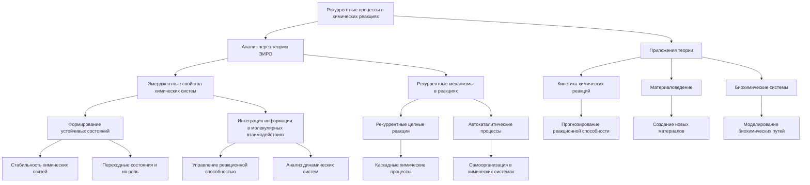

# Рекуррентные процессы в химических реакциях: анализ через призму теории эмергентной интеграции и рекуррентного отображения

---

## 1. Введение

Традиционно химические реакции рассматриваются как процессы преобразования веществ через переходы между энергетическими состояниями, взаимодействия электронных облаков и движения атомных ядер. Однако современная наука стремится понять глубинные механизмы, определяющие динамику этих процессов. В этом контексте теория эмергентной интеграции и рекуррентного отображения (ЭИРО) предлагает новую перспективу анализа химических реакций, фокусируясь на рекуррентных взаимодействиях и эмергентных свойствах сложных систем.

### 2. Рекуррентные взаимодействия в химии

Рекуррентность на электронном уровне: Включение рекуррентных процессов на уровне электронных взаимодействий может способствовать формированию устойчивых электронных конфигураций. Это объясняет стабильность некоторых молекулярных структур и их способность к самосборке.

Каталитические эффекты: Ферментативные реакции характеризуются высокой эффективностью и специфичностью. Рекуррентные взаимодействия между активными центрами ферментов и субстратами могут ускорять переходы между энергетическими состояниями, уменьшая активационный барьер и повышая скорость реакции.

### 3. Математическое описание

Модифицированные потенциальные поверхности: Для учета рекуррентных эффектов в уравнениях движения вводятся дополнительные члены:

`V(эфф) = V₀ + V(рекуррент),`

где  V₀  — исходный потенциал, а  V_(рекуррент)  отражает влияние рекуррентных взаимодействий. Эта модификация позволяет моделировать сложные динамические процессы, учитывая влияние предшествующих состояний системы.

### 4. Практические последствия

Управление реакциями: Понимание рекуррентных процессов открывает возможности для целенаправленного воздействия на химические реакции. Это может быть достигнуто путем изменения условий реакции или введения специфических реагентов, способных усиливать или подавлять рекуррентные взаимодействия.

Разработка новых катализаторов: Создание материалов с заданными рекуррентными свойствами позволит повысить эффективность промышленных процессов. Такие катализаторы могут обладать способностью к самовосстановлению и адаптации к изменяющимся условиям.

### 5. Новые научные вопросы

#### 5.1. Эмерджентные свойства химических систем: 

Как рекуррентные взаимодействия приводят к появлению новых свойств, не присущих отдельным компонентам системы? 

Исследование этих свойств может привести к открытию новых механизмов самоорганизации в химических системах.

> **Эмерджентность** относится к свойствам или поведению системы, которые не могут быть предсказаны или объяснены только на основе свойств ее отдельных компонентов. В контексте химических систем это означает, что при взаимодействии множества молекул или атомов могут возникать новые свойства, не присущие им по отдельности.

#### 5.2. Рекуррентные взаимодействия

Рекуррентные взаимодействия — это повторяющиеся или циклические процессы взаимодействия между компонентами системы. 

В химии такие взаимодействия могут приводить к сложным динамическим поведениям, таким как автокатализ, химические осцилляции и самоорганизация.

*Как рекуррентные взаимодействия приводят к появлению новых свойств?*

- **Самоорганизация**: В химических системах самоорганизация может возникать благодаря нелинейным взаимодействиям и обратным связям. Например, в реакциях Белоусова-Жаботинского наблюдаются осциллирующие цветовые изменения из-за рекуррентных химических процессов.

- **Коллективное поведение**: Когда молекулы взаимодействуют рекуррентно, они могут образовывать структуры с новым функционалом, например, мицеллы, липидные бислои или кристаллы.

- **Энергетические ландшафты**: Рекуррентные взаимодействия могут влиять на пути реакции, позволяя системе находить энергетически выгодные состояния, которые недоступны при рассмотрении отдельных молекул.

**Перспективы исследований**:

- **Поиск новых механизмов самоорганизации**: Изучение условий, при которых рекуррентные взаимодействия приводят к эмерджентности, может помочь в создании новых материалов с заданными свойствами.

- **Биомиметика**: Понимание того, как в природе возникают сложные структуры из простых компонентов, может способствовать развитию искусственных систем, имитирующих живые организмы.

- **Нанотехнологии**: Управление рекуррентными взаимодействиями на наноуровне открывает возможности для создания сложных наноструктур с уникальными физико-химическими свойствами.

#### 5.3. Влияние квантовой информации: 

Если рассматривать химические реакции на квантовом уровне, как интеграция квантовой информации и рекуррентность взаимодействий влияют на динамику системы? Это может привести к разработке новых моделей, связывающих квантовую механику и химию.

**Квантовая информация** связана с принципами суперпозиции и запутанности в квантовой механике. В химических реакциях, происходящих на квантовом уровне, учитываются не только классические взаимодействия, но и квантовые эффекты.

**Как интеграция квантовой информации и рекуррентность взаимодействий влияют на динамику системы?**

- **Квантовая когерентность**: Рекуррентные взаимодействия могут поддерживать когерентные состояния в системе, влияя на реакционную динамику и энергетические переходы.

- **Запутанность в химических реакциях**: Частицы, участвующие в реакциях, могут находиться в запутанных состояниях, что изменяет вероятности исходов реакций и может приводить к новым продуктам.

- **Информационные потоки**: Квантовая информация может распространяться через систему, влияя на корреляции между частями молекулярных систем и изменяя их поведение.

#### 5.4. Возможности разработки новых моделей:

- **Квантовая динамика реакций**: Создание моделей, учитывающих квантово-информационные эффекты, позволит точнее описывать химические процессы на фундаментальном уровне.

- **Интеграция с квантовыми вычислениями**: Использование квантовых вычислительных методов для симуляции сложных химических систем и изучения влияния квантовой информации на реакции.

- **Новые материалы и технологии**: Понимание квантово-информационных аспектов химии может привести к созданию материалов с уникальными свойствами, важными для фотоники, спинтроники и квантовых технологий.

#### 5.5. Связь с физикой пространства-времени: 

Включение понятий интегрированной информации и рекуррентности в космологические модели предлагает новые подходы к пониманию фундаментальных свойств Вселенной. Как эти концепции могут влиять на современные представления о тёмной энергии и структуре пространства-времени?

**Интегрированная информация** — это концепция, характеризующая степень связности и сложности системы. В физике она может быть использована для описания того, как информация распределена и связана в пространстве-времени.

**Как включение понятий интегрированной информации и рекуррентности в космологические модели влияет на понимание Вселенной?**

- **Структура Вселенной**: Интегрированная информация может помочь в описании крупномасштабной структуры Вселенной, объясняя, как гравитация и другие фундаментальные взаимодействия способствуют формированию галактик и скоплений.

- **Темная энергия и информация**: Возможно, что темная энергия связана с информационными свойствами пространства-времени. Рекуррентные процессы и информационные потоки могут влиять на ускоренное расширение Вселенной.

- **Квантовая гравитация**: Интеграция квантовой информации в модели гравитации может привести к новым теориям, объединяющим общий принцип относительности и квантовую механику.

#### 5.6. Влияние на современные представления:

- **Новые космологические модели**: Включение информационных концепций может изменить наше понимание происхождения Вселенной, Большого взрыва и эволюции космоса.

- **Переосмысление фундаментальных взаимодействий**: Если рассматривать фундаментальные силы через призму информации и рекуррентности, это может привести к новому взгляду на их природу и взаимосвязи.

- **Философские и методологические последствия**: Переход к информационно-ориентированным моделям ставит вопросы о том, что является первичным в описании реальности — материя или информация.

### 6. Заключение

Исследование этих вопросов требует междисциплинарного подхода, объединяющего химию, физику, информатику и философию. Углубленное понимание эмерджентных свойств, квантовой информации и их связи с фундаментальными свойствами Вселенной может привести к революционным открытиям и технологическим достижениям, изменяющим наше представление о мире.

Анализ химических реакций через призму теории эмергентной интеграции и рекуррентного отображения расширяет понимание динамики сложных систем. Исследование рекуррентных процессов открывает новые горизонты в науке, позволяя ответить на фундаментальные вопросы о природе взаимодействий и эмерджентных свойствах материи.

---

Оглавление: 
- [ЭИРО framework](/README.md)
- [Новая модель вселенной в современной физике](/A-new-model-of-the-universe-in-modern-physics.md)

