# Рекуррентные динамические системы

```mermaid
graph TD
    A[Рекуррентные нейронные сети] --> B[Применение]
    A --> C[Математическая модель]
    A --> D[Преимущества]
    A --> E[Ограничения и решения]
    A --> F[Применение в теории ЭИРО]

    C --> C1[Уравнение состояния]
    C1 --> C1a["Производная состояния dx(t) dt"]
    C1 --> C1b["Состояние сети x(t)"]
    C1 --> C1c["Входные сигналы u(t)"]
    C1 --> C1d[Матрица весов W]
    C1 --> C1e[Функция активации f]

    C --> C2[Компоненты модели]
    C2 --> C2a["Состояние сети x(t)"]
    C2 --> C2b["Входные сигналы u(t)"]
    C2 --> C2c[Матрица весов W]
    C2 --> C2d[Пример: Простая RNN]

    D --> D1[Учет временной последовательности]
    D --> D2[Моделирование нелинейных динамик]
    D --> D3[Память и контекст]

    E --> E1[Взрывающийся и затухающий градиент]
    E1 --> E1a[Проблема]
    E1 --> E1b[Решения]

    E --> E2[Требовательность к ресурсам]
    E2 --> E2a[Проблема]
    E2 --> E2b[Решения]

    F --> F1[Интеграция информации]
    F --> F2[Рекуррентное отображение]
    F --> F3[Моделирование сознательных процессов]

    B --> B1[Обработка естественного языка]
    B --> B2[Распознавание речи]
    B --> B3[Предсказание временных рядов]
    B --> B4[Другие области]

    F1 --> F1a[Объединение источников информации]
    F1 --> F1b[Повышение связности данных]

    F2 --> F2a[Обновление внутреннего состояния]
    F2 --> F2b[Адаптация к изменениям во времени]

    F3 --> F3a[Динамичность]
    F3 --> F3b[Эмергентность]
    F3 --> F3c[Интерактивность]
```

---

## 1. Уравнения состояния нейронных сетей

Рекуррентные нейронные сети (RNN) являются ключевым инструментом в моделировании последовательностей и временных зависимостей в данных. Они успешно применяются в задачах обработки естественного языка, распознавания речи, предсказания временных рядов и многих других областях.

Теория Эмергентной Интеграции и Рекуррентного Отображения (ЭИРО) рассматривает сознание и сложные когнитивные процессы как эмергентные свойства нейронных сетей с высокой степенью интеграции информации и рекуррентными связями. В этом контексте рекуррентные динамические системы становятся важным инструментом для моделирования и понимания этих явлений.

### 2. Математическая модель

Основное уравнение состояния рекуррентной нейронной сети может быть записано как:

$$\frac{d\mathbf{x}(t)}{dt} = \mathbf{f}(\mathbf{x}(t), \mathbf{u}(t), \mathbf{W})$$

где:

- $\frac{d\mathbf{x}(t)}{dt}$ — производная состояния сети по времени (скорость изменения состояния).
  
- $\mathbf{x}(t)$ — вектор состояния сети в момент времени $t$.
  
- $\mathbf{u}(t)$ — вектор внешних входных сигналов в момент времени $t$.
  
- $\mathbf{W}$ — матрица весов связей внутри сети.
  
- $\mathbf{f}$ — нелинейная функция активации, например, сигмоида, ReLU или гиперболический тангенс.

### 3. Компоненты модели

#### 3.1. Состояние сети $\mathbf{x}(t)$

- **Описание**: Вектор, содержащий активации всех нейронов сети в момент времени $t$.

- **Характеристики**:

  - Учитывает предыдущие состояния благодаря рекуррентным связям.

  - Обеспечивает хранение информации о прошлом, что позволяет модели учитывать контекст.

#### 3.2. Входные сигналы $\mathbf{u}(t)$

- **Описание**: Внешние стимулы или данные, поступающие в сеть в момент времени $t$.

- **Характеристики**:

  - Могут быть постоянными или изменяться во времени.

  - Включают сенсорные данные или выходы других моделей.

#### 3.3. Матрица весов $\mathbf{W}$

- **Состав**:

  - $W_{\text{in}}$ — веса входных связей (от входов к скрытым нейронам).

  - $W_{\text{rec}}$ — веса рекуррентных связей (между нейронами скрытого слоя).

  - $W_{\text{out}}$ — веса выходных связей (от скрытых нейронов к выходам сети).

- **Роль рекуррентных связей**:

  - Обеспечивают обратную связь внутри сети.

  - Позволяют распространять информацию о предыдущих состояниях.

#### 3.4. Пример: Простая рекуррентная сеть

**Обновление состояния скрытого слоя**:

$$ \mathbf{h}(t) = \phi\left( W_{hh} \mathbf{h}(t - 1) + W_{hx} \mathbf{x}(t) + \mathbf{b}_h \right) $$

где:

- $\mathbf{h}(t)$ — состояние скрытого слоя в момент времени $t$.

- $\mathbf{h}(t - 1)$ — состояние скрытого слоя в предыдущий момент времени.

- $\mathbf{x}(t)$ — входной вектор.

- $W_{hh}$ — матрица весов рекуррентных связей.

- $W_{hx}$ — матрица весов входных связей.

- $\mathbf{b}_h$ — вектор смещений для скрытого слоя.

- $\phi$ — функция активации (например, $\tanh$).

**Выход сети**:

$$ \mathbf{y}(t) = \psi\left( W_{yh} \mathbf{h}(t) + \mathbf{b}_y \right) $$

где:

- $\mathbf{y}(t)$ — выходной вектор в момент времени $t$.

- $W_{yh}$ — матрица весов от скрытого слоя к выходному.

- $\mathbf{b}_y$ — вектор смещений для выходного слоя.

- $\psi$ — функция активации на выходном слое (например, softmax для классификации).

### 4. Преимущества рекуррентных систем

- **Учет временной последовательности**:

  - Обработка данных, зависимых от порядка (текст, речь, видео).

  - Способность учитывать контекст и долгосрочные зависимости.

- **Моделирование нелинейных динамик**:

  - Представление сложных зависимостей в данных.

  - Отражение нелинейной природы процессов в биологических нейронных сетях.

- **Память и контекст*:

  - Сохранение информации о предыдущих состояниях.

  - Улучшение качества предсказаний за счет учета истории.

### 5. Ограничения и решение проблем

#### 5.1. Взрывающийся и затухающий градиент

- **Проблема**:

  - При обучении на длинных последовательностях градиенты могут становиться слишком маленькими (затухать) или слишком большими (взрываться), что затрудняет обучение.

- **Решения**:

  - Использование архитектур LSTM (Long Short-Term Memory) или GRU (Gated Recurrent Unit), которые контролируют потоки информации и градиенты.

  - Применение техник нормализации и регуляризации.

#### 5.2. Требовательность к вычислительным ресурсам

- **Проблема**:

  - Моделирование рекуррентных связей увеличивает вычислительную сложность.

- **Решения**:

  - Оптимизация кода и алгоритмов.

  - Использование аппаратного ускорения (GPU, TPU).

  - Применение разреженных матриц и других методов снижения вычислительной нагрузки.

### 6. Применение в теории ЭИРО

Теория Эмергентной Интеграции и Рекуррентного Отображения (ЭИРО) предполагает, что сознание и когнитивные функции являются эмергентными свойствами сложных нейронных сетей, характеризующихся высокой степенью интеграции информации и рекуррентными взаимодействиями.

#### 6.1. Интеграция информации

- **Описание**:

  - Объединение различных источников информации в целостное представление.

  - Повышение связности и согласованности обработки данных.

- **Роль в RNN**:

  - Рекуррентные связи способствуют интеграции, позволяя информации распространяться и взаимодействовать внутри сети.

  - Влияние предыдущих состояний на текущую обработку усиливает интегративные свойства сети.

#### 6.2. Рекуррентное отображение

- **Описание**:

  - Постоянное обновление внутреннего состояния сети на основе новых входов и прошлых состояний.

  - Возможность отражать динамическую природу когнитивных процессов.

- **Роль в RNN**:

  - Обеспечивает способность сети адаптироваться к изменениям во времени.

  - Позволяет моделировать циклические и повторяющиеся процессы, характерные для мышления и сознания.

#### 6.3. Моделирование сознательных процессов

- **Преимущества RNN в контексте ЭИРО**:

  - Динамичность: Способность моделировать временные изменения и последовательности событий.

  - Эмергентность: Сложные паттерны активности возникают из взаимодействия простых элементов.

  - Интерактивность: Взаимодействие множества нейронов приводит к новым свойствам системы.

- **Применения**:

  - Исследование нейронных коррелятов сознания.

  - Моделирование процессов внимания, памяти и восприятия.

  - Анализ влияния рекуррентных связей на когнитивные функции.

### 7. Заключение

Рекуррентные динамические системы являются мощным инструментом для моделирования и понимания сложных процессов в нейронных сетях. В контексте теории Эмергентной Интеграции и Рекуррентного Отображения (ЭИРО) они позволяют исследовать механизмы, лежащие в основе сознания и когнитивных функций. Понимание и применение этих моделей способствует развитию нейронауки и искусственного интеллекта, открывая новые возможности для создания интеллектуальных систем.

---

Оглавление: 
- [ЭИРО framework](/README.md)
- [Справочник формул](/formulas.md)

