# Рекуррентная интеграция в распространении заболеваний

```mermaid
graph TD
    A[Рекуррентная интеграция в эпидемиях] --> B[Эпидемии как угроза]
    B --> C[Социальные структуры и динамика]
    C --> D[Рекуррентные контакты]
    A --> E[Гипотеза]
    E --> F[Рекуррентные взаимодействия → эмерджентные паттерны]
    A --> G[Обзор литературы]
    G --> H[Классические модели SIR]
    G --> I[Сетевые модели инфекций]
    G --> J[Эмерджентные свойства]
    G --> K[Интеграция информации]
    A --> L[Методология]
    L --> M[Сетевые модели]
    M --> N[Динамические сети контактов]
    M --> O[Повторные взаимодействия]
    M --> P[Учет истории контактов]
    L --> Q[Агент-ориентированные модели]
    Q --> R[Память о контактах]
    L --> S[Параметры моделей]
    S --> T["Рекуррентность (R)"]
    S --> U["Интеграция информации (I)"]
    S --> V["Параметры SIR (β, γ)"]
    A --> W[Результаты]
    W --> X[Влияние рекуррентности]
    W --> Y[Эмерджентные паттерны]
    W --> Z[Роль интеграции информации]
    A --> AA[Обсуждение]
    AA --> AB[Сравнение с эмпирическими данными]
    AA --> AC[Импликации для контроля]
    AA --> AD[Ограничения исследования]
    A --> AE[Заключение]
    AE --> AF[Рекуррентность как ключевой фактор]
    AE --> AG[Эмерджентные паттерны и контроль]
```

---

## Аннотация

В данной работе исследуется гипотеза о том, что распространение инфекционных заболеваний является результатом рекуррентных взаимодействий между носителями, где интеграция информации о контактах и состоянии системы приводит к эмерджентным эпидемическим паттернам. Через анализ эпидемиологических моделей и сетевых методов показано, что рекуррентные контакты и динамика социальных связей играют ключевую роль в формировании и распространении эпидемий. Работа опирается на авторитетные научные источники, включая труды Андерсона и Мэя (1991), а также Килинга и Рохани (2008), для подкрепления теоретических и эмпирических выводов.

### 1. Введение

Эпидемии инфекционных заболеваний остаются одной из главных угроз общественному здоровью. Традиционные модели распространения инфекций основаны на предположении о случайных контактах между индивидами (Anderson  May, 1991). Однако современные исследования показывают, что социальные структуры и рекуррентные взаимодействия между людьми существенно влияют на динамику эпидемий (Keeling  Eames, 2005). Понимание того, как рекуррентная интеграция информации о контактах способствует эмерджентному поведению эпидемий, является критически важным для разработки эффективных мер контроля.

### 2. Гипотеза

Распространение инфекционных заболеваний является результатом рекуррентных взаимодействий между носителями, где интеграция информации о контактах и состоянии системы приводит к эмерджентным эпидемическим паттернам.

### 3. Обзор литературы

#### 3.1. Классические эпидемиологические модели

Модели SIR (восприимчивые, инфицированные, выздоровевшие) и их вариации являются основой для понимания динамики инфекционных заболеваний (Anderson  May, 1991). Эти модели предполагают однородное смешение популяции и не учитывают сложные социальные структуры и рекуррентные контакты.

#### 3.2. Сетевые модели распространения заболеваний

Сетевые подходы учитывают структуру социальных контактов и позволяют моделировать распространение инфекции по сложным сетям (Keeling  Rohani, 2008). Рекуррентные контакты, то есть повторяющиеся взаимодействия между одними и теми же индивидами, могут значительно влиять на динамику эпидемий (House  Keeling, 2011).

#### 3.3. Эмерджентные свойства и рекуррентность

Эмерджентные свойства систем возникают из взаимодействий между компонентами и не могут быть предсказаны на основе свойств отдельных элементов (Goldstone  Gureckis, 2009). В контексте эпидемиологии, рекуррентные взаимодействия могут приводить к непредсказуемым эпидемическим паттернам, таким как внезапные вспышки или устойчивые эндемические состояния.

#### 3.4. Интеграция информации о контактах

Интеграция данных о социальных связях, мобильности и поведении является важным направлением в эпидемиологии (Balcan et al., 2009). Использование больших данных и технологий отслеживания контактов позволяет более точно моделировать распространение инфекции и учитывать рекуррентность взаимодействий.

### 4. Методология

#### 4.1. Моделирование с учетом рекуррентных контактов

Для исследования гипотезы используются сетевые модели, в которых узлы представляют отдельных индивидов, а ребра — контакты между ними. Модель включает:

- Динамическую сеть контактов, где связи могут возникать, исчезать и повторно возникать.

- Рекуррентные взаимодействия, моделируемые через повышенную вероятность повторного контакта между одними и теми же индивидами.

- Интеграцию информации, учитывающую историю контактов и состояние инфицированности узлов.

#### 4.2. Использование агент-ориентированных моделей

Агент-ориентированные модели позволяют имитировать поведение отдельных индивидов и их взаимодействия (Epstein, 2009). В данной работе агенты обладают памятью о предыдущих контактах, что способствует рекуррентным взаимодействиям.

#### 4.3. Параметры модели

- Степень рекуррентности (R): вероятность того, что следующий контакт будет с уже знакомым индивидуумом.

- Интегрированная информация о контактах (I): мера того, насколько агенты учитывают историю своих контактов при выборе взаимодействий.

- Коэффициент передачи инфекции (β) и восстановления (γ), как в классических SIR моделях.

### 5. Результаты

#### 5.1. Влияние рекуррентности на распространение инфекции

Моделирование показало, что при высокой степени рекуррентности (высокие значения R) скорость распространения инфекции снижается по сравнению с моделями со случайными контактами. Это связано с тем, что инфекция "запирается" в кластерах связанных индивидов, ограничивая ее распространение на всю популяцию.

#### 5.2. Эмерджентные эпидемические паттерны

При определенных значениях параметров наблюдаются сложные эпидемические паттерны, такие как:

- Множественные пиковые вспышки, связанные с периодическим восстановлением рекуррентных контактов.

- Устойчивые эндемические состояния, где инфекция сохраняется в популяции из-за непрерывных рекуррентных взаимодействий.

#### 5.3. Роль интеграции информации

Когда агенты интегрируют информацию о состоянии своих контактов (например, избегают инфицированных), распространение инфекции существенно замедляется. Однако при частичной или неточной информации могут возникать неожиданные вспышки из-за ложного чувства безопасности.

### 6. Обсуждение

#### 6.1. Сравнение с эмпирическими данными

Результаты моделирования согласуются с наблюдениями реальных эпидемий, где социальная структура и повторяющиеся контакты влияют на динамику распространения (Mossong et al., 2008). Например, семьи, рабочие коллективы и школы являются примерами сообществ с высокой рекуррентностью контактов.

#### 6.2. Импликации для мер контроля

Понимание роли рекуррентных взаимодействий позволяет разрабатывать более эффективные меры контроля, такие как:

- Таргетированная вакцинация в кластерах с высокой рекуррентностью.

- Информационные кампании, способствующие осознанному изменению поведения и уменьшению рискованных контактов.

#### 6.3. Ограничения исследования

- Спространенные модели могут не учитывать всю сложность человеческого поведения.

- Данные о контактах часто ограничены и могут быть неточными, что затрудняет валидацию моделей.

### 7. Заключение

Исследование подтверждает гипотезу о том, что рекуррентные взаимодействия между носителями и интеграция информации о контактах являются ключевыми факторами в распространении инфекционных заболеваний. Эмерджентные эпидемические паттерны возникают из сложных динамических взаимодействий в социальных сетях. Учет этих факторов в эпидемиологических моделях и стратегиях вмешательства может существенно повысить эффективность мер по контролю и предотвращению эпидемий.

### 8. Список литературы

1. Anderson, R. M.,  May, R. M. (1991). *Infectious Diseases of Humans: Dynamics and Control*. Oxford University Press.

2. Keeling, M. J.,  Rohani, P. (2008). *Modeling Infectious Diseases in Humans and Animals*. Princeton University Press.

3. Keeling, M. J.,  Eames, K. T. D. (2005). Networks and epidemic models. *Journal of the Royal Society Interface*, 2(4), 295-307.

4. House, T.,  Keeling, M. J. (2011). Insights from unifying modern approaches to infections spread modelling. *Proceedings of the Royal Society B: Biological Sciences*, 278(1722), 1221-1230.

5. Goldstone, R. L.,  Gureckis, T. M. (2009). Collective behavior. *Topics in Cognitive Science*, 1(3), 412-438.

6. Balcan, D., Colizza, V., Gonçalves, B., Hu, H., Ramasco, J. J.,  Vespignani, A. (2009). Multiscale mobility networks and the spatial spreading of infectious diseases. *Proceedings of the National Academy of Sciences*, 106(51), 21484-21489.

7. Epstein, J. M. (2009). Modelling to contain pandemics. *Nature*, 460(7256), 687.

8. Mossong, J., et al. (2008). Social contacts and mixing patterns relevant to the spread of infectious diseases. *PLoS Medicine*, 5(3), e74.

---

Примечание: Данная работа опирается на авторитетные научные источники и современные исследования в области эпидемиологии и математического моделирования инфекционных заболеваний. Представленные результаты призваны способствовать более глубокому пониманию динамики эпидемий и развитию эффективных стратегий их контроля.

---

- [ЭИРО framework](/README.md)
