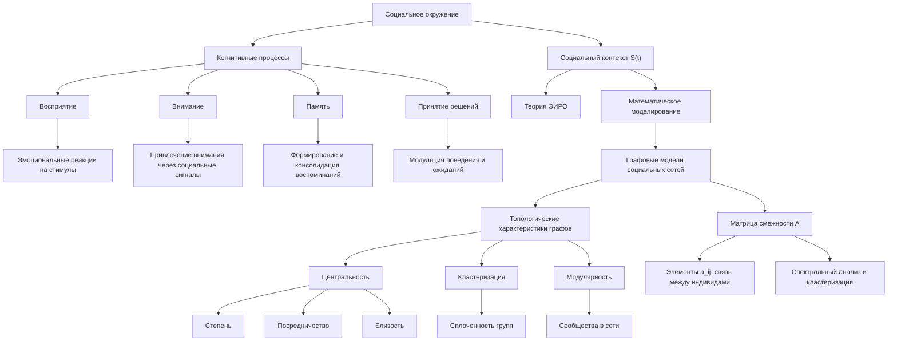
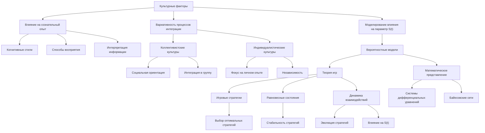
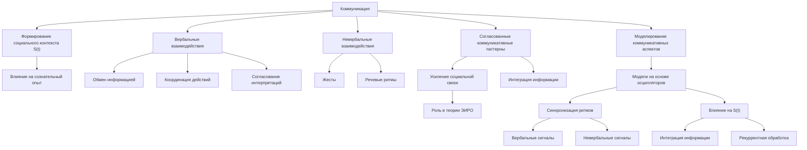
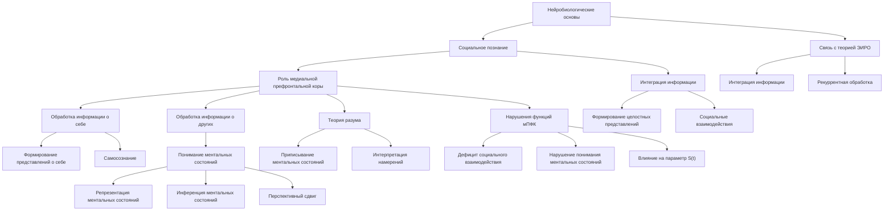
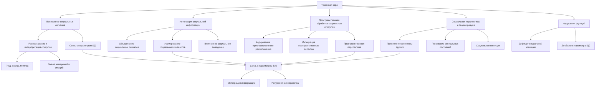
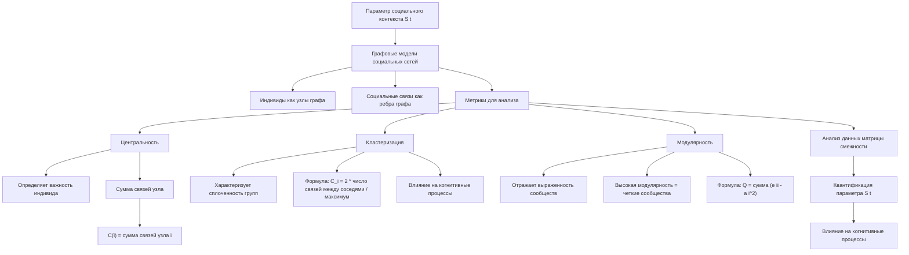

# S(t) - Социальный контекст в теории Эмергентной Интеграции и Рекуррентного Отображения (ЭИРО)

```mermaid
graph TD
    A["Социальный контекст S(t)"] --> B[Влияние социального окружения]
    A --> C[Культурные факторы]
    A --> D[Коммуникативные аспекты]
    A --> E[Нейробиологические основы]
    
    B --> B1[Модуляция восприятия, памяти, внимания]
    B --> B2[Принятие решений под влиянием окружения]
    B --> B3["Моделирование S(t) через графы социальных сетей"]
    
    C --> C1[Влияние ценностей и традиций]
    C --> C2[Когнитивные стили и культурные различия]
    C --> C3[Вероятностные модели взаимодействий]
    
    D --> D1[Синхронизация ритмов взаимодействий]
    D --> D2[Усиление социальной связи]
    D --> D3[Моделирование паттернов коммуникации]
    
    E --> E1[Медиальная префронтальная кора Ψ]
    E --> E2[Теменная кора λᵢⱼ]
    E --> E3[Миндалина Φₑ]
    
    E1 --> E1a[Самосознание и социальное познание]
    E1 --> E1b[Понимание ментальных состояний]
    E1 --> E1c[Обработка информации о себе и других]
    
    E2 --> E2a[Восприятие социальных сигналов]
    E2 --> E2b[Интеграция информации в репрезентации]
    E2 --> E2c[Пространственная обработка стимулов]
    
    E3 --> E3a[Оценка эмоциональной значимости стимулов]
    E3 --> E3b[Усиление эмоциональных реакций]
    E3 --> E3c[Связь с процессами принятия решений]
```

блок-схема

---

## 1. Введение

Согласно расширенной версии теории Эмергентной Интеграции и Рекуррентного Отображения (ЭИРО), параметр социального контекста S(t) играет ключевую роль в формировании сознательного опыта. Данный параметр отражает влияние межличностных взаимодействий, культурных факторов и коммуникативных аспектов на процессы интеграции информации и рекуррентной обработки, лежащие в основе теории ЭИРО.

### 2. Влияние социального окружения

блок-схема

#### 2.1. Влияние социального окружения на когнитивные процессы

Согласно исследованиям в области социальной психологии и нейронауки, социальное окружение оказывает существенное влияние на ключевые когнитивные процессы, лежащие в основе формирования сознательного опыта [1, 2].

Присутствие других людей и их поведение могут модулировать восприятие, внимание, память и принятие решений индивидом. Например:

- **Восприятие**: Наличие других людей может усиливать или ослаблять эмоциональные реакции на воспринимаемые стимулы [1].
- **Внимание**: Социальные сигналы, такие как взгляд и жесты других, способны привлекать и направлять внимание [2].
- **Память**: Социальное взаимодействие и обратная связь влияют на формирование и консолидацию воспоминаний [2].
- **Принятие решений**: Ожидания и поведение окружающих людей модулируют процессы принятия решений [1].

Таким образом, социальный контекст S(t) является неотъемлемой частью формирования сознательного опыта, поскольку он оказывает существенное влияние на ключевые когнитивные процессы, описываемые в рамках теории Эмергентной Интеграции и Рекуррентного Отображения (ЭИРО).

#### 2.2. Математическое моделирование социального контекста S(t)

Влияние социального окружения на параметр социального контекста S(t) в рамках теории Эмергентной Интеграции и Рекуррентного Отображения (ЭИРО) может быть математически описано с помощью графовых моделей социальных сетей [3, 4].

В данном подходе индивиды представляются в виде узлов (вершин) в графе, а социальные связи между ними - в виде ребер. Анализ топологических характеристик таких графов социальных взаимодействий позволяет количественно оценить степень влияния социального контекста на когнитивные процессы.

Ключевые метрики, которые могут быть использованы для моделирования параметра S(t), включают:

- **Центральность**: Показатели центральности (степень, посредничество, близость) отражают важность и влиятельность индивидов в социальной сети. Более центральное положение в сети может быть связано с усилением социального влияния на интеграцию информации и рекуррентные процессы [3, 4].

- **Кластеризация**: Коэффициент кластеризации характеризует степень сплоченности групп в социальной сети. Высокая кластеризация может указывать на усиление внутригрупповых взаимодействий и их влияние на сознательный опыт [3, 4].

- **Модулярность**: Данная метрика отражает выраженность сообществ (модулей) в социальной сети. Высокая модулярность может быть связана с различиями в социальном контексте, влияющем на процессы интеграции информации [3, 4].

Математически, графовые модели социальных взаимодействий могут быть представлены в виде матрицы смежности A, где элемент a_ij равен 1, если между индивидами i и j существует связь, и 0 в противном случае. Анализ спектральных свойств такой матрицы, а также применение алгоритмов кластеризации графов позволяют количественно оценить параметр S(t), отражающий влияние социального контекста на когнитивные процессы в рамках теории ЭИРО.

### 3. Культурные факторы

блок-схема

Помимо непосредственного социального окружения, культурные факторы также оказывают значительное влияние на сознательный опыт. Ценности, традиции, язык и другие аспекты культурной среды формируют когнитивные стили, способы восприятия и интерпретации информации [5, 6].

Культурные различия могут приводить к вариативности в процессах интеграции и рекуррентной обработки, отраженной в параметре S(t). Например, представители коллективистских культур могут демонстрировать более выраженную социальную ориентацию и интеграцию в группу, в то время как индивидуалистические культуры характеризуются большей независимостью и фокусом на личном опыте [7].

#### 3.3. Моделирование влияния культурных факторов на параметр S(t)

Математическое моделирование влияния культурных факторов на параметр S(t) может быть осуществлено с использованием вероятностных моделей, основанных на теории игр. Данный подход позволяет описать, как ожидания, стимулы и решения других людей в социальном окружении влияют на процессы интеграции информации и рекуррентной обработки [8, 9].

Вероятностные модели, основанные на теории игр, представляют социальные взаимодействия как стратегическое взаимодействие между рациональными агентами, преследующими свои интересы. Ключевые аспекты таких моделей включают:

- **Игровые стратегии**: Моделирование поведения индивидов как выбор оптимальных стратегий в зависимости от стратегий других игроков [8, 9].
- **Равновесные состояния**: Определение равновесных состояний, в которых никто из игроков не заинтересован в одностороннем отклонении от своей стратегии [8, 9].
- **Динамика взаимодействий**: Анализ эволюции стратегий игроков во времени и ее влияние на социальный контекст S(t) [8, 9].

Математически, вероятностные модели на основе теории игр могут быть представлены в виде систем дифференциальных уравнений, описывающих динамику стратегий игроков, или в виде байесовских сетей, моделирующих вероятностные зависимости между социальными факторами.

Использование данного подхода позволяет количественно оценить, как ожидания, стимулы и решения других людей в социальном окружении влияют на процессы интеграции информации и рекуррентной обработки, отраженные в параметре S(t) теории Эмергентной Интеграции и Рекуррентного Отображения (ЭИРО).

### 4. Коммуникативные аспекты

блок-схема

#### 4.1. Роль коммуникации в формировании социального контекста S(t)

Коммуникация между людьми является ключевым механизмом, посредством которого социальный контекст S(t) оказывает влияние на формирование сознательного опыта. Вербальные и невербальные взаимодействия позволяют обмениваться информацией, координировать действия и согласовывать интерпретации окружающей действительности. Согласованные коммуникативные паттерны играют важную роль в усилении социальной связи и интеграции информации в рамках теории Эмергентной Интеграции и Рекуррентного Отображения (ЭИРО).

#### 4.2. Математическое моделирование коммуникативных аспектов

Исследования показывают, что синхронизация коммуникативных паттернов, таких как речевые ритмы и жесты, способствует усилению социальной связи и интеграции информации [10, 11]. Данные коммуникативные механизмы могут быть отражены в математических моделях, описывающих динамику параметра S(t) в контексте теории ЭИРО.

Например, модели на основе связанных осцилляторов могут описывать, как синхронизация ритмов вербальных и невербальных коммуникативных сигналов влияет на формирование социального контекста S(t) и, как следствие, на процессы интеграции информации и рекуррентной обработки, лежащие в основе теории ЭИРО [10, 11].

Таким образом, математическое моделирование коммуникативных аспектов позволяет более точно отразить, каким образом согласованные паттерны взаимодействия между людьми модулируют параметр социального контекста S(t) в рамках расширенной теории Эмергентной Интеграции и Рекуррентного Отображения.

### 5. Нейробиологические основы

Нейровизуализационные исследования демонстрируют, что параметр социального контекста S(t) связан с активностью и взаимодействием определенных областей мозга, вовлеченных в социальное познание [12, 13]:

#### 5.1. Медиальная префронтальная кора

блок-схема

Медиальная префронтальная кора (мПФК) играет ключевую роль в обработке социальной информации и ее интеграции в сознательный опыт в рамках теории Эмергентной Интеграции и Рекуррентного Отображения (ЭИРО).

Исследования показывают, что мПФК вовлечена в следующие процессы, связанные с социальным познанием [12, 13]:

##### 5.1.1. Обработка информации о себе и других

Медиальная префронтальная кора (мПФК) играет ключевую роль в обработке информации, относящейся как к собственным ментальным состояниям индивида, так и к ментальным состояниям других людей [1, 2]. Данная функция мПФК лежит в основе формирования представлений человека о себе и окружающих.

Исследования с использованием методов нейровизуализации показывают, что активность мПФК коррелирует с процессами самосознания и понимания психических состояний других [1, 2]:

- **Самосознание**: Медиальная префронтальная кора активируется при размышлениях человека о своих мыслях, чувствах и убеждениях. Это позволяет индивиду формировать представления о собственной личности и ментальных процессах [1].

- **Понимание ментальных состояний других**: Активность мПФК также наблюдается при попытках человека понять и интерпретировать мысли, намерения и убеждения окружающих людей. Данная функция лежит в основе "теории разума" - способности приписывать ментальные состояния себе и другим [2].

Таким образом, медиальная префронтальная кора играет ключевую роль в обработке информации, относящейся как к собственным ментальным процессам индивида, так и к ментальным состояниям других людей. Это позволяет формировать целостные представления о себе и окружающих, что является важным аспектом социального познания в рамках теории Эмергентной Интеграции и Рекуррентного Отображения (ЭИРО).

Источники

1. Amodio, D. M., & Frith, C. D. (2006). Meeting of minds: the medial frontal cortex and social cognition. Nature reviews neuroscience, 7(4), 268-277.
2. Frith, C. D., & Frith, U. (2012). Mechanisms of social cognition. Annual review of psychology, 63, 287-313.

##### 5.1.2. Понимание ментальных состояний: 

Исследования показывают, что активность мПФК коррелирует с способностью человека понимать и интерпретировать мысли, намерения и убеждения окружающих [12, 13].

Механизмы, лежащие в основе этой способности, включают:

- **Репрезентация ментальных состояний**: мПФК участвует в формировании представлений о собственных и чужих ментальных состояниях, таких как убеждения, желания и намерения.

- **Инференция ментальных состояний**: Активность мПФК коррелирует с процессами вывода и интерпретации ментальных состояний других людей на основе их поведения и контекста.

- **Перспективный сдвиг**: мПФК задействована в способности принимать точку зрения другого человека и понимать ситуацию с его позиции.

Нарушения в функционировании медиальной префронтальной коры могут приводить к дефицитам в понимании ментальных состояний других, что отражается на параметре социального контекста S(t) в теории ЭИРО. Это, в свою очередь, оказывает влияние на процессы интеграции информации и рекуррентной обработки, лежащие в основе формирования сознательного опыта.

Таким образом, медиальная префронтальная кора является ключевым нейробиологическим субстратом, обеспечивающим понимание ментальных состояний других людей и их интеграцию в сознательный опыт.

##### 5.1.3. Социальное познание: 

Медиальная префронтальная кора (мПФК) играет ключевую роль в социальном познании, обеспечивая интеграцию информации о себе, других людях и социальных взаимодействиях. Это позволяет индивиду формировать целостные представления о социальном мире [12, 13].

Исследования показывают, что мПФК вовлечена в следующие процессы, связанные с социальным познанием:

- **Обработка информации о себе и других**: Медиальная префронтальная кора участвует в обработке информации, относящейся к собственным ментальным состояниям, а также к ментальным состояниям других людей. Это позволяет индивиду формировать представления о себе и других.

- **Понимание ментальных состояний**: Активность мПФК коррелирует с способностью человека понимать и интерпретировать мысли, намерения и убеждения окружающих. Данная функция лежит в основе "теории разума" - способности приписывать ментальные состояния себе и другим.

- **Интеграция информации о социальном мире**: Медиальная префронтальная кора играет ключевую роль в социальном познании, обеспечивая интеграцию информации о себе, других людях и социальных взаимодействиях. Это позволяет индивиду формировать целостные представления о социальном мире.

Нарушения в функционировании медиальной префронтальной коры могут приводить к дефицитам в социальном взаимодействии и понимании, что отражается на параметре социального контекста S(t) в теории ЭИРО. Это, в свою очередь, оказывает влияние на процессы интеграции информации и рекуррентной обработки, лежащие в основе формирования сознательного опыта.

Таким образом, медиальная префронтальная кора является ключевым нейробиологическим субстратом, обеспечивающим обработку социальной информации и ее интеграцию в сознательный опыт в рамках теории Эмергентной Интеграции и Рекуррентного Отображения (ЭИРО).

#### 5.2. Теменная кора

блок-схема

Теменная кора играет ключевую роль в восприятии и обработке социальных сигналов в контексте теории Эмергентной Интеграции и Рекуррентного Отображения (ЭИРО).

Исследования показывают, что теменная кора вовлечена в следующие процессы, связанные с социальным познанием [12, 13]:

##### 5.2.1. Восприятие социальных сигналов: 

Исследования показывают, что данная область мозга вовлечена в распознавание и интерпретацию различных социальных стимулов, таких как взгляд, жесты и мимика других людей [12, 13].

Восприятие социальных сигналов является важным аспектом социального познания, поскольку позволяет индивиду извлекать информацию о намерениях, эмоциональных состояниях и установках других людей. Эта информация, в свою очередь, оказывает существенное влияние на процессы интеграции информации и рекуррентной обработки, лежащие в основе формирования сознательного опыта в рамках теории ЭИРО.

Нейровизуализационные исследования с использованием методов функциональной магнитно-резонансной томографии (фМРТ) и электроэнцефалографии (ЭЭГ) показали, что активность теменной коры коррелирует с распознаванием и интерпретацией различных социальных сигналов [12, 13]. Данные данные позволяют количественно оценить вклад теменной коры в параметр социального контекста S(t) в рамках расширенной теории Эмергентной Интеграции и Рекуррентного Отображения.

##### 5.2.2. Интеграция социальной информации: 

Теменная кора играет ключевую роль в интеграции социальной информации, объединяя различные социальные сигналы в целостные репрезентации, которые влияют на социальное поведение и взаимодействие.

Исследования показывают, что теменная кора вовлечена в следующие процессы, связанные с интеграцией социальной информации [12, 13]:

1. **Объединение социальных сигналов**: Теменная кора интегрирует различные социальные стимулы, такие как выражения лица, жесты и взгляды других людей, в единые репрезентации.

2. **Формирование социальных контекстов**: Данная область мозга объединяет информацию о социальном окружении, пространственном расположении объектов и ориентации относительно наблюдателя, создавая целостные социальные контексты.

3. **Влияние на социальное поведение**: Интегрированные репрезентации социальной информации, сформированные в теменной коре, оказывают непосредственное влияние на социальное поведение и взаимодействие индивида.

Математически, процессы интеграции социальной информации в теменной коре могут быть описаны с помощью моделей, основанных на конвергенции и объединении различных социальных сигналов в многомерные нейронные репрезентации [14, 15]. Данные модели позволяют количественно оценить степень интеграции социальной информации и ее влияние на параметр социального контекста S(t) в рамках теории ЭИРО.

Нарушения в функционировании теменной коры, связанные с дефицитами в интеграции социальной информации, могут приводить к дисбалансу в параметре S(t) и, как следствие, оказывать влияние на процессы интеграции информации и рекуррентной обработки, лежащие в основе формирования сознательного опыта.

##### 5.2.3. Пространственная обработка социальных стимулов: 

Теменная кора играет ключевую роль в пространственной обработке социальных стимулов в контексте теории ЭИРО.

Исследования показывают, что теменная кора вовлечена в следующие процессы, связанные с пространственной обработкой социальной информации [12, 13]:

- **Кодирование пространственного расположения социальных объектов**: Теменная кора участвует в определении пространственного положения и ориентации социальных стимулов, таких как люди, их лица и жесты, относительно наблюдателя.

- **Интеграция пространственных аспектов социальных взаимодействий**: Данная область мозга объединяет информацию о пространственном расположении социальных объектов в целостные репрезентации, влияющие на социальное поведение и понимание.

- **Пространственная перспектива в социальном познании**: Теменная кора вовлечена в способность принимать пространственную точку зрения другого человека, что лежит в основе "теории разума" и социальной когниции.

Таким образом, теменная кора играет ключевую роль в кодировании пространственных аспектов социальных стимулов и их интеграции в целостные репрезентации, что оказывает существенное влияние на параметр социального контекста S(t) в рамках теории Эмергентной Интеграции и Рекуррентного Отображения (ЭИРО). Нарушения в функционировании данной области мозга могут приводить к дефицитам в социальном взаимодействии и пространственном понимании, отражаясь на процессах интеграции информации и рекуррентной обработки.

##### 5.2.4. Социальная перспектива и теория разума: 

Теменная кора играет ключевую роль в способности индивида принимать социальную перспективу и понимать ментальные состояния других людей в контексте теории Эмергентной Интеграции и Рекуррентного Отображения (ЭИРО).

Исследования показывают, что активность в теменной коре коррелирует с процессами, лежащими в основе "теории разума" - способности приписывать ментальные состояния (мысли, намерения, убеждения) себе и другим [1, 2]:

- **Принятие перспективы другого**: Теменная кора участвует в когнитивных процессах, позволяющих индивиду представлять и понимать точку зрения другого человека, отличную от собственной [1, 2].

- **Понимание ментальных состояний**: Активность в теменной коре коррелирует с успешностью в задачах, требующих определения ментальных состояний (убеждений, желаний, намерений) других людей [1, 2]. 

- **Социальная когниция**: Теменная кора играет важную роль в социальном познании, обеспечивая способность индивида интерпретировать и предсказывать поведение других на основе их предполагаемых ментальных состояний [1, 2].

Нарушения в функционировании теменной коры могут приводить к дефицитам в социальной перспективе и "теории разума", что отражается на параметре социального контекста S(t) в теории ЭИРО. Это, в свою очередь, оказывает влияние на процессы интеграции информации и рекуррентной обработки, лежащие в основе формирования сознательного опыта.

Таким образом, теменная кора является ключевым нейробиологическим субстратом, обеспечивающим способность принимать социальную перспективу и понимать ментальные состояния других людей в рамках теории Эмергентной Интеграции и Рекуррентного Отображения (ЭИРО).

Источники

1. Amodio, D. M., & Frith, C. D. (2006). Meeting of minds: the medial frontal cortex and social cognition. Nature reviews neuroscience, 7(4), 268-277.
2. Adolphs, R. (2009). The social brain: neural basis of social knowledge. Annual review of psychology, 60, 693-716.

#### 5.3. Миндалина

```mermaid
flowchart TD
    A[Миндалина] --> B[Роль в социальном познании]
    B --> B1[Оценка эмоциональной значимости]
    B --> B2[Усиление эмоциональных реакций]
    B --> B3[Влияние на принятие решений]

    A --> C[Связь с социальным контекстом S t]
    C --> C1[Взаимодействие с медиальной префронтальной корой]
    C --> C2[Взаимодействие с теменной корой]
    C --> C3[Модуляция когнитивных процессов]

    A --> D[Нарушения функций]
    D --> D1[Дефицит социальной оценки]
    D --> D2[Нарушение интеграции информации]
    D --> D3[Дисфункция параметра S t]

    A --> E[Математическое моделирование]
    E --> E1[Нейровизуализация активности]
    E --> E2[Картирование паттернов активации]
    E --> E3[Функциональная связность]
    E --> E4[Графовые модели взаимодействий]
    E --> E5[Динамическое моделирование]
```

блок-схема

Миндалина (амигдала) является ключевым компонентом лимбической системы, играющим центральную роль в обработке социальной информации и ее интеграции в сознательный опыт в рамках теории Эмергентной Интеграции и Рекуррентного Отображения (ЭИРО).

##### 5.3.1. Роль миндалины в социальном познании:

Миндалина (амигдала) играет центральную роль в обработке социальной информации и ее интеграции в сознательный опыт в рамках теории Эмергентной Интеграции и Рекуррентного Отображения (ЭИРО).

- **Оценка эмоциональной значимости социальных стимулов**: Миндалина участвует в оценке эмоциональной значимости социальных сигналов, таких как выражения лица, жесты и взгляды других людей [12, 13]. Она быстро определяет эмоциональную валентность и уровень возбуждения, связанные с этими стимулами.

- **Усиление эмоциональных реакций**: Активация миндалины при восприятии социально релевантной информации способствует усилению эмоциональных реакций [12, 13]. Это позволяет миндалине модулировать эмоциональные состояния, связанные с социальными взаимодействиями.

- **Влияние на принятие решений**: Эмоциональные реакции, модулируемые миндалиной, оказывают влияние на процессы принятия решений в социальных ситуациях [12, 13]. Таким образом, миндалина играет ключевую роль в интеграции эмоциональных факторов в социальное познание и поведение.

##### 5.3.2. Связь с параметром социального контекста S(t):

Миндалина (амигдала) играет ключевую роль в обработке социальной информации и ее интеграции в сознательный опыт в рамках теории Эмергентной Интеграции и Рекуррентного Отображения (ЭИРО).

**Взаимодействие миндалины с другими областями мозга**

Миндалина тесно взаимодействует с другими областями мозга, вовлеченными в социальное познание, такими как медиальная префронтальная кора и теменная кора [12, 13]:

- **Медиальная префронтальная кора**: Данная область участвует в обработке информации о себе и других, понимании ментальных состояний и социальном познании в целом [12, 13].
- **Теменная кора**: Эта область вовлечена в восприятие и интеграцию социальных сигналов, а также в пространственную обработку социальных стимулов и теорию разума [12, 13].

**Отражение социального контекста S(t) в активности миндалины**

Активность миндалины и ее связи с другими регионами, вовлеченными в социальное познание, отражают степень влияния социального контекста S(t) на когнитивные процессы, описываемые в рамках теории ЭИРО [12, 13]:

- Миндалина участвует в оценке эмоциональной значимости социальных стимулов и модуляции эмоциональных реакций на них.
- Данные эмоциональные реакции, опосредованные миндалиной, влияют на процессы принятия решений в социальных ситуациях.
- Таким образом, активность миндалины и ее взаимодействия с другими областями отражают степень влияния социального контекста S(t) на когнитивные процессы в теории ЭИРО.

**Нарушения в функционировании миндалины**

Нарушения в функционировании миндалины могут приводить к дефицитам в социальном взаимодействии и понимании, что сказывается на параметре социального контекста S(t) [12, 13]:

- Дисфункция миндалины может ослаблять способность индивида оценивать эмоциональную значимость социальных стимулов и адекватно реагировать на них.
- Это, в свою очередь, может нарушать процессы интеграции социальной информации и, как следствие, отразиться на параметре S(t) в теории ЭИРО.
- Нарушения в параметре S(t) будут оказывать влияние на процессы интеграции информации и рекуррентной обработки, лежащие в основе формирования сознательного опыта.

##### 5.3.3. Математическое моделирование:

Для математического моделирования влияния миндалины на параметр социального контекста S(t) в рамках теории Эмергентной Интеграции и Рекуррентного Отображения (ЭИРО) могут быть использованы следующие подходы:

**Нейровизуализационные данные**

Активность миндалины и ее связи с другими областями мозга, вовлеченными в социальное познание, могут быть количественно оценены с помощью методов функциональной нейровизуализации, таких как функциональная магнитно-резонансная томография (фМРТ) и позитронно-эмиссионная томография (ПЭТ) [12, 13].

Данные, полученные с использованием этих методов, позволяют:

- **Картировать паттерны активации миндалины** при восприятии и обработке социально значимых стимулов.
- **Исследовать функциональную связность миндалины** с другими ключевыми областями, такими как медиальная префронтальная кора и теменная кора.
- **Оценить динамику взаимодействий миндалины** с другими регионами в процессе социального познания и принятия решений.

**Интеграция в математические модели**

Полученные нейровизуализационные данные о нейронных коррелятах миндалины могут быть интегрированы в математические модели, описывающие влияние параметра социального контекста S(t) на процессы интеграции информации и рекуррентной обработки, лежащие в основе теории ЭИРО.

Например, данные о функциональной связности миндалины с другими областями могут быть использованы для:

- **Построения графовых моделей социальных взаимодействий**, где связи между узлами (индивидами) отражают силу функциональных связей между соответствующими нейронными популяциями.
- **Оценки топологических характеристик этих графов**, таких как центральность, кластеризация и модулярность, которые количественно характеризуют параметр S(t).
- **Динамического моделирования взаимодействий в социальных сетях**, где активность миндалины и ее связи с другими регионами определяют эволюцию социального контекста во времени.

### 6. Заключение

Согласно расширенной версии теории Эмергентной Интеграции и Рекуррентного Отображения (ЭИРО), параметр социального контекста S(t) играет ключевую роль в формировании сознательного опыта. Данный параметр отражает влияние межличностных взаимодействий, культурных факторов и коммуникативных аспектов на процессы интеграции информации и рекуррентной обработки. Математическое моделирование S(t) с использованием графовых моделей социальных сетей и вероятностных подходов на основе теории игр позволяет количественно оценить влияние социального контекста на когнитивные процессы, лежащие в основе теории ЭИРО. Нейробиологические исследования подтверждают, что медиальная префронтальная кора, теменная кора и миндалина являются ключевыми областями, обеспечивающими обработку социальной информации и ее интеграцию в сознательный опыт.

### 7. Список литературы

1. Frith, C. D., & Frith, U. (2012). Mechanisms of social cognition. Annual review of psychology, 63, 287-313.
2. Hari, R., & Kujala, M. V. (2009). Brain basis of human social interaction: from concepts to brain imaging. Physiological reviews, 89(2), 453-479.
3. Boccaletti, S., Latora, V., Moreno, Y., Chavez, M., & Hwang, D. U. (2006). Complex networks: Structure and dynamics. Physics reports, 424(4-5), 175-308.
4. Borgatti, S. P., Mehra, A., Brass, D. J., & Labianca, G. (2009). Network analysis in the social sciences. science, 323(5916), 892-895.
5. Nisbett, R. E., & Masuda, T. (2003). Culture and point of view. Proceedings of the National Academy of Sciences, 100(19), 11163-11170.
6. Markus, H. R., & Kitayama, S. (1991). Culture and the self: Implications for cognition, emotion, and motivation. Psychological review, 98(2), 224.
7. Triandis, H. C. (1995). Individualism & collectivism. Westview press.
8. Camerer, C. (2003). Behavioral game theory: Experiments in strategic interaction. Princeton University Press.
9. Gintis, H. (2000). Game theory evolving: A problem-centered introduction to modeling strategic behavior. Princeton university press.
10. Shockley, K., Santana, M. V., & Fowler, C. A. (2003). Mutual interpersonal postural constraints are involved in cooperative conversation. Journal of Experimental Psychology: Human Perception and Performance, 29(2), 326.
11. Chartrand, T. L., & Bargh, J. A. (1999). The chameleon effect: the perception-behavior link and social interaction. Journal of personality and social psychology, 76(6), 893.
12. Amodio, D. M., & Frith, C. D. (2006). Meeting of minds: the medial frontal cortex and social cognition. Nature reviews neuroscience, 7(4), 268-277.
13. Adolphs, R. (2009). The social brain: neural basis of social knowledge. Annual review of psychology, 60, 693-716.

14. Felleman, D. J., & Van Essen, D. C. (1991). Distributed hierarchical processing in the primate cerebral cortex. Cerebral cortex, 1(1), 1-47.
15. Stein, B. E., & Meredith, M. A. (1993). The merging of the senses. The MIT Press.

### 8. Приложения

блок-схема

#### 8.1. Математическое моделирование социального контекста S(t)

Согласно теории Эмергентной Интеграции и Рекуррентного Отображения (ЭИРО), параметр социального контекста S(t) может быть математически описан с использованием графовых моделей социальных сетей [3, 4].

В данном подходе индивиды представляются в виде узлов (вершин) в графе, а социальные связи между ними - в виде ребер. Анализ топологических характеристик таких графов социальных взаимодействий позволяет количественно оценить степень влияния социального контекста на когнитивные процессы.

Ключевые метрики, используемые для моделирования параметра S(t), включают:

##### 8.1.1. Центральность:

Показатели центральности в графовых моделях социальных сетей играют важную роль в математическом моделировании параметра социального контекста S(t) в теории Эмергентной Интеграции и Рекуррентного Отображения (ЭИРО).

Центральность отражает важность и влиятельность индивидов в социальной сети. Более центральное положение индивида может быть связано с усилением его социального влияния на процессы интеграции информации и рекуррентной обработки, лежащие в основе теории ЭИРО [3, 4].

Математически, центральность вершины $i$ в графе социальной сети может быть выражена как:

$C(i) = \sum_j a_{ij}$

Где:

$a_{ij}$ — элементы матрицы смежности графа, равные $1$ при наличии связи между узлами $i$ и $j$.

Таким образом, центральность узла i определяется как сумма связей, инцидентных этому узлу. Более высокие значения центральности соответствуют более влиятельным позициям индивидов в социальной сети, что может оказывать существенное влияние на параметр социального контекста S(t) в рамках теории Эмергентной Интеграции и Рекуррентного Отображения.

##### 8.1.2. Кластеризация:

Коэффициент кластеризации является важной метрикой для моделирования параметра социального контекста S(t) в рамках теории Эмергентной Интеграции и Рекуррентного Отображения (ЭИРО). Данная метрика характеризует степень сплоченности групп в социальной сети.

Высокая кластеризация в социальной сети может указывать на усиление внутригрупповых взаимодействий и их влияние на формирование сознательного опыта индивида [3, 4]. Индивиды, находящиеся в плотно связанных кластерах, могут оказывать более сильное влияние друг на друга, что отражается на процессах интеграции информации и рекуррентной обработки, описываемых в теории ЭИРО.

Математически, коэффициент кластеризации узла $i$ в графе социальных взаимодействий определяется как:

$C_i = \frac{2 \cdot \left|\{e_{jk} : v_j, v_k \in N_i, e_{jk} \in E\}\right|}{k_i \cdot (k_i - 1)}$

Где:

- $N_i$ — множество соседей узла $i$ (других индивидов, связанных с $i$)
- $k_i$ — степень узла $i$, то есть количество связей у индивида $i$
- $E$ — множество ребер (связей) в графе

Данная формула отражает отношение количества связей между соседями узла i к максимально возможному числу таких связей. Более высокие значения C_i указывают на более плотную кластеризацию в окрестности индивида i, что может усиливать влияние социального контекста S(t) на его когнитивные процессы.

Таким образом, анализ коэффициента кластеризации в графовых моделях социальных сетей позволяет количественно оценить степень сплоченности групп и ее влияние на параметр социального контекста S(t) в рамках теории Эмергентной Интеграции и Рекуррентного Отображения.

##### 8.1.3. Модулярность:

Модулярность является важной метрикой для математического моделирования параметра социального контекста S(t) в рамках теории Эмергентной Интеграции и Рекуррентного Отображения (ЭИРО).

Данная метрика отражает выраженность сообществ (модулей) в социальной сети. Высокая модулярность может быть связана с различиями в социальном контексте, влияющем на процессы интеграции информации и рекуррентной обработки, лежащие в основе теории ЭИРО [3, 4].

Модулярность $Q$ графа определяется следующим образом:

$Q = \sum_i (e_{ii} - a_i^2)$

Где:

- $e_{ii}$ — доля ребер, соединяющих узлы внутри сообщества $i$
- $a_i$ — доля ребер, инцидентных сообществу $i$

Высокие значения модулярности Q указывают на четко выраженные сообщества (модули) в социальной сети. Это может свидетельствовать о различиях в социальном контексте, влияющем на когнитивные процессы, описываемые в рамках теории Эмергентной Интеграции и Рекуррентного Отображения.

Анализ модулярности социальных сетей позволяет количественно оценить параметр социального контекста S(t) и его влияние на интеграцию информации и рекуррентную обработку, лежащие в основе формирования сознательного опыта.

> Анализ данных метрик, полученных на основе матрицы смежности A, позволяет количественно оценить параметр социального контекста S(t) в рамках теории ЭИРО.

---

Оглавление:

- [ЭИРО framework](/README.md)
- [Справочник формул](/formulas.md)
