# Статистическая интерпретация термодинамики

```mermaid
graph TD
    A[ЭИРО framework] --> B[Интеграция информации и рекуррентные процессы]
    B --> C[Эмерджентная информация Ψ]
    B --> D[Рекуррентность и циклические взаимодействия]
    C --> E[Формула: Φₑ = ∫ I⋅Rdt]
    D --> F[Параметр рекуррентности R]
    A --> G[Термодинамика и статистическая механика]
    G --> H[Энтропия: S = k_B ln W]
    G --> I[Энтропия Шеннона: H = Σᵢ pᵢ ln pᵢ]
    G --> J[Связь физической и информационной энтропии]
    A --> K[Информационные параметры в термодинамике]
    K --> L[Плотность информации ρIQI]
    K --> M[Модифицированная энтропия Sэфф = k_B ln W - λΦₑ]
    A --> N[Статистическая механика через ЭИРО]
    N --> O["Распределение вероятностей pᵢ = e^(-βEᵢ γΦₑ)/Z"]
    N --> P["Модифицированная статистическая сумма Z = Σ e^(-βEᵢ γΦₑ)"]
    A --> Q[Применение к космологии]
    Q --> R[Термодинамика вселенной]
    R --> S[Энтропия и эмерджентная информация]
    Q --> T[Тёмная энергия и ρIQI]
    Q --> U[Модифицированные уравнения Эйнштейна]
    U --> V["Дополнительный вклад Tμν(Φₑ)"]
    A --> W[Экспериментальные подтверждения]
    W --> X[Исследования квантовых систем]
    W --> Y[Космологические наблюдения]
    W --> Z[Термодинамика черных дыр]
```

---

## ЭИРО framework

В данной работе исследуется влияние информационных параметров на фундаментальные принципы термодинамики и статистической механики в контексте Теории Эмергентной Интеграции и Рекуррентного Отображения (ЭИРО). Показано, что введение эмерджентной информации и рекуррентных процессов может пересмотреть традиционные представления об энтропии и ее связи с информацией. Подкреплено теоретическими выводами и ссылками на современные научные исследования в области термодинамики, статистической механики и теории информации.

### 1. Введение

Термодинамика и статистическая механика являются фундаментальными областями физики, описывающими поведение макроскопических систем на основе микроскопических свойств. Энтропия, как мера беспорядка и неопределенности, играет ключевую роль в этих теориях. Однако с развитием теории информации возникла возможность переосмыслить понятие энтропии через призму информационных процессов [1].

Теория Эмергентной Интеграции и Рекуррентного Отображения (ЭИРО) предлагает новый подход к пониманию системных свойств, основанный на интеграции информации и рекуррентных взаимодействиях в сложных системах. В данной работе рассматривается статистическая интерпретация термодинамики с учетом ЭИРО и возможных последствий для нашей модели вселенной.

### 2. Теоретическая основа

#### 2.1. Термодинамика и статистическая механика

Статистическая механика связывает макроскопические термодинамические величины с микроскопическими состояниями системы. Энтропия в статистической механике определяется через число микросостояний  W  системы:

`S = k_B ln W,`

где  S  — энтропия,  k_B  — постоянная Больцмана [2].

#### 2.2. Теория информации и энтропия Шеннона

Энтропия в теории информации характеризует неопределенность или среднее количество информации, необходимое для описания состояния системы:

`H = - ∑ᵢ pᵢ ln pᵢ,`

где  pᵢ  — вероятность  i -го состояния [3].

#### 2.3. Связь энтропии и информации

Лео Бриллэн в своей работе «Наука и теория информации» показал, что физическая энтропия и информационная энтропия связаны и могут быть взаимно интерпретированы [4]. Это открывает возможность рассматривать термодинамические процессы с точки зрения информационных изменений.

### 3. Теория Эмергентной Интеграции и Рекуррентного Отображения (ЭИРО)

#### 3.1. Понятие эмерджентной информации

Эмерджентная информация  Φₑ  характеризует возникновение новых свойств системы, не присущих ее отдельным частям, через интеграцию и рекуррентные взаимодействия:

`Φₑ = ∫₀^(t₁) I_(интеграции)(t) ⋅ R_(рекуррентности)(t)dt,`

где  I(интеграции)(t)  — степень интеграции информации,  R(рекуррентности)(t)  — степень рекуррентных взаимодействий [5].

#### 3.2. Рекуррентные процессы в системах

Рекуррентность предполагает наличие обратных связей и циклических взаимодействий в системе. Такие процессы способствуют интеграции информации и возникновению сложного поведения [6].

### 4. Введение информационных параметров в термодинамику

#### 4.1. Плотность интегрированной информации

Предлагается ввести плотность интегрированной информации  ρ_(IQI) , характеризующую количество информации, интегрированной в единице объема:

`ρ_(IQI) = lim(Δ V → 0) Δ I / Δ V,`

где  Δ I  — изменение интегрированной информации в объеме  Δ V .

#### 4.2. Параметр рекуррентности

Параметр рекуррентности  R  отражает степень рекуррентных взаимодействий в системе и может быть связан с вероятностью повторных взаимодействий между компонентами системы.

#### 4.3. Энтропия и информация

С учетом эмерджентной информации предлагаем модифицированное выражение для энтропии:

`S_(эфф) = k_B ln W - λ Φₑ,`

где  λ  — коэффициент, характеризующий вклад эмерджентной информации в энтропию.

### 5. Влияние на фундаментальные принципы термодинамики

#### 5.1. Первое начало термодинамики

Введение информационных параметров не нарушает закон сохранения энергии, однако может влиять на распределение энергии между различными формами, учитывая информационные процессы.

#### 5.2. Второе начало термодинамики

Классическое второе начало утверждает, что энтропия замкнутой системы не убывает. Однако с учетом эмерджентной информации возможно локальное уменьшение энтропии за счет информационных процессов, компенсируемое увеличением энтропии в окружающей среде [7].

#### 5.3. Флуктуации и рекуррентность

Рекуррентные процессы могут усиливать флуктуации в системе, влияя на ее термодинамическое поведение. Это соответствует представлениям о роли флуктуаций в фазовых переходах и критических явлениях [8].

### 6. Статистическая механика через призму ЭИРО

#### 6.1. Распределение вероятностей

С учетом эмерджентной информации распределение вероятностей микросостояний может быть скорректировано:

`pᵢ = e⁽-β Eᵢ + γ Φ₍e,i)) / Z,`

где  Eᵢ  — энергия состояния,  β = 1/(k_B T) ,  γ  — параметр, характеризующий влияние Φₑ,  Z  — статистическая сумма.

#### 6.2. Модифицированная статистическая сумма

Новая статистическая сумма учитывает вклад эмерджентной информации:

`Z = ∑ᵢ e^(-β Eᵢ + γ Φ_(e,i)).`

#### 6.3. Следствия для физических систем

Такая модификация может привести к изменениям в теплоемкостях, скоростях реакций и других термодинамических параметрах систем с высокой степенью интеграции информации.

### 7. Применение к космологии и модели вселенной

#### 7.1. Термодинамика вселенной

Энтропия вселенной постоянно растет, что соответствует второму началу термодинамики. Однако наличие эмерджентных информационных процессов в космических масштабах может влиять на динамику расширения вселенной [9].

#### 7.2. Тёмная энергия и информация

Предполагается, что тёмная энергия может быть связана с информационными процессами в пространстве-времени. Введение  ρ_(IQI)  и  R  в космологические уравнения может объяснить ускоренное расширение вселенной без введения дополнительных полей [10].

#### 7.3. Модифицированные уравнения Эйнштейна

С учетом информационных параметров уравнения могут быть записаны как:

`G_(μν) + Λ g_(μν) = 8π G (( T_(μν) + T_(μν)^((Φₑ)) )),`

где  T_(μν)^((Φₑ))  отражает вклад эмерджентной информации [11].

### 8. Доказательства и экспериментальные подтверждения

#### 8.1. Экспериментальные исследования

Работы по изучению информационных свойств квантовых систем показывают, что информация играет существенную роль в термодинамических процессах на микроскопическом уровне [12].

#### 8.2. Космологические наблюдения

Последние данные по космическому микроволновому фону и распределению галактик согласуются с моделями, учитывающими дополнительные информационные параметры [13].

#### 8.3. Термодинамика черных дыр

Известно, что энтропия черных дыр пропорциональна площади их горизонта событий, что указывает на глубокую связь между геометрией пространства-времени и информацией [14].

### 9. Заключение

Введение информационных параметров в термодинамику и статистическую механику через призму ЭИРО открывает новые перспективы в понимании фундаментальных физических процессов. Эмерджентная информация и рекуррентные взаимодействия могут существенно влиять на энтропию и термодинамические свойства систем, включая космологические масштабы. Дальнейшие исследования в этом направлении могут привести к пересмотру традиционных представлений и развитию новых физических теорий.

### 10. Список литературы

1. Shannon, C. E. (1948). A mathematical theory of communication. *Bell System Technical Journal*, 27(3), 379–423.

2. Boltzmann, L. (1877). Über die Beziehung zwischen dem zweiten Hauptsatze der mechanischen Wärmetheorie und der Wahrscheinlichkeitsrechnung. *Wiener Berichte*, 76, 373–435.

3. Jaynes, E. T. (1957). Information theory and statistical mechanics. *Physical Review*, 106(4), 620–630.

4. Brillouin, L. (1956). *Science and Information Theory*. Academic Press.

5. Tononi, G. (2004). An information integration theory of consciousness. *BMC Neuroscience*, 5, 42.

6. Kandel, E. R., Schwartz, J. H.,  Jessell, T. M. (2000). *Principles of Neural Science*. McGraw-Hill.

7. Landauer, R. (1961). Irreversibility and heat generation in the computing process. *IBM Journal of Research and Development*, 5(3), 183–191.

8. Stanley, H. E. (1971). *Introduction to Phase Transitions and Critical Phenomena*. Oxford University Press.

9. Prigogine, I. (1980). *From Being to Becoming: Time and Complexity in the Physical Sciences*. W. H. Freeman.

10. Padmanabhan, T. (2005). Dark energy: mystery of the millennium. *AIP Conference Proceedings*, 861(1), 179–196.

11. Verlinde, E. (2011). On the origin of gravity and the laws of Newton. *Journal of High Energy Physics*, 2011(4), 29.

12. Vedral, V. (2002). The role of relative entropy in quantum information theory. *Reviews of Modern Physics*, 74(1), 197–234.

13. Planck Collaboration. (2016). Planck 2015 results. XIII. Cosmological parameters. *Astronomy  Astrophysics*, 594, A13.

14. Bekenstein, J. D. (1973). Black holes and entropy. *Physical Review D*, 7(8), 2333–2346.

---

Оглавление:

- [ЭИРО framework](/README.md)
- [Справочник формул](/formulas.md)

