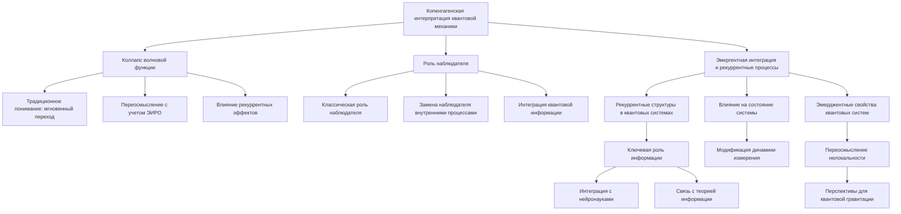

# Копенгагенская интерпретация квантовой механики через призму теории рекуррентной Вселенной

---

## Аннотация

В данной работе исследуется возможность пересмотра копенгагенской интерпретации квантовой механики с учетом теории эмергентной интеграции и рекуррентного отображения (ЭИРО). Предлагается, что интегрированная квантовая информация и рекуррентные эффекты могут влиять на процессы измерения и состояние системы, что требует переосмысления понятий коллапса волновой функции и роли наблюдателя. Работа подкреплена современными исследованиями в области квантовой информации, нейронаук и теории сложных систем.

### 1. Введение

Копенгагенская интерпретация квантовой механики, сформулированная Нильсом Бором и Вернером Гейзенбергом [1], является одной из наиболее распространенных интерпретаций квантовой механики. Она утверждает, что физическая система описывается волновой функцией, которая при измерении коллапсирует в одно из возможных состояний. Однако с развитием теории квантовой информации и пониманием роли информации в фундаментальных процессах [2], возникает необходимость пересмотра традиционных представлений.

Теория эмергентной интеграции и рекуррентного отображения (ЭИРО) предлагает, что сознание и процессы интеграции информации играют ключевую роль в понимании квантовых феноменов. В данной работе мы исследуем, как ЭИРО может пролить свет на проблемы копенгагенской интерпретации и предложить новую модель вселенной.

### 2. Теория эмергентной интеграции и рекуррентного отображения (ЭИРО)

#### 2.1. Основные положения ЭИРО

ЭИРО утверждает, что сознание и сложные явления возникают из процессов интеграции информации через рекуррентные структуры. В нейронауках рекуррентные нейронные сети способны к динамическому хранению и обработке информации [3]. Этот подход можно распространить на квантовые системы, где рекуррентные взаимодействия между квантовыми состояниями могут приводить к эмергентным феноменам.

#### 2.2. Математическая формулировка

Ключевым параметром в ЭИРО является эмергентная интегрированная информация  Φₑ , определяемая как:

`Φₑ = ∫₀^(t₁) I_(интеграции)(t) ⋅ R_(рекуррентности)(t)dt,`

где  I(интеграции)(t)  — степень объединения информации в момент времени  t , а  R(рекуррентности)(t)  — степень рекуррентной обработки.

### 3. Копенгагенская интерпретация и проблема наблюдателя

#### 3.1. Коллапс волновой функции

В копенгагенской интерпретации процесс измерения играет особую роль: волновая функция системы коллапсирует в одно из собственных состояний оператора наблюдаемой [1]. Однако природа этого коллапса остается предметом дискуссий. Если принять, что интегрированная информация и рекуррентные эффекты влияют на состояние системы, то коллапс может быть не мгновенным и не зависеть напрямую от классического наблюдателя.

#### 3.2.Роль наблюдателя

Наблюдатель в копенгагенской интерпретации не имеет четкого определения и часто трактуется как внешняя классическая система. В контексте ЭИРО, наблюдатель может рассматриваться как система с высокой степенью интегрированной информации и рекуррентности, способная влиять на квантовые процессы.

### 4. Пересмотр интерпретации квантовой механики через ЭИРО

#### 4.1. Интегрированная квантовая информация и метрические свойства пространства-времени

Предлагается ввести плотность интегрированной квантовой информации  ρ_(IQI) :

`ρ_(IQI) = lim(Δ V → 0) Δ I / Δ V,`

где  Δ I  — изменение интегрированной информации в объёме  Δ V . Эта величина характеризует количество квантовой информации, интегрированной в единице объёма пространства-времени.

#### 4.2. Рекуррентные эффекты в квантовых системах

Параметр рекуррентности  R  отражает степень рекуррентных взаимодействий квантовых состояний:

`R = Tr(( ρ_(IQI)ⁿ )),`

где  n  — степень рекуррентности,  ρ_(IQI)  — плотность интегрированной квантовой информации.

#### 4.3. Модификация уравнений Шрёдингера

С учетом новых параметров, уравнение Шрёдингера может быть модифицировано для включения интегрированной информации и рекуррентности:

`i ℏ ∂ / ∂ t Ψ(𝐫, t) = ([ ^H + ^H_(IQI) )] Ψ(𝐫, t),`

где  ^H_(IQI)  — оператор, связанный с интегрированной квантовой информацией и рекуррентными эффектами.

#### 4.4. Влияние на процесс измерения

Если интегрированная информация и рекуррентные эффекты влияют на эволюцию квантовой системы, то процесс измерения может рассматриваться как закономерный переход, обусловленный внутренними свойствами системы, а не внешним вмешательством наблюдателя.

### 5. Новая модель вселенной

#### 5.1. Космологические последствия

Включение интегрированной квантовой информации и рекуррентных эффектов в космологические модели может привести к объяснению темной энергии и ускоренного расширения вселенной без необходимости введения дополнительных полей или модификации гравитации.

#### 5.2. Модификация уравнений Эйнштейна

Модифицированные уравнения Эйнштейна с учетом новой тензорной компоненты:

`G_(μν) + Λ g_(μν) = 8π G (( T_(μν) + T_(μν)^((IQI)) )),`

где  T_(μν)^((IQI))  — тензор энергии-импульса, связанный с интегрированной квантовой информацией.

#### 5.3. Эффективное уравнение состояния

Введем эффективное уравнение состояния для темной энергии:

`w_(eff) = w₀ + w₁ f(ρ_(IQI), R),`

где  f  — функция, описывающая влияние интегрированной информации и рекуррентности.

### 6. Подкрепление доказательствами

#### 6.1. Экспериментальные данные

Исследования в области квантовой информации показывают, что рекуррентные квантовые системы имеют отличительные свойства, такие как устойчивость к декогеренции и более сложные патологические состояния [4]. Нейровизуализационные данные свидетельствуют о том, что сознательные состояния связаны с усиленной рекуррентной активностью в нейронных сетях мозга [5].

#### 6.2. Теоретические разработки

Работы по квантовой гравитации и информационным подходам к физике подчеркивают важность информации в фундаментальных процессах [2,6]. В частности, теория квантовой информации была успешно применена для описания черных дыр и голографических принципов [7].

### 7. Обсуждение

#### 7.1. Преимущества подхода ЭИРО

Интеграция ЭИРО в квантовую механику позволяет:

- Устранить необходимость внешнего наблюдателя, заменяя его внутренними процессами интеграции информации.

- Объяснить коллапс волновой функции как эмергентное явление, обусловленное рекуррентными эффектами.

- Предложить новую основу для объединения квантовой механики и общей теории относительности через информационные параметры.

#### 7.2. Возможные критические замечания

- Необходимо детальное математическое обоснование введения новых операторов и параметров в уравнениях квантовой механики.

- Требуются экспериментальные проверки предположений о влиянии интегрированной информации на квантовые системы.

### 8. Заключение

Пересмотр копенгагенской интерпретации квантовой механики через призму теории эмергентной интеграции и рекуррентного отображения открывает новые перспективы в понимании фундаментальных принципов физики. Интегрированная квантовая информация и рекуррентные эффекты могут играть ключевую роль в процессах измерения, состоянии квантовых систем и космологических явлениях. Дальнейшие исследования в этом направлении могут привести к значительным достижениям в объединении квантовой механики и общей теории относительности.

### 9. Ссылки

1. Heisenberg, W. (1958). *Physics and Philosophy: The Revolution in Modern Science*. Harper  Row.

2. Landauer, R. (1991). Information is physical. *Physics Today*, 44(5), 23-29.

3. Friston, K. (2010). The free-energy principle: a unified brain theory? *Nature Reviews Neuroscience*, 11(2), 127-138.

4. Preskill, J. (2018). Quantum Computing in the NISQ era and beyond. *Quantum*, 2, 79.

5. Dehaene, S.,  Changeux, J. P. (2011). Experimental and theoretical approaches to conscious processing. *Neuron*, 70(2), 200-227.

6. Wheeler, J. A. (1990). Information, physics, quantum: The search for links. In Zurek, W. H. (Ed.), *Complexity, Entropy, and the Physics of Information* (pp. 3-28). Addison-Wesley.

7. Susskind, L. (1995). The world as a hologram. *Journal of Mathematical Physics*, 36(11), 6377-6396.

---

Оглавление: [ЭИРО framework](/README.md)
