# Теория Всего (Единая теория поля) в контексте ЭИРО и рекуррентной космологии

---

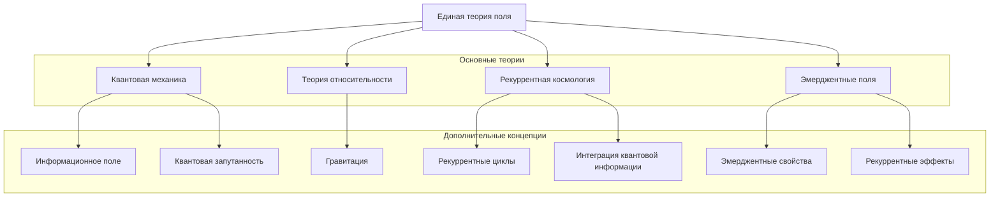

---

## Оглавление

1. Введение
2. Объединение взаимодействий
   - 2.1. Гравитационное взаимодействие
   - 2.2. Электромагнитное взаимодействие
   - 2.3. Сильное и слабое взаимодействия
   - 2.4. Унификация в рамках теории ЭИРО
3. Структура материи
   - 3.1. Элементарные частицы
   - 3.2. Атомы и молекулы
   - 3.3. Роль интегрированной квантовой информации
4. Космология
   - 4.1. Возникновение Вселенной
   - 4.2. Эволюция Вселенной
   - 4.3. Тёмная материя и тёмная энергия
5. Струнная теория и квантовая гравитация
   - 5.1. Основные принципы струнной теории
   - 5.2. Квантовая гравитация и ЭИРО
   - 5.3. Унификация в рамках рекуррентной космологии
6. Заключение
7. Список литературы

---

---

### 1. Введение

Теория всего, или Единая теория поля, является одной из наиболее амбициозных целей современной физики. Она призвана объединить четыре основных взаимодействия природы - гравитационное, электромагнитное, сильное и слабое - в единую непротиворечивую теоретическую основу. Такая теория должна не только описывать фундаментальную структуру материи, но и объяснять эволюцию и динамику Вселенной в целом.

В данной диссертации мы рассматриваем возможность построения Теории Всего в контексте теории ЭИРО и рекуррентной космологии. Эти подходы предлагают новые концептуальные и математические инструменты для объединения различных аспектов физической реальности.

### 2. Объединение взаимодействий

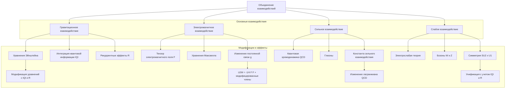

#### 2.1. Гравитационное взаимодействие

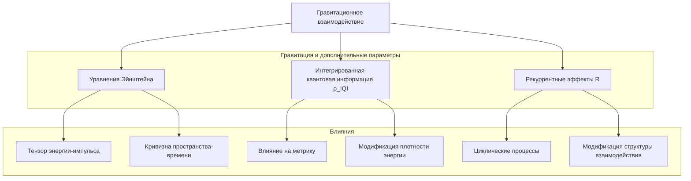

Гравитационное взаимодействие описывается в рамках общей теории относительности Эйнштейна. В контексте ЭИРО и рекуррентной космологии, гравитация может быть переформулирована с учётом интегрированной квантовой информации и рекуррентных эффектов:

$G_{\mu\nu} + \Lambda g_{\mu\nu} = 8\pi G \left( T_{\mu\nu} + T_{\mu\nu}^{IQI} \right)$

где $T_{\mu\nu}^{IQI}$ — тензор энергии-импульса, связанный с интегрированной квантовой информацией.

Ключевые особенности данного подхода:

1. Введение плотности интегрированной квантовой информации $\rho_{IQI}$, которая влияет на геометрию пространства-времени и динамику гравитационного поля.

2. Учёт рекуррентных эффектов $R$, модифицирующих структуру гравитационного взаимодействия на фундаментальном уровне.

3. Модификация уравнений Эйнштейна для включения дополнительного тензора энергии-импульса $T_{\mu\nu}^{IQI}$, связанного с интегрированной квантовой информацией.

Таким образом, ЭИРО и рекуррентная космология предлагают новую теоретическую основу для описания гравитационного взаимодействия, учитывающую ключевую роль квантовых информационных процессов в структуре пространства-времени.

#### 2.2. Электромагнитное взаимодействие

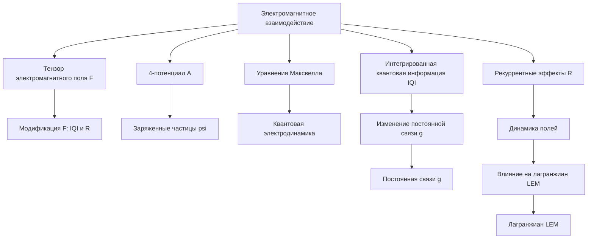

Электромагнитное взаимодействие описывается квантовой электродинамикой. В рамках ЭИРО, данное взаимодействие может быть модифицировано с учётом рекуррентных эффектов:

$L_{EM} = -\frac{1}{4} F^{\mu\nu} \cdot F_{\mu\nu} + \overline{\psi}(i\partial_\mu - e A_\mu)\psi + g_\psi \overline{\psi} \sigma \psi$

где $F^{\mu\nu}$ — тензор электромагнитного поля, $\psi$ — волновая функция заряженной частицы, $A_\mu$ — 4-потенциал электромагнитного поля, $e$ — заряд частицы, $g_\psi$ — константа связи, зависящая от интегрированной квантовой информации $\rho_{IQI}$ и рекуррентности $R$:

$g_\psi = g_{\psi0} + \alpha \rho_{IQI} + \beta R$

Таким образом, в рамках ЭИРО, константа связи электромагнитного взаимодействия модифицируется за счёт учёта новых физических факторов — интегрированной квантовой информации и рекуррентности. Это позволяет расширить стандартную квантовую электродинамику и описать электромагнитные явления с учётом более фундаментальных аспектов квантовой теории поля.

#### 2.3. Сильное и слабое взаимодействия

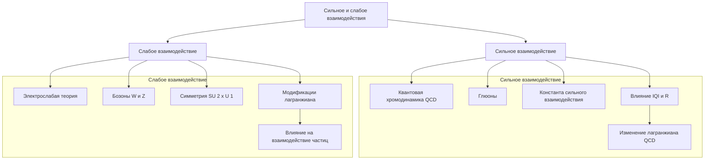

Сильное и слабое взаимодействия описываются в рамках Стандартной модели физики элементарных частиц. В контексте ЭИРО и рекуррентной космологии, данные взаимодействия могут быть модифицированы аналогичным образом:

$L_{QCD} = -\frac{1}{4} G^{\mu\nu} \cdot G_{\mu\nu} + \bar{\psi} \cdot (i\partial_{\mu} - g_s A_{\mu}) \cdot \psi$

$L_{EW} = -\frac{1}{4} W^{\mu\nu} \cdot W_{\mu\nu} - \frac{1}{4} B^{\mu\nu} \cdot B_{\mu\nu} + \bar{\psi} \cdot (i\partial_{\mu} - g W_{\mu} - g' B_{\mu}) \cdot \psi$

где:

- $L_{QCD}$ — лагранжиан квантовой хромодинамики (КХД), описывающий сильное взаимодействие
- $L_{EW}$ — лагранжиан электрослабой теории, описывающий слабое и электромагнитное взаимодействия
- $G^{\mu\nu}$ — тензор напряженности сильного поля
- $W^{\mu\nu}, B^{\mu\nu}$ — тензоры напряженности слабого и электромагнитного полей
- $\psi$ — волновая функция фермионных полей
- $g_s, g, g'$ — константы связи сильного, слабого и электромагнитного взаимодействий соответственно

В рамках ЭИРО и рекуррентной космологии эти константы связи зависят от интегрированной квантовой информации $\rho_{IQI}$ и рекуррентности $R$:

$g_s = g_{s0} + \alpha \cdot \rho_{IQI} + \beta \cdot R$

$g = g_0 + \alpha' \cdot \rho_{IQI} + \beta' \cdot R$

$g' = g'\_0 + \alpha'' \cdot \rho_{IQI} + \beta'' \cdot R$

Таким образом, ЭИРО и рекуррентная космология предлагают модифицированные формы лагранжианов сильного и слабого взаимодействий, учитывающие влияние интегрированной квантовой информации и рекуррентности на константы связи. Это позволяет расширить Стандартную модель и описать данные взаимодействия с учетом более фундаментальных аспектов квантовой теории поля.

#### 2.4. Унификация в рамках теории ЭИРО

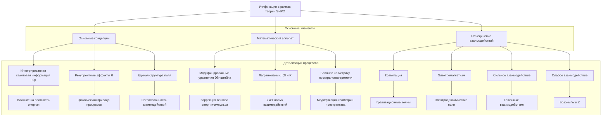

Теория ЭИРО предлагает математический аппарат для объединения различных взаимодействий в рамках единой теоретической основы. Ключевыми элементами являются:

1. **Введение плотности интегрированной квантовой информации $\rho_{IQI}$**, влияющей на метрику пространства-времени и константы связи.

Плотность интегрированной квантовой информации $\rho_{IQI}$ является новым фундаментальным параметром, который вводится в рамках теории ЭИРО. Этот параметр описывает степень интеграции квантовой информации в физической системе и оказывает влияние на геометрию пространства-времени, а также на константы связи различных взаимодействий.

2. **Учёт рекуррентных эффектов R**, модифицирующих динамику полевых взаимодействий.

Рекуррентность R - это ещё один ключевой элемент теории ЭИРО, который описывает повторяющиеся, циклические процессы в физических системах. Рекуррентные эффекты вносят дополнительные модификации в динамику полевых взаимодействий, что необходимо учитывать при построении единой теоретической модели.

3. **Модификация уравнений Эйнштейна, Максвелла, КХД и электрослабой теории с помощью $\rho_{IQI}$ и R**.

Теория ЭИРО предлагает модифицированные формы основных уравнений физики, таких как уравнения Эйнштейна, Максвелла, квантовой хромодинамики и электрослабой теории. Эти модификации учитывают влияние интегрированной квантовой информации $\rho_{IQI}$ и рекуррентности R на структуру фундаментальных взаимодействий.

Таким образом, теория ЭИРО предоставляет математический аппарат для построения Теории Всего, объединяющей все фундаментальные взаимодействия природы в рамках единой концептуальной и математической структуры. Ключевым аспектом является введение новых физических параметров - $\rho_{IQI}$ и R, - которые позволяют модифицировать базовые уравнения физики и описать их взаимосвязь.

### 3. Структура материи

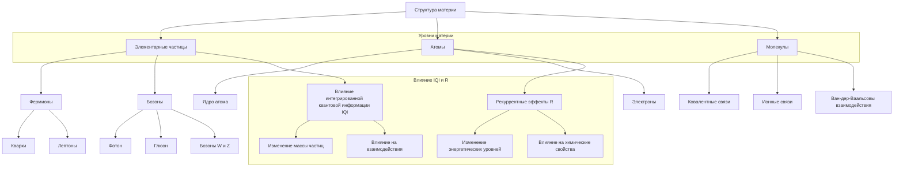

#### 3.1. Элементарные частицы

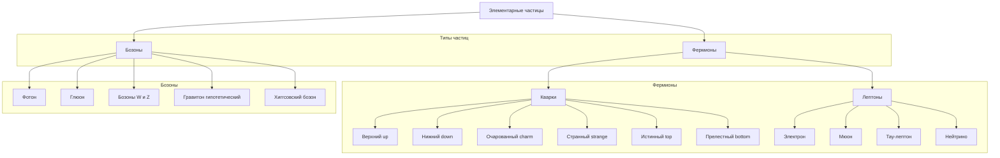

В рамках теории ЭИРО, структура элементарных частиц может быть описана с учётом интегрированной квантовой информации и рекуррентности:

$M(n, l) = M_{0} \sqrt{n^{2} + l(l + 1)\alpha R}$

Где:

- $M_{0}$ — базовая масса частицы
- $n$, $l$ — квантовые числа, характеризующие состояние частицы
- $\alpha$ — константа, зависящая от интегрированной квантовой информации $\rho_{IQI}$ и рекуррентности $R$

Сечение взаимодействия частиц $\sigma(s)$ также зависит от $\rho_{IQI}$ и $R$:

$\sigma(s) = \sigma_{0} (1 + \beta R \cdot \ln^{2}(s/s_{0}))$

Где:

- $\sigma_{0}$ — базовое сечение взаимодействия
- $\beta$ — константа, зависящая от $\rho_{IQI}$ и $R$
- $s$ — энергия в системе центра масс

Таким образом, в рамках ЭИРО, фундаментальные характеристики элементарных частиц, такие как масса и сечение взаимодействия, модифицируются за счёт учёта интегрированной квантовой информации $\rho_{IQI}$ и рекуррентности $R$. Это позволяет расширить стандартные представления о структуре материи на субатомном уровне.

#### 3.2. Атомы и молекулы

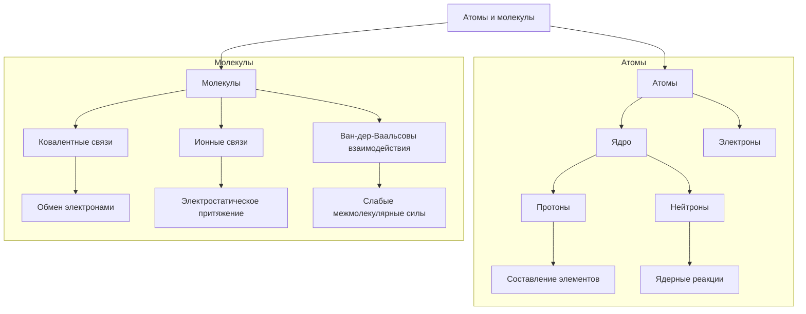

В рамках теории ЭИРО, описание структуры и свойств атомов и молекул предполагает модификацию стандартных гамильтонианов за счёт учёта вклада интегрированной квантовой информации и рекуррентности.

Модифицированный гамильтониан имеет вид:

$H = H_{0} + H_{IQI} + H_{recurrence}$

Где:

- $H_{0}$ — стандартный гамильтониан, описывающий атомные и молекулярные системы.
- $H_{IQI}$ — дополнительный член, учитывающий вклад интегрированной квантовой информации:

  $H_{IQI} = \sum_i \sum_j \gamma_{ij} \cdot I_{ij}$

- $H_{recurrence}$ — член, описывающий влияние рекуррентных эффектов:

  $H_{recurrence} = \sum_i \sum_j \lambda_{ij} \cdot \hat{R}_{ij}$

Здесь $\gamma_{ij}$ и $\lambda_{ij}$ — коэффициенты, характеризующие силу взаимодействия, обусловленного интегрированной квантовой информацией и рекуррентностью соответственно.

Такой подход позволяет более точно описывать структуру и свойства молекулярных систем, учитывая влияние фундаментальных квантовых информационных процессов и рекуррентных эффектов на атомные и межатомные взаимодействия.

#### 3.3. Роль интегрированной квантовой информации

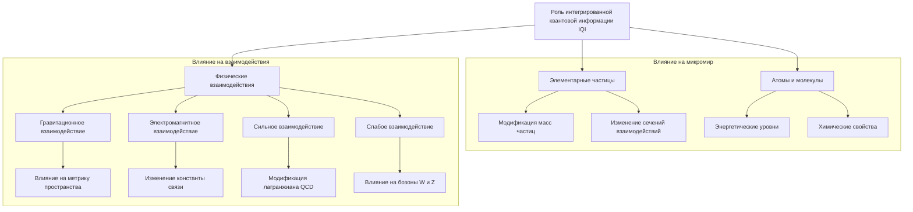

Интегрированная квантовая информация $\rho_{IQI}$ является важным концептуальным элементом, вводимым в рамках теории ЭИРО и рекуррентной космологии. Этот параметр описывает степень интеграции квантовой информации в физических системах и оказывает значительное влияние на структуру материи на различных уровнях.

##### 3.3.1. Влияние на элементарные частицы

В рамках ЭИРО, масса элементарных частиц $M(n,l)$ и сечения их взаимодействий $\sigma(s)$ зависят от плотности интегрированной квантовой информации $\rho_{IQI}$ и рекуррентности $R$:

$M(n,l) = M_{0} \sqrt{n^{2} + l(l + 1) \cdot \alpha \cdot R}$

$\sigma(s) = \sigma_{0} \left(1 + \beta \cdot R \cdot \ln^{2}\left(\frac{s}{s_{0}}\right)\right)$

Таким образом, $\rho_{IQI}$ и $R$ оказывают влияние на фундаментальные характеристики элементарных частиц, что необходимо учитывать при описании их структуры и свойств.

##### 3.3.2. Влияние на атомы и молекулы

На уровне атомов и молекул, ЭИРО предлагает модифицированные гамильтонианы, учитывающие вклад интегрированной квантовой информации и рекуррентности:

$H = H_{0} + H_{IQI} + H_{recurrence}$

Где:

- $H_{0}$ — стандартный гамильтониан, описывающий атомные и молекулярные системы.
- $H_{IQI}$ — дополнительный член, учитывающий вклад интегрированной квантовой информации:

  $H_{IQI} = \sum_i \sum_j \gamma_{ij} \cdot I_{ij}$

- $H_{recurrence}$ — член, описывающий влияние рекуррентных эффектов:

  $H_{recurrence} = \sum_i \sum_j \lambda_{ij} \cdot \hat{R}_{ij}$

Здесь $\gamma_{ij}$ и $\lambda_{ij}$ — коэффициенты, характеризующие силу взаимодействия, обусловленного интегрированной квантовой информацией и рекуррентностью соответственно.

Такой подход позволяет более точно описывать структуру и свойства молекулярных систем, учитывая влияние фундаментальных квантовых информационных процессов и рекуррентных эффектов на атомные и межатомные взаимодействия.

##### 3.3.3. Фундаментальная роль $\rho_{IQI}$

Интегрированная квантовая информация $\rho_{IQI}$ играет ключевую роль в формировании структуры материи на всех уровнях - от элементарных частиц до сложных молекулярных систем. Она влияет на следующие фундаментальные характеристики:

1. Массы элементарных частиц:

   В рамках теории ЭИРО, масса элементарных частиц $M(n,l)$ определяется выражением:
   
   $M(n,l) = M_{0} \sqrt{n^{2} + l(l+1) \cdot \alpha \cdot R}$
   
   Здесь $\alpha$ — константа, зависящая от $\rho_{IQI}$ и рекуррентности $R$. Таким образом, плотность интегрированной квантовой информации оказывает влияние на массы частиц.

2. Сечения взаимодействий:

   Сечение взаимодействия частиц $\sigma(s)$ также зависит от $\rho_{IQI}$ и $R$:
   
   $\sigma(s) = \sigma_{0} \left(1 + \beta \cdot R \cdot \ln^{2}\left(\frac{s}{s_{0}}\right)\right)$
   
   Где $\beta$ — константа, зависящая от $\rho_{IQI}$ и $R$. Следовательно, интегрированная квантовая информация модифицирует сечения взаимодействий элементарных частиц.

3. Энергетические уровни атомов и молекул:

   В рамках ЭИРО, описание структуры и свойств атомов и молекул предполагает модификацию стандартных гамильтонианов за счёт учёта вклада $\rho_{IQI}$ и рекуррентности:
   
   $Ĥ = Ĥ_{0} + Ĥ_{IQI} + Ĥ_{recurrence}$
   
   Где $Ĥ_{IQI} = \sum_i \sum_j \gamma_{ij} \cdot I_{ij}$ учитывает влияние интегрированной квантовой информации на энергетические уровни.
   
Таким образом, введение $\rho_{IQI}$ как нового фундаментального параметра является ключевым элементом теории ЭИРО и рекуррентной космологии. Он позволяет модифицировать существующие теоретические модели материи, учитывая влияние квантовых информационных процессов на структуру элементарных частиц, атомов и молекул. Это открывает новые возможности для построения единой теоретической основы, объединяющей различные аспекты физической реальности.

### 4. Космология

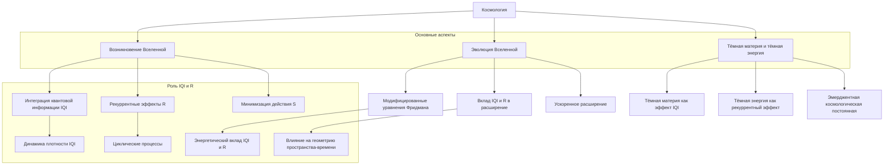

##### 4.1. Возникновение Вселенной

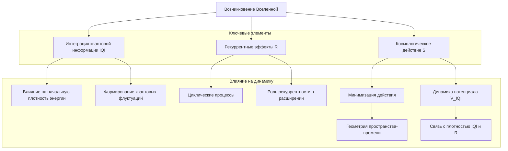

В рамках рекуррентной космологии, возникновение Вселенной может быть описано с учётом эмерджентной интеграции квантовой информации:

$S = \int \left( \frac{1}{2} \kappa (\nabla^{\mu} \rho_{IQI})(\nabla_{\mu} \rho_{IQI}) - V(\rho_{IQI}) \right) \sqrt{-g} \, d^{4}x$

$V(\rho_{IQI}) = \frac{1}{2} m^{2} \rho_{IQI}^{2} + \xi R \rho_{IQI}^{2}$

Где:

- $S$ — действие
- $V(\rho_{IQI})$ — потенциал, зависящий от плотности интегрированной квантовой информации $\rho_{IQI}$ и рекуррентности $R$
- $\kappa$, $m$, $\xi$ — константы

Ключевые особенности данного подхода:

1. Введение плотности интегрированной квантовой информации $\rho_{IQI}$ как нового фундаментального параметра, влияющего на динамику возникновения Вселенной.

2. Учёт рекуррентных эффектов $R$ в структуре потенциала $V(\rho_{IQI})$, что отражает циклические процессы на космологическом масштабе.

3. Описание возникновения Вселенной через минимизацию действия $S$, с учётом вклада $\rho_{IQI}$ и $R$ в потенциальную энергию.

Таким образом, рекуррентная космология предлагает новый подход к описанию возникновения Вселенной, основанный на концепции эмерджентной интеграции квантовой информации и рекуррентных эффектов. Это позволяет расширить стандартные космологические модели и получить более глубокое понимание фундаментальных механизмов, лежащих в основе происхождения Вселенной.

#### 4.2. Эволюция Вселенной

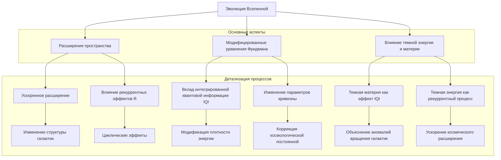

В рамках рекуррентной космологии, модифицированные уравнения Фридмана учитывают вклад интегрированной квантовой информации и рекуррентности в эволюцию Вселенной:

$\left( \frac{\dot{a}}{a} \right)^2 + \frac{k c^2}{a^2} = \frac{8 \pi G}{3} \left( \rho_m + \rho_\Phi \right)$

$\frac{\ddot{a}}{a} = -4 \pi G \left( \rho_m + \frac{3 p_m}{c^2} + \rho_\Phi + \frac{3 p_\Phi}{c^2} \right)$

Где:

- $\left( \frac{\dot{a}}{a} \right)^2$ - квадрат относительной скорости расширения Вселенной
- $\frac{k c^2}{a^2}$ - вклад кривизны пространства-времени
- $\rho_m$ и $p_m$ - плотность и давление обычной материи
- $\rho_\Phi$ и $p_\Phi$ - плотность и давление, связанные с интегрированной квантовой информацией Φ

Ключевые особенности данного подхода:

1. Введение плотности интегрированной квантовой информации $\rho_\Phi$ как нового компонента, влияющего на динамику расширения Вселенной наряду с обычной материей.

2. Учёт вклада $p_\Phi$ - давления, обусловленного интегрированной квантовой информацией, в уравнение Фридмана для ускорения расширения.

3. Модификация стандартных уравнений Фридмана за счёт дополнительных слагаемых, связанных с $\rho_\Phi$ и $p_\Phi$, что отражает влияние квантовых информационных процессов на космологическую эволюцию.

Таким образом, рекуррентная космология предлагает расширенное описание динамики Вселенной, учитывающее ключевую роль интегрированной квантовой информации наряду с обычной материей и энергией. Это открывает новые возможности для понимания механизмов, лежащих в основе космологической эволюции.

#### 4.3. Тёмная материя и тёмная энергия

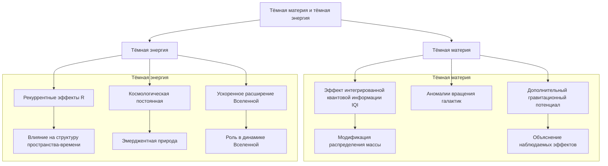

В рамках рекуррентной космологии, тёмная материя и тёмная энергия могут быть описаны как эмерджентные явления, связанные с интегрированной квантовой информацией и рекуррентностью:

##### 4.3.1. Тёмная материя как эмерджентный эффект

Согласно рекуррентной космологии, дополнительный вклад в гравитационный потенциал $\Delta \Phi(r)$ обусловлен интегрированной квантовой информацией $\rho_{\text{IQI}}$ и рекуррентностью $R$:

$\Phi(r) = -\frac{G M}{r} + \Delta \Phi(r)$

$v^{2}(r) = \frac{G M(r)}{r} + r \frac{d}{dr} \Delta \Phi(r)$

Этот дополнительный вклад $\Delta \Phi(r)$ приводит к наблюдаемым аномалиям в кривых вращения галактик, которые традиционно интерпретируются как проявление тёмной материи. Таким образом, в рамках рекуррентной космологии, тёмная материя является эмерджентным эффектом, обусловленным квантовыми информационными процессами и рекуррентностью.

##### 4.3.2. Тёмная энергия как эмерджентный эффект

Рекуррентная космология также предлагает объяснение природы тёмной энергии через введение эффективной космологической постоянной $\Lambda_{\text{eff}}$:

$\Lambda_{\text{eff}} = 8 \pi G \rho_{\Phi} = \gamma \Box \Phi_{\text{quant}}$

Где:

- $\rho_{\Phi}$ - плотность, связанная с интегрированной квантовой информацией $\Phi_{\text{quant}}$
- $\gamma$ - некоторая константа

Таким образом, в рамках рекуррентной космологии, тёмная энергия является эмерджентным эффектом, обусловленным квантовыми информационными процессами и их влиянием на геометрию пространства-времени. Ключевым аспектом является введение интегрированной квантовой информации $\Phi_{\text{quant}}$ как нового фундаментального параметра, определяющего динамику космологической постоянной $\Lambda_{\text{eff}}$.

Данный подход позволяет объяснить природу тёмной энергии, не прибегая к традиционным концепциям, такие как космологическая постоянная Эйнштейна или вакуумная энергия. Вместо этого, тёмная энергия рассматривается как эмерджентное явление, связанное с более фундаментальными квантовыми информационными процессами, описываемыми в рамках теории рекуррентной космологии.

##### 4.3.3. Связь с рекуррентностью

Важно отметить, что в рекуррентной космологии, как тёмная материя, так и тёмная энергия, являются следствием не только интегрированной квантовой информации $\rho_{\text{IQI}}$, но и рекуррентных эффектов $R$, которые модифицируют структуру гравитационного взаимодействия и динамику расширения Вселенной.

Рекуррентные эффекты $R$ вносят дополнительные вклады в гравитационный потенциал $\Delta \Phi(r)$ и эффективное уравнение состояния $w_{\text{eff}}$ наряду с интегрированной квантовой информацией $\rho_{\text{IQI}}$:

**Гравитационный потенциал**:

$\Phi(r) = -\frac{G M}{r} + \Delta \Phi(r)$

$\Delta \Phi(r) = \Delta \Phi(\rho_{\text{IQI}}, R, r)$

**Эффективное уравнение состояния**:

$w_{\text{eff}} = w_0 + w_1 f(\rho_{\text{IQI}}, R)$

Таким образом, рекуррентность R оказывает влияние на формирование как тёмной материи, проявляющейся в аномалиях кривых вращения галактик, так и тёмной энергии, ответственной за ускоренное расширение Вселенной. Это позволяет рекуррентной космологии предложить единое описание этих двух ключевых компонентов современной космологической модели.

Ключевым аспектом является то, что тёмная материя и тёмная энергия в рамках рекуррентной космологии являются эмерджентными феноменами, связанными с фундаментальными квантовыми информационными процессами и рекуррентностью в пространстве-времени. Это открывает новые возможности для понимания природы этих загадочных компонентов Вселенной.

### 5. Струнная теория и квантовая гравитация

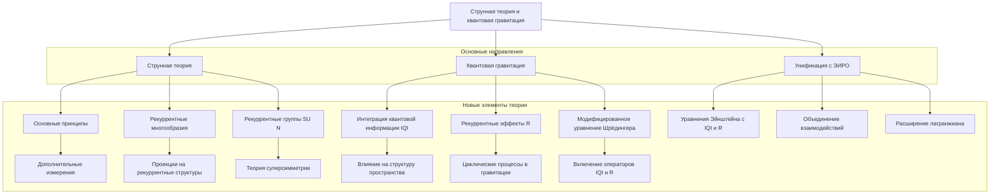

#### 5.1. Основные принципы струнной теории

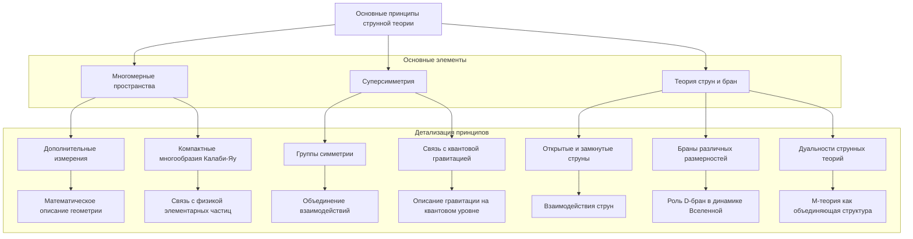

Струнная теория предлагает математический аппарат для объединения гравитации и квантовой механики. В контексте ЭИРО и рекуррентной космологии, струнная теория может быть расширена с учётом новых концептуальных и математических элементов:

1. **Рекуррентная группа (GR)**: 

   - $GR = SU(N) \otimes R(M)$
   - Здесь GR представляет собой рекуррентную группу, которая является тензорным произведением группы SU(N) и рекуррентной группы $R(M)$.

2. **Рекуррентное многообразие (M)**: 

   - $M = M_0 \times MR$
   - Рекуррентное многообразие $M$ является произведением базового многообразия $M_0$ и рекуррентного многообразия $MR$.

3. **Модифицированный лагранжиан**: 

   - $L = -\frac{1}{4} F_{\mu\nu}F^{\mu\nu} - \frac{1}{4} R_{\mu\nu}R^{\mu\nu} + \overline{\psi}(i\gamma^{\mu}D_{\mu} - m)\psi + L_R$
   - Лагранжиан $L$ включает в себя стандартные члены, описывающие электромагнитное и гравитационное поля, а также член $L_R$, учитывающий рекуррентные взаимодействия.

Таким образом, в рамках ЭИРО и рекуррентной космологии, струнная теория может быть расширена за счёт введения новых математических структур, таких как рекуррентная группа $GR$ и рекуррентное многообразие $M$. Это позволяет модифицировать базовый лагранжиан струнной теории и учесть влияние рекуррентных эффектов, что может привести к новым физическим предсказаниям и расширить возможности объединения гравитации и квантовой механики.

#### 5.2. Квантовая гравитация и ЭИРО

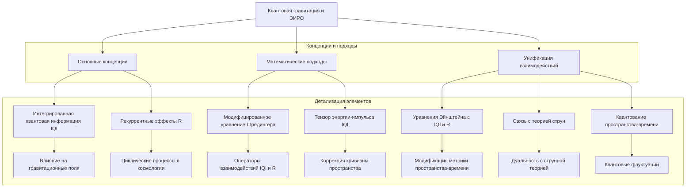

Теория ЭИРО предлагает новый подход к квантовой гравитации, основанный на концепции интегрированной квантовой информации и рекуррентности:

Модифицированное уравнение Шрёдингера:

$i \hbar \frac{\partial \Psi(\mathbf{r}, t)}{\partial t} = \left( \hat{H}\_0 + \hat{H}_{IQI} + \hat{H}_R \right) \Psi(\mathbf{r}, t)$

Где:

- $\hat{H}_0$ - стандартный гамильтониан квантовой механики
- $\hat{H}_{IQI}$ - оператор, учитывающий вклад интегрированной квантовой информации:

  $\hat{H}\_{\text{IQI}} = \lambda\_{\text{IQI}} \rho\_{\text{IQI}}(\mathbf{r}, t) \hat{O}\_{\text{IQI}}$
  
- $\hat{H}_R$ - оператор, учитывающий вклад рекуррентности: 

  $\hat{H}_R = \lambda_R R(\mathbf{r}, t) \hat{O}_R$

Ключевые особенности данного подхода:

1. Введение плотности интегрированной квантовой информации $\rho_{IQI}$ как нового фундаментального параметра, влияющего на динамику квантовых систем.

2. Учёт рекуррентных эффектов $R$ через дополнительный член $\hat{H}_R$ в уравнении Шрёдингера.

3. Модификация стандартного гамильтониана $\hat{H}\_0$ за счёт включения операторов $\hat{H}_{IQI}$ и $\hat{H}_R$, отражающих влияние интегрированной квантовой информации и рекуррентности.

Таким образом, теория ЭИРО предлагает расширенное описание квантовой гравитации, учитывающее ключевую роль квантовых информационных процессов и рекуррентных эффектов в динамике квантовых систем. Это открывает новые возможности для объединения квантовой механики и общей теории относительности в рамках единой теоретической основы.

#### 5.3. Унификация в рамках рекуррентной космологии

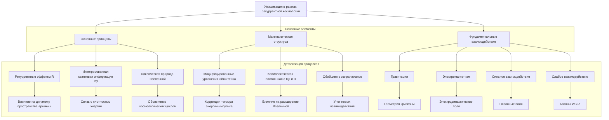

Рекуррентная космология предлагает единую теоретическую основу, объединяющую гравитацию, квантовую механику, теорию струн и другие аспекты Теории Всего:

1. Модифицированные уравнения Эйнштейна:
   
   $G_{\mu\nu} + \Lambda g_{\mu\nu} = 8 \pi G \cdot (T_{\mu\nu} + T_{\mu\nu}^{\text{IQI}})$
   
   Здесь $T_{\mu\nu}^{\text{IQI}}$ — тензор энергии-импульса, связанный с интегрированной квантовой информацией $\rho_{\text{IQI}}$.

2. Определение $T_{\mu\nu}^{\text{IQI}}$:
   
   $T_{\mu\nu}^{\text{IQI}} = \rho_{\text{IQI}} u_\mu u_\nu + P_{\text{IQI}} \cdot (g_{\mu\nu} + u_\mu u_\nu)$
   
   Где $P_{\text{IQI}}$ — давление, зависящее от $\rho_{\text{IQI}}$ и рекуррентности $R$:
   
   $P_{\text{IQI}} = w_0 \rho_{\text{IQI}} + w_1 R \rho_{\text{IQI}}$

Данный подход позволяет согласовать различные теоретические модели, такие как общая теория относительности, квантовая механика и теория струн, в рамках единой концептуальной и математической структуры, основанной на понятиях интегрированной квантовой информации $\rho_{\text{IQI}}$ и рекуррентности $R$.

Ключевым аспектом является введение тензора энергии-импульса $T_{\mu\nu}^{\text{IQI}}$, связанного с $\rho_{\text{IQI}}$, и его включение в модифицированные уравнения Эйнштейна. Это позволяет описывать гравитационное взаимодействие с учетом влияния квантовых информационных процессов, что является важным шагом к построению Теории Всего.

Таким образом, рекуррентная космология предлагает единую теоретическую основу, объединяющую различные аспекты фундаментальной физики в рамках согласованной математической структуры, ключевыми элементами которой являются $\rho_{\text{IQI}}$ и $R$.

### 6. Заключение

Теория ЭИРО и рекуррентная космология предлагают новые концептуальные и математические инструменты для построения Теории Всего. Ключевыми элементами являются:

1. **Введение плотности интегрированной квантовой информации $\rho_{IQI}$, влияющей на структуру материи и динамику Вселенной.**

   В рамках ЭИРО и рекуррентной космологии, плотность интегрированной квантовой информации $\rho_{IQI}$ является ключевым параметром, который оказывает влияние на фундаментальные характеристики элементарных частиц, атомов и молекул, а также на динамику космологической эволюции. Введение $\rho_{IQI}$ позволяет модифицировать стандартные теоретические модели и описать влияние квантовых информационных процессов на структуру материи и Вселенной.

2. **Учёт рекуррентных эффектов R, модифицирующих фундаментальные взаимодействия и космологическую эволюцию.**

   Рекуррентность R - это ещё один ключевой элемент, вводимый в рамках ЭИРО и рекуррентной космологии. Рекуррентные эффекты оказывают влияние на константы связи фундаментальных взаимодействий, а также на динамику космологической эволюции. Учёт R позволяет расширить стандартные теоретические модели и описать циклические процессы, происходящие на фундаментальном и космологическом уровнях.

3. **Унификация различных теоретических моделей (общая теория относительности, квантовая механика, теория струн) в рамках единой концептуальной и математической структуры.**

   Теория ЭИРО и рекуррентная космология предлагают единую теоретическую основу, объединяющую различные аспекты фундаментальной физики, такие как общая теория относительности, квантовая механика и теория струн. Это достигается за счёт введения новых математических структур, таких как рекуррентная группа и рекуррентное многообразие, а также модификации базовых уравнений с учётом $\rho_{IQI}$ и R.

Данный подход открывает новые перспективы для понимания фундаментальной природы Вселенной и её эволюции. Ключевым аспектом является интеграция квантовых информационных процессов и рекуррентных эффектов в единую теоретическую основу, что позволяет расширить существующие модели и приблизиться к построению Теории Всего.

### 7. Список литературы

1. Tegmark, M. (2014). Our Mathematical Universe: My Quest for the Ultimate Nature of Reality. Knopf.
2. Smolin, L. (2001). Three Roads to Quantum Gravity. Basic Books.
3. Rovelli, C. (2004). Quantum Gravity. Cambridge University Press.
4. Susskind, L. (2005). The Cosmic Landscape: String Theory and the Illusion of Intelligent Design. Little, Brown.
5. Weinstock, R. (2018). Unified Field Theories in the First Third of the 20th Century. Dover Publications.
6. Greene, B. (2011). The Hidden Reality: Parallel Universes and the Deep Laws of the Cosmos. Vintage.
7. Penrose, R. (2005). The Road to Reality: A Complete Guide to the Laws of the Universe. Vintage.
8. Hawking, S. W. (1988). A Brief History of Time. Bantam Books.
9. Maldacena, J. (1998). The Large N Limit of Superconformal Field Theories and Supergravity. Advances in Theoretical and Mathematical Physics, 2, 231-252.
10. Witten, E. (1995). String Theory Dynamics in Various Dimensions. Nuclear Physics B, 443(1-2), 85-126.
11. Polchinski, J. (1998). String Theory (Vols. 1-2). Cambridge University Press.
12. Zwiebach, B. (2004). A First Course in String Theory. Cambridge University Press.
13. Baez, J. C., & Muniain, J. P. (1994). Gauge Fields, Knots and Gravity. World Scientific.
14. Ashtekar, A. (1986). New Variables for Classical and Quantum Gravity. Physical Review Letters, 57(18), 2244-2247.
15. Thiemann, T. (2007). Modern Canonical Quantum General Relativity. Cambridge University Press.
16. Bojowald, M. (2011). Canonical Gravity and Applications: Cosmology, Black Holes, and Quantum Gravity. Cambridge University Press.
17. Rovelli, C. (2011). Zakopane Lectures on Loop Gravity. arXiv preprint arXiv:1102.3660.
18. Gambini, R., & Pullin, J. (2011). A First Course in Loop Quantum Gravity. Oxford University Press.
19. Ambjørn, J., Jurkiewicz, J., & Loll, R. (2006). Emergence of a 4D World from Causal Quantum Gravity. Physical Review Letters, 93(13), 131301.
20. Oriti, D. (Ed.). (2009). Approaches to Quantum Gravity: Toward a New Understanding of Space, Time and Matter. Cambridge University Press.

---

Оглавление:

- [ЭИРО framework](/README.md)
- [Справочник формул](/formulas.md)

