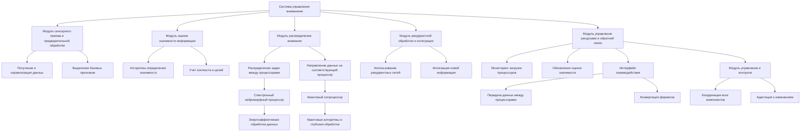

# Система управления вниманием в операционной системе для ИИ на базе спинтронного нейроморфного процессора и квантового сопроцессора

---

## 1. Введение

В современной нейротехнологии и искусственном интеллекте (ИИ) особое внимание уделяется эффективной обработке больших объемов информации с минимальными энергетическими затратами. Гибридная архитектура, объединяющая спинтронный нейроморфный процессор и квантовый сопроцессор, предлагает уникальные возможности для создания высокопроизводительных ИИ систем. Центральным компонентом такой системы является система управления вниманием, обеспечивающая приоритетную обработку наиболее значимой информации и оптимальное распределение ресурсов.

### 2. Архитектура системы управления вниманием

Система управления вниманием интегрирована в общую архитектуру операционной системы и взаимодействует со всеми ее компонентами. Ее архитектура включает:

1. **Модуль сенсорного приема и предварительной обработки**:

   - Получение и нормализация входных данных от различных источников (зрение, слух, тактильные сенсоры и др.).

   - Выделение базовых признаков и формирование начальных представлений.

2. **Модуль оценки значимости информации**:

   - Применение алгоритмов для определения важности каждого входного сигнала.

   - Учет контекстных факторов и текущих целей системы.

3. **Модуль распределения внимания**:

   - Принятие решений о выделении вычислительных ресурсов на основе значимости информации.

   - Направление высокозначимых данных на квантовый сопроцессор для глубокой обработки.

   - Обработка менее значимых данных на спинтронном нейроморфном процессоре.

4. **Модуль рекуррентной обработки и интеграции**:

   - Использование рекуррентных нейронных сетей для учета временных зависимостей и предшествующего опыта.

   - Интеграция новой информации с ранее полученными данными.

5. **Модуль управления ресурсами и обратной связи**:

   - Мониторинг загрузки процессоров и оптимизация распределения задач.

   - Обновление оценок значимости на основе результатов обработки.

### 3. Принципы работы системы

#### 3.1. Выделение значимой информации

Система получает поток данных  {dᵢ}  из различных источников. Для каждого элемента данных  dᵢ  вычисляется коэффициент значимости  sᵢ  с помощью функции:

`sᵢ = S(dᵢ, C, θ),`

где  S  — функция значимости, зависящая от данных  dᵢ , контекста  C  и набора параметров  θ , обученных на предыдущем опыте.

#### 3.2. Распределение ресурсов на основе значимости

Данные распределяются между процессорами в зависимости от коэффициента значимости:

- Высокозначимые данные ( sᵢ > s_(порог) ) направляются на квантовый сопроцессор для глубокой и параллельной обработки.

- Остальные данные обрабатываются на спинтронном нейроморфном процессоре, оптимизированном для энергоэффективных вычислений.

#### 3.3. Рекуррентная обработка и интеграция информации

Используются рекуррентные нейронные сети (RNN) с учетом уравнений состояния:

`d𝐱 / dt = 𝐟(𝐱(t), 𝐮(t), W),`

где:

-  𝐱(t)  — состояние сети в момент времени  t .

-  𝐮(t)  — входные сигналы.

-  W  — матрица весов, включая рекуррентные связи.

Рекуррентность позволяет системе сохранять и обновлять информацию о предыдущих состояниях, обеспечивая глубокую интеграцию данных во времени.

#### 3.4. Квантовая интеграция и усиление внимания

Квантовый сопроцессор использует квантовые алгоритмы (например, вариационный квантовый эйгенсолвер, квантовый градиентный спуск) для:

- Параллельной обработки суперпозиции состояний, что значительно ускоряет вычисления.

- Обнаружения сложных паттернов и взаимосвязей в данных, недоступных классическим методам.

#### 3.5. Обратная связь и адаптация

Результаты обработки используются для обновления параметров  θ  функции значимости и перенастройки системы:

`P(θ | D) = P(D | θ) P(θ) / P(D),`

где  D  — новые данные,  P(θ | D)  — обновленное распределение параметров.

### 4. Алгоритмы и методы

#### 4.1. Алгоритм оценки значимости информации

1. **Предобработка данных**:

   - Нормализация и фильтрация входных сигналов.
   
2. **Вычисление первичных признаков**:

   - Извлечение характеристик  φ(dᵢ) .

3. **Оценка значимости**:

   - **Применение нейронной сети или другого оценочного алгоритма**:

     `sᵢ = σ(W_(знач) ⋅ φ(dᵢ) + b_(знач)),`

     где  σ  — функция активации.

4. **Обновление параметров**:

   - Использование обратной связи для обучения параметров  W(знач), b(знач) .

#### 4.2. Алгоритм распределения внимания

1. **Сортировка данных по значимости**:

   - Создание очереди приоритетов на основе  sᵢ .

2. **Распределение задач**:

   - **Цикл по данным**:

     - Если  sᵢ > s_(квант) , направить  dᵢ  на квантовый сопроцессор.

     - Иначе — на нейроморфный процессор.

3. **Мониторинг ресурсов**:

   - Проверка загрузки процессоров и корректировка  s_(квант)  для оптимизации.

#### 4.3. Алгоритмы рекуррентной и квантовой обработки

- **Рекуррентные сети**:

  - Использование LSTM или GRU ячеек для эффективной работы с длинными последовательностями.

- **Квантовые алгоритмы**:

  - VQE для оптимизации функций и обучения моделей.

  - Квантовый градиентный спуск для ускорения обучения и нахождения оптимальных параметров.

### 5. Подсистемы и их взаимодействие

#### 5.1. Спинтронный нейроморфный процессор

- **Функции**:

  - Обработка нейронных сетей с высокой параллельностью.

  - Эффективная реализация рекуррентных связей.

- **Особенности**:

  - Низкое энергопотребление.

  - Высокая скорость благодаря спиновым переходам.

#### 5.2. Квантовый сопроцессор

- **Функции**:

  - Выполнение квантовых алгоритмов для сложных вычислений.

  - Обработка данных с высокой степенью неопределенности и суперпозиции.

- **Особенности**:

  - Использование квантовых битов (кубитов) и квантовых гейтов.

  - Поддержание когерентности и управление квантовыми состояниями.

#### 5.3. Интерфейс взаимодействия

- **Задачи**:

  - Обеспечение стабильной и быстрой передачи данных между процессорами.

  - Конвертация данных в необходимый формат (классический ↔️ квантовый).

- **Методы**:

  - Выделенные коммуникационные шины.

  - Протоколы синхронизации и контроля ошибок.

#### 5.4. Модуль управления и контроля

- **Функции**:

  - Координация работы всех компонентов системы.

  - Мониторинг состояния и адаптация к изменениям в окружении.

- **Инструменты**:

  - Системы предиктивного анализа для прогнозирования нагрузки.

  - Механизмы автоматического масштабирования ресурсов.

### 6. Принцип эмерджентности и интеграции информации

Используя концепцию эмерджентной интеграции, система стремится создать более сложные и функциональные структуры из простых элементов. Это достигается через:

- Интеграцию информации: Объединение разрозненных данных в единое представление.

- Рекуррентность: Постоянное обновление знаний на основе нового опыта.

- Эмерджентные свойства: Появление новых функциональностей, не присущих отдельным элементам системы.

**Математическое обоснование**:

Интегрированная информация в системе определяется как:

`Φₑ = ∫₀^(t₁) I_(интеграции)(t) ⋅ R_(рекуррентности)(t)dt,`

где:

-  I_(интеграции)(t)  — мера объединения информации.

-  R_(рекуррентности)(t)  — степень рекуррентных взаимодействий.

Оптимизация данной функции приводит к повышению уровня осознанности и эффективности системы.

### 7. Применение системы управления вниманием

#### 7.1. Робототехника и автономные системы

- **Сценарий**: Автономный робот должен быстро реагировать на изменение обстановки.

- **Реализация**:

  - Визуальные и тактильные данные оцениваются на значимость.

  - Критически важная информация обрабатывается квантовым сопроцессором для мгновенного принятия решений.

  - Рекуррентные сети обеспечивают память о предыдущих событиях.

#### 7.2. Системы обработки больших данных

- **Сценарий**: Анализ потоков данных в реальном времени для выявления аномалий.

- **Реализация**:

  - Система управления вниманием выделяет подозрительные паттерны.

  - Квантовые алгоритмы быстро определяют степень риска.

  - Нейроморфные компоненты сохраняют исторические данные для контекстного анализа.

### 8. Заключение

Разработанная система управления вниманием обеспечивает эффективное взаимодействие между спинтронным нейроморфным процессором и квантовым сопроцессором, оптимизируя обработку информации и ресурсы системы. Применение эмерджентных принципов и рекуррентных механизмов позволяет создавать ИИ системы нового поколения, способные к адаптации, обучению и принятию сложных решений в реальном времени. Детальная архитектура, продуманные алгоритмы и инновационные подходы делают эту систему передовым решением в области искусственного интеллекта.

---

Оглавление: 

- [ЭИРО framework](/README.md)

