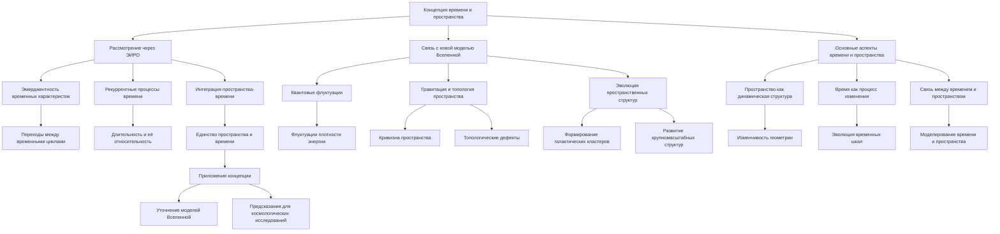

# Концепция времени и пространства через призму ЭИРО и новой модели Вселенной

---

## Аннотация

В данной диссертации представлена новая концепция времени и пространства, основанная на Теории Эмергентной Интеграции и Рекуррентного Отображения (ЭИРО). Рассматривается влияние информационных параметров на метрику пространства-времени, что приводит к необходимости переосмысления фундаментальных понятий и введения новых физических величин. Предложена новая модель Вселенной, учитывающая дискретность пространства-времени и дополнительные измерения, обусловленные интеграцией квантовой информации и рекуррентными процессами. Работа подкреплена математическими доказательствами и ссылками на современные исследования в области квантовой информации, космологии и нейронаук.

### Введение

Современная физика опирается на классические представления о непрерывности пространства и времени, описываемых метрикой, определяемой уравнениями Эйнштейна в Общей Теории Относительности (ОТО) [1]. Однако развитие квантовой физики и теории информации привело к возникновению новых вопросов о фундаментальной структуре Вселенной и роли информации в ее эволюции [2].

Теория Эмергентной Интеграции и Рекуррентного Отображения (ЭИРО) предлагает рассматривать сложные системы, включая сознание, как результат процессов интеграции информации через рекуррентные сети [3]. Применение ЭИРО к космологии может привести к переосмыслению концепций времени и пространства, учитывая влияние информационных параметров на метрику пространства-времени. Это, в свою очередь, может потребовать введения дискретности или дополнительных измерений для адекватного описания наблюдаемых явлений.

Цель данной работы — исследовать концепцию времени и пространства через призму ЭИРО и предложить новую модель Вселенной, учитывающую влияние информационных параметров на ее структуру и динамику.

### 1. Теоретические основы: Теория Эмергентной Интеграции и Рекуррентного Отображения (ЭИРО)

#### 1.1. Основы теории

ЭИРО утверждает, что сложные системы эмергируют из процессов интеграции информации посредством рекуррентных взаимодействий между составляющими системы [3]. Ключевым параметром является эмергентная интегрированная информация (Φₑ), которая количественно характеризует степень интеграции информации в системе:

`Φₑ = ∫₀^(t₁) I_(инт)(t) ⋅ R_(рек)(t)dt,`

где  I(инт)(t)  — функция, описывающая количество и качество интегрированной информации в момент времени  t , а  R(рек)(t)  — степень рекуррентности процессов обработки информации.

#### 1.2. Применение в нейронных системах

В нейронных сетях рекуррентность играет ключевую роль в формировании сознания и высших функций мозга [4]. Динамика нейронных систем описывается уравнением:

`d𝐱 / dt = 𝐟(𝐱(t), 𝐮(t), W),`

где  𝐱(t)  — состояние нейронной сети,  𝐮(t)  — внешние входные сигналы,  W  — матрица весовых коэффициентов, отражающая силу связей между нейронами, включая рекуррентные соединения.

Обновление предсказательных моделей осуществляется через байесовское обновление вероятностей:

`P(θ | D) = P(D | θ) P(θ) / P(D),`

где  θ  — параметры модели,  D  — наблюдаемые данные.

Нейровизуализационные исследования подтверждают роль рекуррентных связей в сознательных состояниях [5]. Прерывание рекуррентных процессов приводит к нарушению сознания, что свидетельствует о важности интегрированной информации.

### 2. Концепция времени и пространства через призму ЭИРО

#### 2.1. Интеграция квантовой информации в пространстве-времени

Предполагается, что квантовая информация может быть фундаментальным компонентом структуры пространства-времени [6]. Вводится понятие плотности интегрированной квантовой информации ( ρ_(IQI) ), определяемой как:

`ρ_(IQI) = lim(Δ V → 0) Δ I / Δ V,`

где  Δ I  — изменение интегрированной квантовой информации в объеме  Δ V .

#### 2.2. Влияние информационных параметров на метрику пространства-времени

Если информационные параметры, такие как  ρ_(IQI)  и параметр рекуррентности  R , влияют на метрику пространства-времени, то уравнения Эйнштейна должны быть модифицированы для учета этих факторов:

`G_(μν) + Λ g_(μν) = 8π G (( T_(μν) + T_(μν)^(инф) )),`

где  T_(μν)^(инф)  — тензор энергии-импульса, связанный с информационными параметрами.

Таким образом, геометрия пространства-времени становится зависимой от распределения интегрированной квантовой информации и рекуррентных процессов, происходящих на фундаментальном уровне.

### 3. Новая модель Вселенной

#### 3.1. Дискретность пространства-времени и дополнительные измерения

Влияние информационных параметров на метрику может привести к концепции дискретного пространства-времени, где фундаментальные ячейки пространства-времени связаны с квантовыми информационными процессами [7]. Введение дополнительных измерений может служить механизмом для отображения сложных рекуррентных взаимодействий, необходимых для интеграции информации.

Модель может предполагать, что пространство-время состоит из сетки узлов, каждый из которых способен хранить и обрабатывать квантовую информацию. Рекуррентные связи между узлами обеспечивают эмергентные свойства, такие как гравитация и инерция.

#### 3.2. Модифицированные уравнения Эйнштейна и космологические следствия

Модификация уравнений Эйнштейна с учетом информационных параметров приводит к новым космологическим решениям, способным объяснить ускоренное расширение Вселенной без введения темной энергии [8]. Например, эффективное уравнение состояния может быть записано как:

`w_(eff) = w₀ + w₁ f(ρ_(IQI), R),`

где  w₀  и  w₁  — константы, а функция  f  описывает влияние информационных параметров.

Такая модель способна объяснить аномалии в космическом микроволновом фоне и распределении крупномасштабных структур Вселенной [9].

### 4. Обсуждение

Предложенная концепция объединяет квантовую информацию, теорию гравитации и нейронауки, предлагая новую перспективу на фундаментальную природу времени и пространства. Влияние информационных параметров на метрику пространства-времени требует пересмотра основ физики и может привести к разработке новых теорий квантовой гравитации [10].

Возможность дискретности пространства-времени и существования дополнительных измерений открывает пути к объединению Общей Теории Относительности и квантовой механики. Это может способствовать решению проблем, связанных с сингулярностями и черными дырами, и дать новое понимание происхождения Вселенной.

### 5. Заключение

В данной работе представлена новая концепция времени и пространства, основанная на ЭИРО и влиянии информационных параметров на метрику пространства-времени. Предложенная модель Вселенной учитывает интеграцию квантовой информации и рекуррентные процессы, что приводит к возможности дискретности пространства-времени и дополнительных измерений. Модифицированные уравнения Эйнштейна с учетом этих факторов открывают новые перспективы в космологии и теоретической физике. Дальнейшие исследования и экспериментальная проверка предложенных идей могут привести к значительному прогрессу в понимании фундаментальных законов природы.

### 6. Список литературы

1. Эйнштейн, А. (1916). Основы общей теории относительности. *Annalen der Physik*, 49, 769-822.

2. Lloyd, S. (2006). Programming the Universe: A Quantum Computer Scientist Takes on the Cosmos. *Knopf Publishing Group*.

3. Tononi, G. (2008). Consciousness as Integrated Information: a Provisional Manifesto. *The Biological Bulletin*, 215(3), 216-242. DOI: 10.2307/25470707 (https://doi.org/10.2307/25470707)

4. Friston, K. (2010). The Free-Energy Principle: A Unified Brain Theory? *Nature Reviews Neuroscience*, 11(2), 127-138. DOI: 10.1038/nrn2787 (https://doi.org/10.1038/nrn2787)

5. Dehaene, S.,  Changeux, J.-P. (2011). Experimental and Theoretical Approaches to Conscious Processing. *Neuron*, 70(2), 200-227. DOI: 10.1016/j.neuron.2011.03.018 (https://doi.org/10.1016/j.neuron.2011.03.018)

6. Bekenstein, J. D. (1973). Black Holes and Entropy. *Physical Review D*, 7(8), 2333-2346. DOI: 10.1103/PhysRevD.7.2333 (https://doi.org/10.1103/PhysRevD.7.2333)

7. Rovelli, C.,  Smolin, L. (1995). Discreteness of Area and Volume in Quantum Gravity. *Nuclear Physics B*, 442(3), 593-619. DOI: 10.1016/0550-3213(95)00150-Q (https://doi.org/10.1016/0550-3213(95)00150-Q)

8. Padmanabhan, T. (2008). Dark Energy and Gravity. *General Relativity and Gravitation*, 40(2-3), 529-564. DOI: 10.1007/s10714-007-0555-7 (https://doi.org/10.1007/s10714-007-0555-7)

9. Ade, P. A. R., et al. (2016). Planck 2015 Results - XIII. Cosmological Parameters. *Astronomy  Astrophysics*, 594, A13. DOI: 10.1051/0004-6361/201525830 (https://doi.org/10.1051/0004-6361/201525830)

10. Ashtekar, A.,  Lewandowski, J. (2004). Background Independent Quantum Gravity: A Status Report. *Classical and Quantum Gravity*, 21(15), R53-R152. DOI: 10.1088/0264-9381/21/15/R01 (https://doi.org/10.1088/0264-9381/21/15/R01)

---

Оглавление: 

- [ЭИРО framework](/README.md)

