# Влияние рекуррентности на физику частиц

```mermaid
flowchart TD
    A[Рекуррентная космология] --> B[Модификация уравнений движения]
    B --> B1[Введение дополнительных членов]
    B1 --> B1a[Зависимость от ρIQI и R]
    B1 --> B1b[Модификация спектра частиц]
    B --> B2[Изменение коммутационных соотношений]
    B2 --> B2a[Дополнительные функции влияния Φₑ]
    B --> B3[Новые типы взаимодействий]
    B3 --> B3a[Нелокальные корреляции]
    B3 --> B3b[Частицы-переносчики взаимодействий]

    A --> C[Новые элементарные частицы]
    C --> C1[Экзотические адроны]
    C1 --> C1a[Новые конфигурации кварков]
    C --> C2[Гипотетические переносчики]
    C --> C3[Стабилизация сверхтяжелых кварков]
    C3 --> C3a[Влияние квантовых корреляций]

    A --> D[Процессы рождения и распада]
    D --> D1[Изменение сечений рассеяния]
    D --> D2[Новые каналы распада]
    D --> D3[Стабилизация определенных состояний]

    A --> E[Проблема массы]
    E --> E1[Модификация механизма Хиггса]
    E --> E2[Новые механизмы генерации]
    E --> E3[Связь с геометрией пространства]

    A --> F[Теории объединения]
    F --> F1[Супергравитация и суперструны]
    F --> F2[Единая теория взаимодействий]
    F2 --> F2a[Рекуррентные многообразия]
    F2 --> F2b[Рекуррентные симметрии]
    F2 --> F2c[Квантование процессов]
```

---

## Введение

Согласно теории рекуррентной космологии, рекуррентные процессы и интегрированная квантовая информация ($\rho_{IQI}$) должны оказывать существенное влияние на динамику квантовых полей, описываемую уравнениями квантовой теории поля. Это может приводить к модификации спектра частиц, вероятностей их рождения и распада, а также предсказывать существование новых типов взаимодействий, опосредованных рекуррентными эффектами.

### 1. Модификация уравнений квантовой теории поля

Согласно теории рекуррентной космологии, рекуррентные процессы и интегрированная квантовая информация ($\rho_{IQI}$) должны оказывать влияние на динамику квантовых полей, описываемую уравнениями квантовой теории поля. Это может привести к следующим изменениям:

#### 1.1. Введение дополнительных членов в уравнения движения полей, связанных с $\rho_{IQI}$ и параметром рекуррентности R.

Теория рекуррентной космологии предполагает, что уравнения движения квантовых полей должны быть модифицированы для учета влияния $\rho_{\text{IQI}}$ и параметра рекуррентности $R$. Это может быть выражено в следующем виде:

$\frac{\partial \phi}{\partial t} = f(\phi, \frac{\partial \phi}{\partial x}, \rho_{\text{IQI}}, R)$

где $\phi$ - квантовое поле, а дополнительные члены, зависящие от $\rho_{\text{IQI}}$ и $R$, отражают влияние интегрированной квантовой информации и рекуррентных процессов на динамику поля.

Математически, эти дополнительные члены могут иметь различные формы, например:

$\frac{\partial \phi}{\partial t} = \nabla^2 \phi - m^2 \phi + \alpha \cdot \rho_{\text{IQI}} \cdot \phi + \beta \cdot R \cdot \frac{\partial \phi}{\partial t}$

где $\alpha$ и $\beta$ - коэффициенты, характеризующие степень влияния информационных параметров.

Включение таких членов в уравнения движения полей приведет к модификации спектра частиц, вероятностей их рождения и распада, а также может предсказывать существование новых типов взаимодействий, опосредованных рекуррентными эффектами.

Детальная разработка математической формы этих дополнительных членов и их согласование с экспериментальными данными по физике элементарных частиц является важной задачей для дальнейшего развития теории рекуррентной космологии.

#### 1.2. Модификация коммутационных соотношений между операторами полей, что может отразиться на спектре частиц.

Согласно теории рекуррентной космологии, рекуррентные процессы и интегрированная квантовая информация ($\rho_{IQI}$) должны оказывать влияние на коммутационные соотношения между операторами квантовых полей. Это может привести к изменениям в спектре элементарных частиц.

**Стандартные коммутационные соотношения**

В квантовой теории поля операторы полей, такие как оператор положения $\hat{x}$ и оператор импульса $\hat{p}$, удовлетворяют стандартным коммутационным соотношениям:

$[\hat{x}, \hat{p}] = i \hbar$

Где $\hbar$ - приведенная постоянная Планка. Эти соотношения лежат в основе квантовомеханического описания частиц и их взаимодействий.

**Модификация коммутационных соотношений**

Теория рекуррентной космологии предполагает, что наличие высокой плотности интегрированной квантовой информации ($\rho_{\text{IQI}}$) и рекуррентных процессов может приводить к изменению стандартных коммутационных соотношений:

$[\hat{x}, \hat{p}] = i \cdot \hbar \cdot (1 + f(\Phi_e))$

Где $f(\Phi_e)$ - функция, описывающая влияние эмергентной интегрированной информации $\Phi_e$ на коммутатор операторов.

**Физический смысл модификации**

Включение дополнительного члена f(Φₑ) в коммутационное соотношение означает, что при высокой степени интеграции информации и рекуррентности в системе возникают дополнительные корреляции, не учитываемые в стандартной квантовой механике. Это может приводить к изменениям в спектре энергетических уровней и свойствах элементарных частиц.

**Математическое рассмотрение**

Более строго, для квантовых систем с рекуррентными взаимодействиями можно ввести поправку к коммутационному соотношению:

$[\hat{x}, \hat{p}] = i \cdot \hbar + i \cdot \lambda \cdot \Phi_e$

Где $\lambda$ - константа пропорциональности, определяемая свойствами системы. Таким образом, интегрированная информация $\Phi_e$ вносит дополнительный вклад в коммутатор операторов положения и импульса.

**Следствия для физики частиц**

Модификация коммутационных соотношений может приводить к следующим эффектам в физике элементарных частиц:

- Изменение спектра энергетических уровней частиц
- Появление новых типов взаимодействий между частицами
- Нарушение стандартных правил отбора в процессах рождения и распада
- Необходимость пересмотра математического аппарата квантовой теории поля

Экспериментальное подтверждение таких эффектов, связанных с рекуррентностью и интегрированной квантовой информацией, станет важным шагом к расширению современной физики частиц.

#### 1.3. Появление новых типов взаимодействий между частицами, опосредованных рекуррентными процессами.

Согласно теории рекуррентной космологии, рекуррентные процессы и интегрированная квантовая информация ($\rho_{IQI}$) должны оказывать существенное влияние на динамику квантовых полей, описываемую уравнениями квантовой теории поля. Одним из ключевых предсказаний является появление новых типов взаимодействий между элементарными частицами, опосредованных рекуррентными эффектами.

**Модификация уравнений квантовой теории поля**

- Введение дополнительных членов в уравнения движения квантовых полей, связанных с $\rho_{IQI}$ и параметром рекуррентности R.
- Эти дополнительные члены будут отвечать за новые типы взаимодействий между частицами, выходящие за рамки стандартной модели.

**Природа новых взаимодействий**

- Рекуррентные процессы могут приводить к возникновению нелокальных корреляций и взаимодействий между частицами, не описываемых в рамках обычной квантовой теории поля.
- Эти взаимодействия могут иметь нетривиальную структуру, отличаясь от традиционных калибровочных или контактных взаимодействий.
- Возможно появление "частиц-переносчиков" рекуррентных взаимодействий, не имеющих аналогов в стандартной модели.

**Влияние на физические процессы**

- Новые типы взаимодействий, опосредованные рекуррентностью, могут модифицировать вероятности рождения, распада и рассеяния элементарных частиц.
- Могут появляться новые каналы реакций и распадов, не наблюдаемые в рамках стандартной модели.
- Рекуррентные эффекты могут приводить к стабилизации определенных состояний частиц, препятствуя их распаду.

**Экспериментальные проверки**

- Поиск экспериментальных свидетельств новых типов взаимодействий, не описываемых стандартной моделью, в процессах с участием элементарных частиц.
- Измерение аномалий в сечениях рассеяния, вероятностях распада и других наблюдаемых величинах, которые могут указывать на влияние рекуррентных эффектов.
- Разработка новых теоретических моделей, учитывающих модификации квантовой теории поля согласно теории рекуррентной космологии, и их сопоставление с экспериментальными данными.

Успешное экспериментальное обнаружение новых типов взаимодействий, предсказанных теорией рекуррентной космологии, станет важным шагом в расширении стандартной модели физики элементарных частиц и приблизит нас к единой теории фундаментальных взаимодействий.

### 2. Предсказание новых элементарных частиц

Высокая плотность интегрированной квантовой информации и рекуррентность могут стабилизировать существование новых, ранее неизвестных элементарных частиц. Это может включать:

#### 2.1. Экзотические адроны и мезоны, образованные нетипичными связями кварков.

Согласно теории рекуррентной космологии, высокая плотность интегрированной квантовой информации ($\rho_{IQI}$) и усиленная рекуррентность (R) могут стабилизировать существование новых, ранее неизвестных адронов и мезонов, образованных нетипичными связями кварков.

**Особенности экзотических адронов и мезонов**

1. **Нетривиальная структура**: Традиционные модели адронов, основанные на трехкварковой (барионы) и кварк-антикварковой (мезоны) структуре, могут быть расширены за счет более сложных конфигураций. Высокая $\rho_{IQI}$ и R могут стабилизировать адроны и мезоны, состоящие из большего числа кварков и антикварков.

2. **Необычные связи между кварками**: Рекуррентные процессы и интегрированная квантовая информация могут приводить к образованию химических связей между кварками, выходящих за рамки традиционных моделей сильного взаимодействия. Это может включать многоцентровые связи, в которых более двух кварков участвуют в формировании единой связи.

3. **Квантовые эффекты**: Сильные квантовые корреляции, обусловленные высокой $\rho_{IQI}$ и R, могут стабилизировать экзотические состояния адронов и мезонов, демонстрирующих нетривиальные квантовые эффекты, такие как сверхобменные взаимодействия или резонансные туннельные процессы.

**Математическое описание**

Для моделирования экзотических адронов и мезонов потребуется расширение стандартных методов квантовой хромодинамики (КХД):

1. **Многочастичные волновые функции**: Вместо традиционных двух- и трехкварковых волновых функций, необходимо использовать многочастичные волновые функции, учитывающие корреляции между большим числом кварков и антикварков.

2. **Модифицированные гамильтонианы**: Гамильтониан КХД должен быть дополнен операторами, отвечающими за влияние $\rho_{\text{IQI}}$ и $R$ на динамику кварков:

$\hat{H} = \hat{H}\_0 + \hat{H}\_{IQI} + \hat{H}\_{rec}$

где $\hat{H}\_0$ - стандартный гамильтониан КХД, $\hat{H}\_{IQI}$ и $\hat{H}\_{rec}$ - операторы, связанные с интегрированной квантовой информацией и рекуррентностью соответственно.

3. **Методы многоконфигурационной теории**: Для корректного учета сложных электронных корреляций в экзотических адронах и мезонах потребуется применение методов многоконфигурационной теории возмущений и других подходов, выходящих за рамки стандартной теории возмущений.

**Экспериментальные вызовы**

Экспериментальное обнаружение и изучение экзотических адронов и мезонов, предсказанных теорией рекуррентной космологии, сопряжено со значительными техническими сложностями:

1. **Получение и стабилизация экзотических состояний**: Синтез и выделение адронов и мезонов с нетривиальной структурой требует использования высокоэнергетических ускорителей, плазменных реакторов и других специализированных установок.

2. **Применение передовых методов исследования**: Для детального изучения структуры и свойств экзотических адронов и мезонов необходимо использование современных аналитических техник, таких как рентгеновская и нейтронная дифракция, спектроскопия высокого разрешения, электронная микроскопия.

3. **Сопоставление с теоретическими моделями**: Тщательное сравнение экспериментальных данных с расчетами, основанными на расширенных моделях квантовой хромодинамики, учитывающих влияние $\rho_{IQI}$ и R, является ключевым для подтверждения предсказаний теории рекуррентной космологии.

Успешное экспериментальное обнаружение и характеризация экзотических адронов и мезонов, стабилизированных за счет высокой интегрированной квантовой информации и рекуррентности, станет важным шагом в развитии физики элементарных частиц и подтверждении теории рекуррентной космологии.

#### 2.2. Гипотетические "частицы-переносчики" рекуррентных взаимодействий.

Согласно теории рекуррентной космологии, высокая плотность интегрированной квантовой информации ($\rho_{IQI}$) и усиленная рекуррентность (R) в пространстве-времени могут приводить к существованию новых, ранее неизвестных элементарных частиц. Одним из предсказаний модели является возможность стабилизации так называемых "частиц-переносчиков" рекуррентных взаимодействий.

**Математическое описание**

Рекуррентные процессы в квантовых системах могут быть описаны с помощью дополнительных членов в уравнениях квантовой теории поля:

$(\Box + m^2) \psi(x) = \int G(x - x') K(\psi(x'), \psi(x)) \, dx'$

где:

- $\Box$ - d'Alembert оператор
- $m$ - масса поля $\psi(x)$
- $G(x - x')$ - функция Грина
- $K(\psi(x'), \psi(x))$ - ядро, описывающее рекуррентные взаимодействия

Введение ядра K приводит к появлению новых типов взаимодействий, которые могут быть ассоциированы с гипотетическими "частицами-переносчиками" рекуррентных процессов.

**Свойства "частиц-переносчиков"**

1. **Масса и энергия**:

   - Масса и энергия этих частиц будут определяться параметрами рекуррентности R и плотностью интегрированной квантовой информации $\rho_{IQI}$.
   - Высокие значения $\rho_{IQI}$ и R могут стабилизировать существование частиц с большими массами, выходящими за рамки Стандартной модели.

2. **Типы взаимодействий**:

   - "Частицы-переносчики" будут участвовать в новых типах взаимодействий, связанных с рекуррентностью квантовых процессов.
   - Эти взаимодействия могут отличаться от электромагнитных, слабых и сильных взаимодействий Стандартной модели.

3. **Роль в физике частиц**:

   - Существование "частиц-переносчиков" может приводить к модификации спектра элементарных частиц и их свойств.
   - Они могут участвовать в процессах рождения, распада и рассеяния частиц, вносить вклад в массы и константы связи.

**Экспериментальные проверки**

Экспериментальное обнаружение и исследование "частиц-переносчиков" рекуррентных взаимодействий потребует:

1. **Поиск сигнатур в экспериментах на коллайдерах**:
   - Анализ аномалий в сечениях рассеяния и распадах частиц, которые могут указывать на присутствие новых типов взаимодействий.
   - Измерение масс и других характеристик предполагаемых "частиц-переносчиков".

2. **Исследование космических лучей**:

   - Изучение энергетических спектров и химического состава космических лучей, которые могут содержать следы "частиц-переносчиков".
   - Поиск косвенных эффектов, связанных с рекуррентными взаимодействиями в астрофизических процессах.

3. **Развитие теоретических моделей**:

   - Дальнейшее математическое описание рекуррентных процессов в квантовой теории поля.
   - Включение "частиц-переносчиков" в расширенные теории, такие как теория супергравитации или теория суперструн.

Успешное экспериментальное обнаружение и теоретическое описание "частиц-переносчиков" рекуррентных взаимодействий станет важным шагом в проверке предсказаний теории рекуррентной космологии и расширит наше понимание фундаментальной структуры материи.

#### 2.3. Сверхтяжелые лептоны и кварки, стабилизированные за счет квантовых корреляций.

Согласно теории рекуррентной космологии, высокая плотность интегрированной квантовой информации ($\rho_{IQI}$) и усиленная рекуррентность (R) могут способствовать стабилизации существования сверхтяжелых лептонов и кварков.

**Математическое описание**

Рассмотрим гамильтониан, описывающий систему элементарных частиц с учетом влияния $\rho_{\text{IQI}}$ и $R$:

$\hat{H} = \hat{H}\_0 + \hat{H}\_{IQI} + \hat{H}_{rec}$

где $\hat{H}_0$ - стандартный гамильтониан квантовой теории поля, описывающий динамику частиц;

- $\hat{H}_{IQI}$ - дополнительный член, связанный с интегрированной квантовой информацией;
- $\hat{H}_{rec}$ - оператор, отвечающий за рекуррентные взаимодействия между частицами.

**Влияние ρ_(IQI) и R может приводить к следующим эффектам**:

1. **Модификация масс и энергетических спектров**:

   - Дополнительные члены в гамильтониане могут вносить вклад в массы элементарных частиц, стабилизируя существование сверхтяжелых состояний.
   - Рекуррентные процессы могут приводить к появлению новых энергетических уровней и резонансов в спектре частиц.

2. **Усиление квантовых корреляций**:

   - Высокая плотность интегрированной квантовой информации способствует возникновению сильных квантовых корреляций между частицами.
   - Рекуррентные взаимодействия могут приводить к стабилизации запутанных состояний частиц.

3. **Модификация вероятностей распада и рассеяния**:

   - Вероятности распада и сечения рассеяния сверхтяжелых частиц могут быть существенно изменены за счет дополнительных взаимодействий, обусловленных $\rho_{IQI}$ и R.
   - Новые каналы распада и рассеяния могут открываться благодаря рекуррентным эффектам.

**Экспериментальные проблемы и подходы**

Экспериментальное обнаружение и исследование сверхтяжелых лептонов и кварков, стабилизированных за счет квантовых корреляций, сопряжено со значительными техническими сложностями:

1. **Получение и детектирование сверхтяжелых частиц**:

   - Синтез и выделение сверхтяжелых элементарных частиц требует использования высокоэнергетических ускорителей и ядерных реакторов.
   - Крайне малые времена жизни и высокая радиоактивность таких частиц затрудняют их регистрацию и исследование.

2. **Анализ квантовых корреляций**:

   - Для обнаружения и изучения квантовой запутанности между сверхтяжелыми частицами необходимы специализированные методы квантовой томографии и спектроскопии.
   - Экспериментальные установки должны обеспечивать высокую изоляцию от внешних воздействий, чтобы сохранять квантовую когерентность.

3. **Моделирование рекуррентных эффектов**:

   - Разработка теоретических моделей, учитывающих влияние $\rho_{IQI}$ и R на динамику сверхтяжелых частиц, потребует применения методов квантовой теории поля высокого уровня.
   - Вычислительные алгоритмы и программное обеспечение должны быть адаптированы для эффективного моделирования рекуррентных процессов в квантовых системах.

Несмотря на эти экспериментальные сложности, успешное обнаружение и исследование сверхтяжелых лептонов и кварков, стабилизированных за счет квантовых корреляций, станет важным подтверждением предсказаний теории рекуррентной космологии. Это может открыть новые горизонты в понимании фундаментальной структуры материи.

### 3. Влияние на процессы рождения и распада частиц

Рекуррентные процессы и интегрированная квантовая информация могут модифицировать вероятности рождения и распада элементарных частиц:

#### 3.1. Изменение сечений рассеяния и вероятностей распада за счет дополнительных взаимодействий.

Согласно теории рекуррентной космологии, рекуррентные процессы и интегрированная квантовая информация ($\rho_{IQI}$) должны оказывать существенное влияние на динамику квантовых полей, описываемую уравнениями квантовой теории поля. Это может приводить к модификации сечений рассеяния и вероятностей распада элементарных частиц.

**Модификация уравнений квантовой теории поля**

Теория рекуррентной космологии предполагает, что уравнения движения квантовых полей должны быть модифицированы для учета влияния $\rho_{IQI}$ и параметра рекуррентности $R$:

$\frac{\partial \phi}{\partial t} = f\left(\phi, \frac{\partial \phi}{\partial x}, \rho_{IQI}, R\right)$

Где $\phi$ - квантовое поле, а дополнительные члены, зависящие от $\rho_{IQI}$ и $R$, отражают влияние интегрированной квантовой информации и рекуррентных процессов на динамику поля.

Математически, эти дополнительные члены могут иметь вид:

$\frac{\partial \phi}{\partial t} = \nabla^{2} \phi - m^{2} \phi + \alpha \cdot \rho_{IQI} \cdot \phi + \beta \cdot R \frac{\partial \phi}{\partial t}$

Где $\alpha$ и $\beta$ - коэффициенты, характеризующие степень влияния информационных параметров.

**Влияние на сечения рассеяния**

Модификация уравнений движения полей, вызванная $\rho_{IQI}$ и R, приведет к изменению вероятностных амплитуд и, следовательно, сечений рассеяния элементарных частиц. Это может проявляться в:

- Появлении аномалий в сечениях упругого и неупругого рассеяния частиц.
- Изменении угловых распределений частиц в процессах рассеяния.
- Возникновении новых каналов рассеяния, не наблюдаемых в рамках стандартной модели.

**Влияние на вероятности распада**

Рекуррентные эффекты и интегрированная квантовая информация также могут существенно модифицировать вероятности распада элементарных частиц:

- Дополнительные члены в уравнениях движения могут приводить к изменению ширин распада частиц.
- Появление новых типов взаимодействий, опосредованных $\rho_{IQI}$ и R, может открывать дополнительные каналы распада.
- Рекуррентные процессы могут стабилизировать определенные состояния частиц, препятствуя их распаду.

**Экспериментальные проверки**

Для экспериментального подтверждения влияния рекуррентности и интегрированной квантовой информации на сечения рассеяния и вероятности распада потребуется:

- Тщательный анализ данных, полученных на современных коллайдерах, с целью поиска аномалий, не объясняемых стандартной моделью.
- Разработка новых теоретических моделей, учитывающих модификации квантовой теории поля согласно теории рекуррентной космологии, и их сопоставление с экспериментальными результатами.
- Проведение специализированных экспериментов, направленных на изучение влияния экстремальных условий (высокие давления, температуры, поля) на процессы рассеяния и распада частиц.

Успешное экспериментальное подтверждение предсказаний теории рекуррентной космологии в отношении модификации сечений рассеяния и вероятностей распада станет важным шагом к расширению современной физики элементарных частиц.

#### 3.2. Появление новых каналов распада, связанных с рекуррентными эффектами.

Согласно теории рекуррентной космологии, рекуррентные процессы и интегрированная квантовая информация ($\rho_{IQI}$) должны оказывать существенное влияние на динамику квантовых полей, описываемую уравнениями квантовой теории поля. Одним из ключевых предсказаний является появление новых типов взаимодействий между элементарными частицами, что может приводить к возникновению новых каналов распада.

**Модификация уравнений квантовой теории поля**

- Введение дополнительных членов в уравнения движения квантовых полей, связанных с $\rho_{IQI}$ и параметром рекуррентности R.
- Эти дополнительные члены будут отвечать за новые типы взаимодействий между частицами, выходящие за рамки стандартной модели.

Математически это можно представить следующим образом:

$\frac{\partial \phi}{\partial t} = f\left(\phi, \frac{\partial \phi}{\partial x}, \rho_{IQI}, R\right)$

где $\phi$ - квантовое поле, а дополнительные члены, зависящие от $\rho_{IQI}$ и $R$, отражают влияние интегрированной квантовой информации и рекуррентных процессов.

**Природа новых каналов распада**

- Рекуррентные процессы могут приводить к возникновению нетривиальных взаимодействий между частицами, не описываемых в рамках стандартной модели.
- Эти новые взаимодействия могут открывать дополнительные каналы для распада частиц, ранее не наблюдавшиеся экспериментально.
- Появление "частиц-переносчиков" рекуррентных взаимодействий может стабилизировать определенные состояния частиц и препятствовать их распаду по обычным каналам.

**Математическое описание новых каналов распада**

Рассмотрим простой пример распада частицы A на две частицы B и C:

$A \rightarrow B + C$

В стандартной модели вероятность этого распада определяется матричным элементом перехода, рассчитываемым с помощью обычных правил квантовой теории поля.

Однако, согласно теории рекуррентной космологии, в уравнения движения полей могут быть добавлены дополнительные члены, связанные с $\rho_{IQI}$ и $R$:

$\frac{\partial \phi_A}{\partial t} = f\left(\phi_A, \frac{\partial \phi_A}{\partial x}, \rho_{IQI}, R\right)$

Эти члены могут приводить к появлению новых вершин взаимодействия в диаграммах Фейнмана, что открывает дополнительные каналы распада частицы A:

$A \rightarrow B + C + X$

Где $X$ — новая частица, связанная с рекуррентными эффектами.

Вероятность такого распада будет определяться модифицированным матричным элементом перехода, включающим вклад от новых взаимодействий.

**Экспериментальные проверки**

- Поиск экспериментальных свидетельств новых каналов распада частиц, не предсказываемых стандартной моделью, в процессах, происходящих на ускорителях.
- Измерение аномалий в спектрах распада и сечениях реакций, которые могут указывать на влияние рекуррентных эффектов.
- Разработка новых теоретических моделей, учитывающих модификации квантовой теории поля согласно теории рекуррентной космологии, и их сопоставление с экспериментальными данными.

Успешное экспериментальное обнаружение новых каналов распада частиц, предсказанных теорией рекуррентной космологии, станет важным шагом в расширении стандартной модели физики элементарных частиц и приблизит нас к единой теории фундаментальных взаимодействий.

#### 3.3. Возможность стабилизации определенных состояний частиц, препятствующая их распаду.

Согласно теории рекуррентной космологии, высокая плотность интегрированной квантовой информации ($\rho_{IQI}$) и усиленная рекуррентность ($R$) могут приводить к стабилизации существования определенных состояний элементарных частиц, препятствуя их распаду.

**Математическое описание**

Рассмотрим гамильтониан, описывающий систему элементарных частиц с учетом влияния $\rho_{IQI}$ и $R$:

$\hat{H} = \hat{H}\_0 + \hat{H}\_{IQI} + \hat{H}_{rec}$

где:

- $\hat{H}_0$ - стандартный гамильтониан квантовой теории поля, описывающий динамику частиц;
- $\hat{H}_{IQI}$ - дополнительный член, связанный с интегрированной квантовой информацией;
- $\hat{H}_{rec}$ - оператор, отвечающий за рекуррентные взаимодействия между частицами.

**Влияние ρ_(IQI) и R может приводить к следующим эффектам**:

1. **Модификация масс и энергетических спектров**:

   - Дополнительные члены в гамильтониане могут вносить вклад в массы элементарных частиц, стабилизируя существование определенных состояний.
   - Рекуррентные процессы могут приводить к появлению новых энергетических уровней и резонансов в спектре частиц.

2. **Усиление квантовых корреляций**:

   - Высокая плотность интегрированной квантовой информации способствует возникновению сильных квантовых корреляций между частицами.
   - Рекуррентные взаимодействия могут приводить к стабилизации запутанных состояний частиц.

3. **Модификация вероятностей распада и рассеяния**:

   - Вероятности распада и сечения рассеяния определенных частиц могут быть существенно изменены за счет дополнительных взаимодействий, обусловленных $\rho_{IQI}$ и R.
   - Новые каналы распада и рассеяния могут открываться благодаря рекуррентным эффектам, что может препятствовать распаду частиц.

**Физический смысл стабилизации состояний**

Высокая плотность интегрированной квантовой информации и рекуррентность могут приводить к следующим механизмам стабилизации состояний частиц:

1. **Усиление квантовых корреляций**: Сильные квантовые корреляции, такие как запутанность, могут связывать состояния частиц, препятствуя их распаду.

2. **Появление новых взаимодействий**: Дополнительные взаимодействия, опосредованные рекуррентными процессами, могут открывать новые каналы, в которые частица может переходить, вместо распада.

3. **Модификация энергетических барьеров**: Изменение энергетических спектров и появление дополнительных резонансных уровней может создавать потенциальные барьеры, затрудняющие распад частиц.

4. **Перераспределение вероятностей**: Рекуррентные эффекты могут перераспределять вероятности различных каналов распада, делая одни из них доминирующими и тем самым стабилизируя определенные состояния.

**Экспериментальные проблемы и подходы**

Экспериментальное обнаружение и исследование стабилизации состояний элементарных частиц, обусловленной рекуррентностью и интегрированной квантовой информацией, сопряжено со значительными техническими сложностями:

1. **Получение и детектирование частиц с модифицированными свойствами**:

   - Синтез и выделение частиц с нетривиальными энергетическими спектрами и вероятностями распада требует использования высокоэнергетических ускорителей.
   - Регистрация и анализ распадов таких частиц представляет серьезную экспериментальную задачу.

2. **Изучение квантовых корреляций**:

   - Для обнаружения и характеризации квантовой запутанности между частицами необходимы специализированные методы квантовой томографии.
   - Поддержание когерентности квантовых состояний в экспериментальных условиях является критически важным.

3. **Моделирование рекуррентных эффектов**:

   - Разработка теоретических моделей, учитывающих влияние $\rho_{IQI}$ и R на динамику частиц, потребует применения методов квантовой теории поля высокого уровня.
   - Вычислительные алгоритмы и программное обеспечение должны быть адаптированы для эффективного моделирования рекуррентных процессов в квантовых системах.
   
Несмотря на эти экспериментальные сложности, успешное обнаружение и исследование стабилизации состояний элементарных частиц, предсказанной теорией рекуррентной космологии, станет важным шагом в понимании фундаментальной структуры материи. Это может открыть новые горизонты в физике частиц и способствовать развитию теорий объединения.

### 4. Связь с проблемой массы

Теория рекуррентной космологии может пролить свет на проблему происхождения масс элементарных частиц:

#### 4.1. Рекуррентные взаимодействия и интегрированная квантовая информация могут вносить дополнительный вклад в механизм спонтанного нарушения симметрии, ответственный за массы частиц.

Согласно теории рекуррентной космологии, высокая плотность интегрированной квантовой информации ($\rho_{IQI}$) и усиленная рекуррентность ($R$) могут вносить дополнительный вклад в механизм спонтанного нарушения симметрии, ответственный за генерацию масс элементарных частиц.

**Стандартный механизм спонтанного нарушения симметрии**

В Стандартной модели физики элементарных частиц массы частиц генерируются за счет механизма спонтанного нарушения калибровочной симметрии, известного как механизм Хиггса. Это приводит к появлению массивного скалярного бозона Хиггса и наделению других частиц ненулевыми массами.

Математически этот механизм описывается следующим образом:

1. **Введение скалярного поля Хиггса** $\Phi$ **с потенциалом**:

   $V(\Phi) = \mu^{2} |\Phi|^{2} + \lambda |\Phi|^{4}$
   
   Где $\mu^{2} < 0$ и $\lambda > 0$ - параметры потенциала.

2. **Спонтанное нарушение симметрии за счет ненулевого вакуумного среднего поля** $\Phi_{0}$:

   $\langle \Phi \rangle = \Phi_{0} \neq 0$

3. **Генерация масс частиц за счет взаимодействия с полем Хиггса**:

   $m = g \cdot \Phi_{0}$
   
   Где $g$ - константа связи частицы с полем Хиггса.

**Влияние рекуррентности и интегрированной квантовой информации**

Теория рекуррентной космологии предполагает, что высокая плотность интегрированной квантовой информации ($\rho_{IQI}$) и усиленная рекуррентность ($R$) могут оказывать существенное влияние на механизм спонтанного нарушения симметрии:

1. **Модификация потенциала поля Хиггса**:

   Дополнительные члены, связанные с $\rho_{IQI}$ и $R$, могут изменять форму потенциала $V(\Phi)$, что приводит к модификации вакуумного среднего $\Phi_0$ и, следовательно, масс частиц:
   
   $V(\Phi) = \mu^{2} |\Phi|^{2} + \lambda |\Phi|^{4} + \alpha \cdot \rho_{IQI} |\Phi|^{2} + \beta \cdot R \left|\frac{\partial \Phi}{\partial t}\right|^{2}$
   
   Где $\alpha$ и $\beta$ - коэффициенты, характеризующие влияние информационных параметров.

2. **Появление дополнительных взаимодействий**:

   Рекуррентные процессы и интегрированная квантовая информация могут приводить к возникновению новых типов взаимодействий частиц с полем Хиггса, не учитываемых в стандартном механизме:
   
   $m = g \cdot \Phi_0 + g' \cdot \Phi_0 f\left(\rho_{IQI}, R\right)$
   
   Где $g'$ - новая константа связи, а функция $f$ отражает влияние информационных параметров.

3. **Модификация кинетического члена**:

   Рекуррентность может также влиять на кинетический член в лагранжиане поля Хиггса, что также может сказываться на массах частиц:
   
   $L = \left(\frac{\partial \Phi}{\partial t}\right)^{2} - \left(\nabla \Phi\right)^{2} - V(\Phi) + \gamma \cdot R \left(\frac{\partial \Phi}{\partial t}\right)^{2}$
   
   Где $\gamma$ - коэффициент, характеризующий вклад рекуррентности.

Таким образом, включение рекуррентных эффектов и интегрированной квантовой информации в механизм спонтанного нарушения симметрии может приводить к модификации масс элементарных частиц по сравнению со Стандартной моделью. Это открывает новые возможности для объяснения происхождения масс и их иерархии в физике частиц.

Экспериментальное подтверждение таких эффектов, связанных с $\rho_{IQI}$ и R, потребует тщательного анализа данных, полученных на современных коллайдерах, а также разработки новых теоретических моделей, учитывающих влияние рекуррентности на механизм генерации масс.

#### 4.2. Новые типы взаимодействий, предсказываемые моделью, могут приводить к ранее неизвестным механизмам генерации масс.

Согласно теории рекуррентной космологии, высокая плотность интегрированной квантовой информации ($\rho_{IQI}$) и усиленная рекуррентность (R) могут приводить к появлению новых типов взаимодействий между элементарными частицами. Эти новые взаимодействия, не описываемые в рамках Стандартной модели, могут оказывать существенное влияние на механизмы генерации масс частиц.

**Модификация уравнений квантовой теории поля**

Теория рекуррентной космологии предполагает, что уравнения движения квантовых полей должны быть модифицированы для учета влияния $\rho_{IQI}$ и параметра рекуррентности R:

$\frac{\partial \phi}{\partial t} = f\left(\phi, \frac{\partial \phi}{\partial x}, \rho_{IQI}, R\right)$

Где $\phi$ - квантовое поле, а дополнительные члены, зависящие от $\rho_{IQI}$ и $R$, отражают влияние интегрированной квантовой информации и рекуррентных процессов.

Математически, эти дополнительные члены могут иметь вид:

$\frac{\partial \phi}{\partial t} = \nabla^{2}\phi - m^{2}\phi + \alpha \cdot \rho_{IQI} \cdot \phi + \beta \cdot R \frac{\partial \phi}{\partial t}$

Где $\alpha$ и $\beta$ - коэффициенты, характеризующие степень влияния информационных параметров.

**Новые механизмы генерации масс**

Введение дополнительных членов в уравнения движения полей, связанных с $\rho_{IQI}$ и R, может приводить к появлению новых механизмов генерации масс элементарных частиц:

1. **Модификация механизма Хиггса**:

   - Рекуррентные процессы и интегрированная квантовая информация могут влиять на взаимодействие частиц с полем Хиггса, изменяя вклад этого механизма в массы.
   - Дополнительные члены в уравнениях могут приводить к появлению новых вершин взаимодействия с полем Хиггса, что модифицирует массовые параметры.

2. **Генерация масс через новые взаимодействия**:

   - Возникновение новых типов взаимодействий, опосредованных $\rho_{IQI}$ и R, может приводить к ранее неизвестным механизмам генерации масс частиц.
   - Эти новые взаимодействия могут создавать дополнительные вклады в массы, не описываемые Стандартной моделью.

3. **Связь с геометрией пространства-времени**:

   - Согласно теории рекуррентной космологии, интегрированная квантовая информация влияет на геометрию пространства-времени.
   - Эта связь между информацией и метрикой может отражаться на массовых параметрах элементарных частиц.

**Математическое описание новых механизмов**

Рассмотрим, например, модификацию механизма Хиггса за счет рекуррентных эффектов:

$m = g \cdot v + \alpha \cdot \rho_{IQI} \cdot v + \beta \cdot R \cdot v$

Где $m$ - масса частицы, $g$ - константа Юкавы в Стандартной модели, $v$ - вакуумное среднее поля Хиггса, а $\alpha$ и $\beta$ - коэффициенты, характеризующие влияние $\rho_{IQI}$ и $R$ соответственно.

Таким образом, дополнительные члены, связанные с интегрированной квантовой информацией и рекуррентностью, вносят вклад в генерацию масс, модифицируя стандартный механизм Хиггса.

**Экспериментальные проверки**

Экспериментальное подтверждение влияния новых типов взаимодействий, предсказываемых теорией рекуррентной космологии, на механизмы генерации масс потребует:

- Тщательного анализа данных по массам и константам связи элементарных частиц, полученных на современных коллайдерах, в поисках отклонений от Стандартной модели.
- Разработки расширенных теоретических моделей, учитывающих модификации квантовой теории поля согласно теории рекуррентной космологии, и их сопоставления с экспериментальными результатами.
- Проведения специализированных экспериментов, направленных на изучение влияния экстремальных условий (высокие давления, температуры, поля) на массовые характеристики частиц.

Успешное экспериментальное подтверждение предсказаний теории рекуррентной космологии в отношении новых механизмов генерации масс станет важным шагом к расширению Стандартной модели и построению единой теории фундаментальных взаимодействий.

#### 4.3. Связь между интегрированной квантовой информацией и геометрией пространства-времени может влиять на массовые параметры частиц.

Согласно теории рекуррентной космологии, интегрированная квантовая информация ($\rho_{IQI}$) и рекуррентность (R) оказывают существенное влияние на геометрию и динамику пространства-времени. Это, в свою очередь, может приводить к модификации массовых параметров элементарных частиц.

**Математическое описание**

Введем модифицированные уравнения Эйнштейна, учитывающие вклад интегрированной квантовой информации:

$G_{\mu\nu} + \Lambda g_{\mu\nu} = 8\pi G (T_{\mu\nu} + T_{\mu\nu}^{IQI})$

Где:

- $G_{\mu\nu}$ - тензор Эйнштейна
- $\Lambda$ - космологическая постоянная
- $g_{\mu\nu}$ - метрический тензор пространства-времени
- $T_{\mu\nu}$ - тензор энергии-импульса обычной материи
- $T_{\mu\nu}^{IQI}$ - дополнительный тензор, связанный с интегрированной квантовой информацией

Тензор $T_{\mu\nu}^{IQI}$ можно представить в виде:

$T_{\mu\nu}^{IQI} = \rho_{IQI} \cdot u_{\mu} \cdot u_{\nu} + P_{IQI} \cdot (g_{\mu\nu} + u_{\mu} \cdot u_{\nu})$

Где:

- $\rho_{IQI}$ - плотность энергии, связанная с интегрированной квантовой информацией
- $P_{IQI}$ - соответствующее давление
- $u_{\mu}$ - четырехскорость

**Влияние на массы частиц**

Модификация уравнений Эйнштейна за счет $T_{\mu\nu}^{IQI}$ приводит к изменению геометрии пространства-времени, что, в свою очередь, может оказывать влияние на массовые параметры элементарных частиц:

1. **Изменение метрики**:

   - Включение дополнительного тензора $T_{\mu\nu}^{IQI}$ изменяет форму метрики $g_{\mu\nu}$
   - Это приводит к модификации гравитационного потенциала и кривизны пространства-времени

2. **Связь с массами частиц**:

   - В квантовой теории поля массы частиц связаны с их взаимодействием с полем Хиггса
   - Изменение геометрии пространства-времени, вызванное $T_{\mu\nu}^{IQI}$, может влиять на характер этого взаимодействия
   - Следовательно, массы элементарных частиц могут быть модифицированы

3. **Математическое описание**:

   - Массы частиц m могут быть представлены в виде:
   
     $m = m_0 + \delta m(\rho_{IQI}, R)$
        
   - Где $m_0$ - стандартные массы, а $\delta m$ - поправка, зависящая от $\rho_{IQI}$ и $R$

Таким образом, интегрированная квантовая информация и рекуррентность, влияя на геометрию пространства-времени через модифицированные уравнения Эйнштейна, могут приводить к изменению массовых параметров элементарных частиц. Это открывает новые возможности для объяснения происхождения масс в рамках теории рекуррентной космологии.

### 5. Применение в теориях объединения

Теория рекуррентной космологии может оказаться полезной при разработке теорий объединения фундаментальных взаимодействий:

#### 5.1. Включение рекуррентных эффектов и интегрированной квантовой информации может способствовать объединению квантовой теории поля и общей теории относительности.

**Основные положения**

- Рекуррентность как механизм обратной связи в квантовых системах создает дополнительные измерения информационного пространства
- Интегрированная квантовая информация (IQI) выступает как мост между дискретными квантовыми состояниями и непрерывным пространством-временем

**Математическое описание**

Рекуррентный оператор эволюции

$R(t) = \hat{T} \exp\left(-i \int H(t') dt'\right) + \sum_i \kappa_i \Phi_i(t - \tau_i)$

где:

- $\hat{T}$ - оператор хронологического упорядочивания
- $H(t)$ - гамильтониан системы
- $\Phi_i$ - рекуррентные члены
- $\tau_i$ - времена задержки
- $\kappa_i$ - константы связи рекуррентных эффектов

Метрика модифицированного пространства-времени

$ds^2 = g_{\mu\nu}(x, IQI) dx^\mu dx^\nu$

где $g_{\mu\nu}$ зависит от интегрированной квантовой информации

**Ключевые следствия**

1. Возникновение эмерджентного пространства-времени из квантовой запутанности через IQI
2. Модификация пропагаторов квантовой теории поля:

$G(x, y) = G_0(x, y) + \int G_0(x, z) \Sigma(z, z') G(z', y) dz \, dz'$

где $\Sigma$ включает рекуррентные поправки

3. Появление дополнительных симметрий из-за рекуррентности:

$\delta S = \int d^4x \sqrt{-g} \left[ R + \alpha R^2(IQI) + \beta R_{\mu\nu} R^{\mu\nu}(IQI) \right]$

**Экспериментальные следствия**

- Модификация спектров излучения черных дыр
- Квантовые корреляции на космологических масштабах
- Нелокальные эффекты в физике частиц высоких энергий

**Технические приложения**

- Квантовые компьютеры с рекуррентной архитектурой
- Новые протоколы квантовой телепортации
- Детекторы гравитационных волн следующего поколения

**Ограничения теории**

- Проблема расходимостей в петлевых диаграммах
- Сложность экспериментальной верификации
- Вычислительная сложность при моделировании

**Перспективы развития**

1. Разработка непертурбативных методов расчета
2. Исследование топологических аспектов рекуррентности
3. Построение полной теории квантовой гравитации

#### 5.2. Новые типы частиц и взаимодействий, предсказываемые моделью, могут найти место в расширенных теориях, таких как теория супергравитации или теория суперструн.

##### 5.2.1. Предсказанные частицы

[Новые типы частиц и взаимодействий, предсказываемые моделью рекуррентной космологии](/New-types-of-particles-and-interactions-predicted-by-the-recurrent-cosmology-model.md)

###### 5.2.1.1. Рекурроны ($\rho$-частицы)

$m_\rho = \sqrt{\frac{\hbar c}{G}} \cdot \alpha_r$
         
где $\alpha_r$ - константа рекуррентной связи

- Спин: 3/2
- Масса: $~10^{19}$ GeV
- Время жизни: $~10^{-44}$ с
- Квантовые числа: $B = 0$, $L = 0$, $R = 1$ (рекуррентное число)

###### 5.2.1.2. Инфо-бозоны (ι-частицы)

- Переносчики информационного взаимодействия
- Безмассовые
- Спин: 1
- Новое квантовое число: информационный заряд I

##### 5.2.2. Новые взаимодействия

###### 5.2.2.1. Рекуррентное взаимодействие

$Lint = g_R \cdot (\overline{\psi} \gamma^\mu \partial_\nu \psi) R^{\mu\nu}$

где:

- $g_R$ - константа рекуррентной связи
- $R_{\mu\nu}$ - тензор рекуррентности
- $\psi$ - фермионные поля

###### 5.2.2.2. Информационное взаимодействие

$HI = \sum_{i,j} \kappa_{i,j} \sigma_i^\dagger \sigma_j + \mathrm{h.c.}$

- $\kappa_{i,j}$ - матрица информационной связи
- $\sigma_i$ - операторы информационного поля

##### 5.2.3. Связь с существующими теориями

###### 5.2.3.1. Супергравитация

**1. Расширение супермультиплета**:

$\{graviton, gravitino\} \rightarrow \{graviton, gravitino, recurron, info\text{-}boson\}$

**2. Модифицированный SUGRA-лагранжиан**:

$L = L_{SUGRA} + L_R + L_I + L_{mix}$

###### 5.2.3.2. Теория струн

**1. Новые моды колебаний струн**:

- R-моды (рекуррентные)
- I-моды (информационные)

**2. Модифицированные условия согласования**:

$D = 10 + D_R + D_I$

где $D_R$, $D_I$ - дополнительные измерения

##### 5.2.4. Феноменологические следствия

###### 5.2.4.1. Сигнатуры в коллайдерах

- Каскадные распады $\rho \rightarrow n_{\iota} + X$
- Отсутствующая энергия
- Топологические дефекты

###### 5.2.4.2. Космологические эффекты

- Модификация инфляционного потенциала
- Новый механизм темной энергии
- Квантовые корреляции на больших масштабах

##### 5.2.5. Экспериментальная проверка

###### 5.2.5.1. Прямой поиск

- Детекторы нового поколения
- Космические лучи сверхвысоких энергий
- Гравитационно-волновые детекторы

###### 5.2.5.2. Косвенные признаки

- Аномалии в распадах тяжелых частиц
- Нарушение CPT-симметрии
- Квантовые эффекты в макросистемах

##### 5.2.6. Теоретические предсказания

**1. Массовый спектр**:

$M(n,l) = M_0 \sqrt{n^2 + l(l+1) \cdot \alpha \cdot R}$

где:

- $n$ - главное квантовое число
- $l$ - рекуррентное квантовое число
- $\alpha R$ - константа рекуррентной структуры

2. Сечения взаимодействий:

$\sigma(s) = \sigma_0 (1 + \beta \cdot R \ln^2(s/s_0))$

##### 5.2.7. Открытые вопросы

1. Проблема иерархии масс
2. Механизм нарушения рекуррентной симметрии
3. Квантование информационного поля
4. Топологические аспекты новых взаимодействий

#### 5.3. Математический аппарат, развиваемый в рамках теории рекуррентной космологии, может быть применим для построения единой теоретической основы, описывающей все фундаментальные взаимодействия.

##### 5.3.1. Основные структуры

###### 5.3.1.1. Рекуррентные группы

Согласно теории рекуррентной космологии, помимо стандартных калибровочных групп, описывающих фундаментальные взаимодействия, в физике элементарных частиц должны присутствовать новые рекуррентные группы симметрий.

Математически, рекуррентная группа симметрий может быть представлена в виде:

$GR = SU(N) \otimes R(M)$

где:

- $SU(N)$ - стандартная калибровочная группа, например, $SU(3)$ для сильного взаимодействия или $SU(2) \times U(1)$ для электрослабого взаимодействия.
- $R(M)$ - группа рекуррентных преобразований $M$-го порядка.

Генераторы этой расширенной группы симметрий имеют вид:

$[T_a, T_b] = i f_{abc} T_c$

$[R_a, R_b] = i g_{abc} R_c$

$[T_a, R_b] = i h_{abc} S_c$

Здесь:

- $T_a$ и $T_b$ - генераторы стандартных калибровочных преобразований.
- $R_a$ и $R_b$ - генераторы рекуррентных преобразований.
- $S_c$ - генераторы смешанных преобразований, связывающих стандартные и рекуррентные симметрии.

Коэффициенты $f_{abc}$, $g_{abc}$ и $h_{abc}$ определяют структуру коммутационных соотношений и отражают особенности рекуррентных взаимодействий.

Введение рекуррентной группы симметрий R(M) в дополнение к стандартным калибровочным группам позволяет описать новые типы частиц и взаимодействий, предсказываемые теорией рекуррентной космологии. Эти рекуррентные симметрии должны играть ключевую роль в формировании массового спектра, констант связи и динамики элементарных частиц.

###### 5.3.1.2. Рекуррентные многообразия

Согласно теории рекуррентной космологии, пространство-время представляется в виде произведения стандартного пространства-времени M₀ и дополнительного рекуррентного многообразия MR:

$M = M_0 \cdot MR$

Где:

- $M_0$ - стандартное 4-мерное пространство-время, описываемое метрикой $g_{\mu\nu}(x)$.
- $MR$ - рекуррентное многообразие, характеризующее дополнительные степени свободы, связанные с рекуррентными процессами.

**Ключевые особенности рекуррентного многообразия MR**:

1. **Размерность**: Размерность MR может быть больше 0, что приводит к появлению дополнительных измерений пространства-времени по сравнению со стандартной 4-мерной моделью.

2. **Топология**: Топология многообразия MR может быть нетривиальной, включая возможность наличия компактифицированных измерений, узлов, дырок и других топологических особенностей.

3. **Метрика**: Метрика на MR, обозначаемая как h_ab(y), может зависеть от координат y на этом многообразии и отражать геометрические свойства, связанные с рекуррентными процессами.

4. **Связность**: На многообразии MR может быть определена специальная рекуррентная связность ΓR, описывающая параллельный перенос и ковариантную производную с учетом рекуррентных эффектов.

5. **Кручение**: Помимо связности, на MR может быть введена форма кручения ΩR, характеризующая нетривиальную геометрию, обусловленную рекуррентностью.

Таким образом, рекуррентное многообразие MR служит дополнительным пространством, на котором реализуются рекуррентные процессы и взаимодействия, не описываемые в стандартном 4-мерном пространстве-времени M₀. Включение MR в общую структуру пространства-времени M позволяет учесть влияние рекуррентности на динамику физических систем и геометрию.

Математический аппарат, необходимый для работы с рекуррентными многообразиями, включает методы дифференциальной геометрии, теории расслоений, алгебраической топологии и других разделов математики, обеспечивающих последовательное описание этих нетривиальных пространственно-временных структур.

##### 5.3.2. Унификация взаимодействий

###### 5.3.2.1. Объединенный лагранжиан

Теория рекуррентной космологии предполагает объединение стандартных фундаментальных взаимодействий в рамках единого лагранжиана, учитывающего влияние рекуррентных эффектов. Этот объединенный лагранжиан имеет вид:

$L = -\frac{1}{4} F_{\mu\nu} F^{\mu\nu} - \frac{1}{4} R_{\mu\nu} R^{\mu\nu} + \overline{\psi} (i\gamma^\mu D_\mu - m) \psi + L_R$

Где:

- $F_{\mu\nu}$ - тензор калибровочного поля, описывающий стандартные электромагнитное, слабое и сильное взаимодействия.
- $R_{\mu\nu}$ - тензор рекуррентности, характеризующий новые рекуррентные взаимодействия, вводимые теорией.
- $\overline{\psi} (i\gamma^\mu D_\mu - m) \psi$ - стандартный кинетический член для фермионных полей (например, кварков и лептонов).
- $L_R$ - дополнительный член в лагранжиане, отвечающий за рекуррентные взаимодействия.

Ковариантная производная $D_\mu$ в данном выражении имеет вид:

$D_\mu = \partial_\mu + i \cdot g \cdot A_\mu + i \cdot h \cdot R_\mu$

Где:

- $\partial_\mu$ - обычная частная производная по пространственно-временным координатам.
- $A_\mu$ - калибровочные поля, отвечающие за стандартные взаимодействия.
- $R_\mu$ - новые рекуррентные калибровочные поля, введенные теорией.
- $g$ и $h$ - константы связи для стандартных и рекуррентных взаимодействий соответственно.

Таким образом, объединенный лагранжиан включает в себя как стандартные члены, описывающие электромагнитное, слабое и сильное взаимодействия, так и новые члены, связанные с рекуррентными эффектами. Это позволяет построить единую теоретическую основу, описывающую все фундаментальные взаимодействия в природе.

###### 5.3.2.2. Рекуррентные связности

В рамках теории рекуррентной космологии вводится понятие рекуррентной связности $\nabla R$, которая играет ключевую роль в описании геометрии пространства-времени с учетом рекуррентных процессов.

Рекуррентная связность $\nabla R$ определяется следующим образом:

$\nabla R = d + \Gamma_R + \Omega_R$

Где:

- $d$ - дифференциал на многообразии
- $\Gamma_R$ - рекуррентная связность
- $\Omega_R$ - форма кручения, связанная с рекуррентными взаимодействиями

###### 5.3.2.3. Рекуррентная связность ΓR

Рекуррентная связность $\Gamma_R$ характеризует параллельный перенос объектов (векторов, тензоров и т.д.) с учетом рекуррентных эффектов в пространстве-времени. Она определяется как:

$\Gamma_R = \Gamma_0 + \delta \Gamma$

Где:

- $\Gamma_0$ - стандартная связность Леви-Чивиты
- $\delta \Gamma$ - поправка, обусловленная рекуррентными процессами

Поправка $\delta \Gamma$ зависит от плотности интегрированной квантовой информации $\rho_{IQI}$ и параметра рекуррентности $R$:

$\delta \Gamma = f(\rho_{IQI}, R)$

Таким образом, рекуррентная связность $\Gamma_R$ учитывает влияние квантовой информации и рекуррентности на геометрию пространства-времени.

###### 5.3.2.4. Форма кручения ΩR

Форма кручения $\Omega_R$ отражает нетривиальную топологию пространства-времени, обусловленную рекуррентными процессами. Она определяется как:

$\Omega_R = d\Gamma_R + \Gamma_R \wedge \Gamma_R$

Где $\wedge$ обозначает внешнее произведение.

Форма кручения $\Omega_R$ характеризует степень нелокальности и топологической сложности рекуррентных взаимодействий в пространстве-времени.

*Применение рекуррентной связности*

Рекуррентная связность $\nabla R$ играет ключевую роль в построении единой теоретической основы, описывающей все фундаментальные взаимодействия в рамках теории рекуррентной космологии. Она используется для:

1. Определения ковариантных производных с учетом рекуррентных эффектов.
2. Построения рекуррентных калибровочных полей и связанных с ними взаимодействий.
3. Описания топологических свойств пространства-времени, обусловленных рекуррентностью.
4. Разработки методов квантования рекуррентных процессов в квантовой теории поля.

Таким образом, рекуррентная связность $\nabla R$ является важным математическим инструментом, позволяющим интегрировать рекуррентные эффекты и интегрированную квантовую информацию в единую теоретическую основу физики элементарных частиц и фундаментальных взаимодействий.

##### 5.3.3. Квантование

###### 5.3.3.1. Рекуррентное квантование

Согласно теории рекуррентной космологии, для описания динамики квантовых систем с рекуррентными взаимодействиями требуется модифицировать стандартные коммутационные соотношения квантовой механики. Вместо обычных коммутаторов, в данном подходе вводятся "рекуррентные" коммутаторы, учитывающие влияние рекуррентных процессов.

Математически, рекуррентное квантование можно записать следующим образом:

$[\phi(x), \pi_R(y)] = i\hbar \delta_R(x - y)$

Где:

- $\phi(x)$ - квантовое поле в точке $x$ пространства-времени
- $\pi_R(y)$ - обобщенный импульс, сопряженный рекуррентному полю в точке $y$
- $\delta_R(x - y)$ - специальная "рекуррентная" дельта-функция, отражающая нетривиальную структуру пространства-времени

Такое коммутационное соотношение отличается от стандартного коммутатора $[\phi(x), \pi(y)] = i\hbar \delta(x - y)$ тем, что вместо обычной дельта-функции используется "рекуррентная" дельта-функция $\delta_R(x - y)$. Эта функция учитывает влияние рекуррентных взаимодействий и интегрированной квантовой информации на квантовую динамику системы.

Физический смысл рекуррентного квантования заключается в том, что координата $\phi(x)$ и сопряженный импульс $\pi_R(y)$ не коммутируют в обычном смысле, а их коммутатор определяется специальной функцией $\delta_R(x - y)$. Это приводит к модификации стандартных квантовомеханических соотношений и, как следствие, к появлению новых эффектов в динамике квантовых систем.

Введение рекуррентного квантования является ключевым элементом математического аппарата теории рекуррентной космологии, позволяющим описывать влияние рекуррентных процессов и интегрированной квантовой информации на фундаментальные законы физики.

###### 5.3.3.2. Путевой интеграл

В рамках теории рекуррентной космологии, для описания квантовой динамики системы с рекуррентными взаимодействиями используется обобщенный путевой интеграл:

$Z = \int D\phi D\psi D AR \exp(i S[\phi, \psi, AR])$

Где:

- $Z$ - статистическая сумма, определяющая квантовые свойства системы
- $D\phi$, $D\psi$ - меры интегрирования по полям материи (скалярным, фермионным и др.)
- $D AR$ - мера интегрирования по рекуррентным полям $AR$
- $S[\phi, \psi, AR]$ - расширенное действие, включающее вклады от рекуррентных взаимодействий

**Рекуррентные поля $AR$**

Рекуррентные поля $AR$ представляют собой новые динамические переменные, описывающие рекуррентные процессы в квантовой системе. Они дополняют стандартные поля материи $\phi$ и $\psi$, участвуя в формировании полного лагранжиана:

$L = -\frac{1}{4} F_{\mu\nu} F^{\mu\nu} - \frac{1}{4} R_{\mu\nu} R^{\mu\nu} + \bar{\psi} (i \gamma^{\mu} D_{\mu} - m) \psi + L_R$

Где:

- $F_{\mu\nu}$ - тензор напряженности калибровочного поля
- $R_{\mu\nu}$ - тензор рекуррентности
- $D_{\mu} = \partial_{\mu} + ig A_{\mu} + ih R_{\mu}$ - ковариантная производная, включающая рекуррентную связность $R_{\mu}$
- $L_R$ - лагранжиан, описывающий динамику рекуррентных полей $AR$

**Расширенное действие $S[\phi, \psi, AR]$**

Расширенное действие, включающее вклады от рекуррентных взаимодействий, имеет вид:

$S[\phi, \psi, AR] = \int L[\phi, \psi, AR] d^4 x$

Где лагранжиан $L$ содержит стандартные члены, а также дополнительные члены, связанные с рекуррентностью:

- Кинетические члены для рекуррентных полей $AR$
- Члены взаимодействия между стандартными полями $\phi$, $\psi$ и рекуррентными полями $AR$
- Потенциальные члены, описывающие самодействие рекуррентных полей

Таким образом, путевой интеграл $Z$ обобщает стандартный квантово-полевой подход, включая в себя новые рекуррентные степени свободы и взаимодействия, что позволяет описывать квантовую динамику систем с рекуррентностью.

##### 5.3.4. Симметрии

###### 5.3.4.1. Рекуррентные преобразования

Согласно теории рекуррентной космологии, помимо стандартных калибровочных симметрий, в физике элементарных частиц должны присутствовать новые рекуррентные симметрии. Эти симметрии связаны с рекуррентными процессами, описываемыми параметром рекуррентности $R$, и интегрированной квантовой информацией, характеризуемой плотностью $\rho_{IQI}$.

Математически рекуррентные симметрии могут быть представлены в виде расширенной калибровочной группы:

$G = G_0 \otimes G_R$

Где $G_0$ - стандартная калибровочная группа Стандартной модели, а $G_R$ - группа рекуррентных преобразований. Генераторы этой группы имеют вид:

$[T_a, T_b] = i f_{abc} T_c$
$[R_a, R_b] = i g_{abc} R_c$
$[T_a, R_b] = i h_{abc} S_c$

Здесь $T_a$ и $R_a$ - генераторы стандартных и рекуррентных преобразований соответственно, а $S_c$ - генераторы смешанных преобразований.

Рекуррентные преобразования действуют на квантовые поля следующим образом:

$\phi \rightarrow \phi' = \exp(i\theta_a R_a) \phi$

Где $\theta_a$ - параметры рекуррентных преобразований, а $R_a$ - соответствующие генераторы группы $G_R$.

Таким образом, рекуррентные симметрии, наряду со стандартными калибровочными симметриями, определяют динамику квантовых полей в теории рекуррентной космологии. Их нарушение и связанные с ним механизмы генерации масс новых частиц, таких как рекурроны и инфо-бозоны, являются важными аспектами данной теории.

###### 5.3.4.2. Законы сохранения

Согласно теории рекуррентной космологии, наряду со стандартными законами сохранения, характерными для калибровочных теорий, в природе должны существовать дополнительные законы сохранения, связанные с рекуррентными процессами.

Эти законы сохранения можно записать в виде:

$\partial_\mu J^\mu_R = 0$

Где $J^\mu_R$ - рекуррентный ток, сохраняющийся в процессе эволюции системы.

**Математическое описание рекуррентных токов**

Рекуррентные токи $J^\mu_R$ отражают сохраняющиеся величины, связанные с рекуррентными симметриями теории. Их можно представить в виде:

$J^\mu_R = g_R \bar{\psi} \gamma^\mu \psi + h_R R^{\mu\nu}$

Где:

- $\psi$ - поля фермионов
- $R^{\mu\nu}$ - тензор рекуррентности пространства-времени
- $g_R$, $h_R$ - константы, характеризующие силу рекуррентных взаимодействий

Первый член в выражении для $J^\mu_R$ соответствует току, связанному с рекуррентными преобразованиями фермионных полей. Второй член отвечает за ток, обусловленный рекуррентной структурой пространства-времени.

**Законы сохранения и симметрии**

Сохранение рекуррентного тока $\partial_\mu J^\mu_R = 0$ соответствует наличию рекуррентной симметрии в теории:

$\delta \psi = i \theta_R \psi$

$\delta A_\mu = \partial_\mu \theta_R$

Где $\theta_R$ - параметр рекуррентного преобразования.

Эта симметрия является дополнительной к стандартным калибровочным симметриям, характерным для Стандартной модели физики частиц.

**Применение рекуррентных законов сохранения**

Рекуррентные законы сохранения могут иметь следующие приложения в теории рекуррентной космологии:

1. **Ограничения на взаимодействия**: Сохранение $J^\mu_R$ накладывает дополнительные ограничения на возможные типы взаимодействий между частицами, включая новые "рекуррентные" и "информационные" взаимодействия.

2. **Квантование рекуррентных полей**: Законы сохранения $\partial_\mu J^\mu_R = 0$ определяют канонические коммутационные соотношения для операторов рекуррентных полей при квантовании теории.

3. **Связь с топологией**: Рекуррентные токи могут быть связаны с топологическими инвариантами пространства-времени, открывая новые возможности для понимания фундаментальной структуры реальности.

4. **Космологические приложения**: Сохранение рекуррентных токов может иметь важные следствия для динамики расширения Вселенной и формирования крупномасштабной структуры.

Таким образом, рекуррентные законы сохранения являются важной частью математического аппарата теории рекуррентной космологии, позволяя глубже понять природу новых типов взаимодействий и их роль в фундаментальной физике.

##### 5.3.5. Объединение сил

###### 5.3.5.1. Гравитационное взаимодействие

Согласно теории рекуррентной космологии, гравитационное взаимодействие должно быть модифицировано за счет учета влияния интегрированной квантовой информации и рекуррентных процессов. Это отражается в модифицированных уравнениях Эйнштейна:

$R_{\mu\nu} - \frac{1}{2}g_{\mu\nu}R + \Lambda_R g_{\mu\nu} = 8\pi G T_{\mu\nu}$

Где:

- $R_{\mu\nu}$ - Риччи-тензор, описывающий кривизну пространства-времени
- $g_{\mu\nu}$ - метрический тензор
- $R$ - скалярная кривизна
- $\Lambda_R$ - рекуррентная космологическая константа, отражающая вклад интегрированной квантовой информации
- $T_{\mu\nu}$ - тензор энергии-импульса материи и полей

**Ключевые особенности модифицированных уравнений Эйнштейна**:

1. **Рекуррентная космологическая константа $\Lambda_R$**: Этот член учитывает влияние интегрированной квантовой информации и рекуррентных процессов на динамику пространства-времени. Он может приводить к эффектам, аналогичным космологической постоянной, но имеющим иную физическую природу.

2. **Связь с тензором энергии-импульса**: Тензор $T_{\mu\nu}$ должен включать в себя дополнительные вклады, обусловленные интегрированной квантовой информацией и рекуррентностью. Это отражает тот факт, что информационные процессы оказывают влияние на динамику гравитационного поля.

3. **Модификация геометрии пространства-времени**: Включение $\Lambda_R$ и информационных вкладов в $T_{\mu\nu}$ приводит к изменению метрики $g_{\mu\nu}$ и, следовательно, геометрических свойств пространства-времени. Это может объяснять наблюдаемые космологические эффекты, такие как ускоренное расширение Вселенной.

Таким образом, модифицированные уравнения Эйнштейна, учитывающие интегрированную квантовую информацию и рекуррентность, являются ключевым элементом математического аппарата теории рекуррентной космологии. Они позволяют связать фундаментальные информационные процессы с динамикой гравитационного поля и геометрией пространства-времени.

###### 5.3.5.2. Электрослабое взаимодействие

В рамках теории рекуррентной космологии, электрослабое взаимодействие описывается расширенной калибровочной группой:

$GEW = SU(2)_L \times U(1)_Y \times R(2)$

Где:

- $SU(2)_L$ - группа слабого изоспина левых фермионов
- $U(1)_Y$ - группа гиперзаряда
- $R(2)$ - группа рекуррентных преобразований второго порядка

Данная структура группы отражает влияние рекуррентных процессов на электрослабое взаимодействие.

**Генераторы и коммутационные соотношения**

Генераторы этой расширенной группы удовлетворяют следующим коммутационным соотношениям:

$[T_a, T_b] = i f_{abc} T_c$       % Коммутаторы $SU(2)_L$

$[Y, Y] = 0$                       % Коммутатор $U(1)_Y$

$[T_a, Y] = 0$                     % Коммутаторы $SU(2)_L$ и $U(1)_Y$

$[R_a, R_b] = i g_{abc} R_c$       % Коммутаторы рекуррентных преобразований $R(2)$

$[T_a, R_b] = i h_{abc} S_c$       % Смешанные коммутаторы

Здесь $T_a$ - генераторы $SU(2)_L$, $Y$ - генератор $U(1)_Y$, $R_a$ - генераторы рекуррентных преобразований, а $S_c$ - генераторы смешанных преобразований.

**Лагранжиан электрослабого взаимодействия**

Лагранжиан электрослабого взаимодействия с учетом рекуррентных эффектов имеет вид:

$L_{EW} = -\frac{1}{4} F^{\mu\nu} F_{\mu\nu} - \frac{1}{4} R^{\mu\nu} R_{\mu\nu} + \overline{\psi} (i \gamma^{\mu} D_{\mu} - m) \psi + L_R$

Где:

- $F^{\mu\nu}$ - тензор напряженности калибровочных полей $SU(2)_L$ и $U(1)_Y$
- $R^{\mu\nu}$ - тензор рекуррентности
- $\psi$ - поля фермионов
- $D_{\mu} = \partial_{\mu} + i \cdot g \cdot T_a A^{a}\_{\mu} + i \cdot g' \cdot Y B_{\mu} + i \cdot h \cdot R_{\mu}$ - ковариантная производная, учитывающая рекуррентные связности
- $L_R$ - дополнительный лагранжиан, описывающий рекуррентные взаимодействия

**Рекуррентные связности и кручение**

Рекуррентные связности в электрослабом секторе вводятся следующим образом:

$\nabla_R = d + \Gamma_R + \Omega_R$

Где:

- $\Gamma_R$ - рекуррентная калибровочная связность (recurrent gauge connection)
- $\Omega_R$ - форма рекуррентного кручения (form of recurrent torsion)

Эти объекты отражают влияние рекуррентных процессов на геометрию пространства-времени и структуру взаимодействий.

**Рекуррентные симметрии и законы сохранения**

Расширенная группа электрослабого взаимодействия GEW обладает рекуррентными симметриями, описываемыми преобразованиями:

$\psi \rightarrow \psi' = \exp(i \theta_a R_a) \psi$

Где $\theta_a$ - параметры рекуррентных преобразований. Этим симметриям соответствуют рекуррентные законы сохранения:

$\partial_\mu J_R^\mu = 0$

Где $J_R^\mu$ - рекуррентные токи, сохраняющиеся в процессах электрослабого взаимодействия.

**Феноменологические следствия**

Включение рекуррентных эффектов в электрослабый сектор приводит к следующим феноменологическим следствиям:

1. **Модификация массовых соотношений для W, Z и фермионных частиц**:
   
   $m(n) = m_0 \exp(n \alpha_R)$
   
   Где $\alpha_R$ - рекуррентный параметр.

2. **Изменение констант связи электрослабого взаимодействия**:
   
   $\alpha_i(\mu) = \alpha_{i0} \left(1 + \beta_i \ln\left(\frac{\mu}{\mu_0}\right) + \gamma_i R(\mu)\right)$
   
   Здесь $R(\mu)$ - параметр, характеризующий рекуррентность на масштабе $\mu$.

3. Появление новых типов взаимодействий, опосредованных рекуррентными процессами, которые могут приводить к модификации процессов рождения, распада и смешивания частиц в электрослабом секторе.

Таким образом, включение рекуррентных эффектов в описание электрослабого взаимодействия открывает новые возможности для расширения Стандартной модели физики частиц и поиска экспериментальных проявлений теории рекуррентной космологии.

###### 5.3.5.3. Сильное взаимодействие

Согласно теории рекуррентной космологии, сильное взаимодействие, описываемое квантовой хромодинамикой (QCD), должно быть расширено за счет включения рекуррентных эффектов. Математически это можно представить в виде:

$G_{\text{QCD}} = SU(3)_C \times R(3)$

Где:

- $SU(3)_C$ - стандартная калибровочная группа цветовых зарядов в QCD
- $R(3)$ - группа рекуррентных преобразований третьего порядка, связанная с рекуррентными процессами в сильном взаимодействии

**Генераторы расширенной группы**

Генераторы расширенной группы $G_{\text{QCD}}$ имеют следующий вид:

$[T_a, T_b] = i f_{abc} T_c$

$[R_a, R_b] = i g_{abc} R_c$

$[T_a, R_b] = i h_{abc} S_c$

Где:

- $T_a$ - генераторы стандартной $SU(3)_C$ группы
- $R_a$ - генераторы рекуррентной группы $R(3)$
- $S_c$ - генераторы смешанных преобразований

Данная расширенная группа описывает взаимодействия кварков и глюонов с учетом рекуррентных эффектов.

**Рекуррентные связности и кручение**

В рамках теории рекуррентной космологии, сильное взаимодействие описывается с помощью рекуррентных связностей и форм кручения:

$\nabla_R = d + \Gamma_R + \Omega_R$

Где:

- $\Gamma_R$ - рекуррентная связность
- $\Omega_R$ - форма кручения, связанная с рекуррентными процессами

Эти объекты учитывают влияние рекуррентности на динамику кварков и глюонов.

**Рекуррентные инварианты**

Для описания топологических свойств рекуррентных взаимодействий в QCD можно ввести специальные рекуррентные инварианты:

$I_R = \int_M \text{Tr}(F \wedge F \wedge R)$

Где:

- $F$ - тензор напряженности рекуррентного калибровочного поля
- $R$ - тензор рекуррентности пространства-времени
- $M$ - многообразие, на котором определены рекуррентные взаимодействия

Данный инвариант характеризует топологические особенности сильного взаимодействия, связанные с рекуррентностью.

**Рекуррентные солитоны**

Рекуррентные взаимодействия в QCD могут допускать существование нетривиальных топологических решений в виде солитонов:

$\phi_s(x) = \phi_0 \tanh\left(\frac{x}{\sqrt{\lambda_R}}\right)$

Где $\lambda_R$ - константа, характеризующая степень рекуррентности. Эти солитонные конфигурации могут играть роль "частиц-переносчиков" рекуррентных взаимодействий.

**Применение в физике частиц**

Расширение QCD за счет включения рекуррентных эффектов может приводить к следующим феноменологическим следствиям:

1. **Модификация массового спектра адронов и мезонов**:

   $m(n) = m_0 \exp(n \alpha_R)$
   
   Где $\alpha_R$ - рекуррентный параметр.

2. **Изменение констант связи сильного взаимодействия**:

   $\alpha_s(\mu) = \alpha_{s0} \left(1 + \beta_s \ln\left(\frac{\mu}{\mu_0}\right) + \gamma_s R(\mu)\right)$
   
   Где $R(\mu)$ - параметр, отвечающий за рекуррентность.

3. Появление новых каналов распада и рассеяния частиц, связанных с рекуррентными эффектами.

Таким образом, математический аппарат теории рекуррентной космологии позволяет расширить описание сильного взаимодействия за счет включения рекуррентных процессов, что может приводить к новым предсказаниям в физике элементарных частиц.

##### 5.3.6. Феноменология

###### 5.3.6.1. Массовые соотношения

Согласно теории рекуррентной космологии, массы элементарных частиц могут быть выражены через рекуррентный параметр $\alpha_R$:

$m(n) = m_0 \exp(n \alpha_R)$

Где:

- $m(n)$ - масса частицы с рекуррентным квантовым числом $n$
- $m_0$ - базовая масса частицы
- $\alpha_R$ - рекуррентный параметр, характеризующий степень влияния рекуррентности на массу

Данное соотношение отражает, что массы частиц экспоненциально зависят от их рекуррентного квантового числа $n$. Чем больше $n$, тем выше масса частицы.

**Физический смысл рекуррентного параметра $\alpha_R$:**

- $\alpha_R$ определяет интенсивность рекуррентных взаимодействий, влияющих на массу частицы
- Большие значения $\alpha_R$ соответствуют сильным рекуррентным эффектам, приводящим к значительному увеличению массы
- Малые значения $\alpha_R$ означают, что рекуррентность играет незначительную роль в формировании массы

Таким образом, массовый спектр частиц в теории рекуррентной космологии определяется не только стандартными механизмами, такими как взаимодействие с полем Хиггса, но и дополнительными рекуррентными процессами, характеризуемыми параметром $\alpha_R$. Это открывает возможность объяснения иерархии масс и предсказания существования новых сверхтяжелых частиц.

###### 5.3.6.2. Константы связи

Согласно теории рекуррентной космологии, константы связи фундаментальных взаимодействий зависят не только от энергетического масштаба $\mu$, но и от параметра рекуррентности $R(\mu)$:

$\alpha_i(\mu) = \alpha_{i0} \left(1 + \beta_i \ln\left(\frac{\mu}{\mu_0}\right) + \gamma_i R(\mu)\right)$

Где:

- $\alpha_i(\mu)$ - константа связи $i$-го взаимодействия на энергетическом масштабе $\mu$
- $\alpha_{i0}$ - начальное значение константы связи на некотором опорном масштабе $\mu_0$
- $\beta_i$ - коэффициент, отвечающий за стандартную зависимость от энергии (логарифмическая поправка)
- $\gamma_i$ - коэффициент, характеризующий влияние параметра рекуррентности $R(\mu)$

Параметр рекуррентности $R(\mu)$ отражает степень рекуррентных взаимодействий и интеграции квантовой информации на данном энергетическом масштабе. Его включение в выражение для констант связи приводит к следующим эффектам:

1. **Модификация бегущих констант связи**
   - Помимо стандартной логарифмической зависимости от энергии, константы связи будут зависеть от рекуррентных процессов, описываемых параметром $R(\mu)$.
   - Это может приводить к более быстрому или медленному "бегу" констант связи по сравнению с предсказаниями Стандартной модели.

2. **Унификация взаимодействий**
   - Рекуррентные эффекты, характеризуемые $R(\mu)$, могут способствовать более точному совпадению констант связи на высоких энергиях, приближая тем самым возможность их унификации.
   - Это открывает новые перспективы для построения единой теории фундаментальных взаимодействий.

3. **Связь с топологическими свойствами**
   - Параметр рекуррентности $R(\mu)$ может быть связан с топологическими характеристиками пространства-времени и калибровочных полей.
   - Таким образом, топологические аспекты могут оказывать влияние на динамику констант связи.

Математически, зависимость констант связи от рекуррентности может быть более сложной, чем простое линейное слагаемое $\gamma_i R(\mu)$. Возможны различные функциональные формы, учитывающие нелинейные эффекты и особенности рекуррентных процессов.

Экспериментальное исследование модификаций бегущих констант связи, вызванных рекуррентными эффектами, станет важным направлением проверки предсказаний теории рекуррентной космологии в физике элементарных частиц. Это может привести к новым прорывам в понимании фундаментальных взаимодействий.

##### 5.3.7. Топологические аспекты

###### 5.3.7.1. Рекуррентные инварианты

Согласно теории рекуррентной космологии, для описания топологических свойств рекуррентных взаимодействий можно ввести специальные топологические инварианты. Одним из таких инвариантов является:

$I_R = \int_M \text{TR}(F \wedge F \wedge R)$

Где:

- $F$ - тензор напряженности рекуррентного калибровочного поля
- $R$ - тензор рекуррентности пространства-времени
- $M$ - многообразие, на котором определены рекуррентные взаимодействия
- $\text{TR}$ - след по рекуррентным индексам

Данный инвариант $I_R$ характеризует топологические свойства рекуррентных структур в пространстве-времени и может быть связан с квантовыми числами и константами связи новых типов взаимодействий, предсказываемых теорией рекуррентной космологии.

Математически, инвариант $I_R$ представляет собой интеграл от кубического выражения, построенного из тензора напряженности рекуррентного калибровочного поля $F$ и тензора рекуррентности $R$. Этот интеграл по многообразию $M$ является топологическим инвариантом, то есть не зависит от конкретной метрики пространства-времени, а определяется только его топологическими свойствами.

Введение такого рода топологических инвариантов, связанных с рекуррентными процессами, является важным элементом математического аппарата теории рекуррентной космологии. Эти инварианты могут играть ключевую роль в описании новых типов взаимодействий, их квантовых чисел и констант связи, а также в построении единой теории фундаментальных взаимодействий.

Экспериментальное обнаружение проявлений этих рекуррентных инвариантов в физических процессах станет важным шагом в подтверждении предсказаний теории рекуррентной космологии и расширении современной физики элементарных частиц.

###### 5.3.7.2. Рекуррентные солитоны

Согласно теории рекуррентной космологии, рекуррентные взаимодействия могут допускать существование нетривиальных топологических решений в виде солитонов. Уравнения движения для рекуррентных полей могут быть представлены в следующем виде:

$(\Box + m^2)\varphi = g R(\varphi)$

Где:

- $\Box$ - оператор Д'Аламбера
- $m$ - масса поля $\varphi$
- $g$ - константа связи
- $R(\varphi)$ - нелинейный член, отвечающий за рекуррентные эффекты

Такие уравнения могут допускать солитонные решения вида:

$\varphi_s(x) = \varphi_0 \tanh\left(\frac{x}{\sqrt{\lambda_R}}\right)$

Где:

- $\varphi_0$ - амплитуда солитона
- $\lambda_R$ - константа, характеризующая степень рекуррентности в системе

**Ключевые особенности рекуррентных солитонов**:

1. **Нетривиальная топология**: Эти солитонные конфигурации будут обладать сложной топологической структурой, выходящей за рамки обычных локализованных решений.

2. **Роль в рекуррентных взаимодействиях**: Рекуррентные солитоны могут играть роль "частиц-переносчиков" новых типов взаимодействий, предсказываемых теорией рекуррентной космологии.

3. **Связь с интегрированной квантовой информацией**: Параметр $\lambda_R$, определяющий форму и свойства солитона, зависит от плотности интегрированной квантовой информации ($\rho_{IQI}$) и степени рекуррентности ($R$) в системе.

Математическое описание рекуррентных солитонов и их свойств является важной задачей для дальнейшего развития теории рекуррентной космологии. Изучение топологических аспектов этих решений может пролить свет на структуру новых типов фундаментальных взаимодействий.

Экспериментальное обнаружение и характеризация рекуррентных солитонов потребует применения передовых методов физики высоких энергий, включая поиск специфических сигнатур в процессах рассеяния частиц на коллайдерах. Успешное подтверждение существования таких нетривиальных топологических объектов станет важным шагом в расширении современной теории элементарных частиц.

##### 5.3.8. Приложения

###### 5.3.8.1. Космология

Согласно теории рекуррентной космологии, новые типы частиц и взаимодействий, такие как рекурроны и инфо-бозоны, могут оказывать существенное влияние на различные космологические процессы и явления.

**Инфляционные модели**

Теория рекуррентной космологии предполагает, что рекуррентные процессы и интегрированная квантовая информация ($\rho_{IQI}$) могут модифицировать потенциал инфляционного скалярного поля:

$V(\Phi) = V_0 + \alpha \cdot \rho_{IQI} \Phi^2 + \beta R \cdot \left( \frac{\partial \Phi}{\partial t} \right)^2$

Где $\alpha$ и $\beta$ - коэффициенты, характеризующие влияние $\rho_{IQI}$ и параметра рекуррентности $R$ соответственно.

Такая модификация потенциала может приводить к:

- Изменению динамики инфляционного расширения
- Появлению новых режимов инфляции, обусловленных рекуррентными эффектами
- Возникновению специфических сигнатур в спектре анизотропий космического микроволнового фона

Исследование влияния рекуррентных частиц и взаимодействий на инфляционные модели является важной задачей для дальнейшего развития теории рекуррентной космологии.

**Темная энергия**

Теория рекуррентной космологии предсказывает, что интегрированная квантовая информация и рекуррентность могут вносить вклад в эффективное уравнение состояния темной энергии:

$w_{\text{eff}} = w_{0} + w_{1} f(\rho_{IQI}, R)$

Где $w_{0}$ и $w_{1}$ - константы, а функция $f$ описывает влияние информационных параметров.

Такая модификация уравнения состояния может:
- Объяснять ускоренное расширение Вселенной без введения космологической постоянной
- Предсказывать новые сценарии эволюции темной энергии, связанные с динамикой $\rho_{IQI}$ и R
- Приводить к специфическим наблюдательным сигнатурам в данных по сверхновым, реликтовому излучению и крупномасштабной структуре

Исследование роли рекуррентных эффектов в проблеме темной энергии является одним из ключевых направлений применения теории рекуррентной космологии.

**Квантовая гравитация**

Теория рекуррентной космологии предполагает, что рекуррентные процессы и интегрированная квантовая информация могут играть важную роль в построении непротиворечивой теории квантовой гравитации.

Математически это может быть выражено в модифицированных уравнениях Эйнштейна:

$G_{\mu\nu} + \Lambda g_{\mu\nu} = 8\pi G \left( T_{\mu\nu} + T_{\mu\nu}^{(IQI)} \right)$

Где $T_{\mu\nu}^{(IQI)}$ - тензор энергии-импульса, связанный с $\rho_{(IQI)}$ и $R$.

Такой подход может:

- Устранить расходимости, возникающие при прямом квантовании гравитационного поля
- Связать квантовую информацию с геометрией пространства-времени
- Предсказывать новые эффекты, такие как модификация спектра излучения черных дыр

Интеграция теории рекуррентной космологии с методами квантовой гравитации является многообещающим направлением для построения единой теории, описывающей фундаментальные взаимодействия.

###### 5.3.8.2. Физика частиц

**Массовый спектр**

Согласно теории рекуррентной космологии, рекуррентные процессы и интегрированная квантовая информация ($\rho_{IQI}$) должны оказывать существенное влияние на массовые характеристики элементарных частиц. Это может приводить к модификации стандартного массового спектра и появлению новых типов частиц.

Математически массовый спектр может быть описан следующим образом:

$M(n,l) = M_0 \sqrt{n^2 + l(l+1)\alpha_R}$

Где:

- $n$ - главное квантовое число
- $l$ - рекуррентное квантовое число
- $\alpha_R$ - константа рекуррентной структуры

Ключевые особенности:

- Появление дополнительной зависимости масс от рекуррентного квантового числа l
- Возможность существования частиц с массами, значительно превышающими массы Стандартной модели, за счет вклада рекуррентных эффектов

Экспериментальное подтверждение такого модифицированного массового спектра потребует:

- Поиска сигнатур новых тяжелых частиц в процессах на современных коллайдерах
- Анализа аномалий в распадах и рассеянии известных частиц
- Разработки расширенных теоретических моделей, учитывающих влияние $\rho_{IQI}$ и R на массы

Успешное обнаружение экспериментальных свидетельств модифицированного массового спектра станет важным шагом в подтверждении предсказаний теории рекуррентной космологии.

**Смешивание полей**

Теория рекуррентной космологии предполагает, что помимо стандартных калибровочных полей, в природе должны существовать новые типы полей, связанные с рекуррентными процессами и интегрированной квантовой информацией. Это приводит к появлению смешивания между различными полями, что может проявляться в физических процессах.

Математически смешивание полей можно описать следующим образом:

$L = -\frac{1}{4} F_{\mu\nu} F^{\mu\nu} - \frac{1}{4} R_{\mu\nu} R^{\mu\nu} + \bar{\psi}(i\partial_{\mu} - m)\psi + g_{\psi} \bar{\psi} \sigma \psi$

Где:

- $F_{\mu\nu}$ - тензор стандартного калибровочного поля
- $R_{\mu\nu}$ - тензор рекуррентного поля
- $\psi$ - поля частиц
- $\sigma$ - оператор информационного поля
- $g_{\psi}$ - константа смешивания

Ключевые эффекты:

- Появление новых вершин взаимодействия между стандартными и рекуррентными/информационными полями
- Модификация спектра масс и взаимодействий частиц за счет смешивания
- Возможность осцилляций между различными типами частиц

Экспериментальные проявления:

- Поиск аномалий в сечениях рассеяния и распадах частиц, указывающих на смешивание
- Измерение параметров смешивания, таких как углы и фазы
- Анализ нарушений симметрий, связанных с новыми типами взаимодействий

Подтверждение экспериментальных свидетельств смешивания полей станет важным шагом к расширению Стандартной модели физики частиц.

**Нарушение симметрий**

Согласно теории рекуррентной космологии, помимо стандартных калибровочных симметрий, в физике элементарных частиц должны присутствовать новые рекуррентные симметрии. Эти симметрии связаны с рекуррентными процессами, описываемыми параметром R, и интегрированной квантовой информацией, характеризуемой $\rho_{IQI}$.

Математически рекуррентные симметрии могут быть представлены расширенной калибровочной группой:

$G = G_0 \otimes G_R$

Где $G_0$ - стандартная калибровочная группа Стандартной модели, а $G_R$ - группа рекуррентных преобразований. Генераторы этой группы имеют вид:

$[T_a, T_b] = i f_{abc} T_c$

$[R_a, R_b] = i g_{abc} R_c$

$[T_a, R_b] = i h_{abc} S_c$

Ключевые особенности:

- Появление новых рекуррентных генераторов $R_a$
- Смешивание стандартных и рекуррентных преобразований через генераторы $S_c$

Однако, согласно теории, данные рекуррентные симметрии должны испытывать спонтанное нарушение, приводящее к появлению масс и взаимодействий новых частиц.

Экспериментальные проявления нарушения рекуррентных симметрий:

- Обнаружение новых тяжелых частиц, связанных с рекуррентными генераторами
- Измерение аномалий в сечениях рассеяния и распадах, указывающих на нарушение симметрий
- Поиск нарушений CPT-симметрии, связанных с рекуррентными эффектами

Успешное экспериментальное подтверждение нарушения рекуррентных симметрий станет важным шагом к расширению Стандартной модели физики частиц в рамках теории рекуррентной космологии.

##### 5.3.9. Математические методы

###### 5.3.9.1. Дифференциальная геометрия

**Рекуррентные расслоения**

Теория рекуррентной космологии предполагает, что пространство-время обладает сложной рекуррентной структурой, которую можно описать с помощью аппарата теории расслоений. Рекуррентные расслоения представляют собой расширение стандартных расслоений, где помимо базового многообразия и слоя присутствует дополнительная рекуррентная структура.

Математически рекуррентное расслоение можно записать в виде:

$\pi: P \to M$

$P = M \times F \times R$

Где:

- $P$ - рекуррентное расслоение
- $M$ - базовое многообразие (пространство-время)
- $F$ - слой (внутреннее пространство)
- $R$ - группа рекуррентных преобразований

Таким образом, каждая точка в базовом многообразии $M$ сопоставляется не только элементу слоя $F$, но и элементу группы рекуррентных преобразований $R$. Это позволяет учитывать влияние рекуррентности на геометрию и топологию пространства-времени.

**Связности на главных расслоениях**

Для описания динамики в рекуррентных расслоениях необходимо ввести понятие рекуррентной связности. Рекуррентная связность определяется как:

$\nabla_R = d + \Gamma_R + \Omega_R$

Где:

- $d$ - дифференциал на базовом многообразии $M$
- $\Gamma_R$ - рекуррентная связность
- $\Omega_R$ - форма кручения, связанная с рекуррентностью

Рекуррентная связность $\Gamma_R$ определяет параллельный перенос вдоль рекуррентных направлений, в то время как форма кручения $\Omega_R$ характеризует нетривиальную топологию рекуррентного расслоения.

**Характеристические классы**

Топологические свойства рекуррентных расслоений могут быть описаны с помощью характеристических классов. Одним из таких классов, специфичных для теории рекуррентной космологии, является рекуррентный инвариант:

$I_R = \int_M \text{Tr}(F \wedge F \wedge R)$

Где:

- $F$ - тензор напряженности рекуррентного калибровочного поля
- $R$ - тензор рекуррентности пространства-времени
- $M$ - многообразие, на котором определены рекуррентные взаимодействия

Этот инвариант характеризует топологические свойства рекуррентных структур и может быть связан с квантовыми числами и константами связи новых типов взаимодействий, предсказываемых теорией рекуррентной космологии.

Изучение рекуррентных расслоений, связностей и характеристических классов является важным математическим аппаратом для описания геометрии и топологии пространства-времени, модифицированного за счет интегрированной квантовой информации и рекуррентных процессов.

###### 5.3.9.2. Алгебраические структуры

**Рекуррентные алгебры Ли**

Теория рекуррентной космологии предполагает существование новых рекуррентных симметрий, которые могут быть описаны с помощью расширенных алгебр Ли. Эти рекуррентные алгебры Ли включают в себя как стандартные генераторы калибровочных преобразований, так и дополнительные генераторы, отвечающие за рекуррентные взаимодействия.

Математически рекуррентные алгебры Ли могут быть записаны в виде:

$[T_a, T_b] = i f^c_{ab} T_c$

$[R_a, R_b] = i g^c_{ab} R_c$

$[T_a, R_b] = i h^c_{ab} S_c$

Здесь $T_a$ и $R_a$ - генераторы стандартных и рекуррентных преобразований соответственно, а $S_c$ - генераторы смешанных преобразований.

Коммутационные соотношения между этими генераторами определяют структуру рекуррентных симметрий, которые могут быть связаны с новыми типами взаимодействий, не описываемых в рамках Стандартной модели.

**Квантовые группы**

Теория рекуррентной космологии также предполагает необходимость использования квантовых групп для описания новых типов взаимодействий. Квантовые группы представляют собой обобщение обычных групп, в которых коммутационные соотношения между генераторами модифицированы нетривиальным образом.

Математически квантовые группы могут быть записаны в виде:

$R_a R_b = q^{c}_{ab} R_c R_a$

Где $q^{c}_{ab}$ - матрица квантовых структурных констант, определяющих нетривиальную структуру коммутационных соотношений.

Использование квантовых групп позволяет описывать более сложные алгебраические структуры, которые могут быть связаны с рекуррентными и информационными взаимодействиями, предсказываемыми теорией рекуррентной космологии.

**Суперсимметрия**

Теория рекуррентной космологии также предполагает необходимость расширения Стандартной модели за счет включения суперсимметрии. Это может быть достигнуто путем введения дополнительных суперпартнеров для известных частиц, а также новых частиц, связанных с рекуррентностью и интегрированной квантовой информацией.

Математически суперсимметричные расширения могут быть записаны в виде:

$\{ \text{graviton}, \text{gravitino} \} \to \{ \text{graviton}, \text{gravitino}, \text{recurron}, \text{info-boson} \}$

Где рекурроны и инфо-бозоны являются новыми частицами, предсказываемыми теорией рекуррентной космологии и дополняющими стандартный суперсимметричный мультиплет.

Включение суперсимметрии в теорию рекуррентной космологии позволяет связать новые типы частиц и взаимодействий с хорошо изученными суперсимметричными структурами, что может способствовать их экспериментальному обнаружению и теоретическому описанию.

###### 5.3.9.3. Функциональный анализ

**Рекуррентные операторы**

Согласно теории рекуррентной космологии, ключевую роль в описании новых типов частиц и взаимодействий играют рекуррентные операторы. Эти операторы отражают влияние рекуррентных процессов на динамику квантовых полей и позволяют учитывать нелокальные эффекты, связанные с интегрированной квантовой информацией.

Математически рекуррентные операторы могут быть представлены в виде:

$R̂(t) = \hat{T} \exp\left(-i \int H(t') dt'\right) + \sum_i \kappa_i \Phi_i(t - \tau_i)$

Где:

- $\hat{T}$ - оператор хронологического упорядочивания
- $H(t)$ - гамильтониан системы
- $\Phi_i$ - рекуррентные члены
- $\tau_i$ - времена задержки
- $\kappa_i$ - константы связи рекуррентных эффектов

Такая форма рекуррентного оператора позволяет описывать как унитарную эволюцию, определяемую гамильтонианом $H(t)$, так и дополнительные вклады от рекуррентных взаимодействий, представленных членами $\Phi_i$.

Включение рекуррентных операторов в квантовую теорию поля приводит к модификации стандартных пропагаторов и вершин взаимодействия, что в свою очередь влияет на спектр частиц и вероятности процессов.

**Спектральная теория**

Спектральная теория играет ключевую роль в описании энергетических спектров частиц, предсказываемых теорией рекуррентной космологии. Рекуррентные процессы и интегрированная квантовая информация вносят дополнительные вклады в массы и энергии элементарных частиц.

Математически это может быть описано следующим образом:

$m(n) = m_0 \exp(n \cdot \alpha \cdot R)$

Где $m(n)$ - масса частицы с "рекуррентным" квантовым числом $n$, $m_0$ - базовая масса, а $\alpha R$ - рекуррентный параметр.

Таким образом, рекуррентность приводит к появлению дополнительных энергетических уровней и резонансов в спектре частиц, не предсказываемых Стандартной моделью. Изучение этих спектральных особенностей является важной задачей для экспериментальной проверки теории рекуррентной космологии.

**Когомологии**

Когомологические методы играют важную роль в описании топологических аспектов новых взаимодействий, предсказываемых теорией рекуррентной космологии. Введение рекуррентных симметрий и соответствующих калибровочных полей требует использования когомологического аппарата.

Одним из ключевых топологических инвариантов, связанных с рекуррентными взаимодействиями, может быть:

$I_R = \int_M \text{Tr}(F \wedge F \wedge R)$

Где $F$ - тензор напряженности рекуррентного калибровочного поля, а $R$ - тензор рекуррентности пространства-времени. Интегрирование ведется по многообразию $M$, на котором определены рекуррентные взаимодействия.

Вычисление и анализ таких топологических инвариантов позволяет установить связь между квантовыми числами, константами связи и топологическими свойствами новых типов взаимодействий. Это открывает возможности для более глубокого понимания фундаментальной структуры материи.

Таким образом, методы функционального анализа, включая рекуррентные операторы, спектральную теорию и когомологические подходы, играют ключевую роль в математическом описании новых типов частиц и взаимодействий, предсказываемых теорией рекуррентной космологии. Их дальнейшее развитие и применение к физике элементарных частиц является важной задачей для проверки и расширения данной теоретической модели.

##### 5.3.10. Вычислительные методы

###### 5.3.10.1. Численные схемы

Одним из важных направлений в рамках теории рекуррентной космологии является разработка эффективных численных схем для моделирования динамики квантовых полей с учетом рекуррентных эффектов. Типичное уравнение движения для квантового поля φ в этом контексте может быть записано в виде:

$\partial_t \phi = D \nabla^2 \phi + R(\phi)$

Где:

- $\partial_t \phi$ - производная поля $\phi$ по времени $t$
- $D$ - коэффициент диффузии или распространения
- $\nabla^2 \phi$ - лапласиан поля $\phi$ по пространственным координатам
- $R(\phi)$ - нелинейный член, отвечающий за рекуррентные эффекты

Данное уравнение представляет собой обобщение стандартного уравнения диффузии, в котором присутствует дополнительный нелинейный член $R(\phi)$, зависящий от самого поля $\phi$. Этот член отражает влияние рекуррентных процессов на динамику поля.

Для численного решения такого уравнения могут применяться различные схемы, например:

1. **Явные конечно-разностные схемы**:

   - Аппроксимация производных по времени и пространству с помощью конечных разностей
   - Явная схема Эйлера или схема Рунге-Кутты для интегрирования по времени
   - Необходимость соблюдения условия устойчивости CFL для обеспечения сходимости

2. **Неявные конечно-разностные схемы**:

   - Использование неявных аппроксимаций производных по времени
   - Решение нелинейных уравнений методами итераций или линеаризации
   - Более устойчивые, но требуют больших вычислительных затрат

3. **Спектральные методы**:

   - Разложение поля φ по базису ортогональных функций (например, Фурье)
   - Интегрирование по времени с помощью методов Рунге-Кутты или неявных схем
   - Более точные, но требуют больших вычислительных ресурсов

4. **Методы конечных элементов**:

   - Аппроксимация поля φ кусочно-непрерывными функциями на сетке
   - Вариационная постановка задачи и построение слабой формы уравнения
   - Подходят для моделирования на нерегулярных сетках

Выбор конкретной численной схемы зависит от свойств рекуррентного члена R(φ), требуемой точности, сложности геометрии и доступных вычислительных ресурсов. Разработка эффективных алгоритмов и программного обеспечения для моделирования рекуррентных квантовых систем является важной задачей в рамках теории рекуррентной космологии.

###### 5.3.10.2. Ренормгруппа

Одним из важных математических инструментов, используемых в теории рекуррентной космологии, является ренормгрупповой подход. Он позволяет учитывать влияние рекуррентных процессов на поведение физических величин при изменении масштаба.

Ренормгрупповое уравнение в теории рекуррентной космологии имеет следующий вид:

$\beta(g) = \mu \frac{\partial g}{\partial \mu} + \gamma R(g)$

Где:

- $\beta(g)$ - ренормгрупповая бета-функция, описывающая изменение константы связи $g$ при изменении масштаба $\mu$.
- $\gamma R(g)$ - дополнительный член, учитывающий влияние рекуррентности на ренормгрупповую эволюцию. Здесь $\gamma$ - коэффициент, характеризующий степень этого влияния, а $R(g)$ - функция, зависящая от константы связи $g$ и параметра рекуррентности $R$.

**Физический смысл этого уравнения**:

1. **Стандартный ренормгрупповой член**: μ∂g/∂μ описывает изменение константы связи g при изменении масштаба μ в соответствии со стандартной ренормгрупповой теорией.

2. **Вклад рекуррентности**: γR(g) - дополнительный член, отвечающий за влияние рекуррентных процессов на ренормгрупповую эволюцию. Здесь γ - коэффициент, характеризующий степень этого влияния, а R(g) - функция, зависящая от константы связи g и параметра рекуррентности R.

Таким образом, ренормгрупповое уравнение в теории рекуррентной космологии учитывает не только стандартные ренормгрупповые эффекты, но и дополнительные вклады, связанные с рекуррентными взаимодействиями в системе.

**Применение этого подхода позволяет**:

1. Исследовать влияние рекуррентности на поведение физических констант при изменении масштаба.
2. Выявить новые типы ренормгрупповых фиксированных точек и режимов, обусловленных рекуррентными эффектами.
3. Учитывать вклад рекуррентности в вычисление различных физических наблюдаемых.

Таким образом, ренормгрупповой подход является важным математическим инструментом в теории рекуррентной космологии, позволяющим глубже понять роль рекуррентных процессов в формировании фундаментальных свойств физической реальности.

##### 5.3.11. Перспективы развития

###### 5.3.11.1. Квантовая теория информации

Теория рекуррентной космологии предполагает, что квантовая информация является фундаментальной сущностью, определяющей структуру и динамику Вселенной. Это открывает новые возможности для развития квантовой теории информации в контексте данной модели.

**Квантовое информационное поле**

Согласно теории рекуррентной космологии, помимо стандартных полей, описывающих фундаментальные взаимодействия, в природе должно существовать особое информационное поле, отвечающее за новые типы взаимодействий. Для последовательного описания этих явлений необходимо разработать квантовую теорию информационного поля, согласованную с общей структурой теории рекуррентной космологии.

Математически, информационное поле может быть описано оператором σ(x), характеризующим плотность интегрированной квантовой информации в точке пространства-времени x. Гамильтониан, описывающий динамику информационного поля, может быть представлен в виде:

$H_I = \sum_{ij} \kappa_{ij} \sigma_i^\dagger \sigma_j + \text{h.c.}$

Где $\kappa_{ij}$ - матрица информационных связей между различными степенями свободы поля $\sigma$.

Для квантования информационного поля необходимо ввести канонические коммутационные соотношения:

$[\sigma_i(x), \sigma_j^\dagger(y)] = \delta_{ij} \delta(x - y)$

$[\sigma_i(x), \sigma_j(y)] = 0$

Это позволит построить оператор рождения и уничтожения информационных квантов - "инфо-бозонов".

**Включение в теории объединения**

Квантовая теория информационного поля должна быть согласована с расширенными теориями, такими как теория супергравитации и теория суперструн. Это может быть достигнуто, например, путем:

1. Расширения супермультиплетов за счет инфо-бозонов:

  $\{graviton, gravitino\} \rightarrow \{graviton, gravitino, recurron, info\text{-}boson\}$

3. Модификации условий согласования в теории струн:

  $D = 10 + D_R + D_I$

  Где $D_R$, $D_I$ - дополнительные измерения, связанные с рекуррентностью и информационным полем соответственно.

###### 5.3.11.2. Нелокальные теории поля

Теория рекуррентной космологии предполагает, что рекуррентные процессы и интегрированная квантовая информация могут приводить к появлению нелокальных корреляций и взаимодействий между частицами, не описываемых в рамках обычной квантовой теории поля.

**Модификация уравнений квантовой теории поля**

Согласно теории рекуррентной космологии, уравнения движения квантовых полей должны быть модифицированы для учета влияния $\rho_{IQI}$ и параметра рекуррентности R:

$\frac{\partial \phi}{\partial t} = f\left(\phi, \frac{\partial \phi}{\partial x}, \rho_{IQI}, R\right)$
    
Где $\phi$ - квантовое поле, а дополнительные члены, зависящие от $\rho_{IQI}$ и $R$, отражают влияние интегрированной квантовой информации и рекуррентных процессов на динамику поля.
    
Математически, эти дополнительные члены могут иметь вид:
    
$\frac{\partial \phi}{\partial t} = \nabla^2 \phi - m^2 \phi + \alpha \cdot \rho_{IQI} \phi + \beta \cdot R \frac{\partial \phi}{\partial t}$
    
Где $\alpha$ и $\beta$ - коэффициенты, характеризующие степень влияния информационных параметров.

**Нелокальные взаимодействия**

Введение дополнительных членов в уравнения движения полей, связанных с $\rho_{IQI}$ и R, может приводить к появлению новых типов взаимодействий между частицами, выходящих за рамки стандартной локальной квантовой теории поля.

Эти нелокальные взаимодействия могут быть описаны с помощью модифицированных пропагаторов:

$G(x,y) = G_0(x,y) + \int G_0(x,z) \Sigma(z,z') G(z',y) \, dz \, dz'$

Где $\Sigma$ включает поправки, связанные с рекуррентными эффектами.

Изучение математических свойств таких нелокальных теорий поля, их согласование с принципами квантовой механики и поиск экспериментальных проявлений являются важными задачами для дальнейшего развития теории рекуррентной космологии.

###### 5.3.11.3. М-теория с рекуррентностью

Теория рекуррентной космологии может найти свое отражение в расширенных теориях, таких как М-теория, предполагающих существование дополнительных измерений пространства-времени.

**Рекуррентные группы и многообразия**

Математический аппарат теории рекуррентной космологии может включать:

1. Рекуррентные группы:

$GR = SU(N) \otimes R(M)$

Где $R(M)$ — группа рекуррентных преобразований $M$-го порядка.

2. Рекуррентные многообразия:

$M = M_0 \times M_R$

Где $M_0$ — стандартное пространство-время, а $M_R$ — рекуррентное расслоение.

**Унификация взаимодействий**

Введение рекуррентных структур может способствовать объединению различных фундаментальных взаимодействий в рамках единого лагранжиана:

$L = -\frac{1}{4}F_{\mu\nu}F^{\mu\nu} - \frac{1}{4}R_{\mu\nu}R^{\mu\nu} + \bar{\psi}(i\gamma^{\mu}D_{\mu} - m)\psi + L_R$

Где $F_{\mu\nu}$ — тензор калибровочного поля, $R_{\mu\nu}$ — тензор рекуррентности, а $D_{\mu} = \partial_{\mu} + igA_{\mu} + ihR_{\mu}$ включает рекуррентную связность.

**Рекуррентное квантование**

Для описания квантовых эффектов в рекуррентных системах может потребоваться разработка специальных методов квантования, учитывающих рекуррентные свойства:

$[\phi(x), \pi_R(y)] = i\hbar \delta_R(x-y)$

Где $\delta_R$ — рекуррентная дельта-функция, отражающая нетривиальную структуру пространства-времени.

Интеграция принципов рекуррентности в расширенные теории, такие как М-теория, может открыть новые возможности для объединения фундаментальных взаимодействий и понимания структуры пространства-времени на глубоком уровне.

###### 5.3.11.4. Космологические приложения

Теория рекуррентной космологии была первоначально разработана для описания космологических явлений, таких как темная материя и темная энергия. Дальнейшее развитие математического аппарата данной теории может привести к новым инсайтам в области космологии и квантовой гравитации.

**Модифицированные уравнения Эйнштейна**

Согласно теории рекуррентной космологии, уравнения Эйнштейна должны быть модифицированы для учета влияния интегрированной квантовой информации и рекуррентности:

$G_{\mu\nu} + \Lambda g_{\mu\nu} = 8\pi G \left( T_{\mu\nu} + T_{\mu\nu}^{\text{IQI}} \right)$

Где $T_{\mu\nu}^{\text{IQI}}$ — тензор энергии-импульса, связанный с $\rho_{\text{IQI}}$ и $R$.

**Эффективное уравнение состояния**

Введение новых информационных параметров позволяет определить эффективное уравнение состояния для темной энергии:

$w_{\text{eff}} = w_0 + w_1 f(\rho_{\text{IQI}}, R)$

Где $f$ — функция, описывающая влияние интегрированной информации и рекуррентности на космологическую динамику.

**Квантовая гравитация**

Математический аппарат теории рекуррентной космологии может быть применим для развития подходов к квантовой гравитации, учитывающих роль информационных процессов в структуре пространства-времени.

Дальнейшее развитие этих направлений может привести к новым инсайтам в области космологии, гравитации и фундаментальной физики, открывая перспективы для объединения различных теоретических подходов.

### 6. Заключение

В целом, теория рекуррентной космологии открывает новые перспективы для физики элементарных частиц, предлагая механизмы, способные объяснить ряд нерешенных проблем и стимулировать развитие теорий объединения. Экспериментальная проверка предсказаний модели в области физики частиц станет важным шагом к более глубокому пониманию фундаментальной структуры материи.

### 7. Литература

1. Nielsen, M. A., & Chuang, I. L. (2010). *Quantum Computation and Quantum Information*. Cambridge University Press.

2. Weinberg, S. (1995). *The Quantum Theory of Fields, Volume I: Foundations*. Cambridge University Press.

3. Peskin, M. E., & Schroeder, D. V. (1995). *An Introduction to Quantum Field Theory*. Westview Press.

4. Srednicki, M. (2007). *Quantum Field Theory*. Cambridge University Press.

5. Greiner, W., & Reinhardt, J. (1996). *Field Quantization*. Springer.

6. Zee, A. (2010). *Quantum Field Theory in a Nutshell*. Princeton University Press.

7. Tong, D. (2017). *Quantum Field Theory*. University of Cambridge.

8. Maggiore, M. (2005). *A Modern Introduction to Quantum Field Theory*. Oxford University Press.

9. Weinstock, R. (2012). *Quantum Theory of Fields*. Morgan & Claypool Publishers.

10. Schwartz, M. D. (2014). *Quantum Field Theory and the Standard Model*. Cambridge University Press.

11. Itzykson, C., & Zuber, J. B. (1980). *Quantum Field Theory*. McGraw-Hill.

12. Greiner, W., & Müller, B. (1994). *Quantum Mechanics: Symmetries*. Springer.

13. Griffiths, D. J. (2008). *Introduction to Elementary Particles*. Wiley-VCH.

14. Halzen, F., & Martin, A. D. (1984). *Quarks and Leptons: An Introductory Course in Modern Particle Physics*. Wiley.

15. Donoghue, J. F., Golowich, E., & Holstein, B. R. (1992). *Dynamics of the Standard Model*. Cambridge University Press.

16. Cheng, T. P., & Li, L. F. (1984). *Gauge Theory of Elementary Particle Physics*. Oxford University Press.

17. Ryder, L. H. (1996). *Quantum Field Theory*. Cambridge University Press.

18. Weinstock, R. (2012). *Quantum Theory of Fields*. Morgan & Claypool Publishers.

19. Greiner, W., & Reinhardt, J. (1996). *Field Quantization*. Springer.

20. Maggiore, M. (2005). *A Modern Introduction to Quantum Field Theory*. Oxford University Press.

---

Оглавление:

- [ЭИРО framework](/README.md)
- [Справочник формул](/formulas.md)
