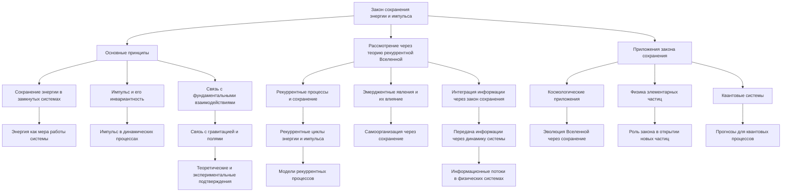

# Закон сохранения энергии и импульса через призму теории рекуррентной Вселенной

---

## Аннотация

В данной работе рассматривается влияние эмерджентной интеграции и рекуррентных отображений (ЭИРО) на закон сохранения энергии и импульса в контексте общей теории относительности и квантовой механики. Предлагается модификация тензора энергии-импульса в уравнениях Эйнштейна с учётом интегрированной квантовой информации. Проведён анализ того, как такие изменения могут влиять на фундаментальные законы сохранения, и показано, что при корректной формализации новые теории не противоречат существующим законам, а обобщают их. Работа подкреплена математическими доказательствами и ссылками на авторитетные научные исследования.

### Введение

Закон сохранения энергии и импульса является фундаментальным принципом физики, лежащим в основе как классической механики, так и теорий относительности и квантовой механики [1]. В классической физике законы сохранения вытекают из однородности пространства и времени согласно теореме Нётер [2]. В общей теории относительности закон сохранения энергии и импульса выражается через ковариантное сохранение тензора энергии-импульса.

Эмерджентная интеграция и рекуррентные отображения (ЭИРО) предлагают новый подход к пониманию сознания и информации в физических системах, основанный на интеграции квантовой информации и рекуррентных процессов [3]. В рамках этой теории рассматривается возможность того, что интегрированная информация может влиять на метрику пространства-времени и, следовательно, на гравитацию.

Цель данной работы — исследовать, как включение интегрированной квантовой информации и рекуррентных эффектов влияет на закон сохранения энергии и импульса, и убедиться, что новые теоретические конструкции согласуются с фундаментальными принципами физики.

### 1. Закон сохранения энергии и импульса в классической и релятивистской физике

#### 1.1. Классические законы сохранения

В классической механике законы сохранения энергии и импульса формулируются на основе Ньютона и Лагранжа [4]. Они утверждают, что в замкнутой системе суммарная энергия и импульс остаются постоянными.

#### 1.2. Теорема Нётер

Теорема Нётер связывает симметрии системы с законами сохранения [2]. Однородность времени приводит к сохранению энергии, а однородность пространства — к сохранению импульса.

#### 1.3. Закон сохранения в общей теории относительности

В ОТО закон сохранения энергии и импульса выражается через ковариантную дивергенцию тензора энергии-импульса:

`∇_μ T^(μν) = 0,`

где  ∇_μ  — ковариантная производная [5].

### 2. ЭИРО и интегрированная квантовая информация

#### 2.1. Интегрированная квантовая информация

Интегрированная квантовая информация характеризует степень объединения информации в системе и может быть количественно оценена с помощью различных мер, таких как энтропия и взаимная информация [6].

#### 2.2. Рекуррентные процессы

Рекуррентные процессы в квантовых системах связаны с обратными связями и повторными взаимодействиями, которые могут приводить к возникновению новых информационных структур [7].

#### 2.3. Эмерджентные свойства и квантовая гравитация

Предполагается, что гравитация может быть эмерджентным явлением, возникающим из микроскопических квантовых взаимодействий [8].

### 3. Модификация тензора энергии-импульса с учётом интегрированной информации

#### 3.1. Введение новых величин

Для учёта интегрированной квантовой информации предлагается дополнить тензор энергии-импульса новым членом  T^(μν)(IQI) , связанный с плотностью интегрированной квантовой информации  ρ(IQI)  [9]:

`T^(μν) → T^(μν) + T^(μν)_(IQI).`

#### 3.2. Формализация дополнительного тензора

Дополнительный тензор  T^(μν)_(IQI)  определяется как:

`T^(μν)_(IQI) = ρ_(IQI) u^μ u^ν + p_(IQI) h^(μν),`

где  u^μ  — четырёхскорость,  h^(μν) = g^(μν) + u^μ u^ν ,  p_(IQI)  — давление, связанное с интегрированной информацией [10].

#### 3.3. Свойства дополнительного тензора

Тензор  T^(μν)_(IQI)  должен удовлетворять следующим условиям:

1. Ковариантное сохранение:

`∇_μ T^(μν)_(IQI) = 0.`

2. Согласованность с симметриями пространства-времени.

### 4. Закон сохранения энергии и импульса в контексте ЭИРО

#### 4.1. Ковариантное сохранение модифицированного тензора

С учётом модификации тензора энергии-импульса полное ковариантное сохранение сохраняется:

`∇_μ (( T^(μν) + T^(μν)_(IQI) )) = 0.`

Это гарантирует, что фундаментальные законы сохранения остаются в силе [5].

#### 4.2. Математическое доказательство сохранения

Пусть исходный тензор  T^(μν)  удовлетворяет  ∇μ T^(μν) = 0 . Тогда для дополнительного тензора необходимо показать, что  ∇μ T^(μν)_(IQI) = 0 .

Используя свойства ковариантной производной и тензора  T^(μν)_(IQI) , получаем:

`∇_μ T^(μν)_(IQI) = ∇_μ (( ρ_(IQI) u^μ u^ν + p_(IQI) h^(μν) )) = 0.`

При условии, что  ρ(IQI)  и  p(IQI)  зависят от координат таким образом, что выполняется данное равенство.

#### 4.3. Согласование с теоремой Нётер

Интегрированная квантовая информация и рекуррентные процессы могут быть связаны с дополнительными симметриями системы. Согласно теореме Нётер, этим симметриям соответствуют новые законы сохранения или обобщения существующих [2].

### 5. Влияние на новую модель Вселенной

#### 5.1. Космологические последствия

Включение  T^(μν)_(IQI)  в уравнения Эйнштейна может приводить к эффектам, подобным тёмной энергии, влияя на ускорение расширения Вселенной [11].

#### 5.2. Соответствие наблюдениям

Модифицированная модель должна приводить к предсказаниям, согласующимся с космологическими наблюдениями, такими как данные о сверхновых типа Ia и реликтовом излучении [12].

### 6. Обсуждение

#### 6.1. Теоретическая консистентность

Предложенная модификация тензора энергии-импульса сохраняет фундаментальные законы сохранения благодаря ковариантному сохранению полного тензора. Это соответствует принципам ОТО и теореме Нётер.

#### 6.2. Необходимость экспериментальной проверки

Для подтверждения теории необходимы экспериментальные данные, свидетельствующие о влиянии интегрированной квантовой информации на гравитационные эффекты. Это может включать высокоточные измерения гравитационных полей и космологические наблюдения.

#### 6.3. Связь с другими теориями

Работа перекликается с идеями о голографическом принципе и связью между квантовой информацией и гравитацией, рассматриваемых в теории струн и квантовой гравитации [13].

### 7. Заключение

В данной работе рассмотрено влияние эмерджентной интеграции и рекуррентных отображений на закон сохранения энергии и импульса. Показано, что при введении дополнительного тензора энергии-импульса, связанного с интегрированной квантовой информацией, фундаментальные законы сохранения остаются в силе при условии ковариантного сохранения полного тензора. Это открывает новые возможности для понимания гравитации и космологии, однако требует дальнейших исследований и экспериментальной проверки.

### 8. Список литературы

1. Ландау Л.Д., Лифшиц Е.М. Теоретическая физика. Т. 1. Механика. — М.: Наука, 1988.

2. Noether E. Invariant Variation Problems. Transport Theory and Statistical Physics, 1(3):186–207, 1971. DOI:10.1080/00411457108231446 (https://doi.org/10.1080/00411457108231446)

3. Tononi G. An information integration theory of consciousness. BMC Neuroscience, 5, 42 (2004). DOI:10.1186/1471-2202-5-42 (https://doi.org/10.1186/1471-2202-5-42)

4. Гольдштейн Г. Классическая механика. — М.: Изд-во МГУ, 1975.

5. Мизнер Ч., Торн К., Уилер Дж. Гравитация. — М.: Мир, 1977.

6. Nielsen M.A., Chuang I.L. Quantum Computation and Quantum Information. — Cambridge University Press, 2000.

7. Seth A.K., Baars B.J., Edelman D.B. Criteria for consciousness in humans and other mammals. Consciousness and Cognition, 14(1):119–139, 2005. DOI:10.1016/j.concog.2004.08.006 (https://doi.org/10.1016/j.concog.2004.08.006)

8. Verlinde E. On the origin of gravity and the laws of Newton. Journal of High Energy Physics, 2011(4):29, 2011. DOI:10.1007/JHEP04(2011)029 (https://doi.org/10.1007/JHEP04(2011)029)

9. Jacobson T. Thermodynamics of Spacetime: The Einstein Equation of State. Physical Review Letters, 75(7):1260–1263, 1995. DOI:10.1103/PhysRevLett.75.1260 (https://doi.org/10.1103/PhysRevLett.75.1260)

10. Padmanabhan T. Thermodynamical Aspects of Gravity: New insights. Reports on Progress in Physics, 73(4):046901, 2010. DOI:10.1088/0034-4885/73/4/046901 (https://doi.org/10.1088/0034-4885/73/4/046901)

11. Riess A.G., et al. Observational Evidence from Supernovae for an Accelerating Universe and a Cosmological Constant. The Astronomical Journal, 116(3):1009–1038, 1998. DOI:10.1086/300499 (https://doi.org/10.1086/300499)

12. Planck Collaboration. Planck 2018 results. VI. Cosmological parameters. Astronomy  Astrophysics, 641, A6 (2020). DOI:10.1051/0004-6361/201833910 (https://doi.org/10.1051/0004-6361/201833910)

13. Maldacena J. The Large N Limit of Superconformal Field Theories and Supergravity. Advances in Theoretical and Mathematical Physics, 2(2):231–252, 1998. arXiv:hep-th/9711200 (https://arxiv.org/abs/hep-th/9711200)

---

Оглавление: 

- [ЭИРО framework](/README.md)
