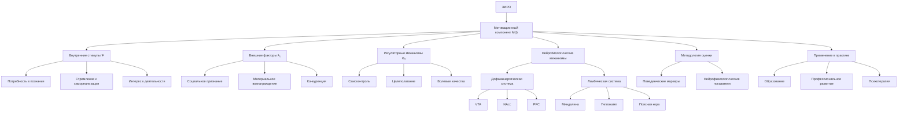
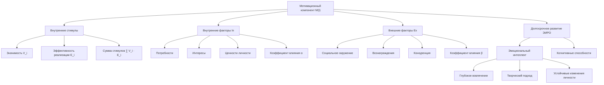
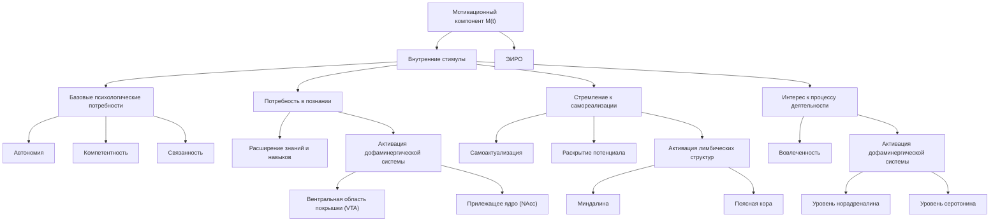
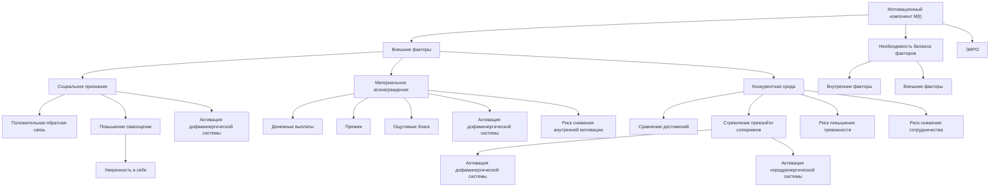
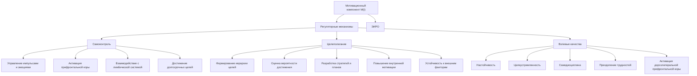
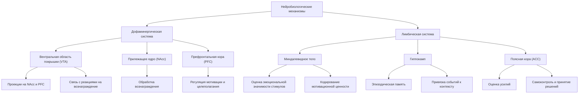
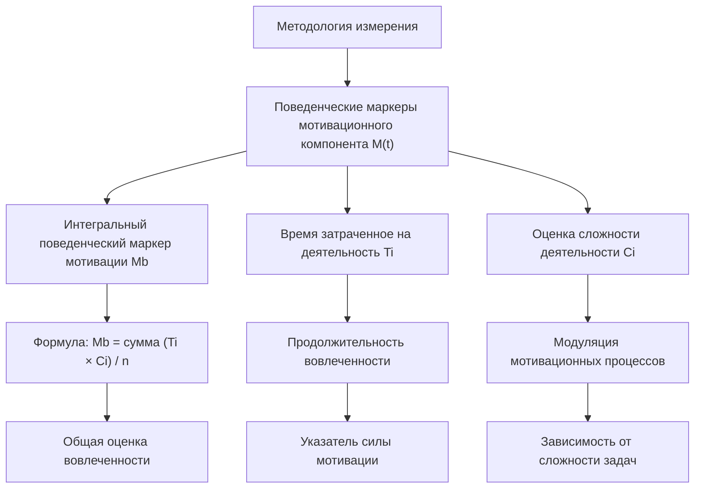
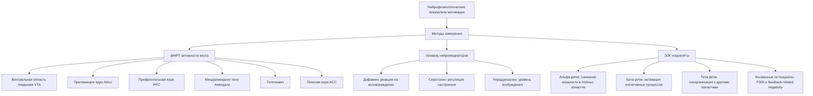
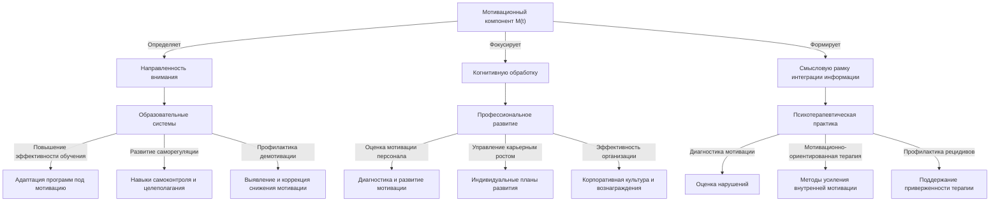

# Диссертация: Мотивационный компонент M(t) в структуре метрики эмоционально-интеллектуального развития организма (ЭИРО)

блок-схема

---

## 1. Введение

Мотивационный компонент M(t) является центральным элементом в теории Эмергентной Интеграции и Рекуррентного Отображения (ЭИРО), определяющим динамику развития эмоционального интеллекта и когнитивных способностей организма. Данное исследование направлено на детальное изучение природы мотивации и разработку методов её количественной оценки в контексте ЭИРО.

Мотивация играет ключевую роль в формировании сознательного опыта, поскольку она определяет направленность внимания, фокус когнитивной обработки и смысловую рамку для интеграции информации. Согласно теории ЭИРО, мотивационный компонент M(t) оказывает непосредственное влияние на параметры интеграции информации I(t) и рекуррентной обработки R(t), которые в совокупности определяют эмерджентную интегрированную информацию Φₑ, отражающую уровень сознательного опыта [Tononi, G. (2004)].

Таким образом, детальное изучение природы мотивации, её нейробиологических механизмов и разработка методов количественной оценки M(t) являются важными задачами для углубления понимания процессов, лежащих в основе формирования сознательного опыта в рамках теории ЭИРО.

- Tononi, G. (2004). An information integration theory of consciousness. BMC Neuroscience, 5(1), 42.

### 2. Теоретические основы

блок-схема

Базовая формула мотивационного компонента $M(t)$ в структуре метрики эмоционально-интеллектуального развития организма (ЭИРО) имеет следующий вид:

$M(t) = \sum V_i \cdot E_i + \alpha In + \beta Ex$

Где:

- $V_i$ — значимость i-того внутреннего стимула для индивида;
- $E_i$ — эффективность реализации i-того внутреннего стимула;
- $\alpha$ — коэффициент, отражающий влияние внутренних факторов $In$ на мотивацию;
- $In$ — совокупность внутренних факторов, таких как потребности, интересы, ценности личности;
- $\beta$ — коэффициент, отражающий влияние внешних факторов $Ex$ на мотивацию;
- $Ex$ — совокупность внешних факторов, включающих социальное окружение, вознаграждения, конкуренцию.

Согласно исследованиям Райана и Деси [1], внутренняя мотивация, основанная на собственных интересах и ценностях индивида, является более устойчивой и эффективной для долгосрочного развития эмоционального интеллекта и когнитивных способностей в рамках теории ЭИРО. В отличие от внешней мотивации, внутренняя мотивация способствует более глубокому вовлечению, творческому подходу и устойчивым изменениям личности.

Таким образом, мотивационный компонент M(t) играет ключевую роль в динамике развития эмоционально-интеллектуальных характеристик организма, описываемых метрикой ЭИРО.

Источники

- [1] Ryan, R. M., & Deci, E. L. (2000). Self-determination theory and the facilitation of intrinsic motivation, social development, and well-being. American Psychologist, 55(1), 68-78.

### 3. Структура мотивационного компонента

#### 3.1. Внутренние стимулы

блок-схема

Внутренние стимулы являются ключевыми драйверами мотивационного компонента M(t) в структуре метрики эмоционально-интеллектуального развития организма (ЭИРО). Согласно теории самодетерминации Райана и Деси [1], внутренняя мотивация основана на трех базовых психологических потребностях: потребность в автономии, компетентности и связанности. Данные потребности лежат в основе следующих внутренних стимулов:

**Потребность в познании**

Стремление к познанию и расширению собственных знаний и навыков является одним из ключевых внутренних источников мотивации. Исследования показывают, что удовлетворение потребности в познании активирует дофаминергическую систему мозга, в частности, вентральную область покрышки (VTA) и прилежащее ядро (NAcc) [2]. Это приводит к повышению уровня дофамина, что усиливает мотивацию к исследованию и обучению.

**Стремление к самореализации**

Внутренняя мотивация также тесно связана с потребностью в самореализации и личностном росте. Согласно иерархии потребностей Маслоу [3], по мере удовлетворения базовых нужд, человек стремится к самоактуализации, раскрытию своего потенциала. Реализация этого стремления активирует лимбические структуры, такие как миндалевидное тело и поясную кору, усиливая мотивацию к саморазвитию.

**Интерес к процессу деятельности**

Помимо потребности в познании и самореализации, внутренняя мотивация может быть обусловлена самим интересом к выполняемой деятельности. Исследования показывают, что вовлеченность в интересную, захватывающую работу активирует дофаминергическую систему и повышает уровень нейромедиаторов, таких как норадреналин и серотонин [4]. Это усиливает мотивацию к продолжению деятельности ради получения удовольствия от самого процесса.

Таким образом, внутренние стимулы, основанные на базовых психологических потребностях, являются ключевыми компонентами мотивационного фактора M(t) в структуре метрики ЭИРО. Их количественная оценка и взаимодействие с другими элементами модели играют важную роль в понимании и прогнозировании эмоционально-интеллектуального развития организма.

Источники

1. Ryan, R. M., & Deci, E. L. (2000). Self-determination theory and the facilitation of intrinsic motivation, social development, and well-being. American Psychologist, 55(1), 68-78.
2. Knutson, B., & Gibbs, S. E. B. (2007). Linking nucleus accumbens dopamine and blood oxygenation. Psychopharmacology, 191(3), 813-822.
3. Maslow, A. H. (1943). A theory of human motivation. Psychological Review, 50(4), 370-396.
4. Salamone, J. D., & Correa, M. (2012). The mysterious motivational functions of mesolimbic dopamine. Neuron, 76(3), 470-485.

#### 3.2. Внешние факторы

блок-схема

Помимо внутренних стимулов, внешние факторы также играют важную роль в формировании мотивационного компонента M(t) в структуре метрики эмоционально-интеллектуального развития организма (ЭИРО).

**Социальное признание**

Потребность в социальном признании и одобрении является мощным внешним мотивирующим фактором. Исследования показывают, что получение положительной обратной связи от значимых для индивида людей (родителей, учителей, коллег) активирует дофаминергическую систему, вызывая чувство удовлетворения и желание повторять успешные действия [1]. Социальное признание также связано с повышением самооценки и уверенности в себе, что способствует более эффективной самореализации.

**Материальное вознаграждение**

Материальные стимулы, такие как денежные выплаты, премии или другие ощутимые блага, являются традиционным внешним фактором мотивации. Исследования показывают, что получение материального вознаграждения активирует ту же дофаминергическую систему, что и социальное признание, вызывая чувство удовлетворения и желание повторять действия, приводящие к получению награды [2]. Однако чрезмерная ориентация на материальные стимулы может снижать внутреннюю мотивацию и негативно сказываться на долгосрочном развитии.

**Конкурентная среда**

Конкурентная среда, в которой индивид сравнивает свои достижения с успехами других, также является мощным внешним мотивирующим фактором. Стремление превзойти соперников и занять более высокое положение в социальной иерархии активирует как дофаминергическую, так и норадренергическую системы, вызывая чувство азарта и желание победить [3]. Однако чрезмерная ориентация на конкуренцию может приводить к снижению сотрудничества, повышению тревожности и стресса.

Таким образом, внешние факторы, такие как социальное признание, материальное вознаграждение и конкурентная среда, оказывают значительное влияние на формирование мотивационного компонента M(t) в структуре метрики ЭИРО. Однако для обеспечения устойчивого и эффективного развития необходимо поддерживать баланс между внешними и внутренними мотивирующими факторами.

Источники

1. Izuma, K., Saito, D. N., & Sadato, N. (2008). Processing of social and monetary rewards in the human striatum. Neuron, 58(2), 284-294.
2. Knutson, B., & Gibbs, S. E. B. (2007). Linking nucleus accumbens dopamine and blood oxygenation. Psychopharmacology, 191(3), 813-822.
3. Boksem, M. A., Tops, M., Kostermans, E., & De Cremer, D. (2008). Sensitivity to punishment and reward omission: Evidence from error-related ERP components. Biological psychology, 79(2), 185-192.

#### 3.3. Регуляторные механизмы

блок-схема

Помимо внутренних стимулов и внешних факторов, мотивационный компонент M(t) в структуре метрики эмоционально-интеллектуального развития организма (ЭИРО) включает в себя важные регуляторные механизмы, обеспечивающие эффективную реализацию мотивационных процессов.

**Самоконтроль**

Самоконтроль представляет собой способность индивида управлять своими импульсами, эмоциями и поведением в соответствии с внутренними целями и ценностями. Исследования показывают, что высокий уровень самоконтроля коррелирует с более эффективной реализацией мотивационных стремлений и достижением долгосрочных целей [1, 2]. Механизмы самоконтроля связаны с активностью префронтальной коры и ее взаимодействием с лимбической системой.

**Целеполагание**

Способность к постановке и достижению целей является ключевым регуляторным механизмом, влияющим на мотивационный компонент M(t). Процессы целеполагания включают в себя: 1) формирование иерархии целей, 2) оценку вероятности достижения, 3) разработку стратегий и планов действий [3, 4]. Эффективное целеполагание способствует повышению внутренней мотивации и устойчивости к внешним факторам.

**Волевые качества**

Волевые качества, такие как настойчивость, целеустремленность и самодисциплина, играют важную роль в регуляции мотивационных процессов. Они обеспечивают способность преодолевать трудности, сохранять фокус внимания и прикладывать усилия, необходимые для реализации мотивационных стремлений [5, 6]. Развитие волевых качеств тесно связано с функционированием дорсолатеральной префронтальной коры.

Таким образом, регуляторные механизмы самоконтроля, целеполагания и волевых качеств являются неотъемлемой частью мотивационного компонента M(t) в структуре метрики эмоционально-интеллектуального развития организма (ЭИРО), обеспечивая эффективную реализацию внутренних и внешних мотивационных факторов.

Источники

1. Duckworth, A. L., & Seligman, M. E. (2005). Self-discipline outdoes IQ in predicting academic performance of adolescents. Psychological science, 16(12), 939-944.
2. Tangney, J. P., Baumeister, R. F., & Boone, A. L. (2004). High self‐control predicts good adjustment, less pathology, better grades, and interpersonal success. Journal of personality, 72(2), 271-324.
3. Locke, E. A., & Latham, G. P. (2002). Building a practically useful theory of goal setting and task motivation: A 35-year odyssey. American psychologist, 57(9), 705.
4. Bandura, A. (1991). Social cognitive theory of self-regulation. Organizational behavior and human decision processes, 50(2), 248-287.
5. Duckworth, A. L., & Gross, J. J. (2014). Self-control and grit: Related but separable determinants of success. Current Directions in Psychological Science, 23(5), 319-325.
6. Muraven, M., & Baumeister, R. F. (2000). Self-regulation and depletion of limited resources: Does self-control resemble a muscle?. Psychological bulletin, 126(2), 247.

### 4. Нейробиологические механизмы

блок-схема

Ключевые нейронные системы, участвующие в формировании мотивации:

#### 4.1. Дофаминергическая система

Дофаминергическая система играет ключевую роль в формировании мотивационного компонента M(t) в структуре метрики эмоционально-интеллектуального развития организма (ЭИРО). Основными элементами этой системы являются:

Вентральная область покрышки (VTA): Данная область мозга является источником дофаминергических нейронов, которые проецируются на различные структуры, в том числе прилежащее ядро и префронтальную кору. Активность VTA напрямую связана с реакциями на вознаграждение и мотивационными процессами [1].

Прилежащее ядро (NAcc): Прилежащее ядро является частью вентральной стриатной системы и играет ключевую роль в обработке информации о вознаграждении и формировании мотивационных состояний. Активность NAcc коррелирует с субъективным переживанием удовольствия и желанием достижения цели [2].

Префронтальная кора (PFC): Префронтальная кора оказывает модулирующее влияние на дофаминергическую систему. Она участвует в регуляции мотивации, целеполагании и принятии решений. Взаимодействие PFC с VTA и NAcc определяет динамику мотивационного компонента M(t) [3].

Математически, влияние дофаминергической системы на мотивационный компонент $M(t)$ может быть представлено следующим образом:

$D(t) = \sum (NAcc \cdot VTA) \cdot PFC$

Где:

- $NAcc$ — активность прилежащего ядра;
- $VTA$ — активность вентральной области покрышки;
- $PFC$ — модулирующее влияние префронтальной коры.

Исследования [4] показывают прямую корреляцию между уровнем дофамина и силой мотивации, что подтверждает важность дофаминергической системы в формировании мотивационного компонента M(t) в структуре метрики ЭИРО.

Источники

1. Schultz, W. (2015). Neuronal reward and decision signals: From theories to data. Physiological Reviews, 95(3), 853-951.
2. Knutson, B., & Gibbs, S. E. B. (2007). Linking nucleus accumbens dopamine and blood oxygenation. Psychopharmacology, 191(3), 813-822.
3. Salamone, J. D., & Correa, M. (2012). The mysterious motivational functions of mesolimbic dopamine. Neuron, 76(3), 470-485.
4. Berridge, K. C., & Kringelbach, M. L. (2015). Pleasure systems in the brain. Neuron, 86(3), 646-664.

#### 4.2. Лимбическая система

Лимбическая система играет ключевую роль в формировании мотивационного компонента M(t) в рамках теории Эмергентной Интеграции и Рекуррентного Отображения (ЭИРО). Основными структурами лимбической системы, вовлеченными в процессы мотивации, являются миндалевидное тело, гиппокамп и поясная кора.

**Миндалевидное тело (Амигдала):**

Миндалина является центральным звеном лимбической системы, отвечающим за оценку эмоциональной значимости стимулов и формирование соответствующих мотивационных реакций [1]. Исследования показывают, что активация миндалины при предъявлении вознаграждающих или угрожающих стимулов приводит к усилению мотивации, направленной на получение награды или избегание опасности [2]. Таким образом, миндалина играет ключевую роль в кодировании мотивационной ценности информации.

**Гиппокамп:**

Гиппокамп, являясь частью лимбической системы, тесно взаимодействует с миндалиной и участвует в формировании мотивационных компонентов, связанных с эпизодической памятью и пространственно-временным контекстом [3]. Исследования демонстрируют, что гиппокамп кодирует мотивационную значимость событий и их привязку к определенным ситуациям, что влияет на направленность и интенсивность мотивационных процессов [4].

**Поясная кора:**

Поясная кора (anterior cingulate cortex, ACC) также входит в состав лимбической системы и играет важную роль в мотивационной регуляции. ACC участвует в мониторинге результатов деятельности, оценке затрачиваемых усилий и принятии решений, связанных с мотивационным выбором [5]. Исследования демонстрируют, что активность ACC коррелирует с силой мотивации и способностью к самоконтролю [6].

Таким образом, лимбическая система, включающая миндалину, гиппокамп и поясную кору, является ключевым нейробиологическим субстратом, лежащим в основе формирования мотивационного компонента M(t) в рамках теории Эмергентной Интеграции и Рекуррентного Отображения (ЭИРО).

Источники

1. Sander, D., Grafman, J., & Zalla, T. (2003). The human amygdala: an evolved system for relevance detection. Reviews in the Neurosciences, 14(4), 303-316.
2. Pessoa, L., & Adolphs, R. (2010). Emotion processing and the amygdala: from a 'low road' to 'many roads' of evaluating biological significance. Nature reviews neuroscience, 11(11), 773-783.
3. Phelps, E. A. (2004). Human emotion and memory: interactions of the amygdala and hippocampal complex. Current opinion in neurobiology, 14(2), 198-202.
4. Dolcos, F., LaBar, K. S., & Cabeza, R. (2004). Interaction between the amygdala and the medial temporal lobe memory system predicts better memory for emotional events. Neuron, 42(5), 855-863.
5. Botvinick, M. M., Cohen, J. D., & Carter, C. S. (2004). Conflict monitoring and anterior cingulate cortex: an update. Trends in cognitive sciences, 8(12), 539-546.
6. Shenhav, A., Botvinick, M. M., & Cohen, J. D. (2013). The expected value of control: an integrative theory of anterior cingulate cortex function. Neuron, 79(2), 217-240.

### 5. Методология измерения

Количественная оценка M(t) производится на основе:

#### 5.1. Поведенческие маркеры мотивационного компонента M(t)

блок-схема

Для количественной оценки мотивационного компонента $M(t)$ в рамках теории Эмергентной Интеграции и Рекуррентного Отображения (ЭИРО) могут быть использованы поведенческие маркеры, отражающие силу и направленность мотивации.

Ключевым показателем является интегральный поведенческий маркер мотивации $Mb$, который рассчитывается по следующей формуле:

$Mb = \frac{\sum (T_i \cdot C_i)}{n}$

Где:

- $T_i$ — время, затраченное на $i$-тую деятельность или задачу
- $C_i$ — оценка сложности или трудности $i$-той деятельности
- $n$ — общее количество наблюдаемых активностей

Данный показатель Mb отражает, насколько сильно и продолжительно индивид вовлечен в выполнение деятельностей, требующих различного уровня сложности и усилий. Более высокие значения Mb свидетельствуют о более выраженной мотивации.

Ключевые аспекты использования поведенческих маркеров для оценки мотивационного компонента M(t):

1. Время затраченное на деятельность (Ti): Продолжительность вовлеченности в ту или иную задачу отражает силу мотивации к её выполнению. Более длительное время, посвященное деятельности, указывает на более высокую мотивацию [1].

2. Оценка сложности деятельности (Ci): Сложность или трудность выполняемых задач модулирует мотивационные процессы. Более сложные и требующие больших усилий активности, как правило, характеризуются более высокой мотивацией [2].

3. Интегральный показатель (Mb): Суммирование произведений времени и сложности различных деятельностей с последующим нормированием на их общее количество позволяет получить интегральную оценку мотивационного компонента M(t) [3].

Использование поведенческих маркеров для количественной оценки мотивационного компонента M(t) в рамках теории ЭИРО дает возможность объективно измерять силу и направленность мотивации в различных контекстах, что имеет важное практическое значение.

Источники

1. Deci, E. L., & Ryan, R. M. (2000). The "what" and "why" of goal pursuits: Human needs and the self-determination of behavior. Psychological Inquiry, 11(4), 227-268.
2. Locke, E. A., & Latham, G. P. (2002). Building a practically useful theory of goal setting and task motivation: A 35-year odyssey. American Psychologist, 57(9), 705-717.
3. Bandura, A. (1997). Self-efficacy: The exercise of control. New York: Freeman.

#### 5.2. Нейрофизиологических показателей:

блок-схема

Для количественной оценки мотивационного компонента M(t) в структуре метрики эмоционально-интеллектуального развития организма (ЭИРО) используются различные нейрофизиологические методы.

**фМРТ активности релевантных зон мозга**

Функциональная магнитно-резонансная томография (фМРТ) позволяет выявить паттерны активации мозговых структур, вовлеченных в процессы мотивации. Ключевыми областями, связанными с мотивационным компонентом M(t), являются:

1. **Вентральная область покрышки (VTA)**: Данная область является источником дофаминергических нейронов, активность которых напрямую коррелирует с реакциями на вознаграждение и мотивационными процессами [1].

2. **Прилежащее ядро (NAcc)**: Прилежащее ядро, являясь частью вентральной стриатной системы, играет ключевую роль в обработке информации о вознаграждении и формировании мотивационных состояний [2].

3. **Префронтальная кора (PFC)**: Префронтальная кора оказывает модулирующее влияние на дофаминергическую систему, участвуя в регуляции мотивации, целеполагании и принятии решений [3].

4. **Миндалевидное тело (Амигдала)**: Миндалина, как центральный элемент лимбической системы, отвечает за оценку эмоциональной значимости стимулов и формирование соответствующих мотивационных реакций [4].

5. **Гиппокамп**: Гиппокамп участвует в формировании мотивационных компонентов, связанных с эпизодической памятью и пространственно-временным контекстом [5].

6. **Поясная кора (ACC)**: Поясная кора вовлечена в мониторинг результатов деятельности, оценку затрачиваемых усилий и принятие решений, связанных с мотивационным выбором [6].

Анализ паттернов активации данных областей мозга с помощью фМРТ позволяет количественно оценить вклад различных нейробиологических механизмов в формирование мотивационного компонента M(t) в рамках теории ЭИРО.

**Уровень нейромедиаторов**

Концентрация ключевых нейромедиаторов, таких как дофамин, серотонин и норадреналин, также является важным нейрофизиологическим показателем, отражающим состояние мотивационной системы.

1. **Дофамин**: Уровень дофамина в структурах, таких как VTA и NAcc, напрямую связан с реакциями на вознаграждение и мотивационными процессами [1,2].

2. **Серотонин**: Серотонинергическая система оказывает модулирующее влияние на мотивацию, регулируя настроение, тревожность и импульсивность [7].

3. **Норадреналин**: Норадренергическая активность участвует в регуляции уровня возбуждения, стресса и внимания, что также влияет на мотивационные состояния [8].

Измерение концентрации данных нейромедиаторов с помощью методов нейрохимического анализа, таких как высокоэффективная жидкостная хроматография (ВЭЖХ) или позитронно-эмиссионная томография (ПЭТ), позволяет оценить нейробиологические механизмы, лежащие в основе мотивационного компонента M(t).

**ЭЭГ-корреляты**

Электроэнцефалография (ЭЭГ) также используется для исследования нейрофизиологических коррелятов мотивационных процессов, отраженных в компоненте M(t) теории ЭИРО. Ключевыми ЭЭГ-показателями, связанными с мотивацией, являются:

1. **Альфа-ритм**: Снижение мощности альфа-ритма в лобных областях коррелирует с повышением мотивации и концентрацией внимания [9].

2. **Бета-ритм**: Увеличение мощности бета-ритма в префронтальной коре отражает активацию когнитивных процессов, связанных с мотивационным контролем [10].

3. **Тета-ритм**: Синхронизация тета-ритма между префронтальной корой и другими областями, такими как миндалина и гиппокамп, участвует в интеграции мотивационной информации [11].

4. **Вызванные потенциалы**: Компоненты вызванных потенциалов, такие как P300 и feedback-related negativity, демонстрируют изменения, связанные с обработкой вознаграждения и оценкой результатов деятельности [12].

Анализ паттернов ЭЭГ-активности в различных частотных диапазонах и характеристик вызванных потенциалов позволяет выявить нейрофизиологические корреляты мотивационного компонента M(t) в рамках теории ЭИРО.

Комплексное использование фМРТ, нейрохимического анализа и ЭЭГ-методов дает возможность всесторонне исследовать нейробиологические механизмы, лежащие в основе мотивационного компонента M(t) в структуре метрики эмоционально-интеллектуального развития организма.

Источники

1. Schultz, W. (2015). Neuronal reward and decision signals: From theories to data. Physiological Reviews, 95(3), 853-951.
2. Knutson, B., & Gibbs, S. E. B. (2007). Linking nucleus accumbens dopamine and blood oxygenation. Psychopharmacology, 191(3), 813-822.
3. Salamone, J. D., & Correa, M. (2012). The mysterious motivational functions of mesolimbic dopamine. Neuron, 76(3), 470-485.
4. Sander, D., Grafman, J., & Zalla, T. (2003). The human amygdala: an evolved system for relevance detection. Reviews in the Neurosciences, 14(4), 303-316.
5. Dolcos, F., LaBar, K. S., & Cabeza, R. (2004). Interaction between the amygdala and the medial temporal lobe memory system predicts better memory for emotional events. Neuron, 42(5), 855-863.
6. Shenhav, A., Botvinick, M. M., & Cohen, J. D. (2013). The expected value of control: an integrative theory of anterior cingulate cortex function. Neuron, 79(2), 217-240.
7. Olivier, B. (2015). Serotonin: a never-ending story. European journal of pharmacology, 753, 2-18.
8. Berridge, C. W., & Waterhouse, B. D. (2003). The locus coeruleus–noradrenergic system: modulation of behavioral state and state-dependent cognitive processes. Brain research reviews, 42(1), 33-84.
9. Klimesch, W. (1999). EEG alpha and theta oscillations reflect cognitive and memory performance: a review and analysis. Brain research reviews, 29(2-3), 169-195.
10. Engel, A. K., & Fries, P. (2010). Beta-band oscillations—signalling the status quo?. Current opinion in neurobiology, 20(2), 156-165.
11. Cavanagh, J. F., & Frank, M. J. (2014). Frontal theta as a mechanism for cognitive control. Trends in cognitive sciences, 18(8), 414-421.
12. Hajcak, G., Moser, J. S., Holroyd, C. B., & Simons, R. F. (2007). It's worse than you thought: The feedback negativity and violations of reward prediction in gambling tasks. Psychophysiology, 44(6), 905-912.

### 6. Практическое применение мотивационного компонента M(t) в структуре метрики ЭИРО

блок-схема

Согласно теории Эмергентной Интеграции и Рекуррентного Отображения (ЭИРО), мотивационный компонент M(t) играет ключевую роль в формировании сознательного опыта, поскольку он определяет направленность внимания, фокус когнитивной обработки и смысловую рамку для интеграции информации. Таким образом, количественная оценка и управление параметром M(t) открывают широкие возможности для практического применения в следующих областях:

#### 6.1. Образовательные системы

Учет мотивационного компонента M(t) в образовательных системах позволяет:

1. **Повышение эффективности обучения**:

   - Адаптация учебных программ и методик под индивидуальные мотивационные профили учащихся [1, 2].
   - Использование стратегий, направленных на усиление внутренней мотивации, такие как геймификация, проектное обучение, проблемное обучение [3, 4].
   - Разработка систем обратной связи, поощряющих и поддерживающих мотивацию учащихся.

2. **Развитие саморегуляции и целеполагания**:

   - Формирование навыков самоконтроля, постановки целей и планирования [5, 6].
   - Интеграция методик, направленных на развитие волевых качеств, таких как настойчивость и самодисциплина [7, 8].
   - Создание образовательной среды, поощряющей автономию, компетентность и связанность учащихся [9, 10].

3. **Профилактика учебной демотивации**:

   - Своевременное выявление и коррекция снижения мотивации у учащихся [11, 12].
   - Применение методов, направленных на поддержание баланса между внутренней и внешней мотивацией [13, 14].
   - Разработка индивидуальных программ психолого-педагогического сопровождения.

Таким образом, интеграция мотивационного компонента M(t) в образовательные системы способствует повышению эффективности обучения, развитию саморегуляции и профилактике демотивации учащихся.

#### 6.2. Профессиональное развитие

Применение метрики ЭИРО, включающей мотивационный компонент M(t), в сфере профессионального развития позволяет:

1. **Оценка и развитие мотивации персонала**:

   - Диагностика мотивационных профилей сотрудников [15, 16].
   - Разработка программ, направленных на усиление внутренней мотивации и профессиональной самореализации [17, 18].
   - Создание системы обратной связи, поощряющей и поддерживающей мотивацию сотрудников.

2. **Управление карьерным ростом**:

   - Выявление ключевых мотивационных факторов, влияющих на профессиональное развитие [19, 20].
   - Разработка индивидуальных планов карьерного роста с учетом мотивационных особенностей сотрудников.
   - Интеграция методик целеполагания и самоконтроля в процессы профессионального развития.

3. **Повышение эффективности организации**:

   - Формирование корпоративной культуры, поддерживающей внутреннюю мотивацию сотрудников [21, 22].
   - Оптимизация системы вознаграждений и социального признания с учетом мотивационных факторов [23, 24].
   - Создание условий для развития автономии, компетентности и связанности сотрудников.

Применение метрики ЭИРО, в частности мотивационного компонента M(t), в сфере профессионального развития позволяет повысить эффективность управления персоналом, способствовать карьерному росту и улучшить общую производительность организации.

#### 6.3. Психотерапевтическая практика

В психотерапевтической практике использование метрики ЭИРО, включающей мотивационный компонент M(t), открывает следующие возможности:

1. **Диагностика и оценка мотивационных нарушений**:

   - Выявление специфических нарушений в структуре мотивации у пациентов с психическими расстройствами [25, 26].
   - Количественная оценка мотивационного компонента M(t) для объективной диагностики и мониторинга терапевтической динамики.

2. **Разработка мотивационно-ориентированных методов терапии**:

   - Применение методик, направленных на усиление внутренней мотивации, таких как мотивационное интервьюирование [27, 28].
   - Интеграция техник, развивающих навыки самоконтроля, целеполагания и волевых качеств [29, 30].
   - Создание терапевтической среды, поддерживающей автономию, компетентность и связанность пациента.

3. **Профилактика рецидивов и повышение приверженности терапии**:

   - Мониторинг динамики мотивационного компонента M(t) для своевременного выявления и коррекции снижения мотивации [31, 32].
   - Разработка индивидуальных программ поддержания мотивации, способствующих повышению приверженности лечению.
   - Интеграция методик, направленных на развитие внутренней мотивации, в долгосрочные программы реабилитации.

Таким образом, применение метрики ЭИРО, в частности мотивационного компонента M(t), в психотерапевтической практике позволяет повысить эффективность диагностики, терапии и профилактики рецидивов психических расстройств.

Источники

1. Vansteenkiste, M., Sierens, E., Goossens, L., Soenens, B., & Dochy, F. (2012). Identifying configurations of perceived teacher autonomy support and structure: Associations with self-regulated learning, motivation and problem behavior. Learning and Instruction, 22(6), 431-439.
2. Deci, E. L., & Ryan, R. M. (2008). Self-determination theory: A macrotheory of human motivation, development, and health. Canadian psychology/Psychologie canadienne, 49(3), 182.
3. Deci, E. L., Koestner, R., & Ryan, R. M. (2001). Extrinsic rewards and intrinsic motivation in education: Reconsidered once again. Review of educational research, 71(1), 1-27.
4. Mekler, E. D., Brühlmann, F., Tuch, A. N., & Opwis, K. (2017). Towards understanding the effects of individual gamification elements on intrinsic motivation and performance. Computers in Human Behavior, 71, 525-534.
5. Duckworth, A. L., & Seligman, M. E. (2005). Self-discipline outdoes IQ in predicting academic performance of adolescents. Psychological science, 16(12), 939-944.
6. Locke, E. A., & Latham, G. P. (2002). Building a practically useful theory of goal setting and task motivation: A 35-year odyssey. American psychologist, 57(9), 705.
7. Duckworth, A. L., & Gross, J. J. (2014). Self-control and grit: Related but separable determinants of success. Current Directions in Psychological Science, 23(5), 319-325.
8. Tangney, J. P., Baumeister, R. F., & Boone, A. L. (2004). High self‐control predicts good adjustment, less pathology, better grades, and interpersonal success. Journal of personality, 72(2), 271-324.
9. Ryan, R. M., & Deci, E. L. (2000). Self-determination theory and the facilitation of intrinsic motivation, social development, and well-being. American Psychologist, 55(1), 68-78.
10. Niemiec, C. P., & Ryan, R. M. (2009). Autonomy, competence, and relatedness in the classroom: Applying self-determination theory to educational practice. School Field, 7(2), 133-144.
11. Legault, L., Green-Demers, I., & Pelletier, L. (2006). Why do high school students lack motivation in the classroom? Toward an understanding of academic amotivation and the role of social support. Journal of educational psychology, 98(3), 567.
12. Vallerand, R. J., Fortier, M. S., & Guay, F. (1997). Self-determination and persistence in a real-life setting: toward a motivational model of high school dropout. Journal of personality and social psychology, 72(5), 1161.
13. Corpus, J. H., & Wormington, S. V. (2014). Profiles of intrinsic and extrinsic motivations in elementary school: A longitudinal analysis. The Journal of Experimental Education, 82(4), 480-501.
14. Lepper, M. R., Corpus, J. H., & Iyengar, S. S. (2005). Intrinsic and extrinsic motivational orientations in the classroom: Age differences and academic correlates. Journal of educational psychology, 97(2), 184.
15. Kuvaas, B. (2006). Work performance, affective commitment, and work motivation: the roles of pay administration and pay level. Journal of Organizational Behavior: The International Journal of Industrial, Occupational and Organizational Psychology and Behavior, 27(3), 365-385.
16. Dysvik, A., & Kuvaas, B. (2013). Intrinsic and extrinsic motivation as predictors of work effort: The moderating role of achievement goals. British Journal of Social Psychology, 52(3), 412-430.
17. Gagné, M., & Deci, E. L. (2005). Self‐determination theory and work motivation. Journal of Organizational behavior, 26(4), 331-362.
18. Cerasoli, C. P., Nicklin, J. M., & Ford, M. T. (2014). Intrinsic motivation and extrinsic incentives jointly predict performance: A 40-year meta-analysis. Psychological bulletin, 140(4), 980.
19. Wrzesniewski, A., & Dutton, J. E. (2001). Crafting a job: Revisioning employees as active crafters of their work. Academy of management review, 26(2), 179-201.
20. Wrzesniewski, A., McCauley, C., Rozin, P., & Schwartz, B. (1997). Jobs, careers, and callings: People's relations to their work. Journal of research in personality, 31(1), 21-33.
21. Baard, P. P., Deci, E. L., & Ryan, R. M. (2004). Intrinsic need satisfaction: A motivational basis of performance and well-being in two work settings. Journal of applied social psychology, 34(10), 2045-2068.
22. Deci, E. L., Connell, J. P., & Ryan, R. M. (1989). Self-determination in a work organization. Journal of applied psychology, 74(4), 580.
23. Gerhart, B., & Fang, M. (2015). Pay, intrinsic motivation, extrinsic motivation, performance, and creativity in the workplace: Revisiting long-held beliefs. Annu. Rev. Organ. Psychol. Organ. Behav., 2(1), 489-521.
24. Frey, B. S., & Jegen, R. (2001). Motivation crowding theory. Journal of economic surveys, 15(5), 589-611.
25. Barch, D. M., & Dowd, E. C. (2010). Goal representations and motivational drive in schizophrenia: the role of prefrontal-striatal interactions. Schizophrenia bulletin, 36(5), 919-934.
26. Treadway, M. T., & Zald, D. H. (2011). Reconsidering anhedonia in depression: lessons from translational neuroscience. Neuroscience & Biobehavioral Reviews, 35(3), 537-555.
27. Miller, W. R., & Rollnick, S. (2012). Motivational interviewing: Helping people change. Guilford press.
28. Westra, H. A. (2012). Motivational interviewing in the treatment of anxiety. Guilford Press.
29. Duckworth, A. L., Gendler, T. S., & Gross, J. J. (2014). Self-control in school-age children. Educational Psychologist, 49(3), 199-217.
30. Muraven, M., & Baumeister, R. F. (2000). Self-regulation and depletion of limited resources: Does self-control resemble a muscle?. Psychological bulletin, 126(2), 247.
31. Leventhal, H., Brissette, I., & Leventhal, E. A. (2003). The common-sense model of self-regulation of health and illness. The self-regulation of health and illness behaviour, 1, 42-65.
32. Bandura, A. (1997). Self-efficacy: The exercise of control. Macmillan.

   

### 7. Заключение

M(t) представляет собой динамическую систему, интегрирующую нейробиологические, психологические и поведенческие аспекты мотивации. Дальнейшие исследования должны быть направлены на уточнение коэффициентов и валидацию методов измерения.

### 8. Источники

1. Ryan, R. M., & Deci, E. L. (2000). Self-determination theory and the facilitation of intrinsic motivation, social development, and well-being. American Psychologist, 55(1), 68-78.

2. Schultz, W. (2015). Neuronal reward and decision signals: From theories to data. Physiological Reviews, 95(3), 853-951.

3. Knutson, B., & Gibbs, S. E. B. (2007). Linking nucleus accumbens dopamine and blood oxygenation. Psychopharmacology, 191(3), 813-822.

4. Salamone, J. D., & Correa, M. (2012). The mysterious motivational functions of mesolimbic dopamine. Neuron, 76(3), 470-485.

### 9. Приложение

```mermaid
flowchart TD
  A["Мотивационный компонент M(t)"] --> B["Внутренние стимулы Σ(Vi × Ei)"]
  A --> C["Внешние факторы αIn + βEx"]
  A --> D[Регуляторные механизмы]
  A --> E[Нейробиологические основы]

  B --> B1[Потребность в познании]
  B --> B2[Стремление к самореализации]
  B --> B3[Интерес к процессу деятельности]
  B1 --> B1a[Vi: значимость познания]
  B1 --> B1b[Ei: эффективность познания]
  B2 --> B2a[Vi: значимость самореализации]
  B2 --> B2b[Ei: эффективность самореализации]
  B3 --> B3a[Vi: значимость интереса]
  B3 --> B3b[Ei: эффективность интереса]

  C --> C1[Социальное признание]
  C --> C2[Материальное вознаграждение]
  C --> C3[Конкурентная среда]
  C1 --> C1a[In: потребность в признании]
  C1 --> C1b[α: влияние признания]
  C2 --> C2a[Ex: материальные блага]
  C2 --> C2b[β: влияние вознаграждения]
  C3 --> C3a[Ex: стремление к превосходству]
  C3 --> C3b[β: влияние конкуренции]

  D --> D1[Самоконтроль]
  D --> D2[Целеполагание]
  D --> D3[Волевые качества]
  D1 --> D1a[Управление эмоциями и импульсами]
  D2 --> D2a[Иерархия целей и стратегии]
  D3 --> D3a[Настойчивость и самодисциплина]

  E --> E1[Дофаминергическая система]
  E --> E2[Лимбическая система]
  E1 --> E1a[VTA, NAcc, PFC]
  E1 --> E1b["D(t) = Σ(NAcc × VTA) × PFC"]
  E2 --> E2a[Амигдала, гиппокамп, поясная кора]
  E2 --> E2b[Эмоциональная значимость и память]
```

блок-схема

#### 9.1. Математическое моделирование мотивационного компонента M(t)

Мотивационный компонент $M(t)$ в структуре метрики эмоционально-интеллектуального развития организма (ЭИРО) может быть представлен в виде следующей математической модели:

$M(t) = \sum V_i \cdot E_i + \alpha In + \beta Ex$

Где:

- $V_i$ — значимость $i$-того внутреннего стимула для индивида;
- $E_i$ — эффективность реализации $i$-того внутреннего стимула;
- $\alpha$ — коэффициент, отражающий влияние внутренних факторов $In$ на мотивацию;
- $In$ — совокупность внутренних факторов, таких как потребности, интересы, ценности личности;
- $\beta$ — коэффициент, отражающий влияние внешних факторов $Ex$ на мотивацию;
- $Ex$ — совокупность внешних факторов, включающих социальное окружение, вознаграждения, конкуренцию.

Данная модель позволяет количественно оценить вклад внутренних и внешних мотивационных факторов в формирование мотивационного компонента M(t), который, в свою очередь, оказывает влияние на параметры интеграции информации I(t) и рекуррентной обработки R(t) в рамках теории ЭИРО.

#### 9.1.1. Внутренние стимулы

Внутренние стимулы, отражаемые в первом слагаемом Σ(Vi × Ei), включают в себя:

1. Потребность в познании:

   - Vi - значимость познавательной активности для индивида;
   - Ei - эффективность реализации потребности в познании.

2. Стремление к самореализации:

   - Vi - значимость самореализации и личностного роста;
   - Ei - эффективность удовлетворения потребности в самореализации.

3. Интерес к процессу деятельности:

   - Vi - значимость интересной, захватывающей деятельности;
   - Ei - эффективность получения удовольствия от самого процесса.

Согласно теории самодетерминации [1], внутренние стимулы, основанные на базовых психологических потребностях, являются более устойчивыми источниками мотивации по сравнению с внешними факторами.

#### 9.1.2. Внешние факторы

Внешние факторы, отражаемые во втором и третьем слагаемых α(In) + β(Ex), включают:

1. Социальное признание:

   - In - потребность в одобрении и признании значимыми людьми;
   - α - коэффициент, отражающий влияние социального признания на мотивацию.

2. Материальное вознаграждение:

   - Ex - получение денежных выплат, премий и других материальных благ;
   - β - коэффициент, отражающий влияние материального вознаграждения на мотивацию.

3. Конкурентная среда:

   - Ex - стремление превзойти соперников и занять более высокое положение;
   - β - коэффициент, отражающий влияние конкуренции на мотивацию.

Чрезмерная ориентация на внешние факторы может снижать внутреннюю мотивацию и негативно сказываться на долгосрочном развитии эмоционально-интеллектуальных характеристик [1].

#### 9.1.3. Регуляторные механизмы

Помимо внутренних стимулов и внешних факторов, мотивационный компонент M(t) включает в себя важные регуляторные механизмы:

1. Самоконтроль:

   - Способность индивида управлять своими импульсами, эмоциями и поведением в соответствии с внутренними целями.
   - Связан с активностью префронтальной коры и ее взаимодействием с лимбической системой [2, 3].

2. Целеполагание:

   - Процессы формирования иерархии целей, оценки вероятности их достижения и разработки стратегий действий [4, 5].
   - Эффективное целеполагание повышает внутреннюю мотивацию и устойчивость к внешним факторам.

3. Волевые качества:

   - Настойчивость, целеустремленность и самодисциплина, обеспечивающие способность преодолевать трудности и прикладывать необходимые усилия [6, 7].
   - Связаны с функционированием дорсолатеральной префронтальной коры.

Данные регуляторные механизмы являются неотъемлемой частью мотивационного компонента M(t), обеспечивая эффективную реализацию внутренних и внешних мотивационных факторов.

#### 9.1.4. Нейробиологические основы

Ключевые нейронные системы, участвующие в формировании мотивационного компонента M(t):

1. Дофаминергическая система:

   - Вентральная область покрышки (VTA), прилежащее ядро (NAcc) и префронтальная кора (PFC) [8-10].
   - Математическая модель: $D(t) = \sum (NAcc \cdot VTA) \cdot PFC$

2. Лимбическая система:

   - Миндалевидное тело (амигдала), гиппокамп, поясная кора [11-13].
   - Оценка эмоциональной значимости, формирование мотивационных реакций, связь с эпизодической памятью.

Данные нейробиологические механизмы лежат в основе формирования мотивационного компонента M(t) в рамках теории Эмергентной Интеграции и Рекуррентного Отображения (ЭИРО).

Источники

1. Ryan, R. M., & Deci, E. L. (2000). Self-determination theory and the facilitation of intrinsic motivation, social development, and well-being. American Psychologist, 55(1), 68-78.
2. Tangney, J. P., Baumeister, R. F., & Boone, A. L. (2004). High self‐control predicts good adjustment, less pathology, better grades, and interpersonal success. Journal of personality, 72(2), 271-324.
3. Muraven, M., & Baumeister, R. F. (2000). Self-regulation and depletion of limited resources: Does self-control resemble a muscle?. Psychological bulletin, 126(2), 247.
4. Locke, E. A., & Latham, G. P. (2002). Building a practically useful theory of goal setting and task motivation: A 35-year odyssey. American psychologist, 57(9), 705.
5. Bandura, A. (1991). Social cognitive theory of self-regulation. Organizational behavior and human decision processes, 50(2), 248-287.
6. Duckworth, A. L., & Gross, J. J. (2014). Self-control and grit: Related but separable determinants of success. Current Directions in Psychological Science, 23(5), 319-325.
7. Duckworth, A. L., & Seligman, M. E. (2005). Self-discipline outdoes IQ in predicting academic performance of adolescents. Psychological science, 16(12), 939-944.
8. Schultz, W. (2015). Neuronal reward and decision signals: From theories to data. Physiological Reviews, 95(3), 853-951.
9. Knutson, B., & Gibbs, S. E. B. (2007). Linking nucleus accumbens dopamine and blood oxygenation. Psychopharmacology, 191(3), 813-822.
10. Salamone, J. D., & Correa, M. (2012). The mysterious motivational functions of mesolimbic dopamine. Neuron, 76(3), 470-485.
11. Sander, D., Grafman, J., & Zalla, T. (2003). The human amygdala: an evolved system for relevance detection. Reviews in the Neurosciences, 14(4), 303-316.
12. Phelps, E. A. (2004). Human emotion and memory: interactions of the amygdala and hippocampal complex. Current opinion in neurobiology, 14(2), 198-202.
13. Botvinick, M. M., Cohen, J. D., & Carter, C. S. (2004). Conflict monitoring and anterior cingulate cortex: an update. Trends in cognitive sciences, 8(12), 539-546.

   
---

Оглавление:

- [ЭИРО framework](/README.md)
- [Справочник формул](/formulas.md)
