# Происхождение хиральности в биологических системах

```mermaid
graph TD
    A[Происхождение хиральности в биологических системах] --> B[Хиральность: фундаментальное свойство]
    B --> B1[Энантиомеры: зеркальные несоответствия]
    B --> B2[Гомохиральность в природе]
    B2 --> B2a[L-аминокислоты и D-сахара]
    B2 --> B2b[Загадка рацемических смесей]

    A --> C[Автокаталитические процессы]
    C --> C1[Автокатализ: положительная обратная связь]
    C1 --> C1a[Рекуррентные автокаталитические циклы]
    C1a --> C1b[Преобладание энантиомера]
    C1b --> C1c[Доминирование одного энантиомера]
    C1 --> C2[Пример: реакция Сойя]

    A --> D[Квантовые аспекты хиральности]
    D --> D1[Квантово-механическая стабилизация]
    D1 --> D1a[Энергетические различия энантиомеров]
    D1 --> D1b[Влияние асимметричных полей]
    D --> D2[Внешние воздействия]
    D2 --> D2a[Круговой поляризованный свет]
    D2 --> D2b[Хиральные поверхности минералов]

    A --> E[Эмерджентное возникновение гомохиральности]
    E --> E1[Начальная асимметрия]
    E1 --> E1a[Случайные флуктуации]
    E1 --> E1b[Влияние планетарных факторов]
    E --> E2[Усиление через автокатализ]
    E2 --> E2a[Параметр рекуррентности R]
    E2 --> E2b[Цикличность реакций]
    E --> E3[Стабилизация энантиомеров]
    E3 --> E3a[Роль ρIQI в стабильности]
    E3 --> E3b[Селективность реакций]
    E --> E4[Переход к гомохиральности]
    E4 --> E4a[Доминантное состояние]
    E4 --> E4b[Устойчивость системы]

    A --> F[Применение в науке и технологиях]
    F --> F1[Пребиотические процессы]
    F1 --> F1a[Накопление L-аминокислот и D-сахаров]
    F --> F2[Разработка лекарств]
    F --> F3[Астрохимия и поиск жизни]
```

---

## 1. Введение

Хиральность — это фундаментальное свойство некоторых объектов, заключающееся в том, что они не совпадают со своим зеркальным отражением. В химическом контексте это означает, что молекула и ее зеркальное отражение (энантиомеры) не могут быть наложены друг на друга посредством вращений и перемещений в пространстве.

В биологическом мире хиральность имеет критическое значение. Так, аминокислоты, из которых построены белки, существуют почти исключительно в L-форме, тогда как сахара, входящие в состав ДНК и РНК, представлены в D-форме. Это явление, известное как гомохиральность, является одной из величайших загадок происхождения жизни. Ведь в абиотических условиях (то есть вне живых организмов) химические реакции обычно приводят к образованию рацемических смесей — равного количества обоих энантиомеров.

Теория Эмерджентной Интеграции и Рекуррентного Отображения (ЭИРО) предлагает новое объяснение этого феномена, связывая его с процессами эмерджентности (появления новых свойств системы, не присущих её отдельным элементам) и рекуррентности (повторяющихся процессов).

### 2. Рекуррентные автокаталитические циклы

Автокатализ — это процесс, при котором продукт реакции ускоряет или катализирует своё собственное образование. В контексте хиральности это означает, что один из энантиомеров может способствовать синтезу большего количества самого себя, создавая положительную обратную связь.

Рекуррентные автокаталитические циклы представляют собой повторяющиеся процессы, в которых автокатализ происходит циклически. Если в системе изначально присутствует небольшое преобладание одного энантиомера (например, из-за случайных флуктуаций или внешнего воздействия), автокаталитический цикл будет усиливать это преобладание. С течением времени система может перейти в состояние, где один энантиомер полностью доминирует.

Параметр рекуррентности ( R ) количественно описывает степень цикличности реакций в системе:

R = Количество рекуррентных циклов / Общее количество реакци}

Высокое значение  R  указывает на то, что в системе преобладают циклические автокаталитические процессы. Это способствует усилению даже незначительной начальной асимметрии, ведя систему к гомохиральности.

**Пример автокаталитической реакции**:

Одним из наиболее известных примеров является реакция Сойэра (Soai reaction), в которой небольшое количество одного энантиомера аллилового спирта катализирует образование большего количества того же энантиомера с высокой энантиоселективностью.

### 3. Квантово-механические аспекты и хиральность

На уровне фундаментальных взаимодействий энантиомеры имеют одинаковую энергию в симметричной среде. Однако внешние воздействия, такие как поляризованный свет, магнитные поля или взаимодействие с хиральными поверхностями, могут приводить к небольшим энергетическим различиям между ними.

#### 3.1. Квантово-механическая стабилизация:

Энергетическое состояние молекулы можно описать с помощью волновой функции  ψ  и гамильтониана  ^H:

`E = ∫_V ψ^* ^H \psidV`

где:

-  E  — энергия молекулы;

-  ψ  — волновая функция, описывающая состояние молекулы;

-  ^H  — гамильтониан, оператор полной энергии системы;

-  V  — объем, занимаемый молекулой.

В присутствии асимметричного внешнего поля (например, кругового поляризованного света) интеграл для разных энантиомеров может давать слегка отличающиеся значения энергии. Это энергетическое различие может приводить к тому, что один из энантиомеров становится более стабильным или реакционно способным.

#### 3.2. Взаимодействие с внешними полями:

- **Круговой поляризованный свет**: Может разлагать один из энантиомеров быстрее, чем другой, изменяя их относительные концентрации.

- **Хиральные поверхности минералов**: В природных условиях молекулы могут адсорбироваться на кристаллических поверхностях, обладающих хиральностью, что приводит к селективному накоплению одного из энантиомеров.

### 4. Эмерджентное возникновение гомохиральности

Совокупное воздействие автокаталитических процессов и квантово-механических эффектов может объяснить эмерджентное появление гомохиральности в биологических системах. Этот процесс можно разделить на несколько этапов:

1. **Начальная асимметрия**:

   - Случайные флуктуации: В любой системе возможны небольшие статистические отклонения от равновесия.

   - Внешние воздействия: Планетарные факторы, такие как поляризованное излучение, космические лучи или влияние хиральных минералов, могут создавать начальное преобладание одного энантиомера.

2. **Усиление через автокаталитические циклы**:

   - Положительная обратная связь: Преобладающий энантиомер ускоряет образование большего количества самого себя.

   - Рекуррентность: Циклический характер реакций обеспечивает повторяющееся усиление асимметрии.

3. **Квантово-механическая стабилизация**:

   - Различия в энергетических уровнях: Влияние внешних полей может сделать один из энантиомеров энергетически более выгодным.

   - Селективность реакций: Повышенная реакционная способность преобладающего энантиомера способствует его накоплению.

4. **Переход к гомохиральности**:

   - Доминантное состояние: Система достигает состояния, в котором один энантиомер практически полностью вытесняет другой.

   - Стабилизация: Достигнув гомохиральности, система становится устойчивой к небольшим флуктуациям, сохраняет и передает свои свойства.

**Применение в происхождении жизни**:

- **Пребиотические процессы**: На ранних этапах формирования жизни подобные механизмы могли способствовать накоплению L-аминокислот и D-сахаров.

- **Передача хиральности**: Когда гомохиральные молекулы стали участвовать в биологических процессах, они закрепили односторонность хиральности в живых системах.

**Экспериментальные подтверждения**:

- **Реакция Сойэра**: Демонстрирует возможность автокаталитического усиления хиральности.

- **Астрохимические наблюдения**: Обнаружение органических молекул с преобладанием одного энантиомера в космических объектах указывает на действующие в природе механизмы хиральной селекции.

### 5. Заключение

Теория Эмерджентной Интеграции и Рекуррентного Отображения (ЭИРО) объединяет автокаталитические процессы и квантово-механические эффекты для объяснения возникновения гомохиральности в биологических системах. Это демонстрирует, как сложные свойства могут эмерджентно возникать из взаимодействия более простых процессов и факторов.

Понимание этих механизмов не только проливает свет на одну из фундаментальных загадок биологии, но и может иметь практическое значение:

- **Синтез хиральных соединений**: Управление автокаталитическими процессами может позволить получать чистые энантиомеры в промышленности.

- **Фармацевтика**: Понимание хиральности критично для разработки безопасных и эффективных лекарственных препаратов, так как разные энантиомеры могут иметь различное действие на организм.

- **Астрохимия и поиск жизни**: Изучение хиральности в космических объектах может дать подсказки о распространенности жизни во Вселенной.

> Итог: Эмерджентные свойства, возникающие из взаимодействия автокатализа и квантовых эффектов, способны объяснить, как в пребиотических условиях могла возникнуть гомохиральность — ключевое свойство биологических молекул. Это демонстрирует силу комплексного подхода в понимании фундаментальных процессов, лежащих в основе жизни.

---

Оглавление: 
- [Поиск новых теорий в химии](/new-theories-in-chemistry.md)
- [ЭИРО framework](/README.md)
